# Lec 12: Related Rates

📊 **Progress:** `24` Notes | `25` Screenshots

---

<kbd>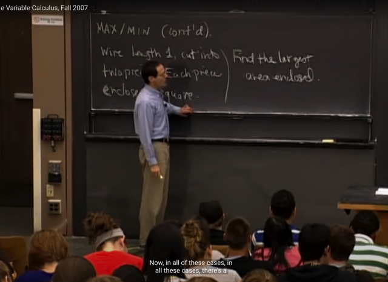</kbd>

> [!NOTE]
> Ta sẽ tiếp tục với Max / Min. Bài toán là, cho đoạn dây chiều dài
> 1. Cắt thành 2 phần, làm thành 2 hình vuông. Câu hỏi là tìm
> diện tích lớn nhất có thể tạo ra được bởi hai hình vuông đó.

 

<kbd>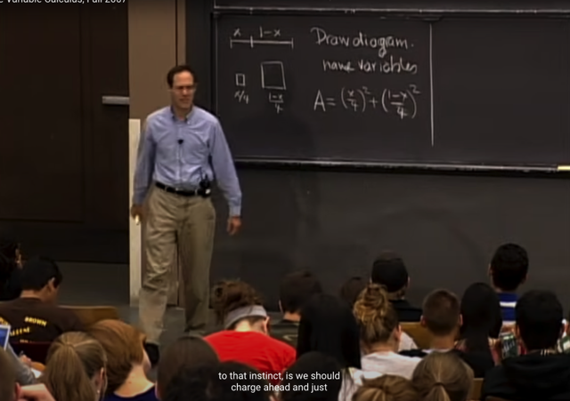</kbd>

> [!NOTE]
> Thế thì gọi hai đoạn là x, và 1-x, ta sẽ thiết lập diện tích của
> hai hình vuông như sau A = (x/4)^2 + [(1-x)/4]^2

 

<kbd>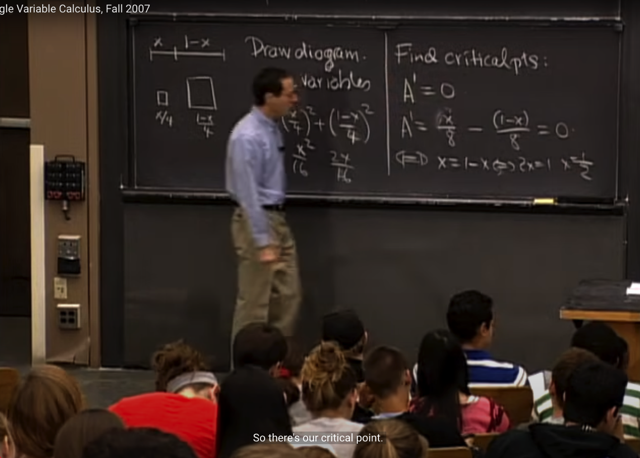</kbd>

> [!NOTE]
> Thế thì, solve A' = 0 ta có
> x=1/2 là critical point.

 

<kbd>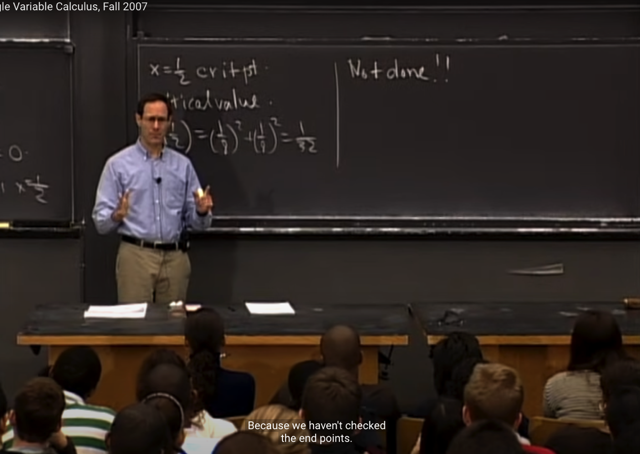</kbd>

> [!NOTE]
> Từ đó thế vào ta có critical point value là 1/32. Tuy nhiên gs cho rằng
> ta chưa xong, vì như đã nói, ta còn cần phải check các endpoint cũng
> như discontinuity point
>
> (vài suy nghĩ, đương nhiên từ 1802 ta biết critical point không chắc là
> max, min thậm chí có thể là critical point nữa. Muốn biết ta sẽ phải
> check bằng second derivative test. Thì đối với hàm đơn biến ở lớp này
> chắc gs cũng sẽ nói)

 

<kbd>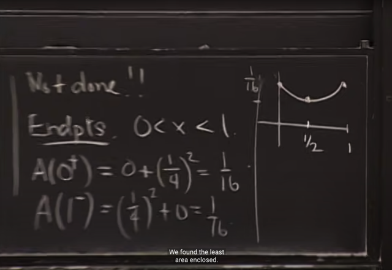</kbd>

> [!NOTE]
> Bằng cách check thêm giá trị hàm A tại các endpoint, ta thấy:
>
> A(0+) = 1/16 và A(1-) = 1/16 cho thấy thật ra critical point có thể là
> minimum chứ không phải maximum của Area mà ta đang muốn

 

<kbd>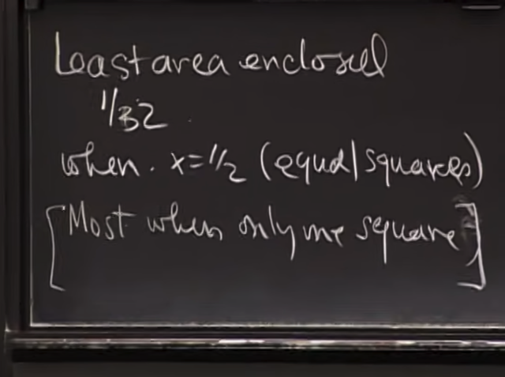</kbd>

 

<kbd>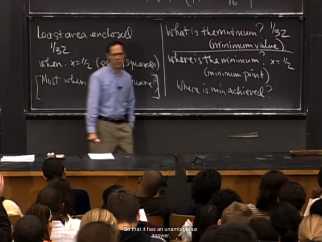</kbd>

> [!NOTE]
> Như vậy maximum của A là 1/16, và minimum value là 1/32.
> Và gs lưu ý rằng, x=1/2 là nơi mà minimum achieved (nơi
> function đạt minimum value), nên hỏi minimum ở đâu thì trả
> lời là tại 1/2 nhưng minimum value bằng bao nhiêu thì đương
> nhiên phải là 1/16

 

<kbd>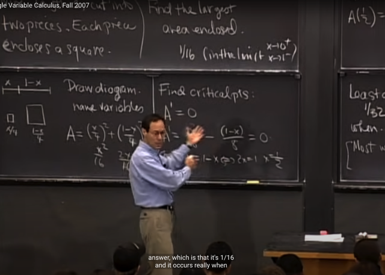</kbd>

> [!NOTE]
> Đại khái là, gs cho rằng câu hỏi đặt ra khi hỏi diện tích lớn nhất
> enclosed, là một trick question (tạm hiểu là câu hỏi cũng không
> dễ trả lời) và theo ông ta sẽ trả lời là 1/16, dù rằng đây đương
> nhiên là giá trị tại limit
>
> (1/16 là limit của A(x) khi x->0+ hoặc x->1-)

 

<kbd>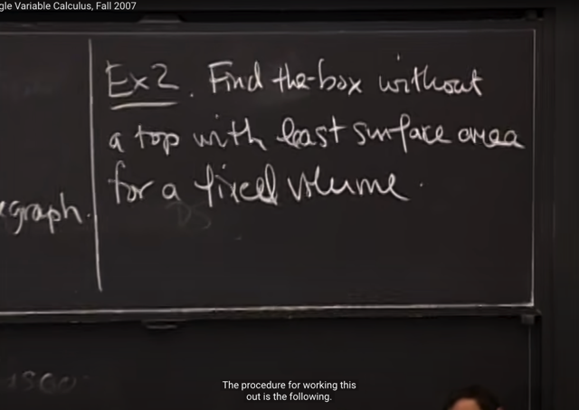</kbd>

> [!NOTE]
> Ví dụ thứ hai, câu hỏi là tìm cái hộp có đáy vuông (ý là tìm kích
> thước của nó) không có nắp, sao cho diện tích bề mặt ít nhất với
> thể tích cho trước

 

<kbd>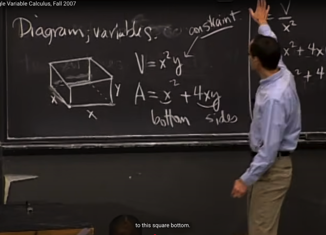</kbd>

> [!NOTE]
> gọi x là chiều dài cạnh đáy và y là chiều cao. Thể
> tích V cho trước là x^2y và A = x^2 + 4xy
>
> Vì V fixed, nên ta có thể solve y theo x

 

<kbd>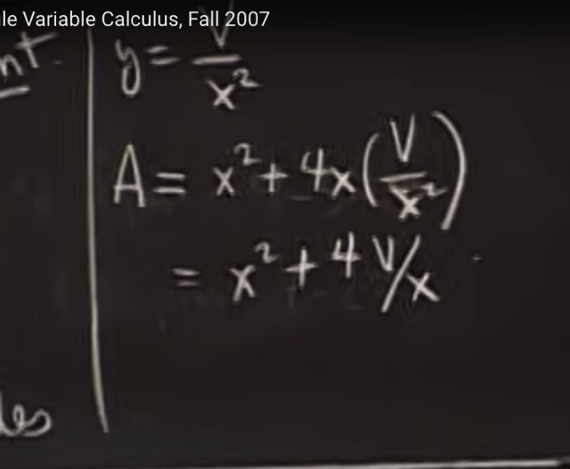</kbd>

> [!NOTE]
> Để có y = V / x^2 và A trở thành
> function theo x: x^2 + 4v/x

 

<kbd>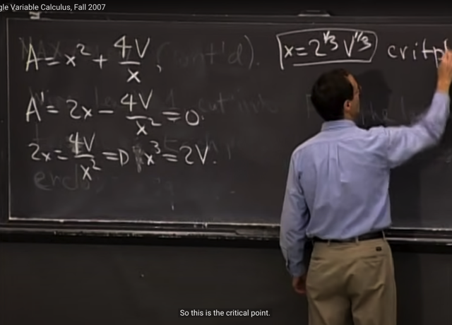</kbd>

> [!NOTE]
> Từ đó, tìm A' và giải A' = 0 ta có
> critical point là x = (2V)^1/3

 

<kbd>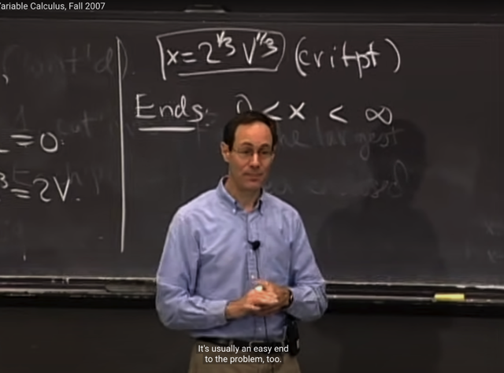</kbd>

> [!NOTE]
> Đại khái là, ta sẽ xem range của x là gì. Thì x sẽ lớn hơn 0 (vì
> nếu bằng 0, V sẽ bằng 0) và x có thể lớn đến vô cùng.
>
> Gs cho rằng khi ta gặp bài toán mà không có giới hạn trên cụ
> thể nào thì giới hạn trên sẽ thường là infinity.

 

<kbd>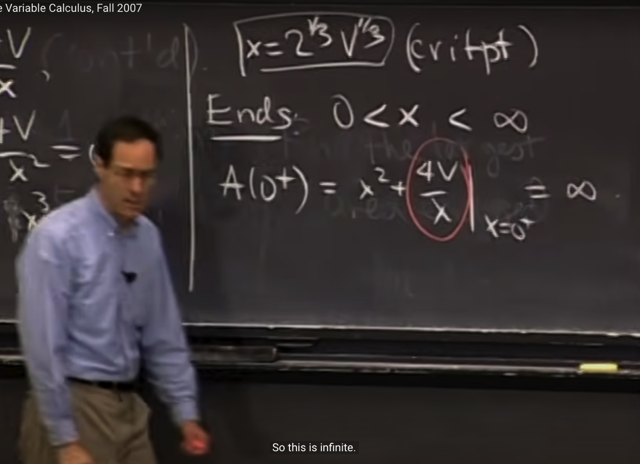</kbd>

> [!NOTE]
> Ta sẽ check value của nó tại end points:
>
> A(0+), tức là limit của A(x) khi x -> 0+, bằng cách thế 0+
> vào x^2 + 4V/x thì (0+)^2 = 0, 4V/(0+) = infinity, nên kết quả
> là 0 + infinity = infinity

 

<kbd>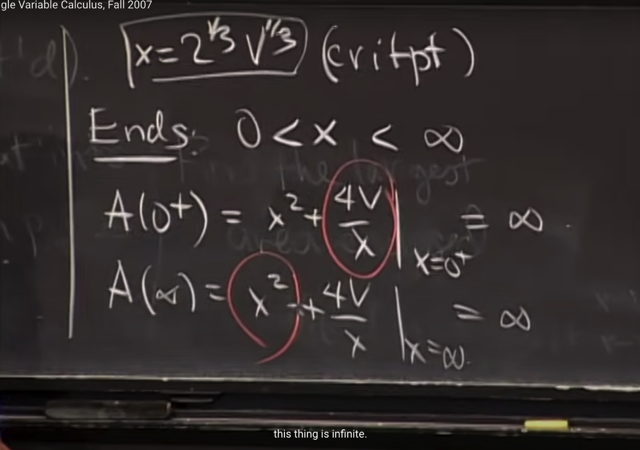</kbd>

> [!NOTE]
> Tương tự, A(infinity) = (inf)^2 +
> 4V/(inf) = inf + 0 = inf

 

<kbd>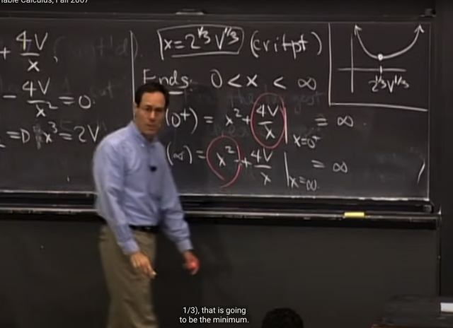</kbd>

> [!NOTE]
> Từ đó ta có thể kết luận critical point, x =
> (2V)^1/3 chính là minimum

 

<kbd>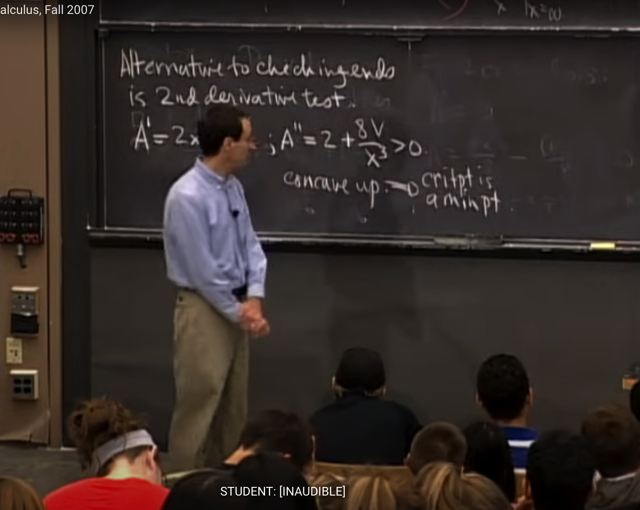</kbd>

> [!NOTE]
> Gs nói đại khái là ông cho rằng có thể dùng second derivative test để
> kiểm tra xem critical point là min hay max.
>
> Bằng cách tính A''(x), kết quả ra 2 + 8V / x^3 luôn lớn hơn 0 với mọi x 
> lớn hơn 0.
>
> Và do đó có thể kết luận function concave up (lõm hướng lên) suy ra
> critical points là minimum point

 

<kbd>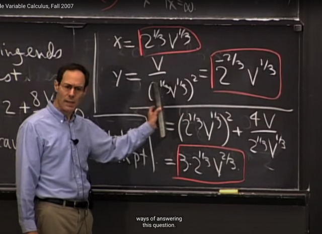</kbd>

> [!NOTE]
> Từ đó ta tính ra y và A khiến
> minimize diện tích hộp

 

<kbd>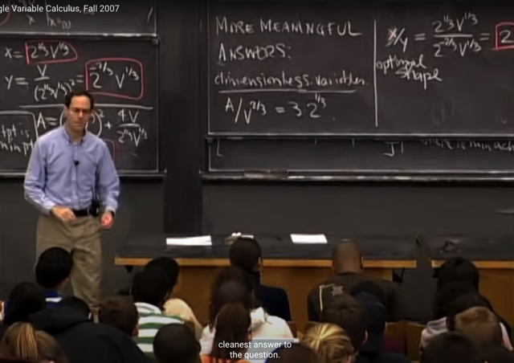</kbd>

> [!NOTE]
> Đại khái là, gs cho rằng ta có thể trả lời theo cách hay hơn, bằng
> cách dùng dimensionless variable: ví dụ A/V^(2/3) là tỉ lệ không còn 
> dính đến đơn vị nữa.
>
> Hay x/y cũng vậy, vậy nếu theo kết quả x, y ta có thì x/y = 2. Và đó là
> câu trả lời ý nghĩa nhất: miễn là hộp có x/y = 2 thì đó là optimal box

 

<kbd>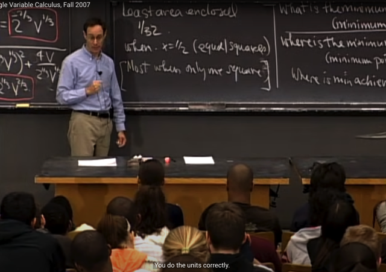</kbd>

> [!NOTE]
> Câu hỏi của student:
>
> ? Nếu không cho mặt đáy vuông thì có giải được không? -> Được,
> nếu dùng 1802 tức là multivariate calculus. vì khi đó ta sẽ có thêm
> một variable z nữa.

 

<kbd>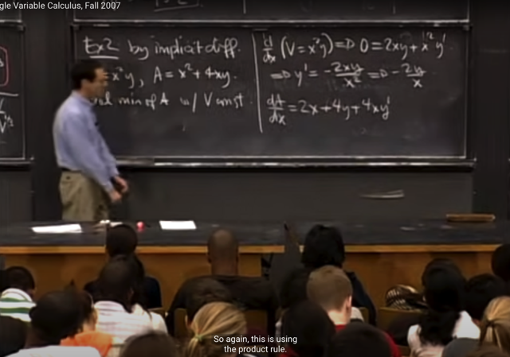</kbd>

> [!NOTE]
> Tiếp theo gs cho rằng ông sẽ giải bài toán này lại sử dùng implicit
> differentiation (vi phân hàm ẩn). Như đã biết, implicit differentiation có
> nghĩa là, ta có một equation, ẩn chứa trong đó là một function ví dụ
> trong V = x^2y, ẩn chứa (implicitly) function y = y(x) = V / x^2.
>
> Thế thì, bằng cách lấy đạo hàm equation - tức apply (d/dx) operator
> vào hai vế ta sẽ có thể solve y'.
>
> vậy từ V = x^2*y (again, chú ý y lúc này là implicit function theo x),
> ta có (d/dx) V = (d/dx) x^2*y 
>
> <=> 0 = 2xy + x^2y' (vì V là fixed, constant, nên (d/dx) V = 0, còn vế 
> phải thì theo product rule.
>
> từ đó suy ra y' = -2y/x.
>
> Tương tự (d/dx) A = 2x + 4y + 4xy'

 

<kbd>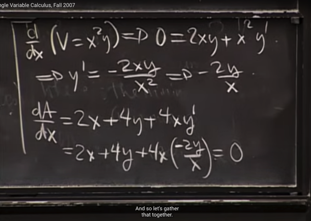</kbd>

> [!NOTE]
> Và gắn y' vào dA/dx. Ta sẽ solve equation dA/dx (để
> tìm critical point như cách thông thường)

 

<kbd>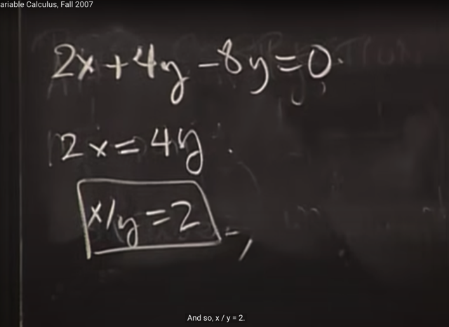</kbd>

> [!NOTE]
> Kết quả ra x/y=2 như cách hồi nãy (đương nhiên nếu apply
> vào V = x^2y thì sẽ solve ra x, y theo V giống như cách 1
> nhưng ta đã nói để kết quả ở dạng x/y=2 như vầy thì hay hơn)

 

<kbd>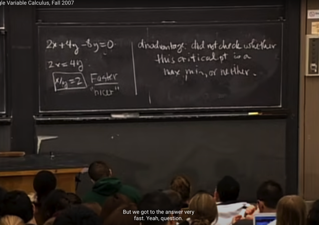</kbd>

> [!NOTE]
> gs cho rằng cách này nhanh hơn, và cho ra kết quả nicer. Nhưng
> disadvantage của nó là nó không check dc critical point là max / min
> hay cả hai (vẫn có thể là cả hai như đã biết ở 1802, gọi là saddle
> point)
>
> Student hỏi làm sao để check. Thì gs nói trong bài toán cụ thể này
> thì ta phải check như hồi nãy ta check, đó là xem A(0+) và A(inf+)
> để ra A đều bằng infinity để kết luận critical point là min.
>
> Nhưng ông cho rằng sẽ có nhiều bài toán mà việc check này không
> cần thiết vì nó rõ ràng rồi. Khi đó cách này sẽ giúp ta làm nhanh hơn

 

<kbd>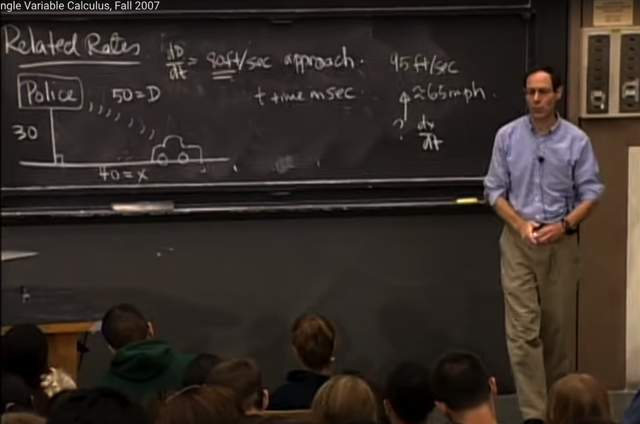</kbd>

> [!NOTE]
> Mấy phút cuối gs set up bài toán về Related
> Rate. Ta sẽ tiếp tục ở bài sau

 

