# Lec 13: Newton's Method

📊 **Progress:** `26` Notes | `29` Screenshots

---

<kbd>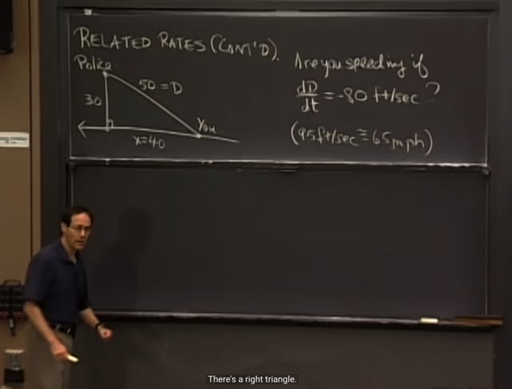</kbd>

> [!NOTE]
> Bài toán như vầy, các khoảng các giữa các điểm: ta, police có thể
> coi như cái cột camera đo tốc độ ví dụ vậy, và chân cột là 50, 40, 30
> Câu hỏi là dựa trên dD/dt = -80, thì ta có đang vượt quá tốc độ không
> (giới hạn là 95 ft/sec)

 

<kbd>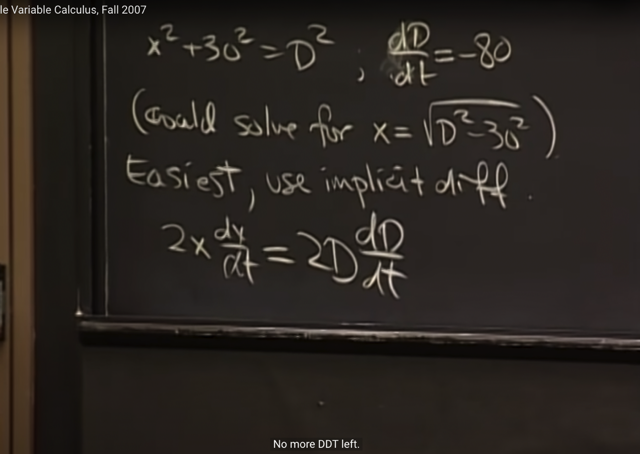</kbd>

> [!NOTE]
> Ta sẽ có equation liên hệ giữa x (khoảng cách giữa ta và chân cột)
> D (khoảng cách giữa ta và police) vì tại thời điểm đang xét làm
> thành tam giác vuông (right triangle) nên ta có:
>
> x^2 + 30^2 = D^2
>
> Gs cho rằng tuy rằng ta có thể solve để có x theo D, rồi tính  đạo
> hàm, nhưng cách dễ hơn sẽ là implicit differentiation. (ý tưởng là,
> khi ta có equation ẩn chứa một function ví dụ x^2 + y^2 = c, thì ta
> thay vì solve để có dạng explicitly của function y = f(x) rồi tính đạo
> hàm của y theo x (giả sử ta cần tính), thì ta có thể implicit
> differentiation, lấy đạo hàm của equation theo x luôn, từ đó solve ra
> y'(x))
>
> Vậy lấy đạo hàm theo t của phương trình trên, vế trái trở thành
> 2x*dx/dt = 2D*dD/dt (đương nhiên là dùng chain rule)
>
> Gs lưu ý, đương nhiên ta sẽ phải để x ở dạng variable rồi mới làm
> bước lấy đạo hàm, chứ sẽ sai lầm nếu ta lại gắn giá trị tại thời điểm
> này x = 40 vào, rồi lấy đạo hàm thì sẽ sai. Lí do đương nhiên vì x là
> biến, x, và D thay đổi theo t.

 

<kbd>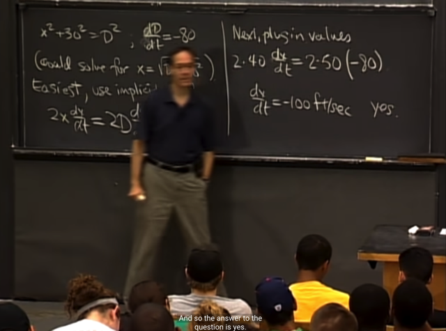</kbd>

> [!NOTE]
> Sau khi đạo hàm xong, ta mới gắn giá trị x và D vào, để có
> dx/dt = -100 ft/sec, từ đó kết luận ta đang di chuyển hướng về
> với vận tốc (dx/dt chính là vận tốc) -100 ft/sec đồng nghĩa đang 
> overspeed

 

<kbd>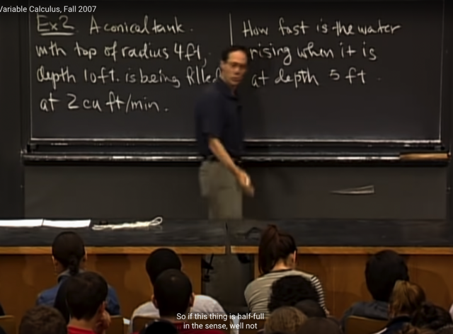</kbd>

> [!NOTE]
> Ví dụ tiếp theo là cái bể nước (hình nón ngược) có bán kính top
> là 4ft, sâu 10 ft và được fill với dung lượng 2 cubic ft / min.
>
> Câu hỏi là mực nước dâng  nhanh cỡ nào khi mực nước ở mốc
> 5ft

 

<kbd>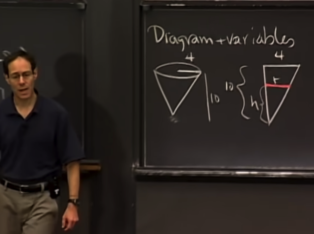</kbd>

> [!NOTE]
> gs cho rằng ta sẽ cần vẽ minh họa bài toán, ta sẽ thể hiện mặt
> cắt (và chỉ lấy 1/2) để thể hiện các thông số như bán kính top,
> chiều cao, chiều cao mực nước h và bán kính mực nước r
>
> Từ đó ta có equation: h/r = 10/4

 

<kbd>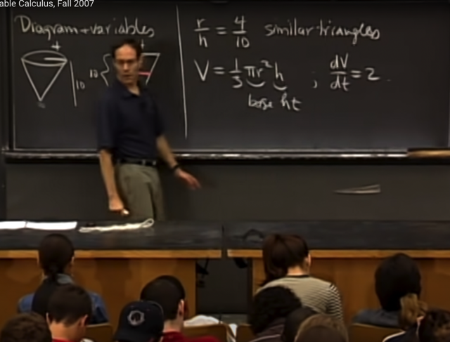</kbd>

<kbd></kbd>

<kbd>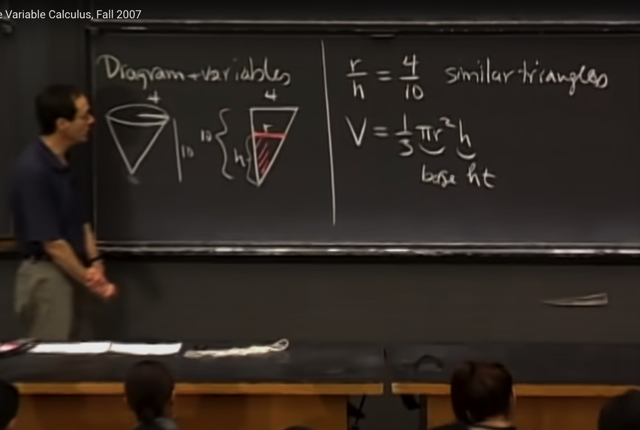</kbd>

> [!NOTE]
> Và ta nhớ công thức tích thể tích bể nước V = (1/3)πr^3
>
> Và thể tích đang tăng thêm với rate là 2 cu ft / min nên ta có dV/dt = 2

 

<kbd>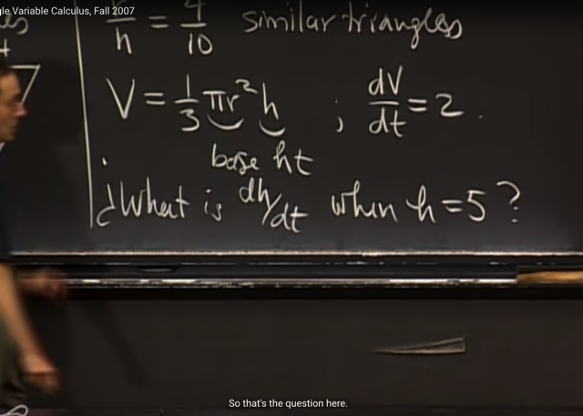</kbd>

> [!NOTE]
> Câu hỏi sẽ là tìm dh/dt khi h = 5 (mực nước
> dâng nhanh ra sao khi h = 5)

 

<kbd>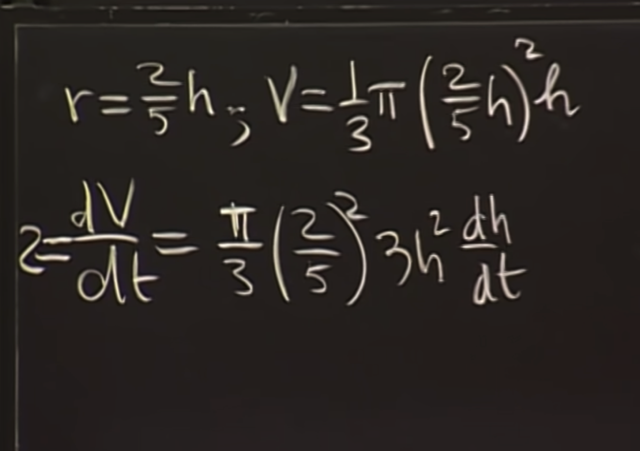</kbd>

> [!NOTE]
> Thế r = 2h/5 vào phương trình V và dùng implicit differentiation
> (đạo hàm hai vế theo t) ta sẽ có:
>
> Vế trái là dV/dt, và bằng 2 như vừa rồi nói vế phải đạo hàm của h^3
> theo t là 3h^2 dh/dt với các constant (1/3)*(2/5)^2

 

<kbd>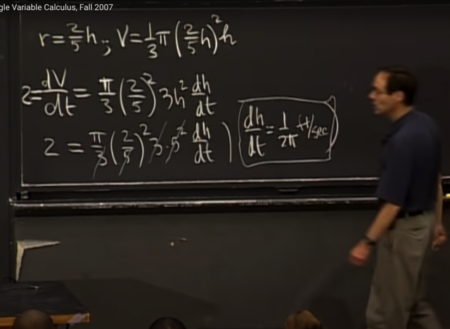</kbd>

> [!NOTE]
> Rút gọn và ta có kết quả là dh/dt =
> 1/2π (ft/min) (thầy ghi sai)

 

<kbd>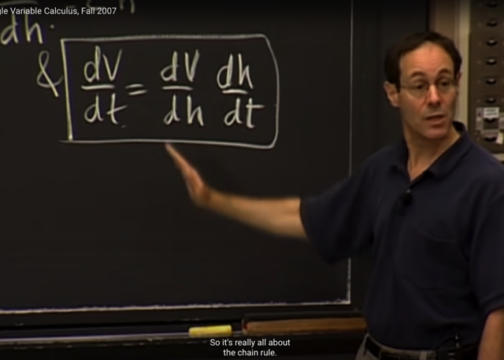</kbd>

> [!NOTE]
> Và đây chính là ý nghĩa của Related Rate, đại khái là khi ta có các
> rate of change giữa các yếu tố liên quan, ví dụ có rate of change
> giữa thể tích và mực nước, và rate of change giữa thể tích với thời
> gian thì ta có thể tính rate of change giữa mực nước và thời gian
> (thông qua Chain Rule)

 

<kbd>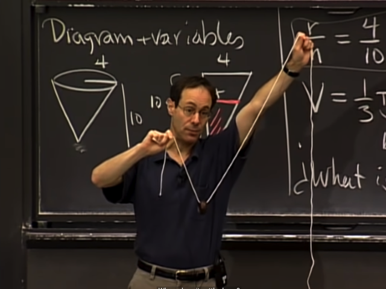</kbd>

> [!NOTE]
> Bài toán tiếp theo là, ta muốn tìm vị trí của cục sắt nếu như
> hai đầu không cao bằng nhau

 

<kbd>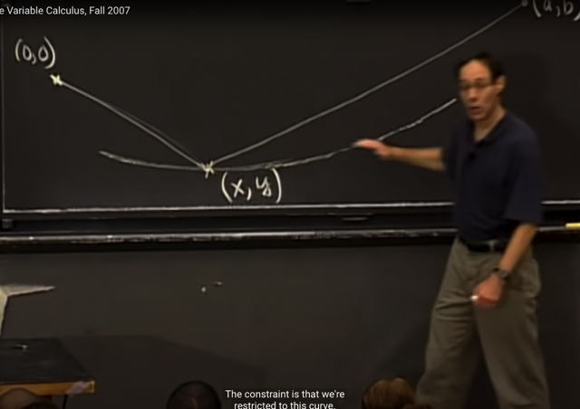</kbd>

> [!NOTE]
> Thế thì gọi tọa độ hai đầu là (0,0) và (a,b) và toạ độ cục sắt là (x, y).
> Bài toán này gs cho là bài toán minimization, với constrain là đường
> cong này. Có nghĩa đại khái là ta cần tìm vị trí thấp nhất của cục sắt
> với ràng buộc là nó chỉ di chuyển trên đường cong này. Hay, là tìm
> điểm thấp nhất của đường cong này. Và dĩ nhiên nó sẽ phụ thuộc
> chiều dài sợi dây và hai điểm đầu

 

<kbd>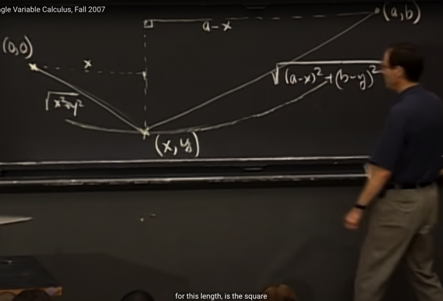</kbd>

> [!NOTE]
> Dựa vào các tọa độ, không khó để hiểu chiều dài mỗi đoạn sẽ là
> vầy (dựa vào pythagores) (chú ý x, b là các tọa độ nên phải là b-x
> chứ không phải b+x vì x âm)

 

<kbd>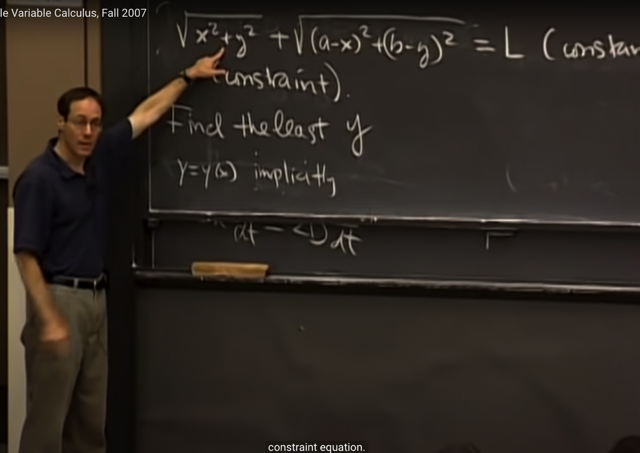</kbd>

> [!NOTE]
> Và tổng hai đoạn là chiều dài sợi dây, là fixed value (constant), gọi là
> L. Và đây là equation mô tả ràng buộc (constrain)
>
> Và quan trọng là ta cần nhận ra bài toán này ta cần tìm y nhỏ nhất
>
> Vì trong constrains equation này implicitly ngầm ẩn một function của
> y theo x. Và dễ thấy rằng tại điểm thấp nhất, tiếp tuyến với đường
> cong sẽ nằm ngang, y'(x) sẽ bằng 0, đó chính là critical point

 

<kbd>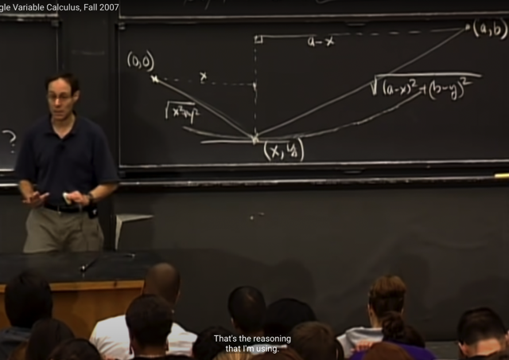</kbd>

> [!NOTE]
> Đại khái là theo quy trình ta sẽ check critical points và sau đó là
> check các end point để xem thử critical point là maximum hay
> minimum
>
> Trong bài toán này ta có thể kết luận luôn critical point là minimum.
>
> Đương nhiên ta có thể dùng second derivative test nhưng ở đây
> làm cách đó sẽ rất phức tạp

 

<kbd>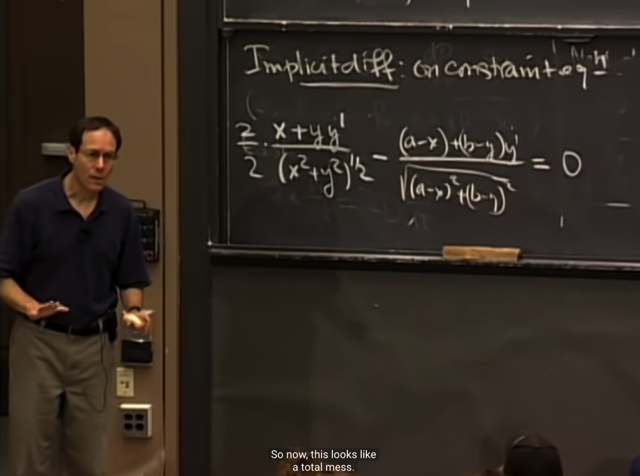</kbd>

> [!NOTE]
> Ta sẽ implicit differentiation, lấy đạo hàm hai vế theo x
>
> Áp dụng chain rule, không khó để ra kết quả này
> với vế phải là dL/dx = 0 do L là constant

 

<kbd>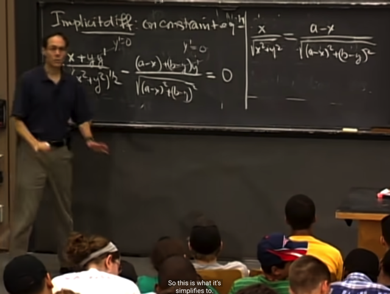</kbd>

> [!NOTE]
> Tiếp, ta sẽ dùng thực tế là ta đang solve equation y'
> = 0, với constrain trên, do đó ta có thể lắp y' = 0 vào

 

<kbd>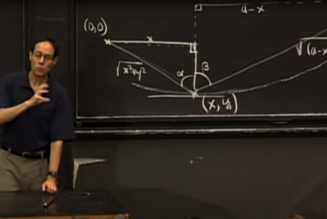</kbd>

> [!NOTE]
> Và thật ra equation trên chính là sin(alpha) - sin(beta) = 0, và
> kết quả là alpha = beta
>
> Và gs cho rằng chỉ cần thêm một chút toán nữa là ta có thể
> tính ra y, nhưng kết quả tới đây là được rồi

 

<kbd>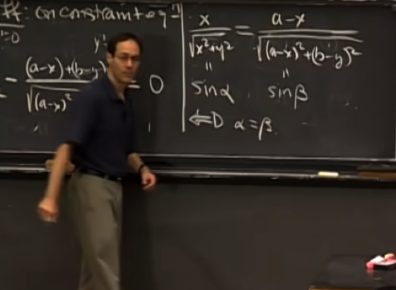</kbd>

 

<kbd>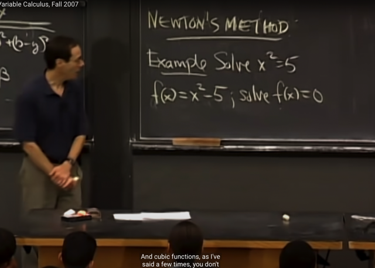</kbd>

> [!NOTE]
> Tiếp theo ta qua Newton's method. Ví dụ ta muốn tính x sao
> cho x^2 = 5.
>
> ta có thể set f(x) = x^2 - 5 và chuyển bài toán thành giải
> phương trình f(x) = 0
>
> (thật ra chỉ là chuyển vế đổi dấu để có phương trình tương
> đương x^2 = 5 <=> x^2 - 5 = 0)

 

<kbd>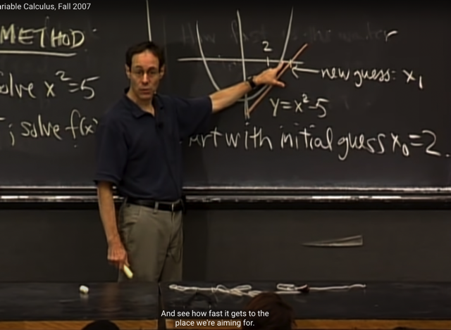</kbd>

> [!NOTE]
> Gs sketch đồ thị của hàm y = x^2 - 5 là parabola này, đương nhiên nó
> cắt trục y (x=0) tại -5
>
> Và tìm solution của y = 0 đương nhiên là tìm x của điểm mà parabola
> cắt trục x (vì khi đó y = 0)
>
> Vậy thì phương pháp Newton sẽ là: ta sẽ bắt đầu với một initial guess
> (dự đoán ban đầu) về vị trí (x) của giao điểm. Ví dụ tại x0 = 2.
>
> Từ đó ta mới thiết lập phương trình của tiếp tuyến (tangent line) tại (x0,
> y(x0) = y0). Tiếp tuyến này sẽ cắt trục x, và ta sẽ tìm x của điểm đó để
> có new guess x1
>
> Quá trình sẽ lặp lại để các guess ngày càng tiến về giao điểm của
> parabola và trục x

 

<kbd>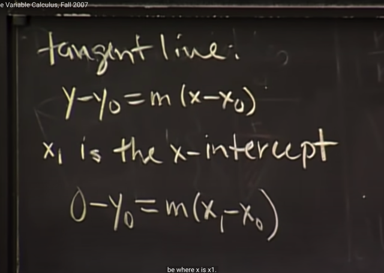</kbd>

> [!NOTE]
> Thế thì phương trình tiếp tuyến đi qua x0, y0 sẽ có dạng thế này y-y0 =
> m(x-x0) với m như đã biết sẽ là đạo hàm của hàm y tại x0: y'(x0).
>
> Vậy thì để tìm new guess - giao điểm của tangent line với trục x, ta sẽ
> cho y = 0, khi đó x sẽ là new guess, tức x1
>
> 0 - y0 = m(x1 - x0)

 

<kbd>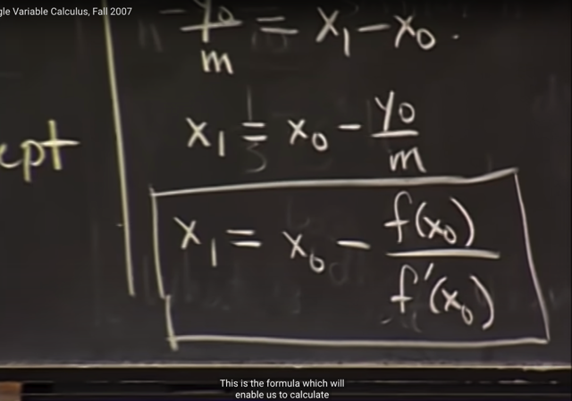</kbd>

> [!NOTE]
> Để rồi ta solve ra x1 = x0 - y0 / m. Và y0 như đã biết là f(x0)
> còn m là độ dốc (slope) của hàm f tại x0: f'(x0)
>
> Vậy **x1 = x0 - f(x0)/f'(x0)
>
> Gs cho rằng đây là công thức giúp ta tính mọi căn (root)**

 

<kbd>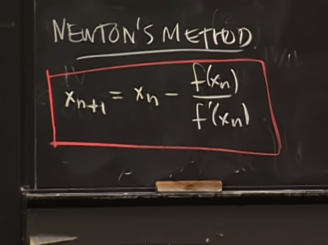</kbd>

> [!NOTE]
> Và đây là công thức của
> Newton's Method
>
> x_n+1 = x_n - f(x_n) / f'(x_n)

 

<kbd>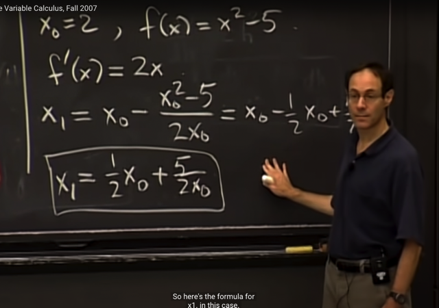</kbd>

> [!NOTE]
> Áp dụng vào, ở đây f'(x) dễ thấy là 2x, từ
> đó ta tính ra x1 = x0/2 + 5/2x0

 

<kbd>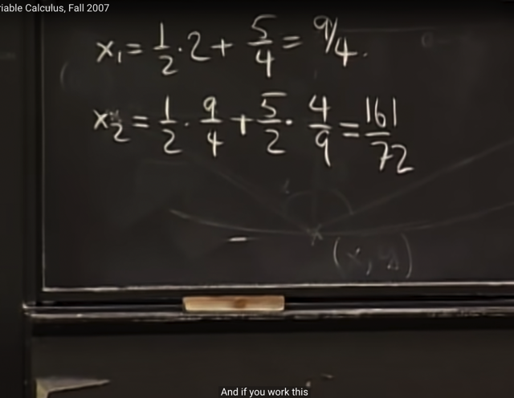</kbd>

> [!NOTE]
> Thế x0 = 2 (initial guess) ta có x1 = 9/4. Tiếp tục áp dụng
> x_n+1 = x_n + f(x_n) / f'(x_n) vẫn sẽ là x2 = 1/2*x1 + (5/2x1)
> = 161/72

 

<kbd></kbd>

> [!NOTE]
> Và sau vài iteration ta đã thấy sai khác giữa
> sqrt (5) và x_n đã rất nhỏ

 

