# Lec 14: Mean Value Theorem

📊 **Progress:** `24` Notes | `24` Screenshots

---

<kbd>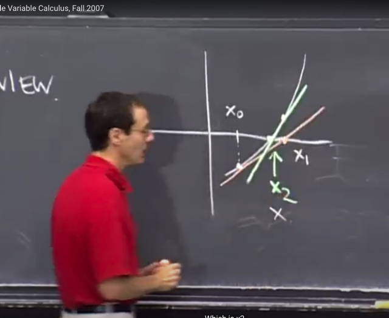</kbd>

> [!NOTE]
> Đầu tiên đại khái gs review lại Newton's method. Ta nhớ bài toán đặt
> ra là ta cần tìm solution của equation f(x) = x^2 - 5 = 0, để có thể tìm
> căn  bậc hai của 5.
>
> Thế thì bài để solve equation này đương nhiên là ta cần tìm x nơi
> function  f(x) cắt trục y.
>
> Vậy cách làm là, ta sẽ bắt đầu bằng initial guess x0. Từ đó vẽ (thiết
> lập) tiếp tuyến với hàm f(x) tại x0 và tìm giao điểm của nó với trục y.
> Đây sẽ  là next guess x1. Tiếp tục làm vậy, dần dần ta sẽ tiến về giao
> điểm của  f(x) và trục y

 

<kbd>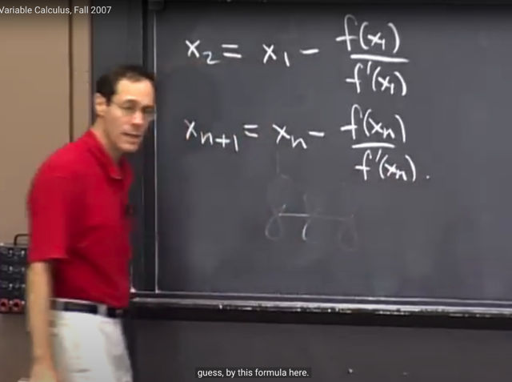</kbd>

> [!NOTE]
> Phương trình tiếp tuyến tại x0 của f(x) thì biết rồi: y - y0 = f'(x0)(x-x0)
> từ đó, giải tìm giao điểm của nó với f(x) tức y = 0, ta có x = x0 - f(x0)/f'(x0)
> và đó là x1 (second guess)
>
> Tương tự vậy, công thức của mỗi guess sẽ là x_n+1 = x_n - f(x_n)/f'(x_n)

 

<kbd>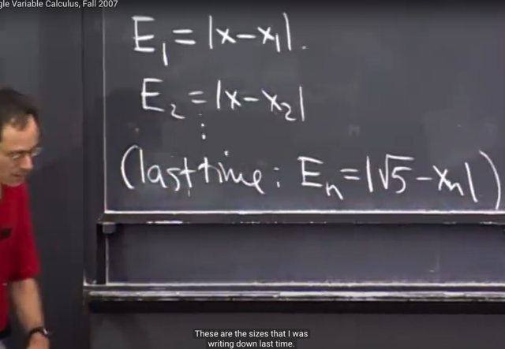</kbd>

> [!NOTE]
> Tiếp theo ta sẽ xem xét error sẽ như
> thế nào sau mỗi lần guess.

 

<kbd>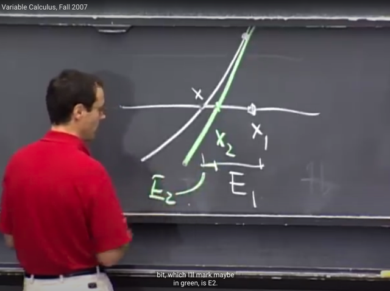</kbd>

> [!NOTE]
> Gs cho biết E2 = E1^2 (không rõ tại sao)

 

<kbd>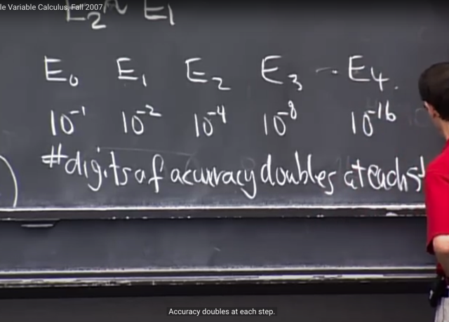</kbd>

> [!NOTE]
> Và do đó số digit của độ chính xác
> sẽ double sau mỗi step

 

<kbd>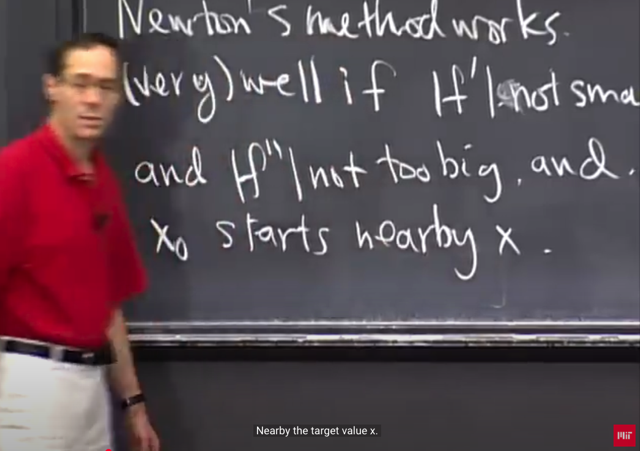</kbd>

> [!NOTE]
> Một số điều kiện để Newton method có tác dụng, là:
>
> f' không quá nhỏ, f'' không quá lớn và x0 bắt đầu ở gần x

 

<kbd>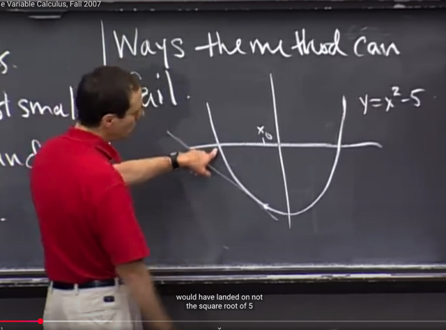</kbd>

> [!NOTE]
> Nó có thể fail. theo cách này, nếu ta  bắt đầu ở điểm này thì
> thay vì nó tìm ra điểm cần tìm là √5, thì nó lại tìm ra -√5

 

<kbd>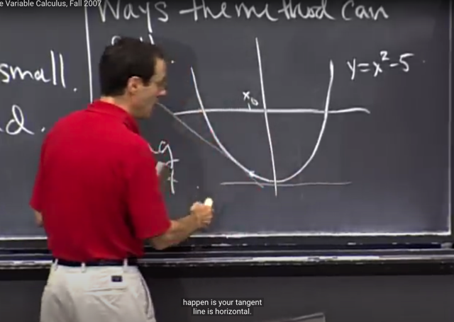</kbd>

> [!NOTE]
> nếu bắt đầu (x0) ở tại điểm này, nới có f' = 0 thì ta cũng sẽ fail,
> vì khi đó tangent sẽ song song với trục x, không thể tìm được
> x1

 

<kbd>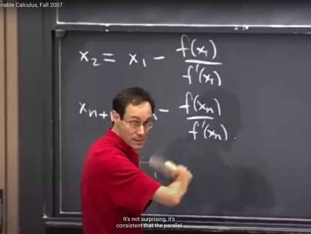</kbd>

> [!NOTE]
> Và theo công thức cũng có thể thấy f'
> (x0) = 0 khiến denominator = 0

 

<kbd>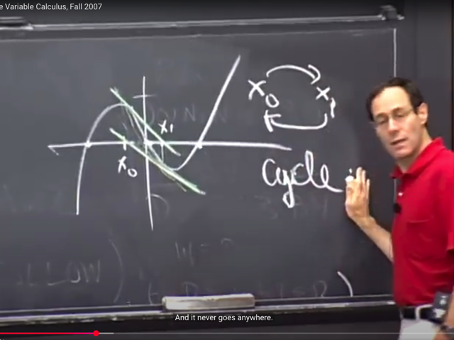</kbd>

> [!NOTE]
> Và một case nữa mà phương pháp này có thể fail là khi hàm f
> có dạng wiggle như thế này.
>
> Khi đó x0 -> x1, x1 lại tìm ra next guess chính là x0, trở thành
> vòng lặp

 

<kbd>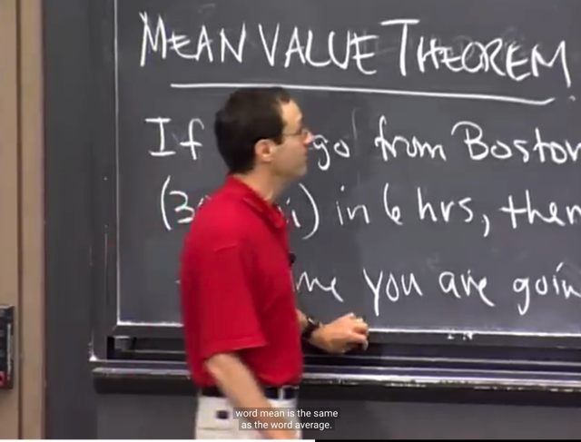</kbd>

> [!NOTE]
> Ta qua Mean Value Theorem:
>
> Đại khái là nếu ta đi từ A đến B cách nhau 3000 cây, trong 6
> tiếng, thì chắc chắn phải có lúc nào đó ta bay với tốc độ trung
> bình = 3000/6 = 500

 

<kbd>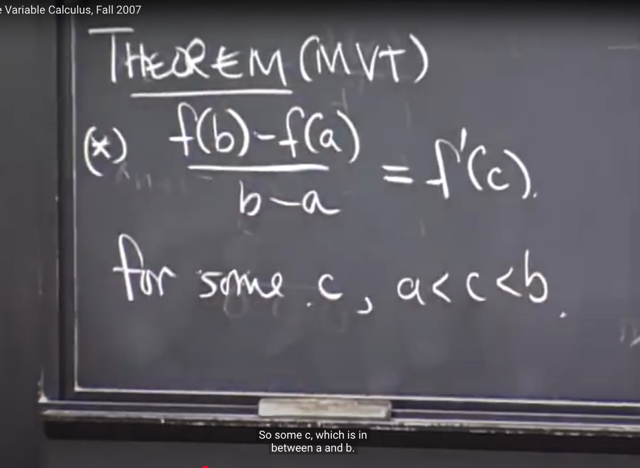</kbd>

> [!NOTE]
> Thể hiện theo toán học:
>
> Là độ dốc trung bình từ a đến b (∆f/∆x = [f(b)-f(a)]/[b-a]) bằng độ dốc tại
> điểm nào c nào đó trong đoạn a, b: f'(c)

 

<kbd>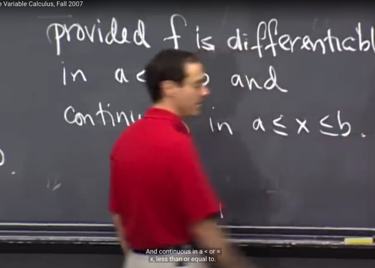</kbd>

> [!NOTE]
> Điều kiện là hàm f khả vi trên a, b (tức tồn tại đạo hàm tại mọi
> điểm trên [a, b] cũng như là hàm liên tục trên đoạn này

 

<kbd>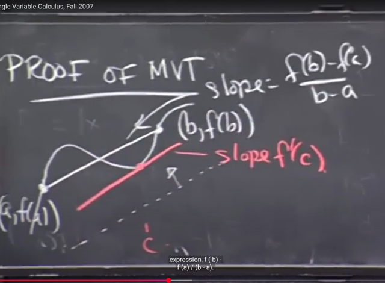</kbd>

> [!NOTE]
> Chứng minh MVT: như sau, cho rằng hàm f có đường cong như vầy 
> trong đoạn a,b.
>
> Thì độ dốc của secant line (nối hai điểm đầu), dễ thấy chính là vế trái
> của phương trình cần chứng minh
>
> Để tìm c, ta sẽ cho một đường song song với secant line, và di chuyển
> từ từ cho đến khi chạm vào đường cong funcion, Thì khi đó ta đã tìm 
> ra c
>
> Và khi làm vậy ta cũng ignore các điểm nằm ngoài đoạn a,b, chỉnh xét
> những phần bên trong a,b. Ý là, có thể khi chưa chạm vào f thì đường 
> song song này đã cắt f ở đâu đó ngoài đoạn a,b (ý là giữa hai điểm
> (a, f(a)) và (b, f(b)) rồi

 

<kbd>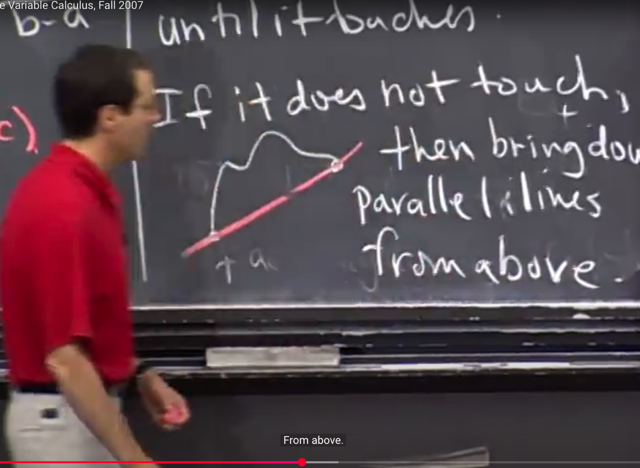</kbd>

> [!NOTE]
> Tuy nhiên có thể sinh ra vấn đề là ta gặp đường cong thế này, thì
> khi đường song song chạm vào f cũng là khi nó trùng secant line
>
> Cách khắc phục là khi đó ta làm ngược lại, xuất phát từ phía trên
> và đi dần xuông

 

<kbd>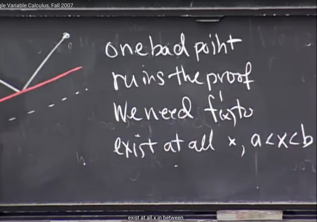</kbd>

> [!NOTE]
> gs cho rằng phải thỏa mãn các giả thiết ban đầu là hàm số khả
> vi và liên tục trên đạon a,b thì định lí này mới đúng.

 

<kbd>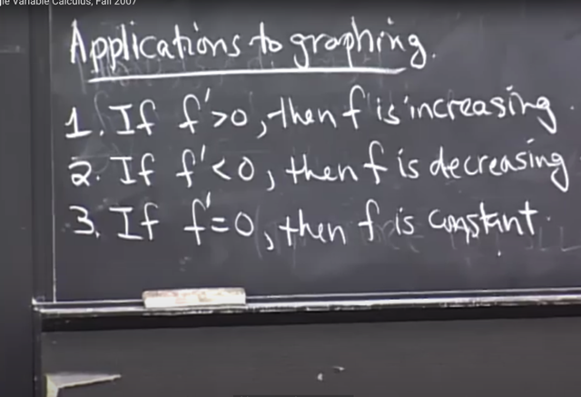</kbd>

> [!NOTE]
> 3 ứng dụng, hay có thể coi là các hệ quả của địh lí
> này mà gs cho rằng ta đã biết rồi

 

<kbd>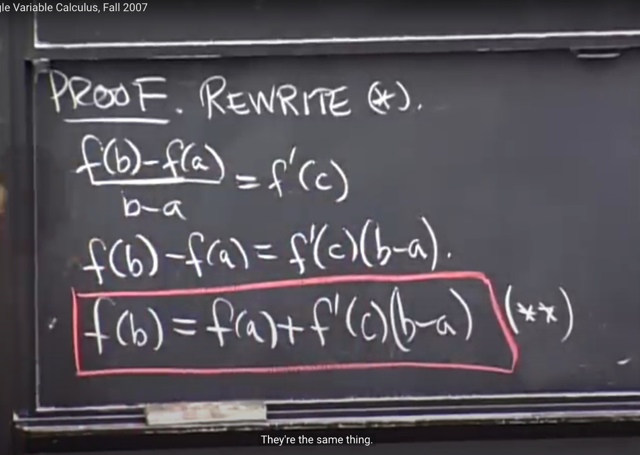</kbd>

> [!NOTE]
> Để chứng minh 3 cái hệ quả trên ta sẽ viết lại
> như vầy

 

<kbd>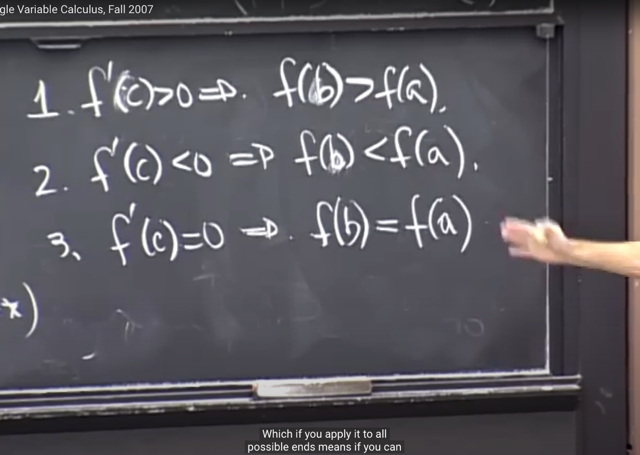</kbd>

> [!NOTE]
> Từ đó quá dễ thấy rằng tùy vào f'(c) có dấu như thế nào mà ta có
> thể kết luận hàm tăng hay giảm hay constant
>
> Sau đó là một loạt các câu hỏi, tuy nhiên có vẻ mean value
> theorem không quan trọng lắm nên bỏ qua có gì quay lại sau

 

<kbd>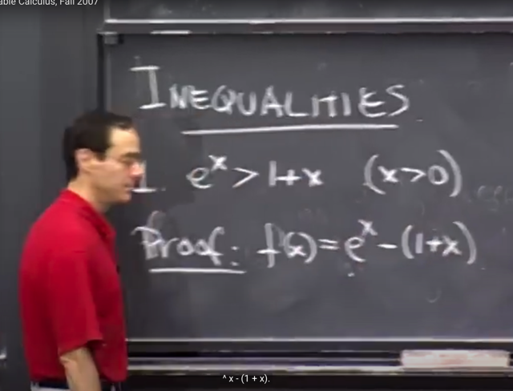</kbd>

> [!NOTE]
> Phần cuối gs áp dụng MVT để chứng minh bất đẳng
> thức. Ví dụ e^x > 1 + x với x > 0.

 

<kbd>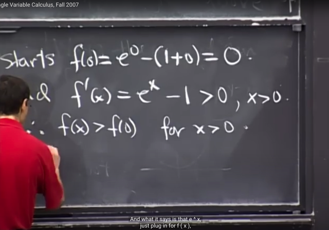</kbd>

> [!NOTE]
> Cách làm là đặt f(x) = e^x - 1+x
>
> Khi đó f(0) = e^0 - 1 + 0 = 0.
>
> f'(0) = e^x - 1, và vì với x > 0 thì e^x > 1 nên f'(x) LUÔN DƯƠNG
> KHI X > 0
>
> Từ đó dựa vào MVT kết luận HÀM SỐ LUÔN TĂNG KHI X > 0
>
> Do đó đương nhiên f(x) > f(0) với x > 0 
>
> Và do đó e^x - 1 + x > 0 với x > 0 . Chứng minh xong

 

<kbd>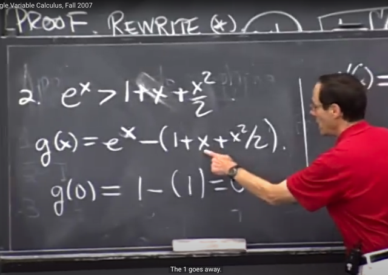</kbd>

> [!NOTE]
> Bài toán thứ hai là chứng minh e^x > 1 + x + x^2. Hoàn toàn
> tương tự, ta sẽ đặt g(x) = e^x - (1 + x + x^2/2)
>
> Sau đó tính g(0) ra bằng 0

 

<kbd>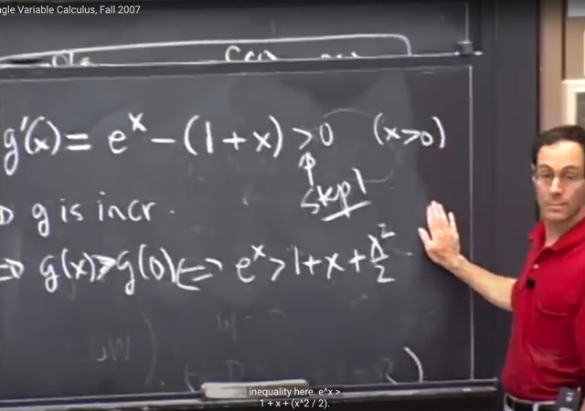</kbd>

> [!NOTE]
> và xét g'(x) thấy nó = e^x - (1+x) và cái này từ ví dụ 1, đã cho
> thấy nó luôn > 0 với x > 0.
>
> Từ đó theo MVT g(x) luôn tăng khi x > 0 => g(x) > g(0) => e^x -
> (1 + x + x^2/2) > 0 => chứng minh xong

 

<kbd>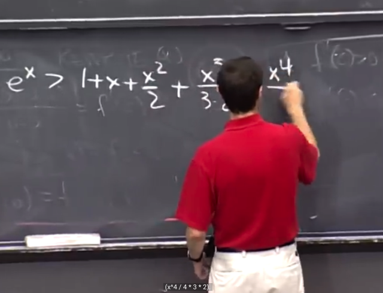</kbd>

> [!NOTE]
> Và gs nói mọi chuyện sẽ tương tự tiếp tục như vậy để ta có thể
> tiếp tục chứng minh e^x > 1 + x + x^2/2
> + x^3/(3*2) + x^4/(4*3*2)....
>
> và ông nói vế phải khi kéo dài tới vô cùng số hạng thì cuối cùng
> sẽ bằng vế trái e^x
>
> Và ta sẽ quay lại cái này ở các bài cuối (Taylor series)

 

