# Lec 1: Rate Of Change

📊 **Progress:** `25` Notes | `27` Screenshots

---

<kbd>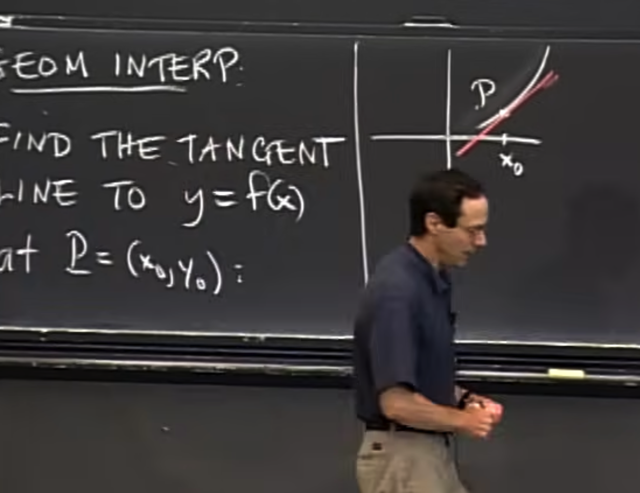</kbd>

> [!NOTE]
> về khía cạnh hình học, bài toán là tìm đường tiếp tuyến
> với function y = f(x) tại P. Thì gs vẽ đường này và cho
> rằng bằng cách nào đó ông đã làm xong. Nhưng vấn đề
> là làm sao để tìm nó analytically để máy tính cũng có
> thể làm được

 

<kbd>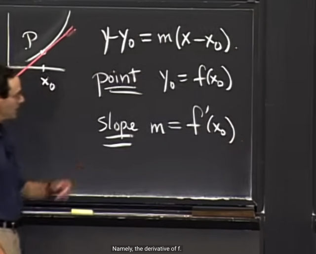</kbd>

> [!NOTE]
> Dựa vào kiến thức highschool, phương trình đường tiếp tuyến tại
> P (x0, y0) sẽ có dạng như vầy. Ta sẽ cần tìm P và độ dốc (slope)
> m, và slope độ dốc của đường thẳng tại P (x0, y0) được gọi là
> derivative f'(x0)

 

<kbd>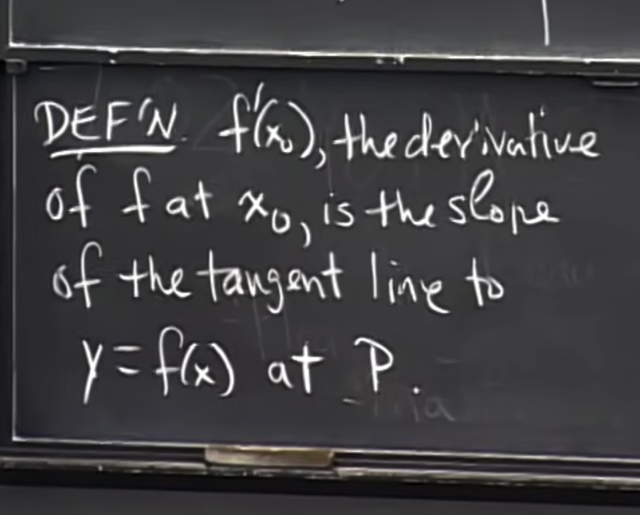</kbd>

> [!NOTE]
> Ta có định nghĩa f'(x0) là derivative của hàm f tại x(0)
> chính là độ dốc của đường tiếp tuyến với hàm f(x) tại P (x0, y0)

 

<kbd>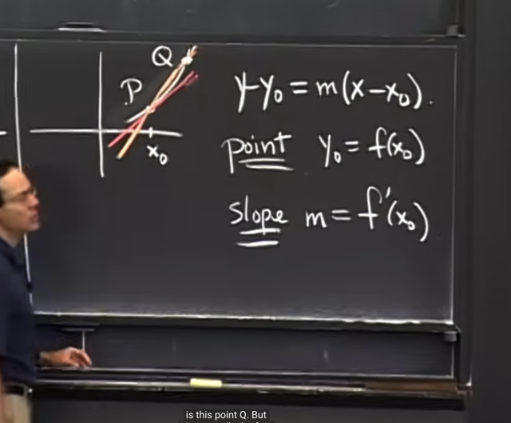</kbd>

> [!NOTE]
> Thế thì gs đặt vấn đề là, làm sao để biết một line như đường màu
> cam không phải là tangent. Ông cho rằng không phải vì nó cắt f tại 2
> điểm P, Q mà nói nó không phải tangent, bởi lẽ function có thể wiggly.

 

<kbd>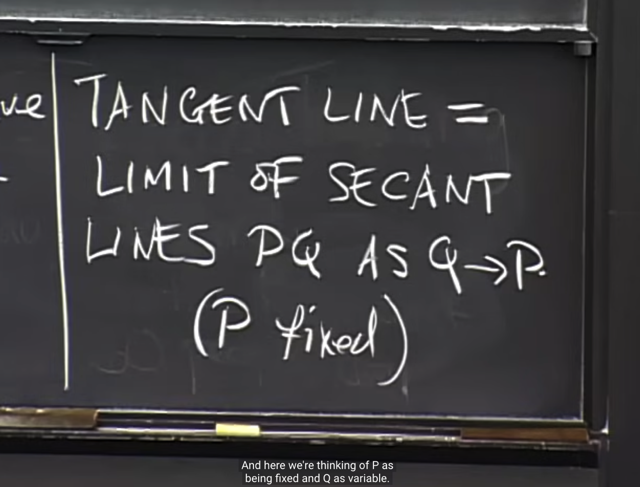</kbd>

> [!NOTE]
> và thực tế tangent line chính là đường
> secant line khi Q -> P với P cố định

 

<kbd>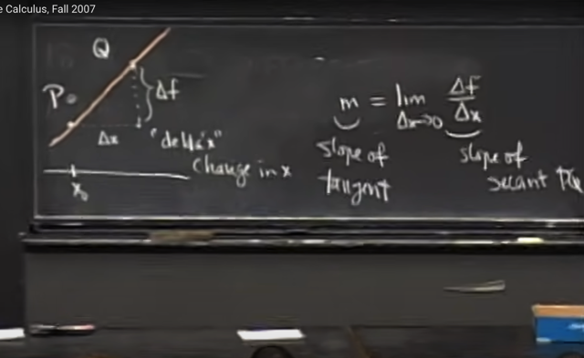</kbd>

> [!NOTE]
> tiếp theo gs vẽ lại secant line, gọi delta_x (xQ - xP) là khoảng
> thay đổi của x, delta_f= f(Q) - f(P) là khoảng thay đổi của f
>
> thì độ dốc của tangent theo định nghĩa (gs cho rằng lim có thể áp
> dụng cho cả line và độ dốc) sẽ là limit của delta_f / delta_x khi
> delta_x nhỏ vô cùng

 

<kbd>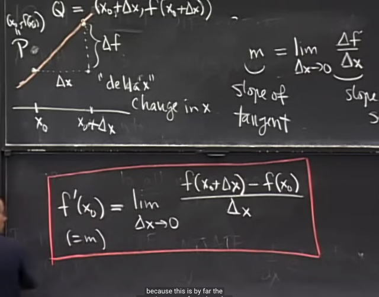</kbd>

> [!NOTE]
> và ta với việc thay delta_x = f(x0+delta_x) - f(x0) ta có định
> nghĩa chính thức của derivative of f tại x0: f'(x0)

 

<kbd>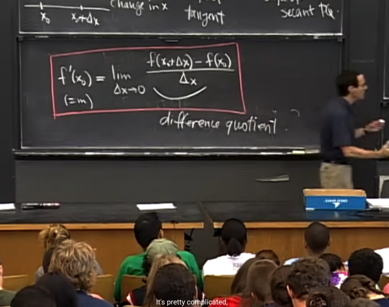</kbd>

🔗 **Related:** [LEC 3: DERIVATIVES](untitled.md#node-59)

> [!NOTE]
> và biểu thức cần tìm limit có tên gọi là
> **DIFFERENCE QUOTIENT**

 

<kbd>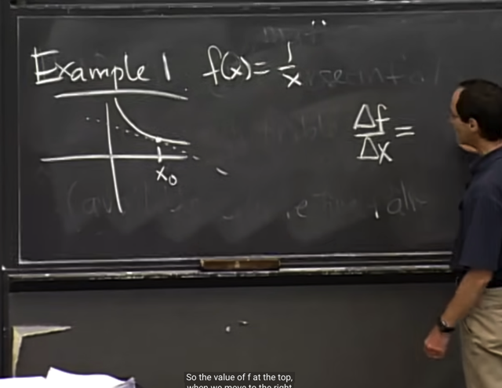</kbd>

> [!NOTE]
> Ta sẽ áp dụng để tìm derivative của f(x) = 1/x. Ông cho rằng ta
> sẽ chọn 1 điểm x0. Và kết quả là ta sẽ tìm được tangent line
> của hyperbolla này

 

<kbd>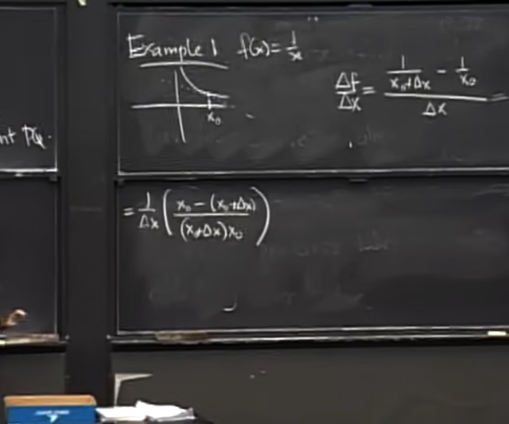</kbd>

> [!NOTE]
> Thế thì ta sẽ thiết lập delta_f/delta_x
> như vầy. Và thu gọn nó lại

 

<kbd>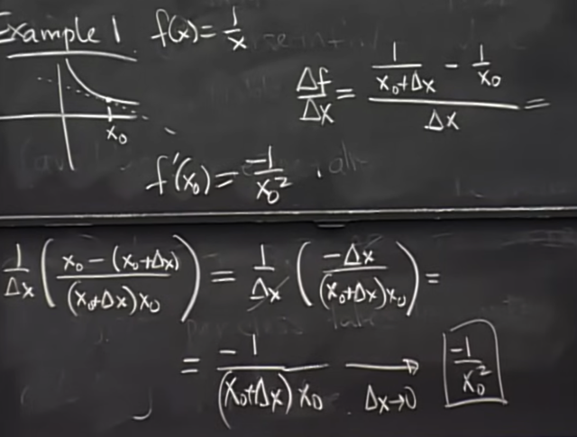</kbd>

> [!NOTE]
> Mục đích là khử đi delta_x ở tử và mẫu thoát khỏi dạng 0/0 (khi
> delta_x -> 0)
>
> Kết quả cuối cùng, là -1/(x0 + delta_x)x0. Và để có lim khi delta_x
> -> 0  chỉ việc thế delta_x = 0, Ta có **-1/x0^2**Dễ thấy đây cũng chính là công thức tính đạo hàm của hàm 1/x
> Thì ở đây chính là ta tìm lại công thức của nó theo định nghĩa đạo
> hàm

 

<kbd>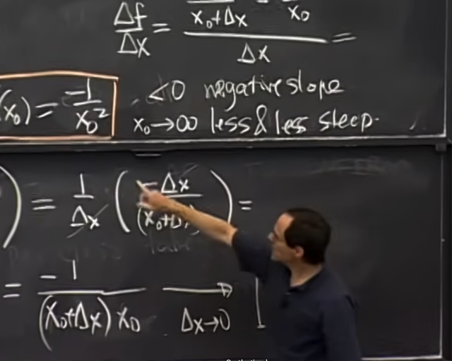</kbd>

> [!NOTE]
> nhận xét là tangent của hàm 1/x chúi xuống vì slope âm. Và khi x0 ->
> vô cùng, tức là điểm tiếp tuyến càng xa thì độ dốc càng nhỏ lại
>
> ý nói cái mà ta tìm ra phù hợp với hình ảnh của tangent của hyperbol

 

<kbd>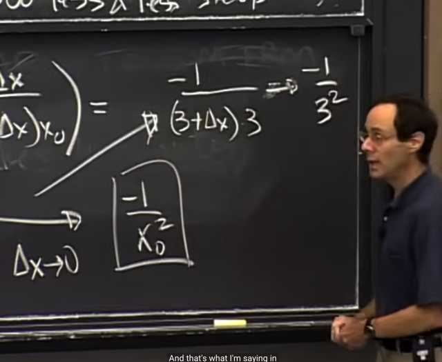</kbd>

> [!NOTE]
> gs giải thích khi tìm limit của biểu thức này khi delta_x -> 0, điều
> ta làm thật sự chỉ là bỏ 0 vào delta_x thôi

 

<kbd>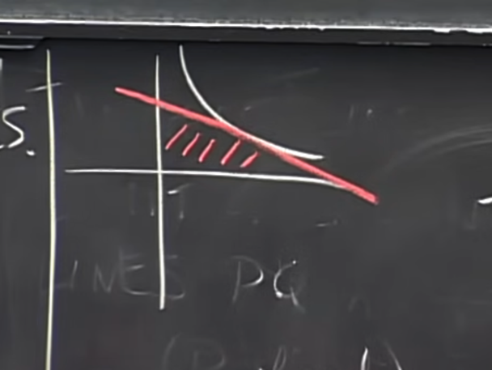</kbd>

<kbd></kbd>

<kbd>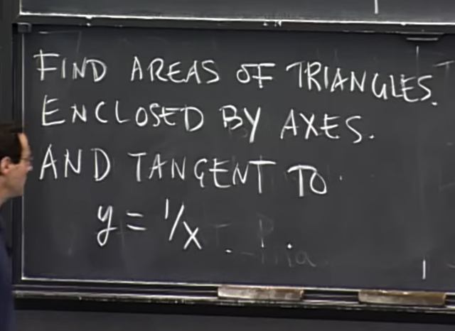</kbd>

> [!NOTE]
> Tiếp ta sẽ thử giải bài toán này: tìm diện tích của hình tạo bởi
> tangent của f(x) = 1/x và 2 trục. Nó là vấn đề calculus vì nó có dính
> đến tangent.

 

<kbd>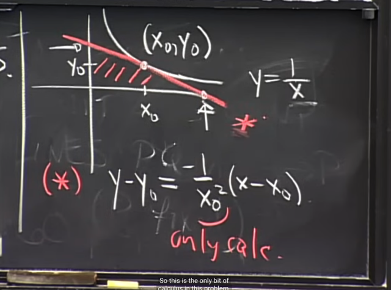</kbd>

> [!NOTE]
> Gọi x0,y0 là điểm tiếp xúc
>
> Thế thì rõ ràng ta cần tìm base và height thể hiện bằng 2 điểm
> line cắt 2 trục
>
> Thế thì ta đã có phương trình đường tangent với độ dốc đã NHỜ
> CALCULUS MÀ TÍNH ĐƯỢC = -1/x^2.
>
> Gs gọi nó là yếu tố duy nhất của calculus trong bài toán này

 

<kbd>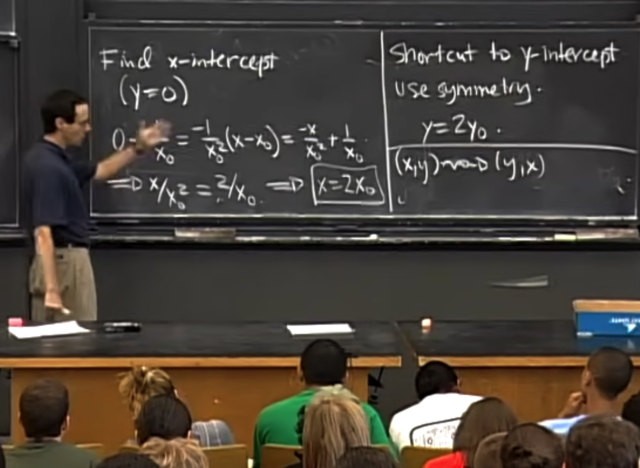</kbd>

> [!NOTE]
> Và để tìm hai giao điểm của tangent line với 2 trục ta cho y = 0 để
> tìm điểm thứ nhất, và x = 0 để tìm điểm thứ 2.
>
> Từ đó ta có height và base của tam giác

 

<kbd>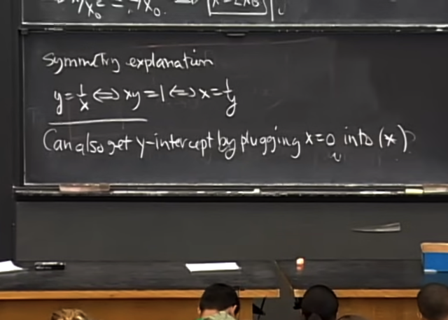</kbd>

> [!NOTE]
> đại khái gs có thể làm nhanh hơn bằng cách
> dùng tính đối xứng của x và y

 

<kbd>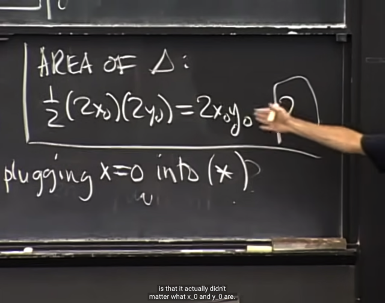</kbd>

> [!NOTE]
> và từ base và  height ta tính ra area của tam giác và vì y0 = 1/x0,
> diện tích không còn phụ thuộc x0, y0 nữa ( = 2)

 

<kbd>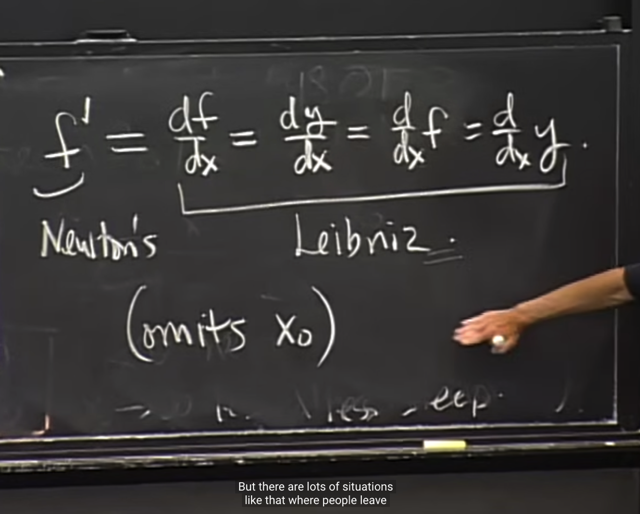</kbd>

> [!NOTE]
> Gs nói thêm một số notation: đó là derivative có thể dùng **f'(x)**, và đó
> là notation của **Newton**. Hoặc **df/dx** là **Leibniz**

> [!NOTE]
> NOTATION CỦA DERIVATIVE:
>
> NEWTON: f'
>
> LEIBNIZ: df/dx, hoặc (d/dx) f

 

<kbd>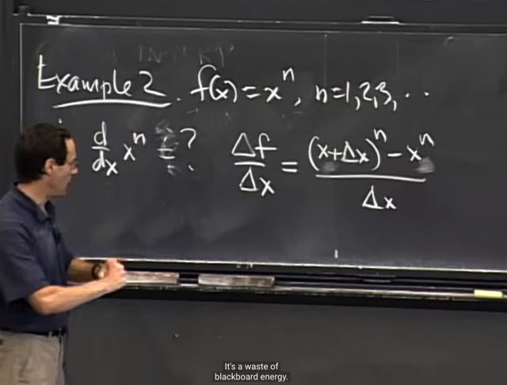</kbd>

> [!NOTE]
> Ví dụ 2. tìm derivative của f(x) = x^n.
>
> Thế thì ta cũng sẽ thiết lập biểu thức delta_f / delta_x Nhưng gs cho
> rằng ta không còn cần dùng notation x0 nữa. Mà chỉ cần biết x là fixed
> - là điểm cần tìm derivative và delta x là khoảng thay đổi của x từ đó

 

<kbd>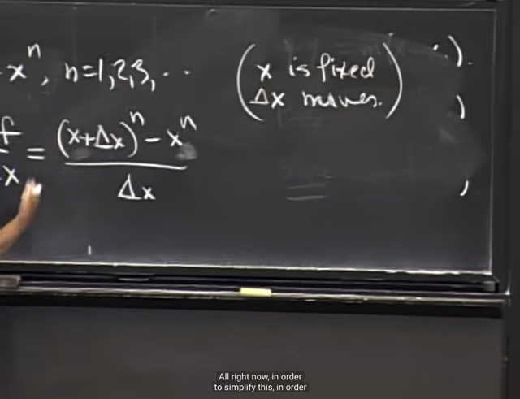</kbd>

 

<kbd>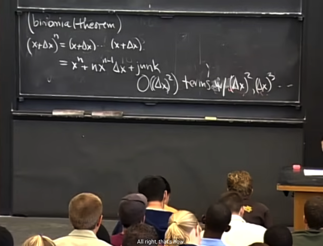</kbd>

> [!NOTE]
> Gs cho rằng ta sẽ vận dụng Binomial theorem (nhị thức newton) để
> triển khai
>
> (x+delta_x)^n = x^n + x^(n-1)*delta_x + O(delta_x^2)
>
> Có nghĩa là binomial theorem,sẽ giúp ta triển (x+y)^n thành một tổng
> các biểu thức của x và y.
>
> Thế thì với x+delta_x ta**chỉ cần hai cái đầu** và gọi tất cả các term
> mà dính tới bậc cao hơn 1 của delta_x là O(delta_x^2)
>
> Đương nhiên ta hiểu rằng là m vậy là vì trong bài toán này ta sẽ tìm lim
> của nó khi  delta_x -> 0 thì O(detal_x^2) ~= 0

 

<kbd>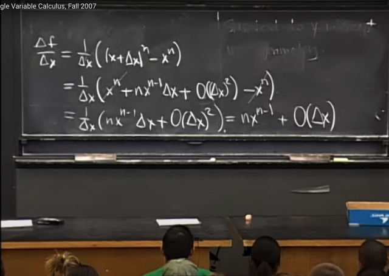</kbd>

> [!NOTE]
> và triển khai như trước ,thế delta_f = f(x+delta_x) - f(x) và rút gọn
> ta có n*x^(n-1) + O(delta_x)

 

<kbd>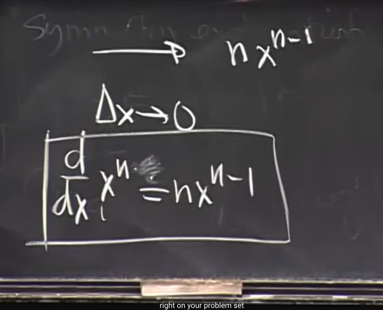</kbd>

> [!NOTE]
> và khi tìm limit khi delta_x -> 0 Thì
> O(delta_x) = 0 và chỉ còn n*x^(n-1)

 

<kbd>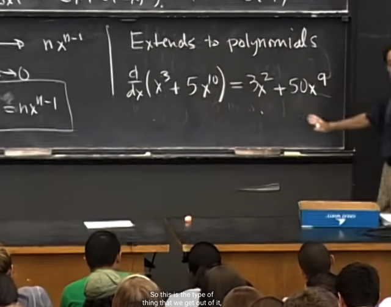</kbd>

> [!NOTE]
> và ta sẽ có thể áp dụng
> nó như thế này

 

