# Lec 2: Limits

📊 **Progress:** `28` Notes | `32` Screenshots

---

<kbd>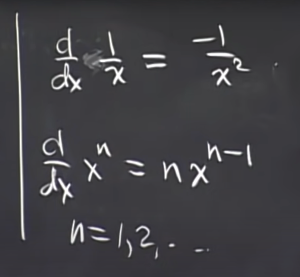</kbd>

<kbd></kbd>

<kbd>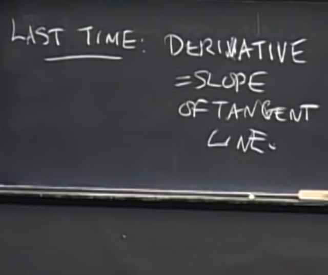</kbd>

> [!NOTE]
> Gs: tuần trước ta đã học về định nghĩa của derivative: là độ dốc (slope)
> của tiếp tuyến. Sau đó ta đã tính derivative của một số function như
> 1/x, x^n

 

<kbd>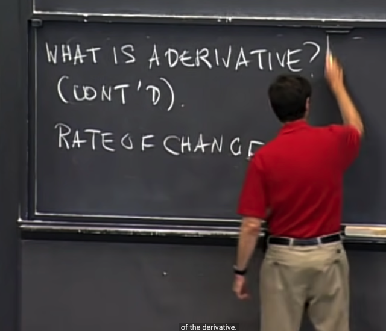</kbd>

> [!NOTE]
> Đại ý là, bài trước ta đã hiểu về derivative là như vậy (độ dốc
> của tiếp tuyến). Nhưng hôm nay ta sẽ tiếp tục bàn về ý nghĩa
> của derivative nhưng ở GÓC NHÌN THỨ 2, gs cho rằng đây là
> cái RẤT QUAN TRỌNG. Đó là hiểu về derivative theo ý nghĩa:
> RATE OF CHANGE

 

<kbd>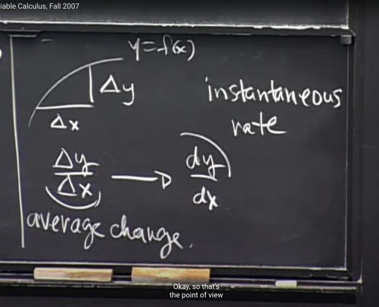</kbd>

> [!NOTE]
> Ở góc nhìn thứ hai này, khi x change một khoảng delta_x, thì /
> và function change một khoảng delta_y. Thì delta_y / delta_x giống 
> như rate of change trung bình. Và khi xét trên một khoảng vô cùng
> nhỏ, thì nó trở thành dy/dx mang ý nghĩa là rate of change tức thời
> (instantaneous)

 

<kbd>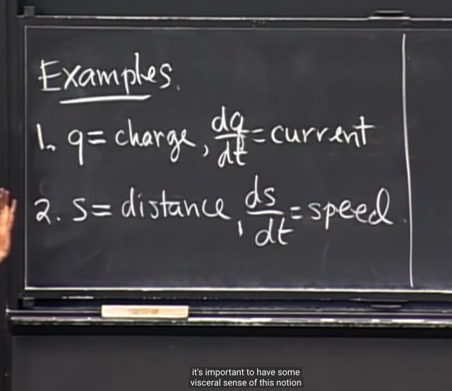</kbd>

> [!NOTE]
> Gs lấy ví dụ như s là quãng đường di
> chuỷên thì ds/dt là vận tốc

 

<kbd>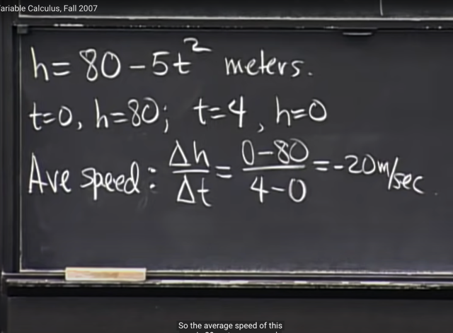</kbd>

> [!NOTE]
> Lấy ví dụ ta thả quả dưa từ sân thượng xuống đất, và độ cao của quả
> dưa được thể hiện theo t bởi h = 80 - 5*t^2. Thế thì, tại t = 0, h = 80.
> Còn tại t = 4, h = 0. Từ đó ta tính delta_h / delta_t = -20 m/sec. Và đây
> mang ý nghĩa là average speed

 

<kbd>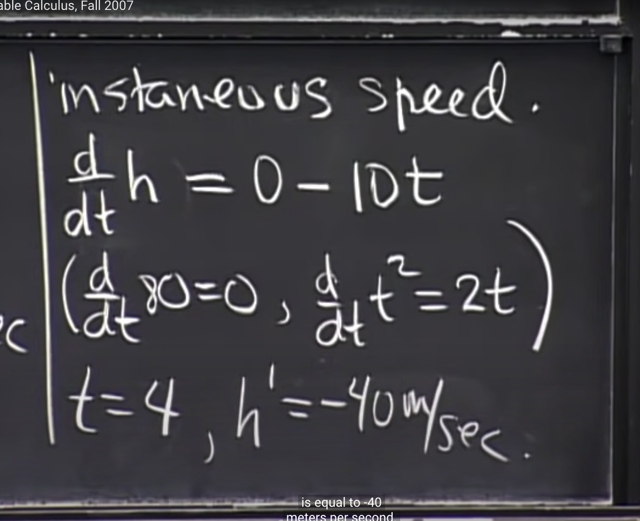</kbd>

> [!NOTE]
> Nhưng cái mà ta quan tâm là vận tốc tức thời. Ta sẽ lấy derivative
> của h w.r.t t: dh/dt. Và sử dụng công thức mà ta đã chứng minh là d
> x^n / dx = n*x^(n-1) với n=0,1,2...
>
> Thì d 80 / dt coi như d 80*t^0 /dt = 80*0*t^-1 = 0. Và d t^2 / dt = 2t từ
> đó ta có dh/dt = -10t
>
> Từ đó khi t = 4, ta có vận tốc tức thời là -40 m/s

 

<kbd>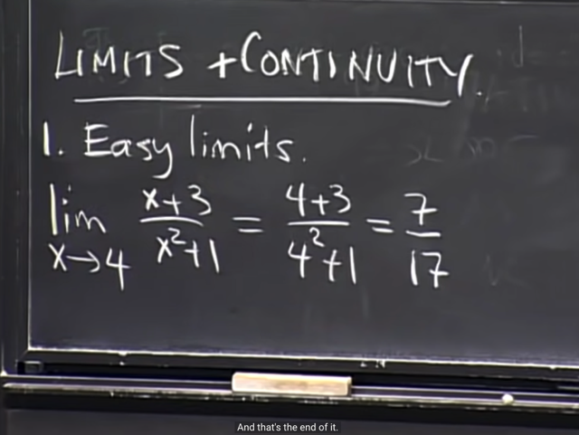</kbd>

> [!NOTE]
> Ta sẽ học qua Limit và Continuity. Gs cho rằng nó sẽ giúp ta derive
> mọi công thức derivative mà ta sẽ cần cho việc vi tích phân
>
> Thế thì đầu tiên gs nói ông cho rằng có hai loại limit, loại thứ nhất
> là "Easy" limit ví dụ như cái này lim x-> 4 của (x+3)/(x^2+1) thì
> để tính limit này chỉ việc thế x = 4 vào là xong.

 

<kbd>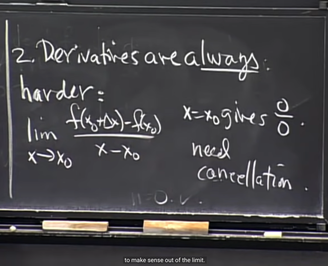</kbd>

> [!NOTE]
> Thế thì loại thứ hai, mà điển hình là khi ta tính derivative, theo định nghĩa
> mà bài trước đã học, nó là limit của tỉ lệ giữa delta f = f(x0+deltax) - f(x0)
> với delta x = x - x0 khi x -> x0
>
> Thì nếu thế x = x0 vào thì ta luôn có dạng 0/0. Do đó ta cần một số cách
> làm khác.

 

<kbd>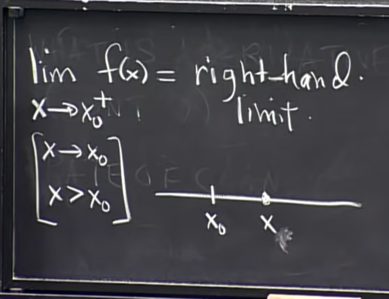</kbd>

> [!NOTE]
> Tiếp gs nói về right-hand limit và left-hand limit. Với right-hand limit
> kí hiệu là lim x-> x0+ f(x) thì có nghĩa là x > x0 và do đó nó tiếp cận
> x0 từ bên phải (right-hand)

 

<kbd>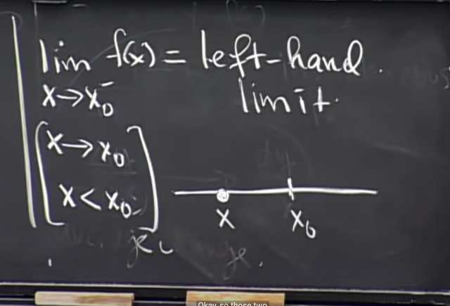</kbd>

> [!NOTE]
> Ngược lại left-hand limit là  lim x->x0- f(x) có nghĩa là x < x0,
> và tiến về x0 ở bên trái

 

<kbd>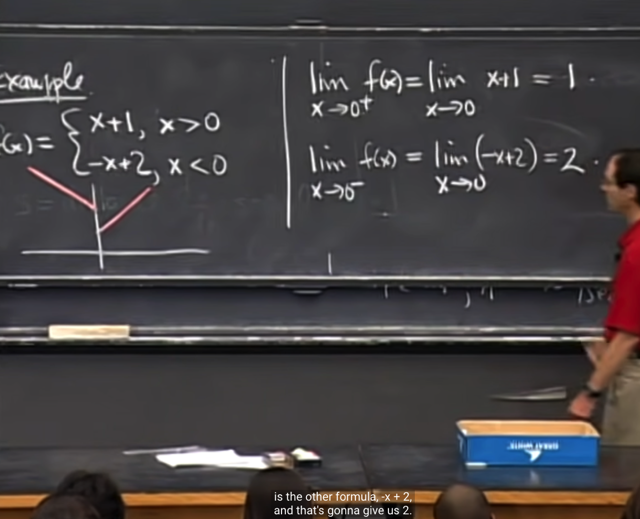</kbd>

> [!NOTE]
> Gs cho một ví dụ về function f(x) như vầy, tức là khi x>0 thì f(x) = x+1
> và khi x<0 thì f(x) = -x+2
>
> Vậy, khi dễ hiểu tính lim x->0+ của f(x) thì nó sẽ chính là lim x->0 của
> x+1 và bằng 1. Và ngược lại khi tính lim x->0- của f(x) thì nó chính là
> lim x->0 của -x+2 và kết qủa ra 2

 

<kbd>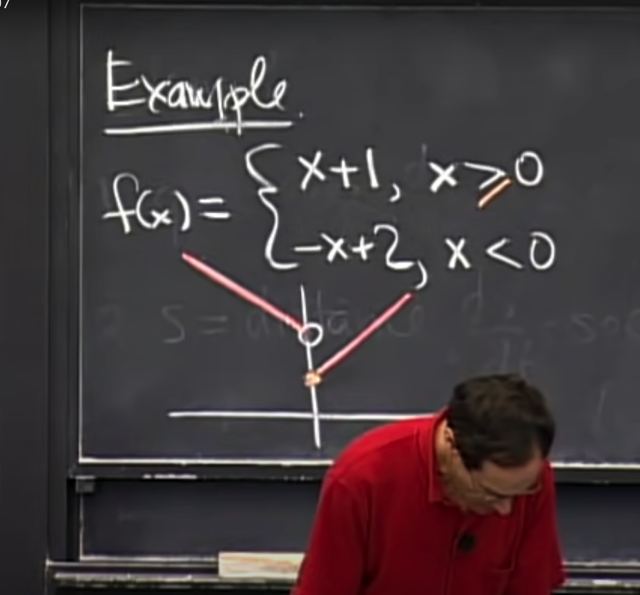</kbd>

> [!NOTE]
> Thế thì nếu ta muốn define thêm tại x = 0 thì f(x) như thế nào (vì
> vừa rồi vẫn chưa biết x = 0 thì f ra sao) thì ta có thể dùng notation
> như vầy, ví dụ x>=0 thì f(x) = x+1 thì hình ảnh thường được dùng
> là tại x = 0 ở phần đồ thị x+1 sẽ là dấu chấm đặc. Còn tại x = 0 ở
> nhánh -x+2 là vòng tròn rỗng

 

<kbd>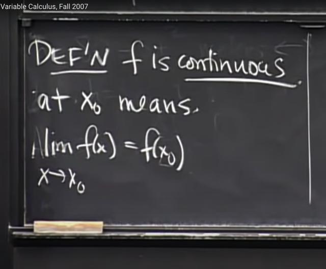</kbd>

🔗 **Related:** [LEC 4: CHAIN RULE](untitled.md#node-84)

> [!NOTE]
> Ta sẽ biết về định nghĩa của của khái niệm tính continuous của hàm f
> đó là, khi nói hàm f liên tục tại x0 thì điều này có nghĩa là lim x->x0 f(x)
> = f(x0)

 

<kbd>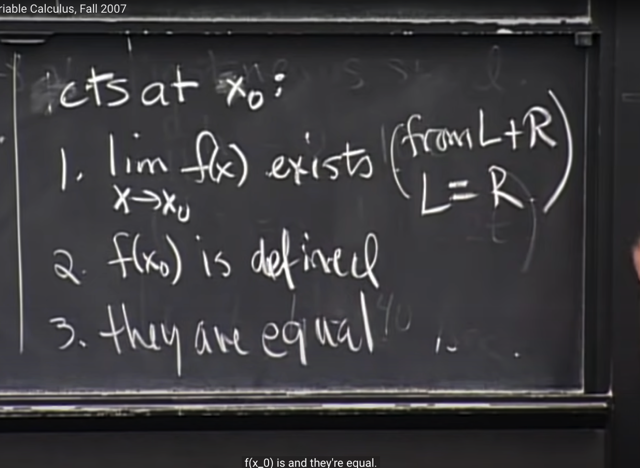</kbd>

> [!NOTE]
> Và điều đó hàm chứa 3 ý nghĩa sau:
>
> 1) limit của f(x) khi x->x0 tồn tại cả từ bên trái lẫn bên phải (left-hand
> và right-hand) và chúng bằng nhau.
>
> 2) f(x0) có xác định
>
> 3) Và chúng bằng nhau

 

<kbd>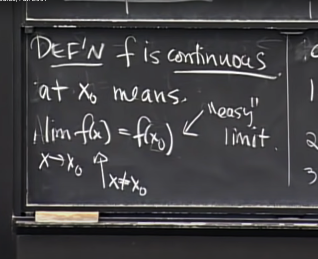</kbd>

> [!NOTE]
> Gs nói đại khái là, điều cần lưu ý của định nghĩa này đó là nó có
> nghĩa là hai phần hoàn toàn khác nhau. Ví dụ, phần bên trái khi 
> tính sẽ không dính gì đến x0. Còn phần bên phải thì thì là easy
> limit, tức là có thể gắn x0 vào để có kết quả.
>
> Chưa hiểu lắm nhưng có thể sẽ rõ hơn khi làm qua các ví dụ

 

<kbd>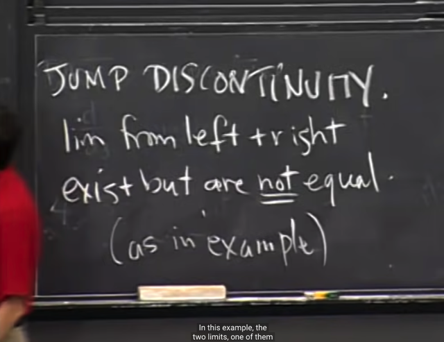</kbd>

> [!NOTE]
> Và từ đó ta có khái niệm JUMP DISCONTINUITY (bước nhảy gián
> đoạn). Đó chính là trong ví dụ hồi nãy, khi right-hand limit và left-hand
> limit đều tồn tại nhưng hai cái không bằng nhau.

 

<kbd>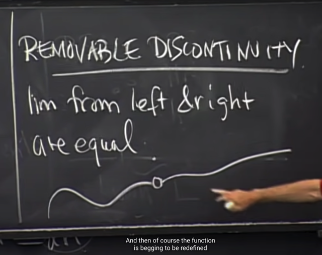</kbd>

> [!NOTE]
> Tiếp theo là một khái niệm nữa gọi là REMOVABLE DISCONTINUITY,
> Đại khái là khi ta có một function có limit bên trái và bên phải bằng nhau
> nhưng giống như tron hình ảnh này, function liên tục nhưng bị thiếu 
> một điểm tạo thành một cái lỗ như vầy, mà tại đó có thể function không
> xác định hoặc thể hiện bởi cái điểm ở trên.

 

<kbd>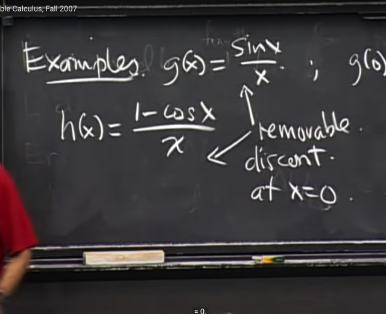</kbd>

> [!NOTE]
> Gs lấy ví dụ là function g(x) = sin(x) / x và h(x) = (1-cos(x)) / x. Cả
> hai đều là các function removable discontinuity tại x = 0.

 

<kbd>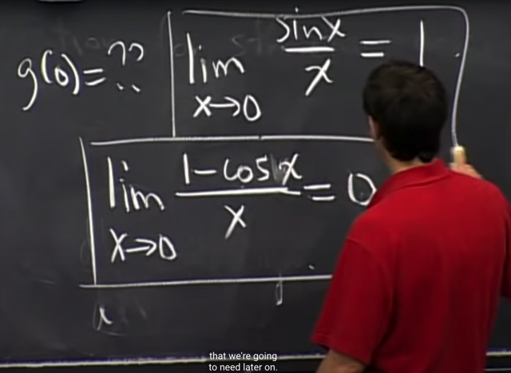</kbd>

> [!NOTE]
> Và cuối bài hoặc bài sau ta sẽ chứng minh, tính ra limit
> của chúng khi x -> 0 thật sự sẽ là 1. Trong khi đó dễ thấy
> cả hai đều không xác định tại x = 0

 

<kbd>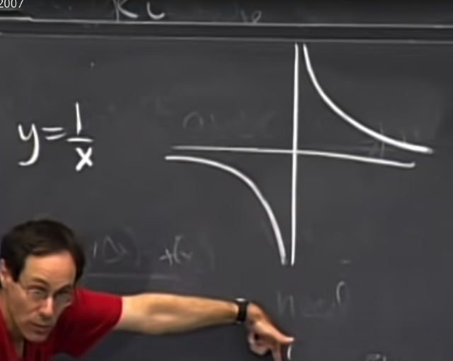</kbd>

<kbd></kbd>

<kbd>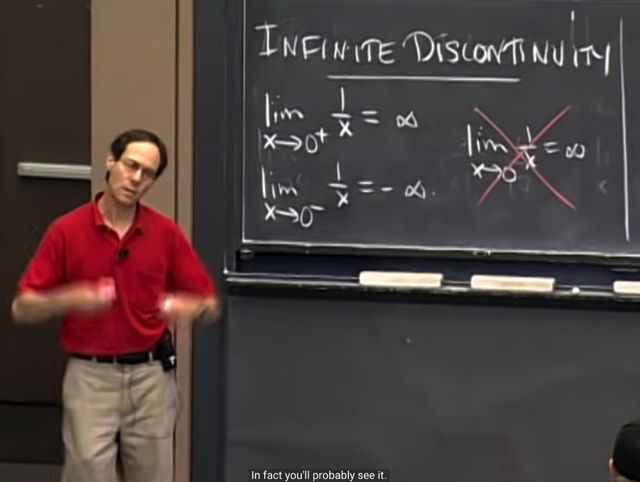</kbd>

> [!NOTE]
> Gs nói tiếp về dạng DISCONTINUITY thứ 3 là INFINITE
> DISCONTINUITY. Lấy ví dụ này, khi ta có hyperbola y = 1/x. Khi đó, ta
> sẽ có right hand  limit tại x sẽ là = + infinity còn left hand limit tại x sẽ là
> -infinity (có thể thấy trên đồ thị nếu ta đi về 0 từ bên phải thí nhánh
> hyperbola sẽ vọt  lên, ngược lại nếu ta đi từ bên trái thì f sẽ cắm đầu
> xuống -> -infinity)
>
> Gs cũng nói một số sách ghi là limit 1/x tại x -> 0 = infinity là sai.

 

<kbd>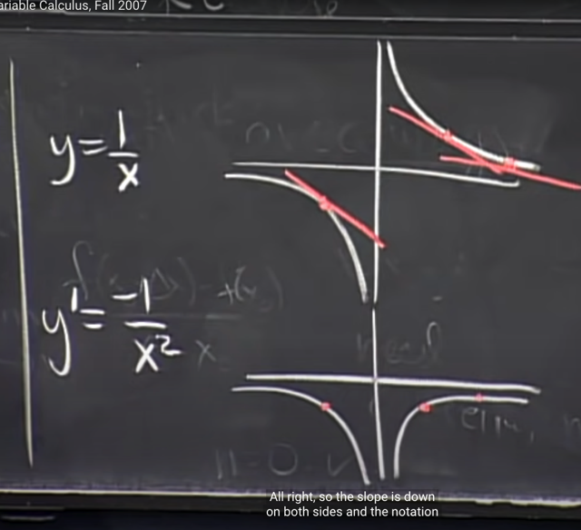</kbd>

> [!NOTE]
> Tiếp gs nói về việc ta đã biết derivative của y: y' = -1 / x^2. Và nếu
> vẽ đồ thị của nó ra thì nó sẽ như vầy.
>
> Gs nhấn mạnh rằng, sẽ sai lầm nếu ta nghĩ đồ thị của derivative
> phải giống giống đồ thị của hàm f. Bởi vì nên nhớ ý nghĩa derivative
> là độ dốc. Nên đồ thị của y' sẽ thể hiện sự thay đổi của độ dốc.

 

<kbd>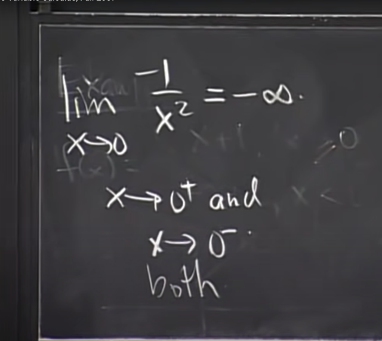</kbd>

> [!NOTE]
> Và với f' thì cả left và right limit của nó tại 0 đều bằng -infinity. Nhưng
> again, nó không xác định tại x = 0 và đây cũng là function có tính 
> infinity discontinuity tại 0

 

<kbd>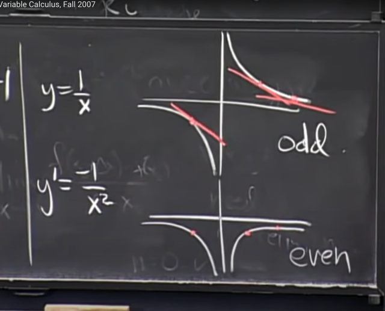</kbd>

> [!NOTE]
> Một điểm nữa gs cho biết, y = 1/x là hàm lẻ (là hàm mà f(x) = -
> f(-x) thì derivative của nó gs nói rằng sẽ luôn là hàm chẵn
> (event) (là hàm mà g(x) = g(-x))

 

<kbd>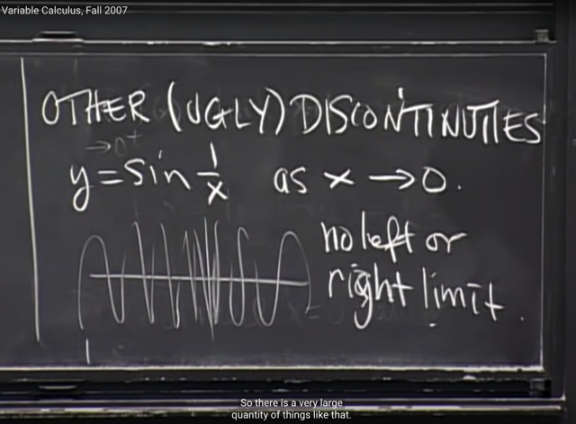</kbd>

> [!NOTE]
> Một dạng cuối cùng gọi là OTHER UGLY DISCONTINUITIES, ví
> dụ hàm y =sin(1/x), khi x->0 thì không có cả left lẫn right hand
> limit. Nhưng gs nói trong class này ta sẽ không gặp các function
> như vậy

 

<kbd>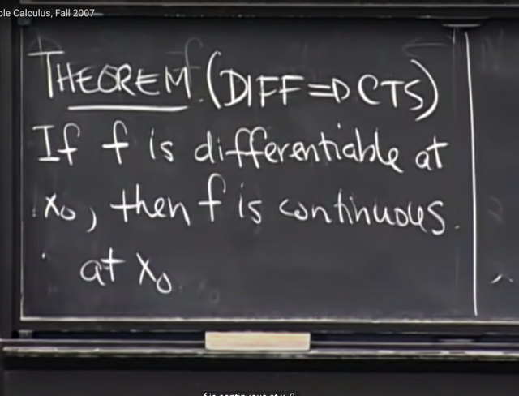</kbd>

> [!NOTE]
> Tiếp theo ta sẽ học một Theorem quan trọng nói rằng: Nếu hàm f
> **differentiable** (khả vi) tại x0 thì đồng nghĩa nó cũng sẽ **continuous**
> tại x0

 

<kbd>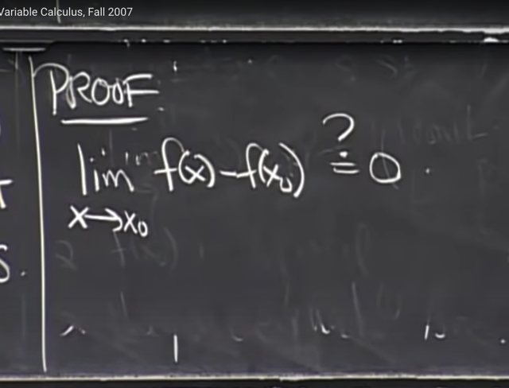</kbd>

> [!NOTE]
> Thế thì để chứng minh theorem này, cái ta chỉ cần chứng minh là
> **limit của f(x) - f(x0) tại x0 là bằng 0**.
>
> Vì khi đó cũng đồng nghĩa là**limit của  f(x) tại x->x0 là bằng f(x0)(*)**
> và đây chính là định nghĩa rằng f continuous tại x0
>
> (*) vì sao vì khi x->0 mà khác biệt giữa f(x) và f(x0) = 0 thì trừ hai vế
> cho f(x0) thì ta sẽ đồng nghĩa với khi x->0 thì f(x) -> f(x0)

 

<kbd>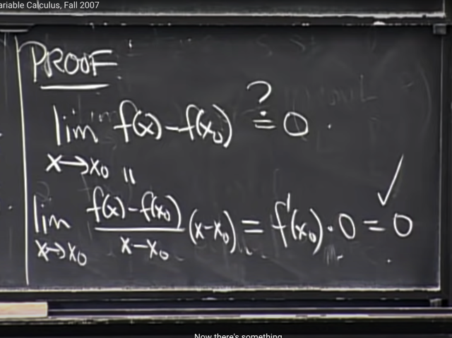</kbd>

> [!NOTE]
> Thế thì ta sẽ nhân thêm và chia bớt cho x-x0, để rồi khi x->x0 thì 
> [f(x)-f(x0)]/(x-x0) chính là f'(x0) mà cái này đã tồn tại như điều kiện
> ban đầu đã nói. Còn là, với x-x0 thì khi x->x0 cái này sẽ -> 0.
>
> Vậy limit = 0 và ta đã chứng minh xong.

 

<kbd>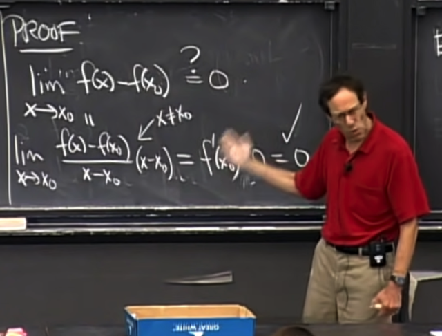</kbd>

> [!NOTE]
> Thế thì trong cách làm vừa rồi, nhìn thì có vẻ có vấn đề khi ta nhân và
> chia đi cho x-x0 trong khi đó khi x->x0 thì x-x0 = 0 khiến việc chia cho 0
> có vẻ không hợp lệ.
>
> Tuy nhiên, gs nhấn mạnh một ý hồi nãy đó là, khi tính limit, ta phải hiểu
> là kiểu như ta chưa / không bao giờ đụng tới x0, để từ đó x-x0 KHÔNG
> BẰNG 0. Nên x-x0 dù nhỏ nhưng vẫn khác 0, giúp cho việc nhân và chia
> cho x-x0 HOÀN TOÀN HỢP LỆ.

 

