# Lec 3: Derivatives

📊 **Progress:** `21` Notes | `23` Screenshots

---

<kbd>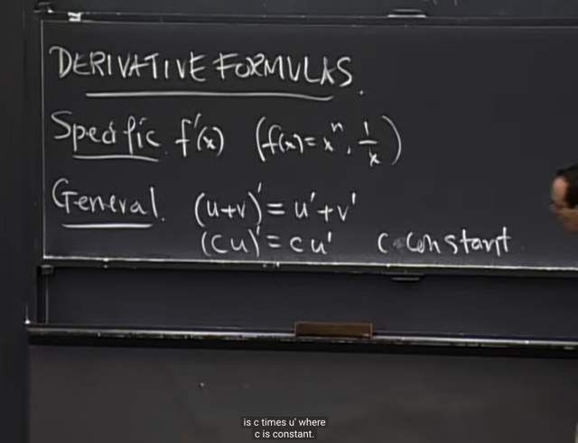</kbd>

> [!NOTE]
> Bài này ta sẽ xây dựng công thức để tính derivative của một số function
> cụ thể cũng như khái quát lên với bất cứ function bằng cách dùng các 
> tool như (u+v)' = u' + v', (cu)' = cu' (c là constant)

 

<kbd>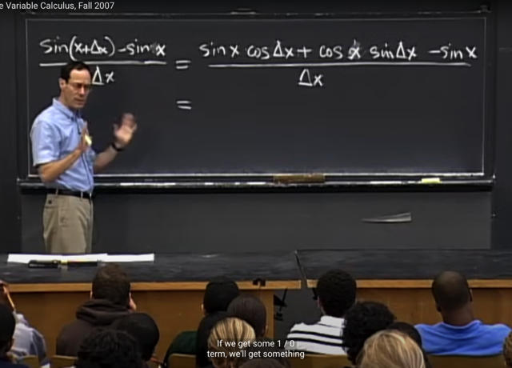</kbd>

🔗 **Related:** [LEC 1: RATE OF CHANGE](untitled.md#node-10)

> [!NOTE]
> Đầu tiên ta sẽ tính derivative của f = sin(x). Theo định nghĩa, ta sẽ
> thiết lập delta_f / delta_x (gọi là **DIFFERENCE QUOTIENT**)
>
> Và ta sẽ tìm limit của cái này khi delta_x -> 0.
>
> Thế thì, ta sẽ dùng công thức sin(a+b) = sin(a)cos(b) - cos(a)sin(b)
> để triển khai sin(x+delta_x) ra.

 

<kbd>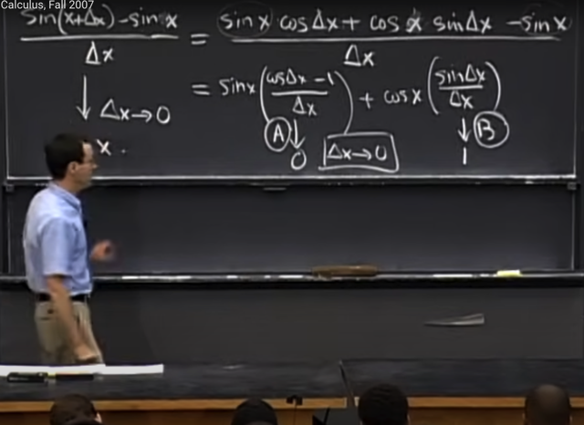</kbd>

> [!NOTE]
> Thế thì ông mới tách difference quotient thành hai biểu thức:
> sin[x(cos(delta_x) - 1))/delta_x] và cos[x(sin(delta_x)/delta_x)]
>
> Và limit của cos(delta_x) - 1))/delta_x khi delta_x -> 0 là bằng 0
>
> và limit của sin(delta_x)/delta_x khi delta_x -> 0 là bằng 1.
>
> Đây là hai cái (A), (B) mà **tí nữa ta sẽ chứng minh** sau.
>
> Để rồi **limit của sin(x)** khi delta_x -> 0 là bằng sin(x*0) + cos(x*1) =
> **cos(x)**

 

<kbd>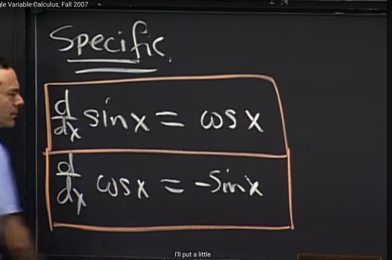</kbd>

> [!NOTE]
> Để từ đó ta có công thức đạo
> hàm của sin(x) = cos(x).

 

<kbd>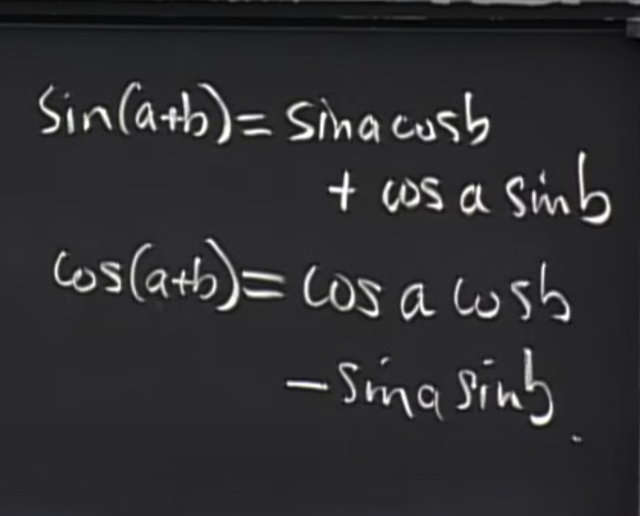</kbd>

> [!NOTE]
> Tương tự, để tính derivative của cos(x) ta cũng nhớ lại công thức
> cos(a+b) = cos(a)cos(b) - sin(a)sin(b) trước.

 

<kbd>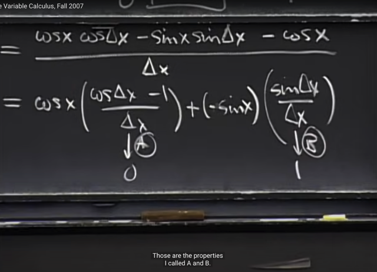</kbd>

> [!NOTE]
> Để từ đó, difference quotient trong trường hợp này là
> [cos(x+delta_x)-cos(x)] / delta_x có thể triển khai ra là
>
> cos[x(cos(delta_x) - 1) / delta_x] và - sin(x)*[sin(delta_x) / delta_x]
>
> và tiếp tục dùng hai properties (A) và (B) (mà ta sẽ chứng minh ngay
> sau đây) ta sẽ có cos'(x) = -sin(x0

 

<kbd>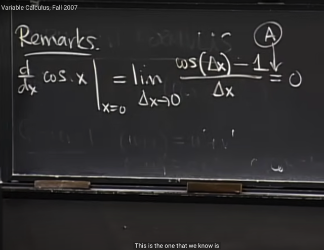</kbd>

> [!NOTE]
> Thế thì trước khi chứng minh A và B, gs remark thêm vai trò của A, B:
>
> Đó là gỉa sử ta muốn tính đạo hàm của cos(x) tại 0, theo định nghĩa
> đó là limit khi delta_x -> 0 của [cos(0+delta_x) - cos(0)] / delta_x
> và cái này bằng [cos(delta_x) - 1] / delta_x
>
> Và với property A thì  cos(delta_x) - 1] / delta_x = 0, để rồi đúng với
> kết quả là cos'(0) = -sin(0) = 0

 

<kbd>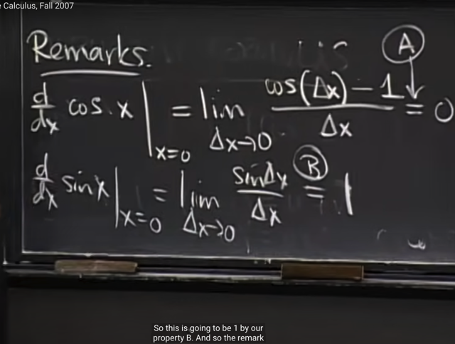</kbd>

> [!NOTE]
> Và tương tự, khi tính đạo hàm của sin(x) tại 0, ta sẽ thấy
> nhờ B = 1 nên kết quả ra 1, tương thích với công thức
> đạo hàm hàm sin(0) = cos(0) = 1

 

<kbd>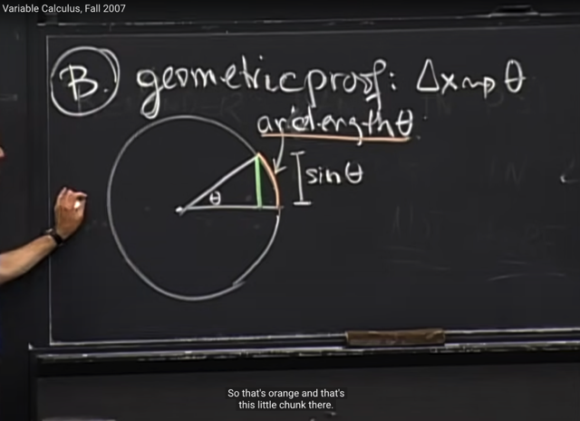</kbd>

> [!NOTE]
> Thế thì đại khái là ta sẽ chứng minh bằng hình học (geometric proof)
> vì theo gs, hình học là cách duy nhất ta có thể thể hiện sin(x) và
> cos(x).
>
> Ông vẽ đường tròn đơn vị (bán kính 1) với góc thêta. Thế thì dễ hiểu,
> độ dài đoạn màu xanh sẽ là **sin(theta)** (tìm sin lấy đối chia huyền, mà
> huyền là bán kinh = 1) nên sin = độ dài cạnh đối diện).
>
> Ngoài ra, góc theta cũng ứng với cung có độ dài arclength(theta) và
> nó bằng theta (vì chu vi đường tròn là 2pi*r = 2pi (r=1) ứng với góc
> 2pi, thì với cung ứng với góc theta thì chiều dài cung là 2pi*r * theta /
> 2pi = **theta**

 

<kbd>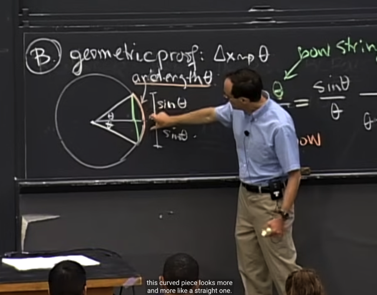</kbd>

<kbd></kbd>

<kbd>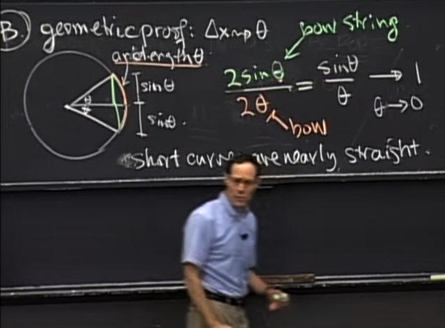</kbd>

> [!NOTE]
> Đại khái là ta có thể x2 lên để có góc 2*theta ứng với cung dài
> 2*theta, và đoạn màu xanh sẽ là 2*sin(theta). Và theo hình học thì
> khi theta nhỏ dần về 0 thì cung (màu cam) sẽ dần dần ngày càng
> gần giống với đoạn thẳng, và chiều dài của nó sẽ ngày càng bằng
> đoạn màu xanh
>
> Do đó limit của 2sin(theta)/2theta = **limit cuả sin(theta)/theta = 1
> khi theta -> 0
>
> Đây chính là chứng minh theo hình học của (B):
>
> lim x->0 sin(x) / x = 1**Và nguyên tắc mà ta dùng để chứng minh đó là là**đường cong ngắn 
> thì coi như thẳng**

 

<kbd>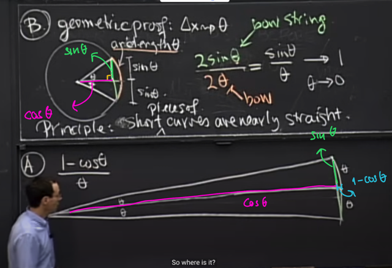</kbd>

> [!NOTE]
> Tiếp, ta sẽ chứng minh property A. Gs vẽ lại hình ảnh trên bự hơn,
> cũng hai góc theta ứng với hai cung dài theta, và đường màu xanh
> (2 đoạn, thì độ dài mỗi đoạn là sin(theta)). Thì dễ hiểu đường màu
> tím chính là cos(theta), và do đó đoạn nhỏ màu xanh dương, chính
> là r - cos(theta) = 1**- cos(theta)**

 

<kbd>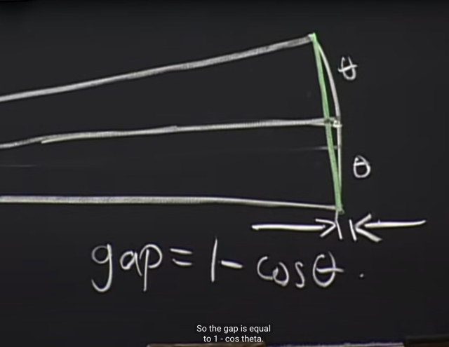</kbd>

> [!NOTE]
> Đoạn nhỏ này chính là 1 - cos(theta)
>
> Thế thì, khi theta -> 0 thì đoạn nhỏ này (1-cos(theta)) sẽ nhỏ về 0
> rất nhanh. Nên [1 - cos(theta)] / theta -> 0
>
> Có sinh viên hỏi đúng chỗ này, là có phải vì theta -> 0 nên ta sẽ có
> kết quả là 0/0 không. Nhưng gs nói rằng, tuy theta (tức góc theta
> cũng như chiều dài cung = theta) cũng nhỏ về 0, nhưng như hình
> ảnh cho thấy đoạn **nhỏ 1 - cos(theta) sẽ nhỏ về 0 nhanh hơn** nên
> kết quả là**tỉ lệ của đoạn này trên theta sẽ tiến về 0**
>
> Và đây là chứng minh của (A).

 

<kbd>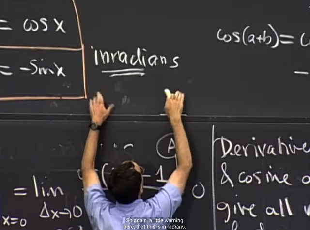</kbd>

> [!NOTE]
> Chỗ này có câu hỏi mà student ở VN có lẽ không thắc
> mắc, đó là tại sao chiều dài cung lại là theta.

 

<kbd>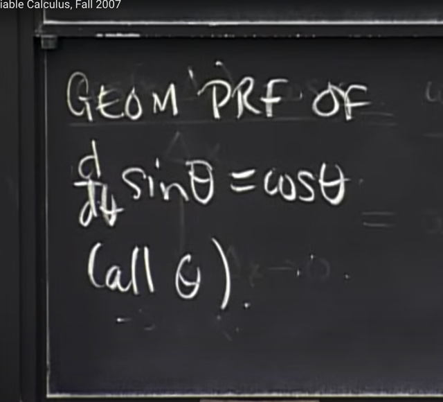</kbd>

> [!NOTE]
> Thế thì vừa rồi, chỉ là ta chứng minh đạo hàm của sin(theta) =
> cos(theta) tại theta = 0. Tiếp theo gs sẽ chứng minh d sin(theta) /
> dtheta = cos(theta) tại mọi theta

 

<kbd>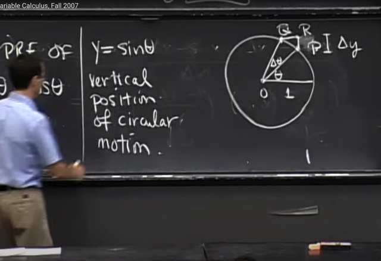</kbd>

> [!NOTE]
> Gs set up như vầy, cho điểm P trên unit circle ứng với góc theta, và khi
> nó di chuyển để tạo góc delta_theta thì nó tới điểm Q, ứng với theta+
> delta_theta.
>
> Khi đó, nếu tính đoạn vuông góc với trục x PR, thì nó chính là delta_y (y
> = sin(theta)) (vì đây là difference giữa sin(theta+delta_theta) và sin(theta)
>
> Và như vậy ta cần tìm hiểu tỉ lệ giữa R (delta_y = delta_sin(theta)) với
> delta_theta thì đó chính là đạo hàm của sin(theta) theo theta.

 

<kbd>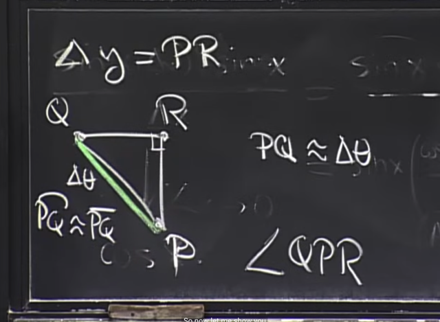</kbd>

> [!NOTE]
> đại khái ta sẽ xem xét kĩ hơn là hình ảnh của 3 điểm Q,R,P. Chú ý
> đường màu trắng nối giữa Q, P là một phần của đường trong, dù rất
> nhỏ, do đó nó là một cung. Và dễ hiểu chiều dài cung là delta_theta*r
> = delta_theta (vì r = 1, và cung này ứng với góc delta_theta.
>
> Còn đoạn màu xanh lá PQ đương nhiên là khi delta_theta vô cùng
> nhỏ, ta biết nó sẽ xấp xỉ bằng chiều dài cung PQ, để rồi PQ ~=
> delta_theta.
>
> Và cái ta cần làm tiếp theo là tìm góc QPR, khi đó, dựa vào việc đây
> là tam giác vuông, đã biết cạnh huyền (hypotenuse), nếu biết góc
> QPR thì ta sẽ tìm được đoạn PR

 

<kbd>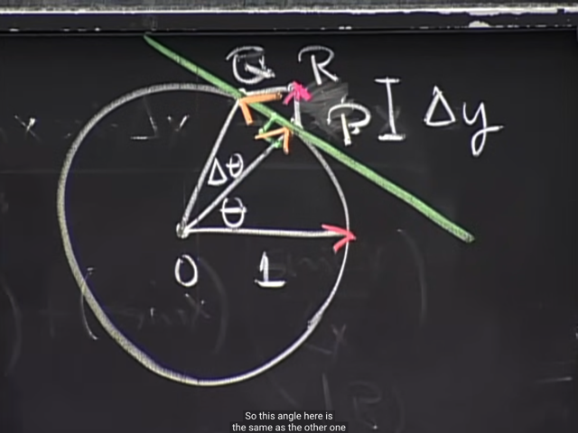</kbd>

> [!NOTE]
> Thế thì đầu tiên, nhận định rằng khi cung QP vô cùng nhỏ nó coi như
> trùng với đoạn thẳng PO. Và khi đó P**Q coi như trùng vói tiếp tuyến tại
> P, nên PQ vuông góc với OP**.
>
> Và khi đó góc**QPR thì dễ thấy nó chính là thêta**. Gs thích theo gs là
> khi ta xoa góc theta (tạo bởi horizontal line và OP một góc 90 độ) thì ta
> sẽ có QPR. Nhưng ta nhớ cấp hai đã học tính chất là khi hai góc có
> các cạnh vuông góc nhau thì nó bằng nhau.

 

<kbd>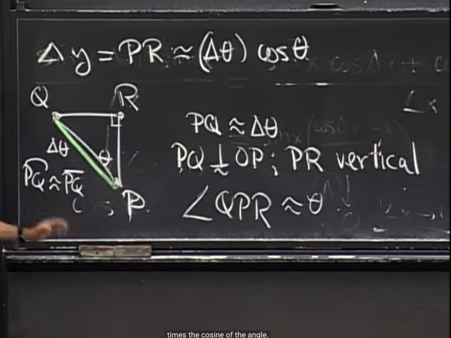</kbd>

> [!NOTE]
> Vậy ta có PQ coi như vuông góc OP, và QPR coi như bằng theta,
> nên từ đó ta tính ra **PR ~= (delta_theta) cos(theta)**(cạnh góc vuông
> bằng cạnh huyền * cos(góc kề))

 

<kbd>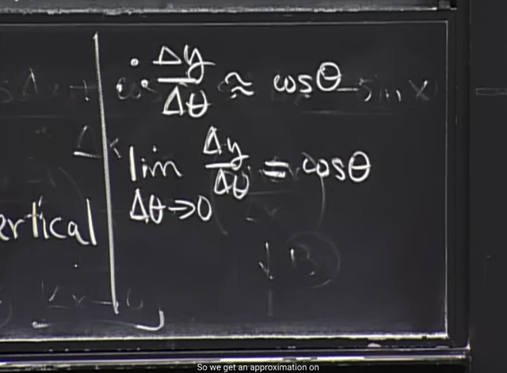</kbd>

> [!NOTE]
> Do đó delta_y / delta_theta chính là xấp xỉ cos(theta) có dấu xấp sỉ
> tại vì nãy giờ ta có dùng các xấp xỉ.
>
> Và khi cho delta_theta -> 0 thì ta có đạo hàm của y = sin(theta)
> = cos(theta) theo định nghĩa

 

<kbd>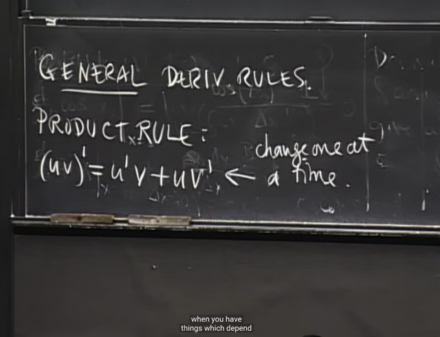</kbd>

> [!NOTE]
> Những phút cuối gs nói về một số general rule. Đầu tiên là quy
> tắc nhân (product rule): (uv)' = u'v = uv'
>
> Và gs cho rằng ta có thể hiểu nó theo cách thay đổi mỗi thứ mỗi
> lần. Tức là đầu tiên coi v như constant và tính đạo hàm theo ta
> sẽ có u'v. Sau đó coi u như constant và tính đạo hàm theo v ta
> có uv'. Sau đó cộng lại

 

<kbd>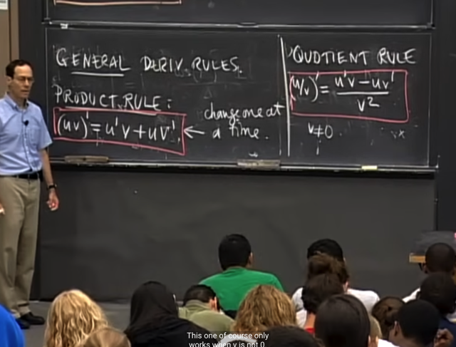</kbd>

> [!NOTE]
> Và rule thứ hai là Quotient rule. (u/v)' = (u'v - uv') / v^2
>
> Gs cho rằng ta sẽ chứng minh nó ở bài sau

 

