# Lec 4: Chain Rule

📊 **Progress:** `21` Notes | `22` Screenshots

---
<a id="node-80"></a>

<p align="center"><kbd>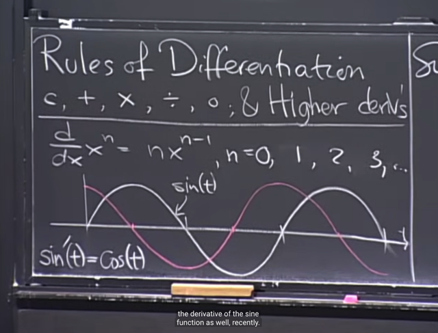</kbd></p>

<br>

<a id="node-81"></a>

<p align="center"><kbd>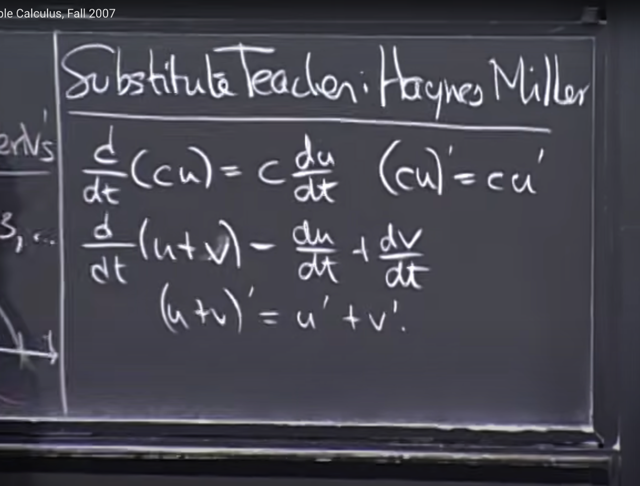</kbd></p>

> [!NOTE]
> Gs cho nói lại một số rule mà ta đã biết như `d(cu)/dt` `=` c `du/dt` hoặc
> có thể viết (cu)' `=` cu' (là hai cách viết theo Newton hoặc Leibniz)
>
> ```text
> Và sum rule d(u+v)/dt = du/dt + dv/dt hay (u+v)' = u' + v'
> ```

<br>

<a id="node-82"></a>

<p align="center"><kbd>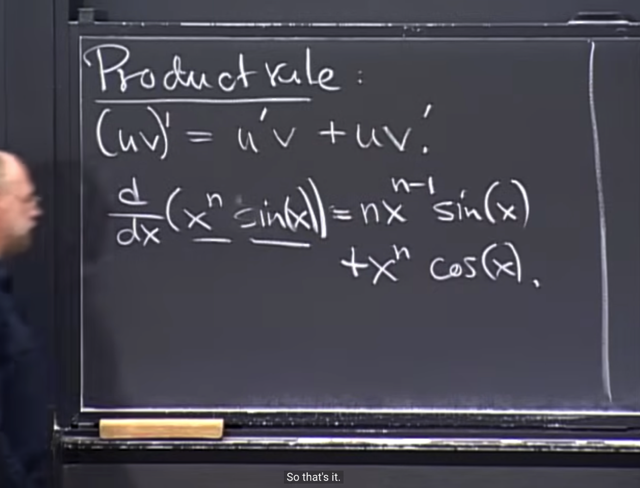</kbd></p>

> [!NOTE]
> Đầu tiên gs nhắc lại cho ta về product rule. Và lấy ví dụ, nó sẽ
> giúp ta tính đạo hàm của d(x^n sin(x))

<br>

<a id="node-83"></a>

<p align="center"><kbd>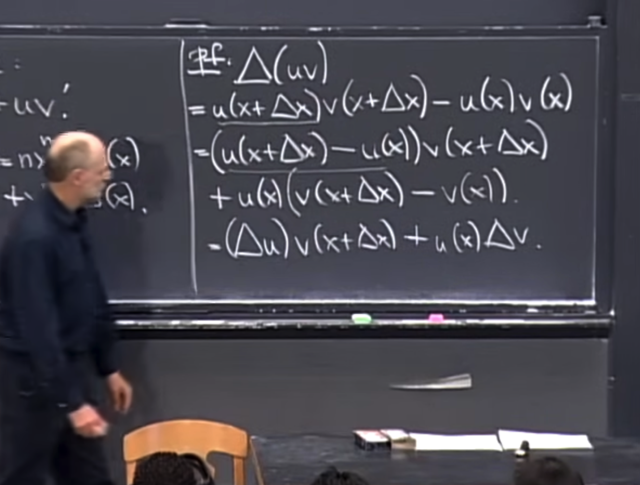</kbd></p>

> [!NOTE]
> Đại khái là để chứng minh, đầu tiên ta sẽ tính `delta_uv.`
>
> Đương nhiên nó sẽ bằng hàm uv evaluate tại `x+delta_x` trừ hàm uv
> evaluate tại x (chú ý là ở đây gs voi u, v là hàm theo x, tức u(x), v(x)
> đương nhiên nhân u với v thì cũng thành hàm uv là hàm theo x, [uv](x)
>
> ```text
> Vậy delta_uv = [uv](x+delta_x) - [uv](x). Ghi như vậy ý là hàm uv gộp.
> ```
> ```text
> Thế thì [uv](x) = u(x)*v(x) nên cái trên sẽ bằng u(x+delta_x)*v(x+delta+x)
> ```
>
> Để rồi, bằng cách cộng thêm và trừ bớt cho `u(x)v(x+delta_x),` ta có thể
> đưa nó về như vầy: **delta_u*v(x+delta_x) `+` u(x)*delta_v**

<br>

<a id="node-84"></a>

<p align="center"><kbd>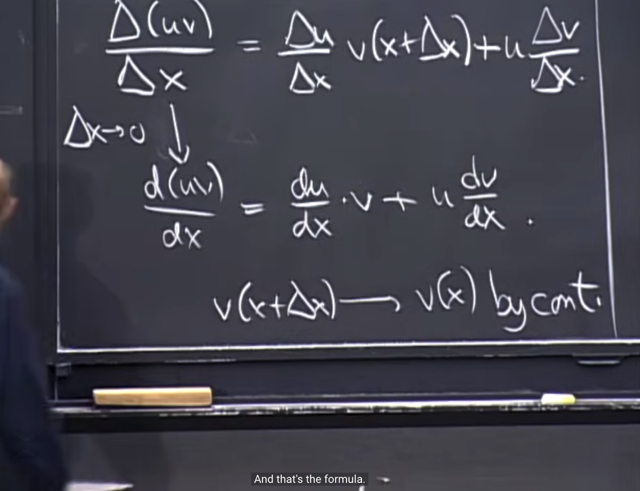</kbd></p>

🔗 **Related:** [LEC 2: LIMITS](untitled.md#node-41)

> [!NOTE]
> Và khi lấy limit của vế trái, limit `delta_x` `->` 0 của delta(uv) `/` delta(x)
> chính là định nghĩa của derivative của uv đối với x
>
> ```text
> Còn vế trái, khi lấy limit thì delta_u/delta_x * v(x+delta_x) sẽ bằng
> ```
> `du/dx` * v(x)
>
> Vì theo định nghĩa về tính liên tục (continuity) của hàm số đó là limit
> ```text
> của f(x) khi x-> x0 = f(x0) điều này tương đương limit khi delta_x -> 0
> ```
> của `f(x+delta_x)` `=` f(x)
>
> ```text
> còn limit của u delta_v/delta_x trở thành u dv/dx
> ```
>
> Như vậy là chứng minh xong

<br>

<a id="node-85"></a>

<p align="center"><kbd>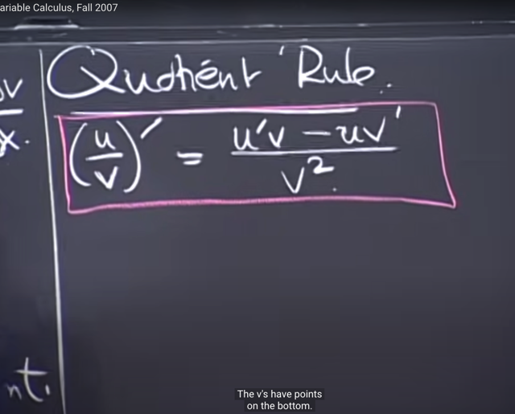</kbd></p>

> [!NOTE]
> Tiếp theo ta sẽ chứng
> minh Quotient Rule

<br>

<a id="node-86"></a>

<p align="center"><kbd>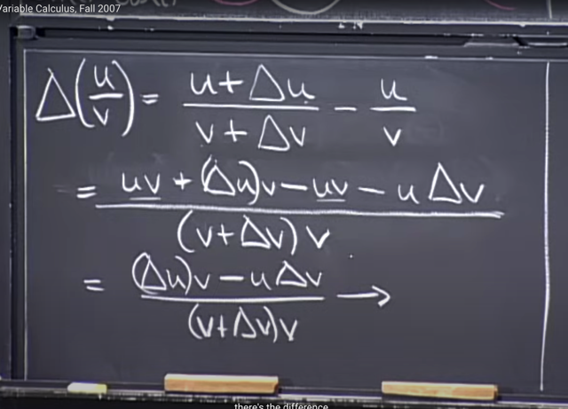</kbd></p>

> [!NOTE]
> Tương tự, cũng tính `delta_f` tức `delta(u/v)`
>
> ```text
> Thì delta_f = f(x+delta_x) - f(x). Nên với f(x) = u(x)/v(x) thì
> ```
> ```text
> f(x+delta_x) - f(x) = u(x+delta_x) / v(x+delta_x) - u(x)/v(x)
> ```
>
> Triển khai ra (quy đồng mẫu số) ta có: 
>
> ```text
> (uv + (delta_u)*v - uv - u*delta_v) / (v+delta_v)*v
> ```
>
> ```text
> = ((delta_u)*v - u*delta_v) / (v+delta_v)*v
> ```

<br>

<a id="node-87"></a>

<p align="center"><kbd>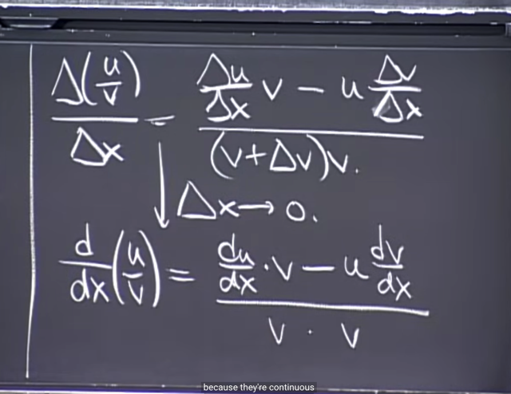</kbd></p>

> [!NOTE]
> ```text
> Và từ đó ta tính delta(f) / delta(x) = delta(u/v) / delta(x) và lấy
> ```
> limit thì tử số trở thành u'v `-` uv'. Còn mẫu số, `(v+delta_v).v` trở
> thành v.v `=` v^2.

<br>

<a id="node-88"></a>

<p align="center"><kbd>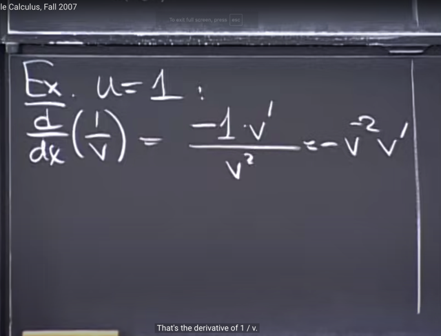</kbd></p>

> [!NOTE]
> Một ví dụ của việc áp dụng quotient rule để tính d `(1/v)` `/` dx (chú ý v là
> hàm theo x v(x)), và cái này khác với d `(1/x)` `/` dx mà ta biết là bằng
> `-1/x^2`
>
> Vậy thì để tính cái này thì gs cho rằng nếu áp dụng `d(u/v)` với u `=` 1.
> thì theo công thức ta sẽ có:
>
> (u'v `-` uv') `/` v^2 với:
>
> ```text
> u = 1 (tức u(x) = 1) thì du/dx, hay u' = 0. Do đó:
> ```
>
> `d(u/v)` `=` (0*v `-` 1*v') `/` v^2 `=` **-v'/v^2**Có thể thấy kết quả này tương tự như áp dụng chain rule:
>
> ```text
> d(1/v) / dx. Đặt w = 1/v. Ta có dw / dx = dw / dv * dv / dx
> ```
>
> ```text
> Và với việc w = 1/v thì dw/dv = -1/v^2
> ```
>
> Do đó kết quả trở thành **-1/v^2 * v'**

<br>

<a id="node-89"></a>

<p align="center"><kbd>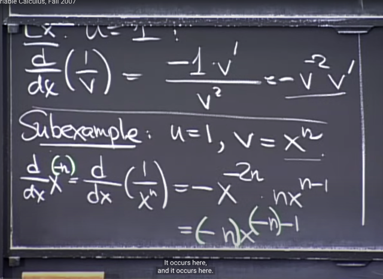</kbd></p>

> [!NOTE]
> Một ví dụ khác đó là tính derivative của `x^-n` hay `1/x^n.`
>
> ```text
> Áp dụng công thức mà ta vừa chứng minh d(1/v)/dx = -[v^(-2)]v'
> ```
>
> ```text
> d(1/x^n) / dx = -{[x^n]^(-2)} * (x^n)' = -x^(-2n) * n * x^(n-1)
> ```
>
> `=` `-x^(-2n` `+` n `-` 1) * n `=` **-n * x^(-n-1)**

<br>

<a id="node-90"></a>

<p align="center"><kbd>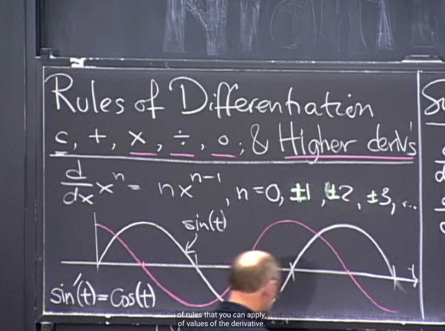</kbd></p>

> [!NOTE]
> Thế thì qua đó cho thấy rầng công thức `d(x^n)/dx` `=` `n*x^(n-1)`
> đúng với cả khi n âm

<br>

<a id="node-91"></a>

<p align="center"><kbd>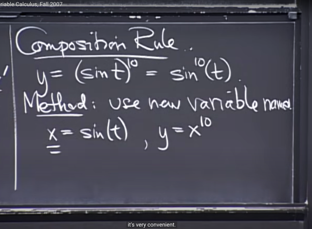</kbd></p>

> [!NOTE]
> Tiếp theo ta sẽ học qua Composition Rule (hay Chain Rule):
>
> Ví dụ ta cần tính y `=` (sin(t)]^10 cũng có thể được viết là sin^10 (t)
> (gs nói khi ta thấy cách ghi như vậy thì phải hiểu nó là lũy thừa 10
> của sin(t))
>
> Thế thì ta sẽ đặt một biến trung gian. x `=` sin(t), khi đó y (từ việc
> đang là function theo t, trở thành function theo x): y `=` x^10

<br>

<a id="node-92"></a>

<p align="center"><kbd>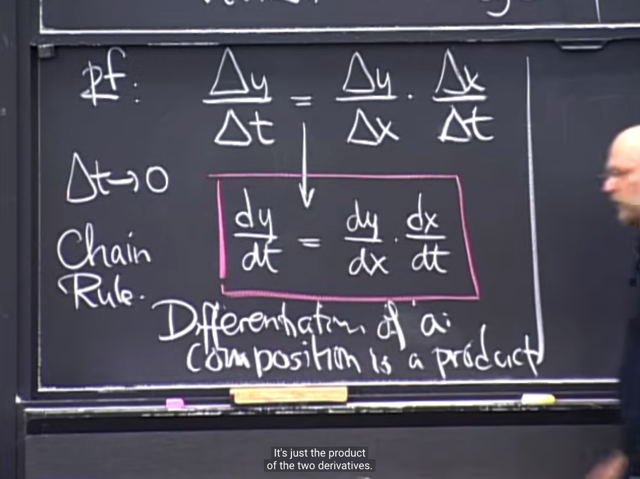</kbd></p>

> [!NOTE]
> Trước tiên gs chứng minh Chain Rule:
>
> Bắt đầu với `delta_y` `/` `delta_t` có thể được viết thành
> ```text
> (delta_y / delta_x) * (delta_x / delta_t)
> ```
>
> (vì ta có thể nhân và chia cho `delta_x,` là đại lượng khác 0).
>
> Thì khi lấy limit `delta_t` `->` 0 thì vế trái theo định nghĩa chính
> là `dy/dt.` Còn vế phải sẽ trở thành `dy/dx` * `dx/dt`

<br>

<a id="node-93"></a>

<p align="center"><kbd>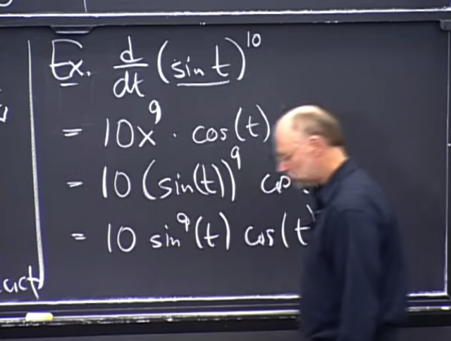</kbd></p>

> [!NOTE]
> Ví dụ, áp dụng chain rule ta có thể tính bài toán trên như vầy.
> ```text
> (ko có gì khó hiểu) chỉ là ta sẽ có dy/dx = 10x^9, dx/dt = cos(t)
> ```
> và thế x `=` sin(t) vào lại ta sẽ có 10*sin^9(t) cos(t)

<br>

<a id="node-94"></a>

<p align="center"><kbd>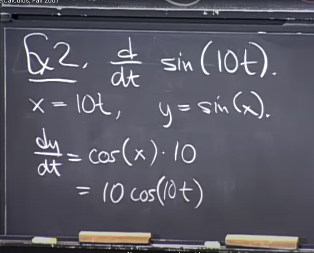</kbd></p>

> [!NOTE]
> Ví dụ 2, d sin(10t) `/` dt, thì tương tự ta cũng có thể đăt x `=` 10t, y `=`
> sin(x) và áp dụng Chain rule như vừa rồi để tính ra 10 cos(10t)

<br>

<a id="node-95"></a>

<p align="center"><kbd>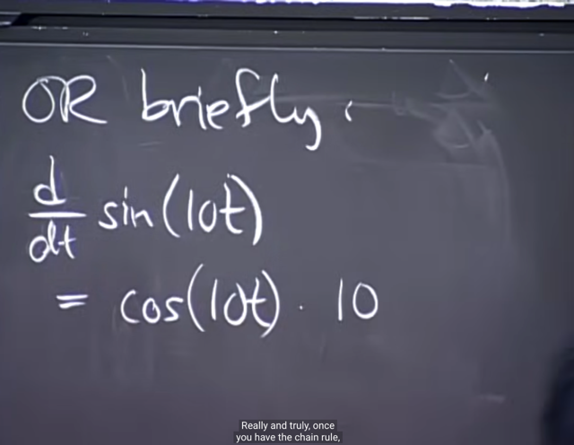</kbd></p>

> [!NOTE]
> Nhưng gs cho rằng ta có thể không cần đặt tên cho biến trung gian mà
> làm bước này trong đầu để có cách viết mà ta hay gặp trong các lớp 
> sau (không đặt tên cho biến trung gian sẽ nhanh hơn)
>
> ```text
> d sin(10t) / dt = d sin(10t) / d (10t) * d(10t) / dt = cos(10t) * 10
> ```

<br>

<a id="node-96"></a>

<p align="center"><kbd>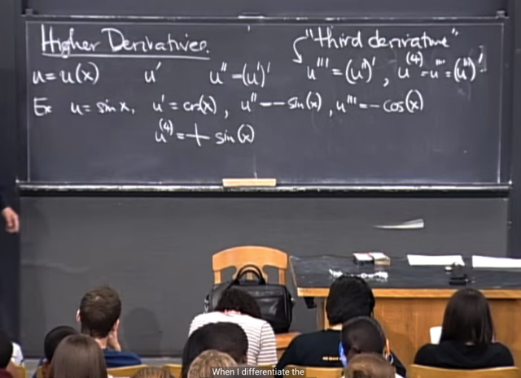</kbd></p>

> [!NOTE]
> Gs nói về higher derivative (đạo hàm bậc cao hơn (2)) thì đơn giản
> chỉ là tiếp tục tính derivative của derivative. 
>
> ```text
> Ví dụ như hàm u = sin(x), thì u' = cos(x), và u'' = [cos(x)]' = -sin(x)
> ```
> ```text
> để rồi u''' = (u'')' = (-sin(x))' = -cos(x). Và u'''', lúc này sẽ viết là u^(4)
> ```
> ```text
> sẽ bằng (u''')' = -cos(x)]' = --sin(x) = sin(x)
> ```

<br>

<a id="node-97"></a>

<p align="center"><kbd>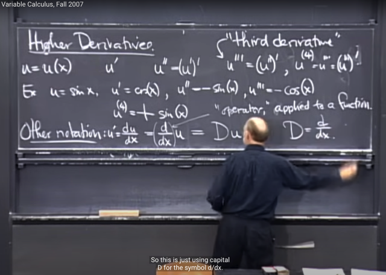</kbd></p>

> [!NOTE]
> Tiếp gs giới thiệu một số notation khác.
>
> Trong đó ta biết u' `=` `du/dx` và ta biết thêm ở đây là có thể còn
> một notation khác là `(d/dx)u` với ý nghĩa `(d/dx)` là một OPERATOR
> áp dụng vào function sẽ cho ra một function, và operator đó là
> "take derivative". 
>
> Và ta có thể dùng kí hiệu Du để represent `d/dx.` Nên ví dụ D(sin(x))
> chính là apply operator "take derivative" của hàm sin(x)

<br>

<a id="node-98"></a>

<p align="center"><kbd>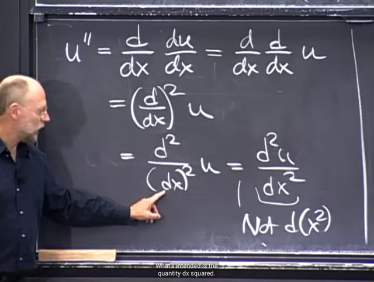</kbd></p>

> [!NOTE]
> Khi hiểu về notation `(d/dx)` là operator (take derivative) apply lên một
> function để cho ra một function mới. Thì ta sẽ hiểu u'' có thể được viết
> theo kiểu `(d/dx)(du/dx)` với ý nghĩa là apply "take derivative" `(d/dx)` lên
> function `du/dx`
>
> Và cũng bằng `(d/dx)` `(d/dx)` u với ý nghĩa là apply `d/dx` lên u, rồi apply
> `d/dx` lên kết quả đó.
>
> Để từ đó người ta có thể ghi thành `(d/dx)^2` u và tiến xa hơn là
> `d^2/(dx)^2` để rồi trở thành d^2 u `/` dx^2
>
> Và đây là khi ta cần nhớ những điều trên để hiểu d^2 u `/` dx^2 chính là
> `(d/dx)(d/dx)` u và đó là u'' chứ không phải hiểu dx^2 là d(x^2) là sai

<br>

<a id="node-99"></a>

<p align="center"><kbd>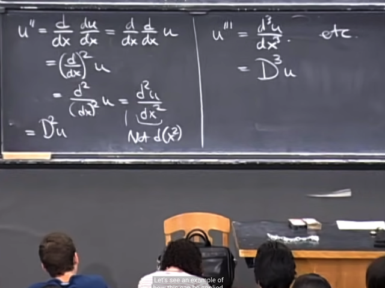</kbd></p>

> [!NOTE]
> Và với D là kí hiệu cho `d/dx` thì u'' cũng có thể thể hiện bằng D^2 u
>
> Tương tự u''' `=` d^3 u `/` dx^3 và cũng là D^3 u

<br>

<a id="node-100"></a>

<p align="center"><kbd>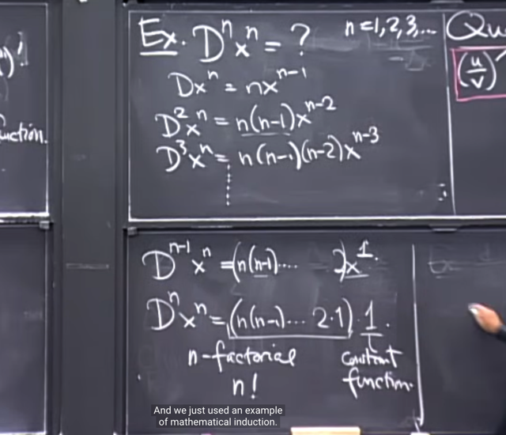</kbd></p>

> [!NOTE]
> Gs lấy ví dụ tính higher derivative của x^n.
>
> D x^n `=` (x^n)' `=` `n*x^n-1`
>
> ```text
> D^2 x^n = (x^n)'' = (n*x^n-1)' = n(n-1)*x^n-2
> ```
>
> ...
>
> D^n x^n `=` `(n(n-1).....2.1)*1` và đó chính là n! như vậy n'th derivative
> của x^n là constant có công thức n!

<br>

<a id="node-101"></a>

<p align="center"><kbd>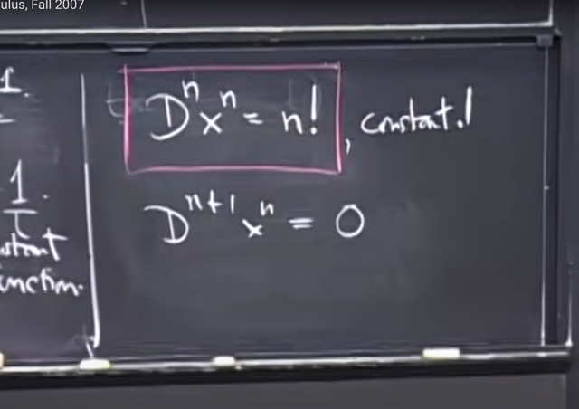</kbd></p>

> [!NOTE]
> Và cũng vì vậy mà `(n+1)'th` derivative của x^n là derivative
> của constant và chính là bằng 0

<br>

