# Lec 5: Implicit Differentiaion

📊 **Progress:** `29` Notes | `31` Screenshots

---

<kbd>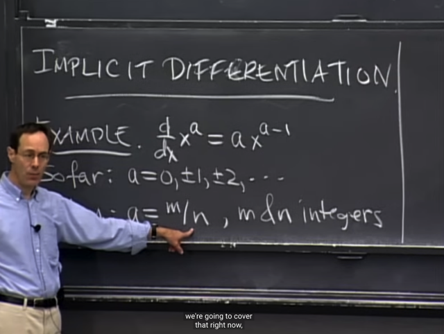</kbd>

> [!NOTE]
> Bài này ta sẽ thảo luận về **IMPLICIT DIFFERENTIATION**
>
> Gs nhắc lại các bài trước ta đã biết derivative của x^a với a = 0,
> +/-1,  +/-2.....
>
> Và bài này ta sẽ xem xét a = m/n với m là số nguyên.
>
> Trong 18.02, gs có nói về implicit differentiation, đó là:
>
> nếu ta có**y = f(x) thì dy = f'(x) dx**.
>
> Thì bài này ta sẽ chính thức được học về **implicit** **differentiation**.

 

<kbd>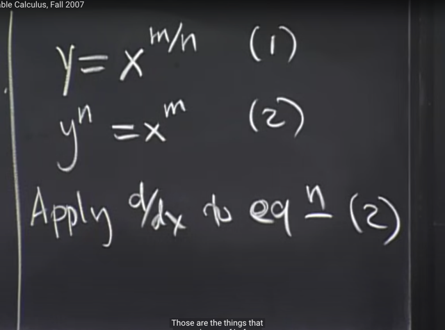</kbd>

> [!NOTE]
> Thế thì, với y = x^(m/n) gọi là equation (1) thì nó tương đương
> (lũy thừa n hai vế):
>
> y^n = x^m (2)
>
> Để rồi bằng cách APPLY d/dx (mà bài trước ta đã biết, đó là
> một operation, cụ thể là 'take derivative' operation, để khi apply
> vào function sẽ cho ta một function) VÀO HAI VẾ thì ta sẽ có:
>
> (d/dx) y^n = (d/dx) x^m
>
> Gs nói sở dĩ ta apply d/dx vào (2) mà không phải vào (1) là vì nếu
> apply vào (1) thì ta có (d/dx) y (cũng chính là dy/dx) = (d/dx) x^m/n
> mà d x^m/n / dx thì ta không biết cách tính. Trong khi đó (d/dx) y^n, 
> (d/dx) x^m thì ta đều có thể tính bằng công thức đã biết

 

<kbd>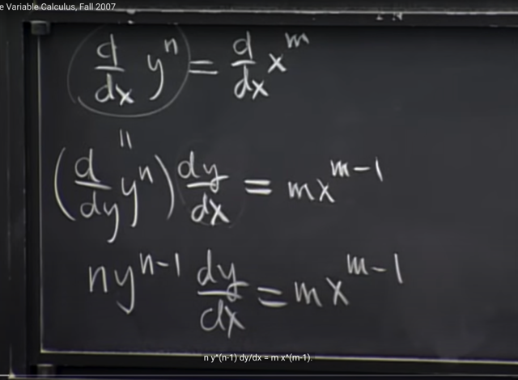</kbd>

> [!NOTE]
> Vế trái (d/dx) y^n, thì vì y là function theo x tức y(x) nên cái này ta
> phải dùng chain rule:
>
> d y^n / dx = (d y^n / dy) * (dy / dx)
>
> Và (d y^n / dy) dễ thấy sẽ chính là n*y^n-1
>
> Còn vế phải là (d / dx) x^m hay d x^m / dx chính là (x^m)' = m*x^m-1

 

<kbd>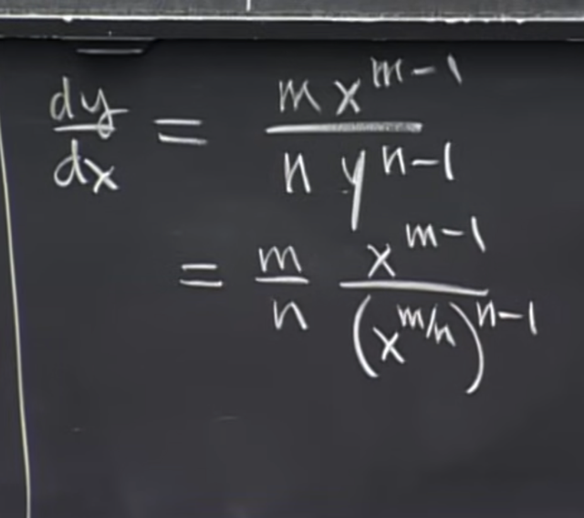</kbd>

> [!NOTE]
> Tiếp theo ta sẽ solve for dy/dx bằng cách chia hai vế cho
> n^y^(n-1) và thay y = x^m/n vào

 

<kbd>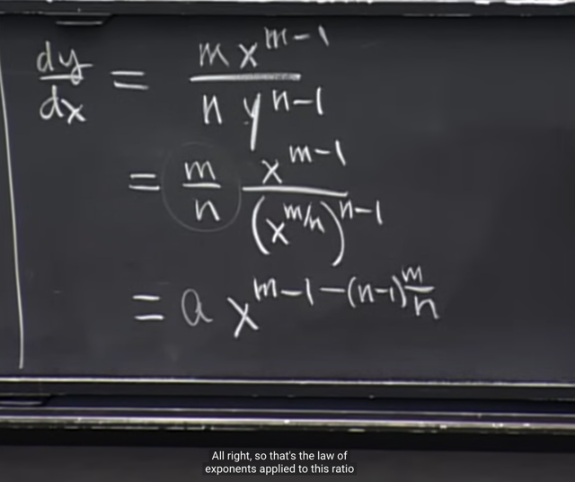</kbd>

> [!NOTE]
> Triển khai ra ta có (m/n)
> x^[m-1-(n-1)m/n]

 

<kbd>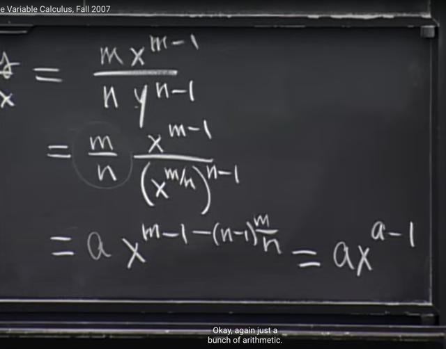</kbd>

<kbd></kbd>

<kbd>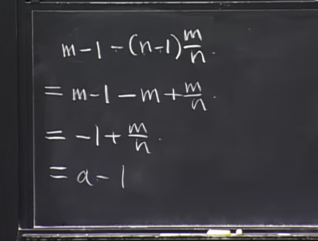</kbd>

> [!NOTE]
> Và kết quả là a*x^a-1. Cho thấy công thức derivative của x^a =
> a*x^a-1 đúng với cả a = m/n

 

<kbd>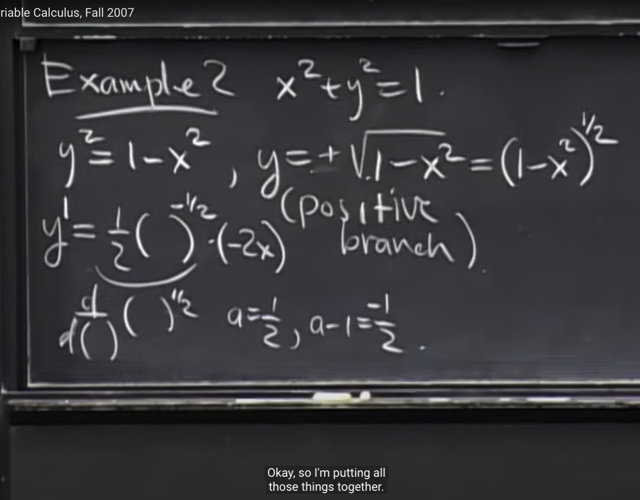</kbd>

> [!NOTE]
> Ví dụ thứ 2, ta có equation x^2 + y^2 = 1, và ta muốn tính (d/dx)
> y (again, đương nhiên bây giờ ta biết nó là dy/dx hay y').
>
> Thế thì sở dĩ ở đây ta sẽ nhắc đến khái niệm implicit là bởi y là function
> theo x xuất phát từ equation trên. Và ta có thể tính dy/dx theo hai cách
> mà cách hay hơn chính là dùng IMPLICIT DIFFERENTIATION.
>
> Nhưng trước đó ta sẽ tính Explicit, bằng cách từ equation x^2+y^2=1
> ta giải ra tìm y = +/- sqrt(1-x^2)
>
> Đến đây gs cho rằng ta sẽ chỉ quan tấm phần positive của function thôi.
> thì y trở thành y = sqrt(1-x^2) và ta sẽ thể hiện thành (1-x^2)^(1/2)
>
> Để rồi muốn tính dy/dx ta sẽ áp dụng Chain Rule:
>
> = (d (1-x^2)^1/2 / d(1-x^2)) * d(1-x^2) / dx
>
> Áp dụng (x^a)' = a*x^a-1 với việc đã chứng minh công thức này work
> với cả a = m/n nên ta có (d (1-x^2)^1/2 / d(1-x^2))  = (1/2)*(1-x^2)^(1/2-1)
>
> = (1/2)*(1-x^2)^(-1/2)
>
> Và từ đó dy/dx = (1/2)*(1-x^2)^(-1/2) * -2x

 

<kbd>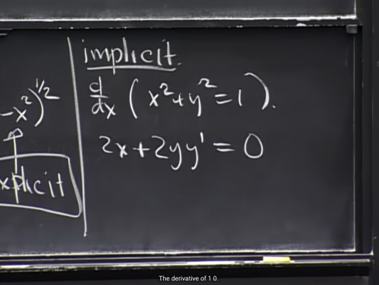</kbd>

> [!NOTE]
> Thế thì với IMPLICIT DIFFERENTIATION, đơn giản là ta giữ nguyên
> function x^2 + y^2 = 1 và chỉ việc apply operator d/dx vào hai vế.
>
> (động cơ xuất phát cho việc này là vì ta quan sát thấy việc tính derivative
> của x^2 + y^2 (theo x) sẽ dễ hơn là solve y = f(x) và tính derivative của
> f(x) là function có dính sqrt ở trỏng)
>
> Vậy ta có (d/dx) d(x^2+y^2) = (d/dx) 1 (chú ý d/dx 1 mang ý nghĩa là
> apply 'take derivative operator d/dx vào function mà function này là
> constant  = 1, và đương nhiên là = 0)
>
> Vế trái d (x^2+y^2) / dx với y = y(x) (ý là y là function theo x), sẽ bằng:
>
> d (x^2+y^2) / dx = d x^2 / dx + d y^2 / dx = 2x + d y^2 / dy * dy / dx
>
> = 2x + 2y * dy/dx = **2x + 2yy'
>
> Vậy ta có 2x + 2yy' = 0**

 

<kbd>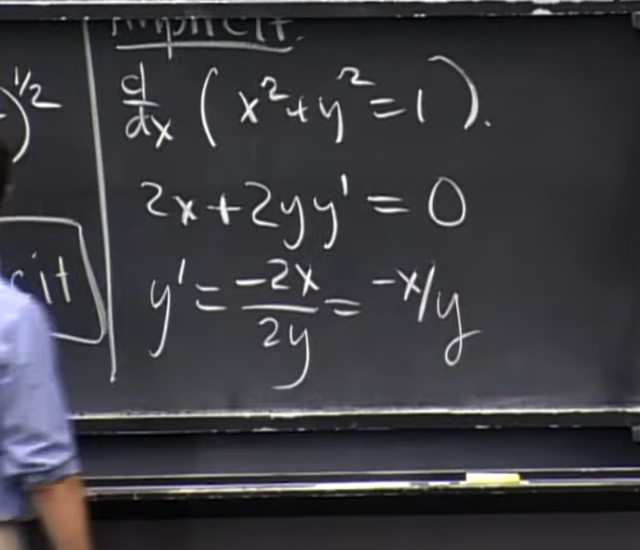</kbd>

> [!NOTE]
> Và solve for y' ta được y' = -x / y

 

<kbd>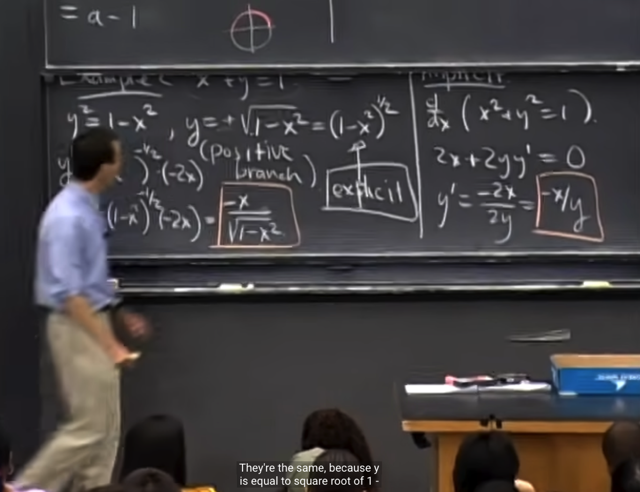</kbd>

> [!NOTE]
> Và hai kết quả từ hai cách là như nhau.
>
> Có chú ý là nếu ta xét phần âm tức y = -sqrt(1-x^2) thì dy/dx =
> -x/-sqrt(1-x^2) thì nó vẫn the same với result của implicit method vì
> implicit method cho ra kết quả -x/y hàm chứa cả hai case y dương
> hoặc âm

 

<kbd>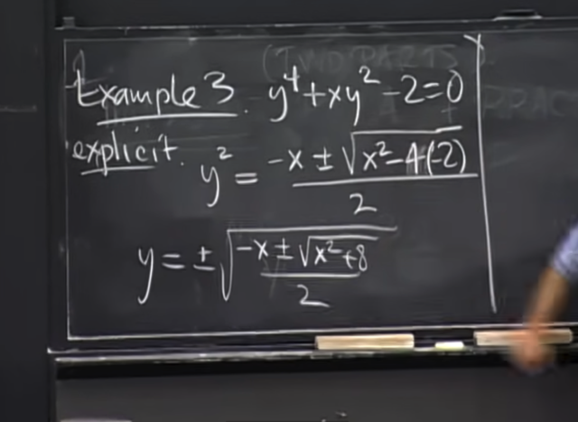</kbd>

> [!NOTE]
> Ví dụ 3, cho equation y^4 + xy^2 - 2 = 0, again, để tính dy/dx ta có
> thể explicitly express y theo x và take derivative. Nhưng trong bài
> toán này nếu làm vậy thì function y rất phức tạp và làm sẽ rất khó

 

<kbd>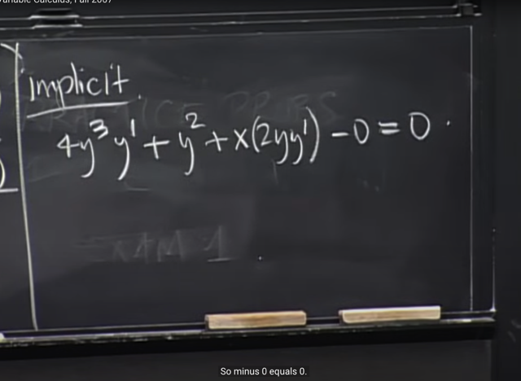</kbd>

> [!NOTE]
> Và sẽ dễ hơn nếu ta làm theo implicit method. Đó là, giữ nguyên
> equation ẩn chứa function y = y(x) ở trong đó (chữ implicit có nghĩa là
> ẩn, ẩn chứa ý nói trong equation ẩn chứa function y(x))
>
> Áp dụng operator d/dx hai vế (cũng là lấy đạo hàm theo x hai vế) ta
> có:
>
> 4y^3*y' + y^2 + x(2yy') = 0
>
> d(y^4) / dx =  d y^4 / dy * dy / dx = 4y^3* dy/dx = 4y^3 * y'
>
> Còn d (xy^2) / dx thì áp dụng cả chain rule và (uv)':
>
> d (xy^2) / dx = dx / dx * y^2 + x * d y^2 / dx = y^2 + x * d y^2 / dy * dy / dx
>
> = y^2 + x * 2y * dy / dx = **y^2 + x * 2y * y'**

 

<kbd>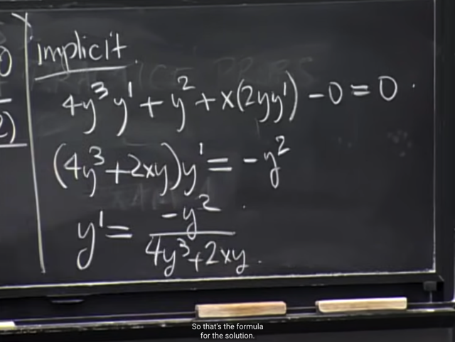</kbd>

> [!NOTE]
> Từ đó ta solve for y', đương nhiên là ta vẫn cần solve for y
> để có y theo x và gắn vào đây. Nhưng việc tính derivative
> đơn giản hơn

 

<kbd>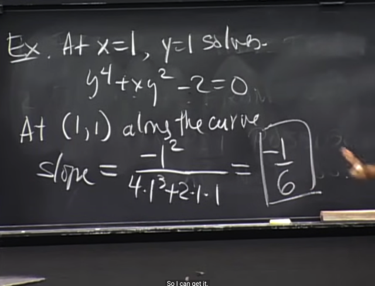</kbd>

> [!NOTE]
> Ví dụ như để tính derivative y' tại x = 1, ta sẽ cần tính y và nó
> sẽ ra 1. Và từ đó thế vào tính y'(1) theo công thức y' trên để ra 1/6
> chính là độ dốc hàm y(x) tại (1,1)

 

<kbd>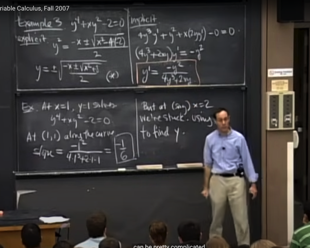</kbd>

> [!NOTE]
> Nhưng với x = 2 thì gs nói ta sẽ gặp trouble trong việc tìm ra y từ (*),
> và do đó cũng trouble trong việc tính ra y' luôn.
>
> Do đó, gs nói trong bài này ta bắt đầu với tuyên bố rằng Implicit
> differentiation sẽ giúp ta dễ dàng hơn trong việc tính derivative nếu
> như ta đã xác định được function.
>
> Nhưng nếu ta cũng không xác định được function, hay chưa có function
> thì đương nhiên không thể dễ dàng tìm ra derivative được. Ví dụ như
> ở đây, ta không tìm được y(x=2) nên cũng khó mà tìm được derivative 
> tại đó y'(x=2).
>
> Tuy vậy rõ ràng là implicit differentiation giúp ta tìm ra formula của
> y' dễ hơn so với explicit method

 

<kbd>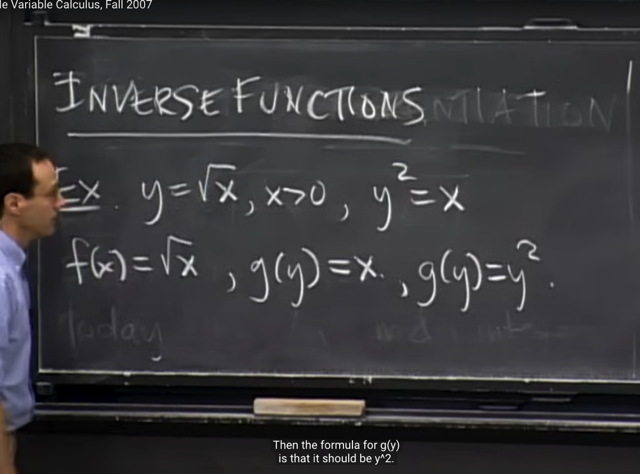</kbd>

> [!NOTE]
> Tiếp theo gs nói một trong những ứng dụng quan trọng của implicit 
> differentiation là nó giúp ta tìm derivative của inverse function.
>
> Lấy ví dụ y = sqrt(x) với x>0. Tương đương y^2 = x. Vậy thì f(x) = √x
> thì x = g(y) = y^2 là inverse của f(x)

 

<kbd>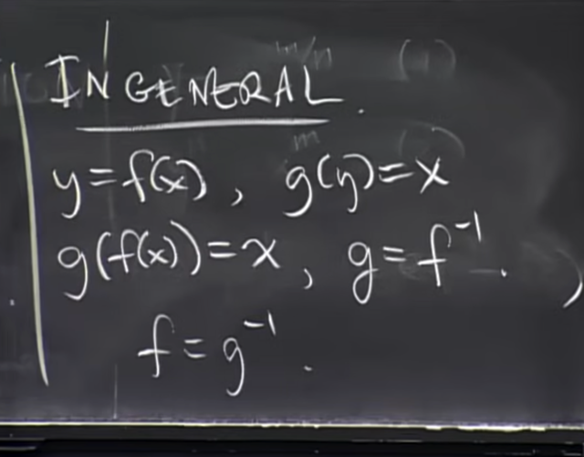</kbd>

> [!NOTE]
> Khái quát lên thì nếu ta có y = f(x) thì x = g(y) = g(f(x))
>
> và g và f là inverse của nhau: g = f^-1, f = g^-1

 

<kbd>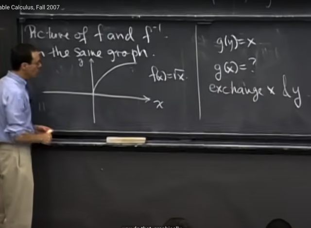</kbd>

> [!NOTE]
> Thế thì giả sử ta muốn thể hiện f và g (tức f^-1) trên cùng một đồ thị.
> Thì đầu tiên ta có đồ thị function f(x) = sqrt(x) là đường màu trắng.
>
> Thế thì đương nhiên đồ thị của hàm y = sqrt(x) là tập hợp các điểm
> x,y sao cho y = sqrt(x). Thì vì y = sqrt(x) cũng tương đương y^2 = x
> tức y = f(x) tương đương g(y) = x. Nên đường cong trên cũng chính
> là đồ thị của g(y) = x.
>
> Tuy nhiên ta muốn thể hiện đồ thị của g(x), tức là tập hợp các điểm (x,y)
> sao cho y = g(x)

 

<kbd>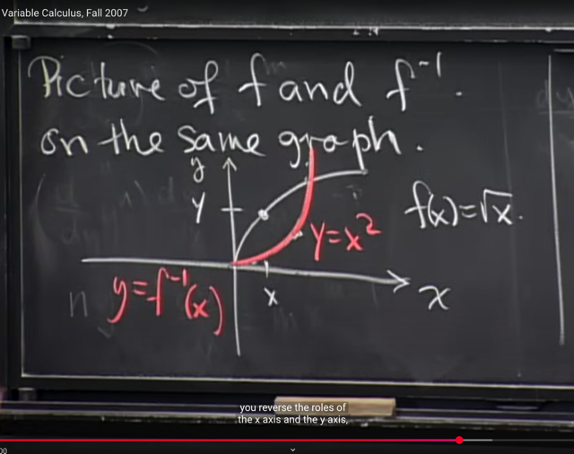</kbd>

> [!NOTE]
> Thì khi đó ta sẽ thay thế y = x, và x = y. Để rồi đường màu trắng sẽ đối
> xứng qua trục chéo và trở thành đường màu đỏ. Thì đó chính là đồ thị
> của y = g(x) (hay f^-1(x)) và nó chính là đồ thị của parabol y = x^2

 

<kbd>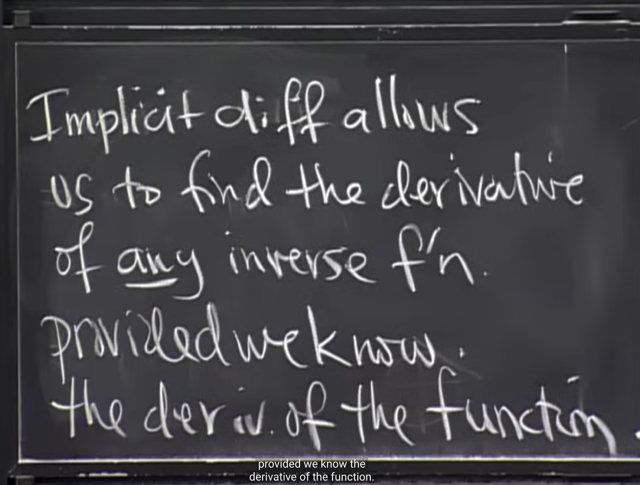</kbd>

> [!NOTE]
> Tiếp theo, ta sẽ học về việc implicit differentiation cho
> phép ta tính derivative của bất kì inverse function nếu ta
> biết derivative của function

 

<kbd>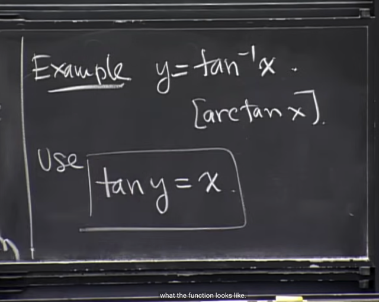</kbd>

> [!NOTE]
> Lấy ví dụ ta có y = arctan(x) <=> tan(y) = x và đương nhiên ta
> muốn tính dy/dx

 

<kbd>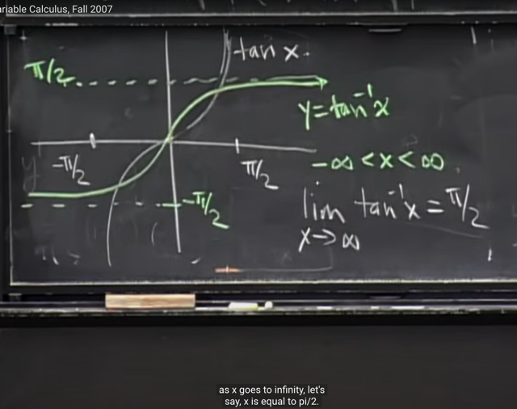</kbd>

> [!NOTE]
> Tương tự như đồ thị của f(x) = sqrt(x) và f(x) = x^2 đối xứng nhau
> qua đường chéo y = x,  ta có thể visualize đồ thị của tan(x) và
> arctan(x) sẽ như vầy

 

<kbd>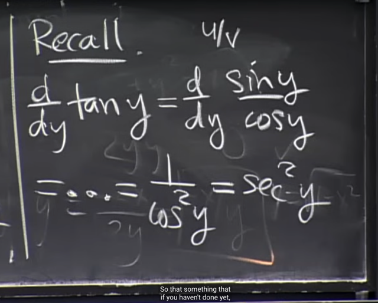</kbd>

> [!NOTE]
> Gs nhắc lại cho ta nhớ d tan(y) / dy, thật ra có thể derive dễ dàng
> nhờ Quotient rule vì tan(y)  thực ra là sin(y) / cos(y)
>
> Và d/dy sin(y)/cos(y) áp dụng (u/v)' = (uv' + u'v) / v^2 ta sẽ thấy tử số
> là sin^2(y) + cos^2(y) = 1, mẫu số là cos^2(y)
>
> Kết quả là 1/cos^2(y) và nó gọi là secan^2(y)

 

<kbd>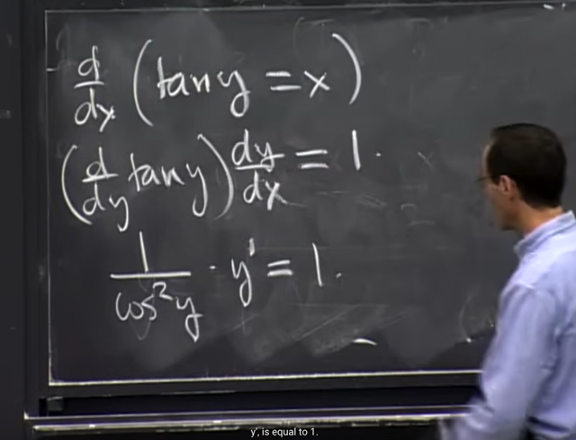</kbd>

> [!NOTE]
> Theo cách làm implicit differentiation, tức apply d/dx vào equation ,
> cũng là 2 vế của equation ta có
>
> (d/dx) tan(y) = dx/dx
>
> Áp dụng chain rule cho vế trái:
>
> <=> d tan(y) / dy * dy / dx = 1
>
> áp dụng kết quả tan'(y) = 1/cos^2(y) vừa rồi
>
> <=> (1/cos^2(y)) * y' = 1

 

<kbd>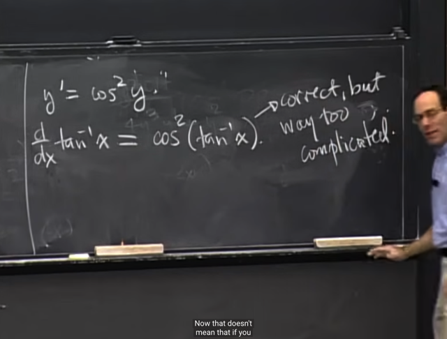</kbd>

> [!NOTE]
> Và từ đó solve for y' ta có y' = cos^2(y).
>
> Có điều ta cần thể hiện nó theo x, bằng cách gắn y = tan^-1(x)
>
> Hay nói cách khác, ta đang có kết quả: 
>
> d/dx tan^-1(x) = cos^2(tan^-1(x))
>
> Cái này tuy đúng nhưng có thể còn đơn giản hơn

 

<kbd>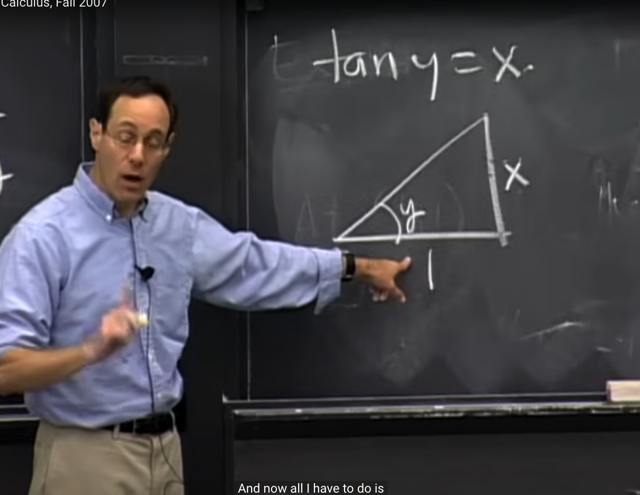</kbd>

> [!NOTE]
> Thế thì tới đây ta sẽ dùng equation:
>
> f^-1(y) = x tức tan(y) = x
>
> Và vì tan(y) đối / kề của hình tam giác vuông. Nên việc
> tan(y) = x  đồng nghĩa với ta có tam giác vuông cạnh x, và
> cạnh 1 với góc có độ lớn theo radian = y như vầy

 

<kbd>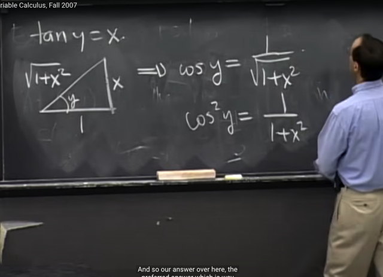</kbd>

> [!NOTE]
> Và do đó để tính cos y ta sẽ lấy kề / huyền = 1 / sqrt(1+x^2) 
>
> Nên cos^2(y) = 1 / (1+x^2)

 

<kbd>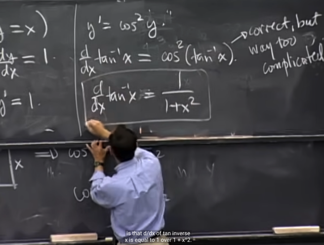</kbd>

> [!NOTE]
> Và từ đó d tan^-1(x) / dx  = 1 / (1 + x^2) là kết quả đơn giản hơn
> nhiều so với cos^2(tan^-1(x))

 

<kbd>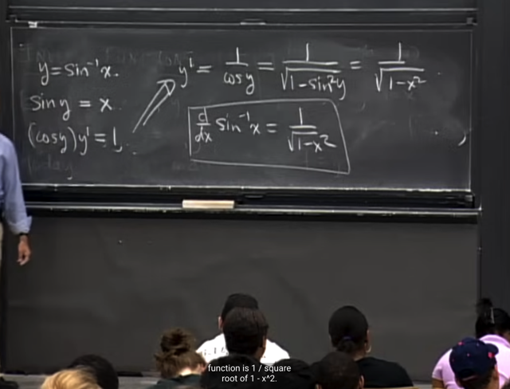</kbd>

> [!NOTE]
> Ví dụ nữa là y = sin^-1(x)
>
> nó sẽ tương đương sin(y) = x, apply implicit differentiation = take d/dx
> equation ta có
>
> d sin(y) / dx = dx/dx <=> d sin(y) / dy * dy / dx = 1 <=> cos(y) y' = 1
> <=> y' = 1 / cos(y)
>
> với cos(y) = sqrt(1 - sin^2(y)) = sqrt(1 - x^2)
>
> Vậy y' = 1 / sqrt(1 - x^2)

 

