# Lec 6: Exponential & Log

📊 **Progress:** `39` Notes | `37` Screenshots

---

<kbd>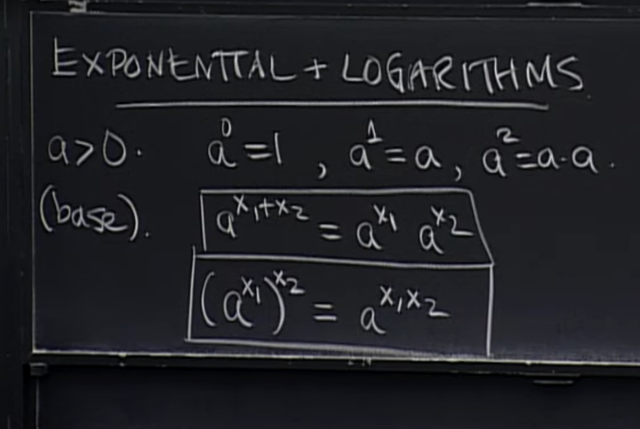</kbd>

> [!NOTE]
> Đầu tiên gs nói lại một số tính chất của **Exponential**
> function: Như **a^(x1+x2) = a^x1*a^x2** và (**a^x1)^x2 = a^x1x2**

 

<kbd>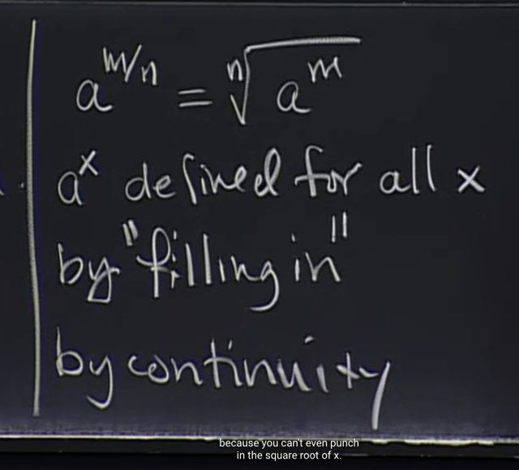</kbd>

> [!NOTE]
> Đại ý là theo định nghĩa **a^m/n** là **căn bậc n của a^m**. Và a^x sẽ
> được định nghĩa v**ới mọi x** (**vô tỉ** hoặc **hữu tỉ**) bằng cách **lấp
> đầy các khoảng trống** (giữa các a^ hữu tỉ) **nhờ tính chất liên tục**

 

<kbd>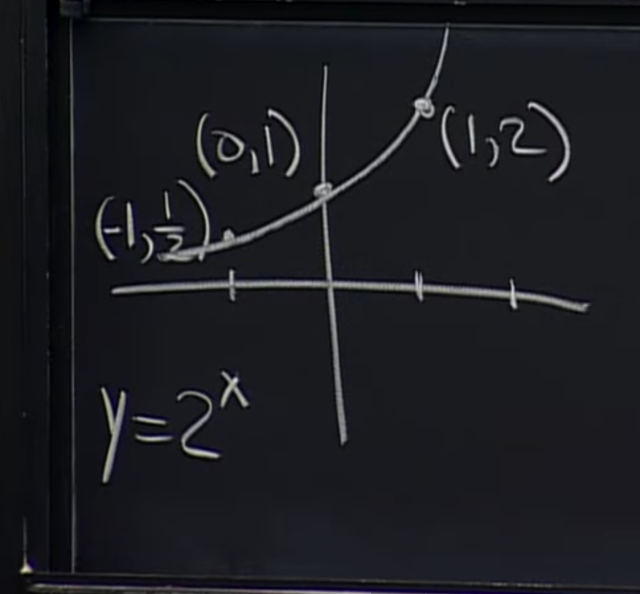</kbd>

> [!NOTE]
> Đồ thị của hàm y = 2^x

 

<kbd>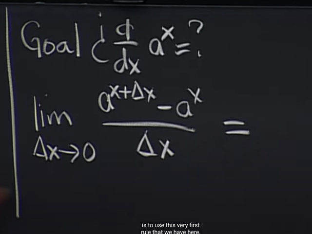</kbd>

> [!NOTE]
> Thế thì cái ta quan tâm dĩ nhiên là**derivative của a^x** kí hiệu là
> **(d/dx) a^x.**
>
> Theo **định nghĩa của derivative**, dĩ nhiên đó là **limit** của **delta_f /
> delta_x**khi **delta_x -> 0**.
>
> Và **delta_f = f(x+delta) - f(x)** = **a^(x+delta_x) - a^x**

 

<kbd>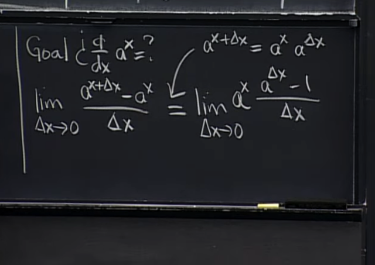</kbd>

> [!NOTE]
> Tại đây ta sẽ **dùng tính chất a^(x+y) = a^x*a^y** và
> do đó **a^(x+delta_x) = a^x*a^delta_x**
>
> Để triển khai **tử số** thành **a^x*(a^delta_x - 1)**

 

<kbd>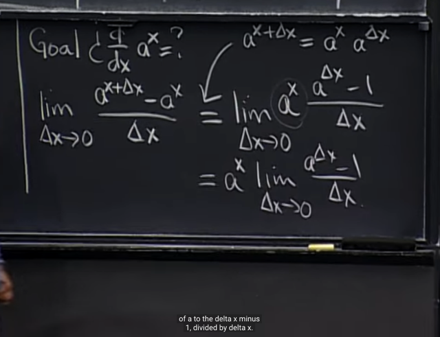</kbd>

> [!NOTE]
> Tiếp theo, đại khái là **trong bối cảnh này**, tuy**x là variable**, nhưng ở
> đây, **x là đại lượng fixed**. Còn **delta_x mới moving -> 0**. Do đó, **a^x**
> là constant. Và vì vậy có thể **đưa ra ngoài limit**

 

<kbd>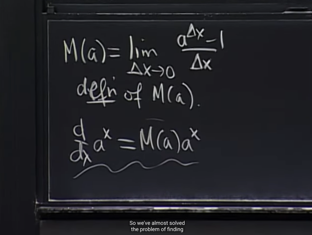</kbd>

> [!NOTE]
> Như vậy nếu đặt **M(a)** là limit delta_x->0 của **(a^delta_x - 1) / delta_x**
> thì **d/dx a^x = M(a) a^x** và cái ta**cần tìm chỉ là M(a)**

 

<kbd>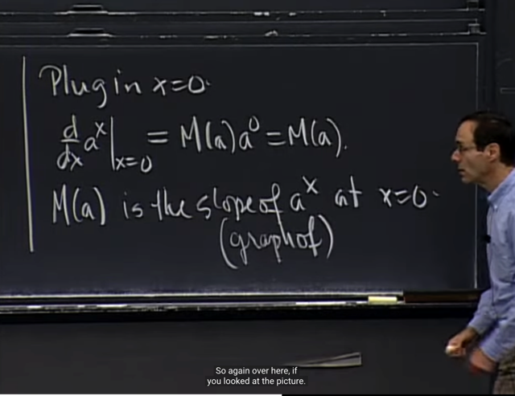</kbd>

> [!NOTE]
> Thế thì **gắn x = 0** vào, ta **sẽ có derivative của a^x tại x = 0.** Sẽ
> bằng **M(a)*a^0** = M(a).1 = **M(a)**
>
> Mà **d/dx a^x tại 0** đương nhiên **mang ý nghĩa** **độ dốc** của hàm
> số **tại x = 0.**
> Vậy **độ dốc của hàm a^x tại x = 0 là M(a)**

 

<kbd>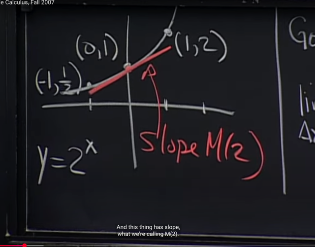</kbd>

> [!NOTE]
> Và cụ thể **với a = 2**, thì độ dốc của hàm **y = 2^x** tại
> **0 là M(2)
>
> (again, ta sẽ tìm function M(a) sau)**

 

<kbd>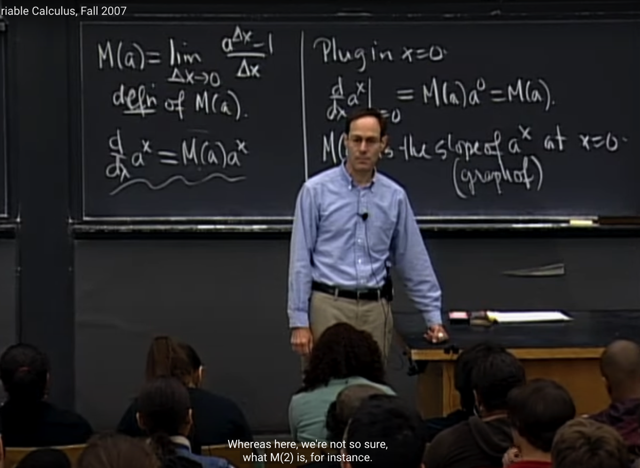</kbd>

> [!NOTE]
> Tiếp theo, đại khái là gs nói rằng ở đây ta cũng **sẽ thấy nó tương tự**
> với khi ta **tính đạo hàm** của **hàm sin(x) và cos(x)**. Nhưng với sin(x)
> và cos(x), ta **có thể dùng ý nghĩa hình học** để chứng minh công
> thức của sin(x) và cos(x). Còn **ở đây thì khó hơn**

 

<kbd>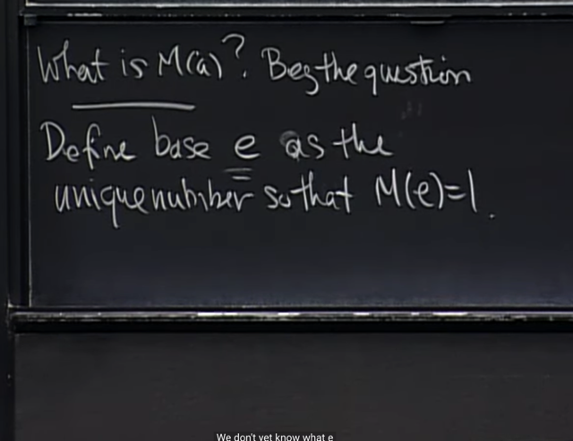</kbd>

🔗 **Related:** [LEC 6: EXPONENTIAL & LOG](untitled.md#node-156)

> [!NOTE]
> **Câu hỏi là M(a) là gì?**
>
> Thế thì tới đây ta sẽ dùng một cái **trick** đó là ta sẽ **DEFINE e
> LÀ MỘT UNIQUE NUMHER SAO CHO  M(e) = 1**

 

<kbd>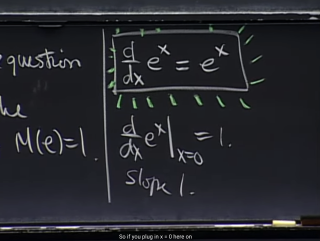</kbd>

> [!NOTE]
> Và một khi đã **define e như vậy (để M(e) = 1)** thì **d/dx e^x** chính là
> bằng **e^x * M(e) = e^x*1 = e^x**.
>
> Và gs cho rằng**d/dx e^x = e^x** là **một công thức cực kì quan trọng**
>
> Và với e như vậy thì**d/dx e^x tại x = 0** sẽ có giá trị **bằng e^0 = 1**,
> tức là **độ dốc của hàm e^x tại 0 bằng 1**

 

<kbd>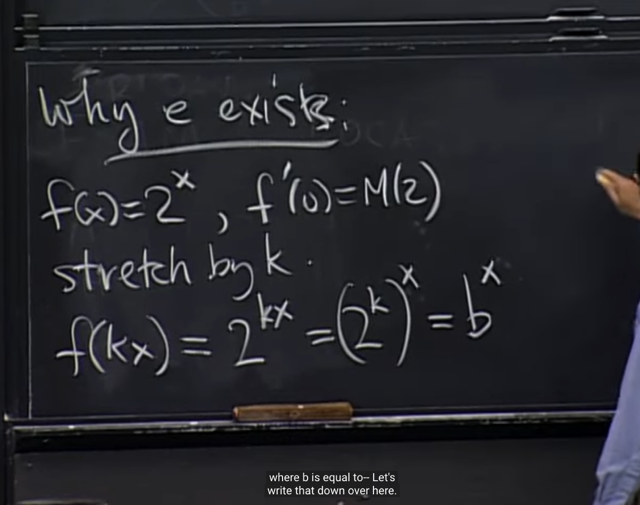</kbd>

> [!NOTE]
> Đại khái là, gs cho rằng **ta sẽ biết e là gì ở cuối bài**. Nhưng trước
> tiên ta sẽ **chứng minh e tồn tại**.
>
> Quay lại**hàm f(x) = 2^x**. Và ta đã biết**f'(0) = M(2)**. Thế thì, khi ta
> **stretch** (kéo giãn) **x** bằng**factor k**.
>
> Thì **f(kx)** = **2^(kx)**, và áp dụng a^(m*n) = (a^m)^n, ta có nó = **(2^k)^x** 
>
> Đặt **b = 2^k** thì **f(kx) = b^x**

 

<kbd>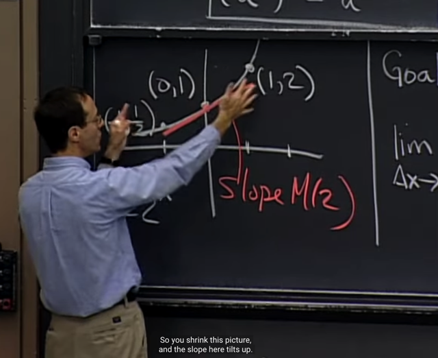</kbd>

> [!NOTE]
> Và **việc stretching** kx có ý nghĩa là ta **kéo function theo trục x**, để
> rồi khi **k lớn, function sẽ bị bóp** lại **theo phương x**, và **khiến độ
> dốc tại 0 sẽ tăng lên**, **tiếp tuyến tại x=0 sẽ dốc lên thêm**

 

<kbd>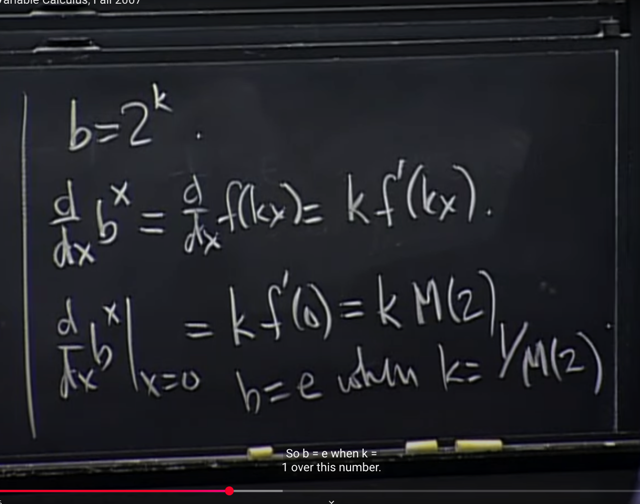</kbd>

> [!NOTE]
> Thế thì, **(d/dx) b^x = (d/dx) f(kx)**, và theo chain rule ta biết nó sẽ bằng:
>
> **d f(kx) / d(kx)** ***d(kx) / dx** = **f'(kx) * k**
>
> Nên**slope tại x = 0**sẽ là f**'(0)*k** = **k*M(2)**
>
> Điều này **biện minh cho nhận định vừa rồi** rằng khi **ta stretch function
> với factor k** thì **độ dốc của tiếp tuyến tại 0 sẽ scale với factor k: k*M(2)**
>
> Vậy thì từ đó,**để tìm e**,**tức giá trị khiến M(e) = 1**, ta**chỉ cần cho M(b)
> = k*M(2) = 1** => **k = 1/M(2)**. Khi đó ta sẽ có b = e
>
> Tức là, điều này**chứng minh e tồn tạ**i, vì chỉ cần k như vậy là ta sẽ có
> b=e là cái khiến M(e) = 1

 

<kbd>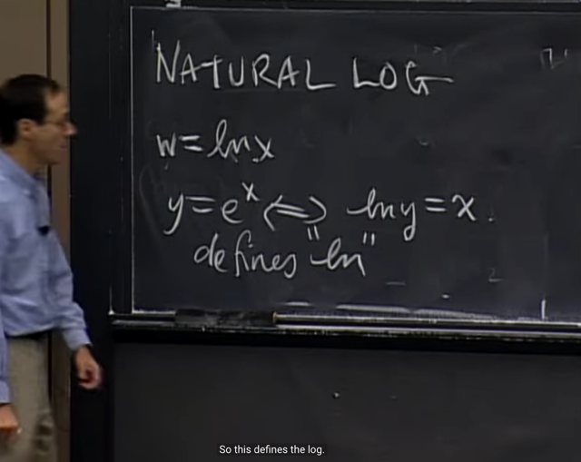</kbd>

> [!NOTE]
> Thế thì để **gắn kết mọi thứ** lại, ta sẽ cần biết đến **NATURAL
> LOG**. kí hiệu là **ln**
>
> Và **w = ln(x)** là **inverse function của e^x**. Có nghĩa là nếu
> **y = e^x <=>  ln(y) = x**

 

<kbd>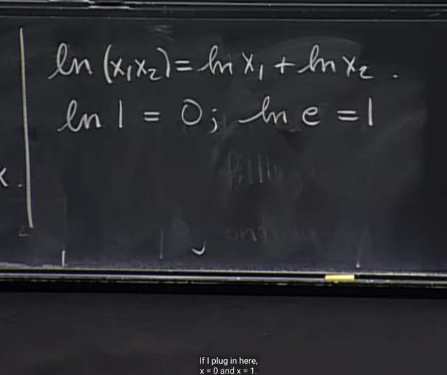</kbd>

> [!NOTE]
> Và ta nhớ lại **một số tính chất**của **ln**: l**n(x1x2) = ln(x1) + ln(x2)** 
>
> cũng như l**n(1) = 0** và **ln(e) = 1** (tương ứng với **e^0 = 1**, và **e^1 = e**)

 

<kbd>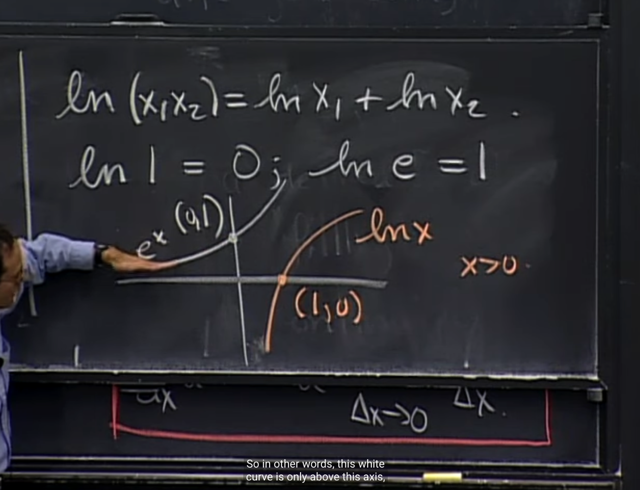</kbd>

> [!NOTE]
> **Đồ thị cũa e^x và ln(x)** là như vầy, như đã biết**để vẽ inverse function**
> ta sẽ **đổi chỗ x thành y và y thành x**, nên chúng sẽ đ**ối xứng nhau qua
> diagonal axis y = x**
>
> Và gs lưu ý rằng, **độ dốc của e^x tại 0** (tức x=0, y=1) là **bằng 1** và **của
> ln(x) cũng bằng 1**. (vì **tangent** của chúng **tại 1** c**ũng đối xứng nhau**
> qua y=x nên **chúng phải cùng có slope bằng 1**, điều này là có thể
> hiểu được

 

<kbd>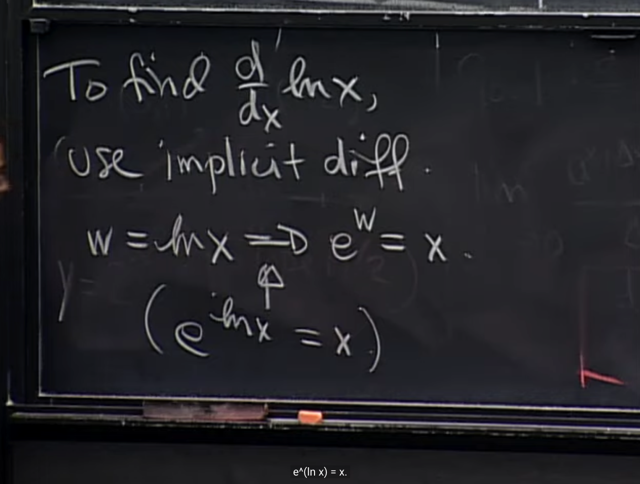</kbd>

> [!NOTE]
> Thế thì **để tìm derivative của ln(x)**, là inverse function của e^x. ta
> sẽ dùng **Implicit differentiation** đã học ở bài trước.
>
> Nhớ lại cái này, đại khái là **khi ta có một implicit function** thể hiện**bởi một equation**, ví dụ x^2+y^3 = 1 (equation này **ẩn chứa
> function y = f(x)**) thì **để tìm derivative của y**, **thay vì** ta**solve
> y từ equation**rồi **lấy derivative**, vốn có thể **phức tạp**.
>
> Ta có thể **"lấy d/dx của equation**, tức **apply d/dx operation vào
> hai vế** của equation. Sau đó ta có thể **solve cho ra y' dễ hơn.**
>
> Trước tiên từ **w = ln(x)** ta suy ra **e^w = x**

 

<kbd>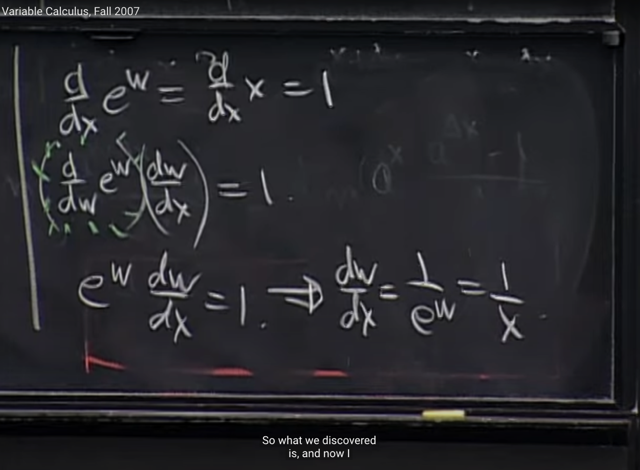</kbd>

> [!NOTE]
> Từ đó,**apply d/dx vào equation**. Vế phải là **(d/dx) x** cũng chính là 
> **dx/dx và bằng 1**. Vế trái là (d/dx) e^w. Dùng **chain rule** ta sẽ có:
>
> (d e^w / dw) * (dw / dx) 
>
> Thì d e^w / dw chính là e^w như ta đã rút ra từ phần trước
>
> Vậy dw / dx = 1 / e^w = **1 / x
>
> Vậy ta đã chứng minh d/dx ln(x) = 1/x**

> [!NOTE]
> d/dx ln(x) = 1/x

 

<kbd>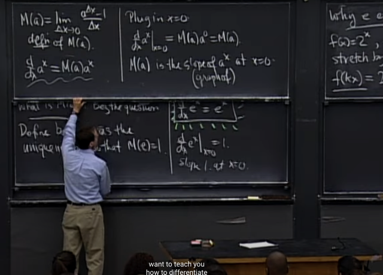</kbd>

> [!NOTE]
> Tiếp theo ta sẽ quay lại
> vấn đề**tìm d/dx a^x**

 

<kbd>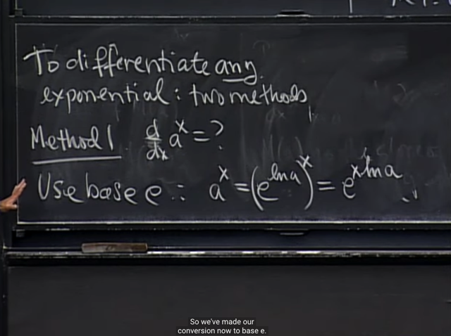</kbd>

> [!NOTE]
> Có **hai** phương pháp mà **gs cho là như nhau** thôi. Cách **1** là ta sẽ
> **chuyển sang base e**:
>
> Bằng cách **dùng e^ln(a)** thay cho **a**. Vì **e^ln(a) quả thật chính là a**
> theo định nghĩa của logarit.
>
> Nên **a^x** = [e^ln(a)]^x và dùng (a^n)^m = a^(nm) ta có [e^ln(a)]^x 
> = **e^[xln(a)]**

 

<kbd>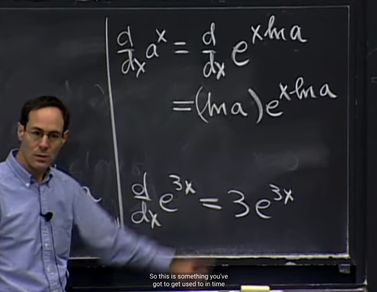</kbd>

> [!NOTE]
> Apply **implicit differentiation** vào **a^x = e^[xln(a)]** ta có:
>
> (d/dx) a^x = (d/dx) e^(xln(a))
>
> Đến đây gs cho rằng, bài toán **hoàn toàn tương tự** như khi ta 
> tính **(d/dx) e^3x** bằng chain rule ta sẽ được 
>
> d e^3x / d (3x) * d (3x) / dx = e^3x * 3 = **3 * e^3x**
> Thì ở đây tương tự, **ln(a) cũng là constant**, nên:
>
> (d/dx) e^(xln(a)) =**ln(a) * e^(xln(a))**

 

<kbd>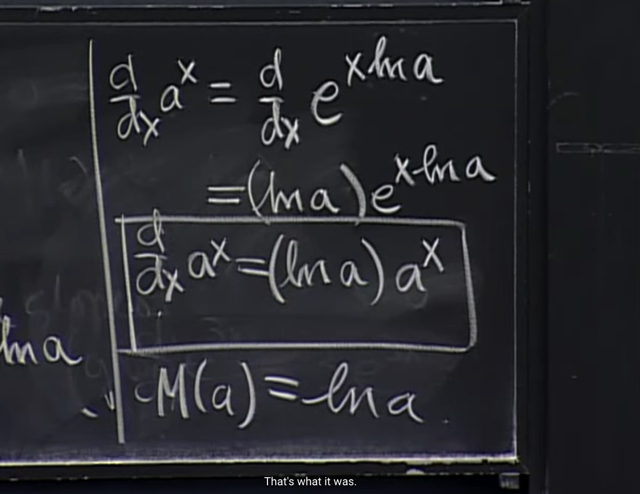</kbd>

🔗 **Related:** [LEC 6: EXPONENTIAL & LOG](untitled.md#node-143)

> [!NOTE]
> Và vì e^xln(a) chính là a^x nên công thức của **(d/dx) a^x**
>
> (d/dx) e^(xln(a)) = ln(a) * e^(xln(a)) trở thành: 
>
> **(d/dx) a^x = ln(a) * a^x**Và như vậy, nhớ lại**lúc đầu tiên** khi **tìm cách tính (d/dx) a^x**
> ta **ra kết quả là M(a) a^x** và ta bị kẹt vì không biết M(a) là gì
>
> Thì bây giờ với kết quả này ta đã biết **M(a) chính là ln(a)**

> [!NOTE]
> Chúng minh d/dx a^x = ln(a) a^x theo
> cách CHUYỂN SANG BASE e

 

<kbd>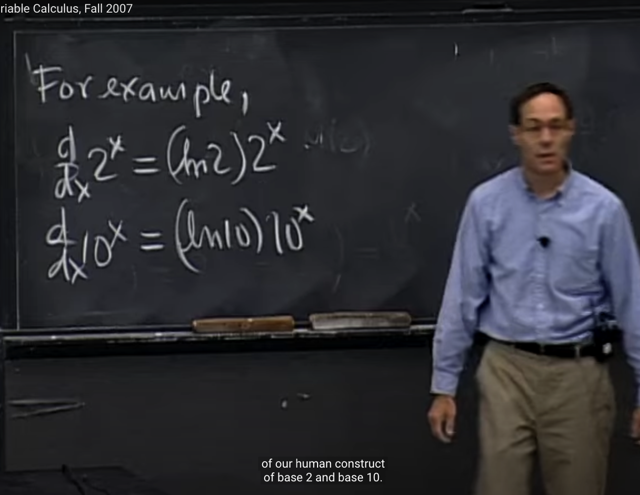</kbd>

> [!NOTE]
> Và kết quả này ta thấy
>
> d/dx 2^x = ln(2) 2^x, d/dx 10^x = ln(10) 10^x
>
> Có nghĩa là **CHO DÙ TA ĐANG MUỐN TÍNH VỚI BASE GÌ, 2 HAY
> 10**. THÌ **NATURAL LOGARIT (BASE E) SẼ VẪN XUẤT HIỆN MỘT
> CÁCH TỰ NHIÊN** (ĐÓ CHÍNH LÀ LÍ DO NÓ CÓ TÊN NATURAL
> LOGARITHM)

 

<kbd>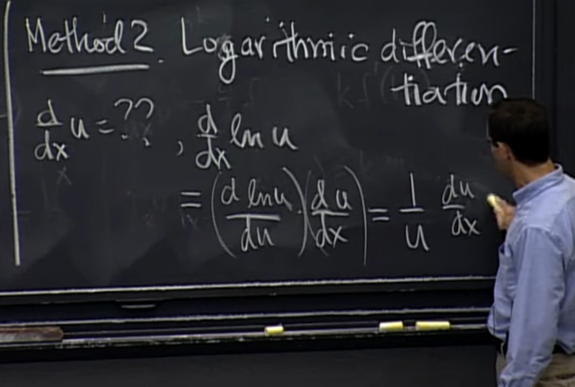</kbd>

> [!NOTE]
> Method thứ 2, đó là dùng cái gọi là **LOGARITHMIC DIFFERENTIATION**Đại khái là**có khi ta khó tính (d/dx) u**, nhưng **tính (d/dx) ln(u)** thì sẽ 
> **dễ hơn**.
>
> Dựa vào **chain rule** d ln(u) / dx = **d ln(u) / du** * d**u / dx** 
>
> Và **dln(u)/du** thì hồi nãy dùng implicit differentiation ta đã biết là bằng **1/u**

 

<kbd>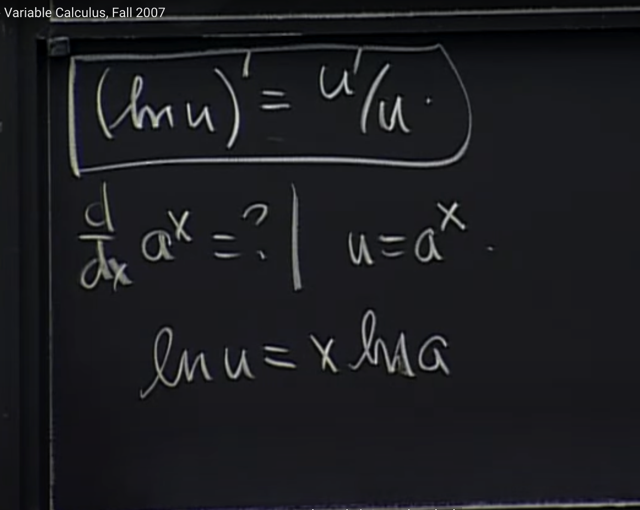</kbd>

> [!NOTE]
> Do đó (ln u)' tức **(d/dx) ln(u)** chính là **u' / u**
>
> Thế thì dựa vào đó ta sẽ tính **(d/dx) a^x**:
>
> Bằng cách**cho u = a^x** và lấy **ln hai vế** ta có **ln(u) = ln[a^x]** và cái
> này chính là **x ln(a)** vì tính chất của logarithm
>
> Và áp dụng **implicit differentiation** (**lấy d/dx hai vế**) ta sẽ có:
>
> **(d/dx) ln(u)** = (**d/dx) xln(a)**.
>
> Mà **vế trái chính là ln'(u)**, và nó bằng **u'/u** ở trên.
>
> **Vế phải** **không cần dùng chain rule** vì nó **chỉ là d/dx của c*x** với
> **c = ln(a)**. Nên đương nhiên sẽ là c*1 = **c**
>
> Vậy ta có u'/u = ln(a) => **u' = ln(a)*u**
>
> Vậy thay u bằng a^x, ta có lại **d/dx a^x = ln(a) a^x**kết quả
> giống như method 1

> [!NOTE]
> Chúng minh d/dx a^x = ln(a) a^x theo
> LOGARITHMIC DIFFERENTIATION

 

<kbd>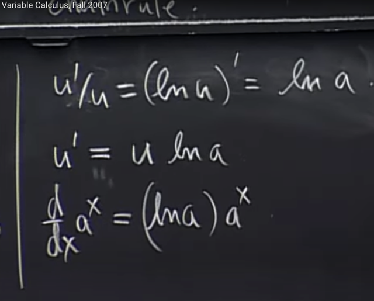</kbd>

 

<kbd>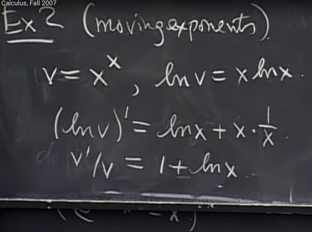</kbd>

> [!NOTE]
> Tiếp theo gs sẽ**làm một ví dụ** gọi là "**moving exponents**" (ý là
> **cơ số không fixed** nữa mà **cũng là variable**: v = **x^x**)
>
> Gs cho biết **có thể giải bằng cả hai cách**, nhưng ta sẽ **dùng cách 2
> logarithmic differentiation**.
>
> Thế thì từ **v = x^x**, nó sẽ tương đương **ln(v) = xln(x)** (cái này không
> có gì khó hiểu, chỉ là apply ln() hai vế)
>
> Sau đó **dùng implicit differentiation**
>
> **(d/dx) ln(v) = (d/dx) (x*ln(x))**
>
> Thì **vế phải** cần phải dùng **product rule:** **(uv)' = u'v  +uv**':
>
> vế phải = ln(x) + x (1/x) = **ln(x) + 1** (vì **d/dx ln(x) ta đã biết = 1/x**)
>
> Còn vế trái **(d/dx) ln(v)** ta đã chứng minh nó là **v'/v**Vậy **v'/v = 1 + ln(x) => v = v(1+ln(x)) =x^x*(1+ln(x))**

 

<kbd>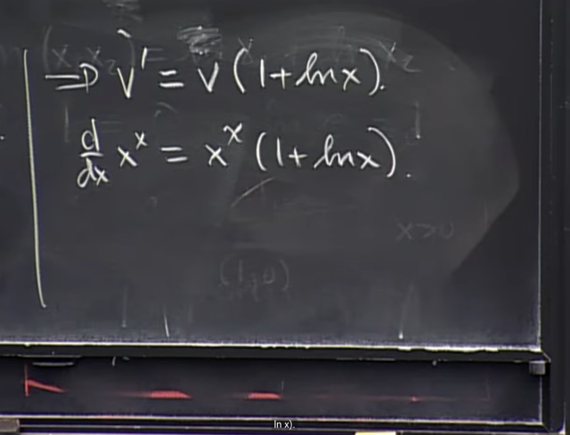</kbd>

> [!NOTE]
> Và ta có kết quả:
> **d(x^x)/dx = x^x*(1 + ln(x))**

 

<kbd>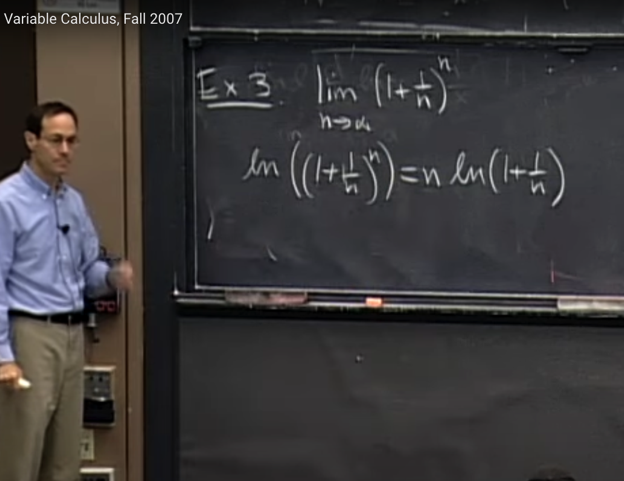</kbd>

> [!NOTE]
> Qua ví dụ này, tìm limit của (1+1/n)^n tại infinity
>
> Bài toán này, đại khái gs nói là vì**trong limit là một "cái" có
> moving exponent** (ý nói (..)^n) nên **sẽ hữu ích** nếu ta **dùng**
> **logarithm** để làm
>
> Do đó ta sẽ**lấy ln()** của nó (1+1/n)^n, để bằng **n*ln(1+1/n)**

 

<kbd>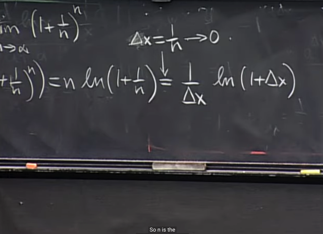</kbd>

> [!NOTE]
> Tiếp đặt **∆x** = **1/n** => n = 1/∆x thì khi **n -> inf**, **∆x -> 0**
>
> Viết lại **n*ln(1+1/n)** thành **(1/∆x) ln(1+∆x)**

 

<kbd>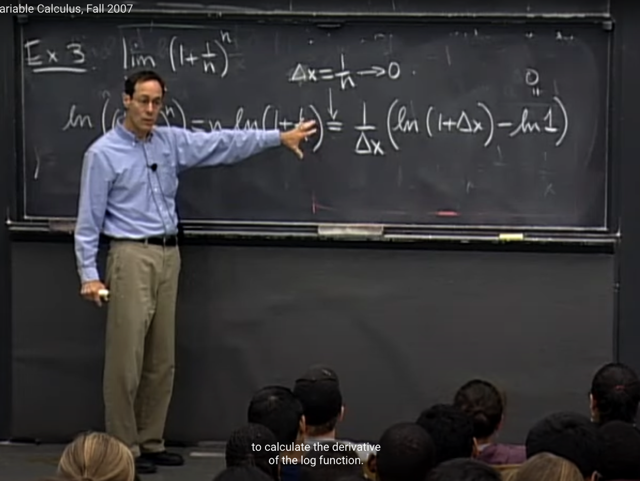</kbd>

> [!NOTE]
> Và ta sẽ thực hiện **một hành động nhỏ**, đó là**trừ đi 0 (= ln(1))**
> đương nhiên **không thay đổi gì bài toán**
>
> Nhưng quan trọng là khi đó ta sẽ**thấy bài toán trở thành một thứ
> mà ta sẽ nhận ra:** **lim**∆**x->0 của [ln(1+∆x) - ln(1)] / ∆x**
>
> Thì cái này chính là**định nghĩa của derivative** của function **ln()**tại **x = 1**

 

<kbd>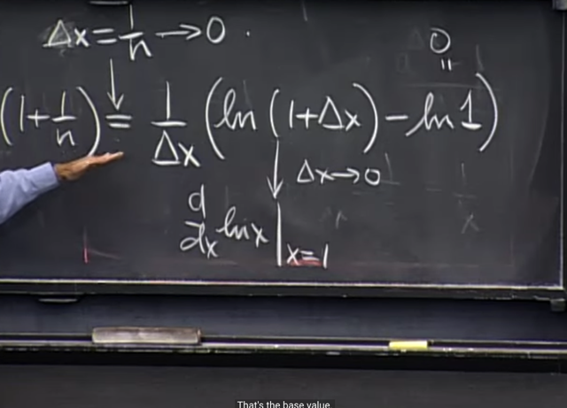</kbd>

> [!NOTE]
> Gs: Chính xác là vậy. Nó chính là **(d/dx) ln(x) evaluated tại x=1**

 

<kbd>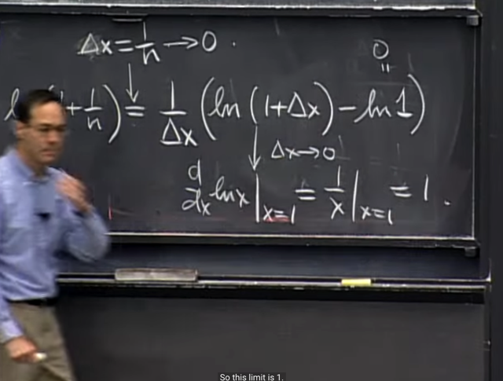</kbd>

> [!NOTE]
> Và **(ln(x))'** thì ta biết rồi,**bằng 1/x** vậy**kết quả là = 1/1 = 1**. 
>
> Như vậy**limit của ln [ (1+1/n)^n ] khi n -> infinity chính là bằng 1**

 

<kbd>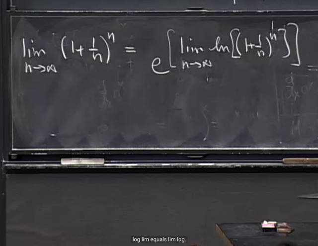</kbd>

> [!NOTE]
> Thế thì phải chú ý rằng, cái kết quả 1 vừa rồi là **lim của ln [(1+1/n)^n]**(limit của log)****Và**limit của log** bằng **log của limit**:
>
> **ln lim ( ln [(1+1/n)^n] ) = lim ln [(1+1/n)^n]**Do đó: 
>
> **apply e^()** hai vế ta có:
>
> lim [(1+1/n)^n] = e^{lim ln [(1+1/n)^n]} và = e^1 = e
>
> Vậy kết qủa **lim [(1+1/n)^n] = e**

 

<kbd>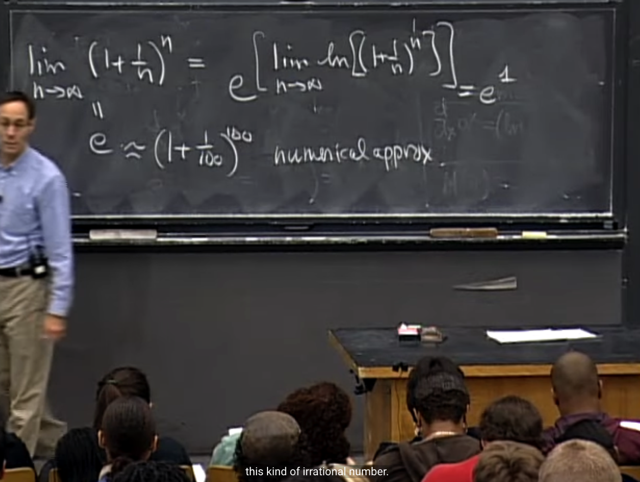</kbd>

> [!NOTE]
> Và đại khái là kết quả này cho ta một cách để tính ra giá
> trị của e, ví dụ (1+1/100)^100 có thể coi như xấp xỉ e

 

