# Lec 9: Linear And Quadratic Approximations

📊 **Progress:** `27` Notes | `28` Screenshots

---
<a id="node-172"></a>

<p align="center"><kbd>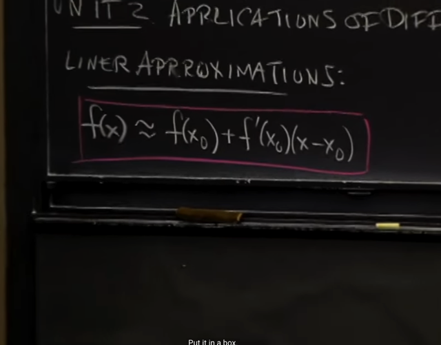</kbd></p>

> [!NOTE]
> Bài này gs nói ta sẽ nói về ứng dụng của differentiation. Đầu tiên 
> là LINEAR APPROXIMATIONS. Thể hiện qua công thức quan trọng
> mà ta sẽ đào sâu tiếp theo:
>
> f(x) `~=` f(x0) `+` `f'(x0)(x-x0)`

<br>

<a id="node-173"></a>

<p align="center"><kbd>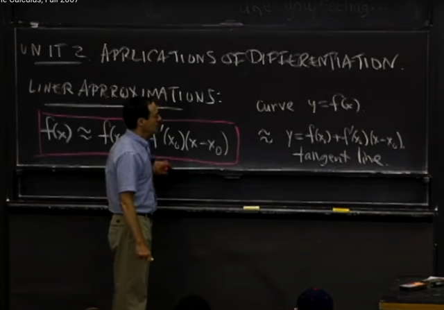</kbd></p>

> [!NOTE]
> Và gs nói, nó có nghĩa là, nếu ta có đường cong (curve) y `=`
> f(x), thì nó (tại x0, ý nói đường cong trong khu vực gần x0) sẽ
> xấp xỉ tangent line (tiếp tuýến) tại điểm x0

<br>

<a id="node-174"></a>

<p align="center"><kbd>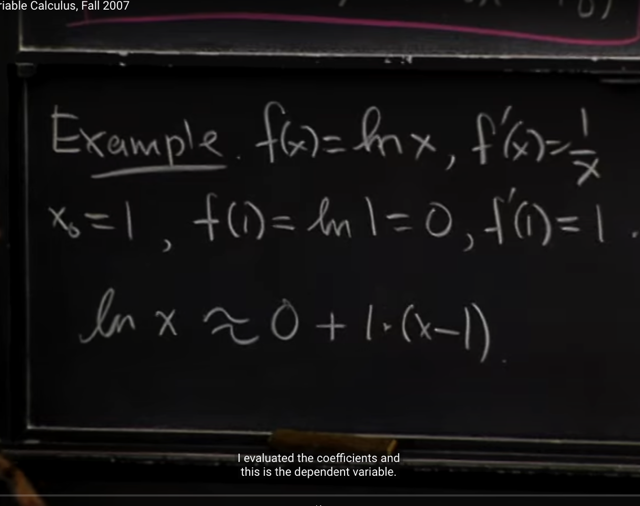</kbd></p>

> [!NOTE]
> Lấy ví dụ f(x) `=` ln(x) natural logarithm đã biết ở bài trước. Và bài
> trước ta cũng đã chứng minh `/` derive f'(x) `=` `1/x`
>
> ```text
> Tại x0 = 1, f(x0) = f(1) = ln(1) = 0 và f'(1) = 1/1 = 1
> ```
>
> Áp dụng công thức linear approximation ta có ln(x) ~ 0 `+` `1*(x-1)`

<br>

<a id="node-175"></a>

<p align="center"><kbd>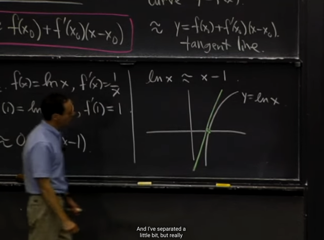</kbd></p>

> [!NOTE]
> Và hình ảnh sẽ là như vầy, ta
> có đường cong của y `=` ln(x)
> và tiếp tuyến tại `x0=1`

<br>

<a id="node-176"></a>

<p align="center"><kbd>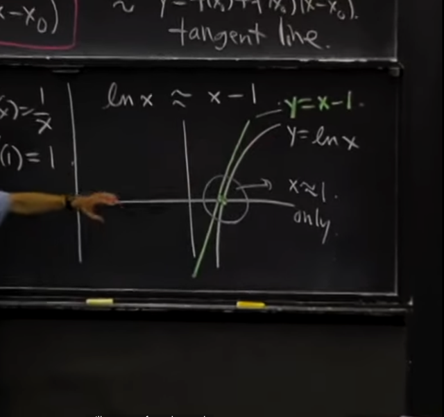</kbd></p>

> [!NOTE]
> Thì Ý NGHĨA CỦA LINEAR APPROXIMATION CHÍNH LÀ 
> XÉT TRONG PHẠM VI GẦN `x=1` thì HAI ĐƯỜNG (CONG
> CỦA Y `=` LN(X) VÀ TIẾP TUYẾN Y `=` `X-1` LÀ COI NHƯ 
> GIỐNG NHAU, XẤP XỈ NHAU

<br>

<a id="node-177"></a>

<p align="center"><kbd>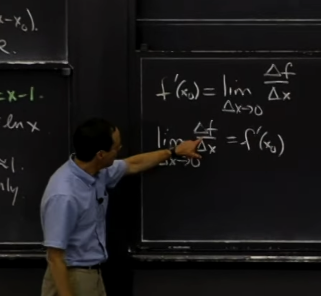</kbd></p>

> [!NOTE]
> Thế thì theo gs ta cần ôn lại chút xíu về định nghĩa của derivative, 
> mà một cách định nghĩa đó là, derivative của f tại x0 sẽ là limit của
> ```text
> delta_f / delta_x khi delta_x -> 0.
> ```
>
> Và nhìn theo góc nhìn ngược lại, thì f'(x0) (derivative của function f)
> ```text
> là cách / function để evaluate limit (của delta_f / delta_x khi delta_x -> 0)
> ```

<br>

<a id="node-178"></a>

<p align="center"><kbd>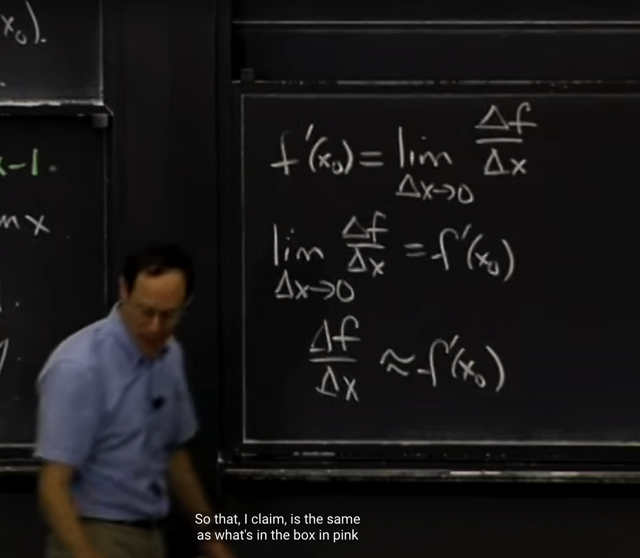</kbd></p>

> [!NOTE]
> Thế thì cái mới bây giờ sẽ là:
>
> Dựa trên định nghĩa này,
>
> rằng **limit của `delta_f` `/` `delta_x` khi `delta_x` `->` 0** **LÀ** **f'(x0)**
>
> THÌ TỪ ĐÓ ta có thể nói rằng,
>
> khi **delta_x rất nhỏ**, thì **delta_f `/` delta_x** CÓ THỂ ĐƯỢC **XẤP XỈ**
> BỞI **f'(x0)**

<br>

<a id="node-179"></a>

<p align="center"><kbd>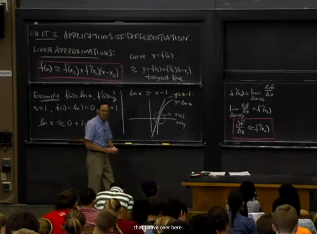</kbd></p>

> [!NOTE]
> Và cái này chính là lập luận của công thức LINEAR APPROXIMATION 
> f(x) `~=` f(x0) `+` `f'(x0)(x-x0)` ở trên

<br>

<a id="node-180"></a>

<p align="center"><kbd>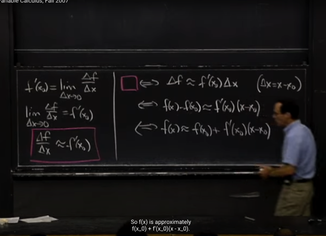</kbd></p>

> [!NOTE]
> Gs làm rõ tại sao hai công thức này là the same. Cũng dễ thấy, 
> ```text
> dựa trên việc delta_f chính là f(x) - f(x0), delta_x là x-x0
> ```
> chuyển vế ta sẽ có công thức ở trên

<br>

<a id="node-181"></a>

<p align="center"><kbd>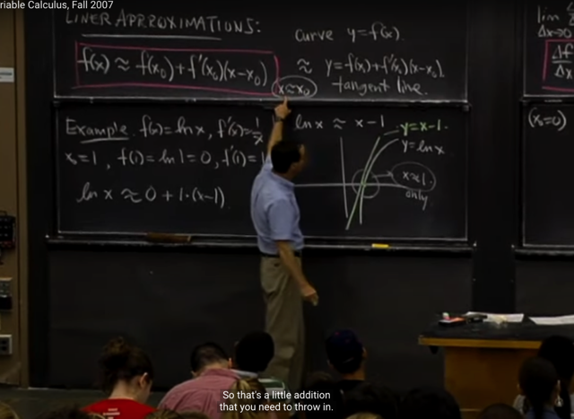</kbd></p>

> [!NOTE]
> Gs nhấn mạnh rằng, công thức này CHỈ ĐÚNG TRONG PHẠM VI
> RẤT GẦN X0

<br>

<a id="node-182"></a>

<p align="center"><kbd>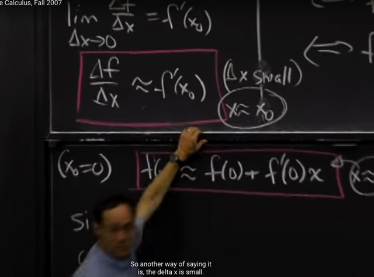</kbd></p>

> [!NOTE]
> Hay công thức này cũng vậy chỉ đúng khi `x~=x0,` đồng
> nghĩa `delta_x` rất nhỏ

<br>

<a id="node-183"></a>

<p align="center"><kbd>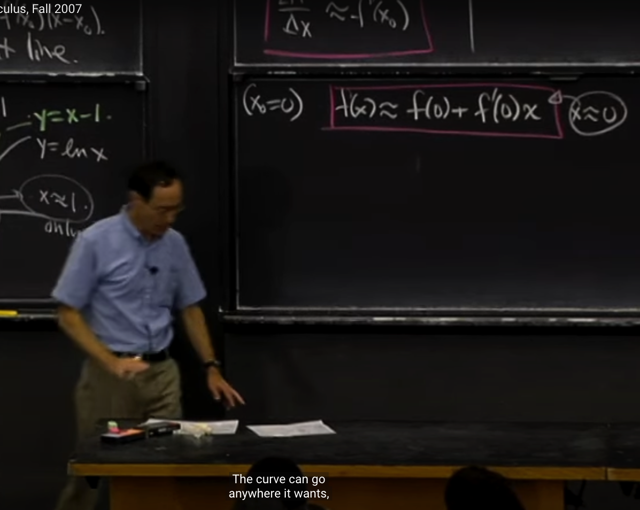</kbd></p>

> [!NOTE]
> Khi x0 `=` 0 thì ta có công thức này, f(x) `~=` f(0) `+` f'(0)x và
> again, ta nhấn mạnh nó chỉ đúng khi `x~=0.`

<br>

<a id="node-184"></a>

<p align="center"><kbd>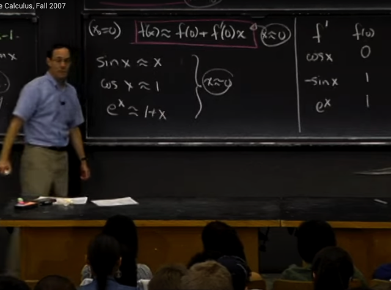</kbd></p>

> [!NOTE]
> Thế thì dựa vào cái này ta sẽ có thể approximate một số function
> thông dụng như sin(x), cos(x) e^x khi `x~=0`
>
> sin(x) `~=` sin(0) `+` sin'(0)x `=` x,
>
> cos(x) `~=cos(0)` `+` cos'(0)x `=` 1
>
> ```text
> e^x ~= e^0 + e^(0)*x = 1 + x
> ```
>
> Tới đây ta đã hiểu trong bài giảng của 1802 khi gs nói về việc khi
> theta~0 thì sin(theta) `~=` theta, và cos(theta) `~=1` là dùng kiến thức
> Linear approximation này

<br>

<a id="node-185"></a>

<p align="center"><kbd>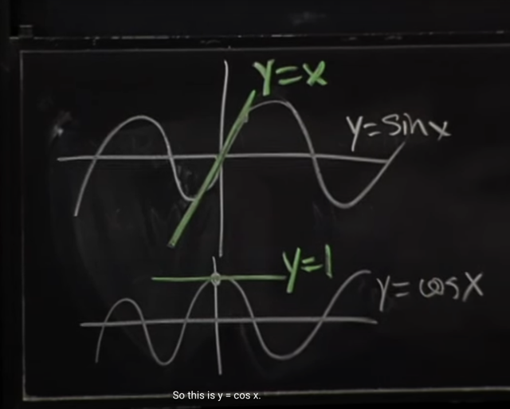</kbd></p>

> [!NOTE]
> Hình ảnh sẽ là như vầy, có thể thấy tại `x~=0` (các điểm rất gần x)
> thì " đoạn" của sin(x) có thể coi như trùng bới y `=` x và với cos(x)
> thì là y `=` 1

<br>

<a id="node-186"></a>

<p align="center"><kbd>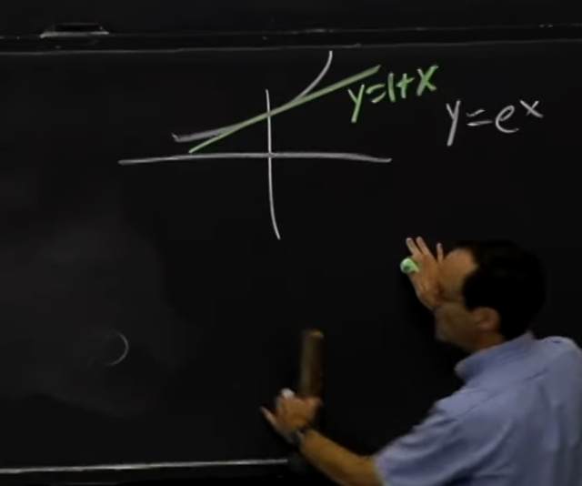</kbd></p>

> [!NOTE]
> Với `y=e^x` cũng vậy

<br>

<a id="node-187"></a>

<p align="center"><kbd>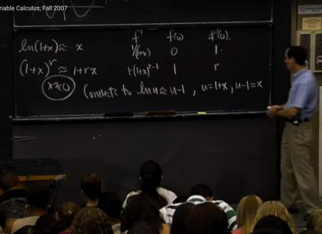</kbd></p>

> [!NOTE]
> Tiếp theo đại khái là, gs áp dụng linear approximation
> cho `ln(1+x)` và `(1+x)^r` tại `x~=0`
>
> Kết quả ra là `ln(1+x)` `~=` x.
>
> Thế thì ý chính muốn nói, với function ln(x) và x^r, thì ta không thể 
> approximate chúng tại `x=0,` vì các function này, độ dốc tại 0 là infinity
>
> Mà thay vào đó 1 mới là điểm thích hợp hơn để thực hiện linear approx
>
> Do đó để approx ta mới `+1,` để coi như approx ln() tại 1
>
> và liên hệ hai kết quả thực ra là như nhau. vì thật ra ta sẽ có ln(u) `~=` u `-` 1
> ```text
> và nếu đặt u = x+1 thì kết quả sẽ thành ln(1+x) ~= x là cái mà ta vừa
> ```
> cho ra.

<br>

<a id="node-188"></a>

<p align="center"><kbd>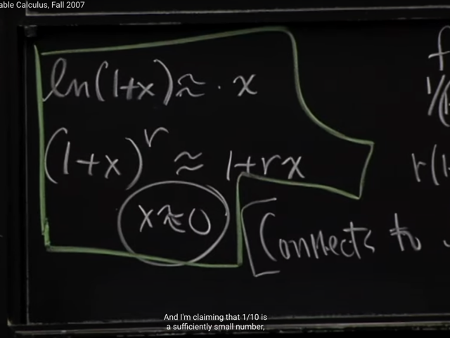</kbd></p>

<br>

<a id="node-189"></a>

<p align="center"><kbd>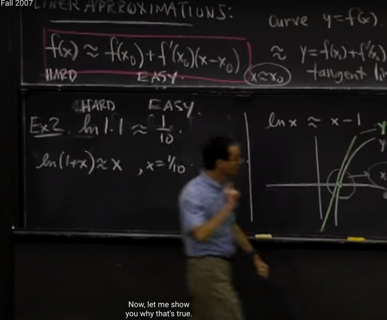</kbd></p>

> [!NOTE]
> Gs lấy ví dụ dùng linear approximation `ln(1+x)` `~=` x, ta có thể
> xấp xỉ ln(1,1) tức là `ln(1+0.1)` `~=` 0.1
>
> Vì ta có thể cho rằng x `=` 0.1 là đủ nhỏ để `~=` 0, cho phép áp 
> dụng công thức linear approximation tại `x=0:` `ln(1+x)~=x`
>
> Gs dùng ví dụ này muốn nhấn mạnh rằng ln(1.1) là phần khó,
> còn 0,1 thì dễ. ý nói, nhiều vấn đề tính trực tiếp f(x) thì khó, nhưng
> tính f(x0) `+` `f'(x0)(x-x0)` thì dễ

<br>

<a id="node-190"></a>

<p align="center"><kbd>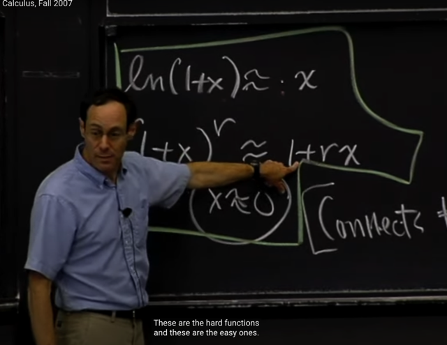</kbd></p>

> [!NOTE]
> ví dụ như ở đây tính `(1+x)^r` thì khó, nhưng dùng linear
> approximation 1 `+` rx thì dễ.
>
> Và đó là cái ưu điểm của Linear approximation, cho phép đơn
> giản hóa nhiều bài toán phức tạp

<br>

<a id="node-191"></a>

<p align="center"><kbd>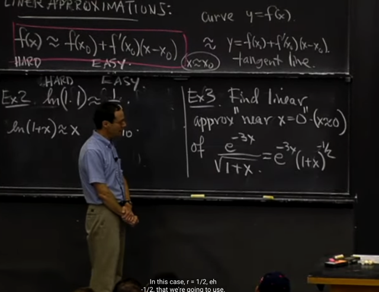</kbd></p>

> [!NOTE]
> ```text
> Tiếp ta sẽ tìm linear approximation tại x~=0 (near x=0) của e^-3x /
> ```
> `sqrt(1+x)` và gs cho rằng ta sẽ không cần tính đạo hàm gì, mà chỉ
> cần dùng các công thức linear approximation vừa rồi đã biết
> như cửa e^x và `(1+x)^r`

<br>

<a id="node-192"></a>

<p align="center"><kbd>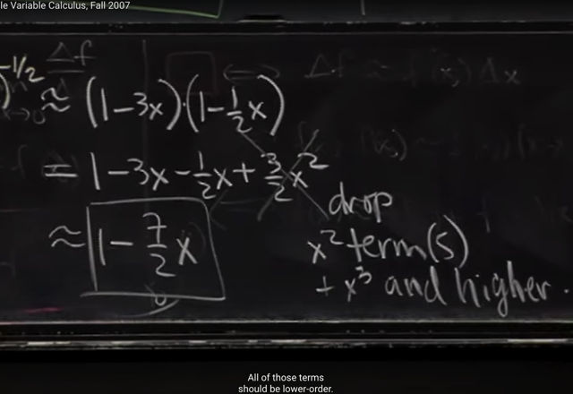</kbd></p>

> [!NOTE]
> Thế thì, ta có thể dùng linear approximation formula:
>
> ```text
> e^x ~= (1+x) để có e^-3x ~= 1-3x
> ```
>
> ```text
> và (1+x)^r ~= 1+rx để có (1+x)^(-1/2) ~= 1-(1/2)x
> ```
>
> ```text
> Dẫn tới e^x(1+x)^(-1/2)  ~= (1-3x)[1-(1/2)x]
> ```
>
> Triển khai ra, thì gs cho rằng ta sẽ bỏ luôn cái term bậc 2 `(3/2x^2)`
> Lí do là vì thật ra khi dùng linear approximation, thì ta cũng đã bỏ
> đi các higher derivative, chỉ còn giữ lại 1st derivative để chỉ còn 
> những term bậc 1 (linear)
>
> ```text
> Từ đó kết quả e^x(1+x)^(-1/2) ~= 1 - (7/2)x
> ```

<br>

<a id="node-193"></a>

<p align="center"><kbd>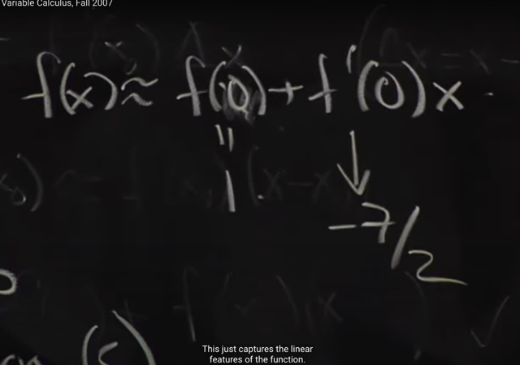</kbd></p>

> [!NOTE]
> Có câu hỏi là nếu ta coi `e^x(1+x)^(-1/2)` là f(x) và dùng công thức
> linear approximation gốc, tức là f(x) `~=` f0) `+` f'(0)x thì sẽ như thế
> nào?
>
> Câu trả lời là, ta cũng sẽ có kết quả y như này. Đó là f(0) sẽ bằng 1
> Và nếu ta tính f'(x) bằng product rule, và evaluate tại `x=0.` Kết quả
> nhất định ra bằng `-7/2`

<br>

<a id="node-194"></a>

<p align="center"><kbd>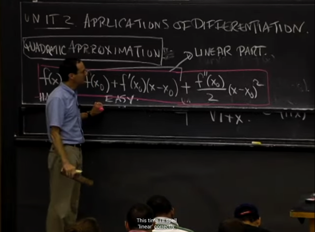</kbd></p>

> [!NOTE]
> Tiếp theo ta sẽ nói qua QUADRATIC APPROXIMATION. Bằng
> cách thêm một quadratic term `f''(x0)/x` * `(x-x0)^2.`

<br>

<a id="node-195"></a>

<p align="center"><kbd>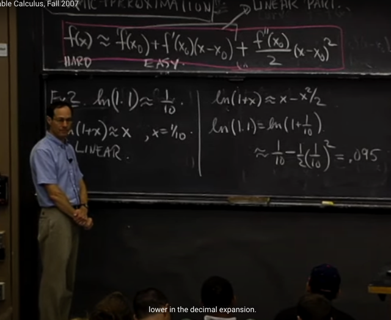</kbd></p>

> [!NOTE]
> ```text
> Nếu quadratic approximate thì ln(1+x) sẽ là  ln(1+x) ~= x-x^2/2
> ```
>
> ```text
> Và ln(1,1) sẽ ~= 1/10 - 0.5*(1/10)^2 ~= .095
> ```

<br>

<a id="node-196"></a>

<p align="center"><kbd>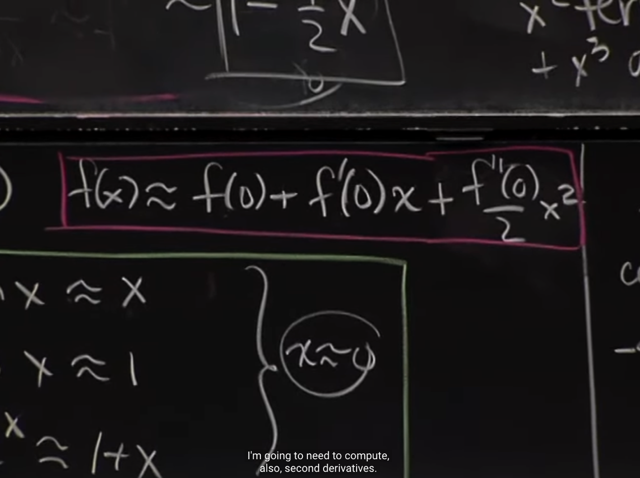</kbd></p>

> [!NOTE]
> Với quadratic approximation thì công thức approx tại x `=` 0
> này có thêm `f''(0)x^2/2`

<br>

<a id="node-197"></a>

<p align="center"><kbd>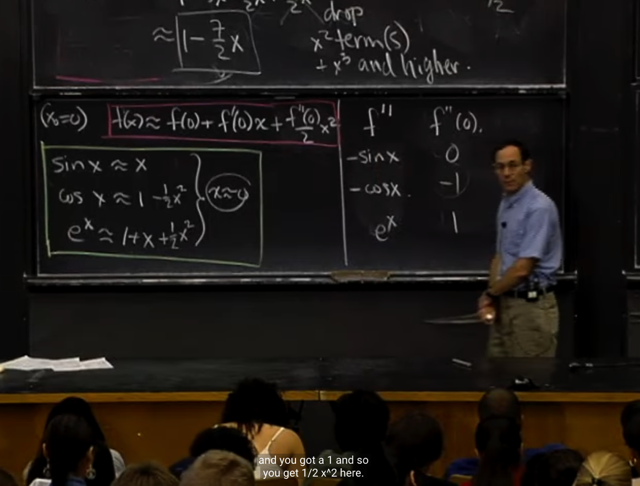</kbd></p>

> [!NOTE]
> Sau đó gs update các kết quả ước lượng của sin(x), cos(x), e^x
> với quadratic approximation
>
> Thì với sin(x) kết quả vẫn là x, cho thấy linear approximation 
> là một approximation rất tốt khi nó cũng chính là quadratic.

<br>

<a id="node-198"></a>

<p align="center"><kbd>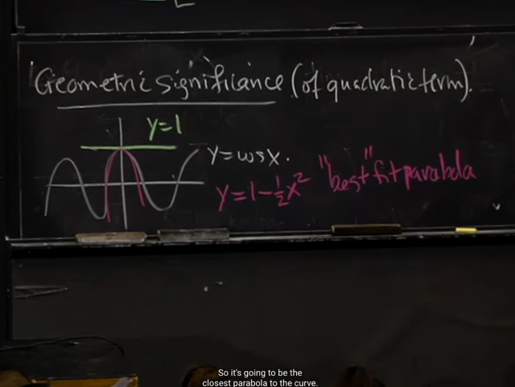</kbd></p>

> [!NOTE]
> Cuối cùng, gs nói về ý nghĩa hình học của Quadratic approximation.
> Ví dụ như vối `y=cos(x),`
>
> Linear approx tại `x=0` có ý nghĩa là trong đoạn gần 0 `x~=0,` thì có thể
> coi hàm y `=` cos(x) trùng với đường `y=1.`
>
> Còn Quadratic approx tại `x=9` có ý nghĩa là trong đoạn gần 0, ta có
> thể coi hàm y trùng với đường parabola `y=1-x2/2.`

<br>

<a id="node-199"></a>

<p align="center"><kbd>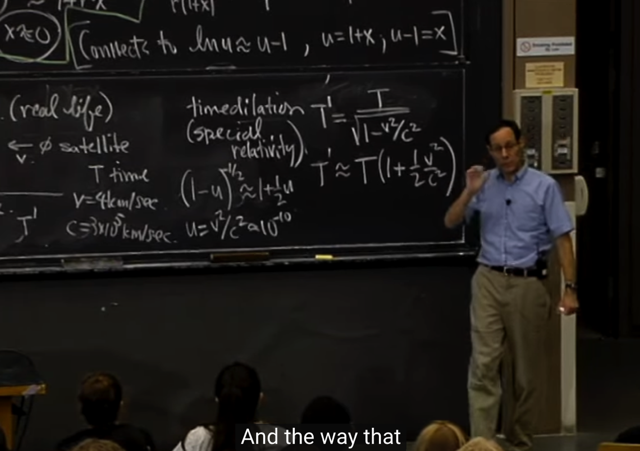</kbd></p>

> [!NOTE]
> Đại khái là, có công thức trong vật lí thể hiện liên hệ giữa T' (thời gian
> của người ở dưới) và T (thời gian trên vệ tinh). với v là vận tốc vệ tinh
> và c là tốc độ ánh sáng.
>
> Thế thì dùng linear approximation ta có thể approx `(1+u)^-1/2` bằng công
> ```text
> thức linear approx lúc nãy để có ~= 1+u/2 = 1 + v^2/2c^2
> ```
>
> Từ đó, ta sẽ có thể approx `T'~=T(1+v^2/2c^2)` và con số này rất nhỏ cho
> thấy hầu như ko có vấn đề gì trong việc sai khác thời gian giữa T và T'

<br>

