# Lec 10: Second Derivative Test, Boudaries, Infinity

📊 **Progress:** `24` Notes | `25` Screenshots

---

<kbd>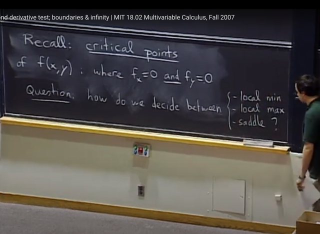</kbd>

> [!NOTE]
> Thế thì bài này ta sẽ **quay lại trả lời câu hỏi** làm sao để **xác định
> maximum / minima  / saddle point** vì bài trước ta đã **biết critical
> point** nơi mà **mọi partial derivative đều bằng 0** đều có thể rơi vào
> 3 dạng này

 

<kbd>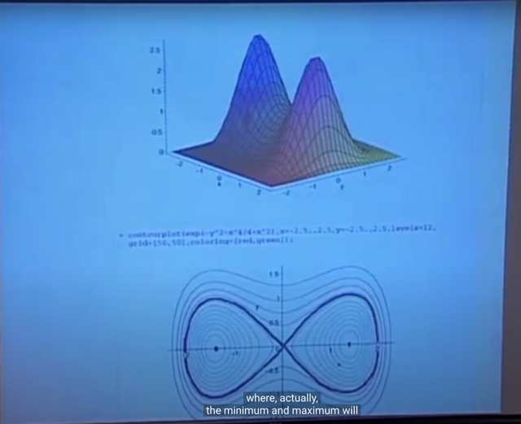</kbd>

> [!NOTE]
> Đầu tiên gs lưu ý rằng: Đại khái là **GLOBAL MAXIMUM /
> MINIMUM** **KHÔNG NHẤT THIẾT** **PHẢI LÀ MỘT TRONG
> NHỮNG CRITICAL POINTS.**

 

<kbd></kbd>

> [!NOTE]
> Mà nó **có thể ở critical point** nhưng **cũng có thể ở infinity,
> hoặc ở boundary.
>
> Thành ra ta sẽ còn cần phải kiểm tra boundary của function nữa
> mới giúp xác định local maxima/minima có phải là global
> maxima/minima không**

 

<kbd></kbd>

> [!NOTE]
> Thế thì đầu tiên gs cho rằng, cũng**giống như với bài toán một biến**,
> khi ta đã **xác định được critical point** bằng cách solve equation
> **derivative = 0**.
>
> Thì ta sẽ **dùng second derivative** để xác định xem **function cong
> lên hay cong xuống**
>
> Thì ở đây với **bài toán đa biến cũng tương tự**

 

<kbd></kbd>

> [!NOTE]
> Đầu tiên ta **xét ví dụ function w** này. Gs cho rằng ta**dễ thấy nó có
> critical point tại x=0, y=0**
>
> Vì khi **tính partial derivative của w đối với x, và y** và cho nó bằng 0
> và giải ra ta sẽ ra (0, 0)
>
> w_x = 2ax + by = 0 <=> 2ax = -by <=> x = -by/2a (1)
>
> w_y = 2cy + bx = 0 <=> 2cy = -bx <=> 2cy = -b(-by/2a)
>
> <=> 2cy = b^2y/2a <=> y = 0 => x = 0

 

<kbd>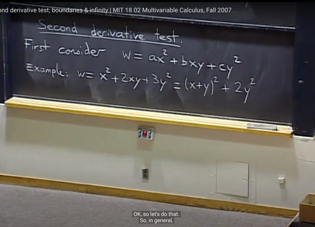</kbd>

> [!NOTE]
> Thế thì nhớ như bữa trước, ta có thể làm cách khác bằng cách
> **completing the square**, như ở đây, trong ví dụ cụ thể w = x^2 + 2xy
> + 3y^2 này thì k**ết quả nó là (x+y)^2 + 2y^2** nên nó sẽ **luôn >=0**.
> Và **chỉ bằng 0 khi x = y = 0**.
>
> Vậy critical point (x=0, y=0) đó chính là **minimum**

 

<kbd>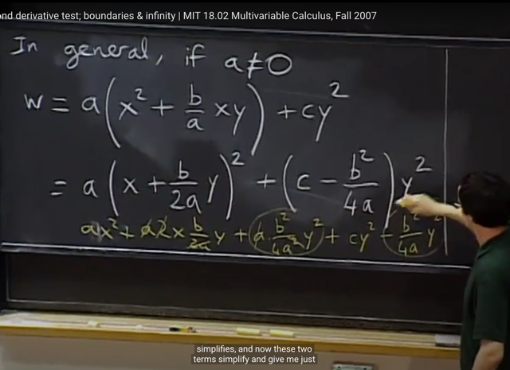</kbd>

> [!NOTE]
> Tiếp theo gs cho rằng có thể làm theo cách "**completing the
> square**" một cách **khái quát**. Assume a > 0
>
> Để có kết quả như thế này (cộng và trừ cho b^2/4a)
>
> w = a*[x+(b/2a)y]^2 + [c-b^2/4a]*y^
>
> Ta sẽ phân tích các trường hợp khác nhau với nhận xét rằng với
> a dương thì **a*[x+(b/2a)y]^2 luôn không âm**.
>
> Term còn lại (c - b^2/4a)*y^2 sẽ **không âm** hoặc **không dương
> tùy theo c-b^2/4a**

 

<kbd>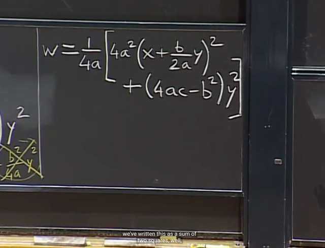</kbd>

> [!NOTE]
> Gs triển khai tiếp bằng **cách bỏ (1/4a) ra ngoài**, để bên trong là:
>
> 4a^2(x+by/2a)^2 + (4ac-b^2)y^2 
>
> Ý chính là, cái này sẽ có dạng là **tổng hoặc hiệu của hai cái 
> bình phương**, tùy vào 4ac lớn hơn hay bé hơn b^2

 

<kbd>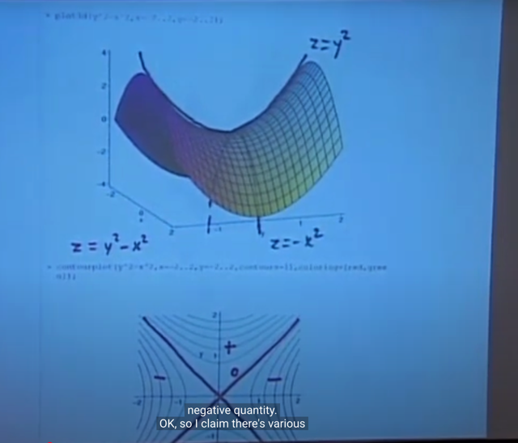</kbd>

> [!NOTE]
> Thế thì **nếu cả hai** **đều không âm (>=0), cũng là ta có tổng hai 
> bình phương (sum of square)**, ta sẽ có **minima**.
>
> Còn nếu **một cái âm**, tức ta có hiệu hai bình phương (**difference 
> of square)** thì ta sẽ có **saddle point.** 
>
> Ví dụ **z = y^2 - x^2**, thì khi **giữ y constant**, mà **chỉ thay đổi x** thì **x
> tăng sẽ khiến z giảm** tức là đi theo chiều x thì ta sẽ có **parabola úp
> xuống.**
>
> Ngược lại nếu **giữ x fixed**, và**tăng y thì ta có z tăng**, ta có **parabola
> ngửa lên**

 

<kbd>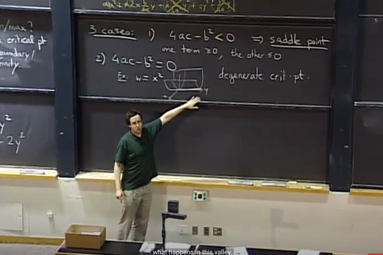</kbd>

> [!NOTE]
> (1) Thế thì trường hợp 1 là **4ac < b^2:**Khi đó c-b^2/4a < 0 thì ta có trường hợp "**different of square**" và
> như  vừa nói, ta sẽ có **saddle points** (chú ý rằng với case này thì dù
> a dương hay âm thì sẽ đều là saddle point, vì ta vẫn có 1 term dương
> 1 term âm, tức là vẫn có hiệu hai bình phương)
>
> (2) Trường hợp 2 là **4ac - b^2 = 0:**
>
> thì ta có trạng thái  **z chỉ còn phụ thuộc một direction**, để rồi hình
> dạng đồ thị sẽ **giống như cái máng**. Trong đó, SẼ CÓ **VÔ SỐ
> CRITICAL POINT TẠI ĐÁY MÁNG** gọi là **DEGENERATE CRITICAL
> POINT**Gs cho rằng có thể hình dung dễ hơn rằng nó sẽ giống như khi ta có
> w = x^2, cái máng sẽ nằm dọc theo trục y như hình vẽ (chú ý, đây chỉ
> là ví dụ để dễ hình dung, còn trong case tổng quát khi 4ac = b^2 thì  w
> trở thành w = 4a^2(x+by/2a)^2, thì nó vẫn là cái máng có điều sẽ quay
> hướng nào đó chứ ko thẳng góc. Nó vẫn depend on cả x và y nhưng
> nó chỉ depend trên combination cụ thể này của x,y thôi: x+(b/2a)*y

 

<kbd>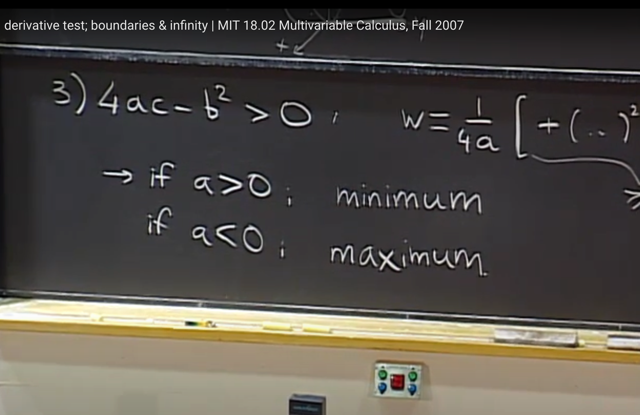</kbd>

> [!NOTE]
> Nếu **4ac - b^2 > 0** thì ta có trạng thái **tổng hai bình phương**
> (sum of square).
>
> Khi đó **nếu a dương thì z = (1/4a)*[tổng hai bình phương] sẽ
> luôn lớn hơn hoặc bằng cái gì đó** (ở đây là 0) và tức là **f có
> minimum**.
>
> Còn ngược lại n**ếu a < 0 thì ta sẽ có z luôn bé hơn hoặc bằng 0,
> nên có trạng thái có maximum**

 

<kbd>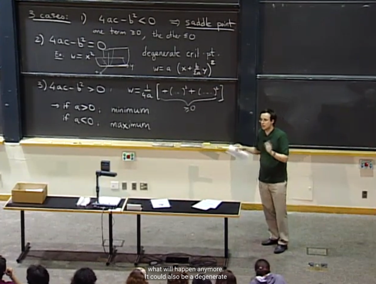</kbd>

> [!NOTE]
> có câu hỏi là những cái này liên quan gì đến "second derivative
> test", thì gs nói thật ra với z = ax^2 + bxy + y^2 thì quả thật a
> (đúng hơn là 2a), b (2b), c chính là 2nd partial derivative, nên 
> thật ra đây chính là second derivative test
>
> Và tí nữa ta khái quát lên

 

<kbd></kbd>

<kbd></kbd>

<kbd>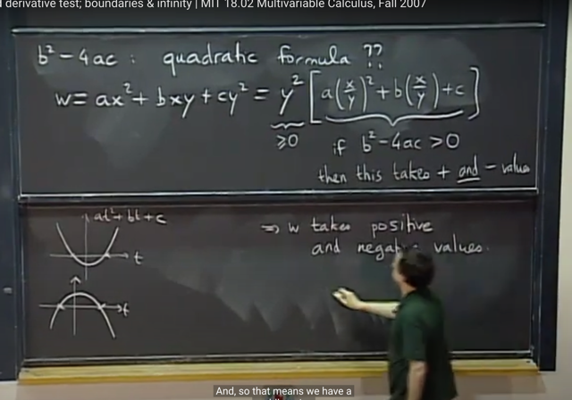</kbd>

> [!NOTE]
> Tiếp theo, gs nói về việc **b^2 - 4ac trông giống quadratic formula** (khi
> giải phương trình bậc hai) thì quả thật **nó chính là vậy**. 
>
> Đầu tiên ta thể hiện w = ax^2 + bxy + cy^2 = y^2[a(x/y)^2 + b(x/y) + c]
>
> Nhận xét y^2 >= 0, và ta xem xét a(x/y)^2 + b(x/y) + c
>
> Đại khái là khi giải phương trình bậc hai a(x/y)^2 + b(x/y) + c = 0, thì ta 
> sẽ tìm **biệt thức delta  = b^2 - 4ac**
>
> Khi đó, nếu **delta dương**, phương trình sẽ có **2 nghiệm thực phân
> biệt** là [+/- b +/- sqrt(delta)] / 2a. Và điều này đồng nghĩa đồ thị của 
> f(x/y) = a(x/y)^2 + b(x/y) + c là parabola sẽ cắt trục x tại 2 điểm. Và tùy
> vào a dương hay âm mà parabola này sẽ ngửa hay úp, nhưng nó cắt
> trục x tại 2 điểm nên chắc chắn nó có thể mang giá trị âm hoặc dương
>
> (gs minh họa bằng hình ảnh function at^2 + bt + c chính là thể hiện nếu
> phương trình at^2 + bt + c = 0 có hai nghiệm phân biệt (khi b^2-4ac >0)
> thì có thể thấy hàm số luôn có phần nằm trên và nằm dưới trục x)
>
> Quay lại w, w = y^2 * [a(x/y)^2 + b(x/y) + c] mà vế a(x/y)^2 + b(x/y) + c
> có thể âm có thể dương, suy ra w có thể mang giá trị cả âm cả dương.
>
> Và gs cho rằng ta có thể kết luận tại critical point (x=0, y=0), ta có saddle 
> point, bởi lẽ, đây là case duy nhất khiến đáp ứng hai sự kiện: 1) critical 
> point tại (0,0) và 2) function w có thể mang giá trị cả âm cả dương (vì nếu
> là max hoặc min tại (0,0) thì nó chỉ có thể âm hoặc chỉ có thể dương)

 

<kbd>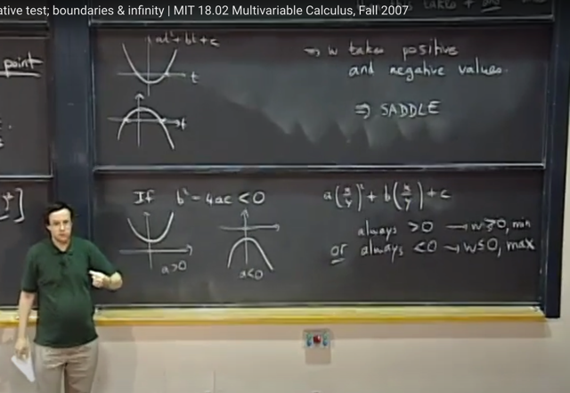</kbd>

> [!NOTE]
> Còn nếu **delta âm** thì phương trình vô nghiệm. 
>
> Thì đồng nghĩa, f(x/y) = a(x/y)^2 + b(x/y) + c không cắt
> trục x, nên nó chỉ có thể có giá trị dương >=0  hoặc âm <=0. 
>
> Dẫn đến w = y^2*f(x/y) cũng vậy. Do đó đây là trường hợp có min 
> tại (0,0) nếu a dương, và max tại (0,0) nếu a âm

 

<kbd>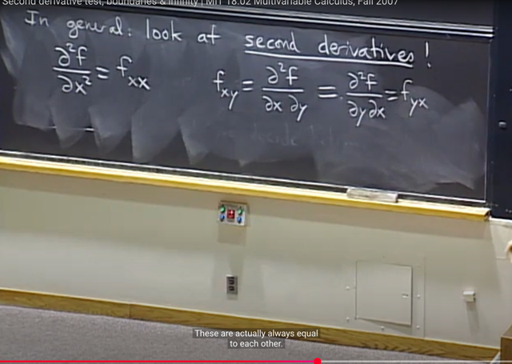</kbd>

> [!NOTE]
> Thế thì khái quát lên (không phải với function w = ax^2 + bxy + c^2)
> mà function bất kì). Ta sẽ xét **đạo hàm cấp hai.** gs nói qua kí hiệu:
>
> đạo hàm cấp 2 của f đối với x, là ta lấy đạo hàm của f đối với x sau đó
> lấy đạo hàm đối với x lần nữa. Đó là **f_xx** (hoặc **∂^2 f / ∂x^2)**
>
> Tương tự với **f_yy**(hay **∂^2 f / ∂y^2**)
>
> Còn **f_xy** là bằng **f_yx**: lấy đạo hàm**đối với x** sau đó lấy đạo hàm **đối
> với y** hoặc ngược lại: ∂^2 f / ∂x∂y hoặc ∂^2 f / ∂y∂x
>
> ====
>
> Ở đây ôn lại chút về vụ kí hiệu. Trong 1801 đã học, đạo hàm cấp 1 của
> f(x) đối với x là (d/dx) f, kí hiệu như vậy biểu thị ý nghĩa là (d/dx) là một
> linear operator apply lên function f, để cho ra một function khác (f').
>
> Thế thì nếu lại apply operator này lần nữa lên kết quả đó, thì ta sẽ có
> second derivative: (d/dx) (d/dx) f. Và từ đó người ta có thể ghi là:
>
> (d/dx)^2 f, hoặc d^2/(dx)^2 f và trở thành **(d^2 / dx^2) f, hay d^2 f/ dx^2
>
> (theo link xanh để xem lại)**

 

<kbd>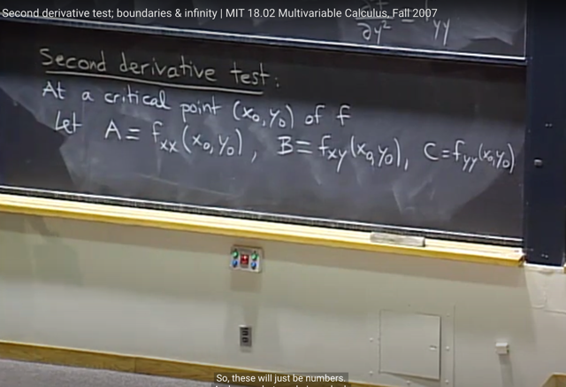</kbd>

> [!NOTE]
> Thế thì tiếp theo đại khái là **second derivative test** (để xác định
> critical point là saddle point / minimum / maximum) sẽ như sau:
>
> Ta sẽ **tính second derivative f_xx, f_xy, f_yy tại critical point (x0,y0)**
> (đương nhiên sẽ là các **number**, vì ta **evaluate các function
> second derivative tại x0, y0**
>
> Gọi giá trị của các second derivative **f_xx**, **f_xy**, **f_yy** tại critical point
> lần lượt là**A, B, C.**

 

<kbd>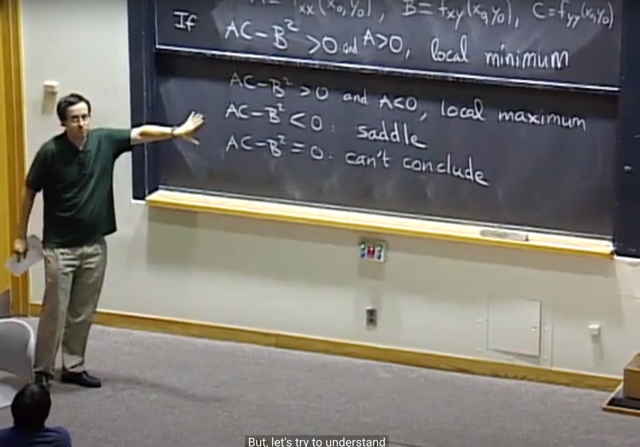</kbd>

> [!NOTE]
> Thì khi đó, ta sẽ **check AC-B^2**. Để có các trường hợp: 
>
> 1) **AC-B^2 > 0**: thì nếu **A dương** ta có tại critical point là **local
> minimum**. Nếu **A âm** thì tại critical point là **local maximum**.
>
> 2)**AC-B^2 < 0**. Ta có **saddle point**
>
> 3) **AC-B^2 = 0** thì **không thể kết luận**

> [!NOTE]
> SECOND DERIVATIVE TEST: 
>
> A = f_xx(x0,y0), B = f_xy(x0,y0), C = f_yy(x0,y0)
>
> A > 0 & AC-B^2 => MINIMUM
>
> A < 0 & AC-B^2 => MAXIMUM
>
> AC-B^2 < 0 => SADDLE POINT
>
> AC-B^2 = 0: KHÔNG BIẾT

 

<kbd>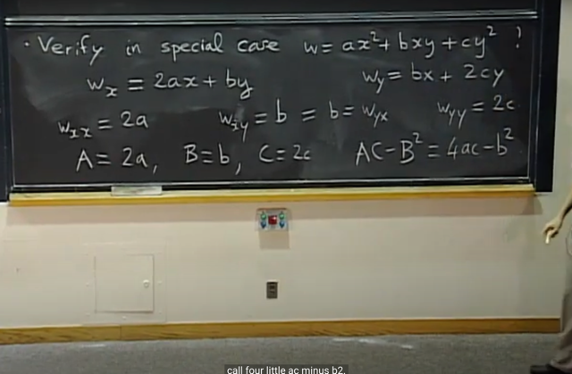</kbd>

> [!NOTE]
> Thế thì gs đề nghị ta kiểm tra lại cái này / cách làm này (second
> derivative test) ở trường hợp đặc biệt mà ta có hàm **w = ax^2 + bxy
> + cy^2** nơi mà lúc nãy, dùng phương thức "**complete the square**"
> ta đã kết luận rằng với các trường hơp sau:
>
> **4ac - b^2 < 0** thì ta có **saddle point tại**
>
> **4ac - b^2 > 0** thì tùy **a âm**thì ta có**maximum** hay a **dương** thì ta có 
> **minimum**
>
> **4ac - b^2 = 0** thì ta có trường hợp **degenerate** **critical point**
>
> Vậy thì áp dụng**second derivative test**:
>
> Ta **tính A, B, C** lần lượt là f_xx, f_xy, f_yy **và xét AC - B^2** ta thấy 
> nó**CHÍNH LÀ 4ac - b^2.**
>
> để rồi (theo second derivative test) nói rằng AC - B^2 dương thì 
> tùy A (=2a) âm hay dương mà ta có minimum / maximum thì nó chính là
> tương ứng với việc ta check 4ac - b^2 xem nếu nó dương thì tùy
> a âm hay dương thì ta có minimum / maximum.
>
> Tương tự việc AC - B^2 < 0 cũng chính là ứng với 4ac - b^2 < 0, ta có 
> saddle point tại critical point
>
> Nói chung là kiểm tra**lại second derivative test tổng quát** này**đối với
> hàm w = ax^2 + bxy + cy^2** thì thấy nó **chính là việc kiểm tra bằng các
> trường hợp của b^2-4ac hồi nãy**

 

<kbd>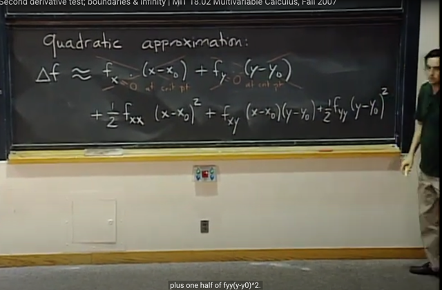</kbd>

> [!NOTE]
> Ta sẽ tìm hiểu**tại sao lại như vậy**.
>
> đại khái là dựa trên công thức **Taylor** expansion của hàm một biến:
>
> **f(x) = f(a) + f'(a)(x-a) + (1/2!)f''(a)(x-a)^2 + (1/3!)f'''(a)(x-a)^3 + ..** thì khi
> ta**chỉ giữ đạo hàm cấp 1**, ta có **linear approximation**:
>
> **f(x) ~= f(a) + f'(a)(x-a)**
>
> Với hàm nhị biến f(x,y): Linear approximation sẽ là:
>
> **f(x,y) ~= f(x0,y0) + f_x(x0, y0)(x-x0) + f_y(x0, y0)(y-y0)**chuyển f(x0,y0)
> qua ta có:
>
> **delta_f = f(x,y) - f(x0,y0) = f_x(x0, y0)(x-x0) + f_y(x0, y0)(y-y0)**Thế thì lí
> do mà **linear approximation không hữu dụng lắm** vì, tại **critical point**,
> **f_x(x0,y0) = 0** và **f_y(x0,y0) = 0**. Nên thành ra nếu chỉ linear
> approximation thì **delta_f = 0**
>
> Ta sẽ cần **quadratic approximation**, ta đã biết với hàm đơn biến sẽ là
> giống như linear approximation nhưng có thêm quadratic term, nhưng cũng
> có thể hiểu là dùng Taylor expansion nhưng lấy đến 2nd derivative:
>
> f(x) = f(a) + f'(a)(x-a) + (1/2!)f''(a)(x-a)^2  ..
>
> Với hàm 2 biến sẽ là:
>
> f(x,y) ~= f(x0,y0) + f_x(x0, y0)(x-x0) + f_y(x0, y0)(y-y0) +
>
> f_xx(x0,y0)(x-x0)^2 / 2 + f_yy(x0,y0)(y-y0)^2/2 + f_xy(x0, y0)(x-x0)(y-y0)
>
> ====
>
> Thế thì đại khái là gs nói rằng **khi ta thay function f bằng approximation của
> f**. Thì **critical point là không đổi**. Do đó, **tại critical point** với việc dùng
> **quadratic approximation** ta**coi như hàm quadratic.**
>
> Và ý là bài toán trở về quadratic case trong đó các f_xx, f_xy, f_yy đóng vai
> trò của a, b, c

 

<kbd>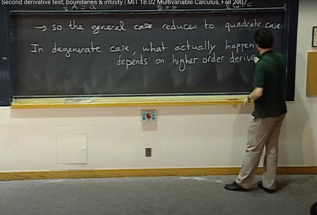</kbd>

> [!NOTE]
> Trong trường hợp AC - B^2 = 0, tương ứng với case gọi là
> Degenerate critical point, nơi mà ta không xác định được maximum,
> minimum, saddle  point
>
> Thì khi đó ta c**ần dựa vào higher order derivative** để xác định nhưng
> gs nói thực tế thì ta **rất hiếm gặp một critical point mà AC - B^2 = 0**

 

<kbd>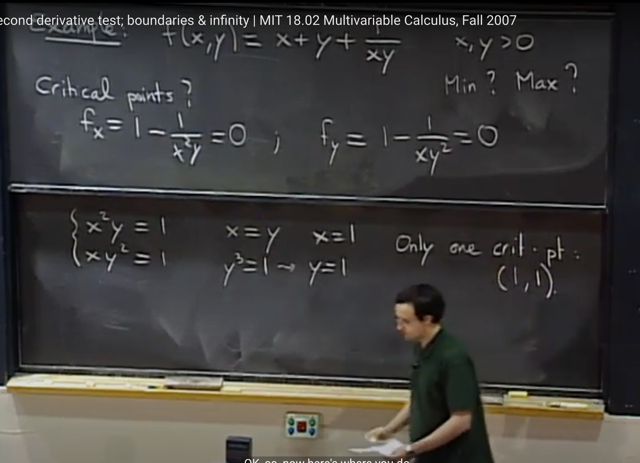</kbd>

> [!NOTE]
> Gs cho một ví dụ tìm maximum / minimum của function f(x,y) này. Thế
> thì đầu tiên ta sẽ **tìm critical poin**t bằng cách **solve equations first
> partial derivative** bằng 0:**f_x = 0, f_y = 0**. Dễ thấy solution là x = y = 1.
>
> Sau đó ta sẽ **dùng second derivative test để xác định xem nó là
> minimum / maximum / saddle point**

 

<kbd>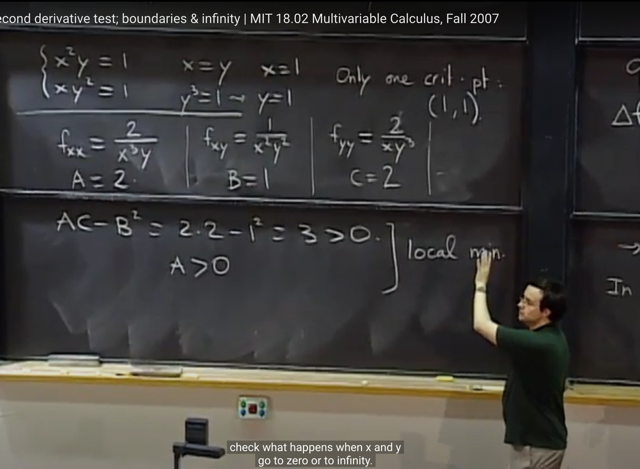</kbd>

> [!NOTE]
> tiếp ta sẽ tính second derivative A = f_xx,  B = f_xy, C = f_yy để tính 
> **AC - B^2**. Kết quả cho thấy **= 3 > 0** và **A dương**. Suy ra critical
> point là **local** **minimum**

 

<kbd>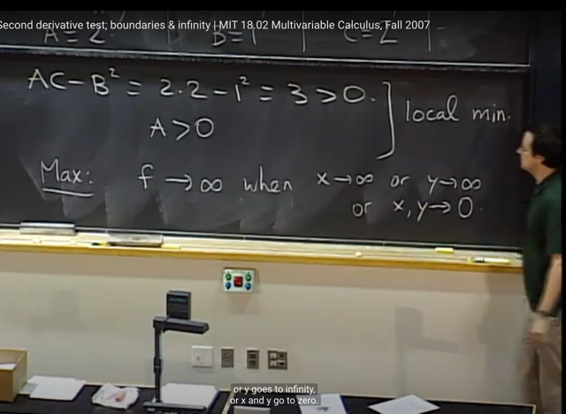</kbd>

> [!NOTE]
> còn để xem **maximum** của f. thì ở đây nó s**ẽ không nằm ở critical
> point** như ta đã thấy nó **chỉ có một critical point nhưng là local
> minimum**
>
> Thế thì như vậy **maximum** sẽ ở **boundary hoặc limit.**
>
> Ta sẽ cho thấy **f -> infi**khi một trong **hai x, y -> inf hoặc khi x và y
> -> 0**
>
> Tóm lại ta **phải check cả critical point và boundary để biết what's
> happen**

 

