# Lec 11: Differentials, Chain-rule

📊 **Progress:** `27` Notes | `22` Screenshots

---

<kbd>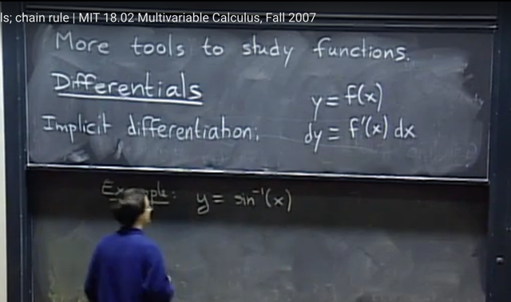</kbd>

🔗 **Related:** [LEC 14: NON-INDEPENDENT RANDOM VARIABLES](untitled.md#node-316)

🔗 **Related:** [LEC 20: PATH INDEPENDENCE & CONSERVATIVE FIELD](untitled.md#node-513)

> [!NOTE]
> đầu tiên gs nói đại khái là ta cần thêm một số công cụ để làm việc Thì
> ta có**IMPLICIT DIFFERENTIATION**
>
> Đại khái là nếu ta có**y = f(x) thì dy = f'(x) dx**
>
> Đây là công cụ / theorem mà cho phép ta liên hệ giữa một khoảng vô
> cùng nhỏ thay đổi của y với một khoảng thay đổi vô cùng nhỏ của x
>
> (Liên hệ với bài **Implicit differentiation** của 18.01, mình đã học về
> cái này đó là, cho rằng ta có **equation y = f(x) ẩn chứa function y
> theo x, tức y(x)**. Thì khi đó,**thay vì solve explicitly**y theo x để có
> y(x)  và take derivative, thì ta có thể **apply operator d/dx cho
> equation**, hay nói cách khác là l**ấy đạo hàm theo x hai vế, từ đó
> solve ra y' sẽ dễ hơn**
>
> Tức là từ y = f(x) => d/dx (y = f(x)) <=> dy/dx = df(x)/dx <=> **dy/dx =
> f'(x) hay dy = f'(x)dx là vậy**

 

<kbd>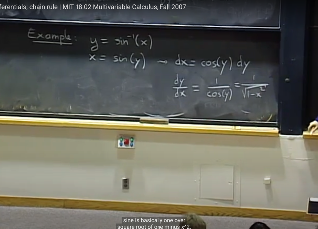</kbd>

> [!NOTE]
> Một ví dụ là, ta áp dụng công cụ này giúp ta **tính derivative** của  function
> **sin_inv**(x):
>
> Ta có **y = sin_inv(x)** thì tương đương **x = sin(y)**.
>
> Nếu thể hiện implicit differentiation theo 18.01 thì nó sẽ là:
>
> y = sin^-1(x) <=> sin(y) = x (y = f(x) <=> g(y) = x hay f_inv(y) = x)
>
> Áp dụng implicit differentiation:
>
> **d/dx (sin(y) = x)) <=> (d/dx) sin(y) = (d/dx) x**
>
> <=> d sin(y) / dy * dy / dx = dx/dx (chain rule)
>
> <=> **cos(y) * dy / dx = 1**
>
> <=> **dy / dx = 1 / cos(y)** = 1 / sqrt(1-sin(y)^2)
>
> = **1 / sqrt(1-x^2)**
>
> ====
>
> Còn ở 18.02, implicit differentiation thể hiện khác: đó là thể hiện theo vi
> phân:
>
> Đó là cũng từ y = sin^-1(x) <=> x = sin(y)
>
> => **dx = sin'(y)dy** **(lấy vi phân, đây chính là bước implicit differentiation)**
>
> <=> dx = cos(y)dy (derivative của sin(y) = cos(y))
>
> <=> dy/dx = 1/cos(y)
>
> Và vì x = sin(y) nên cos(y) = sqrt(1-sin(y)^2) = sqrt(1-x^2)
>
> Vậy **dy/dx = 1/[sqrt(1-x^2)] đó chính là giúp ta tính được derivative của
> sin_inv(x)**====

 

## Như vậy ta hiểu là trong 1801 implicit differentiation là ta

> [!NOTE]
> Như vậy ta hiểu là trong 1801 implicit differentiation là ta
> apply d/dx vào hai vế, mà ý nghĩa CHÍNH LÀ LẤY ĐẠO
> HÀM THEO X HAI VẾ. 
>
> y = f(x) => (d/dx) y = (d/dx) f(x) <=> \**dy/dx = f'(x)\**
>
> Còn 18.02 thì implicit differentiation thể hiện bằng cách 
> LẤY VI PHÂN HAI VẾ
>
> y = f(x) <=> \**dy = f'(x) dx\**
>
> Và chúng cùng bản chất, chẳng qua cách thể hiện theo vi
> phân  sẽ chuẩn bị cho ta bước qua khái niệm VI PHÂN
> TOÀN PHẦN (TOTAL DIFFERENTIAL)

 

<kbd>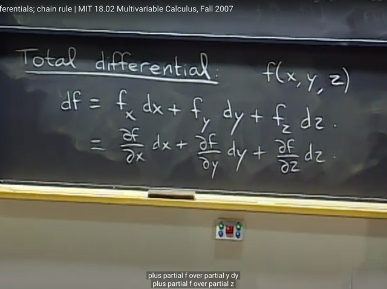</kbd>

🔗 **Related:** [LEC 14: NON-INDEPENDENT RANDOM VARIABLES](untitled.md#node-312)

🔗 **Related:** [LEC 18: CHANGE OF VARIABLES](untitled.md#node-430)

> [!NOTE]
> thế thì đại khái là ta sẽ áp dụng những notation dx, dy ở trên vào hàm
> đa biến, để có cái gọi là **TOTAL DIFFERENTIAL**, phân biệt với **PARTIAL
> DERIVATIVE**, vì với cái này, nó **include mọi yếu tố ảnh hưởng đến sự
> thay đổi của function f**.
>
> **Total differential theorem** là như sau: **df = f_xdx + f_ydy + f_zdz**
>
> Nếu dùng notation khác của f_x là ∂/∂x (f) thì 
>
> **df = ∂f/∂x*dx + ∂f/∂y*dy + ∂f/∂z*dz**
>
> Thế thì gs cho biết ta phải hiểu những thứ ở cả hai bên của equation
> này K**HÔNG PHẢI NUMBER, KHÔNG PHẢI VECTOR, CŨNG KHÔNG
> PHẢI MATRIX**. CHÚNG GỌI LÀ **DIFFERENTIAL** (VI PHÂN). Và ta phải
> **học các rule để manipulate chúng.**

> [!NOTE]
> TOTAL DIFFERENTIAL: df = f_x*dx + f_y*dy + f_z*dz

 

<kbd>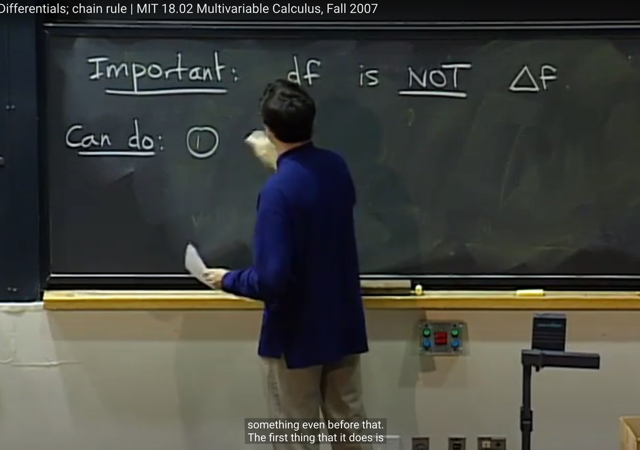</kbd>

> [!NOTE]
> Gs nhấn mạnh một vài điểm quan trọng: **df KHÔNG PHẢI LÀ ∆f**
>
> GS cho biết **∆f LÀ NUMBER,** mang ý nghĩa là **khoảng thay đổi rất
> nhỏ** **của** **f** **khi variable thay đổi**.
>
> Nhưng **df KHÔNG PHẢI LÀ NUMBER**, ta **ko thể assign giá trị cho
> nó**.
>
> Tuy rằng người ta đặt ra nó để **mang ý tưởng** một **khoảng thay đổi
> vô cùng nhỏ**, nhưng gs cho rằng **cách hiểu đúng hơn** là chúng là các
> **PLACE HOLDER**, để rồi khi **thay chúng bằng các ∆**, thì ta sẽ **có
> các APPROXIMATION** (ước lượng của khoảng thay đổi của f bằng / từ
> cac khoang thay đổi cua variable)
>
> Ta có thể hiểu điều này ví dụ như LINEAR APPROXIMATION:
>
> Khi **df/dx = f'(x)** THEO ĐỊNH NGHĨA là = **limit** của ∆f/∆x khi ∆x->0
> thì ta có thể **bỏ lim** và **chuyển thành approximate**: **f'(x) ~= ∆f/∆x**
> với ∆x rất nhỏ (ÔX~=0). Để rồi điều đó tương đương:
>
> f'(x) ~= [f(x) - f(x0)] / (x-x0) với x~=x0 (để ∆x~=0)
>
> <=> f'(x)*(x-x0) ~= f(x) - f(x0)
>
> <=> f'(x)*(x-x0) + f(x0) ~= f(x)
>
> Viết lại f(x) ~= f'(x)*(x-x0) + f(x0) với x~=x0 đây chính là linear
> approximation
>
> nếu x0 = 0 ta sẽ có f(x) ~= f(0) + f'(0)x
>
> Vậy có thể coi như từ **df/dx = f'(x)**, khi **thay d bằng ∆**, ta **có
> approximation: ∆f/∆x ~= f'(x)
>
> Hoặc viết theo vi phân thì từ df = f'(x) dx, khi thay d thành ∆ thì ta
> có approximation: ∆f = f'(x)∆x**

> [!NOTE]
> df không phải ∆f mà nên hiểu như PLACE HOLDER để khi thay df
> bằng ∆f ta có LINEAR APPROXIMATION
>
> df/dx = f'(x), khi thay d bằng ∆, ta có approximation: ∆f/∆x ~= f'(x)

 

<kbd>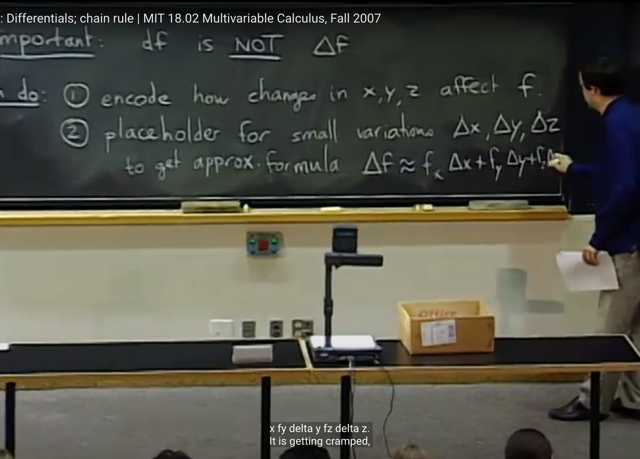</kbd>

🔗 **Related:** [LEC 12: GRADIENT, DIRECTIONAL DERIVATIVE, TANGENT PLANE](untitled.md#node-259)

> [!NOTE]
> như vậy**total differential equation**: **df = fxdx + fydy + fzdz** có hai ý
> nghĩa:
>
> 1/ Thể hiện rằng**khi thay đổi x, y**, **z** thì**ảnh hưởng thế nào tới f**
>
> 2/ Là vai trò củ**a place holder** như mới nói để khi **thay bằng các
> delta thì ta sẽ có công thức xấp xỉ ∆f ~= f_x∆x + f_y∆y + f_z∆z**

 

<kbd>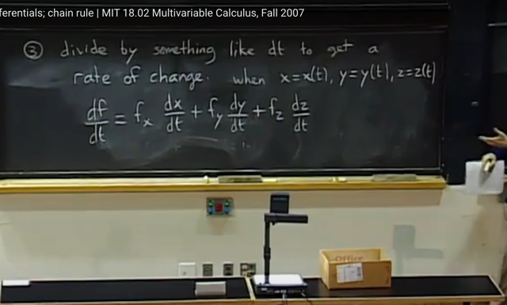</kbd>

> [!NOTE]
> Một tác dụng nữa mà **total differential** cho phép đó là khi trong
> bối cảnh mà **x, y, z đều là function theo t**. Khi đó **dx/dt , dy/dt,
> dz/dt** là **rate of change của x, y, z theo t**: tỉ lệ của khoảng thay
> đổi của x khi t thay đổi kéo theo x thay đổi (với y, z cũng tương tự)
>
> Thì khi đó bằng cách chia các vi phân cho dt. Ta có equation thể
> hiện **tỉ lệ thay đổi của f (khi t thay đổi) được tính bằng các rate of
> change của x, y, z**

 

<kbd>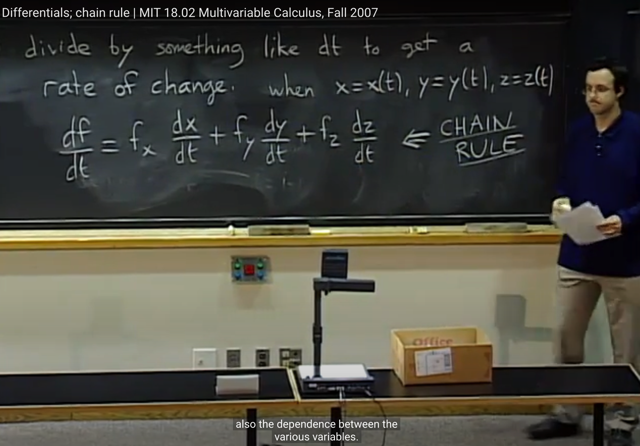</kbd>

> [!NOTE]
> VÀ ĐÂY CHÍNH LÀ **CHAIN RULE** với multivariable case
>
> Chain-rule cho phép ta tính derivative của f đối với variable t thông
> qua derivative của f đối với x, y, z và derivative của x, y, z đối với t
>
> Chain-Rule cho trường hợp đơn biến:
>
> df = f'(x)dx thì nếu f và x là function theo t: f(t), x(t) chia cho dt
>
> df/dt = f'(x) dx/dt = df/dx * dx/dt

 

<kbd>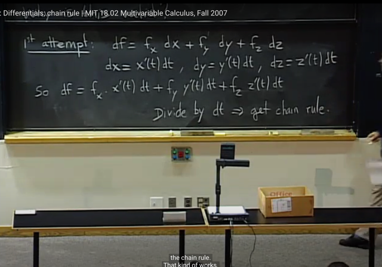</kbd>

> [!NOTE]
> đại khái là ta có thể đặt câu hỏi là**liệu công thức Chain-Rule** vừa rồi
> **có valid không**?
>
> Nỗ lực thứ nhất để **biện minh** đó là:
>
> Xuất phát từ**total differential**: df = f_x*dx + f_y*dy + f_z*dz
>
> thì ta mới nói tiếp là vì x, y, z là function of t. Nên 
>
> **dx = x'(t)dt**, 
>
> **dy = y'(t)dt** 
>
> **dz = z'(t)dt**
>
> Lắp vào total differential equation ta có:
>
> **df = f_x*x'(t)*dt + f_y*y'(t)*dt + f_z*z'(t)*dt** 
>
> <=> df = [f_x*x'(t) + f_y*y' (t) + f_z*z'(t)] dt
>
> Tới đây k**hi**có thể thể hiện df = [CÁI GÌ ĐÓ] dt thì cái gì đó (TỨC
> **COEFFICIENT**) CHÍNH LÀ **RATE OF CHANGE** CỦA f BỞI t
>
> => điều này chứng tỏ rằng f_x*x'(t) + f_y*y' (t) + f_z*z'(t) chính là df/dt

 

<kbd>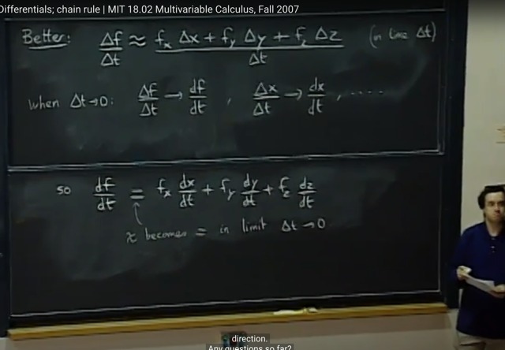</kbd>

🔗 **Related:** [LEC 9: MAX-MIN PROBLEMS, LEAST SQUARES](untitled.md#node-173)

> [!NOTE]
> Tuy nhiên **cách biện minh tốt hơn** đó là như sau:
>
> Ta bắt đầu với **approximation** formula:
>
> ∆f ~= f_x*∆x + f_y*∆y + f_z*∆z
>
> (ta đã nói về nó ở bài trước, theo link)
>
> thế thì ý chính là, khi ta **chia hai vế cho ∆t**, là việc hoàn toàn bình
> thường vì ∆t là number, ta sẽ có:
>
> **∆f/∆t ~= f_x*∆x/∆t + f_y*∆y/∆t + f_z*∆z/∆t**
>
> thì khi ta cho ∆t nhỏ -> 0 thì ∆**f/∆t sẽ trở thành df/dt** tức là derivative.
>
> Tương tự **∆x/∆t -> dx/dt, ∆y/∆t -> dy/dt, ∆z/∆t -> dz/dt**
>
> Khi đó **dấu approx ~= ngày càng trở nên chính xác hơ**n và**dần trở
> thành dấu "="**. Từ đó ta có công thức
>
> **df/dt ~= f_x*dx/dt + f_y*dy/dt + f_z*dz/dt**

 

<kbd>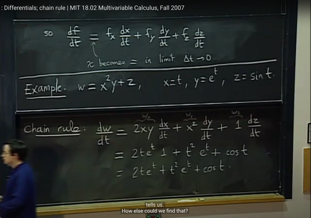</kbd>

> [!NOTE]
> gs làm một ví dụ tính **dw/dt** của **w = x^2y + z** với x = t, y = e^t. z = sin(t)
>
> hoàn toàn dễ hiểu không có gì phải nói.
>
> Chỉ việc tính các partial derivative f_x, f_y, f_z và các derivative dx/dt
> dy/dt, dz/dt (theo nguyên tắc khi tính partial derivative của f đối với biến
> này thì coi các biến kia như constant) rồi gắn vào chain rule thôi:
>
> dw/dt = w_x*dx/dt + w_y*dy/dt + w_z*dz/dt
>
> Tuy nhiên gs nói còn có thể **có cách khác**, đó là thể **x = t, y = e^t,  z =
> sin(t) vào w**. Sau đó lấy derivative của w. Thì ta sẽ cho ra cùng kết quả.
>
> Nhưng ý chính là, có khi tính partial derivative sẽ dễ hơn rằng gắn
> vô hết rồi tính derivative. Khi đó dùng chain rule sẽ dễ hơn

 

<kbd>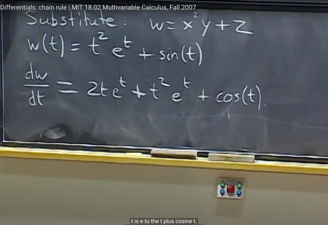</kbd>

> [!NOTE]
> làm theo cách đó (thế vô hết để có hàm w(t) và tính derivative của
> w) ở đây:
>
> Gs nói rằng ta sẽ dễ dàng tính được cái này dùng product rule, và
> đây là kiến thức của 1801 hoặc hightschool: (uv)' = u'v + uv'
>
> d(t^2e^t)/dt thì dùng công thức: derivative của uv = u'v + uv' nên
> derivative của t^2 * e^t = 2t*e^t + t^2*e^t
>
> còn derivative của sin(t) = cos(t)
>
> Kết quả cho ra cùng kết quả với cách dùng chain rule

 

<kbd>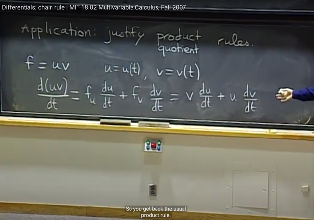</kbd>

> [!NOTE]
> Tiếp, ta có thể **dùng chain rule** để **justify** lại cái product rule:
> (uv)' = u'v + uv'
>
> Đương nhiên **u, v là function theo biến t** nào đó:**u(t), v(t)**, và
> ta **xem uv là function  của u, v**: f(u,v) = u*v
>
> Thế thì theo chain rule ta vừa học:
>
> df/dt = f_u*du/dt + f_v*dv/dt
>
> thì f_u dễ thấy chính là v. Và f_v chính là u
>
> và du/dt thì đương nhiên là u'(t) và dv/dt là v'(t)
>
> Từ đó ta có df/dt tức là f'(t) hay (uv)' = v*u' + u*v' = u'v + uv'

> [!NOTE]
> Coi uv là f(u,v), dùng chain-rule để
> derive công thức của (uv)'

 

<kbd>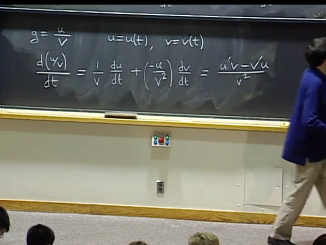</kbd>

> [!NOTE]
> tương tự, với**quotient rule**, ta cũng dễ dàng derive lại công thức
> dựa vào / bằng cách này:
>
> Bằng cách **coi u/v là function g(u,v) = u/v**. Ta có:
>
> dg/dt = g_u*du/dt  + g_v*dv/dt
>
> **g_u** (giống như f_x) là partial derivative của g w.r.t u = **1/v**
>
> **g_v** (giống như f_y) là partial derivative của g w.r.t v = u*(-1/v^2) = -u/v^2
>
> Vậy dg/dt = (1/v)*du/dt + (-u/v^2)*dv/dt 
>
> Đương nhiên **du/dt** là derivative của u(t) w.r.t t chính là kí hiệu **u'(t)**
> Và **dv/dt**là derivative của v w.r.t v, chính là **v'(t)**
>
> Từ đó dg/dt = (1/v)*u' + (-u/v^2)*v' 
>
> <=> (**u/v)' =** **(u'v - v'u) / v^2 chính là  QUOTIENT RULE**

> [!NOTE]
> Coi u/v là f(u,v), dùng chain-rule để
> derive công thức của (u/v)'

 

<kbd>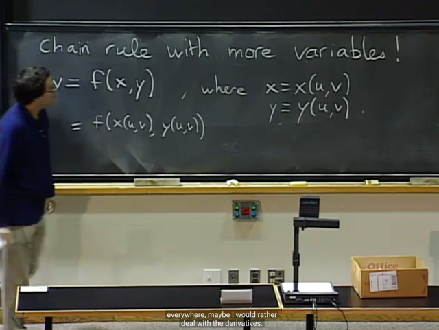</kbd>

> [!NOTE]
> Gs nói qua **chain-rule với nhiều biến hơn**. Ví dụ w là hàm theo x, y:
> **w(x,y)** Nhưng x, y thay vì là hàm đơn biến x(t), y(t) thì nay nó cũng là
> hàm đa biến**x(u,v) y(u,v)**
>
> Thế thì, một cách đầu tiên đương nhiên là ta **có thể gắn x(u,v) và y(u,
> v) vào w = f(x,y)** để khi đó ta c**ó function w theo u, v**: w(u,v) và ta có
> thể tìm **partial derivative của w w.r.t u và v: (∂/∂u)w, (∂/∂v)w**
>
> tuy nhiên như đã nói, nhiều khi l**àm vậy ta có function phức tạp** khiến
> việc tính partial derivative **khó**

 

<kbd>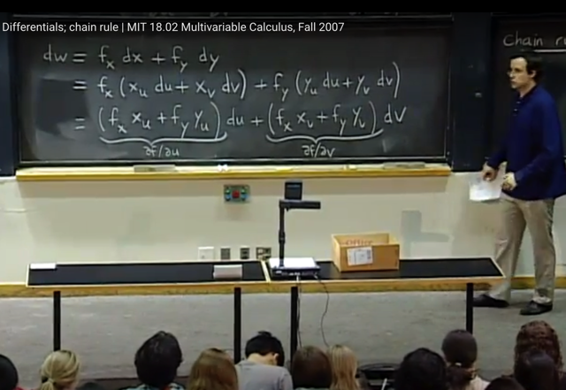</kbd>

🔗 **Related:** [LEC 14: NON-INDEPENDENT RANDOM VARIABLES](untitled.md#node-341)

> [!NOTE]
> Thế thì ta sẽ bắt đầu từ việc **w là function theo x, y**: **w(x,y)**
> nên **TOTAL  DIFFERENTIAL** cho ta:
>
> **dw = f_x*dx + f_y*dy**
>
> Tiếp, vì **x là function theo u, v** - **x(u,v)**. nên **TOTAL
> DIFFERENTIAL** sẽ cho ta biết liên hệ giữa dx với du, dv:
>
> **dx = x_u*du + x_v*dv**
>
> Tương tự, **y cũng là function y(u,v)** nên **TOTAL
> DIFFERENTIAL** cho ta biết liên hệ giữa dy và du, dv:
>
> **dy = y_u*du + y_v*dv**
>
> Từ đó ta có thể liên hệ dw với du, dv:
>
> **dw = f_x*(x_u*du + x_v*dv) + f_y*(y_u*du + y_v*dv)**
>
> sắp xếp lại (gom du, dv) ta có:
>
> **dw = (f_x*x_u + f_y*y_u)du + (f_x*x_v+f_y*y_v)dv**
>
> Và theo định nghĩa, ở đây chính là có equation liên hệ giữa df và
> du, dv. Thì cái **coefficient gắn với du chính là partial derivative
> của w đối với u** và **coefficient gắn với dv chính là partial
> derivative của w đối với v
>
> Cũng như df = f_x*dx + f_y*dy thì coefficients gắn với dx, chính là
> partial derivative của f w.r.t x và coefficient gắn với dy chính là
> partial derivative của f w.r.t y vậy
>
> Bởi vì ý nghĩa của total differential equation là nó giúp liên hệ giữa
> khoảng hay đổi của f : df với các yếu tố đóng góp: dx, dy thông
> qua partial derivative**

 

<kbd>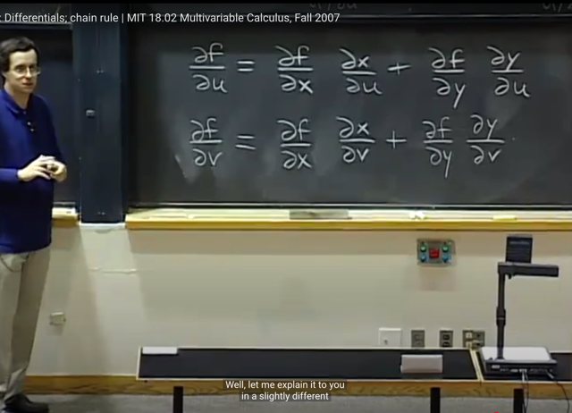</kbd>

> [!NOTE]
> Từ đó ta có thể ghi ra partial derivative của f w.r.t u và v như sau: 
>
> **f_u** (hay w_u) = (**f_x*x_u + f_y*y_u**)
>
> **f_v** (hay w_v) = **f_x*x_v + f_y*y_v**
>
> Và gs cho rằng ta có thể hiểu như sau:
>
> **dw = (f_x*x_u + f_y*y_u)du** +  (f_x*x_v+f_y*y_v)dv
>
> Thay đổi u một chút (du), kéo theo x y thay đổi với rate (of change) là
> x_u, y_u. Nên x sẽ thay đổi dx = x_u*du, y sẽ thay đổi dy = y_u*du
>
> Tiếp x, y thay đổi sẽ kéo theo w thay đổi với rate f_x, f_y. Nên việc x 
> thay đổi (do u) là dx = x_u*du sẽ kéo theo w thay đổi f_x*x_u*du
> Tương tự, việc y thay đổi (do u) là dy = y_u*du sẽ kéo theo f thay đổi
> f_y*y_u*du.
>
> Tổng cộng f sẽ bị thay đổi do u là **f_x*x_u*du + f_y*y_u*du**
> = (f_x*x_u + f_y*y_u)*du
>
> Và đó là rate of change giữa du và df nên **chính là f_u hay (∂/∂u)f**
>
> f_u (hay ∂f/du) = (f_x*x_u + f_y*y_u)
>
> tương tự với sự thay đổi của f do v: (f_x*x_v+f_y*y_v)dv
>
> Và tổng lại hai cái sẽ là sự thay đổi của f do u và v:
>
> df = (f_x*x_u + f_y*y_u)du + (f_x*x_v+f_y*y_v)dv

 

<kbd>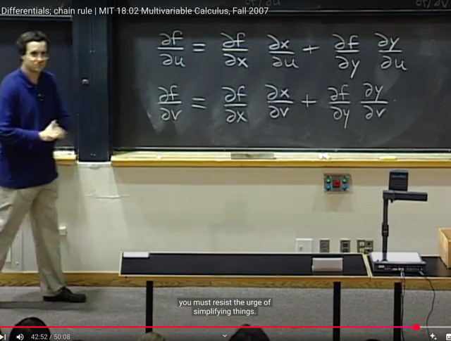</kbd>

> [!NOTE]
> gs nói ta **KHÔNG THỂ CANCEL ∂x Ở TỬ SỐ VÀ MẪU SỐ**: 
>
> ∂f/∂u =  ∂f/**∂x*** **∂x**/∂u + ∂f/**∂y** **∂y**/∂u 
>
> để đơn giản hóa thành 
>
> ∂f/∂u = ∂f/\~∂x\~ * \~∂x\~/∂u + ∂f/\~∂y\~ \~∂y\~/∂u = ∂f/∂u + ∂f/∂u (LÀ SAI)
>
> Vì n**ó là partial derivative** và nó **không tuân theo quy tắc thông thường**

> [!NOTE]
> KHÔNG THỂ CANCEL ∂x Ở TỬ SỐ VÀ MẪU SỐ 
>
> ∂f/∂u = ∂f/∂x * ∂x/∂u + ∂f/∂y ∂y/∂u = ∂f/∂u + ∂f/∂u (LÀ SAI)

 

<kbd>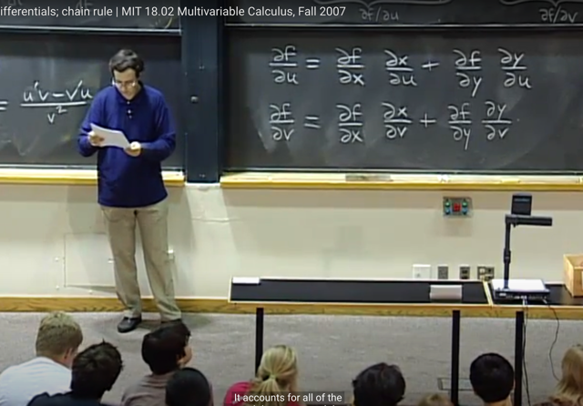</kbd>

> [!NOTE]
> Có câu hỏi liên quan đến **∂f** và đại khái gs nói là **đúng là ∂f KHÔNG
> THỂ ĐỨNG MỘT MÌNH**, hay nói cách khác, **đứng một mình
> nó sẽ vô nghĩa**.
>
> Nó **chỉ có thể ở dạng ∂f/∂x** để mang ý nghĩa **RATE OF CHANGE** - tỉ lệ
> của **[khoảng thay đổi của f] / [khoảng thay đổi của x]** để rồi nó cho biết
> khi x thay đổi một khoảng nhỏ thì f thay đổi ntn
>
> Còn df thì có thể đứng một mình, mang ý nghĩa là **TOTAL DIFFERENTIAL**
> là tổng của mọi thay đổi của f bởi các variable, ví dụ df = f_x*dx + f_y*dy

> [!NOTE]
> đúng là ∂f KHÔNG THỂ ĐỨNG MỘT MÌNH, hay nói cách khác,
> đứng một mình nó sẽ vô nghĩa.
>
> Nó chỉ có thể ở dạng ∂f/∂x để mang ý nghĩa RATE OF CHANGE

 

<kbd>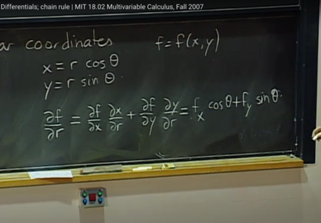</kbd>

<kbd></kbd>

<kbd>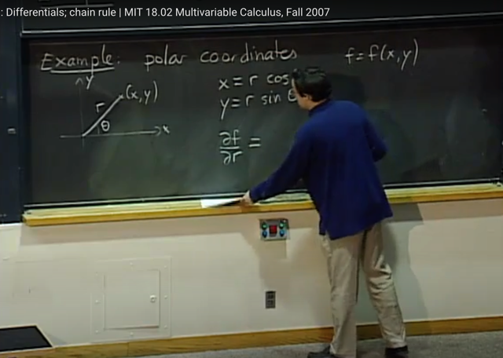</kbd>

> [!NOTE]
> một ví dụ, về **polar** **coordinate** (vector (x,y) có thể được thể hiện theo r
> và theta.
>
> Thế thì nếu ta có **hàm f(x,y)** thì câu hỏi là **partial derivative f_r và
> f_theta**như thế nào?
>
> Thế thì f = f(x,y), x = x(r, θ), và y = y(r, θ). Theo chain rule ta có:
>
> f_r = f_x*x_r + f_y*y_r = f_x*cos(θ) + f_y*sin(θ)
>
> f_theta = f_x*x_θ + f_y*y_θ = ...

 

<kbd>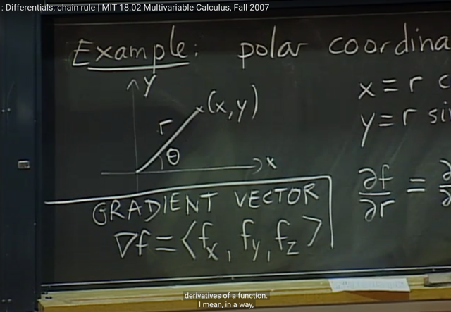</kbd>

> [!NOTE]
> cuối cùng gs cho biết khái niệm **gradient** vector là **vector**
>
> **nabda_f (grad_f) = [f_x, f_y, f_z]**
>
> Bài sau ta sẽ tiếp tục làm quen khái niệm này mà trong ML đã
> quá quen thuộc

> [!NOTE]
> nabda_f (grad_f) = [f_x, f_y, f_z]

 

