# Lec 12: Gradient, Directional Derivative, Tangent Plane

📊 **Progress:** `35` Notes | `44` Screenshots

---
<a id="node-243"></a>

<p align="center"><kbd>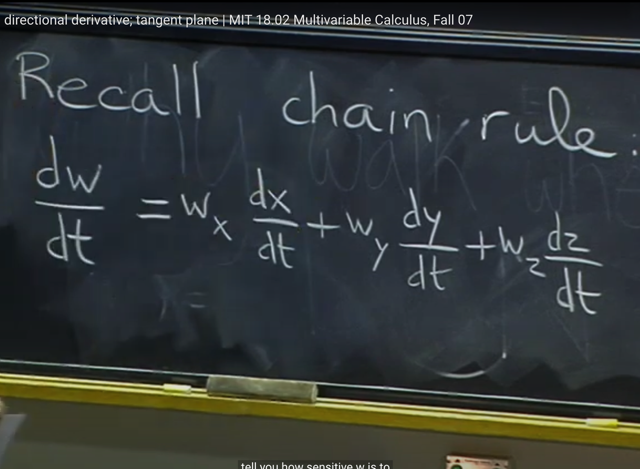</kbd></p>

> [!NOTE]
> đầu tiên gs nhắc lại bài trước ta đã học về **chain rule**, cho phép
> relate **rate of change giữa w và t** bằng **partial derivative của
> w đối với x, y, z** và **rate of change của x, y, z với t
>
> ```text
> dw/dt = w_x*dx/dt + w_y*dy/dt + w_z*dz/dt
> ```
>
> hay `(∂/∂x)w*dx/dt` `+` `(∂/∂y)y*dy/dt` `+` (∂/∂z)w*dz/dt**

<br>

<a id="node-244"></a>

<p align="center"><kbd>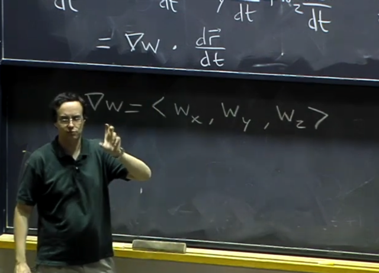</kbd></p>

🔗 **Related:** [LEC 12: GRADIENT, DIRECTIONAL DERIVATIVE, TANGENT PLANE](untitled.md#node-267)

> [!NOTE]
> Thế thì cuối bài trước ta đã làm quen khái niệm **GRADIENT**
> **VECTOR**, là **vector** mà các **component là các partial derivative.**
>
> **Grad_f `=` `<w_x,` `w_y,` w_z>**
>
> Thế thì đại khái là **partial derivative sẽ phụ thuộc vị trí x, y, z.**
>
> Ý là partial derivative như ta biết, ví dụ **f_x**, nó là **độ dốc của hàm
> số theo phương x**, khi **y, z giữ fixed**. Điều này sẽ có nghĩa là tùy
> vào điểm  nào thì nó sẽ khác.
>
> Tương tự y, z cũng vậy. Nên vector gradient chứa các component là
> partial derivative sẽ tùy thuộc vào `/` phụ thuộc vào một điểm (x, y, z) cụ
> thể

<br>

<a id="node-245"></a>

<p align="center"><kbd>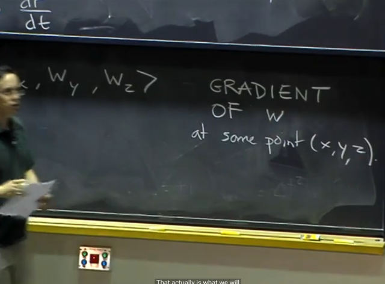</kbd></p>

> [!NOTE]
> Thế nên gs cho rằng ta phải nói `/` phải hiểu **Gradient of W
> theo cách là Gradient TẠI MỘT ĐIỂM (x, y, z) nào đó**

<br>

<a id="node-246"></a>

<p align="center"><kbd>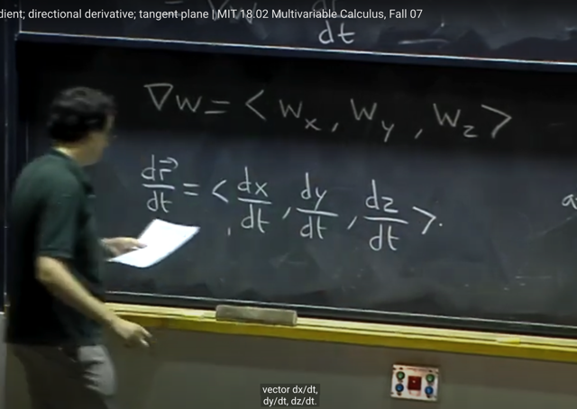</kbd></p>

> [!NOTE]
> Và ta gặp lại **velocity** **vector** **dr/dt**  `=` **<dx/dt, `dy/dt,`
> dz/dt>**
>
> thế thì ý chính là, công thức chain rule ở trên
>
> ```text
> dw = w_x*dx/dt + w_y*dy/dt + w_z*dz/dt
> ```
>
> có thể được thể hiện bằng phép **DOT PRODUCT giữa Gradient
> vector  và Velocity vector:
>
> dw `=` `<w_x,` `w_y,` `w_z>` . `<dx/dt,` `dy/dt,` dz/dt>**

<br>

<a id="node-247"></a>

<p align="center"><kbd>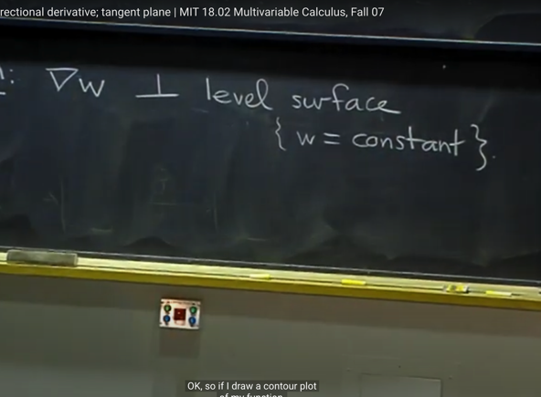</kbd></p>

<p align="center"><kbd>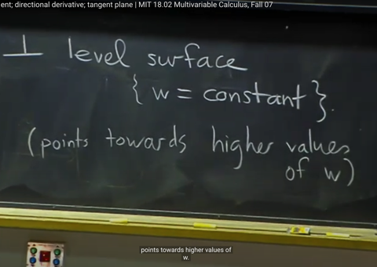</kbd></p>

<p align="center"><kbd></kbd></p>

<p align="center"><kbd></kbd></p>

<p align="center"><kbd>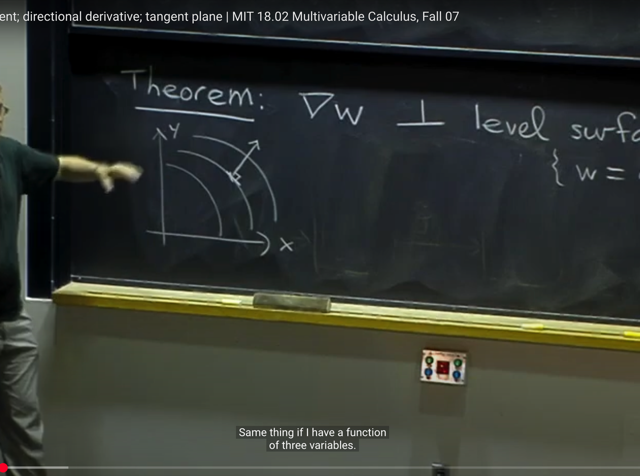</kbd></p>

🔗 **Related:** [LEC 13: LAGRANGE MULTIPLIER](untitled.md#node-281)

🔗 **Related:** [LEC 15: PARTIAL DIFFERENTIALS EQUATIONS](untitled.md#node-346)

> [!NOTE]
> Tiếp theo ta biết qua một **theorem**: Rằng khi ta **tìm gradient vector tại
> một điểm nào đó**, và t**hể hiện nó trên contour plot** thì nó sẽ **VUÔNG
> GÓC VỚI  LEVEL SURFACE**  (là surface khi cho **w(x,y,x) `=` constant**)
>
> Và  **hướng về nơi CÓ GIÁ TRỊ CAO HƠN CỦA W**

> [!NOTE]
> Theorem: GRADIENT VECTOR tại một điểm nào đó sẽ VUÔNG
> GÓC VỚI LEVEL SURFACE

<br>

<a id="node-248"></a>

<p align="center"><kbd>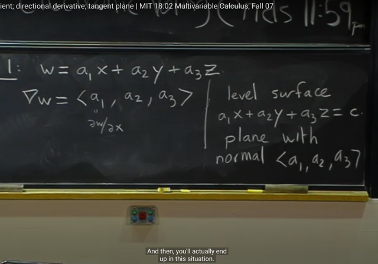</kbd></p>

🔗 **Related:** [LEC 4: SQUARE SYSTEM, EQUATION OF PLANE](untitled.md#node-60)

> [!NOTE]
> Ông lấy ví dụ như sau cho hàm **w(x,y,z) `=` a1*x `+` a2*y `+` a3*z**, thế
> thì **gradient** vector, như định nghĩa là vector chứa các component
> là  các partial derivative: **Grad_w `=` `<w_x,` `w_y,` `w_z>` `=` <a1, a2,
> a3>**
>
> Thế thì nói qua **level surface**: Là cái**tập hợp các điểm** khi ta
> **cho w mang giá trị constant c** nào đó: **a1*x `+` a2*y `+` a3*z `=` c**
>
> Thế thì a1*x `+` a2*y `+` a3*z `=` c là phương trình của surface này, và
> nó có dạng là p**hương trình mặt phẳng**.
>
> Thì ta đã biết **NORMAL VECTOR** của plane này là **<a1, a2,
> a3>** (MÀ ĐÂY CŨNG **CHÍNH LÀ GRAD_W)** mà n**ormal vector
> đương nhiên là vector vuông góc với plane** nên điều này đã cho
> thấy **gradient vector vuông góc với plane `-` là level surface**

<br>

<a id="node-249"></a>

<p align="center"><kbd>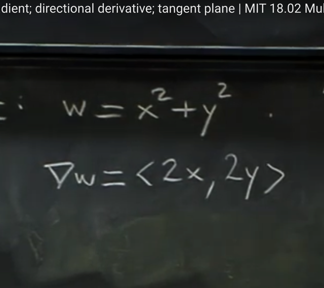</kbd></p>

<p align="center"><kbd></kbd></p>

<p align="center"><kbd>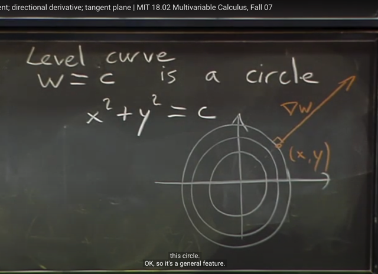</kbd></p>

> [!NOTE]
> Ví dụ thứ 2, xét hàm 2 biến **w `=` x^2 `+` y^2**.
>
> Thì **level curve** (cho w `=` constant c) sẽ là**x^2 `+` y^2 `=` c** là phương
> trình đường tròn.
>
> (với 2 biến thì level surface w `=` c `<=>` **x^2+y^2 `=` c** chỉ là **một đường
> 2D** ví dụ trước là 3 biến, level surface là một plane, ở đây gs lấy ví dụ
> 2 biến để vẽ được)
>
> Thì ta xét gradient **grad_w** `=` **<w_x, `w_y>` `=` <2x, 2y>.**
>
> Thì khi vẽ trên contour plot các level curve là các đường tròn có bán
> kính khác nhau (ứng với các c khác nhau) thì dễ thấy **gradient vector
> vuông góc với các circle này**
>
> Nhưng nên nhớ**theorem cho biết gradient vector vuong góc với level
> surface w `=` c chứ không phải chỉ là vuông góc với contour plot**

<br>

<a id="node-250"></a>

<p align="center"><kbd>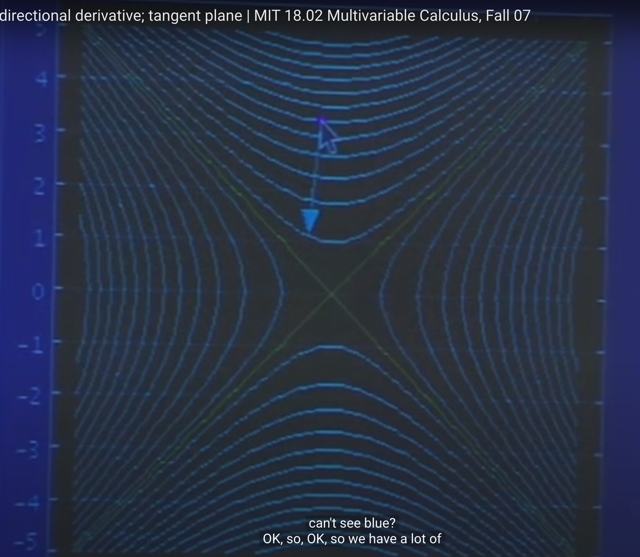</kbd></p>

<p align="center"><kbd></kbd></p>

<p align="center"><kbd>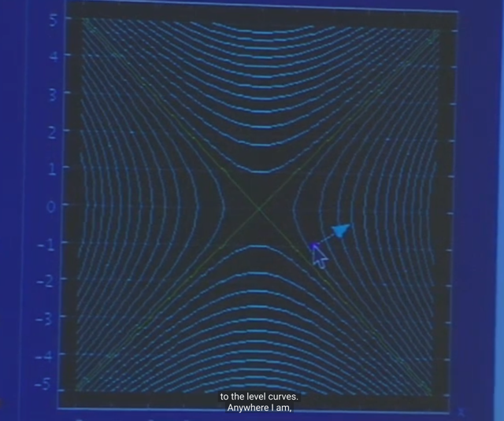</kbd></p>

> [!NOTE]
> hình ảnh trên máy tính cho thấy, gradient vector tại một
> điểm luôn vuông góc với level curve tại đó

<br>

<a id="node-251"></a>

<p align="center"><kbd></kbd></p>

🔗 **Related:** [LEC 6: VELOCITY, ACCELERATION, KEPLER'S SECOND LAW](untitled.md#node-105)

> [!NOTE]
> để **chứng minh** thì lập luận như sau: Xét một **level surface w `=` c** tức
> mọi điểm trên đó đều có **w `=` c** và lấy một curve **r `=` r(t)** (ý là một quỹ
> đạo, một tập hợp điểm các vị trí của object di chuyển thể hiện bởi
> **position vector r(t)**

<br>

<a id="node-252"></a>

<p align="center"><kbd>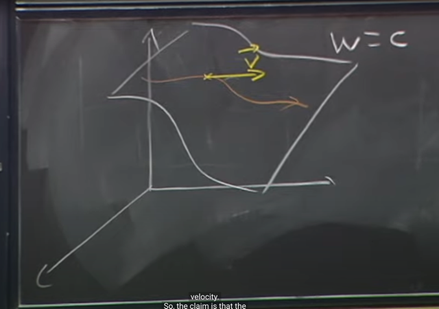</kbd></p>

> [!NOTE]
> Thế thì **velocity vector v `=` dr/dt** (như đã biết) sẽ luôn**TIẾP
> TUYẾN VỚI ĐƯỜNG CONG QUỸ ĐẠO (CURVE)** và vì
>
> **đường cong quỹ đạo NẰM TRONG level surface**
>
> nên **velocity cũng TIẾP TUYẾN VỚI LEVEL SURFACE luôn**

<br>

<a id="node-253"></a>

<p align="center"><kbd>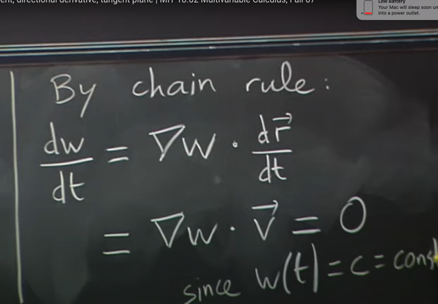</kbd></p>

> [!NOTE]
> Thế rồi theo **chain rule**, như lúc nãy ta đã nói **dw/dt** có thể thể hiện
> bằng **DOT PRODUCT** của **GRADIENT** vector và **VELOCITY**
> vector v  `=` `dr/dt`
>
> ```text
> Nên dw/dt = Grad_w . Velocity = Grad_w . dr/dt
> ```
>
> Thế mà **trên level surface này** thì **w** không đổi `=` constant c do đó t
> thay đổi không làm w thay đổi. Do đó rate of **change của w bởi t `=` 0**.
>
> `dw/dt` `=` 0
>
> Vậy: **Grad_w . Velocity `=` 0**
>
> Và điều này chứng minh rằng **GRADIENT** vector **VUÔNG GÓC**
> với **VELOCITY** v (tại điểm đang xét, nhắc lại, đã nói đến gradient
> vector thì phải hiểu rằng là gradient vector **TẠI MỘT ĐIỂM NÀO ĐÓ**)

> [!NOTE]
> GRADIENT VECTOR TẠI MỘT ĐIỂM SẼ VUÔNG GÓC VỚI
> VELOCITY VECTOR (CỦA MỘT CURVE ĐI QUA ĐIỂM ĐÓ) TẠI
> ĐÓ

<br>

<a id="node-254"></a>

<p align="center"><kbd>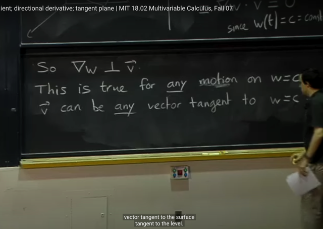</kbd></p>

> [!NOTE]
> Thế thì cái chính là điều này cũng **ĐÚNG VỚI BẤT KÌ CHUYỂN
> ĐỘNG NÀO** (ý là **mọi quỹ đạo chuyển động, hay, bất kì curve
> nào** trong level surface w `=` c)
>
> Có nghĩa là,**tại điểm đang xét** (**mà ta có gradient vector**  `grad_w)`
> thì vừa rồi ta chứng minh nó sẽ **vuông góc với velocity vector tại
> đó** của một curve nào đó (đương nhiên đi qua điểm đang xét)
> nằm trong level surface.
>
> Vậy thì Ý CHÍNH LÀ, **CÓ VÔ SỐ ĐƯỜNG CURVE** NHƯ VẬY, 
> hay nói đúng hơn là ĐIỀU VỪA RỒI ĐÚNG VỚI **MỘT CURVE
> BẤT KÌ.**
>
> Nên ta có thể kết luận rằng: Đại khái là **tại một điểm**, nếu ta tìm 
> **gradient** **vector**, thì **với mọi curve trong level surface** mà**đi qua 
> điểm đó**, thì **velocity vector tại đó** **ĐỀU** **vuông góc với gradient
> vector.**Thế thì **tại một điểm,**thì velocity vector chính là **TRÙNG PHƯƠNG** với****vector **TIẾP TUYẾN** của curve đó, mà **tiếp tuyến với curve** thì cũng
> là**tiếp tuyến với surface**. 
>
> Do đó, có thể hiểu gradient vector sẽ
> v**uông góc với MỌI VECTOR TIẾP TUYẾN TẠI ĐIỂM ĐANG XÉT**.
>
> Và **mọi tiếp tuyến tại một điểm** sẽ tạo thành **MẶT PHẲNG TIẾP
> TUYẾN** tại điểm đó. Vậy **GRADIENT** vector sẽ **VUÔNG GÓC VỚI
> MẶT PHẢNG TIẾP TUYẾN** tại điểm đó. Đồng nghĩa **NÓ CHÍNH LÀ
> NORMAL VECTOR** của mặt phẳng tiếp tuyến.
>
> Và từ đây có thể kết luận, nó V**UÔNG GÓC VỚI LEVEL SURFACE**

> [!NOTE]
> CHỨNG MINH, GRADIENT VECTOR (TẠI MỘT ĐIỂM)
> VUÔNG GÓC VỚI LEVEL SURFACE TẠI ĐIỂM ĐÓ

<br>

<a id="node-255"></a>

<p align="center"><kbd>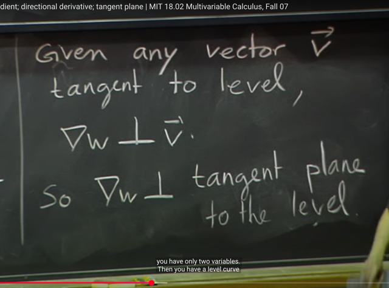</kbd></p>

<p align="center"><kbd></kbd></p>

<p align="center"><kbd>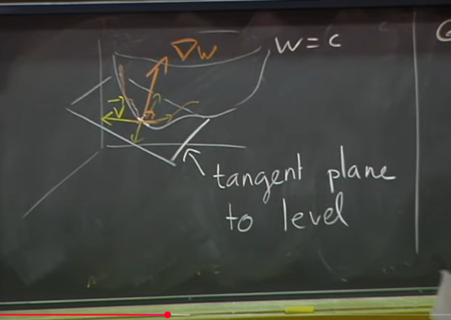</kbd></p>

> [!NOTE]
> minh họa ở đây, **tại một điểm** trong level surface, điều trên **đúng với mọi
> curve đi qua nó**. Do đó **mọi vector v tiếp tuyến** với các curve đó (và
> **cũng là tiếp tuyến với level surface**) sẽ **đều vuông góc với gradient
> vector.**
>
> Thế thì**mọi vector này sẽ tạo nên tangent plane** tiếp tuyến với level
> surface tại điểm đang xét. Vậy **gradient vector vuông góc với tangent
> plane này** (vì nó vuông góc với mọi vector v trong tangent plane này) do
> đó nó vuông góc với level surface tại điểm đang xét. Đến đây ta chứng
> minh xong

<br>

<a id="node-256"></a>

<p align="center"><kbd>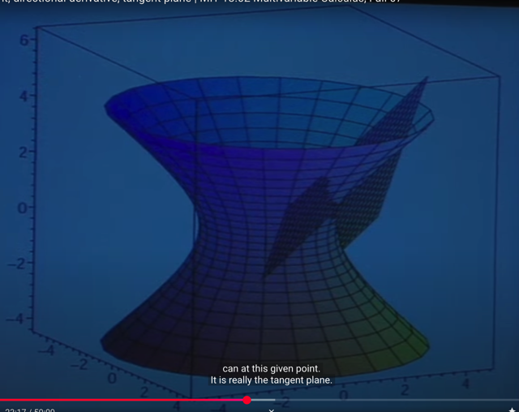</kbd></p>

> [!NOTE]
> gs cho xem hình ảnh của **Hyperboloid** và một **tangent** **plane** (trông như
> không giống tangent plane vì nó cắt Hyperboloid nhưng nó thật sự
> là một tangent plane)

<br>

<a id="node-257"></a>

<p align="center"><kbd>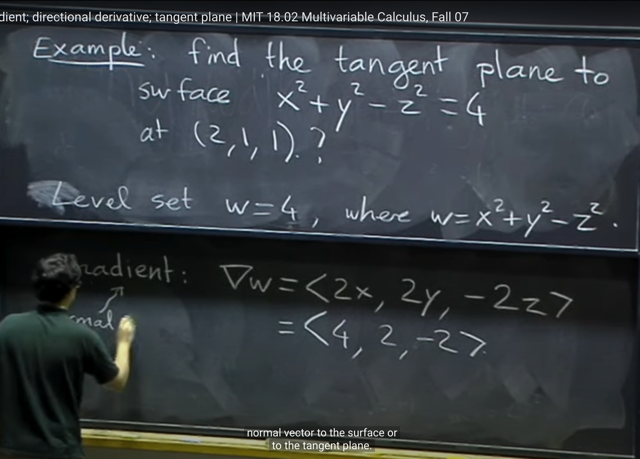</kbd></p>

> [!NOTE]
> Ví dụ này là**tìm tangent plane** của surface **x^2 `+` y^2 `-` z^2 `=` 4** tại
> điểm **(2, 1, 1)**
>
> Áp dụng theorem vừa rồi, ta sẽ **XEM** **x^2 `+` y^2 `-` z^2 `=` 4 LÀ LEVEL
> SURFACE CỦA FUNCTION** **w `=` x^2 `+` y^2 `-` z^2** **tại w `=` 4**
>
> (ý nghĩa là các điểm trên đồ thị của hàm w mà đều có w `=` 4)
>
> Theo theorem trên, **gradient** vector **grad_w** **tại (2,1,1)** sẽ**vuông góc với level surface tại đó** và cũng **chính là vuông góc với
> tangent plane** của đồ thị hàm w**tại (2,1,1)**Do đó GRADIENT VECTOR `grad_w` **CŨNG CHÍNH LÀ NORMAL
> VECTOR CỦA TANGENT PLANE** và cũng là normal vector của level
> surface
>
> Vậy ta xây dựng gradient vector theo định nghĩa**là vector các 
> partial derivatives**: `grad_w` `=` `<w_x,` `w_y,` `w_z>` `=` <2x, 2y, `-2z>`
>
> Và `grad_w` **tại (2,1,1)** là: **<4,2,-2>**
>
> Do đó phương trình mặt phẳng mà **normal** vector là **grad_w** là:
>
> **4x `+` 2y `-` 2z `=` something**

<br>

<a id="node-258"></a>

<p align="center"><kbd>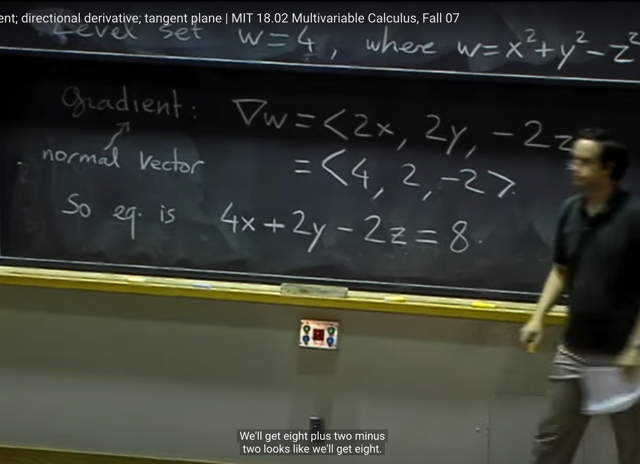</kbd></p>

> [!NOTE]
> Trong đó **để tìm something** thì ta sẽ dựa tangent plane
> của w tại (2,1,1) nên đương nhiên **nó đi qua (2,1,1)** nên
> ta phải có something sao cho 4*2 `+` 2*1 `-` 2*1 `=` something
> `=` 8
>
> Vậy phương trình mặt phẳng tangent plane tại (2,1,1) là
> **4x `+` 2y `-` 2z `=` 8**

<br>

<a id="node-259"></a>

<p align="center"><kbd>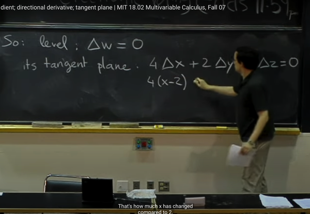</kbd></p>

<p align="center"><kbd></kbd></p>

<p align="center"><kbd>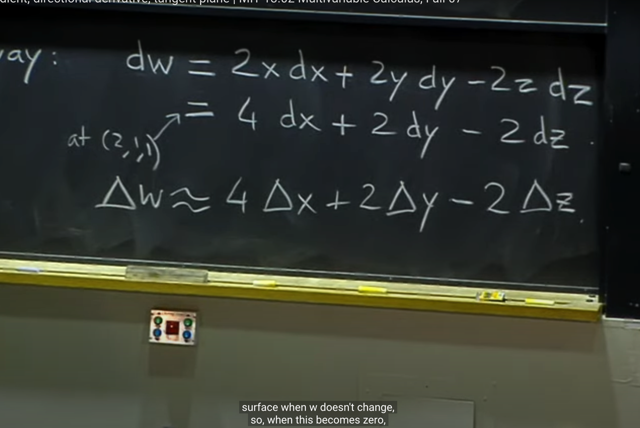</kbd></p>

🔗 **Related:** [Như vậy ta hiểu là trong 1801 implicit differentiation là ta apply d/dx vào hai vế, mà ý nghĩa CHÍNH LÀ LẤY ĐẠO HÀM THEO X HAI VẾ.   y = f(x) => (d/dx) y = (d/dx) f(x) <=> \\*dy/dx = f'(x)\\*  Còn 18.02 thì implicit differentiation thể hiện bằng cách  LẤY VI PHÂN HAI VẾ  y = f(x) <=> \\*dy = f'(x) dx\\*  Và chúng cùng bản chất, chẳng qua cách thể hiện theo vi phân  sẽ chuẩn bị cho ta bước qua khái niệm VI PHÂN TOÀN PHẦN (TOTAL DIFFERENTIAL)](untitled.md#node-226)

> [!NOTE]
> Đại khái là, gs nói rằng, ta **có thể tiếp cận theo cách khác** để cũng cho ra `/` tìm ra phương trình của
> tangent plane của hàm w tại (2,1,1) như sau:
>
> Ta xuất phát từ **total differential** equation:
>
> **dw `=w_x*dx` `+` `w_y*dy` `+` w_z*dz**
>
> mà ta đã biết nó mang ý nghĩa
>
> 1) thể hiện **mức độ ảnh hưởng, đóng góp** của **mỗi variable x, y, z** **vào sự thay đổi của w(x,y,
> z)** nhưng ý nghĩa mà gs cho là chính xác hơn đó là
>
> 2) đóng vai trò **place holder** để khi **thay các dw, dx, dy, dz** **bằng ∆w, ∆x, ∆y, ∆z** thì ta sẽ có
> **LINEAR** **APPROXIMATION**
>
> (Ôn lại chút, với hàm đơn biến f(x), định nghĩa của derivative của f đối với x đó là limit của **quotient
> difference** `∆f/∆x` khi `∆x->0,` hay, tỉ lệ [thay đổi của f, ∆f]  trên [thay đổi của x, ∆x] khi ∆x trở nên vô
> cùng nhỏ. Thể hiện qua equation:
>
> **f'(x) `=` lim `∆x->0` ∆f/∆x**
>
> Thế thì từ đó, nếu mà ta **chỉ xét x thay đổi nhỏ** (chứ không vô cùng nhỏ), thì ta có thể**thay định
> nghĩa trên bằng dấu xấp xỉ**, để trở thành công thức của **linear approximation**
>
> **f'(x) `~=` `∆f/∆x,` x~=x0,**hay**∆f `=` f'(x)∆x**
>
> triển khai ra ta sẽ có dạng: **f'(x0) `=` [f(x) `-` f(x0)] `/` (x-x0)**
>
> `<=>` `f'(x0)(x-x0)` `=` `f(x)-f(x0)` `<=>` **f(x) `=` f(x0) `-` f'(x0)(x-x0)**
>
> Với hàm đa biến cũng tương tự, đó là từ total differentiation:
>
> **dw `=` `w_x*dx` `+` `w_y*dy` `+` w_z*dz** `w/∂x` có định nghĩa là lim `∆x->0` `[w(x+∆x,y,z)` `-` w(x,y,z)] `/` ∆x
>
> ```text
> ∂w/∂y có định nghĩa là lim ∆y->0 [w(x,y+∆y,z) - w(x,y,z)] / ∆y
> ```
>
> ```text
> ∂w/∂z có định nghĩa là lim ∆z->0 [w(x,y,z+∆z) - w(x,y,z)] / ∆z
> ```
>
> Thế thì nếu như ta **chỉ dùng giá trị rất nhỏ**,**thay vì vô cùng nhỏ**, tức là thay  các **d bởi các ∆**
> thì ta sẽ có **linear approximation**:
>
> ```text
> ∆w ~= w_x*∆x + w_y*∆y + w_z*∆z
> ```
>
> **∆w `~=` 2x*∆x `+` 2y*∆y `-` 2z*∆z** Tại `(2,1,-1)` ta có:
>
> ∆w `~=` **4*∆x `+` 2*∆y `-` 2*∆z**
>
> Và ý nghĩa của nó, như đã nói là linear approximation `-` xấp xỉ khoảng thay đổi của w, hay xấp xỉ w
> như một hàm tuyến tính của x, y, z
>
> Thế thì gs cho biết có **hai ý quan trọng**:
>
> 1) Vì ta đang "nói về" **level curve** (hay gs gọi là level set `-` cũng hiểu là tập hợp các điểm của w(x,y,
> z) sao cho **w `=` constant c**) nên**w không đổi**: **∆w `=` 0**
>
> 2) Và ý quan trọng thứ hai đó là, TA SẼ **DÙNG DẤU ~=** KHI THÊ HIỆN RẰNG **TA ĐANG DI
> CHUYỂN TRÊN ĐỒ THỊ HÀM W**. NHƯNG NẾU T**HAY BẰNG DẤU BẰNG**, THÌ ĐÓ ĐỒNG
> NGHĨA LÀ **TA ĐANG DI CHUYỂN TRÊN TANGENT PLANE**
>
> ∆w `~=` 4*∆x `+` 2*∆y `-` 2*∆z, có nghĩa là thể hiện ta đang "ở" trên level surface. Cũng giống như với
> ```text
> hàm đơn biến, việc dùng ∆f ~= f'(x0)∆x <=> f(x)-f(x0) ~= f'(x0)(x-x0) <=> f(x) ~= f'(x0)(x-x0) + f(x0)
> ```
>
> Vậy thì Ý CHÍNH LÀ, f(x) **=** `f'(x0)(x-x0)` `+` f(x0) CHÍNH LÀ PHƯƠNG TRÌNH TIẾP TUYẾN TẠI X0
> thành ra nếu ta đang ở trong đồ thị w (là mặt cong), mà muốn dùng phương trình trên để biểu diễn thì
> đương nhiên phải là dùng dấu xấp xỉ, với ý nghĩa là trong khoảng gần x0 thì CÓ THỂ XẤP XỈ đường
> cong bằng đường thẳng tiếp tuyến tại đó.
>
> f(x) `~=` `f'(x0)(x-x0)` `+` f(x0)
>
> Còn khi ta chuyển qua coi như đang di chuyển trên tiếp tuyến, thì dĩ nhiên có quyền dùng dấu bằng:
> f(x) `=` `f'(x0)(x-x0)` `+` f(x0)
>
> `=====`
>
> QUay lại đây
>
> Chuyển thành dấu bằng, sẽ có nghĩa là ta đang "ở" trên tangent plane
>
> ∆w `=` 4*∆x `+` 2*∆y `-` 2*∆z
>
> Từ đó ta sẽ có phương trình thể hiện điều đó
>
> **0 `=` `4*(x-2)` `+` `2*(y-1)` `-` 2*(z+1)**: Và đây chính là phương trình của tangent plane mà ta đã tìm ra
> theo cách 1

> [!NOTE]
> LINEAR APPROXIMATION

<br>

<a id="node-260"></a>

<p align="center"><kbd>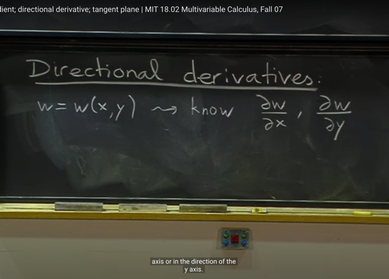</kbd></p>

> [!NOTE]
> Ta sẽ qua **DIRECTIONAL** **DERIVATIVES**. Cho function **w(x,y)**
>
> Ta biết **partial derivative `w_x,` w_y** mang ý nghĩa như đã biết là
> cho biết **rate of change** của **w so với x** khi**thay đổi x và giữ
> các biến khác fixed**
>
> Hay nói theo cách khác là **đi theo hướng của x-axis** thì function
> w thay đổi ntn và đi theo hướng y `-` axis thì function thay đổi ntn
>
> (giữ y fixed và thay đổi x thì chính là đi theo hướng của `x-axis` và
> giữ x fixed và thay đổi y thì chính là đi theo hướng của `y-axis)`

> [!NOTE]
> DIRECTIONAL DERIVATIVES

<br>

<a id="node-261"></a>

<p align="center"><kbd>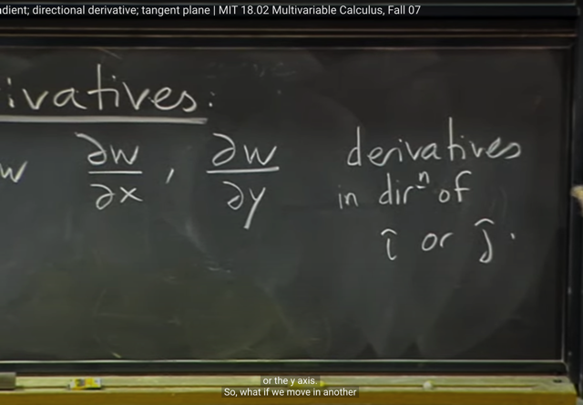</kbd></p>

> [!NOTE]
> Thế thì, **w_x** và **w_y** là sự thay đổi của w khi **đi theo hướng `x-axis,`
> và y-axis** thế thì nó gọi là **derivative theo hướng của vector i^ và j^**
> là basis vector của `x-axis` và `y-axis.`
>
> Và gs cho rằng ta **có thể có derivative theo các hướng khác** nữa,
> và cụ thể là **mọi hướng**. Và đó là **DIRECTIONAL DERIVATIVES**

<br>

<a id="node-262"></a>

<p align="center"><kbd>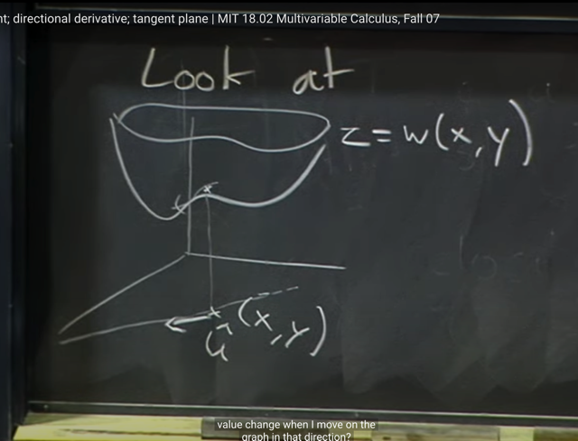</kbd></p>

> [!NOTE]
> Cụ thể là giả sử ta có**unit vector u^** chỉ **hướng mà ta
> muốn biết** rằng **khi thay đổi hàm w(x, y)** theo hướng này
> thì **w thay đổi ra sao.**

<br>

<a id="node-263"></a>

<p align="center"><kbd>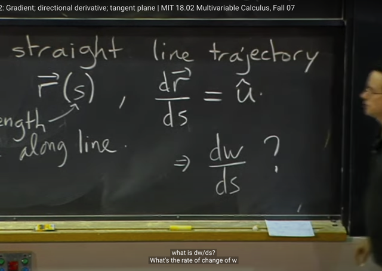</kbd></p>

<p align="center"><kbd></kbd></p>

<p align="center"><kbd>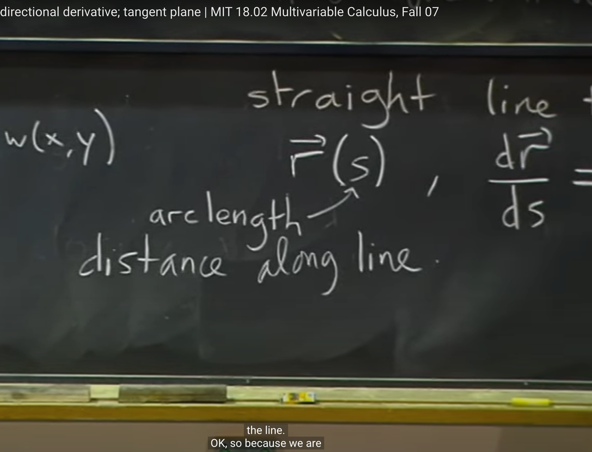</kbd></p>

> [!NOTE]
> Thế thì, ta có **position vector r** và nó sẽ được tham số hóa theo biến **s** `-` **distance**: là bởi
> **by** **convention** ta cho rằng điểm đang move theo **hướng của u** với **vận tốc đơn vị**, nên
> nôm na là khi đó, **vị trí của điểm có thể được xác định bởi khoảng cách s** nên ta mới có r
> parameterized by s.
>
> Và **dr/ds `=` u**: Lúc trước ta biết **dr(t)/dt `=` v** `-` velocity vector. Thế thì bây giờ, khi ta tham số
> hóa r theo s, với convention là điểm di chuyển với tốc độ unit. Thì **dr/ds vẫn là vector v** chỉ
> hướng chuyển động nhưng **có độ lớn bằng 1**. Và nó chính là vector u (là vector đơn vị chỉ
> hướng chuyển động
>
> Câu hỏi là tìm **dw/ds** `-` rate of change `-` **tỉ lệ thay đổi của w khi s thay đổi** tức là khi di
> chuyển theo hướng vector u

<br>

<a id="node-264"></a>

<p align="center"><kbd>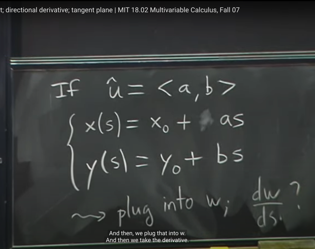</kbd></p>

> [!NOTE]
> chưa hiểu lắm

<br>

<a id="node-265"></a>

<p align="center"><kbd>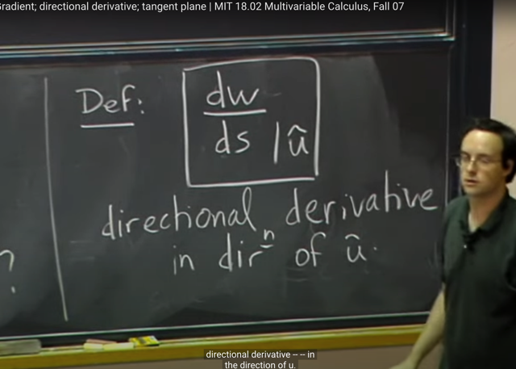</kbd></p>

> [!NOTE]
> định nghĩa cái này là
> directional derivative

<br>

<a id="node-266"></a>

<p align="center"><kbd>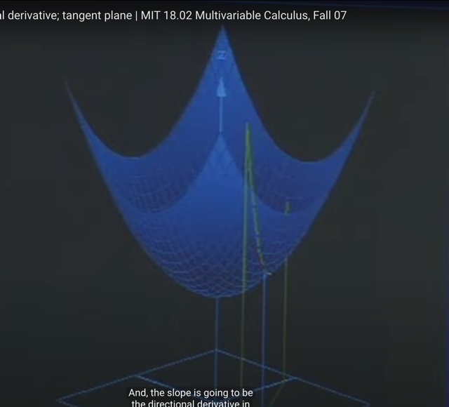</kbd></p>

> [!NOTE]
> về ý nghĩa hình học của nó, đó là, với partial derivative, ta slice (cắt) đồ
> thị bằng mặt phẳng song song với zx hoặc zy (để có các đường giao
> tuyến với đồ thị mà tại đó các điểm đều có y fixed hoặc x fixed).
>
> Lúc này partial derivative đối với x hay y chính là độ dốc của tiếp tuyến
> với grap trên nhưng tiếp tuyến nằm trên các mặt phẳng này
>
> Còn bây giờ ta muốn cắt graph bằng mặt phẳng bất kì, ví dụ như mặt
> phẳng đi qua vector u trên xy là vector không song song với ox hay oy.
> Khi đó ta muốn tính độ dốc của tiếp tuyến với hàm số mà tiếp tuyến 
> nằm trong mặt phẳng cắt đó.
>
> Đó chính là làm rõ để ta hiểu directionnal derivative là cái gì

<br>

<a id="node-267"></a>

<p align="center"><kbd>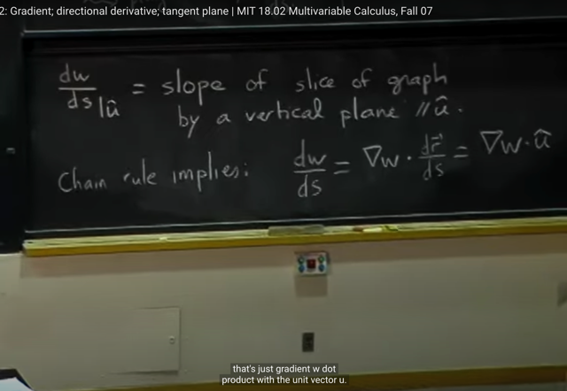</kbd></p>

🔗 **Related:** [LEC 12: GRADIENT, DIRECTIONAL DERIVATIVE, TANGENT PLANE](untitled.md#node-244)

> [!NOTE]
> ```text
> thế thì theo Chain rule ta có dw/ds = gradient_w . dr/ds
> ```
>
> và `dr/ds` `=` u nên **dw/ds `=` `grad_w` . u^**

<br>

<a id="node-268"></a>

<p align="center"><kbd>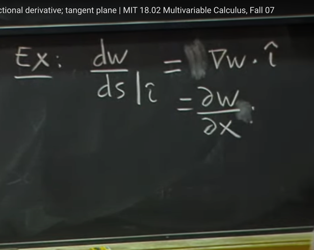</kbd></p>

> [!NOTE]
> nên nếu ở direction i^, tức là u `=` i^ thì directional derivative `dw/ds` | i^ `=`
> `grad_w` . i^ và nó chính là partial derivative của w đối với x: `w_x`
>
> Tương tự nếu ở direction j^, tức u `=` j^ thì directional derivative `dw/ds` |
> j^ `=`  `grad_w` . j^ và nó chính là partial derivative của w đối với y: `w_y`

<br>

<a id="node-269"></a>

<p align="center"><kbd>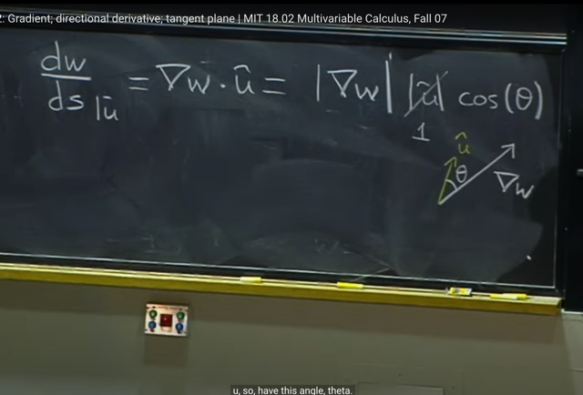</kbd></p>

> [!NOTE]
> Thế thì `dw/ds` | u^ `=` `grad_w` . u^ thì theo định nghĩa dot product của
> hai vector a.b `=` |a|.|b|.cos(theta) 
>
> Nên `grad_w` . u^ `=` `|grad_w|.|u^|.cos(theta)` mà u^ là unit vector có
> length `=` 1
>
> nên `grad_w.u^` `=` `|grad_w|.cos(theta)`
>
> Từ đây ta mới hiểu tại sao GRADIENT VECTOR `grad_w` CHÍNH LÀ
> HƯỚNG (DIRECTION) **KHIẾN W TĂNG NHANH NHẤT**. Là bởi vì:
>
> `dw/ds|u^` sẽ lớn nhất nếu `grad_w.u^` lớn nhất. và điều này tương
> đương `|grad_w|.cos(theta)` lớn nhất
>
> Như vậy cos(theta) phải lớn nhất và chỉ khi theta `=` 1 tức là u^ (hướng
> của directional derivative `dw/ds|u^)` trùng với hướng của gradient vector
> `grad_w.` Khi đó thì `dw/ds|u^` sẽ lớn nhất mang ý nghĩa là khi di chuyển
> với unit speed theo hướng này thì w sẽ tăng nhanh nhất và độ lớn của
> **dw/ds|u^=direction(grad_w) `=` |grad_w|**
>
> Và khi theta `=` 90 độ, tức hướng của directional derivative `dw/ds|u^`
> VUÔNG GÓC VỚI GRADIENT VECTOR thì `dw/ds|u^` `=` 0
>
> Và ngược lại khi đi ngược với hướng của gradient vector thì w sẽ giảm
> nhanh nhất

<br>

<a id="node-270"></a>

<p align="center"><kbd>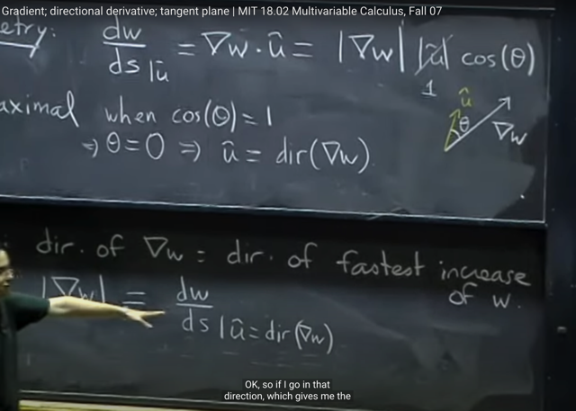</kbd></p>

> [!NOTE]
> khi u^ trùng hướng của gradient vector thì `dw/ds|u^` đạt
> maximum và bằng `|grad_w|`

<br>

<a id="node-271"></a>

<p align="center"><kbd>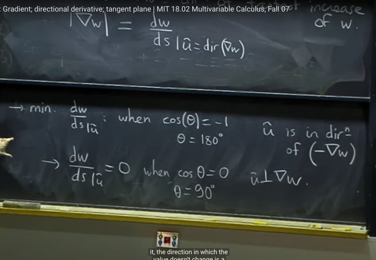</kbd></p>

> [!NOTE]
> Và khi u^ ngược hướng với hướng của gradient vector thì
> ```text
> dw/ds|u^ minimum, =  -|grad_w|
> ```

<br>

<a id="node-272"></a>

<p align="center"><kbd>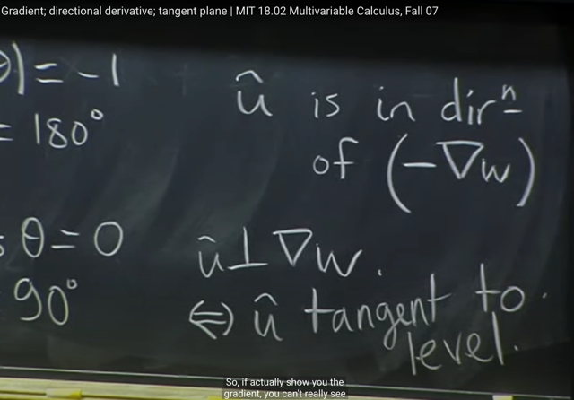</kbd></p>

> [!NOTE]
> khi u^ vuông góc với hướng của gradient vector thì `dw/ds|u^` bằng 0
>
> Và điều đó cũng đồng nghĩa là u^ trùng với "hướng của" tiếp tuyến với
> level curve (nhớ lại, ta đã chứng minh gradient vector vuông  góc với
> level curve, thì nay u^ mà vuông góc với `grad_w` thì tức là nó sẽ trùng
> với hướng của tiếp tuyến của level curve mang ý nghĩa là điểm di
> chuyển dọc theo level curve, hoàn toàn dễ hiểu khi đó thì đương nhiên
> w không thay đổi, vì nó đang ở trên level curve `=` là tập hợp điểm của
> graph mà w `=` constant c

<br>

