# Lec 13: Lagrange Multiplier

📊 **Progress:** `33` Notes | `38` Screenshots

---

<kbd>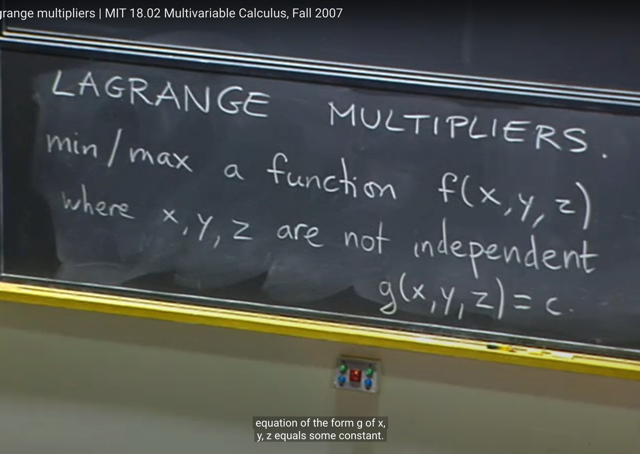</kbd>

> [!NOTE]
> Bài trước ta đã biết về gradient và directional derivative. Nay ta sẽ
> quay lại min max của function đa biến nhưng trong bối cảnh các
> biến KHÔNG ĐỘC LẬP
>
> Và sự không độc lập này thể hiện bằng việc có một function g(x,y,z)
> nào đó bằng constant
>
> Và bài toán trở thành ta sẽ có một function f(x,y,z) với các variable
> x,y,z có một quan hệ ràng buộc với nhau nào đó (thể hiện bởi g)
> và ta cần tìm maximum / minimum của f với x,y,z bị ràng buộc bởi
> quan hệ này. 
>
> THẾ THÌ ĐÂY CHÍNH LÀ CÂU CHUYỆN CỦA MACHINE LEARNING
> KHI TA CẦN TỐI ƯU LOSS FUNCTION VỚI RÀNG BUỘC NÀO ĐÓ
> CỦA CÁC PARAMETERS (NHƯ REGULARIZATION). Đây là lí do
> kiến thức này là rất quan trọng

 

<kbd>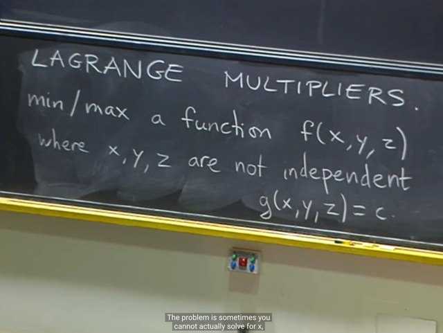</kbd>

> [!NOTE]
> Thế thì gs cho biết một cách làm ta có thể làm đó là ta giải
> equation g(x,y,z) = c để ra một variable nào đó ví dụ x, và từ đó
> thể vào lại f để ta tìm min/max như thông thường
>
> Tuy nhiên vấn đề không phải lúc nào relation / condition g(x,y,z) 
> cũng đơn giản. Nên không thể làm vậy được. Ta phải có các khác
>
> Gs lấy ví dụ như trong vật lý nhiệt động lực học, ta có quan hệ
> giữa nhiệt độ, áp suất, theo một phương trình g nào đó. Và ta muốn
> tối ưu một hàm f của các nhiệt độ, áp suất với điều kiện ràng
> buộc giữa các variable theo phương trình g

 

<kbd>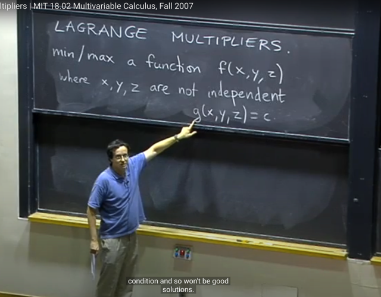</kbd>

> [!NOTE]
> tiếp gs cho rằng với bài toán này ta sẽ không tìm critical point (là
> điểm mà các 1st partial derivative = 0) bởi vì THÔNG THƯỜNG
> CÁC CRITICAL POINT KHÔNG THỎA CONSTRAIN G

 

<kbd>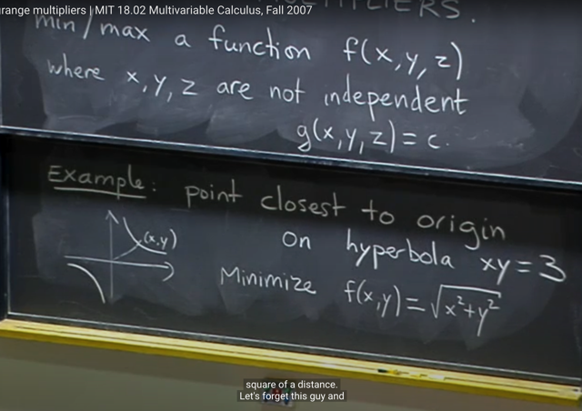</kbd>

> [!NOTE]
> Ví dụ, ta muốn tìm điểm nằm trên hyperbola xy=3 mà gần với origin O nhất.
> Thì cũng có nghĩa là ta muốn tìm x,y sao cho function f(x,y) = sqrt(x^2 +y^2)
> nhỏ nhất với constraint: xy = 3

 

<kbd>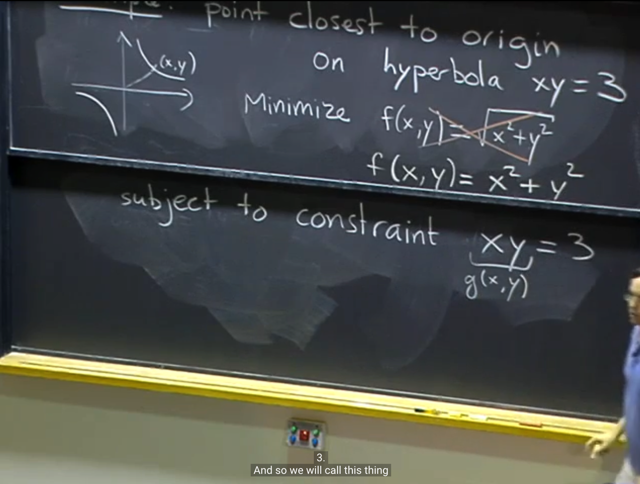</kbd>

> [!NOTE]
> tuy nhiên ta có thể tìm x,y sao cho bình phương khoảng cách của
> điểm đến O nhỏ nhất cũng được. Nên ta thay f(x,y) = x^2 + y^2 và
> constrain là xy = 3 như đã nói, thì tức là g(x,y) = x.y

 

<kbd>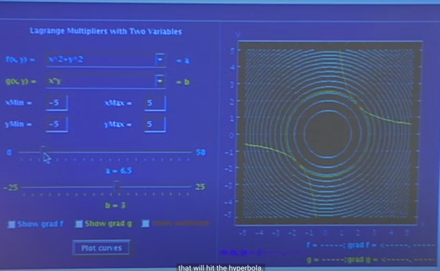</kbd>

> [!NOTE]
> Hình ảnh đại khái là contour plot (các đường tròn) là của hàm f - như
> đã biết, contour plot thể hiện các đường cùng giá trị của hàm f tức các
> khoảng cách khác nhau từ điểm đến O.
>
> Và hyperbola xy=3 là đường màu vàng, cũng có thể coi là level curve
> tại g = 3 của hàm g(x,y) = xy
>
> Vậy thì để có điểm trên hyperbola mà f nhỏ nhất thì chính là "tiếp điểm"
> của đường tròn màu vàng - tức là một level curve của f và hyperbola.
> Ta sẽ cần tìm đường tròn này
>
> Chú ý rằng, nói rằng ta cần tìm điểm mà **level curve của f tiếp xúc với
> hyperbola (cũng coi như là level curve của g)** thì chưa chắc / không
> có nghĩa là điểm đó nằm trên cả hyperbola và graph hàm f, hay nói
> cách khác, đây là NƠI TIẾP XÚC **GIỮA ĐƯỜNG ĐỒNG MỨC LEVEL
> CURVE CỦA HAI HÀM**, CHỨ KHÔNG CÓ NGHĨA LÀ HAI HÀM TIẾP
> XÚC. Vì trên contour plot, thì việc level curve tiếp tuyến với hyperbola
> không có nghĩa là hyperbola tiếp xúc với hàm w.
>
> (tí nữa ta sẽ nói thêm)

 

<kbd>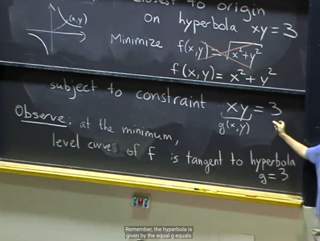</kbd>

> [!NOTE]
> Như vậy, ta quan sát rằng, như vừa nói, tại điểm minimum (tức là nơi
> mà f(x,y) nhỏ nhất với x,y thỏa g(x,y) = 3)) thì**level curve của f sẽ tiếp
> tuyến với hyperbola g = 3**
>
> Và với việc điểm nằm trên hyperbola g(x,y) = 3 thì cũng có thể hiểu /
> nhìn nhận là nó nằm trên level curve của g(x,y) với g(x,y) = constant
> = 3
>
> Nên bài toán cũng có thể được nhìn nhận là ta cần tìm điểm (x,y)
> sao cho L**EVEL CURVE CỦA F TIẾP TUYẾN VỚI LEVEL CURVE
> CỦA G**

 

<kbd>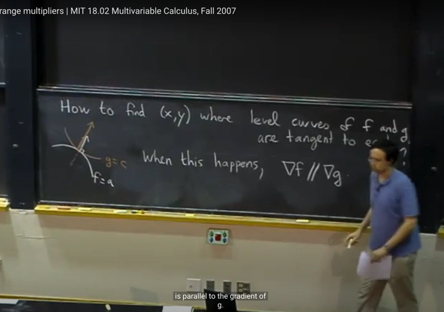</kbd>

🔗 **Related:** [LEC 12: GRADIENT, DIRECTIONAL DERIVATIVE, TANGENT PLANE](untitled.md#node-247)

🔗 **Related:** [LEC 15: PARTIAL DIFFERENTIALS EQUATIONS](untitled.md#node-353)

> [!NOTE]
> Vậy, như mới nói, ta sẽ cần tìm x,y sao cho level curve của f và của g
> tiếp xúc nhau
>
> Thế thì ta có thể dễ hiểu rằng, điều này đồng nghĩa với việc, normal
> vector của chúng (tức là của hai level curve) song song nhau (có thể
> hiểu là trùng phương nhau, ko nhất thiết trùng hướng, nhưng sẽ trùng
> phương)
>
> Như đã biết theorem ở bài trước (theo link) rằng gradient vector sẽ
> vuông góc với level curve, tức là gradient vector cũng có phương của
> normal vector. Nên ta lập luận rằng ta cần tìm (x,y) sao cho gradient
> vector của f và g song song (trùng phương nhau)
>
> và ta cũng phải hiểu là hai vector **không trùng gốc** nhé - vì ĐIỂM
> TRÊN HYPERBOLA GẦN NHẤT VỚI O (CÓ F(X,Y) NHỎ NHẤT VỚI
> CONSTRAINT XY = 3 **KHÔNG PHẢI LÀ ĐIỂM TIẾP XÚC GIỮA G VÀ
> F**, TỨC LÀ KHÔNG PHẢI TẠI ĐÓ F(X,Y) = G(X,Y) MÀ CHỐC NỮA TA
> SẼ THẤY NÓ THỎA:
>
> **GRAD_F = CONSTANT*GRAD_G**

 

<kbd>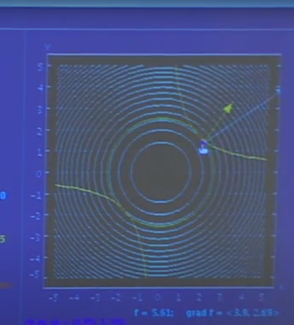</kbd>

 

<kbd>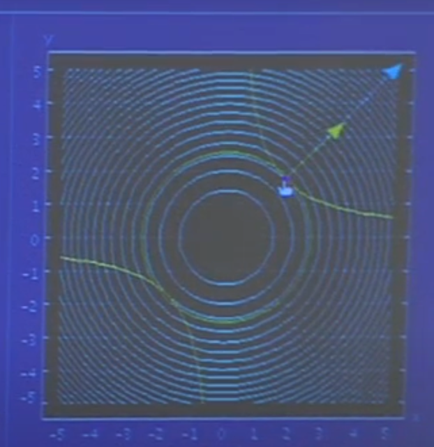</kbd>

> [!NOTE]
> Có thể thấy hình ảnh đúng là như vậy, khi ở điểm trên hyperbola mà 
> gần nhất với O thì hai vector (gradient vector) của g và f cùng phương

 

<kbd>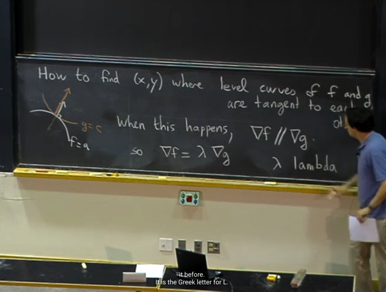</kbd>

> [!NOTE]
> Thế thì điều kiện này (hai gradient vector song song . cùng
> phương) được thể hiện bằng việc **grad_f = lambda * grad_g**.
> Tức là vector này = proportion của vector kia
>
> ĐÂY CHÍNH LÀ PHƯƠNG PHÁP LAGRANGE MULTIPLIERS

 

<kbd>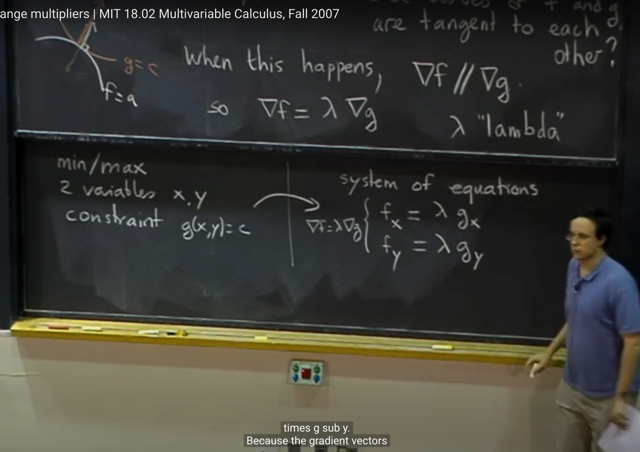</kbd>

> [!NOTE]
> Như vậy bài toán từ việc tìm min/max của hàm f(x,y) với constraint g(x,y)
> = c trở thành bài toán là tìm x,y, lambda sao cho:
>
> **Grad_f = lambda* Grad_g** tương đương
>
> system equation (vì grad_f là vector các partial derivative [f_x, g_x]
> tương tự grad_g là vector các partial derivative [g_x, g_y]
>
> f_x = lambda*g_x
>
> f_y = lambda*g_y

 

<kbd>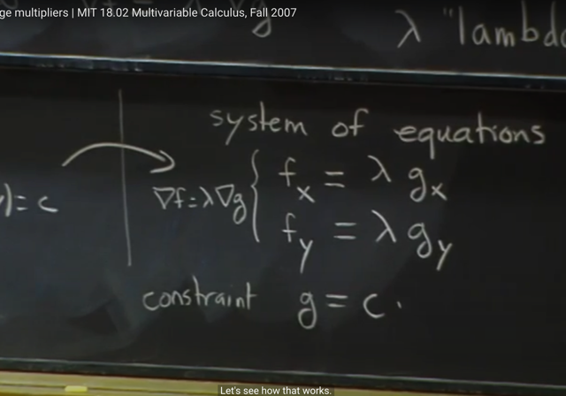</kbd>

> [!NOTE]
> ta có 3 unknowns thì có vẻ như ta chỉ có 2 equations nhưng
> thật ra ta có equation thứ 3 là g = C (=3)

 

<kbd>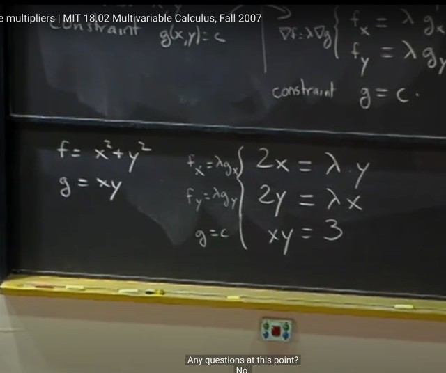</kbd>

> [!NOTE]
> và 3 equations đó là như vầy: 
>
> f_x = lambda*g_x chính là 2x = lambda*y
>
> f_y = lamba*g_y chính là  2y = lambda*x
>
> và xy = 3

 

<kbd>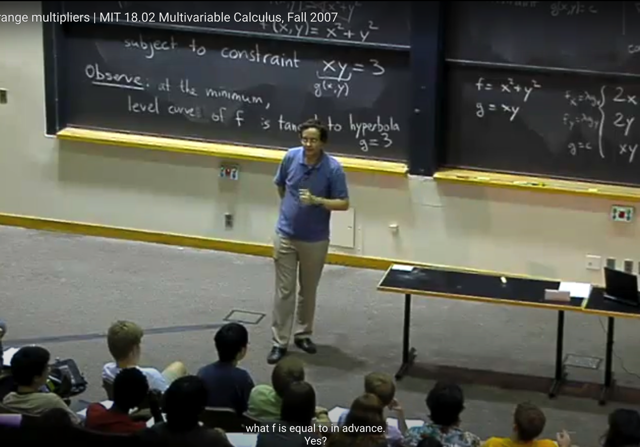</kbd>

> [!NOTE]
> Một số câu hỏi: 
>
> 1. Sao ta biết hướng nào (ý là hỏi gradient vector)? Gs cho rằng ta đã 
> biết trong bài trước, gradient vector VUÔNG GÓC VỚI LEVEL CURVE
> CÒN HƯỚNG THÌ SẼ HƯỚNG VỀ NƠI FUNCTION CÓ GÍA TRỊ CAO
>
> Nên ở đây ta sẽ tùy vào lambda âm hay dương (tức là ta cho phép
> lambda âm hoặc dương
>
> 2. Gs nói thêm là (như lúc nãy ta đã note) rằng điểm minimize f(x, y)
> với constraint không phải là điểm mà f(x,y) = g(x,y). Mà chỉ là điểm mà
> gradient grad_f  = lambda*grad_g
>
> 3. Và bài toán này là để minh họa cho bài toán general hơn là, với hàm
> f(x,y) (trong machine learning, là loss function là function của các
> parameters) và ta sẽ muốn tìm parameters để minimize function f
> với constraint nào đó liên quan đến function g. Và để làm vậy ta đã chuyển
> bài toán từ tìm điểm gần nhất trên Hyperbola với gốc O thành bài toán
> tìm x,y sao cho gradient vector của f và g paralell nhau
>
> 4. Đúng là trong bài toán này, từ constraint xy = 3, ta có thể solve
> cho ra y theo x, và từ đó lắp y vào f và chuyển thành bài toán tìm min
> của hàm f thông thường. Nhưng trong bối cảnh chung hơn là không phải
> lúc nào ta cũng solve được

 

<kbd>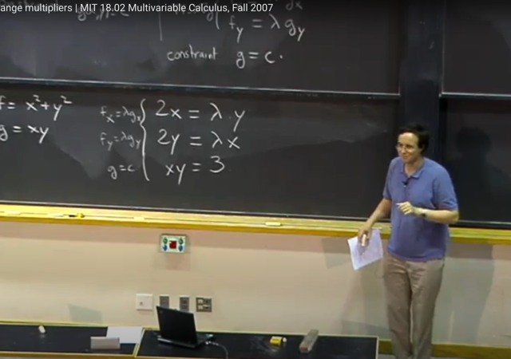</kbd>

🔗 **Related:** [LEC 15: PARTIAL DIFFERENTIALS EQUATIONS](untitled.md#node-353)

> [!NOTE]
> Thế thì theo gs, đối diện với bài toán này, ta không có cách tổng quát
> để giải. Có khi vấn đề rất dễ mà có khi cũng rất khó

 

<kbd>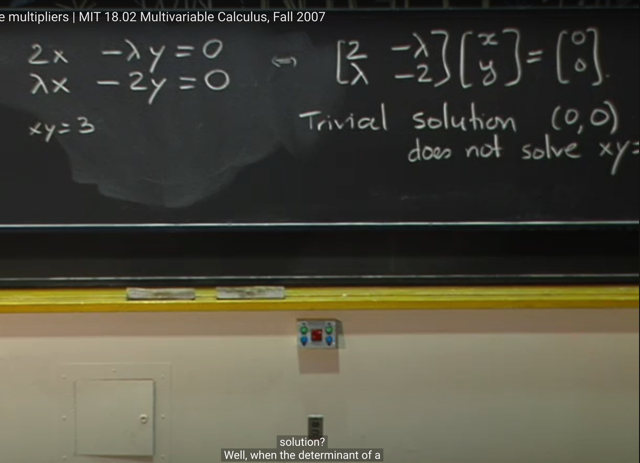</kbd>

> [!NOTE]
> Thế thì, ta viết lại hệ phương trình như vầy, và hai phương trình
> đầu, có thể thể hiện dưới dạng matrix Ax = 0 với matrix A là [2
> -lambda; lambda - 2]
>
> Gs cho rằng [0, 0] (trivial solution) không phải là solution vì nó
> không thỏa xy = 3
>
> Gs: Khi nào hệ có nghiệm?
>
> Thử dùng kiến thức 1806 để trả lời: Theo 1806, đương nhiên ta cần
> A singular, tức non-invertible, để khi đó, sẽ có ít nhất một vector 
> khác 0 trong R2 bị suy biến thành 0 trong nullspace. Khi đó Ax = 0
> sẽ có solution, và để A singular thì rank A phải < 2.
>
> Tuy nhiên solution này phải thỏa xy = 3 nữa. Thử xem tiếp xem sao

 

<kbd>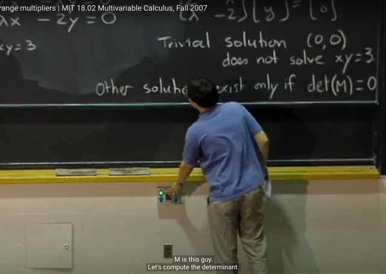</kbd>

> [!NOTE]
> Đúng như vậy, để Mx = 0 có solution (gs gọi matrix là M) thì nó phải
> có det = 0 (ở 1806, det = 0 chính là ám chỉ matrix singular)

 

<kbd>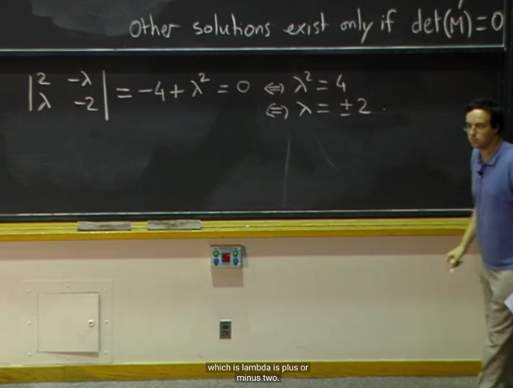</kbd>

> [!NOTE]
> thế thì det của 2x2 matrix là ac - bd dễ tính bằng -4 +
> lambda^2 , để det = 0 thì lambda phải bằng 2 hoặc -2

 

<kbd>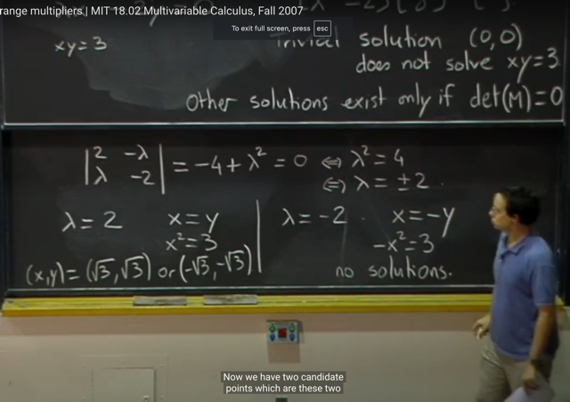</kbd>

> [!NOTE]
> với lambda = 2, ta có 2 solution là (sqrt3, sqrt3) và (-sqrt3, -sqrt3)
> còn lambda = -2 thì không có solution nào.

 

<kbd>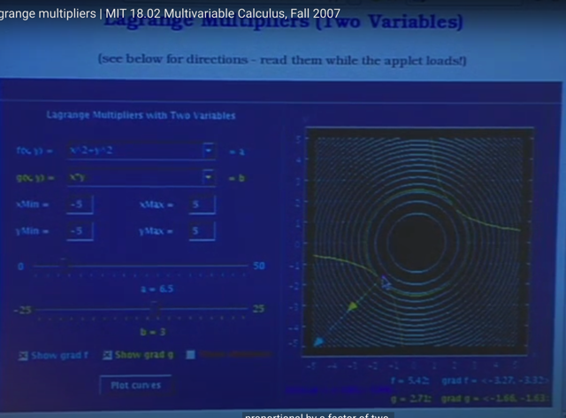</kbd>

<kbd></kbd>

<kbd>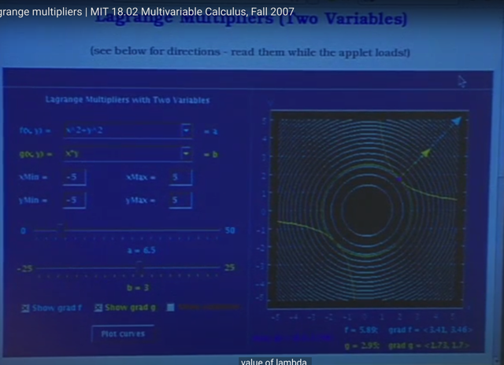</kbd>

> [!NOTE]
> hình ảnh cho thấy điều đó, 1 solution là (sqrt3, sqrt3) 
>
> và solution thứ 2 là (-sqrt3, -sqrt3) và đều ứng với
> lambda = 2: grad_f = 2*grad_g

 

<kbd>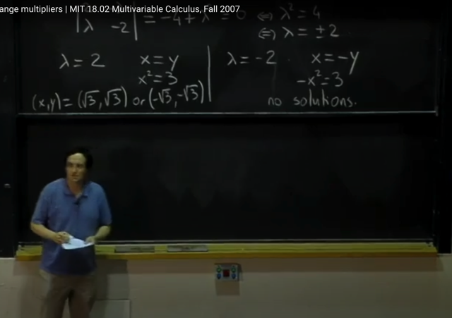</kbd>

> [!NOTE]
> Và gs cho biết lambda ở đây chính là Lagrange multiplier, vì
> nó giúp " multiply" grad g để ra grad f

 

<kbd>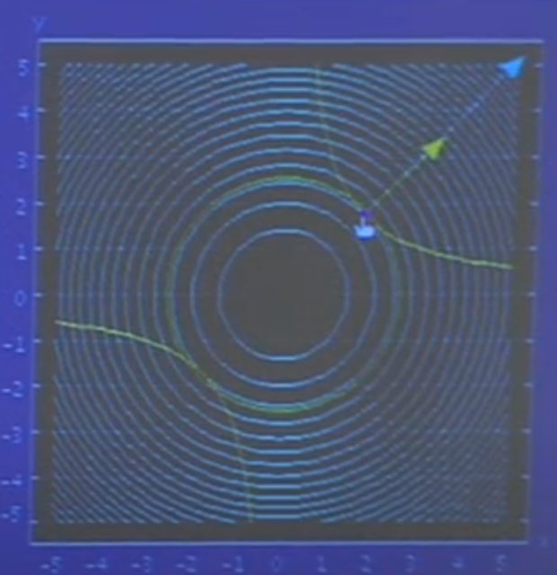</kbd>

<kbd></kbd>

<kbd>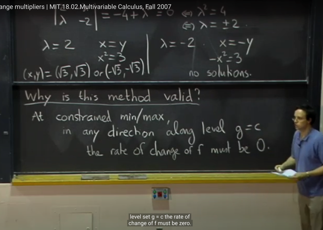</kbd>

> [!NOTE]
> Đại ý là, tại constrained min/max (là hai điểm (sqrt3, sqrt3) và (-sqrt3,
> -sqrt3)) thì khi ta di chuyển theo hướng của level curve g = c  tức là đi
> theo hướng của hyperbola)
>
> Thế thì, rõ ràng là tại hai điểm này, thì khi đi theo phương của level
> curve g = c, thì nó**chính là** **phương tiếp tuyến với level curve của
> f**. Bởi lẽ ta đã  lập luận rằng,**điểm constraints min/max chính là
> điểm mà trên contour plot level curve của f và level curve của g tiếp
> tuyến**  / tangent nhau.
>
> Thì khi đó, đi theo phương của level curve của g thì chính là đi theo
> phương tiếp tuyến của level curve của f (và cũng là đi theo phương
> mà men theo level curve của f, nên độ dốc theo phương đó của f là
> bằng 0
>
> Nhưng **nếu đi hướng khác, thì hàm f sẽ tăng hay giảm**, **chỉ có đi
> theo hướng tangent, tức men theo level curve thì f mới không thay
> đổi thôi**
>
> Nên nó khác với unconstrained max/min. ở đó partial derivative bằng
> 0. Thì đi hướng nào hàm cũng không tăng (vì độ dốc tại đó theo
> hướng nào cũng bằng 0, và dĩ nhiên khi nói "đi" ở đây là đi một đoạn
> vô cùng nhỏ, và độ dốc của hàm đương nhiên là 1st derivative, còn
> đương nhiên second derivative sẽ khác 0, thể hiện độ dốc của độ
> dốc, tức mức tăng của độ dốc đang thay đổi, hay nói cách khác, tuy
> hàm f không thay đổi nhưng độ dốc của nó đang thay đổi (đang tăng
> lên để ngày càng dốc hơn đối với min hoặc độ dốc đang giảm để
> ngày càng dốc xuống đối với max)

 

<kbd>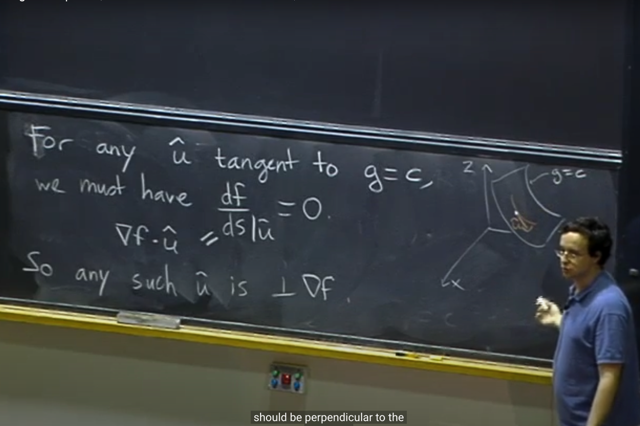</kbd>

> [!NOTE]
> Thể hiện / nói theo cách khác - nói theo directional derivative thì điều
> vừa rồi tương đương nói như sau:
>
> Đó là tại constraint min/max thì, với vector u^ theo hướng tiếp tuyến
> với g thì ta sẽ sẽ có:
>
> df/ds|u^ = 0 (dịch ra là directional derivative theo hướng vector u^
> bằng 0)
>
> Và bài trước ta đã biết df/ds|u^ = grad_f . u^
>
> Như vậy, với u^ là bất kì hướng nào tangent với level curve g thì grad
> f đều có grad_f . u^ = 0, tức grad_f vuông góc với mọi vector u^
> tangent với level curve g = c Do đó nó vuông góc với tangent plane
> (chứa mọi vector u^ như trên) của level curve/set g = c 
>
> (trong ví dụ 3D thì gọi là level set)
>
> Vậy suy ra **grad_f vuông góc với level curve g = c**

 

<kbd>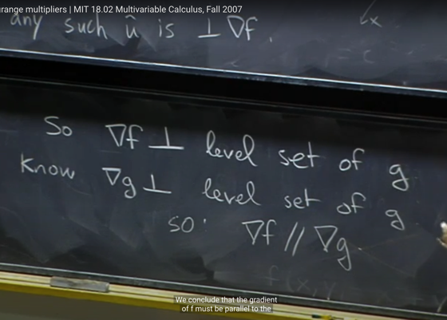</kbd>

> [!NOTE]
> Thế thì bài trước ta biết theorem rằng grad_g cũng vuông góc
> với level set g = c. Vậy từ đây suy ra grad_f song song grad_g
> và điều này biện minh cho việc ta dùng sự thật rằng / điều kiện
> grad_f và grad_g proportional nhau: grad_f = lambda*grad_g để
> tìm constrained min/max
>
> Do đó phương pháp này valid

 

<kbd>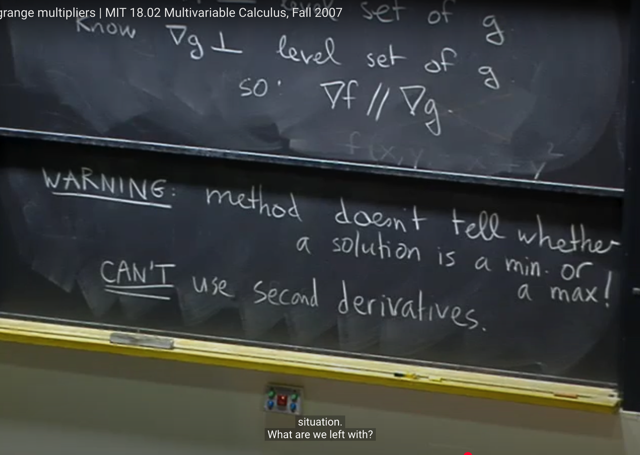</kbd>

> [!NOTE]
> Thế thì gs cảnh báo rằng, và ta cũng hiểu được điều này, đó là
> phương pháp vừa rồi (chính là Lagrange multiplier) không cho biết
> điểm ta tìm được là maximum hay minimum.
>
> Và ta cũng không thể dùng second derivative để test xem nó là
> maximum hay minium luôn.

 

<kbd>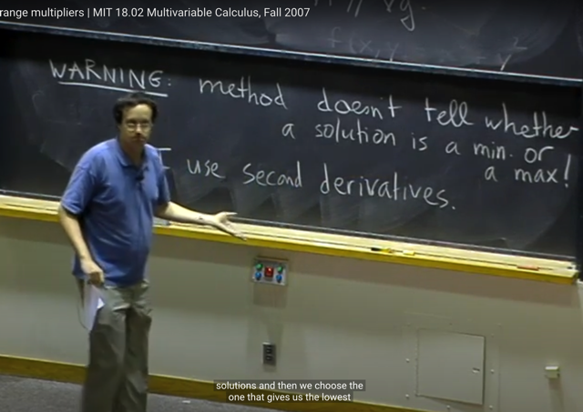</kbd>

> [!NOTE]
> Thế thì đại khái là thường ta sẽ phải tìm các điểm và tính giá trị của
> f và xem cái nào lớn nhất và nhỏ nhất để xác định minimum và
> maximum.
>
> Ví dụ ở đây, maximum sẽ là infi, vì điểm ở trên hyperbola mà có
> khoảng cách xa nhất tới gốc 0 sẽ ở vô cùng vì hyperbola kéo dài
> đến vô cùng
>
> Nhưng minimum ở đây là hai điểm mà ta tìm được bởi Lagrange
> equaquation

 

<kbd>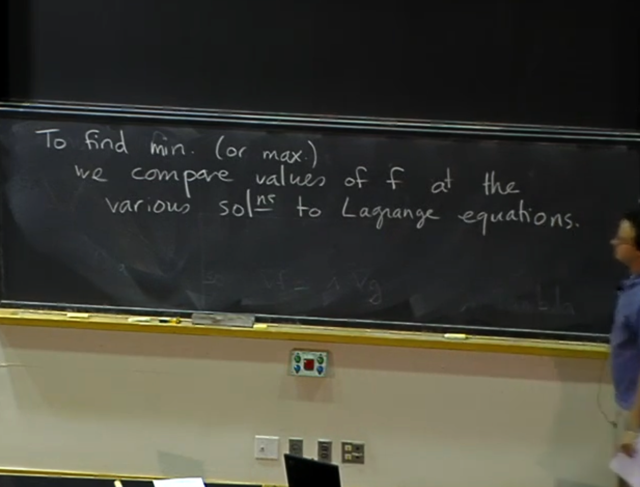</kbd>

> [!NOTE]
> gs nói là, ta thường bối cảnh là ta tin rằng có tồn tại minimum thì
> khi đó minimum thường sẽ là là solution của Lagrange multiplier
> equation, ta sẽ giải ra và xem cái nào có giá trị f nhỏ nhất

 

<kbd>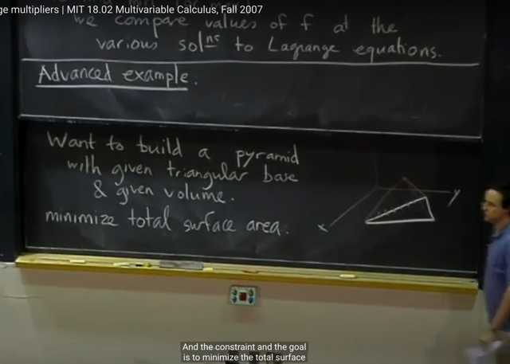</kbd>

> [!NOTE]
> Qua một ví dụ là, ta muốn build một kim tự tháp với đáy tam giác
> cho trước và thể tích cho trước sao cho tối thiểu diện tích bề mặt

 

<kbd>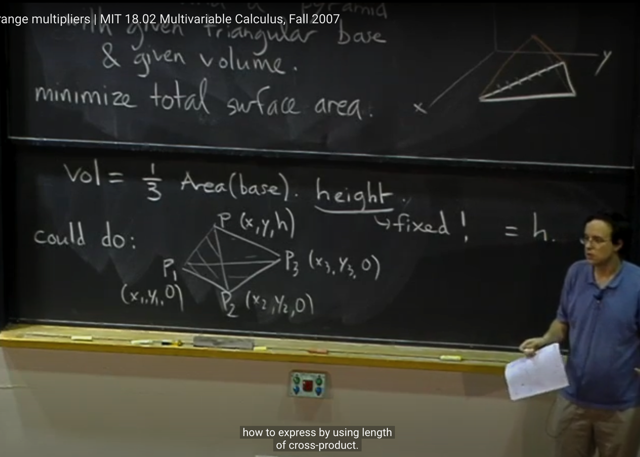</kbd>

> [!NOTE]
> Thế thì, ta biết thể tích hình kim tự tháp tam giác, là 1/3 diện tích đáy
> * chiều cao.
>
> Thế thì với đáy cho trước, và thể tích cho trước thì h cũng fixed.
>
> Vậy ta vẽ hình khối tam giác vói đáy trong plane xy, thì ta có các điểm
> đáy là P1,P2,P3 như vầy và đỉnh P (x,y,z=h)
>
> bài toán là tìm x,y sao cho minimize tổng diện tích các mặt
>
> Thế thì gs nói ta có thể tính tổng diện tích các mặt là các tam giác
> dùng cross product tuy nhiên sẽ dẫn đến bài toán phức tạp và không
> dễ để giải

 

<kbd>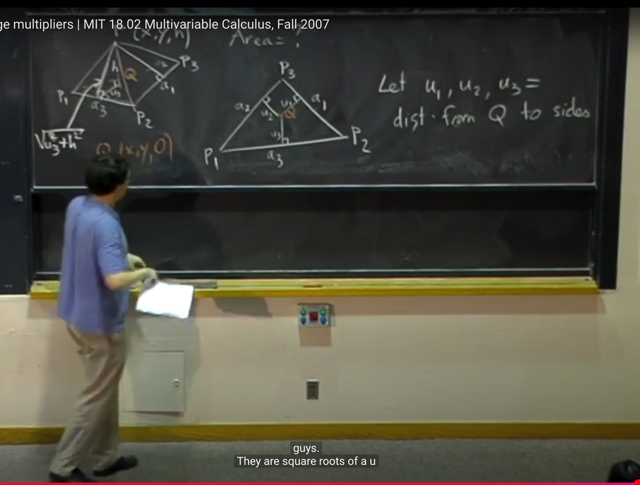</kbd>

> [!NOTE]
> Thế thì ta sẽ tính diện tích các mặt bên như sau: Đó là dùng công thức
> 1/2 đáy * cao (với đáy ka2 các cạnh P1P2, P2P3,...ta đặt là a1, a2, a3)
>
> Còn chiều cao của mỗi mặt, được tính bằng pytagore ví dụ của mặt
> PP1P2 là sqrt(u1^2 + h^2) với u1 là khoảng cách từ Q (là điểm hình
> chiếu của P lên mặt đáy, hay PQ là đường cao của hình kim tự tháp,
> Q có tọa độ là (x,y,0) )

 

<kbd>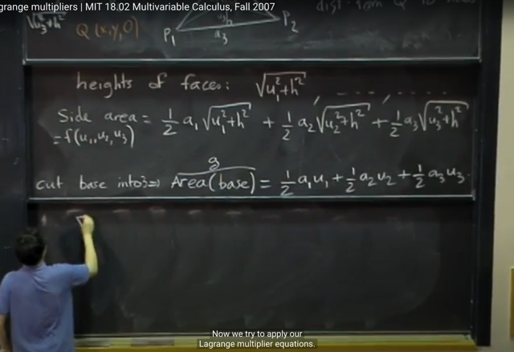</kbd>

> [!NOTE]
> Khi đó diện tích mặt bên sẽ là
> (1/2)a1sqrt(u1^2+h^2) +
> (1/2)a2*sqrt(u2^2+h^2) +
> (1/2)a3*sqrt(u3^2+h^2)
>
> Đây là hàm f(u1,u2,u3) mà ta cần minimize
>
> Và sự thật diện tích đáy = 1/2a1u1 + 1/2a2u2 + 1/2a3u3
> chính là constraint g(u1,u2,u3)  = diện tích đáy đã được fixed

 

<kbd>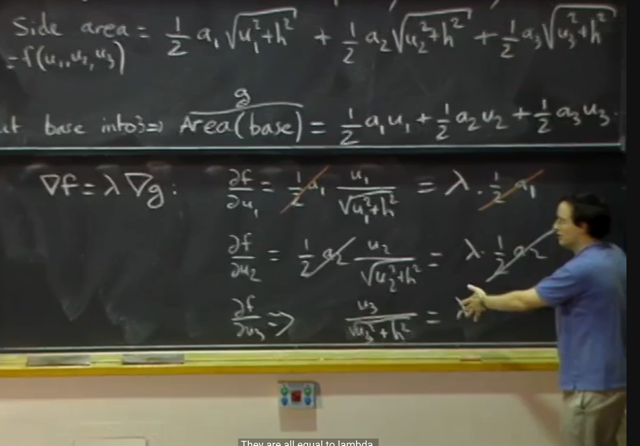</kbd>

> [!NOTE]
> Và ta dựa vào Lagrange multiplier để có equation: Grad_f =
> lambda*Grad_g
>
> Từ đó ta có**hệ các equation partial derivative của f = lambda*partial
> derivative của g**

 

<kbd>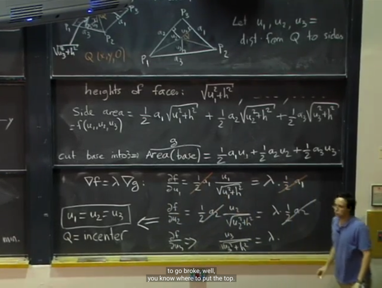</kbd>

> [!NOTE]
> Và điều này giúp giải ra u1=u2=u3 => Q chính là incenter
> (tâm trong) của tam giác đáy

 

