# Lec 14: Non-independent Random Variables

📊 **Progress:** `32` Notes | `37` Screenshots

---
<a id="node-309"></a>

<p align="center"><kbd>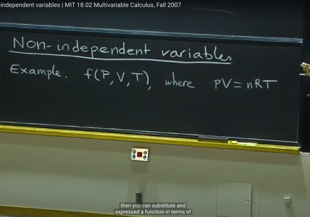</kbd></p>

> [!NOTE]
> Bài này ta sẽ tiếp nối bài trước nói function mà trong đó các variable
> không độc lập
>
> Trong đó bài trước ta đã dùng Lagrange multiplier để tìm max `/` min
> của function f khi các variable bị ràng buộc trong quan hệ bởi hàm g
>
> Thì này ta sẽ tiếp tục, lấy ví dụ hàm f của 3 variable P,V,T trong đó P,V,T
> ràng buộc bởi PV `=` nRT. Ta sẽ phân tích rate of change của chúng với
> nhau và của f với chúng
>
> Nói chung, ta sẽ có hàm f(x,y,z) và constraint g(x,y,z) `=` c như bài trước,
> nhưng ta sẽ phân tích partial derivative thay vì min.max

<br>

<a id="node-310"></a>

<p align="center"><kbd>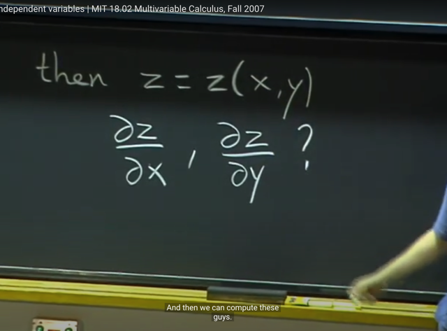</kbd></p>

> [!NOTE]
> Đầu tiên, với constraint g(x,y,z) `=` c, tuy không phải lúc nào cũng dễ để
> solve được z thành function theo x,y. Nhưng ta biết rằng tồn tại function
> thể hiện relation này.
>
> Khi đó nếu solve được z `=` z(x,y) ta sẽ có thể tính partial derivative của
> z w.r.t x, y:  `z_x` và `z_y.` Mang ý nghĩa là rate of change của z so với x
> khi giữa y fixed và rate of change của z so với y khi giữ x fixed

<br>

<a id="node-311"></a>

<p align="center"><kbd>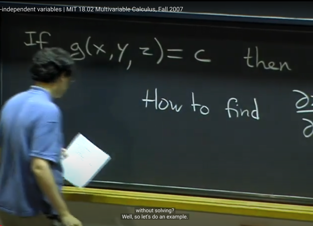</kbd></p>

> [!NOTE]
> Câu hỏi là làm sao để tìm được partial derivative nếu như khó
> solve ra được z `=` z(x,y)

<br>

<a id="node-312"></a>

<p align="center"><kbd>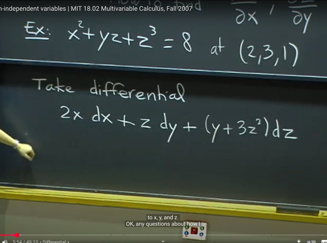</kbd></p>

🔗 **Related:** [Như vậy ta hiểu là trong 1801 implicit differentiation là ta apply d/dx vào hai vế, mà ý nghĩa CHÍNH LÀ LẤY ĐẠO HÀM THEO X HAI VẾ.   y = f(x) => (d/dx) y = (d/dx) f(x) <=> \\*dy/dx = f'(x)\\*  Còn 18.02 thì implicit differentiation thể hiện bằng cách  LẤY VI PHÂN HAI VẾ  y = f(x) <=> \\*dy = f'(x) dx\\*  Và chúng cùng bản chất, chẳng qua cách thể hiện theo vi phân  sẽ chuẩn bị cho ta bước qua khái niệm VI PHÂN TOÀN PHẦN (TOTAL DIFFERENTIAL)](untitled.md#node-224)

> [!NOTE]
> Thế thì, ví dụ này g(x,y,z) `=` x^2 `+` yz `+` z^3. Thì constraint này, ta có thể
> tìm cách express z theo x,y từ đó take partial derivative. Tuy nhiên rõ ràng
> làm vậy rất phức tạp.
>
> ta có thể tiếp cận theo cách khác.
>
> Đầu tiên là sử dụng **total differential** để tính dg:
>
> ```text
> dg = g_x*dx + g_y*dy + g_z*dz
> ```
>
> ```text
> = 2x*dx + z*dy + (y+3z^2)*dz
> ```

<br>

<a id="node-313"></a>

<p align="center"><kbd>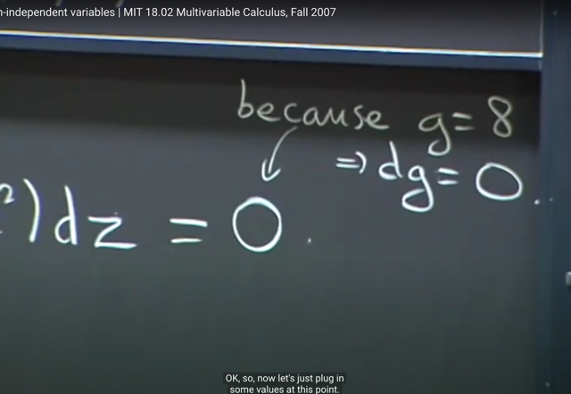</kbd></p>

> [!NOTE]
> Thế thì dg đại diện cho sự thay đổi `/` biến động của g, vì g `=` 8, nên g
> là constant, do đó ta có thể cho dg `=` 0

<br>

<a id="node-314"></a>

<p align="center"><kbd>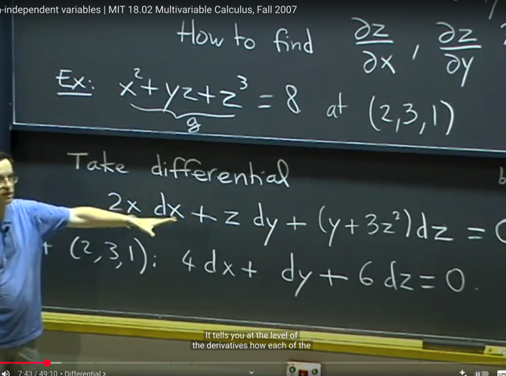</kbd></p>

> [!NOTE]
> ```text
> Thế thì cho dg = 0 ta có 2xdx + zdy + (y+3z^2)dz = 0
> ```
>
> Thế giá trị x,y,z tại điểm (2,3,1) vào cái này, thì ta sẽ có một equation
> mang ý nghĩa là THỂ HIỆN QUAN HỆ GIỮA NHỮNG SỰ THAY ĐỔI
> CỦA X,Y,Z TÁC ĐỘNG LẪN NHAU TẠI ĐIỂM (2,3,1) NÀY.
>
> Để rồi nếu chuyển dz thể hiện nó theo dy, dx thì ta có equation thể
> hiện quan hệ giữa sự thay đổi của z với sự thay đổi của x,y
>
> Tương tự nếu chuyển dy sang và thể hiển nó theo dz, dx thì ta có 
> quan hệ giữa sự thay đổi của y với sự thay đổi của x,z

<br>

<a id="node-315"></a>

<p align="center"><kbd>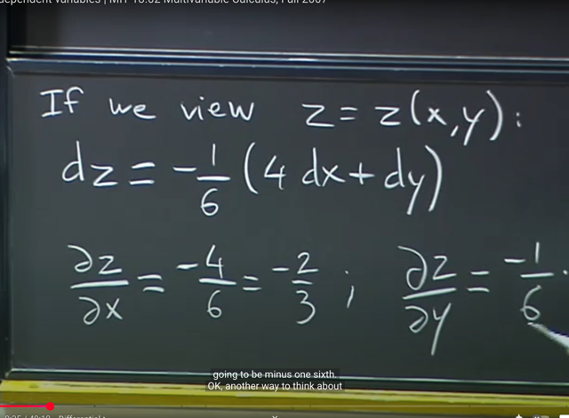</kbd></p>

> [!NOTE]
> Ví dụ ta muốn tìm `z_x,` `z_y` (partial derivative) thì từ equation trên ta có
> ```text
> dz = (-1/6)(4dx + dy)
> ```
>
> ```text
> <=> dz = -4/6 dx + -1/6 dy
> ```
>
> Thì equation này chính là "có dạng" total differential: 
> dz `=` `z_x*dx` `+` `z_y*dy,` tức là ta**có thể kết luận `z_x` `=` `-4/6` và `z_y` `=` -1/6**

<br>

<a id="node-316"></a>

<p align="center"><kbd>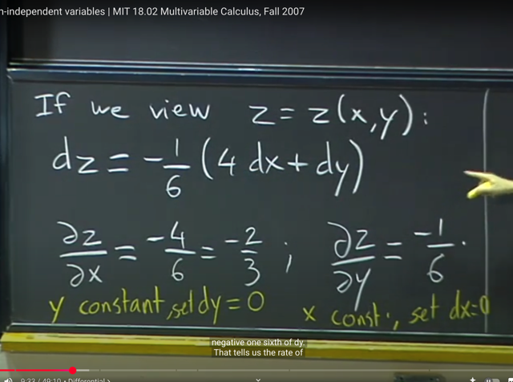</kbd></p>

🔗 **Related:** [LEC 11: DIFFERENTIALS, CHAIN-RULE](untitled.md#node-221)

> [!NOTE]
> Gs cho rằng có thể hiểu như vầy cũng được: Đó là ta muốn tìm `z_x` tức
> partial derivative của z w,r.t x, có nghĩa là "rate of change của z so với x
> khi giữa y fixed"
>
> Thì khi giữ y fixed, tức y constant, ta sẽ có dy `=` 0 nên equation trở
> thành dz `=` `-1/6` * 4 dx thì dựa theo implicit differential (theo link) rằng
> ```text
> nếu ta có z = z(x) thì dz = z_x*dx ta suy ra z_x chính là -1/6 * 4
> ```
>
> Tương tự với x

<br>

<a id="node-317"></a>

<p align="center"><kbd>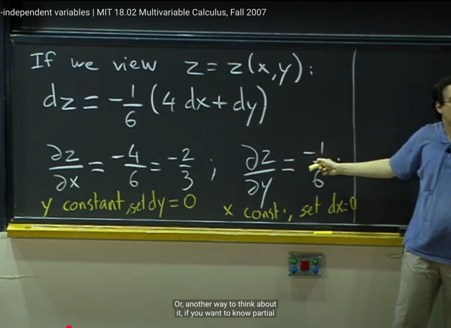</kbd></p>

> [!NOTE]
> Gs trả lời thắc mắc của student, ông giải thích lại. rằng equation dz `=`
> ..dx...dy chính là total differential của z. Nên coefficients gắn với dx,
> dy chính là partial derivative `z_x,` `z_y`

<br>

<a id="node-318"></a>

<p align="center"><kbd>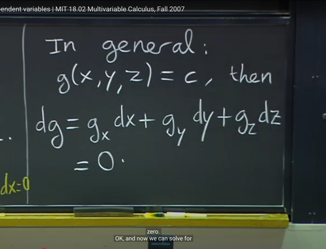</kbd></p>

> [!NOTE]
> Khái quát lên ta có nếu g(x, y, z) `=` constant c thì dg `=`
> ```text
> g_x*dx + g_y*dy + g_z*dz = 0
> ```

<br>

<a id="node-319"></a>

<p align="center"><kbd>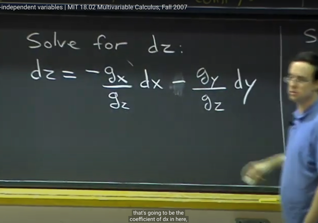</kbd></p>

> [!NOTE]
> Từ đó, ta có thể solve for dz theo dx, dy (hoặc dx theo dz, dy)
>
> Và khi đó, theo total differential thì coefficients gắn với dx chính là
> partial derivative `z_x` và coefficients gắn với dy chính là partial
> derivative `z_y`

<br>

<a id="node-320"></a>

<p align="center"><kbd>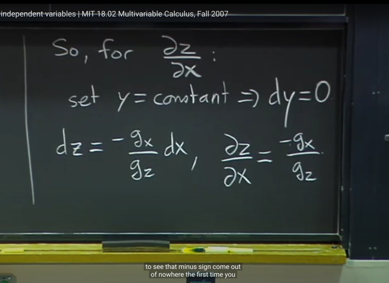</kbd></p>

> [!NOTE]
> Hoặc như đã nói, có thể lập luận cách khác, là để có partial `z_x` thì 
> ```text
> cho y constant, khi đó dy = 0. từ đó dz = -g_x/g_z * dx để partial
> ```
> ```text
> derivative z_x = -g_x / g_z
> ```

<br>

<a id="node-321"></a>

<p align="center"><kbd>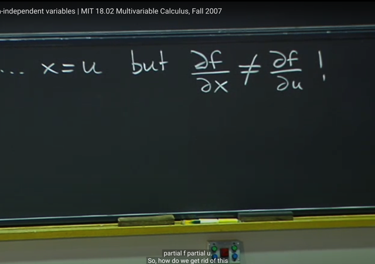</kbd></p>

<p align="center"><kbd></kbd></p>

<p align="center"><kbd>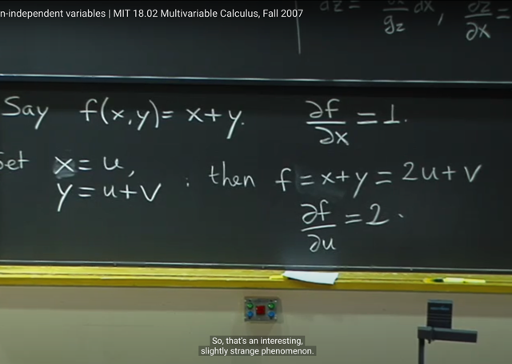</kbd></p>

> [!NOTE]
> Tiếp theo là một chú ý: Lấy ví dụ f(x,y) `=` x `+` y. Thì ta sẽ có partial
> derivative `f_x` `=` 1
>
> ```text
> Xong, ta mới đặt x = u. y = u + v. Khi đó f = x+y = 2u + v. Lúc này
> ```
> tính partial derivative f wrt u: `f_u` `=` 2
>
> Từ đó ta sẽ thấy rằng dù x `=` u nhưng partial derivative của f wrt u
> không bằng với partial derivative của f wrt x

<br>

<a id="node-322"></a>

<p align="center"><kbd>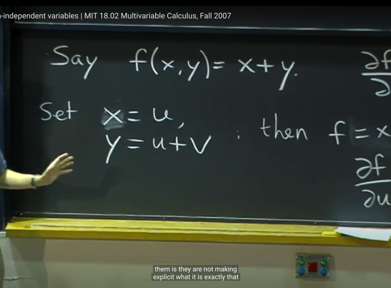</kbd></p>

> [!NOTE]
> Giải thích cho hiện tượng này như sau: Đó là ta phải nhớ bản chất ý
> nghĩa của partial derivative đối với biến nào đó là rate of change của
> function với biến đó KHI GIỮ CÁC BIẾN KHÁC FIXED.
>
> Nên `f_x` là tỉ lệ ''thay đổi của f" `/` "thay đổi của x" KHI GIỮ Y FIXED.
> Và `f_u` là tỉ lệ "thay đổi của f" `/` "thay đổi của u" KHI GIỮ V FIXED.
>
> Thế thì do đó tuy "khi x thay đổi" cũng bằng `/` chính là "u thay đổi"
> nhưng vì một cái là giữa y fixed (khi nói về `f_x)` và một cái là giữ 
> v fixed. thì hai cái đó không giống nhau.
>
> Vì giữ y fixed, tức là u+**v không đổi**. Còn giữ v fixed thì với u thay đổi
> thì `u+v` sẽ**thay đổi.**

<br>

<a id="node-323"></a>

<p align="center"><kbd>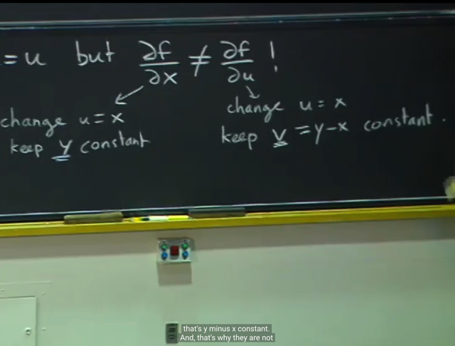</kbd></p>

<br>

<a id="node-324"></a>

<p align="center"><kbd>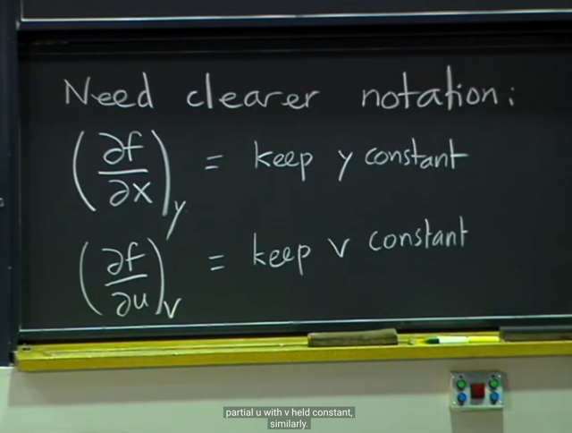</kbd></p>

> [!NOTE]
> Từ đó, phát sinh nhu cầu phải kí hiệu rõ hơn: đó là `(∂f/∂x)_y` :
> ta giữ y constant và `(∂f/∂u)_v` : ta giữ v constant

<br>

<a id="node-325"></a>

<p align="center"><kbd>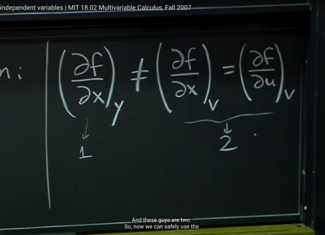</kbd></p>

> [!NOTE]
> Từ đó, với kí hiệu mới có thể hiện rõ "giữ cái gì constant" giúp bây giờ
> mọi thứ trở nên rõ ràng hơn
>
> Cụ thể là ta có thể một cách an toàn mà nói rằng partial derivative của 
> f wrt x khi giữ v constant sẽ chính là `/` bằng với partial derivative của
> f wrt u khi giữ  v constant. (mà nếu ta không dùng kí hiệu có ghi rõ
> ```text
> giữ cái gì constant thì như ví dụ trên đã thấy f_x (=1) khác f_u (=2)
> ```

<br>

<a id="node-326"></a>

<p align="center"><kbd>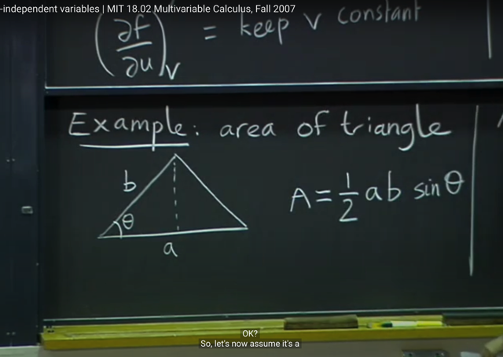</kbd></p>

> [!NOTE]
> Ta qua một ví dụ, cho f là diện tích của hình tam giác cạnh a, b,
> góc theta. Theo công thức ta có f (hay A) `=` 0.5*a*b*sin(theta)
>
> Và cái ta sẽ quan tâm là rate of change của A w.r.t theta, tức là theta
> thay đổi sẽ ảnh hưởng như thế nào tới diện tích A

<br>

<a id="node-327"></a>

<p align="center"><kbd>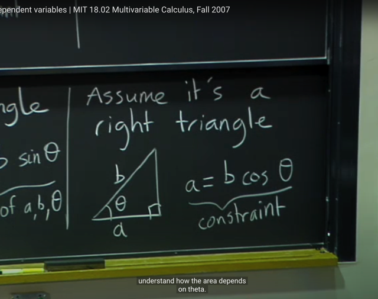</kbd></p>

> [!NOTE]
> Và ý thứ hai là assume đây là tam giác vuông. Tức là a `=` b*cos(theta)
>
> Thì đây sẽ đóng vai trò constraints `-` thể hiện quan hệ giữa a, b, cos(theta)
> ```text
> có thể coi như hàm g(a,b,theta) = a - b*cos(theta) = constant = 0
> ```

<br>

<a id="node-328"></a>

<p align="center"><kbd>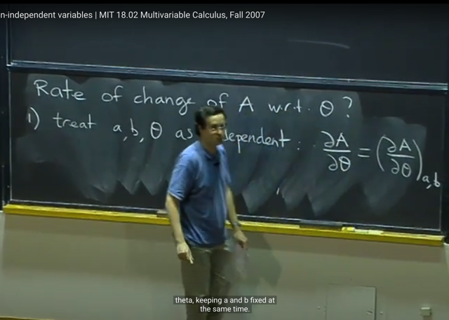</kbd></p>

> [!NOTE]
> Thế thì, đại khái là theo gs có 3 "trường hợp" khi nói về rate of change
> of A wrt theta:
>
> 1) Coi a, b, theta là independent: Khi đó, kí hiệu partial A `/` partial theta
> (partial derivative if A wrt theta) sẽ đồng nghĩa với kí hiệu (partial `A/`
> partial theta) _ a,b  với ý nghĩa là ta sẽ giữa a, b fixed. Điều này đồng
> nghĩa là ta BỎ ĐI KHÔNG DÙNG QUAN HỆ CỦA a, b, theta: a `=` b
> cos(theta) và cũng đồng nghĩa là ta bỏ đi constraint: tam giác vuông

<br>

<a id="node-329"></a>

<p align="center"><kbd>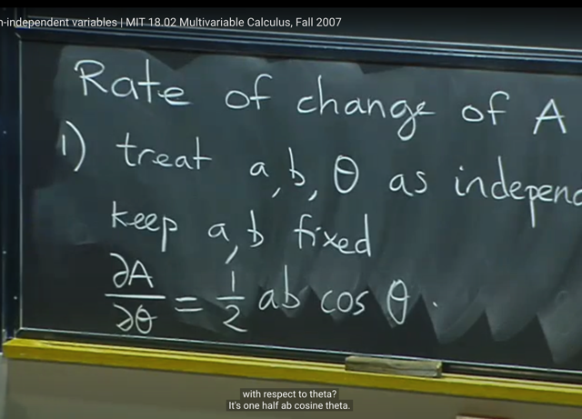</kbd></p>

> [!NOTE]
> Khi đó, partial A `/` partial theta `=` `(1/2)*a*b*cos(theta)`

<br>

<a id="node-330"></a>

<p align="center"><kbd>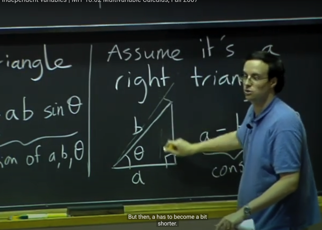</kbd></p>

> [!NOTE]
> Tuy nhiên case thứ 2, và 3 mới là cái ta quan tâm, Đó là thay đổi
> theta, giữ a fixed. Khi đó b sẽ thay đổi. Và giữ b fixed, thay đổi
> theta, thì a sẽ thay đổi

<br>

<a id="node-331"></a>

<p align="center"><kbd>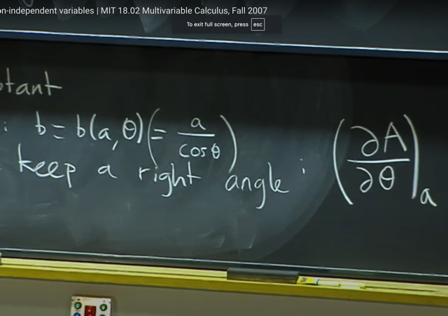</kbd></p>

> [!NOTE]
> Ở case thứ 2, ta giữ a fixed. khi đó, thay đổi theta, b sẽ thay đổi theo 
> thông qua b `=` b(a, theta) `=` a `/` cos(theta)
>
> Lúc này partial derivative của A wrt theta sẽ kí hiệu là (partial A `/` partial theta)_a
> mang ý nghĩa là ta chỉ giữa a fixed, còn b và theta sẽ relate nhau qua 
> b `=` a `/` cos(theta)
>
> Và đương nhiên là quan hệ giữa b và theta sẽ quy định bởi việc giữ điều
> kiện là tam giác vuông

<br>

<a id="node-332"></a>

<p align="center"><kbd>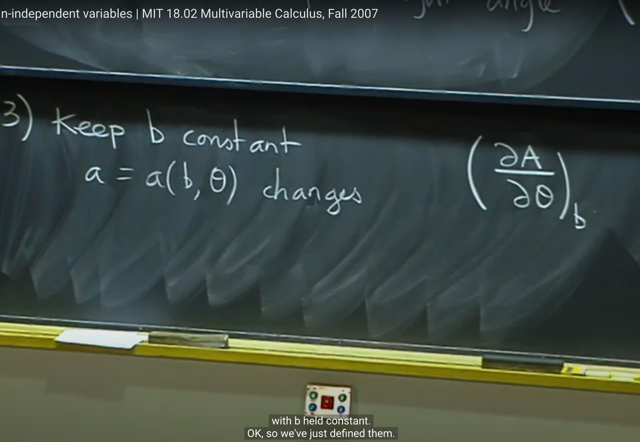</kbd></p>

> [!NOTE]
> Và case thứ 3, là giữa b constant. a sẽ làm function a (b, theta) sẽ thay
> đổi theo theta. Tương tự ta sẽ kí hiệu là (partial A `/` partial theta)_b mang
> ý nghĩa là giữ b fixed, thì đây là rate of change của A wrt theta

<br>

<a id="node-333"></a>

<p align="center"><kbd>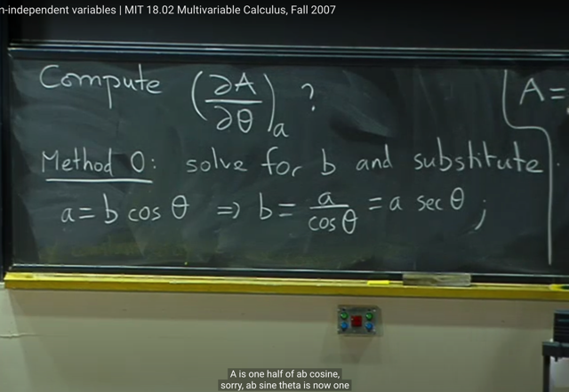</kbd></p>

> [!NOTE]
> Thế thì ta sẽ thử tính (partial A `/` partial theta)_a.
>
> Và phương pháp đầu tiên là cách mà không phải lúc nào cũng làm được
> nhưng ở đây thì được, đó là ta solve b theo a và theta và gắn vào A để 
> thành function theo theta (vì a đã là constant, nên A chỉ còn là hàm theo
> một biến theta)

<br>

<a id="node-334"></a>

<p align="center"><kbd>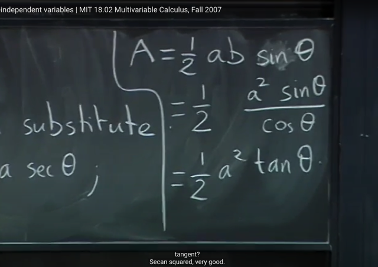</kbd></p>

> [!NOTE]
> ```text
> Để có A = A(theta) = (1/2)absin(theta) =
> ```
> ```text
> (1/2)a*a*sin(theta)/cos(theta) = (1/2)a^2 tan(theta)
> ```

<br>

<a id="node-335"></a>

<p align="center"><kbd>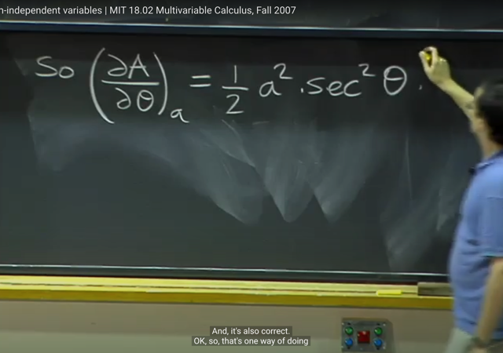</kbd></p>

> [!NOTE]
> Và từ đó, ta tính (partial A `/` partial theta)_a đơn giản sẽ chỉ là lấy
> derivative của A theo theta.
>
> kết quả là `(1/2)*a^2*d(tan(theta))/d(theta)`
>
> Ở đây ta có kiến thức là đạo hàm của tan(x) `=` sec^2(x) (sec(x) `=` `1/cos(x))`
>
> Nên kết quả là `(1/2)*a^2*[sec(theta)]^2`

<br>

<a id="node-336"></a>

<p align="center"><kbd>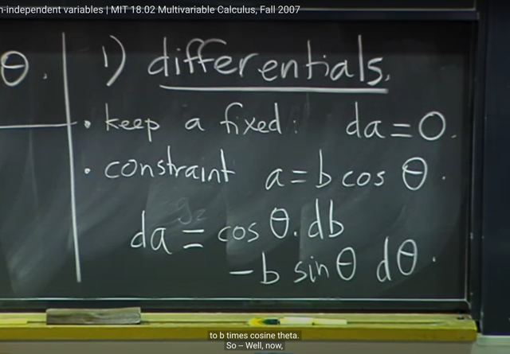</kbd></p>

> [!NOTE]
> Thế thì tiếp theo là hai phương pháp có hệ thống mà ta nên dùng, vì như
> đã nói, phương pháp solve for b để gắn vào A để chuyển nó thành
> function đơn biến theo theta không phải lúc nào cũng làm được vì có khi
> không thể solve `/` khó solve ra b từ constraint được.
>
> Thì phương pháp đầu tiên, là dùng differerentials:
>
> Cách làm đó là, dựa vào việc do ta đang tính (partial A `/` partial theta)_a
> tức là giữa a fixed. Khi đó da `=` 0 như ta đã biết.
>
> Thứ hai, là từ constraint a `=` b*cos(theta), tức là a `=` a(b, theta). Áp dùng
> ```text
> total differentials (khi có f(x,y) thì df = f_x*dx + f_y*dy) ta có:
> ```
>
> ```text
> da = a_b*db + a_theta*d_theta (a_b và a_theta là partial derivative của a
> ```
> wrt b và wrt theta, dễ thấy là sẽ lần lượt bằng cos(theta) và `-` b*sin(theta) )
>
> `<=>` **da `=` cos(theta)*db -b*sin(theta)d_theta**(Và đây cũng là product rule: (uv)' `=` u'dv `+` v'du (mà ta đã biết nó cũng
> xuất phát từ total differential)

<br>

<a id="node-337"></a>

<p align="center"><kbd>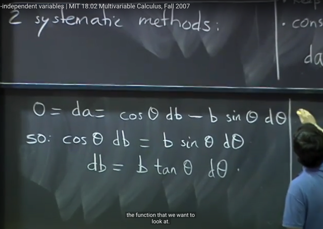</kbd></p>

> [!NOTE]
> ```text
> Từ đó, ta có 0 = da = os(theta)*db -b*sin(theta)d_theta
> ```
>
> Và từ đó ta solve qua db `=` `b*tan(theta)*d_theta`
>
> và đây là rate of change của b wrt theta

<br>

<a id="node-338"></a>

<p align="center"><kbd>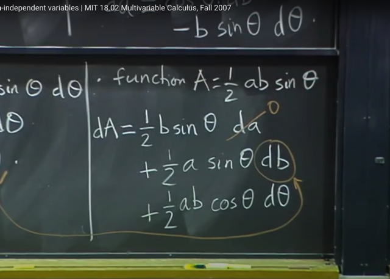</kbd></p>

> [!NOTE]
> Tiếp, áp dụng total differential ta có:
>
> ```text
> dA = A_a*da + A_b*db + A_theta*d_theta
> ```
>
> ```text
> = (1/2)b*sin(theta)*da + (1/2)*a*sin(theta)db + (1/2)abcos(theta)d_theta
> ```
>
> Thế thì khi đó, ta có da `=` 0. và db ta đã solve `=` `b*tan(theta)*d_theta` 
> ở trên. Ta sẽ có dA chỉ còn theo `d_theta`

<br>

<a id="node-339"></a>

<p align="center"><kbd>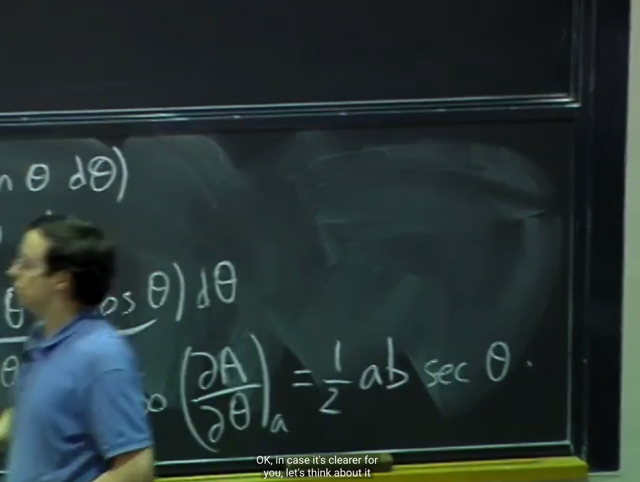</kbd></p>

<p align="center"><kbd></kbd></p>

<p align="center"><kbd>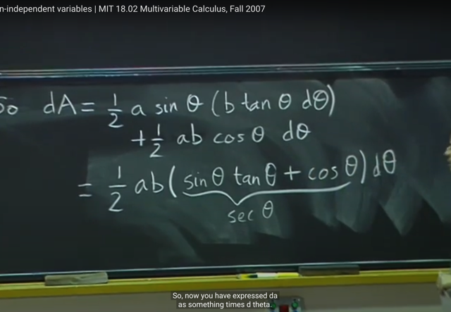</kbd></p>

> [!NOTE]
> Từ đó, gom lại thì ta có dA `=` `(...)*d_theta` **thì coefficient (...) chính là
> (partial A `/` partial theta)_a** `=` **(1/2)a*b*sec(theta)**

<br>

<a id="node-340"></a>

<p align="center"><kbd>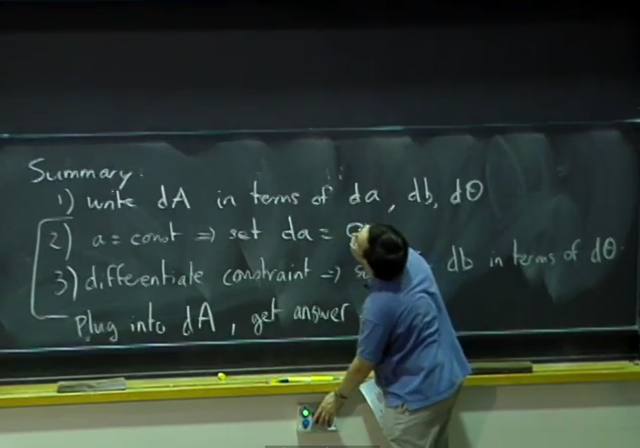</kbd></p>

> [!NOTE]
> Tóm tắt method 1: là ta dùng total differential để có dA theo da, db,
> d theta.
>
> Sau đó ta dựa vào việc giữa a constant để có da `=` 0
>
> TIếp ta dựa vào constraint để solve a theo b, theta và áp dụng total
> differential để có da theo db dtheta, và da `=` 0 nên ta solve db theo
> `d_theta.`
>
> Gắn vào dA ta sẽ có dA theo `d_theta,` và coefficients chính là
> partial derivative của A wrt theta với a constants

<br>

<a id="node-341"></a>

<p align="center"><kbd>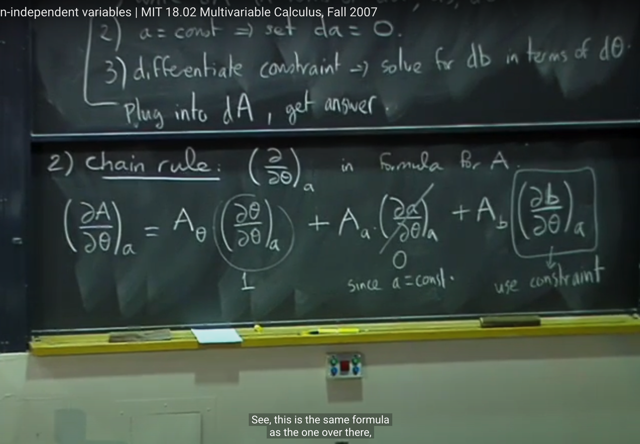</kbd></p>

🔗 **Related:** [Như vậy ta hiểu là trong 1801 implicit differentiation là ta apply d/dx vào hai vế, mà ý nghĩa CHÍNH LÀ LẤY ĐẠO HÀM THEO X HAI VẾ.   y = f(x) => (d/dx) y = (d/dx) f(x) <=> \\*dy/dx = f'(x)\\*  Còn 18.02 thì implicit differentiation thể hiện bằng cách  LẤY VI PHÂN HAI VẾ  y = f(x) <=> \\*dy = f'(x) dx\\*  Và chúng cùng bản chất, chẳng qua cách thể hiện theo vi phân  sẽ chuẩn bị cho ta bước qua khái niệm VI PHÂN TOÀN PHẦN (TOTAL DIFFERENTIAL)](untitled.md#node-236)

> [!NOTE]
> Cách tiếp cận thứ hai đó là dùng CHAIN RULE:
>
> Nhớ lại Chain Rule, khi ta có f là function theo x, y: f(x, y) với x
> y, z là function theo u, v: x(u,v), y(u,v)
>
> Thì khi đó:
>
> ```text
> partial f / partial u = f_x*x_u + f_y*y_u
> ```
>
> nên áp dụng ở đây ta sẽ có A là function theo theta, a, b nên:
>
>  (partial A `/` partial theta )_a
>
> `=` `A_theta` * (partial theta `/` partial theta)_a 
> `+` `A_a` * (partial a `/` partial theta)_a 
> `+` `A_b` * (partial b `/` partial theta)_a
>
> THế thì (partial theta `/` partial theta) `=` 1.
>
> (partial a `/` partial theta)_a `=` 0 do a `=` constant nên theta thay đổi
> thì a vẫn giữ nguyên, nên rate of change of a wrt theta (chính
> là (partial a `/` partial theta)_a `=` 0
>
> Cuối cùng ta có 
>
> (partial A `/` partial theta )_a `=` 
>
> ```text
> = A_theta * 1 + A_b * (partial b / partial theta)_a
> ```
>
> Thay `A_theta,` `A_b,` partial b `/` partial theta)_a vào thì ta cũng sẽ 
> có kết quả như method 2

<br>

