# Lec 15: Partial Differentials Equations

📊 **Progress:** `18` Notes | `20` Screenshots

---
<a id="node-343"></a>

<p align="center"><kbd>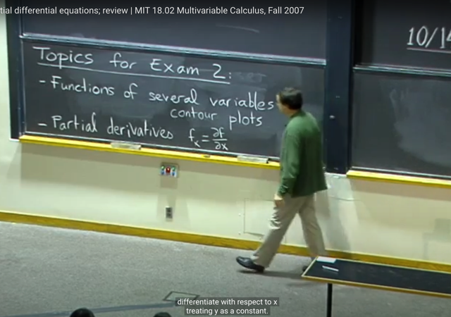</kbd></p>

> [!NOTE]
> Gs review một số topic đã học. Đầu tiên là ta đã bàn về function đa
> biến, cũng như contour plot là cách để ta biểu diễn chúng.
>
> Sau đó ta bàn về partial derivative ví dụ `f_x` `=` partial f `/` partial x mang ý
> nghĩa là rate of change của f wrt x khi GIỮ CÁC VARIABLE KHÁC
> FIXED.
>
> (chú ý ta đã học một notation khác ví dụ như (partial f `/` partial x)_y thì
> thực ra chỉ là DẠNG NOTATION RÕ RÀNG HƠN KHI NÓI RÕ
> VARIABLE NÀO GIỮ FIXED. CÒN BẢN CHẤT ĐỊNH NGHĨA CỦA
> PARTIAL DERIVATIVE LÀ TA ĐÃ NGẦM HIỂU SẼ GIỮ CÁC
> VARIABLE KHÁC FIXED RỒI.

<br>

<a id="node-344"></a>

<p align="center"><kbd>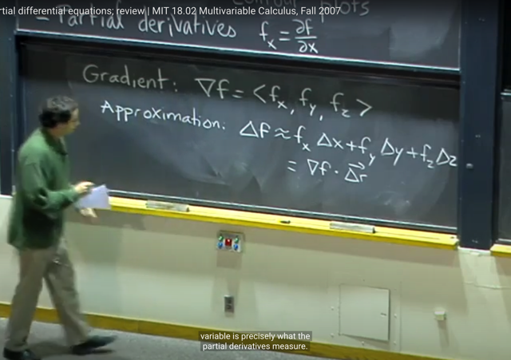</kbd></p>

> [!NOTE]
> Sau đó ta cũng đã học về khái niệm Gradient vector (nabla f) là vector
> ```text
> chứa các partial derivatives: Grad_f = (f_x, f_y, f_z)
> ```
>
> Để rồi ta cũng biết rằng từ TOTAL DIFFERENTIAL: 
>
> ```text
> df = f_x*dx + f_y*dy + f_z*dz nó sẽ mang ý nghĩa là place holder, để
> ```
> khi thay các df, dx, dy, dz bằng các small change `delta_f,` `delta_x,` `delta_y`
> `delta_z` thì ta có LINEAR APPROXIMATION equation:
>
> ```text
> delta_f ~= f_x*delta_x + f_y*delta_y  +f_z*delta_z
> ```
>
> và nó cũng chính là dot product của `Grad_f` vector và `Delta_r` vector
>
> ```text
> (vector r = (x, y, z), nên delta_r = (delta_x, detta_y, delta_z)
> ```

<br>

<a id="node-345"></a>

<p align="center"><kbd>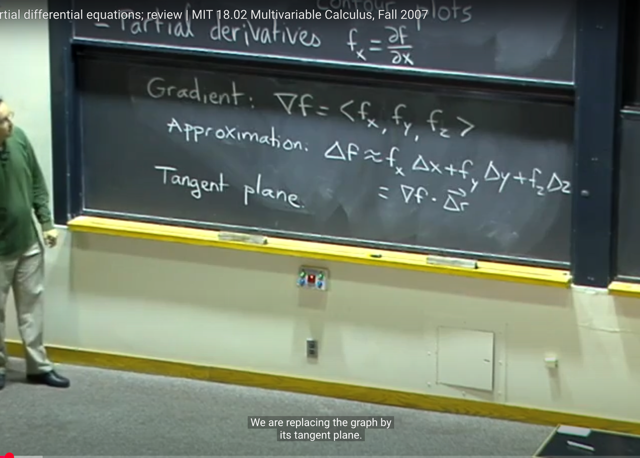</kbd></p>

> [!NOTE]
> Và cái này nó gọi là Tangent plane approximation (cũng là linear
> approximation) bởi vì khi ta dùng dấu bằng thay cho `~=` ở đây thì tức là
> ta sẽ coi hàm f  như một hàm tuyến tính đối với x, y, z để rồi nó trở thành
> mặt phẳng tiếp tuyến của hàm f.
>
> (đại khái là, việc dùng công thức xấp xỉ thì tức là ta coi trong phạm vi
> thay đổi rất nhỏ thì hàm f ỨNG XỬ Y NHƯ MẶT PHẲNG TIẾP TUYẾN
> CỦA NÓ)

<br>

<a id="node-346"></a>

<p align="center"><kbd>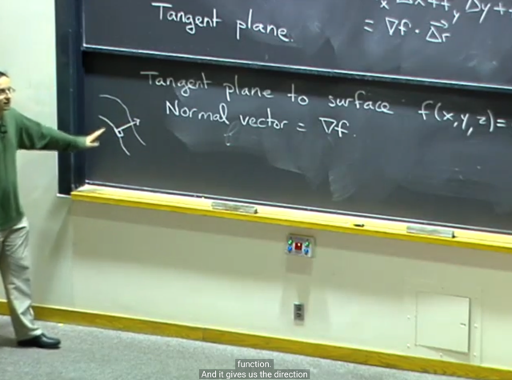</kbd></p>

🔗 **Related:** [LEC 12: GRADIENT, DIRECTIONAL DERIVATIVE, TANGENT PLANE](untitled.md#node-247)

> [!NOTE]
> Và bài trước ta cũng đã biết về theorem nói rằng Gradient vector
> `Grad_f` sẽ vuông góc với level set (level curve) `-` là tập hợp các điểm
> của đồ thị hàm f mà tại đó đều bằng constant c.
>
> Do đó, `Grad_f` tại một điểm cũng chính là normal vector của tangent
> plane tại điểm đó
>
> Còn hướng thì `Grad_f` sẽ chỉ về hướng mà f tăng lên nhanh nhất

<br>

<a id="node-347"></a>

<p align="center"><kbd>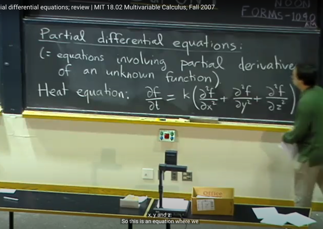</kbd></p>

> [!NOTE]
> Gs nói thêm một lí do mà ta quan tâm đến partial derivative là vì
> nhiều vấn đề trong vật lí và cuộc sống có thể được giải quyết nhờ
> cái gọi là Partial differential equation `-` là phương trình cho biết liên
> hệ giữa các partial derivatives
>
> 1803 là lớp sẽ nói sâu về differential equations mà ta cũng đã học
> qua một chút trong 1806

<br>

<a id="node-348"></a>

<p align="center"><kbd>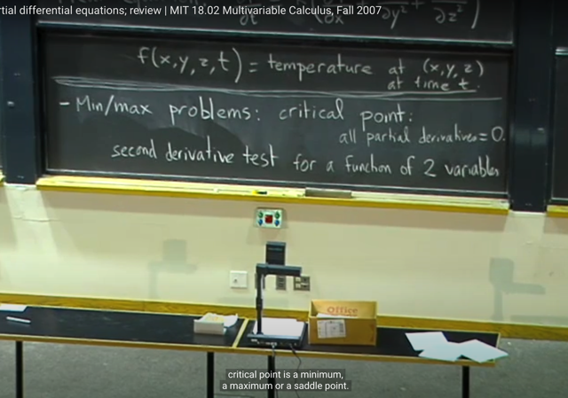</kbd></p>

> [!NOTE]
> Quay lại list review các vấn đề đã học, ta đã biết việc áp dụng partial 
> derivative trong bài toán tìm max `/` min.
>
> Thì ta nhớ đầu tiên ta tìm CRITICAL POINTS, nơi mà mọi partial 
> derivatives đều bằng 0.
>
> Nhưng nó có thể bao gồm cả SADDLE POINTS. Nên ta mới cần 
> second derivative test để xác định là `min/max` hay saddle points

<br>

<a id="node-349"></a>

<p align="center"><kbd>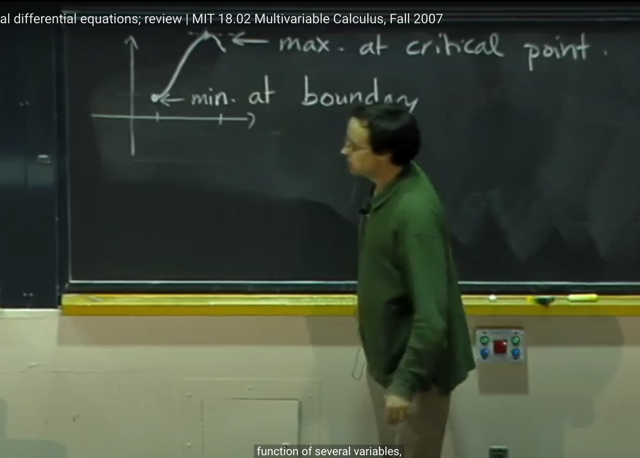</kbd></p>

> [!NOTE]
> Và ta cũng cần chú ý, là những cái đó chỉ giúp ta kết luận rằng
> đó có phải là LOCAL MINIMUM `/` MAXIMUM HAY KHÔNG.
>
> Còn để xác định xem local `min/max` đó có phải là GLOBAL `min/max`
> hay không thì ta phải kiểm tra thêm. Ví dụ như ở đây, local maximum
> đúng là Global maximum. Nhưng Global minimum thì nó nằm ở 
> LIMIT `/` BOUNDARY của function
>
> Do đó ta cũng phải kiểm tra limit `/` boundary bằng cách cho variable
> `->` 0 hay infinity và xem limit của function như thế nào thì từ đó mới
> kết luận là local `min/max` có phải là Global `min/max` không

<br>

<a id="node-350"></a>

<p align="center"><kbd>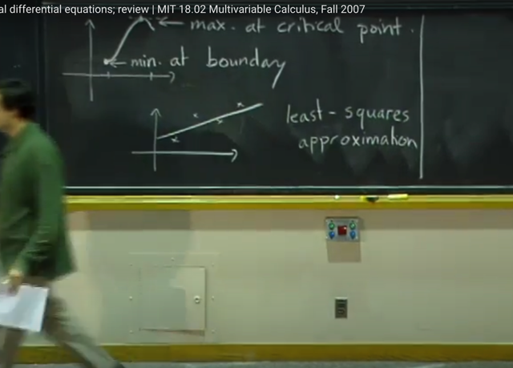</kbd></p>

> [!NOTE]
> Và một ứng dụng của bài toán tìm `min/max` mà ta đã học đó là
> trong bài toán Least Square

<br>

<a id="node-351"></a>

<p align="center"><kbd>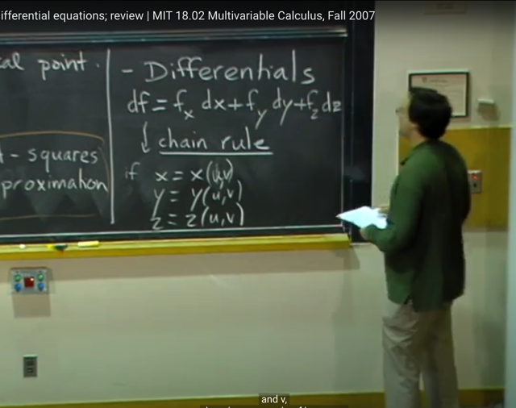</kbd></p>

> [!NOTE]
> Một chủ đề quan trọng mà ta đã học nữa là DIFFERENTIALS:
>
> ```text
> Khi ta có TOTAL DIFFERENTIALS:  df = f_x*dx + f_y*dy + f_z*dz
> ```
>
> và như đã biết, nó cho biết quan hệ của sự thay đổi của x, y, z với sự
> thay đổi của f. Và nó đóng vai trò như Place holder lúc nãy đã nói
>
> Nhưng ngoài ra, khi ta có x,y,z là function theo u,v thì bằng cách chia
> hai vế cho dt
>
> Ta sẽ có CHAIN RULE: Giúp ta có equation giúp tính rate of change
> of f wrt u và v

<br>

<a id="node-352"></a>

<p align="center"><kbd>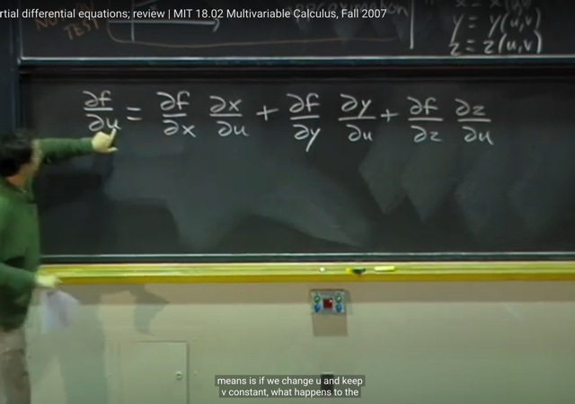</kbd></p>

> [!NOTE]
> Như ở đây ta có partial f `/` partial u được liên hệ với `/` tính bởi partial f `/`
> partial x, y, z và partial x, y , z `/` partial u
>
> Gs nói về ý nghĩa của nó: Đó là nếu ta muốn xem u thay đổi kéo theo f
> thay đổi nhiều ít ra sao thì đầu tiên ta cần biết u thay đổi (đương nhiên giữ
> v fixed) thì kéo theo x thay đổi nhiều ít ra sao vì x thay đổi sẽ kéo
> theo f thay đổi. Và sau đó ta cần khuếch đại nó bởi tỉ lệ thay đổi của f
> bởi x.
>
> Do đó ta mới có `f_x*x_u.` Tương tự với y, z
>
> Và cuối cùng ta add up lại

<br>

<a id="node-353"></a>

<p align="center"><kbd>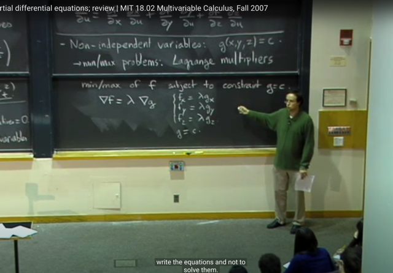</kbd></p>

🔗 **Related:** [LEC 13: LAGRANGE MULTIPLIER](untitled.md#node-289)

🔗 **Related:** [LEC 13: LAGRANGE MULTIPLIER](untitled.md#node-281)

> [!NOTE]
> Một chủ đề quan trọng cuối cùng mà ta đã học trong những bài trước là
> về deal với function f(x,y,z) mà các variable KHÔNG ĐỘC LẬP, NHƯNG
> RÀNG BUỘC `/` PHỤ THUỘC NHAU BỞI CONSTRAINT g(x,y,z) `=` c
>
> Thế thì để giải bài toán min `/` max của f với constraint g này. Ta sẽ dùng
> phương pháp Lagrange multipliers, đó là thiết lập equation
>
> `Grad_f` `=` Lambda* `Grad_g` và từ đó ta có hệ phương trình
>
> Ôn lại một chút về việc lập luận Lagrange multipliers:
>
> Đó là tại điểm `min/max` thì **LEVEL CURVE CỦA F TIẾP TUYẾN VỚI
> LEVEL CURVE CỦA G NÊN TẠI ĐÓ HAI NORMAL VECTOR `/` CŨNG
> LÀ HAI VECTOR `GRAD_F` VÀ `GRAD_G` SONG SONG `/`
> PROPORTIONAL NHAU**Gs cũng nhắc lại có thể bài toán trở nên phức tạp nhưng cũng có thể
> đơn giản (theo link xanh lá)

<br>

<a id="node-354"></a>

<p align="center"><kbd>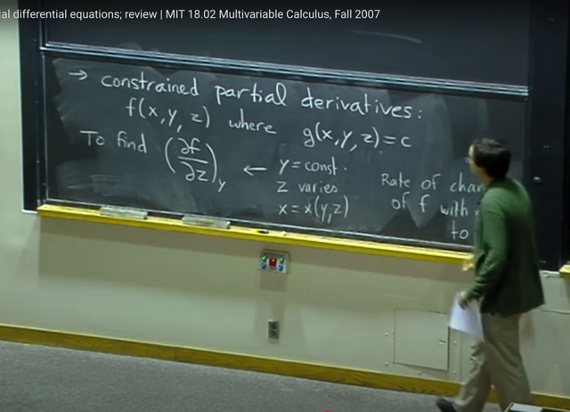</kbd></p>

> [!NOTE]
> Và bài toán thứ hai là CONSTRAINED PARTIAL DERIVATIVES khi
> ta quan tâm tìm hiểu rate of change của f wrt z khi giữ y fixed `-` kí
> hiệu bởi (partial f `/` partial z)_y
>
> Khi đó ta có y  `=` constant, z thay đổi, từ constraint g(x,y,z) `=` c ta
> suy ra x theo y, z: x(z,y)

<br>

<a id="node-355"></a>

<p align="center"><kbd>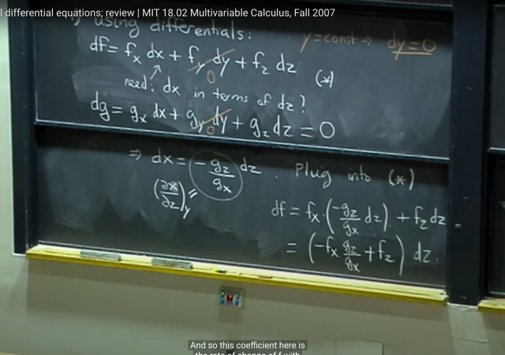</kbd></p>

> [!NOTE]
> thế thì cách đầu tiên là dùng differential:
>
> Từ total differential ta có:
>
> ```text
> df = f_x*dx + f_y*dy + f_z*dz để rồi vì y = const nen dy = 0
> ```
>
> và cũng total differential ta có:
>
> ```text
> dg = g_x*dx + g_y*dy + g_z*dz . Và cái này = 0 do g = constant c nên
> ```
> cùng với dy `=` 0, giúp ta solve dx theo dz (chính là (partial x `/` partial
> z)_y), từ đó gắn vào ta có df  theo dz
>
> thì khi đó, coeff chính là (partial f `/` partial z)_y

<br>

<a id="node-356"></a>

<p align="center"><kbd>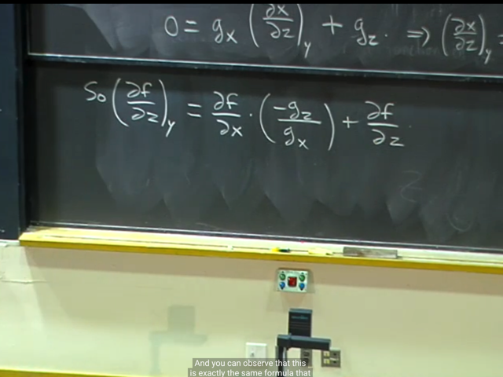</kbd></p>

<p align="center"><kbd></kbd></p>

<p align="center"><kbd>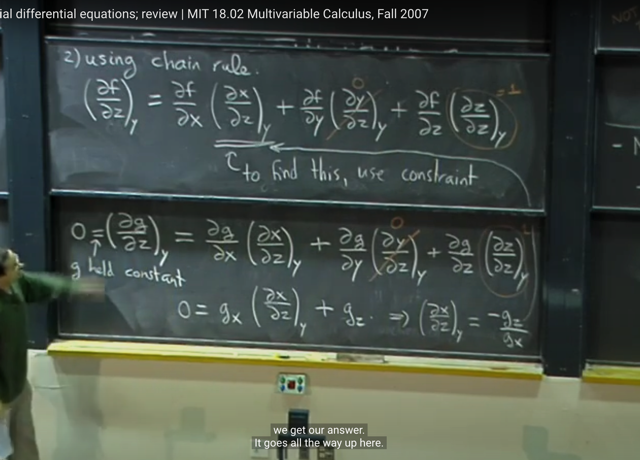</kbd></p>

> [!NOTE]
> Và cách thứ hai chỉ là áp dụng `Chain-rule` trừ việc sự dụng new notation
> để thể hiện rằng ta chỉ giữ y constant
>
> Thế thì (partial y `/` partial z)_y `=` 0 do y constant, và (partial z `/` partial z)_y
> `=` 1
>
> Nên ta chỉ còn cần phải tìm (partial x `/` partial z)
>
> Và ta tuy có thể dùng differential như cách 1 để tìm cái này nhưng ta
> cũng có thể tiếp tục dùng Chain rule
>
> Để tính (partial g `/` partial z)_y tương tự như vậy và dùng the fact g `=`
> constant c nên rate of change của g wrt z (với y held fixed) cũng bằng 0.
> Nhờ đó ta  có thể solve ra (partial x `/` partial z)_y
>
> Và gắn vào equation trên ta sẽ có đáp án y như cách 1

<br>

<a id="node-357"></a>

<p align="center"><kbd>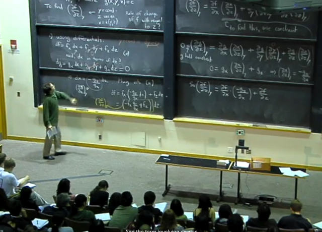</kbd></p>

> [!NOTE]
> Thế thì thực ra hai method là MỘT.
>
> Vì cách 2 `CHAIN-RULE` thực ra chỉ là cách 1 `-` dùng total
> differential CHIA CHO DZ `+` GIỮ Y CONSTANT MÀ THÔI

<br>

<a id="node-358"></a>

<p align="center"><kbd>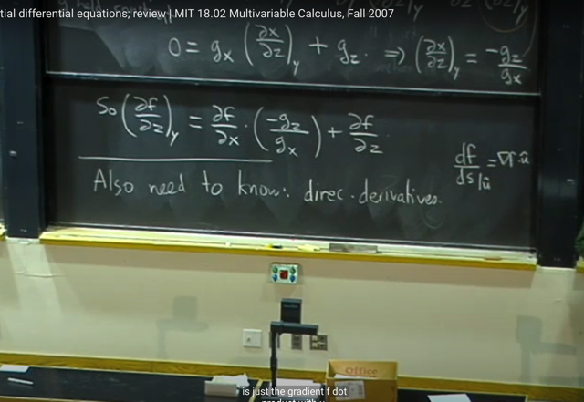</kbd></p>

> [!NOTE]
> Gs quên nhắc đến một cái nữa mà ta đã học là DIRECTIONAL
> DERIVATIVES.  Và kí hiệu của nó là:
>
> `df/ds|u^` `=` `Grad_f` . u^

<br>

<a id="node-359"></a>

<p align="center"><kbd>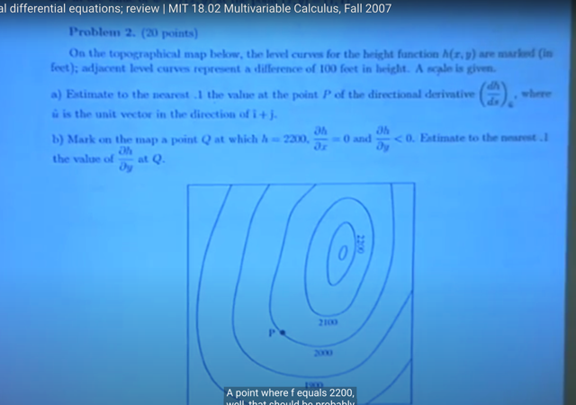</kbd></p>

> [!NOTE]
> gs làm thử một câu trong exam trước đây. Câu hỏi là cho cái contour
> plot như hình. Câu b ta cần đánh dấu điểm mà có h `=` 2200, partial h `/`
> partial x `=` 0 và partial h `/` partial y < 0
>
> Dĩ nhiên ta cần tìm điểm trên đường level curve 2200.
>
> Thế thì partial h `/` partial x `=` 0, tức là giữ y fixed, và tìm điểm nào mà
> độ dốc bằng 0. Thế thì việc giữ y fixed tức là ta sẽ xem các đường
> song song với trục x. thì điểm nào mà khi x thay đổi thì h không thay đổi

<br>

<a id="node-360"></a>

<p align="center"><kbd>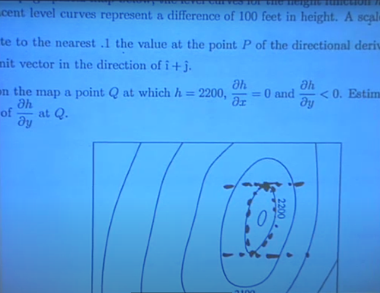</kbd></p>

> [!NOTE]
> Thì đó chỉ có thể là hai điểm này: là hai điểm mà có hai đường y `=`
> constant tiếp tuyến với level curve. Vì tại đó, khi di chuyển theo
> phương tiếp tuyến này (là phương x) một khoảng vô cùng nhỏ thì ta
> vẫn đang ở trên level curve nên h không đổi. Nên partial h `/` partial x `=`
> 0
>
> Và trong hai điểm này thì ta cần tìm điểm nào mà có partial h `/` partial y
> bé hơn 0.
>
> Thì đó chính là điểm ở trên. Vì tại đó, khi tăng y thì hàm h sẽ giảm (còn
> điểm ở dưới khi tăng y thì hàm h tăng)

<br>

