# Lec 16: Double Integrals

📊 **Progress:** `36` Notes | `39` Screenshots

---
<a id="node-362"></a>

<p align="center"><kbd>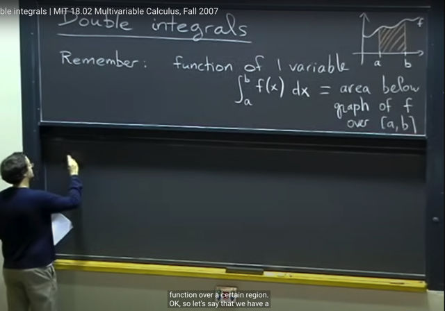</kbd></p>

> [!NOTE]
> Thế thì từ bữa đến giờ là về**ĐẠO HÀM** (**DERIVATIVES**) bây giờ là về 
> **TÍCH PHÂN** (**INTEGRALS**)
>
> Thế thì gs ôn lại rằng nếu ta có**hàm f(x)** (function đơn biến) thì**tích phân
> từ a đến b** của **f(x)dx** có ý nghĩa là **DIỆN TÍCH** của **vùng bên dưới đồ
> thị hàm f trong khoảng từ a đến b**

<br>

<a id="node-363"></a>

<p align="center"><kbd>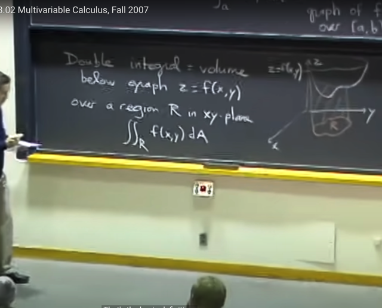</kbd></p>

> [!NOTE]
> Thế thì nếu là**hàm 2 biến f(x,y)** thì ta có **double integral**mang ý nghĩa là
> **THỂ TÍCH (volume) của vùng bên dưới hàm f**
>
> Lấy ví dụ hàm **z `=` f(x,y)** thì cũng như ta cần tích diện tích của area bên 
> dưới hàm đơn biến f(x) trong đoạn [a, b] thì ở đây ta cần xác định một
> **VÙNG (AREA) R** để tính **TÍCH PHÂN KÉP (double integral)** trong vùng
> R này.
>
> Kí hiệu là **∫∫R f(x,y)*dA**
>
> Trong **dA** thì A đại diện cho **Area.**

<br>

<a id="node-364"></a>

<p align="center"><kbd>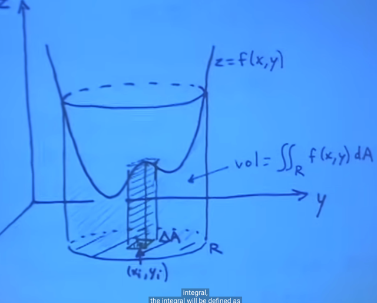</kbd></p>

> [!NOTE]
> Thế thì với **hàm đơn biến,** **∫ từ a đến b f(x)dx** mang ý nghĩa là
> ta sẽ 
>
> **chia vùng dưới hàm f(x)** thành **vô số các hình chữ nhật** bề rộng
> rất nhỏ **∆x** và **có chiều cao f(x)** để rồi **diện tích sẽ là tổng diện tích**
> tất cả các hình chữ nhật này. Và đúng hơn nữa là ta sẽ cho **∆x
> nhỏ vô cùng để thành dx**
>
> Thì đây cũng tương tự vậy, ta sẽ **chia thể tích thành vô số các hình
> hộp chữ nhật** có **đáy ∆A** và **chiều cao f(x,y)**
>
> Thì tổng của tất cả các thể tích của chúng với ∆A nhỏ `->` dA chính
> là ý nghĩa của tích phân kép mà ta đang nói đến

<br>

<a id="node-365"></a>

<p align="center"><kbd>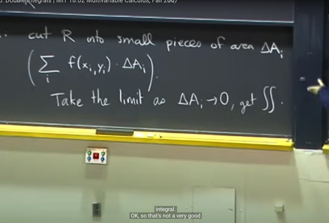</kbd></p>

<p align="center"><kbd></kbd></p>

<p align="center"><kbd>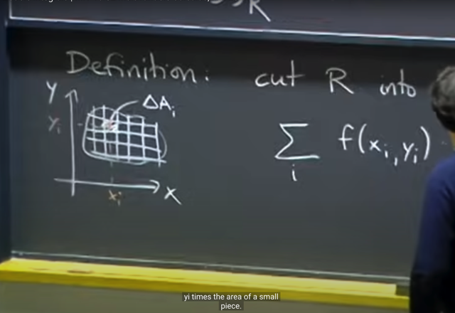</kbd></p>

> [!NOTE]
> Định nghĩa của double integrals: Ta sẽ **chia Area R thành các vùng nhỏ
> ∆A_i**, tại các coordinates (**x_i, y_i**)
>
> Khi đó ta sẽ **sum các thể tích của các hình hộp** có đáy `∆A_i` và **chiều
> cao** **f(x_i, y_i)**
>
> Thế thì khi lấy **limit của sum này** khi cho `∆A_i` `->` 0 thì ta sẽ có Double
> Integrals: `∫∫R` f(x,y)dA

<br>

<a id="node-366"></a>

<p align="center"><kbd>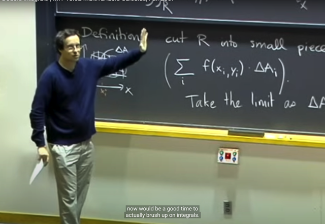</kbd></p>

> [!NOTE]
> Gs nói **khi tính tích phân** ta sẽ **không làm theo kiểu chia ra thành
> các vùng nhỏ và sum**, và**lấy limit** như định nghĩa.
>
> Mà cũng như với **tích phân đơn biến**, ta sẽ dùng các **trick**, như
> **u-substitution**, itegration by part.... để tính
>
> Và cụ thể thì ta sẽ **đưa double integral thành tính 2 integral đơn**

<br>

<a id="node-367"></a>

<p align="center"><kbd>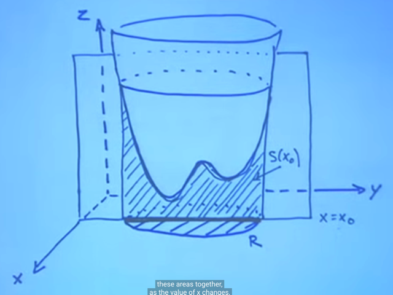</kbd></p>

> [!NOTE]
> Thế thì để tính double integrals, như đã thật ra ta sẽ không chia R thành
> các ∆A và tính **limit ∆A `->` 0 của ∑ `∆A_i` * `f(x_i,` y_i)**
>
> Mà thay vào đó ta sẽ **chuyển thành việc tính 2 cái integral đơn biến**
>
> Cụ thể là ta sẽ**cắt (slicing) đồ thị hàm f**bởi các **mặt phẳng song
> song** với **yz**.
>
> Tại mỗi slicing ở x `=` x0 như vậy thì ta sẽ **tính thể tích của một "miếng**"
> như hình là vùng gạch chéo **S(x0)**
>
> Miếng này có **độ dày δx** (hoặc với `δx` vô cùng nhỏ: dx)
>
> Và **diện tích S(x0) của nó có thể thấy chính là integral theo biến y của
> f(x0, y): `∫` f(x0, y)dy**
>
> Thế thì, t**hể tích của một miếng là S(x)*δx** thì **thể tích** cần tính sẽ là
> tổng thể tích của mọi miếng như vậy: 
>
> Tổng mọi `S(x)*δx`
>
> Và ta sẽ cho mỗi miếng có độ dày vô cùng nhỏ, từ đó thể tích cần tìm sẽ là
>
> **Limit `δx` `->` 0 của [Tổng mọi S(x)*δx]**
>
> Và đó chính là: **tích phân S(x)*dx**

<br>

<a id="node-368"></a>

<p align="center"><kbd>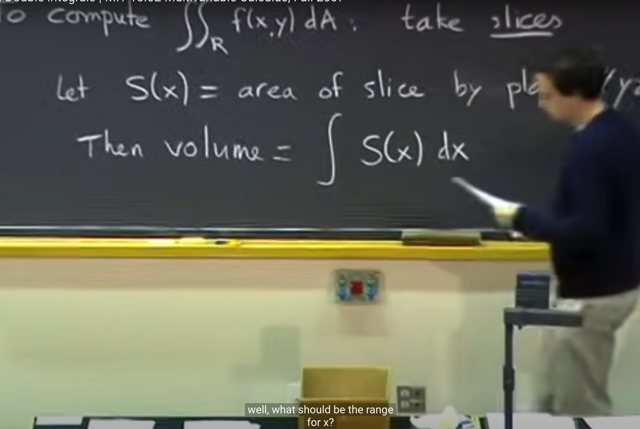</kbd></p>

> [!NOTE]
> Vậy ta gọi **S(x)** là **diện tích** của **"mặt cắt" bởi plane `//` yz**
> Thì t**hể tích** cần tìm (**∫∫ trên R f(x,y)dA) sẽ chính**là 
>
> **tích phân S(x)dx**

<br>

<a id="node-369"></a>

<p align="center"><kbd>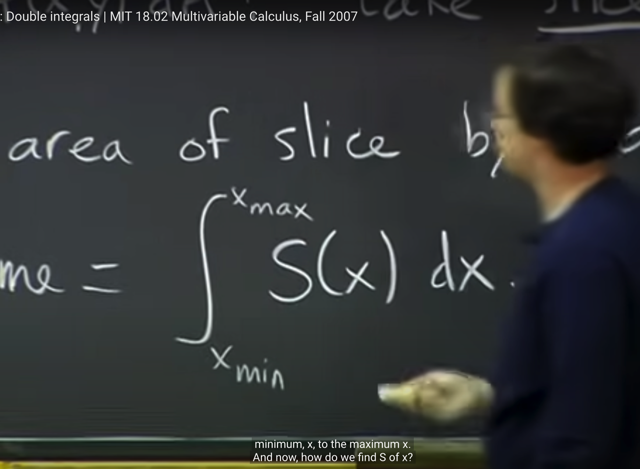</kbd></p>

> [!NOTE]
> Và trong tích phân này, limit của x
> sẽ từ **x_min** tới **x_max**

<br>

<a id="node-370"></a>

<p align="center"><kbd>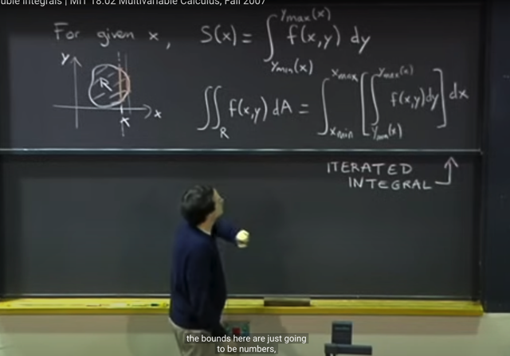</kbd></p>

> [!NOTE]
> Rồi, với một giá trị x từ **x_min** tới **x_max** đã xác định, thì ta có thể tính
> **S(x).** Như đã nói, nó là tích phân của f(x,y)dy với y từ đâu đến đâu
> **SẼ LÀ FUNCTION PHỤ THUỘC X**
>
> Bởi lẽ dễ thấy rằng **với x khác nhau**, **phạm vi của y sẽ khác nhau**hay nói cách khác `y_min` và `y_max` là function theo x: `y_min(x),` `y_max(x)`
>
> Từ đó S(x) sẽ là **tích phân từ `y_min(x)` : `y_max(x)` f(x,y)dy
>
> Để rồi `∫∫R` f(x,y)dA sẽ bằng:
>
> tích phân `x_min:` xmax [ tích phân `y_min(x):` `y_max(x)` f(x,y)dy ] dx**Và đây được gọi là **ITERATED INTEGRAL** là bởi ta sẽ tích phân
> **lần lượt (iterated)** theo **y trước**sau đó tích phân theo **x sau**

> [!NOTE]
> INTEGRATED INTEGRAL

<br>

<a id="node-371"></a>

<p align="center"><kbd>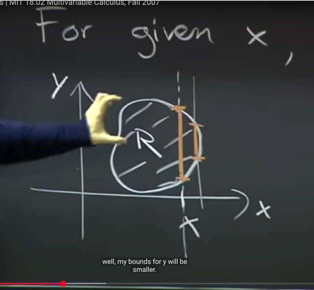</kbd></p>

> [!NOTE]
> Again, hình ảnh cho thấy limit của y `(y_min,` `y_max)` sẽ tùy
> thuộc theo giá trị cụ thể của x

<br>

<a id="node-372"></a>

<p align="center"><kbd>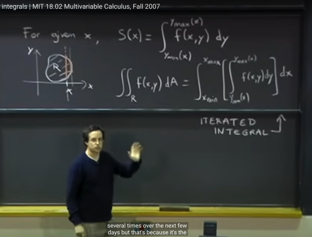</kbd></p>

> [!NOTE]
> Gs nói **cái quan trọng nhất** cần chú ý là **bounds ở ngoài** (tức là cái
> range của tích phân ở ngoài) sẽ **PHẢI LÀ NUMBERS**: **x_min, `x_max`
> là numbers**
>
> Còn cái **bounds ở trong**, LÀ **FUNCTION PHỤ THUỘC VÀO X**:
> **y_min(x) y_max(x)**
>
> Trong **STAT110** ta cũng đã thấy gs **Blizstein** nhấn mạnh cái này
> nhiều lần trong các bài toán xác suất cần tính tích phân kép

<br>

<a id="node-373"></a>

<p align="center"><kbd>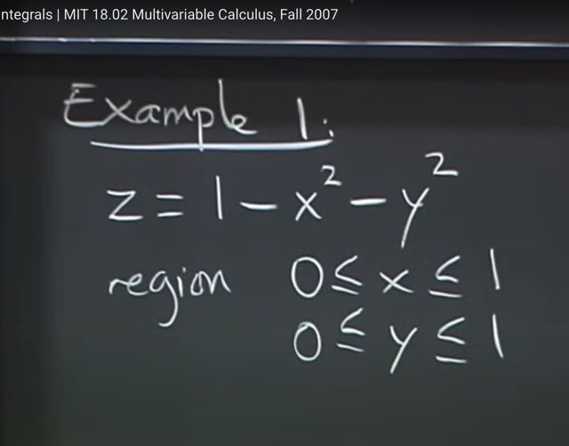</kbd></p>

> [!NOTE]
> Qua ví dụ này

<br>

<a id="node-374"></a>

<p align="center"><kbd>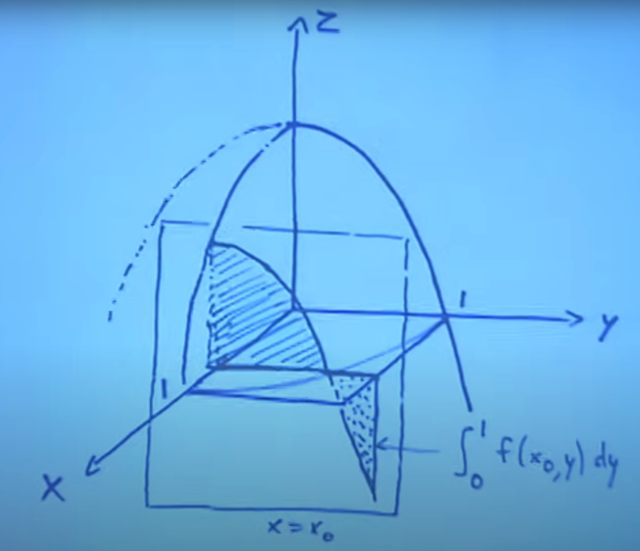</kbd></p>

> [!NOTE]
> Qua ví dụ **tính thể tích** của **vùng bên dưới paraboloid** với
> **x, y trong range [0,1]**.
>
> Đại khái là ta có paraboloid (là cái parabol xoay quanh một trục),
> thì phần cần tính thể tích là phần **giới hạn bởi**: **paraboloid**,
> plane **xz, yz** với x, y trong đoạn [0,1]
>
> Chú ý là trong ví dụ này thì ta **không giới hạn bởi xy plane**,
> tức phần thể tích muốn tính chỉ là **phần ở dưới paraboloid mà
> có x và y thuộc  [0,1]**thôi (đây là lí do tiếp theo đây ta se thấy
> bound của tích phân chỉ việc lấy 0 đến 1 cho cả hai biến).
>
> Trong bài toán tích phân này R chính là hình vuông cạnh x từ
> 0:1, cạnh y từ 0:1

<br>

<a id="node-375"></a>

<p align="center"><kbd>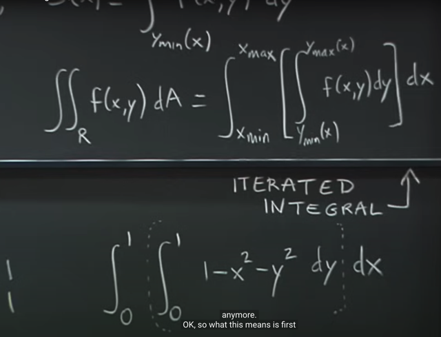</kbd></p>

> [!NOTE]
> Vậy thì bài toán này dễ vì **bound** (giới hạn) **của tích phân đều là [0,1]**
> vì yêu cầu đã xác định rõ giới hạn của y, x. Ta cứ việc theo đó mà làm.
>
> Thế thì ta sẽ cần tính: 
>
> **tích phân từ 0 đến 1** [t**ích phân từ 0 đến 1 f(x,y) dy**] **dx**
>
> hay `∫0:1` [ `∫0:1` f(x,y)dy ] dx
>
> Gs nói rằng ta **có thể tưởng tượng hoặc tự hiểu** là **có cái dấu ngoặc
> để ngăn cách tích phân** ở trong (làm theo **y trước**) với tích phân ở
> ngoài theo x sau

<br>

<a id="node-376"></a>

<p align="center"><kbd>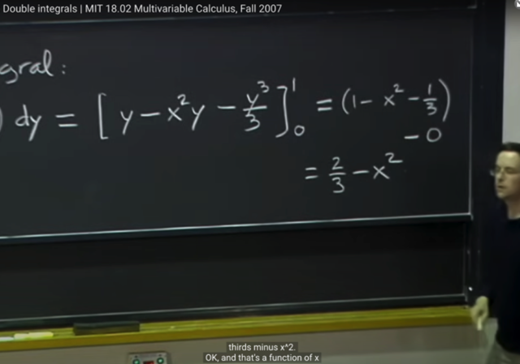</kbd></p>

<p align="center"><kbd></kbd></p>

<p align="center"><kbd>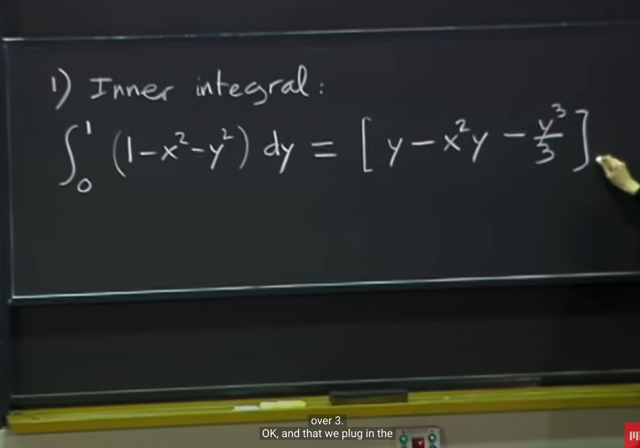</kbd></p>

> [!NOTE]
> Tính cái **inner integra**l: tích phân từ 0 đến 1 `(1-x^2` `-` y^2) dy đơn giản  là làm theo việc tính
> tích phân 1 biến mà đã học hồi cấp 3 hoặc trong 18.01.
>
> Qua **Stat110** mình cũng đã ôn lại cách tính tích phân, về cơ bản là ta dùng **Fundamental
> Theorem of Calculus Part 2**nói rằng:
>
> **tích phân từ a đến b của f(x)dx `=` [nguyên hàm của f(x)](b) `-` [nguyên hàm của f(x)](a)**hay
> nói gọn hơn, nếu **F(x) là nguyên hàm của f(x)** thì:**∫a:b f(x)dx `=` F(b) `-` F(a)**Áp dụng vào ta có để có tích phân cần tính là [**nguyên hàm của f(x,y)**] | 0:1
>
> ```text
> với f(x,y)  = 1 - x^2 - y^2 với x constant, thì nguyên hàm anti-derivative) của nó là y - y*x^2 -
> ```
> `(1/3)y^3`
>
> ```text
> Nên kết quả là [y - y*x^2 - (1/3)y^3] từ 0 đến 1 = 1 - x^2 - 1/3 = 2/3 - x^2
> ```
>
> Thế thì gs cho biết ta **có thể thấy kết quả là function theo x**, chứ **không còn theo  y nữa**.
> Và điều này là đương nhiên vì diện tích lát cắt phải chỉ còn phụ thuộc x chứ không còn phụ
> thuộc y nữa

<br>

<a id="node-377"></a>

<p align="center"><kbd>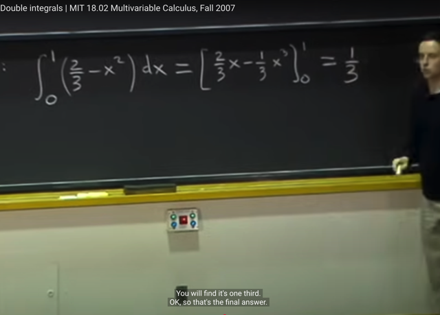</kbd></p>

> [!NOTE]
> Tiếp theo ta **tính outer integrals**, hoàn toàn dễ hiểu, cách làm
> tương tự ta tính ra `1/3`

<br>

<a id="node-378"></a>

<p align="center"><kbd></kbd></p>

> [!NOTE]
> gs cho biết lúc nãy trong**định nghĩa `(∫∫R` f(x,y)dA) ta thấy có dA**, thì
> nó **chính là dydx** khi ta tính theo **iterated integrals**
>
> Và trong ví dụ này ta **có thể tính x trước hoặc y trước** đều được
> nhưng **trong các bài toán khác** ta **phải cẩn thận** **xác định cái
> bound** của tích phân để
>
> đảm bảo **outer integral có bound là numbers** còn **inner integral có
> bound là function theo biến kia**.
>
> **Theo lí thuyết** thì ta có thể **làm theo cái nào trước cũng được** nhưng
> sự thật thì **có khi làm theo cái này trước thì dễ hơn** mà làm theo cái kia
> trước thì khó hơn

<br>

<a id="node-379"></a>

<p align="center"><kbd>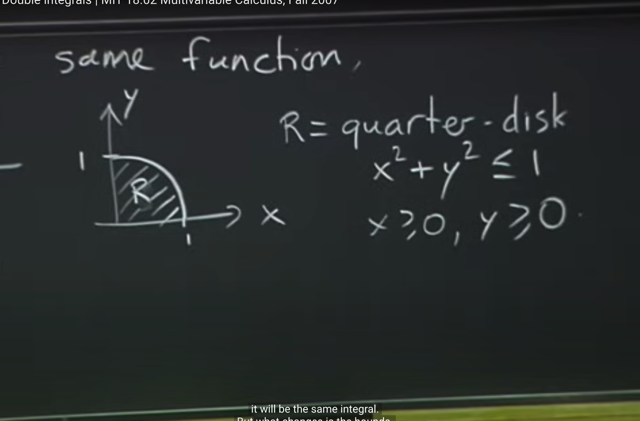</kbd></p>

> [!NOTE]
> Thế thì ví dụ tiếp theo, cũng là function này nhưng ta cần tính
> **thể tích của phần ở dưới paraboloid** nhưng **Ở TRÊN MẶT XY**.
> Có nghĩa là lúc này hình chiếu từ trên xuống, thì R không phải là
> hình vuông 1x1 mà là **góc tư hình tròn này**

<br>

<a id="node-380"></a>

<p align="center"><kbd>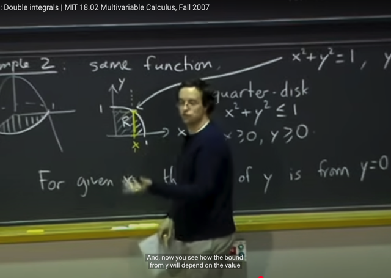</kbd></p>

> [!NOTE]
> Thế thì lúc này **bound** của tích phân **sẽ khác**. Đó là, **với giá trị
> cụ thể của x**, thì **bound của tích phân của y sẽ khác**, không **còn
> là 0 tới 1 nữa** mà là từ 0**đến sqrt(1-x^2)**
>
> ```text
> Bởi x^2+y^2 = 1 => y = +/- sqrt(1-x^2), mà xét x, y dương (từ [0:1] nên
> ```
> y `=` `sqrt(1-x^2)`

<br>

<a id="node-381"></a>

<p align="center"><kbd>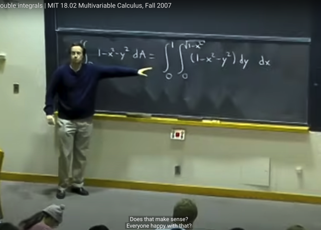</kbd></p>

> [!NOTE]
> Từ đó **bound** của **inner integral phụ thuộc x**, còn **bound của x vẫn
> là number từ 0 đến 1**. Mang ý nghĩa là với gía trị của x, hay một lát cắt
> tại x, song song với plane yz, thì **bound của y từ 0 đến sqrt(1-x^2)**.
>
> Còn các lát cắt sẽ kéo dài từ nơi có **x `=` 0** đến nơi có **x `=` 1**
>
> Hay với**inner integral** câu hỏi là với giá trị given x ứng với một slice
> thì **y sẽ từ đâu đến đâu**. Còn với **outer integral** thì câu hỏi là **slice đầu
> tiên ở đâu và slice cuối cùng ở đâu?**

<br>

<a id="node-382"></a>

<p align="center"><kbd>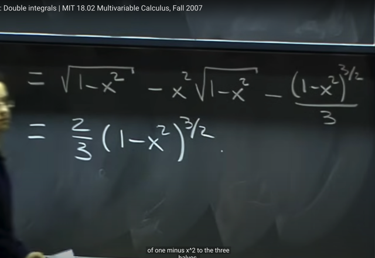</kbd></p>

> [!NOTE]
> Và ta cũng chỉ đơn giản là**tính inner integral** trước: bằng các **xác định
> nguyên hàm** của**1 `-` x^2 `-` y^2** đó là y `-` x^2*y `-(1/3)y^3` và**thế y `=`
> sqrt(1-x^2)** và **y `=` 0** vào
>
> ```text
> Để có sqrt(1-x^2) - x^2*sqrt(1-x^2) -(1/3)(sqrt(1-x^2))^3/2
> ```
>
> thu gọn thành `(2/3)(1-x^2)^3/2`

<br>

<a id="node-383"></a>

<p align="center"><kbd>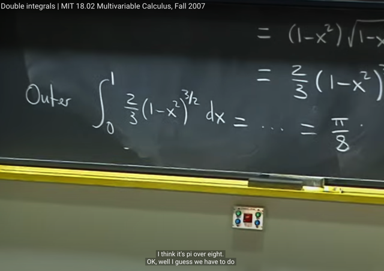</kbd></p>

> [!NOTE]
> và sau đó ta tính outer integral gs đề nghị tự tính xem có ra
> `π/8` không

<br>

<a id="node-384"></a>

<p align="center"><kbd>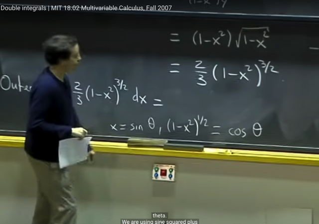</kbd></p>

> [!NOTE]
> gs giải luôn, ông cho rằng ta sẽ dùng **substitution trick** `-` là cái
> mà ông nói rằng ông chỉ biết đó là**cách duy nhất để giải tích
> phân này**
>
> Đặt **x `=` sin(θ)** thì (**1-x^2)^1/2 `=` cos(θ)**

<br>

<a id="node-385"></a>

<p align="center"><kbd>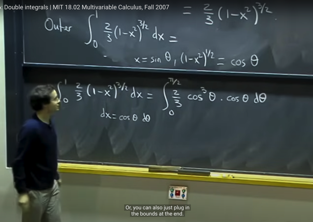</kbd></p>

> [!NOTE]
> Áp dụng vi phân: **dx `=` cos(θ)dθ**
>
> ```text
> (hoặc nói là: Đạo hàm hai vế theo theta: (d/dθ)x = (d/dθ) sin(theta)
> ```
>
> ```text
> <=> dx/dθ = cos(θ) <=> dx = cos(θ)dθ)
> ```
>
> và **bound x từ 0 đến 1** sẽ ứng với bound **θ từ 0 đến pi/2**
>
> thế vào ta có **tích phân `0:π/2` `(2/3)cos(θ)^3.cos(θ).dθ`
>
> `=` tích phân `0:π/2` (2/3)cos(θ)^4.dθ**

<br>

<a id="node-386"></a>

<p align="center"><kbd>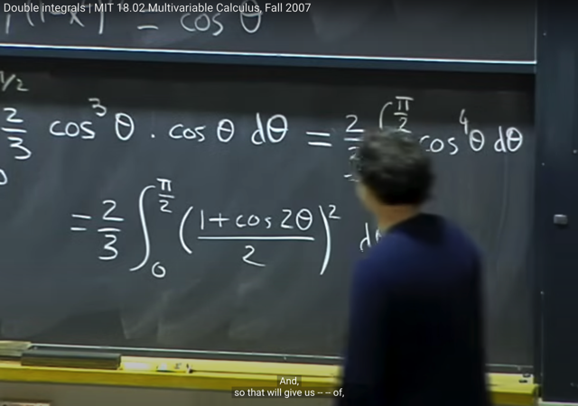</kbd></p>

> [!NOTE]
> Tiếp để tính tích phân này ta cần dùng công thức
> [cos(theta)]^2 `=` `(1+cos(2theta))/2`

<br>

<a id="node-387"></a>

<p align="center"><kbd>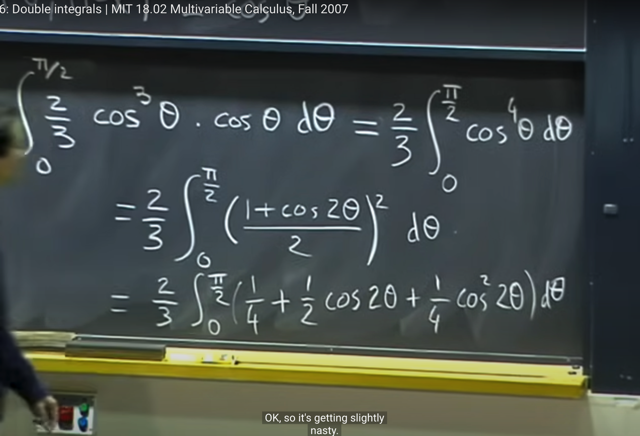</kbd></p>

> [!NOTE]
> Triển khai `[(1+cos2theta)/2]^2` ra
>
> Và với cái [cos(2theta)]^2 ta tiếp tục dùng công thức cos(2theta)]^2 `=`
> `[1+cos(4theta)]/2` để không còn lũy thừa nữa. Khi đó tính tích phân
> sẽ ra `π/8` (gs không làm vì mất thời gian)

<br>

<a id="node-388"></a>

<p align="center"><kbd></kbd></p>

> [!NOTE]
> Và bài sau ta sẽ học **POLAR COORDINATE** sẽ
> gíup giải bài toán này dễ hơn

<br>

<a id="node-389"></a>

<p align="center"><kbd>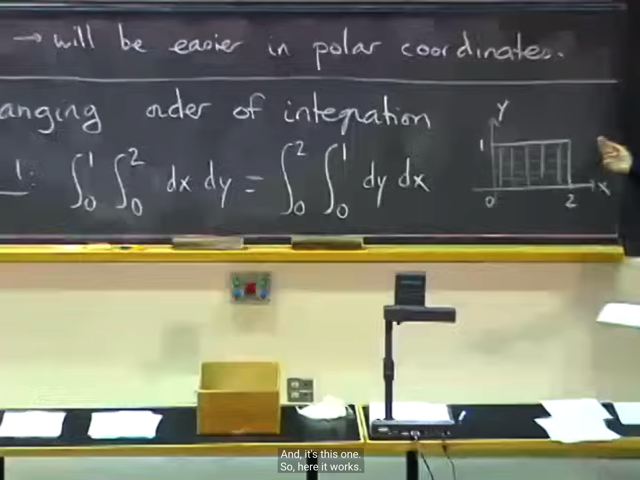</kbd></p>

> [!NOTE]
> Tiếp gs nói về việc **thay đổi thứ tự tính tích phân**
>
> Ví dụ trong bài toán này ta có thể đổi: tính theo **y trước** hoặc
> tính theo **x trước**
>
> Bởi **với vị trí nào của y** thì **range của x cũng đều là 0:2** và **vị trí
> nào của x** thì **range của y đều từ 0:1**

<br>

<a id="node-390"></a>

<p align="center"><kbd>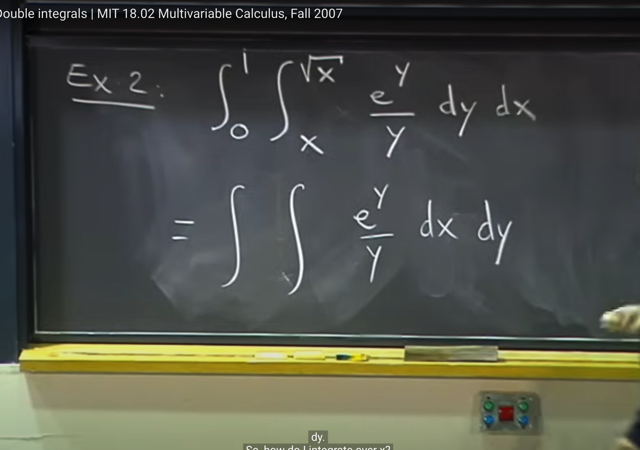</kbd></p>

> [!NOTE]
> Ta qua ví dụ này, đại khái là gs cho biết **KHÔNG CÓ CÁCH NÀO ĐỂ
> TÍNH INNER INTEGRAL** (tích phân từ x: sqrt(x) **e^y/y dy**) hết
>
> Do đó **nếu tính y trước**, ta sẽ **stuck**.
>
> Vì vậy ta phải **EXCHANGE ORDER**. MÀ MUỐN VẬY TA**PHẢI HIỂU
> Ý NGHĨA CỦA BOUND CỦA TÍCH PHÂN HIỆN TẠI**

<br>

<a id="node-391"></a>

<p align="center"><kbd>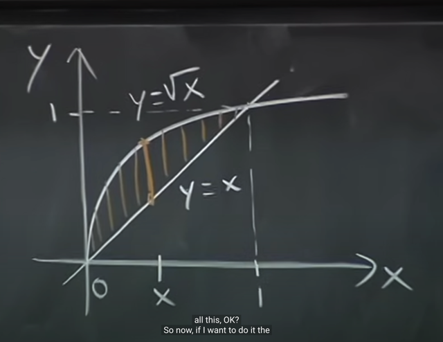</kbd></p>

> [!NOTE]
> Ý nghĩa của cái bound trong ví dụ này đó là, với giá trị x cho trước thì y 
> sẽ từ y `=` **x** đến y =**sqrt(x)**. Và **x thì từ 0 đến 1**. Nên R trong bài toán
> tích phân này là vùng gạch sọc

<br>

<a id="node-392"></a>

<p align="center"><kbd>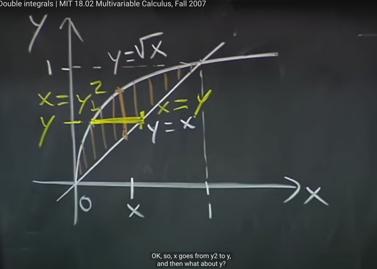</kbd></p>

> [!NOTE]
> Thế thì **để đổi vị trí** thành tính tích phân với **x trước** ta phải X**ÁC ĐỊNH
> LẠI BOUND**. VÀ BOUND CỦA **INNER** INTEGRAL SẼ CÓ Ý NGHĨA
> LÀ: **CHO TRƯỚC Y, THÌ X TỪ ĐÂU ĐẾN ĐÂU**
>
> Thế thì dễ thấy với given y, x sẽ từ **x `=` y^2 đến x `=` y**
> Còn **y** thì có range từ **0 đến 1** (outer integral bound)

<br>

<a id="node-393"></a>

<p align="center"><kbd>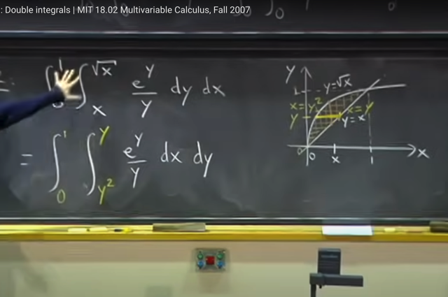</kbd></p>

> [!NOTE]
> Và khi đó tích phân trở
> nên dễ tích hơn nhiều

<br>

<a id="node-394"></a>

<p align="center"><kbd>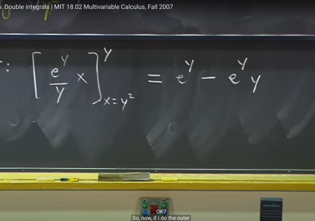</kbd></p>

> [!NOTE]
> Inner integral: dễ thấy **nguyên hàm của e^y/y** (hàm theo x)
> sẽ chỉ là **(e^y/y)x (coi `e^y/y` là constant)**
>
> nên ta có `[e^y/y]x` | y^2 : y `=` **e^y `-` e^y*y**

<br>

<a id="node-395"></a>

<p align="center"><kbd>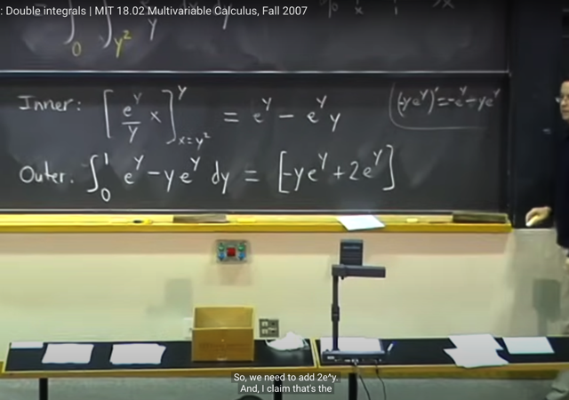</kbd></p>

> [!NOTE]
> Tiếp, tính**outer integral: `∫(e^y` `-` y*e^y)dy `=` `∫e^ydy` `-` ∫y*e^ydy**
>
> Thế thì dựa vào **product rule** (ye^y)' `=` y'e^y `+` y(e^y)' 
>
> `=` 1*e^y `+` y*e^y `=` e**^y `+` y*e^y**
>
> nên: 
>
> ```text
> - (y*e^y)' = - e^y - y*e^y
> ```
>
> Cộng 2 vế cho 2e^y: 2e^y `-` (y*e^y)' `=` e^y `-` y*e^y 
>
> thì 2e^y là derivative của 2e^y. Nên thành ra vế trái là 
>
> (2e^y)' `-` (y*e^y)' `=` e^y `-` y*e^y 
>
> ```text
> <=> (2e^y - y*e^y)' = e^y - y*e^y
> ```
>
> Do đó nguyên hàm của e^y `-` y*e^y là **2e^y `-` y*e^y**Gs cho rằng cũng có thể làm bằng**integration by part** cũng ra kết quả trên

<br>

<a id="node-396"></a>

<p align="center"><kbd>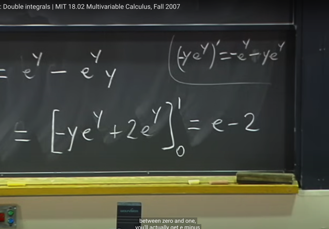</kbd></p>

> [!NOTE]
> Kết quả ta có `e-2`

<br>

