# Lec 17: Double Integrals In Polar Coordinates

📊 **Progress:** `21` Notes | `21` Screenshots

---

<kbd>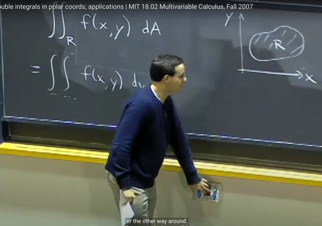</kbd>

> [!NOTE]
> Đầu tiên gs review lại bài trước ta đã học về ý nghĩa của double integral
> trong vùng R của f(x,y)dA đó là ta chia vùng R thành các vùng nhỏ
> delta_A và ứng với mỗi vùng sẽ có chiều cao là f(x,y). Thì double
> integral sẽ là thể tích của vùng dưới đồ thị hàm f sẽ được tính bằng
> cách đầu tiên lấy sum các thể tích f(x,y)delta_A này và sau đó là ta lấy
> limit của nó khi cho delta_A -> 0
>
> Sau đó ta cũng đã biết là khi tính ta sẽ chuyển nó thành iterated integral:
> tính lần lượt inner integral và sau đó là outer integral

 

<kbd>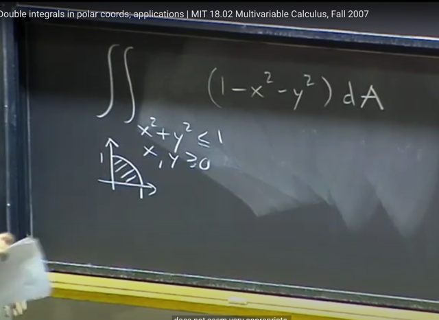</kbd>

> [!NOTE]
> Thế rồi trong bài trước ta thử tính tích phân này. Và cho thấy ta phải
> dùng một số trick và vẫn khá dài dòng. Thì gs cho rằng lí do là bởi
> trong bài toán này việc dùng Cartesian coordinate x,y không phù
> hợp lắm.
>
> Nên nay ta sẽ dùng Polar coordinates

 

<kbd>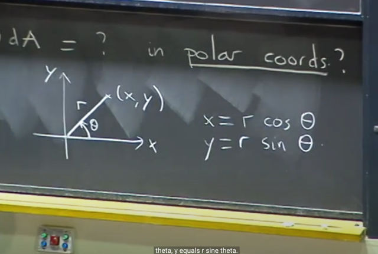</kbd>

> [!NOTE]
> Thế thì, ta đã biết Polar coordinate một điểm (vector) sẽ
> được represent bởi r và theta. Và liên hệ giữa x, y và r,
> theta là: x = r*cos(theta), y = r*sin(theta)

 

<kbd>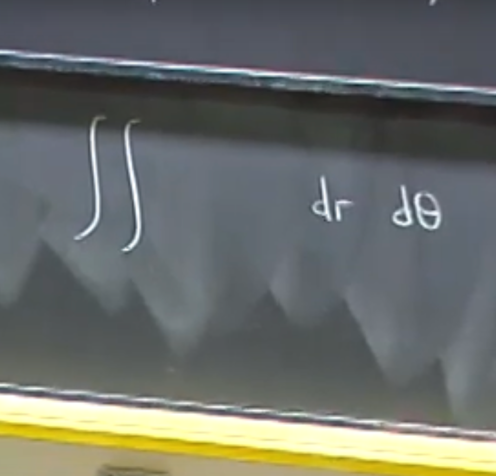</kbd>

> [!NOTE]
> Thế thì ta sẽ tính double integral trong Polar coords tức
> là tích phân sẽ là ...dr d_theta
>
> Và gs cho biết đây là thứ tự mà người ta hay dùng khi
> dùng Polar coordinate

 

<kbd>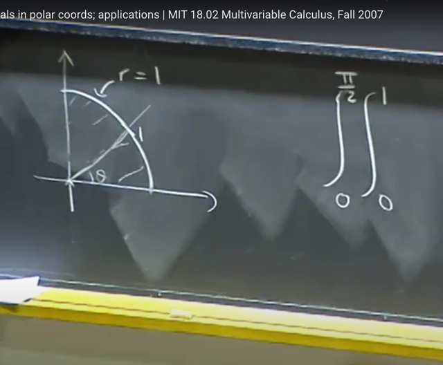</kbd>

> [!NOTE]
> Vậy đầu tiên ta cần xác định bound của tích phân. Thế thì inner
> integral, như đã biết, sẽ mang ý nghĩa là với một giá trị theta fixed,
> thì r sẽ có range như thế nào.
>
> Dễ thấy ở đây, theta bằng bao nhiêu thì r sẽ đều có range từ 0 đến 1
> là bán kính (paraboloid z = 1 - x^2 - y^2 cắt plane xy ở một đường
> tròn bán kính 1)
>
> Còn range của theta cũng dễ thấy là từ 0 đến pi/2

 

<kbd>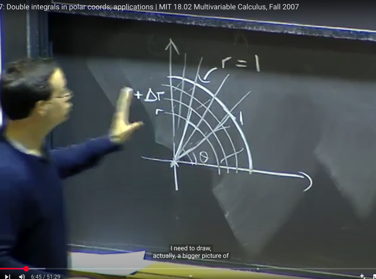</kbd>

> [!NOTE]
> Thế thì gs cho rằng, **không như trong x, y coordinates**, thì
> **delta_x*delta_y** hay **delta_y*delta_x chính là delta_A** (để khi ->
> 0 thì dxdy chính là dA)
>
> Còn ở đây, **delta_r. delta_theta KHÔNG PHẢI LÀ delta_A**

 

<kbd>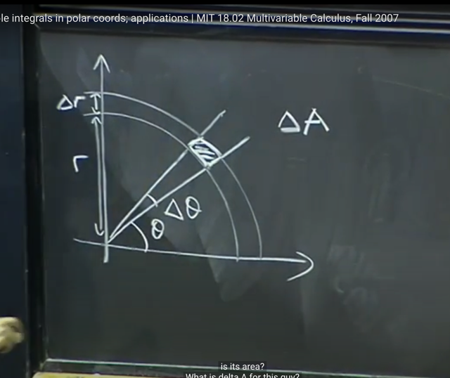</kbd>

> [!NOTE]
> Do đó ta **cần xác định cách tính vùng delta_A trong Polar coordinate:** 
> bao bởi bởi **r** và**r + delta_r**, **theta** và **theta + delta_theta**
>
> Thử trả lời:
>
> Đầu tiên ta sẽ tính chênh lệch diện tích của hình tròn bán kính r+delta_r
> và hình tròn bán kính r. Sẽ là: 
>
> pi*(r+delta_r)^2 - pi*r^2 = pi*(r^2 + delta_r^2 +2*r*delta_r) - pi*r^2
>
> = **pi*delta_r^2 + pi*2*r*delta_r**
>
> Và sau đó để tính diện tích delta_A là vùng trên hình vành khuyên vừa rồi
> nhưng giới hạn bởi góc delta_theta, ta cần **nhân nó cho delta_theta / 2pi**
>
> => delta_A = (pi*delta_r^2 + pi*2*r*delta_r) *delta_theta / 2pi
>
> Với delta_r^2 ~= 0 (vì nó là **bậc 2 của đại lượng vô cùng nhỏ delta_r**
> nên ta có thể **bỏ đi**)
>
> Kết quả delta_A = pi*2*r*delta_r * delta_theta / 2pi = **r*delta_r*delta_theta**

 

<kbd>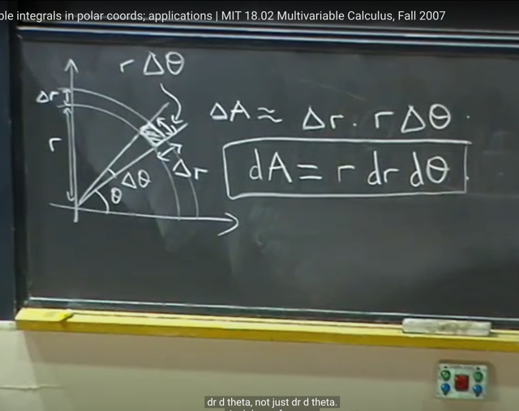</kbd>

> [!NOTE]
> Gs: Đúng là vậy, ta có thể giải cách khác **coi delta_A như hình chữ
> nhật cạnh delta_r, và cạnh kia là r*delta_theta** (chiều dài cung = bán
> kính*góc)
>
> Nên **delta_A = delta_r * delta_theta * r**
>
> Và khi chúng nhỏ về 0 thì ta có
>
> **dA = r*dr*d_theta**Và đây**là cái cần nhớ khi tích phân trong Polar coordinates**.
>
> Ta sẽ **cần xác định lại bound** cũng như **thay dA là r*dr*d_theta**
> chứ không chỉ dr*d_theta

 

<kbd>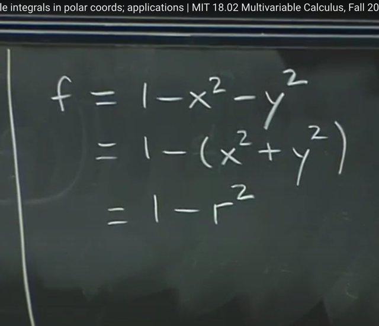</kbd>

> [!NOTE]
> Thế thì ta cần **chuyển f(x,y) thành f(r, theta)**.
>
> Đương nhiên có thể dùng **x = r*cos(theta), y = r*sin(theta)** thế vào,
> nhưng cũng có thể **quan sát thấy x^2 + y^2 chính là r^2** để ta có
> ngay**f = 1 - r^2**

 

<kbd>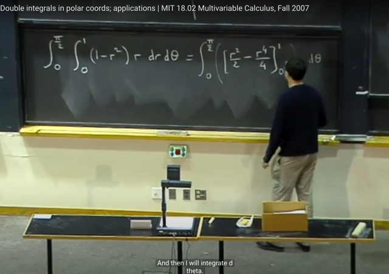</kbd>

> [!NOTE]
> Rồi, tích phân trở thành như thế này. Hoàn toàn đơn giản, ta sẽ tính
> inner integral trước và dễ thấy nguyên hàm của (1-r^2)r là (r^2/2 - r^4/4)
> -> inner integral = (r^2/2 - r^4/4) | 0 : 1

 

<kbd>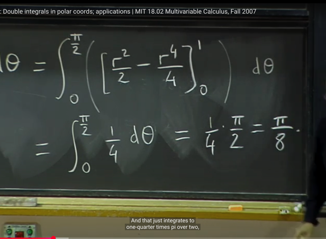</kbd>

> [!NOTE]
> Kết quả là 1/4. từ đó tính outer
> integral: (theta/4) | 0:pi/2 = **pi/8**

 

<kbd>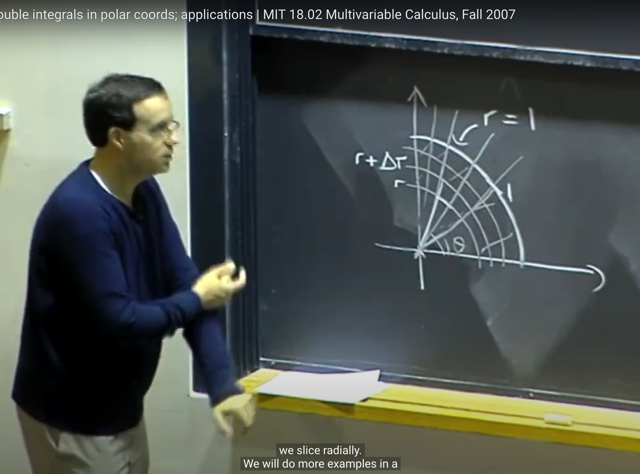</kbd>

> [!NOTE]
> gs nhắc lại là **99% trường hợp ta sẽ outer integrate với theta** và
> **inner integrate với r**.
>
> Nên đầu tiên ta sẽ cần xác định inner bound với ý nghĩa là: **với theta
> fixed**, thì **r có range gì**, sau đó outer integral bound là range của theta

 

<kbd>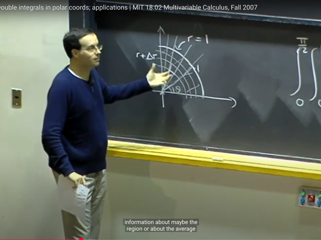</kbd>

> [!NOTE]
> gs cho rằng **tuy ta nói ý nghĩa của integral** là **diện tích vùng dưới
> function** (hàm đơn biến) hay **thể tích** (hàm 2 biến)
>
> Nhưng **phần lớn các trường hợp** ta sẽ dùng nó để tính T**ỔNG CỦA
> FUNCTION VALUE TRÊN MỘT VÙNG / MIỀN NÀO ĐÓ**
>
> Ví dụ như khi ta **cần tính trung bình của function** chẳng hạn. Và đây là
> ứng dụng mà ta thấy trong Stat110 dùng nhiều khi ta cần tính
> **expected value**

 

<kbd>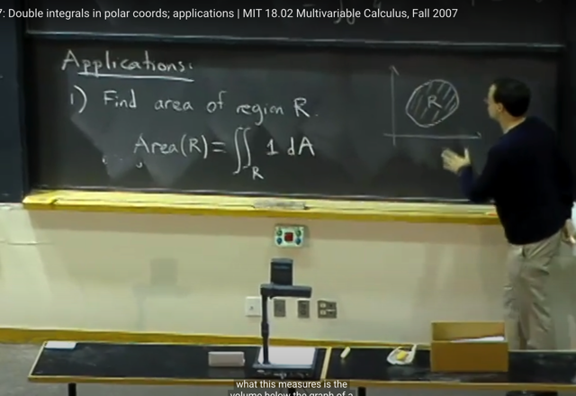</kbd>

> [!NOTE]
> **Một ứng dụng** của double integral là, **tìm diện tích của vùng R**.
>
> Giả sử ta **có vùng R** thì **tuy ta có thể set up nó thành bài toán tích
> phân một biến để tính diện tích**(ý là bằng cách tính diện tích của vùng
> phía dưới "đường phía trên" trừ đi diện tích vùng phía dưới " đường
> phía dưới")
>
> Nhưng ta cũng có thể **làm cách dễ hơn** là **coi nó như  việc tính thể
> tích của vùng dưới hàm 2 biến f(x,y) với điểm đặc biệt là f(x,y)** **= 1**.
> Bởi khi đó thể tích của nó chính là bằng diện tích của cái đáy - là cái
> vùng R cần tìm diện tích. (Giống như ta tìm**thể tích của hình hộp có
> độ cao 1** thì chính là **diện tích của đáy hộp**)
>
> Vậy ta sẽ tính: **tích phân trong vùng R 1*dA**
>
> Thì thể tích này  cũng chính là diện tích của R.

 

<kbd>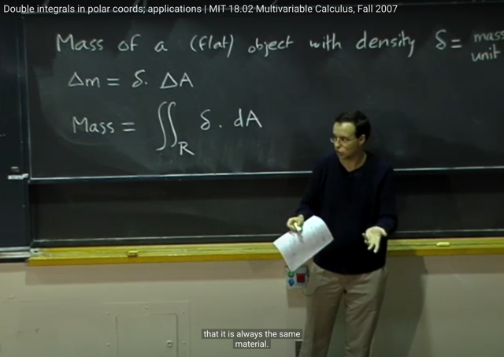</kbd>

🔗 **Related:** [LEC 22: GREEN'S THEOREM](untitled.md#node-575)

> [!NOTE]
> Một **ứng dụng tương tự** là ta có thể **tính khối lượng của một object**
> **phẳng diện tích R**, mật độ **delta** (có thể là **constant**, hoặc là function 
> tùy thuộc vị trí)
>
> Khi đó bằng cách**tích phân kép trên vùng R delta.dA** sẽ cho ta khối
> lượng của object. (nếu theta = constant thì nó sẽ là theta*diện tích R
> còn không  thì nó vẫn giúp ta tính khối lượng của object )

 

<kbd>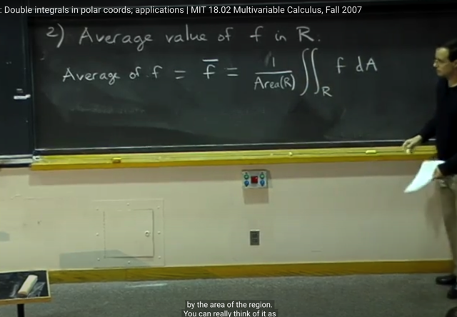</kbd>

> [!NOTE]
> Một **ứng dụng quan trọng** nữa đó là **giúp tính Average value** của
> function f trong vùng / miền R
>
> Định nghĩa đó là:
>
> Average of f = f_bar = [1/Area(R)] double integral over R f*dA

 

<kbd>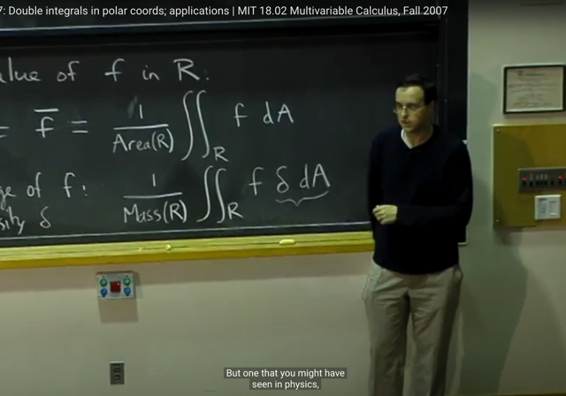</kbd>

> [!NOTE]
> Và nếu đại khái là **các giá trị hàm f không equally likely** (tức có
> vai trò quan trọng hay khả năng xảy ra như nhau) thì khi đó ta có
> **WEIGHTED AVERAGE**
>
> [1/Mass(R)] tích phân kép trong vùng R f*delta*dA
>
> Với delta là density đóng vai trò như trọng số weight
>
> Và đây là ứng dụng quan trọng mà ta đã thấy giúp tính Expected
> value của continuous random variable. Ví dụ như khi random variable
> X có PDF f(x) thì average value, với định nghĩa chung là weighted 
> average của các / mọi possible value của X, với weight là xác suất
> mà r.v mang possible value đó, thì với continuous r.v nó sẽ là:
>
> tích phân từ -infinity:infinity xf(x)dx trong đó f(x) là PDF.

 

<kbd>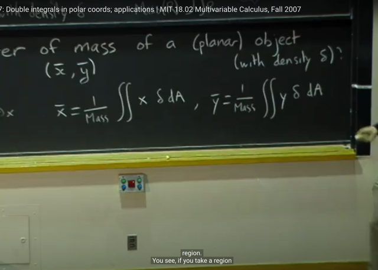</kbd>

🔗 **Related:** [LEC 22: GREEN'S THEOREM](untitled.md#node-575)

> [!NOTE]
> một ứng dụng nữa là**giúp tính vị
> trí (tọa độ) của trọng tâm**.

 

<kbd>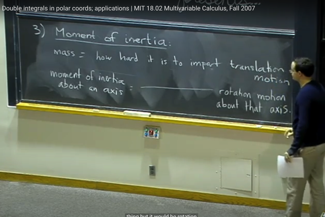</kbd>

> [!NOTE]
> Thế thì, ta qua**ứng dụng thứ 3** nói về **MÔ MEN QUÁN TÍNH
> (Moment of inertia)**. Gs cho biết đại khái là **khối lượng** (mass) sẽ
> liên quan đến việc "**cần bao nhiêu nỗ lực để khiến vật thể chuyển
> động**" thì **mô men quán tính** sẽ liên quan đến việc là **cần bao nhiêu
> nỗ lực để xoay một vật quanh trục**

 

<kbd>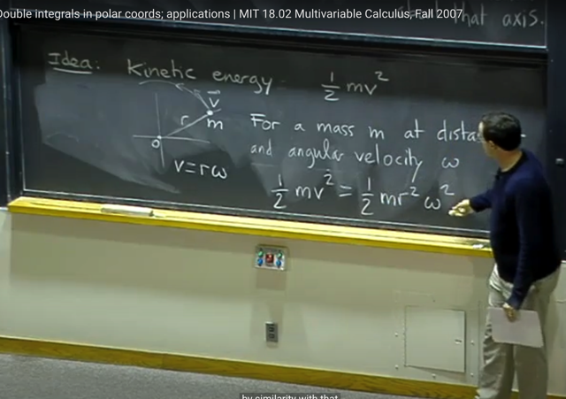</kbd>

> [!NOTE]
> Thế thì đại khái là nói về **định nghĩa moment quán tính trong vật lí**
> Ta có vật khối lượng **m** **quay quanh tâm O** với **vận tốc góc** **omega** với
> khoảng cách **r**. Thì **động năng là 1/2 m v^2** với v = r*omega thì động
> năng bằng 1/2mr^2omega^2 thì khi đó **mr^2 chính là moment quán
> tính**

 

<kbd>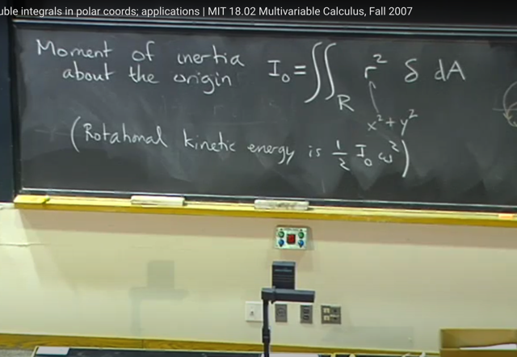</kbd>

> [!NOTE]
> Những phần tiếp theo chủ yếu về các ví dụ dụ tính
> moment quán tính nên tạm bỏ qua

 

