# Lec 18: Change Of Variables

📊 **Progress:** `34` Notes | `38` Screenshots

---

<kbd>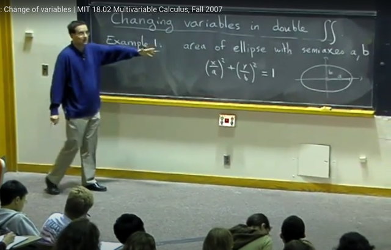</kbd>

> [!NOTE]
> Đại khái là ta sẽ học về **Change variables** trong bài toán **tính double
> integral**. Đầu tiên là ví dụ 1, ta cần dùng double integral để t**ính diện
> tích của hình elip** có hai t**ham số a,b**. Phương trình của elip là **(x/a)^2
> + (y/b)^2 = 1**
>
> Điều này cũng có nghĩa là **những điểm bên trong elip** sẽ có **(x/a)^2
> + (y/b)^2 < 1**

 

<kbd>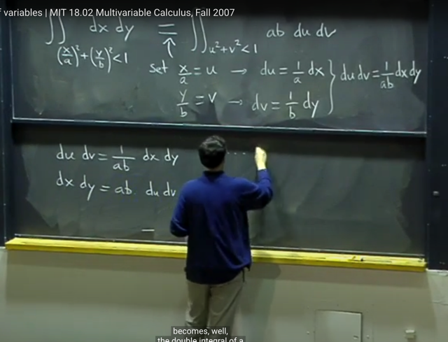</kbd>

> [!NOTE]
> Thế thì đại khái là **để tính diện tích elip**, theo ứng dụng của tích phân
> kép bài trước ta đã biết là có thể dùng để tính diện tích) ta có:
>
> **Diện tích = Tích phân kép trong vùng R của 1*dx*dy với R được định
> nghĩa bởi (x/a)^2 + (y/b)^2 < 1**Và ta có thể **tìm bound của inner integral** bằng cách**giải x theo y**
> và bound của outer integral là **number**
>
> Tuy nhiên ta có thể thấy, nó sẽ khá (dài dòng và khó) nasty. Thay vào đó
> ta có thể nghĩ đến việc dùng **Polar** coordinates. Thì ở đây **cũng
> không được**,  vì đây **không phải hình tròn** mà là hình elip.
>
> Do đó gs mới **làm động tác change variable** (mà ông nói thêm viêc
> **chuyển qua Polar coordinate** **cũng là change variable** nhưng **còn
> nhiều kiểu khác** nữa mà ta sẽ học ở bài này)
>
> Thế thì đặt **(x/a) = u** ta sẽ có **du = dx/a**, **(y/b) = v**, ta sẽ có **dv = dy / b**
>
> Và từ đó **vùng R được định nghĩa theo u**, **v** là **(u^2 + v^2) < 1**
>
> Và **dudv = dxdy/ab** nên **dxdy = ab*dudv**
>
> Từ đó diện tích ta cần tính **tích phân kép trong vùng R = u^2+v^2<1
> của ab*dudv**

 

<kbd>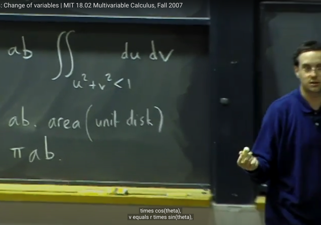</kbd>

> [!NOTE]
> Vì **ab là constant** nên **đưa ra ngoài** ta còn:
>
> tích phân kép trong vùng u^2+v^2<1 của dudv
>
> Và nó trở thành / **chính là bài toán tính diện tích của hình tròn bán
> kính 1**: tích phân kép trong vùng x^2+y^2<1 dxdy, mà ta đã tính ở
> bài trước ra kết quả là **pi**(Mà để tính thì ta sẽ chuyển sang polar coordinate để thành tích
> phân 0 đến pi tích phân 0 1 của r dr d_theta)**Vậy đáp án là ab*pi**

 

<kbd>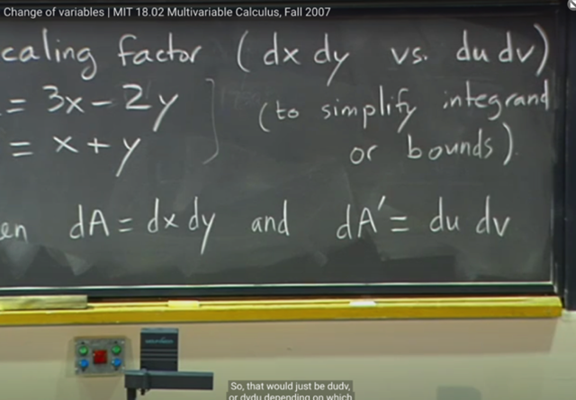</kbd>

<kbd></kbd>

<kbd>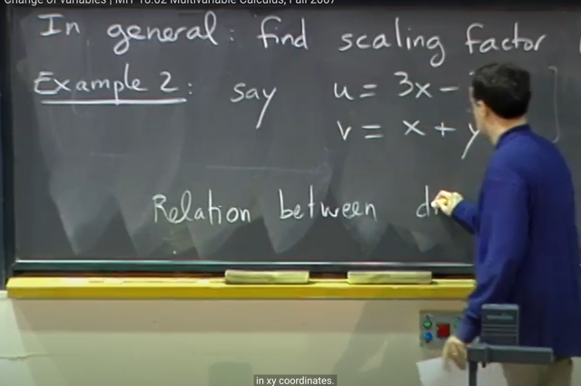</kbd>

> [!NOTE]
> Khái quát lên,**khi đổi biến** (change variable) ta **cần tìm scaling factor giữa dxdy và dudv**. 
>
> Lấy ví dụ 2 với u = 3x - 2y, v = x + y.
>
> Gs nói thêm đại khái là **lí do ta muốn đổi biến** có thể là **vì đơn giản hóa vấn đề**
> hoặc là **đơn giản hóa ranh giới** của tích phân (integral bound)
>
> Vậy việc ta **cần tìm scaling factor giữa dxdy và dudv** hay giữa **dA và dA' (=dudv)**

 

<kbd>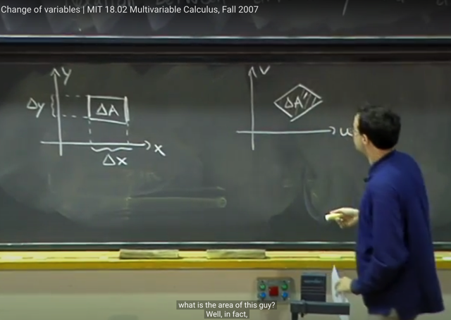</kbd>

> [!NOTE]
> Thế thì đại khái là ta sẽ p**hân tích relation giữa delta_A và delta_A'**.
>
> Biểu diễn **bằng hình học** thì là khi change variable**từ x, y sang u,
> v** thì **delta_A từ hình chữ nhật** trở thành **hình bình hành delta_A'**
>
> Ví dụ như từ **u = 3x - 2y**, **v = x + y** ta có thể thấy rằng:
>
> **Rate of change của u w.r.t y** là **bằng** **-2,** và nó **không phụ
> thuộc x**
>
> (Ý là partial u / partial y = -2, trong lecture 2 của 18.01 ta đã học một
> góc nhìn / định nghĩa / cách hiểu thứ 2 của derivative: là rate of change
> tức là tỉ lệ của [khoảng thay đổi của u] / [khoảng thay đổi của y])
>
> Điều này có nghĩa là **dù x bằng bao nhiêu** thì khi **y thay đổi
> delta_y** thì **u luôn thay đổi (-2)*delta_y.**
>
> Do đó gs nói vì vậy mà đại khái là, **hai cạnh delta_y của hình chữ
> nhật** sẽ **trở thành hai cạnh bằng nhau và song song của hình bình
> hành** (nếu chưa hiểu thì chú ý rằng, đã nói rate of change của u đối với
> y không phụ thuộc x, nên dù cái cạnh mà song song với trục y có nằm
> ở đâu (theo x), hay cụ thể là hai cạnh bên (song song trục y) của hình 
> chữ nhật sẽ đều tạo ra hai cạnh vẫn song song và bằng nhau trong hình
> bình hành deltaA' (góc vuông có thể bị thay đổi để trở thành hình bình
> hành, nhưng hai cạnh đối vẫn bằng nhau, và từ đó trở thành hình bình
> hành)

 

<kbd>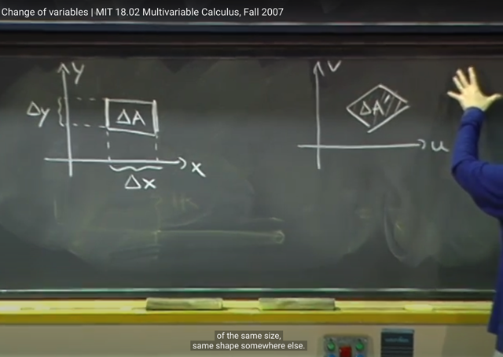</kbd>

> [!NOTE]
> Rồi thế thì ta **cần tìm liên hệ giữa delta_A và delta_A**': Thì gs cho rằng
> ta biết p**hép biến đổi này nó không phụ thuộc vị trí của delta_A**. Ví dụ
> nếu **delta_A nằm chỗ khác** thì phép biến đổi tuyến tính cũng sẽ cho ra
> **delta_A' cùng diện tích**nhưng**nằm chỗ khác**.
>
> **Do đó** gs cho rằng ta **có thể dùng một delta_A đơn giản nhất**, để
> **xem thử delta_A' có diện tích bao nhiêu** từ đó ta **SUY RA CONSTANT
> FACTOR** liên kết detla_A và delta_A'

 

<kbd>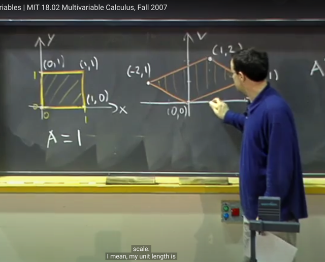</kbd>

> [!NOTE]
> Thế thì **delta_A đơn giản nhất chính là unit square**. Đương nhiên là ta
> biết diện tích là 1
>
> Và **thông qua phép đổi biến** u = 3x - 2y, v = x + y ta thấy**unit square
> trong xy coordinate** trở thành **hình bình hành như vầy trong u,v
> coordinate.
>
> Và chỉ cần tính diện tích của hình bình hành thì nó chính là constant
> factor (giữa dA và dA')**

 

<kbd>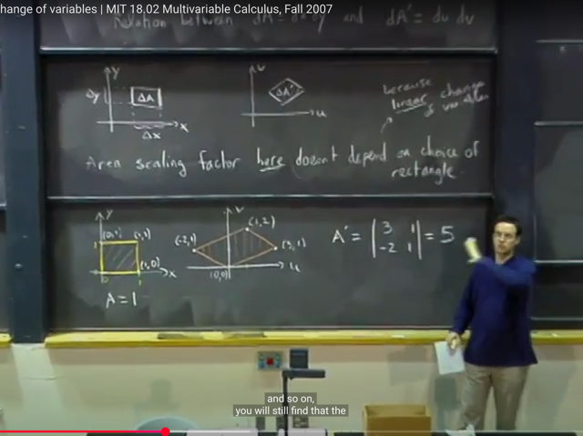</kbd>

🔗 **Related:** [LEC 2: DETERMINANT, CROSS PRODUCT](untitled.md#node-15)

> [!NOTE]
> Và từ bài 2, ta đã biết determinant của hai vector sẽ là diện tích hình
> bình hành diện tích của hình bình hành này **có thể được tính bởi
> determinant của hai vector cạnh** của nó, ta lấy vector (-2, 1) và (3,
> 1). Tính ra kết quả là 5

 

<kbd>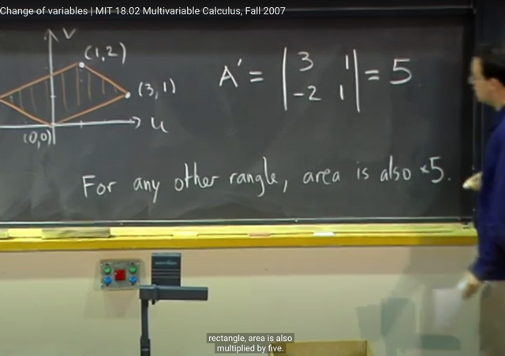</kbd>

> [!NOTE]
> Và gs cho rằng **dù lấy delta_A là hình rectangle nào** thì **delta_A'
> cũng có diện tích gấp 5 lần**

 

<kbd>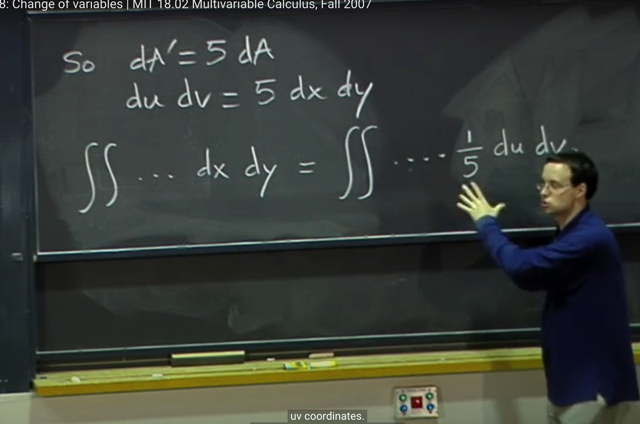</kbd>

> [!NOTE]
> Do đó **dudv = 5dxdv**, nên khi chuyển double integral từ
> x, y sang u, v thì ta sẽ **thay dxdy bằng (1/5)dudv**.
>
> Đương nhiên**function trong tích phân cũng theo u, v** và
> **bound của integral**cũng vậy.

 

<kbd>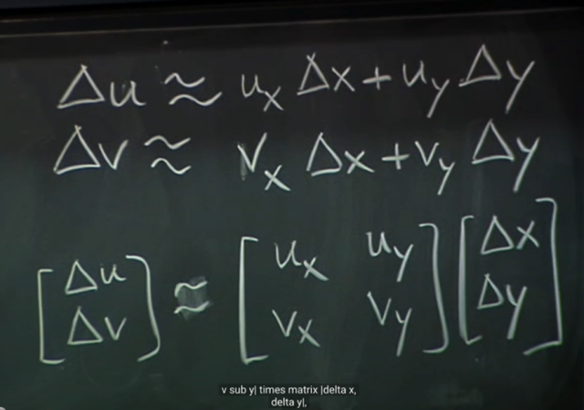</kbd>

<kbd></kbd>

<kbd>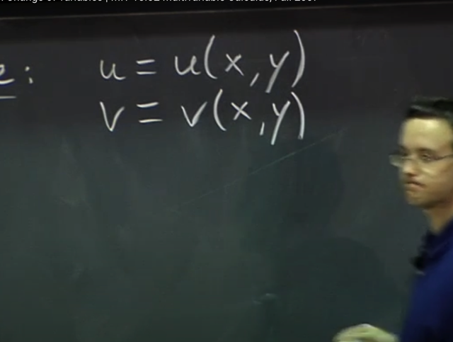</kbd>

🔗 **Related:** [Như vậy ta hiểu là trong 1801 implicit differentiation là ta apply d/dx vào hai vế, mà ý nghĩa CHÍNH LÀ LẤY ĐẠO HÀM THEO X HAI VẾ.   y = f(x) => (d/dx) y = (d/dx) f(x) <=> \\*dy/dx = f'(x)\\*  Còn 18.02 thì implicit differentiation thể hiện bằng cách  LẤY VI PHÂN HAI VẾ  y = f(x) <=> \\*dy = f'(x) dx\\*  Và chúng cùng bản chất, chẳng qua cách thể hiện theo vi phân  sẽ chuẩn bị cho ta bước qua khái niệm VI PHÂN TOÀN PHẦN (TOTAL DIFFERENTIAL)](untitled.md#node-224)

🔗 **Related:** [Đại khái là ta \\*có thể thấy TẠI SAO SCALING FACTOR LÀ DET CỦA  MATRIX\\* \\*OF PARTIAL DERIVATIVE\\*  Từ điều ta có hồi nãy, vector <Δx, Δy> liên hệ với <Δu, Δv> thông matrix:   <Δu, Δv> ~= matrix [u_x, u_y; v_x, v_y] . <Δx, Δy>  Thì cái này có nghĩa là: một vector <Δx, Δy> sẽ tương ứng với vector <Δu, Δv> = [u_x, u_y; v_x, v_y] . <Δx, Δy> khi đổi biến từ x,y sang u,v.  Do đó, vector <Δx, 0> (là cạnh vertical của hình vuông trong x,y coordinate) sẽ ứng với / trở thành vector Δx * <u_x, v_x>  + 0 * <u_y, v_y> (nhân <Δx, 0> với matrix [u_x, u_y; v_x, v_y] theo góc nhìn linear combination các matrix column) và bằng <Δx * u_x, Δx * v_x> hay \\*<u_x*Δx, v_x*Δx>\\*  Tương tự, vector <0, Δy> (là cạnh horizontal của hình vuông trong x,y coordinate) sẽ tương ứng vector 0 * <u_x, v_x>  + Δy * <u_y, v_y> = <Δy * u_y, Δy * v_y> hay \\*<u_y*Δy, v_y*Δy>\\*  Để rồi từ delta_A =\\* Δ*Δy\\*, transformed thành delta_A' =   = \\*determinant của hai vector <u_x*Δx, v_x*Δx> và <u_y*Δy, v_y*Δy>\\*   Đây là kiến thức đã học (theo link) rằng diện tích của hình bình hành tạo bởi hai vector a = <a1, a2> và b = <b1, b2> chính là determinant của hai vectors a1b2 - a2b1  Và ở đây nó bằng: u_x*Δx*v_y*Δy - u_y*Δy*v_x*Δx  = \\*(u_x*v_y - u_y*v_x)*Δx*Δy  Thế thì (u_x*v_y - u_y*v_x) CHÍNH LÀ DETERMINANT CỦA TRANSFORM MATRIX [u_x, u_y; v_x, v_y]\\*](untitled.md#node-434)

> [!NOTE]
> Thế thì ta đã biết **nếu f là function theo x, y** thì **TOTAL DIFFERENTIAL**cho ta:
>
> **df = f_x*dx + f_y*dy**.
>
> Và khi**thay df, dx, dy** bằng **delta_f, delta_x, delta_y** ta sẽ có
> **LINEAR APPROXIMATION**:
>
> **delta_f ~= f_x*delta_x + f_y*delta_y**
>
> Thì ở đây ta có **f = u(x,y)** và **v = v(x,y)** nên
>
> **delta_u ~= u_x*delta_x + u_y*delta_y**
>
> **delta_v ~= v_x*delta_x + v_y*delta_y**
>
> Viết thành **dạng** **matrix** thì:
>
> [delta_u, delta_v] ~= matrix [u_x, u_y; v_x, v_y] . [delta_x, delta_y]

 

<kbd>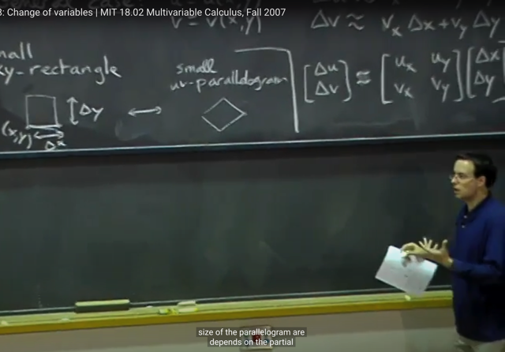</kbd>

> [!NOTE]
> Vậy thì gs nói điều vừa rồi (hai linear approximate equation xấp xỉ 
> delta_u, delta_v theo delta_x và delta_t) cho ta thấy là: **diện tích của
> hình bình hành uv** (kết quả transform từ hình chữ nhật delta_x,
> delta_y sẽ **phụ thuộc bởi partial derivative của u, v w.r.t x, y: tức
> u_x, u_y, v_x, v_y**
>
> Và tùy vào các điểm (x, y) khác nhau thì u_x, u_y, v_x, v_y có thể 
> khác nhau (nếu như chúng là các function theo x, y) khi đó **scaling
> factor giữa delta_A và delta_A' sẽ khác nhau phụ thuộc x, y**

 

<kbd>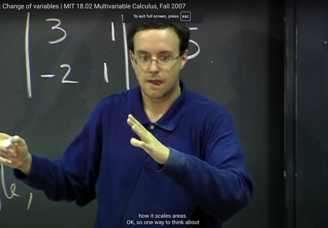</kbd>

> [!NOTE]
> Đại khái là gs nhấn mạnh một kiến thức quan trọng. Đó đại khái nói
> là khi một phép linear transformation thì **DETERMINANT CỦA
> TRANSFORMATION MATRIX CHÍNH LÀ SCALING FACTOR CỦA
> AREA**

> [!NOTE]
> Quay lại sau, kết nối với 1806 về kiến
> thức liên quan tới cái này

 

<kbd>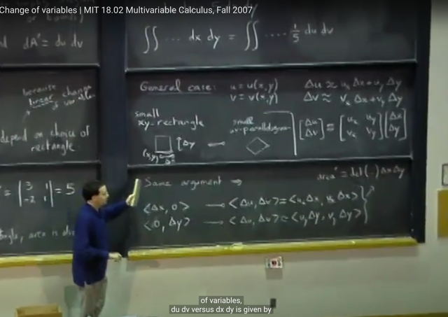</kbd>

🔗 **Related:** [LEC 2: DETERMINANT, CROSS PRODUCT](untitled.md#node-15)

 

## Đại khái là ta \\*có thể thấy TẠI SAO SCALING FACTOR LÀ DET CỦA

> [!NOTE]
> Đại khái là ta **có thể thấy TẠI SAO SCALING FACTOR LÀ DET CỦA 
> MATRIX** **OF PARTIAL DERIVATIVE**
>
> Từ điều ta có hồi nãy, vector <Δx, Δy> liên hệ với <Δu, Δv> thông matrix: 
>
> <Δu, Δv> ~= matrix [u_x, u_y; v_x, v_y] . <Δx, Δy>
>
> Thì cái này có nghĩa là: một vector <Δx, Δy> sẽ tương ứng với vector <Δu, Δv>
> = [u_x, u_y; v_x, v_y] . <Δx, Δy> khi đổi biến từ x,y sang u,v.
>
> Do đó, vector <Δx, 0> (là cạnh vertical của hình vuông trong x,y coordinate) sẽ
> ứng với / trở thành vector Δx * <u_x, v_x>  + 0 * <u_y, v_y> (nhân <Δx, 0> với matrix
> [u_x, u_y; v_x, v_y] theo góc nhìn linear combination các matrix column) và bằng
> <Δx * u_x, Δx * v_x> hay **<u_x*Δx, v_x*Δx>**
>
> Tương tự, vector <0, Δy> (là cạnh horizontal của hình vuông trong x,y coordinate)
> sẽ tương ứng vector 0 * <u_x, v_x>  + Δy * <u_y, v_y> = <Δy * u_y, Δy * v_y>
> hay **<u_y*Δy, v_y*Δy>**
>
> Để rồi từ delta_A =**Δ*Δy**, transformed thành delta_A' = 
>
> = **determinant của hai vector <u_x*Δx, v_x*Δx> và <u_y*Δy, v_y*Δy>** 
>
> Đây là kiến thức đã học (theo link) rằng diện tích của hình bình hành tạo bởi
> hai vector a = <a1, a2> và b = <b1, b2> chính là determinant của hai vectors
> a1b2 - a2b1
>
> Và ở đây nó bằng: u_x*Δx*v_y*Δy - u_y*Δy*v_x*Δx
>
> = **(u_x*v_y - u_y*v_x)*Δx*Δy
>
> Thế thì (u_x*v_y - u_y*v_x) CHÍNH LÀ DETERMINANT CỦA TRANSFORM
> MATRIX [u_x, u_y; v_x, v_y]**

🔗 **Related:** [LEC 18: CHANGE OF VARIABLES](untitled.md#node-430)

 

<kbd>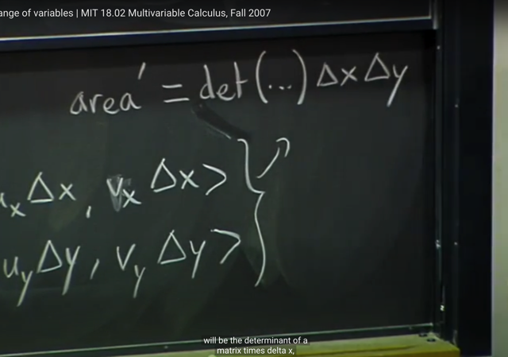</kbd>

> [!NOTE]
> Từ đó ta thấy **determinant** của t**ransformation matrix** chính
> là **scaling factor của diện tích**

 

<kbd>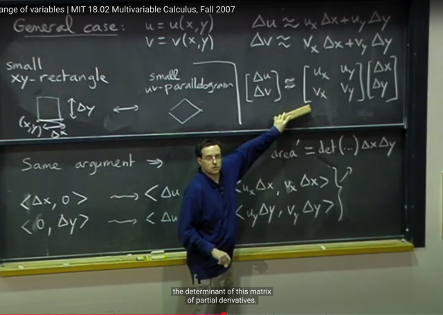</kbd>

> [!NOTE]
> Gs kết luận lại:
>
> Khi ta đổi biến (change of variables) thì quan hệ giữa dxdy và dudv
> sẽ quy định bởi **DETERMINANT CỦA MATRIX CÁC PARTIAL
> DERIVATIVES**

 

<kbd>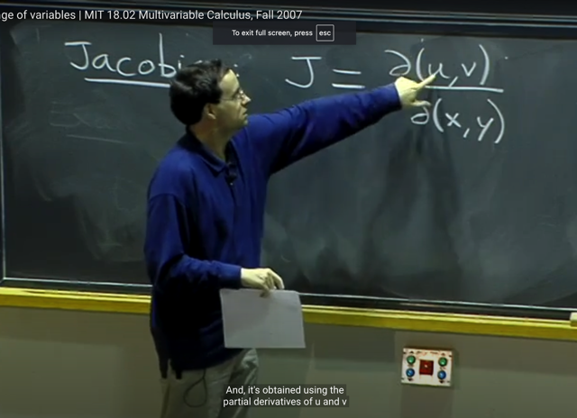</kbd>

> [!NOTE]
> Và đây là lúc ta **chính thức được học về Jacobian**, gs nói 
> đại khái là  ta có thể thấy nó được kí hiệu như vầy: 
>
> **J = partial (u,v) / partial(x,y), tức là, matrix các partial derivative
> được gọi là Jacobian matrix**
>
> Nhưng nên hiểu **notation này khá lạ**, nó không **có nghĩa là ta lấy
> partial derivative của cái gì cả**, mà ta nên hiểu **nó liên quan đến
> tỉ lệ giữa dxdy và dudv như vừa nói.**

 

<kbd>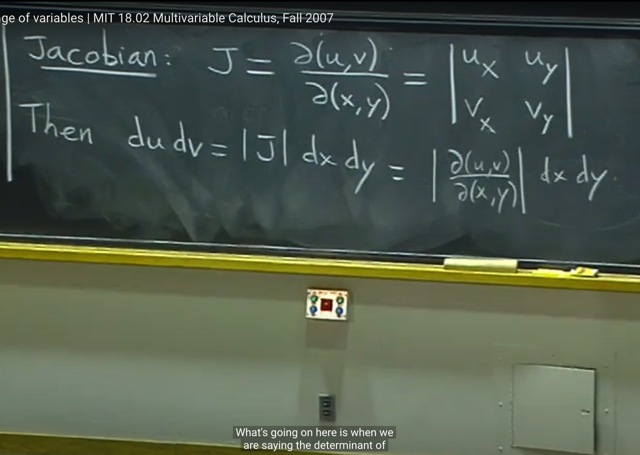</kbd>

> [!NOTE]
> Để rồi như ta nói vừa nãy, dudv liên hệ với dxdy thông qua **GIÁ TRỊ
> TUYỆT ĐỐI CỦA JACOBIAN DERTERMINANT**
>
> **dudv = |J|dxdy**
>
> CHÚ Ý HAI DẤU **| |**: Một cái là nói về **determinant** của matrix, và
> cái kia là t**rị tuyệt đối.**
>
> Theo GPT thì nó nói **matrix of partial derivatives cũng gọi là
> Jacobian matrix**. Còn đương nhiên trong quan hệ dudv và dxdy vẫn
> là dùng determinant của matrix đó

 

<kbd>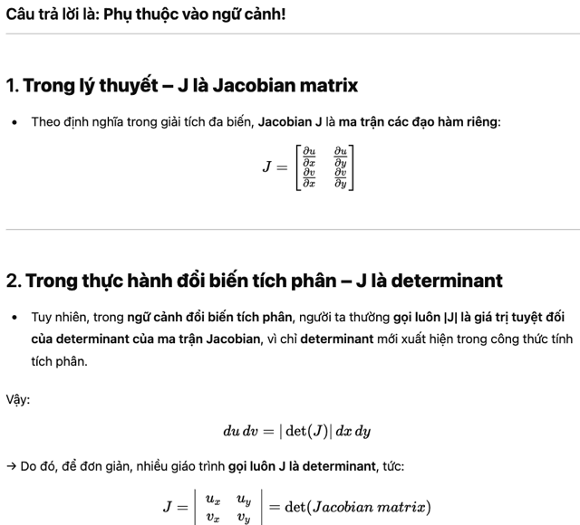</kbd>

> [!NOTE]
> Tóm lại là trong có khi J là chỉ matrix of partial derivative (và gọi là
> Jacobian matrix), thì khi đó ta sẽ thể hiện scaling factor là:
>
> dudv = |det(J)| dxdy
>
> Còn có khi, trong biến đổi biến tích phân người ta cho J là det của
> matrix partial derivative thì cách thể hiện trên sẽ là dudv = |J| dxdy

 

<kbd>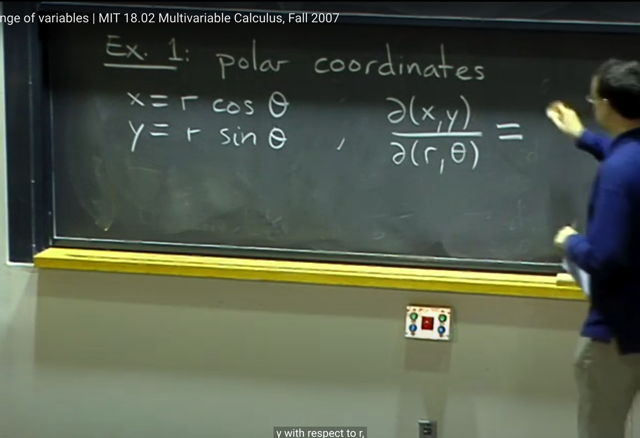</kbd>

> [!NOTE]
> Ta **quay lạ**i ví dụ về việc **chuyển sang polar coordinates** mà ta đã làm
> bữa trước, trong đó ta **đã thấy** khi đó ta **phải dùng r*dr*d_theta** (khi 
> chuyển tích phân từ theo x, y sang theo r, theta) chứ **không chỉ là 
> dr*d_theta**

 

<kbd>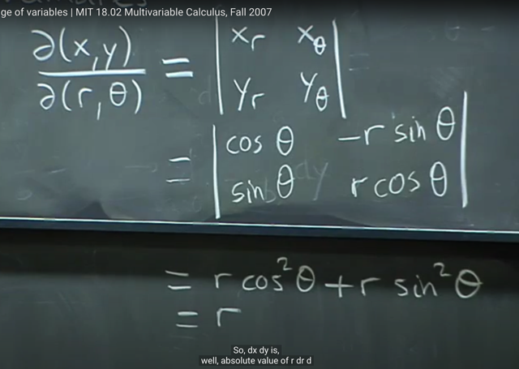</kbd>

> [!NOTE]
> Thế thì, theo như vừa rồi ta mới học, **scaling factor giữa dA = dxdy và
> dA' = drd_theta** sẽ là **GIÁ TRỊ TUYỆT ĐỐI CỦA DETERMINANT CỦA
> JACOBIAN MATRIX : dA = |det(J)| dA'**
>
> DỄ thấy J là matrix như vầy, và det của nó là r
>
> Và r thì không âm nên |r| cũng là r.

 

<kbd>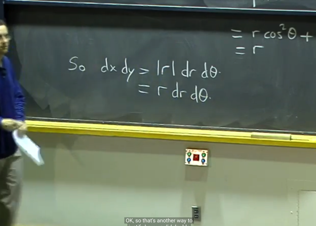</kbd>

> [!NOTE]
> Thành ra ta có lại kết quả bữa
> trước, đó là dxdy = rdrd_theta

 

<kbd>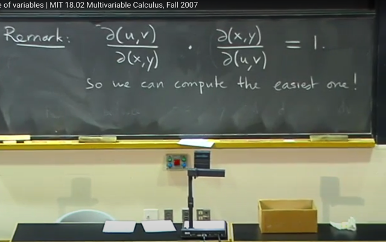</kbd>

> [!NOTE]
> một điểm chú ý là ta có thể tính hai Jacobian (matrix): 1) matrix of
> partial derivatives của u, v đối với x, y và 2) matrix of partial derivatives
> của x, y đối với u, v.
>
> Thì CHÚNG LÀ INVERSE CỦA NHAU. Do đó det(cái này) = 1/det(cái
> kia)
>
> (Tính chất này ta đã biết từ 1806: det(A) = 1/det(Ainv), chứng minh
> nhanh: AAinv = AinvA = I. det(AAinv) = det(A)det(Ainv) = det(I) = 1 <=>
> det(A) = 1/det(Ainv)
>
> Nên gs cho rằng thực chất ta có thể tính cái này dễ thì tính

 

<kbd>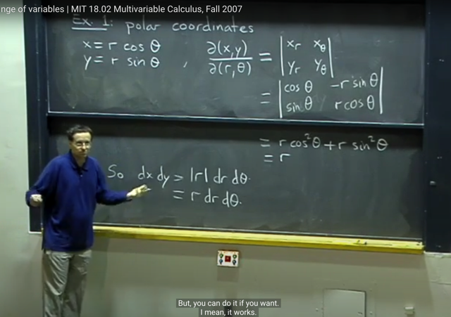</kbd>

> [!NOTE]
> Có nghĩa là ta có thể tìm det của matrix partial (x, y) / partial (u, v) rồi
> từ đó lấy nghịch đảo để có det của matrix partial (u,v) / partial (x,y)
>
> Và gs cho lưu ý ta rằng, trong ví dụ này ta cũng thấy scaling factor
> (giữa delta_A và detal_A' không còn là constant (ví dụ bằng 5 như hồi
> nãy) nữa mà là hàm theo r

 

<kbd>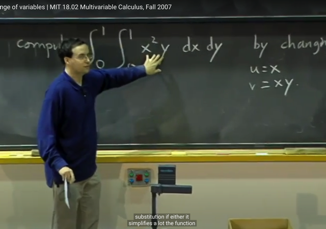</kbd>

> [!NOTE]
> Cuối cùng ta thử làm ví dụ này. tính tích phân kép từ 0-1 (của cả x và y) 
> của x^2y dxdy. bằng cách đổi biến u = x, v = xy.
>
> Gs cho rằng đương nhiên rất dễ để tính tích phân này theo x,y. Nhưng để
> luyện tập thì ta làm theo u, v.
>
> Gs nói, thông thường thì ta chỉ đổi biến nếu 
>
> 1) nó giúp đơn giản hóa functon trong tích phân
>
> 2) nó giúp đơn giản hoá bound tích phân

 

<kbd>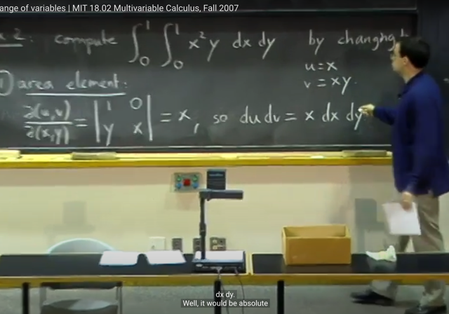</kbd>

> [!NOTE]
> Thì đầu tiên như đã biết ta cần tìm liên hệ giữa dudv và dxdy bằng
> cách tính trị tuyệt đối của det của Jacobian matrix. Với u = x, v = xy
> dễ thấy J = [u_x = 1, u_y = 0, v_x = y, v_y = x] nên |J| = 1*x - 0*y = x
>
> Vì x đang xét trong phạm vi 0,1 nên |x| = x
>
> Vậy dudv = xdxdy

 

<kbd>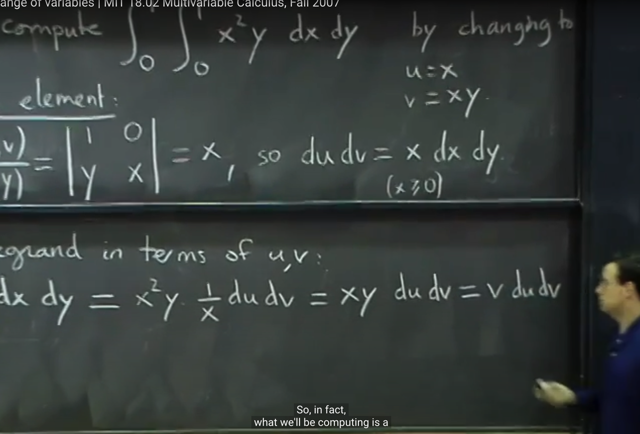</kbd>

> [!NOTE]
> Bước tiếp theo là express integrand (ý là toàn bộ trong tích phân) theo
> u, v
>
> Thì x^2ydxdy = x^2y(1/x)dudv = xydudv = vdudv

 

<kbd>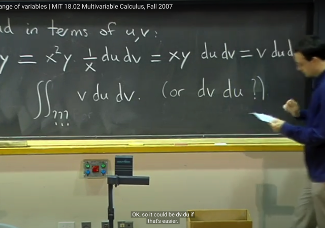</kbd>

> [!NOTE]
> Vậy tích phân cần tính trở thành tích phân (chưa, còn cần xác
> định lại bound) của vdudv (hoặc vdvdu, tùy xem tính theo v
> trước hay u trước cái nào dễ hơn)

 

<kbd>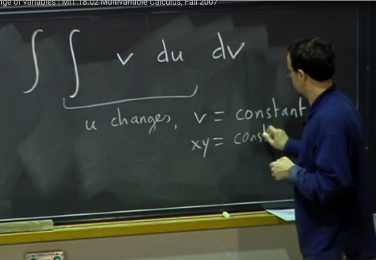</kbd>

> [!NOTE]
> thế thì, ta đã biết ý nghĩa của tích phân ở trong theo u, tích phân ở
> ngoài theo v đó là, giữ v constant, và u thay đổi.
>
> Và từ ý nghĩa đó ta tự hỏi với v fixed, thì u thay đổi từ đâu đến đâu,
> sẽ cho ta bound của inner integral.
>
> Và câu hỏi v từ đâu đến đâu sẽ cho ta bound của outer integral
>
> Vậy v constant với v = xy tức là xy = constant

 

<kbd>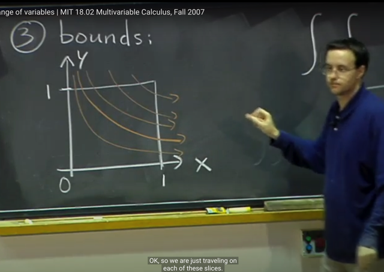</kbd>

> [!NOTE]
> Thế thì xy=constant, cho thấy các level curve của v = x*y sẽ là các
> hyperbola như giáo sư vẽ màu cam - có nghĩa là để v constant thì
> tức là điểm (x,y) di chuyển trên các ta có các đường hyperbol màu
> cam này.

 

<kbd>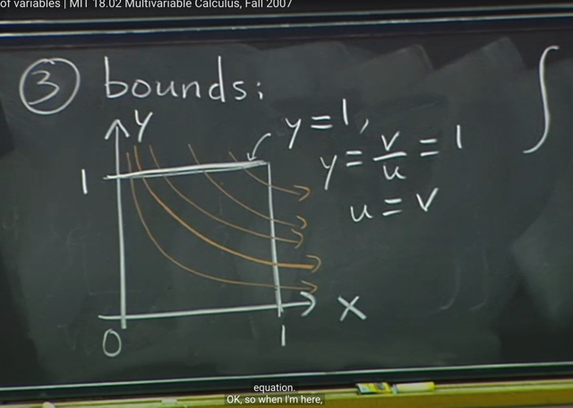</kbd>

> [!NOTE]
> thế thì với x, y trong range [0,1] và với việc ta di chuyển trên
> các hyperbol này thì câu hỏi là cụ thể u bắt đầu ở đâu và kết thúc
> ở đâu
>
> Rõ ràng, ta chỉ biết tại điểm bắt đầu thì y = 1, mà v = xy => y = v/x
> cũng bằng v/u (vì u = x). Do đó ta có u = v có nghĩa inner integral bound
> (theo u) bắt đầu với u = v

 

<kbd>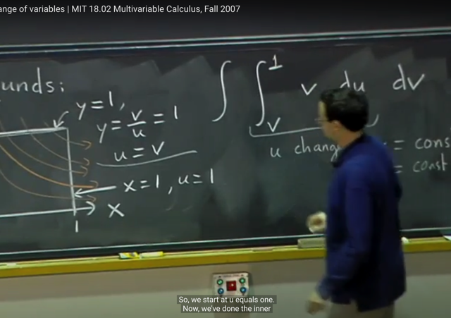</kbd>

> [!NOTE]
> Và khi di chuyển trên các hyperbola này, thì ta kết thúc ở x = 1 tức là
> u = 1 (vì u = x). Vậy end của inner integral bound là 1
>
> Vậy inner integral bound là từ v tới 1

 

<kbd>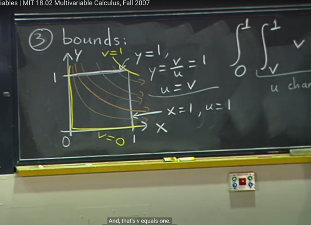</kbd>

> [!NOTE]
> thế thì với outer integral v thì trong phạm vi x,y thuộc [0,1] thì 
> ta có các hyperbola bắt đầu với v = 0 (là đường màu vàng) 
> và v = 1
>
> Vậy outer integral bound là từ 0 tới 1

 

<kbd>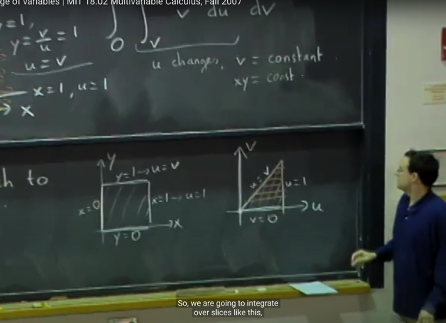</kbd>

> [!NOTE]
> đại khái là gs cho rằng ta có thể tìm bound theo cách thứ hai. Đại khái
> là ta vẽ cái area mà ta tính integral (x, y trong [0,1]) và ta vẽ tương ứng
> cái area trong u, v coordinates.
>
> Thì y = 1 tương ứng u = v là đường chéo 45 độ. y = 0 tương ứng v = 0
> x = 0 tương ứng điểm (0, 0). x = 1 tương ứng v = 1.
>
> Như vậy hình vuông trong xy coordinates ứng với hình tam giác trong
> uv coordinates.
>
> Và trong hình tam giác đó, ta có các đường song song từ v = 0 tới v = 1) 
> v = constant. Thì u từ v tăng lên 1. -> inner bound là v:1 và outer bound
> là 0:1

 

