# Lec 19: Vector Fields

📊 **Progress:** `36` Notes | `52` Screenshots

---

<kbd>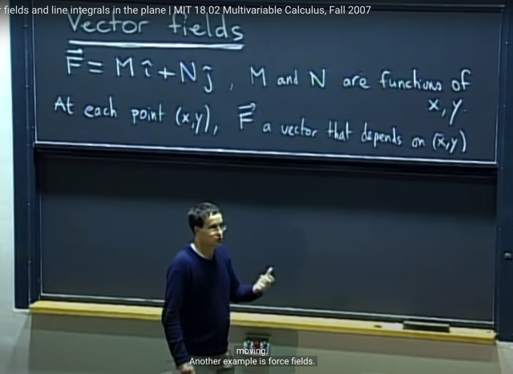</kbd>

> [!NOTE]
> bài này ta sẽ tạm quên double integral để thảo luận về Vector field. Định
> nghĩa đại khái là, tại mỗi điểm x, y ta có vector F  = M*i + N*j với M, N
> phụ thuộc x, y. Có nghĩa là mọi điểm ta có vector F và vector F sẽ khác
> nhau phụ thuộc x, y. Đó là **VECTOR FIELD** - **TRƯỜNG VECTOR.**
>
> Ví dụ có thể nghĩ đến hình ảnh của **Force field - TRƯỜNG LỰC**. Tại
> các điểm trong không gian đều có lực tác dụng từ các hành tinh, thiên
> thể (TRƯỜNG TRỌNG LỰC, HAY TRỌNG TRƯỜNG) Và vector lực sẽ
> tùy thuộc vị trí của điểm đang xét

 

<kbd></kbd>

> [!NOTE]
> Và gs nói tuy ta sẽ xem xét vector field một cách toán học
> nhưng ta sẽ dùng ví dụ này để xem tại sao ta lại quan tâm
> các tính chất của vector field

 

<kbd>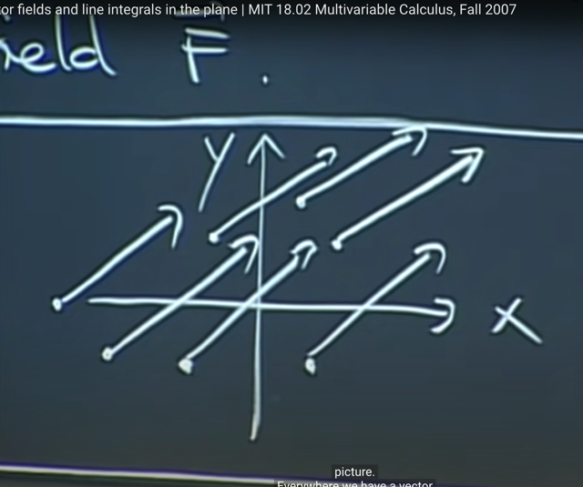</kbd>

> [!NOTE]
> Một ví dụ đầu tiên về vector field mà gs cho rằng có thể khá silly là
> F = 2i + 1j. Tức là vector không phụ thuộc x,y. Mà luôn = 2i + j
>
> HÌnh ảnh của nó là đây, tại điểm nào cũng vậy, vector luôn là 2i + j

 

<kbd>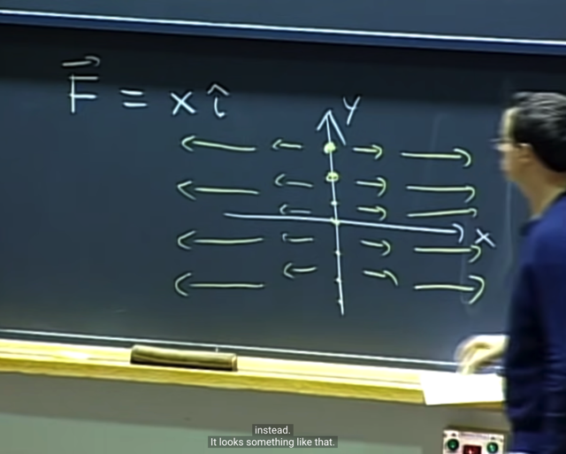</kbd>

> [!NOTE]
> Ví dụ thứ hai là vector field quy định bởi F = x*i (tức là không có j
> component, nên các vector chỉ song song với trục x)
>
> Thế thì có thể thấy x nhỏ thì F ngắn hơn, khi x tăng lên thì F dài hơn
> và  khi x âm thì vector F quay ngược chiều lại.
>
> Để hình ảnh của vector field này như vầy

 

<kbd></kbd>

> [!NOTE]
> gs nói thường thì ta chỉ muốn phác thảo sơ về hình
> dung của vector field chứ không cần vẽ chính xác vì đã
> có máy tính

 

<kbd>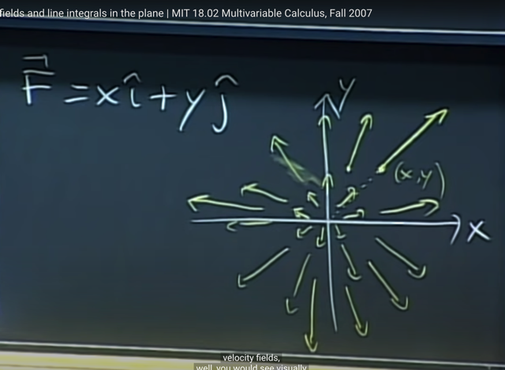</kbd>

> [!NOTE]
> Qua ví dụ một vector field khác F = x*i + y*j. Thì hình
> ảnh nó là như này, vector tại x,y thì chính là vector (x,y)
> nhưng dời gốc về điểm (x,y) thôi

 

<kbd>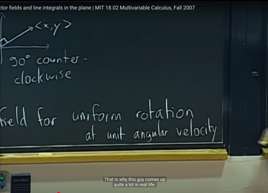</kbd>

<kbd></kbd>

<kbd>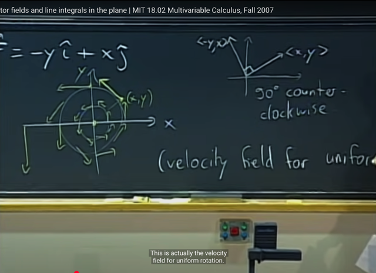</kbd>

> [!NOTE]
> Qua vector field này, F = -y*i + x*j thì có nghĩa là tại (x,y) ta sẽ tương ứng
> với vector (-y, x) là vector bằng độ dài và vuông góc với (x,y) và ta dời
> vector đó về điểm (x,y)
>
> Để rồi hình ảnh của nó là như vầy, mô tả dòng chảy quanh gốc 0, với vận
> tốc góc (angular velocity) unit (cũng không quan trọng lắm)

 

<kbd>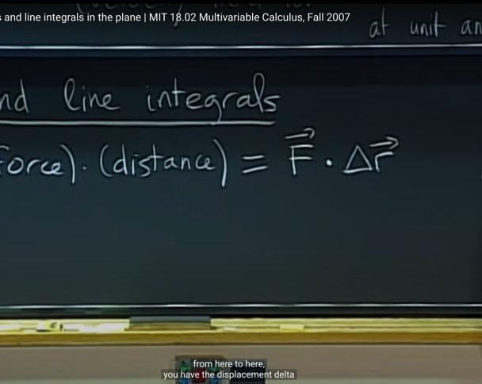</kbd>

<kbd>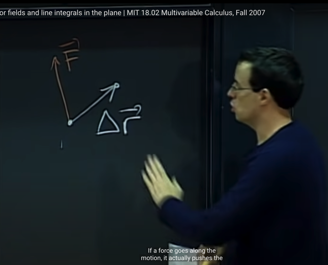</kbd>

<kbd></kbd>

<kbd></kbd>

<kbd>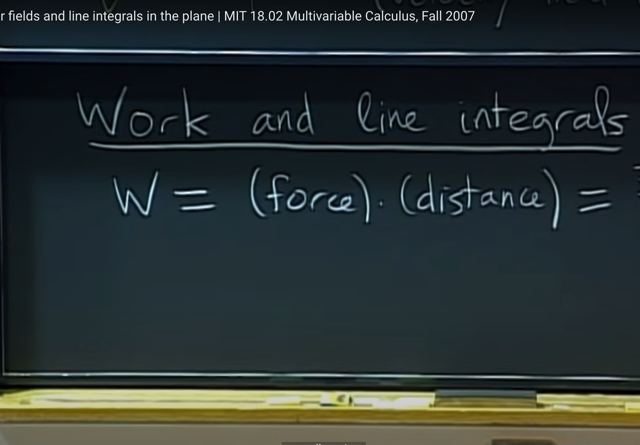</kbd>

> [!NOTE]
> ta học qua khái niệm CÔNG (WORK) VÀ LINE INTEGRAL. Đại khái gs cho biết
> trong vật lí Công của lực F tạo ra / khiến một object di chuyển một quãng đường
> Delta_r sẽ được tính bởi dot product giữa vector F và vector Delta_r
>
> Và như đã học vật lý phổ thông, công là đại lượng cho biết năng lượng cần thiết
> để thực hiện việc này

 

<kbd>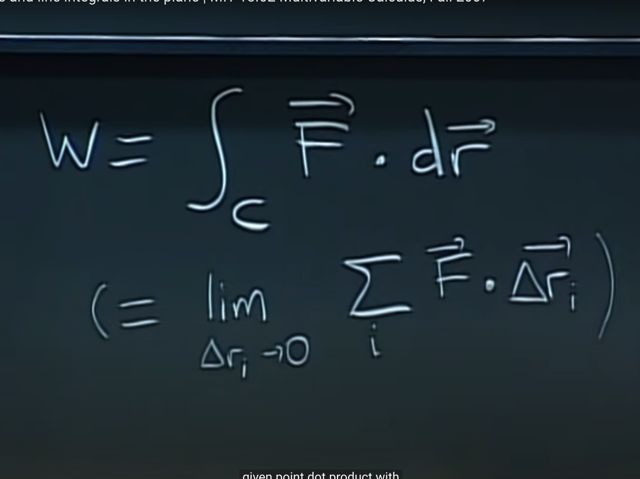</kbd>

<kbd></kbd>

<kbd>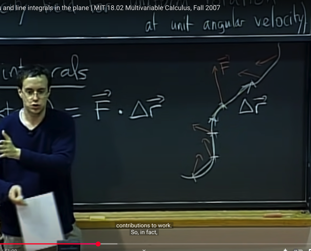</kbd>

> [!NOTE]
> Thế thì nếu object di chuyển trên quỹ đạo mà lực F sẽ khác nhau
> giữa các điểm khác nhau trên quỹ đạo. Thì ta cách tính là ta sẽ chia
> nhỏ quỹ  đạo thành các đoạn delta_r. Và ta sẽ tính
>
> 1) TỔNG CỦA DOT PRODUCT CỦA CÁC VECTOR DELTA_R VÀ F.
>
> 2) VÀ TA SẼ TÍNH LIM CỦA CÁI NÀY  VỚI DELTA_R NHỎ DẦN VỀ 0
>
> Để rồi **công của lực trên cả quỹ đạo C** trở thành**tích phân trên
> quỹ đạo C [F dot product dr]**

 

<kbd>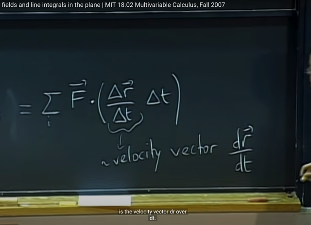</kbd>

> [!NOTE]
> Thế thì  ta có thể viết delta_r = delta_r / delta_r * delta_t Thì (delta_r
> / delta_r) chính là ~ VELOCITY VECTOR dr/dt

 

<kbd>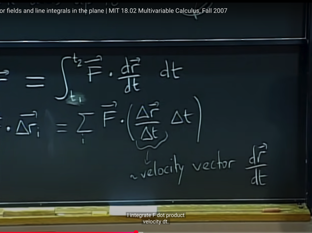</kbd>

> [!NOTE]
> Để rồi tích phân trở thành tích phân từ t1 đến t2 dot product của
> [F, (dr/dt).dt]
>
> Trong đó F = vector force, như đã biết sẽ tùy vào vị trí của điểm
> và do đó nó khi ta đang chuyển thành tích phân theo thời gian t (vì
> vị trí bây giờ sẽ phụ thuộc t) thì nó sẽ tùy vào t

 

<kbd>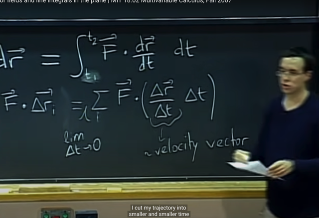</kbd>

> [!NOTE]
> một student thắc mắc, thì gs khẳng định đúng là ta sẽ tính limit khi
> delta_t -> 0 của Tổng [F. (delta_r/delta_t) delta_t]
>
> Mang ý nghĩa là ta cắt quỹ đạo (trajectory) thành các đoạn delta_r
> ngày càng nhỏ và tính tổng của các phép dot product giữa vector F
> và delta_r
>
> Thì delta_r nhỏ dần thì cũng là (velocity . delta_t) với delta_t nhỏ dần

 

<kbd>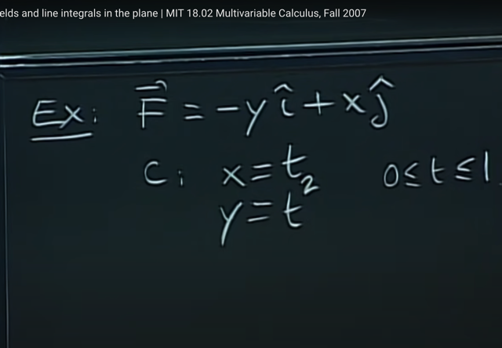</kbd>

> [!NOTE]
> Ta qua một ví dụ (lấy ví dụ hồi nãy) vector field  = -y*i + x*j
>
> với quỹ đạo C: x = t, y = t^2 với t trong range [0,1]

 

<kbd>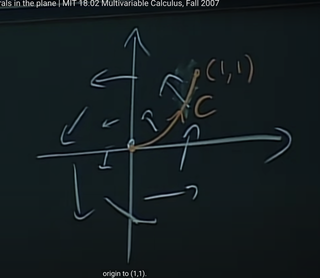</kbd>

> [!NOTE]
> Thế thì trajectory x = t, y = t^2 với t trong range [0,1] chính là
> điểm sẽ có quỹ đạo là một đoạn của Parabola y = x^2 từ gốc
> 0 đến (1,1)
>
> Và như vậy cơ bản ta muốn tính Công (work) tạo bởi lực F khi
> di chuyển object trên quỹ đạo này.

 

<kbd>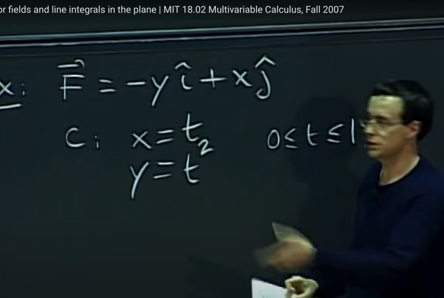</kbd>

> [!NOTE]
> Và gs nói đại khái là nếu ta hỏi rằng tại sao ta có C như vậy thì câu hỏi
> đó sai. Vì F và c là hai phần của dữ liệu mà ta có. Tức là ta có F như vầy,
> và quỹ đạo như vầy, và ta cần tính công của lực khi khiến điểm di chuyển
> trên quỹ đạo như vậy

 

<kbd>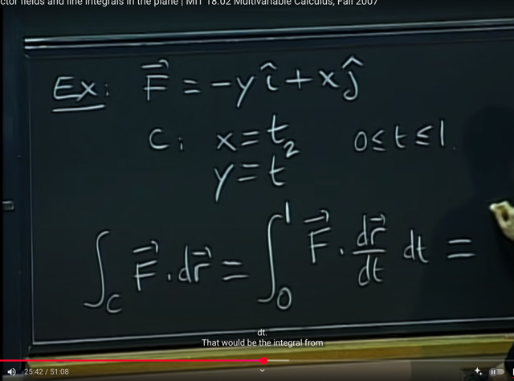</kbd>

> [!NOTE]
> Rồi như vậy ta cần tính tích phân (theo t) từ t = 0 đến t = 1,
> của F dot product với (velocity vector dr/dt * dt)

 

<kbd>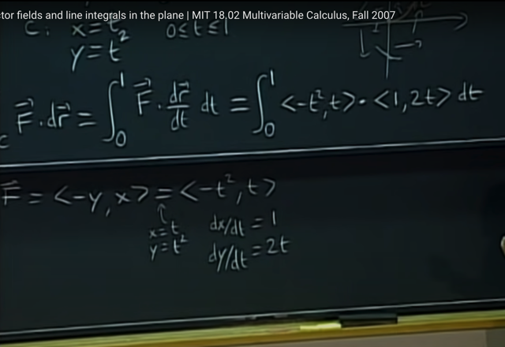</kbd>

> [!NOTE]
> Và với việc vector field định nghĩa F = - y*i + x*j tức là tại (x,y) thì
> vector F = (-y, x) ta thay x = t, y = t^2 thì ta có F = <-t^2, t>
>
> Và x=t thì dx = dt <=> dx/dt = 1
>
> Cái này dựa trên Implicit differentiation nếu f là hàm theo x: f(x) thì
> df = f'(x)dx
>
> thì tương tự x là hàm theo t: x(t) = t ta có dx = x'(t)dt = 1*dt
>
> và y = t^2 nên dy = 2tdt <=> dy /dt = 2t
>
> vậy dr/dt (chú ý, nhớ rằng nó là VELOCITY VECTOR - SẼ CÓ
> HAI COMPONENT LÀ DX/DT VÀ DY/DT)
>
> Sẽ là: <1, 2t>

 

<kbd>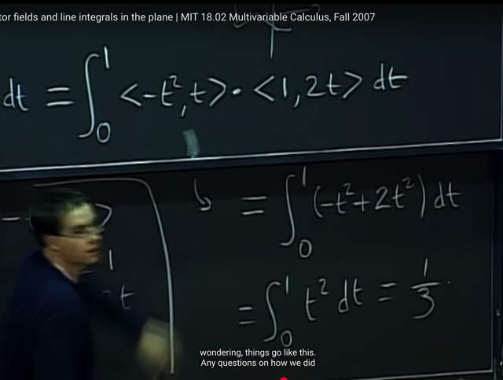</kbd>

> [!NOTE]
> Và dot product F và velocity ta có t^2. Tích phân từ 0 đến 1
> của t^2dt = nguyên hàm của t^2 | 0:1 = (1/3)t^3 | 0: 1= 1/3

 

<kbd></kbd>

> [!NOTE]
> Có câu hỏi là sao không tính dot product của F và dr (và
> integrate) theo r thì gs nói ta không biết cách làm theo kiểu đó, vì
> r là position vector

 

<kbd>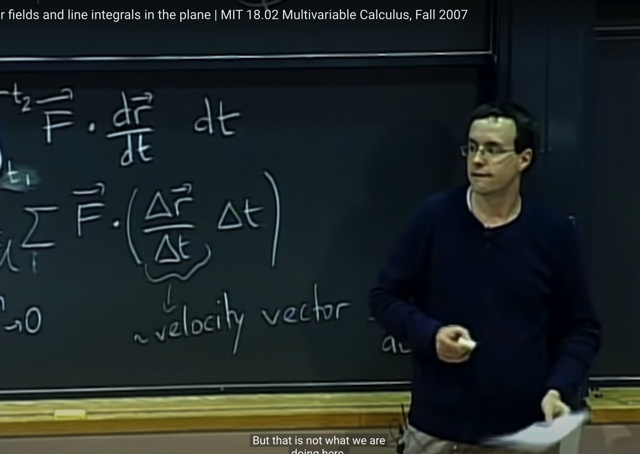</kbd>

> [!NOTE]
> gs trả lời một câu hỏi của student nội dung đại khái là trong tình
> huống ở đây, ta chỉ cố gắng tính Công của lực tác động lên một
> object di chuyển với quỹ đạo cho trước. Chứ ta không (mặc dù có
> thể) xét đến việc tìm ra quỹ đạo dựa trên lực tác động - đây là bài
> toán khác, liên quan đến giải phương trình vi phân mà ta có thể học
> trong 1803

 

<kbd>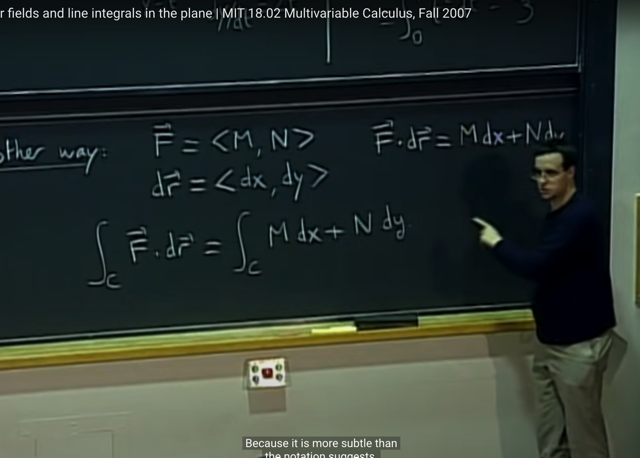</kbd>

🔗 **Related:** [LEC 20: PATH INDEPENDENCE & CONSERVATIVE FIELD](untitled.md#node-496)

> [!NOTE]
> Tiếp gs sẽ nói về một cách giải khác, liên quan đến việc dùng trực
> tiếp (vector) dr thay vì chuyển thành [vector velocity dr/dt nhân với
> dt]
>
> Cách làm này, ta có gọi dr là vector có hai component là dx, dy.
>
> Thì tích phân trên C của dot product(F, dr) sẽ trở thành tích phân trên C 
> của (Mdx + Ndy)
>
> Thế thì, gs nói rằng, đại khái là tích phân này trông qua thì có vẻ là tích
> phân của 2 biến x, y. Nhưng thực chất dựa trên một quỹ đạo C thì x,y liên
> quan nhau. Do đó thực ra tích phân này chỉ là của 1 variable và ta sẽ 
> chuyển tích phân này về 1 variable x., hoặc y hoặc t

 

<kbd>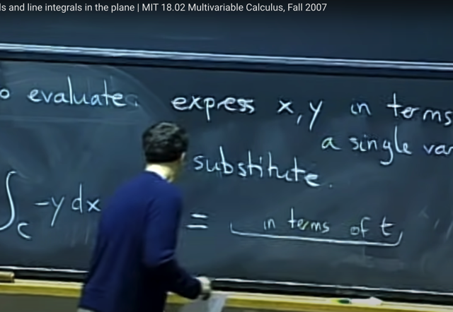</kbd>

<kbd></kbd>

<kbd>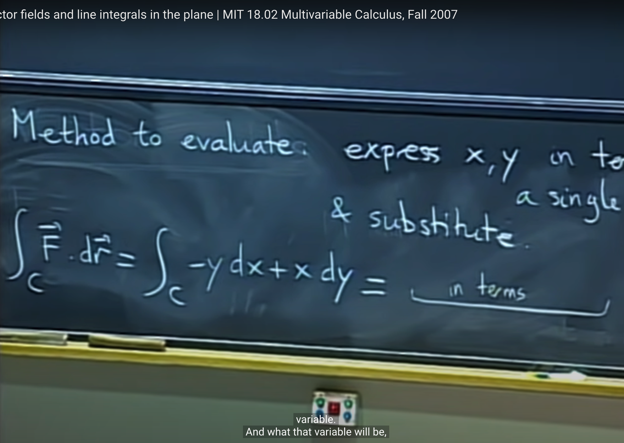</kbd>

> [!NOTE]
> Thế thì phương pháp ta sẽ làm đó là, thể hiện x, y dưới dạng
> single variable t và thế vào. Ghi lại tích phân Fdr theo  cách
> trên F = <M,N> = <-y, x> (do cho F = -y*i + x*j) ta có tích phân
> của -ydx + xdy.

 

<kbd>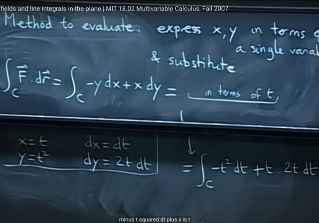</kbd>

> [!NOTE]
> Rồi thì từ x = t, y = t^2, như hồi nãy ta dùng implicit
> differentiation cho ta dx = dt và dy = 2tdy thế vào tích phân ta
> có tích phân (over C) của -t^2dt + t*dtdt

 

<kbd>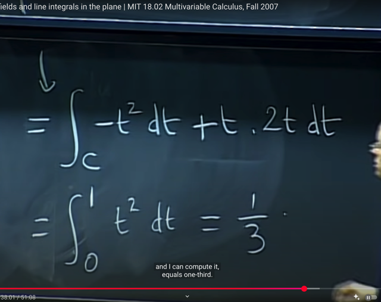</kbd>

> [!NOTE]
> Và giải tiếp y như
> hồi nãy ra 1/3

 

<kbd></kbd>

<kbd></kbd>

<kbd>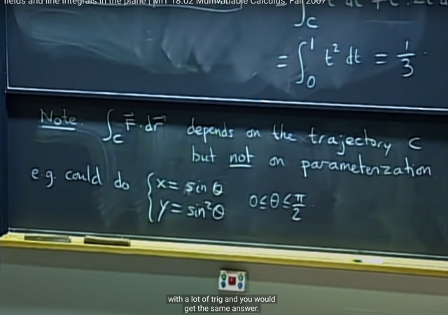</kbd>

> [!NOTE]
> Như vậy phương pháp là cho quỹ đạo c thì ta cần thể hiện x, y theo
> cùng 1 parameter và ta sẽ chọn parameters nào (ở đây là t)
>
> Gs nói rằng ta có thể chọn x = sin(theta) y = sin(theta) ^2 nhưng trong
> trường hợp này sẽ rất khó làm (not practical) (đã nói là ta chọn, nên ta
> cần phải chọn parameter để express x, y sao cho hợp lý)
>
> Hoặc ta có thể express y theo x và tính integral này theo x.

 

<kbd></kbd>

> [!NOTE]
> Gs nhắc lại vừa rồi là cách general để làm line integral: ta tìm cách
> express mọi parameters bởi một parameter nào đó và từ đó ta có
> một integral theo single parameter duy nhất để tính

 

<kbd>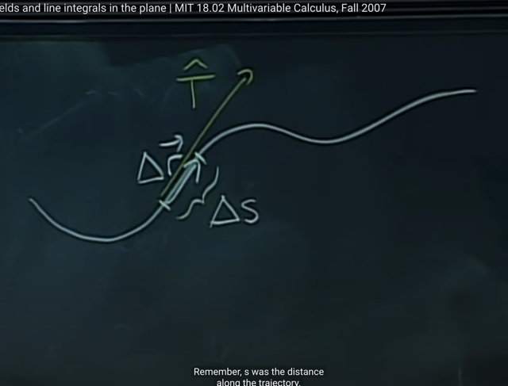</kbd>

> [!NOTE]
> Gs nói qua cách tiếp cận hình học của vấn đề này. Đầu tiên gs muốn
> ta ôn lại về ý nghĩa của dr.
>
> Đó là bắt đầu từ delta_r là một vector thể hiện sự thay đổi rất nhỏ của
> object trên quỹ đạo, thì ta đã biết ở bài trước, rằng khi chia nhỏ quỹ
> đạo ra thành những phần rất nhỏ delta_r -> 0, thì vector delta_r có
> thể coi như trùng với phương của tiếp tuyến của quỹ đạo tại điểm
> đang xét. gọi T là vector tiếp tuyến đơn vị (unit tangent vector) thì ta
> có delta_r trùng phương với T^ (đương nhiên có độ lớn = 1)
>
> Còn độ lớn của delta_r thì bằng delta_s với s là chiều dài của quỹ
> đạo

 

<kbd>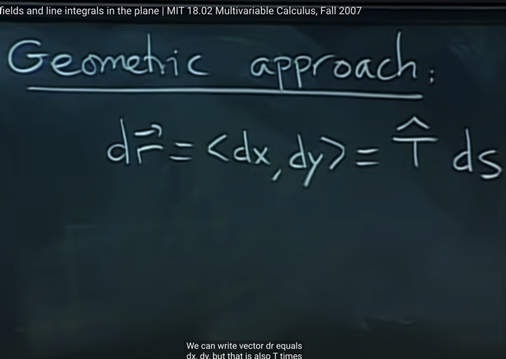</kbd>

> [!NOTE]
> Từ đó dr  = <dx, dy> = T^.ds (dấu mũ của T thể hiện là vector
> đơn vị, giống như i^, j^ vậy)
>
> là vector mà trùng phương với tangent và có độ lớn bằng ds

 

<kbd>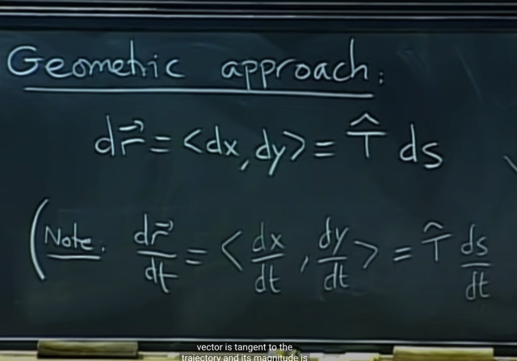</kbd>

> [!NOTE]
> Hoặc là có thể hiểu theo cách khác chia dr cho dt ta có dr/dt là
> velocity vector, khi đó tương ứng sẽ là T^. ds/dt mang ý nghĩa:
> velocity vector sẽ cùng phương với vector tiếp tuyến tại điểm đang
> xét với độ lớn là ds/dt chính là "đạo hàm của "độ dài quãng đường"
> đối với thời gian" - thì chính là độ lớn vận tốc.

 

<kbd>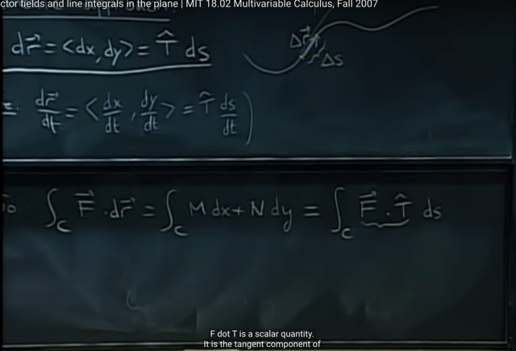</kbd>

> [!NOTE]
> Từ đó, tích phân (over C) F.dr có thể trở thành (hoặc được tính
> theo cách khác) tích phân (over C) {F dot product với T^} ds với ý
> nghĩa là ta sẽ project vector force F lên hướng / phương của tiếp
> tuyến tại đó và integrate nó dọc theo (along) the curve

 

<kbd>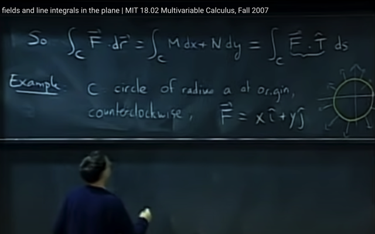</kbd>

> [!NOTE]
> Đại ý là gs cho rằng làm theo cách này sẽ phát huy ưu điểm khi quỹ
> đạo và vector field có liên hệ hình học với nhau. Lấy ví dụ ta có quỹ
> đạo (trajectory) C là (đi theo) đường tròn bán kính a tâm tại gốc tọa
> độ và đi theo hướng ngược chiều kim đồng hồ. Còn vector field F =
> x*i^ + y*j^ là vector field mà ta đã nói ở đầu bài
>
> Gs nói khi dùng line integral để tính công của lực F đối với object di
> chuyển theo quỹ đạo này thì nếu ta nắm / nhớ vật lí thì ta sẽ expect
> / dự đoán nó bằng 0, Vì lực luôn vuông góc với hướng di chuyển

 

<kbd>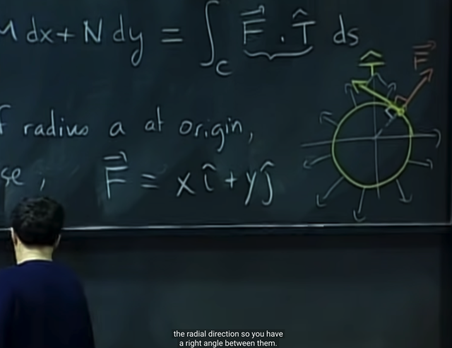</kbd>

> [!NOTE]
> thế thì trong trường hợp này, tại một điểm bất kì trên
> quỹ đạo, ta có vector T - vector tiếp tuyến sẽ vuông
> góc với vector với vector lực F.

 

<kbd>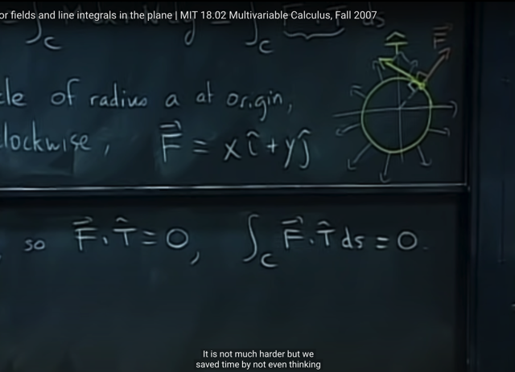</kbd>

> [!NOTE]
> do đó dot product của vector F và T là bằng 0 nên integral over c của F.
> T. ds dĩ nhiên là bằng 0
>
> Đây là ví dụ cho thấy trong bài toán cụ thể này khi ta có liên hệ hình học
> giữa vector field F và trajectory (F vuông góc với quỹ đạo) thì việc tính
> line integral theo cách này dễ hơn rất nhiều (mặc dù nếu ta tính theo
> cách 2, đó là express x, y theo parameter nào đó chẳng hạn như
> sin(theta) và cos(theta) thì ta cũng sẽ cho ra kết quả như vậy như cách
> kia rõ ràng là nhanh nhất

 

<kbd>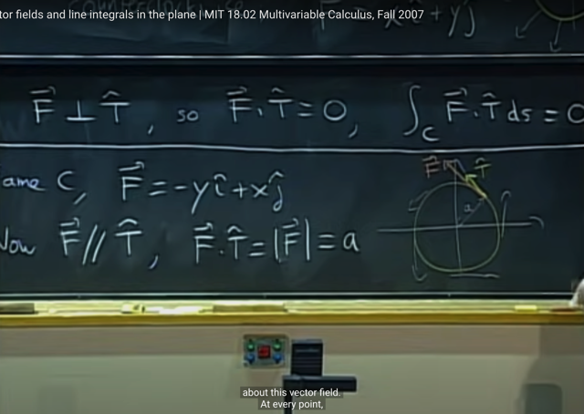</kbd>

> [!NOTE]
> Cuối cùng làm một ví dụ: Cùng quỹ đạo C, nhưng vector field F khác
> F = -y*i^ + x*j^
>
> Lúc này vector F song song với vector T, nên ta đã biết F.T = |F|.|T|.
> cos(góc giữ chúng) = |F|*1*1 = |F|
>
> Và |F| = a (vì component của F là -y, x nên |F| = sqrt[(-y)^2 + x^2]
> = sqrt r^2 = r = a

 

<kbd>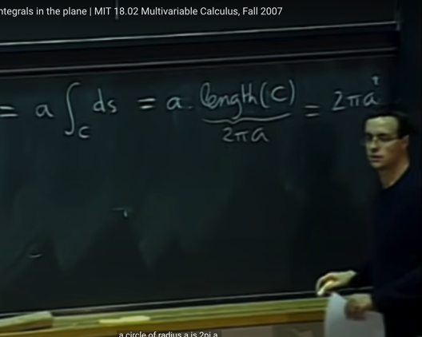</kbd>

<kbd></kbd>

<kbd>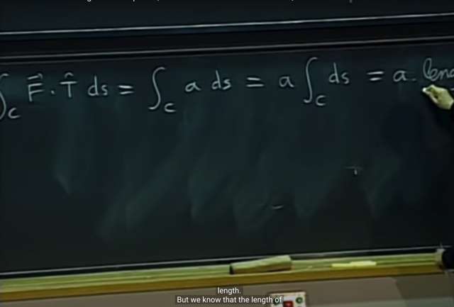</kbd>

> [!NOTE]
> Do đó tích phân over C của F. T ds trở thành tích phân over c a ds
>
> Với a là constant đưa ra ngoài ta còn **tích phân over c ds
>
> và tích phân trên quỹ đạo c của ds thí CHÍNH LÀ CHIỀU DÀI 
> QUỸ ĐẠO c -> 2pi*a
>
> Vậy kết quả là 2pi*a^2**

 

<kbd>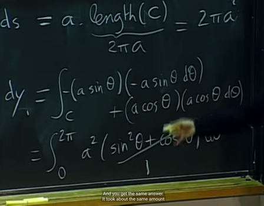</kbd>

<kbd></kbd>

<kbd>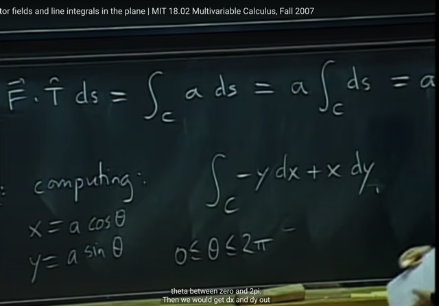</kbd>

> [!NOTE]
> Hoặc nếu tính bằng cách '2' đó là thể hiện x, y theo theta  ta sẽ có tích
> phân over c -ydx + xdy = tích phân từ 0 đến 2pi của a^2(sin^2 theta
> +cos^2 theta) dtheta = a^2 tích phân 0:2pi dtheta = a^2 2pi

 

