# Lec 20: Path Independence & Conservative Field

📊 **Progress:** `38` Notes | `48` Screenshots

---

<kbd></kbd>

<kbd></kbd>

<kbd></kbd>

> [!NOTE]
> Ôn lại bài trước ta đã học về Line integral dùng để tính Công (Work)
> của lực (vector field) tác dụng lên điểm di chuyển trên quỹ đạo C
>
> Tích phân trên C: F dot product dr
>
> cũng là: Tích phân trên C: F dot product T^ ds (T^ là unit vector tiếp tuyến)
>
> Với F = <M,N> và dr = <dx, dy) thì 
>
> cũng là: Tích phân trên C: Mdx + Ndy

 

<kbd>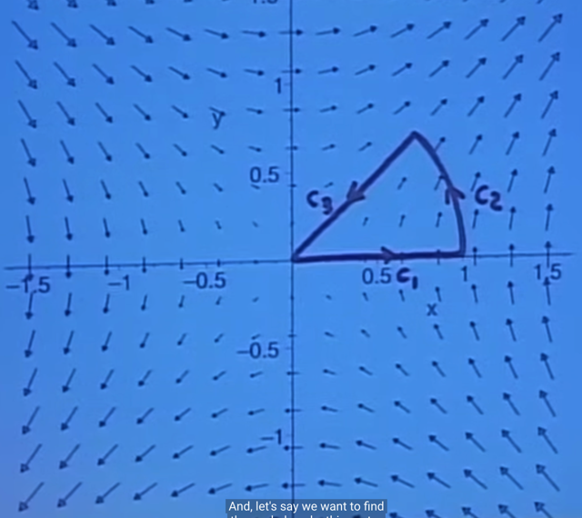</kbd>

> [!NOTE]
> Ta sẽ đi thêm một ví dụ về cái này trước khi qua kiến thức
> khác. Đó là cho vector field  F = y*i^ + x*j^ và quỹ đạo C gồm
> 3 phần khép kin như hình

 

<kbd></kbd>

<kbd></kbd>

<kbd></kbd>

> [!NOTE]
> Và c tạo nên một phần của dĩa có bán kính đơn vị với góc theta
> từ 0 đến pi/4

 

<kbd></kbd>

🔗 **Related:** [LEC 19: VECTOR FIELDS](untitled.md#node-476)

> [!NOTE]
> Thế thì ta sẽ tính line integral của F (dot product) dr và như bữa trước 
> ta đã biết ta có thể tính bằng cách thể hiện dr = <dx, dy> và F = <y, x>
> nên dot product giữa chúng là y*dx + x*dy
>
> Vậy nên ta sẽ cần tính tích phân của ydx +xdy trên các c_i khác nhau

 

<kbd>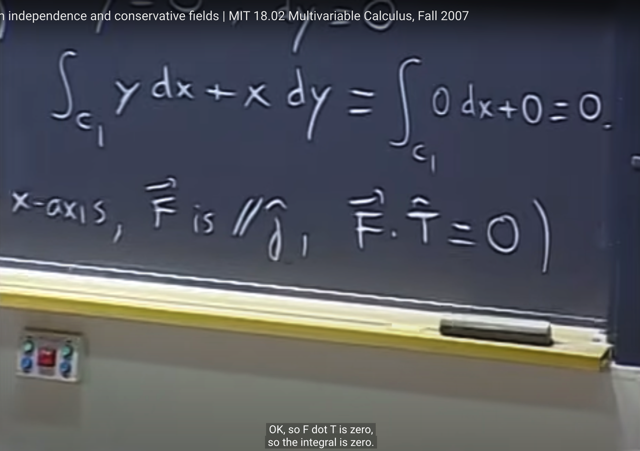</kbd>

> [!NOTE]
> Thế thì đoạn đầu tiên của c, c1 là đoạn trùng với trục x . Khi đó
> nếu tính tích phân trên c1 ydx + xdy ta lập luận như sau:
>
> vì trên đoạn này y = 0, và cũng vì y = constant nên dy = 0
>
> Từ đó ta có tích phân trên c1 0*dx + x*0 = 0
>
> Hoặc lập luận theo Geometric: trên đoạn này vector F luôn vuông
> góc với quỹ đạo nên F vuông góc T (vector tiếp tuyến đơn vị) do đó
> làm theo cách "3": tích phân trên c1 của F dot product T ds thì cũng 
> ngay lập tức ra 0 do F.T = 0

 

<kbd>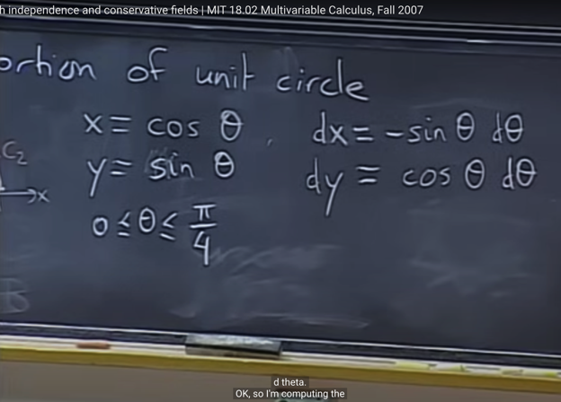</kbd>

<kbd></kbd>

<kbd></kbd>

> [!NOTE]
> Phần thứ 2 có thể thấy là một phần của đường tròn đơn vị. Thế thì ta
> sẽ theo phương pháp "2" đã học, đó là thể hiện x, y ở dạng một parameter
> nào đó. Vậy ở đây sẽ hợp lý nếu thể hiện bởi theta (chính xác là r, theta nhưng vì
> là đường tròn đơn vị nên r = 1)
>
> Từ đó ta có dx, dy theo theta.

 

<kbd></kbd>

> [!NOTE]
> Từ đó ta có: tích phân từ 0 đến pi/4 (c2 là 1/8 đường tròn đơn vị
> ứng với góc theta từ 0 đến 2pi/8) của (cos^2 theta - sin^2 theta) d_theta
>
> (cos^2 theta - sin^2 theta) = cos(2theta), nguyên hàm của nó là 1/2 sin(2theta)
>
> Kết quả là: [1/2 sin(2theta)] | 0:pi/4 = 1/2

 

<kbd>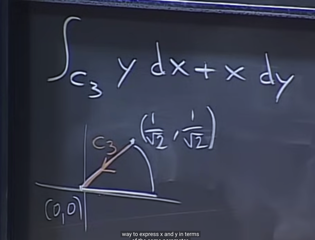</kbd>

> [!NOTE]
> đoạn thứ 3 là đoạn thẳng từ [1/sqrt(2), 1/sqrt(2)] về 0. 
>
> Thì, tương tự ta sẽ phải express x, y dưới dạng một parameter nào đó,

 

<kbd>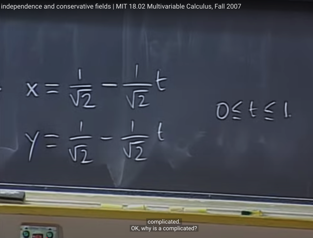</kbd>

> [!NOTE]
> Một cách làm có thể đó là như vầy: cho x, y là hàm tuyến tính theo t
> (ví dụ x = at + b với t từ 0 đến 1 ứng với x từ 1/sqrt(2) đến 0 ta tìm 
> ra a, b. Tương tự với y)
>
> Cách này hoàn toàn đúng nhưng gs cho rằng nó khiến phức tạp không
> cần thiết

 

<kbd>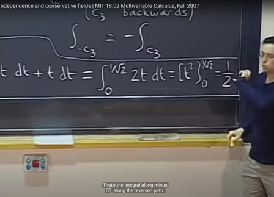</kbd>

<kbd></kbd>

<kbd>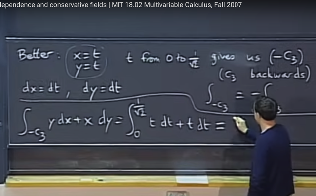</kbd>

> [!NOTE]
> Cách tốt hơn đó là cho x = t, y = t với t từ 0 đến 1/sqrt(2) nhưng khi đó,
> đường đi sẽ ngược với quỹ đạo mà ta đang làm, nên ta sẽ tính line
> integral theo cái này rồi lấy dấu âm (ý nghĩa là khi đi ngược lại thì công
> sẽ ngược dấu với qũy đạo bình thường)
>
> Hoặc cũng có dùng x = t, y = t nhưng range của t sẽ là từ 1/sqrt(2) đến 0.
> Kết quả sẽ là:
>
> tích phân từ 1/sqrt(2): 0 tdt+tdt =
>
> tích phân từ 1/sqrt(2): 0 2tdt =
>
> t^2 | 1/sqrt(2): 0 = 0 - 1/2 = -1/2

 

<kbd>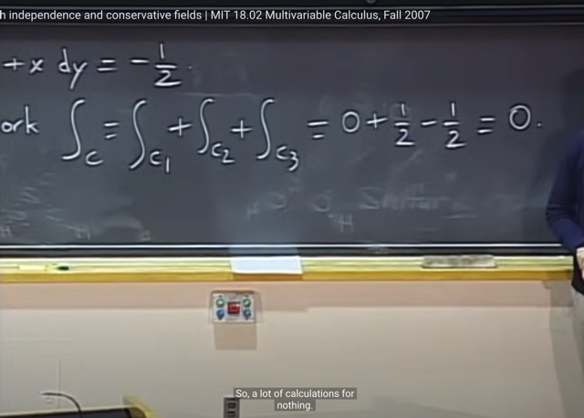</kbd>

> [!NOTE]
> Kết quả tổng ba cái
> lại ra bằng 0

 

<kbd>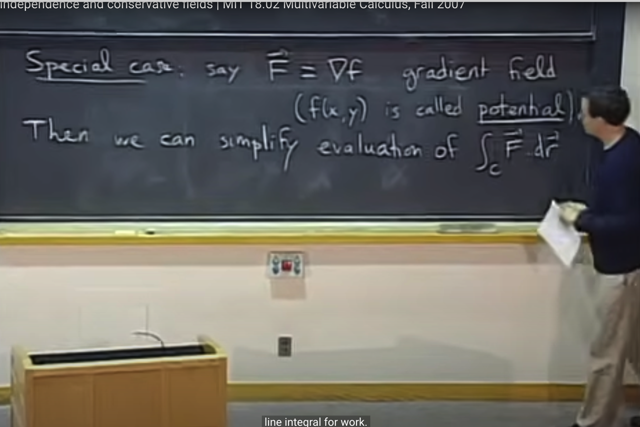</kbd>

> [!NOTE]
> Gs nói qua một trường hợp đặc biệt, đó là về một vector field đặc
> biệt mà ta đã học nhưng lúc đó ta chưa nói nó là vector field.
>
> Đó chính là gradient vector: 
>
> Cụ thể là, ta đã biết khi có function f(x,y) thì
> VECTOR MÀ COMPONENT CỦA NÓ LÀ PARTIAL DERIVATIVES
> <f_x, f_y> ĐƯỢC GỌI LÀ GRADIENT VECTOR. 
>
> Thế thì nó LÀ MỘT VECTOR, và nó PHỤ THUỘC VÀO X, Y - tức là
> với x, y khác nhau thì nó sẽ khác nhau. Do đó, gradient vector HOÀN
> TOÀN HỢP LỆ THEO ĐỊNH NGHĨA VECTOR FIELD 
>
> Và ta gọi nó là **GRADIENT FIELD**
>
> Nên ta có vector field: F = Grad_f, với f là hàm theo x, y: f(x,y)
>
> Thế thì khi đó, f(x, y) gọi là POTENTIAL

 

<kbd></kbd>

> [!NOTE]
> Gs nói thêm, Potential là khái niệm đã học trong vật lí chính là THẾ
> NĂNG. Thì gs nói đại khái là nếu đúng theo vật lí thì F phải ngược
> chiều với gradient. Nhưng ở đây chuyện này không quan trọng lắm
> nên ta không cần bám sát vật lí nên ta cứ cho F = grad_f

 

<kbd></kbd>

> [!NOTE]
> Từ đó ông cho rằng nó có thể giúp ta đơn giản hóa việc tính toán
> CÔNG CỦA LỰC (dùng line integral mà bài trước đến nay ta đang
> làm)

 

<kbd></kbd>

> [!NOTE]
> Cụ thể là trong vật lý ta đã biết rằng, CÔNG CỦA LỰC (lực điện từ,
> lực trọng trường) có thể được tính bởi SỰ THAY ĐỔI THẾ NĂNG
> (thế năng điện từ, thế năng trọng trường)
>
> Gs nói tiếp, ta đã biết rằng Fundamental Theorem of Calculus (FTC) part 2
> cho biết rằng **khi ta tích phân đạo hàm của hàm f thì ta sẽ có lại hàm f**
>
> Cụ thể là tích phân từ -inf tới x của f(t)dt = F(x)
>
> thì F'(x) = f(x) tức f là derivative của F
>
> Còn FTC part 1 thì cho ta biết tích phân từ a đến của f(t)dt
>
> sẽ bằng F(b) - F(a) (với F'(x) = f(x) như part 1 đã nói)
>
> Thì ở đây ta sẽ biết thêm FTC cho line integral hoàn toàn tương tự: là**khi
> ta tích phân gradient của function thì ta sẽ có lại function**

 

<kbd>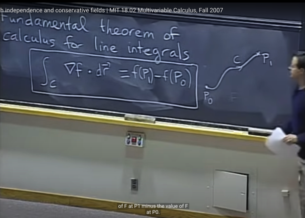</kbd>

> [!NOTE]
> Khi ta tích phân một vector field và cụ thể ở đây là gradient vector
> của một function f dọc theo đường cong (along the curve) - thể hiện
> bởi: **tích phân trên c grad_f (dot product) dr
>
> Ví dụ như theo đường cong từ P0 đến P1 thì cái ta có sẽ là 
> function f tại P1 - function f tại P0**

 

<kbd></kbd>

> [!NOTE]
> gs nói tiếp, cái này chỉ đúng nếu vector field ở đây là Gradient của
> function Grad_f (chứ ko phải vector field bất kì)
>
> Và gs cho biết qua bài sau ta sẽ có cách để kiểm tra xem vector 
> field có phải là gradient hay không và khi đó thì potential f của nó
> là gì

 

<kbd></kbd>

> [!NOTE]
> Thế thì, Grad_f là vector có hai các component như đã biết là
> partial derivatives: f_x, f_y
>
> Nên Grad_f (dot product) dr chính là **f_x*dx + f_y*dy
>
> Và f_x*dx + f_y*dy CHÍNH LÀ df (theo total differential)**Vậy tích phân trên C của Grad_F (dot product) dr chính
> là **tích phân trên C của df**

 

<kbd></kbd>

> [!NOTE]
> Và để tính tích phân trên C của df thì theo FTC Part 2, nó sẽ bằng
> [nguyên hàm] | P0:P1 chính là f (*) | P0:P1 và = f(P1) - f(P0)
>
> (*) Vì derivative của f theo f bằng 1
>
> Đây cũng là giải thích vì sao tích phân Grad_f . dr lại là f(P1) - f(P0)
> nhưng nó chưa phải là chứng minh. Tiếp sau đây ta sẽ chứng minh

 

<kbd></kbd>

> [!NOTE]
> Để chứng minh, đầu tiên ta sẽ tham số hóa quỹ đạo c theo t: tức
> là parameterize x theo t: x(t) và y theo t: y(t)

 

<kbd>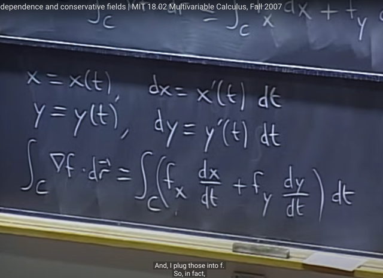</kbd>

🔗 **Related:** [LEC 11: DIFFERENTIALS, CHAIN-RULE](untitled.md#node-221)

> [!NOTE]
> Khi đó, theo implicit differential: dx = x'(t)dt và dy = y'(t)dt (theo link)
> và dy = y'(t)dt
>
> Cũng là dx/dt = x'(t) và dy/dt = y'(t)
>
> Khi đó: tích phân trên c của Grad_f (dot product) dr sẽ bằng:
>
> Từ đó f_x*dx + f_y*dy = (f_x*dx/dt + f_y*dy/dt)*dt
>
> Thế thì ta sẽ có tích phân over c [f_x*(dx/dt) + f_y*(dy/dt)]dt
>
> Thế thì đây ta nhận ra chính là CHAIN-RULE, để f_x*dx/dt +
> f_y*dy/dt chính RATE OF CHANGE CỦA F ĐỐI VỚI T: df/dt

 

<kbd>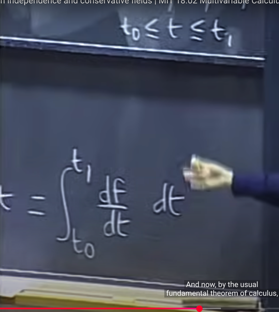</kbd>

> [!NOTE]
> Do đó nó trở thành tích phân trên C, lúc này đã parameter theo t,
> nên là tích phân từ t0 đến t1 của df/dt dt
>
> Và đây chính là TÍCH PHÂN CỦA DERIVATIVE (THEO T) CỦA HÀM
> F THÌ THEO FTC PART 2, NÓ TRỞ THÀNH HÀM F | EVALUATE
> TẠI T1 - HÀM F EVALUATE TẠI T0 TỨC f(t1)
> - f(t0)

 

<kbd>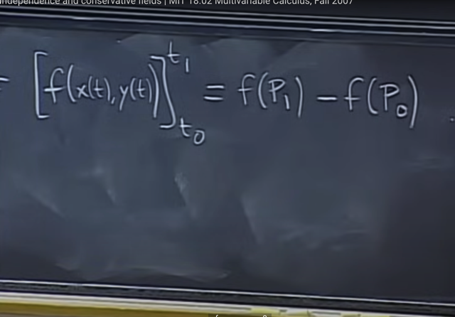</kbd>

> [!NOTE]
> Và hàm f phải nói rõ nó là hàm theo x, y. Nhưng khi ta parameter
> x, y theo t để có x(t). y(t). Ta gắn vào f thì f trở thành hàm theo t:
> f(x(t), y(t))
>
> Và f(x(t1), y(t1)) chính là f(P1) và f(x(t0), y(t0)) là f(P0)
>
> Và đó là chứng minh xong

 

<kbd>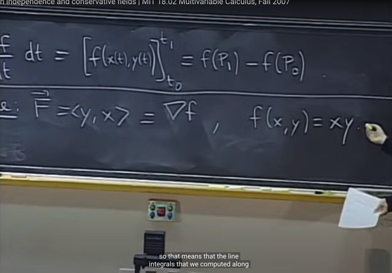</kbd>

> [!NOTE]
> Thế thì ứng dụng theorem vừa rồi để giải lại bài toán hồi nãy. Thì
> đầu tiên với vector field F = y*i^ + x*j^, hay F = <y, x> Ta sẽ đặt
> câu hỏi potential là gì. Hay nếu GRADIENT VECTOR CỦA
> FUNCTION LÀ <Y, X> THÌ HÀM FUNCTION LÀ GÌ.
>
> Dễ thấy nếu Grad vector grad_f là <y, x> thì tức là:
>
> f_x = y và f_x = y và f dễ thấy chính là f = xy

 

<kbd>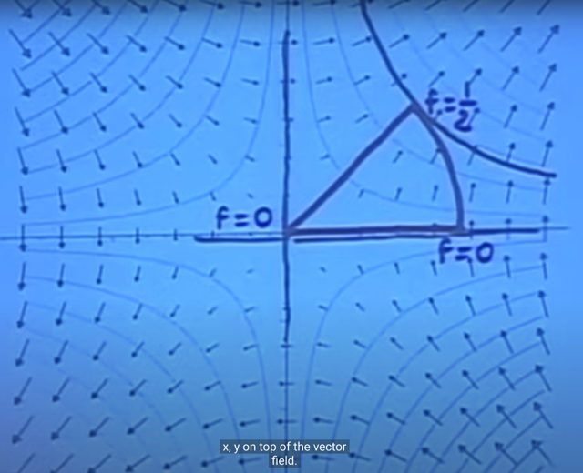</kbd>

> [!NOTE]
> Khi đó, ta quay lại hình ảnh của vector field, với vẽ thêm CONTOUR
> PLOT CỦA HÀM F = XY.
>
> Ta áp dụng định lý vừa rồi để:
>
> công của lúc F trên c1, là line integral trên c1 của grad (dot product) dr
> sẽ là [hàm f evaluate tại điểm cuối - f evaluate tại điểm đầu].
>
> Mà c1 CHÍNH LÀ TRÙNG VỚI LEVEL CURVE ỨNG VỚI GIÁ TRỊ
> BẰNG 0 CỦA F=XY, NÊN DĨ NHIÊN TRÊN ĐOẠN NÀY F KHÔNG
> THAY ĐỔI, DO ĐÓ [hàm f evaluate tại điểm cuối - f evaluate tại điểm
> đầu] = 0 - 0 = 0
>
> Tương tự xét công của lực F trên c2 theo định lí vừa rời nó sẽ là 
> hàm f (f(x,y) = xy) evaluate tại điểm cuối - chính là ứng với điểm nằm 
> trên level curve f = 1/2 trừ hàm f evaluate tại điểm đầu là f = 0. Ta có
> kết quả là 1/2 - 0 = 1/2
>
> Hoàn toàn tương tự, trên curve c3, thì ta sẽ có kết quả là 0 - 1/2 = -1/2
>
> Tổng lại là bằng 0

 

<kbd>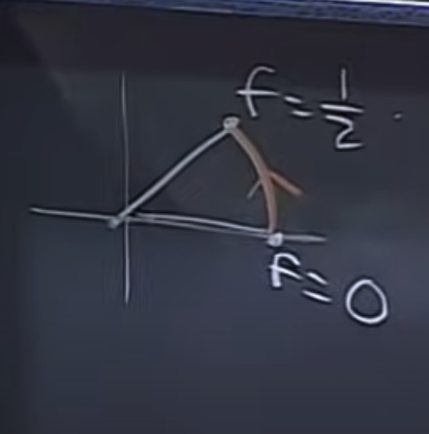</kbd>

> [!NOTE]
> Và xét cả tổng quỹ đạo. thì vì điểm đầu điểm cuối trùng nhau, nên
> kết quả đơn giản là phải bằng 0 vì nó là hiệu của hàm f evaluate tại
> cùng 1 điểm

 

<kbd></kbd>

> [!NOTE]
> Và gs nói đây là định lí quan trọng để áp dụng vì nhiều vector field
> trong thực tế THẬT SỰ LÀ GRADIENT CỦA POTENTIAL
> FUNCTION NÀO ĐÓ.
>
> Ví dụ như vector field của lực trọng trường (Gravity field)  sẽ là
> gradient của function thế năng trọng trường (như đã nói bám sát
> theo vật lý thì nó sẽ là ÂM của thế năng trọng trường). Điện trường
> (electrical field) cũng là gradient field
>
> Tuy nhiên ví dụ như vector field của từ trường (magnetic field) thì
> không phải gradient field

 

<kbd>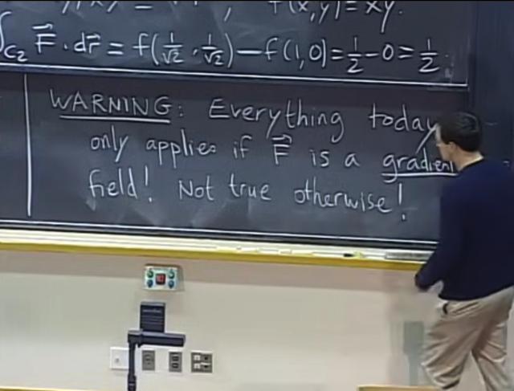</kbd>

> [!NOTE]
> gs cảnh báo lần nữa, những gì học trong bài này như định lí vừa
> rồi chỉ áp dụng nếu Vector field là Gradient (tức là vector là
> gradient của một function nào đó)
>
> Và ta đã nói nhiều lần không phải vecto field nào cũng vậy

 

<kbd></kbd>

> [!NOTE]
> Ta nói qua các định lý hệ quả của Fundamental theorem hồi nãy
> mà quan trọng nhất là PATH 0- INDEPENDENCE:
>
> Nói rằng, nếu ta có vector field LÀ MỘT GRADIENT FIELD
> THÌ KHI ĐÓ, LINE INTEGRAL SẼ CHỈ PHỤ THUỘC ĐIỂM
> ĐẦU ĐIỂM CUỐI. Tức là miễn là các quỹ đạo c có chung điểm
> đầu điểm cuối thì kết quả line integral - tích phân trên c_i của 
> [F dot product dr] = [Grad_f dot product dr] sẽ đều bằng nhau
>
> Từ đó, miễn là ta biết vector field là gradient field thì dù không biết
> cụ thể function f thì ta vẫn được quyền dùng Path Independence

 

<kbd></kbd>

> [!NOTE]
> Thế thì hệ quả thứ hai là nếu vector field LÀ GRADIENT FIELD, THÌ NÓ
> CÓ TÍNH CONSERVATIVE (BẢO TOÀN)
>
> Cụ thể là, nếu đường quỹ đạo khép kin (CLOSED) THÌ LINE INTEGRAL
> TRÊN ĐÓ CỦA F . dr SẼ LUÔN BẰNG 0
>
> Và điều này giải thích cho việc, trong trường vector mà là GRADIENT
> FIELD, THÌ KHÔNG THỂ CÓ CHUYỆN OBJECT DI CHUYỂN HOÀI
> TRÊN QUỸ ĐẠO KHÉP KÍN NẾU KHÔNG CUNG CẤP THÊM NĂNG
> LƯỢNG Ở NGOÀI VÀO HỆ VÌ TỔNG CÔNG BẰNG 0.
>
> Và điều này có nghĩa là ko thể extract miễn phí năng lượng từ force
> field, (nên không có chuyện tạo ra động cơ vĩnh cữu dựa vào trọng lực)
>
> Nhưng với từ trường, thì vì không phải là gradient field nên có thể có
> chuyện đó nên ta mới thấy có nhiều món đồ chơi kiêu như động cơ vĩnh
> cữu miễn là có từ trường (có pin để duy trì từ trường)

 

<kbd></kbd>

> [!NOTE]
> Đương nhiên chứng minh nó thì hiển nhiên vì f(end) - f(start)
> mà end == start nên bằng 0

 

<kbd></kbd>

> [!NOTE]
> Thế thì quay lại ví dụ bữa trước, với vector field F = <-y, x> ta đã tính
> line integral trên quỹ đạo kín là đường tròn đơn vị thì ta đã lập luận
> như sau:
>
> làm theo cách thể hiện tích phân F dot product dr theo dạng tích phân
> của F dot product T^ ds với T^ là vector tiếp tuyến đơn vị thì khi đó F
> song song T^, nên F dot product T^ = |F|*|T^|*cos(0) = |F|*1*1 = |F| và
> |F| = r = 1 (tại sao thì vì |F| = sqrt(y^2 + x^2) = sqrt(r^2) = 1)
>
> Và từ đó tích phân có kết quả là tích phân 1 ds = 2pi
>
> Vậy thì ý chính là KẾT QUẢ TÍCH PHÂN TRÊN QUỸ ĐẠO KHÉP KÍN
> KHÁC 0 NÊN TA SUY RA VECTOR FIELD NÀY **KHÔNG PHẢI LÀ
> GRADIENT FIELD.**

 

<kbd>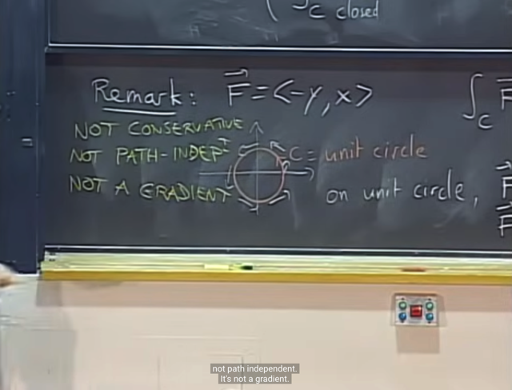</kbd>

> [!NOTE]
> Và đương nhiên nó cũng sẽ không có tính chất PATH
> INDEPENDENCE, CONSERVATIVE
>
> Q: Có thể nào có tính chất Path independence nhưng không
> conservative không?
>
> -> Không, vì thật ra hai cái này là một. ta sẽ thấy nó sau đây

 

<kbd></kbd>

<kbd></kbd>

<kbd>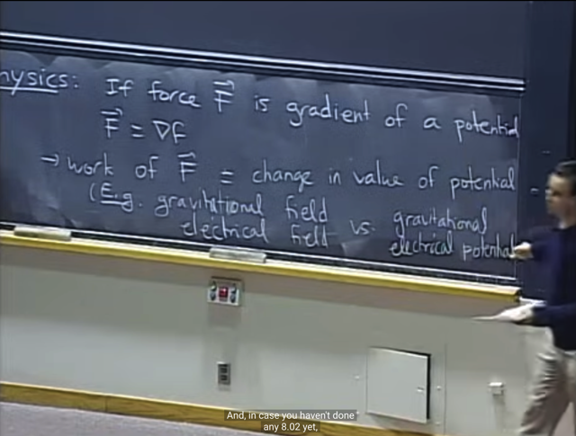</kbd>

> [!NOTE]
> Tiếp theo, gs nhắc lại thì nếu nói đúng theo vật lí thì trường lực
> (force field, là vector field) nếu là gradient field thì LỰC F SẼ LÀ ÂM
> CỦA GRADIENT: F = - Grad_f. (f gọi là Potential)
>
> Nhưng trong class này gs cho đơn giản hóa bằng cách coi như  F =
> grad_f (đã nói ý này ở phần trước)
>
> Thế thì, ta đã chứng minh chán chê, rằng CÔNG CỦA LỰC F
> (WORK OF F) CHÍNH LÀ THAY ĐỔI (HIỆU) CỦA POTENTIAL (THẾ
> NĂNG) (mà fundamental theorem đã học hồi nãy: line integral  = f
> evaluate tại điểm cuối - f evaluate tại điểm đầu)
>
> Mà nhắc lại một số cái trong thực tế thỏa mãn là Gradient field:
> trọng trường, điện trường -tương ứng với thế năng hấp dẫn, và thế
> năng điện trường (điện thế)

 

<kbd></kbd>

> [!NOTE]
> Đây cũng chính là ĐỊNH LUẬT BẢO TOÀN NĂNG LƯỢNG
> TRONG VẬT LÝ: không thể extract năng lượng từ trường lực, tổng
> năng lượng của hệ được bảo toàn (conserved)

 

<kbd></kbd>

> [!NOTE]
> Và ta có các tính chất tương đương (cũng là các tính chất / hệ quả
> hồi nãy khi vector field là gradient field, chẳng qua là ở đây đang
> xét force field mà thỏa tính chất là gradient field)
>
> Tính chất 1) cũng như đã biết hồi nãy là tính chất Conservative:
> tích phân của F dr trên quỹ  đạo kín là bằng 0
>
> và 2) là Path Independence: miễn là điểm đầu cuối giống nhau thì
> tích phân trên các c_i F. dr đều bằng nhau
>
> Và nói hai cái này equivalent là bởi chúng có thể suy ra nhau.
>
> Ví dụ nếu có Path independent thì ta có thể coi c1 là quỹ đạo  đi
> một vòng về lại chỗ cũ và c2 là quỹ đạo không đi đâu hết mà đứng
> yên, thì path independence cho biết line integral trên c1, c2 bằng
> nhau. Mà line integral trên c2 dĩ nhiên là bằng 0, suy ra trên c1
> cũng bằng 0 - mà c1 có thể là đường khép kín bất kì nên đây
> chính là "conservative"
>
> Ngược lại, nếu có Conservative, thì tức là line integral trên bất kì
> closed curve nào cũng bằng 0, thì ta luôn có thể chia nó làm hai
> đoạn một đoạn đi một đoạn về, có tổng công (line integral) bằng 0,
> thì  chuyển vế đổi dấu để ta có hai đường đi đến cùng 1 điểm sẽ
> có công bằng nhau

 

<kbd></kbd>

> [!NOTE]
> Và tính chất tương đương thứ 3 là: nếu có path independence hoặc
> conservative thì ta có thể suy ra force field (vector field) LÀ MỘT
> GRADIENT FIELD.
>
> Tức là vector field có là gradient field khi và chỉ khi nó có tính chất
> path independence và conservative

 

<kbd></kbd>

> [!NOTE]
> Và cuối cùng đại khái là, nếu vector field define bởi F = M*i^ + N*j^ mà
> là gradient field thì khi đó Mdx + Ndy chính là differential df (dễ hiểu vì
> khi đó M, N chính là f_x, f_y, thì f_x*dx + f_y*dy chính là df (total
> differential)

 

