# Lec 21: Gradient Field & Potential Function

📊 **Progress:** `35` Notes | `35` Screenshots

---

<kbd>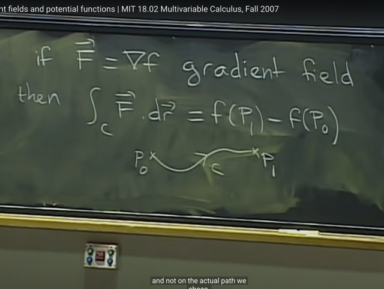</kbd>

> [!NOTE]
> gs nhắc lại bài trước ta đã học rằng, nếu vector field F ( = M*i^ + N*j^)
> mà LÀ MỘT GRADIENT FIELD (tức là vector F LÀ VECTOR GRADIENT
> CỦA MỘT FUNCTION f nào đó) thì khi đó Fundamental Theorem đối với
> tích phân đường cho ta biết: tích phân trên đường (quỹ đạo) c từ P0 đến
> P1 của F dot product dr sẽ luôn bằng f(P1) - f(P0) bất kể c nào miễn là
> đầu cuối là P0, P1

 

<kbd>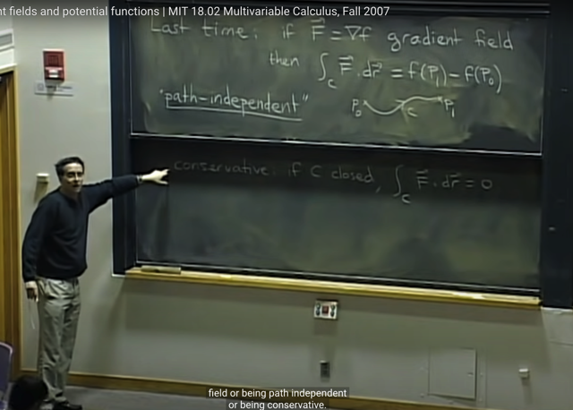</kbd>

> [!NOTE]
> Và ta cũng đã biết hai hệ quả / tính chất của gradient field là
> PATH INDEPENDENCE và CONSERVATIVE
>
> Thì bài hôm nay ta sẽ học cách để kiểm tra xem một vector field
> có phải là gradient field không và nếu phải thì potention function
> của nó là gì

 

<kbd>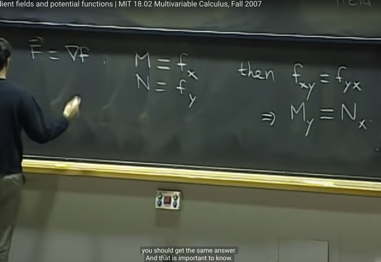</kbd>

> [!NOTE]
> Thế thì, cho vector field F là một gradient field: **vector F = Grad_f**.
> thì ta đã biết, điều này đồng nghĩa là component M, N của F chính
> là component của grad_f - chính là các partial derivative:
>
> nên M = f_x, N = f_y
>
> Hơn nữa, ta đã học rằng f_xy = f_yx (second derivative, lấy f_x
> đạo hàm f_x, theo y thì nó cũng bằng với đạo hàm f theo y rồi lấy
> kết quả đạo hàm theo x)
>
> Như vậy f_xy = M_y (M là f_x, nên đạo hàm của f_x theo y, tức f_xy
> sẽ là M_y) và f_yx = N_x
>
> Từ đó ta có: **M_y = N_x**

 

<kbd>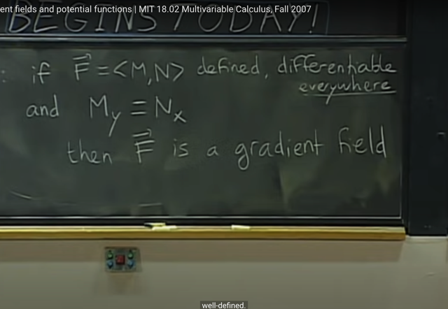</kbd>

> [!NOTE]
> từ đó ta có một điều kiện để kiểm tra xem vector field có phải là
> gradient field hay ko: Đó là nếu một vector field F = <M, N> có tính
> chất defined, differentiable ở mọi nơi và M_y = N_x thì khi đó vector
> field F LÀ MỘT GRADIENT FIELD.

 

<kbd>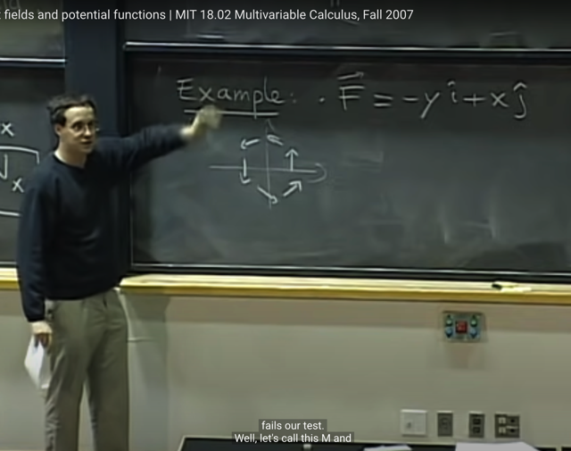</kbd>

> [!NOTE]
> Ta sẽ quay lại ví dụ vector field F = <-y, x>, mà ta đã biết nó không
> phải là gradient field vì không có hai tính chất Path independence và
> Conservative (vốn dĩ là một) bởi khi ta tính line integral trên đường
> tròn đơn vị (khép kín) thì kết qủa ra khác 0

 

<kbd>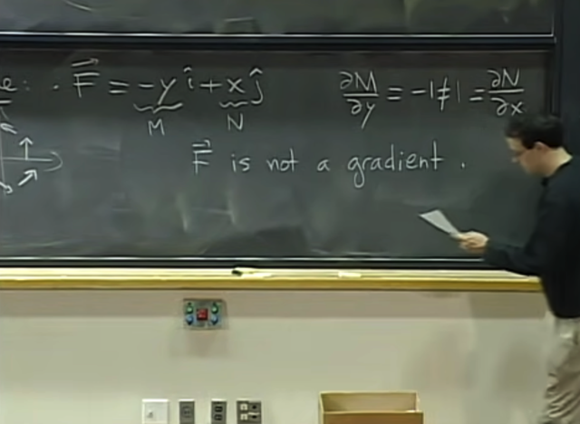</kbd>

> [!NOTE]
> vậy thì ta check lại xem nó có phải là gradient field không dựa vào 
> điều kiện vừa mới nói: M_y = N_x
>
> Thế thì M_y = -1 khác N_x = 1 Vậy rõ ràng nó không phải gradient
> field

 

<kbd>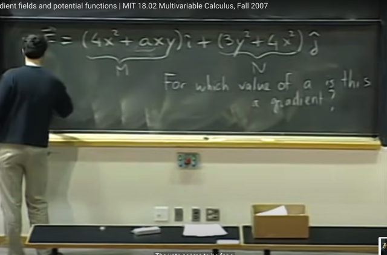</kbd>

> [!NOTE]
> ví dụ thứ hai, là cho vector field này, câu hỏi là a phải bằng bao
> nhiêu để F là một gradient field

 

<kbd>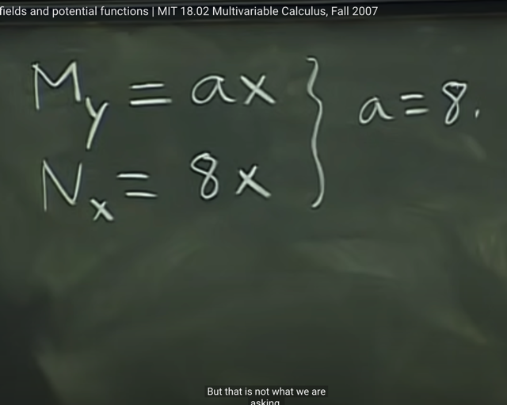</kbd>

> [!NOTE]
> Thế thì đơn giản là ta cần a sao cho M_y (M sub y) = N_x
> và giải ra ta có a = 8.
>
> Gs nói thêm, cái ta cần (ý nói điều kiện vector field là gradient
> field ở trên) không phải là M_y = N_x khi x bằng mấy, mà phải
> là tại mọi x. Nên dù a khác 8 nhưng x = 0 thì M_y vẫn bằng N_x
> nhưng như vậy không đúng.
>
> Mà phải là M_y = N_x Ở MỌI X

 

<kbd></kbd>

> [!NOTE]
> Thế thì, tiếp theo, ta sẽ nói về cách tìm potential function nếu ta đã kết
> luận vector field F là một gradient field từ phép thử vừa rồi.
>
> (Ôn lại: Ta bắt đầu với khái niệm vector field - là khi mà tại mỗi điểm ta
> có một vector mà component của vector phụ thuộc vào điểm đó (x,y)
> Thế thì sau đó ta mới nhận ra gradient field là một vector field vì
> gradient vector có component là partial derivative của f wrt x, y nên
> gradient vector phụ thuộc x, y do đó nó chính là một vector field. Thế
> thì câu hỏi là nếu ta biết một vector field là gradient field thì làm sao để
> tìm hàm f (vì gradient vector là vector các partial derivatives của hàm
> f)
>
> Thì phương pháp đầu tiên là Tính line integral

 

<kbd>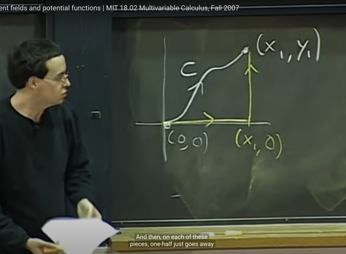</kbd>

> [!NOTE]
> Phương pháp thứ nhất - tính line integral có nghĩa là vầy: ta tính
> line integral của F dot product dr trên curve c từ (0,0) đến (x1,y1)

 

<kbd>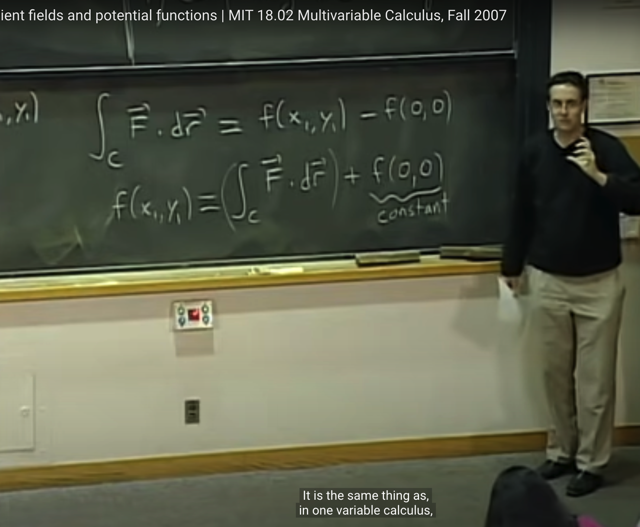</kbd>

> [!NOTE]
> Thì theo Fundamental Theorem of Calculus ta đã biết ta có: tích
> phân này bằng f(x1,y1) - f(0,0).
>
> Từ đó f(x1,y1) = line integral + f(0,0)
>
> Và thông qua đó ta có thể tìm được function f (tí nữa thông qua ví
> dụ ta sẽ thấy rõ hơn)

 

<kbd></kbd>

> [!NOTE]
> Thế thì gs cho rằng, đương nhiên ta không việc gì phải chọn 
> curve này, ta có thể chọn curve đơn giản nhất là đường (0,0)-(x,0)
> và (x1,0)-(x1,y1)
>
> Vì ở trên curve này, mỗi đoạn, sẽ là "giữ một biến constant" nên
> tí nữa ở ví dụ ta sẽ thấy tại sao nó đơn giản

 

<kbd>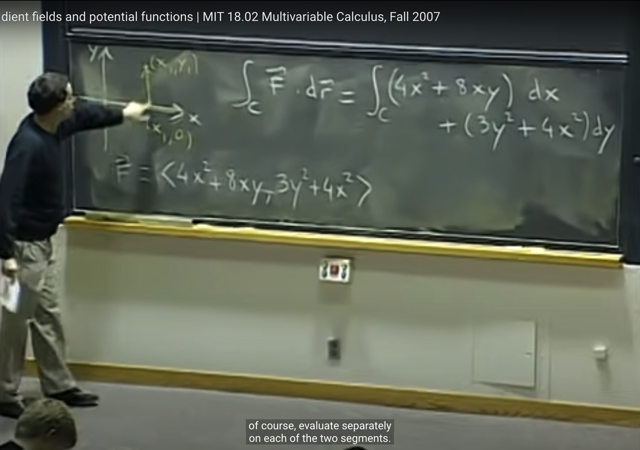</kbd>

> [!NOTE]
> Ta làm ví dụ, tìm potential function của gradient field vừa rồi F =
> <M=4x^2+8xy, N=3y^2+4x^2> (với a = 8, thì nó là một gradient field)
>
> Như đã biết tích phân trên curve c F dot dr = tích phân trên c của
> M*dx + N*dy
>
> Và ta sẽ chia làm 2 phần c1 là từ (0,0) đến (x1,0) và c2 từ (x1,0) đến
> (x1,y1)

 

<kbd>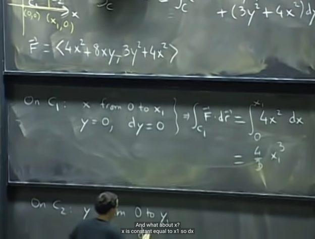</kbd>

> [!NOTE]
> Thế thì trên c1: nó sẽ tương ứng với x từ 0 đến x1, và y giữ constant
> = 0, cho nên dy = 0 và tích phân đường trên c1 trở nên đơn giản hóa
> chỉ còn: tích phân x từ 0 đến x1 của 4x^2dx tính ra đơn giản là (4/3)x1^3

 

<kbd>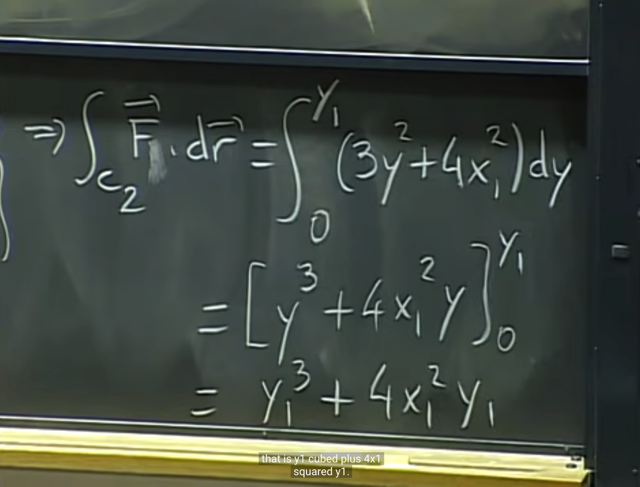</kbd>

> [!NOTE]
> còn trên c2 thì x constant -> dx = 0 và y biến đổi từ 0 đến y1
> nên tích phân cần tính trở thành tích phân y từ 0 đến y1 của
> (3y^2 + 4x1^2)dy = y1^3 + 4x1^2y1

 

<kbd>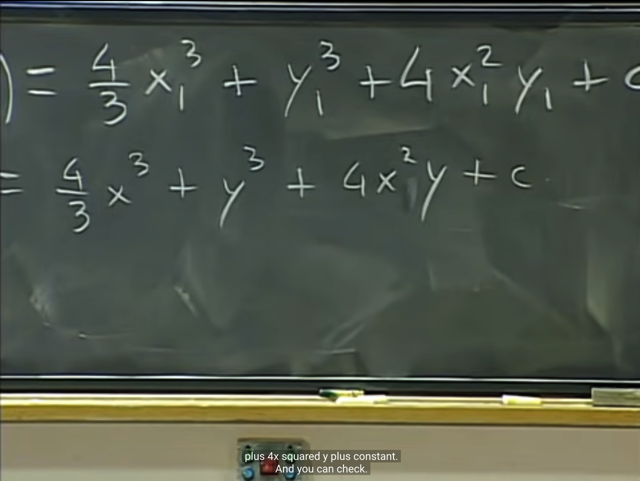</kbd>

> [!NOTE]
> Như vậy f(x1,y1) = integral trên c1 + c2 + f(0,0) = (4/3)x1^3 +
> y1^3 + 4x1^2y1 + f(0,0) và f(0,0) vốn chỉ là một constant c nào đó
>
> nên f(x1,y1) = (4/3)x1^3 + y1^3 + 4x1^2y1 + c
>
> Và từ đó f(x,y) = (4/3)x^3 + y^3 + 4x^2y + c

 

<kbd></kbd>

> [!NOTE]
> gs nói thêm nếu câu hỏi là tìm potention thì không cần c, hay tương 
> đương c = 0 cũng là valid answer
>
> Thêm nữa, gs cho rằng phần lớn trường hợp ta sẽ thấy chọn curve như
> vừa rồi là đơn giản nhất nhưng cũng có ngoại lệ đôi khi chọn curve khác 
> như đi thẳng từ (0,0) đến (x1,y1) lại là dễ tính hơn

 

<kbd>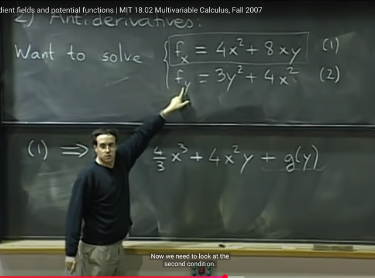</kbd>

> [!NOTE]
> Phương pháp thứ hai là dựa vào tìm nguyên hàm (Anti derivatives)
>
> Thế thì ta đã biết F là gradient field, thì vector F = <M, N> thì M
> chính là partial derivative f_x và N chính là partial derivative f_y
>
> Vậy ta cần tìm nguyên hàm (hàm f) sao cho f_x = 4x^2 + 8xy và 
> f_y = 3y^2 + 4x^2
>
> Thế thì từ 1, ta có thể suy ra f = (4/3)x^3 + 4x^2y + g(y): Sở dĩ có g(y)
> là vì đây (f_x) là partial derivative của f wrt x, thì constant đối với x
> không nhất thiết phải là constant đối với y, mà có thể là hàm theo y
>
> Vậy từ (1) ta có mọi hàm f  có dạng  f = (4/3)x^3 + 4x^2y + g(y) đều
> thỏa (1)

 

<kbd>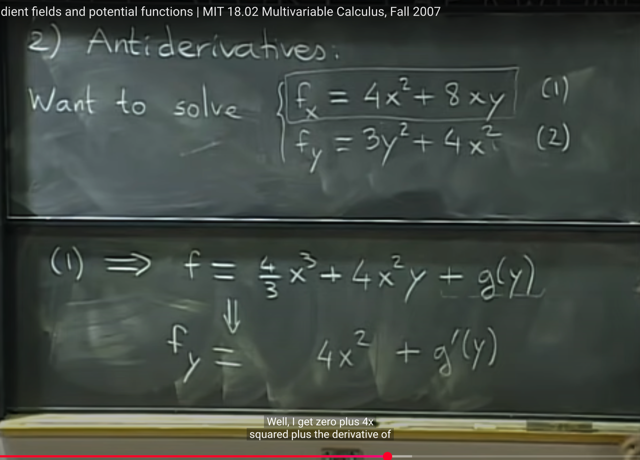</kbd>

> [!NOTE]
> Thế thì từ đó ta tính f_y = 4x^2 + g'(y) đặng tiếp theo dựa vào (2) để 
> mà tính tìm ra g(y) từ đó hoàn thành tìm ra f

 

<kbd>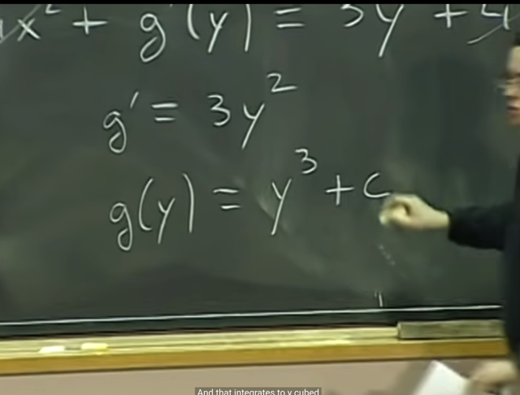</kbd>

> [!NOTE]
> rồi, dựa vào (2) ta solve ra g'(y) = 3y^2 từ đó suy ra g(y) = y^3 + c
> và c lần này gs cho rằng là TRUE CONSTANT vì nó không depend
> on x lẫn y (khác với g(y) là constant theo x, không depend on x, nhưng
> vẫn có thể depend on y)

 

<kbd>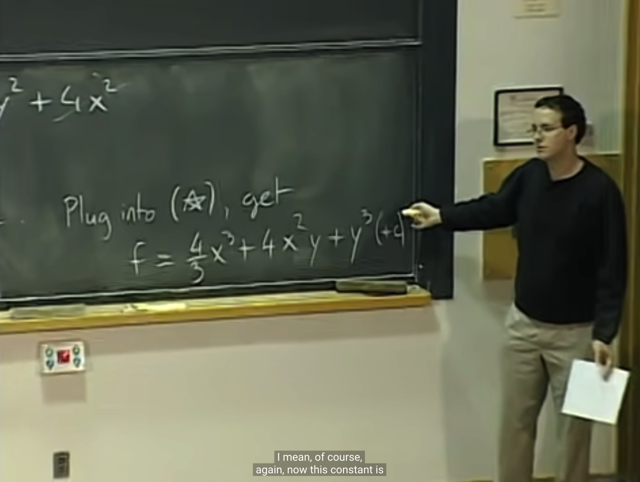</kbd>

> [!NOTE]
> Và gắn g(y) vào f tìm ra từ (1) ta có f = (4/3)x^3 + 4x^2y + y^3
> + c và again gs nói c là optional (có thể khỏi cần, ứng với c = 0, vì
> yêu cầu chỉ là tìm potential function chứ không phải tìm mọi
> potential function)
>
> Và kết quả này giống với cách 1

 

<kbd></kbd>

> [!NOTE]
> Thế thì cách 2 này có ưu điểm so với cách 1 là không phải tính
> integral như cách 1.
>
> Nhưng ta phải làm theo đúng quy trình này, đó là dựa vào (1) tính
> ra f với constant term đói với x g(y) và dựa vào (2) để tìm g(y)
>
> Chứ có một cám dỗ hay gặp là ta dựa vào (2) để tìm f mà trong đó
> sẽ có constant term đối với y là h(x)
>
> Thì khi đó sẽ khó mà match giữa hai cái để tìm ra f

 

<kbd>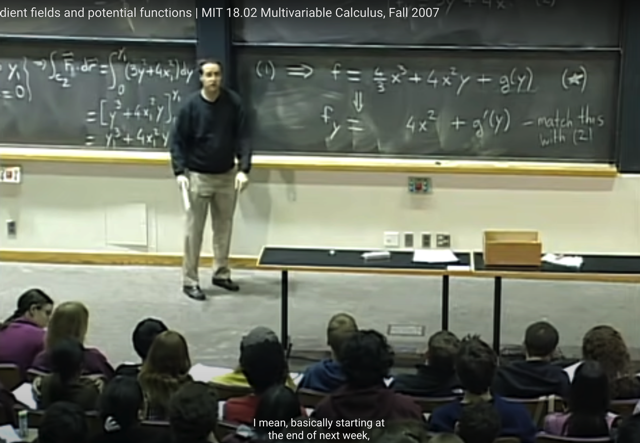</kbd>

> [!NOTE]
> và  gs nói khi mà ta tìm ra g(y) thì nếu nó còn dính tới x thì chứng
> tỏ ta đã làm gì sai, nên quay lại kiểm tra (vì đã nói g(y) là constant
> đối với x, nên không thể phụ thuộc x
>
> Và phương pháp này sẽ có thể áp dụng với 3, hay nhiều biến hơn
> mà qua các bài sau ta sẽ thấy

 

<kbd>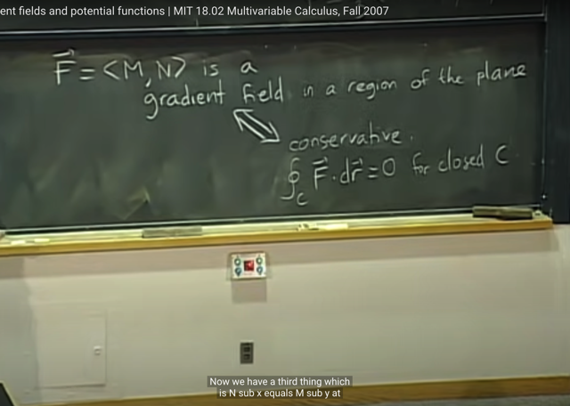</kbd>

> [!NOTE]
> Tiếp theo gs giới thiệu cho ta một notation mới, không có gì khác,
> như đã biết khi ta có vector field F là một gradient field thì khi và chỉ
> khi (dấu tương đương, suy ra 2 chiều) nó có tính conservative: line
> integral của F dr trên closed curve bằng 0.
>
> Thì notation mới ở đây đó là người ta thêm một kí hiệu hình tròn ở
> dấu tích phân để nhắc nhở đây là line integral trên một closed curve

 

<kbd>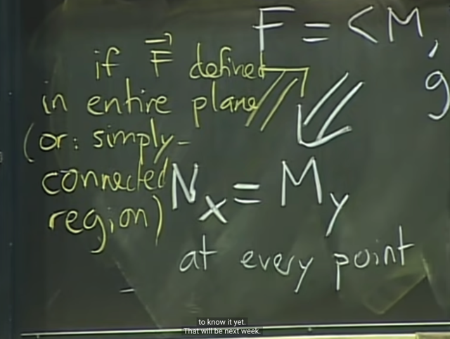</kbd>

> [!NOTE]
> Và trong bài này ta cũng đã học thêm một dấu tương đương nữa
> là:
>
> 1) nếu gradient field thì ta sẽ có M_y = N_x
>
> 2) nếu có M_y = N_x thì cần thêm điều kiện nữa là i) F defined
> trên  mọi điểm trên plane hoặc ii) ta có SIMPLY-CONNECTED
> REGION (sẽ học trong các bài sau) thì khi đó F là gradient field

 

<kbd>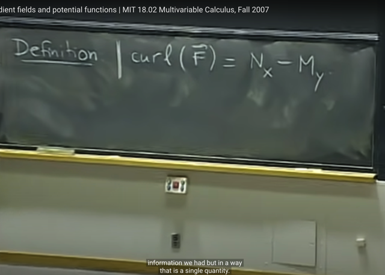</kbd>

> [!NOTE]
> Tiếp ta sẽ nói về một định nghĩa
> mới là curl(F) = N_x - M_y

 

<kbd>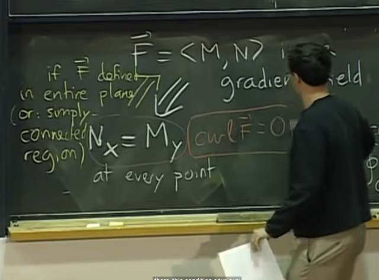</kbd>

> [!NOTE]
> Và với khái niệm mới này thì điều kiện Gradient field ở trên trở
> thành curl(F) = 0

 

<kbd>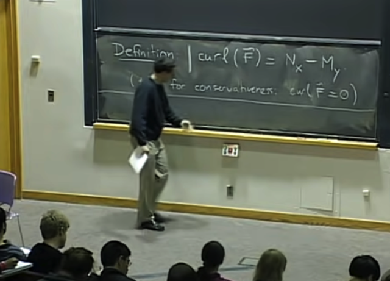</kbd>

> [!NOTE]
> Từ đó ta sẽ có điều kiện để kiểm tra vector field (cụ thể trong vật lí, xét
> một trường lực F - force field) xem có tính "bảo toàn" (conservative)
> hay không đó là curl(F) = 0 (vì force field (vector field) chỉ có tính
> conservative nếu nó là gradient field)

 

<kbd></kbd>

> [!NOTE]
> Gs trả lời câu hỏi của student đại khái là:
>
> Nếu vector field fail phép thử (M_y = N_x) này thì đương nhiên nó
> không phải là gradient field.
>
> Nhưng nếu nó pass nhưng vẫn không chắc là F có defined ở mọi
> điểm trong plane không thì ta không thể chắc chắn F là gradient
> field

 

<kbd>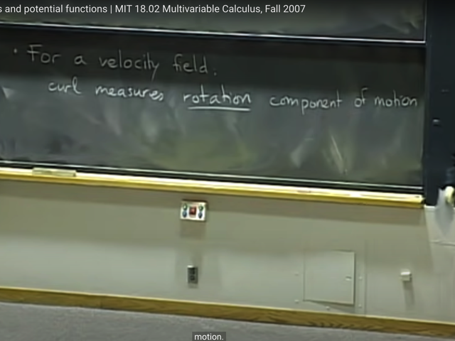</kbd>

> [!NOTE]
> ý nghĩa của nó nếu là velocity field (tức là vector field mà các vector
> là velocity vector) thì curl sẽ là đại lượng mang ý nghĩa đo lường sự
> "xoay" / "xoắn" của chuyển động

 

<kbd>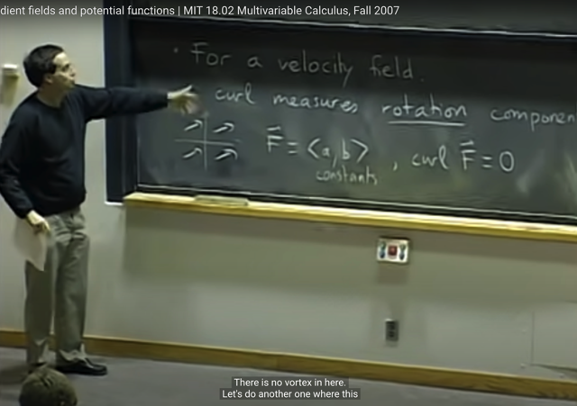</kbd>

> [!NOTE]
> Ví dụ ta có vector field như này, F = <a, b> với a, b là constant, thì đây
> là vector field có curl(F) = 0 (vì partial derivative M_y và N_x đều bằng
> nhau, và bằng 0). Và hình ảnh của vector field này với các vector song
> song ta có thể qua đó để hiểu không có sự "xoắn" nào

 

<kbd>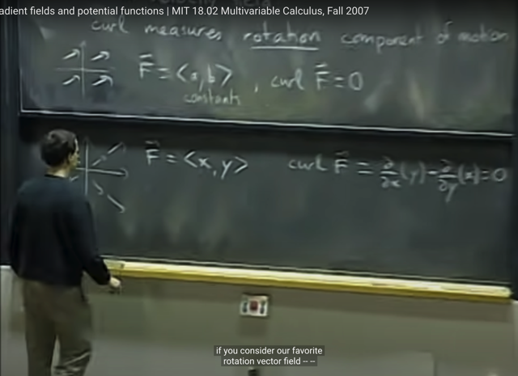</kbd>

> [!NOTE]
> Tương tự với vector field này, F = <x, y> ta cũng có M_y (= partial
> derivative of M wrt y = 0 vì M = x không depend on y) = N_x (cũng
> bằng 0 vì N = y không depend on x)
>
> Do đó curl cũng bằng 0 và hình ảnh vector field là các vector cũng
> đi xa khỏi origin. Ta cũng không có yếu tố xoay / xoắn nào

 

<kbd>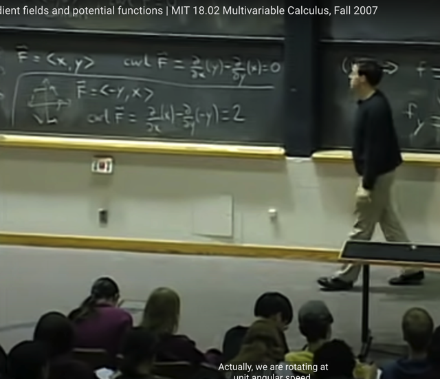</kbd>

> [!NOTE]
> Còn với vector field F = <-y, x> thì curl F = 2, hình ảnh của
> vector field dễ thấy yếu tố xoay

 

<kbd>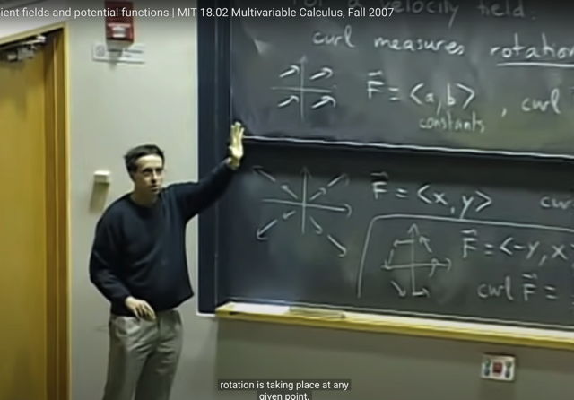</kbd>

> [!NOTE]
> Nói chung ta chỉ cần hiểu là khái niệm curl sẽ measure rằng tại
> một điểm bất kì thì mức độ rotation nhiều ít như thế nào
>
> Và trong những case phức tạp hơn thì curl có thể phụ thuộc
> x, y ở đây (tức là không phải constant như ví dụ này)
>
> Một ví dụ dễ hình dung là khi ta nhìn vào bản đồ gió thì thì có những
> chỗ mức độ rotation lớn hơn những chỗ khác ví dụ như nơi có cơn
> bão
>
> Và dấu của curl cho ta biết hướng xoay là thuận hay nghịch chiều
> kim đồng hồ

 

<kbd>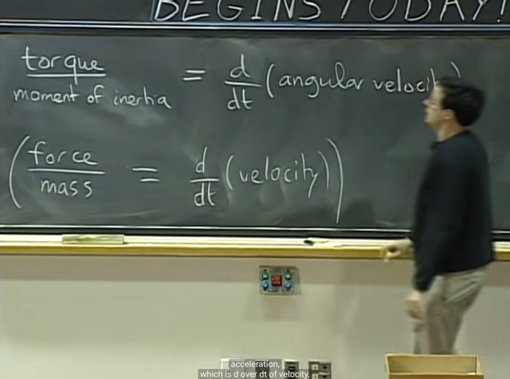</kbd>

> [!NOTE]
> Đối với trường lực (force field) (vừa rồi là nói với trường vector vận
> tốc - velocity field) thì curl sẽ đại diện cho / đánh giá cho "MÔ MEN
> XOẮN" (TORQUE)
>
> Nó tương đương như: **lực / khối lượng ra gia tốc** (F=ma =>a = F/m)
>
> thì **lực / mômen quán tính ra gia tốc xoay / xoắn**

 

