# Lec 22: Green's Theorem

📊 **Progress:** `26` Notes | `31` Screenshots

---
<a id="node-568"></a>

<p align="center"><kbd>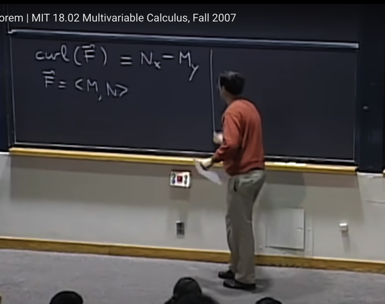</kbd></p>

> [!NOTE]
> Mở đầu gs nhắc lại bài trước ta đã biết khái niệm Curl of vector field:
> ```text
> Curl(F) = N_x - M_y
> ```
>
> Là cái cho ta biết how far một vector field có tính chất conservative
> (curl `=` 0 thì vector field sẽ conservative, thì curl càng lớn tức càng
> xa tính chất conservative)
>
> Thế thì conservative là tính chất mà ta đã biết là nếu ta tính line integral
> trên một đường closed curve thì sẽ bằng 0.

<br>

<a id="node-569"></a>

<p align="center"><kbd>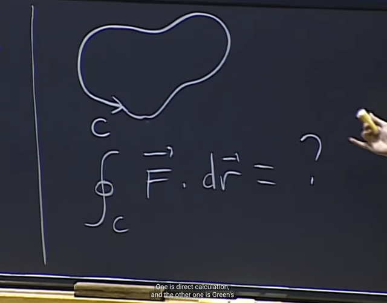</kbd></p>

> [!NOTE]
> Thế thì nếu conservative thì ta suy ra ngay nó bằng 0 rồi, nhưng nếu
> không thì ta có khi muốn tính thì ngoài việc tính trực tiếp line integral thì
> gs cho rằng có thể có cách khác để tính line integral đối với closed curve
> mà bài này ta sẽ học đó là dùng Green's theorem

<br>

<a id="node-570"></a>

<p align="center"><kbd>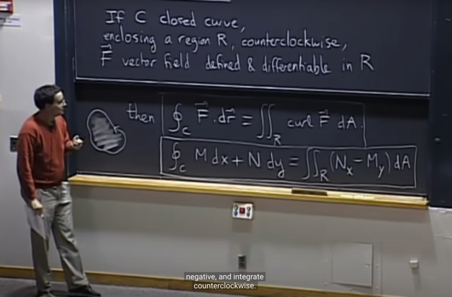</kbd></p>

> [!NOTE]
> Thế thì định lý Green's nói rằng nếu ta có đường khép kín c bao quanh
> một vùng R và ta di chuyển trên đường khép kín c theo chiều ngược
> chiều kim đồng hồ. Và trên vùng này có trường vector F có tính defined
> và differentiable
>
> Khi đó tích phân đường trên curve c của F dot dr là bằng tích phân kép
> trên vùng R của curl(F) dA
>
> Và như vậy ta có:
>
> Tích phân trên curve c của Mdx `+` Ndy (là một cách thể hiện của  F dot
> dr) sẽ bằng tích phân kép trên vùng R của `(N_x` `-` `M_y)` dA
>
> Thế thì gs lưu ý ta rằng, hai vế trái phải của định lý này có bản chất
> khác nhau, một cái là tích phân trên đường cong c trong khi vế phải là
> tích phân kép trên vùng (area) bên trong đường c.
>
> Gs nói thêm việc tính theo chiều ngược kim đồng hồ là để match với
> ```text
> convention là curl(F) = N_x - M_y
> ```

<br>

<a id="node-571"></a>

<p align="center"><kbd>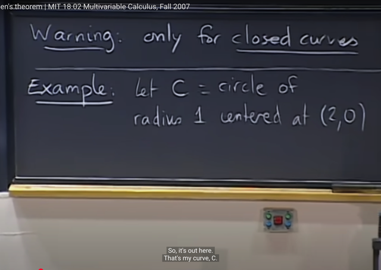</kbd></p>

> [!NOTE]
> gs lưu ý ta rằng định lý Green chỉ đúng với Closed curves.
>
> Ta làm một ví dụ c là đường tròn bán kính đơn vị nhưng tâm tại (2,0)

<br>

<a id="node-572"></a>

<p align="center"><kbd>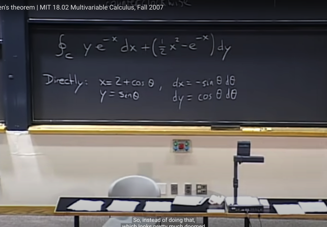</kbd></p>

> [!NOTE]
> Và ta muốn tính line integral của F dot dr với F là vector field:
> `<ye^-x,` (0.5x^2 `-` `e^-x)>`
>
> Thế thì nếu phải tính một cách trực tiếp, thì như đã  biết (một cách làm)
> là ta sẽ express x, y dưới dạng một parameter ví dụ theta:
>
> ```text
> x = 2 + cos(theta), y = sin(theta) từ đó dx = -sin(theta)dtheta,
> ```
> dy `=` cos(theta)dtheta và thế vào ta sẽ tính tích phân theo variable theta
>
> Tuy nhiên có thể thấy nếu làm vậy ta sẽ thấy nó rất phức tạp khi có dính
> đến `e^-x...`
>
> Do đó ta sẽ dùng Green theorem

<br>

<a id="node-573"></a>

<p align="center"><kbd>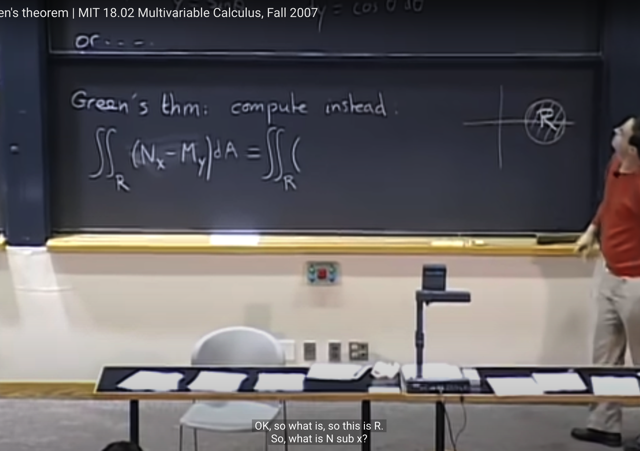</kbd></p>

> [!NOTE]
> Thế thì theo Green theorem ta cần tính tích phân trên R `(N_x` `-`
> `M_y)dA` với R là vùng giới hạn bởi đường tròn.
>
> Thì để tính double integral, ta cần phải chia R ra thành các vùng dA
> và như đã biết ta cần xác định bound của x, y nhưng trong bài toán
> này ta nhớ rằng sẽ dễ hơn nếu dùng polar coordinate
>
> Thế thì hướng giải quyết là ta sẽ change variable để ship nó về thành
> đường tròn tâm tại origin và sau đó dùng polar coordinate

<br>

<a id="node-574"></a>

<p align="center"><kbd>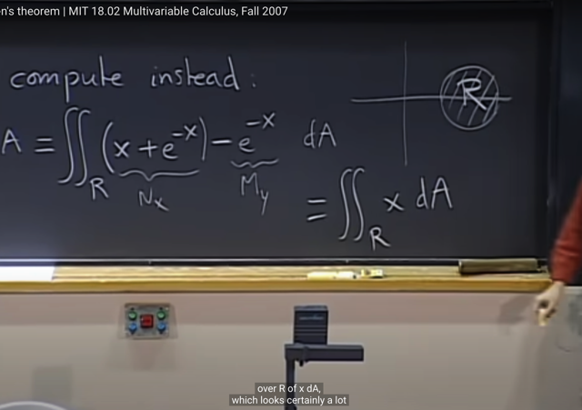</kbd></p>

> [!NOTE]
> Vậy thì `N_x` `-` `M_y` dễ tính, ra chỉ còn là x
>
> Gs lấy ví dụ này để minh họa cho việc ta dùng Green theorem sẽ
> giúp đơn giản hóa hơn nhiều so với tính line integral

<br>

<a id="node-575"></a>

<p align="center"><kbd>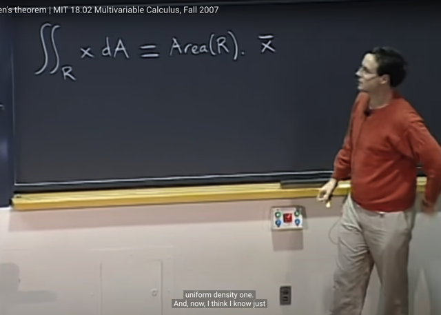</kbd></p>

🔗 **Related:** [LEC 17: DOUBLE INTEGRALS IN POLAR COORDINATES](untitled.md#node-415)

🔗 **Related:** [LEC 17: DOUBLE INTEGRALS IN POLAR COORDINATES](untitled.md#node-412)

> [!NOTE]
> Thế thì ta đã biết ở bài trước đây rằng double integral có thể giúp ta tính
> center of mass (trọng tâm) (theo link xanh) của một flatten object có hình
> dạng của vùng R bằng:
>
> `x_bar` `=` **tích phân kép trên vùng R của x . theta . dA** `/` **Khối lượng của vật
> phẳng (Mass of planar object)**
>
> với theta là density có thể là hàm phụ thuộc x, nhưng ở đây gs cho rằng
> ta có  density đồng nhất: theta `=` 1
>
> Và khối lượng của object tính bằng**tích phân kép trên vùng R của theta
> dA**  thì với **theta `=` 1**, nó sẽ là **tích phân kép trên vùng R của theta
> dA** thì chính là  **diện tích vùng R**  (theo link tím)
>
> Từ đó, tích phân kép trên vùng R của x . theta . dA `=`
>
> **Tích phân kép trên vùng R của x . dA `=` `x_bar` * Diện tích vùng R**

<br>

<a id="node-576"></a>

<p align="center"><kbd>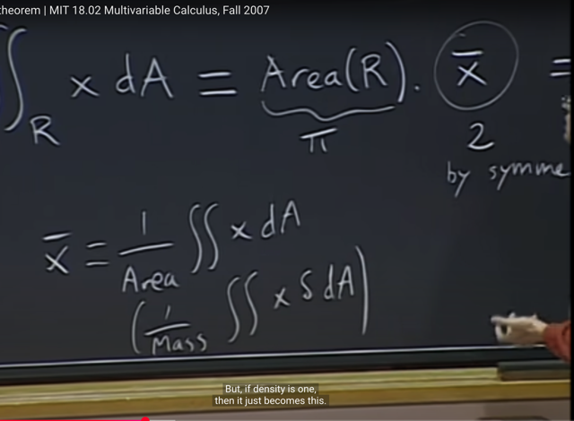</kbd></p>

<br>

<a id="node-577"></a>

<p align="center"><kbd>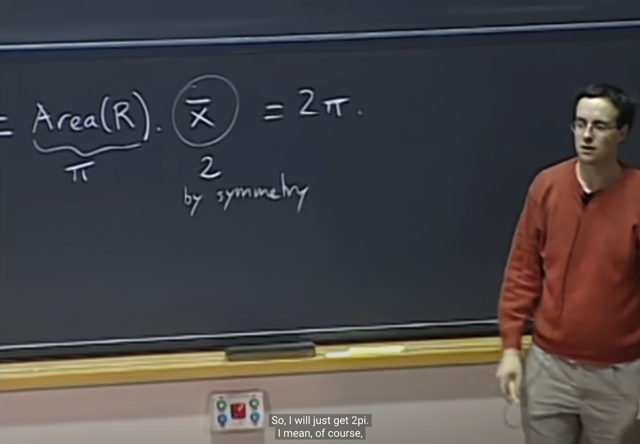</kbd></p>

> [!NOTE]
> Và theo hình học, ta biết ngay `x_bar` `=` 2 vì tâm của hình tròn là tại x `=`
> 2. Và diện tích của hình tròn (vùng R) là pi (vì bán kính `=` 1, pi*r^2 `=`
> pi)
>
> Từ đó ta có ngay kết quả là 2pi
>
> Nếu không có quan sát hình học thì ta có thể tính tích phân kép này
> đơn giản hơn là tính line integral

<br>

<a id="node-578"></a>

<p align="center"><kbd>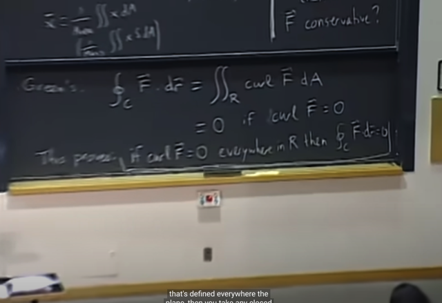</kbd></p>

<p align="center"><kbd></kbd></p>

<p align="center"><kbd>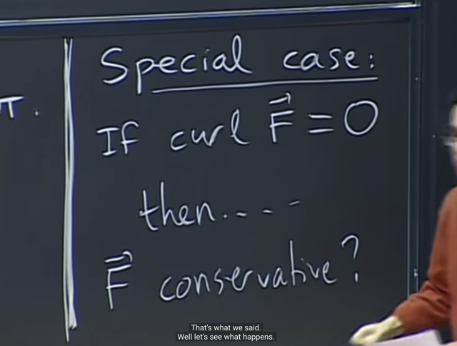</kbd></p>

> [!NOTE]
> Thế thì nếu ta có curl (F) `=` 0 thì theo Green theorem, tích phân trên
> closed curve c sẽ bằng 0, và đây chính là tính chất Conservative.
> Thành ra đây cũng chính là chứng minh cho việc nếu vector field F có
> curl(F) `=` 0 thì nó có tính conservative

<br>

<a id="node-579"></a>

<p align="center"><kbd></kbd></p>

> [!NOTE]
> Xong gs nói qua về một trường hợp trong pset 8 khi ta có curl F `=` 0
> tại mọi điểm trong hình tròn  nhưng F không conservative.
>
> Là bởi trong PSet đó, vector field F tuy có curl `=` 0 nhưng nó không
> defined tại origin, từ đó không differentiable (không có partial
> derivative) `N_x,` `M_y` thì đồng nghĩa cũng không có curl F tại đó.
>
> Do đó, tuy curl F `=` 0 tại mọi điểm trừ origin trong hình tròn nhưng nó
> không conservative biểu hiện là khi tính line integral trên C của F dot
> dr thì ra kết quả 2pi khác 0

<br>

<a id="node-580"></a>

<p align="center"><kbd>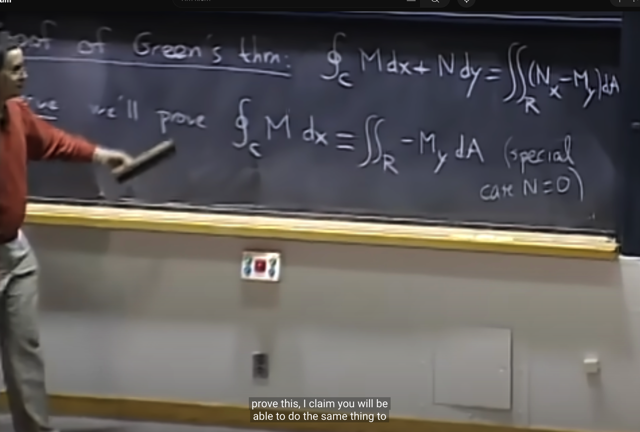</kbd></p>

> [!NOTE]
> Tiếp theo ta sẽ chứng minh Green theorem: Thì vế trái của Green 
> theorem là line integral, là tích phân trên c của F dot dr `=` tích phân
> trên c của Mdx `+` Ndy
>
> Và vế phải là tích phân kép trên vùng R của curl(F)dA `=` tích phân
> kép trên vùng R của `(N_x` `-` `M_y)` dA
>
> Thế thì gs cho rằng đầu tiên ta sẽ chứng minh 
>
> tích phân trên c của Mdx  bằng tích phân kép trên vùng R của `(-` `M_y)` dA
>
> tức là ứng với trường hợp M `=` 0
>
> Và sau đó ta chứng minh 
>
> tích phân trên c của Ndy  bằng tích phân kép trên vùng R của `(-` `N_x)` dA
>
> tức là ứng với trường hợp N `=` 0
>
> Thì khi đó tổng hai case lại ta sẽ có case tổng quát

<br>

<a id="node-581"></a>

<p align="center"><kbd>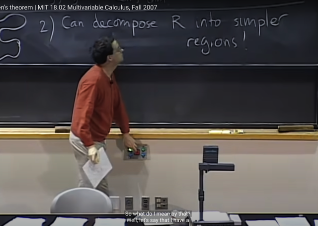</kbd></p>

> [!NOTE]
> Thế thì tiếp theo, gs nói vấn đề là curve của ta có thể
> phức tạp. Do đó, quan sát thứ hai, đó là ta có thể tách
> vùng R thành các vùng đơn giản hơn.

<br>

<a id="node-582"></a>

<p align="center"><kbd>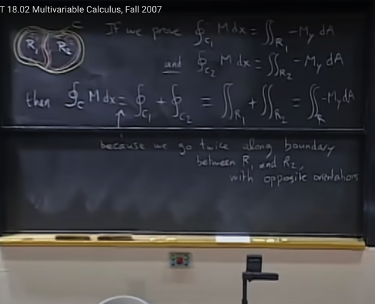</kbd></p>

> [!NOTE]
> Điều này có nghĩa là, nếu ta chứng minh được tích phân của Mdx
> trên c1 `=` tích phân kép trên R1 của `-M_ydA` và tích phân của Mdx
> trên c2 `=` tích phân kép trên R2 của `-M_ydA`
>
> Thì khi cộng vế theo vế, vế trái sẽ chính là tích phân đường của Mdx
> trên c (lí do là vì c1 và c2 có hai đoạn không thuộc c nhưng đi theo
> hai hướng ngược nhau nên sẽ cancel out nhau để lại chính là c
>
> Và vế phải là tích phân kép của `-M_y` dA trên vùng R1 và R2 thì vì
> ```text
> R1 + R2 = R nên nó đương nhiên là tích phân kép của -M_y dA trên R
> ```
>
> Có nghĩa ý chính là, nếu ta có thể chứng minh Green theorem trên
> một region nhỏ hơn ví dụ trên R1 với curve C1 và trên R2 với curve C2
> thì nó cũng sẽ đúng trên vùng lớn hơn `R1+R2`

<br>

<a id="node-583"></a>

<p align="center"><kbd>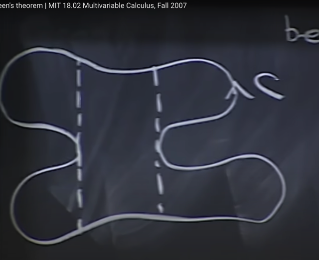</kbd></p>

> [!NOTE]
> Và đại khái là từ đó ta có thể cắt vùng R thành các vùng nhỏ hơn
> sao cho có thể dễ tính bound của integral

<br>

<a id="node-584"></a>

<p align="center"><kbd>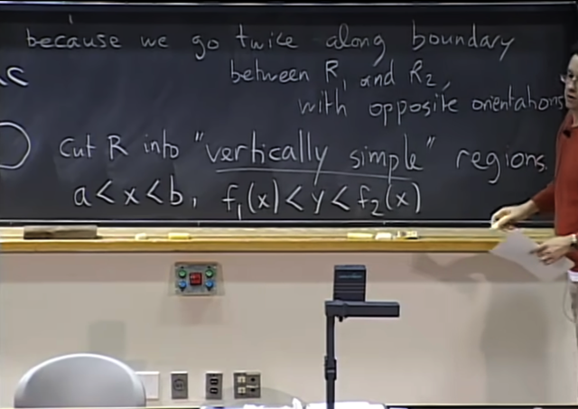</kbd></p>

> [!NOTE]
> Và  cụ thể là ta cắt R thành các vùng gọi là "vertically simple" có đặc điểm
> là đc định nghĩa bởi x trong range (a,b) và y trong range f1(x), f2(x)

<br>

<a id="node-585"></a>

<p align="center"><kbd>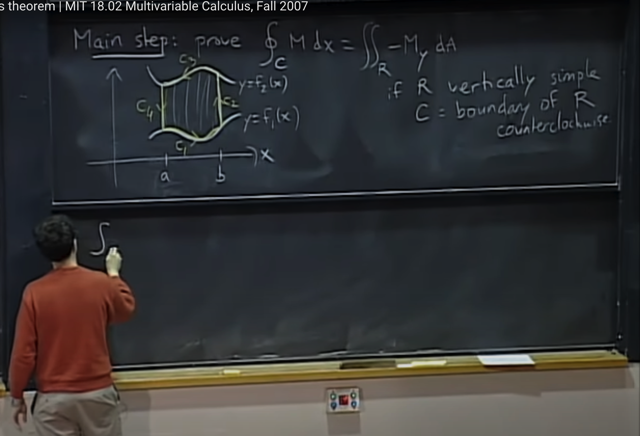</kbd></p>

> [!NOTE]
> Rồi, vậy ta sẽ cần chứng minh Green theorem trên một vùng
> vertically simple như vầy, x từ a đến b còn y từ f1(x) đến f2(x)
>
> thì C tạo bởi 4 đoạn

<br>

<a id="node-586"></a>

<p align="center"><kbd>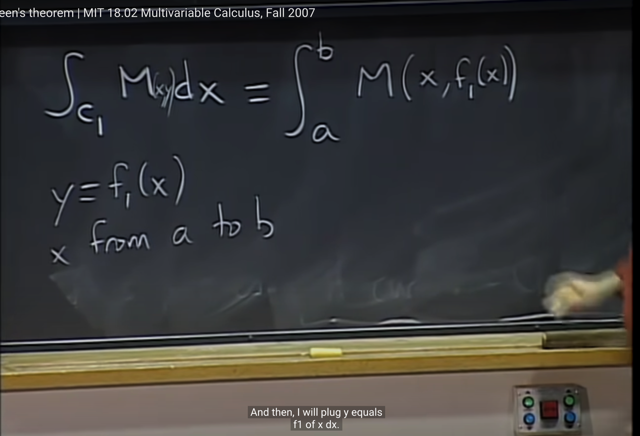</kbd></p>

> [!NOTE]
> Rồi, thế thì trên c1, tích phân M dx (với M đương nhiên có thể là
> function theo x, y ( F là vector field định nghĩa bởi F `=` <M, N> và
> vector field theo định nghĩa là tại mỗi điểm <x,y> trong plane thì
> gắn với một vector F `=` <M, N> và vector này phụ thuộc <x,y>
> (thay đổi theo x, y) nên dĩ nhiên M, N là function theo x, y: M(x,y),
> N(x,y)
>
> Vậy trên c1 ta có x từ a đến b còn y `=` f1(x) do đó tích phân trên c1
> của Mdx mà viết cụ thể hơn là tích phân của M(x,y)dx sẽ trở thành
> tích phân từ a đến b của M(x, f1(x)) dx

<br>

<a id="node-587"></a>

<p align="center"><kbd>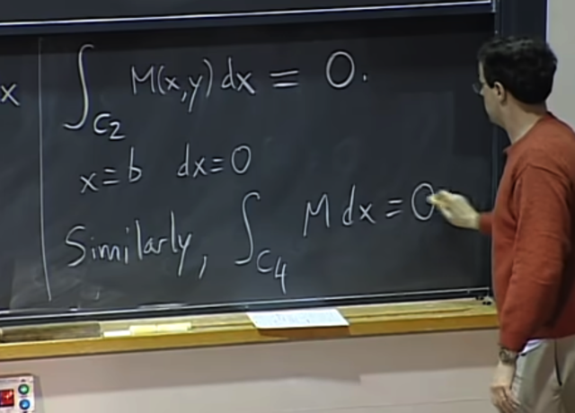</kbd></p>

> [!NOTE]
> Tiếp theo là tích phân trên c2, thì trên c2 chính là ứng với x `=` b, là
> constant value, do đó dx `=` 0
>
> Vậy thì tích phân trên c2 của M(x, y) dx `=` 0.
>
> Gs nói thêm ta để ý rằng, chính nhờ observation 1 trong đó ta xét
> special case là N `=` 0 để rồi ta muốn chứng minh `/` chỉ xét tích phân 
> của M dx (bằng tích phân kép của `-` `M_y` dA) theo dx thôi.
>
> Do đó, hay nhờ đó mà trong đoạn c2 này, như ta nói ở trên là dx `=` 0
> cộng với việc không có dy (tích phân không dính `/` bởi dy) nên kết quả
> là trên c2 thì tích phân của M(x,y) dx `=` 0
>
> Và tương tự, tích phân trên c4 cũng bằng 0

<br>

<a id="node-588"></a>

<p align="center"><kbd>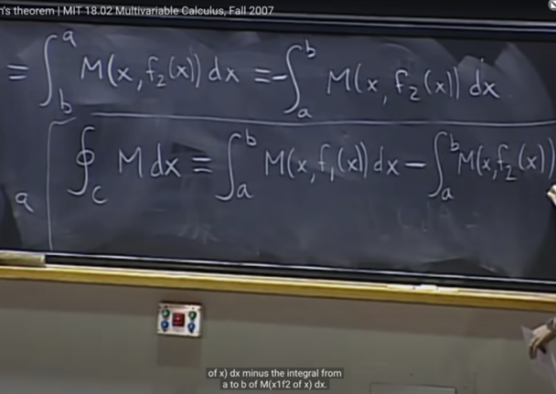</kbd></p>

<p align="center"><kbd></kbd></p>

<p align="center"><kbd>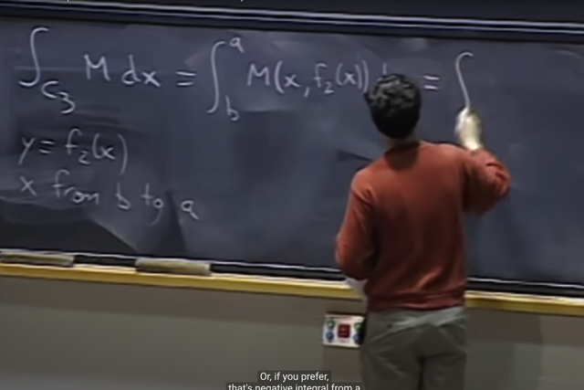</kbd></p>

🔗 **Related:** [LEC 22: GREEN'S THEOREM](untitled.md#node-592)

> [!NOTE]
> Thế thì, trên c3, ta sẽ tính tương tự c1: trên đó, x sẽ từ b đến a và y `=` f2(x)
>
> Nên tích phân M(x,y) dx trên c3 bằng tích phân x từ b đến a M(x, f2(x))dx
> và cũng bằng `-` tích phân từ a đến b của M(x, f2(x)) dx
>
> Tổng hợp lại tích phân trên c của M dx bằng:
>
> tích phân từ a đến b của M(x, f1(x)) dx `-` tích phân từ a đến b của M(x, f2(x)) dx

<br>

<a id="node-589"></a>

<p align="center"><kbd>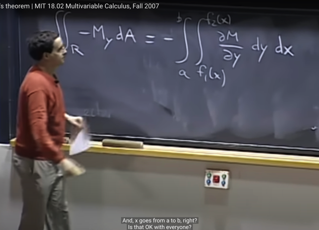</kbd></p>

> [!NOTE]
> Thế thì, đó là vế trái `-` tích phân trên c của M dx. Còn bây giờ ta xét
> vế phải `-` **tích phân trên R của `-` `M_y` dA** cũng là **tích phân trên R
> của `-` `M_y` dy dx**
>
> Gs cho rằng cách set up vùng R giúp ta dễ dàng có bound của  x và y
> đó là inner integral theo y sẽ từ f1(x) đến f2(x) mang ý nghĩa  là với
> fixed value x thì y sẽ có range f1(x) đến f2(x). Và outer bound integral
> sẽ là từ a đến b

<br>

<a id="node-590"></a>

<p align="center"><kbd>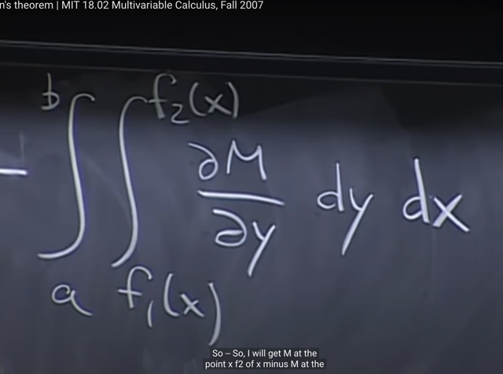</kbd></p>

> [!NOTE]
> Thế thì inner integral: tich phân của partial derivative của M wrt y dy
> sẽ chính là M. Cái này là do tích phân của derivative of function sẽ
> cho ra lại function
>
> M là hàm theo x, y: M(x,y) nhưng khi xét partial derivative của M wrt
> y thì coi x như constant.
>
> Do đó tương tự như khi tích phân x từ a đến b derivative của f(x) tức
> f'(x): tích phân f'(x)dx , thì kết quả chính là f(x) (đương nhiên là f(x)
> evaluated tại b `-` f(x) evaluated tại a (Đây là Fundamental Theorem
> of Calculus Part 2.
>
> Thì ở đây tích phân theo y của partial M(x,y) `/` partial y dy sẽ chính là
> M(x, y) (tương tự, sẽ là M(x,y) evaluated tại f2(x) `-` M(x,y) evaluated
> tại f1(x)

<br>

<a id="node-591"></a>

<p align="center"><kbd>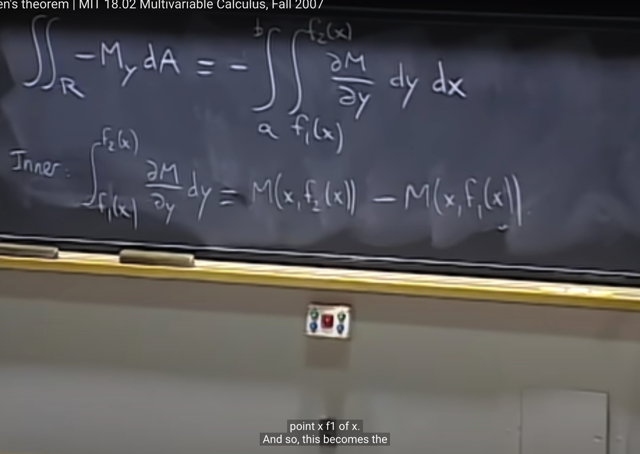</kbd></p>

> [!NOTE]
> Kết quả ta có inner integral là M(x, f2(x)) `-` M(x, f1(x))

<br>

<a id="node-592"></a>

<p align="center"><kbd>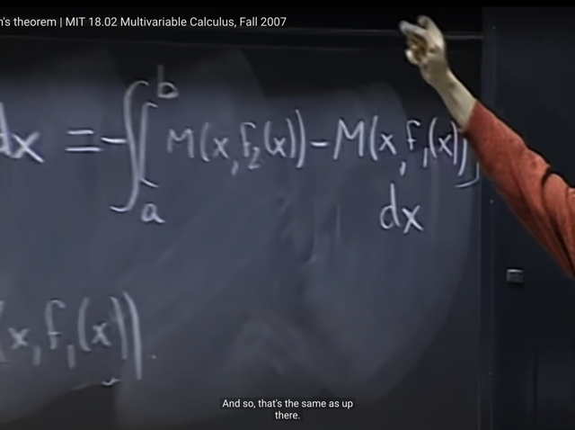</kbd></p>

🔗 **Related:** [LEC 22: GREEN'S THEOREM](untitled.md#node-588)

> [!NOTE]
> Và như vậy ta có tích phân kép sẽ bằng `-` tích phân x từ a đến b của
> [M(x, f2(x)) `-` M(x, f1(x))]dx
>
> Và đây chính là y như vế trái, vậy là ta đã chứng minh xong

<br>

<a id="node-593"></a>

<p align="center"><kbd>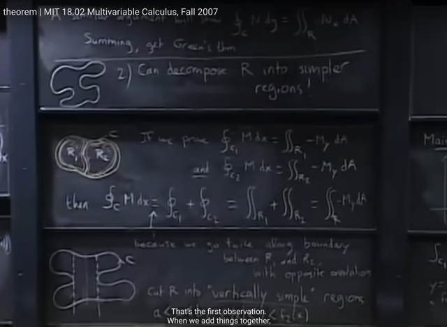</kbd></p>

> [!NOTE]
> Như vậy, chứng minh vừa rồi cộng với `/` kết hợp với việc ta đã chứng
> minh rằng
>
> line integral trên c2
>
> `=`  line integral trên c1 `+` line integral trên c2
>
> `=` tích phân kép trên R1 `+` tích phân kép trên R2
>
> `=` tích phân kép trên R
>
> Thì điều này có nghĩa là bằng cách kết hợp các vùng `R_i` có tính chất
> vertically simple  mà trên đó theorem đã được chứng minh là đúng thì
> ta sẽ có toàn vùng R, đồng nghĩa là ta đã chứng minh Green theorem
> trên vùng bất kì

<br>

<a id="node-594"></a>

<p align="center"><kbd>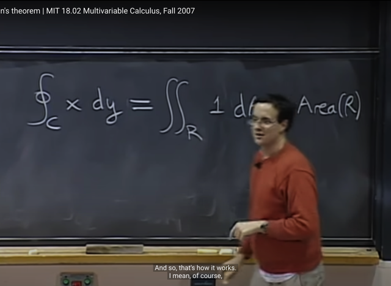</kbd></p>

> [!NOTE]
> phần cuối gs nói về một công cụ dùng để đo diện tích làm việc
> bằng cách tính line integral

<br>

