# Lec 2: Determinant, Cross Product

📊 **Progress:** `17` Notes | `22` Screenshots

---

<kbd>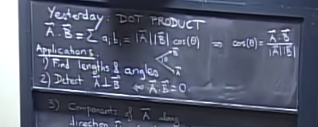</kbd>

> [!NOTE]
> review bài trước ta đã biết về **dot product**, chứng minh nó.
> Và ứng dụng của nó giúp **tính góc (giữa hai vector) và độ dài
> vector**.
>
> Từ đó dùng nó để **xác định hai vector có vuông góc hay
> không**

 

<kbd>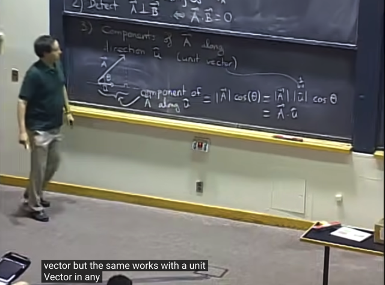</kbd>

> [!NOTE]
> Đại khái là**tiếp nối** một phần nói về **ứng dụng của dot product**. Đó là cho thấy
> **thêm một ý nghĩa** của việc **dot product giữa vector a và UNIT vector u^**
>
> Khi tính dot product của vector a và vector u^, nó cho ta **độ lớn của phần hình
> chiếu của vector a lên vector u^**. Hay nói cách khác, đó chính là **ta chiếu
> vector lên u^ để có vector p** và **tính độ lớn vector p chính là aTu^ (a dot product**
> u^)
>
> Từ dưới sẽ **ghi u cho gọn**. Cứ hiểu nó là unit vector u^
>
> Theo 1802 thì lập luận như sau: theo hình học, phần hình chiếu của a trên u,
> gọi là p đi, sẽ là |a|*cos(theta).
>
> Và vì u là unit vector, tức |u| = 1, ta có p = |a|*cos(theta) = |a|*1*cos(theta)
> = |a|*|u|*cos(theta). 
>
> Thì đây chính là dot product của a và u: **aTu** như đã chứng minh bữa trước (rằng
> aTb = |a|*|b|*cos(theta)
>
> ====
>
> Ta có thể liên hệ với 1806, khi đó mình học về việc project vector b lên vector
> a. Nói theo ngôn ngữ của 1806, vector projection của b lên a sẽ nằm trong
> subspace span bởi vector a, nên ta có thể biểu diễn p bởi (linear combination
> of) a với coefficient x: p = ax 
>
> Khi đó b = p + e = ax + e => e = b - ax. e là phần còn dư của v sau khi
> project lên a, ta có e sẽ vuông góc với a: aTe = 0
>
> Từ đó: aT(b-ax) = 0 <=> aTb - aTax = 0 <=> x = aTb/aTa
>
> => p = ax = aaTb/aTa
>
> Thế thì, nếu **a là unit vector**, tức |a|^2 = aTa = 1, thì p = aaTb
>
> Bình phương độ lớn của p:
>
> |p|^2 = pTp =  (aaTb)T(aaTb) = bT(aaT)T(aaTb) = bTaaTaaTb
>
> = bTaaTb = (aTb)^2 vì aTb là scalar, nên aTb = bTa => bTaaTb = (aTb)(aTb)
>
> **= (aTb)^2**
>
> Vậy **độ lớn của p = aTb**
>
> hay với vector a và u, thì độ lớn của vector p khi project a lên u là **aTu
>
> Như vậy ta có 2 cách tiếp cận để cho thấy ý nghĩa phép product giữa v ector
> a và unit vector u
>
> Để rồi thấy rằng cách tiếp cận của 1806 là tổng quát hơn khi cho phép tìm
> projection của vector b lên vector a bất kì (không phải unit vector). Và nó
> cho phép tìm ra vector p thay vì chỉ là tính độ lớn của component của b trên a**

 

<kbd>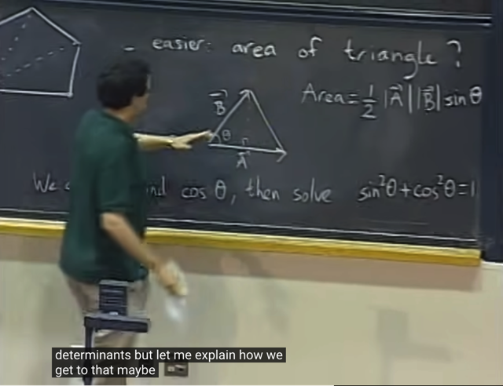</kbd>

> [!NOTE]
> tiếp gs đặt vấn đề **tính diện tích của hình đa giác**.
>
> Thì ta có thể tiếp cận theo lối**tính diện tích các tam giác**. Và với tam
> giác, nếu có hai vector A, B, ta có thể tính diện tích là **1/2 * đáy * cao**
> với **đáy = length của vector A**, **cao là length vector B * sin(theta)**.
>
> Vậy thì ta có thể dùng công thức bữa trước để tính cos(theta):
>
> **cos(theta) = [dot product của A, B] / [length A * length B]**
>
> Rồi **từ đó tính ra sin(theta)**
>
> Tuy nhiên cách này phức tạp, có thể làm đơn giản hơn với khái niệm
> **determinant**

 

<kbd>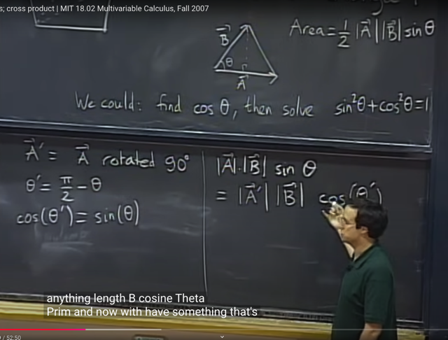</kbd>

> [!NOTE]
> Cách đó là, ta sẽ **xoay vector A 90 độ để có A'**. Đương nhiên độ
> dài hai vector như nhau: |A| = |A'|.
>
> Và góc giữa A' và B, gọi là theta' sẽ bằng 90 - theta. Nên **sin(theta)
> = cos(theta')**.
>
> Từ đó công thức mà ta dùng để tính diện tích tam giác
> |A|*|B|*sin(theta) sẽ trở thành  **|A'|*|B|*cos(theta')**
>
> Và do đây **chính là A' dot product B** nên ta **chỉ cần tìm vector A'**
> là xong

 

<kbd>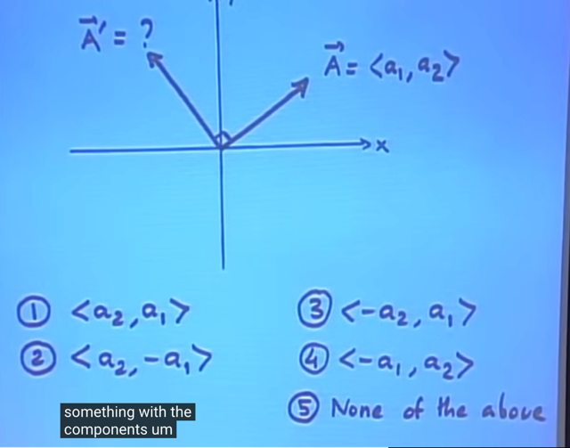</kbd>

> [!NOTE]
> gs hỏi rằng ta có thể tính được A' (là rotation của A một góc 90 độ)
> không?

 

<kbd>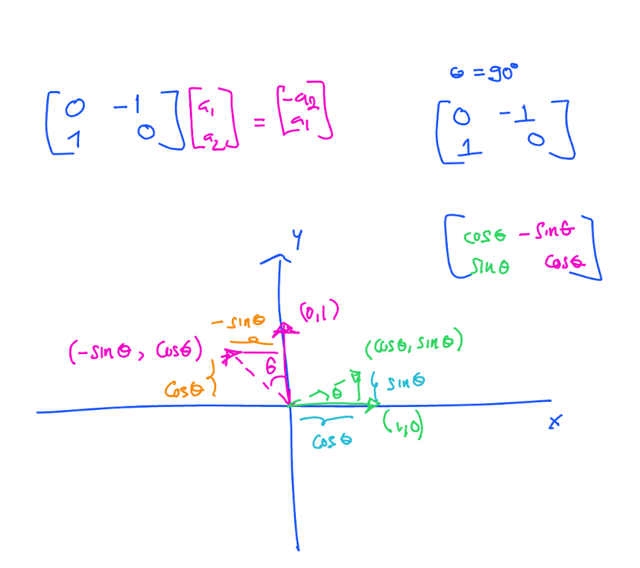</kbd>

> [!NOTE]
> Thế thì với 18.06, ta chỉ việc xây dựng**rotation matrix** như sau:
>
> Rotation là một **linear transformation**, để thể hiện Q - rotation matrix đứng
> sau linear transformation này ta sẽ làm theo quy trình:
>
> i) chuẩn bị **hai bộ basis**, ở đây ta đều dùng **Standard basis: {i, j}**
>
> ii) **thể hiện linear transformation của input basis** (tức T(i) và T(j) bởi (linear
> combination của) **output basis**. Khi đó các  **coefficients  chính là col của
> matrix**
>
> Thế thì basis vector i = <1,0> khi xoay một góc φ sẽ trở thành vector
> <cos(φ), sin(φ)>. Vậy T(i) = <cos(φ), sin(φ)>
>
> Ta sẽ thể hiện nó theo linear combination của output basis, cũng là {i, j}
>
> T(i) = <cos(φ), sin(φ)> = cos(φ)***i** + sin(φ)***j**
>
> -> khi đó coefficients chính là component của col1 của Q = [cos(φ), sin(φ)]
>
> Tương tự, basis vector j = <0,1> khi xoay một góc phi sẽ trở thành  vector
> <-sin(φ), cos(φ)>. Hay T(j) = <-sin(φ), cos(φ)>
>
> Ta cũng thể hiện T(j) dưới dạng combination của các output basis vector (i,j)
>
> T(j) = <-sin(φ), cos(φ)> = -sin(φ)***i** + cos(φ)***j**
>
> -> khi đó coefficients chính là components của col2 của Q = [-sin(φ), cos(φ)]
>
> Vậy Q - matrix giúp rotate space (mọi vector trong space) một góc φ là
> [cos(φ), sin(φ); -sin(φ), cos(φ)]
>
> Với φ = 90 độ Q sẽ là [0 -1; 1 0]
>
> Qa =**[-a2, a1]. Vậy vector A = <a1, a2> khi được transform (rotate) bởi
> Q sẽ được A' = <-a2, a1>**

 

<kbd>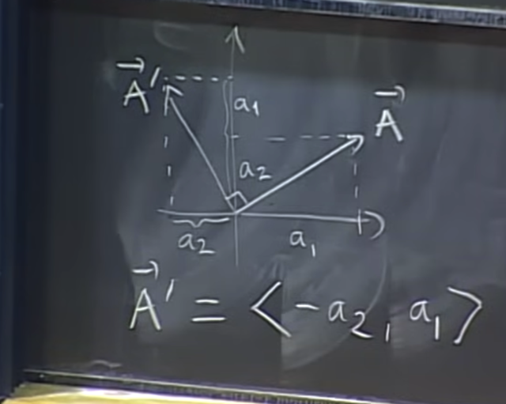</kbd>

> [!NOTE]
> Gs cũng ra cùng kết quả rằng
> vector A' = <-a2, a1>

 

<kbd>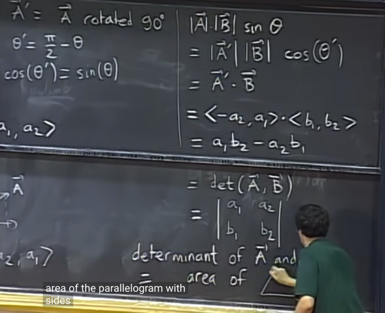</kbd>

🔗 **Related:** [LEC 18: CHANGE OF VARIABLES](untitled.md#node-433)

🔗 **Related:** [LEC 18: CHANGE OF VARIABLES](untitled.md#node-427)

> [!NOTE]
> Và từ đó gs có công thức của **diện tích hình bình hành tạo bởi
> hai vector A, B**. Đây gọi là **determinant** của hai vector A và B.
> Qua 1806 ta cũng biết đó là det của matrix mà A và B là hai
> column
>
> Chú ý ràng nó có thể âm

> [!NOTE]
> DIỆN TÍCH HÌNH BÌNH HÀNH TẠO BỞI HAI 2D VECTOR A,B
> LÀ (TRỊ TUYỆT ĐỐI) CỦA DETERMINANT CỦA CHÚNG

 

<kbd>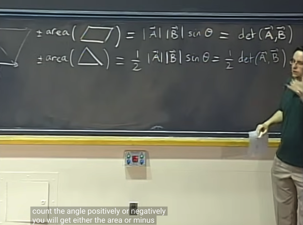</kbd>

> [!NOTE]
> Và như vậy diện tích hình tam giác (= 1/2 hình
> bình hành) sẽ là 1/2 det(A, B)

 

<kbd>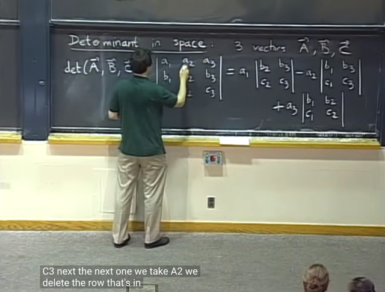</kbd>

> [!NOTE]
> tiếp gs nói về determinant trong space (ý là 3D space). Thì det của 3
> vector A, B, C có công thức như vầy. Từ **18.06** thì ta dễ thấy nó chính
> là t**ính det của matrix ABC** (3 columns là các vector A, B, C) theo
> **cofactor formula**: ta có thể chọn một cols hoặc một hàng để tính.
>
> Ở đây chọn hàng 1, thì các **entry** sẽ **nhân** với **cofactor** của nó là d**et
> của matrix nhỏ hơn** được tạo ra bằng cách **bỏ đi hàng và cột của
> entry**. Dấu của cofactor sẽ là + hoặc - nếu **tổng index row/cols là chẵn
> hay lẻ**

 

<kbd>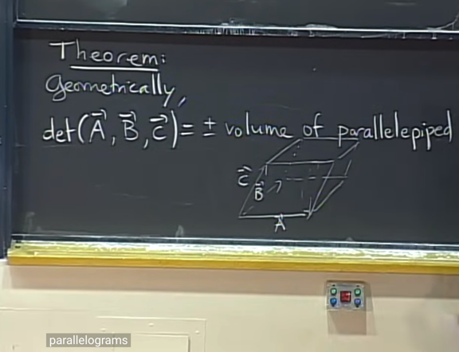</kbd>

🔗 **Related:** [LEC 3: MATRIX, INVERSE MATRIX](untitled.md#node-34)

> [!NOTE]
> và (absolute value của) nó **chính là volume (thể tích)
> của hình hộp (parallelepiped) tạo bởi 3 vector này**

 

<kbd>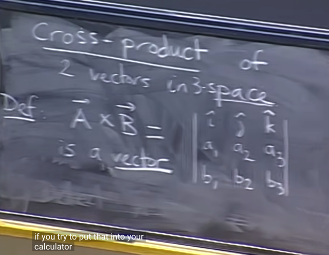</kbd>

> [!NOTE]
> ta sẽ học qua khái niệm **CROSS PRODUCT**, giữa hai vector A, B. (trong
> 1802 này vector thường để viết hoa)
>
> Nó là "determinant" của một matrix mà **row 1 là i^, j^, k^**, biểu thị
> đây là các đại diện cho unit vector. **Hai row còn lại là hai vector A,
> B**.
>
> Chú ý đây chỉ là cách "ghi" để dễ nhớ công thức của cross product,
> chứ ta không thật sự tính determinant vì theo định nghĩa determinant
> thật sự phải là một con số. Cũng như component của matrix không
> thể là một vector được (ý nói đến row 1 của "matrix" là i^, j^, k^)
>
> Và **khác với dot product**, cross product sẽ **là một VECTOR.**
>
> Và theo công thức det, nó sẽ là **linear combination của 3 unit
> vector** với các coefficient là **+/- các determinant của các matrix
> 2x2**

 

<kbd>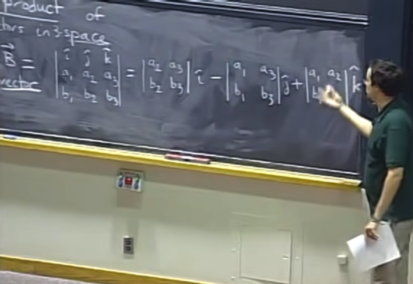</kbd>

 

<kbd></kbd>

<kbd></kbd>

<kbd>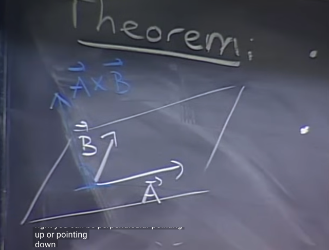</kbd>

> [!NOTE]
> Và**ứng dụng của cross product của A, B (kí hiệu là AxB)** chính là:
>
> **length của vector**(A x B) chính là**diện tích của hình bình hành tạo
> bởi 2 vector này trong không gian (3D).**
>
> Và vector (A x B) sẽ **vuông góc với plane span bởi hai vector A, B**.
> Còn **hướng** của nó thì tuân theo **quy tắc bàn tai phải**

 

<kbd>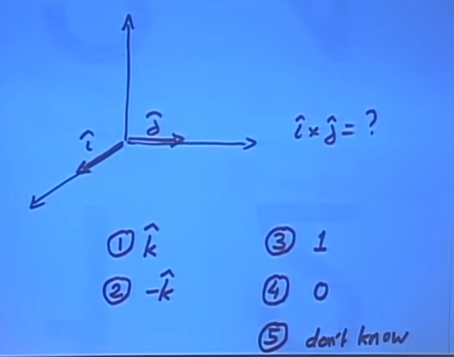</kbd>

> [!NOTE]
> Câu hỏi là cross product của i và j (hai unit vector): (i^ x j^)
>
> me: Dễ thấy nó**chính là k**. Theo định nghĩa nó sẽ vuông góc với
> plane span bởi i^, j^ -> chính là trục k. Còn hướng thì theo quy tắc
> bàn tay phải ta sẽ thấy nó hướng lên -> k^

 

<kbd>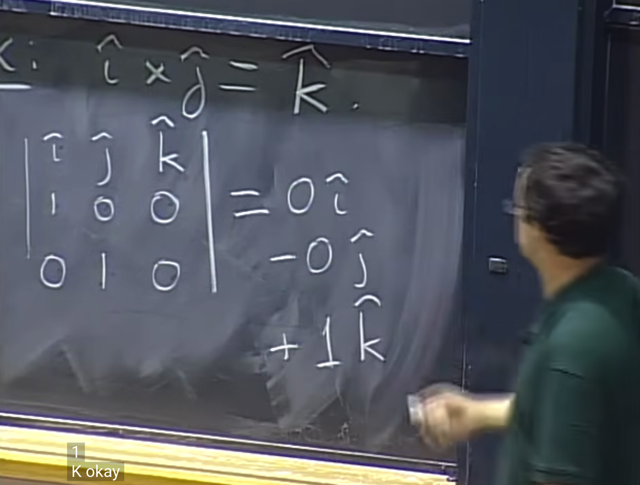</kbd>

> [!NOTE]
> gs: correct. và ta có thể tính ra
> để thấy nó chính là 1*k^ = k^

 

<kbd>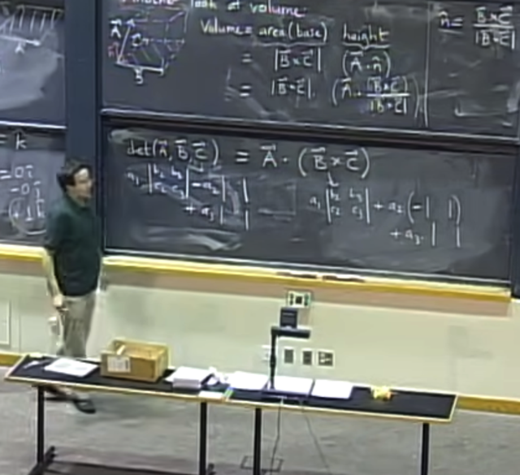</kbd>

> [!NOTE]
> Cuối cùng gs nói về **một góc nhìn khác** để **tính volumn của hình khối
> bình hành** tạo bởi 3 vector A, B, C mà hồi nãy ta đã nói nó là **det của ba
> vector A, B, C**
>
> Đầu tiên thể tích hình khối hình hành này sẽ là **mặt đaý** (base, tạo bởi
> hai vector B, C) **nhân** với **chiều cao**.
>
> Thế thì **base**, là một hình bình hành, ta đã biết có thể tính diện tích
> của nó bằng **length của vector cross product giữa B, C: |B x C|**
> Còn **chiều cao**. Thì dễ thấy, nó chính là **độ lớn** của **hình chiếu của vector
> A lên unit vector vuông góc với plane span bởi B, C** (gọi nó là vector u) 
>
> Và ta đã biết là khi chiếu vector A lên vector khác thì hình chiếu của nó sẽ
> có độ dài tính bằng dot product của A và vector đó. Do vậy chiều cao sẽ là 
> dot product của A với vector u: A.u  
>
> Vậy ta cần tìm vector u này
>
> Thế thì để tìm vector này thì ta cũng dùng**cross product của B, C: (B x C)**
> là **vector vuông góc với plane span bởi B, C**. Có điều **ta cần unit vector**,
> nên ta sẽ **chia cho length của nó**. Vậy **u = (B x C) / |B x C|**
>
> Thế là ta có thể tích sẽ bằng (diện tích base)*(chiều cao)
>
> = (|B x C|) * (A,u) = |B x C| * A.(B x C) / |B x C|
>
> = A.(B x C) 
>
> Chú ý rằng đây là **dot product của A** và vector **cross product B x C**. Và nó
> được gọi là **TRIPLE PRODUCT**
>
> Như vậy **det (A, B, C) = A.(B x C)**
>
> Cuối cùng gs dùng công thức det (A, B, C) có thể thấy đúng là nó bằng
> A.(B x C)

 

<kbd>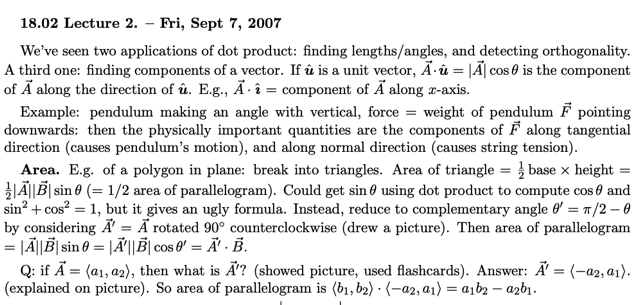</kbd>

 

<kbd>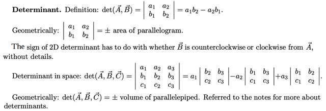</kbd>

 

<kbd>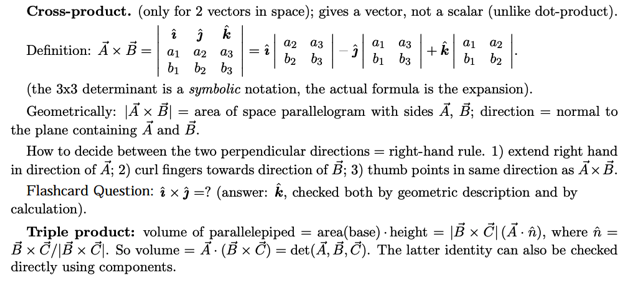</kbd>

 

