# Lec 3: Matrix, Inverse Matrix

📊 **Progress:** `26` Notes | `35` Screenshots

---

<kbd>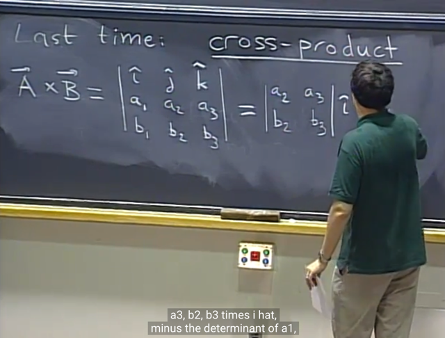</kbd>

> [!NOTE]
> Gs ôn lại **cross product** bữa trước. Nhắc lại rằng, nó **không chính xác
> là determinant** của matrix 3x3, vì **i, j, k ở đây là 3 vector** chứ không
> phải scalar. Nhưng ghi vậy cho dễ nhớ công thức.
>
> Triển khai ra ta sẽ có **linear combination của 3 unit vector i, j, k**. Với 
> coefficients là các det của các 2x2 matrix. Tức A x B **là VECTOR**,
> **không phải scalar như dot product**

 

<kbd>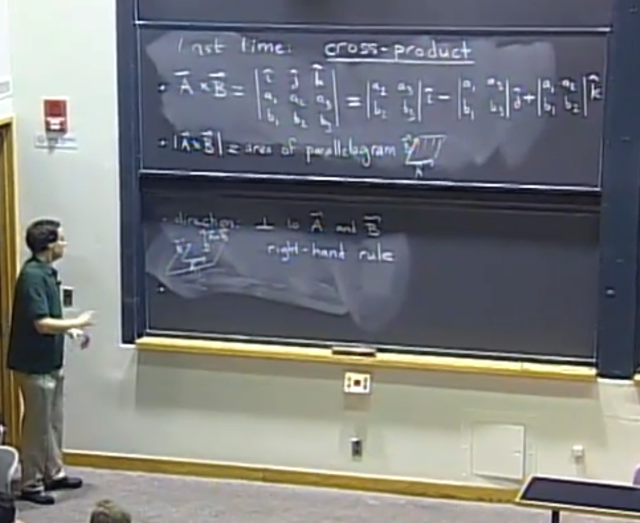</kbd>

🔗 **Related:** [LEC 4: SQUARE SYSTEM, EQUATION OF PLANE](untitled.md#node-60)

> [!NOTE]
> Ta cũng đã biết **length của |A x B|** chính là **diện tích của hình
> bình hành** bởi **hai vector A, B.**
>
> Cũng như bản thân vector (A x B) sẽ **vuông góc với plane span
> bởi vector A, B**

 

<kbd>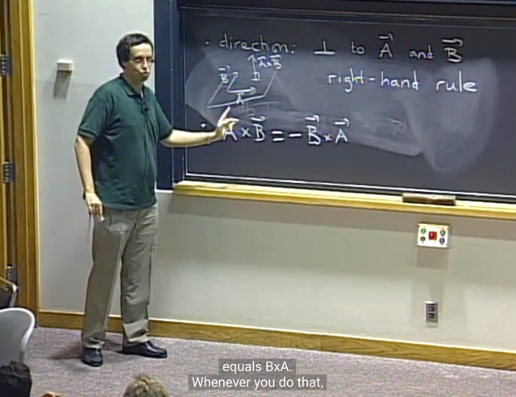</kbd>

> [!NOTE]
> gs nói thêm tính chất
> của A x B `=` `-` B x A

 

<kbd>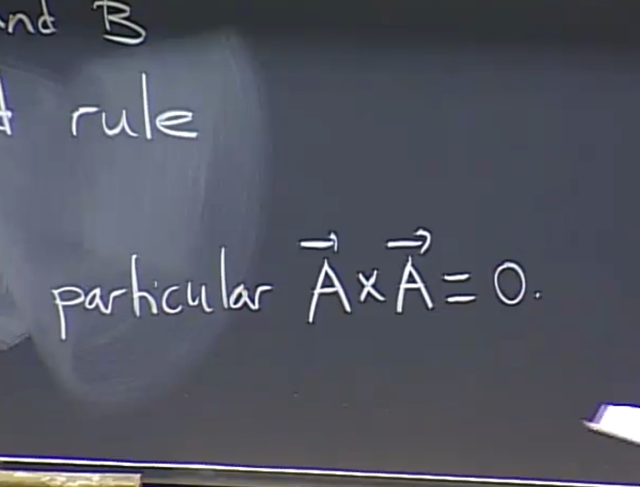</kbd>

> [!NOTE]
> Và A x A `=` 0.

 

<kbd>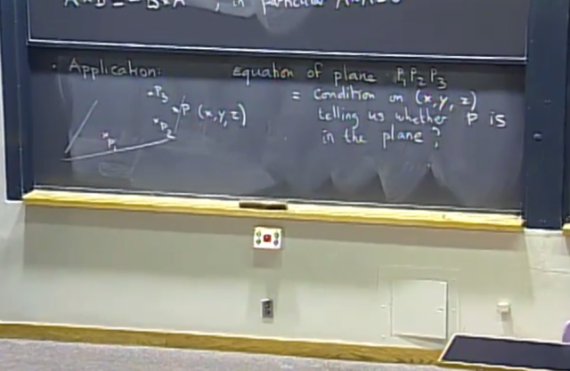</kbd>

> [!NOTE]
> gs nói tiếp các **ứng dụng của cross product**. Ví dụ như bài toán này,
> cho **plane đi qua 3 điểm P1, P2 , P3**  và **1 điểm P (x, y, z)**. Yêu cầu là
> xác định **điều kiện x, y, z sao cho P nằm trong plane**

 

<kbd>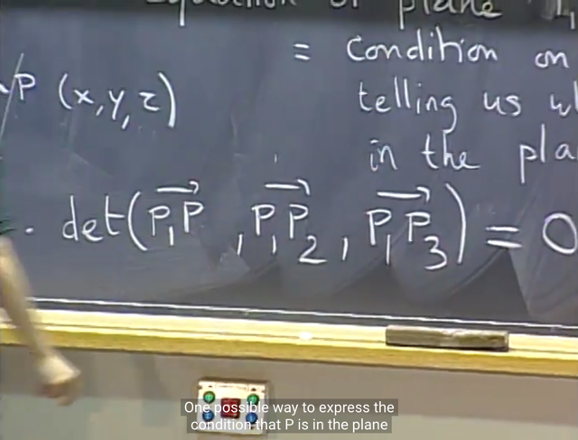</kbd>

<kbd></kbd>

<kbd>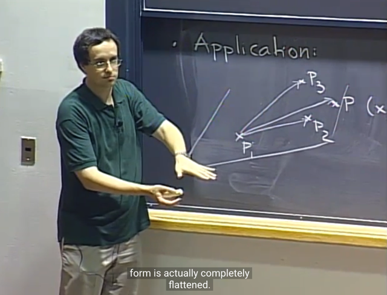</kbd>

🔗 **Related:** [LEC 2: DETERMINANT, CROSS PRODUCT](untitled.md#node-18)

> [!NOTE]
> thế thì một cách tiếp cận là ta **xét volume của hình khối bình
> hành** tạo bởi ba vector P1P3, P1P2, P1P và **nếu volumne của
> nó bằng 0**, chứng tỏ **P nằm trong plane**
>
> Và **volume** của hình khối bình hành là **det của 3 vector** như đã biết.
> Ta có thể **xây dựng equation det `=` 0**, và tính toán ra x, y, z để kết
> quả sẽ cho ra **phương trình mặt phẳng của plane**

 

<kbd>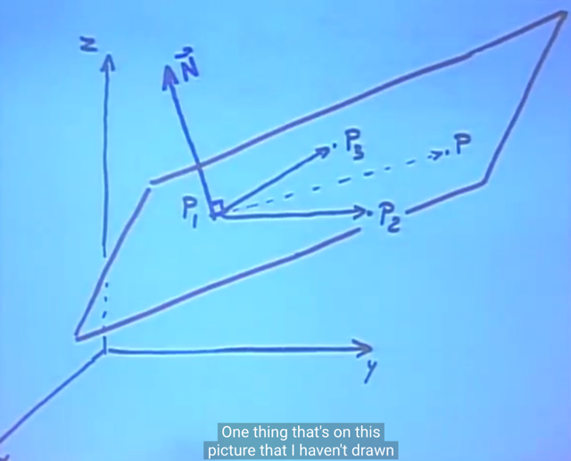</kbd>

> [!NOTE]
> Ta có thể có **cách khác**, bằng quan sát rằng nếu ta có **N là vector
> vuông góc với plane (gọi là normal vector)** thì muốn **P nằm trong
> plane đương nhiên P1P phải vuông góc với N**

 

<kbd>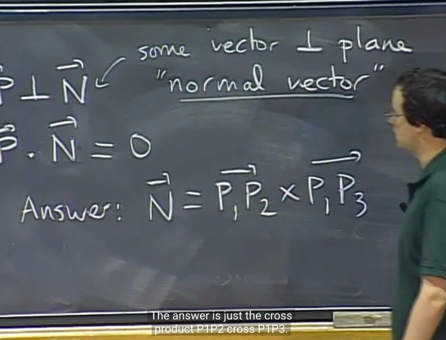</kbd>

<kbd></kbd>

<kbd>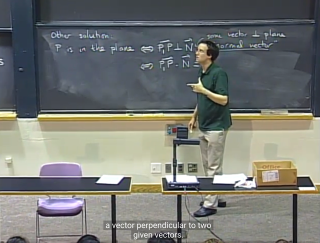</kbd>

> [!NOTE]
> Từ đó, nếu có N ta có thể xác lập equation: **dot product của N và
> P1P `=` 0**
>
> Và **N thì có thể dùng vector cross product của P1P2 và P1P3:
> P1P2 x P1P3**.
>
> Như đã biết là cross product của hai vector sẽ là vector vuông góc
> với plane tạo  bởi 2 vector này

 

<kbd>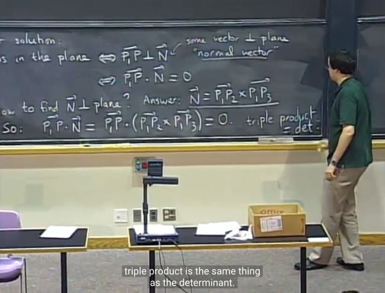</kbd>

> [!NOTE]
> và sở dĩ hai cách này thật ra giống nhau là vì ta đã biết **det của 3
> vector** chính là**triple product**: P1P.(P1P2 x P1P3) tức là dot product 
> của vector P1P với vector cross product của P1P2 và P1P3

 

<kbd>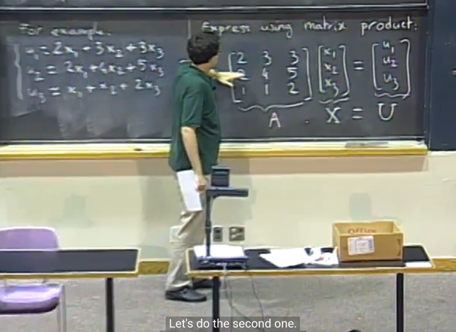</kbd>

> [!NOTE]
> Nói chung là gs nói sơ về matrix, dùng để thể hiện system equation
> đương nhiên sau khi hoàn thành 1806 thì ta đã rõ hơn nhiều

 

<kbd>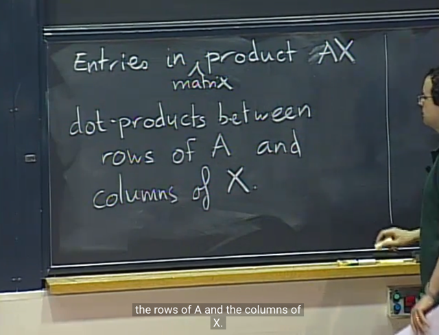</kbd>

> [!NOTE]
> và ở 1802 này nói về cách tính Ax theo cách mà gs Strang
> gọi là low level: **dot product** của các **row of A** và **vector x**
> (column of x, có thể coi như matrix có 1 column) để ra các
> **component của u**

 

<kbd>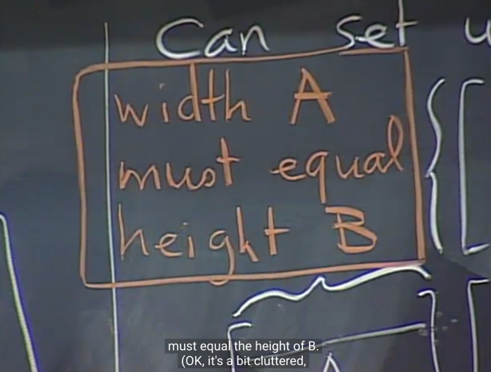</kbd>

<kbd></kbd>

<kbd>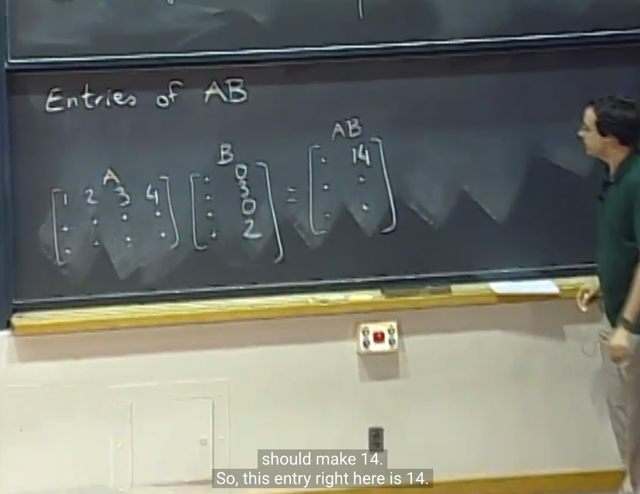</kbd>

> [!NOTE]
> gs nói về cách nhân matrix AB. cũng theo low level view:
> r**ow of A** dot product với  **col of B**. Đương nhiên shape
> phải tương thích

 

<kbd>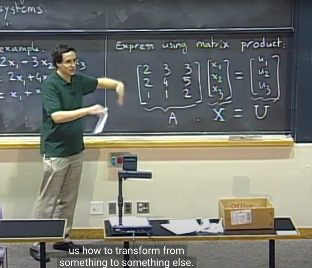</kbd>

> [!NOTE]
> thế thì gs cho biết, ý nghĩa, hay tác dụng của việc nhân vector x
> với matrix A là **TRANSFORM VECTOR X THÀNH VECTOR U**

 

<kbd>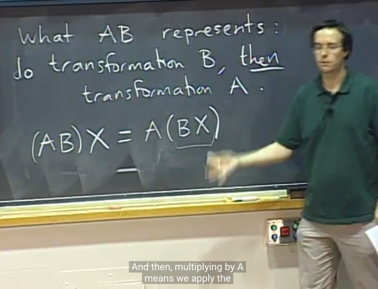</kbd>

> [!NOTE]
> Và nhân với matrix AB sẽ là**apply transformation B (lên x) sau
> đó apply transformation A**
>
> Bởi tính chất khi nhân matrix vector là ta có thể tùy ý di chuyển
> dấu ngoặc

 

<kbd>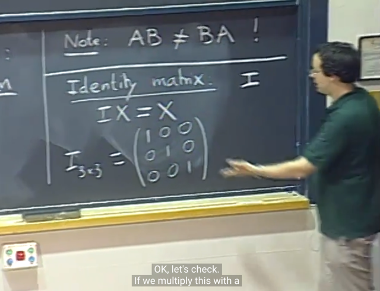</kbd>

> [!NOTE]
> Và ở đây 1802 cũng giới thiệu Identity matrix, là **matrix do nothing
> khi transform x**
> Và dễ hiểu rằng size của nó sẽ tương thích với vector x. Nên `I_3`
> hay `I_3x3` ý là Identity matrix 3x3

 

<kbd>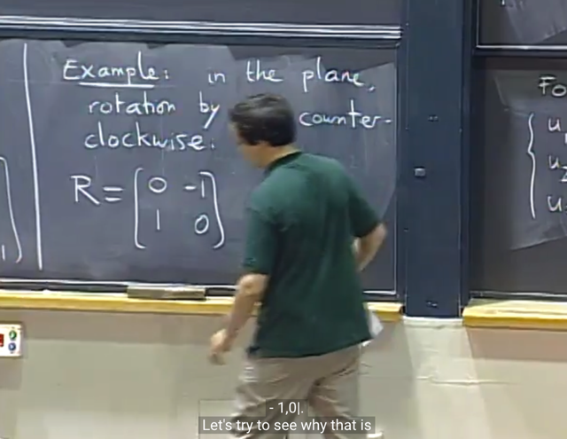</kbd>

> [!NOTE]
> Tiếp, gs nói về phép xoay góc 90 độ ngược chiều kim đồng hồ
> và ông cho rằng đây là matrix làm chuyện đó

 

<kbd>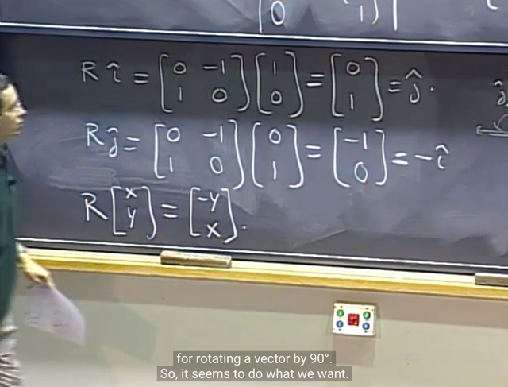</kbd>

> [!NOTE]
> Thế thì R i^ `=` j^, mang ý nghĩa matrix R xoay basis vector i^ một góc
> 90 độ để trở thành j^.
>
> Và R j^ `=` `-i^,` R xoay basis vector j^ một góc 90 độ ngược chiều kim
> đồng hồ để thành `-i^`
>
> Và ông cho rằng với vector <x, y> bất kì thì R cũng xoay nó 90 độ
> ngược chiều kim đồng hồ để thành `<-y,` x>
>
> Liên hệ với 1806, ta biết khi muốn tìm một matrix đứng sau một phép
> linear transformation, ta sẽ cần chuẩn bị hai bộ basis. Sau đó apply
> transformation lên bộ input basis và thể hiện nó bằng output basis.
> Khi đó các coeffs chính là các columns của transformation matrix.
>
> Ở đây, ta muốn xoay mọi vector trong không gian một góc 90 độ. Giả
> sử ta không biết matrix R là sao. Thì, như trên, bước đầu tiên ta chọn
> hai set of basis vector. Và trong trường hợp này ta chọn cả hai set đều
> là standard basis vector i^, j^.
>
> Thế thì ta sẽ xoay (transform) i^ và thể hiện nó bởi output basis (cũng
> là i^, j^). Vậy thì khi xoay i^ thì kết quả là nó thành vector j^, và để thể
> hiện dưới standard basis thì đương nhiên nó cũng chính là coordinate
> của j^ `=` (0, 1), mà cũng chính là 0*i^ `+` 1*j^ `=>` Cột 1 của R là 0, 1
>
> Tiếp, xoay j^ và thể hiện nó bởi output basis: Khi xoay j^ thì ta được
> vector trùng với `-i^.` Thể hiện nó bởi output basis, again chính là i^,j^
> thì đương nhiên nó chính là coordinate của `-i^` `=` `<-1,` 0>. Vậy cột 2
> của R là `-1,` 0
>
> Vậy R là [0 `-1;` 1 0]. Và trong 1806 ta cũng đã học, khi matrix transform
> các basis vector thì nó cũng transform mọi vector span bởi basis đó.
> Do đó R cũng sẽ xoay mọi vector <x,y> góc 90 độ counter `clock-wise`

 

<kbd>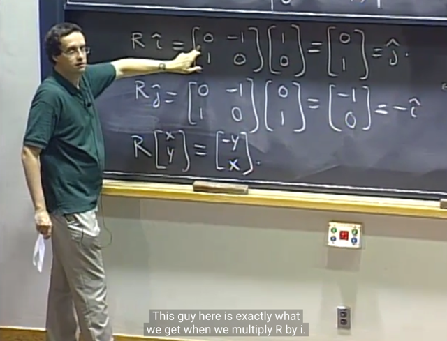</kbd>

> [!NOTE]
> Gs: có thể thấy **các column của Rotation matrix** chính là **kết
> qủa ra khi apply rotation lên basis vector i, j.**
>
> Thế thì **R.i** sẽ là R.[1 0]T chính là 1*col1 `+` 0*col2 `=` **col1**
>
> và **R.j** sẽ là R.[0 1]T chính là 0*col1 `+` 1*col2 `=` **col2**
>
> Vậy thì đương nhiên là **col 1 của R chính là R*i**và**col 2 của R chính là R*j
>
> Và nhờ 18.06 ta hiểu sâu hơn tại sao lại như vậy dựa theo 
> lập luận trước**

 

<kbd>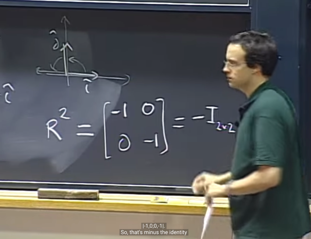</kbd>

> [!NOTE]
> Và R^2 sẽ chính là `-I` với ý nghĩa khi ta áp dụng rotation 2 lần
> thì sẽ chính là quay 180 độ, ta sẽ đổi dấu x,y.
>
> Và apply 4 lần thì sẽ về chỗ cũ R^4 `=` I

 

<kbd>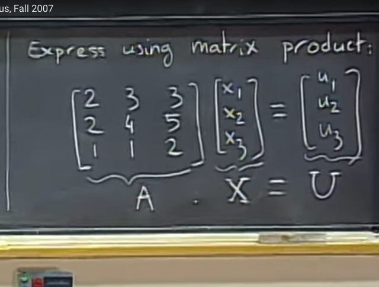</kbd>

<kbd></kbd>

<kbd>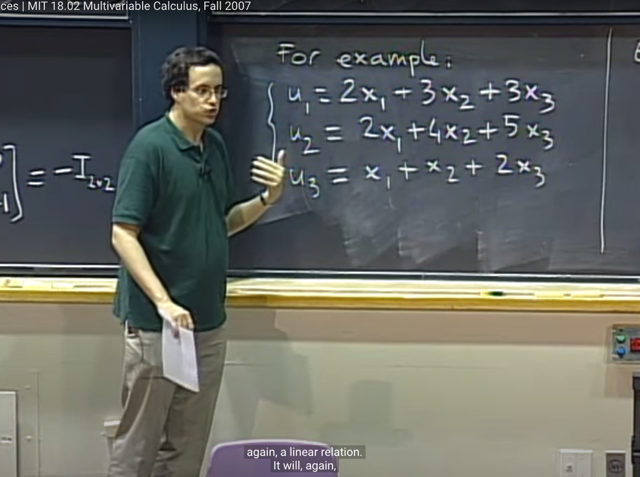</kbd>

> [!NOTE]
> Tiếp theo, đại khái gs nói rằng khi ta có thể express U bởi X, thông qua
> matrix A, thì ngược lại ta cũng có thể tìm matrix `A_inv` để giúp express X
> bởi U

 

<kbd>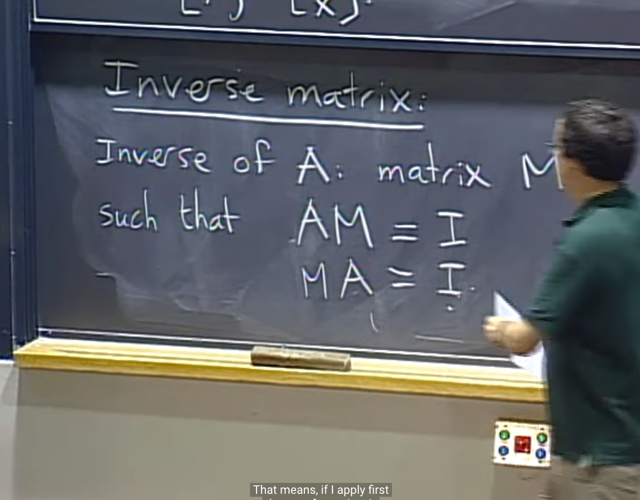</kbd>

> [!NOTE]
> Gs định nghĩa Inverse matrix. Đó là nếu M là inverse của A thì AM `=`
> MA `=` I với ý nghĩa là nếu A biến M thành I (bằng cách nhân với M:
> AM) Thì M chính là cái matrix đảo ngược chuyện này để đưa I trở lại
> M: M(AM) `=` MI `=` M
>
> Liên hệ với 18.06: Khi MA `=` I thì trong 18.06 gs Strang gọi là `E` `-`
> elimination matrix, là matrix đại diện quá trình elimination, biến A
> thành dạng Reduced Row Echelon Form (I)
>
> Và `E` chính là Ainv. (Vì EA `=` I nên `E` chính là Ainv)

 

<kbd>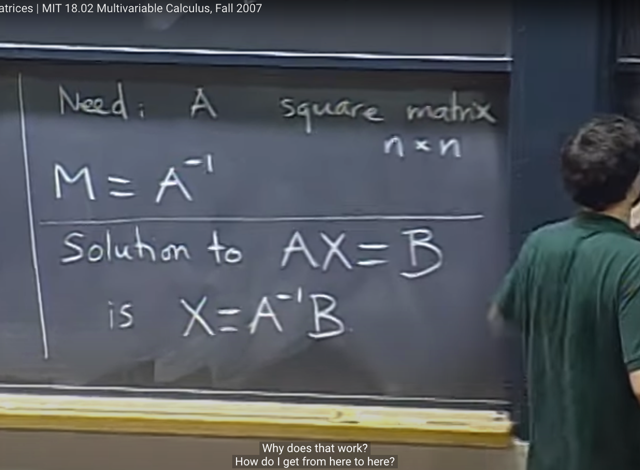</kbd>

> [!NOTE]
> Gs cho biết điều kiện là A phải square, nhưng từ 18.06 ta biết A còn
> phải `Full-rank` mới đủ để M , hay Ainv tồn tại.
>
> Và ứng dụng của nó giúp giải Ax `=` B, bằng cách nhân hai vế cho
> Ainv:
>
> X `=` AinvB

 

<kbd>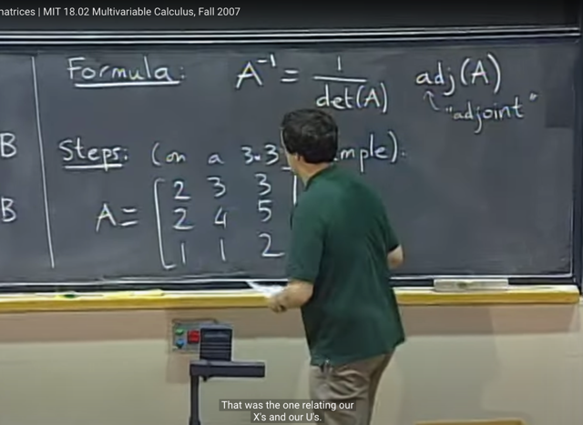</kbd>

> [!NOTE]
> Đại khái là ta sẽ biết về công thức giúp tìm inverse của matrix. Tuy
> nhiên gs cho rằng công thức này, chỉ phù hợp với các matrix nhỏ như
> 3x3, 4x4. Còn với matrix lớn thì cần dùng algorithm khác.
>
> Công thức là Ainv `=` `(1/detA)` adj(A) với adj(A) là adjoint matrix.
>
> (liên hệ với 18.06 thì đây chính adj(A) chính là CT, với C là matrix các
> cofactor của A, ví dụ c11 chính là cofactor của a11, c12 chính là cofactor
> của a12.
>
> Công thức này xuất phát từ việc tính detA theo cofactor formula, nên
> nếu có C là matrix các cofactor của A thì (CT)A sẽ là matrix mà mọi
> component đều là det(A), và có thể thể hiện nó bằng det(A) * I, tức là ta
> có:
>
> (CT)A `=` detA*I
>
> Và cái này tương đương (CT)AAinv `/` detA `=` Ainv hay **Ainv `=` CT/detA**

 

<kbd>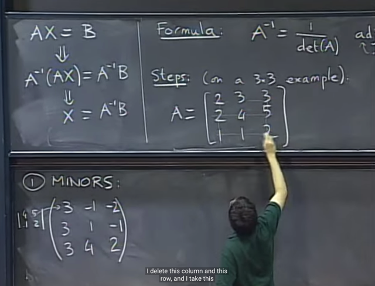</kbd>

> [!NOTE]
> Thế thì bước 1, là tìm MINORS, và quá trình gs làm, cho thấy nó có vẻ
> gần giống là cái mà 1806 gọi là cofactor matrix C. Đó là vị trí c11 chính
> là determinant của matrix nhỏ hơn sau khi bỏ đi cột 1, hàng 1 của A,
> và cái này như đã biết, nếu thêm yếu tố dấu cộng hay trừ theo luật là
> nếu `i+j` lẻ thì là dấu trừ, ngược lại là dấu cộng, thì nó sẽ là cofactor của
> a12
>
> Tương tự c12 là của a12, bằng det của matrix nhỏ hơn khi bỏ hàng 1,
> cột 2 của matrix A.
>
> Nói chính xác hơn thì đây chưa phải là cofactor matrix. Vì như đã nói,
> cần phải bỏ dấu `+/-` phù hợp. Nữa và đây chính là bước 2

 

<kbd>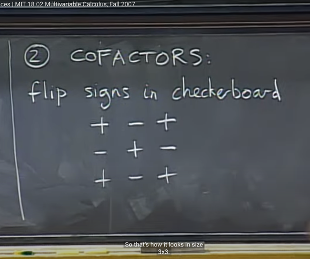</kbd>

> [!NOTE]
> Và quả thật, khi ta gắn vào Minors các dấu `+/-` theo quy luật bàn
> cờ (checkerboard) như này thì ta sẽ có cofactor matrix. Và quy luật
> bàn cờ này chính là dựa trên `i+j` chẵn `(+)` hay lẻ `(-)`

 

<kbd>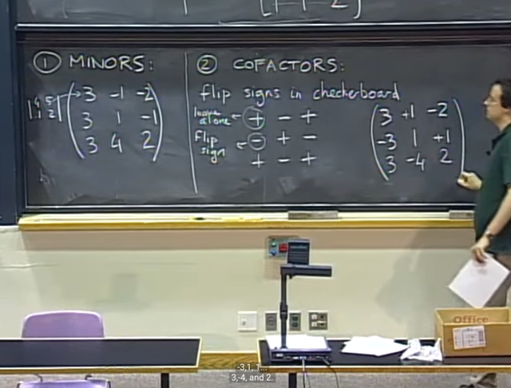</kbd>

 

<kbd>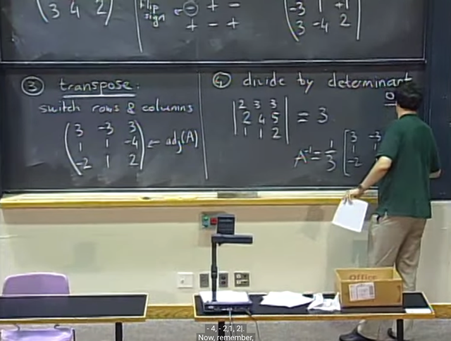</kbd>

> [!NOTE]
> Và đúng như dự đoán transpose matrix C để có CT thì
> nó chính là adj(A). Và chia cho det(A) sẽ cho ta Ainv
>
> (gs đọc luôn detA, chứ nếu tính ta phải dùng cofactor formula)

 

