# Lec 4: Square System, Equation Of Plane

📊 **Progress:** `20` Notes | `25` Screenshots

---

<kbd>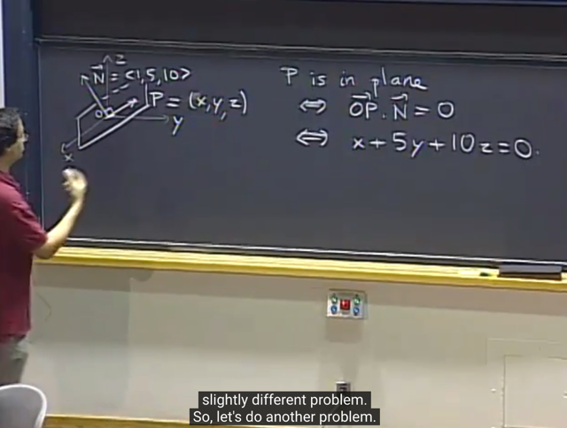</kbd>

> [!NOTE]
> gs ôn lại bài toán đặt ra **tìm equation của plane đi qua O**, **vuông
> góc với vector N**. Đơn giản là gọi P `=` (x, y, z).
>
> Để rồi ta sẽ lập luận rằng**nếu P ở trong plane thì vector OP sẽ phải
> vuông góc với N**, bởi vì N vuông góc với plane nên mọi vector trong
> plane đều vuông góc với OP.
>
> từ đó ta **thiết lập equation là dot product của N và OP `=` 0**. từ đó ta
> có  equation of plane.

 

<kbd>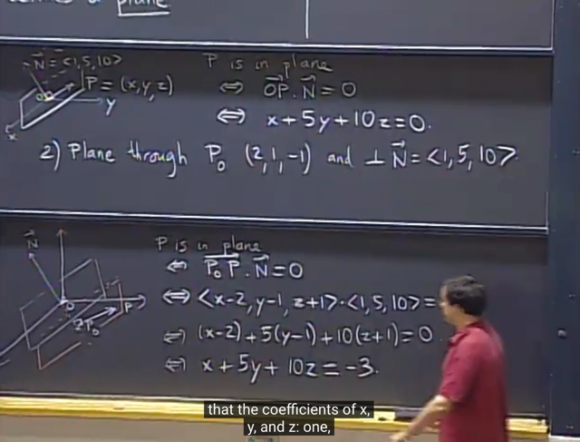</kbd>

> [!NOTE]
> câu hỏi thứ 2 hơi khác một chút là **tìm plane equation vuông góc với
> N** nhưng**đi qua P0 thay vì đi qua O**.
>
> Cách làm**hoàn toàn đơn giản**, cũng là **thiết lập equation** bằng
> **dot product của N và vector trong plane: P0P bằng 0**.
>
> Với vector **P0P sẽ là P `-` P0**.
>
> Từ đó ta **sẽ thấy** kết qủa (plane) equation **với các hệ số giống như
> của plane hồi nãy** V**À CŨNG CHÍNH LÀ VECTOR N** (gọi là **normal**
> **vector**) **chỉ khác vế bên phải**

 

<kbd>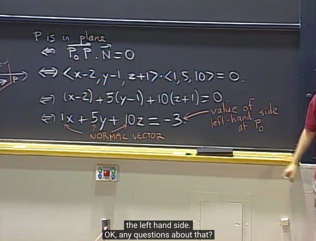</kbd>

> [!NOTE]
> Và **vế bên phải chính là giá trị của vế bên trái tại P0**
>
> Và gs nói thêm đương nhiên **không chỉ có 1 equation của plane** vì
> ta **nhân hai vế với constant**thì nó **cũng là equation**

 

<kbd>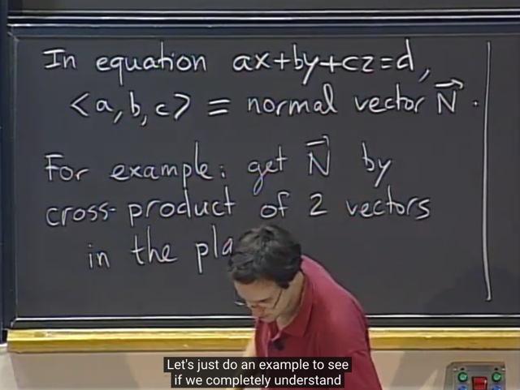</kbd>

🔗 **Related:** [LEC 3: MATRIX, INVERSE MATRIX](untitled.md#node-30)

🔗 **Related:** [LEC 12: GRADIENT, DIRECTIONAL DERIVATIVE, TANGENT PLANE](untitled.md#node-248)

> [!NOTE]
> Ý quan trọng muốn nói ở đây là, **trong equation of the plane**, thì **a,
> b,c CHÍNH LÀ COMPONENT CỦA NORMAL VECTOR N**.
>
> Và **ta có thể có vector N** theo cách **dùng cross product của hai
> vector trong plane** bài trước đã học **A x B là vector vuông góc với
> plane** span bởi A, B và **độ lớn vector A x B là diện tích hình bình
> hành tạo bởi A, B**

 

<kbd>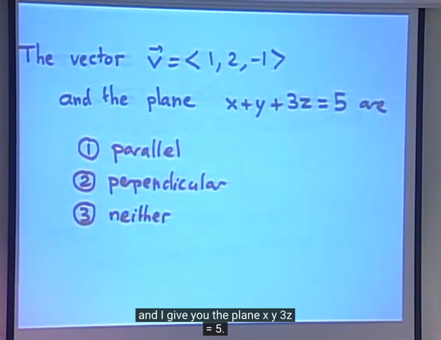</kbd>

> [!NOTE]
> Tiếp theo là câu hỏi cho vector V như vầy, xác định xem quan hệ
> của nó như thế nào với plane.
>
> Dễ thấy**dot product của V và N bằng 0** (N là normal vector) thì từ
> đó **suy ra V có thể nằm trong plane** hoặc**song song với plane.**
>
> Thế mà **plane này không đi qua 0**, nên **V song song với plane.**

 

<kbd>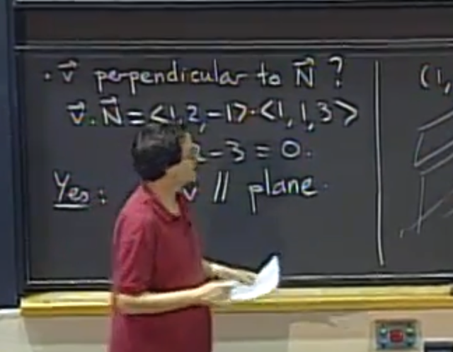</kbd>

> [!NOTE]
> gs: correct

 

<kbd>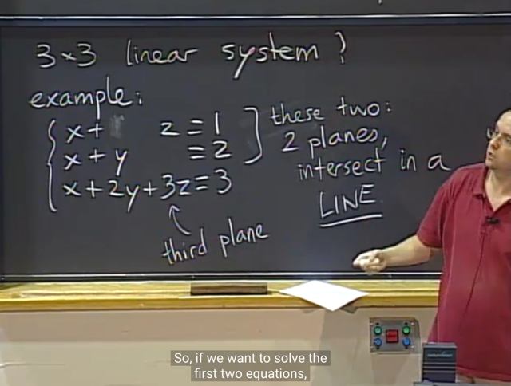</kbd>

> [!NOTE]
> và từ đó ta có **system of linear equation**, **solution** của nó là **giao điểm
> của 3 plane** (mỗi phương trình là một equation plane với các hệ số là
> tọa độ của normal vector)
>
> Dưới góc nhìn của 1806 mình có thể thấy ở đây là matrix `full-rank:`
> **square** và dễ thấy các **column independent** do xuất hiện các **identity
> matrix**. Do đó, **column space là toàn bộ R^3**, dẫn đến **b `=` (1,2,3) luôn
> nằm trong column space**. Và dẫn đến **luôn có x_particular**.
>
> bên cạnh đó, vì matrix**full-rank** nên **non-singular**. Nên **không có vector
> nào trong nullspace**. Vậy **không có x_special**
>
> Thành ra hệ phương trình Ax `=` b **chỉ có 1 nghiệm duy nhất**

 

<kbd>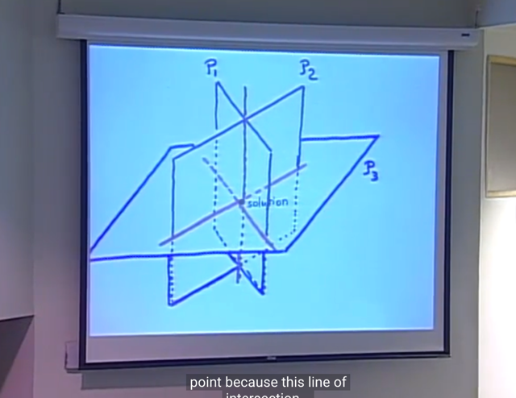</kbd>

> [!NOTE]
> nếu hệ có 1 nghiệm, thì **3 plane giao nhau tạo 1 điểm**
> (mỗi cặp giao nhau tại 1 đường thẳng và 2 đường thẳng cắt
> nhau tại 1 điểm)

 

<kbd>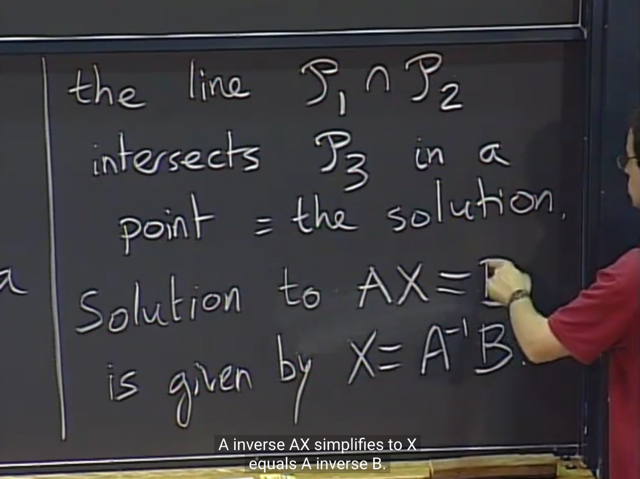</kbd>

> [!NOTE]
> gs cũng thể hiện system of equation với Ax `=` b, và solution là AinvB.
> Đương nhiên phải **dựa trên cơ sở A invertible**

 

<kbd>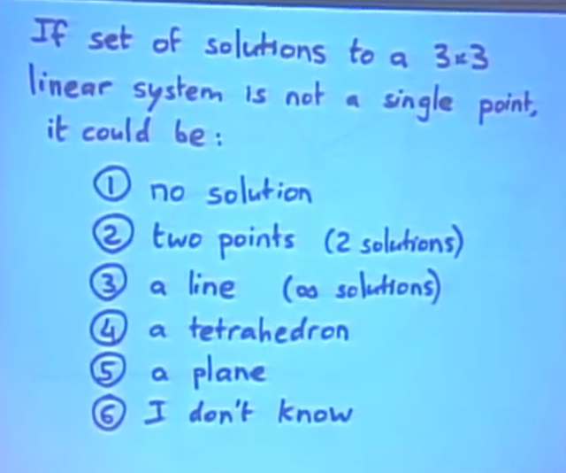</kbd>

> [!NOTE]
> câu hỏi là nếu không chỉ có 1 solution thì **có thể là bao nhiêu solution**:
>
> Đương nhiên với 1806 thì mình biết nó chỉ **có thể là vô số solution**
> khi **tồn tại vector khác không trong nullspace**, khi đó **solution sẽ là
> `x_particular` `+` mọi linear combination của x_special**
>
> Ngược lại, n**ếu x_particular** không tồn tại,**khi b không nằm trong C(A)
> thì hệ vô nghiệm**.
>
> Theo góc nhìn hình học, thì dễ thấy **hệ sẽ có vô số nghiệm** nếu **3 plane
>  giao nhau tại 1 line** hoặc **1 plane**
> Hoặc vô nghiệm khi 3 plane song song hoặc 1 plane song song với giao 
> tuyến của hai plane còn lại

 

<kbd>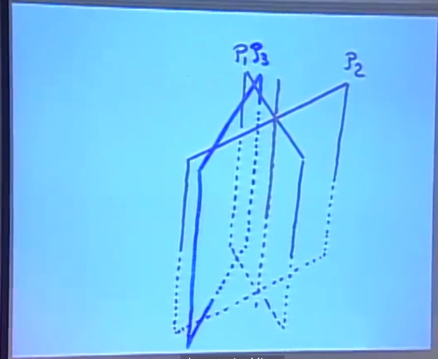</kbd>

> [!NOTE]
> Theo góc nhìn hình học thì khi **line P1P2 (tức là giao tuyến của plane P1, P2) không 
> nằm trong P3** thì  system equation không có solution.
>
> theo 1806:
>
> Xét hệ 3 equation 3 variable. Ax `=` b. matrix A 3x3, x, b đều là R^3 vector. equation 1 là
> equation của plane P1, equation 2 là equation của plane P2 equation 3 là equation của
> plane P3
>
> Lập luận về **các trường hợp solution của Ax `=` b** theo **hình học** và theo **linear algebra**.
>
> Đầu tiên, **các row của A chính là normal vector của các plane P1, P2, P3**. và b1, b2, b3
> như đã biết chính là khoảng cách khi shift các plane song song từ gốc tọa độ
>
> **1) A là matrix rank 1, row 2, 3 đều dependent row 1**: Nói theo 1806, 3 row của A thật
> ra là một, hay **chỉ có một independent row**, các row kia đều là linear combination của một
> row (row nào cũng được).
>
> Về mặt hình học, thì lúc này **cả 3 plane sẽ có cùng một normal vector** `->` 3 plane cùng
> vuông góc với cùng một normal vector, và **chỉ khác nhau bởi vế phải** `-` như đã nói có thể
> coi như shift các plane cách xa hoặc lại gần origin.
>
> Lúc này sẽ có thể có các dạng:
>
> i) 3 PLANE SONG SONG `->` hệ **vô nghiệm**
>
> ii) 2 plane TRÙNG nhau VÀ song song với plane còn lại `->` hệ **vô nghiệm**
>
> iii) cả 3 đều TRÙNG nhau `->` hệ có **vô số nghiệm**
>
> Theo linear algebra: Khi elimination augmented matrix A|b để thành U|b' ta sẽ thấy 2 row
> của bên trái đều 0 và 3 case trên sẽ tương ứng với
>
> i) b'2 b'3 đều khác 0 `->` hệ **vô nghiệm**
>
> ii) b'2 hoặc b'3 khác 0 `->` hệ **vô nghiệm**
> iii) b'2 `=` b'3 `=` 0 `->` hệ có **vô số nghiệm**
>
> 2) **Trường hợp A là matrix rank 2: có row 1 và row 2 independent , row 3 dependent**
>
> Theo góc nhìn hình học: thì ta có 2 plane P1 P2 ứng với hai row sẽ không song song bởi
> normal vector của chúng khác phương, và do đó P1 P2 GIAO NHAU TẠI 1 LINE. 
> (cho rằng hai plane này là  P1, P2, ứng với equation 1, 2; hai normal vector N1, N2 là row 
> 1, row 2 của A)
>
> Khi đó, **row 3 của A, là linear combination của hai row kia**, cũng có nghĩa là **normal
> vector N3 của P3 nằm trong plane span bởi N1, N2**. Nếu gọi plane này (span bởi N1,
> N2) là plane N1N2 thì **N1N2 sẽ vuông góc với cả P1, P2, P3** (*)
>
> Khi đó có các trường hợp
>
> i) Sau khi elimination, **row 3 sẽ thành 0**, khi đó **nếu b'3 khác 0**, thì ta có trường hợp **P3
> KHÔNG CHỨA LINE P1P2** `->` Hệ v**ô nghiệm**, đây cũng là khi **b không nằm trong C(A)**
>
> ii) Trường hợp khác là sau khi elimination, **b3 cũng ra**0, thì đây chính là khi **P3 có chứa
> line P1P2.** Hệ phương trình **vô số nghiệm**. Đây cũng chính là khi Ax `=` b có
> **x_particular**. Và với việc matrix A không `full-rank,` có vector khác 0 trong `null-space,` Ax
> `=` 0 có `x_special` nên dẫn đến **Ax= b có vô số solution**. Về hình học thì **P3 CÓ CHỨA
> LINE P1P2**
>
> **3. Trường hợp cả 3 row của A đều độc lập, A full-rank**
>
> Theo hình học, 3 row đều độc lập, tức **3 plane equation đều có normal vector khác 
> nhau** **P1, P2, P3 PLANE CẮT NHAU TẠI 1 ĐIỂM** `->` Chỉ có một solution
>
> Còn theo góc nhìn 1806, nếu elimination, 3 rows của vế trái đều là khác 0 từ đó có thể tìm
> solution chính là **x_particular**. Và vì **A full rank nên không có non
> trivial vector trong nullspace**. Nên không Ax `=` 0 không có non trivial solution. Do đó
> system equation **chỉ có một solution duy nhất.**

 

<kbd>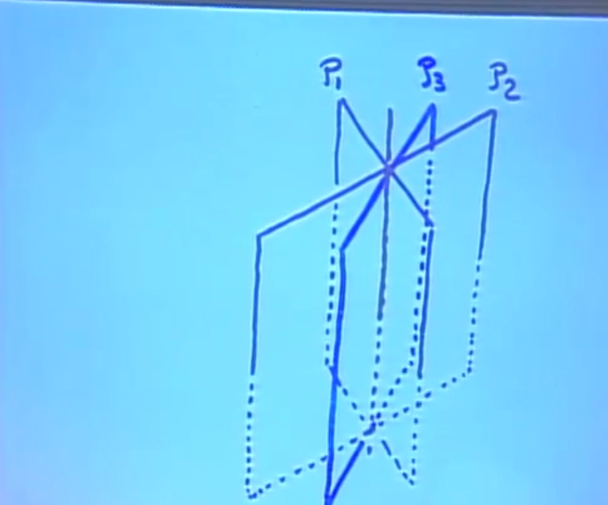</kbd>

 

<kbd>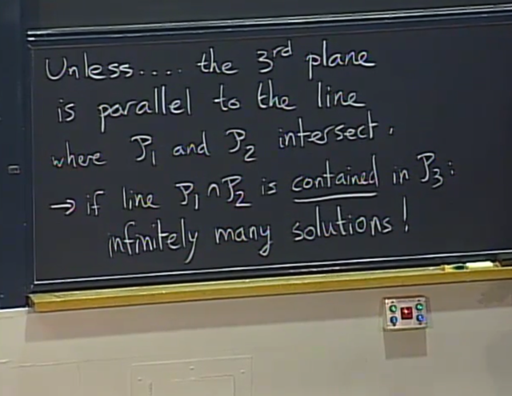</kbd>

> [!NOTE]
> nếu line P1,P2 nằm trong
> P3 `->` many solution

 

<kbd>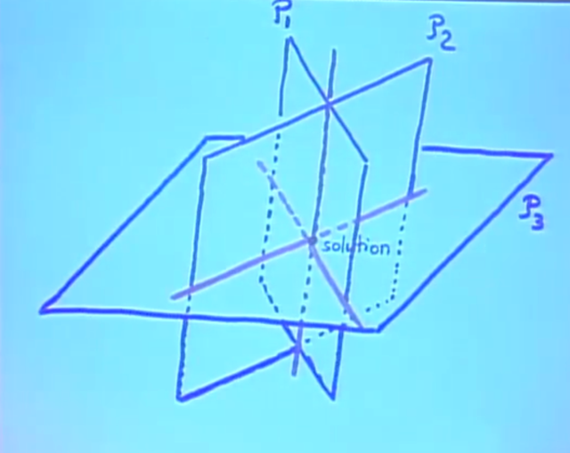</kbd>

> [!NOTE]
> 3 plane intersect ở 1 point

 

<kbd>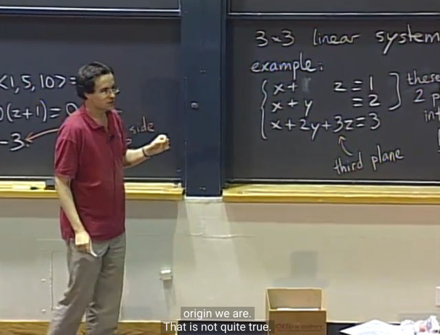</kbd>

> [!NOTE]
> Tiếp theo gs hỏi là **ý nghĩa hình học của equation x `+` 2y `+` 3z `=` 3**.
>
> Thì gs cho biết là **vế bên phải bằng 0** thì biểu hiện một **plane đi qua
> origin** (dễ hiểu ax `+` by `+` z `=` 0, thì **(0,0,0) là một solution**, tức là plane
> có đi qua gốc O)
>
> Và **với các giá trị khác nhau của vế phải** thì **ta sẽ có các plane song
> song với plane đi qua O**.
>
> Và gs cho biết ta **có thể xem gần đúng** như **vế phải là khoảng cách
> tới gốc O của plane**

 

<kbd>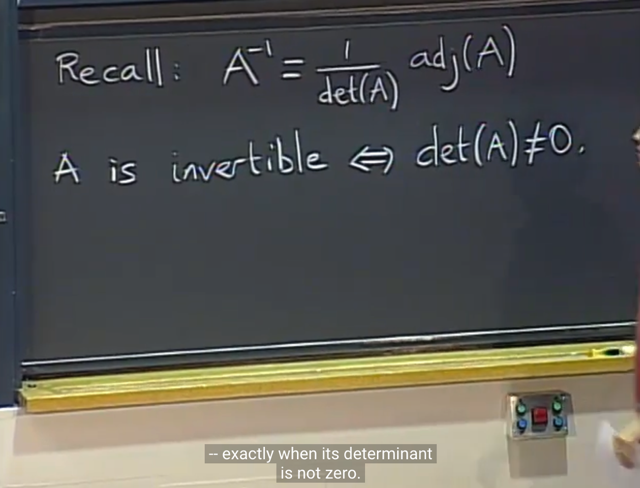</kbd>

> [!NOTE]
> thế thì gs quay lại việc **tại sao ta không thể luôn tìm solution của
> bằng cách Ainv*y** (hay Ainvb) là **bởi A không phải luôn invertible**
> (theo góc nhìn của 1806 thì đã quá rõ)
>
> còn**theo góc nhìn 1802** thì **bởi Ainv có công thức như vầy**,
> trong đó **det(A) không phải luôn khác 0**. Nên **Ainv chỉ tồn tại nếu
> det(A) khác 0**
>
> Ta luôn có thể tính **adjoint matrix**, nhưng **det thì có thể bằng 0**
>
> Thế thì qua 1806 mình có cái nhìn rộng hơn điều này đó là khi học về
> các tính chất của định thức ta có thể **chứng minh được rằng
> singular matrix có det `=` 0**. Do đó để matrix nonsingular, thì det sẽ
> phải khác 0.
>
> Và gs cho biết thêm khi A `non-invertible` chính là tương ứng với việc
> **đường thẳng giao của P1, P2 nằm trong P3** khiến ta có **vô số
> solution**Hoặc**P1 intersect P2 song song với P3** hoặc **P1, P2, P3 song
> song nhau** thì đều không có solution nào****Và liên hệ với 1806 thì A singular nên A (đang xét A square) có rank
> nhỏ hơn số columns hay rows nên nullspace hay left nullspace đều
> khác rỗng. Dẫn đến có có `x_particular` (solution của `Ax=0)`
>
> Khi đó nếu b nằm trong C(A) thì ta sẽ có vô số nghiệm, ngược lại b
> không  nằm trong C(A) thì vô nghiệm

 

<kbd>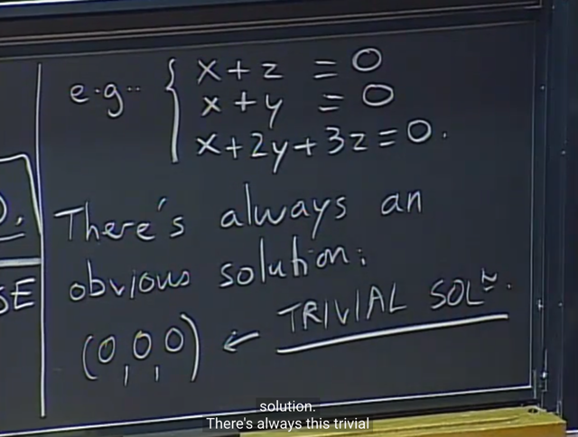</kbd>

> [!NOTE]
> gs nói qua Ax `=` 0. Gọi là **HOMOGENEOUS** system. Thì đương
> nhiên 0 là một solution, Vì ở đây 3 plane equation đều pass Origin
>
> Và nó gọi là **TRIVIAL** SOLUTION

 

<kbd>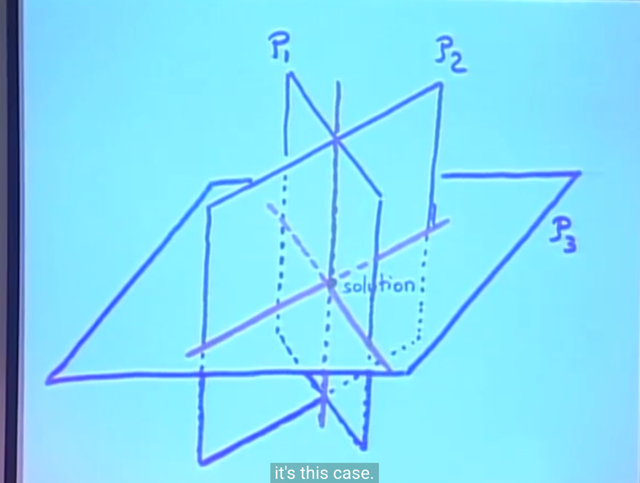</kbd>

<kbd></kbd>

<kbd>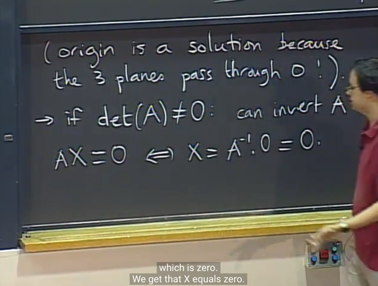</kbd>

> [!NOTE]
> Tiếp ta xét trường hợp A invertible. Khi đó tồn tại Ainv, nên Ax `=` 0
> `<=>` x `=` Ainv*0 `=` 0
>
> Có nghĩa là lúc này, cũng chỉ có một solution duy nhất là TRIVIAL
> SOLUTION
>
> 1806 view: thì đây là lúc matrix `non-singular,` nên mọi cols đều
> indendent, không có free columns, nên system equation không có
> free variable `->` không tìm được special solution nào `->` không có
> vector khác 0 nào trong basis của nullspace `->` dim N(A) `=` 0
>
> Hoặc nói ngắn gọn hơn thì vì**các columns và row đều independent**
> nên đương nhiên **theo định nghĩa independent vector** thì **chỉ có
> một linear combination duy nhất tạo ra 0** đó là **mọi coefficient đều
> bằng 0 (đó chính là trivial solution)**

 

<kbd>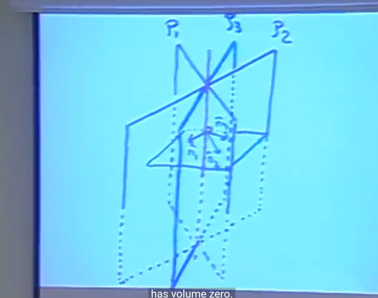</kbd>

<kbd></kbd>

<kbd>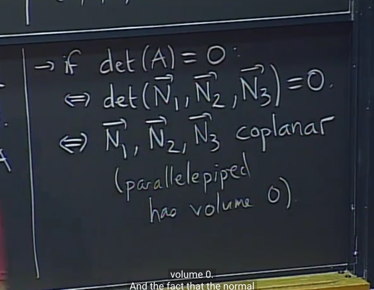</kbd>

> [!NOTE]
> gs nói qua khi det `=` 0, có thể hiểu det A chính là det của matrix của 
> N1, N2, N3:
>
> Vì sao, vì đơn giản rằng row của A chính là các normal vector. Liên
> hệ 1806,  thì **det A bằng det AT**  (AT chính là matrix mà các column là
> N1, N2, N3).
>
> Và như phân tích lúc nãy, đây là lúc r**ow 3 dependent row 1,2**
> nên **N1 nằm trong plane span bởi N1, N2**. (Plane N1,N2 chính là
> rowspace của A)
>
> Nên ở đây gs nói **3 normal vector nằm trong một plane**là vậy. 
> Và đương nhiên hình hộp bình hành tạo bởi 3 vector sẽ bị bẹp và có
> volume `=` 0
>
> Ta biết thêm rằng nó gọi là **COPLANAR**

 

<kbd>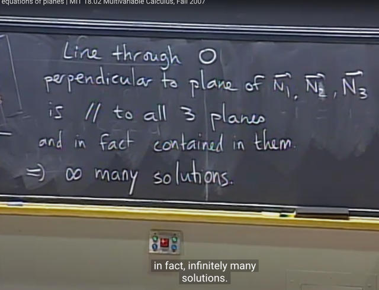</kbd>

> [!NOTE]
> Thì ở case này chính là case 2 trong phân tích lúc nãy. Có điều vì đây
> là Ax `=` 0, chứ ko phải Ax `=` b, nên **không xảy ra trạng thái vô nghiệm
> vì 3 plane P3 đều đi qua O**. Nên ở trường hợp này, **chỉ có thể ứng
> với việc P3 chứa line P1P2**. Hay theo 1806, thì đó là khi elimination,
> b'3 cũng bằng 0, row 3 của U cũng bằng 0.
>
> Và để tìm solution (là một đường thẳng, chứa mọi giao điểm của 3
> plane), thì nó sẽ là **vector vuông góc với plane N1N2** thì ta có thể
> dùng **CROSS PRODUCT N1x N2**

 

<kbd>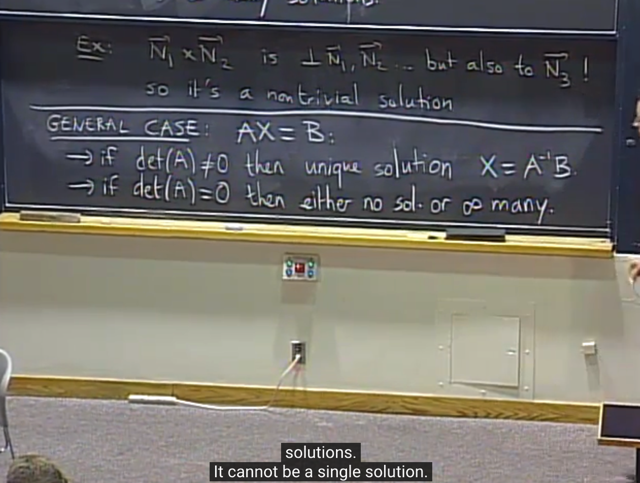</kbd>

> [!NOTE]
> cho general case thì y như
> đã phân tích hồi nãy

 

