# Lec 5: Parametric Equations For Lines And Curves

📊 **Progress:** `23` Notes | `24` Screenshots

---
<a id="node-79"></a>

<p align="center"><kbd>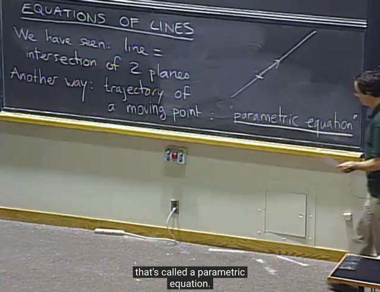</kbd></p>

> [!NOTE]
> ta đã thấy**line là intersection của 2 plane**. Thì nay ta **coi line như
> quỹ đạo** (trajectory) của **một điểm di chuyển theo một vector**
>
> Từ đó ta có **PARAMETRIC EQUATION**

<br>

<a id="node-80"></a>

<p align="center"><kbd>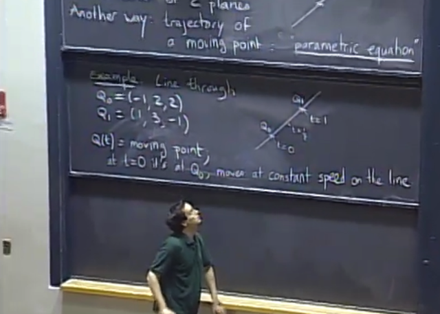</kbd></p>

> [!NOTE]
> Lấy ví dụ ta có **2 điểm** này, coi như là **vị trí của moving point** tại
> thời điểm **t `=` 0**, và **t `=` 1**
>
> Và cho **Q(t)** là function cho **vị trí của moving point theo t**, với speed
> quy định bởi **constant** sao cho từ Q0 tại `t=0` thì khi `t=1,` moving point
> tới Q1

<br>

<a id="node-81"></a>

<p align="center"><kbd>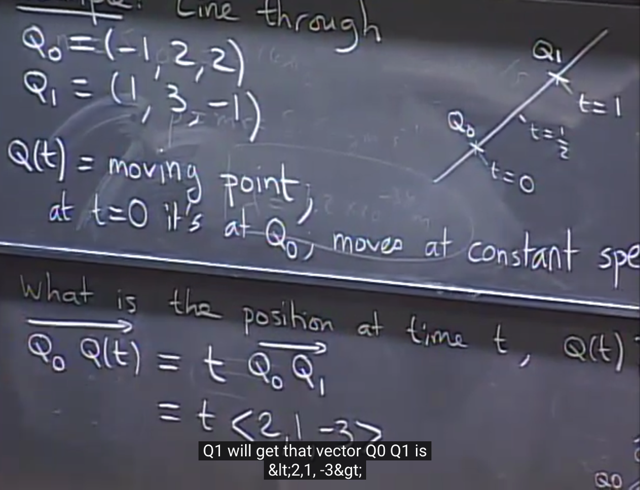</kbd></p>

> [!NOTE]
> gs đặt vector **Q0Qt** và **Q0Q1**. Câu hỏi là hai vector (cùng phương)
> này  thì Q0Qt `=` bao nhiêu * Q0Q1?
>
> `->` Q0Qt `=` t * Q0Q1
>
> Vì đã nói moving point di chuyển với constant speed sao cho trong 1
> đơn vị thời gian (từ `t=0` đến `t=1),` điểm di chuyển từ Q0 đến Q1 (tức là
> trên đoạn Q0Q1). Do đó trong t đơn vị thời gian dĩ nhiên nó sẽ di
> chuyển một quãng t * Q0Q1

<br>

<a id="node-82"></a>

<p align="center"><kbd>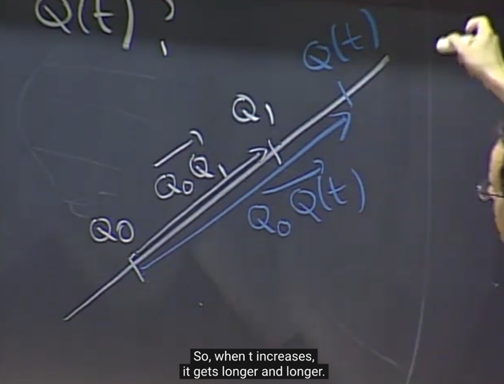</kbd></p>

<br>

<a id="node-83"></a>

<p align="center"><kbd>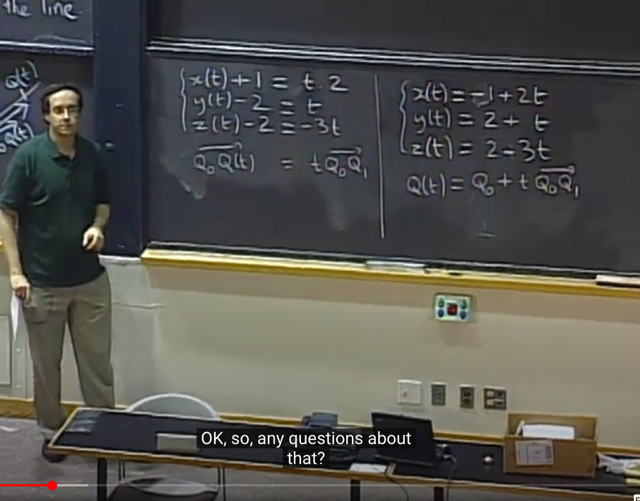</kbd></p>

> [!NOTE]
> từ đó, với việc ta tham số hóa vector Q `/` vị trí của moving point thì 
> cũng chính là ta tham số hóa tọa độ của nó:
>
> Q(t) `=` [x(t), y(t), z(t)]: 
>
> ```text
> => Q0Qt = Qt - Q0 = <x(t) - (-1), y(t) - 2, z(t) - 2>
> ```
>
> ```text
> = <x(t) + 1, y(t) - 2, z(t) - 2>
> ```
>
> ```text
> Q0Q1 = Q1 - Q0 = <2, 1, -3>
> ```
>
> Từ Q0Qt `=` t * Q0Q1 ta có 3 linear function như vầy:
>
> **x(t) `+` 1 `=` t*2
>
> y(t) `-` 2 `=` t
>
> z(t) `-` 2 `=` -3t**
>
> Và đây cũng chính là Q(t) `=` Q0 `+` t*Q0Qt

<br>

<a id="node-84"></a>

<p align="center"><kbd>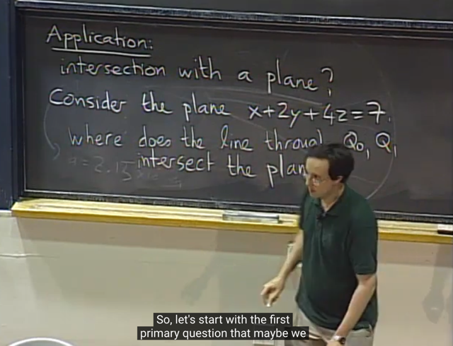</kbd></p>

> [!NOTE]
> qua phần ứng dụng. Đầu tiên gs cho plane với equation này, câu hỏi là
> **line đi qua Q0, Q1 có intersect với plane không?**

<br>

<a id="node-85"></a>

<p align="center"><kbd>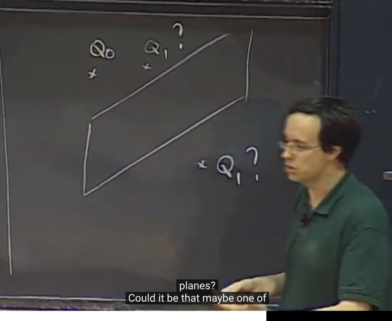</kbd></p>

> [!NOTE]
> Hay, câu hỏi khác là Q0, Q1 nằm cùng bên của
> plane hay khác bên so với plane?

<br>

<a id="node-86"></a>

<p align="center"><kbd>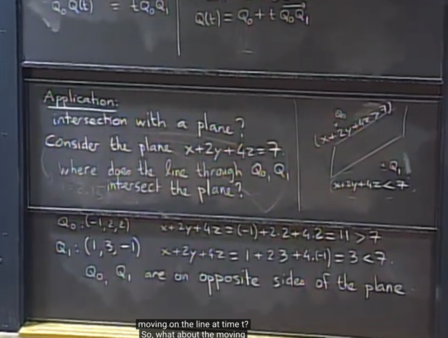</kbd></p>

> [!NOTE]
> ta sẽ tính **dot product của Q0 và normal vector ->** ra lớn hơn 7, và
> giữa **Q1 và normal vector** ra bé hơn 7 `->` ở **hai bên của plane**Lí do là theo định nghĩa phương trình mặt phẳng `ax+by+cz=d` thì mặt
> phẳng sẽ chia không gian thành 2 phần: tất cả những điểm có `ax+by+`
> cz > d và nửa còn lại là những điểm có `ax+by+cz` < d. Còn những
> điểm trên mặt phẳng sẽ có `ax+by+cz` `=` 0

<br>

<a id="node-87"></a>

<p align="center"><kbd>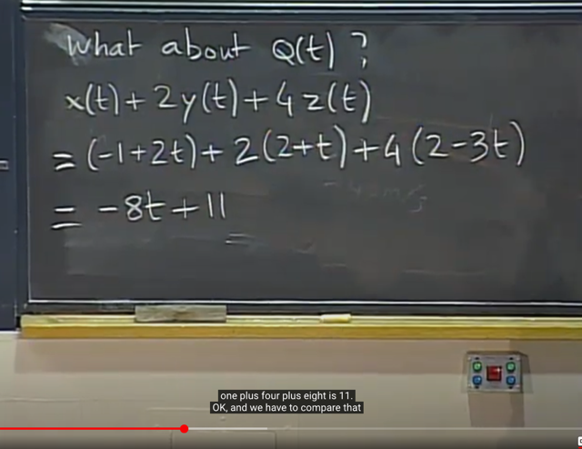</kbd></p>

> [!NOTE]
> Xét dot product của Q(t) và normal vector cho ra `-8*t` `+` 11

<br>

<a id="node-88"></a>

<p align="center"><kbd>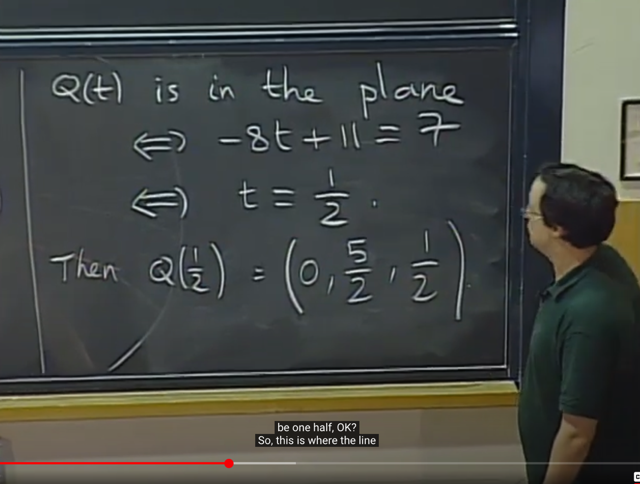</kbd></p>

> [!NOTE]
> Để Q(t) nằm trong plane thì **-8*t `+11` phải bằng 7** đồng
> nghĩa để t phải bằng `1/2.`

<br>

<a id="node-89"></a>

<p align="center"><kbd>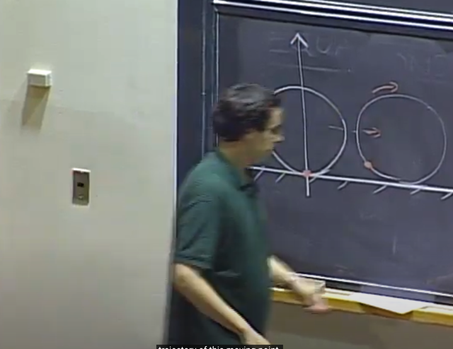</kbd></p>

> [!NOTE]
> tiếp theo qua bài toán **tìm quỹ đạo của 1 điểm trên bánh xe**đang di chuyển `-` **Cycloid**

<br>

<a id="node-90"></a>

<p align="center"><kbd>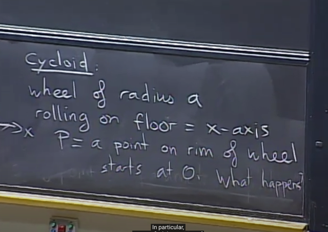</kbd></p>

> [!NOTE]
> Cho bánh xe **bán kính a**, lăn trên trục x.
> **P là 1 điểm trên vành bánh.**

<br>

<a id="node-91"></a>

<p align="center"><kbd>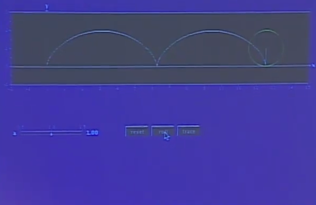</kbd></p>

> [!NOTE]
> Quỹ đạo của P như vầy.

<br>

<a id="node-92"></a>

<p align="center"><kbd>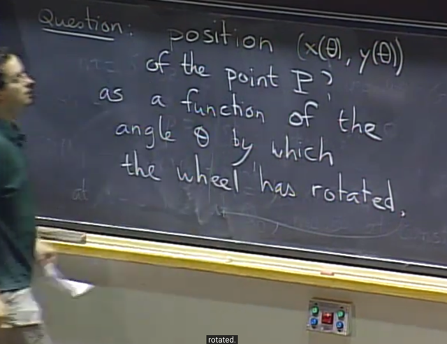</kbd></p>

> [!NOTE]
> Câu hỏi là**tìm function thể hiện vị trí của P theo
> theta** `-` là góc mà bánh xe đã xoay

<br>

<a id="node-93"></a>

<p align="center"><kbd>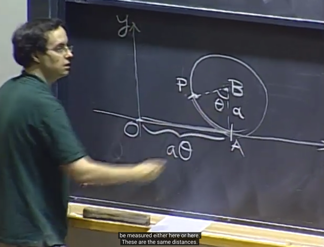</kbd></p>

> [!NOTE]
> Thế thì, vị trí của P cũng là của vector OP và CÓ VẺ RẤT KHÓ
> ĐỂ "TÍNH" VECTOR NÀY.
>
> Ta sẽ thể hiện nó bằng **tổng 3 vector (OA, AB, BP) CÓ VẺ DỄ
> TÍNH HƠN**

<br>

<a id="node-94"></a>

<p align="center"><kbd>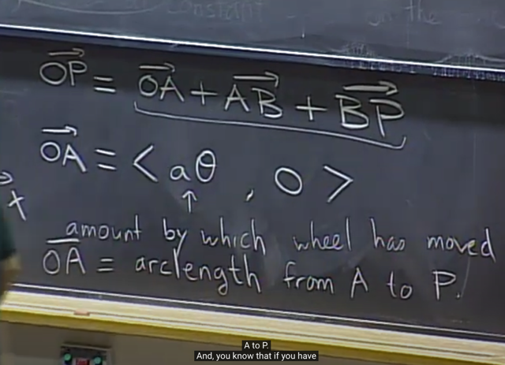</kbd></p>

> [!NOTE]
> Vector OA có **y `=` 0 vì nó trùng trục x**, và x `=` **a*theta** (a là bán kính),
> điều này là vì độ dài **OA chính là độ dài cung AP của đường tròn**.
>
> Theta có đơn vị radian.

<br>

<a id="node-95"></a>

<p align="center"><kbd>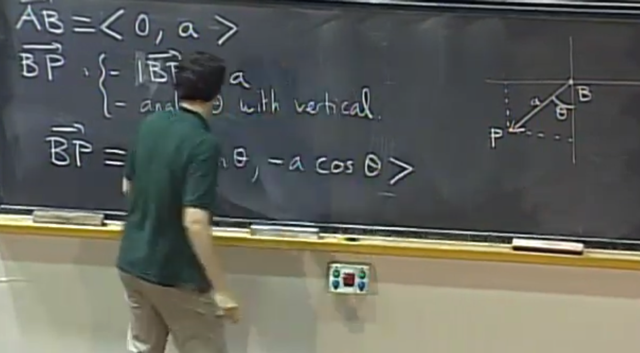</kbd></p>

> [!NOTE]
> **Vector AB thì dễ thấy bằng (0, a)**
>
> **Vector BP** thì có**length bằng a** và có **góc theta với trục
> vertical line**
>
> Thế thì d**ựa vào lượng giác** ta có hai tọa độ của BP là **-a*sin(theta)**
> và **-a*cos(theta)**

<br>

<a id="node-96"></a>

<p align="center"><kbd>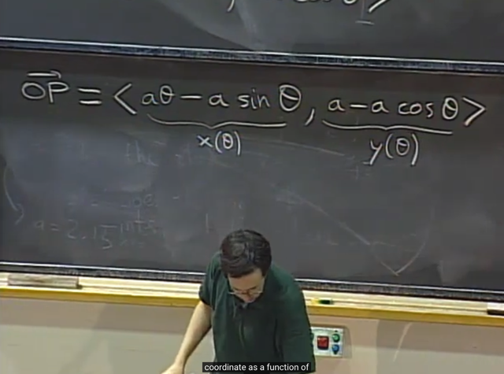</kbd></p>

> [!NOTE]
> và từ đó ta có vector OP cũng là tọa độ của P
> theo theta

<br>

<a id="node-97"></a>

<p align="center"><kbd></kbd></p>

> [!NOTE]
> câu hỏi là gần đáy thì quỹ đạo
> chính xác của P như thế nào.

<br>

<a id="node-98"></a>

<p align="center"><kbd>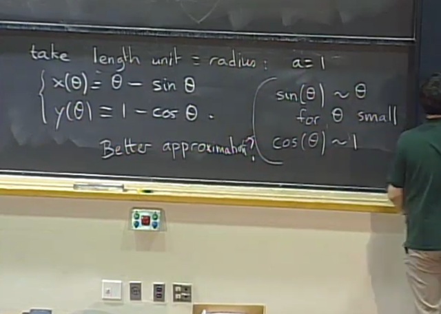</kbd></p>

> [!NOTE]
> Đại khái là ta xét a `=` 1 (unit length) để x(theta), y(theta) như vầy.
>
> Với**theta rất nhỏ thì sin(theta) `~=` theta**, **cos(theta) `~=` 1**
>
> (Có thể xem lại trong lec 2 của 18.01 (theo link tím), gs nói trong phần
> chứng minh hai properties A, B thì property B chính là khi theta `->` 0 thì
> limit `sin(theta)/theta` `=` 1 hay **sin(theta) `~=` theta**
>
> ```text
> Và property A đó là lim theta->0 [(cos(theta) - 1) / theta] = 0, tức là, khi
> ```
> ```text
> theta ~= 0, [cos(theta) - 1] /theta ~= 0 <=> cos(theta) - 1 ~= 0 <=>
> ```
> **cos(theta) `~=` 1)**
>
> Hoặc nói đúng hơn, là đây chính là dùng công thức linear approximation
> (link đỏ) f(x) `=` f(0) `+` f'(0)*x với f(x) là sin(x) thì công thức này sẽ cho ta
> ```text
> sin(x) = x khi x~=0 và f(x) = cos(x) thì ta có cos(x) ~= 1 khi x~=0
> ```
>
> Quay lại đây, gs nói cách xấp xỉ này, x `~=` 0, `y~=1` và không giúp ích gì
> trong việc trả lời câu hỏi này

<br>

<a id="node-99"></a>

<p align="center"><kbd>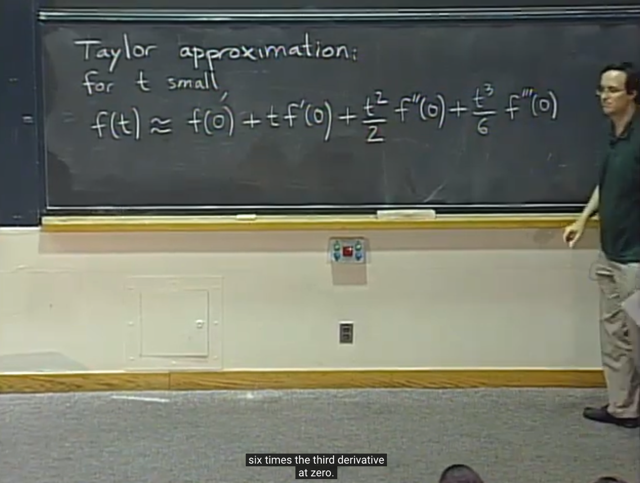</kbd></p>

> [!NOTE]
> gs nói ta cần dùng kiến thức Taylor expansion học từ 1801.
>
> Đó là hàm f(t) có thể được ước lượng xấp xỉ như vầy.
>
> Ta đã biết công thức Taylor series hàm f(x) expand tại a:
>
> ```text
> f(x) = Tổng n = 0:N (1/n!)[đạo hàm cấp n của f tại a] (x-a)^n
> ```
>
> Thì ở đây a `=` 0, (gọi là Maclaurin series):
>
> ```text
> f(t) = Tổng n = 0:N (1/n!)[đạo hàm cấp n của f tại a] (x-a)^n
> ```
>
> **= f(0) `+` f'(0)t `+` `f''(0)t^2/2` `+` ...**Chỗ này hình như gs ghi sai f'(0). Phải là f(0)

<br>

<a id="node-100"></a>

<p align="center"><kbd>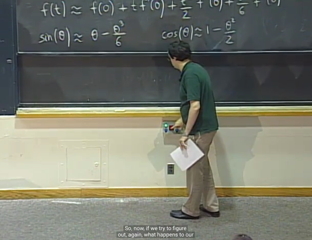</kbd></p>

> [!NOTE]
> và áp dụng Taylor approximation, ta có better approximation cho
> sin(theta), cos(theta) tại theta `=` 0
>
> ```text
> f(t) = f(0) + f'(0)t + f''(0)t^2/2 + ...
> ```
>
> ```text
> => sin(theta) = sin(0) + sin'(0)*theta + sin''(0)*theta^2/2 + sin'''(0)*theta^3/3 + ...
> ```
>
> ```text
> sin(0) = 0, sin'(x) = cos(x) => sin'(0) = cos(0) = 1
> ```
>
> ```text
> sin''(x) = cos'(x) = -sin(x) => sin''(0) = -sin(0) = 0
> ```
>
> ```text
> sin'''(x) = -sin'(x) = -cos(x) => sin'''(0) = -cos(0) = -1
> ```
>
> Ta sẽ chỉ dùng tới lũy thừa bậc 3 của theta là được rồi vì theta rất nhỏ.
>
> `->` **sin(theta)** `~=` 0 `+` 1*theta `+` `0*theta^2/2!` `-1*theta^3/3!` `=` **theta `-` `theta^3/6`
>
> Làm tương tự ta cũng có cos(theta) `~=` 1 `-` theta^2/2**

<br>

<a id="node-101"></a>

<p align="center"><kbd>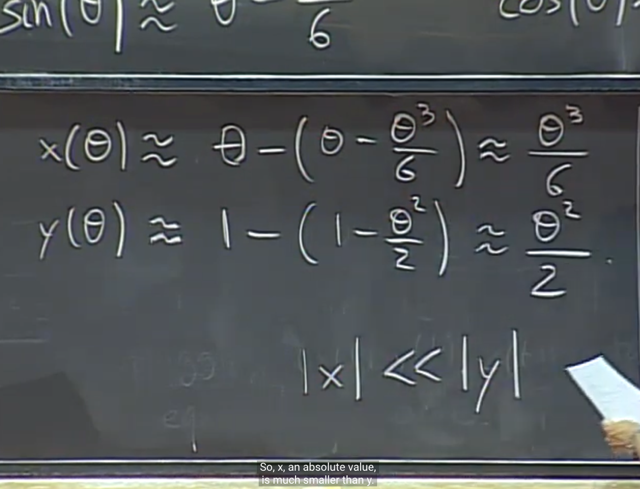</kbd></p>

> [!NOTE]
> từ đó ta có better approximation của x(theta) y(theta). 
>
> x(theta) `=` theta `-` sin(theta) `~=` theta `-` (theta `-` `theta^3/6)` `=` **theta^3/6**
>
> y(theta) `=` 1 `-` cos(theta) `~=` 1 `-` (1 `-` `theta^2/2)` =**theta^2/2**
>
> Và nó có thấy với theta rất nhỏ thì **x nhỏ hơn rất nhiều so với y vì
> x là lũy thừa bậc 3 của theta còn y là bậc 2 (theta rất nhỏ thì bậc
> lũy thừa càng cao thì nó càng nhỏ)**

<br>

<a id="node-102"></a>

<p align="center"><kbd>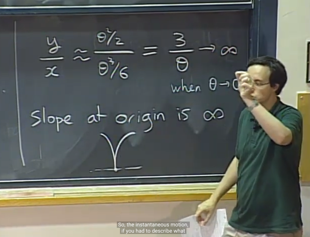</kbd></p>

> [!NOTE]
> và **tỉ lệ `y/x` sẽ là 3/theta** và khi **theta nhỏ đến 0 thì `y/x` `->` vô
> cùng.**
>
> Tức là nếu xét đồ thị y `=` f(x) (thay vì thay vì là x(theta), y(theta))
> thì the **slope của đồ thị hàm y `=` f(x) tại theta `->` 0 sẽ là vô cùng**.
>
> Do đó dạng chính xác của hàm f tại điểm tiếp xúc mặt đường
> sẽ là như vầy

<br>

