# Lec 6: Velocity, Acceleration, Kepler's Second Law

📊 **Progress:** `27` Notes | `29` Screenshots

---

<kbd>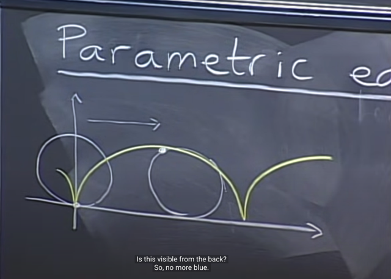</kbd>

> [!NOTE]
> Bài trước ta đã biết về **parametric equation**, giúp **mô tả chuyển
> động của một điểm** theo **biến số thời gian** hoặc biến số nào đó
>
> Cụ thể là bài trước ta xem xét chuyển động của một điểm trên vành
> bánh xe

 

<kbd>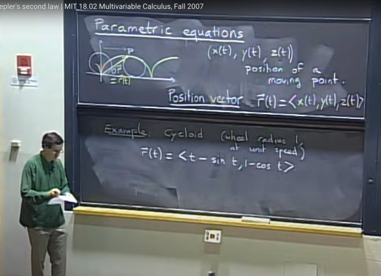</kbd>

🔗 **Related:** [LEC 12: GRADIENT, DIRECTIONAL DERIVATIVE, TANGENT PLANE](untitled.md#node-251)

> [!NOTE]
> Đại khái là trong bài toán đó ta **thể hiện tọa độ của điểm làm các
> function theo t: [x(t), y(t), z(t)]**, từ đó ta có **position vector OP = r(t)**
> (cũng là tọa độ của điểm) theo t
>
> Và bữa trước ta đã tìm ra **r(t) = < t - sin(theta), 1 - cos(theta)>**
>
> Nếu bánh xe quay với **unit speed**, thì **theta = t** (theta vốn là hàm theo
> t, và nếu tốc độ quay là unit tức là bằng 1 thì theta = 1*t)

 

<kbd>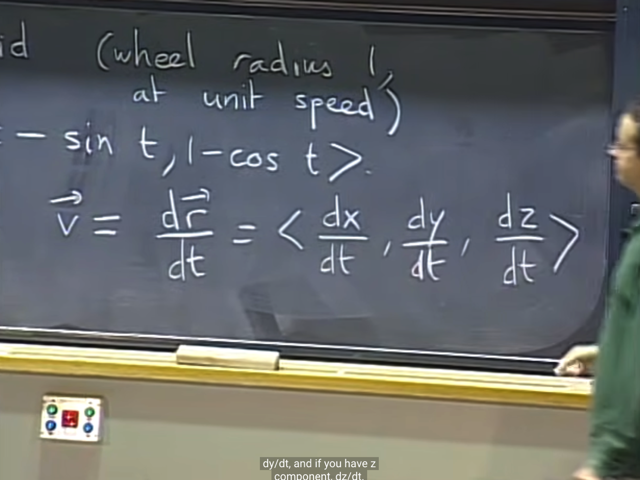</kbd>

🔗 **Related:** [LEC 6: VELOCITY, ACCELERATION, KEPLER'S SECOND LAW](untitled.md#node-123)

> [!NOTE]
> Đại khái là ta có thể có **vector vận tốc (velocity)** vừa chỉ **độ lớn** vừa
> chỉ **hướng của chuyển động.** Và ta sẽ có vector này bằng cách **lấy
> đạo hàm của r đối với t**
>
> Và component của vector v sẽ có được bằng cách lấy derivative của 
> từng component của r(t) đối với t: dx/dt, dy/dt, dz/dt

 

<kbd>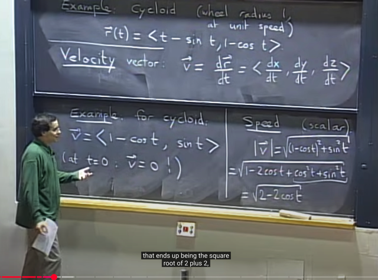</kbd>

> [!NOTE]
> Lấy ví dụ của **cycloid** thì ta có vector velocity như vầy (dễ dàng
> tìm được đạo hàm của x(t), y(t) đối với t:
>
> d [t - sin(t)] / dt = 1 - cos(t) và d [1 - cos(t)] / dt = -(-sin(t)) = sin(t)
>
> Để rồi **với t = 0** (thời điểm xuất phát) thì **v = zero vector**(<1 -
> cos(0), sin(0)> = <1-1, 0> = <0, 0>
>
> Còn **độ lớn** của vận tốc, thì ta sẽ lấy **l2 norm** của vector v, với
> ví dụ cycloid thì nó là sqrt(2-2cost(t)) (để rồi với t = 0 thì 2-2*cost(t) =
> 2-2 = 0
>
> Khi t = pi, thì vector v sẽ song song với hướng di chuyển, với độ lớn
> thế t vào sqrt(2-2*cost(t)) = sqrt(2-2*cost(pi)) = sqrt(2-(-2)) = sqrt(4) =
> 2.  Cho thấy nó **di chuyển nhanh gấp 2 lần tốc độ di chuyển của
> bánh xe**(unit speed)

 

<kbd>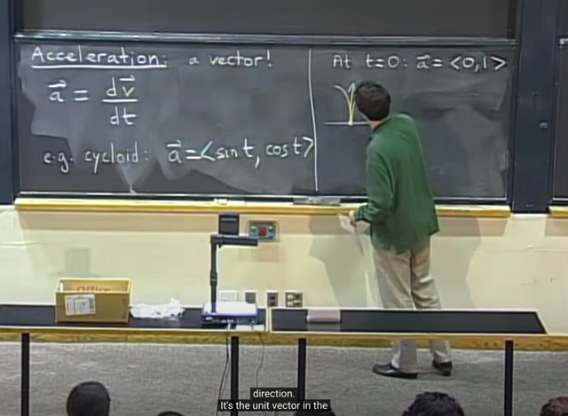</kbd>

> [!NOTE]
> Gia tốc cũng là vector, và là **derivative của vector v**(đương nhiên là
> đối với t vì v chỉ là hàm theo t).
>
> Với cycloid example thì vector a là <sin(t), cost(t)> Và **tại t = 0, ta có
> vector a = <0,1>**
> Điều này cho thấy khi đó dù chưa di chuyển, vận tốc của điểm P bằng 0
> nhưng nó có**gia tốc hướng lên với độ lớn sqrt(1^2+0) = 1**

 

<kbd>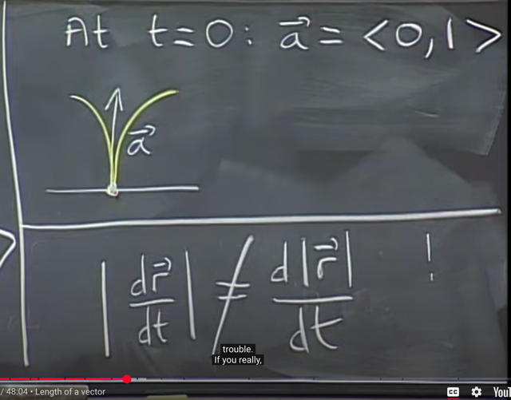</kbd>

> [!NOTE]
> Gs lưu ý là **length của dr/dt mới là length của vector vận tốc**, và
> là độ lớn của vận tốc.
>
> Còn nó **hoàn toàn khác với d|r|/dt** và **đạo hàm của độ lớn** của r
> đối với t **không phải là khái niệm gì cả**

 

<kbd>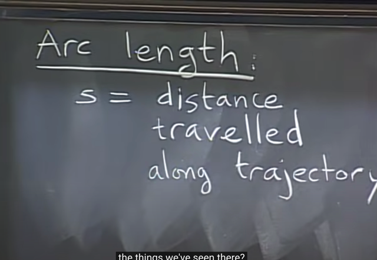</kbd>

> [!NOTE]
> Học qua khái niệm **arc length**, là khoảng cách, **độ lớn của
> quãng đường di chuyển dọc theo quỹ đạo.**

 

<kbd>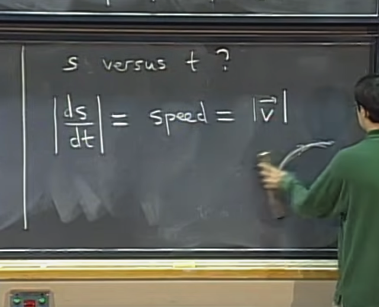</kbd>

> [!NOTE]
> đại khái là **theo định nghĩa**, derivative của s đối với t, **ds/dt
> = speed = |v|**
>
> Do đó **để tính s**, ta sẽ tính **tích phân vận tốc theo thời gian**

 

<kbd>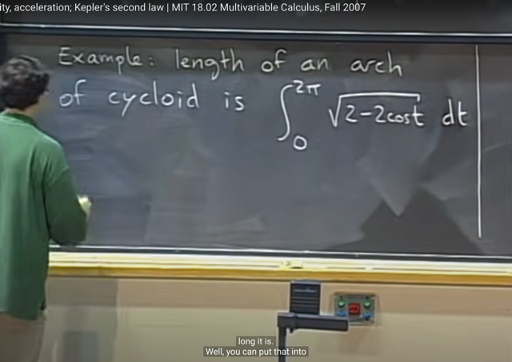</kbd>

> [!NOTE]
> Ví dụ, **chiều dài của một arch** trong ví
> dụ cycloid sẽ là **tích phân từ 0:2pi của speed**

 

<kbd>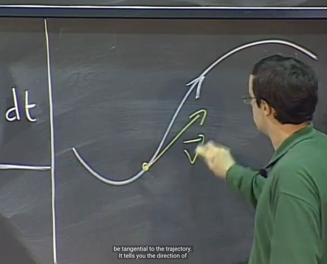</kbd>

<kbd></kbd>

<kbd>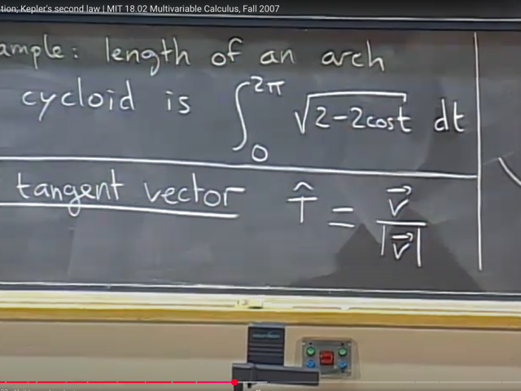</kbd>

> [!NOTE]
> Ta cũng làm quen một kí hiệu mới t^, chỉ **tangent unit vector** -
> vector tiếp tuyến đơn vị.
>
> Thế thì, ta có **vector v sẽ tiếp tuyến với quỹ đạo**, nên **để có
> vector tiếp tuyến đơn vị** ta chỉ cần **scale vector v về unit length**
> bằng cách **chia vector v cho độ lớn của nó. Nên t^ = v / |v|**

 

<kbd>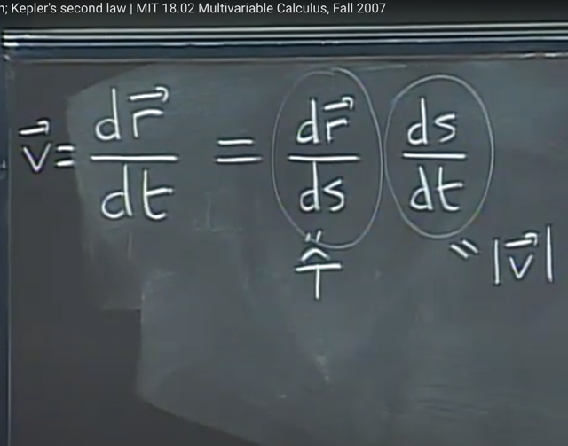</kbd>

> [!NOTE]
> Vậy thì từ việc ta biết khi đạo hàm vector r theo t ta có vector v.
> Áp dụng chain rule (bài 4 1801) ta có dr/ds ds/dt.
>
> Với ds/dt là độ lớn của vận tốc như đã biế thì dẫn đến:
>
> v = dr/ds |v|. Chia hai vế cho |v|, ta có dr/ds = v/|v| và như vậy nó
> (tức dr/ds) chính là tangent unit vector t^

 

<kbd>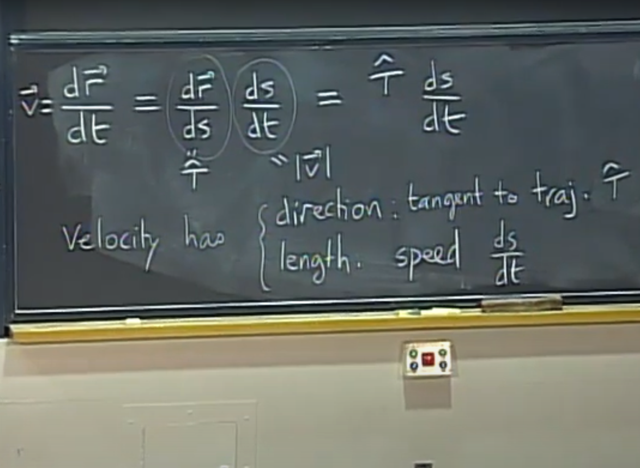</kbd>

> [!NOTE]
> Và cái này thể hiện rằng, vector v có hướng là vector tiếp tuyến đơn
> vị t^, cũng là tiếp tuyến với quỹ đạo. Và độ lớn của nó, chính là tốc
> độ, và là đạo hàm của s đối với t ds/dt

 

<kbd>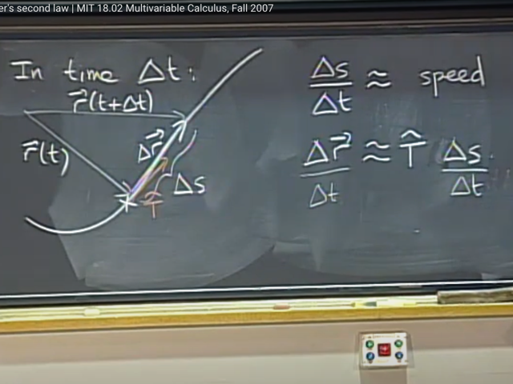</kbd>

> [!NOTE]
> Gs giải thích **vì sao dr/ds chính là T^**
>
> Thế thì. Khi điểm di chuyển trong khoảng thời gian delta_t, nó sẽ từ
> vị trí thể hiện bởi position vector r(t) để trở thành r(t+delta_t)
>
> Và hiệu của hai vector: r(t+delta_t) - r(t) = vector delta_r.
>
> Thế thì quãng đường nó di chuyển trong delta_t thời gian, là delta_s
> nên delta_s / delta_r sẽ cho ta xấp xỉ (độ lớn) vận tốc. 
>
> Và vector delta_r có thể coi như xấp xỉ delta_s * vector T^: 
> delta_r ~= T^ delta_s. Để rồi chia hai vế cho delta_t, ta có:
>
> delta_r / delta_t ~= T^ delta_s / delta_t

 

<kbd>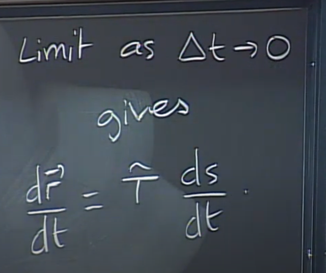</kbd>

> [!NOTE]
> Và tính limit khi delta_t -> 0, sẽ
> cho ta dr/dt = T^ ds/dt

 

<kbd>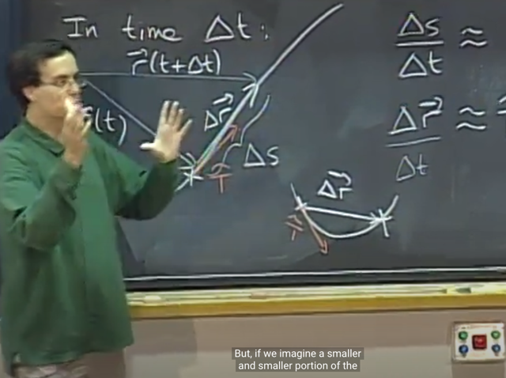</kbd>

> [!NOTE]
> vector delta_r ko có hướng tiếp tuyến (vector T^), như hình ảnh này gs
> cho thấy điều đó. Tuy nhiên khi delta_t -> 0 thì vector delta_r và T^ sẽ
> ngày càng trở nên trùng hướng nhau vì khi đó cung (đường cong) sẽ
> ngàg càng trở nên thẳng

 

<kbd>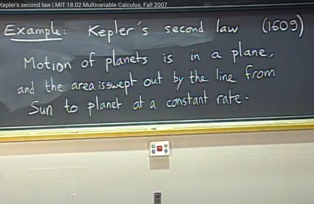</kbd>

> [!NOTE]
> Ta sẽ học qua định luật thứ 2 của Kepler nói rằng: Chuyển động của
> hành tinh quanh mặt trời là trên một mặt phẳng, và diện tích bị quét
> bởi đường nối giữa hàng tinh và mặt trời sẽ theo một tỉ lệ hằng số

 

<kbd>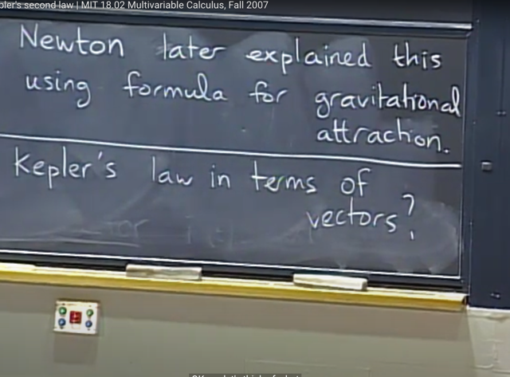</kbd>

> [!NOTE]
> Đại khái gs cho biết cái này có nghĩa hành tinh khi gần mặt trời hơn
> khi nó quanh quanh mật trời theo quỹ đạo elip thì nó sẽ đi nhanh
> hơn và chậm lại khi ra xa. 
>
> Và sau này Newton giải thích lại dùng công thức của luật hấp dẫn.

 

<kbd>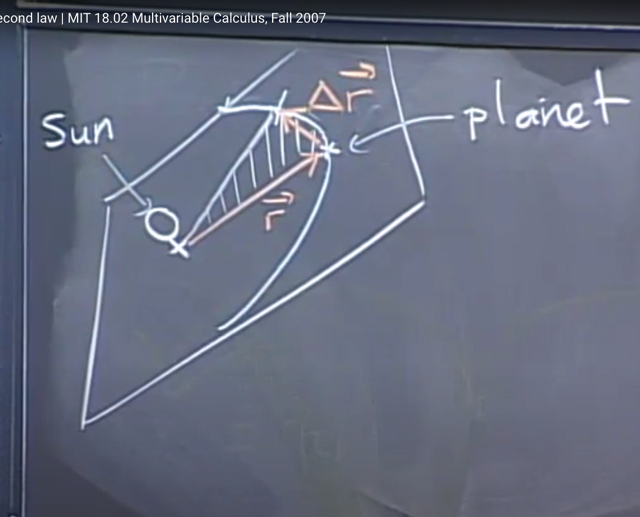</kbd>

> [!NOTE]
> Thế thì hình ảnh là vầy, hành tinh chuỷen động trên quỹ đạo elip.
> Ta có position vector r(t), và trong delta_t, nó di duyển đến
> r(t+delta_t) từ đó ta có vector delta_r

 

<kbd>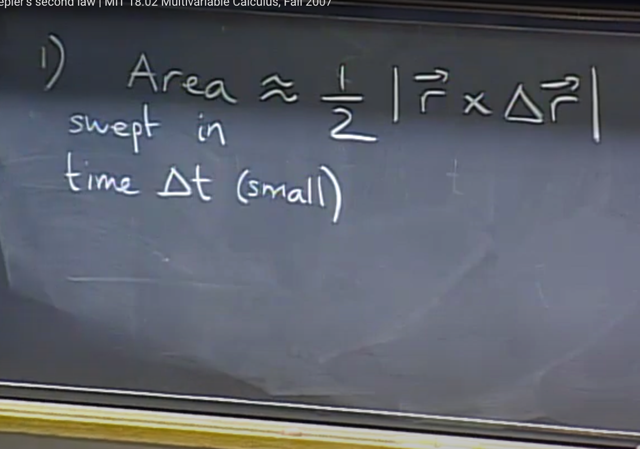</kbd>

> [!NOTE]
> Thế thì gs cho rằng khi delta_t vô cùng nhỏ, thì như đã biết, cung
> (đường cong) có thể coi như thẳng để diện tích của vùng giữa hai
> vector r(t) và r(t_delta_t) có có thể coi như diện tích tam giác tạo bởi 3
> vector. Và diện tích này có thể được tính bằng 1/2 diện tích hình bình
> hàng tạo bởi hai vector delta_r và r.
>
> Và bài 2 ta đã biết, với 3D vector, ta có thể tính diện tích hình bình hành
> này bằng cách tính độ lớn của vector cross product giữa hai vector.

 

<kbd>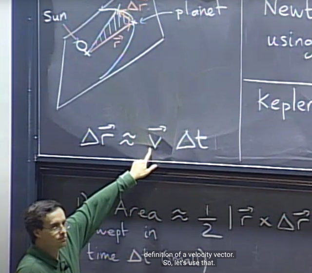</kbd>

🔗 **Related:** [LEC 6: VELOCITY, ACCELERATION, KEPLER'S SECOND LAW](untitled.md#node-106)

> [!NOTE]
> Tiếp theo ta sẽ dùng định nghĩa của velocity vector hồi nãy rằng 
> đạo hàm của vector r đối với t là velocity vector.
>
> Thế thì dr/dt = v và ta cũng biết, khi **thay các d bằng delta sẽ cho
> ta linear approximation**
>
> delta_r / delta_t ~= v <=> **delta_r ~= v * delta_t**

 

<kbd>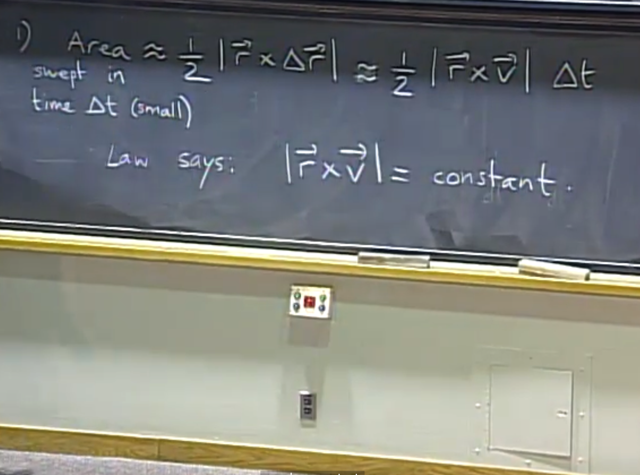</kbd>

> [!NOTE]
> Từ đó, thế vector delta_r bằng ~ v * delta_t ta có Area ~= (1/2) | r x
> v| delta_t (vì delta_t là constant nên có thể đưa ra ngoài)
>
> Lúc này ý nghĩa của định luật Kepler khi nói diện tích được swept
> theo tỉ lệ hằng số chính là ý nói diện tích sẽ tỉ lệ thuận với thời gian
> delta_t (Area / delta_t = constant)
>
> Điều này đồng nghĩa nói rằng độ lớn của cross product vector tạo
> bởi vector và vector v là hằng số

 

<kbd>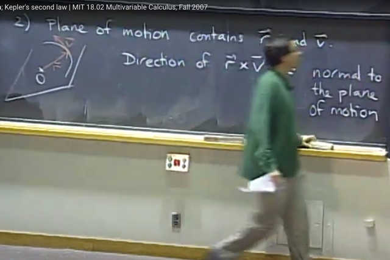</kbd>

> [!NOTE]
> Nhận định tiếp theo là, mặt phẳng chuyển động sẽ chứa cả r, và v.
>
> Thế thì, vì cross product vector tạo bởi r và v ta đã biết sẽ vuông góc
>  với mặt phẳng tạo bởi r, v. mà, vậy r x v vuông góc với mặt phẳng
> chuyển động
>
> Và ý (1) đã nói r x v có constant length, và ý (2) này nói hướng của nó
> vuông góc với mặt phẳng chuyển động vốn là cố định. Do đó cả hai
> ý hàm nghĩa (r x v) là constant vector

 

<kbd>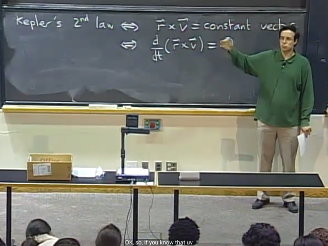</kbd>

> [!NOTE]
> Và điều đó có nghĩa là đạo hàm của vector cross
> product r x v đối với t sẽ là 0

 

<kbd>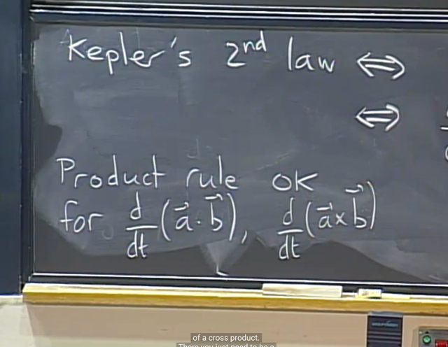</kbd>

> [!NOTE]
> Gs cho biết ta có thể áp dụng product rule đối với dot product
> và cross product chỉ cần chú ý giữ thứ tự của hai vector trong
> cross product  chứ đừng đảo lộn
>
> Có nghĩa là d(r x v) / dt = (dr / dt) x v + r x (dv / dt)
>
> (dr / dt) x v có nghĩa là cross product vector tạo bởi vector dr/dt
> với vector v

 

<kbd>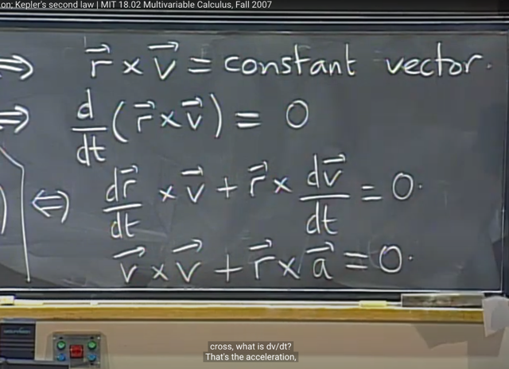</kbd>

> [!NOTE]
> Và dr/dt chính là vector v, và dv/dt
> chính là vector a (vector gia tốc)

 

<kbd>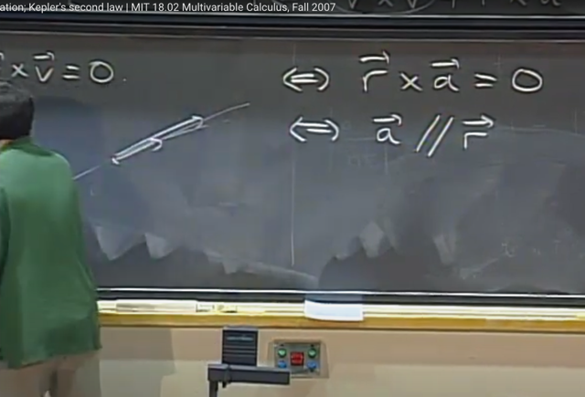</kbd>

> [!NOTE]
> v x v = 0 (ý nghĩa của cross product a x b là vector vuông góc với
> plane  tạo bởi a, b và có độ lớn bằng hình bình hành tạo bởi hai
> vector a, b. mà v, với v tạo hình bình hành có diện tích bằng 0, nên v
> x v = 0)
>
> Nên điều trên tương đương r x a = 0. và again điều này tương
> đương a và r song song (cùng phương)

 

<kbd>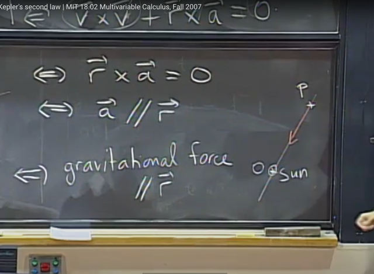</kbd>

> [!NOTE]
> Và dựa theo kiến thức vật lý ta biết gia tốc sẽ có phương
> của lực trọng trường.

 

