# Lec 7: Review

📊 **Progress:** `16` Notes | `17` Screenshots

---

<kbd>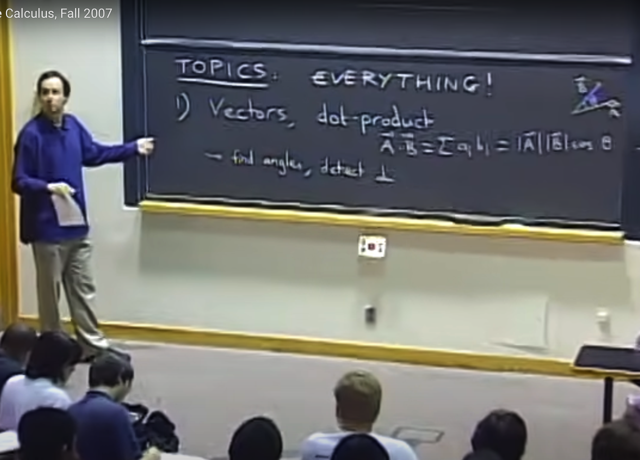</kbd>

> [!NOTE]
> Review lại những gì đã học, đầu tiên là về vectors, dot product, định
> nghĩa của dot product giữa hai vector A, B là lấy các component của
> chúng nhân nhau và cộng lại
>
> Và ta đã chứng minh nó cũng chính là |A||B|cos(theta). Nhờ vậy có thể
> dùng A.B/|A|*|B| để tính cos(theta) từ đó tính góc tạo bởi A, B.
>
> Cũng như là dùng việc A.B = 0 để chứng minh A vuông góc B
>
> Ôn lại nhanh tại sao A.B = |A||B|cos(theta):
>
> Vì dùng các hệ thức lượng tam giác có 3 cạnh a,b,c và theta là góc đối
> cạnh c:
>
> a^2 + b^2 - 2abcos(theta) = c^2
>
> Thế thì xét tam giác 3 cạnh tạo bởi 3 vector A, B, C góc giữa A và B là
> theta: |A|^2 + |B|^2 - 2|A||B|*cos(theta) = |C|^2 (1)
>
> Thế thì bình phương độ lớn vector chính là dot product của vector với
> chính nó:
>
> (1) <=> AA + BB - 2|A||B|cos(theta) = CC và CC cũng bằng (A-B)(A-B) =
> AA + BB - 2AB
>
> <=> AA + BB - 2|A||B|cos(theta) = AA + BB - 2AB
>
> Vậy 2|A||B|cos(theta) = 2AB <=> **A.B = |A||B|cos(theta)**

 

<kbd>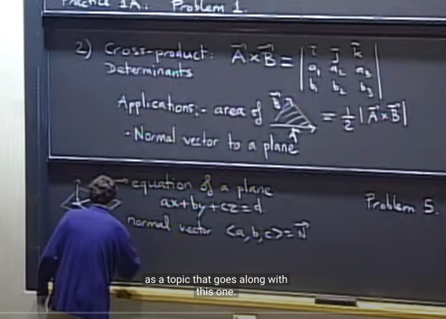</kbd>

> [!NOTE]
> Nội dung tiếp theo đã học là CROSS-PRODUCT, ta nhớ nó không
> phải là number, mà là một vector (khác với dot product, là number)
>
> Và cách tính A x B là giả bộ như tính det của 3x3 matrix với row 1
> là các unit vector i^, j^, k^. Tính det của 3x3 matrix này thì tính theo
> cofactor formula đã học ở 18.06. Nói giả bộ là bởi đây không phải
> là matrix thật vì i^, j^ k^ là vector, và kết quả, như đã nói là vector
> chứ không phải number, chứ det thật sự phải là number.
>
> Tiếp theo, ứng dụng của cross product đó là, độ lớn của vector A x B
> chính là diện tích của hình bình hành tạo bởi chúng. Do đó nó cũng
> chính là det của hai vector A, B.
>
> Để tính tam giác thì lấy 1/2.
>
> Ứng dụng thứ hai, là dựa trên tính chất cross product của hai vector
> sẽ là vector vuông góc với plane span bởi hai vector này (mượn khái
> niệm span trong 18.02, ý chỉ plane tạo bởi mọi linear combination
> của hai vector đó, hoặc đơn giản hơn là mặt phẳng đi qua hai vector) 
>
> Nhờ vậy nếu muốn tìm phương trình mặt phẳng đi qua hai vector
> (trong 3D space) có dạng ax + by + cz = d. Ta chỉ cần lấy hai vector
> trong plane và tìm cross product. Thì component của nó chính là
> a, b, c. Nói cách khác, nó chính là Normal vector của plane

 

<kbd>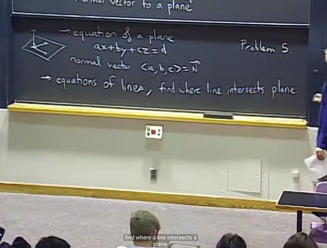</kbd>

> [!NOTE]
> Tiếp theo ta có thể dựa vào equation của một lines
> và tìm điểm giao giữa line và plane

 

<kbd>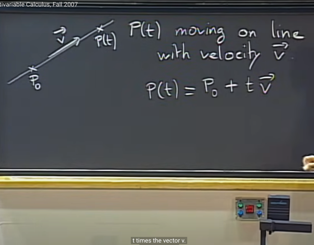</kbd>

> [!NOTE]
> Thế thì để có phương trình của line, ta cần một điểm P0 trên line và
> vector v. Để tham số quỹ đạo của một điểm di chuyển trên line bằng:
>
> P(t) = P0 + t.v (v là velocity vector)

 

<kbd>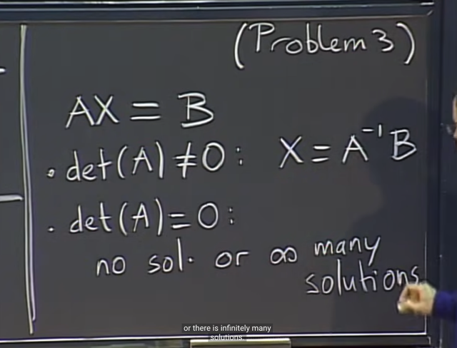</kbd>

> [!NOTE]
> Thế thì, gs review ngắn gọn rằng khi học về system of equation Ax=b
> (viết theo kiểu 1806, vector viết thường)
>
> Thì nếu det(A) khác 0, ta có thể tìm Ainv và từ đó solve ra x = Ainvb
> theo 1806 thì ta biết đây là lúc mà A full rank.
>
> Còn nếu det(A) = 0 thì có thể có vô số nghiệm hoặc vô nghiệm. Và gs
> nói nếu rơi vào case này mà ta thấy rõ có một nghiệm nào đó thì có
> thể kết luận là có vô số nghiệm.
>
> Mình có thể bàn thêm, dựa trên 1806 rằng, ta có thể dùng elimination
> để xem b có thuộc C(A) không, bằng cách xem khi elimination biến A|b
> thành U|b' thì row bằng 0 của U (chắc chắn là có vì A singular,  nên có
> dependent row) mà tương ứng với item khác 0 của b' thì chứng tỏ b
> không thuộc C(A), và có thể kết luận hệ vô nghiệm. Ngược lại, ta có
> xác định được x_particular chính là solution của Ux = b' và kết luật
> x_complete = x_particular + nullspace vector, hệ vô số nghiệm

 

<kbd>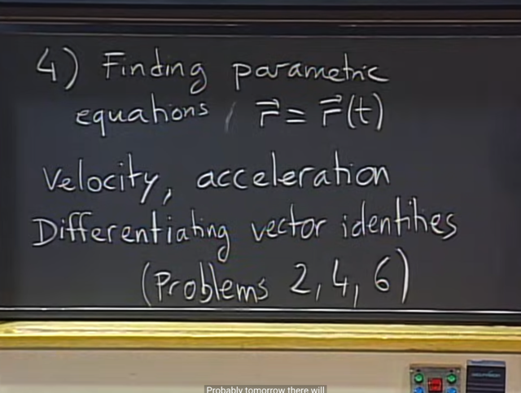</kbd>

 

<kbd>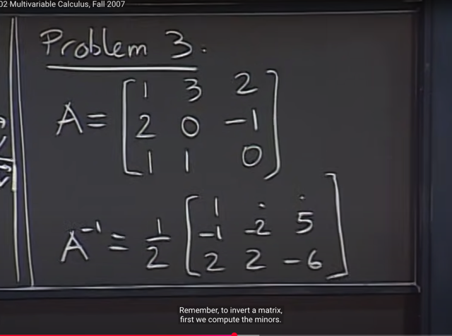</kbd>

> [!NOTE]
> Đại khái là gs giải một vài câu trong đề thi trước đây. Câu này cho
> matrix A và Ainv với hai chỗ chưa biết  cần tìm.
>
> Giải bài này như sau: Ta đã biết Ainv là CT/det(A). Tính det(A) trước:
> (bài này gs cho detA, nhưng ta cứ tính lại bằng cofactor formula (1806)
> như sau: Tính theo row 3:
>
> detA = 1*(+det [3 2; 0 -1]) + 1*(-det [1 2; 2 -1]) = 1*(-3) + 1*(-(-1-4))) =
> -3+5  = 2
>
> Và hai vị trí còn thiếu chính là CT12, CT13 đương nhiên chính là C12,
> C13 và chính là cofactor của A12, A13
>
> Vậy chỉ cần tìm cofactor của A12: - (det [3 2; 1 0]) = - (3*0 - 2*1) = -(-2)
> = **2**
>
> cofactor của A12: + (det [3 2; 0 -1]) = + (-3 - 0) =  =**-3**
> và đó chính là hai vị trí cần tìm

 

<kbd>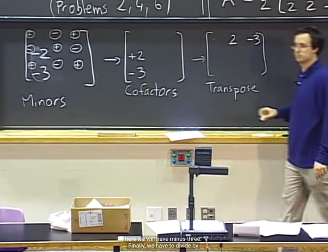</kbd>

> [!NOTE]
> Correct!

 

<kbd>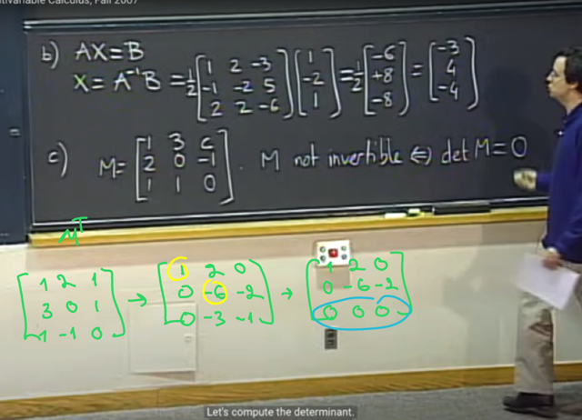</kbd>

> [!NOTE]
> Câu tiếp theo ko có gì, chỉ là thế Ainv vào để tính x - Ainv.b
>
> Câu c, cho matrix M như vầy, hỏi tìm c để M không invertible.
> Đương nhiên, ta sẽ dựa trên việc det M = 0. Và ta sẽ tính det M
> theo c để từ đó solve ra c
>
> det M =  1*(+det [3 c; 0 -1]) + 1*(-det [1 c; 2 -1]) = 1*(-3-0) +
> 1*(-(-1-2c))) = -3+1+2c = 2c - 2
>
> Nên det M = 0 khi**c = 1**. Ngẫm lại, khi c = 1, col 3 sẽ là [1 -1 0] thì ta
> có quyền tin rằng nó depend hai columns 1, 2. Để xác định, mình
> có thể  làm theo cách elimination matrix MT, để xem row 3 có thành
> 0 hay không.
>
> Xét MT: row 1 là [1 2 1] giữ nguyên. Với pivot là 1.
>
> Row 2 là [3 0 1], ta sẽ trừ nó cho 3*row 1 để hủy vị trí 21: [3 0 1] -
> 3*[1 2 1] = [0 -6 -2]. Vậy pivot thứ 2 là -6
>
> Row 3 là [1 -1 0], để hủy vị trí 31, trừ nó cho row 1: thành ra [0 -3
> -1]
>
> Để hủy vị trí 22, trừ nó cho 1/2 row 2, và kết quả nó thành 0 0 0 vậy
> rõ ràng row 3 của MT, hay col 3 của M là dependent columns khiến
> M singular

 

<kbd>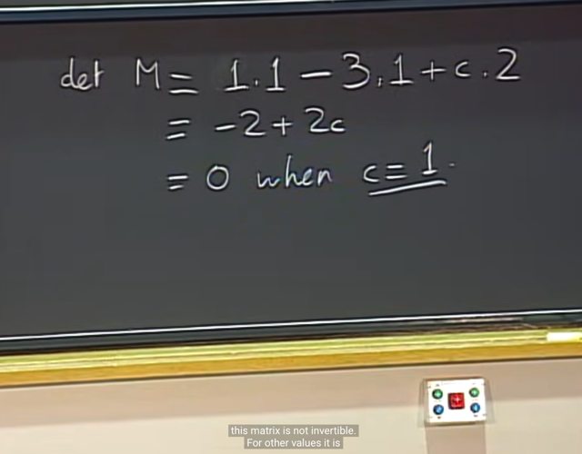</kbd>

> [!NOTE]
> Correct!

 

<kbd>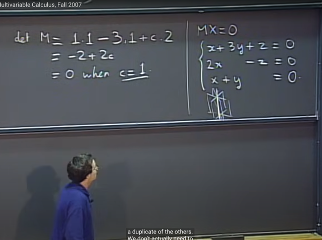</kbd>

> [!NOTE]
> Thế thì, gs nói rằng lúc này Mx = 0 sẽ có vô số nghiệm và ông nói ta có
> thể hiểu rằng trong case này, một trong ba phương trình trở nên
> redundant, cũng như là khi ta vẽ 3 mặt phẳng (bởi 3 phương trình) thì
> chúng sẽ có chung 1 giao tuyến.
>
> Mình sẽ nói về nó theo ánh sáng của 1806: Theo ngôn ngữ của 1806,
> đây là case mà ta có matrix singular, xuất phát từ việc nó một column
> của nó, cũng như một row của nó dependent các columns và row còn
> lại. Khi đó, chỉ có 2 column độc lập, và chúng sẽ span C(M), cũng như 2
> row độc lập sẽ span C(MT).Và cả hai đều là 2D plane subspace của
> R^3. Hay dim C(M) và dim C(MT) đều bằng 2. Theo định lý Rank -
> Nullity, dim N(M) và dim N(MT) sẽ bằng 1. Tức có nonzero vector trong
> nullspace và left nullspace khiến combine columns cũng như row thành
> 0.
>
> Thế thì, đây cũng là ý của gs khi nói một trong các equation redundant
> bởi trong hệ này dependent column và dependent row không add thêm
> thông tin nào.
>
> Xét khía cạnh hình học, hai row độc lập sẽ tương ứng với hai equation
> mà normal vector của chúng không trùng phương (component của row
> vector  chính coefficient của plane equation chính là normal vector, là
> vector vuông góc với plane)
>
> Vậy xét 1 cặp normal vector độc lập thì chúng sẽ span một 2D plane
> nhữ đã nói, và hai plane gắn với hai normal vector đó sẽ cắt nhau tại
> một line.
>
> Thế thì vì row còn lại depend on hai row độc lập kia, cho nên nó là một
> linear combination của hai row đó, đồng nghĩa normal vector của plane
> thứ 3 còn lại nằm trên plane span bởi hai normal vector nói ở trên.
>
> Và như vậy có thể hiểu hình ảnh là plane thứ 3 cũng đi qua giao tuyến
> của hai plane trước. Và do đó hệ có vô số nghiệm.
>
> Và như đã nói nghiệm của hệ, là nullspace, có dim = 1, là một line, và
> line này vuông góc với rowspace C(MT) và nó chính là giao tuyến của 3
> plane (giao tuyến này sẽ vuông góc với plane span bởi hai normal
> vector đầu tiên, và vì như đã nói normal vector chính là row vector, nên
> plane đó chính là rowspace C(MT)

 

<kbd>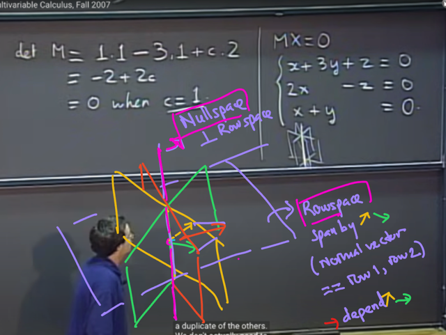</kbd>

> [!NOTE]
> Hôm nay mới nhận ra intersection line chính là nullspace N(A), vì nó
> chứa các vector trong cả hai plane (plane của phương trình mặt
> phẳng) mà do đó nó sẽ vuông góc với cả hai normal vector (vì normal
> vector là vector vuông góc với plane).
>
> Thế thì hai normal vector (chính là hai row của matrix) lại span một
> plane (plane này chính là rowspace) nên mọi vector trong intersection
> line đều vuông góc với rowspace tương ứng với việc mọi vector trong
> nullspace vuông góc với rowspace.
>
> Và intersection line này (nullspace) và plane span bởi hai normal
> vector (rowspace) đúng là orthogonal complement, cùng nhau nó sẽ
> cover R^3.
>
> Vậy hình ảnh là gì nếu A fullrank, thì khi đó 3 normal vector độc lập,
> nên nó chỉa ra 3 hướng, chính là việc nó span toàn bộ R3. thì 3 plane
> sẽ chỉ còn cắt nhau tại đúng 1 điểm chính là gốc O. Tương ứng với
> việc nullspace chỉ có dim = 0, chứa mỗi zero vector.

 

<kbd>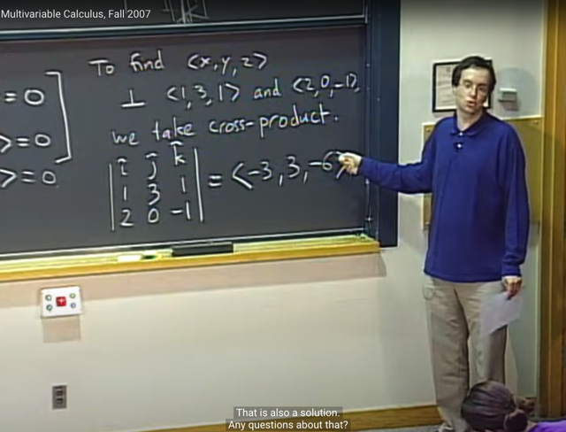</kbd>

> [!NOTE]
> Tiếp, gs nói để tìm solution của Mx=0, ta có thể dựa trên nhận định
> rằng vector solution <x, y, z> sẽ perpendicular với cả 3 row vector (mà
> theo ngôn ngữ 1806 thì nó chính là nullspace vector)
>
> Thế thì ở 1802, ta đã học về cross product của A, B: (A x B), là vector
> vuông góc với cả hai vector A, B. Nên để tìm solution, ta có thể tính
> cross product của hai row vector (hai row độc lập) và đó chính là vector
> trong nullspace.
>
> Tuy nhiên, ta nên hiểu sở dĩ có thể làm vậy là vì ta đang trong 3D
> space, và cross product chỉ dùng cho 3D. Còn trong 1806 sở dĩ ta thấy
> mr Strang nói về cách tìm nullspace theo kiểu tìm free/pivot columns và
> assign value 1,0 cho free variable để solve pivot variable từ đó có
> special solution là cách tiếp cận chung cho higher dimentions.

 

<kbd>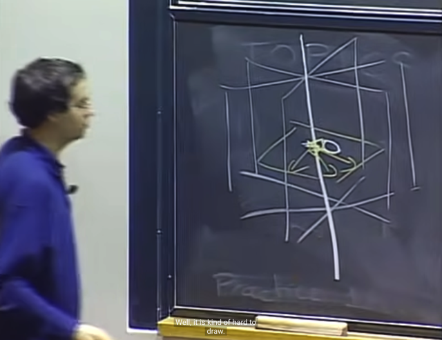</kbd>

> [!NOTE]
> Và hình ảnh gs vẽ chính
> là hình ảnh vừa rồi

 

<kbd>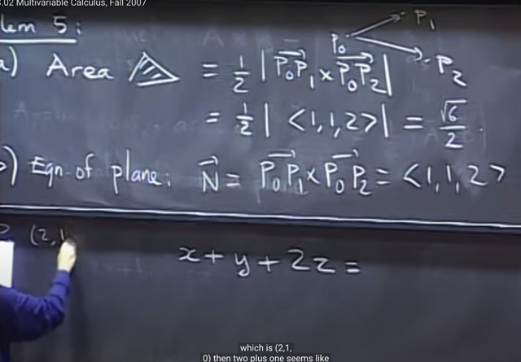</kbd>

> [!NOTE]
> Sau đó gs giải các câu 5,6. Như tính diện tích hình tam giác tạo
> bởi hai vector, ta đã biết có thể dùng kiến thức là cross product
> của hai vector sẽ có độ lớn chính là hình bình hành tạo bởi
> chúng, Nên ta sẽ lấy 1/2
>
> Câu b là tìm equation của plane đi qua 3 điểm. Thì ta cũng biết
> cross product của hai vector sẽ vuông góc với plane span bởi
> chúng, nên ta sẽ tìm cross product để có các hệ số a,b,c (cũng là
> component cũa normal vector), còn để tìm d, thì ta gắn toạ độ của
> 1 điểm vô để tính

 

<kbd>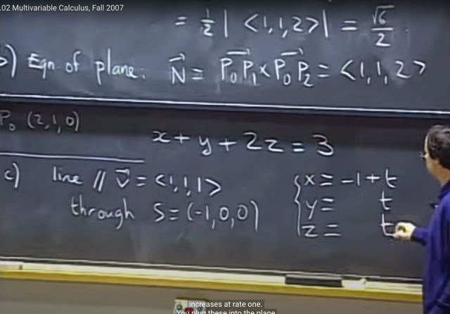</kbd>

> [!NOTE]
> Câu c là tìm giao điểm của plane với line song song với v đi qua S
> thì ta sẽ tham số x, y, z theo t như vầy. (xây dụng parametric
> equation của điểm di chuyển trên line)
>
> Và gắn vào plane equation để tìm x, y, z là giao điểm của line và
> plane

 

<kbd>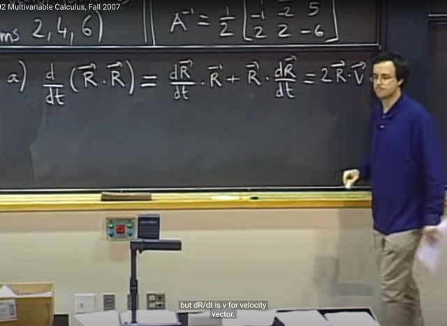</kbd>

> [!NOTE]
> Câu kế là tính derivative của R.R, gs cho rằng ta vẫn được dùng
> product rule (uv)' = u'v + uv'
>
> Để ra kết quả là (dR/dt).R+R.dR/dt = V.R + R.V = 2R.V (dR/dt là
> vector V)

 

