# Lec 8: Level Curves, Partial Derivatives, Tangent Plane

📊 **Progress:** `20` Notes | `22` Screenshots

---

<kbd>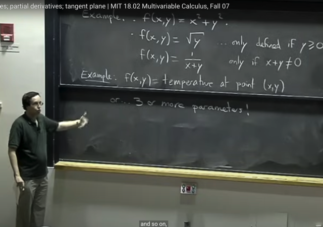</kbd>

> [!NOTE]
> đại khái là nói về function có **hơn một variable**, ví dụ với **2
> variables** **f(x, y)** với một số ví dụ như **f=x^2+y^2,** hoặc function
> dựa vào x,y để tra cứu một thông tin nào đó.
>
> Để đơn giản ta sẽ **tập trung chủ yếu vào function có 2 hoặc 3
> variable**

 

<kbd>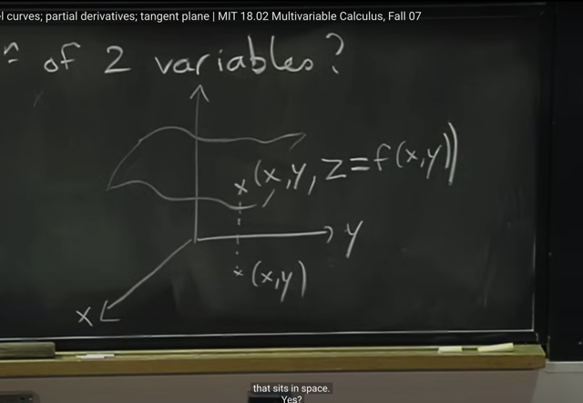</kbd>

> [!NOTE]
> đại khái là để visualize function f(x,y), thì ta sẽ có một plane tạo bởi
> các điểm <x, y, z=f(x,y)>

 

<kbd>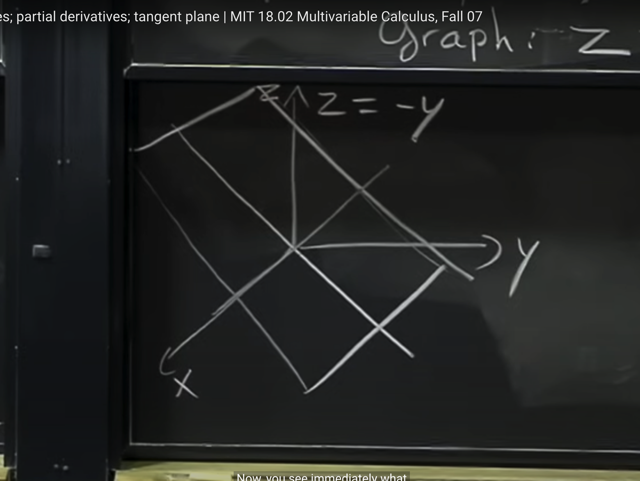</kbd>

> [!NOTE]
> ví dụ của f(x, y) = -y

 

<kbd>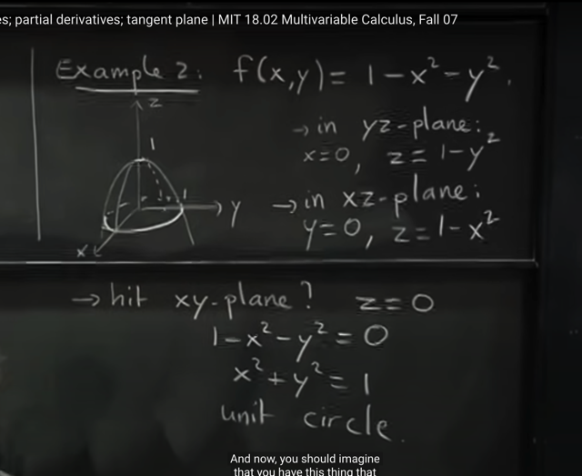</kbd>

> [!NOTE]
> Ví dụ khác với function f = 1 - x^2 - y^2. Đại khái là ta có thể làm từng
> bước để **dần hiểu dạng đồ thị của f** như thế nào. Bằng cách đầu tiên
> là xét trong **yz-plane**, tức x = 0. Khi đó f = 1 - y^2, như vậy giao của
> đồ thị hàm f với yz plane là parabola.
>
> Tương tự xét trong **xz plane** thì nó là parabola**f = 1 - x^2.**
>
> Và xét trong xy plane, tức z = 0 thì ta có **x^2+y^2 = 1**, đây là phương
> trình **đường tròn unit.**

 

<kbd>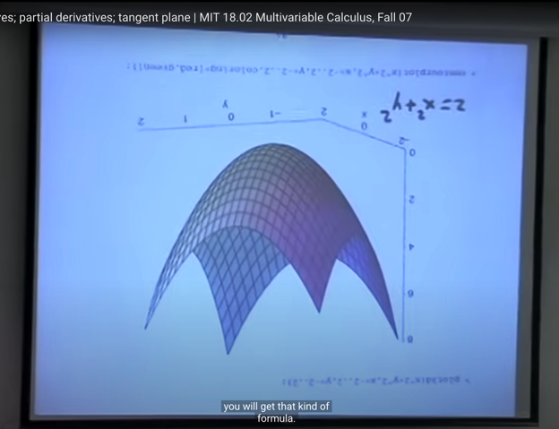</kbd>

> [!NOTE]
> hình ảnh bởi máy tính

 

<kbd>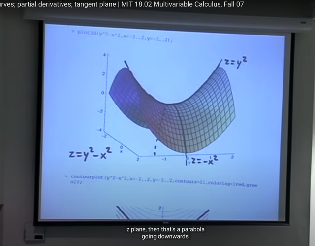</kbd>

> [!NOTE]
> Còn đây là đồ thị của f = y^2 - x^2. có hình yên ngựa (saddle point), thì
> để ý rằng **xét trong plane yz** thì nó là **parabola ngửa lên**. Ngược lại
> trong **plane xz** thì nó là **parabola úp xuống**

 

<kbd>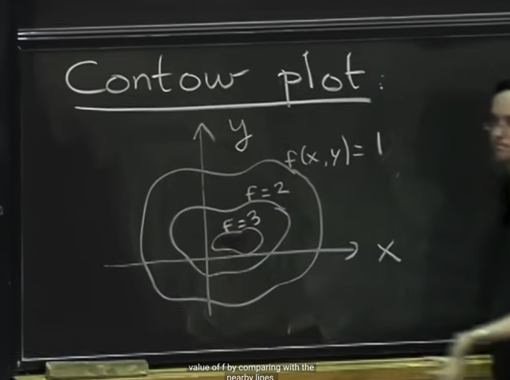</kbd>

> [!NOTE]
> Đây là gs nói qua **cách khác để visualize function** đó là **Contour**
> plot mà mình đã g**ặp nhiều lần trong ML class**.
>
> Nói chung là dễ hiểu khi các đường contour sẽ cho biết**giá trị của
> hàm f của mọi điểm trên đường** đó. Và nhờ vậy khi cần **xác định
> giá trị hàm f tại đâu đó**, ta có thể nhanh chóng biết được ví dụ điểm
> nào đó nằm giữa hai đường contour 1,2 thì sẽ có giá trị đâu đó ở giữa
> 1,2

 

<kbd>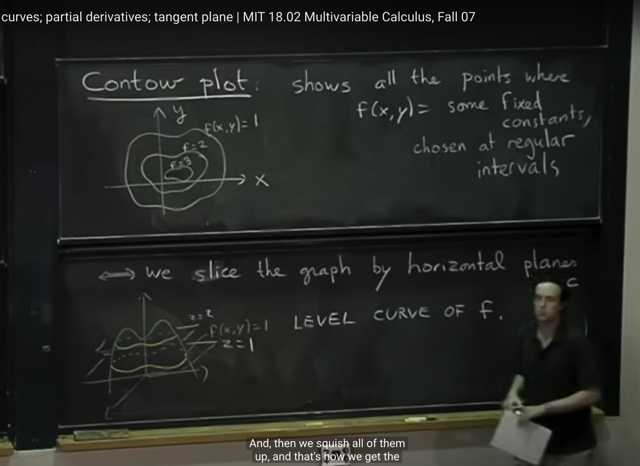</kbd>

> [!NOTE]
> Đại khái là ta **định nghĩa chính thức của contour plot** là nó **show
> mọi điểm mà f(x, y) = fixed constant** nào đó, thường được chọn là
> tại các **regular intervals** ví dụ như 1,2,3 như ở đây.
>
> Và có thể **coi như ta cắt đồ thị hàm f bởi các plane nằm ngang**. Thì
> những đường cắt đó gọi là **LEVEL CURVE OF F**
>
> Và thể hiện hết các đường cắt đó thì ta có contour plot.

 

<kbd>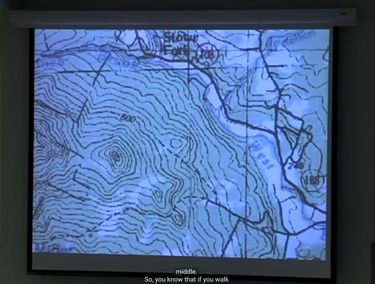</kbd>

> [!NOTE]
> Một **ví dụ về contour plot**. Khi ta di
> chuyển theo một đường contuour
> thì độ cao ko đổi

 

<kbd>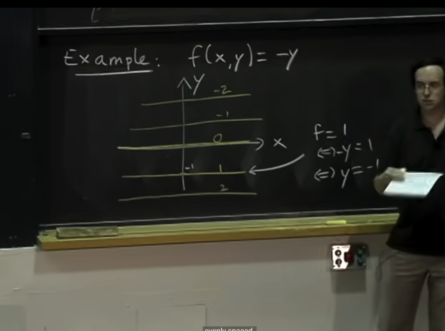</kbd>

> [!NOTE]
> Ví dụ vẽ contour plot của function này. lần lượt cho f = 0,1,
> 2,-1,-2 thì ta có các line tạo nên contour plot

 

<kbd>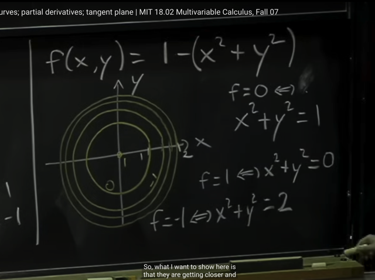</kbd>

> [!NOTE]
> Tương tự là contour plot của function này. Cũng bằng cách **lần lượt
> cho f bằng các giá trị với regular interval** như 0,1,2,3 ta có các
> contour là các **phương trình đường tròn** với **bán kính khác
> nhau**.
>
> Thế thì đại ý cần chú ý là **các contour ngày càng sát nhau** khi ra xa
> thể hiện **độ dốc ngày càng lớn** (vì ta sẽ chỉ phải **đi ngày càng
> ngắn hơn** để  **tăng thêm một đơn vị của f**)
>
> Thì hình dạng 3D của nó là hình khi nãy

 

<kbd>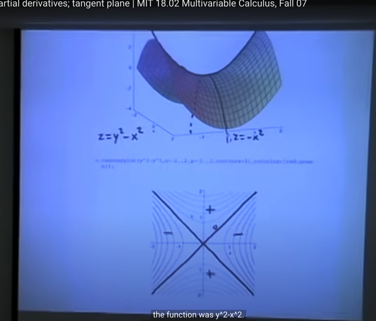</kbd>

> [!NOTE]
> Gs cho xem contour plot của saddle point z = y^2 - x^2

 

<kbd>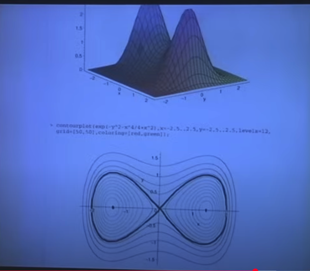</kbd>

 

<kbd>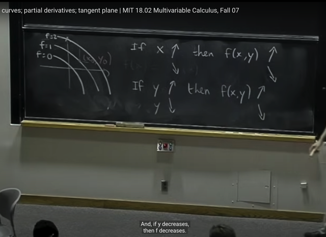</kbd>

> [!NOTE]
> Đại khái là contour plot có thể cho ta câu trả lời rằng **khi x, y tăng
> lên hay giảm** (xét cái này thì giữ cái kia fix) thì function sẽ tăng
> hay giảm

 

<kbd>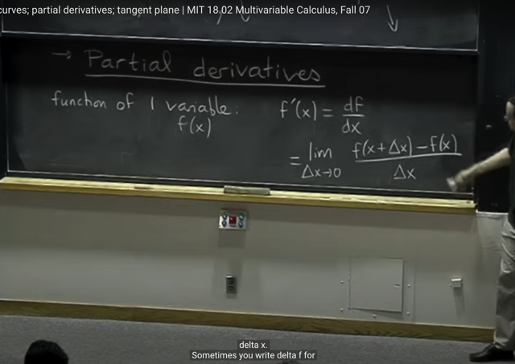</kbd>

> [!NOTE]
> Thế thì để biết **khi tăng hay giảm x, y** thì **function tăng hay
> giảm nhanh hay chậm như thế nào** (tức là độ dốc của hàm số) thì
> ta sẽ**cần derivative**
>
> gs review lại với hàm đơn biến thì **derivative** được định nghĩa là:
>
> **limit của [f(x+delta_x) - f(x)] /delta_x khi delta_x -> 0**

 

<kbd>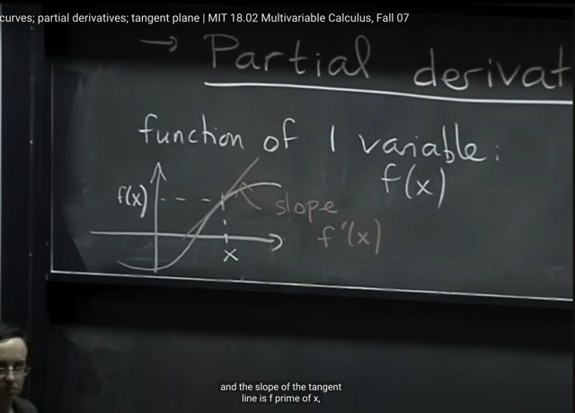</kbd>

> [!NOTE]
> Về mặt **hình học** thì derivative của function là function mang
> giá trị là **độ dốc của tiếp tuyến** (**tangent** line) của hàm số, nên
> **f'(x)** là giá trị của **độ dốc của tiếp tuyến tại x**
>
> **Không phải function nào cũng có derivative** tại **mọi điểm** nhưng
> trong class này ta sẽ k**hông care vấn đề differentiability**

 

<kbd>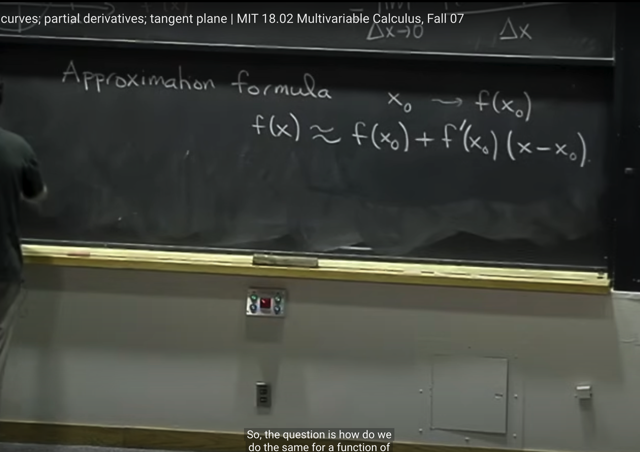</kbd>

> [!NOTE]
> Ta có function ước lượng **xấp xỉ hàm số f**: f(x) ~= f(x0) + f'(x0)(x-x0) 
> và gs cho biết nếu ta có thêm các higher order term nữa thì 
> đó chính là Taylor series
>
> Sau khi học bài 9 của 1801, ta đã có thể hiểu đây chính là **LINEAR**
> **APPROXIMATION**: f(x) ~= f(x0) + f'(x0)(x-x0), xuất phát từ lập luận
> khi limit delta_x -> 0 của delta_f / delta_x = f'(x)
>
> Thì ta có thể cho rằng khi delta_x ~= 0, tức x-x0~=0, hay x~=x0
> thì delta_f / delta_x ~= f'(x0) từ đó f(x)-f(x0)~=f'(x0)(x-x0)
> <=> **f(x) ~= f(x0) + f'(x0)(x-x0)**
> Còn nếu có thể quadratic term f''(x0)(x-x0)^2/2 thì ta sẽ có 
> **QUADRATIC** **APPROXIMATION**: 
>
> f(x) ~= f(x0) + f'(x0)(x-x0) + f''(x0)(x-x0)^2/2

 

<kbd>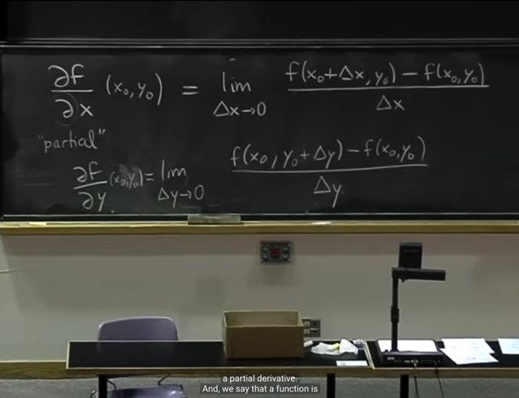</kbd>

> [!NOTE]
> Đại khái là gs nói về khái niệm và kí hiệu của **partial derivative.** Đối
> với **function đa biến** thì nó **không có derivative thông thường** mà
> **chỉ có partial derivative với mỗi biến**.
>
> mang cái tên **partial**: từng phần / một phần là **bởi nó chỉ đối với một
> biến nào đó,**chứ**không phải toàn bộ**.
>
> Và định nghĩa của nó là ví dụ**partial derivative của f w.r.t x** tại **(x0, y0)**
> là **limit của  [f(x0+delta_x, y0) - f(x0, y0)] / delta_x**. Trong đó ta sẽ **treat
> y như constant**
>
> Tương tự với partial derivative của f w.r.t y
>
> **Nếu hai function này tồn tại thì f gọi là differentiable**
>
> Tuy nhiên gs nói **ta sẽ không tính bằng định nghĩa**, mà ta sẽ tính bằng
> các **phương pháp tính đạo hàm** mà ta đã biét

 

<kbd>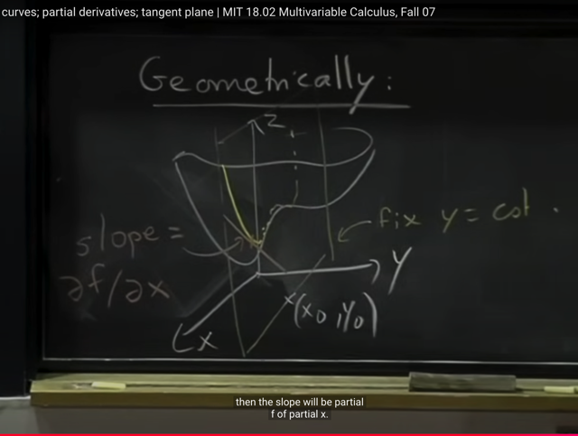</kbd>

> [!NOTE]
> Đại khái là **về mặt hình học**, ý nghĩa của partial derivative của f w.r.t x
> là:
>
> Ta sẽ**giữ y constant**, khi đó giống như ta**dùng plane y = constant** để
> **cắt** đồ thị của f(x) tại **một đường intersection màu vàng**.
>
> Và **partial derivative của f w.r.t x** chính là **FUNCTION THỂ HIỆN GIÁ
> TRỊ CỦA ĐỘ DỐC TIẾP TUYẾN CỦA ĐƯỜNG MÀU VÀNG NÀY**

 

<kbd>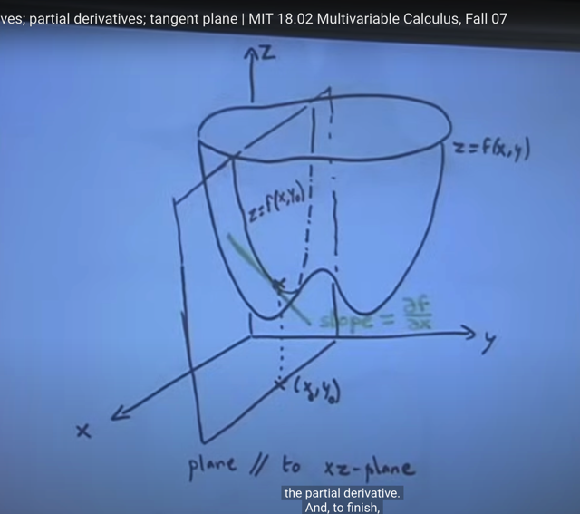</kbd>

 

<kbd>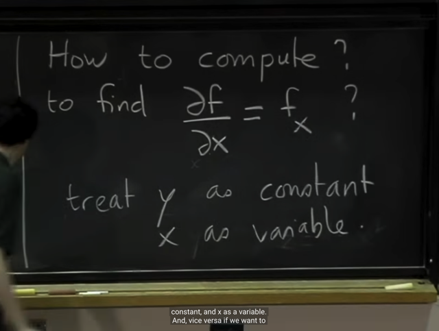</kbd>

> [!NOTE]
> Vậy **để tính partial derivative**, ví dụ của partial f / partial x, ta sẽ
> **coi y như constant** và **x là variable** và **tính derivative của f đối với
> x như với hàm 1 biến**
>
> Ở đây gs nói thêm **partial derivative** của f đối với x có thể được kí hiệu 
> là **f_x**

 

<kbd>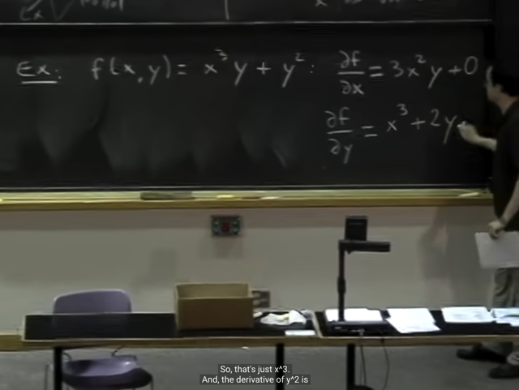</kbd>

> [!NOTE]
> Một ví dụ

 

