# Lec 9: Max-min Problems, Least Squares

📊 **Progress:** `23` Notes | `33` Screenshots

---

<kbd>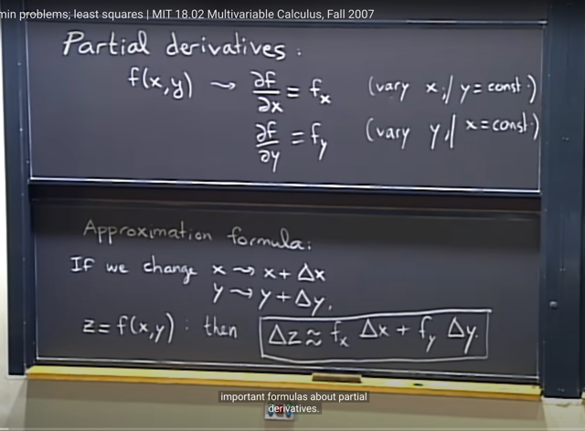</kbd>

🔗 **Related:** [Như vậy ta hiểu là trong 1801 implicit differentiation là ta apply d/dx vào hai vế, mà ý nghĩa CHÍNH LÀ LẤY ĐẠO HÀM THEO X HAI VẾ.   y = f(x) => (d/dx) y = (d/dx) f(x) <=> \\*dy/dx = f'(x)\\*  Còn 18.02 thì implicit differentiation thể hiện bằng cách  LẤY VI PHÂN HAI VẾ  y = f(x) <=> \\*dy = f'(x) dx\\*  Và chúng cùng bản chất, chẳng qua cách thể hiện theo vi phân  sẽ chuẩn bị cho ta bước qua khái niệm VI PHÂN TOÀN PHẦN (TOTAL DIFFERENTIAL)](untitled.md#node-230)

> [!NOTE]
> Tiếp bài trước về **partial derivative**, ta quay lại với **approximation
> formula** (linear approximation)
>
> Câu hỏi là với**function 2 biến x, y** thì công thức sẽ ntn:
>
> Câu trả lời là nếu **x ~> x + ∆x**,**y ~> y + ∆y** thì z = f(x, y) sẽ
> thay đổi một khoảng xấp xỉ  **f_x*∆x + f_y*∆y** với f_x, f_y là 
> partial derivative
>
> Tức là linear approximation đối với bivariate function f(x, y) là:
>
> **∆f ~= f_x*∆x + f_y*∆y** 
>
> So sánh với hàm một biến: 
>
> **∆f ~= f'*∆x** (hay f(x) - f(x0) ~= f'(x0)(x-x0) 
>
> <=> **f(x) ~= f(x0) + f'(x)(x-x0)**
>
> Và intuition là: khi **x thay đổi delta_x** nó khiến f**unction f thay đổi** một
> khoảng bằng **delta_x** **nhân** với**rate of change f_x**: **f_x*delta_x**
>
> khi**y thay đổi delta_y** nó khiến function **thay đổi một khoảng delta_y**
> **nhân** với **rate of change f_y**: **f_y*delta_y**.
>
> Thế thì khi thay đổi cả x, y ta **xấp xỉ** khoảng thay đổi của f bằng **tổng
> hai khoảng thay đổi** do y và do x

 

<kbd>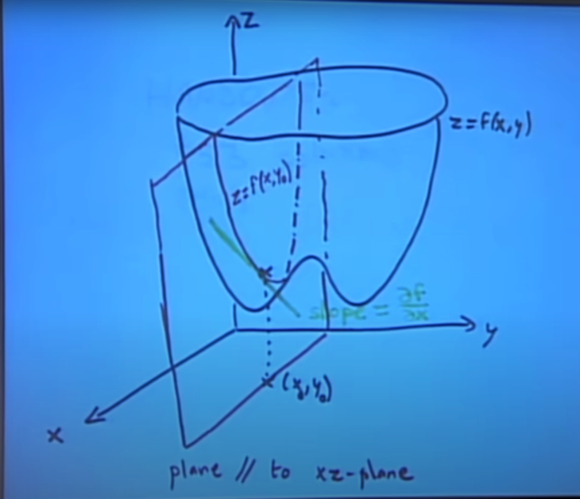</kbd>

> [!NOTE]
> Review lại **một chút ý nghĩa của partial derivative** của f w.r.t x:
>
> Đó là ta sẽ **giữ y = y0 fixed**, để rồi điều này **giống như ta sẽ cắt đồ
> thị hàm f với plane song song với xz plane**, khi đó ta có
> **intersection** là đồ thị của **hàm số f(x, y0)**.
>
> Thì hàm số mang giá trị là **độ dốc của f(x, y0)** chính là **derivative
> của f(x, y0)**, và nó chính là **partial derivative của f đối với x:
> f_x()**

 

<kbd>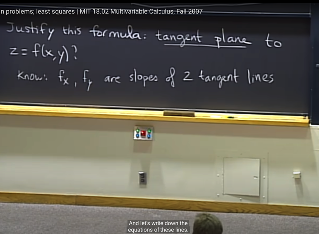</kbd>

> [!NOTE]
> Thế thì, tiếp theo ta sẽ justify (**biện minh**) cho c**ông thức
> approximation**  vừa rồi.
>
> Ta sẽ đã biết**f_x, f_y** là**slope của 2 đường tiếp tuyến**

 

<kbd>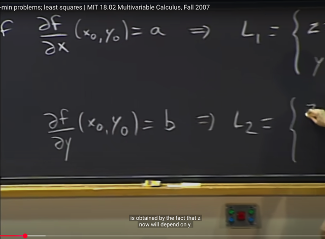</kbd>

<kbd></kbd>

<kbd>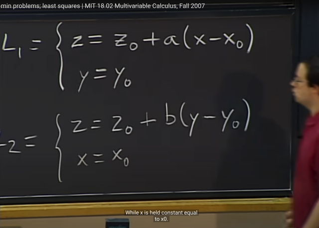</kbd>

> [!NOTE]
> thế thì đại khái là **nếu ta có f_x(x0, y0) = a** ta có **đường tiếp tuyến** nằm t**rong mặt phẳng
> song song với xz,** **cắt trục y tại** **y0** và có **độ dốc tại x0 là a**, và phương trình của nó là **z -
> z0 = a(x - x0)** mang ý nghĩa là khi x thay đổi từ x0 -> x, z thay đổi từ z0 -> z với rate
> (z-z0)/(x-x0) = a
>
> Tương tự với **tiếp tuyến thứ hai**, **độ dốc tại (x0,y0) là b**, nó nằm **trong mặt phẳng song 
> song với yz**, **cắt x tại x0**và có phương trình:
>
> x = x0; z - z0 = b(y - y0)

 

<kbd>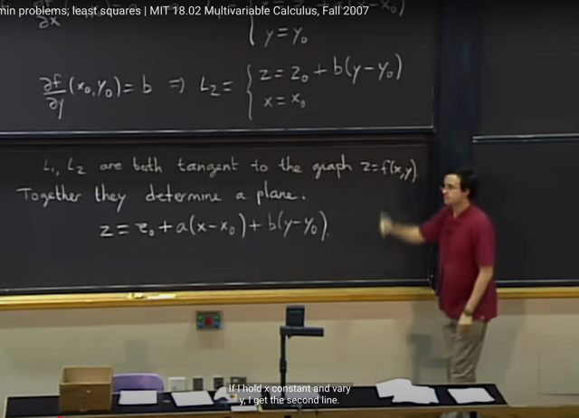</kbd>

> [!NOTE]
> thế thì **L1, L2 đều là tiếp tuyến của đồ thị hàm z = f(x,y)**. Chúng
> **TẠO THÀNH MỘT PLANE** plane **z = z0 + a(x-x0) + b(y-y0)**
>
> Thì đây là phương trình mặt phẳng với x*constant + y*constant +
> constant và nếu giữ y, thay đổi x ta có phương trình của tangent line
> thứ 1 (ý là cho y = y0 ko đổi thì phương trình trở thành z = z0 + a(x -
> x0)) và ngược lại, giữ x thay đổi y thì ta có phương trình tangent line
> thứ 2
>
> Gs nói rằng **để có phương trình này** ta có thể **dùng cách khác** liên
> quan đến việc dùng **cross product** và **normal vecto**r, ta cũng sẽ ra
> equation này.

 

<kbd>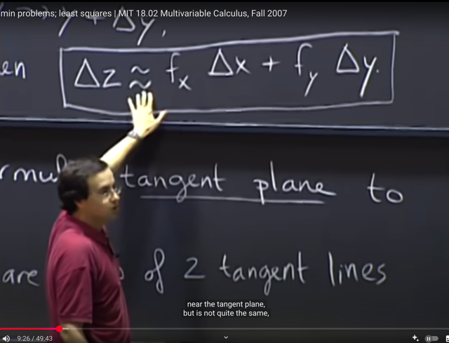</kbd>

> [!NOTE]
> Thế thì gs cho biết **ý nghĩa** của **linear approximation đối với hàm
> hai biến** chính là **nói rằng** **đồ thị hàm số f (tất nhiên chỉ xét trong
> một khoảng x~=x0) có thể coi như trùng với tangent plane**.
>
> Nếu ta **di chuyển trên tangent plane** thì **delta_z = linear function
> của delta_x và delta_y (fx*delta_x + fy*delta_y)**.
>
> Nhưng vì **thực tế** đồ thị của f **chỉ là gần bằng tangent plane** nên
> ta dùng dấu**xấp xỉ ~=**

 

<kbd>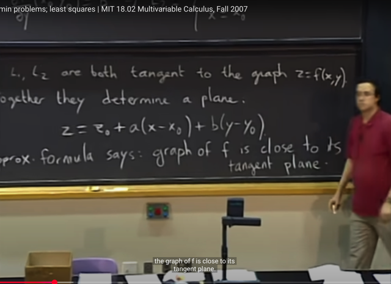</kbd>

 

<kbd>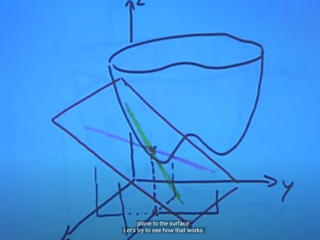</kbd>

 

<kbd>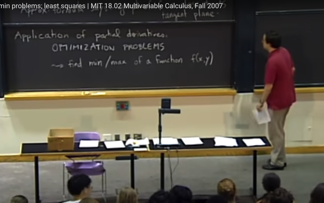</kbd>

> [!NOTE]
> Ứng dụng của partial derivative là **optimization**
> problem **tìm min max của function f(x,y)**

 

<kbd></kbd>

<kbd></kbd>

<kbd>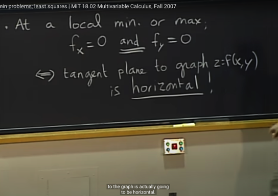</kbd>

> [!NOTE]
> thế thì gs nói rằng tại l**ocal min hoặc max thì cả fx
> và fy đều bằng 0.**
>
> Và ta khi đó **tangent plane sẽ nằm ngang (song
> song với xy plane)**

 

<kbd>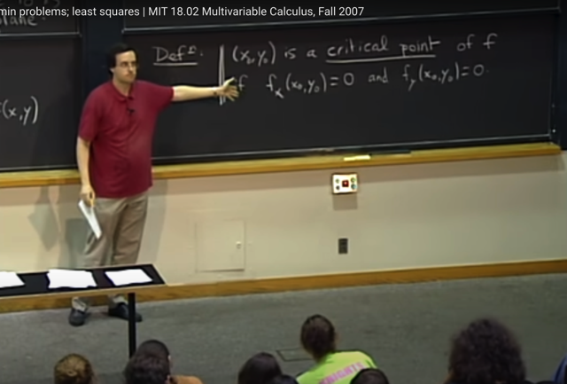</kbd>

> [!NOTE]
> và ta có cái tên cho điểm mà tại đó mọi partial derivative đều bằng 0:
> **CRITICAL POINT (cực trị)**.
>
> Gs cho biết nó **chưa thỏa điều kiện đủ** để xác định là **max hoặc
> min** vì **có những điểm khác mà mọi partial derivative cũng bằng
> 0**

 

<kbd>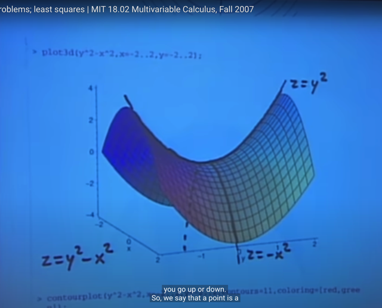</kbd>

> [!NOTE]
> nói nó **chưa đủ để kết luận** min hay max là vì s**addle point
> cũng có mọi partial derivative bằng 0**. Nhưng tùy ta đi hướng nào
> (thay đổi x hay y) thì function sẽ tăng lên hay giảm xuống
>
> Bài sau ta sẽ xác định maximum hay saddle point bằng cách dùng
> đạo hàm cấp 2 (**second** **partial** **derivative**)

 

<kbd></kbd>

> [!NOTE]
> Thế thì có**3 khả năng như vậy**, như vừa nói **bữa sau** ta sẽ dùng
> **đạo hàm cấp hai để xác định**. Còn ở đây ta sẽ dùng phương pháp
> **COMPLETING THE SQUARE**

 

<kbd>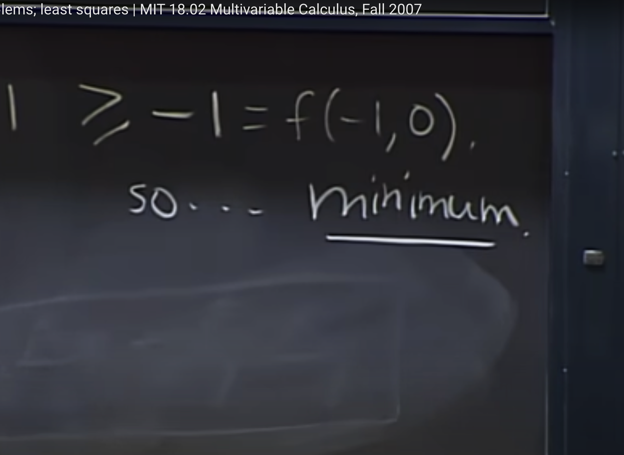</kbd>

<kbd></kbd>

<kbd>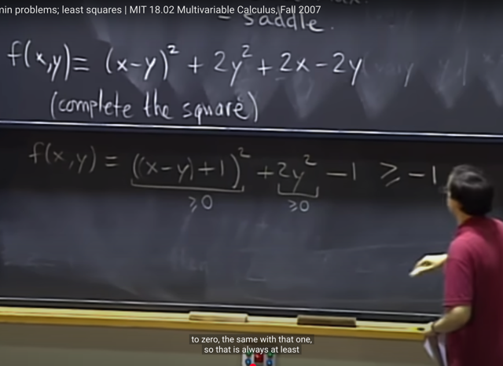</kbd>

> [!NOTE]
> Bằng cách**đưa f về tổng các bình phương**, thì **ta xác định f sẽ >= -1**
>
> và nó **bằng -1 khi y = 0**, và x-y = -1 ->**x = -1**. Do đó đây là **minimum**

 

<kbd>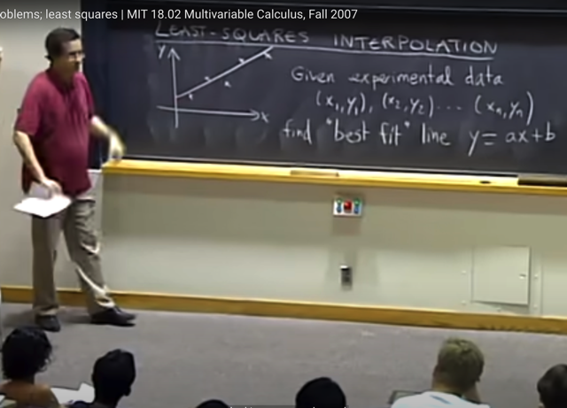</kbd>

> [!NOTE]
> gs nói qua **bài toán Least Square**, như đã biết là trong bài toán này ta 
> sẽ muốn **tìm line y = ax + b** **fit tốt nhất** với các data point **(xj, yj)**

 

<kbd>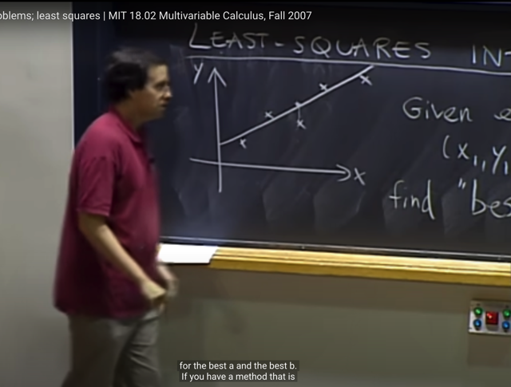</kbd>

> [!NOTE]
> đại khái là gs giải thích về việc **để có best line**, thì ta **phải định nghĩa
> best là như thế nào**. Thế thì c**ó nhiều kiểu định nghĩa**, để rồi mỗi
> cái sẽ cho ra một best line khác nhau.
>
> Nhưng một **giải pháp là dùng sum bình phương của các error**.
> Gs cho rằng cái này được **sử dụng phổ biến** vì thứ nhất nó c**ho ra
> kết quả best line** là đường đi khá tốt, **sát với data points**.
>
> Và thứ hai là nó **khiến bài toán trở nên đơn giản**, dễ giải.

 

<kbd>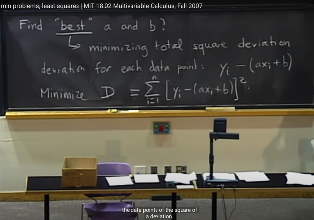</kbd>

> [!NOTE]
> như đã nói bài toán **Least Square**, ta sẽ tìm cách **minimize** D =
> **Tổng bình phương của residual** (difference giữa "predicted value"
> ax_i + b và y_i)

 

<kbd>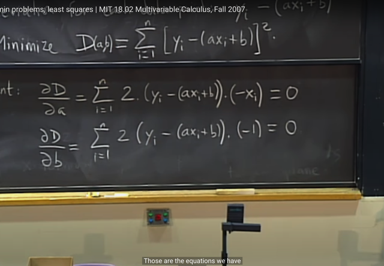</kbd>

> [!NOTE]
> Thế thì đầu tiên ta sẽ đi tìm**CRITICAL POINT**, bằng cách **solve
> các equation**: **Partial derivative của D w.r.t a và b bằng 0**.
>
> Việc **tính partial derivative** khá **đơn giản**. Với việc dùng
> **chain rule**

 

<kbd>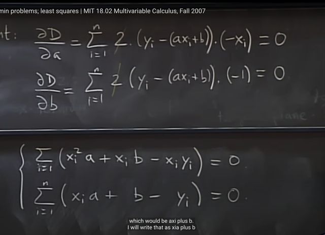</kbd>

> [!NOTE]
> **Simplify** một chút ta có như vầy, gs lưu ý rằng ta có thể
> thấy đây **vẫn là các linear equation of a, b**

 

<kbd>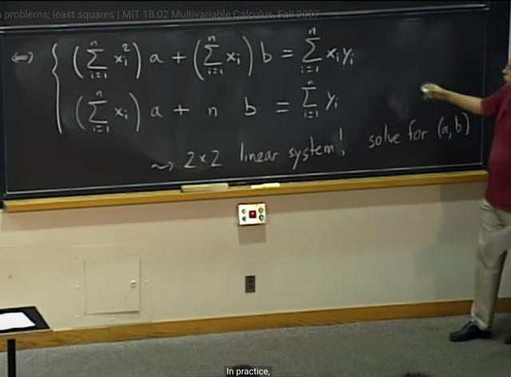</kbd>

> [!NOTE]
> Tiếp theo, nôm na là ta **có thể phân phối dấu tổng** (cơ bản
> chỉ là **sắp xếp lại các term**). Và bài toán **hoàn toàn chỉ là
> giải hệ hai phương trình tuyến tính**

 

<kbd>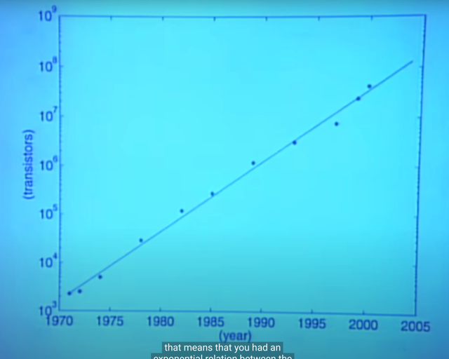</kbd>

<kbd>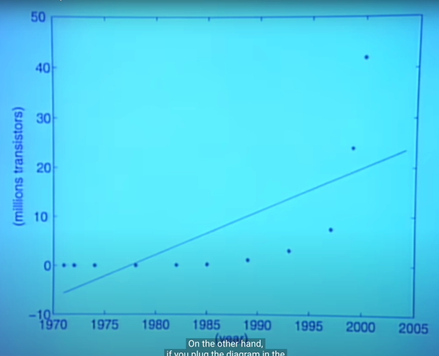</kbd>

<kbd></kbd>

<kbd></kbd>

<kbd>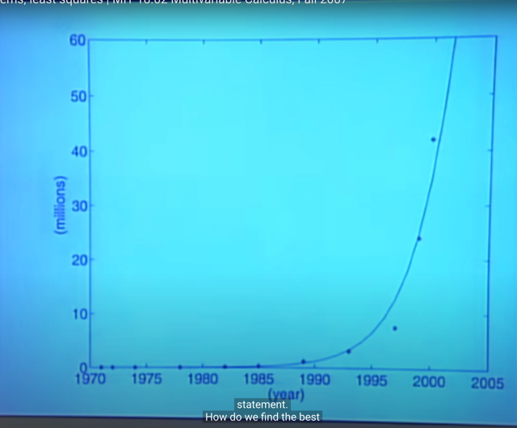</kbd>

> [!NOTE]
> Tiếp, đại khái gs cho một ví dụ khác, trong đó data points
> không có vẻ gì là có quy luật tuyến tính

> [!NOTE]
> Nhưng khi dùng giá trị **log** của y, thì nó có thể thấy là tuân
> theo linear pattern

> [!NOTE]
> và sự thật pattern của
> nó là exponential

 

<kbd>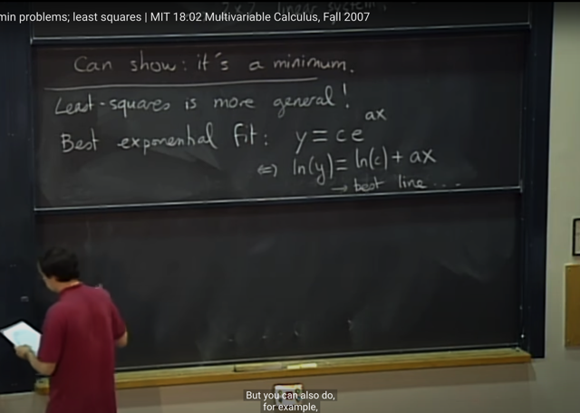</kbd>

> [!NOTE]
> Thế thì **true pattern** có dạng **y = c*e^ax**, để **tìm c và a** giúp
> tạo được đường **fit tốt nhất với data** này thì rất **khó**. Nhưng **chỉ
> cần lấy ln hai vế**. Ta sẽ có  thể thấy **bài toán trở thành least
> square**ln(c*e^ax) = ln(c) + ln(e^ax) = ln(c) + ax ln(e) = ln(c) + ax

 

<kbd>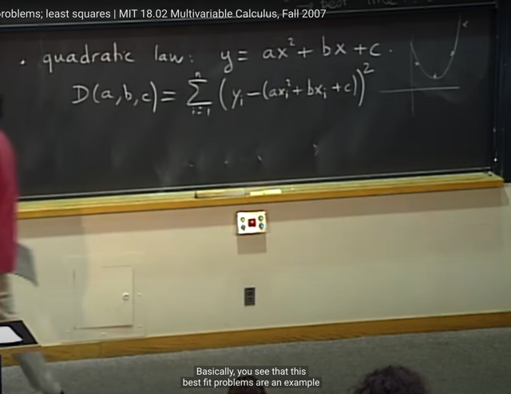</kbd>

> [!NOTE]
> Hay để fit được quadratic pattern thì cũng hoàn toàn dùng least
> square để solve a, b, c bình thường. Và ta sẽ vẫn có hệ 3 phương 
> trình TUYẾN TÍNH đối với a, b, c

 

