# 18.03 Lec 25

📊 **Progress:** `27` Notes | `29` Screenshots

---

<kbd>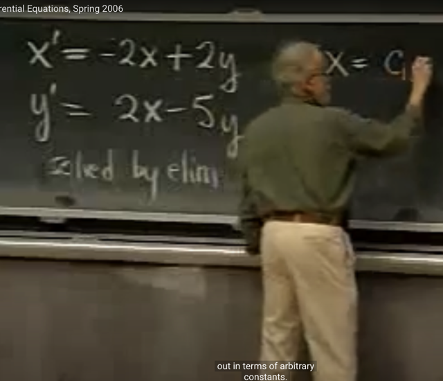</kbd>

<kbd></kbd>

<kbd>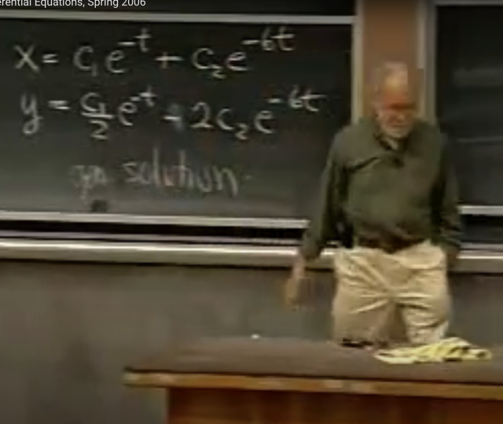</kbd>

> [!NOTE]
> Đại khái là gs nói bài trước ta đã giải hệ phương trình vi phân
> này bằng phương pháp elimination, ra general solution như
> vầy (mà nếu dựa vào initial condition, thì có thể tìm c1, c2

 

<kbd>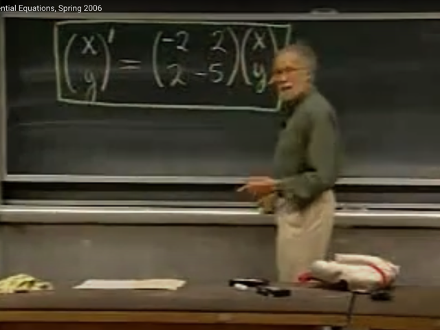</kbd>

> [!NOTE]
> Đại khái là, gs cho rằng ta có thể thể hiện hệ hai
> phương trình này ở dạng matrix.
>
> bằng cách bỏ x' và y' vào vector (x' y') và cũng là (x y)',
> tức đạo hàm vector `=` đạo hàm từng phần tử
>
> Còn bên phải xây dựng matrix các hệ số

 

<kbd>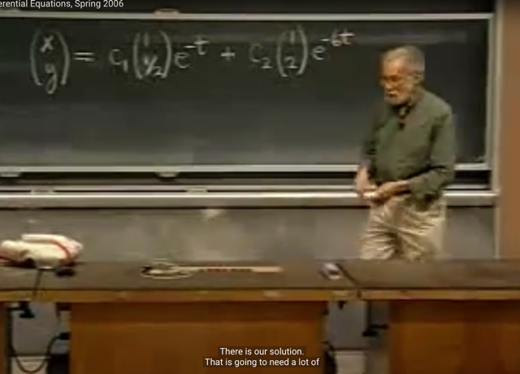</kbd>

> [!NOTE]
> Và solution (mà ta đã giải ra ở bài trước) sẽ
> trở thành dạng vector như vầy. (ko có gì khó hiểu)

 

<kbd>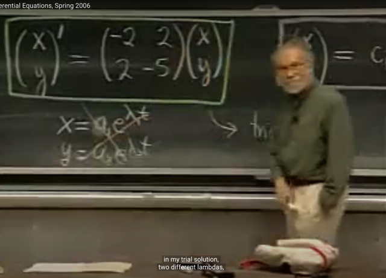</kbd>

> [!NOTE]
> Tiếp theo gs nói đại khái là ta sẽ dùng phương pháp
> THỬ NGHIỆM (TRIAL) để giải hệ phương trình này. Mà
> (có thể là ông đã dùng `/` nói trong các bài trước, cũng
> như thầy Strang trong bài về hệ phương trình vi phân
> cũng kiểu như "cho rằng `/` tuyên bố rằng nghiệm sẽ có
> dạng tổng quát (general solution) là c1e^λt*x1 `+`
> c2e^λ2t*x2 rồi bảo ta thử thay vào để CHECK xem có
> đúng vậy không.
>
> Thế thì gs nói, ta có thể nghĩ rằng x `=` a1e^λ1t, và y `=`
> a2e^λ2t là solution. Nhưng ông nói nếu làm vậy sẽ
> không work
>
> Lí do là vì, khi nhìn vào nghiệm (mà ta đã giải ra bằng pp
> elimination ở bài trước và thể hiện bằng dạng vector ở
> đây) ta sẽ thấy nó có dạng của "một vector " được scale
> bởi e^(..)t. Có nghĩa là, CHÚNG SHARE CHUNG MỘT
> SCALE FACTOR

 

<kbd>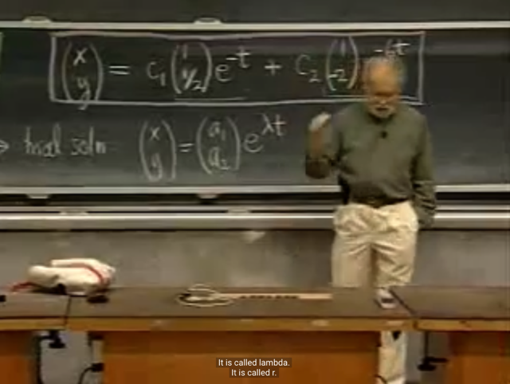</kbd>

> [!NOTE]
> Do đó, ông cho rằng ta phải cho TRIAL SOLUTION (là
> solution mà ta muốn gắn vô để thử) có dạng là [a1 a2]T *
> e^lambda*t
>
> Đây, hồi nãy mình đã hiểu đúng chỗ này đó là, TA ĐOÁN
> nghiệm của `du/dt`  `=` Au sẽ có dạng e^[gì đó]*t, với "gì đó"
> là một con số nào đó, gọi là lambda, nhưng vì ta cần
> nghiệm là một vector, nên ta nhân nó với vector x (cũng
> không biết cần phải tìm), để có (e^lambda*t)*x
>
> Còn sở dĩ ta đoán nghiệm có dạng e^[gì đó]*t là bởi khi
> giải phương trình vi phân `dv/dt` `=` `αv,` ta thấy solution là
> `C*e^α*t` Nên có thể nói ta đoán nghiệm có dạng e^[..] là do
> kinh nghiệm cho thấy một function mà đạo hàm của nó
> bằng chính nó thì  tự nhiên nhất chính là hàm e^[..], vì
> `de^x/dx` `=` e^x

 

<kbd>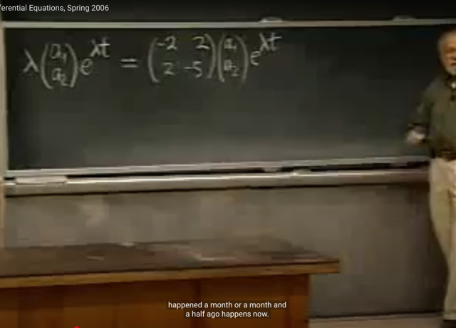</kbd>

> [!NOTE]
> thế thì bước tiếp theo đương nhiên là GẮN VÔ phương trình 
> (để thử xem trial solution có phải là solution thật không).
>
> Vế trái, là [x y]T' nên ta cần lấy đạo hàm của trial solution,
> kết quả sẽ là lambda * [a1, a2]T * e^lambda*t (không có gì khó,
> chỉ cần dựa vào chain rule, đương nhiên đạo hàm là theo t,
> nên a1, a2, là constant
>
> Còn vế phải ta có matrix hệ số * vector trial solution

 

<kbd>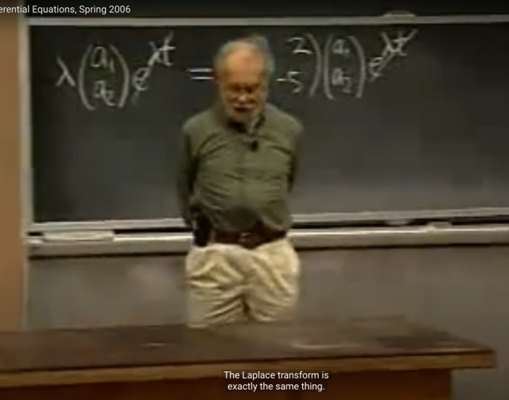</kbd>

> [!NOTE]
> Và hai vế đều có e^lambda*t ta cancel đi. Để còn lại là
> lambda* [a1 a2]T `=` [matrix hệ số] [a1 a2]T
>
> Và gs nói, có nghĩa là, bài toán giải hệ phương trình vi
> phân đã trở thành bài toán giải hệ phương trình đại số
> tìm lambda, a1, a2
>
> Và ông nói thêm Laplace transform cũng làm y như
> vậy

 

<kbd>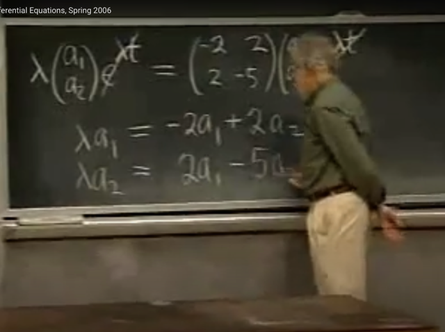</kbd>

> [!NOTE]
> Triển khai ta sẽ có hai phương trình như vầy: 2 phương
> trình, 3 ẩn (unknown)
>
> Và nhận ra đây không phải là phương trình tuyến tính,
> vì xuất hiện lambda*a1 và lambda*a2
>
> Gs nói nếu ta giải mà không có chiến lược thì sẽ gặp
> khó, vì hai phương trình ba ẩn thường sẽ có vô số 
> nghiệm

 

<kbd>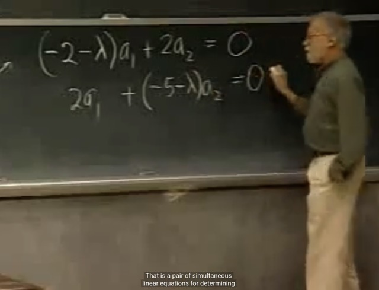</kbd>

> [!NOTE]
> Thế thì để giải, ông sẽ coi lambda như parameter và khi
> đó xem hệ trở thành hệ hai phương trình tuyến tính theo
> a1, a2
>
> Gs còn nhắc đến khái niệm homogenous (chỉ vế phải `=` 0)

 

<kbd>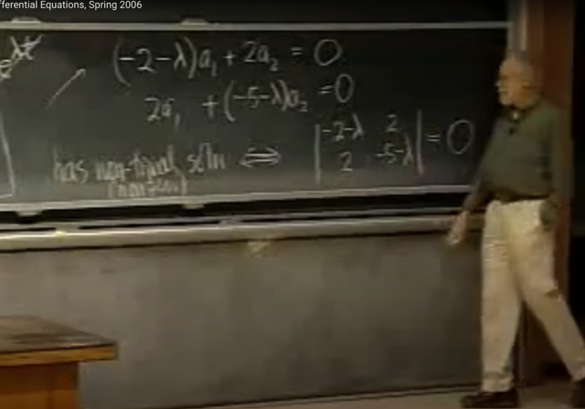</kbd>

> [!NOTE]
> Tiếp, đại khái gs ta thấy có trivial solution đó là a1 `=`
> 0, a2 `=` 0, nhưng nếu vậy x và y đều bằng 0 và ta
> không muốn `/` care nghiệm này
>
> Thành ra ta cần `non-trivial` `(non-zero)` solution. Và điều
> này chỉ xảy ra nếu determinant `=` 0.
>
> Dựa vào 18.06 thì hoàn toàn dễ hiểu rằng cái mà ta đang
> làm chính là muốn tìm lambda để matrix singular, khi đó
> nullspace sẽ khác {0} và giúp A'x `=` 0 có solution khác 0
>
> Và cũng có thể thấy A' đây chính là `A-lambda*I,` và cái
> phương trình det A' `=` 0 để tìm nullspace space của A'
> chính là ta đang giải characteristic equation để tìm 
> nullspace của `A-lambda*I,` và vector trong nullspace
> của `A-lambda*I` cũng chính là eigenvector của A

 

<kbd>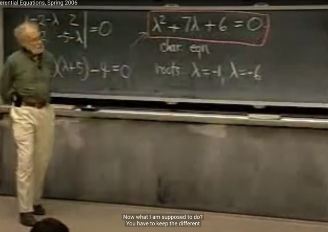</kbd>

> [!NOTE]
> Và quả thật gs cho biết nó chính là
> CHARACTERISTIC EQUATION
>
> Giải ra lambda `=` `-1,` `-6`

 

<kbd>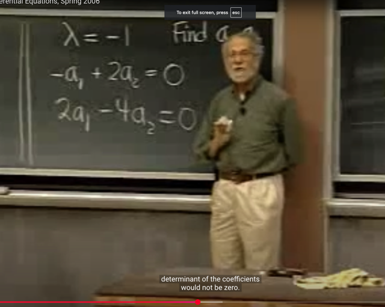</kbd>

> [!NOTE]
> Và thế lambda `=` `-1` vào để tìm a1, a2. Gs lưu ý ta rằng
> có thể thấy hai phương trình này, equation 2 `=` `-2` *
> equation 1. Và ông nói điều này là DĨ NHIÊN, vì nếu
> không như vậy, ta sẽ không thể giải ra a1, a2
>
> Mình có thể hiểu điều này, bởi vì toàn bộ ý nghĩa của việc
> tìm lamdba để det `A-lambda*I` `=` 0 là để matrix đó singular,
> khi đó nullspace của nó mới tồn tại nonzero vector, cũng
> có nghĩa là tồn tại bộ hệ số khiến combine các columns 
> của `A-lambda*I` thành 0, và đó cũng là eigenvector của A.
>
> Và đây, tìm ra `lambda=-1` chính là để matrix `[A-lambda*I]`
> trở thành `[-1` 2; 2 `-4]` quả thật là matrix có dim nullspace `=` 1
> dim columns space `/` dim rowspace `/` rank `=` 1, và cũng 
> đồng nghĩa các row phụ thuộc, các column phụ thuộc.
>
> Thì lúc này mới có thể tìm bộ a1, a2 để combine hai column
> là `[-1` 2]T và [2 `-4]` thành 0 được. Chứ nếu không, hai cột
> độc lập thì chỉ có a1 `=` 0, a2 `=` 0 mới combine chúng thành 0

 

<kbd>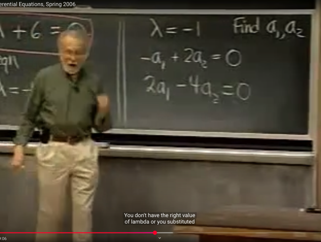</kbd>

> [!NOTE]
> Và gs nói ta có thể coi như đây là phép thử, vì nếu giải ra
> lambda xong, gắn vào mà thấy hệ hai phương trình này
> không có cái nào BỊ DƯ (REDUNDANT), tức là như vừa nói,
> một phương trình là multiple của phương trình kia, thì ta đã
> tính sai ở đâu đó rồi.
>
> Mà quả thật khi đó CHẮC CHẮN không thể giải ra nghiệm

 

<kbd>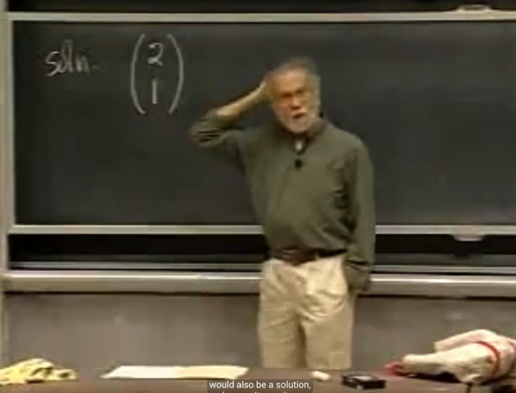</kbd>

> [!NOTE]
> Và ta sẽ chọn giá trị của một variable và tính variable
> còn lại.
>
> Mình hiểu đây chính là việc ta assign free variable một
> giá trị tùy ý và tìm pivot variable. Để có một basis vector
> của nullspace (của `A-lambda*I)` và nó cũng chính là
> eigenvector của A

 

<kbd>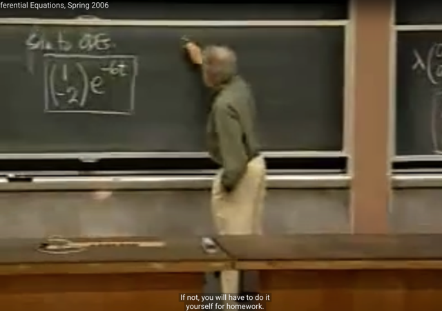</kbd>

> [!NOTE]
> và ta sẽ gắn vào để có solution của hệ
> phương trình vi phân

 

<kbd>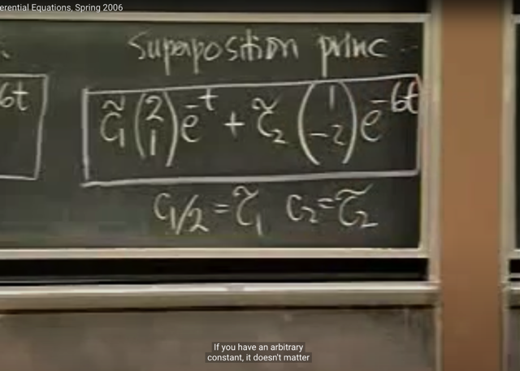</kbd>

> [!NOTE]
> Và gs cũng nói về việc mọi combination của của hai
> solution này đều là solution, nên ta có general solution
>
> Ông cũng chỉ ra rằng tuy hai vector ra khác solution
> bữa trước, nhưng thật ra chỉ là scale với constant nào
> đó mà thôi

 

<kbd>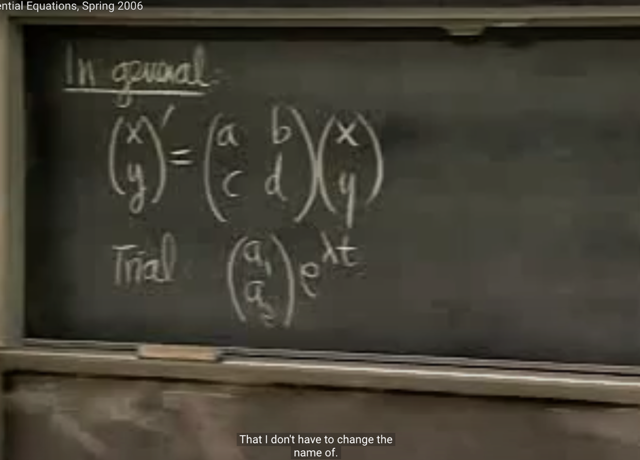</kbd>

> [!NOTE]
> Gs khái quát hoá với
> matrix A [a b; c d]

 

<kbd>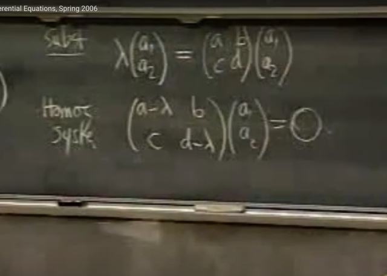</kbd>

> [!NOTE]
> Y như các bước đã biết, ta sẽ thế trial solution vào hệ
> phương trình.
>
> Ta có hệ hai phương trình với ẩn là lambda, a1, a2
>
> Để rồi coi lambda như parameter, ta chuyển thành hệ
> phương trình đồng nhất (homogenous) (hệ hai phương
> trình hai ẩn a1, a2, vế phải `=` 0)

 

<kbd>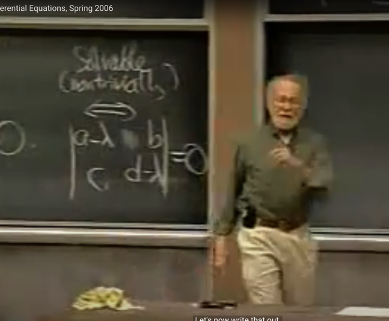</kbd>

> [!NOTE]
> Và đặt điều kiện để có thể giải ra nghiệm a1, a2 khác 0
> (non trivial solution) thì det của matrix này phải `=` 0
> (chính là matrix A `-` lambda*I)

 

<kbd>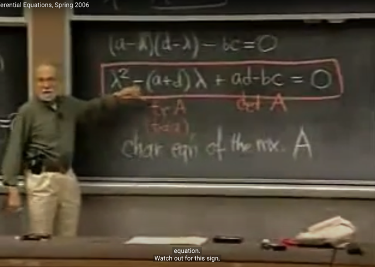</kbd>

> [!NOTE]
> Và từ đó dẫn ta đến characteristic equation.
>
> Ông chỉ ra cho thấy `ad-bc` chính là det(A) mà ta biết sẽ là
> tích các eigenvalue và `(a+d)` chính là Trace A (tổng các
> component trên đường chéo) và thật ra cũng chính là tổng
> các eigenvalue

 

<kbd>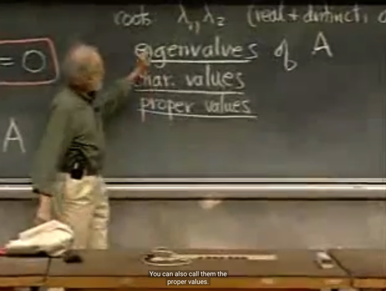</kbd>

> [!NOTE]
> Và gs cho biết (mà ta cũng đã biết từ 1806) lambda được
> gọi là eigenvalues của matrix. và là những con số quan
> trọng nhất của matrix
>
> Xuất phát từ tiếng đức, và còn có các tên khác như
> "characteristic values"

 

<kbd>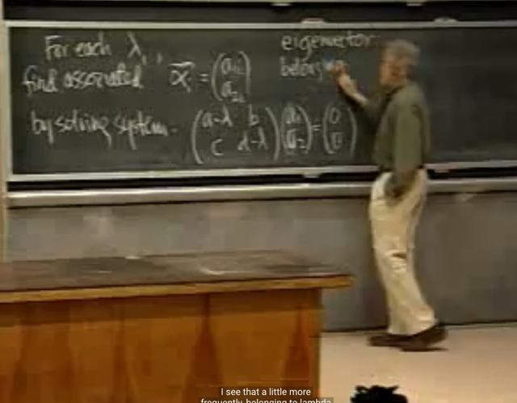</kbd>

> [!NOTE]
> Thế rồi ta sẽ gắn eigenvalue vào
> để giải ra tìm eigenvector

 

<kbd>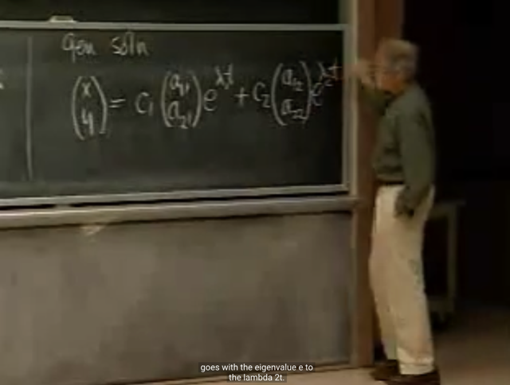</kbd>

> [!NOTE]
> Và từ đó ta có general solutions

 

<kbd>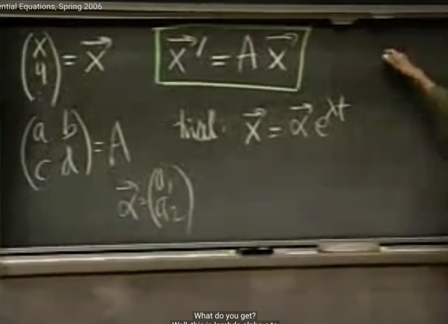</kbd>

> [!NOTE]
> Và cuối cùng gs sẽ khái quát hóa lên hơn nữa. Ta có
> vector x (gs nói dùng notation của 1802, đối với mình ta
> hiểu nó chính là trong 1806 là vector u(t)
>
> Để rồi hệ phương trình sẽ được thể hiện dưới dạng matrix
> là x' `=` Ax, tương đương `du/dt` `=` Au trong 1806)
>
> Rồi, TRIAL SOLUTION sẽ là **α*e^λt** (đóng góp lớn nhất
> của việc xem bài giảng này là giúp ta không còn khó hiểu
> rằng tại sao gs Strang lại khơi khơi nói rằng General
> solution của `du/dt` có dạng c1*e^(λ1t)*x1 `+` c2*e^(λ2t)*x2)
>
> Vector `α` chính là tương ứng với vector x `/` eigenvector của A

 

<kbd>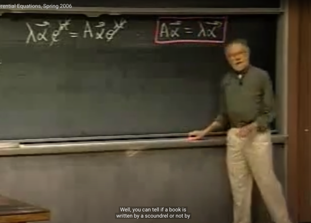</kbd>

> [!NOTE]
> Rồi, cũng thế trial solution vào, để system of differential
> equation trở thành `Aα` `=` `lambda.α` (chính là cái mà hồi nãy
> gọi là homogenous system of equation, ta chuyển bài toán
> từ giải hệ phương trình vi phân thành hệ phương trình đại
> số đồng nhất)
>
> Và `Aα` `=` `lambda.α` với kiến thức 1806 thì đây chính là phương
> trình định nghĩa eigenvector và eigenvalue

 

<kbd>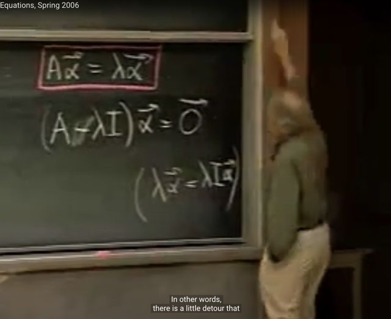</kbd>

> [!NOTE]
> Gs: ta phải chuyển thành matrix bằng cách nhân cho
> I thì `A-lambda*I` mới hợp lệ
>
> (ông nói thêm ông đánh giá sách hay hay dở là qua
> việc có giải thích chỗ này không)

 

<kbd>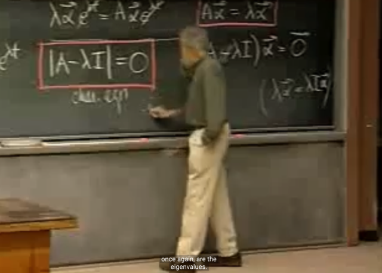</kbd>

> [!NOTE]
> Cuối cùng là việc thiết lập characteristic equation, chính
> là equation cho det của `A-lamdba*I` `=` 0 để khiến (theo
> 1806) nó singular `=>` tồn tại nonzero vector trong
> nullspace (của `A-lambda*I)` `=>` và nó chính là
> eigenvector của A.

 

