# Lecture 10: The Four Fundamental Subspaces

📊 **Progress:** `26` Notes | `33` Screenshots

---
<a id="node-264"></a>

<p align="center"><kbd>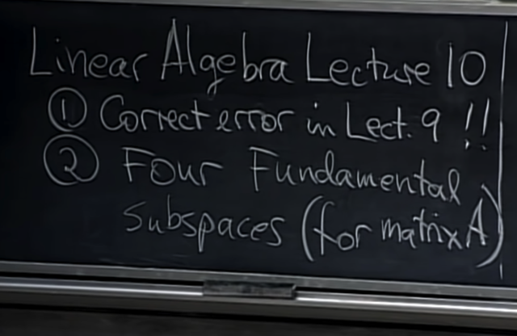</kbd></p>

<br>

<a id="node-265"></a>

<p align="center"><kbd>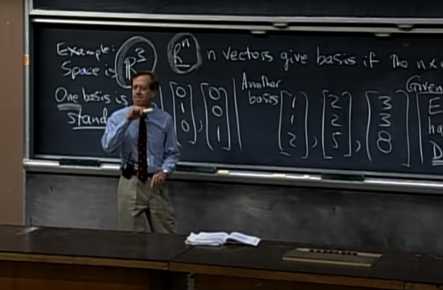</kbd></p>

> [!NOTE]
> Ok, đại khái là gs nói rằng trong bài trước **có một sai
> sót** đó là khi gs nói về **basis của R3**, thì sau khi nói
> về một **basis dễ thấy nhất** `-` ba vector đơn vị **(1 0 0),
> (0 1 0), (0 0 1)** thì ta đã lấy một bộ 3 vector khác với
> với hai cái đầu là hai vector độc lập: (1 1 2), (2 2 5). Và
> cho rằng chỉ cần vector thứ 3 không phải là linear
> dependent của hai cái kia là ta sẽ có một basis. Điều
> này đúng, và gs đã lấy (3 3 8) vì cho rằng " à, (3 3 7) sẽ
> là tổng hai thằng kia nên lấy (3 3 8) chắc sẽ không nằm
> trong plane span bởi v1, v2.
>
> Đây chính là chỗ sai khi có **người phát hiện rằng trong
> matrix này, hàng 1 bằng hàng 2**. Tức là, **ba hàng này
> ko độc lập**. Và như bữa trước đã thấy, nếu elimination,
> U sẽ **chỉ còn 2 pivot**. vì chỉ có mỗi pivot mỗi hàng và
> mỗi cột. Thành ra theo hàng thì chỉ có 2 pivot thì đồng
> nghĩa theo cột cũng sẽ chỉ có 2 pivot. Vậy **ba cột này
> chắc chắn ko độc lập.**
>
> Và bài này gs sẽ cho ta thấy **sự liên hệ giữa columns
> space và row spaces.**

<br>

<a id="node-266"></a>

<p align="center"><kbd>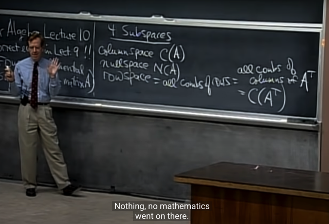</kbd></p>

> [!NOTE]
> Và ta sẽ nói về một subspace quan trọng thứ 3 bên cạnh
> **columns** **space** và **nullspace**:**ROW SPACE**.
>
> Vậy rowspace là space tạo bởi **mọi linear combination của
> các matrix row**. Hay nói cách khác, các row vector của A sẽ
> span rowspace. Nhưng again, **chưa chắc các row của A sẽ là
> basis của rowspace** nhé, vì **có thể chúng không independent**
> ví dụ như trong matrix hồi nãy, rows của A chỉ span 2D plane
> trong R3.
>
> Rồi, tiếp gs nói tôi không thích làm việc với row vector, nên
> tôi có thể dùng **columns của A.T** để chỉ row của A. Vậy **rowspace
> của A là columns space của A.T**

<br>

<a id="node-267"></a>

<p align="center"><kbd>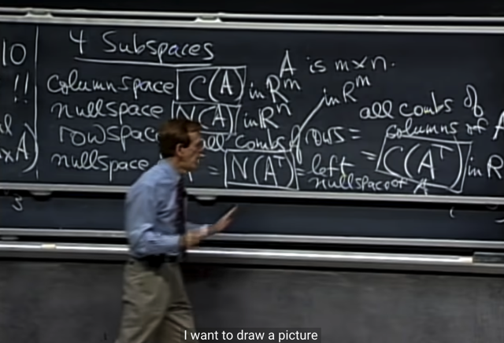</kbd></p>

> [!NOTE]
> Và fundamental subspace thứ 4 là**null-space của AT** hay
> còn được gọi là **LEFT NULLSPACE** của A
>
> Cho matrix A [m,n] thì **C(A) sẽ là subspace của Rm** (mỗi
> cols  có m component)
>
> **N(A) sẽ là subspace của Rn** (có n cols, nên x khiến Ax `=` 0
> sẽ  có n component)
>
> **C(AT) cũng là subspace của Rn**, mỗi row là vector có n
> phần tử.
>
> Và **N(AT) sẽ là subspace của Rm**

<br>

<a id="node-268"></a>

<p align="center"><kbd></kbd></p>

> [!NOTE]
> Gs phác thảo **rowspace và `null-space` là subspace
> của Rn** và **columns space và nullspace of A.T là
> subspace của Rm**

<br>

<a id="node-269"></a>

<p align="center"><kbd></kbd></p>

> [!NOTE]
> Vậy thì nếu có thể biết được **4 subspace nền tảng** này thì
> coi như biết về một nửa của Linear Algebra.
>
> Câu hỏi là với 4 subspace này, **basis** là gì, và **dimension**?
>
> Thế thì với basis, gs yêu cầu một quy trình để xác định
> basis. 
>
> Còn với dimension, thì yêu cầu cho biết dimension là một
> con số thôi. 
>
> Gs: tôi có thể trả lời luôn **dimension** cho **columns space** 
> trước: Đó chính là **rank r của matrix A**. Và ta đã đi biết vụ
> này ở bài trước. Đương nhiên gs nói tiếp ta có thể **đi tìm
> basis** và **số vector của basis chính là dimension**

<br>

<a id="node-270"></a>

<p align="center"><kbd>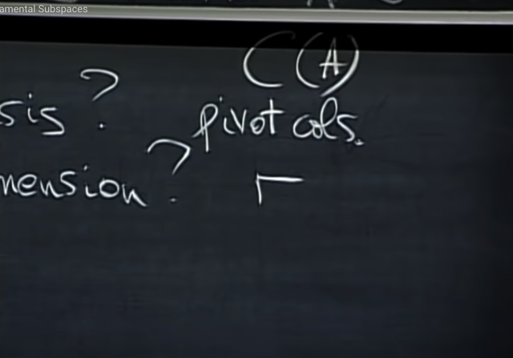</kbd></p>

> [!NOTE]
> Và như ta đã làm chán chê bữa giờ, khi ta dùng **elimination**
> để đưa A về Row Echelon form `-` **U**. Để xác định được **pivot**
> cols và **free** cols.
>
> Thế thì **các pivot cols chính là tạo nên một basis của cols
> space** và **số lượng pivot chính là rank** và **chính là
> dimensions của columns space**.
>
> **Vì sao pivots cols là basis của columns space?**
>
> thì bởi vì**chúng là các cols vector độc lập** trong các cols
> vector, thì chúng là những vector **vừa đủ để span cols
> space**, **nên chúng là basis của cols space**.
>
> Tóm lại, chúng ta đã hiểu khá nhiều về cols space. Gs cho
> rằng ta sẽ quay lại để chứng minh cái này dù mình đã biết là
> nó đúng

<br>

<a id="node-271"></a>

<p align="center"><kbd>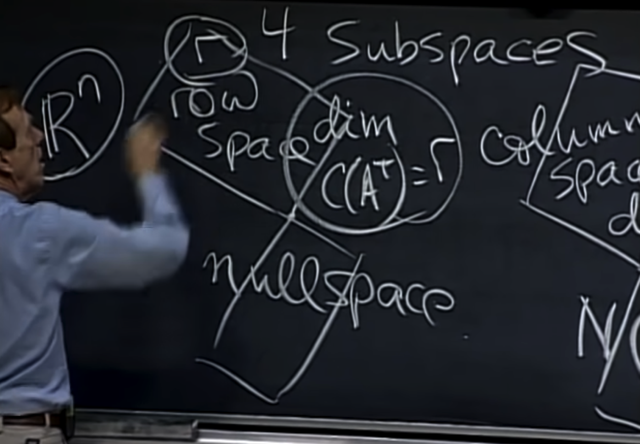</kbd></p>

🔗 **Related:** [LECTURE 12: GRAPHS, NETWORKS, INCIDENCE MATRICES](untitled.md#node-343)

> [!NOTE]
> Thế thì xét qua **row space of A.**
>
> Về dimension, gs cho biết **DIMENSION CỦA ROWSPACE
> CŨNG LÀ RANK CỦA A**
>
> Và đây là một tính chất tuyệt vời. **Cols space và rows
> space của A đều có dimension là r**

<br>

<a id="node-272"></a>

<p align="center"><kbd>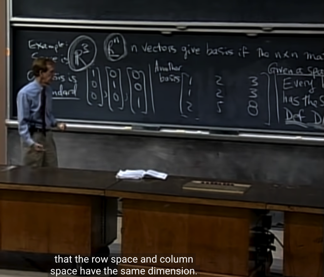</kbd></p>

> [!NOTE]
> Và nhờ điều này nên ta quay lại cái sai sót hồi bài trước.
> Khi ta có matrix này, thì nhìn cols ta không biết chúng có
> dependence không. Nhưng nhìn row là dễ thấy ngay chúng
> ta chỉ có 2 independence row.
>
> Và do đó**chỉ có thể có rank bằng 2** (vì mới nói
> dimensions của rowspace chính là rank, mà trong 3 row
> vector, ta chỉ có  2 row vector độc lập nên basis của
> rowspace chỉ có 2 vector, nên dimension của rowspace là 2
> `->` rank `=` 2)
>
> Và do đó **suy ra cols space cũng chỉ có dimension `=` 2**,
> vậy **Suy ra 3 cols vector không độc lập** (mà sẽ chỉ có 2
> trong số đó độc lập tuyến tính)

<br>

<a id="node-273"></a>

<p align="center"><kbd>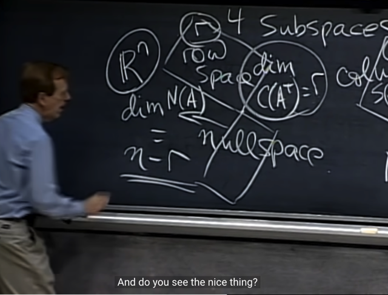</kbd></p>

> [!NOTE]
> Thế thì với nullspace (of A):
>
> Gs nhắc lại ta nhớ lại việc tìm **solution của Ax=0** (solution
> của nó chính là thuộc nullspace): Ta sẽ **elimination**, đưa A
> về row echelon form **U**, thậm chí reduced row echelon form
> **R**.
>
> Sau đó ta sẽ **tìm ra pivol cols/variable** đồng nghĩa biết **free
> cols/variable**. Và với từ đó gán giá trị tùy ý cho các free
> variable để `back-substitution` tính ra pivot variable.
>
> Và nhớ lại, ta thường cho lần lượt mỗi free variable một lần
> mang giá trị 1, mấy cái còn lại 0 (ý là ví dụ có 2 free
> variable x1, x3 thì **lần đầu ta cho `x1=1,` x3=0**, lần sau cho
> **x3=1, x1=0** để tính ra pivot var. Và đó các solution tìm theo
> cách gán này được gọi là các **special solution**.
>
> Vậy dễ thấy **các special solution này independence** (vì ta 
> được phép chọn giá trị bất kì cho free variable, thì dĩ nhiên
> luôn có thể chọn gía trị khiến các special solution độc lập.)
>
> Và gs vì vậy (**independence** và **span** **nullspace**) nên đó 
> **cũng chính là basis vector** của nullspace.
>
> Như vậy, mỗi free variable sẽ cho ta một special solution
> (again, gán 1 cho nó, gán 0 cho mấy free variable khác và
> thế vào tính ra pivot var, để có một special solution)
>
> mà các special solution tạo thành một basis, cho nên **số
> special solution `=` số free column chính là dimension 
> của nullspace cũng như là số pivot column chính là 
> dimension của column space `/` row space
>
> Vậy với matrix n cột, rank r, thì có r pivot, nên có `n-r` free
> variable `=>` có `n-r` special solution và như vậy dimension
> của nullspace là n-r**

> [!NOTE]
> Hãy xét thêm hai câu hỏi sau: Tại sao chắc chắn rằng các special solution sẽ span
> nullspace, và tại sao chúng independence? (để từ đó kết luận chúng là basis của
> nullspace)
>
> i)**Tại sao special solution span nullspace:**
>
> Như đã biết, special solution được tìm bằng cách tìm free variable. Và gán giá trị
> tùy ý cho nó, thế ngược vào `Ax=0` và giải ra các pivot variable. Vậy không làm mất
> đi tính khái quát, có thể xét matrix A có 5 cột, tức có 5 variable x1,x2,x3,x4,x5. Và
> cũng không làm mất tính khái quát, ta có thể giả sử sau khi đưa A về row echelon
> form ta có 3 pivot cols ứng với x1,x3,x4 và hai free columns x2, x5. Vậy ta sẽ gán
> `x2=1,` `x5=0` để thế vào hệ phương trình lúc này còn 3 phương trình (vì có 3 pivot),
> để giải ra 3 biến pivot x1,x3,x4 (cho bằng a,b,c). Như vậy là ta có một special
> solution đầu tiên gọi là `x_spec(1)` `=` (a,1,b,c, 0). Và đương nhiên `alpha*x_spec(1)`
> cũng là solution với mọi alpha. Và đây cũng tương đương với việc chọn `x2=alpha,`
> `x5=0,` giải tìm các pivot var
>
> Tương tự ta gán `x2=0,` `x5=1,` để tìm ra ba pivot var để có special solution thứ hai là
> `x_spec(2)` `=` (m,0,n,l,1). Tương tự, đương nhiên `beta*x_spec(2)` cũng là solution với
> mọi beta. Đây cũng tương đương với việc chọn `x5=beta,` `x2=0,` giải tìm pivot var
>
> Và đương nhiên các linear combination của hai special solution: **alpha*(a,1,b,c,0)
> `+` beta*(m,0,n,l,1) cũng thuộc nullspace, với mọi** alpha, beta.
>
> `======`
>
> *****Chứng minh special solutions span nullspace bằng phản chứng**
> Giả sử `x_spec1` và `x_spec2` là special solution.
>
> Đương nhiên tương đương `alpha*x_spec1` cũng là solution với mọi alpha và
> `beta*x_spec2` cũng vậy với mọi beta. Và từ đó suy ra `alpha*x_spec1` `+`
> `beta*x_spec2,` hay mọi linear combination của các special solution đều là solution
>
> Giả sử có một solution không phải là linear combination của hai special solution.
> Vậy x' thỏa `Ax'=0` nhưng không tồn tại alpha, beta khiến
>
> ```text
> x' = alpha*x_spec1 + beta*x_spec2 với mọi alpha, beta
> ```
>
> hay nói cách khác
>
> ```text
> x' != alpha*x_spec1 + beta*x_spec2 với mọi alpha, beta
> ```
>
> Nhân hai vế cho A, điều này tương đương
>
> ```text
> Ax' != A(alpha*x_spec1 + beta*x_spec2) với mọi alpha, beta
> ```
>
> ```text
> <=> Ax' != A*(alpha*x_spec1) + A*(beta*x_spec2) với mọi alpha, beta
> ```
>
> ```text
> Mà ta đã có Ax'=0, A*(alpha*x_spec1) = 0, A*(beta*x_spec2) = 0 vì x',
> ```
> `alpha*x_spec1,` `beta*x_spec2` như nói trên đều là solution của `Ax=0`
>
> Dẫn đến tương đương với:
>
> `<=>` 0 `!=` 0 `+` 0 với mọi alpha, beta
>
> Điều này là vô lý, vậy có thể kết luận rằng điều gỉa sử trên `-` tồn tại một solution
> không phải linear combination của các special solution `-` là sai. Từ đó có thể kết
> luận mọi solution của `Ax=0` đều là linear combination  của các special solution. **SUY
> RA SPECIAL SOLUTION SPAN NULLSPACE**
> ======****
> ****Chứng minh các special solution independence**
>
> Giả sử các special solution phụ thuộc: tức ta có thể viết `x_spec2` `=` `gamma*x_spec1`
>
> ```text
> tương đương x_spec2 - gamma*x_spec1 = 0
> ```
>
> Vậy `alpha*x_spec1` `+` beta*gamma*xpec1 `=` 0
>
> tương đương (alpha `+` beta*gamma)*xspec1 `=` 0
>
> tương đương `x_spec1` `=` 0.
>
> Điều này mâu thuẫn với giả thiết rằng `x_spec` 1 khác 0 (chọn free variable `=` 1
> và các free variable khác `=` 0). 
>
> từ đó kết luận các **CÁC SPECIAL SOLUTION LINEAR INDEPENDENCE**
>
> `======`
>
> **từ đó kết luận các SPECIAL SOLUTION LÀ BASIS CỦA NULLSPACE**

<br>

<a id="node-274"></a>

<p align="center"><kbd></kbd></p>

🔗 **Related:** [LECTURE 12: GRAPHS, NETWORKS, INCIDENCE MATRICES](untitled.md#node-342)

> [!NOTE]
> Và ta có nhận xét rằng rowspace và nullspace, đều là
> subspace Rn. Thì, dimension của rowspace là r,
> dimension của nullspace là `n-r.` **Tổng dimension là `n-r` `+` r
> `=` n `=` số cols của A**

<br>

<a id="node-275"></a>

<p align="center"><kbd>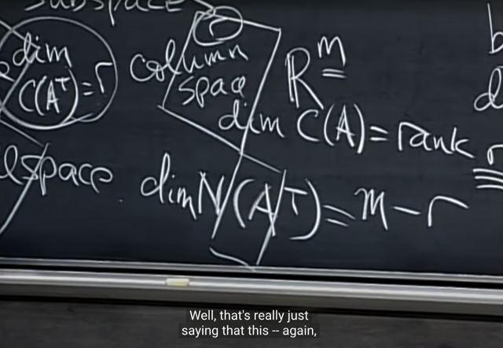</kbd></p>

> [!NOTE]
> Và dimension của nullspace của A.T sẽ là `m-r:` Vì sao?
>
> Vì A.T sẽ là matrix có n hàng, m cột (vì A là matrix mxn).
> Thế thì đã nói bên kia **cols space của A và row space
> của A đều có dimension là rank r của A**. Mà **rowspace
> của A chính là column space của A.T.**
>
> Vậy **columns space A.T có dimension `=` r** có nghĩa là**A.T cũng có r pivot.**
>
> Nên `(A.T)x=0` cũng có r pivot var, nên số free var là `m-r.`
>
> Và do đó `(A.T)x=0` có `m-r` special solution, vậy dimension
> cuả nullspace của A.T là `m-r`
>
> Và có thể thấy **nó cũng tuân theo cùng một rule: dim C(A.T)
> `+` dim N(A.T) `=` r `+` m `-` r `=` m `=` số columns của A.T**

<br>

<a id="node-276"></a>

<p align="center"><kbd>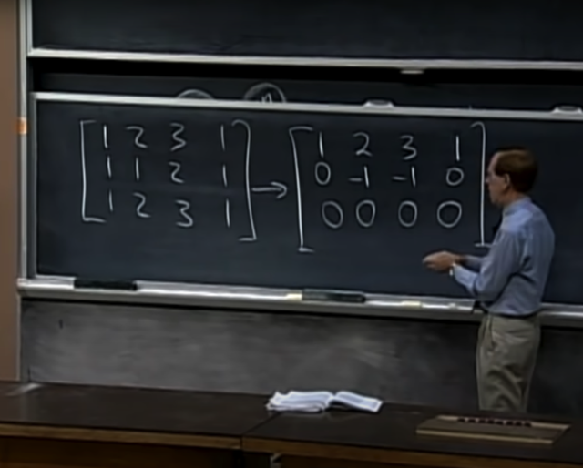</kbd></p>

<p align="center"><kbd>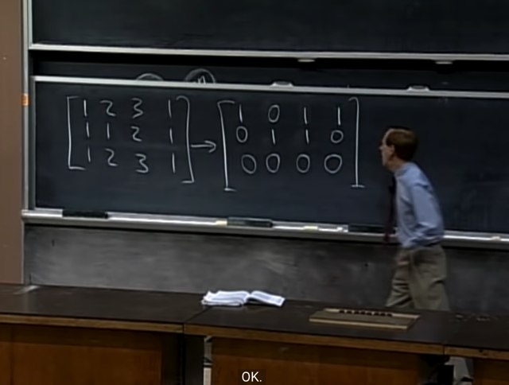</kbd></p>

<p align="center"><kbd></kbd></p>

<p align="center"><kbd></kbd></p>

<p align="center"><kbd>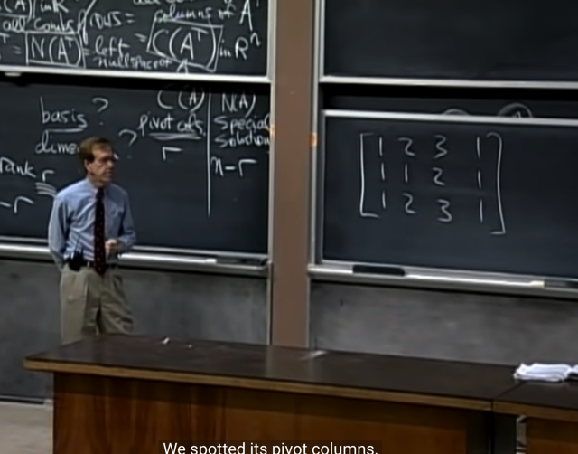</kbd></p>

> [!NOTE]
> tới đây ta đã trả lời xong câu hỏi dimension của chúng là gì,
> bây giờ ta sẽ tìm basis của chúng.
>
> Thế thế gs cho biết, tìm basis của C(A) thì ta biết rồi, đó là tìm ra
> các pivot cols. Thế thì basis của rowspace C(AT) thì sao?
>
> Gs nói rằng, ừ thì đại khái là các bạn cũng có thể cho rằng ta
> có thể lật cái A lại thành A.T để rồi dùng elimination để tìm
> pivot cols của A.T, khi đó transpose chúng lại ta sẽ có các
> linear independent row.
>
> Gs cho ví dụ matrix này, dễ thấy nó có 2 pivot cols (1 và 2,
> vì 3 và 4 đều linear dependent với 1, 2).
>
> Gs mới elimination để đưa nó về RREF matrix R

<br>

<a id="node-277"></a>

<p align="center"><kbd>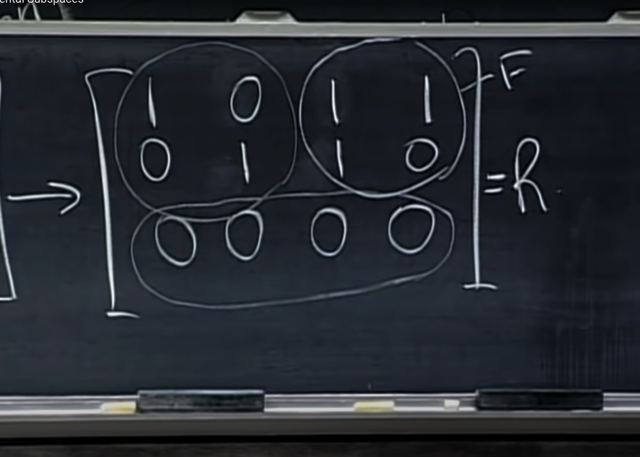</kbd></p>

> [!NOTE]
> và ta nhận xét thấy nó có một
> Identity matrix, Free matrix, hàng dưới `=` 0

<br>

<a id="node-278"></a>

<p align="center"><kbd>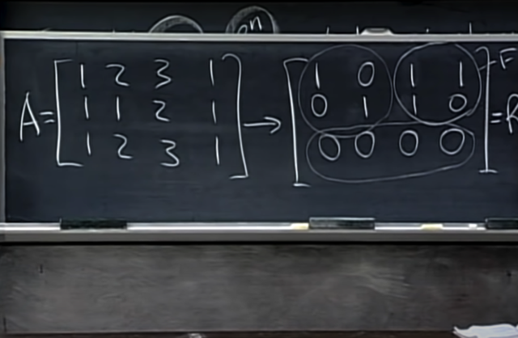</kbd></p>

<p align="center"><kbd></kbd></p>

<p align="center"><kbd>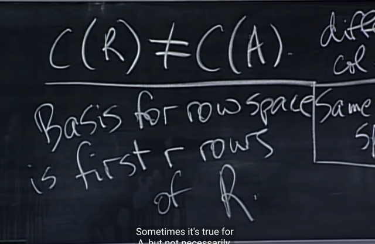</kbd></p>

> [!NOTE]
> **COLUMN SPACE CỦA R KHÁC COLUMN SPACE CỦA
> A**. Gs cho biết, vì **TRONG QUÁ TRÌNH ELIMINATION
> TA ĐÃ THAY  ĐỔI CÁC COLUMN**
>
> Nhưng **ROW SPACE CỦA R CHÍNH LÀ ROW SPACE
> CỦA A**. Và **basis của R** chính là hai row đầu, thì do đó
> chúng **cũng là basis của rowspace của A**

> [!NOTE]
> `Column-space` của R không bằng cols space của A. 
> Nhưng `row-space` của R chính là row space của A

<br>

<a id="node-279"></a>

<p align="center"><kbd>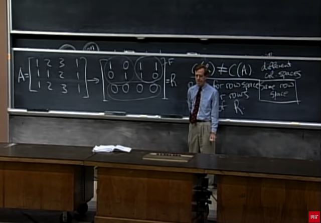</kbd></p>

> [!NOTE]
> Tại sao row space của R chính là row space của A để rồi
> hai vector đầu là basis của rowspace của R cũng chính là
> basis của rowspace của A?
>
> Lí do là vì, khi thực hiện quá trình row **elimination** matrix
> A, ta đã **THAY CÁC ROW BẰNG LINEAR COMBINATION
> CỦA  CHÚNG**. Gs đề nghị ngẫm lại xem có phải vậy
> không. Đúng là như vậy. Thế thì điều đó có nghĩa là
> **ROWSPACE CỦA A TRONG QUÁ TRÌNH ELIMINATION
> KHÔNG THAY ĐỔI**, do đó rowspace của R vẫn chính là
> rowspace của A. Khi thay hai vector (row) bằng hai vector
> khác trong cùng row space (linear combination của hai
> vector gốc) thì đương nhiên vẫn là rowspace đó.
>
> Do đó chỉ là **quá trình elimination giúp ta CHUYỂN HAI
> BASIS CỦA ROWSPACE CỦA A THÀNH HAI BASIS KHÁC
> RÕ RÀNG HƠN THÔI**. Gs gọi nó là **the** **best basis**

<br>

<a id="node-280"></a>

<p align="center"><kbd>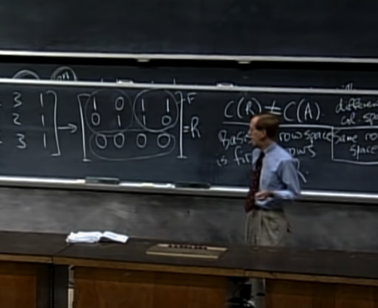</kbd></p>

> [!NOTE]
> Và cũng như đối với cols space, hai pivot cols (mà ở dạng
> reduced row echelon form) sẽ chính là hai cols gắn với cái
> Identity matrix là the best basis của cols space.
>
> CHÚ Ý: KHI NÓI BASIS CỦA COLUMN SPACE LÀ PIVOT
> COLUMN, THÌ PHẢI HIỂU Ý NÓI **PIVOT COLUMN CỦA A**
> CHỨ KHÔNG PHẢI CỦA R HAY U. CÓ NGHĨA LÀ NHỜ
> PIVOT COLUMN CỦA U, TA **BIẾT VỊ TRÍ CỦA PIVOT
> COLUMN CỦA A**. ĐIỀU NÀY **KHÁC VỚI ROWSPACE**, KHI
> VỚI ROWSPACE THÌ **PIVOT ROW CỦA `R/U` CŨNG
> CHÍNH LÀ PIVOT ROW (BASIS)  CỦA A** VÌ NHƯ ĐÃ NÓI
> CHÚNG **CÙNG MỘT ROWSPACE**
>
> Thì hai row đầu tiên của R trong trường hợp này là the best
> basis của row space (best mang ý nghĩa là nó đã được
> clean `/` tối giản hết mức có thể)

<br>

<a id="node-281"></a>

<p align="center"><kbd>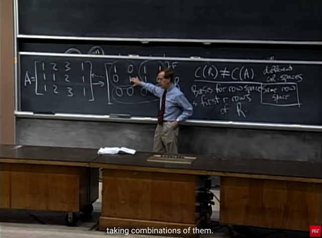</kbd></p>

> [!NOTE]
> Gs: làm sao tôi biết các row của A span cùng một vector
> space với hai basis vector? Hay nói cách khác, làm sao
> biết các row vector cũng nằm trong cùng space span bởi
> hai basis vector? 
>
> Thì bởi vì ta **có thể làm ngược qúa trình elimination** lại
> **để** **từ hai basis vector ra lại các row của A**. Thì điều này 
> đồng nghĩa các **row của A là linear combination của các
> basis vector**. Và **cũng đồng nghĩa rowspace cuả A chính
> là rowspace của R.**

<br>

<a id="node-282"></a>

<p align="center"><kbd>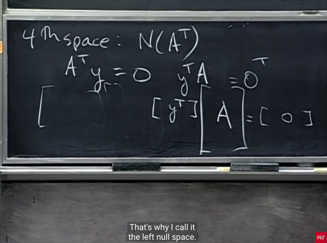</kbd></p>

<p align="center"><kbd></kbd></p>

<p align="center"><kbd>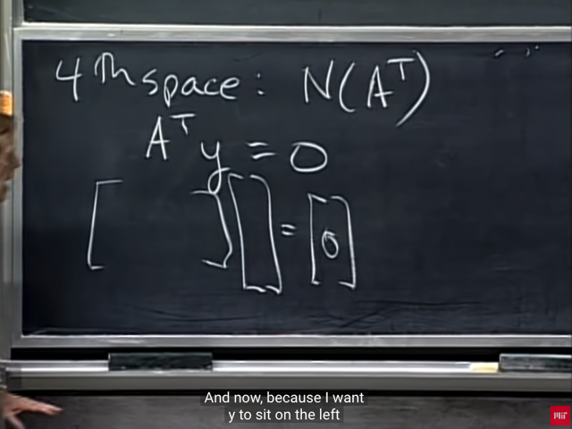</kbd></p>

> [!NOTE]
> rồi, gs xét qua **nullspace của AT**. hay còn gọi là **left
> nullspace** như nãy đã nói.
>
> Thế thì đầu tiên nullspace của A.T đương nhiên theo
> định nghĩa là **mọi linear combination của các solution
> của ATy=0**
>
> Vậy thì đầu tiên tìm hiểu tại sao lại gọi là left nullspace.
>
> đại khái là vì, ta có thể transpose hai vế của ATy `=` 0 để
> có yTA `=` 0. Có nghĩa là nullspace của AT là linear
> combination của mọi vector y thì nó cũng là linear
> combination của mọi yT và vì yT nằm bên trái A nên
> mới nói **nullspace của A.T là left nullspace của A.**Nhưng gs nói rằng tôi ít dùng cách gọi này

<br>

<a id="node-283"></a>

<p align="center"><kbd>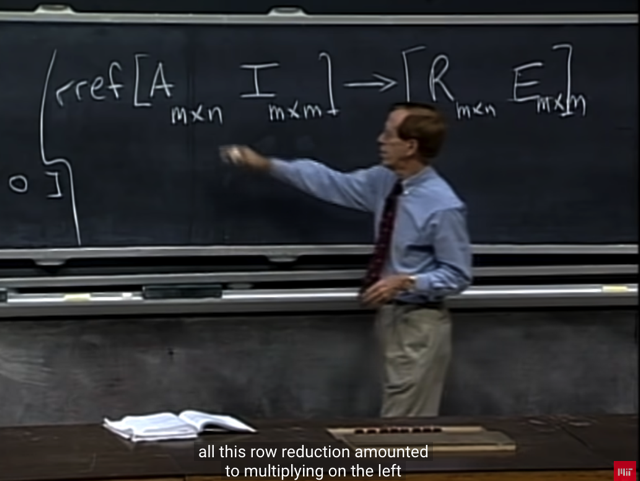</kbd></p>

🔗 **Related:** [LECTURE 3: MULTIPLICATION AND INVERSE MATRICES](untitled.md#node-73)

> [!NOTE]
> thế thì gs cho rằng elimination biến A thành R cũng có
> reveal ít nhiều về matrix AT, do đó, ta sẽ ôn lại một
> chút về qúa trình elimination biến A thành R (Reduced
> Row Echelon Form)
>
> Dùng **Gauss `-` Jordan** mà ta đã từng gặp ở mấy bài trước,
> Trong đó đại khái là ta sẽ **viết identity matrix kẹp với matrix
> A**, và khi elimination, ta **cũng áp dụng các bước biến đổi
> đối với matrix I**. Từ đó **khi A thành R**, **I trở thành matrix nào
> đó, gọi là E** (cố tình đặt tên là `E)`

<br>

<a id="node-284"></a>

<p align="center"><kbd>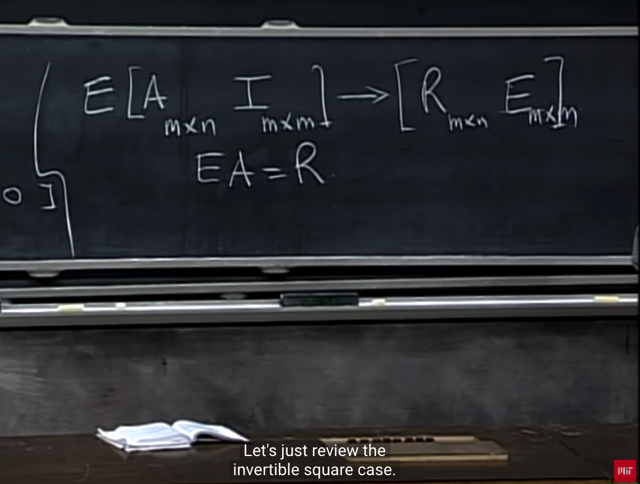</kbd></p>

> [!NOTE]
> Và như đã biết các bước**elimination biến A thành I** có thể 
> biểu diễn bởi việc **transform matrix A bằng matrix E**: EA
>
> Và thật sự **E chính là matrix mà I trở thành** ở trên.
>
> Vì sao? Vì `EA=R` thì cũng những bước biến đổi đó áp 
> dụng lên I, thì kết quả chính là kết quả của `E*I.` Mà vì I là
> Identity matrix nên **EI `=` E**. Vậy suy ra**cái matrix kết quả
> của I trở thành chính là E.**

<br>

<a id="node-285"></a>

<p align="center"><kbd>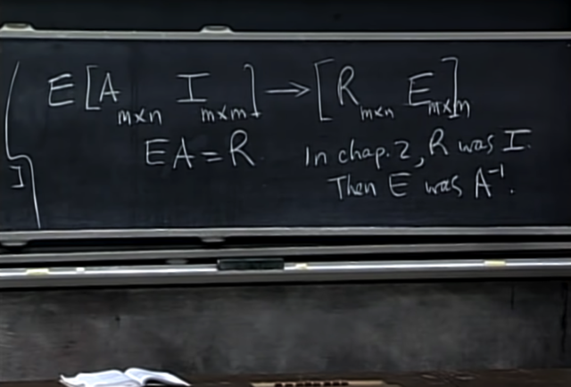</kbd></p>

> [!NOTE]
> Gs ôn lại trong bài bữa trước về Gauss Jordan, ta
> đang có A là **square & invertible** matrix. Khi đó sau khi
> elimination, ta có **A trở thành I.**
>
> Vì A trở thành I, có nghĩa là `EA=I,` nên **E chính là A.inv**
> vậy việc **Gauss Jordan elimination sẽ giúp ta có được
> A.inv**

<br>

<a id="node-286"></a>

<p align="center"><kbd>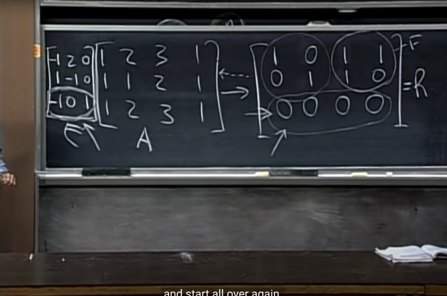</kbd></p>

> [!NOTE]
> Ok, quay lại đây, nhớ rằng ta đang đi tìm basis của nullspace  của A.T (hay còn
> gọi là `left-nullspace` của A)
>
> Thế thì như đã nói, ta không cần phải transpose A, để rồi tìm basis của nullspace
> của A.T bằng các xét solution của  (A.T)y `=` 0, tức là làm theo cách thông thường
> khi tìm nullspace của A.
>
> Mà ở đây ta đang nói rằng quá trình elimination từ A trở thành R CŨNG ĐÃ CÓ
> REVEAL THÔNG TIN VỀ NULLSPACE CỦA A.T RỒI. Đó là:
>
> Như mới nói quá trình elimination tương đương với việc nhân `E` với A để có R. Và
> như vừa nói xong, phương pháp Gaussian Jordan sẽ cho ta biết `E` là gì (là cái mà
> I trở thành sau khi cũng apply các bước elimination biến A thành R). Nên gs mới
> lẩm nhẩm apply các bước như vậy với I để có matrix `E` như trên.
>
> Rồi, thế thì, EA `=` R. Và đây chính là lúc mà quá trình elimination biến A thành R
> cũng reveal thông tin cho ta biết basis của nullspace của A.T đây:
>
> Đầu tiên, nhớ lại định nghĩa row vector r1 (1xm) nhân với matrix A (mxn),  chính là
> tạo ra một row bằng cách linear combination các row của A với các coeff là các
> phần tử của r1. Và matrix `E` (3xn) có 3 row r1, r2, r3 thì khi nhân `E` (3xm) với A
> (mxn) chính là tạo matrix mà mỗi hàng là linear combination của các hàng của A
> với coeff là giá trị của vector hàng tương ứng của `E:`
>
> Tức EA `=` R, thì hàng 1 của R chính là linear combination các hàng của A dùng
> coeff là hàng 1 của `E,` hàng 2 của R chính là linear combination của A với coeff là
> hàng 2 của `E,....`
>
> Vậy thì **hãy nhìn hàng 3 của R, là vector zero**. Có nghĩa là **TA CÓ LINEAR
> COMBINATION CỦA CÁC HÀNG CỦA A VỚI HỆ SỐ LÀ HÀNG 3 CỦA `E` TẠO RA
> KẾT QỦA ZERO.**Thì điều này theo định nghĩa của nullspace của A.T là mọi vector y khiến `A.Ty=0`
> tương đương mọi vector y khiến y.T@A `=` 0, tương đương mọi vector y mà hệ số
> của nó sẽ tạo linear combination các hàng của A cho ra zero. Thế thì theo **đó,
> ROW 3 CỦA `E` CHÍNH LÀ MỘT VECTOR TRONG NULLSPACE CỦA A.T
>
> Rồi, bây giờ ta sẽ chứng minh nó cũng chính là basis:**Là bởi như bài trước ta đã cũng nhau chứng minh để đi đến kết luận là
> **dimension của nullspace của A.T sẽ là m `-` r**. Vậy thì đối với matrix A này m `=` 3,
> ```text
> n = 4 và rank = 2. Vậy dimension của nullspace của A.T = m-r=3-2 = 1
> ```
>
> À, vậy **dimension của nullspace của A.T `=` 1** nên basis của nullspace của A.T
> cũng **CHỈ CÓ 1 VECTOR**(vì như đã biết theo định nghĩa dimension của vector
> Space là số vector trong basis của nó). Từ đó suy ra, **cái row thứ 3 của `E` chính
> là một basis của nullspace của A.T
>
> Và từ đó ta đã biết cách thông qua elimination biến A thành R mà cũng giúp
> review được basis của nullspace của A.T**

<br>

<a id="node-287"></a>

<p align="center"><kbd>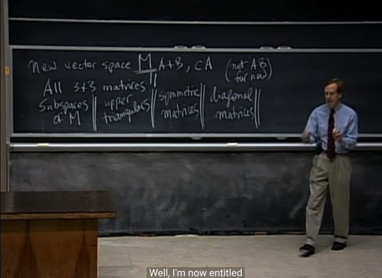</kbd></p>

> [!NOTE]
> Rồi, những phút cuối gs mở rộng vấn đề qua một vector
> space  mới: Từ những bài trước tới nay, đại khái là ta làm
> việc với vector space nếu thỏa tính chất
>
> **Hai vector cộng nhau vẫn trong vector space**. **Scale vector
> thì vẫn được vector nằm trong space**.
>
> Ví dụ hai vector v1,v2 có 3 phần tử. (thuộc R3). Thì `v1+v2,`
> hay v1*c đều tạo một vector cũng có 3 phần tử (tức cũng
> thuộc R3)
>
> Thì tương tự vậy, ta xét 2 matrix 3x3: V1, V2. Thì `V1+V2,`
> hay V1*c đều cho ra matrix 3x3 khác. **Do đó có thể xét
> vector space R3x3: tập hợp mọi matrix 3x3**. Thì nếu V1,V2
> thuộc R3x3 thì ta cũng có **V1+V2, V1*c cũng thuộc R3x3**.
>
> Đây chính là sự **mở rộng vector space R^n thành R^nxn**
>
> *Tạm thời gs đề nghị bỏ qua một tính chất là V1 có thể
> nhân với V2 (trong bảng là A nhân B)

<br>

<a id="node-288"></a>

<p align="center"><kbd>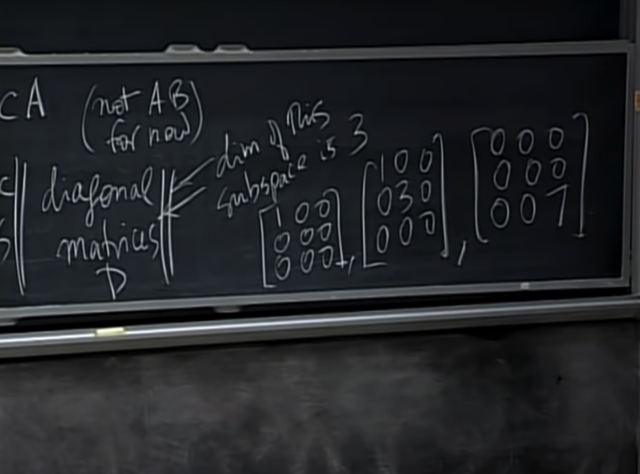</kbd></p>

> [!NOTE]
> Thế thì ta cũng sẽ có **các subspace** của M: như:
>
> (nhắc lại M là tập hợp mọi matrix 3x3)
>
> **mọi matrix U (3x3)**, hay
>
> mọi **symmetric 3x3 matrix**
>
> mọi **diagonal 3x3 matrix**. D
>
> Thì trong đó ta sẽ cùng nhau tìm basis và dimension
> của các subspace này trong bài sau
>
> ví dụ như ta cũng sẽ thấy dimension của D là 3, có
> nghĩa là 3 basis của nó sẽ gồm 3 matrix như này.
>
> rồi ta cũng sẽ thông qua dimension để làm rõ việc
> D sẽ chứa các vector subspace kia ra sao

<br>

