# Lecture 11: Matrix Spaces; Rank 1; Small World Graphs

📊 **Progress:** `33` Notes | `34` Screenshots

---

<kbd></kbd>

 

<kbd></kbd>

> [!NOTE]
> Rồi, cuối bài trước gs đã đề nghị ta**xét đến một loại vector
> space mới**, mà trong đó thứ mà ta làm việc với thật ra**không phải vector**, **mà là matrix**.
>
> Nhưng mình vẫn có thể **add** chúng, **scale** chúng. Có
> thể gọi nó là **matrix space** cũng được. Và gs cho rằng
> khi nào mà ta **vẫn đảm bảo hai khả năng add và scale
> này** (again, tạm bỏ qua việc ta có thể nhân hai matrix) thì
> **ta sẽ thấy các tính chất mà mình đã làm bữa giờ với
> normal vector space vẫn đúng**

 

<kbd>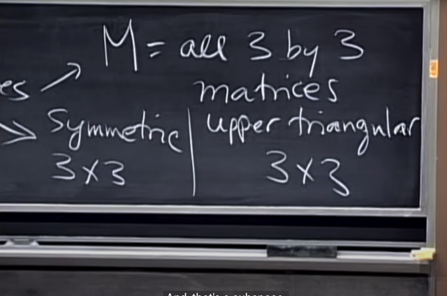</kbd>

> [!NOTE]
> Và ta sẽ xét M là **mọi (linear combination) của các 3x3
> matrix**. Với hai subspace là các **symmetric matrix** và **upper
> triangular matrix**
>
> Tại sao chúng là subspace? vì chúng vẫn thỏa add và
> scale rule:
>
> **Cộng** **hai matrix đối xứng** hay **nhân nó với một scalar** thì
> vẫn được **một matrix đối xứng**
>
> tương tự, **cộng** hai matrix U hay **scale** nó bởi scalar thì **vẫn
> được một upper triangular matrix**

 

<kbd>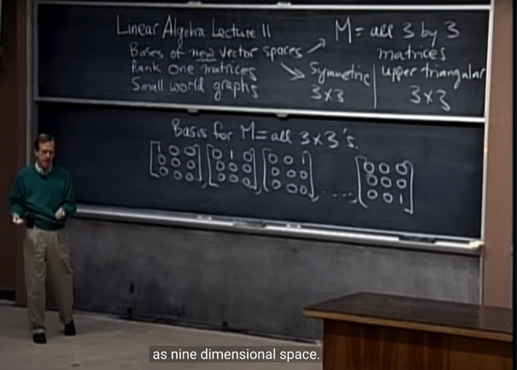</kbd>

> [!NOTE]
> Thế thì ta sẽ **đi tìm basis** cũng như từ đó biết được
> dimension  của M
>
> Thế thì cũng như không gian R3 sẽ dễ thấy có một basis
> cơ bản là (1 0 0), (0 1 0), (0 0 1) (chính là standard basis)
>
> Thì với **R3x3** ta cũng có một bộ basis gồm **9** matrix như
> này

 

<kbd>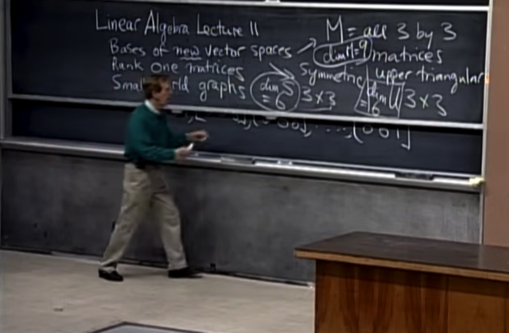</kbd>

> [!NOTE]
> Vậy **dimension của M là 9**, còn S (các symmetric 3x3
> matrix) sẽ có dim là 6, vì cần 6 con số để định nghĩa ra một
> symmetric matrix: 3 trên đường chéo, 3 ở trên đường chéo
> (đồng thời là ở dưới vì đối xứng) nên basis của S sẽ có 6
> matrix
>
> tương tự, **dimension của U là 6.**
>
> Thế thì gs nói rằng với U thì ta bỗng nhiên thấy rằng trong
> 9 matrix basis của M cũng chứa 6 matrix basis của U,
> nhưng với S thì không được vậy,

 

<kbd>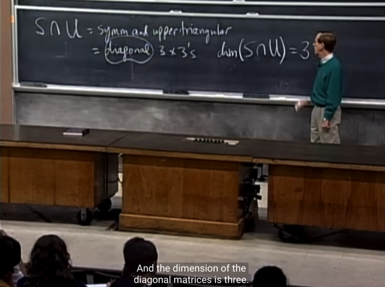</kbd>

> [!NOTE]
> Rồi, thế **S intersect U, sẽ là space các diagonal matrix D.**
> (Matrix vừa **đối xứng** mà còn có **nửa dưới đường chéo
> bằng 0** thì chỉ có thể là matrix **chéo** - cả trên cả dưới 
> đường chéo đều bằng 0)
>
> Và D có dimension = 3 (vì chỉ cần 3 số để define một diagonal
> matrix 3x3, nên standard basis của nó sẽ có 3 matrix)
>
> Chỗ này có lẽ tự nhủ mình đừng bối rối khi ta xác định
> dimension dễ dàng như vậy, trong khi mấy bữa trước để
> xác định dimension của vector space, ta phải nào là xác
> định basis của nó, và đếm số vector trong basis thì mới
> có dimension. Lí do là vì cái này ta đang xét các space
> rất chung.
>
> Cũng như nếu hỏi dimension của R3 thì đương nhiên là
> 3, vì cần 3 con số (tọa độ) mới định nghĩa ra một vector
> trong R3 nên standard basis sẽ có 3 vector [1 0 0], [0 1 0], 
> [0 0 1]. Thì ở đây cũng tương tự vậy.

 

<kbd>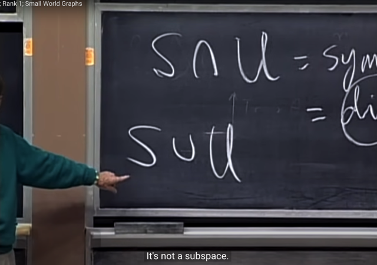</kbd>

> [!NOTE]
> Thế thì chuyển qua **S union U**, gs hỏi **tại sao nó không phải
> là một subspace?**
>
> Me: Rất đơn giản, là vì theo định nghĩa vector space phải
> thỏa mãn hai tính chất: cộng hai vector hay scale vector với
> một số thực thì vẫn được vector mới nằm trong space.
>
> Vậy mà với S u U - **tập hợp các matrix Symmetric HOẶC
> Upper Triangular**, giả sử ta lấy một S matrix cộng với một U
> matrix, ta sẽ ra một matrix không còn symmetric cũng
> không còn upper triangular, nó đã nằm ngoài S u U.
>
> Do đó, S u U ko phải là vector space
>
> ====
>
> GS: đúng vậy, nó giống như ta có hai plane nhưng khác
> hướng nhau (S, và U đều có dimension là 6) nhưng chỉ lấy
> hai plane đó không đủ để có / lấp đầy một space

 

<kbd>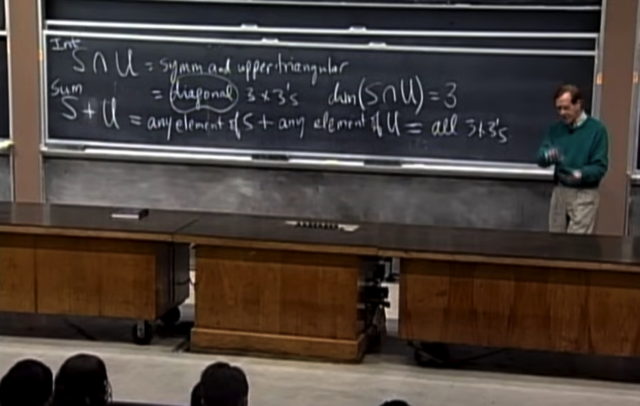</kbd>

> [!NOTE]
> Thế thì gs cho rằng thay vào đó,**ta sẽ quan tâm đến S +
> U**: với định nghĩa là tập hợp **mọi matrix đối xứng cùng với
> mọi matrix upper triangular**
>
> Thì S + U như trên sẽ cho ra cái gì?
>
> tập hợp mọi ma trận đối xứng, cùng với mọi matrix upper
> triangular sẽ làm thành **mọi matrix.**Có thể hiểu là bởi bất
> kì matrix 3x3 nào cũng có thể biểu diễn bởi một matrix đối
> xứng S + một matrix U. (Ngẫm một chút sẽ thấy đúng)

 

<kbd>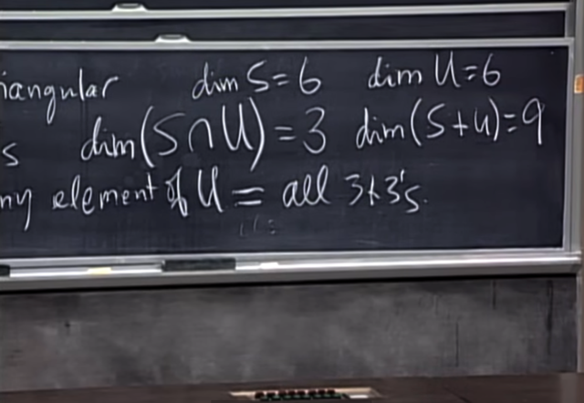</kbd>

> [!NOTE]
> Và từ đó ta thấy **dimension của của S intersect U là 3**,
> **dimension của S + U là 9** (vì S + U là tạo thành mọi
> matrix 3x3)
>
> Trong khi đó **dim S** và **dim U = 6**.
>
> gs cho rằng ta **đã thấy một công thức xuất hiện**

 

<kbd></kbd>

> [!NOTE]
> đó là **dim S + dim U = dim (S intersect U) + dim (S + U)**

 

<kbd>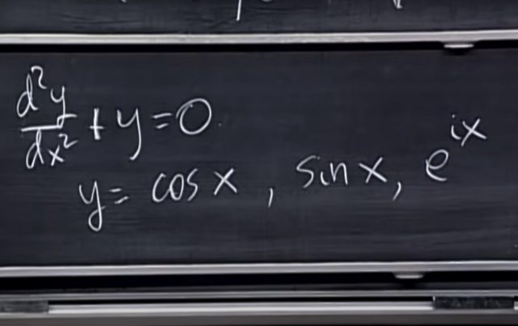</kbd>

> [!NOTE]
> Tiếp theo gs xét **differential equation** (phương trình vi
> phân) này.
>
> Các y thỏa (tức là solution) phương tình này gồm có 
> y = cos(x), sin(x), e^ix

 

<kbd></kbd>

> [!NOTE]
> đại khái là ta **có thể hiểu khái niệm vector space rộng
> hơn**
>
> Như cosx, sinx dù là function nhưng nó **vẫn thỏa các tính
> chất của vector space** như **cộng** nó và scale nó **vẫn
> tạo ra cái khác cũng là solution** - **cũng thuộc solution
> space** của equation này.

 

<kbd>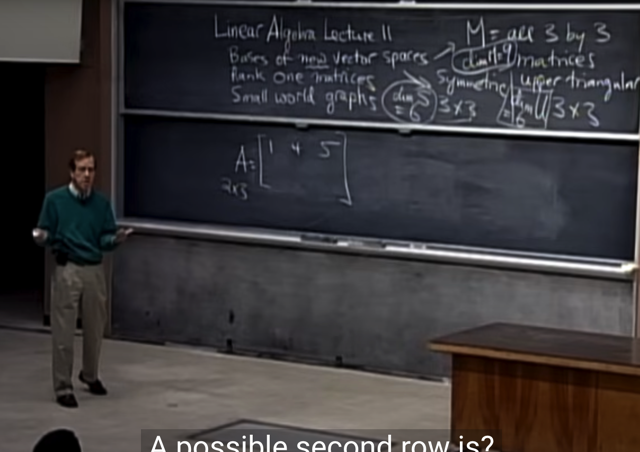</kbd>

> [!NOTE]
> tiếp, gs muốn **bàn sâu hơn về rank**, cho **matrix A (2x3)**,
> câu hỏi là, hàng 2 có thể như thế nào **để rank A = 1**.
>
> Me: hàng 2 **chỉ việc là linear combination của hàng 1** để A
> **chỉ có 1 independence row** là được

 

<kbd>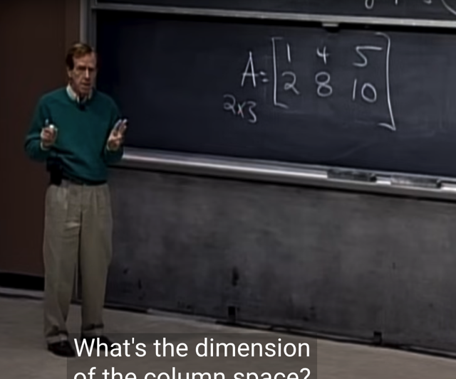</kbd>

> [!NOTE]
> Gs: Đúng, vậy basis của row space là?
>
> Me: 1st row
>
> Gs: correct, vậy còn cols space? Đầu tiên là cols space
> có dimension bao nhiêu?
>
> Me: 1 luôn, vì đã nói rank A = 1, mà như bài trước đã
> biết cols space và row space của A đều có cùng dimension.

 

<kbd>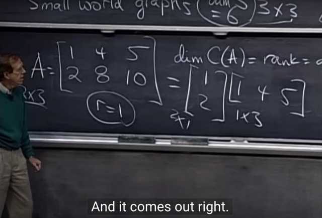</kbd>

> [!NOTE]
> Gs: correct
>
> Gs: Thế thì tôi có thể viết nó thành dạng hai matrix này nhân
> nhau - matrix bởi 1 cols và matrix bởi 1 row

 

<kbd>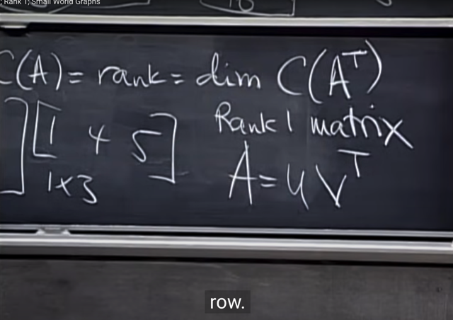</kbd>

> [!NOTE]
> Và từ đó **cho ta một kiến thức** là: **matrix có rank 1** sẽ **có
> thể biểu diễn dưới dạng một phép nhân bởi 1 vector cột
> nào đó của nó u và một vector hàng nào đó của nó (v)**:
>
> **A = u(v.T)**
>
> Từ đây mình liên hệ cái vụ PEFT = Parameter Efficient
> Finetuning của LLM có nhắc đến các low-rank matrix
> (phương pháp LoRA), thì bây giờ mình đã có thể hiểu tại
> sao nó được gọi là**low-rank matrix**, à bởi vì nó là matrix
> kết quả của việc **nhân một vector cột với một vector hàng**

 

<kbd>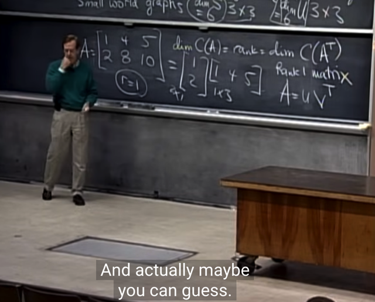</kbd>

> [!NOTE]
> và gs cho ta biết rằng **rank 1 matrix là building block của
> mọi matrix rank cao hơn**. Và việc tính determinant,
> eigenvector của rank 1 matrix đều dễ, sau này sẽ thấy.
>
> Và giả sử mình có một **matrix 5x17 có RANK 4**, thì ta
> **LUÔN CÓ THỂ BREAK NÓ THÀNH COMBINATION CỦA
> 4 CÁI RANK 1 MATRIX
>
> Và 4 CÁI RANK 1 MATRIX ĐÓ SẼ LÀ BASIS CỦA MỌI
> RANK 4 MATRIX**- 4 cái rank 1 matrix đó sẽ có thể tạo
> nên mọi rank 4 matrix

 

<kbd></kbd>

> [!NOTE]
> Từ đó dẫn đến một câu hỏi đó là, vậy **tập hợp các rank 4
> matrix 5x17 đó có là một subspace không?**

 

<kbd>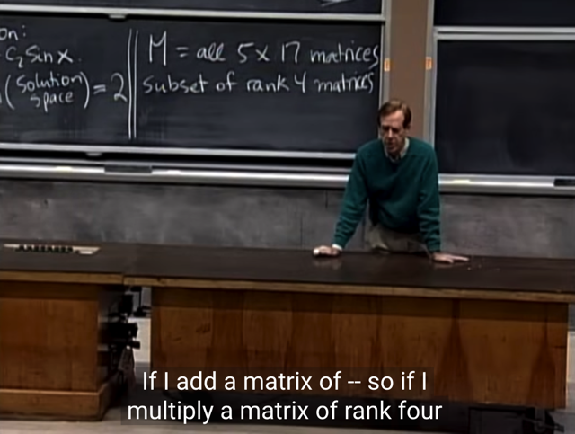</kbd>

> [!NOTE]
> Hỏi lại, cho **M là mọi 5x17 matrices** là một vector space (vì
> cộng hai matrix hay nhân matrix với một số đều tạo một 5x17
> matrix mới = nằm trong space, nên M là vector space) thì
> **subset mọi rank 4 [5x17] matrices có phải là vector space
> không?**
>
> Vậy đầu tiên xem **thử cộng hai rank 4 matrix 5x17** **có cho
> ra một rank 4 matrix 5x17 không?**
>
> Me: Thử lập luận vầy, như gs vừa nói, cho hai rank 4
> matric  5x17. Có nghĩa là chúng đều có 4 independent
> cols. Cho rằng với V là v1,v2,v3,v4 và với U là u1,u2,u3,
> u5. và matrix U+V sẽ có các cols là v1+u1, v2+u2, v3+u3,
> v4+u4, v5+u5.
>
> Thì có vẻ như là, có thể đoán là có thể ta sẽ 5 cols của U+V
> là independence -> U+V có rank = 5

 

<kbd>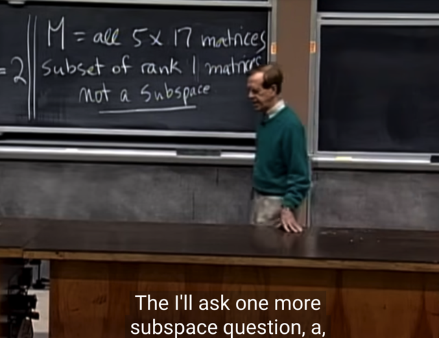</kbd>

> [!NOTE]
> gs: đúng vậy,**không phải là subspace**. Ví dụ như **cộng hai
> matrix rank 1 cũng chưa chắc ra matrix rank 1**, mà khả
> năng cao ta sẽ ra matrix rank 2

 

<kbd>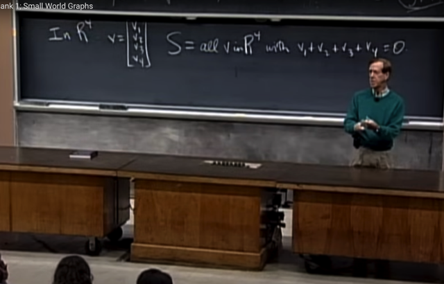</kbd>

> [!NOTE]
> Tiếp, ta xét thử set chứa **mọi R4 vector mà tổng
> component của nó là 0**. Gs: Tại sao nó là subspace?
>
> Me: Vì giả sử **xét u, v thuộc S**, thì **xét m = c1*u+c2*v.** Ta sẽ
> có tổng các component của m:
>
> c1*u1 + c1*u2 + c1*u3 + c1*u4 + c2*v1 + c2*v2 + v2*v3 +
> v2*v4
>
> = **dễ thấy cũng sẽ = 0** => m **cũng sẽ thuộc S**, nên thỏa hai
> tính chất của vector space: Cộng hai vector và scale vector
> thuộc S đều cho ra thêm một vector thuộc S

 

<kbd>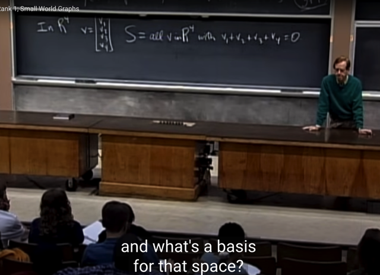</kbd>

> [!NOTE]
> Gs: Ok, vậy **dimension bao nhiêu? và basis của S?**

 

<kbd>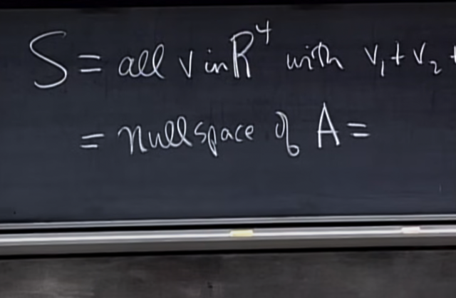</kbd>

> [!NOTE]
> Gs **gợi ý** là thử nghĩ xem S (tập hợp mọi vector v sao cho
> v1 +v2 + v3 + v4 = 0) **có phải là nullspace của matrix nào
> không**. Nếu xác định được, ta sẽ phân tích matrix đó và trả
> lời được basis cũng như dimension của nullspace đó và
> cũng là của S
>
> Me: là **nullspace của (1x4) matrix A = [1, 1, 1, 1]**, vì theo
> định nghĩa nullspace của nó sẽ là mọi vector x sao cho Ax =
> 0, và như vậy với x là <x1, x2, x3, x4> thì ta sẽ có nullspace
> của A là mọi vector x sao cho x1*1 + x2*1 + x3*1 + x4*1 = 0

 

<kbd>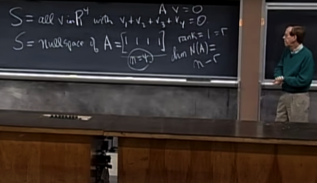</kbd>

> [!NOTE]
> GS: Correct. Và từ đó chỉ cần phân tích A.**Rank của A là 1**
> (dễ thấy, v**ì nó chỉ có 1 row**, nên c**hắc chắn row đó độc
> lập**)
>
> Và theo công thức bài trước đã biết nullspace của A (m,n) sẽ
> có dimension = **n - r = 4 - 1 = 3**. Vậy **dimension của S là 3**(hoặc không cần nhớ công thức n - r làm gì, vì chỉ cần thấy
> vì rank = 1 nên **trong 4 column chỉ có 1 pivot column**, và
> như vậy có **3 free columns** => số **special solution** của
> Ax=0 = **số vector trong basis** của nullspace = **dimension
> của nullspace** = 3.
>
> Còn giải thích theo n - r thì nên hiểu một cách bản chất hơn
> đó là ta có **rowspace** và **nullspace** **đều là subspace
> của R4** vì row vector có 4 phần tử, cũng như vì có 4 cột nên
> cần 4 component để combine các cột để thành 0. Vậy nên
> theo một định lý mà ta đã học đó là **tổng dimension của
> rowspace và nullspace sẽ bằng 4**với ý nghĩa là **rowspace
> và nullspace sẽ cover toàn bộ không gian R4**, và**chúng
> vuông góc nhau**. Vì vậy với việc ta có dimension của
> rowspace là 1 thì suy ra dimension của nullspace là 4 - 1 = 3.

 

<kbd>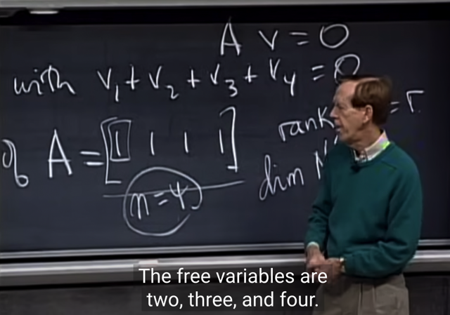</kbd>

> [!NOTE]
> tiếp, **basis của nullspace N(A) cũng là S là gì?**, thì ta biết
> để tìm basis của nullspace of A, ta sẽ tìm các **free** variable,
> thế thì dễ thấy cái pivol columns là cols đầu tiên, nên 3 cols
> tiếp theo là free cols, cũng suy ra các variable tương ứng - 
> v2,v3,v4 sẽ là free variable.
>
> Vậy ta sẽ **cho mỗi free variable lần lượt = 1**, **các free variable
> còn lại bằng 0** để**thế vào tìm pivot** var, là có được 3 special
> solution. Và đó chính là **3 basis của nullspace of A**

 

<kbd>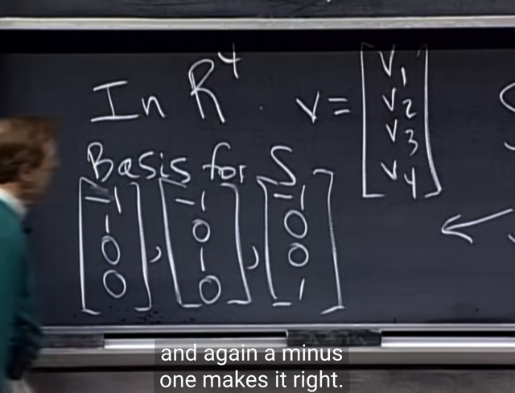</kbd>

> [!NOTE]
> Và đó cũng là basis của S

 

<kbd>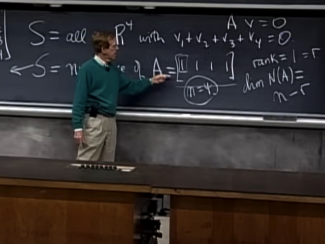</kbd>

> [!NOTE]
> Gs: Columns space của A C(A) thì sao? (Gs đang xét **4
> fundamental subspace**)
>
> Me: Như bài trước đã biết **cols space và row space đều có
> cùng dimension = rank**, nên cols space có dimension = 1.
>
> Basis của nó sẽ là pivot cols như đã biết, và đương nhiên
> nó sẽ là cột đầu tiên.
>
> Phải nói thêm cols là subspace của R1 (vì chỉ có 1
> component)

 

<kbd>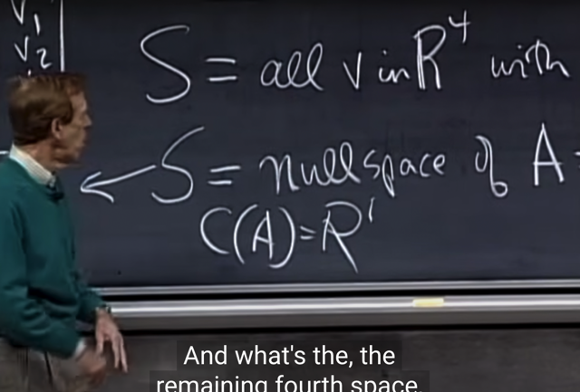</kbd>

> [!NOTE]
> và**[1] cũng chính là basis của R1**nên **cols space của A chính là R1**

 

<kbd>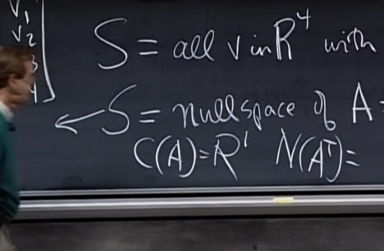</kbd>

> [!NOTE]
> và fundamental subspace cuối cùng: left nullspace /
> nullspace of A.T:
>
> Như đã biết nó là tập hợp solution của (A.T)y = 0. Mà A.T chỉ
> có 1 cols, nên y sẽ chỉ có 1 component, suy ra nullspace of
> A.T cũng là subspace của R1.
>
> Thế thì dễ thấy **chỉ có thể y = 0 thì mới khiến (A.T)y = 0**
> nên nullspace của A.T **chỉ chứa zero vector**.
>
> Đối chiếu với bài trước, ta có**dimension của N(A.T) là m - r
> = 1 - 1 = 0** là **cũng có thể suy ra nullspace của A.T chỉ chứa
> zero.**

 

<kbd>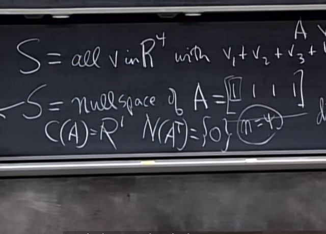</kbd>

> [!NOTE]
> Đúng vậy, nullspace của
> A.T chỉ chứa zero và có dim = 0

 

<kbd>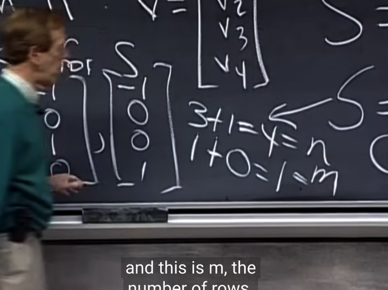</kbd>

> [!NOTE]
> Và gs cũng cho biết các **vector space mà chỉ chứa 1
> điểm zero đó có dimension = 0, và basis cũng rỗng.** 
>
> Để rồi mọi thứ đều thỏa với công thức bữa trước:
>
> C(A) và N(AT) đều là subspace của R1:
>
> dim C(A) + dim N(AT)  = 1 + 0 = r + m - r = m = 1
>
> Và 
>
> C(AT) và N(A)  đều là subspace của R4
>
> dim C(AT) + dim N(A) = 1 + 3 = r + n - r = n = 4

 

<kbd>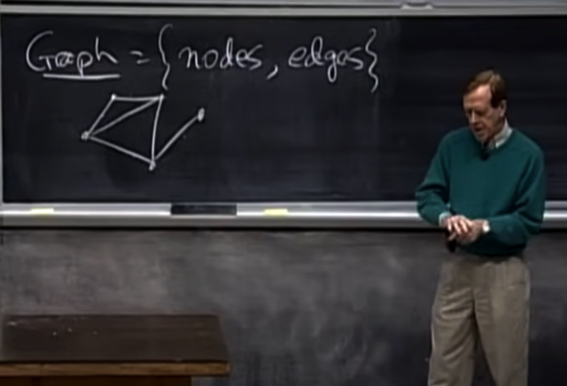</kbd>

> [!NOTE]
> những phút cuối gs nói qua Graph, nó là một set các
> **nodes** và **edges**. Và ta sẽ thấy một matrix nào đó sẽ
> đứng sau cái graph này

 

<kbd>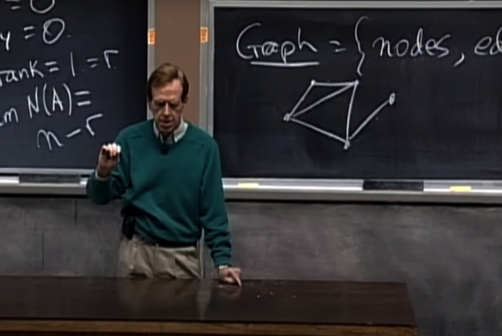</kbd>

> [!NOTE]
> thế thì lấy ví dụ một **lớp học**, mỗi**student là một node**, và
> mỗi khi **hai đứa là bạn thì ta có một edge**, thì ta sẽ có
> một **graph**.
>
> Hay rộng hơn, một graph như vậy ở phạm vi toàn  nước
> mỹ, chẳng hạn. thì câu hỏi là: how far giữa hai node.
>
> gs lấy ví dụ, giữa ông và Clinton là 2, vì ông quen với
> ông bạn làm Senator, mà ông đó quen ông Clinton.

 

<kbd></kbd>

> [!NOTE]
> bài sau ta sẽ tìm hiểu **để thấy về mặt toán học**, **số bước để
> đi từ một người tới một người khác trong cái graph đó có
> thể giảm xuống nhanh đến mức nào**, ví dụ như gs nói vui
> rằng bằng cách học lớp 1806 này mà khoảng cách từ các
> bạn tới Clinton drop xuống chỉ còn 3 rất nhanh chóng (vì
> quen giáo sư - người có distant tới Clinton là 2

 

