# Lecture 12: Graphs, Networks, Incidence Matrices

📊 **Progress:** `37` Notes | `41` Screenshots

---
<a id="node-325"></a>

<p align="center"><kbd></kbd></p>

<br>

<a id="node-326"></a>

<p align="center"><kbd></kbd></p>

> [!NOTE]
> mở đầu đại khái là gs nói rằng "hổm rày" khi ông **đưa ra
> các matrix**, thì đúng ra phải nói rằng**chúng không tự
> nhiên mà xuất hiện từ trong đầu của một ông thầy** nào đó,
> ý nói, nó**đều xuất phát từ các bài toán thực tế.**
>
> Ví dụ như**một nhà hóa học** nào đó đang giải quyết một vấn
> đề hóa học sẽ **dùng row reduction để làm việc với một
> matrix** giúp tính toán ra**kết quả của phương trình hóa học**
> (đại khái vậy)
>
> Và hôm nay gs sẽ nói đến **graph** `-` là **mô hình toán học ứng
> dụng** quan trọng nhất mà **phiên bản rời rạc** của nó là graph
>
> "most important model in applied math and the discrete
> version is a graph"

<br>

<a id="node-327"></a>

<p align="center"><kbd>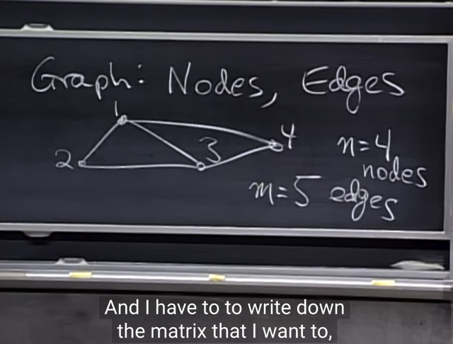</kbd></p>

> [!NOTE]
> Như đã nói, **đằng sau một graph** **là một matrix**, ví dụ
> như cái này, có **4 nodes** `-` sẽ ứng với**4 cột** và **5 edges** `-`
> ứng với **5 hàng** (matrix [m,n] `=` [5,4])

<br>

<a id="node-328"></a>

<p align="center"><kbd>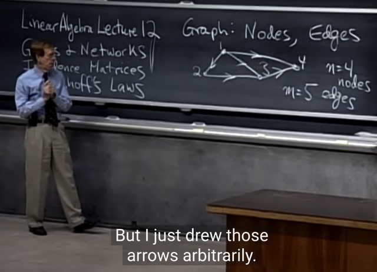</kbd></p>

> [!NOTE]
> Và ta cũng sẽ (một cách tùy ý `-` arbitrarily) **tạo nên các
> hướng** để đại ý là **quy định đi từ đâu đến đâu là dương**
> hay âm

<br>

<a id="node-329"></a>

<p align="center"><kbd></kbd></p>

> [!NOTE]
> Và ta cũng **đánh số các edges**

<br>

<a id="node-330"></a>

<p align="center"><kbd>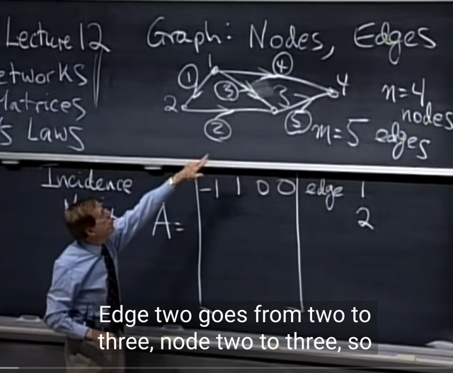</kbd></p>

> [!NOTE]
> từ đó ta định nghĩa ra matrix (gọi là**INCIDENCE matrix**) như
> sau:
>
> Như đã nói, **mỗi hàng là một edge**. **Mỗi cột là một node**
> Vậy thì **hàng 1** sẽ là về cái **edge 1**, trong đó ta **đi từ Node
> 1 đến Node 2**, và **không đụng gì tới node 3, 4.** Nên nó sẽ
> là `[-1` 1 0 0]
>
> [**-1** (rời node 1), **+1** (tới node 2), **0** (không liên quan gì
> node 3), 0 (không liên quan gì node 4)]

<br>

<a id="node-331"></a>

<p align="center"><kbd>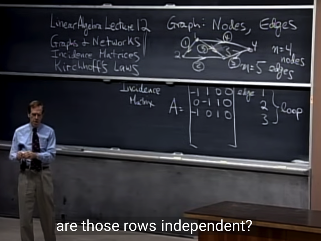</kbd></p>

🔗 **Related:** [LECTURE 12: GRAPHS, NETWORKS, INCIDENCE MATRICES](untitled.md#node-358)

> [!NOTE]
> Hai row tiếp theo cũng tương tự và có thể hiểu tại sao lại
> vậy (nó sẽ ứng với edge 2, 3)
>
> Tại đây gs chỉ ra rằng, **3 edge này tạo nên một loop** (vòng
> lặp khép kín)
>
> Câu hỏi là, ta có thể nhìn nhận gì về 3 row này, **chúng có
> độc lập không?**
>
> Me: Rõ ràng là **không**, vì có thể thấy **row 3 `=` row 1 `+` row 2**
>
> Gs: Correct. Thế thì điều này gợi ý rằng **loop sẽ biểu hiện
> một bộ các row `/` edge có tính chất linearly dependent.**

<br>

<a id="node-332"></a>

<p align="center"><kbd>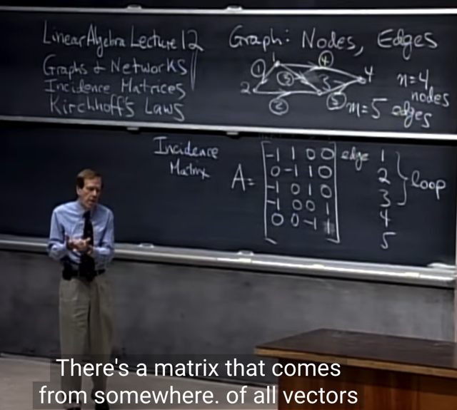</kbd></p>

> [!NOTE]
> Thế thì khi hoàn thành matrix này ta sẽ có thể đưa ra một số
> nhận định như:
>
> **Graph** càng lớn (**càng nhiều nodes, edges**) thì **matrix
> càng lớn**.
>
> Nhưng **mỗi row chỉ có 2 chỗ là khác 0**, vì như đã nói,
> **mỗi row thể hiện một edge**, và **edge chỉ đi từ một node
> đến một node**, nên sẽ **chỉ có hai vị trí khác 0**ở mỗi row.
>
> Và do đó matrix (m, n) với m row sẽ **chỉ có 2*m vị trí khác
> 0**. Do đó nó **rất sparse** (thưa thớt)
>
> Tuy nhiên nó **phản ánh một cấu trúc nào đ**ó.

<br>

<a id="node-333"></a>

<p align="center"><kbd></kbd></p>

> [!NOTE]
> Câu hỏi đầu tiên ta sẽ tìm hiểu **nullspace của A**.
>
> Me: Thử lập luận, như đã biết, để tìm nullspace, tức**vector
> space chứa mọi solution của Ax `=` 0**. Đầu tiên A có 4 cột,
> nên **nullspace của A là subspace của R4**.
>
> Tiếp, để tìm nullspace, ta sẽ **xác định pivot cols/variable**
> của  A, cũng như **free cols/variable.**
>
> Từ đó, **với mỗi free variable**sẽ **tương ứng một special
> solution** đồng nghĩa **một vector trong basis của nullspace.**

<br>

<a id="node-334"></a>

<p align="center"><kbd></kbd></p>

> [!NOTE]
> Gs hỏi **sẽ như thế nào nếu các cols independent:**
>
> Me: Tiếp nối lập luận trước,**nếu mọi cols đều
> independent**, thì tức là **chúng đều là pivots**, và do đó
> **không có free cols**. Dẫn đến **không có vector nào
> trong basis** =>**nullspace chỉ chứa zero**, và mang ý
> nghĩa là **solution duy nhất của `Ax=0` chính là x=0**

<br>

<a id="node-335"></a>

<p align="center"><kbd>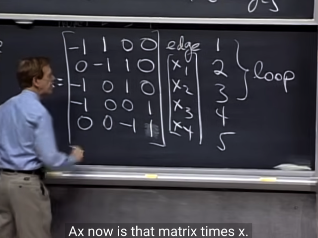</kbd></p>

> [!NOTE]
> Ta sẽ **đi tìm nullspace của A**, đầu tiên ta có thể **triển
> khai Ax** ra như vầy (nhớ lại matrix A nhân vector x sẽ
> là**linear combination của các A's columns** với **coeffs
> là các component của x**

<br>

<a id="node-336"></a>

<p align="center"><kbd>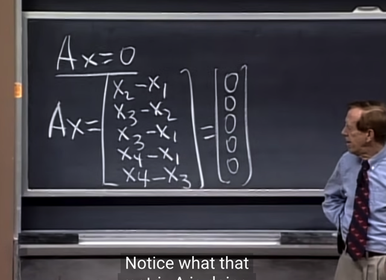</kbd></p>

> [!NOTE]
> Gs nói kết quả khi nhân A và x ta có một matrix (matrix 1
> cột, hay vector) trong đó giá trị của nó là **khác biệt giữa
> các nodes** (the differences across every edges).
>
> Có nghĩa là, tại **mỗi node sẽ có giá trị nào đó là x1,x2,..
> x4**. thì vector Ax sẽ mang giá trị là **các chênh lệch giá trị
> giữa các node**.
>
> Ví dụ phần tử đầu tiên sẽ là**chênh lệnh giá trị của node 2
> so với node 1 (x2-x1)**. Nguyên nhân cũng bởi hàng đầu
> tiên của A mô tả **edge giữa node 1 và node 2**

<br>

<a id="node-337"></a>

<p align="center"><kbd></kbd></p>

> [!NOTE]
> Đại khái là**x** sẽ thể hiện những **ĐIỆN THẾ tại nodes**.
> (Có thể hiểu gs đang **mượn ngữ cảnh vật lí `-` điện** để
> nói về mô hình này cho dễ hiểu, potential `=` điện thế)
>
> Thế thì thông qua matrix A, ta có vector chứa các
> c**hênh lệch giá trị potential `-` chính là HIỆU ĐIỆN THẾ 
> của các cặp node.**

<br>

<a id="node-338"></a>

<p align="center"><kbd>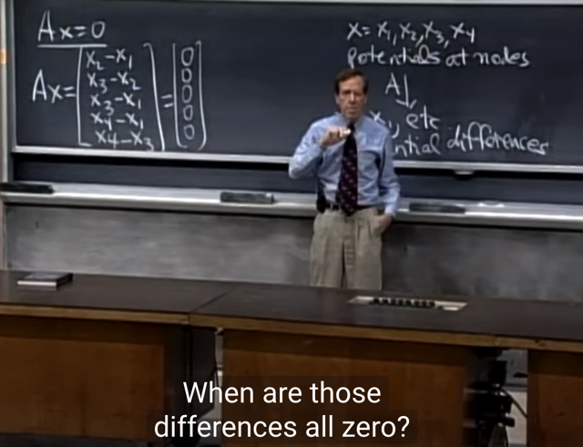</kbd></p>

> [!NOTE]
> Câu hỏi là:**Khi nào thì mọi chênh lệch giữa các potential
> đều `=` 0**.
>
> Thì đương nhiên là**khi mọi phần tử của vector x đều
> bằng 0** (x1,x2...x4 đều bằng 0) thì mọi chênh lệch cũng
> bằng 0.
>
> Cũng có nghĩa là đang nói đến một việc mà ta đã biết:
> **Nullspace là một vector space, nên luôn chứa zero**.
> Cũng vì vậy **zero luôn là một solution của Ax=0**. Thì cái
> này không có gì đáng nói.

<br>

<a id="node-339"></a>

<p align="center"><kbd>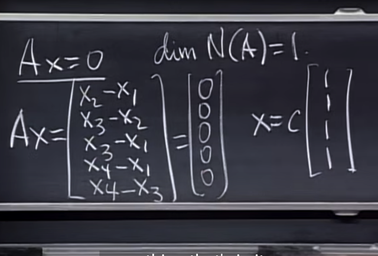</kbd></p>

> [!NOTE]
> **Một solution khác** có thể lấy là (1, 1, 1, 1). Và nó **cũng
> tạo một basis** luôn, để **scale nó c với c sẽ cho ra một
> solution**
>
> **Tại sao nói (1, 1, 1, 1) tạo một basis?**
>
> Thông thường**khi xét nullspace của A**, tức solution của
> Ax `=` 0, ta phải**tìm các pivot columns**, cũng các
> **independent cols** và **suy ra các free cols**.
>
> Để rồi **mỗi free cols sẽ ứng với một special solution**,
> cũng chính là**ứng với một vector trong basis**. Hay nói
> cách khác,**tìm ra các free cols sẽ cho ta một basis của
> nullspace.**
>
> Và để xác định đâu là pivots columns, thì ta sẽ dùng row
> elimination để đưa A về row echelon form.
>
> Tuy nhiên**trong trường hợp** này với incidence matrix A,**có thế thấy Ax `=` 0 khi mọi phần tử của x đều bằng nhau**
> ```text
> bởi vì Ax = <x2-x1, x3-x2, ....> thì để Ax = 0 thì ta suy ra
> ```
> x1 `=` x2 `=` ...x4. Do đó chỉ cần các component của x bằng
> nhau thì nó sẽ là solution. Hay nói cách tổng quát: 
>
> Hay x `=` **c***[1, 1, 1, 1]. 
>
> Từ đó **có thể kết luận [1, 1, 1, 1] là một basis**, 
> và**dimension của N(A) là 1.**

<br>

<a id="node-340"></a>

<p align="center"><kbd>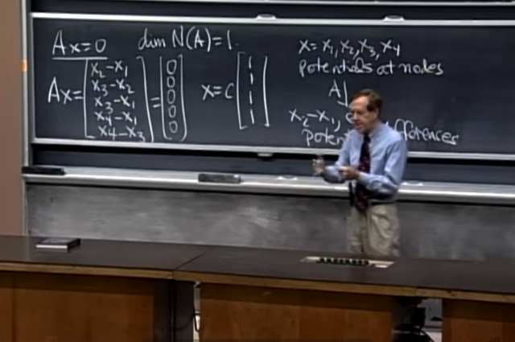</kbd></p>

<br>

<a id="node-341"></a>

<p align="center"><kbd></kbd></p>

> [!NOTE]
> Xong gs nói một hồi không hiểu nhưng ý tưởng quan trọng
> đại khái là **bằng cách set giá trị cho một node** trong hệ
> thống này **ta sẽ tính được đám còn lại**. Ví dụ cho x4 `=` 0

<br>

<a id="node-342"></a>

<p align="center"><kbd>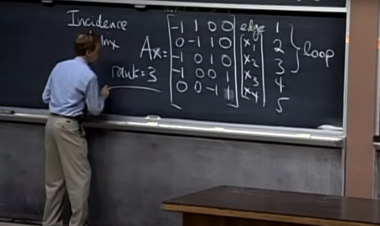</kbd></p>

🔗 **Related:** [LECTURE 10: THE FOUR FUNDAMENTAL SUBSPACES](untitled.md#node-274)

🔗 **Related:** [LECTURE 12: GRAPHS, NETWORKS, INCIDENCE MATRICES](untitled.md#node-356)

> [!NOTE]
> Tiếp, gs hỏi **rank A** bằng mấy:
>
> `->` **3**, vì đã nói **dim của nullspace N(A) là 1**. Bữa trước
> đã biết (**rank `/` dim cols space C(A) `/` dim row space C(AT))**
> `+` dims của nullspace N(A) `=` số cột n
>
> Nên dimension của cols space hay rank `=` 4 `-` 1 `=` 3.
>
> Cũng có thể lập luận vì có **dim nullspace N(A) `=` 1**, nên Ax
> `=` 0, **có 1 special solution**, đồng nghĩa **có 3 pivots** `->` **3
> linearly independent cols** `->` **basis của cols space có 3
> vector `->` dim của columns space `=` 3 `->` rank `=` 3**

<br>

<a id="node-343"></a>

<p align="center"><kbd>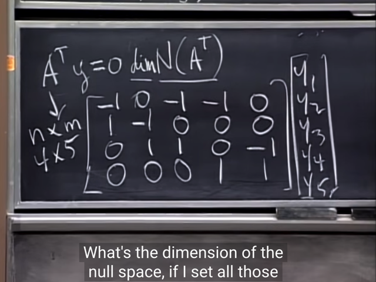</kbd></p>

🔗 **Related:** [LECTURE 10: THE FOUR FUNDAMENTAL SUBSPACES](untitled.md#node-271)

> [!NOTE]
> Rồi,**giờ xét A.T**, nullspace của A.T là gì (basis, dim)
>
> Thử lập luận: Ta biết **A có rank 3**, vậy **A.T cũng có rank
> 3**. Vì sao? Vì với matrix A thì **số linear independent
> columns** (dim của cols space) cũng**chính là bằng số
> linear independent rows** (dim của row space).
>
> Hay nói cách khác, **dimension của cols space `=`
> dimension của row space `=` rank**.
>
> Các **vector trong basis của row space của A**, khi
> transpose  **đương nhiên cũng là tạo một basis của A.T**
>
> Do đó **basis của column space của A.T** cũng có **số
> vector bằng số vector trong basis của row space của A**
> ->**dimension của column space A.T `=` rank A `=` 3**
>
> Và từ đó **A.T sẽ có 3 pivots `/` independent cols**, nên
> **đồng nghĩa với `5-3` `=` 2 free cols**. `->` 2 special solution `->`
> **Basis của nullspace của A.T `=` 2 `->` dim của N(A.T) `=` 2**====
>
> Có thể giải thích ngắn hơn: Ta biết định lý **Rank-Nullity** nói
> rằng với **matrix A [m,n] thì C(A) và N(AT) đều là subspace
> của Rm** (có m rows  nên columns có m components, cũng
> là cần m coefficients để combine m rows để cho ra 0 (ý nói
> ATy `=` 0). Và **cùng với nhau chúng sẽ cover Rm**: dim C(A) `+`
> ```text
> dim N(AT) = m từ đó dim N(AT) = m - dim C(A) = m - r = 5 -
> ```
> 3 `=` 2

<br>

<a id="node-344"></a>

<p align="center"><kbd></kbd></p>

> [!NOTE]
> Gs: Chính xác. Thế còn **basis của N(A.T)?**Lập luận: Để tìm basis của nullspace thì ta có thể**tìm
> 2 special solution của A.Ty=0**. Muốn vậy **theo cách
> thông thường**, ta sẽ**đưa A.T về row echelon**, và **xác
> định 3 pivots columns**, từ đó**xác định 2 free columns** `->`
> đó sẽ là một basis.

<br>

<a id="node-345"></a>

<p align="center"><kbd>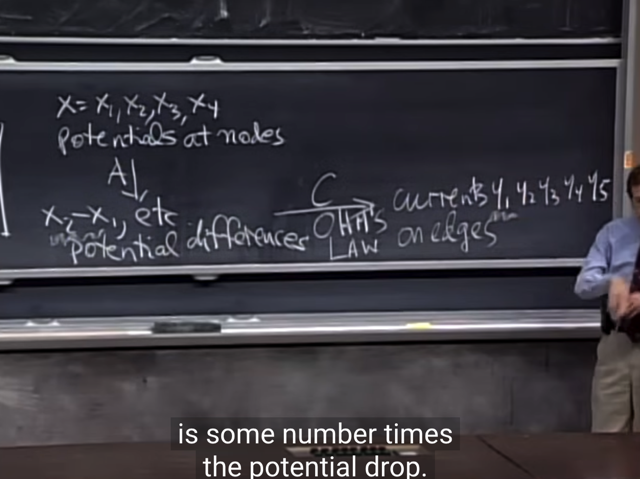</kbd></p>

> [!NOTE]
> đại khái là, gs cho biết **quan hệ giữa các hiệu điện thế
> (potentials differences)** và**các CƯỜNG ĐỘ DÒNG ĐIỆN
> (CURRENT)** trong các edges (đặt là y1, y2, ...y5) sẽ được
> phát biểu qua **ĐỊNH LUẬT OHM**:
>
> Cường độ dòng điện (Current) sẽ bằng hiệu điện thế
> (potential difference) nhân với một con số nào đó, và con
> số đó chính là ĐỘ DẪN ĐIỆN (CONDUCTANCE)
> `(=1/RESISTANCE` (điện trở))
>
> Tóm lại, đại khái là**sự thay đổi đối với potentials** **tạo ra
> current** và quan hệ đó phụ thuộc bởi **conductance** thông
> qua định luật Ohm,

<br>

<a id="node-346"></a>

<p align="center"><kbd>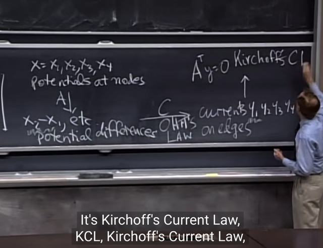</kbd></p>

> [!NOTE]
> Và phương trình**A.Ty `=` 0** liên quan đến một
> định luật có tên là **Kirchoff's Current Law**

<br>

<a id="node-347"></a>

<p align="center"><kbd>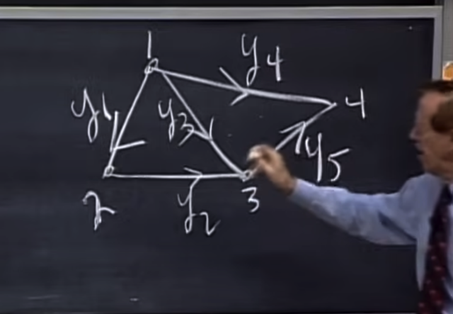</kbd></p>

<p align="center"><kbd></kbd></p>

<p align="center"><kbd>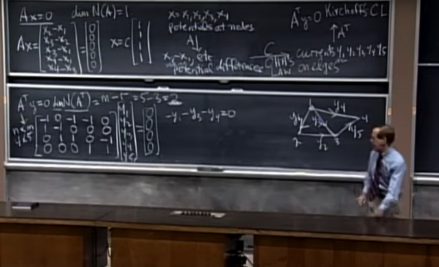</kbd></p>

> [!NOTE]
> Rồi, triển khai A.Ty `=` 0 ra (nhân y vô, để ta có equation
> ```text
> thứ nhất của A.Ty = 0 là - y1 - y3 - y4 = 0
> ```
>
> nhìn vào Graph (gs vẽ lại ở đây cho dễ nhìn) the equation
> này sẽ biểu thị định luật Kirchoff's CL rằng: **Tổng các flow
> vào hay ra khỏi một node phải bằng 0
>
> Vậy thì equation 1 là nói về node 1: tổng các current
> liên quan đến (vào hay ra) node 1 `=` 0**Ta có thể hiểu là bởi hàng 1 của A như đã thấy lúc nãy
> là `[-1` 1 0 0] mang ý nghĩa thể hiện một edge giữa node 1 và
> 2, với mũi tên đi ra node 1 và đi vào node 2. Tương tự 
> hàng 3 của A là `[-1` 0 1 0] thể hiện một edge giữa node 1 và
> 3, mũi tên đi ra node 1, đi vào node 3. Tương tự vậy. 
>
> Thì ý chính là, CỘT 1 CỦA A, chính là thể hiện các CHIỀU 
> `/` SỰ KIỆN ĐI RA HOẶC VÀO NODE 1. Nên khi nhân với y
> để có ATy thì
>
> Equation HÀNG 1 CỦA AT (CHÍNH LÀ CỘT 1 CỦA A) 
> DOT PRODUCT VỚI VECTOR Y  `=` 0 sẽ thể hiện rằng
> TỔNG CURRENT ĐI RA `/` VÀO NODE 1 SẼ BẰNG 0

<br>

<a id="node-348"></a>

<p align="center"><kbd>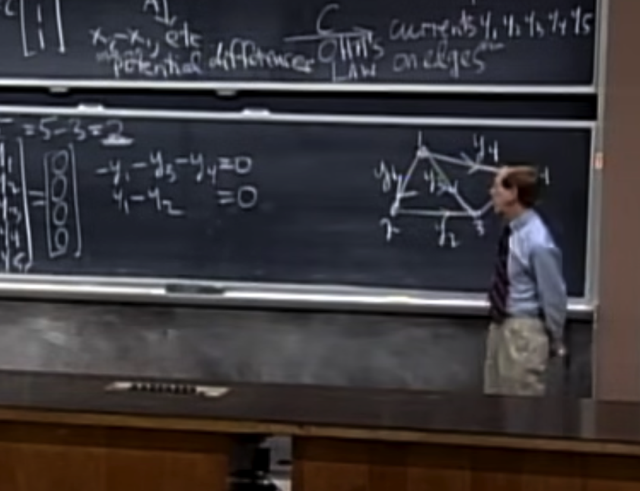</kbd></p>

> [!NOTE]
> tiếp equation thứ 2 (của A.Ty `=` 0) là `y1-y2` `=` 0, cho
> biết**tổng hai flow (current) liên quan đến node 2 phải
> bằng 0** `->` dòng đi vào (y1) bằng dòng đi ra (y2)

<br>

<a id="node-349"></a>

<p align="center"><kbd></kbd></p>

> [!NOTE]
> tương tự equation 3: tổng các
> node vào hay ra node 3 `=` 0

<br>

<a id="node-350"></a>

<p align="center"><kbd>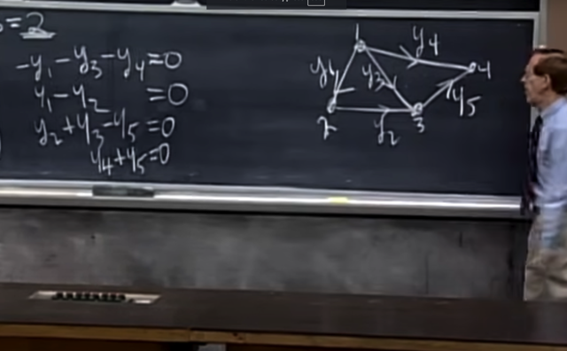</kbd></p>

> [!NOTE]
> tương tự với node 4. Gs nói rằng charge does not
> accumulate at the node, it flow around `-` có thể hiểu ý gs là
> dòng điện nó **không tụ tại một chỗ, mà chạy vòng vòng**

<br>

<a id="node-351"></a>

<p align="center"><kbd></kbd></p>

> [!NOTE]
> gs: Giờ ta sẽ **quay lại linear algebra** để trả lời câu hỏi: y
> giúp solve equation system này là gì hay solution của 
> ATy `=` 0 cũng là hỏi về left nullspace N(AT)?
>
> gs cho rằng ta đã biết cách tìm y, cũng chính là tìm
> nullspace của A.T, bằng cách dùng elimination đưa  A.T
> về echelon form U hay reduced echelon form R. Để rồi
> xác định các pivot cols, từ đó xác định các free cols, và
> ứng với mỗi free cols sẽ là một special solution, và các
> special solutions sẽ tạo một basis của nullspace of A.T `->`
> từ đó cho ta các solutions của A.Ty `=` 0 (là các linear
> combination của các vector trong basis)
>
> Có điều, bây giờ gs đề nghị xác định basis của nullspace
> of A.T **không cần dùng elimination**, mà **dựa vào Graph.**

<br>

<a id="node-352"></a>

<p align="center"><kbd>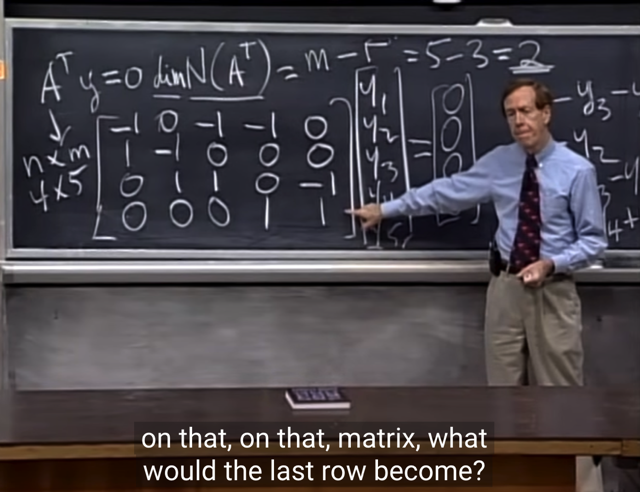</kbd></p>

🔗 **Related:** [LECTURE 12: GRAPHS, NETWORKS, INCIDENCE MATRICES](untitled.md#node-360)

> [!NOTE]
> Gs hỏi, giả sử ta làm elimination trên AT thì cái hàng cuối nó
> thành ra cái gì?
>
> Me: Zero. Lí do là vì: Ta đã lí luận ở trên để kết luận
> dimension của nullspace của A.T là 2. Thế thì, như đã biết,
> dimension của column space of A sẽ là số pivot cols,
> dimension của nullspace of A, là số free cols, nên **tổng dim
> C(A.T) `+` dim N(A.T) sẽ là số cols `=` 5**. Vậy ta có dimension
> của cols space of A là 5 `-` 2 `=`
> 3.
>
> Rồi, mà **dimension của cols space** và**dimension row
> space** là **bằng nhau và bằng rank**, nên dimension của
> row space of A.T cũng là bằng 3.
>
> Vậy có nghĩa là basis của row space of A.T có 3 vector, hay
> A.T có 3 linear independence row. Vậy thì cái **hàng cuối,
> sau khi thực hiện elimination sẽ thành 0**. (trong quá trình
> elimination, nên nhớ là sẽ **có các bước row `-` exchange**, nên
> dù thế nào thì row cuối cùng thành 0)

<br>

<a id="node-353"></a>

<p align="center"><kbd>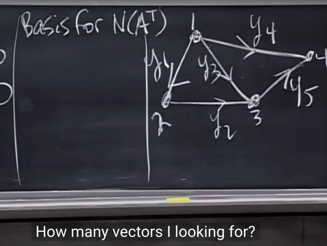</kbd></p>

> [!NOTE]
> Gs: Rồi, đúng. Elimination sẽ cho biết hết những chuyện
> đó. Nhưng giờ ta **muốn dựa vào Graph để tìm basis của
> nullspace of A.T**
>
> Ta sẽ tìm basis của nullspace of A.T N(A.T), đầu tiên gs hỏi
> **có bao nhiêu vector trong basis của N(A.T)**
>
> Me: Như đã rồi, ta đã biết dim N(A.T) `=` 2, nên basis của
> nó có 2 vector.

<br>

<a id="node-354"></a>

<p align="center"><kbd>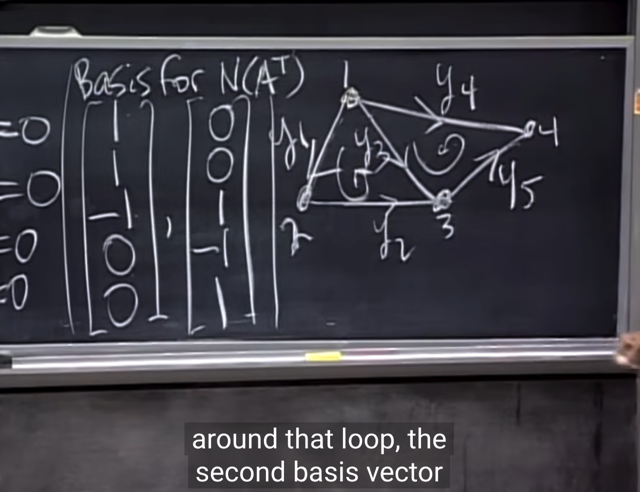</kbd></p>

🔗 **Related:** [LECTURE 12: GRAPHS, NETWORKS, INCIDENCE MATRICES](untitled.md#node-360)

> [!NOTE]
> Gs: Đúng vậy, ta cần tìm 2 vector. Thế thì, ta có thể chọn 2
> vector.
>
> Gs chọn y1 `=` 1, thì vì node 2 quy định `y1=y2` nên ta có y2 `=`
> 1.
>
> Tiếp gs cho rằng có thể **chọn y3 `=` -1** để **tạo nên một loop
> giữa node 1,2,3**. Khi đó thế vô ta sẽ tính ra y4 `=` 0, y5 `=` 0.
> Để được một solution.
>
> Tương tự, ta có thể cho loop thứ hai giữa node 1,3,4 để có
> ```text
> y3 = 1, y4 = -1, y5 = 1. Thế vào ta sẽ có y1,y2 = 0. Để rồi có
> ```
> solution thứ 2.
>
> Và **hai vector** trong **basis của N(A.T) sẽ ứng với hai
> loop**

<br>

<a id="node-355"></a>

<p align="center"><kbd>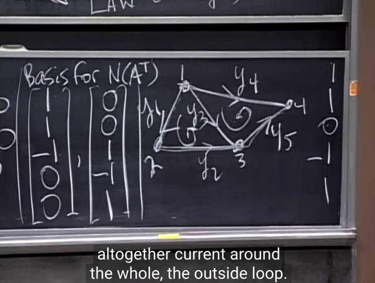</kbd></p>

> [!NOTE]
> Và gs nói rằng, ta có thể chọn một loop bự hơn giữa node
> ```text
> 1,2,3,4. Khi đó y1=1, y2=1, y3=0, y4=-1, y5=1.
> ```
>
> Tuy nhiên có thể thấy solution đó, chỉ là tổng của hai solution
> ban đầu. Và ý nghĩa trên graph đó là khi ta nhập hai loop
> nhỏ thành loop lớn thì current của edge 3 tức y3 sẽ bị khử
> để thành 0.

<br>

<a id="node-356"></a>

<p align="center"><kbd>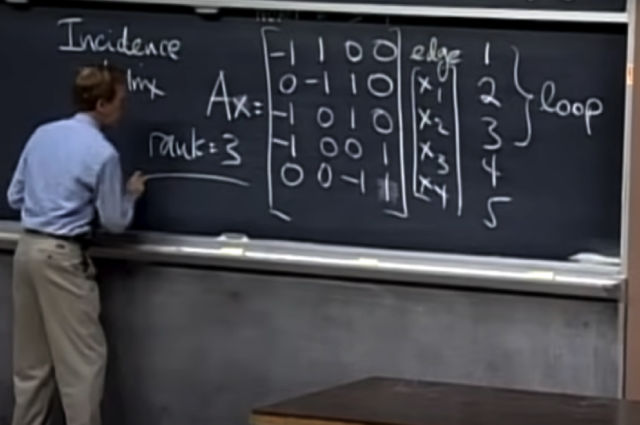</kbd></p>

🔗 **Related:** [LECTURE 12: GRAPHS, NETWORKS, INCIDENCE MATRICES](untitled.md#node-342)

> [!NOTE]
> tiếp, gs: rowspace of A: dimension bao nhiêu? 
>
> Me: 3, vì đã nói hồi nãy, rank A `=` 3, hay dim của colums
> space  `=` 3. Mà bài trước ta đã biết dim của cols space
> bằng dim row space, vì một matrix có bao nhiêu pivot
> cols cũng là bấy nhiêu pivot rows.
>
> Do đó dim của rowspace of A là 3.

<br>

<a id="node-357"></a>

<p align="center"><kbd>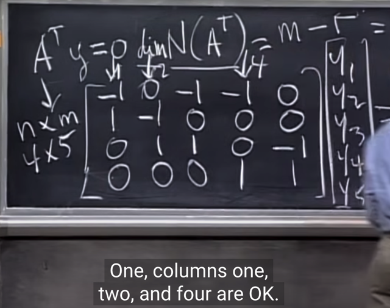</kbd></p>

> [!NOTE]
> Ok, chính xác, vậy thì đó cũng là dimension của cols
> space của A.T `=` 3
>
> Thế thì gs hỏi rằng col 1,2,3 có phải là basis không. Dễ
> thấy là 0, vì chúng không independent.
>
> Gs nói thêm rằng **chúng không independent là vì chúng
> tạo thành một loop.**
>
> Và sự thật là col 1, 2, 4 mới là independent cols

<br>

<a id="node-358"></a>

<p align="center"><kbd>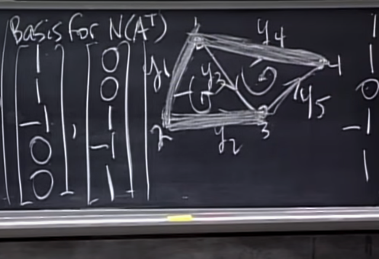</kbd></p>

🔗 **Related:** [LECTURE 12: GRAPHS, NETWORKS, INCIDENCE MATRICES](untitled.md#node-331)

> [!NOTE]
> và những **independent** cols là những columns mà**ứng
> với các cạnh (edge) của graph mà không tạo loop.**
>
> Vì như hồi đầu mình đã nhận định, **một loop sẽ tạo một
> bộ dependence nhau.**Do đó có thể kết luận một bộ vector độc lập thì sẽ ứng
> với một bộ các cạnh không tạo loop. Thế thì với graph có
> 4 nodes như đang xét thì nếu xét cả 4 cạnh y1,2,4,5 thì nó
> sẽ làm thành một loop. Nhưng {y1, y3, y4} hoặc {y2, y5,
> y4} thì không tạo loop nên chúng sẽ độc lập.
>
> Vậy **số edge tạo một bộ độc lập từ một graph có #nodes
> sẽ là #nodes `-` 1**

<br>

<a id="node-359"></a>

<p align="center"><kbd>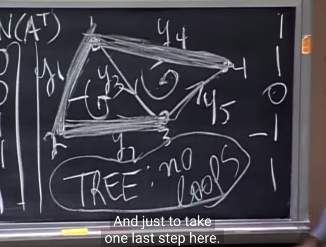</kbd></p>

> [!NOTE]
> và gs cho biết**một graph mà không tạo
> thành loop** thì sẽ gọi là **TREE**

<br>

<a id="node-360"></a>

<p align="center"><kbd>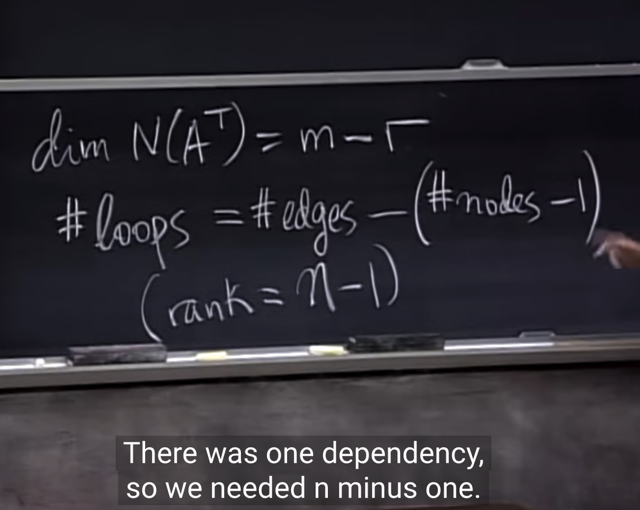</kbd></p>

🔗 **Related:** [LECTURE 12: GRAPHS, NETWORKS, INCIDENCE MATRICES](untitled.md#node-352)

🔗 **Related:** [LECTURE 12: GRAPHS, NETWORKS, INCIDENCE MATRICES](untitled.md#node-354)

> [!NOTE]
> thế thì từ đây, từ dim N(A.T) `=` m `-` r mà mình đã nhận
> định ta sẽ có:
>
> Hồi nãy ta nhận định: **dimension của nullspace of A.T
> chính là số loop `=` 2**
>
> **m, là số hàng của A `-` ứng với số edge =**5
>
> Còn **rank**, chính là số cols độc lập của A cũng là số hàng
> độc lập của A, nó **chính là số node `-` 1**. Vì sao? Vì như
> vừa nói, một **các edge độc lập khi nó không tạo thành 
> một loop**. Thế thì **nó sẽ là số node trừ 1**, vì nếu 4 node,
> thì ta sẽ có 4 edge tạo thành một loop, 5 điểm thì có 5
> edge thành một loop, do đó trừ 1 để thành ra một bộ 
> các edge không tạo loop.

<br>

<a id="node-361"></a>

<p align="center"><kbd>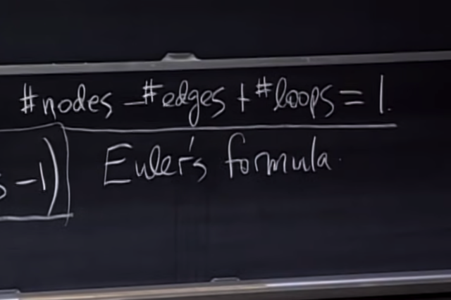</kbd></p>

> [!NOTE]
> Và từ đó ta có:
>
> Dựa theo `Rank-Nullity` ta đã biết C(A) và N(AT) đều là subspace
> của Rm và cùng nhau cover Rm.
>
> m (số hàng, dim của Rm) `=` r (rank, dim C(A)) `+` m `-` r (dim N(AT)
>
> Thì như đã nói vừa rồi: 
>
> m là **số edge**, 
>
> r là edge độc lập =**số node `-` 1**
>
> m `-` r là dim của N(AT) và là **số loop**
>
> Vậy #Số edge `=` #Số node `-` 1 `+` #số loop 
>
> <=>**#Số loop `=` #Số edge `-` (#Số node `-` 1)**
>
> Và đó chính là **công thức Euler**

<br>

<a id="node-362"></a>

<p align="center"><kbd>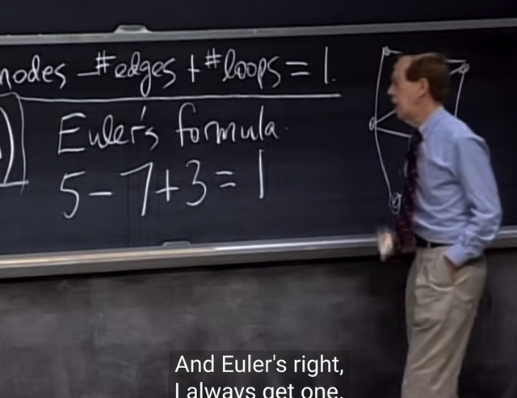</kbd></p>

> [!NOTE]
> gs lấy ví dụ một graph khác cho
> thấy công thức đúng

<br>

<a id="node-363"></a>

<p align="center"><kbd>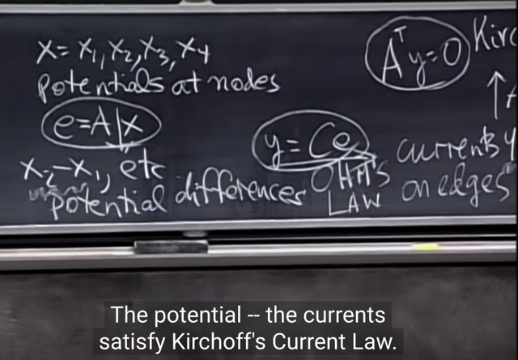</kbd></p>

> [!NOTE]
> Mang ý nghĩa từ x là các điện thế tại các node (potential)
> qua matrix A là matrix biểu diễn các edge, ta có e `=` Ax là
> hiệu điện thế giữa các node.
>
> Hiệu điện thế nhân với C là tính dẫn điện sẽ cho ra y là
> cường độ dòng điện (current): **y `=` Ce `=` CAx**
>
> Và **(A.T)y `=` 0** như đã biết, thể hiện luật Kirchhoff: tổng các
> (cường độ) dòng ra `/` vào một node `=` 0
>
> Thế thì gom lại 3 equation ta sẽ có:
>
> (AT)y `=` **(A.T)CAx `=` 0**
>
> Và giả sử ta đưa vào "sơ đồ mạch điện" nguồn điện 
> current source như pin chẳng hạn, thì (A.T)Y `=` f
>
> Ta sẽ có (A.T)CAx `=` f

<br>

