# Lecture 13: Quiz Review

📊 **Progress:** `37` Notes | `42` Screenshots

---
<a id="node-365"></a>

<p align="center"><kbd>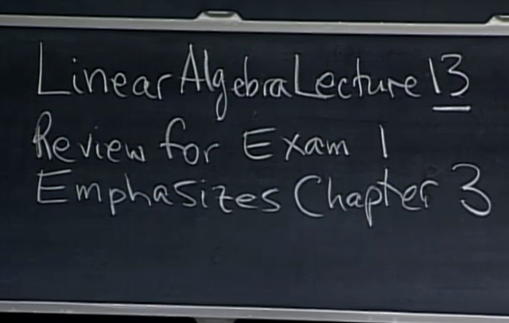</kbd></p>

<br>

<a id="node-366"></a>

<p align="center"><kbd></kbd></p>

> [!NOTE]
> Gs sẽ lướt qua các question từ quiz trước đây: Câu đầu tiên
> là cho **3 vector u, v, w thuộc R7** (tức mỗi vector có 7
> components)
>
> Câu hỏi là 3 vector này span một subspace của R7 thì
> **dimension của nó có khả năng là bao nhiêu?**
>
> `->` Thử trả lời: **3**, vì với 3 vector, thì giả sử không cùng
> phương thì chúng chỉ có thể span một **3D subspace trong
> R7**
>
> Gs: Đúng, 3 vector `non-zero` nên nhiều nhất span được
> subspace có dimension `=` 3. **Cũng có thể là 2, hoặc 1**.
> Không thể nhiều hơn vì chỉ có 3 vector, và không thể `=` 0 vì
> đã nói đây là `non-zero` vector.

<br>

<a id="node-367"></a>

<p align="center"><kbd>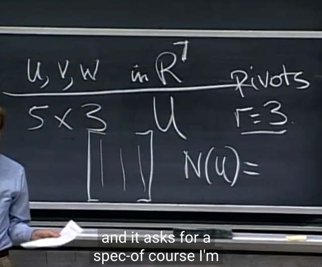</kbd></p>

> [!NOTE]
> Cho matrix 5x3, **có 3 pivot tức rank `=` 3**.
>
> **Nullspace** của nó là gì?
>
> Thử trả lời: Rồi, vì matrix có**3 cột**, mà lại có **3 pivot**, tức là
> **cả 3 cols đều là pivot cols.**
>
> Thế thì để xác định nullspace của U, tức là ta xét đến tập
> hợp các solution vector của Ux `=` 0, cũng gọi là những
> vector transform matrix U thành zero. Nếu là  matrix A, ta
> nhớ là ta sẽ dùng elimination để đưa nó về row echelon
> form U, ở đây có sẵn là U rồi. Thế thì ta cần xác định các
> pivot cols, và các free cols. Từ đó, ứng với mỗi free cols,
> cho phép ta chọn giá trị bằng 1 cho free variable, và 0 cho
> các free variable khác. Từ đó backsubtitution để tính các
> pivot var, tạo  ra một special solution.
>
> Điều này có nghĩa là s**ố free cols, chính là số special
> solution**. Và bộ các special solutions, sẽ tạo một basis
> của nullspace.
>
> Như vậy, đến đây có thể kết luận vì ta có 3 cols, mà cả 3
> đều là pivot, nên không có free cols nào, cũng như không
> có solution nào, và như vậy **basis của nullspace chỉ có
> một zero vector**. Kết luận **dimension của nullspace của 
> matrix N(U) `=` {zero vector}**

<br>

<a id="node-368"></a>

<p align="center"><kbd>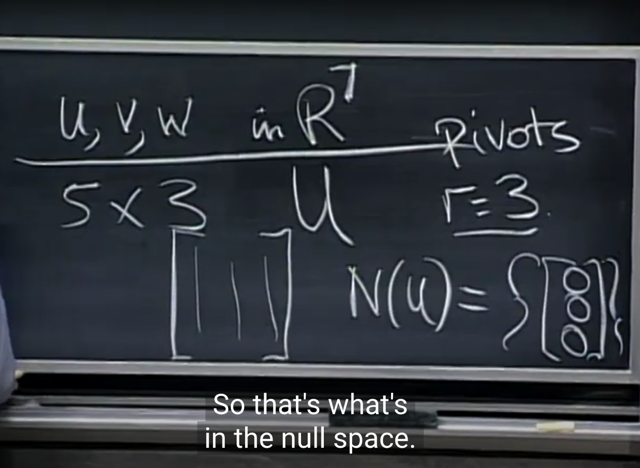</kbd></p>

> [!NOTE]
> gs: Lập luận như vậy đúng nhưng cần làm rõ một điểm
> **nullspace là một vector space, nên ít nhất nó chứa
> zero vector.**
>
> Nên câu trả lời là **dimension của nullspace là 0 là đúng**,
> **nhưng nullspace vẫn chứa zero vector chứ không phải 
> rỗng.**

<br>

<a id="node-369"></a>

<p align="center"><kbd>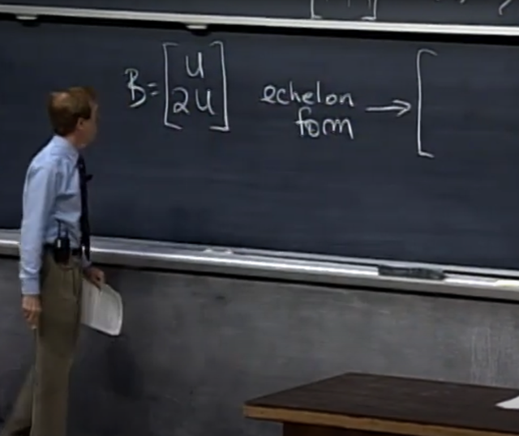</kbd></p>

> [!NOTE]
> Cho matrix B (10x3) có dạng như này: Câu hỏi là echelon
> form của B có dạng như thế nào. (gs cho phép giả sử U là
> reduced row echelon form luôn đi, tức là có thể thay  U
> bằng R thì đúng hơn)
>
> Thử trả lời: Matrix B dù có 10 hàng thì vì 5 hàng dưới là
> bằng 2*5 hàng trên. Tức là, chúng dependent 5 hàng trên.
> Và ta biết U có rank `=` 3, tức là nó có 3 independent cols
> cũng như row.
>
> Vậy xét 10 hàng của B, thì vẫn chỉ có 3 hàng đầu tiên độc
> lập, hàng 4, 5 là, 6,7,8,9,10 thì phụ thuộc các hàng đầu
>
> Do đó, khi thực hiện elimination với B, **ta sẽ có echelon
> form có dạng là 3 hàng đầu độc lập nên giữ nguyên, mấy
> hàng sau `=` 0 hết.**

<br>

<a id="node-370"></a>

<p align="center"><kbd>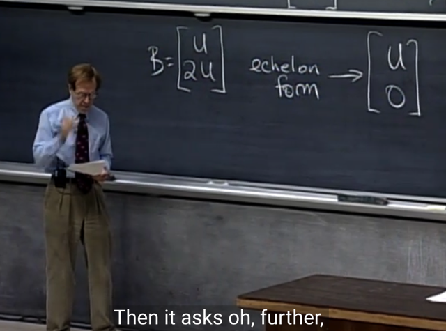</kbd></p>

> [!NOTE]
> Đáp án là vầy: Cũng có thể coi là câu trả lời của mình
> đúng. Nhưng có thể hiểu đơn giản là vầy, khi elimination,
> hàng nào mà bằng linear combination của mấy hàng trên
> thì nó sẽ bị khử nên ở đây, ta có các hàng ở nửa dưới
> của B (ứng với 2U) đều  dependent (hàng nào cũng bằng
> 2 một hàng nào đó ở phía trên không phải sao), thành ra
> bị khử hết.

<br>

<a id="node-371"></a>

<p align="center"><kbd>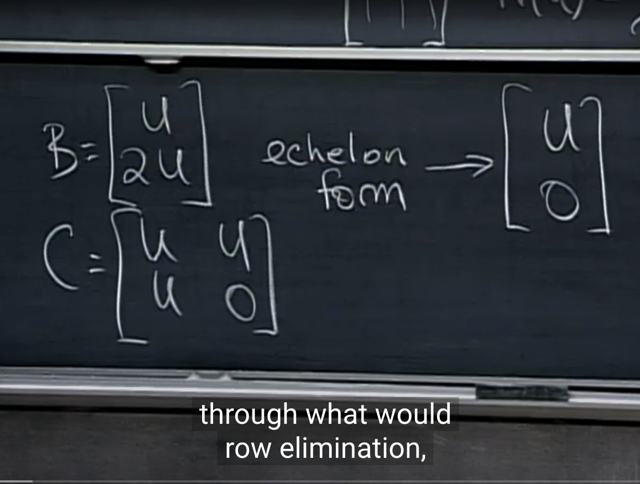</kbd></p>

> [!NOTE]
> rồi đến matrix C này

<br>

<a id="node-372"></a>

<p align="center"><kbd>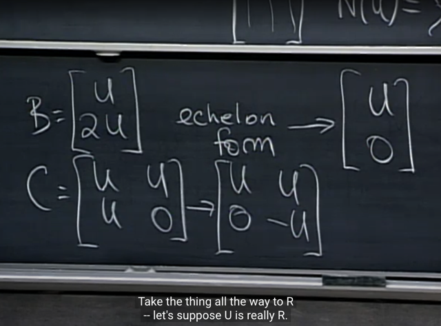</kbd></p>

> [!NOTE]
> khi elimination thì các hàng nào mà là linear combination
> của các hàng trên (dependent) thì sẽ bị khử, không biết
> nói sao nhưng có thể hình dung khi matrix U ở dưới bị
> khử thành 0 thì đương nhiên matrix 0 cũng thành `-U`

<br>

<a id="node-373"></a>

<p align="center"><kbd>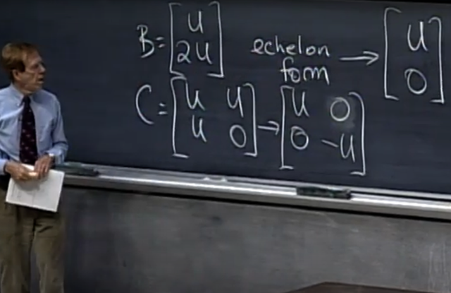</kbd></p>

> [!NOTE]
> Tiếp, ta có thể tiếp tục lấy [U O] ở trên trừ
> bớt đi [O U] để nó trở thành [U O]

<br>

<a id="node-374"></a>

<p align="center"><kbd>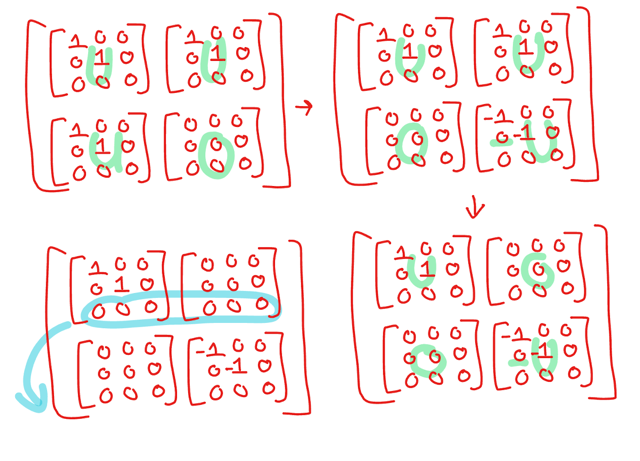</kbd></p>

<p align="center"><kbd></kbd></p>

<p align="center"><kbd>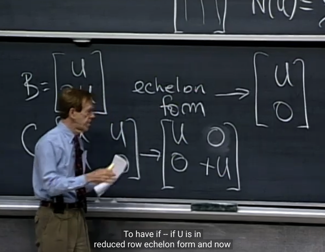</kbd></p>

> [!NOTE]
> và đương nhiên ta có thể nhân [O `-U]` ở dưới cho `-1` để nó
> thành [O U]
>
> Cuối cùng gs lưu ý rằng, U vẫn có thể có mấy hàng  zero ở
> dưới, thành ra ta có thể làm động tác nữa đó là  chuyển mấy
> hàng đó về cuối để đưa C thật sự về Reduced Echelon Form

<br>

<a id="node-375"></a>

<p align="center"><kbd>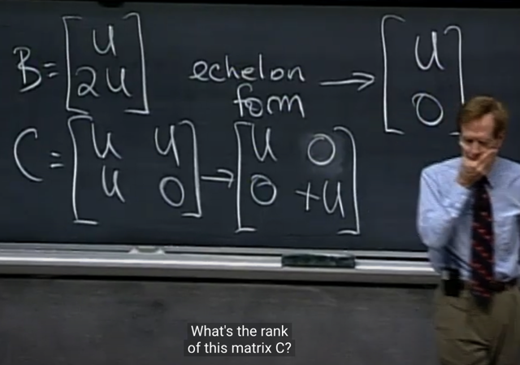</kbd></p>

> [!NOTE]
> Gs: rank của C?
>
> Me: 2*rank U `=` 2*3 `=` 6. Lí do là vì ta có 6 hàng độc lập
>
> gs: Correct. Còn B?
>
> Me: 3, dễ thấy vì REF của nó là [U O].T vẫn chỉ có 3 (rank
> of U) hàng độc lập

<br>

<a id="node-376"></a>

<p align="center"><kbd>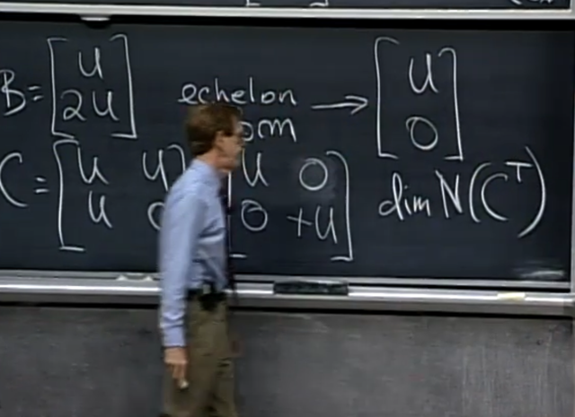</kbd></p>

> [!NOTE]
> Xét C.T, các cols của nó là các rows của C. Ta cần quan tâm
> C.T có mấy cols độc lập, nên mình sẽ đặt câu hỏi là C có
> mấy rows độc lập.
>
> Thì như đã nói C có rank là 2*rankU `=` 6
>
> và C có 2*5 `=` 10 hàng, tức là ta có 6 hàng độc lập, 4 hàng
> phụ thuộc.
>
> Vậy C.T tương ứng sẽ có 6 cột independent, và 4 cột
> dependent. Từ đó khi xét nullspace của C.T tức là ta quan
> tâm số special solution của `(C.T)y=0,` và như đã biết nó bằng
> số free cols, chính là số dependent cols. Vậy ta có 4 special
> solution, làm thành 1 basis của nullspace of C.T
>
> Vậy dim N(C.T) `=` 4

<br>

<a id="node-377"></a>

<p align="center"><kbd>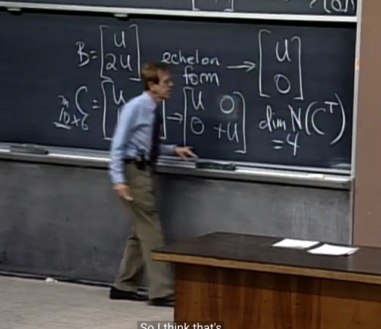</kbd></p>

> [!NOTE]
> gs: correct

<br>

<a id="node-378"></a>

<p align="center"><kbd>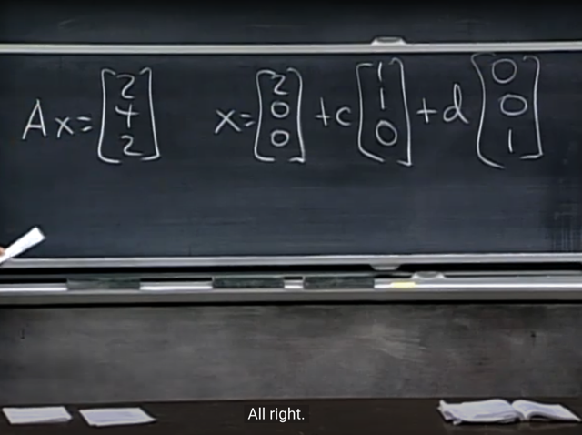</kbd></p>

🔗 **Related:** [LECTURE 8: SOLVING AX = B: ROW REDUCED FORM R](untitled.md#node-200)

> [!NOTE]
> Loại câu hỏi thứ hai là cho Ax `=` b, với solution space có
> dạng như vậy, nhưng không biết A
>
> Câu hỏi là dimension của row space of A là gì:
>
> Đầu tiên gs đề nghị trả lời câu hỏi shape của A là gì cái đã:
>
> Me: Thế thì, b là Ax tức là b là linear combination của các
> A's columns, với coefficient là các components của x và vì
> x có 3 component nên điều này chứng tỏ A có 3 cột. Và 
> đương nhiên cũng có 3 hàng vì b có 3 components
>
> Rồi, kết luận A là 3x3 matrix.

<br>

<a id="node-379"></a>

<p align="center"><kbd>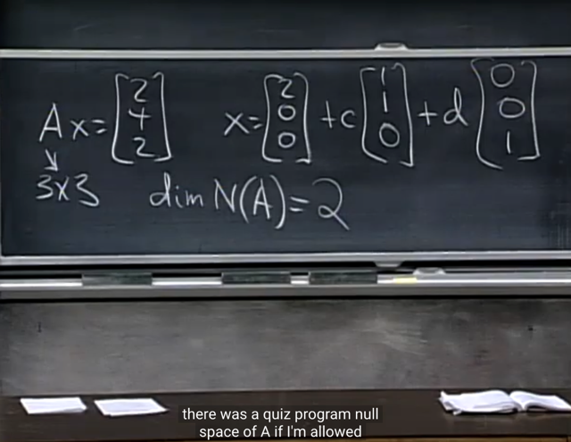</kbd></p>

> [!NOTE]
> Gs: Correct A là 3x3 matrix. Thế còn rank?
>
> Thế thì, nếu cần hãy theo đường dẫn tới bài mấy bữa về
> `Ax=b.` Ta đã có thể kết luận SOLUTION SPACE CỦA `Ax=b`
> là **một** **PARTICULAR SOLUTION** cộng với **NULLSPACE**
> CỦA A.
>
> Thế thì, như vậy ở đây x chính là **COMPLETE
> SOLUTION** và trong đó `x_particular` là (2, 0, 0) và
> nullspace của A là c*(1, 1, 0) `+` d*(0, 0, 1)
>
> Cho nên quay lại câu hỏi của gs rằng rank của A là gì. Thì,
> vì nullspace của A có basis gồm 2 vector `-` thì đó CŨNG
> CHÍNH LÀ 2 SPECIAL SOLUTION của Ax `=` 0. Và vì A có 3
> COLS như đã nói ở trên, nên có nghĩa là A CHỈ CÓ 1
> PIVOT COLS `(3-2=1).` Và từ đó suy ra rank A `=` 1.
>
> Và đương nhiên từ đây ta cũng có thể trả lời câu hỏi dim
> của row space of A sẽ là 1 luôn, vì rowspace và cols space
> đều có dim bằng rank

<br>

<a id="node-380"></a>

<p align="center"><kbd>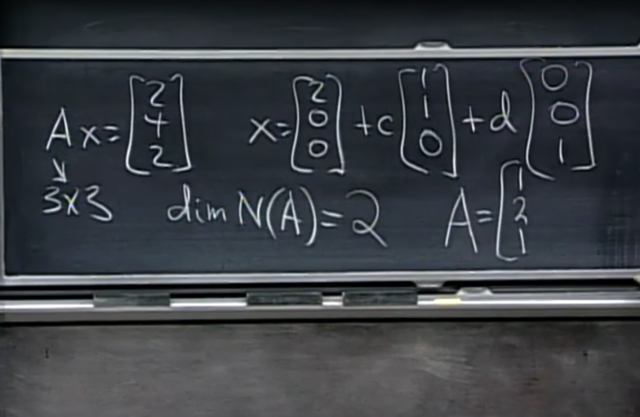</kbd></p>

> [!NOTE]
> Rồi, tiếp ta sẽ đi tìm A. Thế thì việc vector `x_particular` `=`
> [2, 0, 0].T là solution có nghĩa là: 2*col1 `+` 0*col2 `+` 0*col3
> `=` b `=` [2, 4, 2]
>
> Từ đó suy ra, col1 của A sẽ là `b/2` `=` [1, 2, 1].T

<br>

<a id="node-381"></a>

<p align="center"><kbd>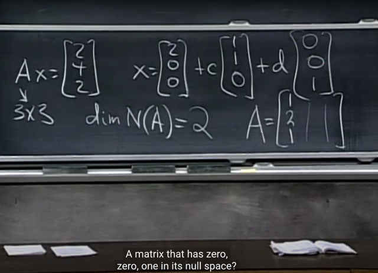</kbd></p>

> [!NOTE]
> ```text
> col 2 = [-1, -2, -1] col 3 = [0, 0, 0]
> ```
>
> Giải thích: 
>
> Ta có hai basis của nullspace của A là [1,1,0].T và [0,0,1].T
>
> Và đó cũng chính là 2 solution của `Ax=0.`
>
> Vậy với solution thứ nhất là [1,1,0].T 
>
> Ta có 1*col1 `+` 1*col2 `+` 0*col3 `=` 0 suy ra col2 `=` `-col1` =**[-1,-2,-1]**
>
> Tương tự, với solution thứ hai là [0,0,1].T
>
> Ta có 0*col1 `+` 0*col2 `+` 1*col3 `=` 0 Suy ra col3 `=` **[0, 0, 0].T**

<br>

<a id="node-382"></a>

<p align="center"><kbd>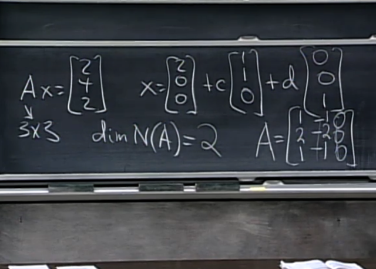</kbd></p>

> [!NOTE]
> Gs: Chính xác

<br>

<a id="node-383"></a>

<p align="center"><kbd>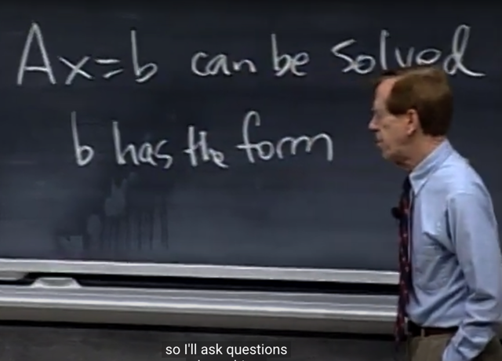</kbd></p>

> [!NOTE]
> Gs: điều kiện của **b để `Ax=b` solvable?**
>
> Gs: Đúng hơn phải trả lời thế này, vì Ax là linear combination
> của A's columns nên để `Ax=b` có solution thì b phải cũng là
> một vector trong columns space, bởi vì khi đó mới tồn tại một
> bộ coefficients giúp tạo linear combination các A's columns
> để thành b.Ngược lại nếu b không nằm trong columns space
> thì không tồn tại các kết hợp tuyến tính nào để cho ra b
> được.
>
> Vậy b phải có dạng a*col1 `+` b*col2 `+` c*col3 tức là a*[1,2,1].T
> ```text
> +  b*[-1, -2, -1]
> ```

<br>

<a id="node-384"></a>

<p align="center"><kbd></kbd></p>

> [!NOTE]
> gs: Nếu ta có một square matrix, and nullspace of A chỉ là
> zero vector. Thì khi đó nullspace của A transpose là gì?
>
> Me: Nullspace of A chỉ là zero vector, có nghĩa là basis  của
> nullspace không có vector nào, và dimension của nullspace
> (of A) là bằng 0.
>
> Như vậy, đồng nghĩa trong các cols của A, không có free
> cols, hay, mọi cols của A đều là pivot cols. Vậy rank của A
> là số cột. Và vì rank của A cũng là dim của row space. Suy
> ra A cũng có  số pivot rows là rank A `(=số` cột). Và vì số
> hàng bằng số cột (A square) Nên suy ra cũng không có row
> nào phụ thuộc tuyến tính, tức là khi `A.Ty=0` thì nullspace
> của A.T **cũng sẽ chỉ có zero vector** (vì mọi cols của A.T
> cũng đều là pivot**)
>
> Gs: Correct**

<br>

<a id="node-385"></a>

<p align="center"><kbd></kbd></p>

> [!NOTE]
> Xét vector space of **mọi 5x5 matrix**. Câu hỏi là,**tập hợp mọi 5x5
> invertible matrix phải là tạo subspace không?**
>
> Muốn tạo subspace, thì phải thỏa **cộng hai scale hai invertible matrix**
> cũng phải tạo một matrix trong space `-` tức **vẫn là một invertible matrix**.
>
> Invertible matrix là matrix khi RREF có dạng Identity, vậy có nghĩa là mọi
> hàng và mọi cột đều độc lập.
>
> Vậy câu hỏi sẽ trở thành **cộng** **hai matrix** hay **nhân matrix với
> scalar** như vậy có tạo matrix mới vẫn có **mọi hàng độc lập, mọi cột
> độc lập không**.
>
> `-` Xét về việc nhân 2 vector độc lập, với cùng một số, thì dễ thấy vẫn tạo
> hai vector độc lập vì **scale vector không làm thay đổi phương của
> vector**. Nên với hai vector độc lập tức là nó không cùng phương với
> nhau thì có  scale chúng thì chúng vẫn không cùng phương.
>
> `-` Xét việc cộng hai vector độc lập với hai vector độc lập khác, thế thì việc
> **cộng hai vector thay đổi phương của chúng**. Dẫn đến là kết quả của
> hai việc **cộng hai vector khác phương với hai vector khác  phương
> khác** **có thể tạo ra hai vector cùng phương** `->` không còn  độc lập
> nhau.
>
> Vậy điều này có nghĩa **cộng hai 5x5 invertible matrix không chắc là tạo
> một invertible matrix** suy ra **tập mọi invertible matrix không phải là
> vector space**.
>
> Gs: Bổ sung 1 ý, đó là ta nhớ rằng **một vector space phải chứa zero**.
> Vì sao vì khi đó mới thỏa điều kiện khi **scale một vector trong space với
> bất kì số nào kể cả 0 cũng vẫn được một vector trong space**. Nên nó
> phải chứ zero để mà có thể thỏa điều kiện này khi scalar `=` 0.
>
> Thế thì rõ ràng điều này không thỏa với trường hợp này vì **zero không
> phải invertible matrix**: matrix 5x5 zero không thể bị eliminate thành
> Identity matrix được.
>
> Như vậy phải khẳng định là cả điều kiện nhân và cộng đều không thỏa

<br>

<a id="node-386"></a>

<p align="center"><kbd>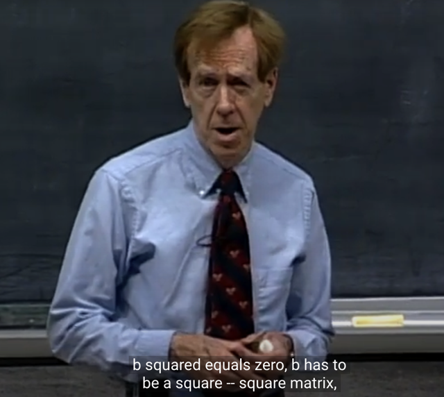</kbd></p>

> [!NOTE]
> Gs: Next question: Cho square matrix B, nếu B^2 `=` 0 thì B
> `=` 0. True or False?
>
> Me: Thử lập luận. Ta gọi giả sử có 2 cols. b1, b2. Thế thì,
> việc matrix kết qủa BB sẽ có col1 là linear combination của
> b1, b2 với coeff là hai phần tử của b1.  Và BB sẽ có col2 là
> linear combination của b1, b2 với coeff là hai phần tử của
> b2
>
> Thế thì ta đang có BB là zero. tức col1 và col2 của BB đều
> là zero. Vậy thì có nghĩa là thông qua hai component của
> mình b1 đã tạo linear combination của hai cols b1, b2 để ra
> zero. Thế thì điều đó có nghĩa là b1 nằm trong nullspace
> của B. Tương tự như vậy với b2, b2 cũng nằm trong
> nullspace của B.
>
> Vậy ta có matrix B mà cả hai col của nó đều nằm trong
> nullspace khi ta có **matrix đặc biệt gọi là** **nilpotent.**
>
> Đây là kiến thức liên quan đến đại số tuyến tính cao cấp
>
> Nên kết luận trên là Sai.

<br>

<a id="node-387"></a>

<p align="center"><kbd></kbd></p>

> [!NOTE]
> Matrix nilpotent này có BB `=` 0

<br>

<a id="node-388"></a>

<p align="center"><kbd>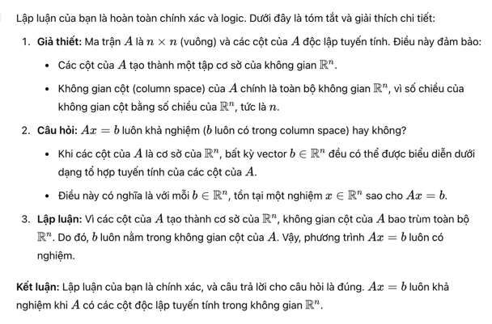</kbd></p>

<p align="center"><kbd></kbd></p>

<p align="center"><kbd>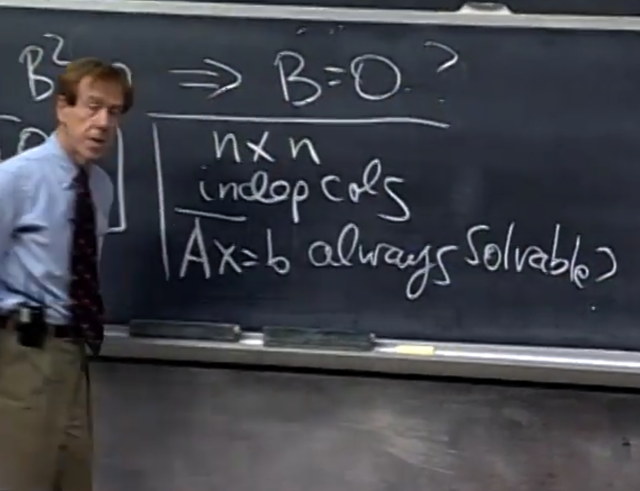</kbd></p>

> [!NOTE]
> Tiếp: cho matrix A nxn, có các cols independent Câu
> hỏi là `Ax=b` luôn solvable có đúng không?
>
> Me: Đúng. Vì như đã nói muốn `Ax=b` luôn có solution,
> thì b phải nằm trong colums space (vì khi đó mới luôn
> tìm được một bộ coeff (chính là các component của x)
> giúp tạo một linear combination của các cols cho ra
> được b.
>
> Thế thì, ta có mọi cols, đều independent, cho nên basis
> của cols space có n vector. Đương nhiên ta đang xét
> không gian R^n (vector có n phần tử). Thế thì basis của 
> column space có n vector cũng chính là dimension của
> column space bằng n. Thì điều này có nghĩa là colums
> space CHÍNH LÀ R^n. Và khi đó đương nhiên b sẽ luôn
> nằm trong columns space.
>
> Vậy suy ra `Ax=b` luôn solvable
>
> Gs: Correct

> [!NOTE]
> Liên hệ nó với 18.02: Xét hệ 3 phương trình 3 nghiệm. (Dạng matrix là `Ax=b)`
> với A là matrix 3x3.
>
> Thế thì, nếu A như ở đây nói, là mọi cols đều independent. Thì chính là ta có
> ```text
> matrix full rank / invertible / non-singular. Và 3 cols đủ span toàn bộ R3 => b
> ```
> (vector trong R3) luôn nằm trong columns space C(A) `=>` `Ax=b` luôn có duy
> nhất 1 solution.
>
> Nếu theo góc nhìn hình học của 18.02, thì ta có 3 normal vector  chính là các
> rows của A. Và vì A full rank nên dĩ nhiên các rows  cũng độc lập. Vậy 3
> normal vector có phương khác nhau. Điều này tương ứng với việc 3 plane
> chắc chắn cắt nhau tại 1 điểm. Đó chính là solution duy nhất nói ở trên.
>
> `====`
>
> Thử xét case khác khi A chỉ có rank 2, tức là có 2 independent rows `/` 2
> independent columns `/` singular `/` `non-invertible.` Thế thì, với 2 independent
> columns, nó không đủ để span toàn bộ R3 mà chỉ span được một 2D plane
> trong subspace của R3. Do đó, nếu b không nằm  trong C(A) thì không thể
> tồn tại bộ coefficients khiến linearly combine các cols để cho ra b, đồng nghĩa
> `Ax=b` vô nghiệm. Ngược lại, nếu b nằm trong C(A), thì `Ax=b` có particular
> solution. Bên cạnh đó, vì matrix có rank 2, nên tồn tại 1 free columns, ứng với
> 1 special solution của  Ax `=` 0, cũng là 1 vector trong basis của nullspace
> N(A). Vậy complete solution của `Ax=b` sẽ có thể có sự tham gia của nullspace
> nên nếu có particular solution thì sẽ có vô số nghiệm (còn ngược lại thì hệ vô
> nghiệm)
>
> Theo góc nhìn hình học của 18.02, vì ta chỉ có 2 row độc lập, nên  cũng chỉ
> có trạng thái là: 1 cặp plane 1,2 sẽ cắt nhau tại một line, và hai normal vector
> của chúng sẽ span một plane CHỨA normal vector của plane thứ 3. Và plane
> thứ 3 này có thể chứa hoặc không chứa  giao tuyến của hai plane ban đầu.
> Do đó trường hợp này, có thể có vô số nghiệm hoặc vô nghiệm.
>
> `====`
>
> Nếu chỉ có rank 1, thì câu chuyện theo góc nhìn 18.06 cũng tương tự, chỉ
> khác là C(A) bây giờ chỉ là một 1D line trong R3 (nullspace N(A) sẽ là 2D
> plane vuông góc với line này) để rồi nếu b nằm trên line này, thì tồn tại
> particular solution cũng đồng nghĩa là sẽ có vô số nghiệm (vì, có nullspace
> khác {0}). Ngược lại, nếu b không nằm trong C(A) line, `Ax=b` sẽ vô nghiệm.
>
> Với góc nhìn hình học, vì ta chỉ có rank 1, tức là cũng chỉ có 1 row độc lập, 2
> row kia phụ thuộc. Điều này có nghĩa là cả 3 normal vector trùng phương.
> Khiến cả 3 mặt phẳng song song hoặc trùng nhau. Nên nếu chúng (cả 3)
> trùng nhau, ta sẽ có trường hợp vô số nghiệm. Còn ngược lại, ta có vô
> nghiệm.

<br>

<a id="node-389"></a>

<p align="center"><kbd>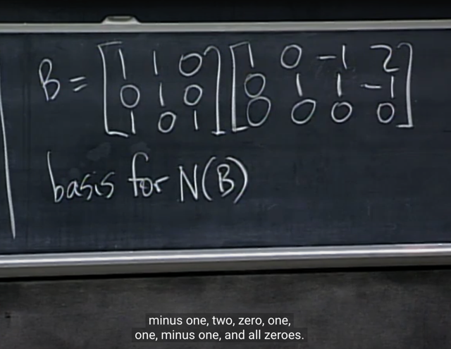</kbd></p>

> [!NOTE]
> gs cho matrix **B là kết quả của việc nhân hai matrix này**.
> Câu hỏi là, **basis của nullspace of B** là gì?
>
> B `=` AC
>
> ```text
> Bx = 0 <=> ACx = 0 Từ đó, x là solution của Bx=0, thì Cx là
> ```
> solution của `Ay=0.`
>
> Như vậy, vector nếu x là solution của `Bx=0,` tức là nó thuộc
> nullspace của B, thì cũng có nghĩa là Cx sẽ là solution của A,
> đồng nghĩa Cx thuộc nullspace của A.
>
> Vậy thì xét nullspace của A. Ta dễ thấy A có 3 independent
> cols nên rank A `=` 3 (mà A square nên ta có full rank). Thế thì
> do đó không có free cols, nên basis của nullspace không có
> vector nào, và dimension của nullspace of A là 0. và như đã
> biết, **nullspace của A CHỈ CHỨA ZERO**.
>
> (ở đây khi review sau khi đã học **determinant** ta có thể dùng 
> **cofactor formula** để tính nhanh det của A theo cột 3: `+` 1 * det
> ```text
> của matrix [1 1; 0 1] = 1*1 = 1 => khác 0 nên matrix non-singular
> ```
> hay fullrank `=>` nullspace chỉ có zero.
>
> Rồi, thế thì kết hợp với ý trên, **để Cx thuộc nullspace của A**,
> **tức là Cx chỉ có bằng ZERO và như vậy x là solution của
> Cx `=` 0**
>
> Vậy, điều này **đồng nghĩa là x là solution của Bx=0** thì **cũng là
> solution của Cx `=` 0.**
> Vậy nên **nullspace của B**, cũng **chính là nullspace của C**.
>
> Rồi, xét C, dễ thấy nó có 2 pivot row `->` dim rowspace `=` 2, và
> từ đó cũng suy ra dim của cols space `=` 2 (và bằng luôn rank)
> Vậy trong 4 cols, có 2 pivot cols, 2 free cols. Từ đó như đã
> biết 2 free cols ứng với 2 special solution cũng chính là 2
> vector trong basis.

<br>

<a id="node-390"></a>

<p align="center"><kbd>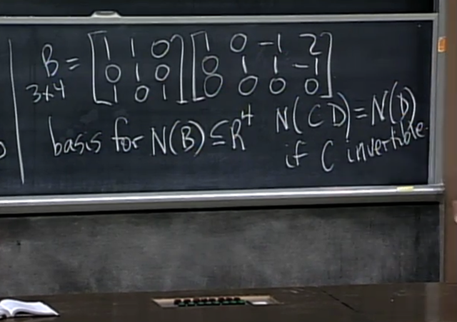</kbd></p>

> [!NOTE]
> Đúng, hoặc có cách lập luận khác theo gs đó là:
>
> ta có B `=` CD (gs gọi là C.D thay vì mình gọi là AC) mà C như
> theo cách lập luận trước ta có fullrank matrix, do đó nó là
> invertible matrix (vì khi một fullrank (dĩ nhiên sẽ là square
> matrix) matrix được eliminate thì kết quả RREF sẽ là Identity
> matrix. Đồng nghĩa ta có `EC=I,` với `E` là elimination matrix, thì
> cũng tức là `E` chính là `C_inv` `=>` C invertible)
>
> Vậy xét Bx `=` 0, ta **có thể nhân hai vế cho `E,` (hay C_inv)** để
> có `C_invCDx` `=` 0 `<=>` **Dx=0**.
>
> Từ đó cho **ra cùng kết luận** với lập luận trên đó là**nullspace
> của `B=CD` cũng chính là nullspace của D**

<br>

<a id="node-391"></a>

<p align="center"><kbd>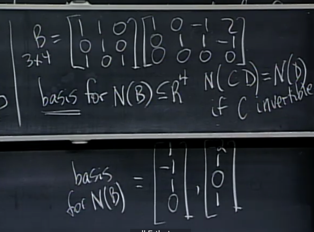</kbd></p>

> [!NOTE]
> Và để xác định basis của nullspae của C, thì như đã biết rồi, ta
> xác định hai free cols `/` variables và lần lượt cho chúng bằng 1,
> thằng còn lại bằng 0, để thế vào tính ra các pivot vars
>
> Ví dụ dễ thấy hai cols 1,2 là pivot cols, hai cols 3,4 là free cols.
>
> Cho `x3=1,` `x4=0` :
>
> ```text
> thế vô equation 2: 0*x1 + 1*x2 + 1*1 -1*0 = 0 => x2 = -1.
> ```
>
> ```text
> thế vô equation 1: 1*x1 + 0*x2 - 1*1 +2*0 = 0  => x1 = 1
> ```
>
> Từ đó có special solution thứ 1: [1 `-1` 1 0]
>
> Tương tự tính special solution thứ 2. Và đó là basis

<br>

<a id="node-392"></a>

<p align="center"><kbd>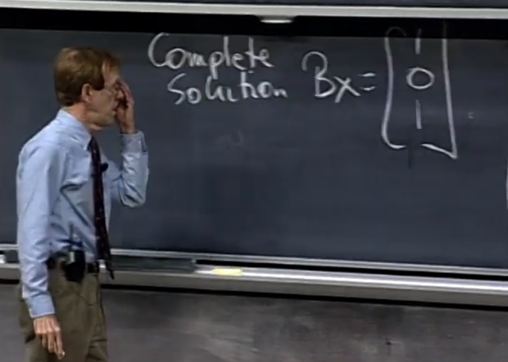</kbd></p>

> [!NOTE]
> Tiếp theo là **tìm complete
> solution của Bx** `=` [1 0 1]

<br>

<a id="node-393"></a>

<p align="center"><kbd>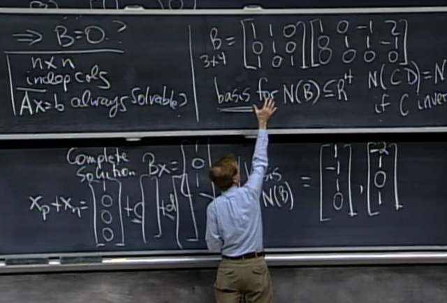</kbd></p>

> [!NOTE]
> Câu trả lời là vầy: ta dễ thấy [1 0 0 0] là một solution của Bx
> `=` [1 0 1].T
>
> Thế thì lập luận như sau: `B=C.D` (3x3)(3x4) `=` (3x4) ta đã
> biết rằng, có thể coi kết qủa của C.D sẽ là việc lấy matrix C
> nhân với các column vector của matrix D, mà mỗi khi một
> matrix C nhân với một column vector `d_i` thì nó chính là tính
> một linear combination của các column của C với hệ số là
> các component của vector `d_i,` đương nhiên cho ta một
> column.
>
> Do đó ứng với 4 cols của D, ta có 4 linear combination của
> các C's cols. Từ đó giúp ta nhìn ra sự thật rằng: matrix B có
> shape 3x4, tức 4 cột, thì cột đầu tiên của nó sẽ được tính
> bằng linear combination của 3 cột của C, với các hệ số là 3
> component của cột đầu tiên của D.
>
> Thế thì ta thấy cột đầu tiên của matrix C là [1 0 1].T, và cột
> đầu tiên của D là [1 0 0].T Thành ra ta sẽ có cột đầu tiên của
> B là [1 0 1]*1 `+` [1 1 0]*0 `+` [0 0 1]*0 `=` [1 0 1]
>
> Vậy từ đó, khi xét equation Bx `=` [1 0 1].T, lại lần nữa, x sẽ
> là linear combination của 4 cols của B. Vậy nên vì col 1
> của B đã là [1 0 1], nên dễ thấy một solution sẽ là [1 0 0 0]
>
> Do đó ta xác định được một PARTICULAR SOLUTION.
>
> Và như đã biết, một particular solution cộng vợi nullspace của
> B sẽ tạo ra complete solution.

<br>

<a id="node-394"></a>

<p align="center"><kbd>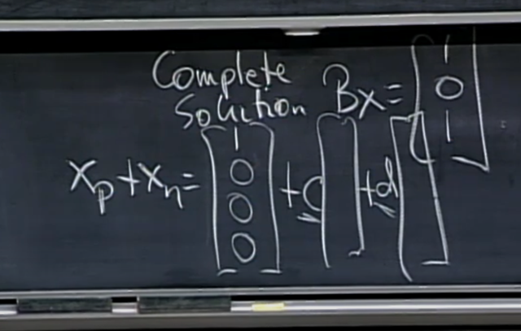</kbd></p>

> [!NOTE]
> Do đó ta có complete solution là như vầy (hai vector
> nhân với c, d là hai basis của nullspace mới tìm hồi nãy)

<br>

<a id="node-395"></a>

<p align="center"><kbd></kbd></p>

> [!NOTE]
> và gs nhắc lại rằng: PARTICULAR SOLUTION CHỈ ĐỀ XUẤT
> TA CHỌN MỘT ..PARTICULAR SOLUTION `-` TỨC LÀ MỘT
> SOLUTION CỤ THỂ NÀO ĐÓ, và cái nào cũng được và cũng
> có nghĩa không nhất thiết phải chỉ có một cái.
>
> và trong trường hợp này đơn giản là vì ta có thể nhìn ra ngay
> một solution như vậy nên lấy nó thôi.

<br>

<a id="node-396"></a>

<p align="center"><kbd></kbd></p>

> [!NOTE]
> Gs hỏi một câu trong sách: Nếu m `=` n thì matrix invertible
> là đúng hay sai.
>
> Me:
>
> Việc matrix A square không có nghĩa là ta có full rank nên
> không có gì đảm bảo là ta có điều kiện để A invertible

<br>

<a id="node-397"></a>

<p align="center"><kbd></kbd></p>

> [!NOTE]
> Câu hỏi là matrix A và `-A` có share chung 4 subspace
> không.
>
> Me: Yes. Thử trả lời theo cách ngắn gọn nhất, đó là hai
> matrix này chỉ khác nhau ở chỗ khi elimination A ta nhân
> thêm  matrix A cho `-1.` Và việc này không làm thay đổi kết
> quả của quá trình elimination. Thành ra kết quả của của
> hai trường hợp. Dẫn đến các pivot cols, free cols đều
> giống nhau từ đó dẫn đến A và `-A` phải cùng share chung 4
> fundamental subspaces
>
> Gs: Correct

<br>

<a id="node-398"></a>

<p align="center"><kbd>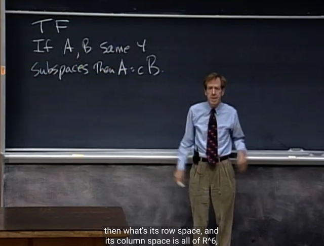</kbd></p>

> [!NOTE]
> Gs: Thế ngược lại, nếu A và B có cùng 4 fundamental
> subspaces thì có phải là A `=` alpha*B không?
>
> Ta có thể trả lời thế này, bằng cách lấy một ví dụ về
> hai fullrank matrix 2x2. Và xét cols space thì dễ thấy
> chúng đều là R2. Tức là hai cols của A và hai cols
> của B đều span R2. Nhưng điều đó đâu có nghĩa là
> hai cols của A phải là cùng hướng với hai cols của B
> đâu. Vì có vô sô cặp vector có thể span R2.
> Và với row space hai các subspace khác cũng vậy.
>
> Vậy câu trả lời là Fasle.

<br>

<a id="node-399"></a>

<p align="center"><kbd>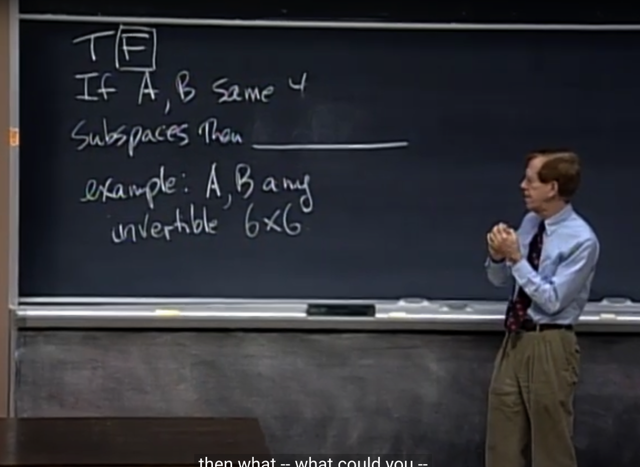</kbd></p>

<br>

<a id="node-400"></a>

<p align="center"><kbd></kbd></p>

> [!NOTE]
> Nếu exchange 2 row, subspace nào sẽ không đổi:
>
> Me: rowspace của A và nullspace

<br>

<a id="node-401"></a>

<p align="center"><kbd>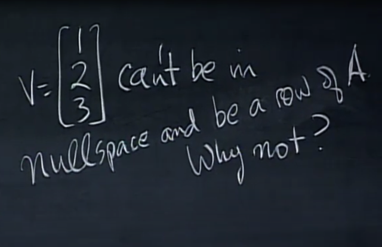</kbd></p>

> [!NOTE]
> Me bởi vì nếu v vừa là 1 row vừa nằm trong
> nullspace thì ta sẽ có 1*1 `+` 2*2 `+` 3*3 `=` 0 mà
> điều này không đúng

<br>

<a id="node-402"></a>

<p align="center"><kbd>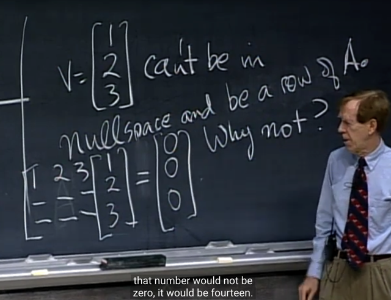</kbd></p>

> [!NOTE]
> Gs: Correct, và qua bài sau ta sẽ thấy thực tế
> thì **row space và nullspace sẽ perpendicular,
> chỉ share nhau zero vector**

<br>

