# Lecture 14: Orthogonal Vectors And Subspaces

📊 **Progress:** `37` Notes | `37` Screenshots

---
<a id="node-404"></a>

<p align="center"><kbd>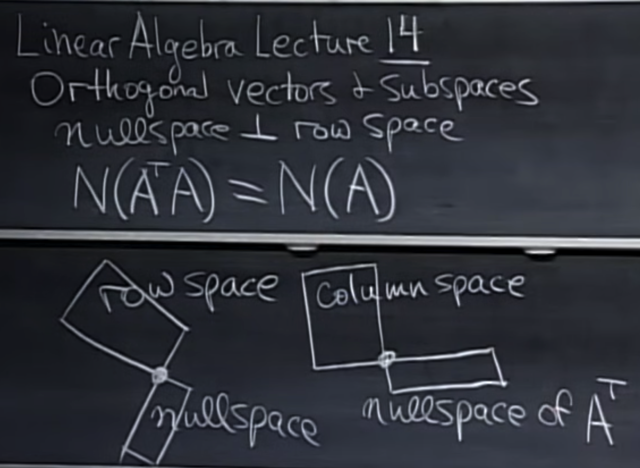</kbd></p>

> [!NOTE]
> bài này gs sẽ nói về khái niệm hai
> **vector space** **orthogonal**

<br>

<a id="node-405"></a>

<p align="center"><kbd>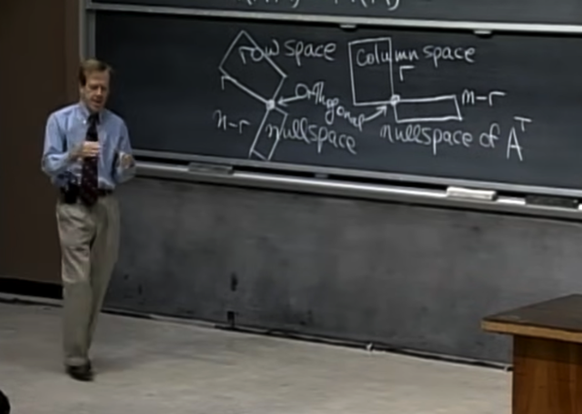</kbd></p>

> [!NOTE]
> đầu tiên gs cho biết đại khái là đến giờ ta **đã biết 4
> subspace quan trọng** này, với việc biết **basis** và
> **dimension** của chúng.
>
> Nay ta sẽ học về việc **chúng orthogonal với nhau** là
> sao, thể hiện qua hình ảnh này.

<br>

<a id="node-406"></a>

<p align="center"><kbd>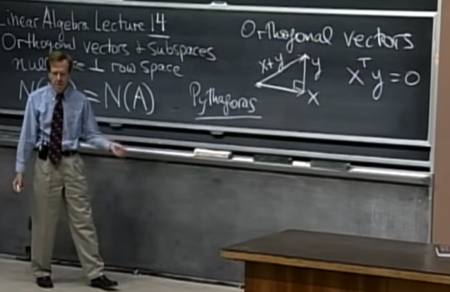</kbd></p>

> [!NOTE]
> gs nói qua về khái niệm**hai vector orthogonal**, thì nó đồng
> nghĩa với từ **perpendicular** `-` vuông góc. Và cho hai vector
> x,y. Để biết chúng có vuông góc không thì chỉ việc**tính dot
> product của chúng xem có bằng 0 không**(đây là kiến thức đã học ở 18.02, trong bài 1 ta đã biết rằng
> dot product (tích vô hướng) của hai vector a, b sẽ là
> |a|*|b|*cos(theta) do đó nếu aTb (cách viết của 18.06 về dot
> product của a,b) `=` 0 thì cos(theta) `=` 0 `=>` theta (là góc giữa
> hai vector) `=` 90

<br>

<a id="node-407"></a>

<p align="center"><kbd>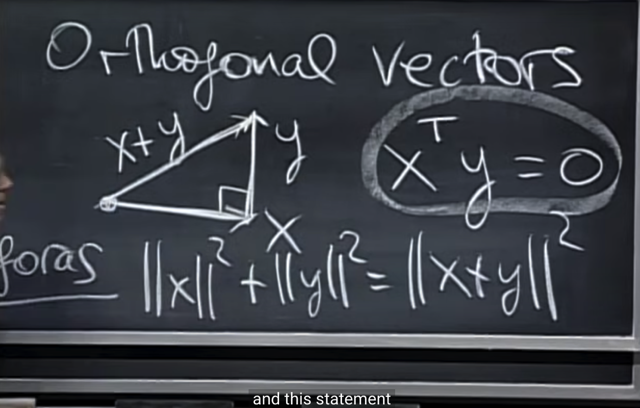</kbd></p>

> [!NOTE]
> Thế thì câu hỏi gs đặt ra là **tại sao dot product bằng 0
> lại là dấu hiệu của hai vector vuông góc**. Hai nói cách
> khác, gs đề nghị tìm **liên hệ giữa định lý pythagores**
> với dot product xTy `=` 0.

<br>

<a id="node-408"></a>

<p align="center"><kbd></kbd></p>

> [!NOTE]
> Gs: thế thì đầu tiên nếu cho vector (1,2,3) thì length square
> ||u||**2 là gì?
>
> Me: [sqrt(1**2 `+` 2**2 `+` 3**2)]**2 `=` 1**2 `+` 2**2 `+` 3**2

<br>

<a id="node-409"></a>

<p align="center"><kbd>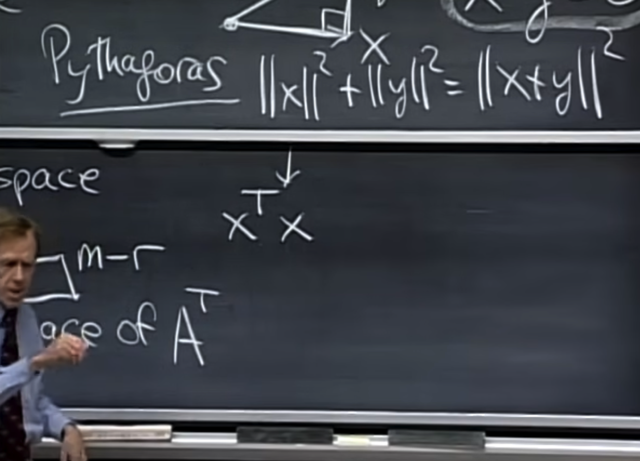</kbd></p>

> [!NOTE]
> gs: đúng, và có thể thể hiện dưới dạng xTx

<br>

<a id="node-410"></a>

<p align="center"><kbd>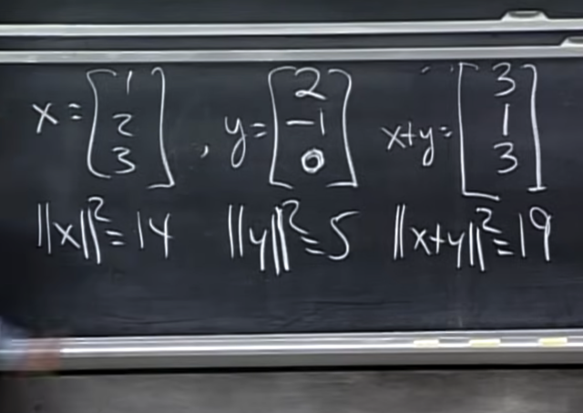</kbd></p>

> [!NOTE]
> gs ví dụ 2 vector

<br>

<a id="node-411"></a>

<p align="center"><kbd>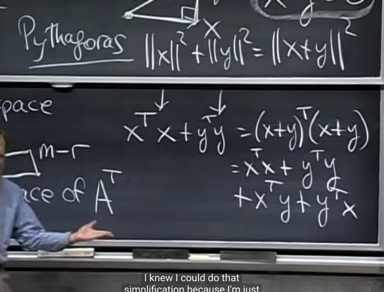</kbd></p>

> [!NOTE]
> Tương tự, triển khai ra ta có. 
>
> Với `(x+y)T(x+y)` triển khai như vầy:
>
> ```text
> = (xT+yT)(x+y) = xTx+xTy + yTx + yTy
> ```

<br>

<a id="node-412"></a>

<p align="center"><kbd>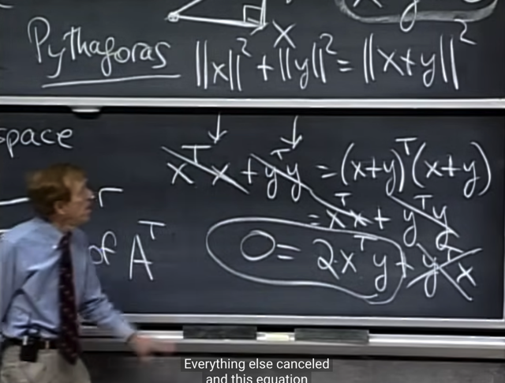</kbd></p>

> [!NOTE]
> Khử đi hai vế và gom xTy và yTx (đều giống nhau)
> ta có **2xTy `=` 0**
>
> Và đây là mối liên hệ giữa **định lí pytagores** và việc
> **dot product của hai vector bằng 0**

<br>

<a id="node-413"></a>

<p align="center"><kbd></kbd></p>

> [!NOTE]
> Tiếp gs hỏi thế zero vector thì sao `->` với zero vector thì
> vì chúng dot product với vector nào cũng bằng 0 nên cứ
> theo luật mà làm, **nó sẽ orthogonal với mọi vector**

<br>

<a id="node-414"></a>

<p align="center"><kbd></kbd></p>

> [!NOTE]
> Tiếp ta sẽ mở rộng từ**orthogonal vector** sang **orthogonal
> subspace**
> Gs đề nghị ta coi **bức tường** là subspace thứ nhất (a 2D
> subspace trong R3), và **mặt sàn** là subspace thứ hai. Câu
> hỏi là chúng **có là phải là hai orthogonal subspace**

<br>

<a id="node-415"></a>

<p align="center"><kbd>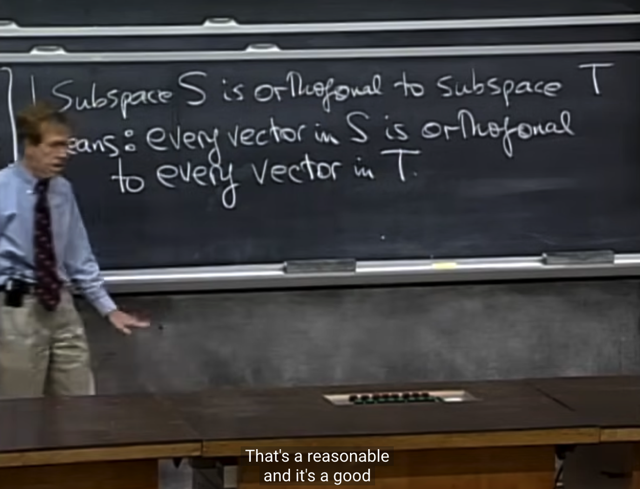</kbd></p>

> [!NOTE]
> Thế thì đầu tiên gs đưa ra định nghĩa, hai subspace
> **orthogonal** khi **MỌI vector trong subspace** này
> **orthogonal với MỌI vector trong subspace kia**

<br>

<a id="node-416"></a>

<p align="center"><kbd>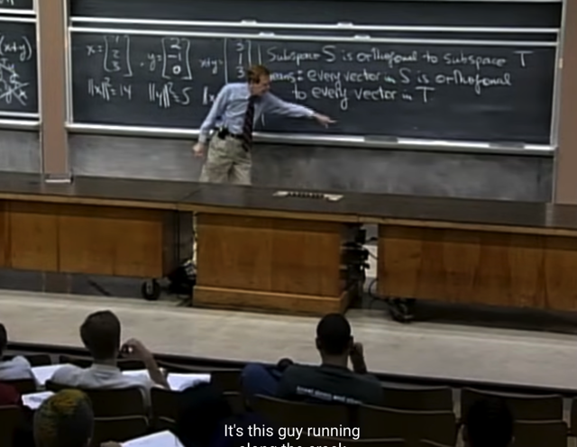</kbd></p>

> [!NOTE]
> Và theo định nghĩa này thì **hai subspace không
> orthogonal** `-` vì dễ thấy không phải mọi vector nào của
> mặt tường cũng orthogonal với mặt sàn. Và điển hình là
> trên intersection line, vector không thể orthogonal với
> chính nó
>
> Do đó, theo gs,**hai subspace không nên intersect nhau
> bởi một line** nếu muốn orthogonal. Hoặc đúng hơn là nếu
> muốn orthogonal thì chúng **chỉ có thể intersect nhau tại
> ZERO vì chỉ có zero vector mới orthogonal với chính nó**

<br>

<a id="node-417"></a>

<p align="center"><kbd>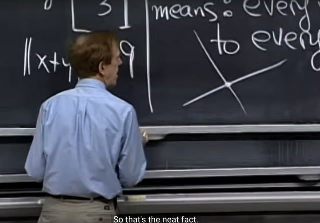</kbd></p>

> [!NOTE]
> Tiếp gs đề nghị hãy **xét các orthogonal subspace** của
> **R2**
>
> Ta có các case sau:
>
> i) một **zero vector** (đã biết, nó **vẫn là một subspace**), và
> một **line đi qua zero** (cũng là một space): mọi vector trong
> line đều orthogonal với vector duy nhất trong zero vector
> space (đương nhiên là vector zero) (Bởi dot product của
> vector nào với zero vector đều bằng 0) Nên thỏa yêu cầu
> **orthogonal sub spaces**
>
> ii) **hai line qua origin** (là hai subpace) mà**vuông góc nhau**.
> Đương nhiên mọi vector trong line này cũng sẽ đều vuông
> góc mọi vector trong line kia `->` thỏa mãn điều kiện hai
> orthogonal subspace.

<br>

<a id="node-418"></a>

<p align="center"><kbd>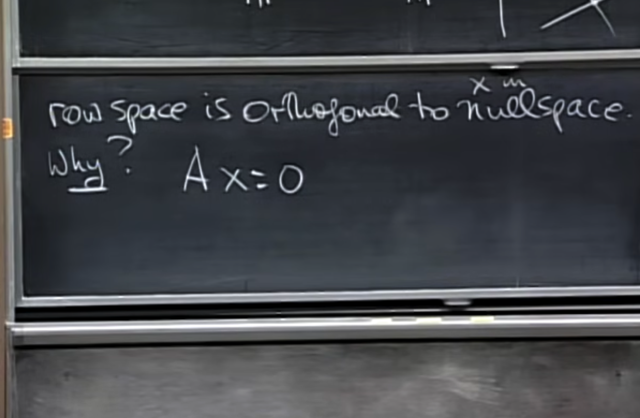</kbd></p>

> [!NOTE]
> Đầu tiên gs cho biết **rowspace** sẽ
> orthogonal with **nullspace**. Tại sao

<br>

<a id="node-419"></a>

<p align="center"><kbd>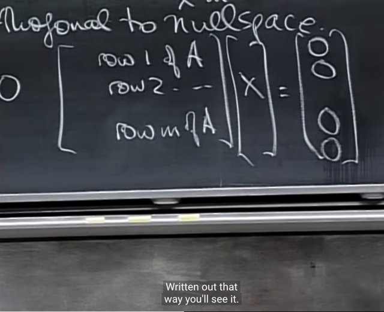</kbd></p>

> [!NOTE]
> thế thì chỉ cần viết ra như thế này thì **ngay lập tức có thể thấy tại
> sao** lại như vậy. Đó là, nhìn theo row view, ta đang có một set các row
> vector (tức matrix A), nhân với một matrix x có n row, và mỗi row chỉ có
> 1 phần tử.
>
> Theo góc nhìn row, ta row 1 của A khi nhân với "matrix" x (matrix chỉ có
> 1 cols) sẽ cho ra linear combination CÁC HÀNG CỦA x (mà mỗi hàng
> chỉ có 1 phần tử) với coefficient là các phần tử của row 1 của A. Và
> đương nhiên kết quả của cũng là một hàng `-` và cũng chỉ có 1 phần tử
> `->` đó chính là phần tử đầu tiên của vector kết qủa.
>
> Hiểu theo `row-viewpoint` là như vậy, nhưng nói ngắn gọn thì là ta có
> phần tử đầu tiên của kết quả sẽ là **DOT PRODUCT CỦA HÀNG 1
> CỦA A VÀ VECTOR X**. Mà đang xét nullspace, tức là các x sao cho
> `Ax=0,` tức là kết qủa của dot product  của row 1 của A và x là 0. Theo
> kết luận hồi nãy, ta có thể suy ra **row 1 của A ORTHOGONAL với x**.
>
> Và điều này tương tự với mọi row của A. Vậy thì, **mọi row của A, đều
> orthogonal với x** `-` mọi solution của nullspace.
>
> (Giải thích theo row view hơi dài dòng, vì một viewpoint khác của việc
> matrix A x matrix B là, mỗi component là dot product của row của A với
> column của B)
>
> Và **MỌI ROW CỦA A ĐỀU ORTHOGONAL VỚI x THÌ** **MỌI
> LINEAR COMBINATION CỦA CHÚNG CŨNG SẼ ORTHOGONAL VỚI
> X** (điều này hoàn toàn dễ hiểu vì**tính chất phân phối**:
>
> ```text
> (c*u1 + v*u2)x = c*u1x + v*u2x = c*0 + d*0 = 0)
> ```
>
> Từ đó ta có trạng thái là **mọi vector trong row space đều orthogonal với
> mọi vector trong nullspace**.
>
> Đây là cơ sở để kết luận ta có **hai subspace orthogonal nhau là row
> space và nullspace**

<br>

<a id="node-420"></a>

<p align="center"><kbd>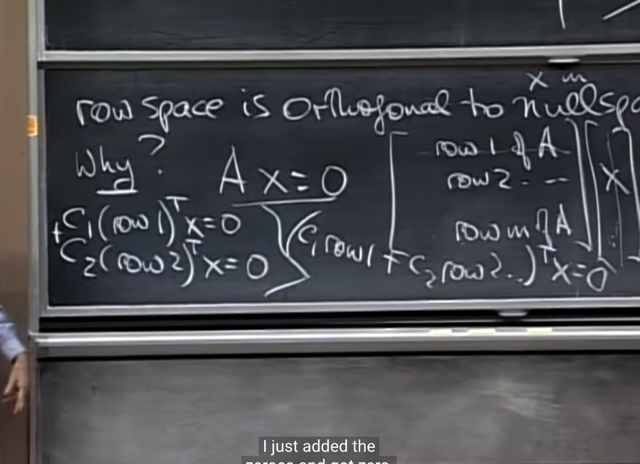</kbd></p>

> [!NOTE]
> Gs: Correct!

<br>

<a id="node-421"></a>

<p align="center"><kbd>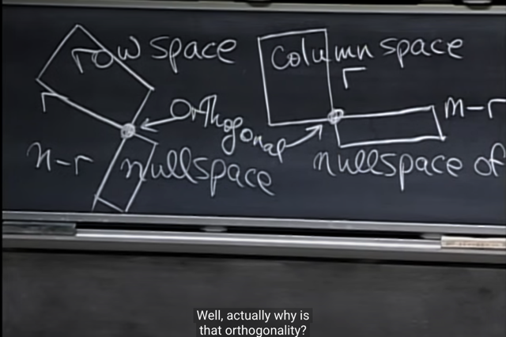</kbd></p>

> [!NOTE]
> Tương tự, ta sẽ xem thử tại sao **C(A) lại orthogonal với
> N(AT)**
>
> Me: Là bởi với y của N(AT) tức ATy `=` 0, thì tương tự, ta
> sẽ có **CÁC ROW CỦA AT vuông góc với các y trong
> N(AT).**
>
> Mà c**ác row của AT THÌ CHÍNH LÀ CÁC COLS CỦA A**.
>
> Vậy nên ta có **mọi vector y của N(AT)** **đều orthogonal** với
> mọi row của rowspace của AT cũng là **mọi cols của A**.
> Vậy column space của A orthogonal với null space of A.T

<br>

<a id="node-422"></a>

<p align="center"><kbd>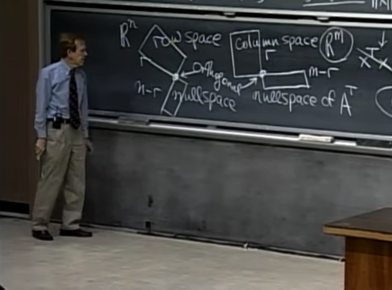</kbd></p>

> [!NOTE]
> gs: correct. Và ta có thể thấy kiểu như **2 subspace
> Rowspace và Nullspace khắc họa nên R^n**.
>
> Còn **Columns space và Left nullspace** khắc họa nên
> **R^m**

<br>

<a id="node-423"></a>

<p align="center"><kbd></kbd></p>

> [!NOTE]
> Tiếp gs đặt câu hỏi là, tưởng tượng trong R^3, ta lấy hai
> subspace là **2 orthogonal line** (đương nhiên đi qua gốc
> zero), và chúng **KHÔNG** **CÙNG NHAU KHẮC HỌA NÊN CẢ
> R^3**(vì chúng chỉ tạo một plane)
>
> Thì gs hỏi là: Có khi nào một rowspace và nullspace đóng
> vai của hai line đó `-` tức 2 subspace orthogonal nhưng
> không tạo toàn bộ R^3
>
> Me: Không, vì tính chất**tổng dimension của rowspace (r)
> và nullspace `(n-r)` phải bằng n**. Do đó không thể có vụ 
> rowspace và nullspace đều là subspace của R^3 (matrix có
> 3 cols) mà mỗi cái đều là một line (dim `=` 1) được

<br>

<a id="node-424"></a>

<p align="center"><kbd>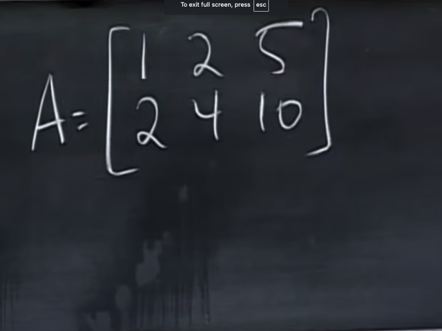</kbd></p>

> [!NOTE]
> Gs cho ví dụ này, dễ thấy hai row dependent, `->` chỉ có **1
> independent row** `->` **rowspace có dim `=` 1**, và do đó
> matrix rank 1, và cũng dẫn tới chỉ có 1 independent cols,
> nên chỉ có **2 free cols** ứng với 2 special solution `->` chỉ
> có 2 vector trong basis và do đó **nullspace có dim `=` 2
>
> Và đúng là 1 `+` 2 `=` 3 (cả rowspace và nullspace là
> subspace của R3)**

<br>

<a id="node-425"></a>

<p align="center"><kbd>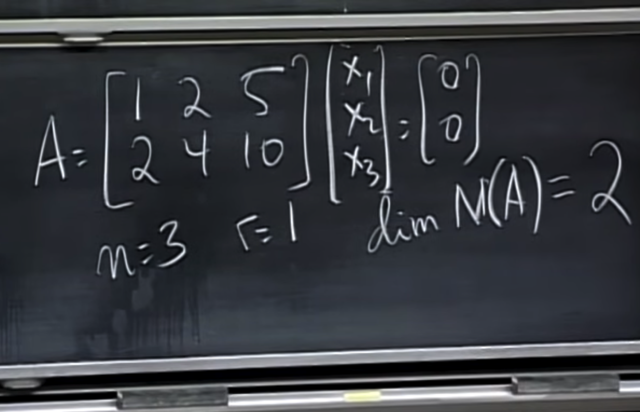</kbd></p>

> [!NOTE]
> gs: correct, ta có **rowspace là 1 line**: vector [1 2 5].T và
> **nullspace là một plane**.
>
> gs: **Plane nào?**
>
> me: Plane quy định bởi phương trình **1***x1 `+` **2***x2 `+`
> **5***x3 `=` 0 Đó chính là**phương trình đường mặt phẳng
> nullspace**: tập hợp tất cả các vector `/` đường thẳng vuông
> góc với vector [1 2 5]
>
> gs: correct
>
> Và liên hệ với 18.02 ta biết <1, 2, 5> **chính là NORMAL
> VECTOR** (vector pháp tuyến) của mặt phẳng, nó sẽ
> **vuông góc với mọi vector trong mặt phẳng**. Vậy từ đó
> trong trường hợp này bức tranh về rowspace C(AT) và
> nullspace N(A) rất rõ rằng, **C(AT) chính là line đi qua
> normal vector**và  **N(A) chính là plane**. Và xác nhận lại
> rằng mọi vector trong plane (nullspace) đều vuông góc với
> normal vector (mọi vector trong row space)

<br>

<a id="node-426"></a>

<p align="center"><kbd>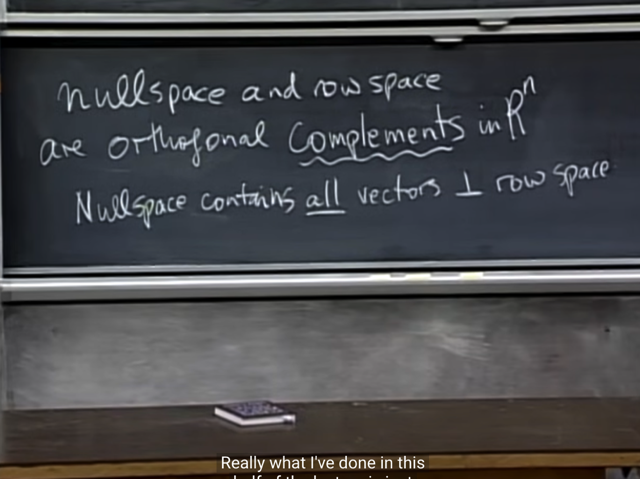</kbd></p>

> [!NOTE]
> và, đại khái là vì ta có hai subspace này (nullspace và
> rowspace) **orthogonal** đồng thời**tổng dimension của
> chúng bằng n**. Nên tgọi chúng là **ORTHOGONAL
> COMPLEMENT IN R^N**

<br>

<a id="node-427"></a>

<p align="center"><kbd>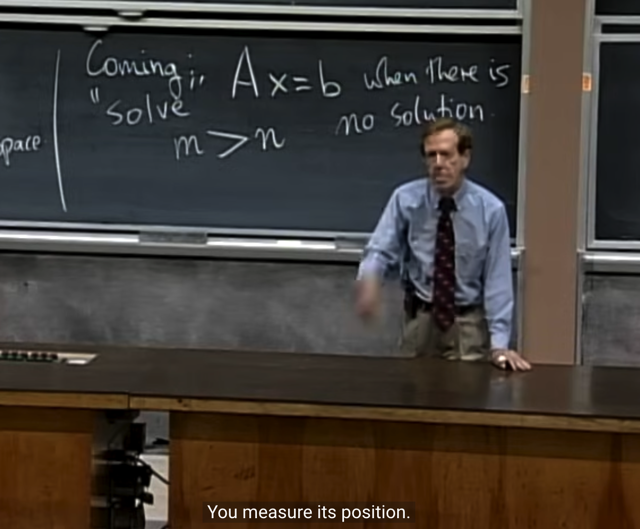</kbd></p>

> [!NOTE]
> Tiếp gs cho biết ta sẽ bàn **LEAST SQUARE** `-` **giải `Ax=b`
> khi mà không có solution** `-` tức là **khi b không nằm trong
> cols space**.
>
> Và bên cạnh đó ta sẽ **đặt mình trong trạng thái m > n**,
> tức ta có matrix **cao ốm**, nơi **có số cols ít hơn số row**.
> Thế thì vì trong trạng thái này, cols space là subspace của
> Rm, nhưng lại chỉ có n < m cols, nên **chắc chắn các cols
> không span hết được Rm**. Do đó **chắc chắn tồn tại b
> khiến `Ax=b` vô nghiệm**.
>
> Gs cho rằng ví dụ về matrix như này có rất nhiều, ví dụ
> như ta **đo heart rate**, chỉ có một variable, nhưng mỗi lần
> đo ta sẽ một giá trị khác, để rồi ta có rất nhiều equation,
> nhưng chỉ có 1 cols. Và **giá trị khác nhau mỗi lần là do
> noise**, tuy nhiên bên trong giá trị **vẫn chứa thông tin**.
> Và ta **muốn tách những thông tin hữu ích ra khỏi noise**

<br>

<a id="node-428"></a>

<p align="center"><kbd>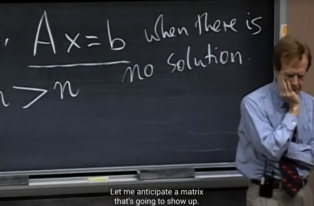</kbd></p>

> [!NOTE]
> Gs cho rằng ta có thể nghĩ đến việc **tiếp cận** giải pháp
> bằng cách **THROW AWAY CÁC EQUATION CHO ĐẾN
> KHI TA CÓ MỘT INVERTIBLE MATRIX VÀ TỪ ĐÓ CÓ
> THỂ CÓ SOLUTION**
>
> Nhưng rõ ràng việc này **không hợp lí**, vì **không có lí do gì
> để cho rằng equation này thì tốt hơn equation khác** để
> mà **vứt đi bớt**

<br>

<a id="node-429"></a>

<p align="center"><kbd>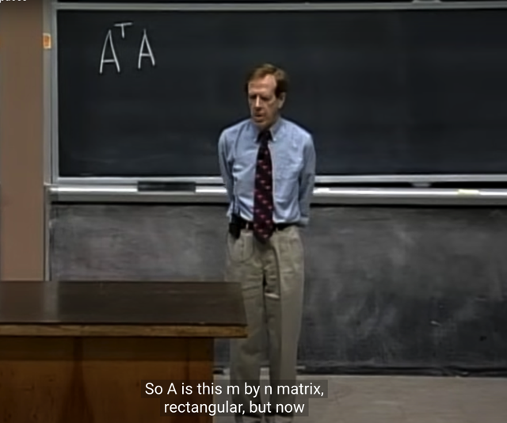</kbd></p>

> [!NOTE]
> Gs đề nghị ta **nghĩ về matrix này ATA**, câu hỏi là, nó là
> matrix ntn?
>
> me: **square**, điều này dễ thấy. Và cũng **đối xứng
> (symmetric)**: Và ta cũng đã chứng minh cái này mà cũng
> dễ chứng minh lại:
>
> (ATA)T `=` AT(ATT) `=` ATA. Tức là bằng cách cho thấy **ATA
> transpose của nó bằng chính nó nên ATA đối xứng.**

<br>

<a id="node-430"></a>

<p align="center"><kbd>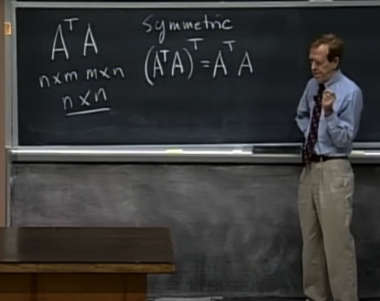</kbd></p>

> [!NOTE]
> đúng vậy, nó **square**, và còn**đối xứng**. vì
> **(ATA)T cũng bằng ATA**

<br>

<a id="node-431"></a>

<p align="center"><kbd>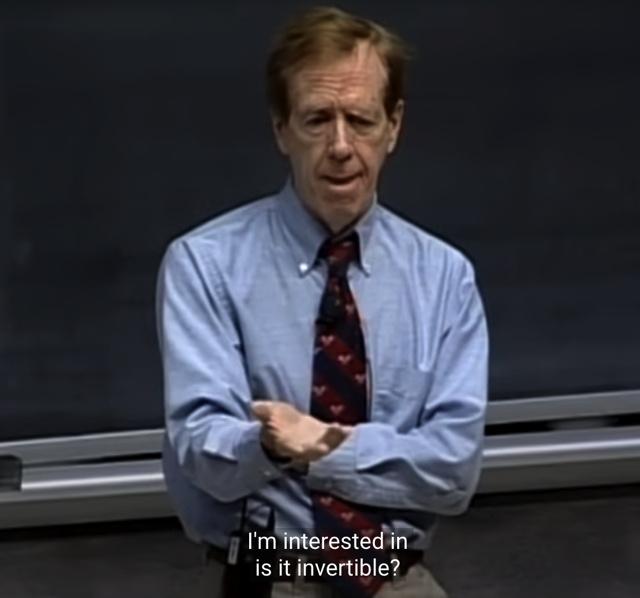</kbd></p>

> [!NOTE]
> Câu hỏi tiếp theo là nó **có
> invertible không?**

<br>

<a id="node-432"></a>

<p align="center"><kbd>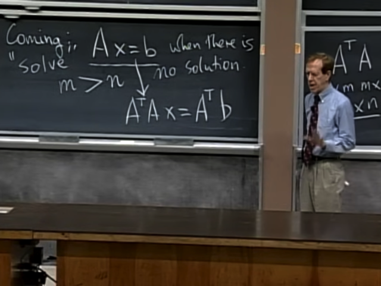</kbd></p>

> [!NOTE]
> Đại khái là, từ `Ax=b,` là equation mà gs đã nói ở trên đại ý
> là **khả năng cao nó không có solution** (vì như đã nói C(A)
> không span toàn bộ Rm)
>
> gs cho rằng tôi sẽ **nhân hai vế của `Ax=b` với AT** để hi vọng
> rằng **có thể có solution của phương trình này**, gs gọi là **x^**

<br>

<a id="node-433"></a>

<p align="center"><kbd>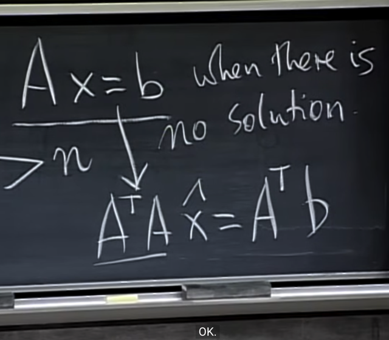</kbd></p>

> [!NOTE]
> Và khi đó **ATAx^ `=` ATb**sẽ là equation mà ông gọi là **good
> equation**

<br>

<a id="node-434"></a>

<p align="center"><kbd>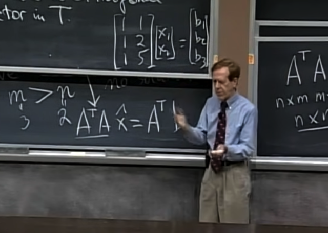</kbd></p>

> [!NOTE]
> Gs lấy ví dụ như matrix này, 3 rows, 2 cols. **Dễ thấy rank `=` 2**
>
> Và như đã nói chỉ khi nào b **NẰM TRÊN COLS SPACE
> `-` LÀ 2D PLANE TRONG R3**, THÌ mới system of equation
> này mới solvable

<br>

<a id="node-435"></a>

<p align="center"><kbd>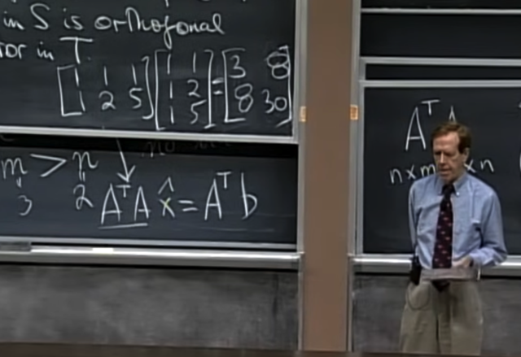</kbd></p>

🔗 **Related:** [LECTURE 14: ORTHOGONAL VECTORS AND SUBSPACES](untitled.md#node-439)

> [!NOTE]
> Và **tính ATA** ra, ta **có thể thấy nó invertible** vì nó
> fullrank
>
> Tuy nhiên gs cho biết **không phải lúc nào ta cũng có
> invertible ATA**(Ta sẽ gặp lại ATA sau, trong đó ta s**ẽ chứng minh ATA
> fullrank chỉ khi nào A full column rank (theo link)**

<br>

<a id="node-436"></a>

<p align="center"><kbd>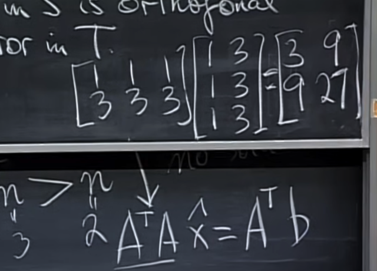</kbd></p>

> [!NOTE]
> Ví dụ như matrix này, không invertible, vì result
> matrix chỉ có**rank `=` 1**

<br>

<a id="node-437"></a>

<p align="center"><kbd>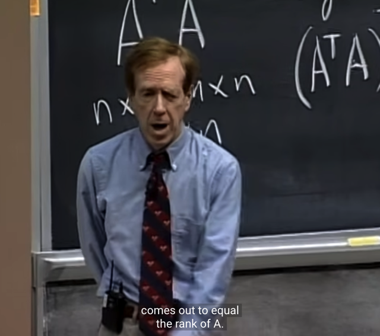</kbd></p>

> [!NOTE]
> và gs nói rằng ông đã biết chắc kết quả sẽ không invertible
> vì **ATA SẼ CÓ RANK CHÍNH XÁC BẰNG RANK CỦA A**.
> mà trong trường hợp này RANK A `=` 1, NÊN ATA CŨNG
> CÓ RANK BẰNG 1, TRONG KHI NÓ LÀ MATRIX 2X2
> NÊN NÓ KHÔNG FULLRANK

<br>

<a id="node-438"></a>

<p align="center"><kbd>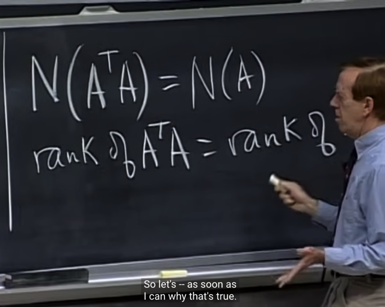</kbd></p>

> [!NOTE]
> Như vậy **Nullspace của A cũng chính là nullspace của ATA**
> (vì **Ax=0 tương đương ATAx `=` 0**)
>
> và **rank cũng chúng cũng bằng nhau nữa**

<br>

<a id="node-439"></a>

<p align="center"><kbd>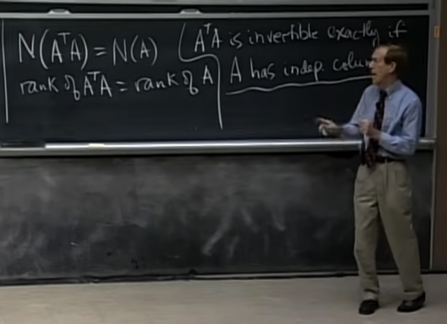</kbd></p>

🔗 **Related:** [LECTURE 14: ORTHOGONAL VECTORS AND SUBSPACES](untitled.md#node-435)

🔗 **Related:** [LECTURE 16: PROJECTION MATRICES AND LEAST SQUARES](untitled.md#node-523)

> [!NOTE]
> Và từ đó gs kết luận **ATA INVERTIBLE CHỈ KHI A CÓ CÁC
> COLS INDEPENDENT (FULL COLUMNS RANK)**
>
> \~Điều này có thể dễ hiểu bởi, vì ATA có shape (n, n) và rank
> của nó bằng rank A, vậy rõ ràng chỉ khi nào rank A bằng n thì
> ATA mới `full-rank.` Và điều này xảy ra tức là khi CÁC COLS
> CỦA ĐỀU LÀ PIVOT, và cũng chính là nullspace của A CHỈ
> CÓ ZERO (vì không có free cols nào)\~
>
> Chứng minh **ATAx=0 `<=>` Ax `=` 0 như sau (sau này gs sẽ
> chứng minh cái này (theo link)**:
>
> Nếu Ax `=` 0 thì nhân hai vế cho AT đương nhiên ta có  ATAx
> ```text
> = 0. Vậy Ax = 0 => ATAx = 0.
> ```
>
> Ngược lại, nếu ATAx `=` 0, nhân hai vế cho xT ta có:
>
> ```text
> xTATAx = 0 <=> (Ax)T(Ax) = 0 <=> ||Ax|| = 0, mà length của
> ```
> vector Ax `>=` 0 nên dấu bằng xảy chỉ khi Ax `=` 0. Vậy ATAx `=` 0
> `=>` Ax `=` 0
>
> Từ đó giúp kết luận ATAx `=` 0 `<=>` Ax `=` 0, hai matrix ATA  và A
> chung nullspace **N(ATA) `=` N(A)**. Vậy thì đương nhiên để
> **ATA fullrank/non-singular/invertible** thì **N(ATA) phải bằng
> {0}**, đồng nghĩa **N(A) cũng vậy**, mà điều này dễ thấy sẽ
> tương đương với việc**A Full Column Rank khi đó dim C(A)
> `=`  rank `=` n `=>` dim N(A) `=` 0**

<br>

<a id="node-440"></a>

<p align="center"><kbd>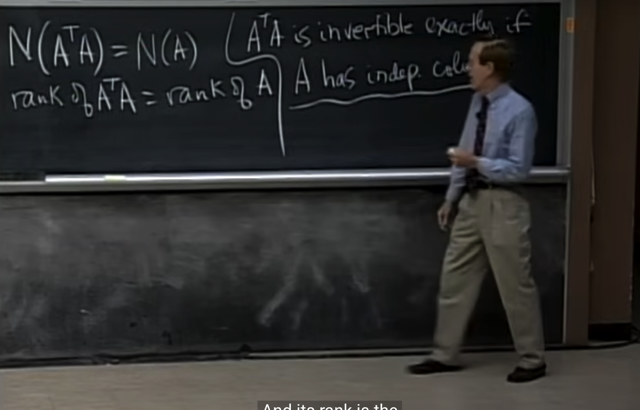</kbd></p>

> [!NOTE]
> Và bài sau ta sẽ thấy ATA đóg vai trò **CRUCIAL**

<br>

