# Lecture 15: Projections Onto Subspaces

📊 **Progress:** `45` Notes | `48` Screenshots

---
<a id="node-442"></a>

<p align="center"><kbd>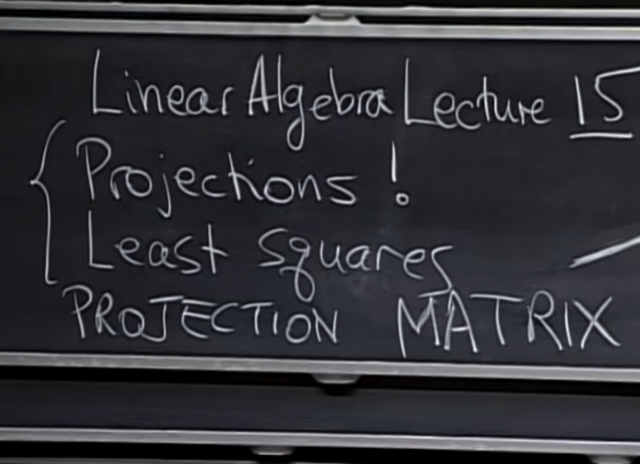</kbd></p>

<br>

<a id="node-443"></a>

<p align="center"><kbd>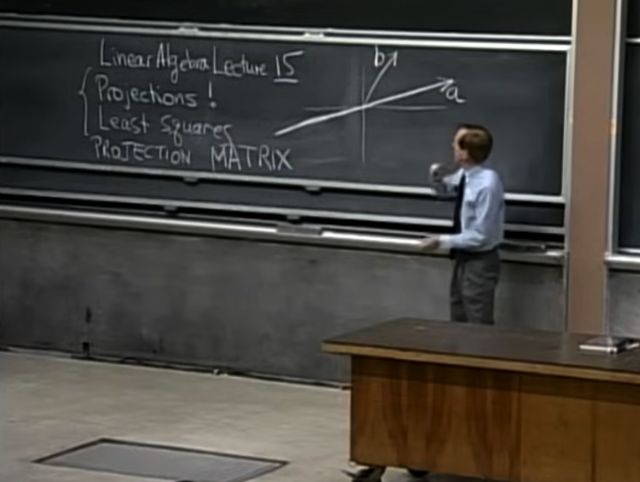</kbd></p>

> [!NOTE]
> gs cho rằng đây là một bài **rất quan trọng** khi ta sẽ nói về
> **projection lên subspace**
>
> Đầu tiên, gs dùng ví dụ trong **1D dimension subspace** `-` đó là 
> **đường thẳng a**: **tìm điểm trên a sao cho gần nhất với b**

<br>

<a id="node-444"></a>

<p align="center"><kbd>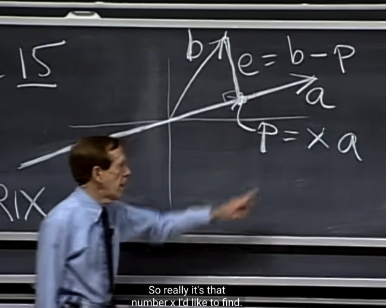</kbd></p>

> [!NOTE]
> ok thế thì với bài toán này, ta biết rằng, mình cần**tìm
> điểm (vector p) như hình vẽ**, và **e (viết tắt của error)** sẽ
> thể hiện **difference giữa b và p**, cho ta biết **sai số ta sẽ
> chịu khi project b lên a**.
>
> Và **vector p nằm trên phương vector a**, ta có **p `=` xa** và 
> bài toán trở thành **tìm p** tức là tìm ra x.

<br>

<a id="node-445"></a>

<p align="center"><kbd>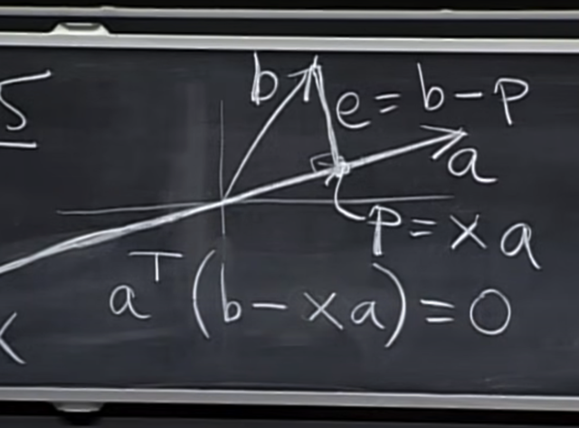</kbd></p>

> [!NOTE]
> Mọi thứ (cái vụ vuông góc) thể hiện qua equation này: 
>
> ```text
> aTe = 0 <=> aT(b-p) = 0 <=> aT(b-xa) = 0 <=> aT(b-xa) = 0
> ```

<br>

<a id="node-446"></a>

<p align="center"><kbd>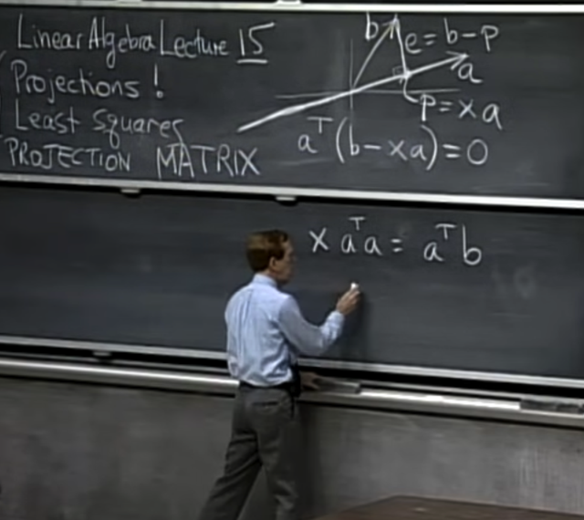</kbd></p>

> [!NOTE]
> triển khai ra, chuyển vế ta có thế này:
>
> ```text
> aT(b-xa) = 0 <=> aTb-aTxa = 0
> ```
>
> `<=>` aTb `=` aTxa `=` xaTa (vì x là scalar nên move đi đâu cũng
> được)

<br>

<a id="node-447"></a>

<p align="center"><kbd>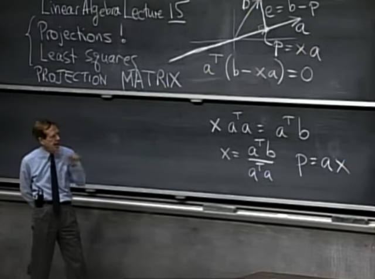</kbd></p>

> [!NOTE]
> và chia hai vế cho aTa, ta có x `=` aTb `/` aTa 
>
> Và đó là cái cần tìm khi giải bài toán tìm projection của 
> b trên a

<br>

<a id="node-448"></a>

<p align="center"><kbd>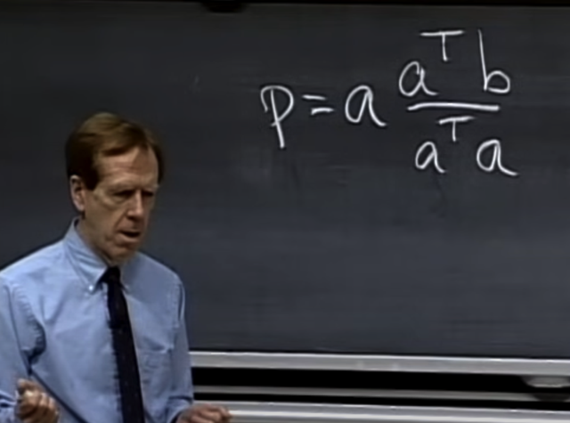</kbd></p>

> [!NOTE]
> thay x vào p `=` ax ta có p tính theo a, b như vầy.
> Gs đặt câu hỏi **gỉa sử cho b scale lên thành 2b**
> thì **projection của nó trên a sẽ ra sao**. 
>
> Me: sẽ scale lên **thành 2p**

<br>

<a id="node-449"></a>

<p align="center"><kbd>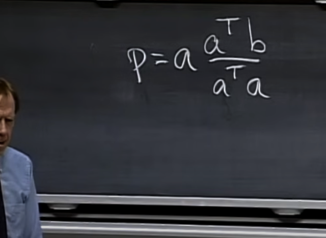</kbd></p>

> [!NOTE]
> gs: Correct. Thế nếu double a lên?
>
> Thì nó không thay đổi gì. Như công thức có thể thấy a
> thành 2a thì cả tử và mẫu cũng đều x4, và nó sẽ
> cancel nhau nên p không thay đổi gì

<br>

<a id="node-450"></a>

<p align="center"><kbd>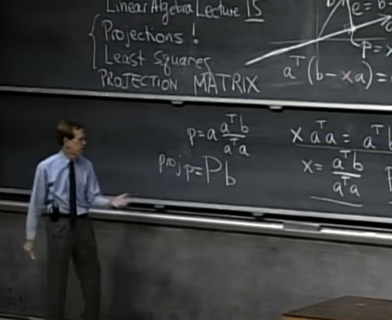</kbd></p>

> [!NOTE]
> thế thì gs cho biết ta có thể**biểu diễn phép projection bởi
> một matrix**, gọi nó là **Projection matrix P**, và **thông qua
> nó ta sẽ tìm được projection của vector b**

<br>

<a id="node-451"></a>

<p align="center"><kbd>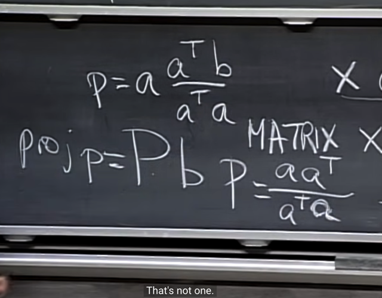</kbd></p>

> [!NOTE]
> Và **aaT/aTa chính là matrix P**, mẫu số là một
> **scalar** (dot product của a với chính nó) và **aaT
> là một cols x một row** `->` như ta đã biết nó là
> một **RANK 1 MATRIX**

<br>

<a id="node-452"></a>

<p align="center"><kbd>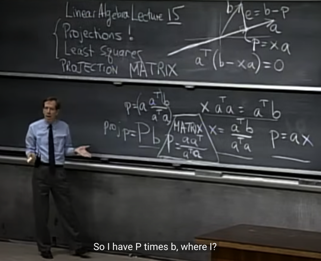</kbd></p>

🔗 **Related:** [LECTURE 15: PROJECTIONS ONTO SUBSPACES](untitled.md#node-468)

> [!NOTE]
> Ở đây gs cho biết m**ột điểm tuy dễ hiểu** nhưng kiểu như
> ta **có thể chưa để ý tới** đó là **column space của matrix
> P** sẽ là **subspace** mà khi ta n**hân P với một vector nào
> đó**, **kết quả sẽ luôn nằm trong columns space của P.**Và
> đương nhiên không chỉ Projection matrix P mà là bất kì
> matrix nào
>
> Điều này dễ hiểu, vì khi **nhân matrix A với vector u** nào đó
> thì kết quả đương nhiên là một **linear combination các cols
> của A** , và nó **sẽ là một vector thuộc columns space**.
>
> Vậy gs hỏi rằng **columns space của P là gì**, hay nói cách
> khác, khi tôi n**hân P với vector b thì kết quả ở đâu?**
>
> `->` matrix **P là rank 1 matrix**, có **cols space với dim `=` 1**,
> và vector a chính là vector duy nhất trong basis. Nên **cols
> space của P chính là line đi qua vector a**. Nên kết quả của
> **Pb sẽ vẫn nằm trên line này**

<br>

<a id="node-453"></a>

<p align="center"><kbd>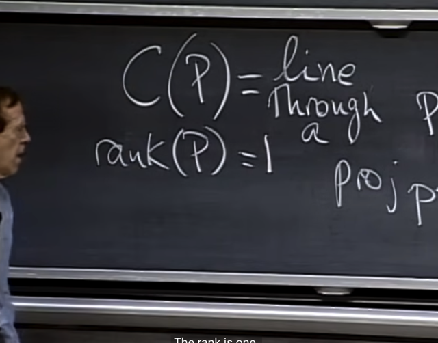</kbd></p>

> [!NOTE]
> Gs: Đúng vậy

<br>

<a id="node-454"></a>

<p align="center"><kbd></kbd></p>

> [!NOTE]
> Tiếp gs cho rằng rất tự nhiên để hỏi tiếp **matrix này có
> symmetric không?**
>
> Có, vì PT `=` **(aaT/aTa)T** `=` `(aaT)T/(aTa)` `=` `aTTaT/aTa` 
>
> `=` **aaT/aTa** `=` P
>
> `=>` tức là vẫn transpose bằng chính nó, nên nó mà 
> **symmetric** matrix

<br>

<a id="node-455"></a>

<p align="center"><kbd>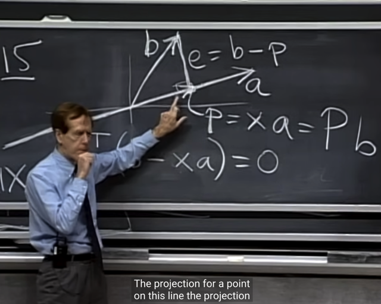</kbd></p>

> [!NOTE]
> Gs hỏi tiếp nếu ta **project lần thứ hai** thì ta sẽ có gì.
>
> `->` Rõ ràng ta **sẽ vẫn ở đó**. Vậy là **P**2 `=` P**

<br>

<a id="node-456"></a>

<p align="center"><kbd>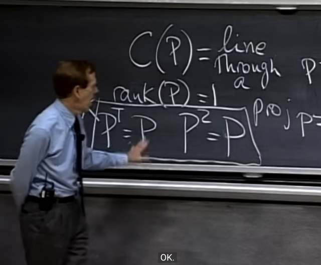</kbd></p>

> [!NOTE]
> Từ đó ta có hai tính chất của
> matrix P: **P.T `=` P và P**2 `=` P**

<br>

<a id="node-457"></a>

<p align="center"><kbd>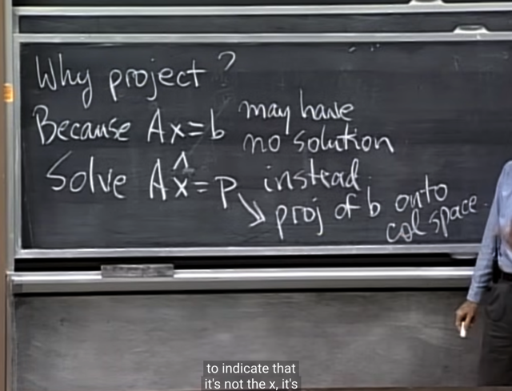</kbd></p>

> [!NOTE]
> Tiếp gs nói về **lí do** mà ta muốn **nghiên cứu về
> Projection**
>
> Đó là vì ở đầu bài ta đã nói là ta đang**deal với một
> equation system Ax=b** mà trong đó **khả năng cao là
> KHÔNG CÓ SOLUTION**, vì lí do có thể như ta có matrix A
> là matrix CAO, ỐM (khi trong các bài toán thực tế ta có
> nhiều sample hơn feature, nhiều equation hơn là số
> variable)
>
> Và matrix CAO, ỐM dẫn đến là **không đủ số cols (n) để
> span được toàn bộ không gian R^m**. Nên luôn có thể **có
> b nằm ngoài cols space** khiến `Ax=b` vô nghiệm
>
> Thành ra để giải quyết, ta có thể**GIẢI MỘT BÀI TOÁN
> KHÁC GẦN VỚI BÀI TOÁN GỐC: Ax^ `=` p**, với p là b
> project lên Cols space của A C(A). Và điều này cũng có
> nghĩa là p **CHẮC CHẮN NẰM TRONG C(A) ĐỂ TỪ ĐÓ
> Ax^ `=` p CHẮC CHẮN SOLVABLE**
>
> Kí hiệu x^ để ám chỉ solution này là của bài toán gần với
> bài toán gốc

<br>

<a id="node-458"></a>

<p align="center"><kbd>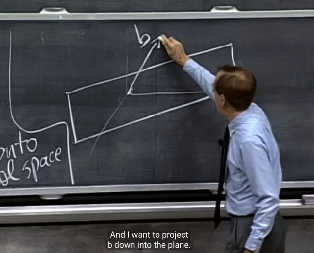</kbd></p>

> [!NOTE]
> Nhân tiện gs cũng đang **move từ 1D subspace**, project
> b lên line qua vector a hồi nãy sang **higher dimension**
> subspace `-` **a plane**

<br>

<a id="node-459"></a>

<p align="center"><kbd>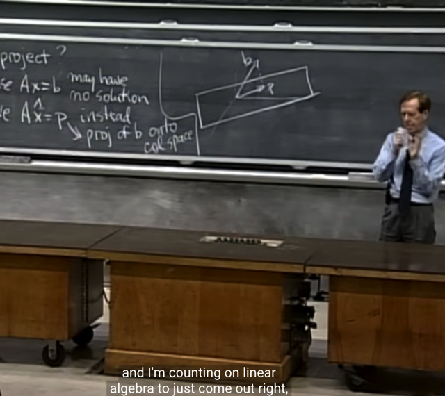</kbd></p>

> [!NOTE]
> Và ta cũng sẽ đi**tìm projection
> của b lên plane này**

<br>

<a id="node-460"></a>

<p align="center"><kbd>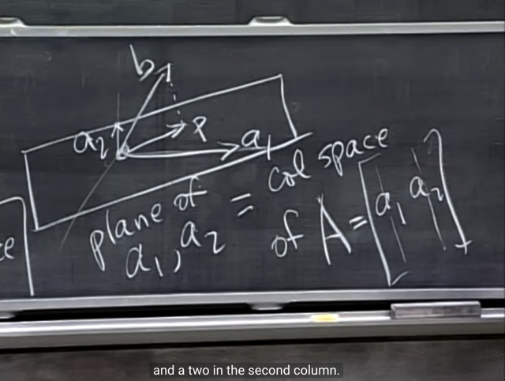</kbd></p>

> [!NOTE]
> Thế thì đầu tiên gs đề nghị ta **định nghĩa plane**. Thì ta đã
> biết, một plane, cụ thể hơn trong ví dụ đang là 2D plane
> trong R3 Thì nó là **2D subspace của R3** thì nó sẽ có 2
> basis vector (hay nói đúng hơn là **cần 2 vector độc lập**
> **để có một basi**s của subspace này). Ta gọi nó là {a1, a2}
>
> Gs cũng cho biết **a1 a2 không nhất thiết vuông góc nhau**,
> vì có vô số basis `-` và như ta còn nhớ **miễn là chúng là hai
> vector độc lập** (khác phương) là đủ thành basis rồi.
>
> Và plane này là columns space của matrix A. **Đồng nghĩa
> a1, a2 là basis của C(A)** `-` và ta xài luôn**hai cols của A
> luôn** vì ta đang coi như có hai column độc lập (để C(A) là
> một plane)
>
> Còn b thì không nằm trong columns space
>
> #lec15

<br>

<a id="node-461"></a>

<p align="center"><kbd></kbd></p>

> [!NOTE]
> Gs nói n**ếu b nằm trong C(A) thì khỏe rồ**i,
> **projection của b lên A sẽ chỉ là chính nó**

<br>

<a id="node-462"></a>

<p align="center"><kbd>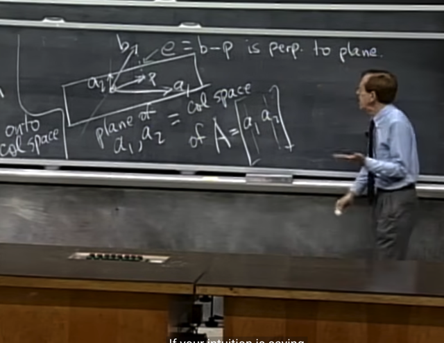</kbd></p>

> [!NOTE]
> Nhưng **b không nằm trong C(A)**, nên ta **gọi e là
> khoảng cách từ b với p**. Xong gs cho rằng, từ trực
> giác ta có **e `=` `b-p` sẽ perpendicular với plane**
>
> (giống như e perpendicular với line a hồi nãy)

<br>

<a id="node-463"></a>

<p align="center"><kbd>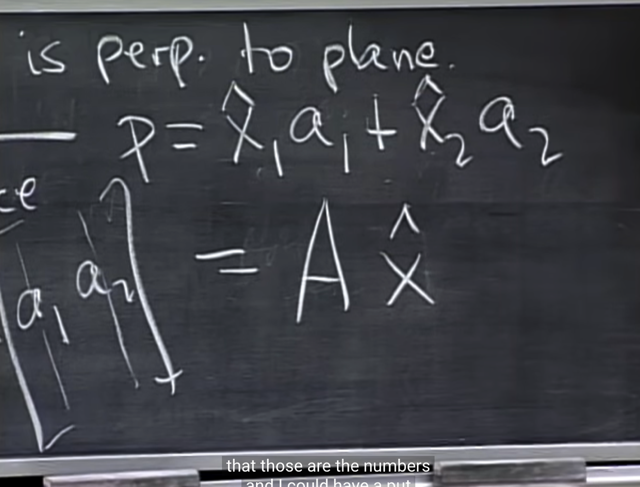</kbd></p>

> [!NOTE]
> Thế thì như đã nói **p là projection của b trên C(A)** nên **p
> thuộc column space** thành ra **CHẮC CHẮN NÓ LÀ MỘT
> LINEAR COMBINATION CỦA HAI BASIS VECTOR a1, a2**. 
>
> Và 2 coefficient trong linear combination này CHÍNH LÀ x^: 
> **[x^1, x^2]**
>
> **p `=` x^1*a1 +x^2*a2**hay ghi thế này cũng được **p `=` Ax^**

<br>

<a id="node-464"></a>

<p align="center"><kbd>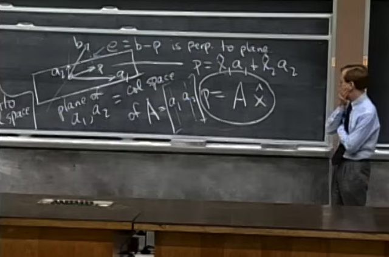</kbd></p>

> [!NOTE]
> Và từ đó cho ta định nghĩa của problem ta đang gỉải quyết:
>
> Việc tìm projection của b trên C(A) sẽ là **TÌM x^ SAO CHO e
>  `=` `b-p` VUÔNG GÓC VỚI C(A)**

<br>

<a id="node-465"></a>

<p align="center"><kbd>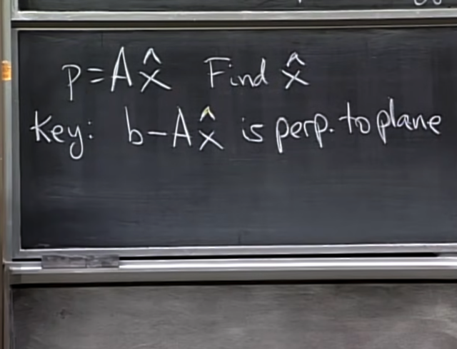</kbd></p>

> [!NOTE]
> Viết lại bài toán đặt ra: tìm x^ sao cho**e `=` `b-p` `=` `b-Ax^` vuông góc với plane
> C(A)**

<br>

<a id="node-466"></a>

<p align="center"><kbd>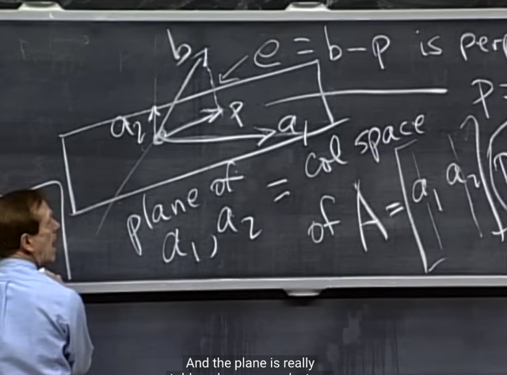</kbd></p>

> [!NOTE]
> Thế thì **e vuông góc với plane** thì cũng có nghĩa là **nó vuông
> vóc với mọi vector trong plane** (lưu ý plane này là plane của
> một subspace, nó có đi qua gốc O)
>
> Như vậy **e cũng vuông góc với vector a1, và a2**

<br>

<a id="node-467"></a>

<p align="center"><kbd>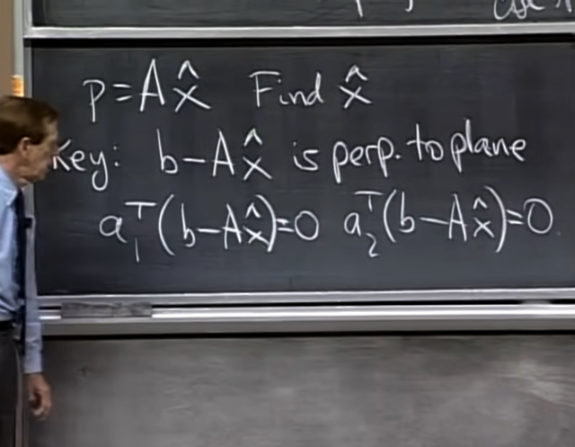</kbd></p>

> [!NOTE]
> Từ đó ta có **dot product của
> e và a1, a2 bằng 0**

<br>

<a id="node-468"></a>

<p align="center"><kbd>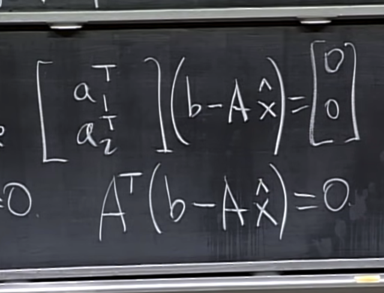</kbd></p>

🔗 **Related:** [LECTURE 15: PROJECTIONS ONTO SUBSPACES](untitled.md#node-452)

> [!NOTE]
> Xong gs muốn thể hiện hai equation trên dưới dạng matrix
>
> a1T và a2T `-` tức là transpose hai columns của A, đương nhiên 
> sẽ có matrix AT, ta có: **AT(b-Ax^) `=` 0**
>
> để ý rằng hồi nãy, equation ta có là **aTe `=` `aT(b-Ax^)` `=` 0**
> còn bây giờ ta có hai vector a1 a2 basis của C(A) nên ta
> có : **AT(b-Ax^) `=` 0**

<br>

<a id="node-469"></a>

<p align="center"><kbd>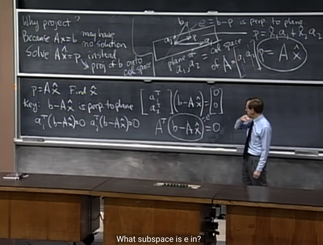</kbd></p>

> [!NOTE]
> Tiếp, gs đề nghị ta, vì bây giờ đã biết về 4 subspace, thì ta
> hãy đưa nó vào đây.
>
> ```text
> Đầu tiên đó là, trong AT(b-Ax^) = 0, thì e=b-Ax^ connect với
> ```
> subspace nào?
>
> Me: Đương nhiên V**Ì e LÀ SOLUTION CỦA ATy=0** nên nó
> chính là **nằm trong nullspace của A.T,** HAY CÒN **GỌI LÀ
> LEFT NULLSPACE** **CỦA A**

<br>

<a id="node-470"></a>

<p align="center"><kbd>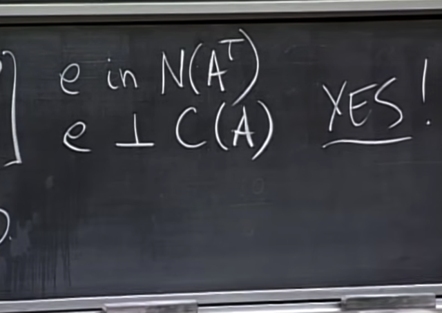</kbd></p>

> [!NOTE]
> Tiếp equation ATe `=` 0 có nghĩa là **e nằm trong nullspace
> của AT**, và vì vậy **nó sẽ vuông góc với columns space
> của A** vì bài trước ta đã biết các **cặp subspace
> orthogonal** là (nullspace of A và rowspace of A),
> (nullspace of A.T và columspace of A)

<br>

<a id="node-471"></a>

<p align="center"><kbd>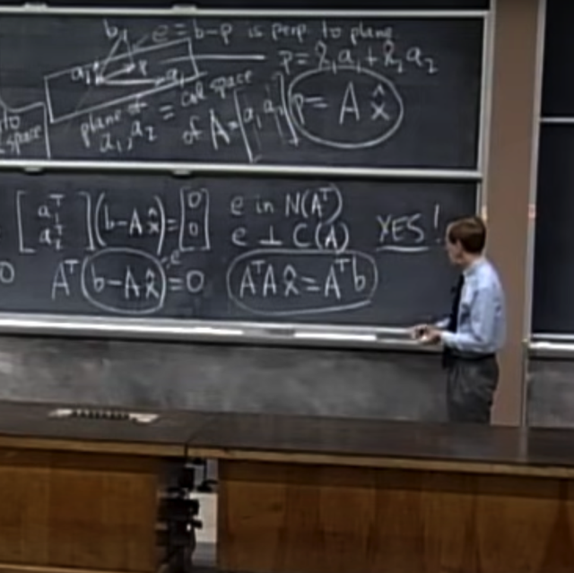</kbd></p>

> [!NOTE]
> nhân AT vào `(b-Ax^),` chuyển ATb qua bên
> phải ta có equation **ATAx^ `=` ATb**

<br>

<a id="node-472"></a>

<p align="center"><kbd>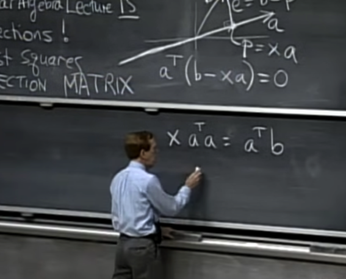</kbd></p>

<p align="center"><kbd></kbd></p>

<p align="center"><kbd>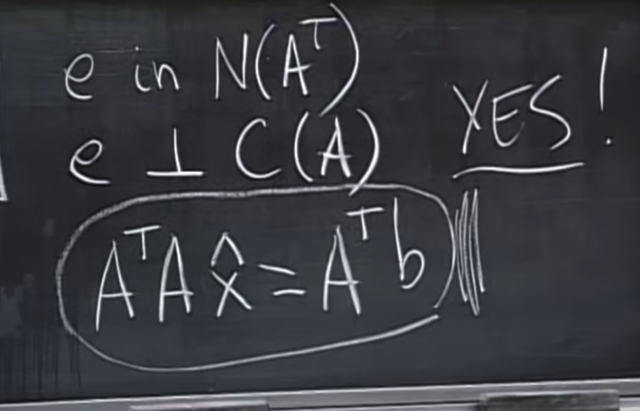</kbd></p>

> [!NOTE]
> gs nhận xét rằng, hồi nãy với 1 dimension, ta có **aTa là
> scalar**, aTb cũng là scalar, và x sẽ là một factor giữa hai con
> số đó. Còn bây giờ ta có **ATA là nxn matrix.**

<br>

<a id="node-473"></a>

<p align="center"><kbd>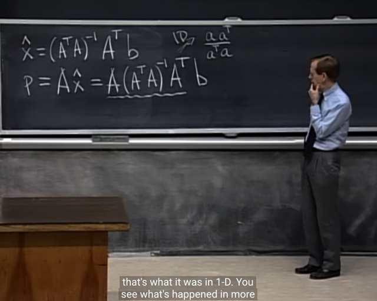</kbd></p>

> [!NOTE]
> Thế thì câu hỏi là **x^ là gì**, và **projection p là gì**.
>
> Vậy thì từ **ATAx^ `=` ATb**, **nhân hai vế cho (ATA)_inv** ta sẽ có 
> **x^** `=` **(ATA)_invATb**
>
> Và p `=` Ax^ (hồi nãy đã nói, p là projection của b lên column
> space của A nên p là linear combination của các A cols hay **p
> `=` Ax^**)
>
> Giờ **có x^ rồi** thì thế vào ta có **p `=` A(ATA)^-1ATb**
>
> Và gs liên hệ nó với trường hợp 1D hồi nãy, a là vector, thì
> **p `=` aaT/aTab** còn bây giờ A là matrix thì công thức là vậy.
>
> Thì nó cũng như nhau thôi vì **1/aTa cũng chính là (aTa)^-1**
>  `-` có thể coi là inverse của aTa

<br>

<a id="node-474"></a>

<p align="center"><kbd>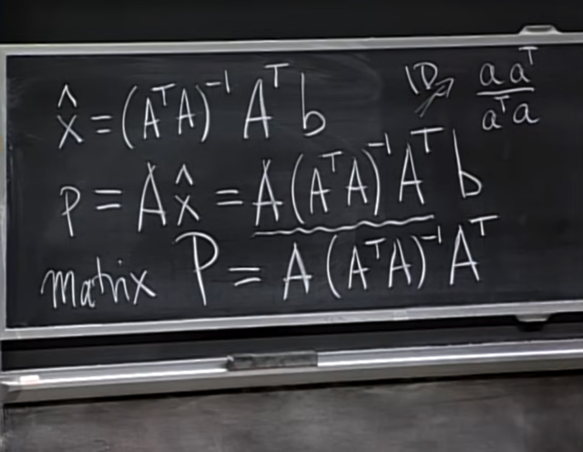</kbd></p>

> [!NOTE]
> và projection matrix P
> chính là **A(ATA)invAT**

<br>

<a id="node-475"></a>

<p align="center"><kbd>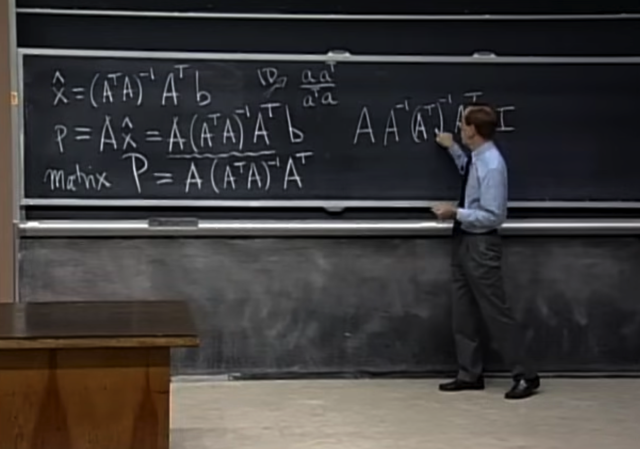</kbd></p>

> [!NOTE]
> tiếp, gs **GIẢ BỘ RẰNG ta tuân theo rule**:
>
> (ATA)inv `=` Ainv(AT)inv
>
> thì khi đó P sẽ hóa ra AAinv(AT)invAT `=` I.I `=` I
>
> Rõ ràng là **sai**. Và gs cho rằng, ta sai là bởi **A không
> phải là square invertible matrix**, vì như đã nói ban đầu **A
> là LONG & THIN MATRIX** có vài cols nhưng nhiều row.
>
> **DO ĐÓ Ainv KHÔNG TỒN TẠI.**
>
> Và **cái rule ở (ATA)inv `=` Ainv(AT)inv chỉ đúng khi A square
> & invertible matrix** mà thôi

<br>

<a id="node-476"></a>

<p align="center"><kbd>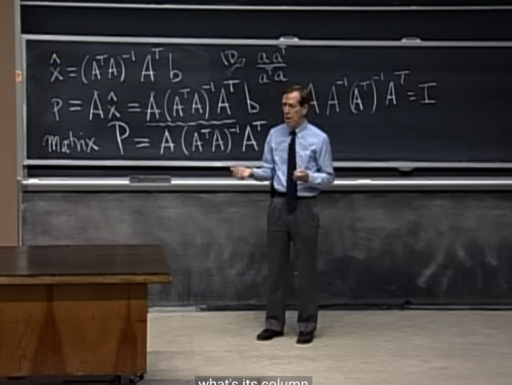</kbd></p>

> [!NOTE]
> gs: Thế thì **nếu A square invertible** thì sao?
>
> khi đó **cols space của A là gì.**
>
> `->` **Rn**, vì khi đó **mọi n cols và n rows của A đều là
> independent**, chúng sẽ **span toàn bộ Rn**

<br>

<a id="node-477"></a>

<p align="center"><kbd></kbd></p>

> [!NOTE]
> Gs: correct. Thế thì **khi đó**, **Projection** **matrix** (tức là cái
> matrix **giúp làm cái việc projection**) sẽ là gì khi ta
> project b LÊN COLS SPACE CỦA A, MÀ LÚC NÀY LÀ
> THE WHOLE SPACE R^N
>
> Me: Đương nhiên **b đã nằm trong Rn** rồi mà **giờ project
> nó "lên" Rn** thì đương nhiên**chả cần làm gì**, tức là 
> chỉ cần nhân với Identity matrix `->` **P `=` I**

<br>

<a id="node-478"></a>

<p align="center"><kbd>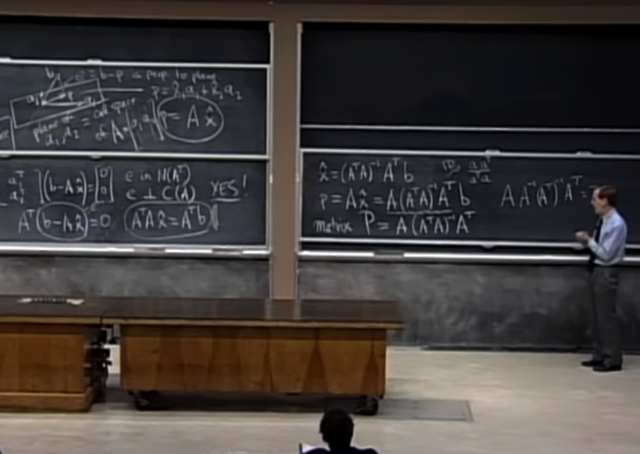</kbd></p>

> [!NOTE]
> Gs: Đúng vậy, khi A invertible, và **C(A) CHÍNH LÀ TOÀN
> BỘ Rn** thì ta**được phép triển khai như vừa rồi**và **sẽ
> thấy rằng P chính là I**
>
> Nhưng khi C(A) không phải là R^n mà chỉ là một subspace
> của R^n thì ta không được làm vậy

<br>

<a id="node-479"></a>

<p align="center"><kbd>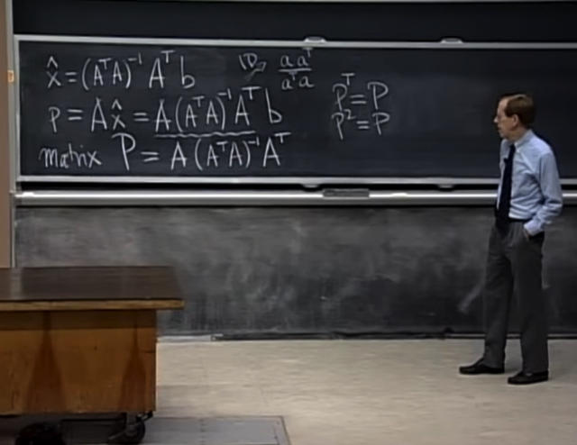</kbd></p>

> [!NOTE]
> Tiếp, gs cho rằng ta **vẫn sẽ có 2 tính chất của
> projection** matrix P đó là **symmetric**.
>
> Điều này dễ thấy vì **(ATA)inv** sẽ symmetric vì **ATA
> symmetric**. Nên [**A(ATA)invAT]T sẽ vẫn bằng
> A(ATA)invAT thôi**

<br>

<a id="node-480"></a>

<p align="center"><kbd>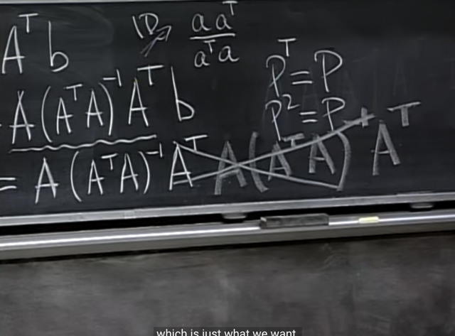</kbd></p>

> [!NOTE]
> và**tính chất thứ hai là projection** của projection thì vẫn
> vậy. Và dễ dàng thấy điều này là đúng khi**nhân P với P
> vẫn ra lại P: 
>
> PP =**A(ATA)inv**AT A(ATA)inv**AT `=` A(ATA)invAT `=` P

<br>

<a id="node-481"></a>

<p align="center"><kbd>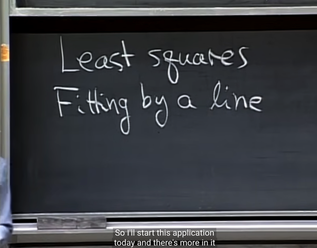</kbd></p>

> [!NOTE]
> và gs cho rằng **ta sẽ bắt đầu "xài" matrix P** này, trong các
> bài toán mà ta cần **solve một system of equation** có **rất
> nhiều equation**. Và một application điển hình **chính là bài
> toán LEAST SQUARE**

<br>

<a id="node-482"></a>

<p align="center"><kbd>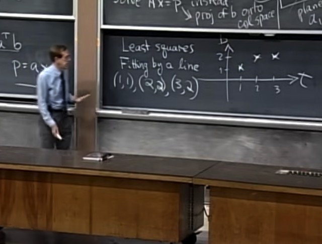</kbd></p>

> [!NOTE]
> Và bài toán là ta cần vẽ,**tìm một đường thẳng** sao cho
> nó **fit được với 3 điểm này**

<br>

<a id="node-483"></a>

<p align="center"><kbd>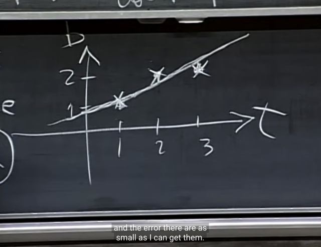</kbd></p>

> [!NOTE]
> sao cho các
> error nhỏ nhất

<br>

<a id="node-484"></a>

<p align="center"><kbd>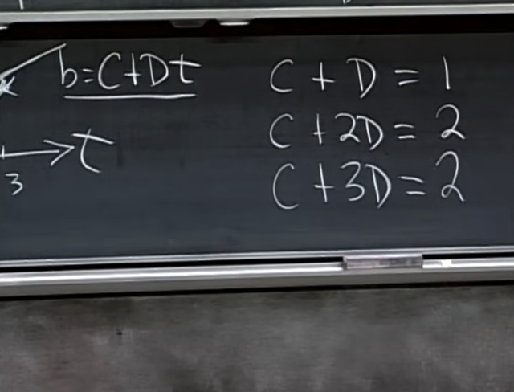</kbd></p>

> [!NOTE]
> gs đề nghị đầu tiên hãy tìm matrix thể hiện bài toán này.
>
> Vậy ta gọi đường thẳng cần tìm là **b `=` C `+` D*t**
>
> Vậy dựa vào việc**ta muốn nó đi qua 3 điểm** trên nên
> ta có
>
> ```text
> t = 1, b = 1 ->  C + D = 1
> ```
>
> ```text
> t = 2, b = 2 -> C + 2D = 2
> ```
>
> ```text
> t = 3, b = 2 -> C + 3D = 2
> ```
>
> Đương nhiên nếu system of equation này giải được thì
> ta đã có solution (C, D) tức là xác định được đường
> thẳng đi qua 3 điểm rồi.

<br>

<a id="node-485"></a>

<p align="center"><kbd>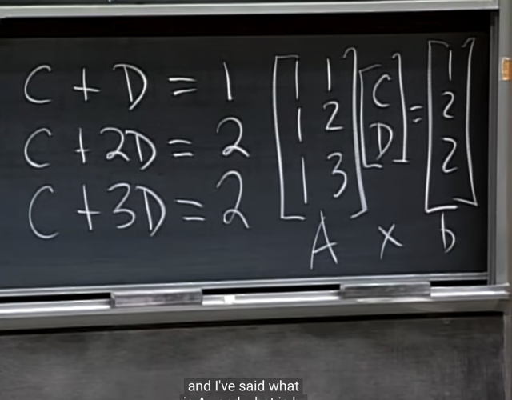</kbd></p>

> [!NOTE]
> và cái matrix A ở đây sẽ là matrix 3x2 (cao ốm) có hai
> cols là [1, 1, 1].T và [1 2 3].T,
>
> hai variable C, D,
>
> và vector b là [1, 2, 2].T

<br>

<a id="node-486"></a>

<p align="center"><kbd>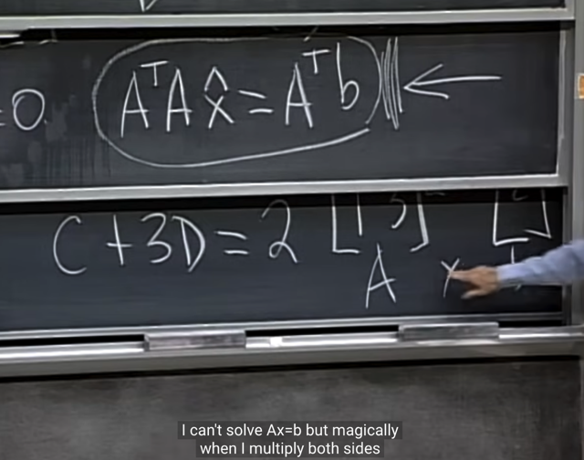</kbd></p>

> [!NOTE]
> Và gs cho rằng, đây `(Ax=b)` như dễ thấy là một equation với no
> solution. Ta sẽ không thể tìm ra C, D
>
> Nhưng ta sẽ vẫn muốn LÀM TỐT NHẤT CÓ THỂ, mang ý
> nghĩa là tuy không thể vẽ được, tìm được đường thẳng đi qua
> cả 3 điểm, giúp error đều `=` 0, nhưng ta có thể tìm ra phương
> án tốt nhất có thể BẰNG CÁCH GIẢI MỘT BÀI  TOÁN KHÁC
> GẦN NHẤT VỚI NÓ mà bài toán đó CÓ  SOLUTION
>
> Đó là **thay vì giải equation Ax `=` b**, ta sẽ **giải equation ATAx^ `=`
> ATb**

<br>

<a id="node-487"></a>

<p align="center"><kbd>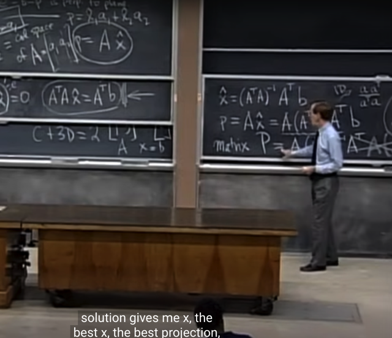</kbd></p>

> [!NOTE]
> Khi đó ta sẽ có được **x^**, và từ đó ta có **best projection**Nội dung này sẽ tiếp tục ở lecture 16

<br>

