# Lecture 16: Projection Matrices And Least Squares

📊 **Progress:** `38` Notes | `46` Screenshots

---

<kbd>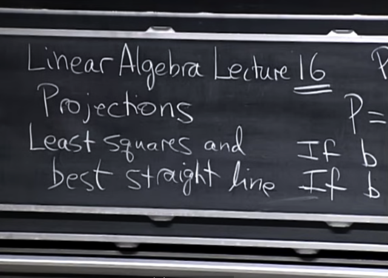</kbd>

 

<kbd>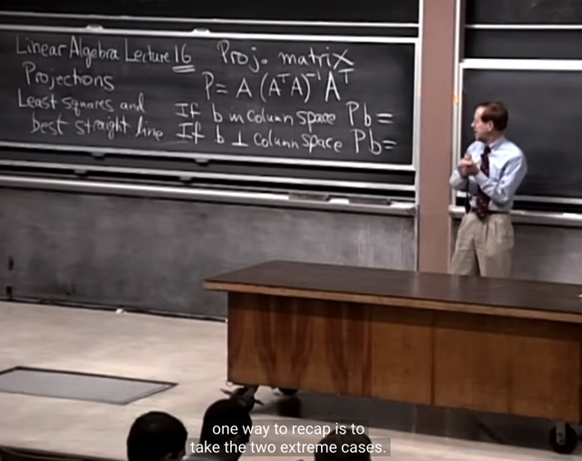</kbd>

 

<kbd>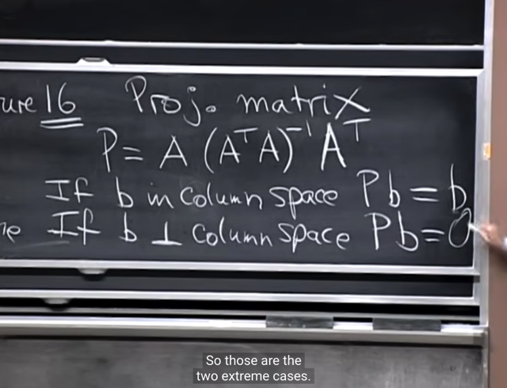</kbd>

> [!NOTE]
> gs đề nghị ta nghĩ về **2 extreme case**:
>
> - Nếu****vector**b ĐÃ NẰM trong column space** thì khi
> project b lên column space của A (bằng projection matrix
> P) đương nhiên sẽ c**hẳng thay đổi g**ì: **Pb = b**
>
> - Nếu vector **b VUÔNG GÓC VỚI cols space của A**,  thì
> dễ thấy sau khi project, ta sẽ **chỉ còn zero vector**. (hình
> dung vector b, và đường thẳng đi qua gốc (vì phải như vậy
> mới là subspace, nhớ không) thì nếu vector b vuông góc
> với đường thẳng, đương nhiên khi project sẽ ngay tại zero,
> tức kết quả projection chỉ là vector zero)

 

<kbd>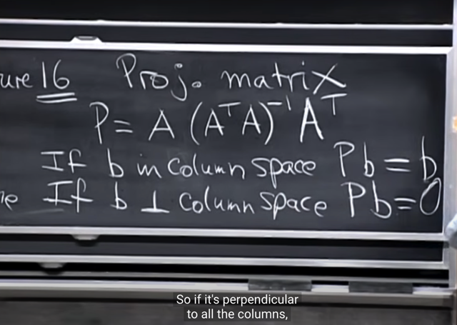</kbd>

> [!NOTE]
> Và nhìn vào **Projection** matrix để giải thích hai case này:
>
> Me:
>
> + Khi b thuộc column space của A, đương nhiên có thể ghi
> là b = Ax (x là vector chứa các coefficient của linear
> combination các A's columns)
>
> nên **p** = Pb = A(ATA)invATAx = A[**(ATA)invATA**]x = Ax =**b**
> (cái ATAinv và ATA nhân nhau thành I. Thành ra kết quả vẫn
> là b
>
> + khi b vuông góc với C(A) thì như đã biết nó sẽ thuộc
> nullspace của AT (solution của ATy=0). Vậy **ATb = 0**
>
> Thành ra Pb = A(ATA)invATb =  A(ATA)inv 0 = 0 -> kết quả
> projection của b lên C(A) ra 0

 

<kbd>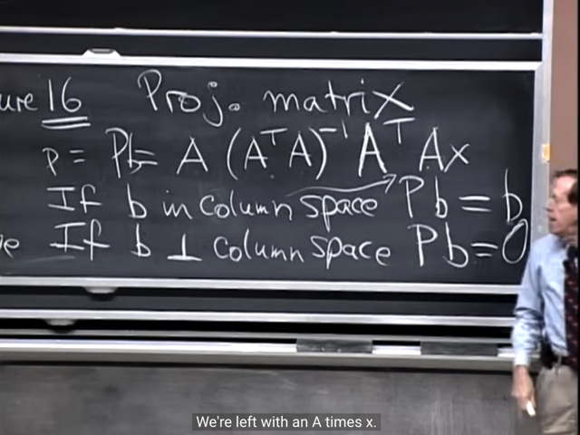</kbd>

<kbd></kbd>

<kbd>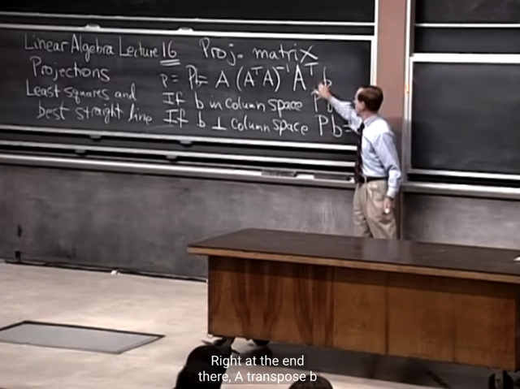</kbd>

> [!NOTE]
> Gs: correct

 

<kbd>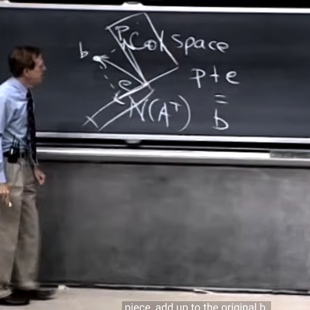</kbd>

> [!NOTE]
> Một hình ảnh **rất hay** và cũng có thể hiểu. Khi b nằm trong
> Rm (không gian lớn, chứa cols space của A). Và cols space
> của A, cùng với nullspace của A.T sẽ có tổng dimension là m,
> tức là chúng **hợp lại** sẽ là toàn bộ Rm
>
> (gọi là C(A) và N(AT) **ORTHOGONAL** **COMPLEMENT**)
>
> Vậy thì nếu ta project b lên C(A), để có p NẰM TRÊN C(A), thì
> vì b = p + e **nên phần còn lại - e, CHÍNH LÀ NẰM TRÊN
> NULLSPACE CỦA AT**Mà việc ATe = 0 thể hiện **e vuông góc** **với các row của AT
> cũng là vuông góc các cột của A**, vì theo hình học, chiếu b
> xuống C(A) để có p thì e = b - p phải vuông góc với C(A), cũng
> đồng nghĩa với việc nó vuông góc với mọi column của A) thì ý
> chính là ATe = 0 cũng thể hiện e là solution của ATy = 0, mà
> theo định nghĩa, đó chính là LEFT NULLSPACE.
>
> Vậy ý nói, ngay từ định nghĩa đã cho thấy e thuộc left nullspace
> để rồi khi project b lên C(A), để có p thuộc C(A) = Ax^, và e là b
> - p thì ta đã tách b thành 2 vector: một thuộc C(A) và một thuộc
> N(AT)

 

<kbd>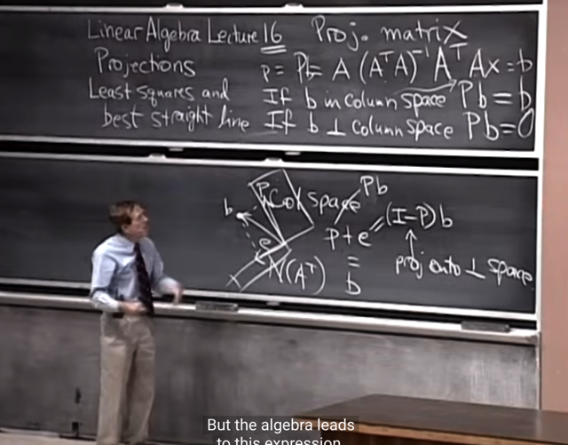</kbd>

> [!NOTE]
> Thế thì gs chỉ ra rằng, ta **cũng có một projection matrix
> khác** làm cái việc **project b lên nullspace của AT N(AT)**, 
> để có e
>
> Và projection matrix đó là gì? Đó chính là **I - P**.
>
> Bởi vì b = p + e suy ra e = b - p = Ib - Pb = **(I - P)b .**

 

<kbd>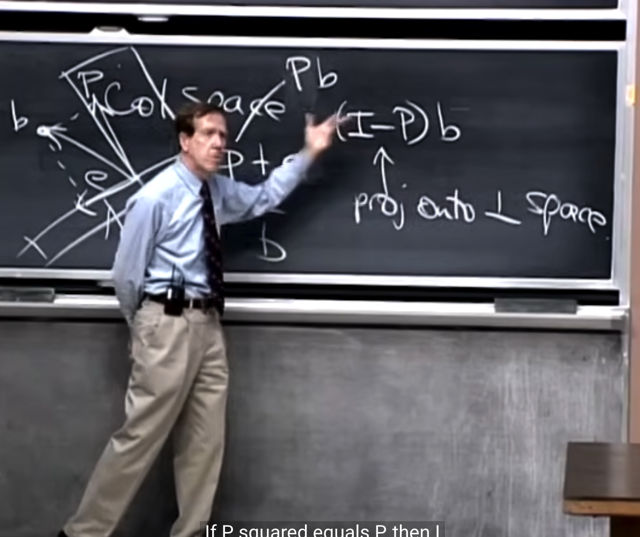</kbd>

> [!NOTE]
> Và khái quát là nếu ta **project b lên một subspace bằng
> matrix P** thì**I - P sẽ là matrix giúp project b lên cái
> subspace vuông góc với cái subspace đầu tiên**
>
> Và I - P cũng thỏa các tính chất của projection matrix:
> **(I-P)T = I-P** , (**I-P)**2 = I-P**

 

<kbd>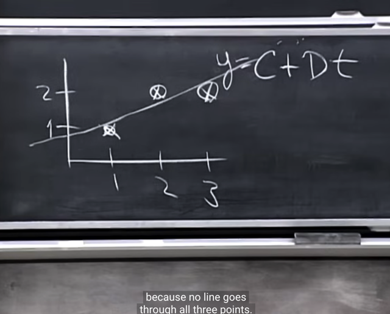</kbd>

> [!NOTE]
> Tiếp, ta sẽ tiếp tục dùng **projection matrix** để **giải bài
> toán least square** này: **Tìm đường thẳng** sao cho **giảm
> thiểu error** khi tìm cách đi qua 3 điểm này
>
> Nhắc lại rằng ta đang ở **trong tình huống** mà **không thể
> tìm được C,D sao cho đường thẳng đi qua hẳn 3 điểm**.
>
> Mà biểu hiện là ta có**Ax=b với A có nhiều row hơn cols
> (khiến C(A) không bao trùm Rm)** và **b lại không nằm
> trong cols space**, dẫn đến không thể solve được.
>
> Nhưng ta sẽ **cố gắng làm tốt nhất có thể**, bằng cách
> **project b lên colums space của A**, mang ý nghĩa là **tìm
> điểm p nằm trong C(A) sao cho nó gần nhất với b**.
>
> Để rồi ta **tìm solution của bài toán Ax^ = p** (vốn lúc này đã
> có thể **solvable do p đã nằm trong C(A)**) thì solution đó là
> một **solution của bài toán gần nhất** với bài toán đầu
> không thể giải.
>
> Trong trường hợp này C, D không thể tìm được, thì thông
> qua việc giải bài toán gần nhất, ta **tìm đường thẳng đi sát
> nhất**với các điểm, tối thiểu được error

 

<kbd>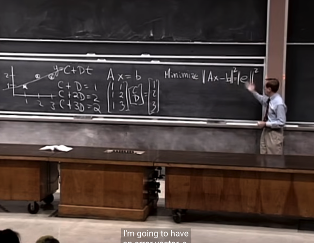</kbd>

> [!NOTE]
> Chỗ này để ý gs ghi sai, b phải là [1,2,2].
>
> Nhưng như bài trước kết thúc khi đang nói rằng ta có
> matrix A cao ốm thế này, b không nằm trong C(A) nên Ax=b
> không có solution.
>
> Vậy thì như gs nói, ta **không có solution**, nhưng ta**có
> thể có "best solution"** - là**c^, d^ sao cho minimize error**

 

<kbd>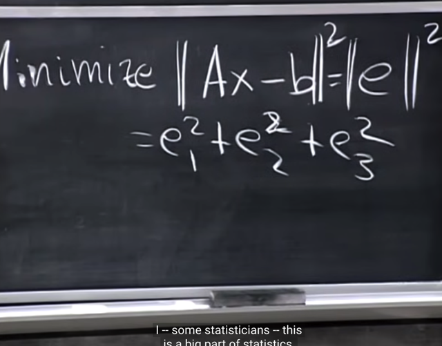</kbd>

<kbd></kbd>

<kbd>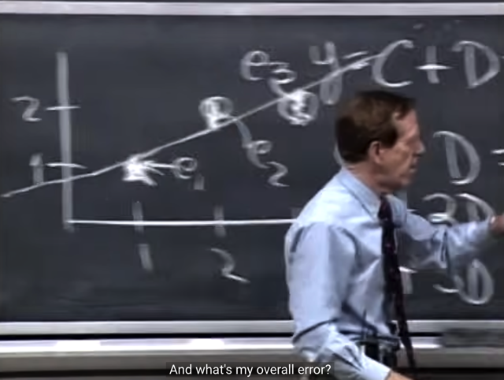</kbd>

> [!NOTE]
> Thế thì gs cho rằng có 2 hình ảnh để ta**nghĩ về error**.
>
> Một là, error là **các sai sót khi ta dùng best solution** -
> least square lin, tức **là phần "sai khác" giữa nó (Ax)** và
> **giá trị b** thực tế. Ta sẽ định nghĩa error là **tổng bình
> phương các error**

 

<kbd>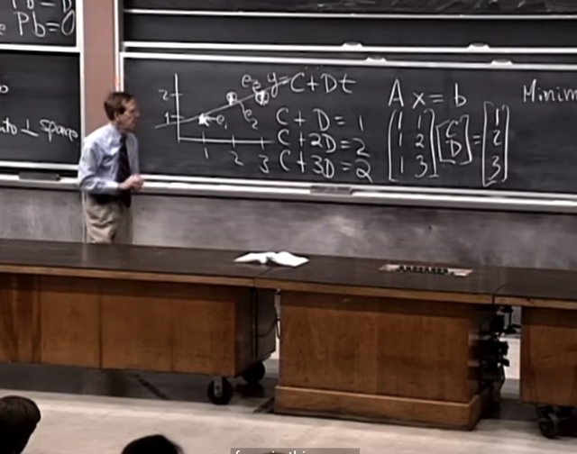</kbd>

> [!NOTE]
> Gs nói thêm trong **statistic**, đây là
> bài toán **linear regression.**

 

<kbd>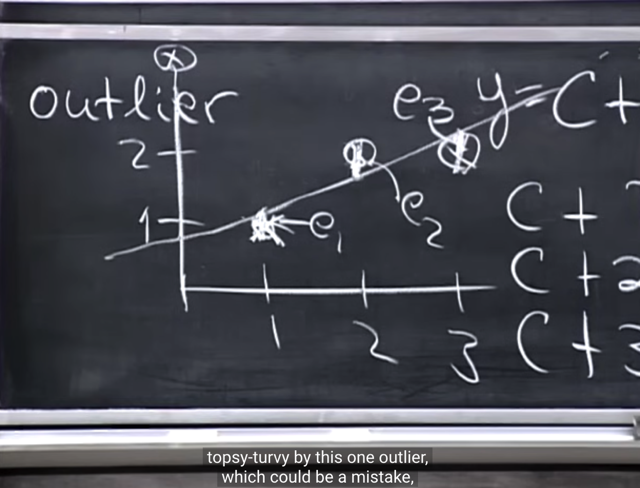</kbd>

> [!NOTE]
> Và trong statistic người ta **quan tâm đến outlier**, vì **chỉ
> cần 1 outlier** nó sẽ **khiến kết quả bị lệch rất đáng kể**.
>
> Do đó người ta dùng**squared error để detect outlier**.

 

<kbd>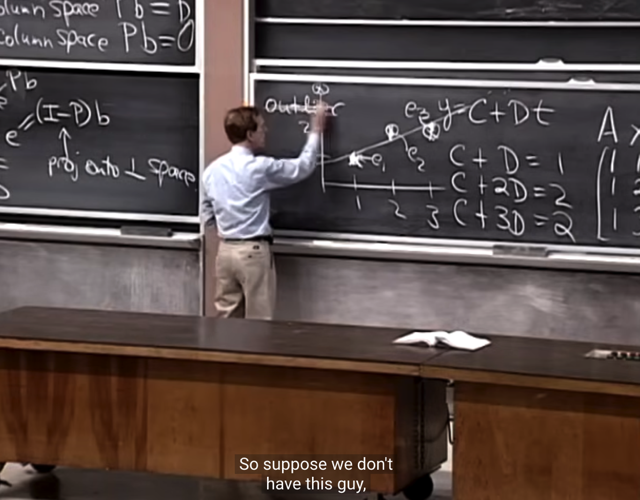</kbd>

> [!NOTE]
> Ta sẽ giả sử là
> không có outlier

 

<kbd>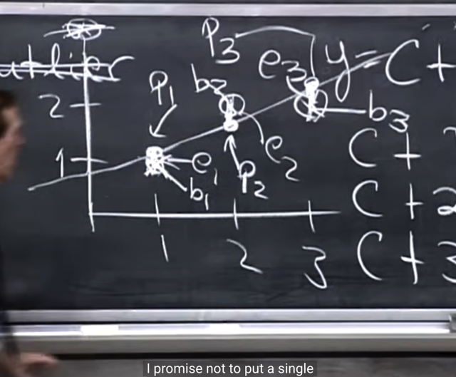</kbd>

> [!NOTE]
> Thế thì gs cho rằng trong picture thứ nhất này, ta có thể
> **gọi p1, p2, p3 là các điểm trên line**.
>
> Và **khoảng cách từ p1 đến b1** là **error 1 (e1)**, tương
> tự ta có e2, e3

 

<kbd>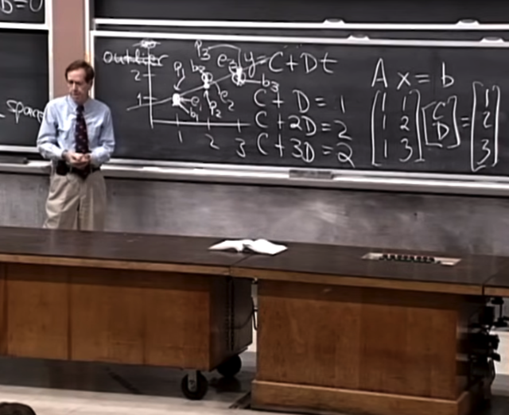</kbd>

> [!NOTE]
> Thế thì gs hỏi là: **3 điểm p1, p2, p3 là gì**?
>
> Gs: Nó là**3 điểm nằm trên line**, phải không.
>
> Và hãy nhìn **matrix này**, **bên phải** của 3 equation, ta có
> **b1, b2, b3**
>
> Và chính **vì b có giá trị như vậy**, nên nó tạo ra **3 ĐIỂM
> KHÔNG NẰM TRÊN ĐƯỜNG THẲNG**. NÊN TA KHÔNG
> THỂ TÌM  ĐƯỢC C, D GIÚP VẼ RA ĐƯỜNG THẰNG ĐI
> QUA CẢ 3 ĐIỂM ĐƯỢC.
>
> Gs nói tiếp, thế thì SẼ NHƯ THẾ NÀO NẾU TÔI ĐỂ P1, P2,
> P3 VÀO ĐÂY, THÌ KHI ĐÓ, CÓ THỂ TÌM RA C, D ĐƯỢC
> HAY, CÓ THỂ VẼ MỘT ĐƯỜNG THẲNG QUA P1, P2, P3
> được. Hay nói cách khác, CÓ THỂ SOLVE ĐƯỢC
> EQUATION SYSTEM
>
> (chú ý gs đang dùng b1, b2, b3 chỉ giá trị của bên phải của
> equation, cũng là tên của mấy cái điểm trong đồ thị)

 

<kbd>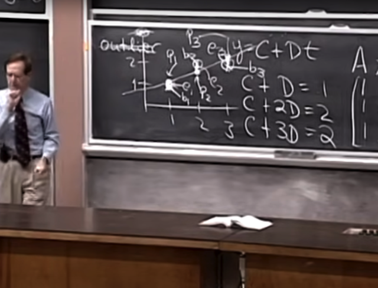</kbd>

> [!NOTE]
> Và bởi vì p1, p2, p3 đã nằm trong đường thẳng y = C + Dt
> và vector P = (p1, p2, p3) khi đó **ĐÃ NẰM TRONG COLUMN
> SPACE CỦA  MATRIX A**. Và nó **chính là vector trong column
> space mà gần nhất với vector b** 
>
> CHÚ Ý: ĐỪNG LÚ LẪN NHÉ,**ĐƯỜNG THẰNG Y = C + Dt
> KHÔNG LIÊN QUAN GÌ ĐẾN COLS SPACE CỦA A**, NÓ LÀ
> MỘT 2D PLANE TRONG R3)

 

<kbd>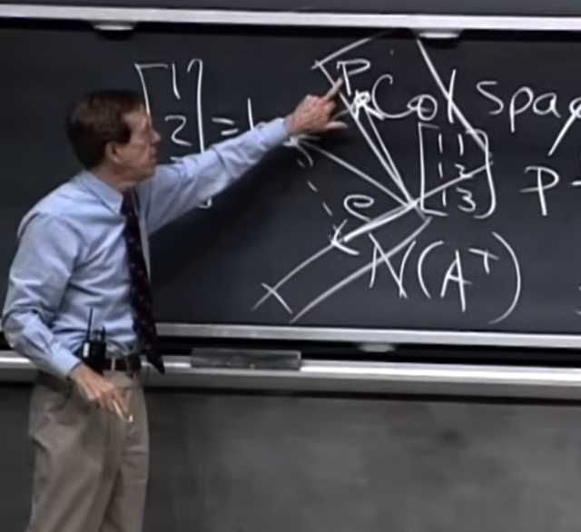</kbd>

> [!NOTE]
> Theo gs, phải **NHỚ LÀ TA CÓ HAI PICTURE**, và picture **này** là
> cái mà cho ta **hiểu rằng vector b, p nằm ở đâu**.
>
> Thế thì **b là vector đang nằm ngòai column space của A**, là
> subspace **span bởi hai cols vector** của A là (1,1,1) và (1,2,3)
>
> Ta **CHỌN P LÀ VECTOR NẰM TRONG C(A)** để **khiến hệ
> phương trình solvable**. Và ta sẽ **CHỌN P SAO CHO NÓ
> CHÍNH LÀ VECTOR NẰM TRONG C(A) MÀ GẦN NHẤT
> VỚI B**
>
> THÌ KHI ĐÓ **SOLVE RA C, D (tức component của x^ khiến 
> Ax^ = p)** THÌ ĐÓ CHÍNH LÀ HAI HỆ SỐ LÀM NÊN LINE CÓ 
> ERROR NHỎ NHẤT

 

<kbd>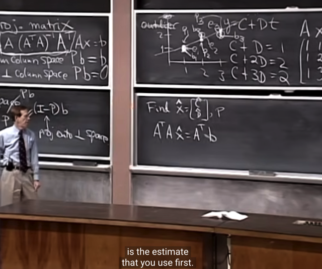</kbd>

> [!NOTE]
> Thế thì, như đã biết từ bài trước, ta **đã có công thức của x^**
> - đương nhiên là **coeffs** của **linear combination các cols
> của A** để **cho ra p** với **p là projection của b lên cols space
> của A**
>
> Và gs cho biết ĐÂY CÓ LẼ CHÍNH LÀ **NORMAL
> EQUATION** CÓ LẼ LÀ **EQUATION QUAN TRỌNG NHẤT
> CỦA STATISTIC**
>
> Lập luận nhanh để ôn lại sao có công thức này:
>
> Đó là ta bắt đầu với việc vì **p là projection của b lên C(A)**
> nên **p nằm trong cols space** của A nên **p là linear
> combination của A's cols** (gọi x^ là vector coeff): **Ax^ = p**
>
> và **e=b-p** sẽ v**uông góc với C(A)** => **e thuộc N(AT)** nên
> ta có **ATe = 0**
>
> <=> AT(b-Ax^) = 0 <=> **ATb = ATAx^**

 

<kbd>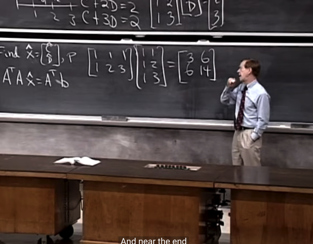</kbd>

🔗 **Related:** [LECTURE 16: PROJECTION MATRICES AND LEAST SQUARES](untitled.md#node-518)

> [!NOTE]
> Gs nhắc lại bài trước ta đã nhận định **ATA** có tính chất
> **symmetric**, và ông **kì vọng nó invertible** cũng như là
> **positive definite** (cái này sẽ học trong tương lai)
>
> Gs chưa nói vì sao ATA invertible (có lẽ ông thấy hai cols
> của nó independent, vì bài trước ta đã chứng minh nếu
> A full column rank tức mọi columns đều độc lập thì ATA
> sẽ full rank)

 

<kbd>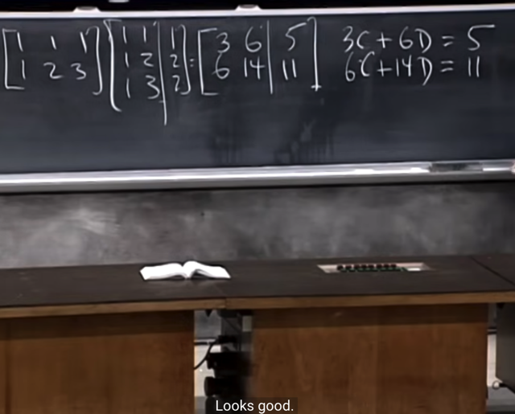</kbd>

> [!NOTE]
> Tương tự, gs triển khai ATb (bằng cách stack vector b
> = (1 2 2) vào bên phải A, để nhân.
>
> Nói chung là ATAx^ = ATb triển khai ra chính là hệ
> phương trình
>
> 3C^ + 6D^ = 5
>
> 6C^ + 14D^ = 11

 

<kbd>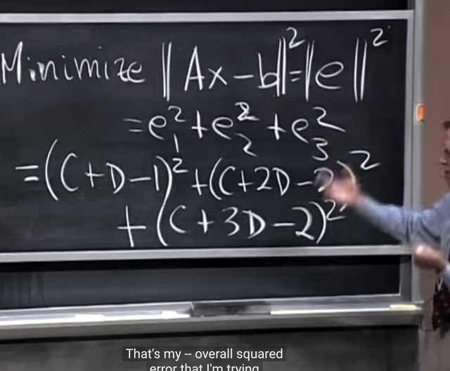</kbd>

> [!NOTE]
> Tiếp gs cho rằng tôi có thể dùng **Calculus** để **giải tìm C,
> D bằng cách tính derivative của error function w.r.t C** và
> **cho nó bằng 0**, và tính derivative của error function w.r.t
> D và cho nó bằng 0
>
> Để rồi ta sẽ có hai phương trình giúp giải C, D
>
> Dễ thấy df/dC = 2(C+D-1) + 2(C+2D-2) + 2(C+3D-2)
> =2C+2D-2+2C+4D-4+2C+6D-4=6C+12D-10 nên df/dC = 0
> <=> 6C+12D-10=0<=>**3C+6D=5**và tương tự df/dD = 0 cũng cho ta phương trình thứ 2 **6C
> + 14D = 11**

 

<kbd>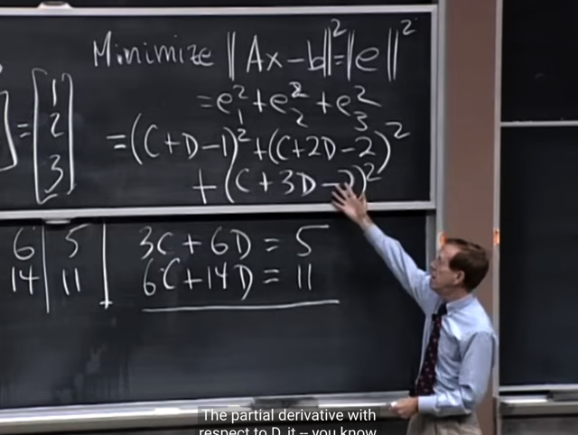</kbd>

> [!NOTE]
> VÀ HAI PHƯƠNG TRÌNH ĐÓ, CŨNG SẼ CHÍNH LÀ HAI
> PHƯƠNG TRÌNH TA CÓ Ở ĐÂY. CÓ NGHĨA LÀ GS LIÊN
> KẾT HAI THỨ:
>
> **C, D KHIẾN MEAN SQUARE ERROR NHỎ NHẤT** CŨNG
> **CHÍNH LÀ** C, D **GIÚP COMBINE COLS CỦA A ĐỂ CHO
> RA P** - VỐN LÀ **HÌNH CHIẾU CỦA b LÊN COLS SPACE
> C(A)**
>
> Hay BẰNG VIỆC **PROJECT B LÊN C(A) ĐỂ CÓ p** VÀ
> **GIẢI HỆ PHƯƠNG TRÌNH THAY THẾ Ax^ = p** thì solution
> chính là **best solution** - là hệ số của đường thẳng đi qua**gần nhất** với các điểm b (giúp giảm tối thiểu square error)

 

<kbd>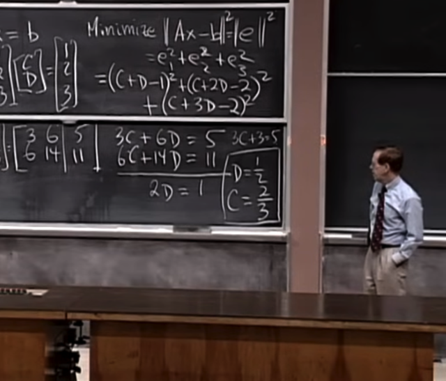</kbd>

> [!NOTE]
> Xong, gs giải ra C, D

 

<kbd>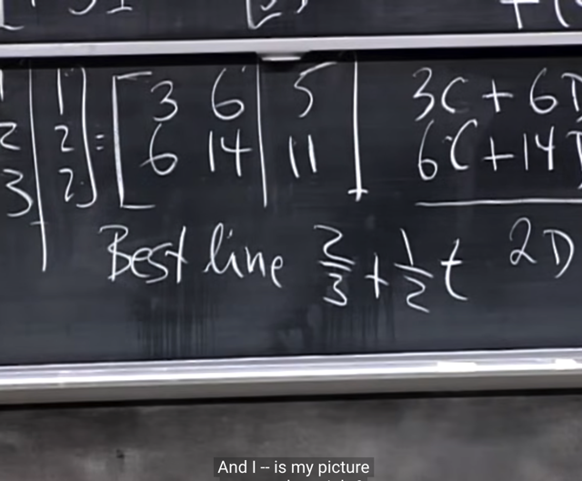</kbd>

> [!NOTE]
> Và ta có hai **coefficient** cho **best line**

 

<kbd>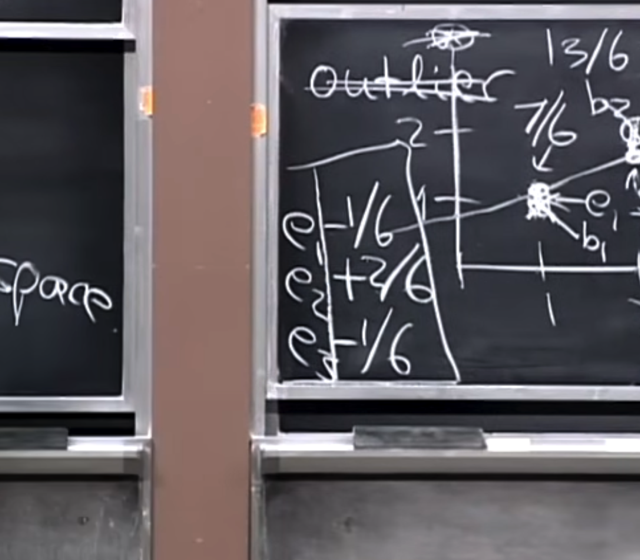</kbd>

> [!NOTE]
> Và gs dựa vào đó tính ra các p1,
> p2, p3: Cũng như e1, 2, 3

 

<kbd>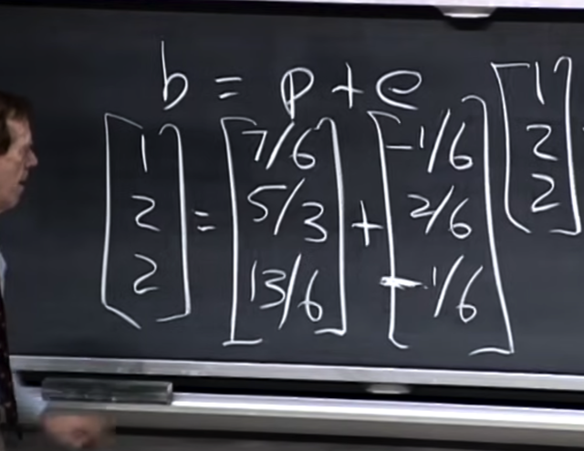</kbd>

> [!NOTE]
> Thế thì **nhìn vào kết quả**, gs đề nghị hãy **nhận xét về p và
> e**:
>
> - Chúng **cộng lại bằng b**, cái này rõ rồi.
>
> - Chúng **orthogonal**: thử tính pTe = -7/36 + 20/36 -13/36 = 0
>
> - Và **e cũng orthogonal với C(A)**. Ví dụ như thử tính dot
> product của e với hai cols của A: (1, 1, 1) và (1, 2, 3)
>
> -1/6*1+2/6*1-1/6*1 = 0
>
> -1/6*1+2/6*2-1/6*3 = 0
>
> và đ**iều này là đương nhiên** vì **p nằm trong C(A)** nên như
> đã thấy e cũng perpendicular với p

 

<kbd>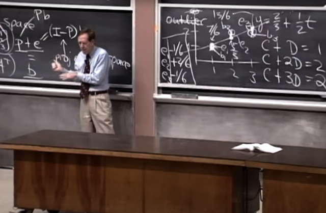</kbd>

> [!NOTE]
> gs: có 2 picture bạn đã thấy, một cái **cho ta thấy các
> vector** một cái**cho ta thấy best line**.
>
> **C, D không show up trong vector picture**, mà nó là
> **coefficient giúp combine hai cols của A để cho ra
> vector p**.

 

<kbd>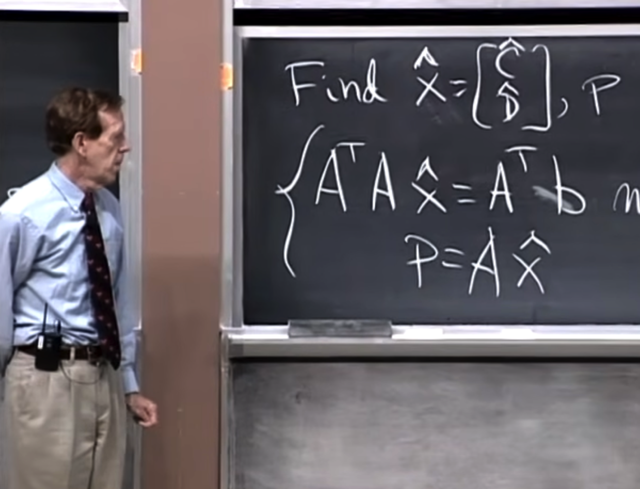</kbd>

> [!NOTE]
> đó là xong bài toán least square, ta chỉ
> việc giải equation này để có x^

 

<kbd>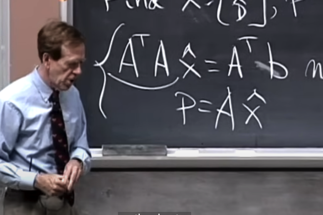</kbd>

<kbd></kbd>

<kbd>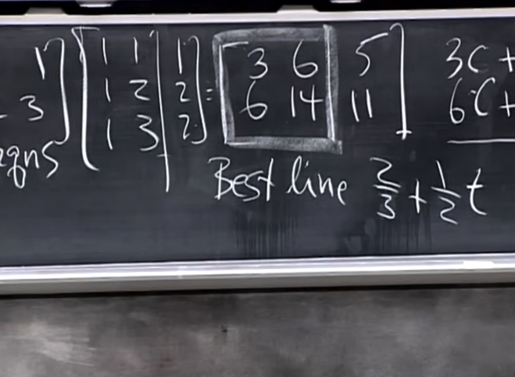</kbd>

🔗 **Related:** [LECTURE 16: PROJECTION MATRICES AND LEAST SQUARES](untitled.md#node-508)

> [!NOTE]
> Bây giờ gs muốn quay lại **xem xét matrix ATA** mà hồi
> nãy ông nhận định rằng ta sẽ kì vọng nó **invertible**,
> và xa hơn là **positive definite**

 

<kbd>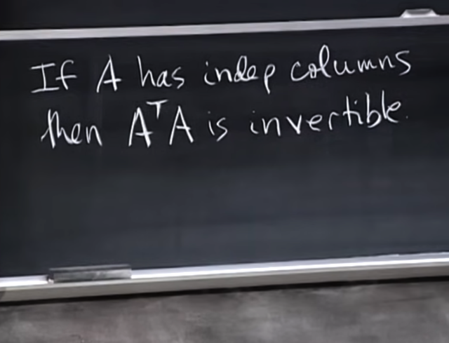</kbd>

> [!NOTE]
> Gs nhắc lại tuyên bố hồi nãy của ông rằng **nếu A có các
> cột độc lập**, tức không có free cols **thì ATA sẽ invertible.**
> Và ta sẽ thảo luận về điều này

 

<kbd>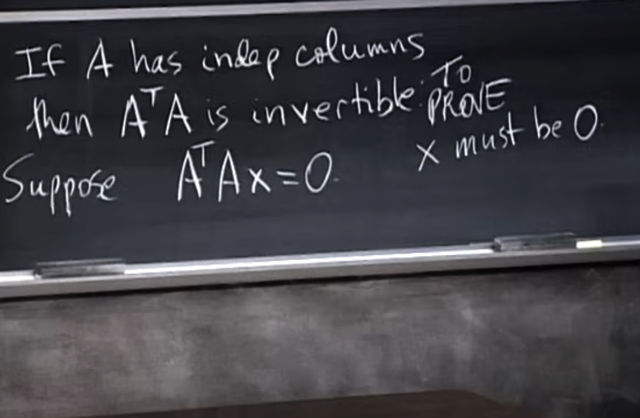</kbd>

> [!NOTE]
> Ta sẽ đi chứng minh điều này. Gs bắt đầu rằng, **giả sử ta
> cho rằng ATAx=0**, thì ta **phải chứng minh điều gì để cho
> thấy rằng ATA invertible**
>
> Đó là ta **phải chứng minh nếu ATAx = 0 thì x phải bằng 0**
> tức là **zero vector là solution duy nhất của ATAx=0**.
>
> Điều này cũng đồng nghĩa**nullspace của (ATA) chỉ có duy
> nhất là zero vector**. Và đồng nghĩa các **cols của ATA linear
> independent** (có thể giải thích bởi ta đã biết tính chất  là
> nếu một set các independent vector thì **linear combination
> duy nhất khiến chúng bằng 0 đó là các coeff bằng zero**,
> hoặc cũng có thể lập luận rằng nếu nullspace chỉ có zero,
> tức là  không có vector nào trong basis của nullspace, tức
> là không có free cols nào, và đồng nghĩa là mọi cols đều
> là pivot, nên chúng sẽ independent)
>
> Và vì ATA là symmetric, mà lại có mọi cols đều là pivot
> nữa tức là nó full rank -> invertible
>
> hint search: ATA full rank

 

<kbd>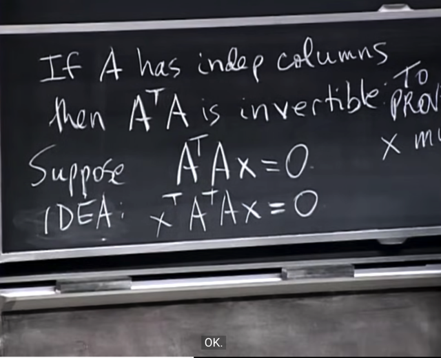</kbd>

> [!NOTE]
> Thế thì cách chứng minh là ta sẽ nhân xT vào hai vế.
> Thì ATAx = 0 sẽ tương đương xTATAx = 0
>
> (tương đương dĩ nhiên có nghĩa là hai phương trình này
> có chung nghiệm)

 

<kbd>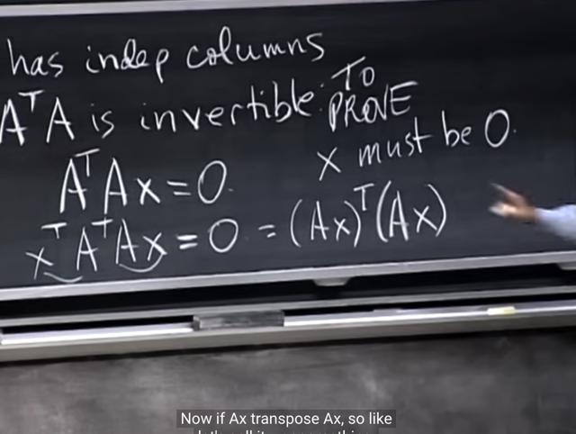</kbd>

> [!NOTE]
> Gs: ta có thể dễ thấy đây **chính là (Ax)T(Ax)**. Và viêc nó
> bằng 0 suy ra điều gì?
>
> Me: Sau khi gpt nhắc cho ta nhớ**uTu chính là bình phương
> norm của vector**. Tức tổng bình phương các component của
> nó. Và nó là số**không âm**. Nên việc nó bằng 0 chứng tỏ u là
> zero vector.
>
> Vậy (Ax)T(Ax) luôn >= 0 nên dấu bằng chỉ xảy ra khi Ax=0

 

<kbd>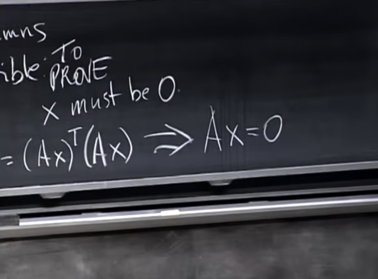</kbd>

🔗 **Related:** [LECTURE 14: ORTHOGONAL VECTORS AND SUBSPACES](untitled.md#node-439)

> [!NOTE]
> gs : Correct,
>
> me: À vậy có thể thấy, ta đang muốn chứng minh rằng,
> với việc A's columns independent thì ATA invertible.
>
> Và ta muốn chứng minh bằng cách giả sử với ATAx=0 thì
> với việc A cols independent thì điều này chỉ có thể xảy ra
> khi x = 0. Nếu chứng minh được điều này thì có thể kết
> luận rằng nếu A's cols độc lập thì AtA invertible.
>
> Thế thì từ việc **ATAx = 0, ta tương đương ra với Ax=0**.
> Thế thì với **điều kiện các cols của A độc lập tuyến tính
> thì việc Ax=0 chỉ có thể x = 0**.
>
> Vậy ta đã cho thấy rằng, **nếu cols của A độc lập tuyến
> tính thì nếu ATAx=0 thì x chỉ có thể là 0**.
>
> Và điều này như nãy đã nói,**sẽ suy ra các cols của ATA
> độc lập**, và nó lại là **square matrix** nên suy ra nó
> **full rank -> invertible**

 

<kbd>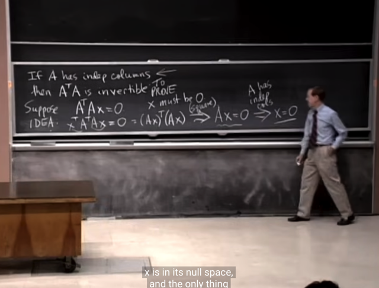</kbd>

> [!NOTE]
> Vậy là ta đã chứng minh được: nếu A có các cột độc
> lập, tức không có free cols thì ATA sẽ invertible.
>
> Có thể làm ngắn gọn lại phần chứng minh như sau:
>
> ATAx = 0 sẽ tương đương xTATAx = 0 và tương đương
> tiếp (Ax)T(Ax) = 0. Mà vế trái là bình phương của length của
> Ax nên luôn >= 0. Và dấu bằng chỉ xẩy ra khi Ax = 0. Vậy
> ATAx = 0 <=> Ax = 0.
>
> Thế thì điều này suy ra N(ATA) = N(A).
>
> Mà xét N(A) thì vì ta đã cho trước A's column độc lập nên
> dĩ nhiên N(A) = {0} (vì nhiều cách giải thích, ngắn nhất chính
> là vector 0 sẽ là bộ hệ số duy nhất combine A's column thành
> 0 theo định nghĩa của independent vectors)
>
> Vậy N(ATA) cũng = {0} và với square matrix có Nullspace
> chỉ chứa zero thì nó là matrix fullrank => invertible

 

<kbd>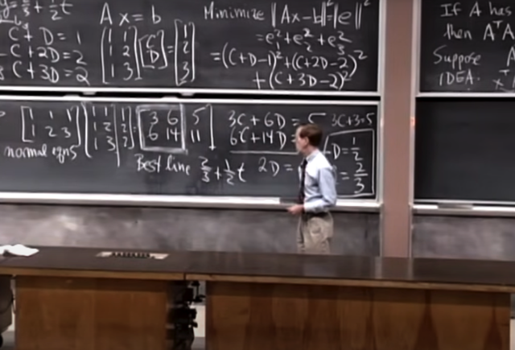</kbd>

> [!NOTE]
> Từ đó ta khẳng định là **AtA ở đây là invertible**
> vì matrix **A có hai cols độc lập rõ ràng**

 

<kbd>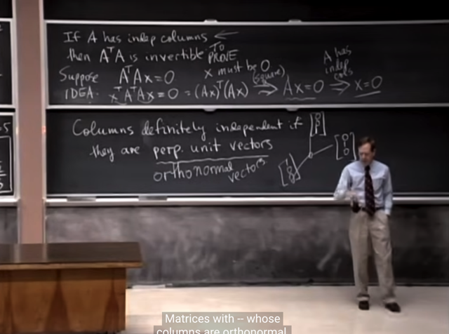</kbd>

> [!NOTE]
> Và gs mào đầu cho bài sau, đó là ta đang nói đến việc
> **nếu matrix A có các cols độc lập**thì **ATA chắc chắn
> invertible**. Thế thì không gì **ĐẢM BẢO CÁC COLS ĐỘC
> LẬP NHAU** tốt hơn bằng việc **CHÚNG**
> P**ERPENDICULAR NHAU**
>
> Và nếu các cols **LÀ UNIT VECTOR** nữa. Khi đó ta có
> các **ORTHO-NORMAL VECTOR**
>
> Vì sao, các **columns perpendicular thì chắc chắn độc
> lập?**
>
> Tự chứng minh như vầy (gs không nói)
>
> Gỉa sử có bộ vector vuông góc nhau u1, u2...un thì tức là
> ui.uj = 0 với mọi i khác j. Để chứng minh chúng độc lập,
> theo định nghĩa của độc lập tuyến tính thì set các coefficient
> duy nhất khiến linearly combine các vector thành 0 chỉ có
> thể là mọi coeffcient đều bằng 0, tức là ta phải chứng minh 
> rằng:
>
> nếu c1u1 + c2u2 + ...cnun = 0 (1) <=> c1 = c2 = ...cn = 0 (2)
>
> Nhân hai vế của (1) cho uk bất kì ta có:
>
> c1u1Tuk + c2u2Tuk + ...cnunTuk = 0 
>
> Và cái này tương đương ckukTuk = 0 vì với mọi uj với j khác
> k thì chúng đều vuông góc với uk nên ujTuk = 0
>
> Thế thì ckukuk = 0 rõ ràng khi và chỉ khi ck = 0 vì ukTuk là
> (bình phương chiều dài vector k nên luôn >= 0 và chỉ bằng
> 0 khi uk = 0, nhưng ta đang assume set các vector đều
> khác 0)
>
> Vậy ck = 0, mà k là bất kì. Do đó mọi ck đều bằng 0 => (2)

 

<kbd>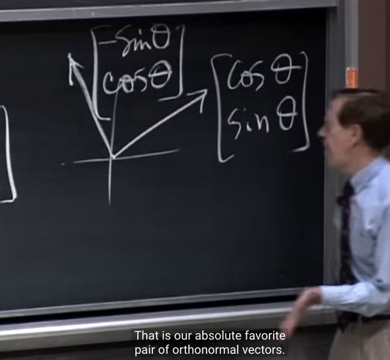</kbd>

> [!NOTE]
> Một ví dụ khác khi 2
> **vector unit và vuông góc**

 

<kbd>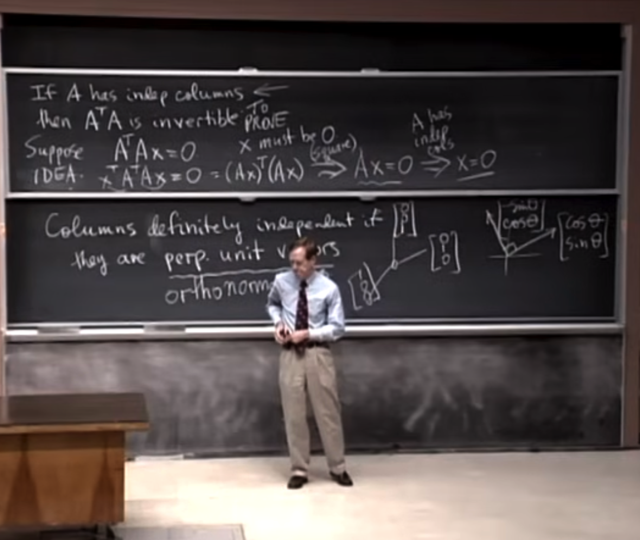</kbd>

> [!NOTE]
> Bài sau ta xem xét tại sao **ortho-normal vector rất tuyệt**,
> và ta sẽ xem xét cách để có một bộ vector như vậy bằng
> cách **CHỌN BASIS PHÙ HỢP**

 

