# Lecture 17: Orthogonal Matrices And Gram-schmidt

📊 **Progress:** `38` Notes | `39` Screenshots

---
<a id="node-530"></a>

<p align="center"><kbd>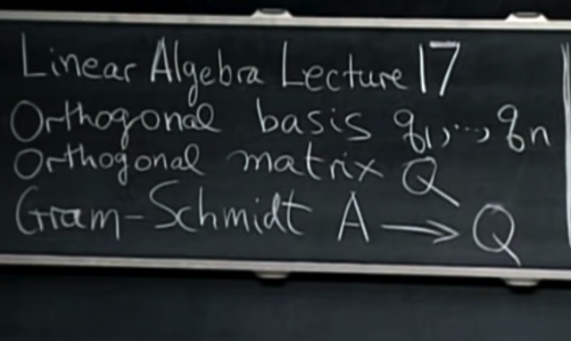</kbd></p>

> [!NOTE]
> Bài này sẽ là bài cuối về **orthogonal**. Trong đó ta thảo
> luận về **orthogonal basis**: các basis vector **vuông góc
> nhau**.
>
> Và **orthogonal matrix**: là matrix có các columns là
> `ortho-normal`

<br>

<a id="node-531"></a>

<p align="center"><kbd>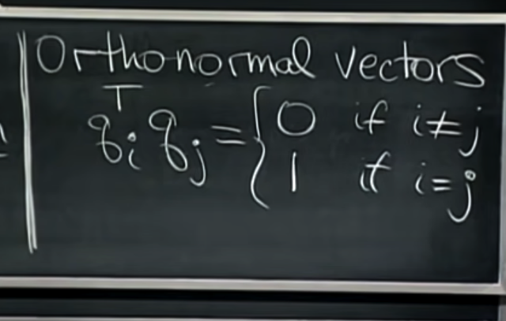</kbd></p>

> [!NOTE]
> Như đã nói ở cuối bài trước, **orthonormal** vector sẽ
> **vuông góc nhau** và có **norm (length) `=` 1**

<br>

<a id="node-532"></a>

<p align="center"><kbd>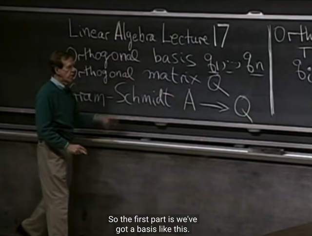</kbd></p>

> [!NOTE]
> Gs cho biết **orthonormal basis** sẽ khiến **mọi thứ dễ
> dàng** hơn rất nhiều. Do đó ta sẽ tìm hiểu xem giả sử ta
> có **matrix A các các basis vector chưa ortho-normal**, làm
> sao để **chuyển nó thành orthogonal matrix Q**

<br>

<a id="node-533"></a>

<p align="center"><kbd>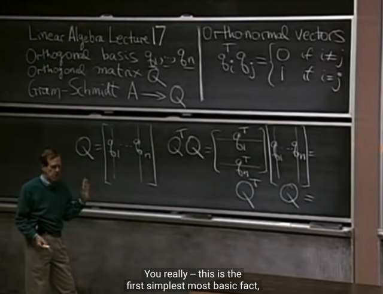</kbd></p>

> [!NOTE]
> Đầu tiên gs cho ta **Q**, là matrix mà **các cols là các
> orthonormal vector q_i**, gs hỏi **QTQ sẽ là gì?**
>
> Me: vì như đã nói, các cols của Q orthonormal,
> nên dễ thấy **QTQ CHÍNH LÀ IDENTITY MATRIX**

<br>

<a id="node-534"></a>

<p align="center"><kbd>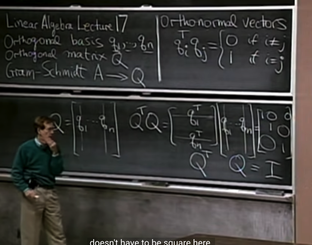</kbd></p>

> [!NOTE]
> Gs: correct, và **Q cũng ko cần phải square**, **QTQ luôn
> là Identity matrix**
>
> Điều này l**iên hệ với ATA** bữa trước. Ta đã cùng nhau
> chứng minh rằng **nếu A full column rank**, thì ATA sẽ
> fullrank `/` invertible. 
>
> Thì với Q, **QTQ** đặc biệt hơn là nó **chính là I**

<br>

<a id="node-535"></a>

<p align="center"><kbd>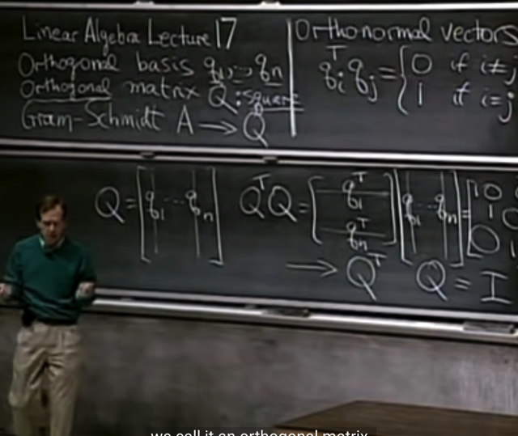</kbd></p>

> [!NOTE]
> Gs cho rằng từ đầu đến giờ ta đã gặp **nhiều loại matrix**, 
> và trong chương này ta biết thêm **Projection matrix**, Thì 
> nay ta có **Orthogonal matrix.**
>
> Tuy nhiên, gs nhấn mạnh, TA **CHỈ CÓ THỂ GỌI NÓ
> LÀ ORTHOGONAL MATRIX NẾU NÓ SQUARE** (đương
> nhiên có các cols là orthonormal vector.
>
> Hay như ở đây, **dù q1, ..qn là bộ vector orthonormal,**
> nhưng Q chỉ được gọi là orthogonal matrix **nếu nó square**

<br>

<a id="node-536"></a>

<p align="center"><kbd>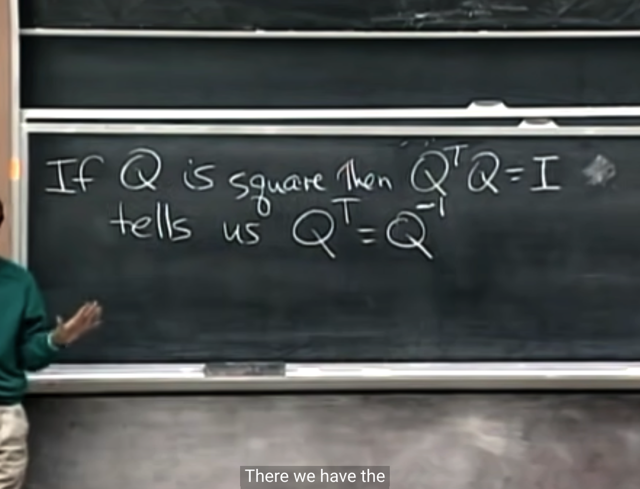</kbd></p>

🔗 **Related:** [LECTURE 33: LEFT AND RIGHT INVERSE; PSEUDOINVERSE](untitled.md#node-1224)

> [!NOTE]
> Và tính chất quan trọng của nó đó là, **nếu Q square**, thì **Q**
> **invertible** (vì đã nói các cols orthonormal `-` tức dependent
> rồi, mà còn square nữa thì nó full rank `->` invertible)
>
> Thế thì **QTQ `=` I**, và **Q invertible** sẽ cho ta kết luận: **QT
> chính là `Q_inv:` QT `=` Qinv**Cái này không cần chứng minh gì cả vì nếu Q vuông mà
> QTQ `=` I thì ngay lập tức có thể kết luận QT `=` Qinv

<br>

<a id="node-537"></a>

<p align="center"><kbd>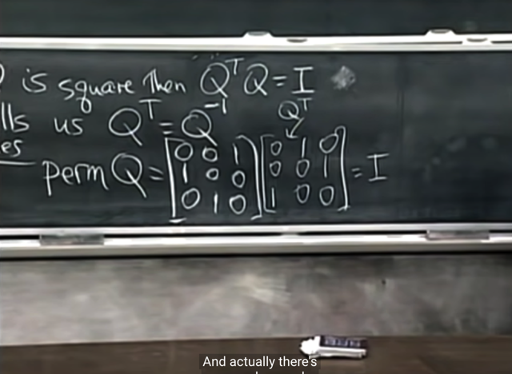</kbd></p>

> [!NOTE]
> Gs lấy một **ví dụ** về một **orthogonal** matrix, đó là **permutation**
> matrix**3x3**. Nhớ lại những bài trước ta đã biết, matrix này sẽ giúp
> **hoán đổi các row**với các hàng của nó chỉ có dạng như đổi chỗ các
> hàng của Identity matrix.
>
> Ví dụ matrix [0 1; 1 0] sẽ đổi chỗ hai hàng của matrix A 2x2; matrix P `=`
> [1 0 0; 0 0 1; 0 1 0] sẽ **giữ nguyên hàng 1**, **thay hàng 2 bằng hàng 3**, và
> **thay hàng 3 bằng hàng 2,** tức là đổi chỗ hàng 2 và 3 của matrix A (khi
> nhân PA). Ta cần nhớ khi**nhân P cho A** thì matrix PA sẽ có: **row_i
> của PA** chính là l**inear combination các row** **của A** với
> **coefficients là `row_i` của P** (rows viewpoint)
>
> Ôn lại tí, gỉa sử nhân permQ này với A, thì sẽ hoán đổi các hàng của A
> như thế nào, đương nhiên vì Q có 3 cột nên A cũng phải có 3 hàng.
>
> Và góc nhìn row sẽ cho ta thấy permQ.A sẽ là mỗi row của permQ sẽ là
> coeff của một linear combination giữa các row của A. Nên với row1 của
> ```text
> permQ = [0 0 1], nó sẽ tạo kết quả  là 0*row A_1 + 0*row A_2 + 1*row
> ```
> `A_3` `=` row `A_3` và đây chính là hàng 1 của kết quả. Vậy nó đã chuyển
> row 3 của A lên đầu tiên. Hay dễ hiểu hơn khi nói "hàng 1 của QA chính
> là hàng 3 của A"
>
> Tương tự, row 2 của permQ khi nhân với A sẽ "lấy" hàng 1 của A, đưa
> xuống hàng 2 trong matrix kết quả. Hay "hàng 2 của QA chính là hàng 1
> của A"
>
> Và row 3 của permQ sẽ chuyển row 2 của A xuống row 3 của matrix kết
> qủa. Hay "hàng 3 của QA là hàng 2 của A"
>
> `====`
>
> Đó là ôn lại tí về permutation matrix. Còn gs cho thấy nhân permQ với
> permQ.T cho ra I

<br>

<a id="node-538"></a>

<p align="center"><kbd>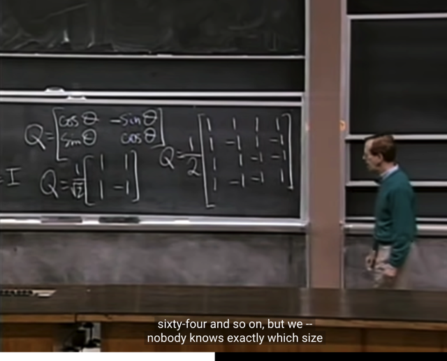</kbd></p>

> [!NOTE]
> Gs cho một số **ví dụ khác**về **orthogonal matrix**

<br>

<a id="node-539"></a>

<p align="center"><kbd>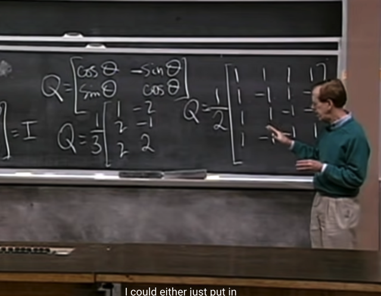</kbd></p>

> [!NOTE]
> Rồi, gs cho một matrix thế này, có **2 cols perpendicular**.
> Và bằng việc **chia cho 3 ta có unit norm**.
>
> Thế thì gs đại khái nói là ta **có 2 cols**, independent (dĩ
> nhiên, vì orthonormal), nó sẽ **span một 2D subspace
> trong R3.**

<br>

<a id="node-540"></a>

<p align="center"><kbd>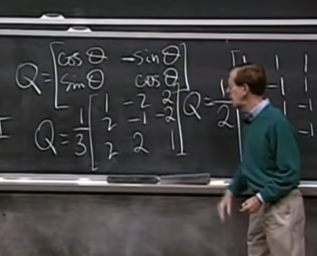</kbd></p>

> [!NOTE]
> Xong đại khái là gs **tạo thêm một cột nữa cũng othorgonal
> với hai cols kia**. Rồi ông nói tí nữa ta sẽ thấy **Gram Smith
> giúp ta tìm ra orthonormal basis**

<br>

<a id="node-541"></a>

<p align="center"><kbd>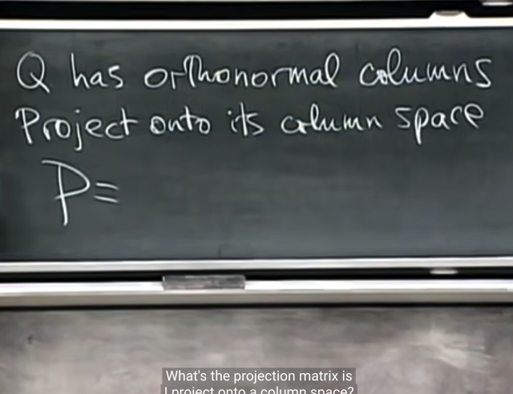</kbd></p>

> [!NOTE]
> Tiếp, gs sẽ nói về **tại sao Q lại tốt**. Đầu tiên, câu hỏi là
> nếu ta **muốn project một vector xuống cols space của Q**
> thì **projection matrix P là gì.**
>
> Me: Trước khi thầy ghi ra lại công thức, thử lẩm nhẩm lại
> cách làm, với matrix A
>
> i) Vì vector p, là**projection của b lên C(A)**, nên **p thuộc
> C(A)**: gọi x^ là coeff giúp linear combination các A's cols
> cho ra p: **Ax^ `=` p**. Và **e `=` b `-` p sẽ vuông góc với C(A)** nên
> nó **nằm trong C(A)** perp (tức subspace orthogonal
> complement với C(A)) và đó**chính là nullspace of AT**
> (N(AT))
>
> vậy **ATe `=` 0** `<=>` **AT(b-p)** `=` **AT(b `-` Ax^) `=` 0**
>
> `<=>` **ATb `-` ATAx^ `=` 0**
>
> `<=>` ATb `=` ATAx^ (tới đây ta có cái gọi là**Normal equation**)
>
> `<=>` x^ `=` (ATA)_invATb
>
> Từ đó **p `=` Ax^ `=` A.(ATA)_inv.ATb**
>
> Và từ đó P (projection matrix) là **A.(ATA)_inv.AT**

<br>

<a id="node-542"></a>

<p align="center"><kbd>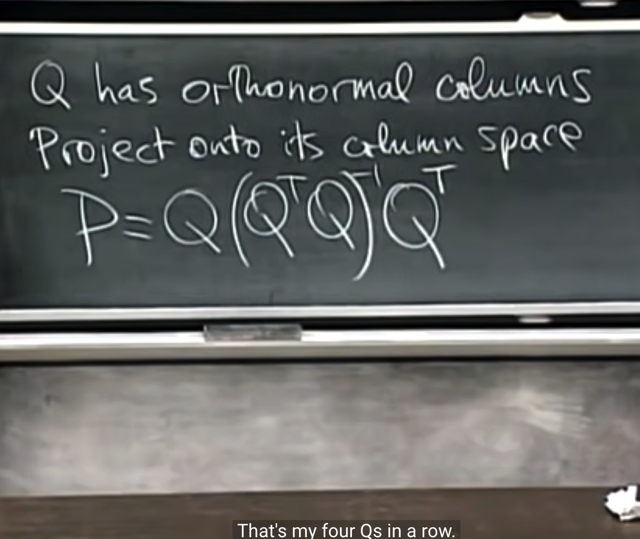</kbd></p>

> [!NOTE]
> Nên O giúp project  lên C(Q)
> sẽ là: Q(QTQ)_invQT

<br>

<a id="node-543"></a>

<p align="center"><kbd>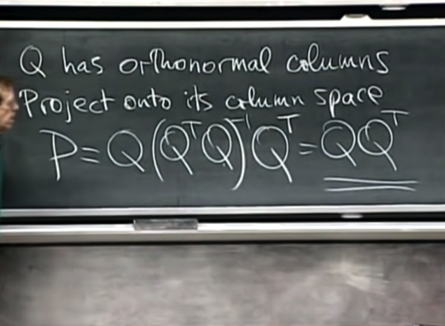</kbd></p>

> [!NOTE]
> Và vì **QTQ `=` I** nên **P chỉ còn là QQT**
>
> Tại đây ta nhận thấy, như bữa trước thầy có nói về cái vụ ta
> sẽ mắc sai lầm nếu thay (ATA)inv `=` `Ainv.AT_inv` vào P `=`
> A(ATA)invAT để có P `=` I.
>
> Bởi vì điều này **CHỈ ĐÚNG NẾU A INVERTIBLE**. Và khi
> đó, **A invertible (Ainv tồn tại) `/` full-rank**, tức là **cols của nó
> sẽ span toàn bộ Rn**, dẫn tới **b nằm ở đâu trong Rn thì việc
> project b lên C(A) cũng chỉ là chính nó**. Nên **P `=` I.**
>
> Thì ở đây, Q, vì tính chất có **orthonormal columns** (Q chưa
> square nhá, nên không thể gọi là orthogonal matrix), dẫn tới
> (QTQ)_inv đã bị hủy (thành I). **Chỉ còn QQT**.
>
> Thì **điều tương tự cũng xẩy ra**, đó là **nếu Q square**, thì
> nó **invertible** và khi đó **QT=Qinv** nên **QQT ngay lập
> tức trở thành QQinv** và **trở thành I**.
>
> Để rồi cùng ý nghĩa là Q `full-rank` nên cols của nó đã là toàn
> bộ Rn rồi, nên projection lên C(Q) cũng chỉ là đứng yên một
> chỗ.

<br>

<a id="node-544"></a>

<p align="center"><kbd>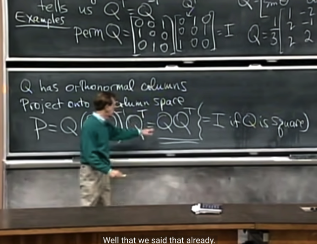</kbd></p>

> [!NOTE]
> gs: đúng vậy, **nếu Q square**, **cols của nó sẽ span
> toàn bộ Rn**, khi đó **P chính là I**

<br>

<a id="node-545"></a>

<p align="center"><kbd>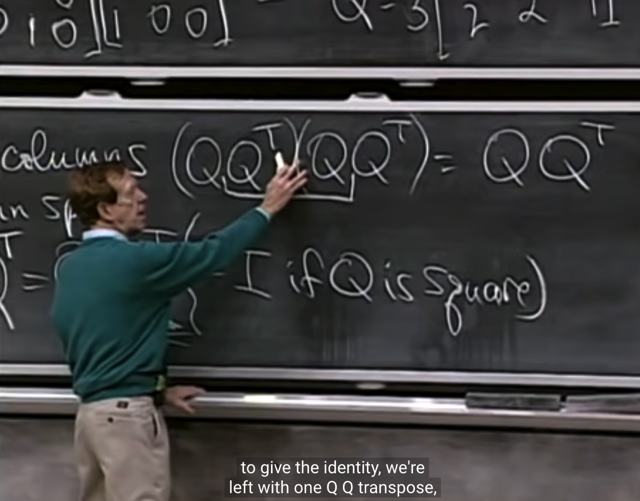</kbd></p>

> [!NOTE]
> đương nhiên **nếu Q không square** thì **P vẫn là QQT**.
> Nhưng gs đề nghị ta**check lại hai tính chất của
> Projection matrix**:
>
> i) **Symmetric**: Cái này dễ thấy **(QQT)T** `=` QTTQT `=` **QQT**
> `->` **symmetric**.
>
> ii) P.P `=` P: **(QQT)(QQT)** `=` Q(QTQ)QT `=` QIQT `=` **QQT** `->`
> đúng là như vậy

<br>

<a id="node-546"></a>

<p align="center"><kbd>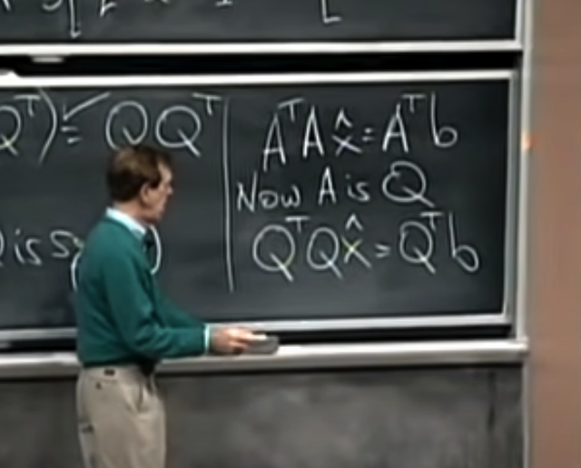</kbd></p>

> [!NOTE]
> Tiếp gs nói các **equation mà ta biết sẽ đều trở nên
> đơn giản với Q**. Ví dụ như **normal equation**(Hồi nãy 
> ta đã ôn lại cái này) ATb `=` ATAx^
>
> Thì ý chính là nếu muốn tìm x^ ta phải tìm và nhân hai
> vế cho `ATA_inv` để có **x^ `=` (ATAinv)ATb**

<br>

<a id="node-547"></a>

<p align="center"><kbd>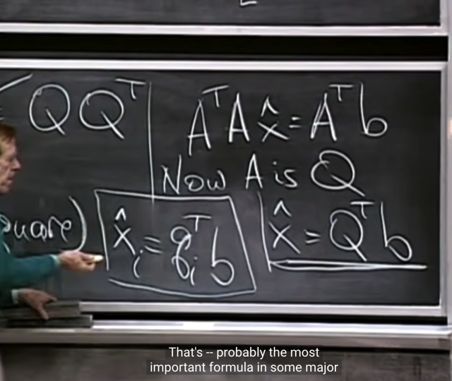</kbd></p>

> [!NOTE]
> Còn với Q thì QTQ `=` I bên phải tự huỷ nên ta k**hông cần
> thực hiện bước tính ATA inverse** (để nhân hai vế, cho ra
> x^) nào mà có ngay luôn x^ `=` QTb
>
> Và việc **x^ `=` QTb** **CÓ NGHĨA** LÀ **PHẨN TỬ THỨ i
> CỦA x^** CHỈ LÀ **BASIS VECTOR THỨ i DOT PRODUCT
> VỚI b**(Ta đừng nhìn theo QTb theo linear combination các
> columns của QT, mà hãy nhìn QTb theo góc nhìn là row của
> Q dot product với b)

<br>

<a id="node-548"></a>

<p align="center"><kbd>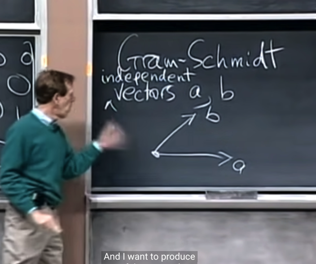</kbd></p>

> [!NOTE]
> Tiếp, gs sẽ nói về **Gram-Schmidt** giúp **biến đổi một
> bộ independent vector** về **một bộ orthonormal vectors**

<br>

<a id="node-549"></a>

<p align="center"><kbd>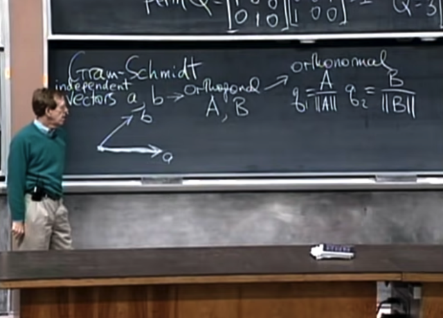</kbd></p>

> [!NOTE]
> Thế thì đại ý là giả sử ta có **hai vector a, b independent**
> Thì ta **muốn tìm `/` tạo ra hai orthogonal vector từ a, b**
>
> Ta gọi A, B là hai **orthogonal** vector, thì gs đùa rằng
> mr **Gram sẽ giúp ta tìm A, B** khi đó **chỉ việc chia cho
> norm** thì ta sẽ có **unit vector** để có set hai vector
> **orthonormal** (Có lẽ đây là đóng góp của Schmidt, Brilliant
> Schmidt! :D)

<br>

<a id="node-550"></a>

<p align="center"><kbd>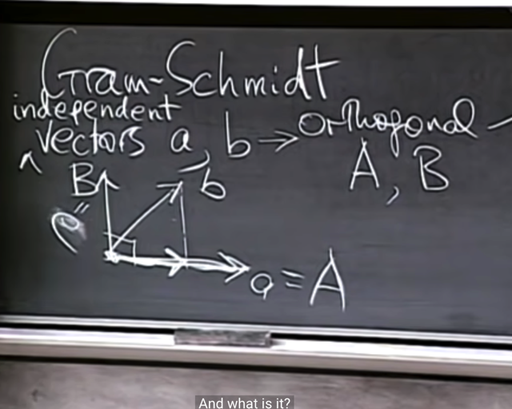</kbd></p>

> [!NOTE]
> Thế thì gs cho rằng **vector a cứ giữ nguyên**, tức **A `=` a**.
>
> Ta chỉ cần **bắt đầu với vector b** để làm sao đó**tìm ra
> vector B vuông góc với a** là được.
>
> Thì bài trước ta đã biết, **nếu project b lên a** (để được p,
> nằm trên line của a), thì **phần dư của nó tức e `=` b `-` p sẽ
> vuông góc vói a**

<br>

<a id="node-551"></a>

<p align="center"><kbd>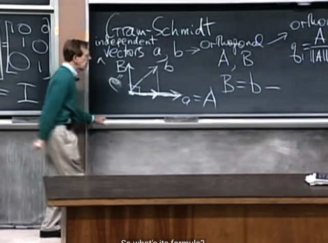</kbd></p>

> [!NOTE]
> Và gs cho biết **nhất định e sẽ không bằng 0**, vì **b, a độc
> lập**, tức chúng không trùng phương nhau, dẫn đến **e sẽ
> luôn khác 0**, tức luôn còn phần dư. Ngược lại**nếu a, b
> không độc lập** tức **b đã nằm trên line đi qua a** thì project
> b lên a chỉ vẫn giữ nguyên một chỗ, hay **p `=` b**, thì khi đó e
> `=` 0. 
>
> Vậy gs hỏi formula là gì?
>
> Me: Ta dùng công thức đã biết bữa trước, triển khai lại cho
> nhớ:
>
> ```text
> p = ax, e = b - p vuông góc với a => aTe = 0 <=> aT(b-ax) = 0
> ```
> ```text
> <=> aTb = aTax <=> x = aTb/aTa => p = aaTb/aTa
> ```
>
> Nhưng mà ta cần e chứ không phải p, nên e `=` b `-` `aaTb/aTa`
>
> Với A `=` a, ta có **e `=` b `-` (ATb/ATA)A**

<br>

<a id="node-552"></a>

<p align="center"><kbd>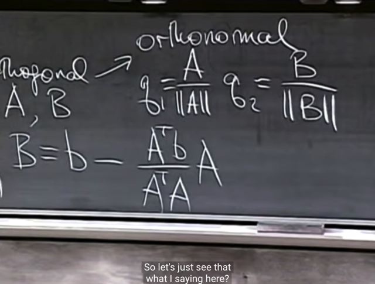</kbd></p>

> [!NOTE]
> Gs: correct. Đây c**hính là công thức Gram-Schmidt**. Đúng
> hơn là c**òn bước chia cho norm nữa**

<br>

<a id="node-553"></a>

<p align="center"><kbd>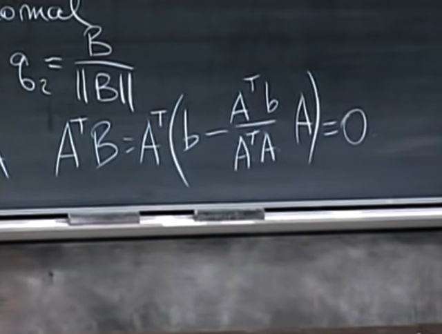</kbd></p>

> [!NOTE]
> Và ta có thể **kiểm tra lạ**i xem**có đúng là A, B
> orthogonal** không bằng cách **xem dot product của
> chúng có `=` 0 ko**.
>
> Quả thật là bằng 0 khi nhân vào ta có:
>
> `=` ATb  `-` AT.ATb.A `/` ATA 
>
> Vậy vì sao cái này `=` 0. Chú ý là ATb là scalar, do A,b
> đều là vector. 
>
> Nên AT.scalar.A có thể  trở thành scalar. AT.A để từ đó 
> ```text
> vế [b - (ATb/ATA)A] trở thành ATb.ATA/ATA = ATb.
> ```
>
> Dẫn tới ATB `=` ATb `-` ATb `=` 0

<br>

<a id="node-554"></a>

<p align="center"><kbd>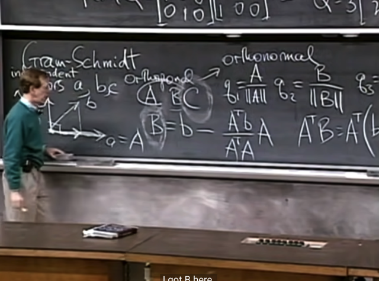</kbd></p>

> [!NOTE]
> Tiếp, gs giả sử **ta có 3 vector a,b,c**. Tức thêm 1 vector
> nữa, và a,b,c independent.
>
> gs đề nghị ta hãy dùng cách tiếp cận này để tìm A,B,C
> orthonormal
>
> Me: Thử lập luận:
>
> Thì ta **cũng cho A `=` a**. Tức giữ nguyên a. Rồi**tìm B bằng
> cách tìm phần dư sau khi project b lên a**.
>
> Thế thì tiếp theo ta sẽ **tìm C bằng cách tìm phần dư khi
> project c lên subspace span bởi a, b (**cũng là của A, B vì
> ```text
> A=a, còn B=e=b-p=b-ax nên B hay e là linear combination
> ```
> của a,b nên nó cũng vẫn nằm trong subspace span bởi a,
> b**)**.
>
> Khi đó **phần dư đó sẽ vuông góc với subspace này**, dẫn
> đến  C sẽ vuông góc với cả A và B.

<br>

<a id="node-555"></a>

<p align="center"><kbd>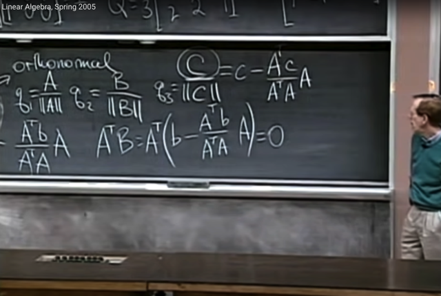</kbd></p>

> [!NOTE]
> Có thể hiểu lập luận đó**cũng không sai**, nhưng với điều
> kiện ta phải**xây dựng matrix mà mỗi cols của nó  là A, B**
>
> Gs: Nếu tôi **trừ c cho `ATcA/ATA` thì tôi đã làm gì**:
>
> Me: Ta đã có **phần dư của c** sau khi **trừ đi projection của
> nó lên a (cũng là A)**. Như vậy, **vector này ĐÃ VUÔNG
> GÓC VỚI A**

<br>

<a id="node-556"></a>

<p align="center"><kbd>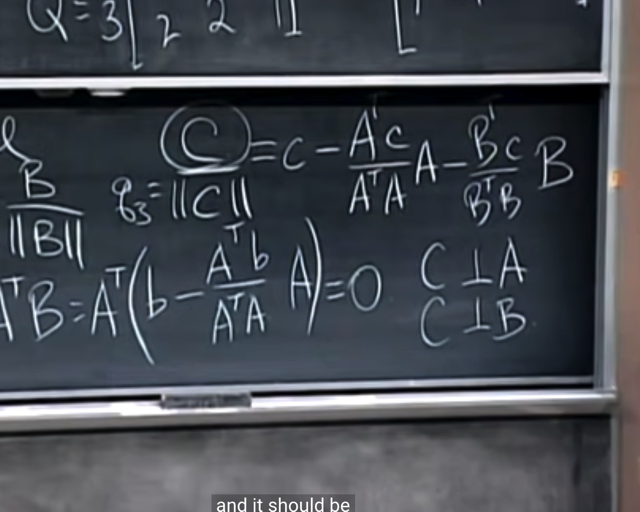</kbd></p>

> [!NOTE]
> Gs: Correct. Và **trừ tiếp cho BTc.B/BTB** ta đã **bỏ đi
> projection của c nằm trên b**. Để phần dư còn lại chính là
> **vuông góc với b**, và tất nhiên đã vuông góc với cả a
>
> Vậy sau khi trừ cho `ATcA/ATA` và `BTc.B/BTB` thì phần còn lại
> **đã vuông góc với cả A và B**.
>
> Và c**hia cho norm ta có C.**

<br>

<a id="node-557"></a>

<p align="center"><kbd></kbd></p>

> [!NOTE]
> Tiếp gs sẽ nói về việc **dùng Gram Schmidt để biến hai
> independent vector thành hai orthonormal basis** nhưng ta
> sẽ**thể hiện ở dạng matrix**

<br>

<a id="node-558"></a>

<p align="center"><kbd>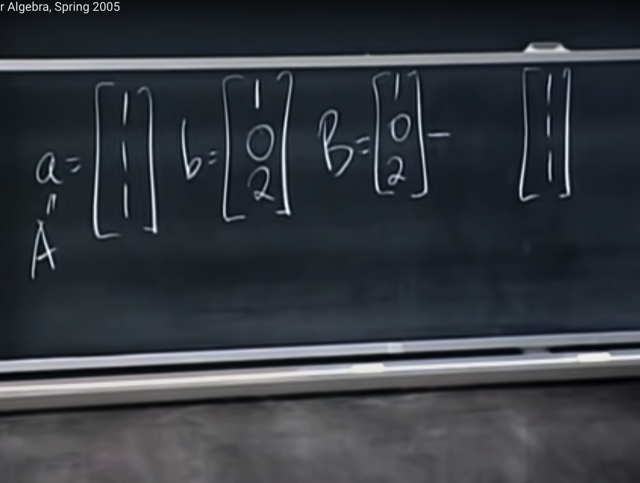</kbd></p>

> [!NOTE]
> Cho hai vector **a, b trong R3**. Như thường lệ ta **chỉ giữ
> nguyên a (A=a)**. Câu hỏi: B là gì?
>
> Me: ta sẽ **trừ b cho phần project của b lên a**:
>
> ```text
> B = b - p = b - ax^ = b - a (aTb)/aTa = [1 0 2] - 3/3* [1 1 1]
> ```
>
> ```text
> Ôn lại: Bắt đầu từ aTe aT(b-p) = 0 <=> aT(b - ax^) = 0
> ```
>
> ```text
> <=> aTb = aTax^ <=> x^ = aTb/aTa
> ```

<br>

<a id="node-559"></a>

<p align="center"><kbd>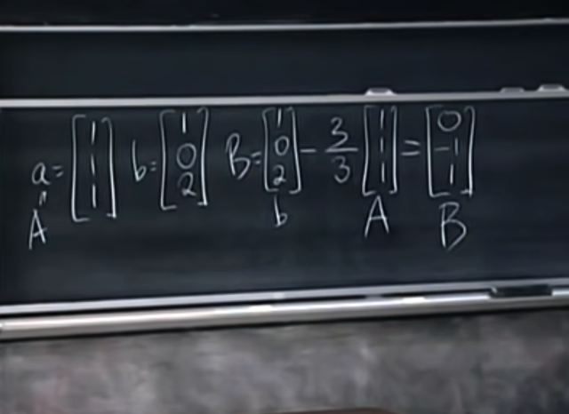</kbd></p>

> [!NOTE]
> gs: làm sao tôi biết nó đúng?
>
> me: ta sẽ **xem ATB có bằng 0 không**

<br>

<a id="node-560"></a>

<p align="center"><kbd>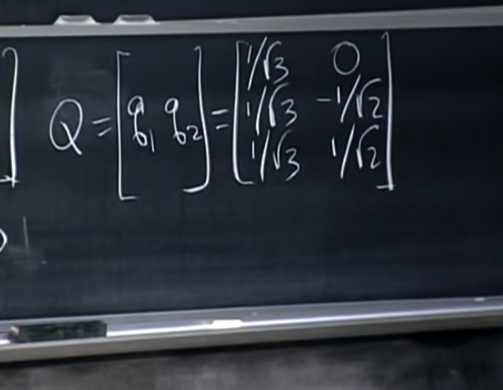</kbd></p>

> [!NOTE]
> Cuối cùng ta sẽ **chia cho vector length** ta có
> orthonormal vector q1, q2

<br>

<a id="node-561"></a>

<p align="center"><kbd>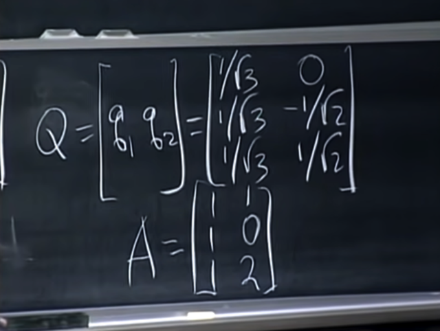</kbd></p>

> [!NOTE]
> Như vậy là**từ independent cols matrix A,**Gram
> Schmidt đã**giúp ta có matrix Q với các orthonormal
> columns (chú ý lần nữa là Q chưa phải orthogonal
> matrix vì nó không vuông)**

<br>

<a id="node-562"></a>

<p align="center"><kbd>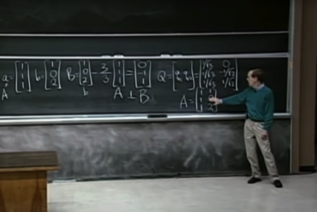</kbd></p>

> [!NOTE]
> Gs: **cols space của A** là gì? Và nó **liên quan gì đến cols
> của Q**
>
> Me: Vì 2 cols của A **independent**, nên chúng**span một
> 2D plane trong R3**
>
> Thế thì vì B `=` b `-` `(aTb/aTa).a,` tức là nó là linear combination
> của a,b. Thành ra B cũng nằm trong column space của A.
> Còn A thì là a rồi.
>
> Và q1, q2 là A, B sau khi scale để có unit norm.
>
> Thành ra **q1, q2 cũng nằm trong cols space của A**. Mà
> không chỉ nằm trong, chúng là 2 vector độc lập. Thì đương
> nhiên chúng **cũng là một basis của subspace** đó.
>
> Vậy c**olumns space của Q CHÍNH LÀ column space của A:
>
> C(Q) `=` C(A)**

<br>

<a id="node-563"></a>

<p align="center"><kbd>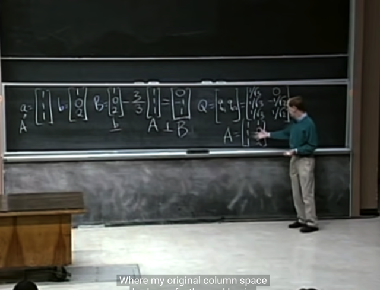</kbd></p>

> [!NOTE]
> Đúng vậy, mọi chuyện nãy giờ ta**chỉ đang linear
> combination hai vector a, b**, tức là ta**vẫn chỉ đang ở
> trong cols space của A**

<br>

<a id="node-564"></a>

<p align="center"><kbd>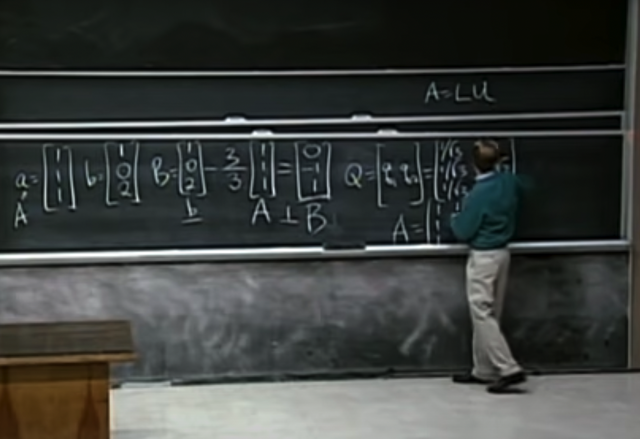</kbd></p>

> [!NOTE]
> Đại khái gs nói rằng, ta **đã biết elimination**, giúp **đưa A về
> upper triangular matrix U**. Và ta đã biết cách làm
> elimination.
>
> Nhưng trong **NGÔN NGỮ MATRIX**, ta sẽ chỉ cần thể hiện
> là gọi là **A `=` LU**

<br>

<a id="node-565"></a>

<p align="center"><kbd>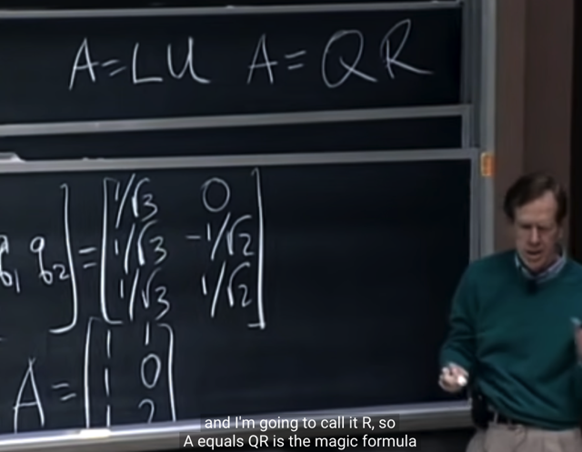</kbd></p>

🔗 **Related:** [LECTURE 22: DIAGONALIZATION AND POWERS OF A](untitled.md#node-730)

> [!NOTE]
> và tương tự quá trình **Gram Schmidt** giúp **biến A
> thành Q** được thể hiện qua **A `=` QR**

<br>

<a id="node-566"></a>

<p align="center"><kbd>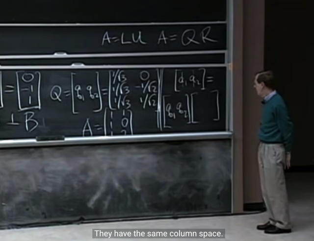</kbd></p>

<br>

<a id="node-567"></a>

<p align="center"><kbd>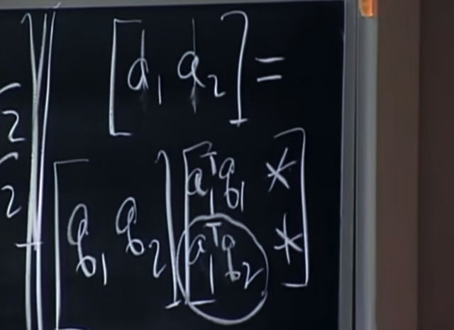</kbd></p>

> [!NOTE]
> Thế thì gs c**ho biết matrix R sẽ là như vầy**, và nó sẽ là
> một U matrix (upper triangular). Gs hỏi tại sao?
>
> a1Tq2 `=` 0 là vì q2 là phần dư của a2 sau khi project
> lên a1, và scale với norm

<br>

<a id="node-568"></a>

<p align="center"><kbd>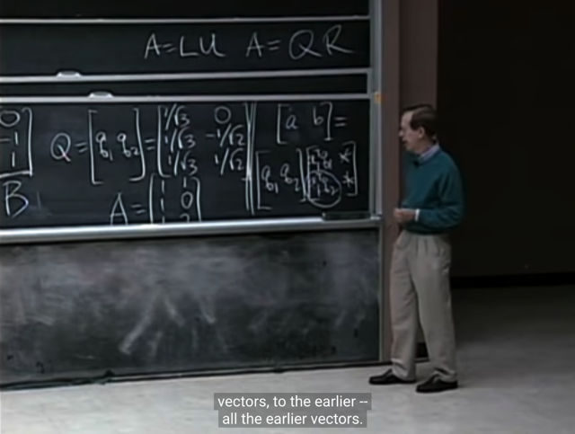</kbd></p>

> [!NOTE]
> Gs: correct. Và tóm lại bắt đầu với matrix A với **independent**
> cols, Gram Smith sẽ chuyển nó thành **orthonormal cols**
> matrix Q và liên hệ giữa chúng thể hiện bởi matrix R: A `=` QR

<br>

