# Lecture 18: Properties Of Determinants

📊 **Progress:** `37` Notes | `41` Screenshots

---
<a id="node-570"></a>

<p align="center"><kbd>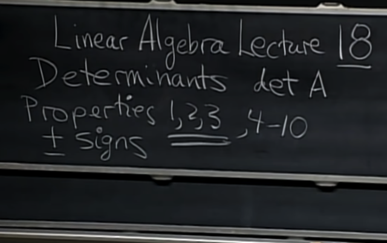</kbd></p>

> [!NOTE]
> mở đầu gs nói rằng ta sẽ thảo luận một phần quan trọng
> tiếp theo, trong đó ta sẽ làm việc với **square** matrix, để bàn
> tới **determinant** và **eigenvalues.
>
> Có nghĩa là, determinant và eigenvectors và eigenvalues
> chỉ apply với square matrix**

<br>

<a id="node-571"></a>

<p align="center"><kbd>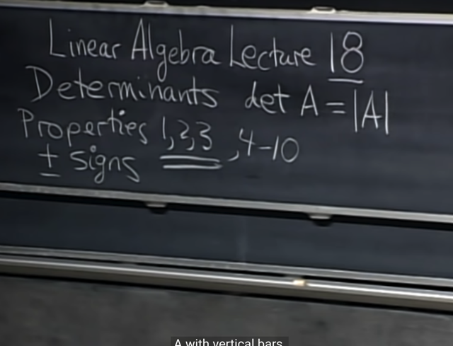</kbd></p>

> [!NOTE]
> Thế thì MỌI **SQUARE** MATRIX SẼ ĐỀU CÓ MỘT
> CON SỐ GẮN VỚI NÓ `-` **DETERMINANTS**

<br>

<a id="node-572"></a>

<p align="center"><kbd></kbd></p>

> [!NOTE]
> Gs: con số này tuy **không thể chứa mọi thông tin** của matrix
> nhưng nó CÓ KHẢ NĂNG**CHO BIẾT TÍNH INVERTIBILITY**
> CỦA MATRIX
>
> **DETERMINANT KHÁC 0, MATRIX NONSINGULAR 
> `/` INVERTIBLE**
>
> **DETERMINANT BẰNG 0, MATRIX SINGULAR**
> `(NON-INVERTIBLE)`

<br>

<a id="node-573"></a>

<p align="center"><kbd>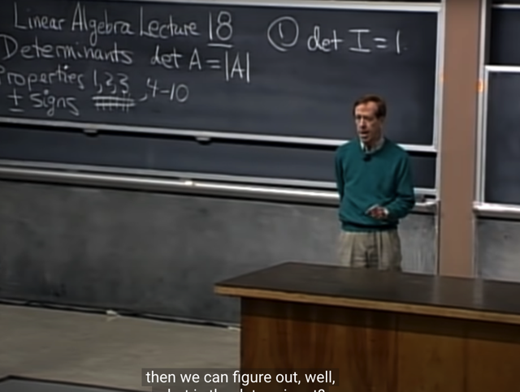</kbd></p>

> [!NOTE]
> Gs nói rằng ta sẽ không học ngay công thức của
> determinant.
>
> Mà sẽ làm quen với nó qua **3 tính chất đầu tiên**của nó.
> Trong đó **det I `=` 1** là tính chất thứ nhất. Và qua tính chất
> thứ 2 và 3, ta sẽ biết về determinant

> [!NOTE]
> Property #1: Det I `=` 1

<br>

<a id="node-574"></a>

<p align="center"><kbd>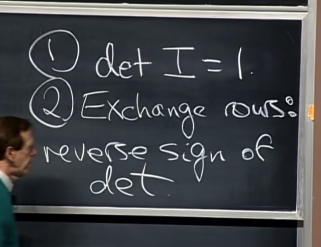</kbd></p>

> [!NOTE]
> Và tính chất thứ 2 đó là, nếu ta**đổi chỗ hai row,
> determinant sẽ bị chuyển dấu**

> [!NOTE]
> Property #2: đổi chỗ hai row,
> determinant sẽ bị chuyển dấu

<br>

<a id="node-575"></a>

<p align="center"><kbd>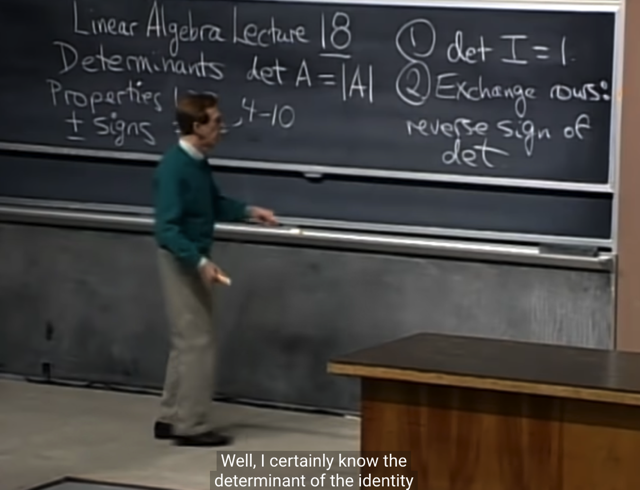</kbd></p>

> [!NOTE]
> Gs hỏi rằng, với hai tính chất này, thì ta có thể tính được
> determinant của matrix nào?
>
> Me: Đó là **permutation** matrix, bởi nó chỉ là matrix có
> được khi ta**exchange row từ identity matrix**, và ta đã
> biết **det I `=` 1**

<br>

<a id="node-576"></a>

<p align="center"><kbd></kbd></p>

> [!NOTE]
> Gs: correct. Từ hai tính chất này ta biết được det của
> permutation matrix, **sẽ là 1 hoặc `-1` tùy theo số lần
> exchange là chẵn hay lẻ.**
>
> Cái này cũng dễ hiểu thôi, **khi đổi chỗ một cặp row thì
> det sẽ đổi dấu**. Vậy nếu exchange 2 lần thì det sẽ về lại
> giá trị cũ
>
> Vậy nếu exchange số chẵn lần thì det bằng 1, còn số lẻ
> thì det `=` `-1`

<br>

<a id="node-577"></a>

<p align="center"><kbd>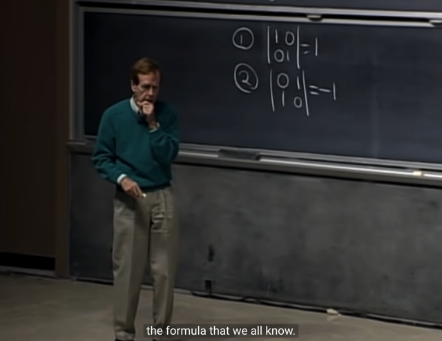</kbd></p>

> [!NOTE]
> Ví dụ như này, nhờ hai property ta biết det của
> chúng. Chú ý cách ghi det là **det A** hoặc **|A|**

<br>

<a id="node-578"></a>

<p align="center"><kbd>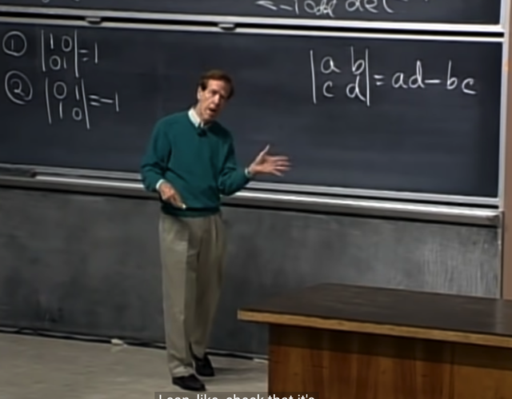</kbd></p>

> [!NOTE]
> Gs nói về công thức**tính det của matrix (2, 2)** và ông
> cho rằng ta sẽ dùng nó làm **cơ sở để tính det của
> matrix (n, n)**

<br>

<a id="node-579"></a>

<p align="center"><kbd>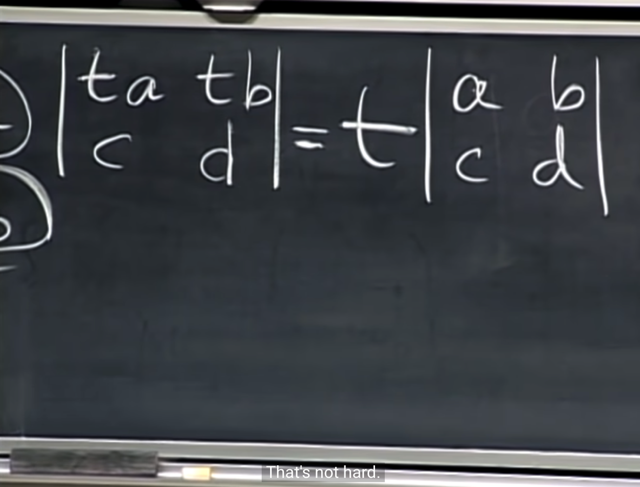</kbd></p>

> [!NOTE]
> Và **property thứ #3** là property mấu chốt. Ta sẽ có hai phần.
>
> 3a: Khi**nhân một row** (row bất kì, nhưng ví dụ là row đầu)
> của A cho t, và **các row còn lại giữ nguyên** thì determinant
> sẽ là gì?
>
> Thì nó sẽ bằng **t * det(A)**

> [!NOTE]
> Property #3a: Khi nhân một row (row bất kì, nhưng ví dụ là
> row đầu) của A cho t, và các row còn lại giữ nguyên thì
> determinant `=` t*det(A)

<br>

<a id="node-580"></a>

<p align="center"><kbd>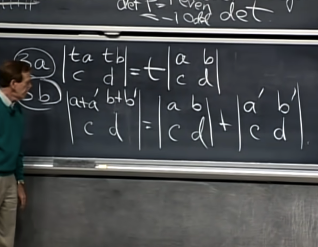</kbd></p>

> [!NOTE]
> Và 3b là khi ta **xét một row**, **các row còn lại giữ nguyên**
> thì det của matrix `=` **tổng det của hai matrix** trong đó
> với row 1 matrix A1 `+` row 1 của matrix A2 `=` row 1 của
> matrix A, các row khác giữ nguyên.

<br>

<a id="node-581"></a>

<p align="center"><kbd>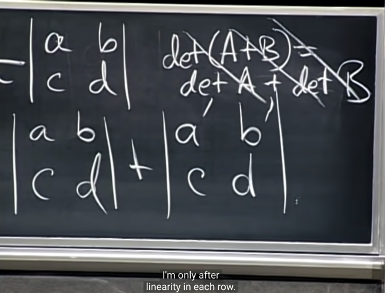</kbd></p>

<br>

<a id="node-582"></a>

<p align="center"><kbd>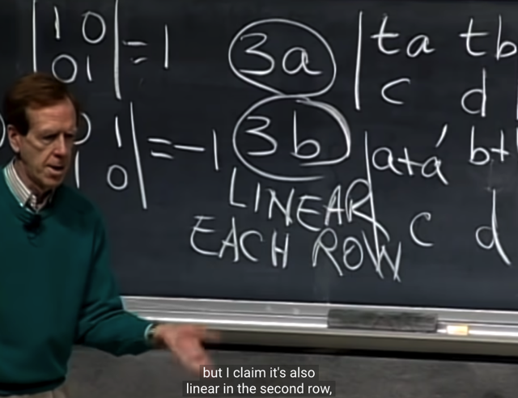</kbd></p>

> [!NOTE]
> Tức là, gs nhấn mạnh rằng determinant có tính chất
> **tuyến tính trong mỗi row**.
>
> ```text
> Không phải là det(A+B) = det A + det B mà là det A + det
> ```
> B nhưng **chỉ cộng hai hàng nào đó thôi**, ví dụ hàng số 2
> đi, để có matrix C (hàng 2 của C `=` tổng hàng 2 của A, B)
> thì khi đó det A `+` det B `=` det C

<br>

<a id="node-583"></a>

<p align="center"><kbd>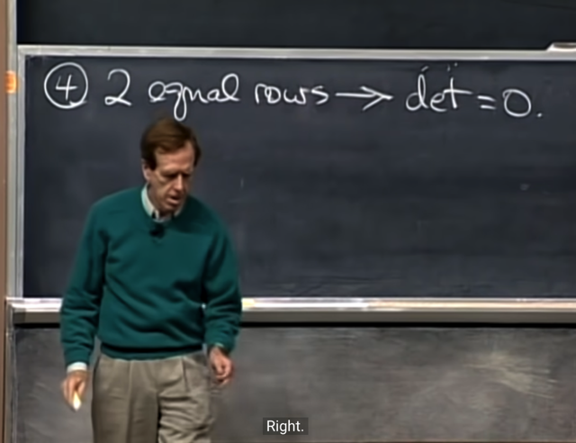</kbd></p>

> [!NOTE]
> Câu hỏi của thầy là, dựa vào properties 1,2,3 giải thích tại
> sao lại có tính chất 4: khi **hai hàng giống nhau thì det `=` 0**
>
> Me: Từ property 2 ta biết khi **switch row thì det đổi dấu**.
> Thế thì nếu hai hàng giống nhau, đổi chỗ thì cơ bản là  ta
> theo đó ta có hai matrix có det khác dấu. det A `=` `-` det B
> Tuy nhiên vì hai hàng giống nhau nên B vẫn là A, ta có
> det A `=` `-` det A Và điều này cho ta **det A `=` 0.**

<br>

<a id="node-584"></a>

<p align="center"><kbd>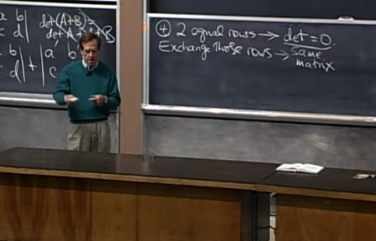</kbd></p>

> [!NOTE]
> Gs: Correct
>
> Và ta cũng có thể nghĩ theo cách nghĩ rằng, **matrix có hai
> row giống nhau thì đương nhiên sẽ sẽ có dependent row**,
> khiến nó**không thể full row rank** (và đang nói về square
> matrix nên nó **không thể full rank `->` không invertible**. Và
> như lúc nãy nói, **non-invertible matrix sẽ có det `=` 0**

<br>

<a id="node-585"></a>

<p align="center"><kbd>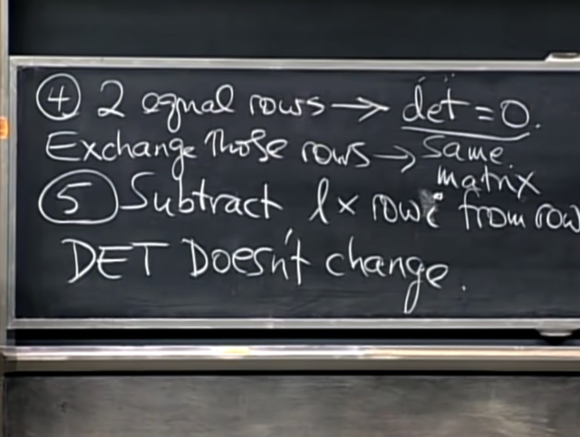</kbd></p>

> [!NOTE]
> tính chất thứ 5 là khi ta **trừ một hàng cho [scalar * một
> hàng khác]**thì **det không đổi**
>
> Gs nhắc ta nhớ rằng đây là "hành động" quen thuộc ta hay
> làm khi thực hiện elimination đưa A về U.
>
> Chính vì vậy mà **det A `=` det U:**hay quá trình **elimination**
> **không làm thay đổi determinant**. Tuy nhiên trong quá trình
> có thể cần **dùng đến row exchange, thành ra det có thể
> đổi dấu.**

<br>

<a id="node-586"></a>

<p align="center"><kbd>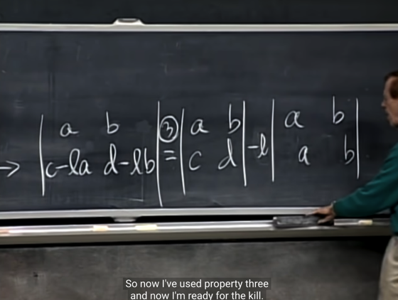</kbd></p>

<p align="center"><kbd></kbd></p>

<p align="center"><kbd>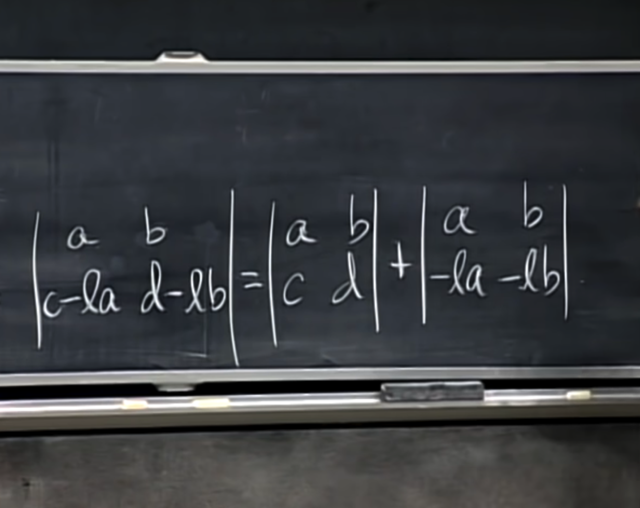</kbd></p>

> [!NOTE]
> gs lấy ví dụ, cho matrix A, và ta sẽ trừ row 2 cho 2 * row 1
> thì det vẫn bằng nhau
>
> Giải thích vì sao lại vậy:
>
> Dùng property 3b để có det của matrix này bằng tổng det của 
> A và det của matrix A2 (có hàng 2 là `[-t*a` `-t*a])`
>
> Tiếp dựa vào property 3b để tách t ra. Tức det A2 `=` `-t*det` B2
>
> Và B2 có hai hàng bằng nhau nên theo properties 4, det nó
> bằng 0.
>
> Vậy **det của matrix không đổi** khi **trừ một row cho t*row 
> khác**

<br>

<a id="node-587"></a>

<p align="center"><kbd>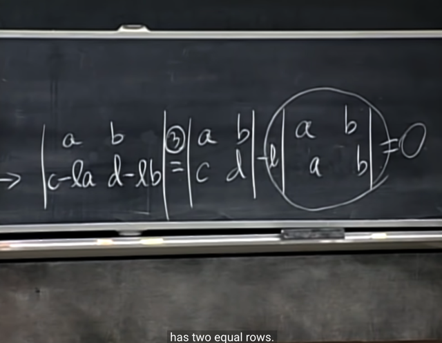</kbd></p>

<br>

<a id="node-588"></a>

<p align="center"><kbd>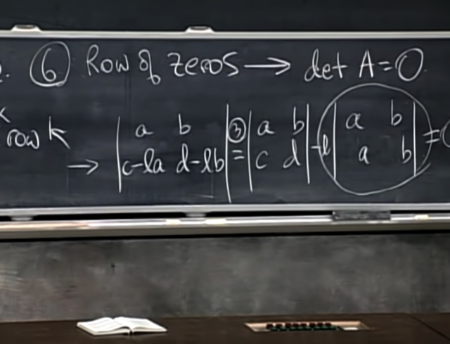</kbd></p>

🔗 **Related:** [LECTURE 19: DETERMINANT FORMULAS AND COFACTORS](untitled.md#node-610)

> [!NOTE]
> Property thứ 6 là **nếu matrix có row `=` 0 thì det `=` 0**.
>
> Thế thì gs cho rằng ta có thể dễ hiểu ngay properties này vì **row
> `=` 0 tức là nó chính là một row dependent** (vì nó `=` một row khác
> * 0). Thành ra matrix **không thể full rank**, do đó cũng `non-invertible` 
> `->` **det `=` 0**
>
> Thế nhưng để giải thích nó từ các properties trước đó ta sẽ giải
> thích thế nào?
>
> Me: Ta có thể giải thích như sau:
>
> giả sử matrix 3x2 với row 3 `=` [0 0]. Thì ta có thể cho  row 3 `=`
> ```text
> tổng của hai row vector nào đó. ví dụ [0 0 ] = [-1 -1] + [1 1]
> ```
>
> Khi đó dựa vào 3b ta sẽ có det A `=` det B `+` det C (với B là matrix
> A nhưng row 3 là `[-1,` `-1],` C là matrix A nhưng row 3 là [1 1]
>
> Thế thì dựa vào 3b, det C chính là det B * `-1` (vì hàng 2 của B là
> bằng hàng 2 của C nhân `-1)`
>
> Vậy thì det A `=` det B `-` det B `=` 0

<br>

<a id="node-589"></a>

<p align="center"><kbd>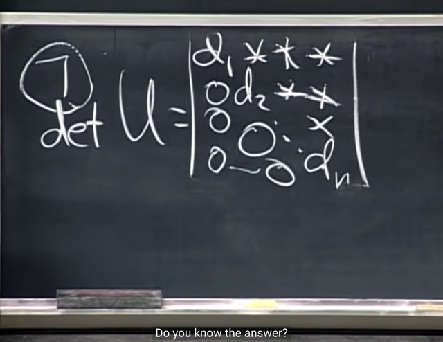</kbd></p>

> [!NOTE]
> gs: property 7 cho là về det của một UPPER TRIANGULAR 
> matrix.
>
> VÀ LOWER **TRIANGULAR** CŨNG VẬY. 
>
> Nói chung là triangular matrix
>
> Dựa vào các properties trước hãy tính thử nó là gì

<br>

<a id="node-590"></a>

<p align="center"><kbd>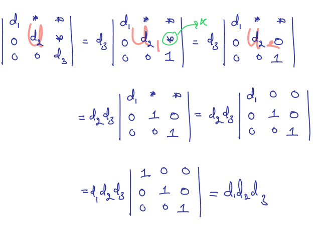</kbd></p>

🔗 **Related:** [LECTURE 2: ELIMINATION WITH MATRICES](untitled.md#node-29)

> [!NOTE]
> Me: lấy ví dụ matrix này, đầu tiên dễ thấy nó là d3*det
> U1 (đây là tính chất 3a)
>
> Tiếp, từ U1, ta trừ hàng 2 cho hàng 3 nhân k ta có U2.
> Và theo property 5, det không đổi.
>
> Tương tự vậy, cuối cùng ta sẽ có det(U) `=` d1d2...dn*det(I)
>
> và det(I) `=` 1 
>
> Vậy det U `=` **d1d2.....dn
>
> (Và bài sau sẽ biết chúng (d1,d2...) cũng là eigenvalues)**

<br>

<a id="node-591"></a>

<p align="center"><kbd>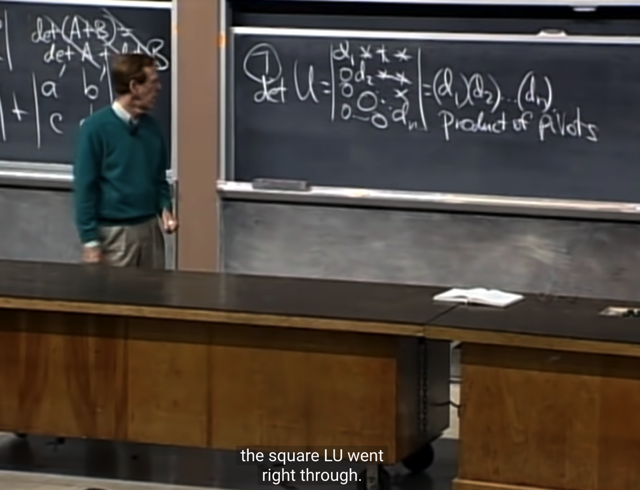</kbd></p>

> [!NOTE]
> Gs cho biết trước khi chứng minh, đó là nó sẽ là **tích các
> d1...dn**. Và vì đây là U, nên đây**chính là các pivot**.
>
> Thế thì gs cho biết rằng trong **matlab để tính det của matrix**,
> nó sẽ:
>
> i) **đưa A về U** (Qúa trình này, theo tính chất 5 hồi nãy đã
> nói, sẽ không làm thay đổi det) nếu có row exchange, det
> sẽ cũng chỉ đổi dấu
>
> ii)**nhân các pivots**.
>
> Vậy cần lưu ý det U có thể bằng hoặc ngược dấu với det A
> bởi lẽ từ A đến U CÓ THỂ TA PHẢI ROW EXCHANGE

<br>

<a id="node-592"></a>

<p align="center"><kbd>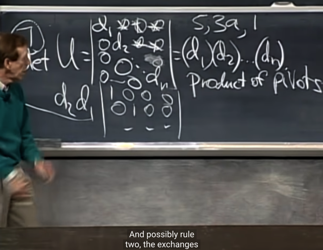</kbd></p>

> [!NOTE]
> và chứng minh nó thì
> đúng như mình nghĩ.

<br>

<a id="node-593"></a>

<p align="center"><kbd>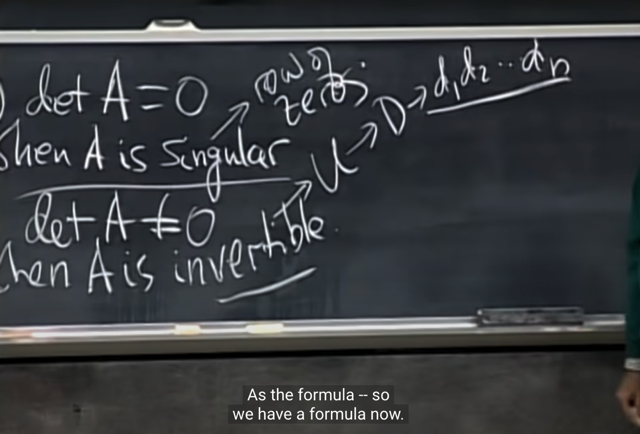</kbd></p>

> [!NOTE]
> Và property 8 chính thức nói về nhận định hồi đầu lúc nãy
> thầy nói: matrix `non-invertible,` hay**singular thì det `=` 0**
>
> Me: Thử xem tính chất thứ 8 này có thể chứng minh từ các
> properties khác: Đó là nếu A `non-invertible` thì nó sẽ không
> `full-rank,` đồng nghĩa**elimination sẽ cho U có ít nhất 1 row
> bằng 0**. Thì khi đó:
>
> det A `=` `+-` det U (do property 5)
>
> U có một row `=` 0 `->` det U `=` 0 (property 6)
>
> Do đó det A `=` 0
>
> Gs: Chính xác là như vậy. Nếu **A singular, elimination sẽ
> cho ra ít nhất một row `=` 0 `->` det `=` 0**
>
> Và nếu A **invertible**, ta biết nó full rank, tức mọi row đều là
> pivot, thì **elimination sẽ đưa nó thành U, và ta có det là
> d1*d2....dn và do đó sẽ khác 0**

<br>

<a id="node-594"></a>

<p align="center"><kbd>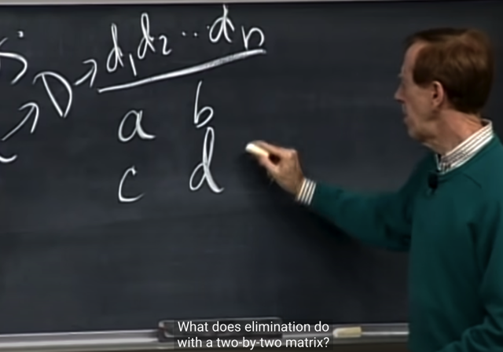</kbd></p>

> [!NOTE]
> Gs: Thế thì ta đã có một công thức, **quy trình để tìm
> det của matrix A (n,n)**
>
> Vậy thử xem tại sao với **2x2 matrix A** thì det A `=` **ad-bc**

<br>

<a id="node-595"></a>

<p align="center"><kbd>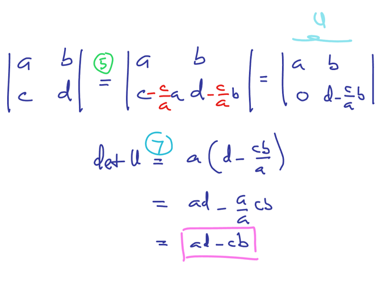</kbd></p>

🔗 **Related:** [LECTURE 19: DETERMINANT FORMULAS AND COFACTORS](untitled.md#node-611)

> [!NOTE]
> chuyển A về U, bằng cách khử c, `=`
> trừ hàng 2 cho `c/a` * hàng 1.

<br>

<a id="node-596"></a>

<p align="center"><kbd>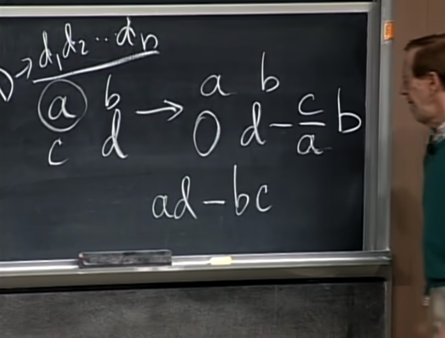</kbd></p>

> [!NOTE]
> Gs: Correct

<br>

<a id="node-597"></a>

<p align="center"><kbd>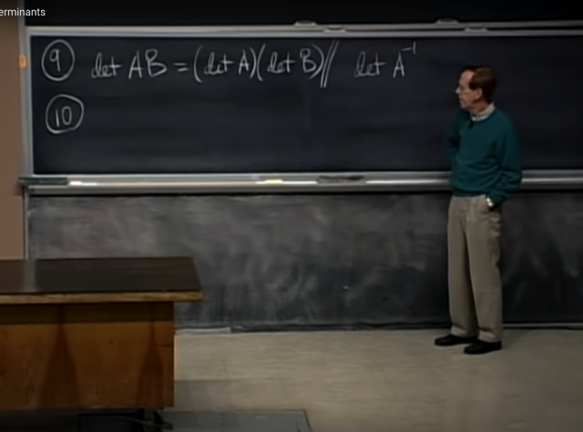</kbd></p>

> [!NOTE]
> Property 9: **det AB `=` (det A)*(det B)**. Gs cho biết đây là tính
> chất rất tiện lợi, ta không có tính linearity, như nãy đã nói
> **det A `+` B không bằng det A `+` det B**
>
> Nhưng **det AB thì bằng tích hai det.**
>
> Vậy gs hỏi từ 9, tính thử **det A_inv**
>
> Me: A.Ainv `=` I, nên det I `=` det A * det `A_inv` 
>
> `=>` det `A_inv` `=` det I `/` det A `=` **1 `/` det A**

<br>

<a id="node-598"></a>

<p align="center"><kbd>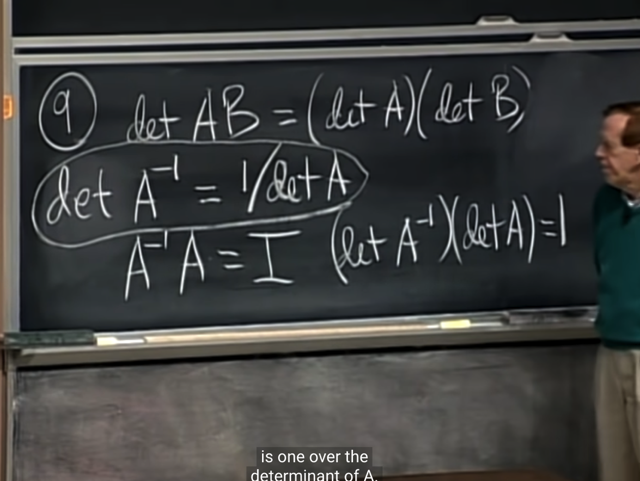</kbd></p>

> [!NOTE]
> Gs: Correct

<br>

<a id="node-599"></a>

<p align="center"><kbd>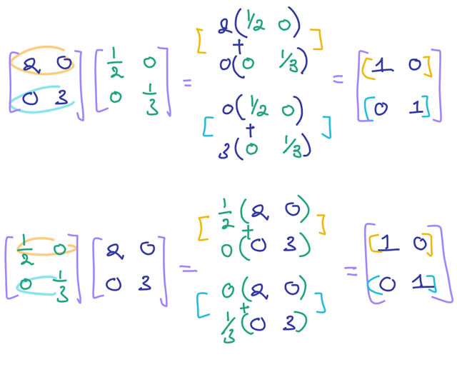</kbd></p>

<p align="center"><kbd></kbd></p>

<p align="center"><kbd>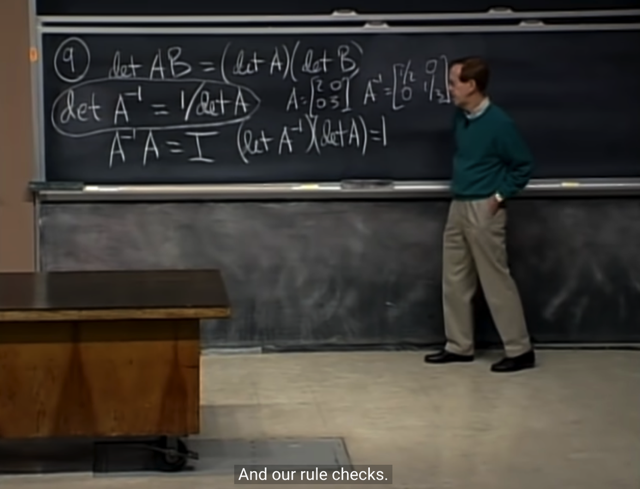</kbd></p>

> [!NOTE]
> Và ta có thể thấy lấy ví dụ A là matrix **upper triangular** như
> vậy,  thì ta biết det A `=` 2*3 `=` 6
>
> Và AinvA `=` I, nên ta cũng biết Ainv sẽ có giá trị `1/2,1/3` trên
> đường chéo. (nhân AinvA là nhìn vậy chứ không phải là
> element wise đâu, mà nhân matrix bình thường cả AAinv hay
> AinvA đều cho ra I)

<br>

<a id="node-600"></a>

<p align="center"><kbd>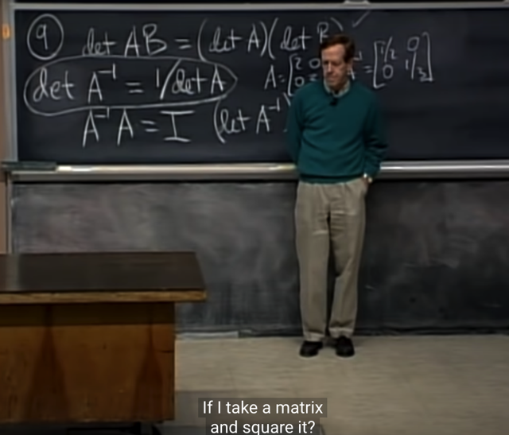</kbd></p>

> [!NOTE]
> Tiếp, gs: det (A**2)?
>
> det A.A `=` detA detA `=` detA **2

<br>

<a id="node-601"></a>

<p align="center"><kbd>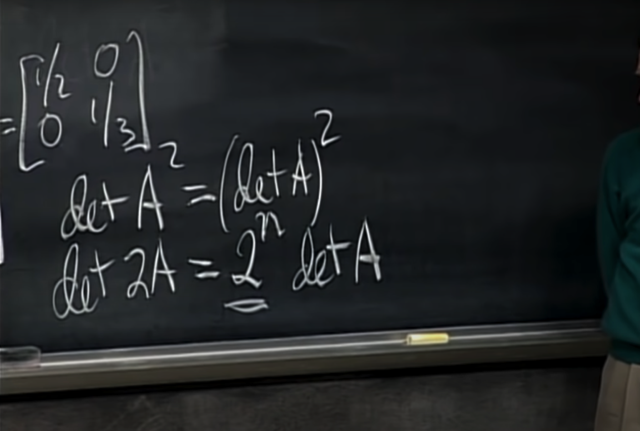</kbd></p>

> [!NOTE]
> còn det (2*A) `=` 2^n det A

<br>

<a id="node-602"></a>

<p align="center"><kbd>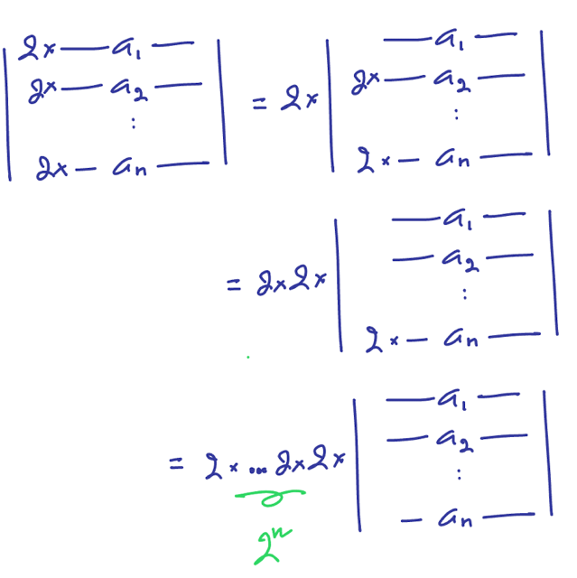</kbd></p>

> [!NOTE]
> dễ thấy cái này là hệ
> quả của property 3a

<br>

<a id="node-603"></a>

<p align="center"><kbd>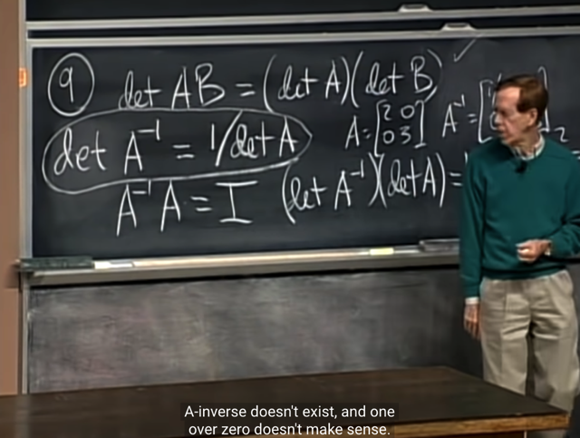</kbd></p>

> [!NOTE]
> Như vậy property 9 giúp ta có **det Ainv `=` `1/det` A** hoàn toàn
> giúp ta liên hệ tới việc **nếu A invertible** (hay non singular)
> t**hì det A khác 0**, do đó **det Ainv `=` `1/det` A** là công thức 
> có hiệu lực. Ngược lại, **nếu A singular, thì Ainv không
> tồn tại thì công thức det Ainv cũng không hiệu lực** vì 
> lúc này det A `=` 0

<br>

<a id="node-604"></a>

<p align="center"><kbd>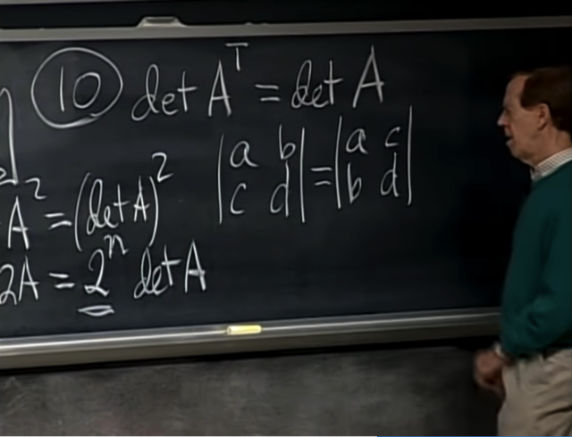</kbd></p>

> [!NOTE]
> property 10 cho biết **det của AT `=` det A**. Kiểm tra bằng
> 2x2 matrix ta thấy đúng là đều bằng `ad-bc`
>
> Thế thì hệ quả quan trọng của 10 đó là, **mọi thứ liên quan
> đến row đều đúng với cols**.
>
> Ví dụ như **switch column sẽ đổi dấu det**, hay **matrix có
> cols `=` 0** **thì det `=` 0**

<br>

<a id="node-605"></a>

<p align="center"><kbd>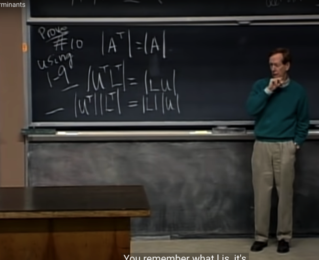</kbd></p>

> [!NOTE]
> Để chứng minh, ta có **elimination chuyển A `->` U**, và
> được thể hiện qua phương trình **A `=` LU** tương tự **AT
> `=` UT.LT**
>
> Gs: **det L là gì `->` 1**. Bởi gs nhắc ta nhớ**L là Lower
> Triangular matrix có diagonal là 1** nên theo property 7,
> det nó là **tích các  pivot trên đường chéo `->`  `=` 1**. Còn
> LT đương nhiên là Upper triangular nên det cũng `=` 1.
>
> ```text
> Vậy vì A = LU => det A = det L * det U = det U vì det L = 1
> ```
> ```text
> và từ A = LU <=> AT = (LU)T = UTLT nên ta có:
> ```
>
> det (AT) `=` det UT * det LT `=` det UT (vì det LT cũng `=` 1)
>
> và cuối cùng matrix U là triangular matrix, det của nó bằng
> tích các giá trị trên đường chéo, mà khi UT cũng có cùng
> đường chéo  với U, thành ra det UT cũng bằng det U.
>
> Vậy từ đó đủ cơ sở để kết luận **det A `=` det AT**

<br>

<a id="node-606"></a>

<p align="center"><kbd></kbd></p>

<br>

