# Lecture 19: Determinant Formulas And Cofactors

📊 **Progress:** `39` Notes | `41` Screenshots

---
<a id="node-608"></a>

<p align="center"><kbd>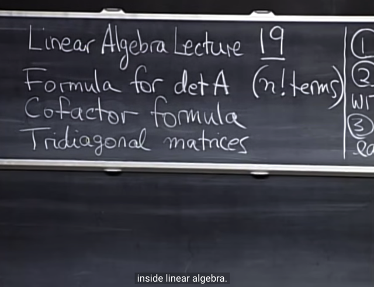</kbd></p>

<br>

<a id="node-609"></a>

<p align="center"><kbd>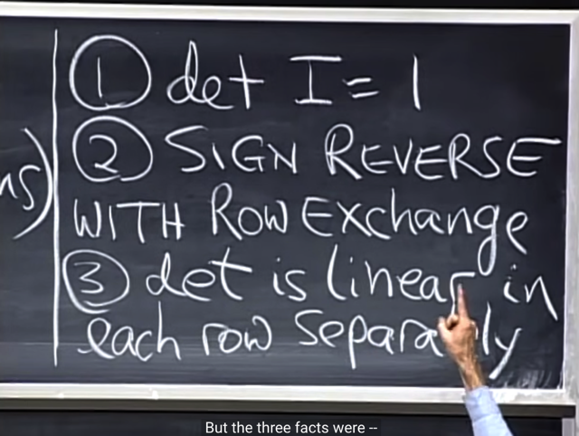</kbd></p>

<br>

<a id="node-610"></a>

<p align="center"><kbd>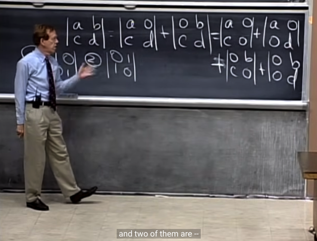</kbd></p>

🔗 **Related:** [LECTURE 18: PROPERTIES OF DETERMINANTS](untitled.md#node-588)

> [!NOTE]
> Gs lấy ví dụ 2x2 matrix. Gs cho biết ta có thể dùng **property
> #3a** để **tách det nó ra thành tổng det** các matrix như này.
>
> Ôn lại property 3a: Khi khi A1, A2 và A có liên hệ, `row_i` của 
> ```text
> A1 + row_i của A2 = row_i của A, và các row khác thì giữ
> ```
> nguyên giống nhau thì det(A) `=` det(A1) `+` det(A2) 
>
> Câu hỏi là**trong 4 matrix này**, thì **cái nào bằng 0**
>
> `->` Đó là hai cái **có zero column** (vì như ta đã biết det A `=`
> det AT, và **matrix có row `=` 0 thì det `=` 0 theo property #6
> nên matrix có cột bằng 0 thì det `=` 0**
>
> Hoặc cũng có thể **nghĩ theo cách, matrix có col `=` 0 thì nó
> không thể full rank vì cột bằng 0 đó dependent** `->` 
> `non-invertible,` hay singular `->` det `=` 0)

<br>

<a id="node-611"></a>

<p align="center"><kbd>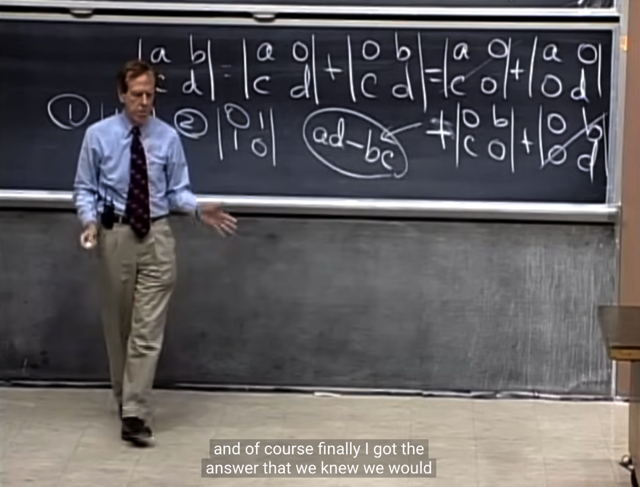</kbd></p>

🔗 **Related:** [LECTURE 18: PROPERTIES OF DETERMINANTS](untitled.md#node-595)

> [!NOTE]
> Và với hai matrix còn lại, thì nó là **diagonal matrix**(ý là
> cái [0 b; c 0] khi switch row sẽ là diagonal matrix và
> đương nhiên det của nó sẽ đổi dấu, nên det của [0 b; c
> 0] sẽ là `-` det [c 0; 0 b] và `=` `-` bc, còn det của [a 0; 0 b] thì
> là ab rồi**,** ta **có lại công thức det của 2x2 matrix : ad `-`
> bc**.
>
> Cái matrix đầu tiên có a, d trên đường chéo thì đương
> nhiên là chỉ cần dùng tính chất det của Triangular matrix
> để tính det `=` a*d
>
> Cái matrix thứ hai, thì cần phải thực hiện row exchange
> để đưa về dạng upper triangular, và det của nó là cd,
> nhưng vì có một lần row exchange nên phải thêm dấu `(-)`

<br>

<a id="node-612"></a>

<p align="center"><kbd>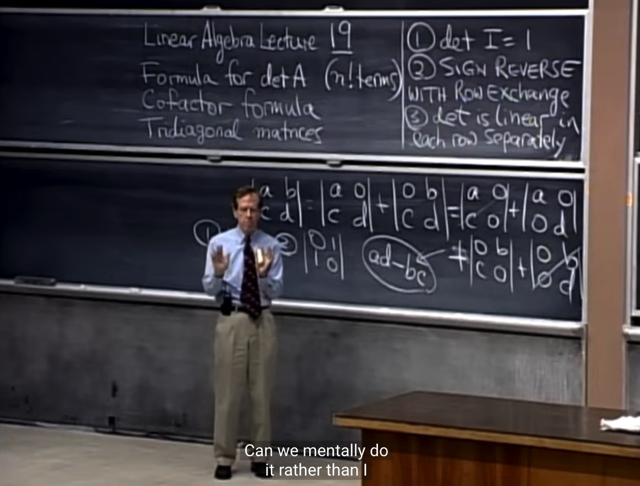</kbd></p>

> [!NOTE]
> Nhưng cái chính là ta**hiểu cách làm**để có thể thấy rằng
> **từ cách làm này**(tức tách matrix ra thành tổng nhiều
> matrix, **mỗi lần tách theo từng hàng**, property 3b cho
> phép ta tính) ta **có thể tính det của mọi matrix.**
>
> Ví dụ với matrix 3x3. Đầu tiên ta cũng sẽ **giữ nguyên row
> 2, 3**. Tách **row 1 ra làm 3 để ta có 3 matrix.**
>
> Tiếp **với mỗi matrix**, **giữ nguyên row 1,3** t**ách row 2
> ra làm 3**, vậy là có 9 matrix. Cuối cùng, với mỗi matrix,
> giữ nguyên hai row đầu, tách row 3 ra làm 3 để có 3
> matrix.
>
> Vậy **tổng cộng có 27 matrix `=` 3^3**.
>
> Nhận xét**với matrix 2x2 thì ta có 2^2.**
>
> Vậy có thể khái quát matrix **nxn ta sẽ tách thành nxn `=`
> n^2 matrix**
>
> PHẢI HIỂU LÀ ĐỂ RỒI TA CÓ **DET CỦA MATRIX BAN
> ĐẦU** BẰNG **TỔNG DET CỦA N^2 MATRIX NÀY**. Và
> gs nói rằng **phần lớn các matrix sẽ có det `=` 0**, giống
> như trong case 2x2 matrix, các matrix có cols `=` 0 sẽ có det
> `=` 0

<br>

<a id="node-613"></a>

<p align="center"><kbd></kbd></p>

> [!NOTE]
> Ví dụ matrix 3x3. Gs hỏi rằng, vậy, **khi nào ta có các
> matrix mà survive**, tức **det khác 0?**

<br>

<a id="node-614"></a>

<p align="center"><kbd>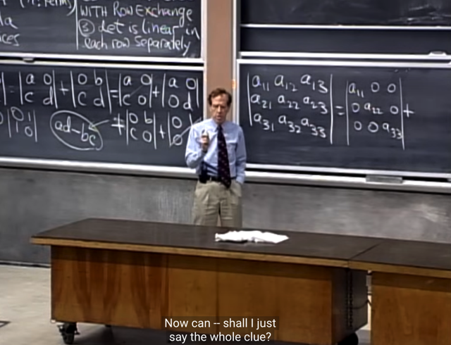</kbd></p>

> [!NOTE]
> Gs: Ta có thể chỉ ra một cái (trong số đám matrix đó) có
> det khác không là cái này, **một diagonal matrix.**

<br>

<a id="node-615"></a>

<p align="center"><kbd>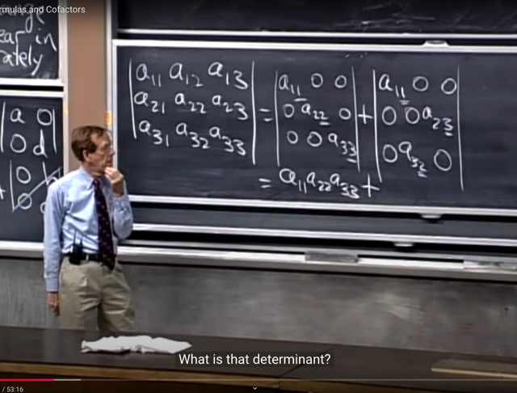</kbd></p>

> [!NOTE]
> Vậy gs cho rằng từ đó ta có thể nhìn ra**quy luật khi nào thì
> matrix có det khác 0**, đó là khi **mỗi cột đều có ít nhất một
> entry khác 0** `-` để **không có cột nào bằng 0**. Ví dụ một cái
> nữa là vầy.
>
> Thế thì ta đã biết**det của diagonal là a11*a22*a33**. Câu
> hỏi là **matrix kia det là bao nhiêu**?
>
> Me: Có thể dùng property 2 (exchange row thì đổi dấu) để
> thấy det của nó sẽ là **- (a11a32a23)**

<br>

<a id="node-616"></a>

<p align="center"><kbd>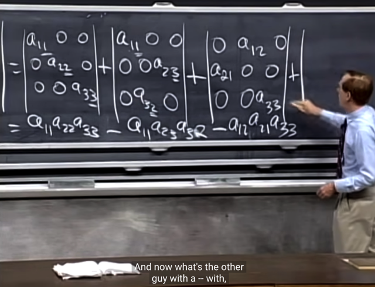</kbd></p>

> [!NOTE]
> Tiếp, hai cái đầu là khi ta cho col 1 có entry khác 0 đứng
> đầu, tức a11 `!=` 0 
>
> Giờ ta **đến lượt cho col 2 có entry khác 0 đứng đầu**
> tiên (tức a12 khác 0). 
>
> Ta có matrix thứ nhất là thế này, dễ thấy det của nó là
> **-a12a21a33** (dấu trừ vì ta phải swap row 1 lần: hàng 1
> và hàng 2)

<br>

<a id="node-617"></a>

<p align="center"><kbd>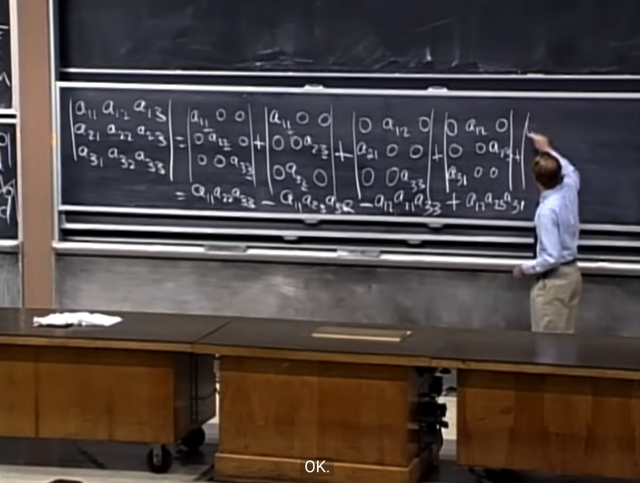</kbd></p>

> [!NOTE]
> Tương tự với matrix thứ 2
> của case này là vầy.

<br>

<a id="node-618"></a>

<p align="center"><kbd>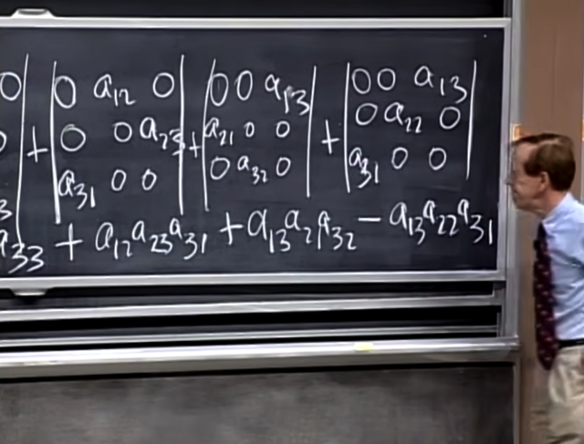</kbd></p>

> [!NOTE]
> Tương tự, đến lượt cho col thứ 3 có 1st entry khác 0, ta
> có thêm 2 matrix nữa với det của chúng cũng dễ hiểu

<br>

<a id="node-619"></a>

<p align="center"><kbd>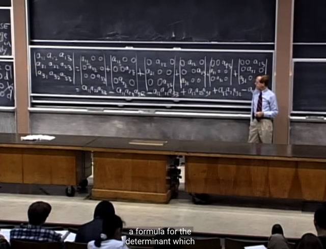</kbd></p>

> [!NOTE]
> đến đây gs nói đại ý là **ta có thể bị cám dỗ** bởi việc cho
> rằng **dấu dương sẽ là dành cho đường chéo thuận**,**dấu
> âm cho đường chéo nghịch** nhưng **không nên làm vậy**
> vì khi **generalize lên 4x4 matrix thì nó không đúng**, khi đó
> đường chéo nghịch sẽ vẫn có det dương. lí do là vì ta sẽ
> switch row 2 lần

<br>

<a id="node-620"></a>

<p align="center"><kbd>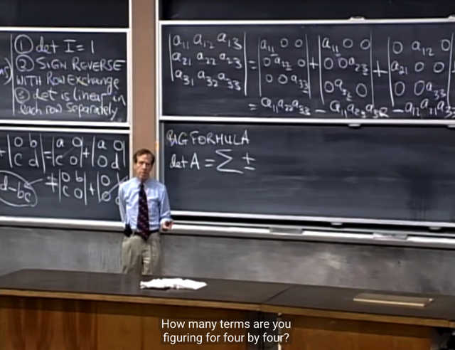</kbd></p>

> [!NOTE]
> Gs nói qua **công thức chung cho det của n,n
> matrix**. Câu hỏi là, như ta thấy với **3x3, ta có 6
> survivor matrix** (có det khác 0, survivor). Vậy với nxn
> matrix thì có mấy cái?
>
> Me: Tới đây ta dùng một kiến thức của **probability**
> về **counting rule**: Có thể thấy survivor matrix là cái
> mà **mỗi column đều có  một entry khác 0**.
>
> Vậy ta có thể tính **số "survivor matrix"** với trường
> hợp matrix nxn như sau: Dựa vào counting rule của
> xác xuất ra có thể triển khai n bước như sau:
>
> i) Chọn vị trí khác 0 cho cột 1: có n lựa chọn.
>
> ii) Chọn vị trí khác 0 cho cột 2: Vì cần thiết phải né lựa
> chọn ở hàng 1,**vì nếu không, chắc chắc sẽ có một
> hàng bị zero (hình dung ta phải rải 10 quả bóng vào
> 10x10 ô thì để đảm bảo không có hàng nào trống, thì
> ta phải rải từng cột, và ở cột sau phải né các vị trí của
> các cột trước đó)**. Nên chỉ có n `-` 1 lựa chọn.
>
> iii) Chọn vị trí khác 0 ở cột 3, tương tự, vì phải đảm
> bảo không có hàng nào bị zero nên chỉ có `n-2` lựa
> chọn. ...
>
> Vậy ta sẽ có `n*(n-1)*(n-2).....1` `=` n!

<br>

<a id="node-621"></a>

<p align="center"><kbd>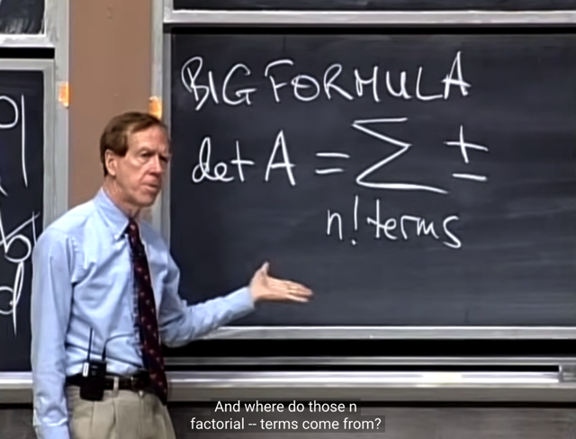</kbd></p>

> [!NOTE]
> Gs: đúng là n!. Gs giải thích theo lối step rule: đó là step 1 ta
> chọn vị trí khác 0 cho cột 1. Thì có n vị trí, sau đó chọn vị trí
> khác 0 cho cột 2, ta né vị trí (ý là cái hàng) mà cột 1 đã
> chọn, ta còn `n-1` vị trí, tiếp tục như vậy. Ta sẽ có n!

<br>

<a id="node-622"></a>

<p align="center"><kbd>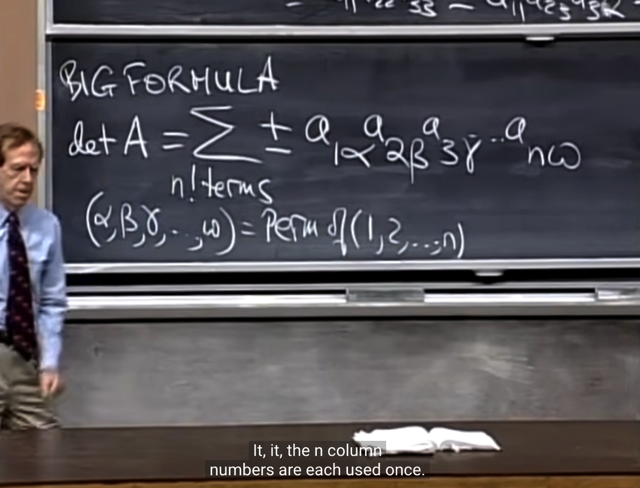</kbd></p>

> [!NOTE]
> Và từ đó công thức sẽ là như vầy: **tổng của n! term**.
> Mỗi term là**tích của n component khác 0 ở các cột**
>
> Hiểu như vầy: 
>
> **a_1α** là **vị trí khác 0 ở hàng 1 cột alpha**, 
>
> **a_2β**: vị trí khác 0 ở hàng 2 cột `β...`
>
> Với {**α, `β` ....ω**} là **bộ hoán vị của 1, 2, 3...n**

<br>

<a id="node-623"></a>

<p align="center"><kbd></kbd></p>

> [!NOTE]
> Gs cho rằng vì **nhìn nó phức tạp** nên đó là lí do ông không
> đưa cái công thức này ra ngay từ đầu, tuy vậy ta có thể từ
> đây để kiểm tra lại các property, ví dụ cái thứ 1,**det I `=` 1**.
>
> Dễ thấy với A `=` I thì khi tách ra như vừa rồi, thì đương nhiên
> **chỉ còn có một term có det khác 0**, mà đó **cũng là cái
> matrix mà vị trí khác 0 là a11, a22**,.... và **cũng chính là 1
> luôn**. Và det sẽ là 1*1....1 `=` 1

<br>

<a id="node-624"></a>

<p align="center"><kbd>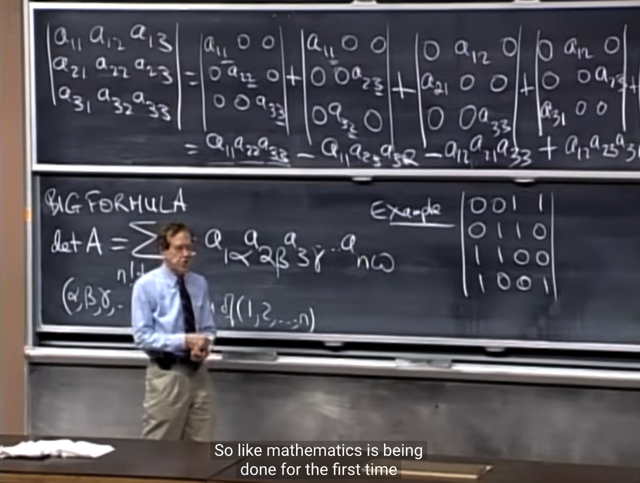</kbd></p>

> [!NOTE]
> Gs lấy ví dụ của matrix này, ta sẽ **tính det** của nó.
>
> Đầu tiên thử trả lời là **nó có singular không đã**.
>
> Me: \~Có thể thấy không có row nào depend row nào, vì
> row nào cũng có một số 0 tại vị trí mà col khác là 1. (Do
> đó nó ko thể nhân với scalar nào ra row khác được)
> Nên có thể thấy chúng full rank `=` invertible
>
> \~Câu trên sai vì lập luận vậy chỉ là các hàng không độc
> lập với một hàng khác, chứ còn một khả năng nữa là
> **chúng combine nhau** ví dụ row1 `=` row 2 `+` row 3

<br>

<a id="node-625"></a>

<p align="center"><kbd>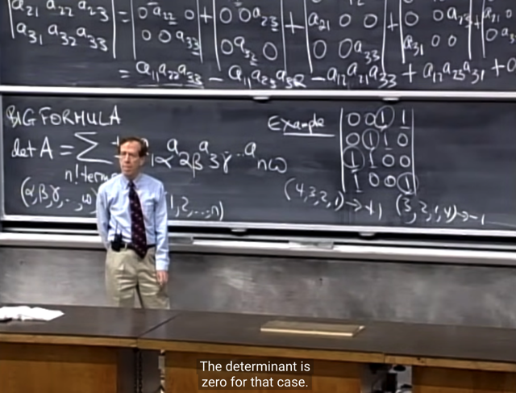</kbd></p>

> [!NOTE]
> Tính det với công thức trên: Thì đại khái cũng sẽ **coi thử
> trong `4*4=16` term,** **ứng với 16 matrix có các survivor
> term** nào, thì ta **thấy chỉ có 2 term, ứng với 2 matrix**:
>
> i) Các vị trí khác 0 là a13, a22, a31, a44. Và cái này có
> dấu `-1` vì cần switch row 1 lần (giữa hàng 1 và hàng 3)
>
> ii) Các vị trí khác zero là a14, a23, a32, a41. Thì term này
> có dấu `+` vì cần switch row 2 lần (hàng 1 và 4, hàng 2 và 3)
>
> Nên det là `+` 1*1*1*1 `-` 1*1*1*1 `=` 0
>
> (đương nhiên ta không viết ra 16 matrix làm gì, mà chỉ
> **xem thử có các term nào** (det của matrix nào) **khác 0**
> thôi

<br>

<a id="node-626"></a>

<p align="center"><kbd>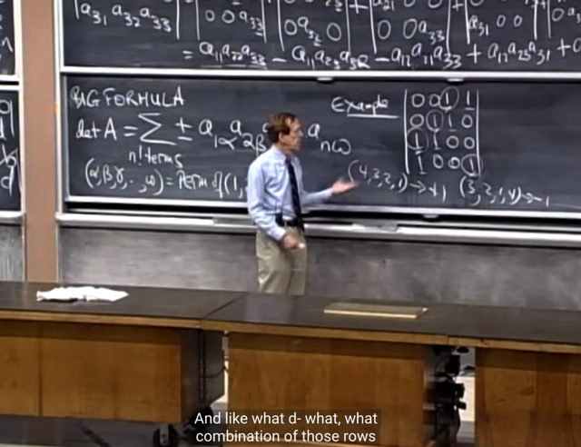</kbd></p>

> [!NOTE]
> Thế thì khi ta **đã biết det nó bằng 0** **suy ra nó singular**
> `(non-invertible)` thì có thể ta sẽ coi thử tại sao nó không
> full rank (ý là row nào depend row nào)
>
> Đó là **row 1 `+` row 3 `=` row 2 `+` row 4**, từ đó ta **có một
>  bộ coefficient khác 0** mà combine linearly các row để 
> cho ra 0 hay **các row không linear independent**

<br>

<a id="node-627"></a>

<p align="center"><kbd>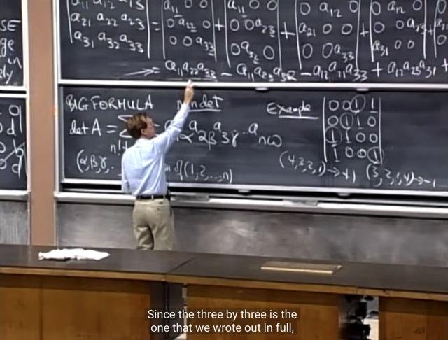</kbd></p>

🔗 **Related:** [LECTURE 19: DETERMINANT FORMULAS AND COFACTORS](untitled.md#node-636)

> [!NOTE]
> gs nói qua **cofactor** formula: bằng cách quay lại ví dụ
> trên, ta sẽ kiểu như**lấy thừa số chung**, ví dụ a11 ra để
> đưa a22a33 `-` a23a32 vào DẤU NGOẶC

<br>

<a id="node-628"></a>

<p align="center"><kbd>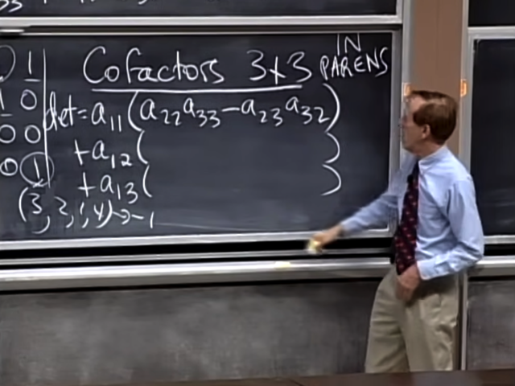</kbd></p>

> [!NOTE]
> Thì gs gọi đó là **COFACTOR** của **a11**

<br>

<a id="node-629"></a>

<p align="center"><kbd>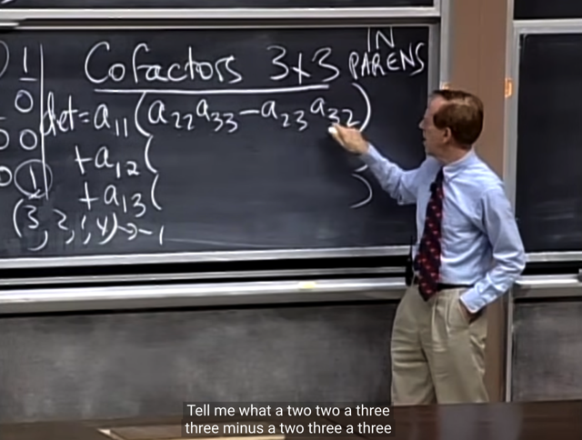</kbd></p>

> [!NOTE]
> Thế thì gs hỏi là, **cái cofactor của a11** này, **thực chất là
> cái gì?**
>
> Me: Hình như nó **chính là det của matrix nhỏ hơn** sau khi
> **loại bỏ hàng 1, cột 1 của matrix gốc** đi

<br>

<a id="node-630"></a>

<p align="center"><kbd>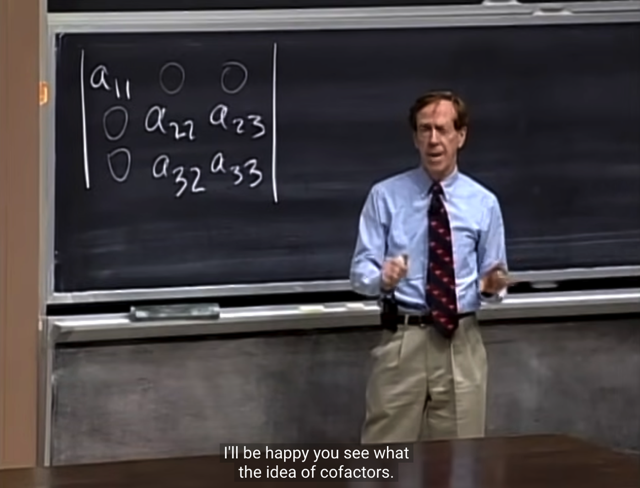</kbd></p>

> [!NOTE]
> Gs: correct. nó là **det của cái matrix nhỏ hơn khi đã bỏ
> col 1, row 1 đi**

<br>

<a id="node-631"></a>

<p align="center"><kbd>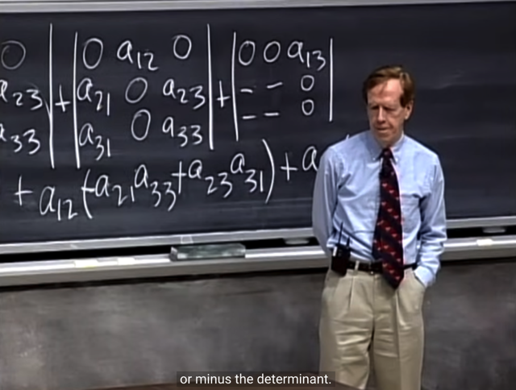</kbd></p>

> [!NOTE]
> Tương tự, cofactor của a12. tuy nhiên gs lưu ý rằng
> COFACTOR CỦA a12 **là CÁI NHÂN VỚI NÓ**, thành ra ta
> phải **đưa dấu trừ vào trong ngoặc** để rồi với a12 thì
> cofactor của nó là (**- DET CỦA MATRIX NHỎ TẠO BỞI
> MATRIX LỚN NHƯNG BỎ ĐI HÀNG 1, CỘT 2**)

<br>

<a id="node-632"></a>

<p align="center"><kbd>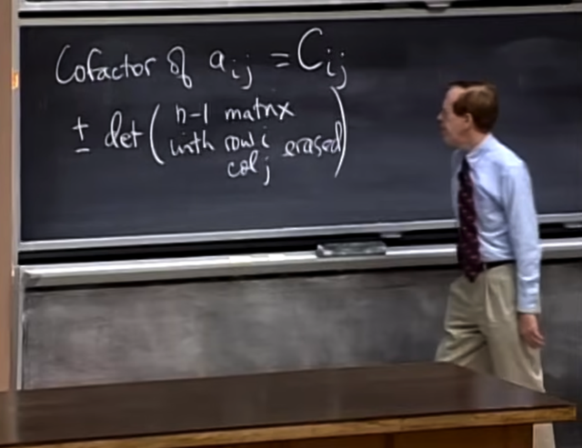</kbd></p>

> [!NOTE]
> Và như vậy ta có công thức của **cofactor của aij** (kí hiệu
> là **Cij**) là **det của cái matrix mà đã bỏ đi hàng i cột j**. Tất
> nhiên dấu `+` hoặc `-` phải xác định đúng.

<br>

<a id="node-633"></a>

<p align="center"><kbd>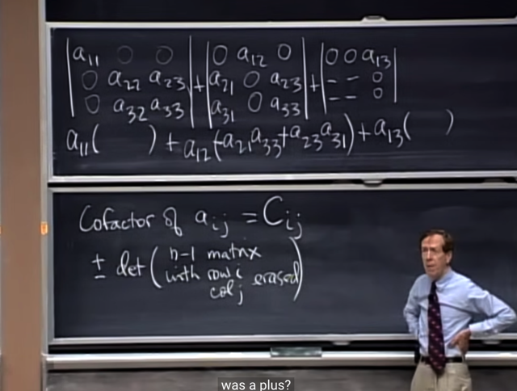</kbd></p>

> [!NOTE]
> Câu hỏi là dấu gì? Gs cho rằng **có vẻ** là nó sẽ **tùy vào
> tổng của i, j là chẵn hay lẻ**

<br>

<a id="node-634"></a>

<p align="center"><kbd>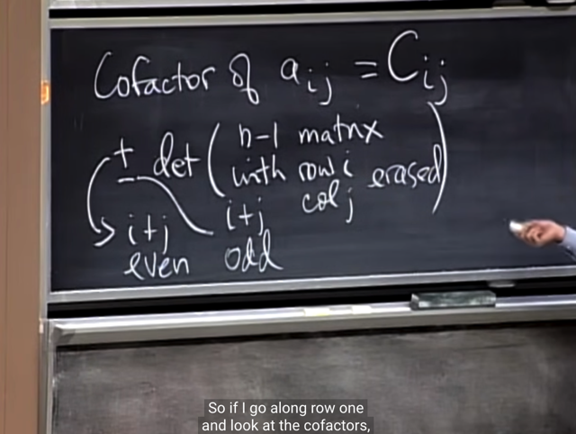</kbd></p>

> [!NOTE]
> Và đúng là vậy**i+j chẵn thì
> dấu +** và ngược lại

<br>

<a id="node-635"></a>

<p align="center"><kbd>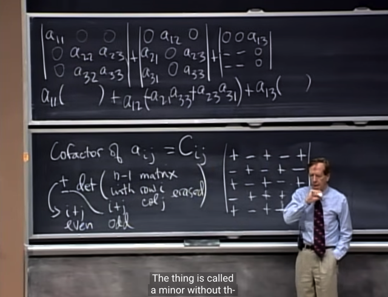</kbd></p>

> [!NOTE]
> Và như vậy **dấu của cofactor nó sẽ là `+/-` luân
> phiên như bàn cờ vua vậy**

<br>

<a id="node-636"></a>

<p align="center"><kbd>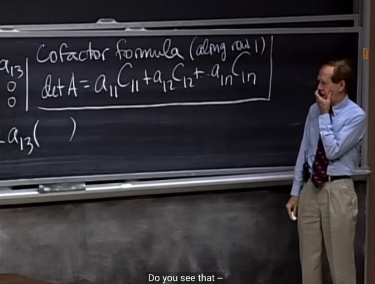</kbd></p>

🔗 **Related:** [LECTURE 19: DETERMINANT FORMULAS AND COFACTORS](untitled.md#node-627)

> [!NOTE]
> Và từ đó ta có c**ông thức của det A theo cofactor**, gọi là
> Cofactor formula và đây kiểu như là version làm theo row
> 1 (tức là dùng các item ở row 1 làm thừa số chung)
>
> hình như điều đó **có nghĩa là ta cũng có thể "làm theo"
> row 2,3**..ví dụ bằng cách gom các term có chung a23 và
> đưa a23 ra ngoài, gs không nói)

<br>

<a id="node-637"></a>

<p align="center"><kbd>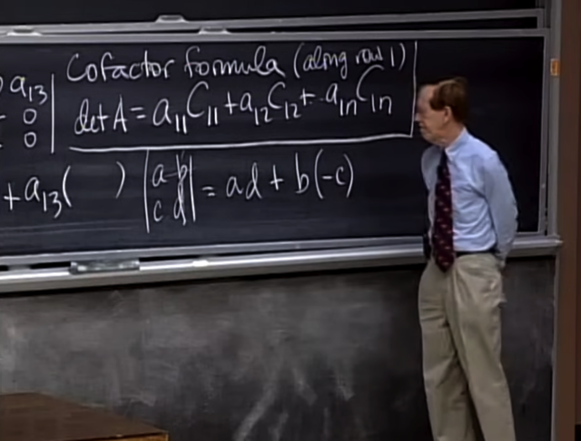</kbd></p>

> [!NOTE]
> Thử tính det của 2x2 matrix theo Cofactor formula: thì
> với a11 `=` a, thì cái matrix nhỏ chỉ còn là d, det của nó
> đương nhiên `=` d, nên ta có ad. Tiếp với a12 là b, cái
> matrix nhỏ chỉ là c, và theo luật `i+j` `=` `1+2` là lẻ nên dấu
> của cofactor là `-` nên ta có `b(-c)`
>
> Vậy đúng là det A `=` ad `-` bc

<br>

<a id="node-638"></a>

<p align="center"><kbd>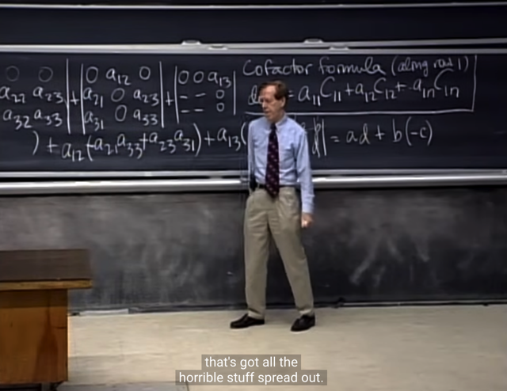</kbd></p>

> [!NOTE]
> Gs tóm tắt lại chút xíu là bài trước ta đã học **10
> properties** của **determinant**, và bài này ta đã biết **3
> công thức tính det** Trong đó cái quan trọng nhất là**tích của các pivot**. Nó đại khái cho ta thấy quá trình
> **elimination** đã **"dọn dẹp**" mớ hỗn loạn để rồi **chỉ
> còn lại các pivot** và nhân chúng lại ta có det.
>
> Công thức phức tạp thứ hai thì kiểu như **triển khai hết ra**
> Công thức thứ ba (**cofactor formula**) này thì cho ta
> cách **bớt phức tạp hơn** cái thứ hai, cho phép ta tính det
> của matrix bằng cách **tính det của các matrix nhỏ hơn.**

<br>

<a id="node-639"></a>

<p align="center"><kbd>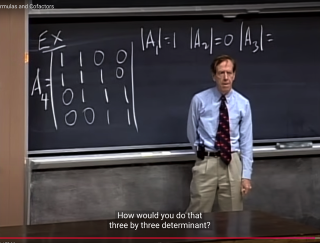</kbd></p>

> [!NOTE]
> Gs cho ví dụ này gọi nó là A4 là matrix có đặc điểm
> như vầy. Nó gọi là **TRI-DIAGONAL** matrix, để ý giống
> như nó **có 3 đường chéo `=` 1** vậy
>
> ông tính det các matrix A1 (là matrix chỉ có a11) đương
> nhiên `=` 1  và A2 (hàng 1,2; cột 1,2), dễ thấy nó ra 0
>
> Gs hỏi det của A3 (tức matrix A lấy hàng 1,2,3; cột 1,2,3)?

<br>

<a id="node-640"></a>

<p align="center"><kbd>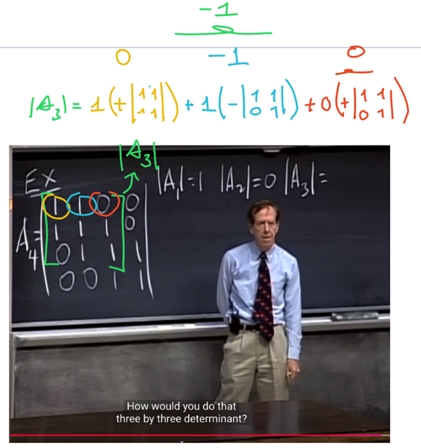</kbd></p>

> [!NOTE]
> Dùng cofactor formula

<br>

<a id="node-641"></a>

<p align="center"><kbd>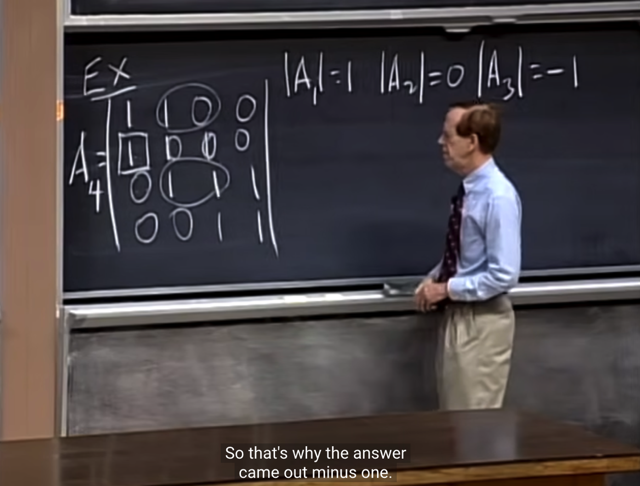</kbd></p>

> [!NOTE]
> gs: correct, ông thì làm vầy: trừ hàng 2 (nhớ là đang nói
> matrix A3 gồm hàng 1,2,3, cột 1,2,3) cho hàng 3, khíến
> nó chỉ còn [1 0 0]. Và làm vậy vì biết properties 5: trừ row 
> cho t*row khác không khiến thay đổi det 
>
> Sau đó ông dùng cofactor formula với hàng 2. Thì chỉ
> cần nhân A3_21 với cofactor của nó, vì A3_22, A3_23
> bằng 0 rồi. Và det của matrix nhỏ là 1, và vì `i+j` `=` `2+1` là lẻ
> nên cofactor có dấu `(-)` Vậy det A3 `=` `-1`

<br>

<a id="node-642"></a>

<p align="center"><kbd>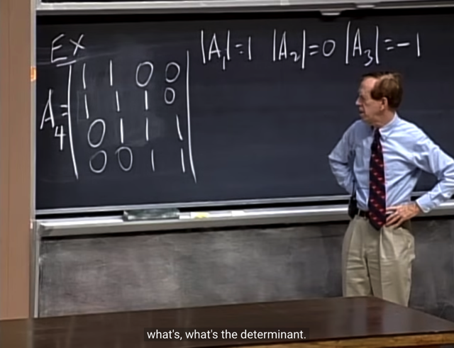</kbd></p>

> [!NOTE]
> với A4, ông cũng sẽ
> dùng cofactor formula

<br>

<a id="node-643"></a>

<p align="center"><kbd>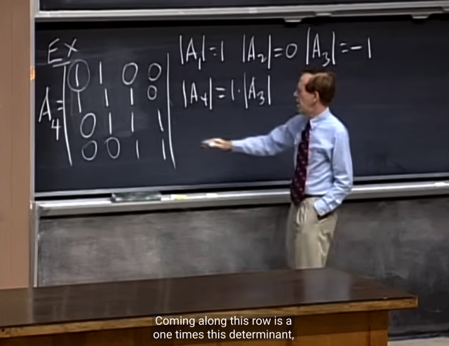</kbd></p>

> [!NOTE]
> và gs làm theo hàng một, vậy đầu tiên cofactor của a11
> chính là det của matrix nhỏ mà ta nhận ra nó cũng
> trùng hợp là A3. Và vì a11 có `(1+1)=2,` chẵn nên dấu của
> cofactor là `+`

<br>

<a id="node-644"></a>

<p align="center"><kbd>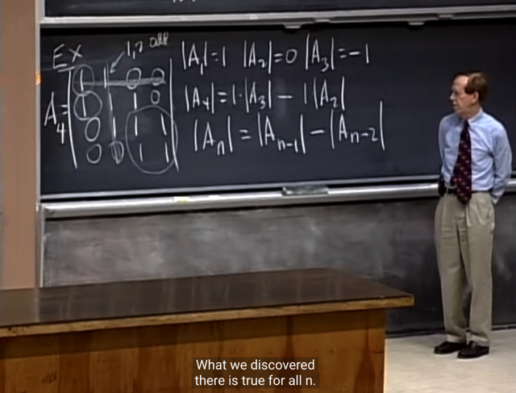</kbd></p>

> [!NOTE]
> Tiếp với a12, dấu của cofactor sẽ là `(-)` nhân với
> det của matrix nhỏ (màu xanh lá)

<br>

<a id="node-645"></a>

<p align="center"><kbd>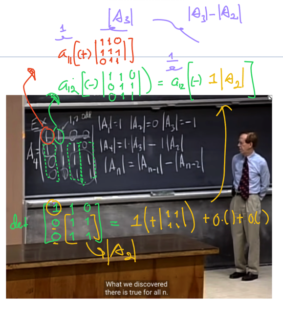</kbd></p>

> [!NOTE]
> Và matrix nhỏ là matrix xanh lá cây, gs sẽ tính det của
> nó theo cofactor của cột 1, vì**tính chất det A `=` det A.T
> nên làm theo cột theo hàng đều được cả**. Và có thể
> thấy nó bằng 1.det của cái matrix nhỏ hơn nữa (màu
> vàng) và cái này chính là A2.
>
> Và gs không tính theo a13*C13, a14*C14 nữa (có thể
> thấy vì a13, a14 bằng 0 rồi)
>
> Và kết quả **det A4 `=` det A3 `-` det A2**. Khái quát hoá
> matrix An có det là **det `An-1` `-` det An-2**

<br>

<a id="node-646"></a>

<p align="center"><kbd>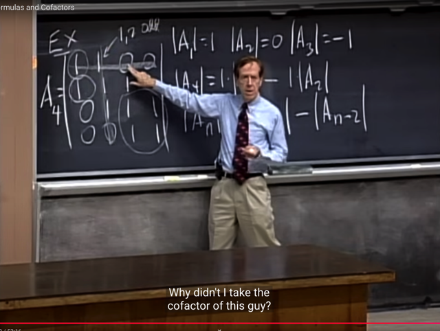</kbd></p>

> [!NOTE]
> Gs hỏi sao tôi không tính cofactor của a13, a14?
>
> me: thì bởi nó bằng 0 rồi tính làm gì nữa vì cofactor
> nhân với nó cũng bằng 0 thôi

<br>

<a id="node-647"></a>

<p align="center"><kbd>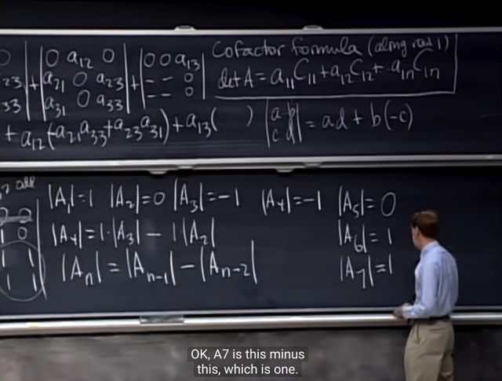</kbd></p>

> [!NOTE]
> Và từ đó ta có det A4 `=` `-1,` thì tương tự ta có
> thể tính **det A5**là det A4 `-` det A3 `=` `-1` `-(-1)` `=` 0
> ```text
> det A6 = det A5 - det A4 = 0 -(-1) = 1
> ```

<br>

<a id="node-648"></a>

<p align="center"><kbd>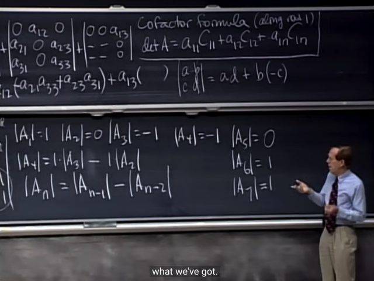</kbd></p>

> [!NOTE]
> Và gs cho biết chuỗi det sẽ là sự lặp lại của **[1 0 `-1` `-1` 0
> 1]**, cứ sau **mỗi 6 lần**, tức là det **A61 sẽ `=` det A1 `=` 1.**
> Và đây là tính chất rất thú vị của det của một loại matrix
> gọi là **TRI-DIAGONAL** `-` HIỂU NÔM NA MATRIX CÓ 3
> ĐƯỜNG CHÉO `=` 1 (còn lại dĩ nhiên là 0)

<br>

