# Lecture 1: The Geometry Of Linear Equations

📊 **Progress:** `19` Notes | `20` Screenshots

---

<kbd>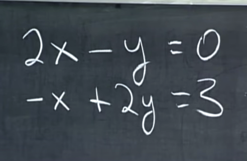</kbd>

 

<kbd>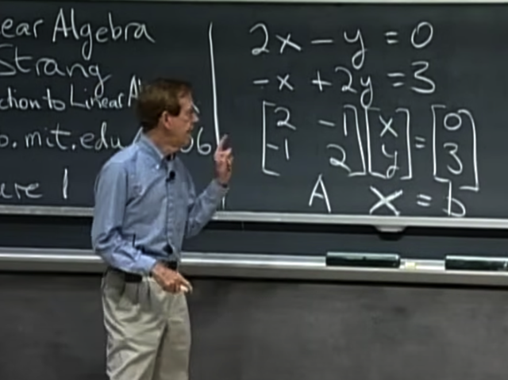</kbd>

> [!NOTE]
> gs đặt ra **equation system** như này, và **dạng matrix**
> của nó với **coefficient** matrix A, **variable vector x**

 

<kbd>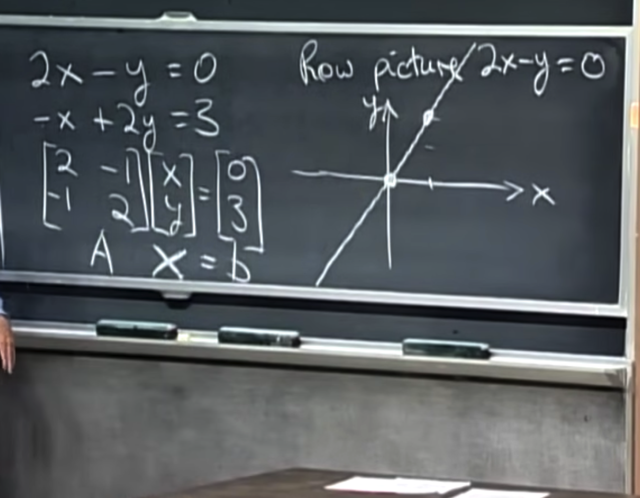</kbd>

> [!NOTE]
> tiếp, gs **tìm tất cả các điểm giúp solve equation thứ 1**,
> tạo nên **đường thẳng 2x - y = 0**
>
> Đương nhiên ta **có thể tìm hai điểm đặc biệt** là **giao
> điểm của nó với hai trục** rồi **vẽ đường thẳng qua hai
> điểm đó**

 

<kbd>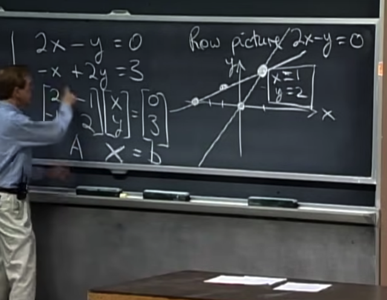</kbd>

> [!NOTE]
> tương tự, gs **vẽ tập hợp các điểm thỏa 2nd equation**,
> chính là **đường thằng -x + 2y = 0**. Cho thấy nó giao
> với 1st line ở x = 1; y = 2
>
> Nãy giờ ở đây gs nói về **Row picture** kiểu như **góc
> nhìn về matrix theo các row.** Dưới góc nhìn này, việc
> **solve equation system này là việc tìm ra bộ x,y giúp
> solve cả hai equation**, hay nói cách khác chính là:
>
> **Tìm ra điểm giao của hai linear line**

 

<kbd>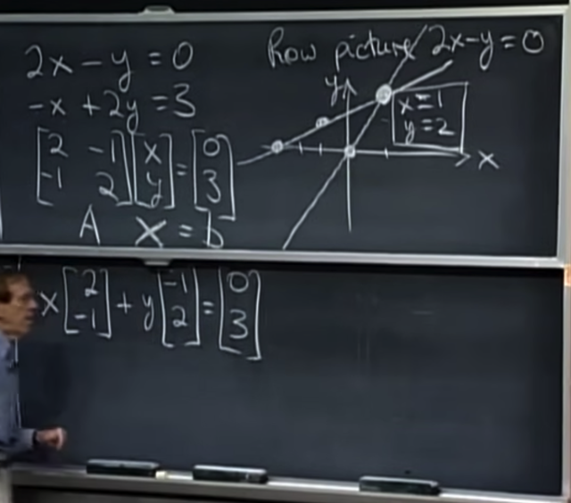</kbd>

> [!NOTE]
> Gs nói qua**Column picture**

 

<kbd>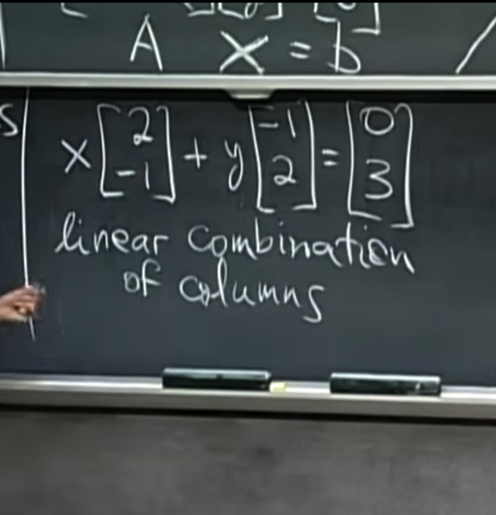</kbd>

> [!NOTE]
> và với bức tranh này, câu hỏi sẽ là **tìm ra một linear
> combination của hai vector cột để ra vector b**
>
> và **linear combination** là một trong những **fundamental
> concept của linear algebra**

 

<kbd>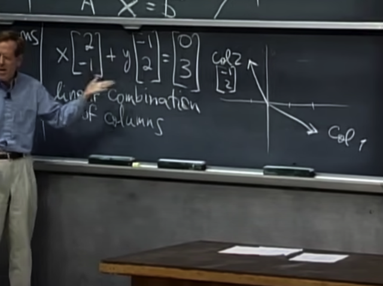</kbd>

> [!NOTE]
> Gs vẽ hai **vector columns** ra, câu hỏi là combination
> của chúng như thế nào để ra b. Thế thì như ta đã biết
> x = 1, y = 2 ở trên.

 

<kbd>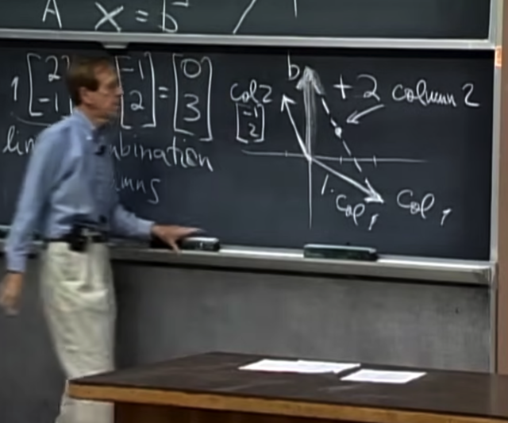</kbd>

> [!NOTE]
> Thành ra ta sẽ cộng **1*col1 với 2*col2**
>
> Hình ảnh sẽ là ta **đi theo hướng col1 một đoạn = 1*col1** và
> **đi theo hướng col2 một đoạn = 2*col2**sẽ **dẫn tới chính là
> vector b (0,3)**

 

<kbd>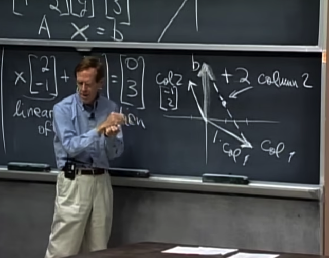</kbd>

> [!NOTE]
> Gs mở rộng ý tưởng ra, vậy thì **mọi possible
> combination** sẽ cho ta kết quả là gì -> **Toàn bộ mặt
> phẳng**

 

<kbd>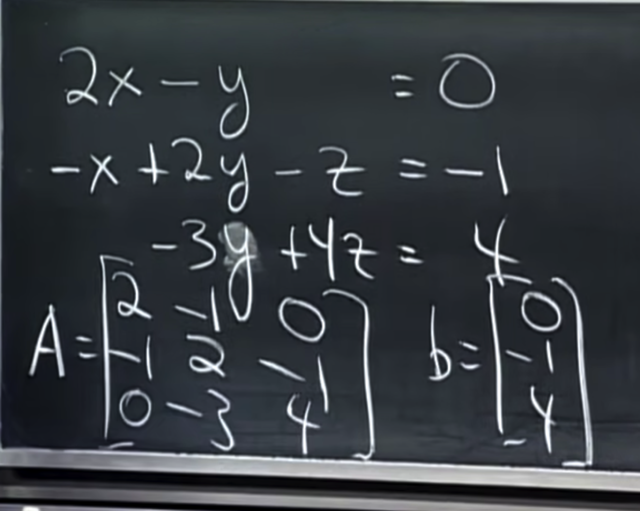</kbd>

> [!NOTE]
> Gs lấy ví dụ khác equation
> system có 3 equation

 

<kbd>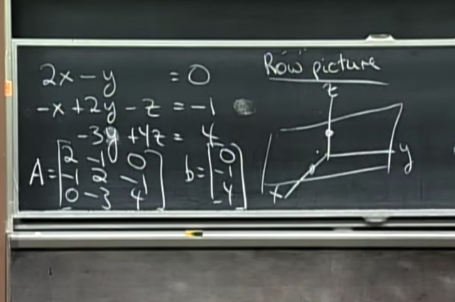</kbd>

> [!NOTE]
> gs vẽ **tập hợp các điểm giúp solve equation thứ 2**, nó
> sẽ là **1 plane**

 

<kbd>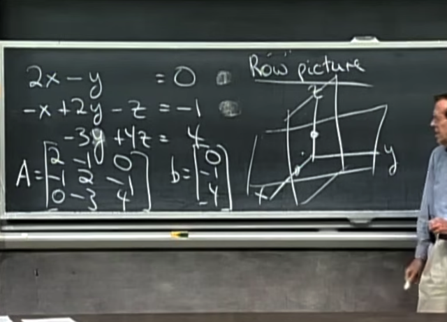</kbd>

 

<kbd>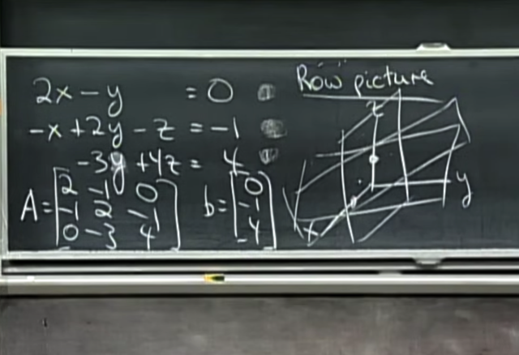</kbd>

> [!NOTE]
> và **mỗi equation là một plane**, thế thì **giao
> của 3 plane** đó là **solution của equation system**

 

<kbd>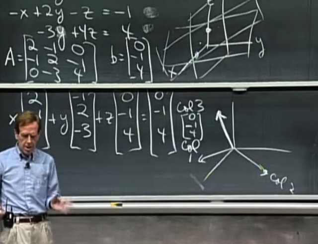</kbd>

> [!NOTE]
> Tương tự, ta sẽ giải theo "column picture", bài toán sẽ
> trở thành tìm linear combination của ba column vector để
> được vector b

 

<kbd>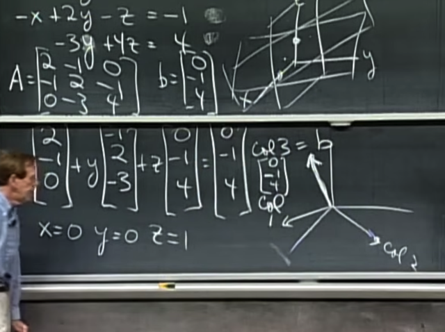</kbd>

> [!NOTE]
> (với việc cố tình chọn equation system) thì dễ thấy 
> linear combination sẽ là
>
> 0*col1 + 0*col2 + 1*col3
>
> Để rồi **vector b chính là trùng vector col3**

 

<kbd>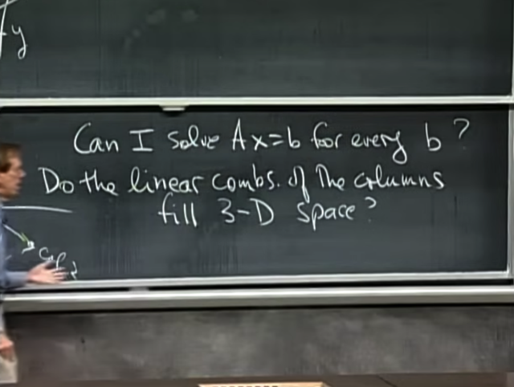</kbd>

> [!NOTE]
> câu hỏi gs đặt ra là liệu ta **có thể solve equation system
> này với MỌI vector b ko**?
>
> Hay điều này **tương tự** như hỏi rằng:
>
> **Liệu với 3 vector col1,2,3,** **ta có thể cover mọi điểm
> trong không gian 3D** ko?

 

<kbd>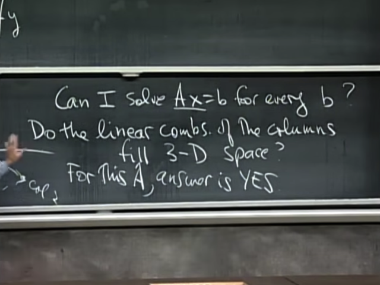</kbd>

> [!NOTE]
> Thì câu trả lời là **đối với matrix A** thì là "có".
>
> Và lí do là **bởi vì với A**, **3 col vector không cùng một
> plane**, nên luôn tìm ra được một linear combination
> giúp đi đến mọi điểm trong 3D space
>
> Trong trường hợp này ta có một **NON-SINGULAR /
> INVERTIBLE MATRIX**

 

<kbd>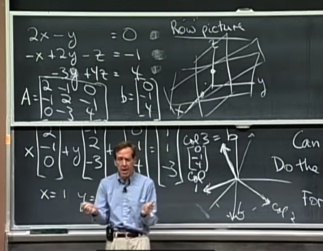</kbd>

> [!NOTE]
> Còn ở một trường hợp khác, giả sử ta có matrix A với
> **3 col vector nằm trong một plane**, mà điều này xảy
> ra **khi một col vector là combination của hai col kia**
> (vì như đã biết, **hai col kia sẽ cover một plane**, nên
> **nếu col thứ 3 nằm trong plane đó thì nó sẽ là một
> linear combination của hai col 1 và col 2**.
>
> **Khi đó 3 col vector chỉ cover được 1 plane** nên**mọi điểm b nằm ngoài plane này sẽ đều không
> reachable bằng 3 col vector** -> không thể solve
> equasys với 3 vector này được

 

<kbd>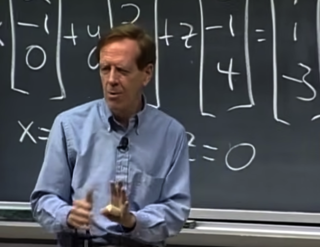</kbd>

> [!NOTE]
> và hình dung dù thật ra cũng khó mà hình dung được là ta **có
> một equation system trong 9-dimensional space**. Tức **col
> vector có 9 component (unit)**. Thế thì với câu hỏi này, ta cũng
> sẽ có thể **lập luận tương tự**
>
> Đó là, **nếu ta có 9 col vector linear independent**, thì **mọi
> chuyện ok**: ta **có thể reach tới mọi điểm trong không gian 9D
> này bằng (một linear combination của) 9 col vector.**
>
> Nhưng **nếu rủi thay mà col #9 là y như col #8 (hay là một
> linear combination của 8 col kia)** thì kiểu như ta lại **gặp một
> 8D plane** trong **một 9D space**.
>
> Và **mọi điểm b ở ngoài cái 8D plane đó đều không thể
> reachable.**
>
> Ở đây gs bắt đầu nhắc tới việc **col #9 không add thêm
> information gì vào system**.

 

<kbd>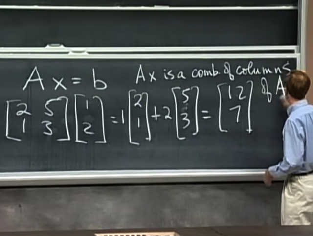</kbd>

> [!NOTE]
> Gs nói về cách**tính nhân matrix A và vector b**, thì thật ra
> có **2 cách**, và gs như nãy giờ cũng thấy **thích cách làm
> theo column**.
>
> **Với góc nhìn column** thì **Ax là một linear combination
> của các col vector của A**, mà **các coefficient quy định
> bởi x**
>
> Cách thứ 2 là**làm theo row**, và cơ bản là ta sẽ tính hai
> phép tính **dot product của x** **với hai row của A**

> [!NOTE]
> Bài sau gs sẽ dùng phương pháp
> **Elimination** để **tìm solution của equasys**

 

