# Lecture 20: Cramer's Rule, Inverse Matrix And Volume

📊 **Progress:** `29` Notes | `30` Screenshots

---
<a id="node-650"></a>

<p align="center"><kbd>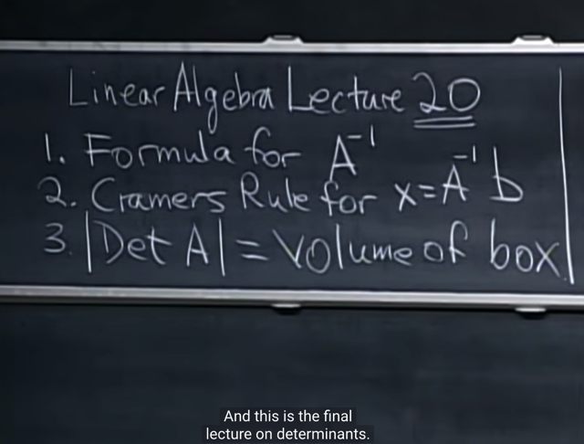</kbd></p>

> [!NOTE]
> Bài này ta sẽ tiếp tục vể determinant. Công thức của
> det của inverse matrix. Học về Crammer Rule, và  cuối
> cùng là ý nghĩa của determinant

<br>

<a id="node-651"></a>

<p align="center"><kbd>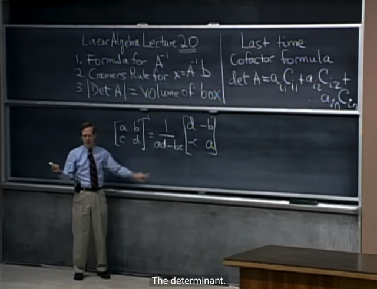</kbd></p>

> [!NOTE]
> Đầu tiên gs nói về**công thức inverse của một 2x2**matrix. Thì ta thấy **1/(ad-bc)** chính là**1/det A** từ đó
> nhận thấy sự hợp lí, vì **nếu Ainv tồn tại thì det A mới
> khác 0**Có thể hiểu gs nói khơi khơi công thức det của inverse
> matrix 2x2 là bởi học sinh có thể đã được dạy từ high
> school.
>
> Còn lí do `det(A_inv)` `=` 1 `/` det(A). Là bởi vì, ta đã chứng
> minh nếu A invertible: AAinv `=` I, thì dựa vào tính chất #9
> det(AB) `=` det(A)*det(B) nên det(AAinv) `=` det(A)*det(Ainv)
> ```text
> <=> det(A)*det(Ainv) = 1 => det(Ainv) = 1/det(A)
> ```

<br>

<a id="node-652"></a>

<p align="center"><kbd>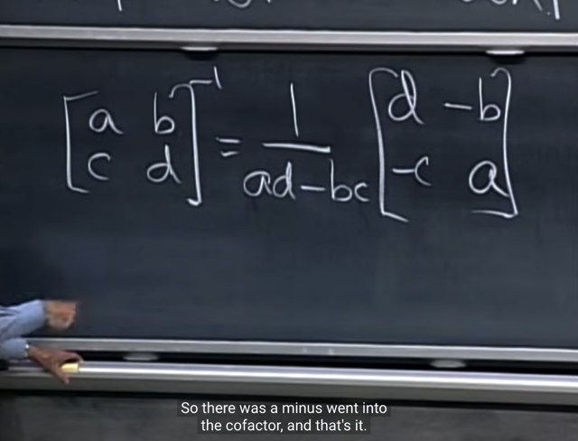</kbd></p>

> [!NOTE]
> gs chỉ ra rằng, **matrix [d, `-b;` `-c` a]** **chính là các cofactor**.
>
> Cụ thể d chính là cofactor của A11, `(-c)` chính là cofactor
> ```text
> của A21, và ta nhớ nó có dấu (-) là vì i+j = 2+1 = 3 là số
> ```
> lẻ

<br>

<a id="node-653"></a>

<p align="center"><kbd>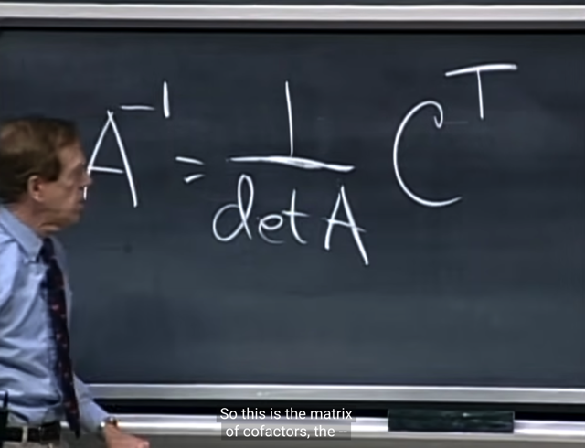</kbd></p>

> [!NOTE]
> Và ta có công thức của **A_inv `=` (1 `/` det A) C.T**
> với **C cofactor matrix**

<br>

<a id="node-654"></a>

<p align="center"><kbd>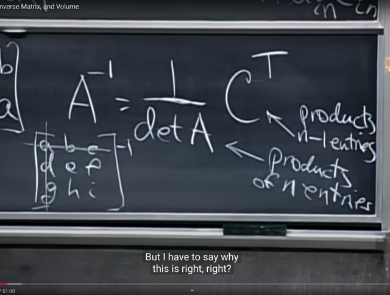</kbd></p>

> [!NOTE]
> Như đã biết ở bài trước, việc **tính det A với công thức
> tổng quát**liên quan đến việc**tính các phép nhân giữa n
> components**. Còn việc tính các cofactor thì ta nhớ cofactor
> chính là `(+/-)` det của matrix nhỏ hơn nên sẽ liên quan đến
> việc tính các phép tính **nhân giữa `(n-1)` component**

<br>

<a id="node-655"></a>

<p align="center"><kbd></kbd></p>

> [!NOTE]
> Gs nhắc lại hồi trước ta **tìm inverse matrix** bằng cách
> **ghép matrix I vào bên phải matrix A** (gọi là augmented
> matrix) và **thực hiện elimination để biến A thành I** thì
> **khi đó I sẽ trở thành E** và **nó chính là Ainv (đương
> nhien với điều kiện matrix A invertible)**Thì bây giờ ta thấy công thức của inverse **dưới dạng
> công thức** thay vì **algorithm** mô tả ở trên

<br>

<a id="node-656"></a>

<p align="center"><kbd>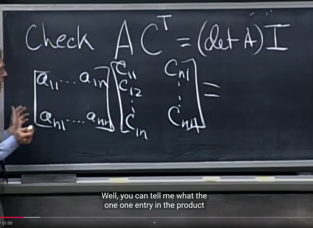</kbd></p>

> [!NOTE]
> Gs nói tuy vậy ta sẽ **cần chứng minh** lại nó, bằng cách
> **chứng minh AAinv `=` I** thế thì khi ghi ra ta có thể thấy,
> kết qủa A(CT) đương nhiên là matrix nxn. Và hãy nói về
> phần tử [1,1] của kết qủa. Nó sẽ là **dot product của hàng 1
> matrix A** [a11, ....a1n] và **cột 1 matrix CT** [c11 c12..c1n]
>
> Và nó là **các cofactor của các phần tử a11, a12...a1n**. 
>
> Thế thì theo công thức det của matrix theo cofactor formula, 
> thì nếu tính det A theo cofactor formula bằng cách sử dụng
> hàng 1, thì ta sẽ nhân từng phần tử của hàng 1 (a11, a12..)
> với các cofactor (c11, c12,...) (cofactor là gì thì biết rồi, chính
> là det của matrix nhỏ hơn khi bỏ đi cột và hàng tương ứng
> từ matrix gốc)
>
> Và khi làm vậy thì chính là lấy hàng 1 của A dot product cột 1 
> của CT. Vậy phần tử [1,1] của matrix kết quả **chính là det A**.
>
> Và **tương tự như vậy** các **phần tử khác trên đường
> chéo của matrix kết quả** cũng là dot product giữa một row
> của matrix A với vector cofactor cuả nó. Nên **cũng có giá
> trị là các det A**

<br>

<a id="node-657"></a>

<p align="center"><kbd>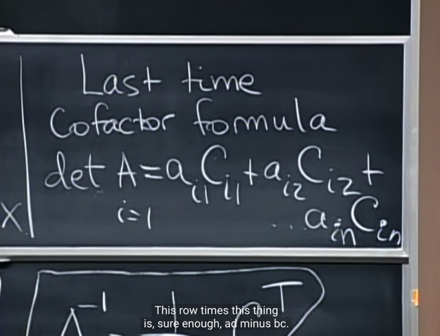</kbd></p>

> [!NOTE]
> đúng vậy, ta xem lại cofactor formula, thì
> nó chính là dot product của một row và
> vector cofactors của nó

<br>

<a id="node-658"></a>

<p align="center"><kbd>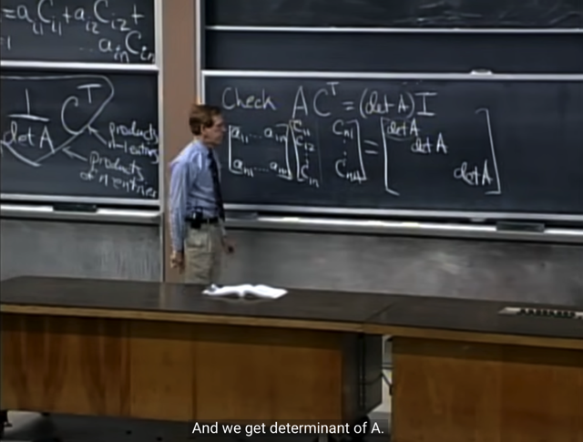</kbd></p>

> [!NOTE]
> do đó ta có **đường chéo của
> matrix kết quả đều là det A**

<br>

<a id="node-659"></a>

<p align="center"><kbd>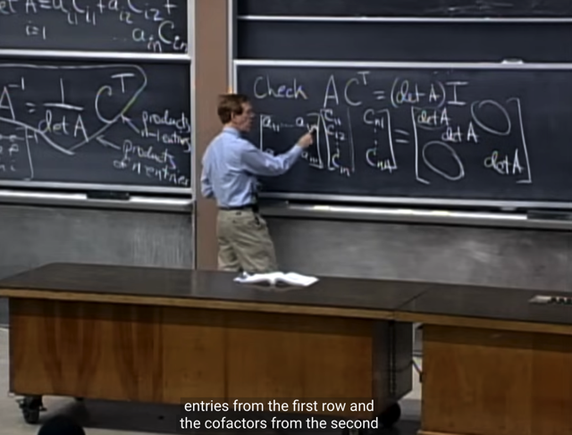</kbd></p>

> [!NOTE]
> Thế thì ta **còn phải chứng minh tại sao** khi dùng **một row
> dot product với một vector cofactor của row khác** không
> phải của row đó thì ta lại có **zero**?

<br>

<a id="node-660"></a>

<p align="center"><kbd>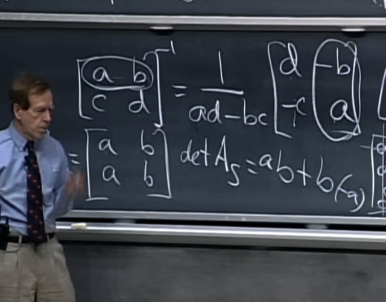</kbd></p>

> [!NOTE]
> Gs quay lại xem xét 2x2 matrix này, thì ta có thể thấy**nếu
> nhân row 1 với vector cofactor của row 2** (tức là cột 2 của
> CT) thì ta sẽ thấy mình **đang tính det (theo cofactor
> formula) của matrix mà hai row đều là [a b]**. Đương nhiên
> đó là singular matrix và do đó **det `=` 0**Mấu chốt để hiểu là: cofactor của row 1 `(=` [a, b]), là ta
> đang tính det của matrix nhỏ "**làm từ các row khác**". Thế
> thì **nếu** **cofactor của row 1 cũng "là a, b" (tức có các giá
> trị a, b, không nói đến dấu)**thì điều này đương nhiên
> c**hứng tỏ các row khác cũng có gía trị bằng với row 1. 
>
> `->` ta đang tính det của matrix có ít nhất 2 row giống nhau**

<br>

<a id="node-661"></a>

<p align="center"><kbd>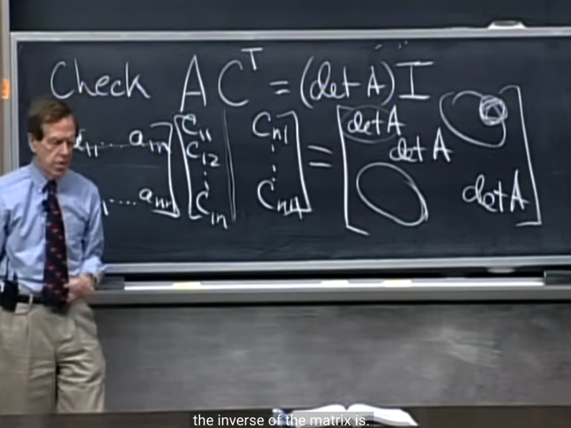</kbd></p>

> [!NOTE]
> do đó, ta hiểu rằng matrix
> kết quả sẽ là **det A * I**Và do đó A(CT) `=` (detA)I
>
> Nhân hai vế cho Ainv ta có:
>
> AinvA(CT) `=` (detA)IAinv `=` (detA)Ainv
>
> `<=>` CT `=` detA Ainv
>
> `<=>` **Ainv `=` CT `/` det A
>
> Và đây chính là công thức giúp tính Ainv**

<br>

<a id="node-662"></a>

<p align="center"><kbd>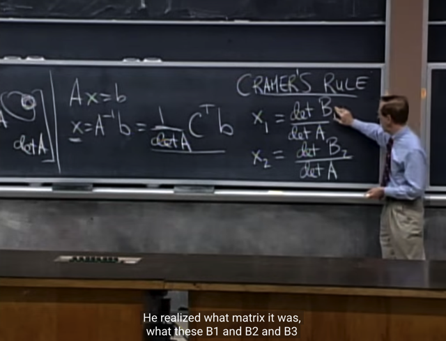</kbd></p>

> [!NOTE]
> Rồi, tiếp theo**ứng dụng thứ hai** khi ta đã có công thức
> của Ainv đó là ta **dùng nó trong solution của Ax `=` b** `<=>`
> **x `=` Ainv b `=` `(1/det` A) CTb**
>
> Thế thì gs đề nghị ta **xét hai component x1, x2 trước**.
>
> Gs cho rằng ta đang**tính một phép nhân giữa các
> cofactor (từ CT)** và **các number (từ b)** thì**ta luôn đang
> tính determinant của một matrix nào đó.**
>
> Ta gọi nó là **B1, B2**
>
> Và đó cũng là **Cramer's Rule.**

<br>

<a id="node-663"></a>

<p align="center"><kbd>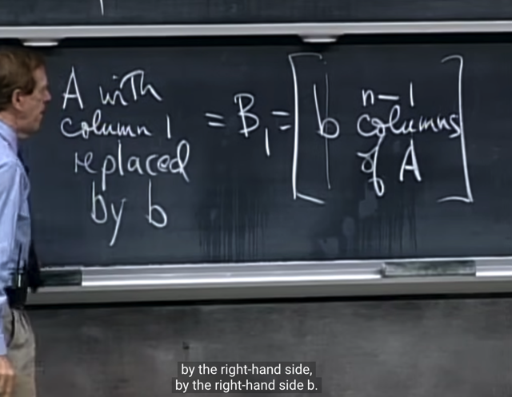</kbd></p>

> [!NOTE]
> Thế thì **matrix B1** chính là
> **matrix A thay cột 1 bởi b**

<br>

<a id="node-664"></a>

<p align="center"><kbd>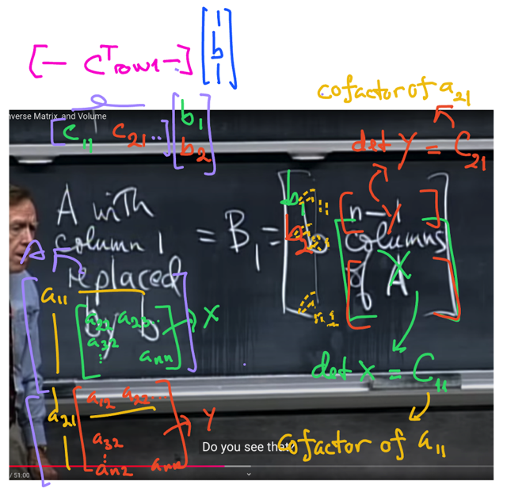</kbd></p>

> [!NOTE]
> Khi đó det B1 ta sẽ tính theo cofactor formula theo **col1** sẽ
> là **b1*det(X)** `+` **b2*[-detY]** `+` ....và det X chính là cofactor
> của a11, kí hiệu **C11**. và det Y chính là cofactor của a21,
> kí hiệu **C21**.
>
> Vậy thì det B1 là dot product của vector **b `=` [b1 b2....]** và
> **vector cofactor [C11 C21....]** thì nó **chính là row1 của C**

<br>

<a id="node-665"></a>

<p align="center"><kbd>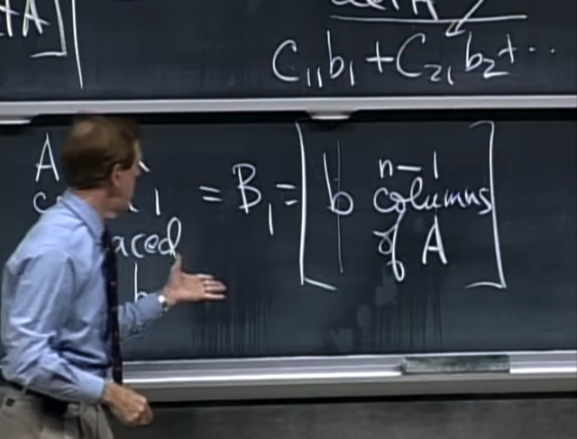</kbd></p>

<br>

<a id="node-666"></a>

<p align="center"><kbd>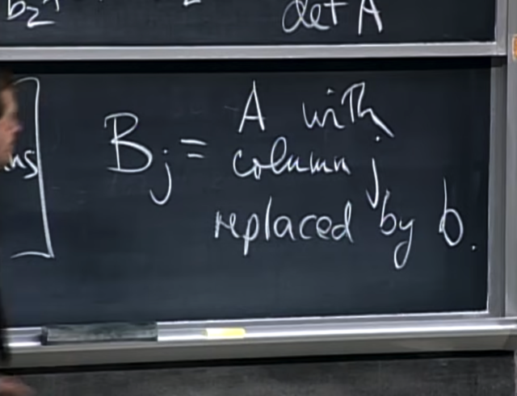</kbd></p>

> [!NOTE]
> Và khái quát **B_j** là **matrix replace cột j của A bởi b**. Và
> **det `B_j` chia cho det A chính là `x_j`
>
> (nhắc lại x là solution của Ax `=` b)**

<br>

<a id="node-667"></a>

<p align="center"><kbd>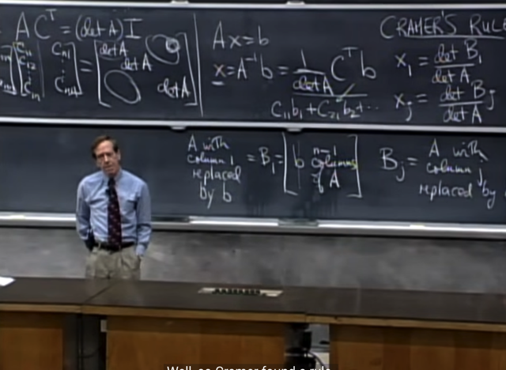</kbd></p>

> [!NOTE]
> khúc này gs nói về **tác dụng của Cramer's rule trong thực
> tế khá hạn chế**, khi nó yêu cầu ta **phải tính rất nhiều
> determinant**

<br>

<a id="node-668"></a>

<p align="center"><kbd>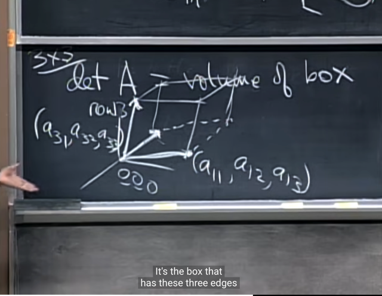</kbd></p>

> [!NOTE]
> Tiếp, gs sẽ nói về**ý nghĩa của determinant**, thực chất
> chính là **volume của một box**. Lấy ví dụ là matrix A có 3
> row sẽ tạo nên một box (**hình hộp** `-` **parallelepiped**).
> Thì **det của A chính là thể tích của cái box** này. Mỗi nắp
> của nó là một hình bình hành

<br>

<a id="node-669"></a>

<p align="center"><kbd>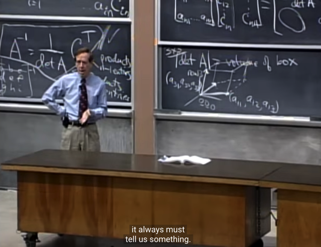</kbd></p>

> [!NOTE]
> và đương nhiên**thể tích thì không âm** nên
> đúng hơn là **trị tuyệt đối của det A**

<br>

<a id="node-670"></a>

<p align="center"><kbd>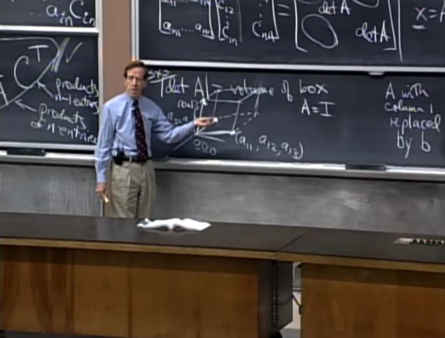</kbd></p>

> [!NOTE]
> khi **A là I** thì dễ thấy cái box nó chính là một **Cube** `-`
> hình **lập phương cạnh `=` 1**. Vì **3 row vector của A lúc
> này chính là 3 unit vector**

<br>

<a id="node-671"></a>

<p align="center"><kbd>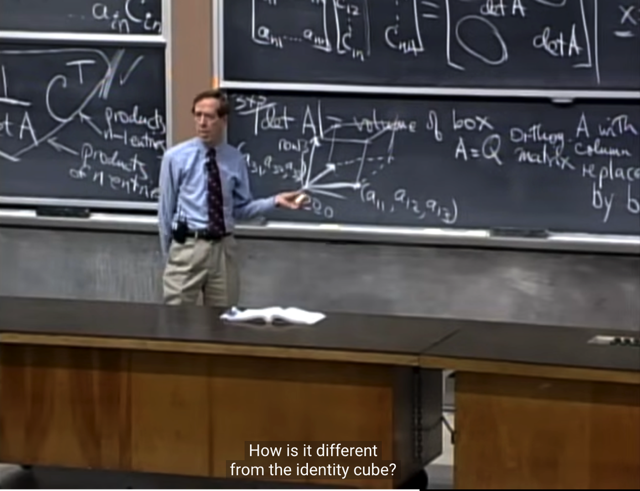</kbd></p>

> [!NOTE]
> Gs cho rằng **để chứng minh determinant thực ra là thể
> tích** thì ta **chỉ cần xét lại các properties** xem nó có
> đúng hay không thôi. Thì với **Identity det `=` 1 cho thấy
> đúng là nó chính là thể tích của hình lập phương đơn vị**
>
> Vậy thì với **orthogonal matrix Q**. Chú ý rằng, đã nói
> orthogonal matrix tức là**các columns của nó
> orthonormal** và matrix **Square**, vì nếu chỉ các cols
> của matrix orthonormal nhưng matrix không square thì
> không gọi là orthogonal matrix
>
> (mà dù sao trong đây ta đang luôn xét matrix Square rồi,
> trong phạm vi determinant, và eigenvector thì chỉ áp dụng
> với square matrix)
>
> Thế thì gs hỏi box của nó là gì: Dễ thấy nó **cũng là 1
> cube** luôn, và c**ũng có các cạnh `=` 1** (vì các row hay
> cols là các vector có unit norm) Có điều, **nó không "nằm
> ngay góc" như box của Identity matrix**, mà nó xoay một
> góc nào đó

<br>

<a id="node-672"></a>

<p align="center"><kbd>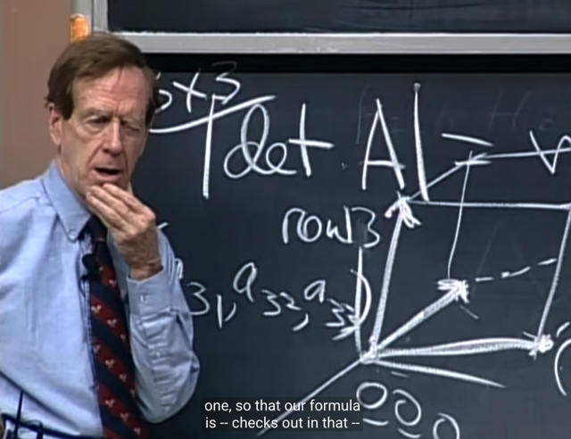</kbd></p>

> [!NOTE]
> thế thì gs hỏi: **determinant của Q bằng mấy**?, hay, nó **có
> bằng 1 không** vì rõ ràng box của Q cũng là cube có
> volume `=` 1

<br>

<a id="node-673"></a>

<p align="center"><kbd>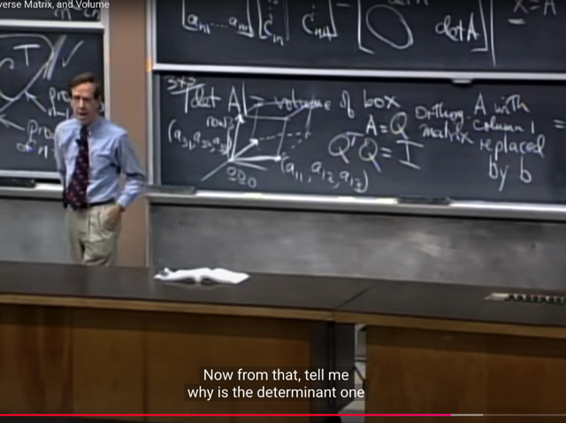</kbd></p>

> [!NOTE]
> O**rthogonal matrix sẽ có tính chất là QTQ `=` I**, gs hỏi rằng
> **tại sao det của nó bằng 1**

<br>

<a id="node-674"></a>

<p align="center"><kbd>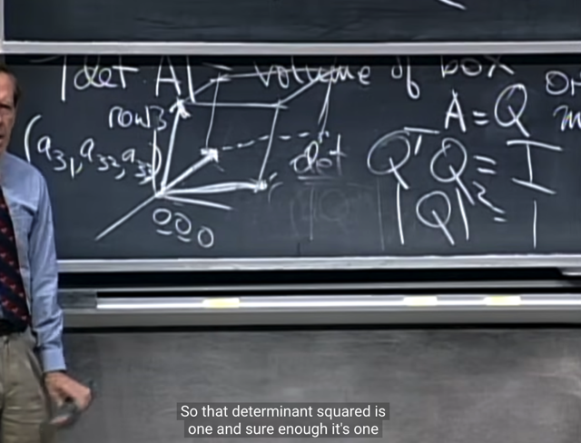</kbd></p>

> [!NOTE]
> đó là vì ta sẽ **lấy det ở hai vế:** **det QTQ `=` det I**(điều
> này có gì đâu khó hiểu, A `=` B thì det A `=` det B**)**
>
> `<=>` det QT * det Q `=` 1 (áp dụng product rule: det AB `=` det
> A * det B, để có det (QT)Q `=` det QT * det Q)
>
> `<=>` [det Q ]**2 `=` 1 (mà det A `=` det AT nên det QT `=` det Q)
>
> <=>**det Q `=` `+-` 1** `=>` thỏa mãn **volume của Q là |det Q| `=` 1
>
> Đồng thời qua đây mình cũng biết det Q `=` `+/-` 1**

<br>

<a id="node-675"></a>

<p align="center"><kbd>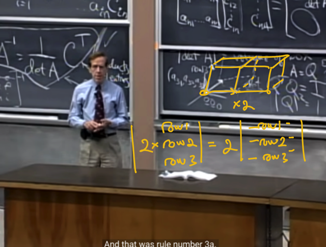</kbd></p>

> [!NOTE]
> Và khi**ta nhân 2 một cạnh**, **giữ nguyên các cạnh kia** thì
> volume sẽ nhân 2. Thế thì cái này tương ứng với property
> 3a khi ta **scale một row với alpha thì det cũng scale theo
> factor alpha**

<br>

<a id="node-676"></a>

<p align="center"><kbd>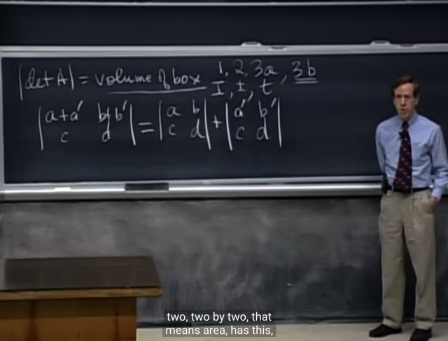</kbd></p>

> [!NOTE]
> Gs: vậy là ta đã thấy điều này thỏa mãn properties 1,2,
> 3a. Giờ ta cần 3b nữa là xong

<br>

<a id="node-677"></a>

<p align="center"><kbd>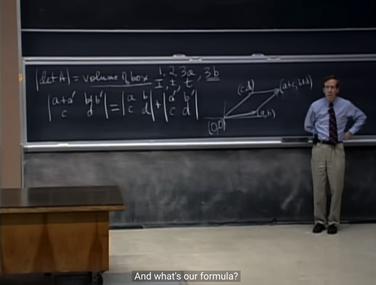</kbd></p>

> [!NOTE]
> và gs vì hết giờ nên đề
> nghị ta đọc trong sách

<br>

<a id="node-678"></a>

<p align="center"><kbd>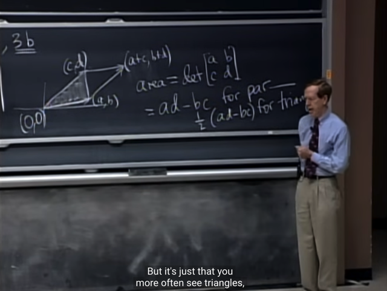</kbd></p>

> [!NOTE]
> Từ đó, với det, **ta có công cụ để tính volume, area rất
> tiện,** **bất kì khi nào ta có tọa độ của các đỉnh hình bình
> hành hoặc tam giác**, ta **có thể tính volumne hoăc area
> bằng cách tính det của matrix tương ứng.** (với tam giác
> thì tính det của hình bình hành và chia 2)
>
> Thật ra với 2D vector thì trong 18.02 có nói về det của hai
> vector, và ý nghĩa của nó là diện tích hình bình hành tạo
> bởi hai vector đó

<br>

<a id="node-679"></a>

<p align="center"><kbd>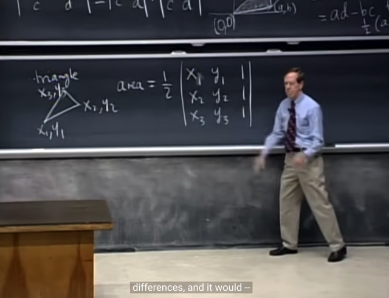</kbd></p>

> [!NOTE]
> Và **nếu đỉnh tam giác không nằm tại 0** thì ta sẽ tính det
> của matrix này. Xem sách để hiểu thêm.

<br>

