# Lecture 21: Eigenvalues And Eigenvectors

📊 **Progress:** `40` Notes | `40` Screenshots

---

<kbd>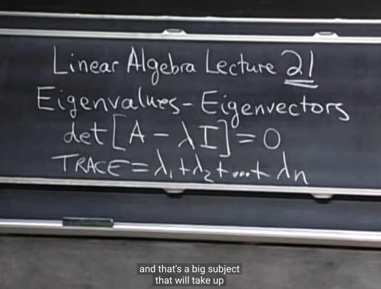</kbd>

> [!NOTE]
> Bài này mình **tiếp tục làm việc với square matrix**, và tìm
> hiểu về những **con số đặc biệt** gọi là **eigenvalue**, cũng như
> những **vector đặc biệt eigenvector.**

 

<kbd>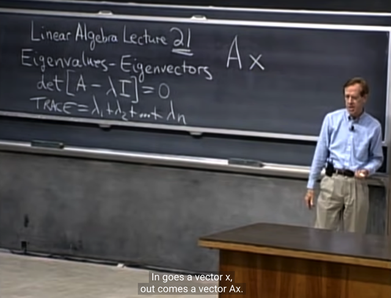</kbd>

> [!NOTE]
> đầu tiên gs cho rằng, ta có thể **coi matrix như một
> function**, để **input vào một vector x**, **output ra một
> vector Ax**

 

<kbd>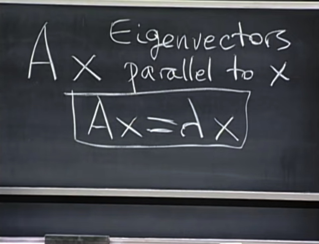</kbd>

> [!NOTE]
> Cần nhớ là ta vẫn đang làm việc với **SQUARE** matrix,
> thành ra, x thuộc Rn và Ax cũng thuộc Rn.
>
> Thế thì đại khái là **phần lớn**những trường hợp,**input**vector x và **output** vector Ax sẽ **không còn cùng
> phương nhau.**
>
> Nhưng có một số vector vẫn **giữ nguyên phương** sau khi
> nhân với A, **chỉ bị scale bởi một scalar thôi**. Đó chính là
> **EIGENVECTORS** VÀ SCALAR X CHÍNH LÀ
> **EIGENVALUE**Và nên hiểu thế này, input vector x đương nhiên là thuộc
> Rn (thì mới nhân với A shape m,n được, hay hiểu theo cách
> x là vector hệ số của linear combination của A's columns
> nên đương nhiên nó phải có n components)
>
> Còn output thì vì là kết qủa của Ax, tức linear combination
> của A's columns nên đương nhiên sẽ thuộc column space
> C(A), tức subspace của Rm.
>
> Vậy x ở vai trò input thuộc Rn và ở vai trò output thuộc Rm
> thể hiện rằng n phải bằng m.
>
> Hay nói cách khác, **EIGENVECTORS VÀ EIGENVALUES
> CHỈ ÁP DỤNG VỚI SQUARE MATRIX**

 

<kbd>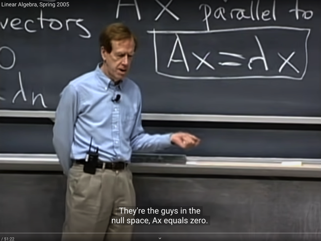</kbd>

> [!NOTE]
> Thế thì gs cho rằng ta **đã gặp** một loại **eigenvector đặc
> biệt**, mà **eigenvalue là 0**. Để rồi khi vector đó nhân với A
> cũng luôn bằng vector đó nhân với eigenvalue.
>
> Và đó **chính là các vector trong nullspace of A: N(A)**. Thật
> vậy, mọi vector (KHÁC 0) trong nullspace đều là eigenvector
> với eigenvalue = 0. Vì **mọi vector trong nullspace đều thỏa
> Ax = 0*x**
>
> Đương nhiên khi nói "tìm eigenvector của matrix", ta chỉ
> **tìm các vector độc lập**, chứ không kể scaled của nó.
>
> VÀ CHÚ Ý ZERO VECTOR KHÔNG PHẢI EIGENVECTOR
> DÙ A*ZERO_VECTOR = 0*0. VÌ VỚI EIGENVECTOR TA
> **CHỈ XÉT CÁC NON-ZERO VECTOR**

 

<kbd>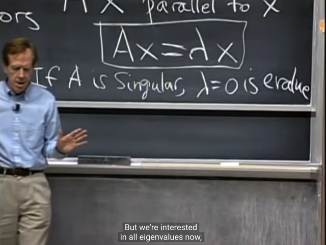</kbd>

> [!NOTE]
> Do đó, nếu A là **square** matrix **singular**, tức là
> non-invertible, đồng nghĩa là không phải cols nào cũng là
> pivot cols, đồng nghĩa là **có free cols**, hay Ax=0 **có
> special solution**, cũng tức là **basis của nullspace không
> empty**, và cũng**chính là nullspace không phải chỉ là zero
> vector mà có các vector khác 0**Thì khi đó, matrix A sẽ "biến" các vector khác không thuộc
> nullspace thành 0. Và **0 sẽ là eigenvalue**của chúng.
>
> Như vậy, những vector trong nullspace là eigenvector ứng
> với eigenvalue = 0. Điều này cũng có nghĩa là, **số vector
> trong basis của nullspace**, hay chính là **dimension của
> nullspace** sẽ chính là số eigenvector  ứng với **eigenvalue
> bằng 0**
>
> Gs có nhắc đến **singular** có nghĩa là "biến vector khác 0
> thành 0", tiếng việt của singular là "**suy biến**" / có thể hiểu
> là biến chuyển theo hướng suy giảm, và điều này liên quan
> đến việc một không gian Rm, ví dụ với m = 3. matrix 3x2,
> hoặc  3x3 mà chỉ có 2 cột độc lập, thì khi đó những vector
> trong  nullspace sẽ bị biến thành 0, để rồi không gian input
> từ 3D (row space + nullspace) bị suy biến thành 2D (column 
> space)

 

<kbd>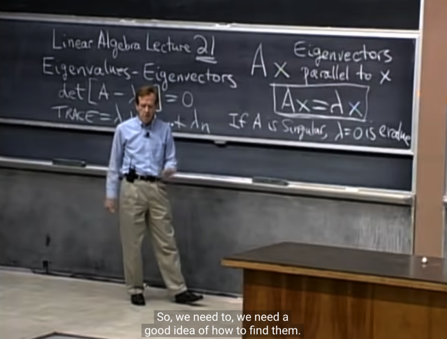</kbd>

> [!NOTE]
> Thế thì ta sẽ **đi tìm mọi eigenvector và eigenvalue**. Và gs
> cảnh báo rằng ta không còn làm việc với Ax=b nữa, mà
> Ax=λ*x thì **cả λ và x đều là variable**. Do đó ta
> **không còn dùng elimination** được nữa

 

<kbd>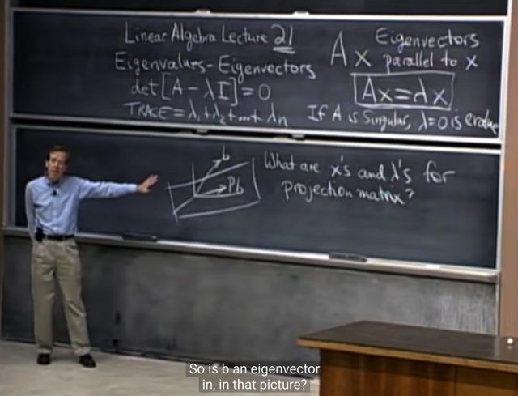</kbd>

> [!NOTE]
> gs đề nghị ta sẽ thử làm việc với **Projection matrix** và
> **tìm eigenvector và eigenvalue của nó.**
>
> Nhớ rằng từ bài trước ta đã biết Projection matrix **cũng là
> square matrix**. Và nó làm nhiệm vụ là từ vector b, tạo ra,
> tính ra vector **projection của b trên column space của
> matrix**.
>
> Vậy gs hỏi là **b có phải là eigenvector của P không**?
>
> Me: Mình nghĩ rằng nếu **muốn b thông qua P vẫn giữ
> nguyên hướng**, hay nói cách khác **Pb và b cùng
> phương** thì chỉ có thể có một khả năng là**b đã nằm trong
> cols space sẵn rồi**, khi đó cơ bản P sẽ project b trở thành
> chính nó. Khi đó ta có Pb = b, thì như vậy lúc đó b mới là
> eigenvector với eigenvalue = 1
>
> Còn nếu gs  hỏi là theo cái hình hiện tại thì có phải b là
> eigenvecctor của P không? thì câu trả lời là không, vì **Pb
> khác hướng với b**

 

<kbd>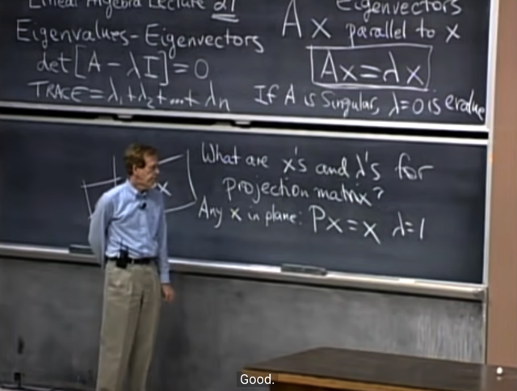</kbd>

> [!NOTE]
> Gs: correct, và có thế thấy **các vector x nằm trong plane** sẽ
> chính là **eigenvector** của P với **eigenvalue = 1 vì chúng sẽ
> đều bị giữ nguyên bởi P**(P là matrix project xuống plane)
> nên Px=x

 

<kbd>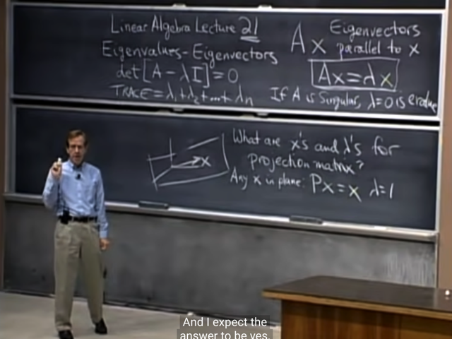</kbd>

> [!NOTE]
> Gs: và như vậy ta có **cả một plane** chứa **mọi vector đều
> là eigenvector**.
>
> Gs hỏi tiếp còn eigenvector nào nữa không?

 

<kbd>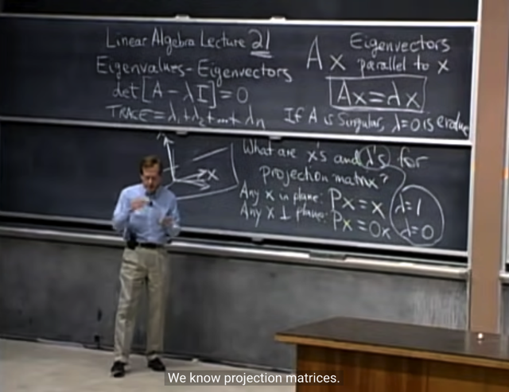</kbd>

> [!NOTE]
> Và đó chính là **mọi vector** **VUÔNG GÓC với plane**. và ta
> đã biết đó **chính là NULLSPACE** (của cái matrix mà col
> space là cái plane). Là bởi **mọi vector vuông góc với
> plane** sẽ đều dc project **thành 0.**
>
> Px = 0.x nên mọi vector trong nullspace sẽ đều là
> **eigenvector** với **eigenvalue = 0**

 

<kbd>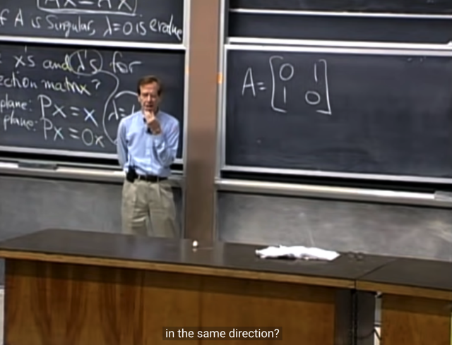</kbd>

> [!NOTE]
> gs cho biết ta sẽ sớm có **một system để tìm**ra
> eigenvector và eigenvalue, còn bây giờ ta tiếp tục với **một
> số ví dụ đặc biệt** trước. Đó là **permutation matrix**: gs đề
> nghị chỉ ra một / một số eigenvector?
>
> Me: Thế thì matrix này giúp permute **hoán vị** (hoán đổi vị
> trí) của matrix hay vector. Vậy **Ax sẽ có tác dụng hoán đổi
> vị trí của x**, hay Ax có vị trí được hoán đổi so với x.
>
> Vậy thì **dễ thấy mọi vector có hai component giống nhau**
> sẽ không thay đổi. Và với 2D vector thì đây là những
> **vector nằm trong đường thẳng y = x**

 

<kbd>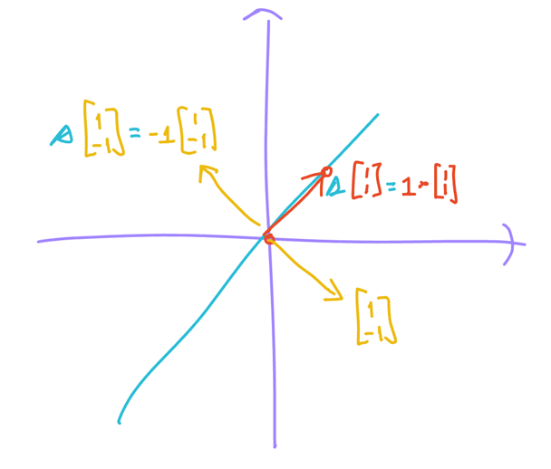</kbd>

<kbd></kbd>

<kbd>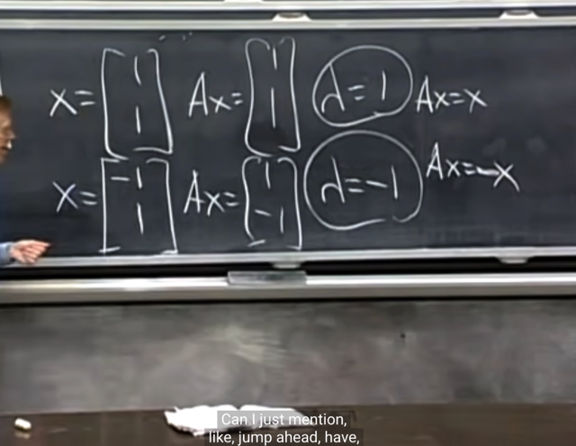</kbd>

> [!NOTE]
> Gs: Đúng vậy, ta có thể thấy hai eigenvectors với
> **eigenvalue = 1 và -1**.
>
> Hình dung cái permutation matrix này chính là phép
> **reflect qua đường thẳng y = x.**

 

<kbd>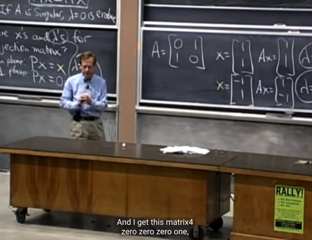</kbd>

> [!NOTE]
> Đại khái là gs nói rằng **có một sự thật** đó là: **matrix (n, n)
> sẽ có n eigenvalues**Và **tổng** các giá trị của **eigenvalues** cũng **chính là
> tổng giá trị trên đường chéo** và nó chính là **TRACE** của
> matrix mà gs sẽ nói đến sau.

 

<kbd>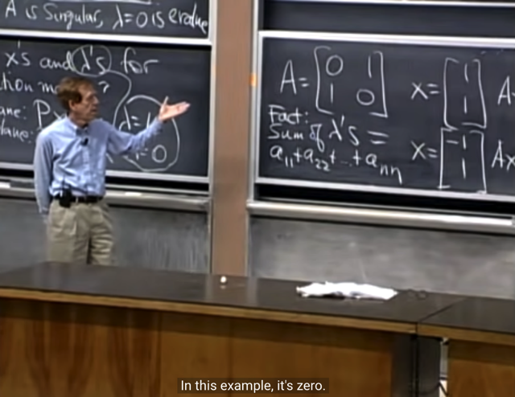</kbd>

> [!NOTE]
> Do đó trong trường hợp này, vì ta đã biết **trace** = 0+0 =
> 0, nên **khi biết một eigenvalue** = 1, ta **có thể biết giá trị
> của cái kia** là -1

 

<kbd>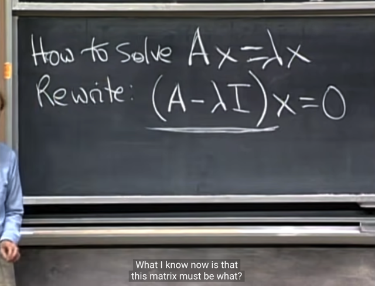</kbd>

> [!NOTE]
> ta sẽ bắt đầu tìm **quy trình để tìm egenvalue** và
> **eigenvector**. Thế thì ta có thể chuyển **λ*x qua bên
> trái** và để x ra ngoài, để trở thành **(A - λ*I)x = 0**
>
> λ phải nhân với I vì nó là scalar, **nhân với I để thành
> matrix**.
>
> Thế gs chú ý rằng **ta không quan tâm tới eigenvalue = 0**
> (mà hồi nãy đã nói, nó là eigenvalue của các eigenvector
> nằm trong nullspace của A)
>
> Mà **chủ yếu là đang tìm eigenvalue khác 0**.
>
> Thế thì do eigenvector khác zero của A nếu có sẽ là vector
> x khiến (A-lambda*I)x=0, điều này cho thấy nó chính là
> vector khác 0, trong nullspace của (A-lambda*I).
>
> Và như vậy, đồng nghĩa với việc tồn tại non-zero vector
> trong nullspace. Dẫn đến để điều này xảy ra ta sẽ **cần
> matrix (A - λ*I) có tính chất singular**, hay các cols của
> chúng không linear independence **bởi vì như vậy thì
> (A-lambda*I)x = 0 mới có solution khác 0**.
>
> Chứ nếu nó full-rank, hay invertible thì đương nhiên như
> đã biết nullspace chỉ có duy nhất một zero vector, thì có
> nghĩa là không có non zero vector nào mà khiến (A-ld*I)x =
> 0

 

<kbd>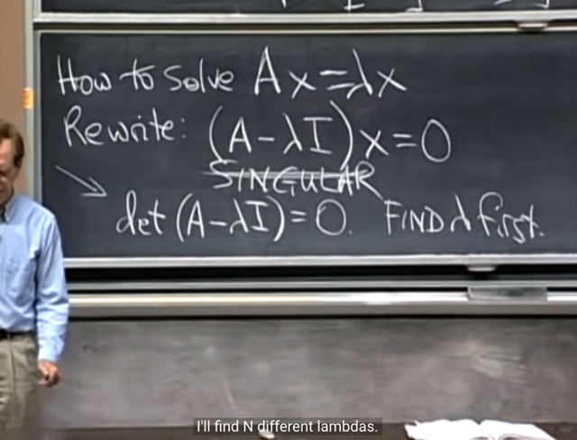</kbd>

> [!NOTE]
> Và **SINGULAR** matrix thì ta đã biết nó sẽ có **determinant 
> = 0**
>
> Từ đó ta **có một equation không còn x**, giúp **giải ra tìm
> eigenvalue**,. Đây gọi là **CHARACTERISTIC EQUATION
> (phương trình đặc trưng)**

 

<kbd>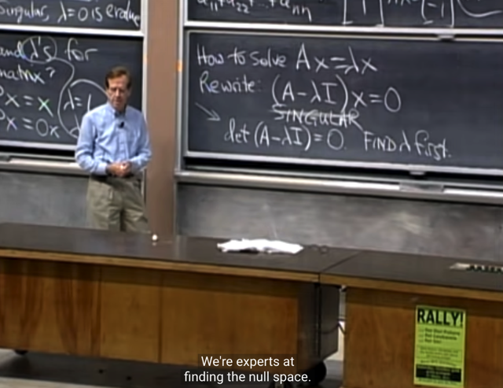</kbd>

> [!NOTE]
> Và khi đã solve ra eigenvalue, ta sẽ **thay vào (A-λ*I)x=0**
> và**tìm nullspace của nó**(tức là tìm các special solution,
> và cũng chính là tạo nên một bộ basis).
>
> Mà cái này thì ta đã biết cách làm, đó là **dùng elimination**
> để **xác định các pivot cols** của (A-lambda*I), từ đó có**free  cols**.
>
> Các **free cols sẽ ứng với free variable**. Để rồi ta sẽ chọn
> **free var = 1, các free vars còn lại = 0**, thay vào tìm pivot
> var. Thế là có một **special solutio**n, chính là **một vector
> trong basis** của nullspace.
>
> Và khi tìm ra basis của nullspace thì basis đó chính là một
> bộ  independent eigenvector với eigenvalue tương ứng tìm
> ra dc ở trên

 

<kbd>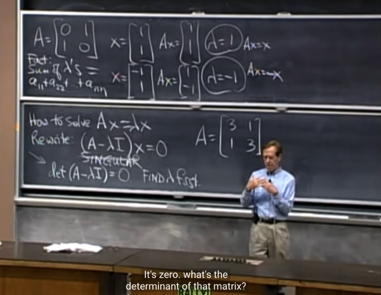</kbd>

> [!NOTE]
> Gs lấy ví dụ này, ta sẽ **đi tìm eigenvalue** của nó. Thế thì,
> ông cho rằng, **matrix ta càng cho đặc biệt** thì **kết qủa của
> nó càng đặc biệt**. Ví dụ như ví dụ trên, matrix A có tính đối
> xứng, và ta thấy **hai eigenvector** của nó **VUÔNG GÓC
> VỚI NHAU**(ta sẽ bàn về symmetric matrix ở các bài sau)

 

<kbd>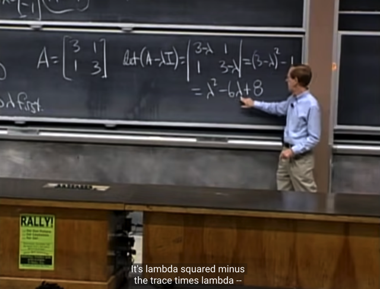</kbd>

> [!NOTE]
> Thế thì đầu tiên ta sẽ solve equation det (A-λ.I) = 0
> để tìm eigenvalues
>
> Thế thì gs chỉ ra rằng, **6** chính là **TRACE** của matrix
> (3+3) và **8** CHÍNH LÀ **DET** CỦA MATRIX

 

<kbd>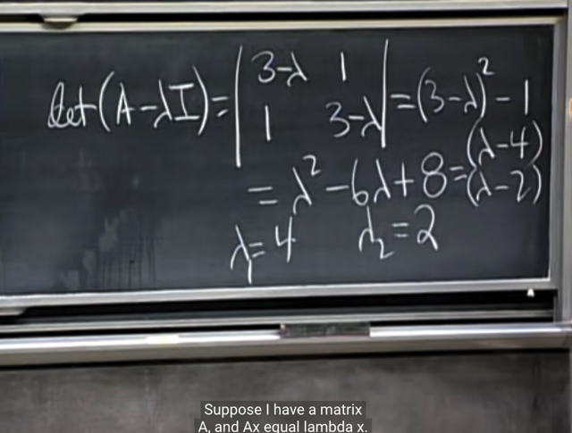</kbd>

> [!NOTE]
> Rồi, ta có thể **factorize** nó thành **tích** của: 
>
> **(λ - 4)*(λ - 2)** để equation (λ - 4)*(λ - 2) = 0  có 2 giá trị λ

 

<kbd>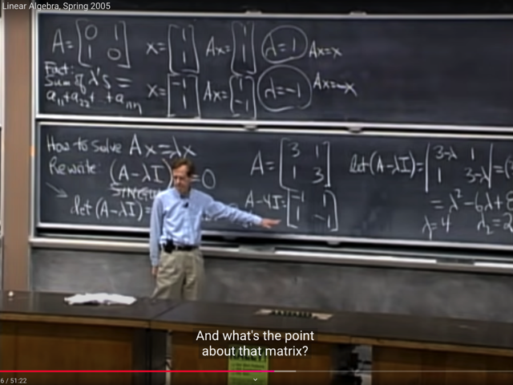</kbd>

> [!NOTE]
> Và từ đó, lần lượt ta sẽ **tìm nullspace** của matrix
> (**A** -**4*I)**,  ta sẽ có **eigenvectors** ứng với
> **eigenvalue = 4**
>
> Và tìm **nullspace của matrix (A - 2*I)**, ta sẽ có
> **eigenvectors** ứng với **eigenvalue = 2**
>
> Gs: Vậy  có thể thấy A - 4*I là matrix như thế
> nào?

 

<kbd>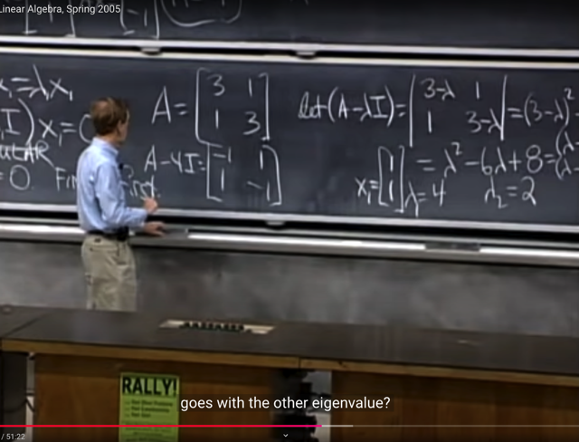</kbd>

> [!NOTE]
> Trả lời: Đó là nó **singular**, có nghĩa ta sẽ hiểu rằng gs
> nhấn mạnh rằng **A có thể không singular**, nhưng **A -
> 4*I** phải  singular để rồi **nullspace của nó khác zero**, và
> sẽ chứa các eigenvectors tương ứng với eigenvalue = 4
>
> Và có thể **dễ thấy một vector** trong nullspace là**[1 1]** vì
> **components** của nó giúp **combine hai columns thành zero**.
>
> Và ta cũng có thể **kết luận luôn**, đó **chính là basis** của
> nullspace. (vì matrix có **2 cols**, **một cols là pivot cols**, **một**
> cols là **free cols**, ứng với **một vector trong basis**, hay,
> dimension của nullspace = 1 nên **basis của N(A) chỉ có 1
> vector** nên khi đã xác định được (1 1) là một vector trong
> nullspace thì chốt luôn nó chính là basis)
>
> Vậy x1 = [1, 1].T là một eigenvector ứng với eigenvalue = 4.
> Đương nhiên mọi scaled version của x1, hay mọi vector trên
> line đi qua x1 đều là eigenvector ứng với eigenvalue = 4

 

<kbd>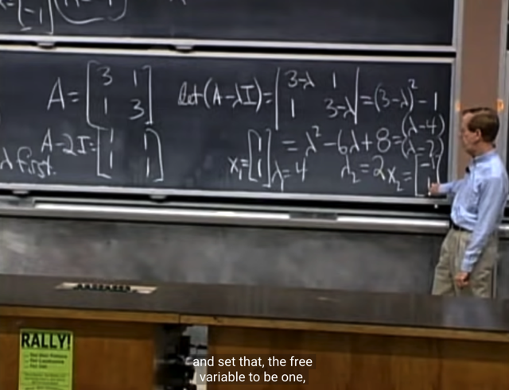</kbd>

> [!NOTE]
> Còn với λ = 2, ta có A - 2*I là vầy. Và đương nhiên nó
> **cũng** **singular**, và ta có thể **nhìn ra một vector của
> nullspace là [-1, 1]** (đương nhiên cũng là một basis vì
> dim của nullspace cũng bằng 1)
>
> Nhưng gs cho rằng ta có thể hiểu là nếu không nhìn thấy
> ngay vector nullspace thì chỉ việc làm theo phương pháp
> chuẩn để tìm nullspace bắt đầu bằng việc elimination, để
> tìm ra pivot + free cols, từ đó chọn 1 cho free var và tính
> ra pivot var -> từ đó có special solution cũng là 1 vector
> trong basis của nullspace

 

<kbd>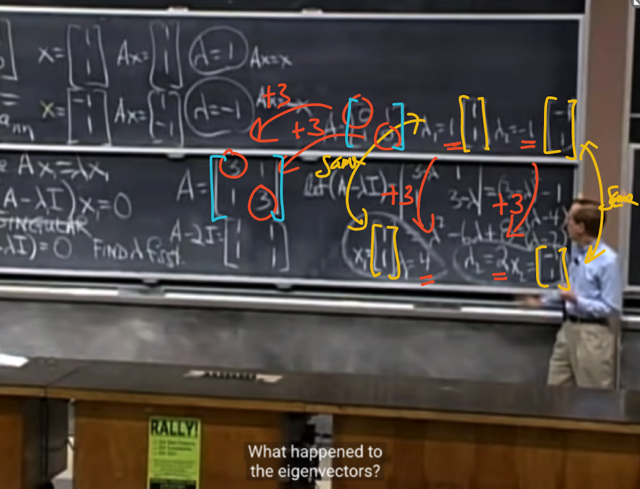</kbd>

> [!NOTE]
> Thế thì gs đề nghị ta nhận xét thế này: matrix [0 1; 1 0]
> so với A [3 1; 1 3]**chỉ là cộng thêm 3*I**
>
> Và ta thấy hai **eigen-values của nó cũng tăng lên 3**. Còn
> **eigenvector thì giữ nguyên**

 

<kbd>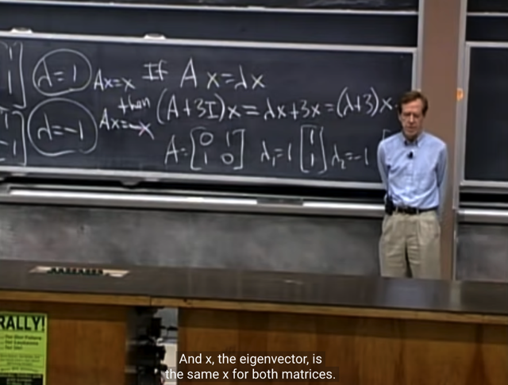</kbd>

> [!NOTE]
> Và nhận xét trên sẽ có thể **giải thích rất dễ dàng** như
> sau, nếu **x là eigenvector của A** với **eigenvalue** là **λ** thì:
>
> A**x** = λ***x**
>
> thì khi đó (A + 3*I)x = Ax + 3Ix = λ*x + 3x = (λ + 3)x
>
> Như vậy, **(A + 3I)x = (λ + 3)x** nên**x CŨNG là eigenvector
> của (A + 3*I)** và **eigenvalue sẽ là  λ + 3**

 

<kbd></kbd>

> [!NOTE]
> Gs đề nghị ta suy nghĩ thử: Giả sửa cho**λ là
> eigenvalue của A và B** là có **eigenvalues** là **α** thì
> **eigenvalue của A + B là gì.**
>
> Hay gs hỏi giả sử tôi lập luận thế này, vì **Ax = λ*x** và
> **Bx = α*x** nên cộng hai vế của hai equation lại ta có
> **(A+B)x = (λ+α)x** từ đó suy ra eigenvalue của A+B là
> λ+α được không? **Lập luận này sai chỗ nào**.
>
> Me: Có thể thấy nó**sai ở chỗ x không giống nhau**.
> Tức là x trong Ax = λ*x - là eigenvector của A ứng với
> eigenvalue λ. Còn Bx = α*x sẽ là eigenvector của B có
> eigenvalue là α. Vậy thì **x không phải là một để mà
> cộng hai vế** rồi đặt A+B trong ngoặc như vậy

 

<kbd>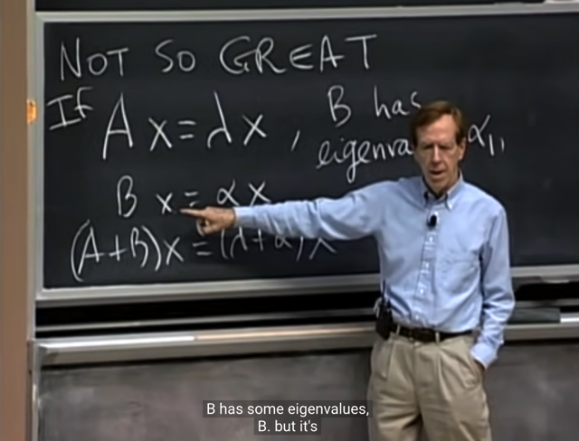</kbd>

> [!NOTE]
> Gs: Chính xác, ta **không có lí do nào để cho rằng
> x - eigenvector của A sẽ cũng là của B**

 

<kbd>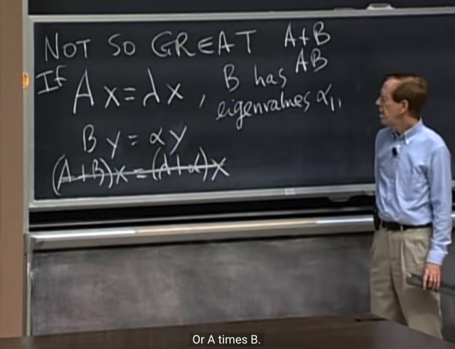</kbd>

> [!NOTE]
> Nên phải ghi là**By = α*y** và cộng hai vế của hai
> equation lại **chẳng giúp ta rút ra được gì**. Do đó việc
> **biết eigenvalue của A, B không giúp tính eigenvalue
> của A+B hay A*B**
>
> Do đó **chỉ khi B là α*I thì khi đó A+B = A+α*I** thì như
> hồi nãy ta sẽ **biết matrix này có eigenvalue là
> eigenvalue của A cộng thêm alpha.**

 

<kbd>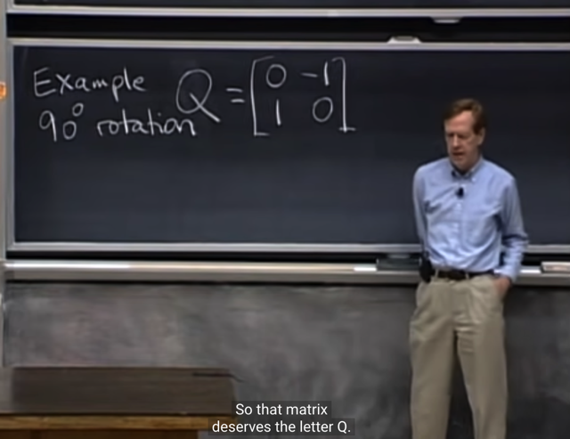</kbd>

> [!NOTE]
> Tiếp, gs làm việc với **Rotation** matrix, là một **orthogonal**
> matrix (**square** matrix có **orthonormal** cols)
>
> Và matrix này sẽ**xoay vector x thành 90 độ**: Qx
>
> Hình dung vector x = [1 0].T thì Qx sẽ là [0 1], đúng là
> nó xoay 90 độ. 
>
> ví dụ x = [1 1] (góc 45 độ) thì Qx sẽ là [-1, 1],
> đúng là xoay 90 độ. 
>
> và cũng có thể **chứng minh là cho x = [x1 x2]** thì 
>
> Qx =  x1[0 1]T+x2*[-1 0]T **= [-x2 x1]T**
>
> Tính**dot product của (Qx)Tx** = -x2x1 + x1x2 = 0
> -> **Qx vuông góc với x**

 

<kbd>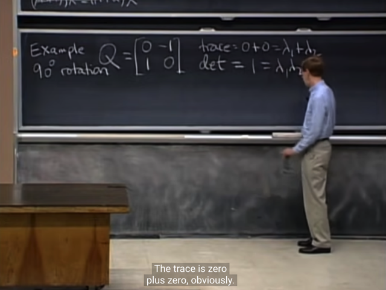</kbd>

> [!NOTE]
> Gs cho **biết thêm một sự thật** nữa bên cạnh **tổng
> eigenvalue chính là trace** thì ta còn có **tích của chúng
> chính là determinant**. Và hồi nãy ta đã thấy ví dụ có
> lambda là 2,4, det matrix là 8

 

<kbd>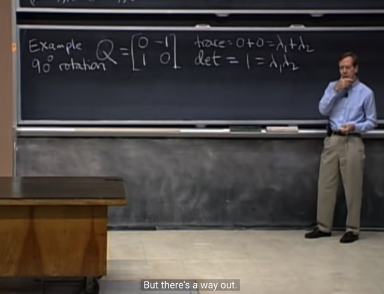</kbd>

> [!NOTE]
> gs mào đầu bằng việc nói rằng ta đang**gặp rắc rối với Q**.
> Bởi lẽ **Q là matrix "giúp" rotate một vector góc 90 độ.**
> Thế thì điều này có vẻ sẽ khiến **khó mà có eigenvector**
> nào bởi theo định nghĩa, **eigenvector giữ nguyên hướng
> khi nhân với Q**.
>
> Hơn nữa nhìn vào **trace** = 0, cho**thấy eigenvalue phải 
> một âm một dương**. Thế mà **tích của chúng lại bằng 
> det và = 1 (0*0-(-1)*1))**

 

<kbd>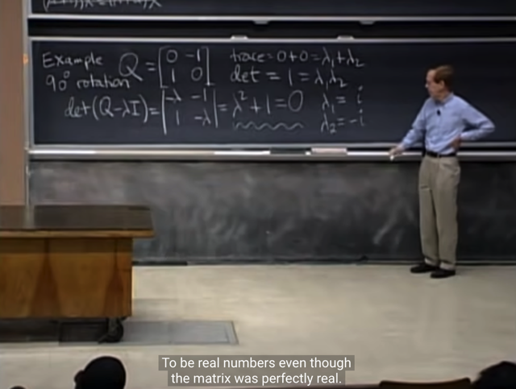</kbd>

> [!NOTE]
> Thế thì, ta cứ đi **tìm eigenvector** theo **quy trình đã
> biết** đó là giải **characteristic equation:** **det(Q-λ*I) =
> 0** và ta có **λ**2 + 1 = 0**. Và equation này có 2 nghiệm
> **PHỨC** (**COMPLEX**  NUMBER)
>
> Và gs cho biết **matrix Q** dù là có **giá trị thực** nhưng
> **eigenvalue** của nó có **giá trị phức**. Vẫn thõa mãn: λ1
> + λ2 = 0 và λ1*λ2 = 1

 

<kbd>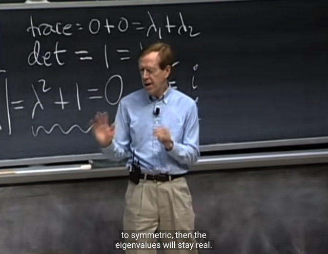</kbd>

> [!NOTE]
> đại khái gs nói rằng đây là ví dụ để nói về hai "thái cực"
> khi thái cực thứ nhất là **SYMMETRIC** matrix, thì ta sẽ
> có **CÁC EIGENVALUES ĐỀU LÀ SỐ THỰC.**

> [!NOTE]
> SYMMETRIC matrix, thì ta sẽ có các  EIGENVALUES
> ĐỀU LÀ SỐ THỰC
>
> (Qua bài về symmetric matrix ta sẽ chứng minh)

 

<kbd>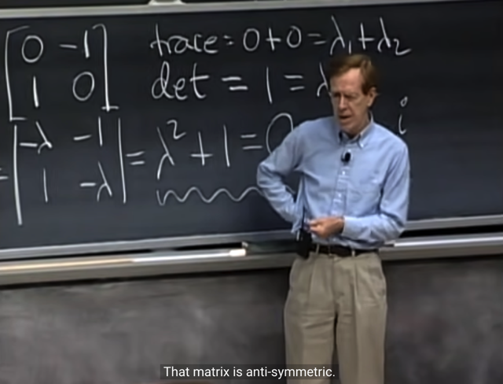</kbd>

> [!NOTE]
> Và ở thái cực còn lại khi ta có ở đây gọi là
> **ANTI-SYMMETRIC MATRIX** thì ta sẽ có  **MỌI
> EIGENVALUE ĐỀU SỐ PHỨC**

> [!NOTE]
> ANTI-SYMMETRIC MATRIX thì ta sẽ có các
> EIGENVALUE ĐỀU SỐ PHỨC

 

<kbd>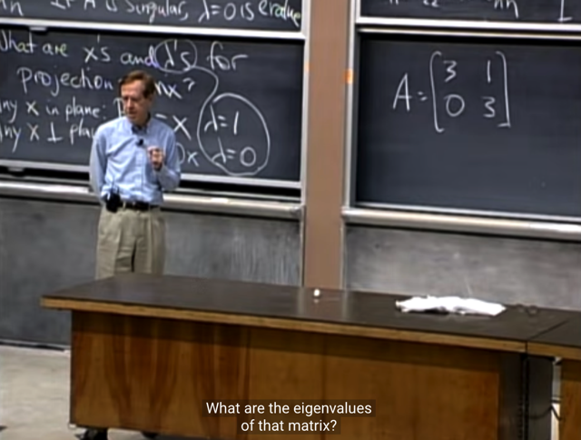</kbd>

> [!NOTE]
> Gs dùng ví dụ này để nói về eigenvector / eigenvalue của
> **TRIANGULAR** MATRIX.
>
> Và ông cho biết, với matrix **TRIANGULAR**, eigenvalue
> **CHÍNH LÀ NẰM TRÊN ĐƯỜNG CHÉO, tức là, chúng cũng
> chính là các Pivot**

 

<kbd>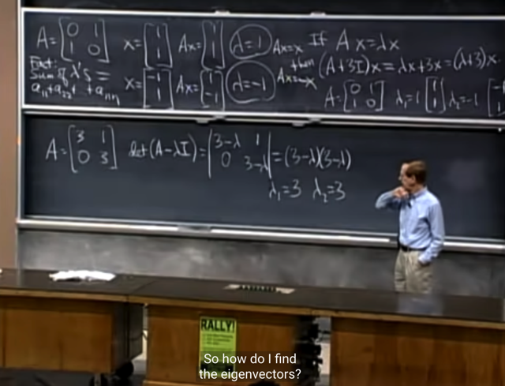</kbd>

> [!NOTE]
> Có thể chứng minh điều này điều này. Thiết lập
> characteristic equation **det(A-λ*I) = 0**
>
> Ta đã biết với **TRIANGULAR** MATRIX THÌ DET NÓ
> LÀ **TÍCH CÁC PIVOT - CÁC COMPONENT TRÊN
> DIAGONAL**.
>
> Nên giải equation **det(A-λ*I)** = 0 trở thành phương
> trình **tích của các ("component trên đường chéo" - λ)
> = 0 từ đó giải ra lambda đúng là các giá trị trên đường
> chéo của A**

 

<kbd>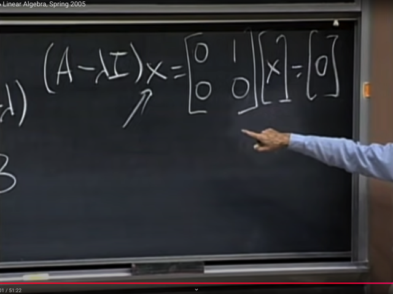</kbd>

> [!NOTE]
> Thế thì với **eigenvalue** thì **KHÔNG CÓ VẤN ĐỀ GÌ**, nhìn
> **đường** **chéo** là biết ngay (ý là đang nói các triangular
> matrix)
>
> Nhưng**vấn đề là** khi có **lambda**, **giải tìm ra eigenvector**.
>
> Thế lambda vào A - lambda*I ta có matrix này, gs hỏi
> matrix này có đặc điểm gì?
>
> -> cols 1 là free col. col 2 là pivot. nên x1 là free var, x2 là
> pivot var. Chọn x1 = 1, thế vào: 0*0 + x2*1 = 0 => x2 = 0
> và special solution là [1 0].T cũng là basis của nullspace

 

<kbd>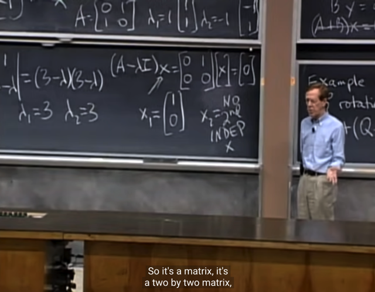</kbd>

> [!NOTE]
> gs đúng vậy, **eigenvector thứ nhất là x1 = [1 0]** và nó ứng
> với **eigenvalue thứ nhất = 3**. Và đương nhiên mọi vector
> trên line của [1 0] đều là eigenvector ứng với eigenvalue
> thứ nhất này,
>
> Thế thì với eigenvalue thứ 2, **cũng là 3**, và do vậy
> eigenvector thứ hai **x2** **cũng là (1, 0).**
>
> Thì do đó, với các trường hợp mà ta có **CÁC EIGENVALUE
> LẶP LẠI**(**REPEAT EIGENVALUE)**
>
> (mà ở đây gs dùng một ví dụ với triangular matrix vì với
> dạng matrix này ta sẽ dễ thấy eigenvalue ví nó chính là giá
> trị trên đường chéo, nhưng không phải là chỉ có triangular
> matrix mới bị vậy)
>
> THÌ **TUY CÓ 2 EIGENVALUE**  NHƯNG **KHÔNG CÓ
> HAI EIGENVECTOR ĐỘC LẬP.**Và đây sẽ là tiền đề để
> nói về bài sau

 

