# Lecture 22: Diagonalization And Powers Of A

📊 **Progress:** `43` Notes | `42` Screenshots

---

<kbd></kbd>

 

<kbd>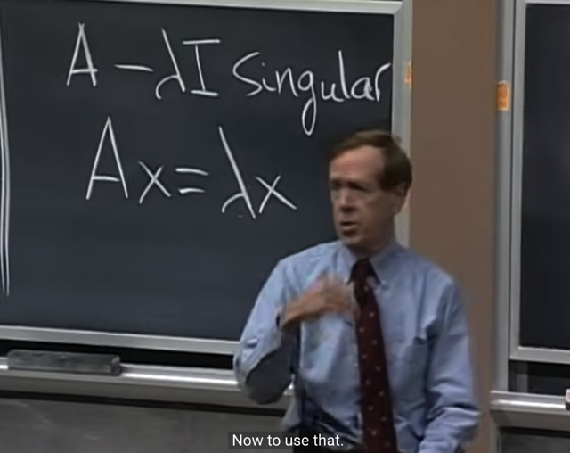</kbd>

> [!NOTE]
> Gs cho rằng ta đã biết về **eigenvector** và **eigenvalue** và
> **cách tìm** chúng. Thì nay ta sẽ bàn về **ứng dụng** của
> chúng.

 

<kbd>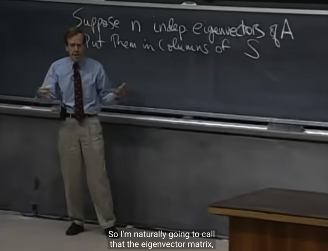</kbd>

> [!NOTE]
> gs **GIẢ SỬ RẰNG** ta **ĐÃ CÓ** **n INDEPENDENT
> EIGENVECTORS** của matrix A. Và ta đặt chúng làm
> **colums của matrix S**Thì phần tiếp theo gs muốn cho ta thấy chuyện gì xảy
> ra khi ta **nhân S với A**

 

<kbd>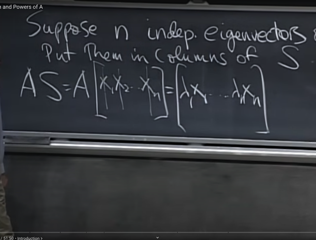</kbd>

> [!NOTE]
> Vậy thì như đã biết khi ta **nhân matrix A với matrix S**, ta sẽ
> **THEO** **GÓC NHÌN COLUMNS** để thấy nó có kết quả là:
>
> [cols 1 của AS] sẽ là **A.[cols1 của S]** = **Ax1** (và như đã biết
> sẽ là **linear combination** các **cols của A** với **coefficient** là các
> **component** của **[col 1 của S],** nhưng ta không bàn tới ở đây)
>
> và [col 2 của AS] sẽ là **A.[col 2 của S]** = **Ax2**
>
> Và như đã biết vì **x1, x2 ...xn là eigenvector** của A nên: 
>
> Ax1 = λ1x1 
>
> Ax2 = λ2x2......

 

<kbd>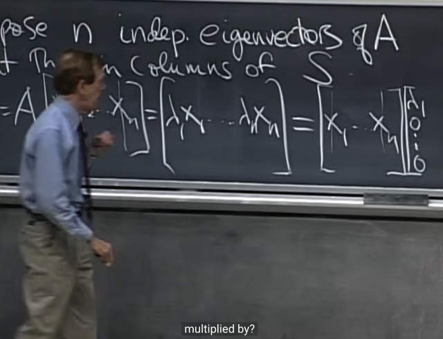</kbd>

> [!NOTE]
> Tiếp, ta sẽ **TÁCH EIGENVALUE RA**. Thì với cols đầu tiên
> =λ1*x1, ta sẽ thấy nó là kết quả của matrix **S nhân với
> vector (λ1, 0, 0...0)**
>
> Bởi vì cũng như mới nói, [matrix] x [vector] thì sẽ là linear
> combination của các columns của [matrix] với coefficient là
> các component của [vector].
>
> Nên S.[λ1, 0,...0] sẽ bằng:
>
> [col1 of S]***λ1** + [col 2 of S]*0 + ....[col n of S]*0
>
> = [col1 of S]*λ1 = x1λ1 = λ1x1

 

<kbd>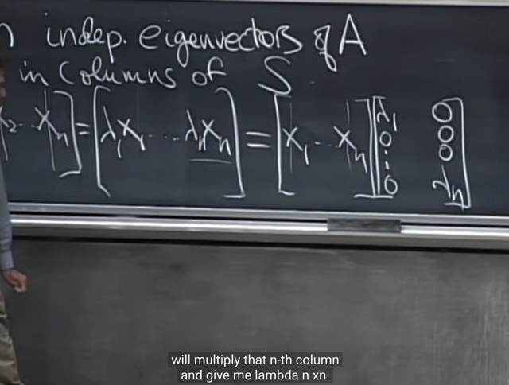</kbd>

> [!NOTE]
> Tương tự, cols thứ hai (=λ2*x2) sẽ là **matrix S nhân với
> vector (0, λ2, 0...0)**. Và ta sẽ đặt vector này **làm cols thứ
> hai của matrix**.
>
> Tương tự vậy, kết quả là ta có thể diễn đạt **AS là S nhân
> với matrix như này (là matrix mà các cột lần lượt là
> (λ1, 0, 0...0), (0, λ2, 0...0), .....(0, 0, 0...λn)**

 

<kbd>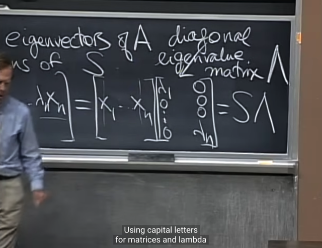</kbd>

> [!NOTE]
> Dễ thấy matrix đó là một **diagonal matrix** mà diagonal
> components là các **eigenvalues,** kí hiệu là Λ (LAMBDA)

 

<kbd></kbd>

🔗 **Related:** [LECTURE 25: SYMMETRIC MATRICES AND POSITIVE DEFINITENESS](untitled.md#node-915)

> [!NOTE]
> Và như vậy ta có**AS = SΛ**.
>
> Tiếp gs **nhấn mạnh** rằng ta **đã giả định / cho rằn**g A có
> **N** **INDEPENDENT EIGENVECTORS**. Mục đích là để
> matrix **S** (là cái mà có các columns các eigenvector của A)
> sẽ **INVERTIBLE**
>
> (Đương nhiên bữa giờ là luôn đang làm việc với **square**
> matrix nxn và ở đây S có **N** cols - các eigenvector có **N**
> component -> là square matrix **NxN** mà **các columns
> independent** nên full-rank / **invertible**)

> [!NOTE]
> Và cần phải chú ý rằng việc matrix A square và có **N
> INDEPENDENT EIGENVECTORS KHÔNG KHIẾN A
> FULL-RANK**. Vì sao, vì nó **chỉ dẫn tới là eigenvectors
> span toàn bộ Rn** (cũng là Rm, m=n, lúc này là 1 vì đang
> nói matrix square, và column space, nullspace row space,
> left null-space đều là subspace của Rn)
>
> Điều **DỄ HIỂU SAI** là EIGENVECTORS **CHỈ THUỘC
> COLUMN SPACE**  của A khi ta thấy **Ax = lambda*x**, để
> rồi LẦM TƯỞNG m tưởng rằng **nếu ta có n independent
> eigenvectors thì nó sẽ là basis của column space**, từ đó
> cho rằng column space là Rn. Điều này LÀ SAI, bởi vì, **X
> CÒN CÓ THỂ THUỘC NULLSPACE**  nếu eigenvalue = 0, vì
> khi đó x - một vector x khác 0 thỏa Ax = 0 thì **x thuộc
> nullspace chứ không phải column space.**

 

<kbd>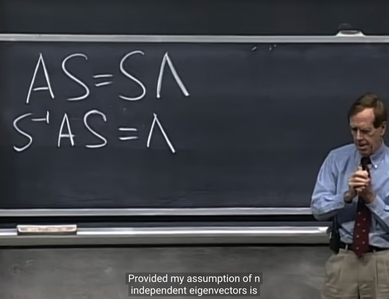</kbd>

> [!NOTE]
> và vì vậy **Sinv** tồn tại nên ta có thể nhân Sinv
> vào hai vế để có **SinvAS = SinvSΛ = Λ**

 

<kbd></kbd>

> [!NOTE]
> Gs nhắc lại rằng bữa trước có nói**matrix (n, n) sẽ có n
> eigenvalue - eigenvector**, và gs cho biết trong thực tế
> **CHỈ CÓ MỘT SỐT ÍT MATRIX LÀ KHÔNG THỂ CÓ N
> EIGENVECTOR INDEPENDENT MÀ THÔI** (Mà ví dụ là
> một matrix có r**epeat eigenvalue** như cuối bài trước đã
> thấy)

 

<kbd></kbd>

🔗 **Related:** [LECTURE 17: ORTHOGONAL MATRICES AND GRAM-SCHMIDT](untitled.md#node-565)

> [!NOTE]
> thế thì SinvAS = Λ gọi là **DIAGONALIZATION**.
>
> Nhưng ta cũng có thể **nhân Sinv vào bên phải** của AS =
> SΛ để có **A = SΛS_inv, cái này gọi là
> EIGEN-DECOMPOSITION**
>
> Và đây là một loại **FACTORIZATION** nữa bên cạnh A = LU,
> (**ELIMINATION** - quá trình biến A thành dạng row echelon
> form - matrix U) hay A = QR (**ORTHOGONALIZATION** - quá
> trình từ A, tạo ra bộ orthogonal basis - matrix Q)

 

<kbd></kbd>

> [!NOTE]
> Gs đề nghị ta **xét eigenvalue và eigenvector** của **A^2.**
>
> Thế thì ta cho rằng x và lambda là eigenvector và
> eigenvalue của matrix A. nên ta có **Ax = lambda.x**
>
> Và ta **nhân hai vế cho A** thì ta có **A^2x = A.lambda.x** 
> = **lambda.Ax** (lambda là **scalar** nên **chuyển nó lên trước** 
> được 
>
> Khi đó thay Ax = lambda.x ta sẽ có **lambda.Ax = lambda^2.x**
> từ đó ta có: **A^2x = lambda^2.x**
>
> Điều này nói lên rằng **matrix A^2** sẽ **cũng có eigenvector**
> là x (tức là eigenvector của A^2 cũng là của A) nhưng 
> eigenvalue t**ương ứng của nó thì bằng bình phương**eigen
> value của A

 

<kbd>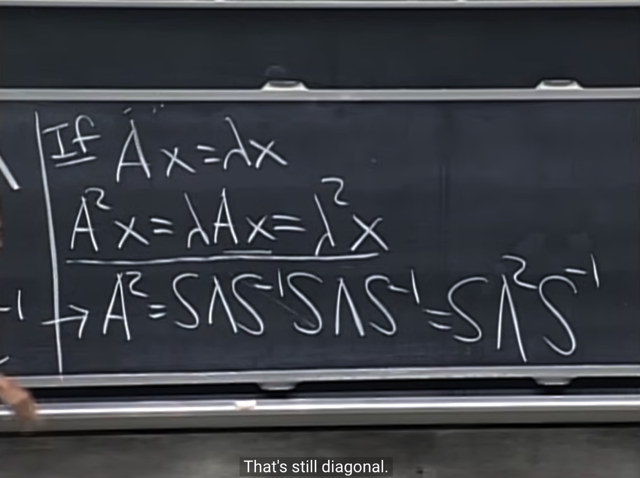</kbd>

> [!NOTE]
> Và nếu ta dùng **factorization** formula thì ta có
>
> A^2 = S.Λ.Sinv.S.Λ.Sinv
>
> Và Sinv.S = I từ đó A^2 = S.Λ.Λ.Sinv
>
> = **S.Λ^2.Sinv**
>
> Như vậy qua việc phân tách A^2 = S.Λ^2.Sinv có thể thấy
>
> 1) **EIGENVECTOR của A^2** **CÙNG LÀ EIGENVECTOR**
> **CỦA A** (VÌ S LÀ EIGENVECTOR CỦA A, nên A = S.Λ.
> Sinv)
>
> 2) **EIGENVALUE CỦA A^2 THÌ LÀ BÌNH PHƯƠNG CỦA
> EIGENVALUE CỦA A**

 

<kbd></kbd>

> [!NOTE]
> Và tương tự ta hòan toàn dễ hiểu rằng**A^k = S.Λ^K.Sinv** ,
> và cho ta biết **eigenvector của A mũ bao nhiêu thì nó vẫn là
> eigenvector của A**. Và eigenvalue của A^k thì bằng
> **lũy thừa k của A's eigenvalue**.
>
> Và gs cho rằng phép eigen-factorization này cho ta một
> **công cụ tuyệt vời** khi deal với **LŨY THỪA CỦA MATRIX**.
> mà hai phép factorization trước A =LU, và A = QR không làm
> được.

 

<kbd>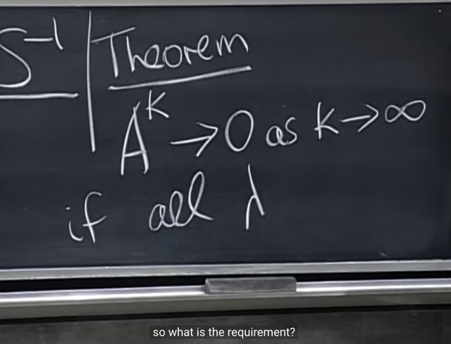</kbd>

> [!NOTE]
> tiếp gs đặt vấn đề là, **có thể nào** để, khi **lũy thừa càng
> lớn** thì **matrix A ngày càng nhỏ dần về 0?**

 

<kbd>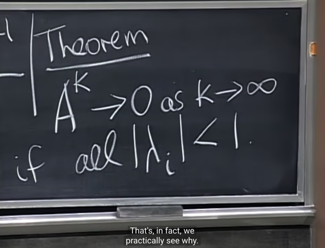</kbd>

> [!NOTE]
> thế thì điều này sẽ **xảy ra nếu trị tuyệt đối của
> mọi eigenvalue đều nhỏ hơn 1**

 

<kbd></kbd>

> [!NOTE]
> Gs nhấn mạnh rằng để cho phép EIGEN-DECOMPOSITION
> factorize **A thành S.LAMDA.Sinv** thì**phải thỏa mãn điều
> kiện** là **A có N INDEPENDENT EIGENVECTORS.**
>
> Cụ thể hơn là chỉ khi **n eigenvector**, tức các cols của S
> **independent** thì S mới **full-rank** và invertible **giúp S_inv tồn
> tại**thì mới có phép factorization này được

 

<kbd>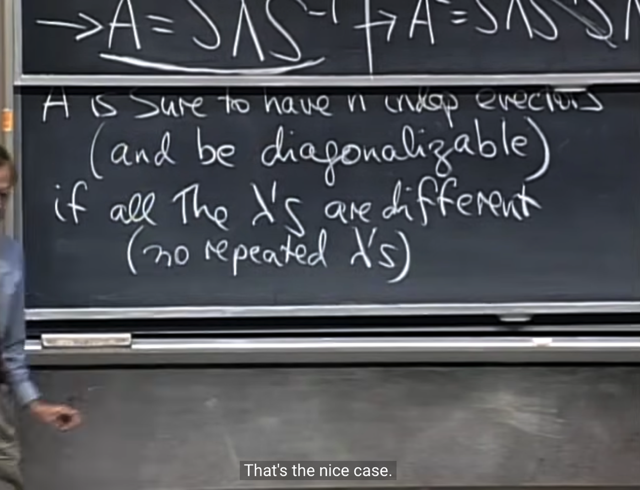</kbd>

> [!NOTE]
> dẫn đến gs nói về ý quan trọng đó là điều kiện để matrix A
> có N INDEPENDENT EIGENVECTORS: Đó là, nếu nó**CÓ N EIGENVALUES KHÁC NHAU**.
>
> Và ý này đã được mào đầu bởi ví dụ về **triangular matrix**
> có **hai eigenvector giống nhau** ở bài trước - thì ta **thấy hai
> eigenvector của nó cùng phương**, dependent.

 

<kbd></kbd>

> [!NOTE]
> và gs lấy ví dụ nếu trong **mathlab** ta gọi function
> **eig(rand(10, 10))** thì nó sẽ cho ra matrix **10x10** các con
> số ngẫu nhiên, và **n eigenvector của nó sẽ khác nhau**. Khi
> đó ta sẽ có bộ **10 eigenvector INDEPENDENT**

 

<kbd>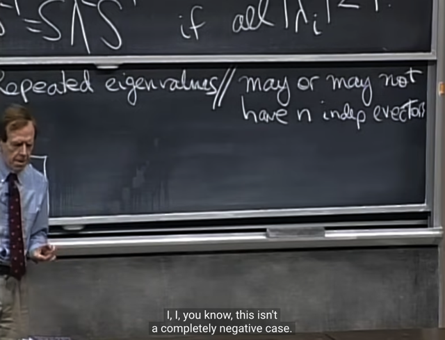</kbd>

> [!NOTE]
> Một ý quan trọng nữa là tuy nói nếu có mọi eigenvalue
> khác nhau thì  chắc chắn có n eigenvalue độc lập
>
> Nhưng **KHÔNG PHẢI CỨ CÓ REPEAT EIGENVALUES
> THÌ SẼ KHÔNG CÓ INDEPENDENT EIGENVECTORS**
>
> Mà ta p**hải check lại, vì vẫn có thể có eigenvalue giống
> nhau nhưng vẫn có (đủ bộ) eigenvector độc lập**

 

<kbd>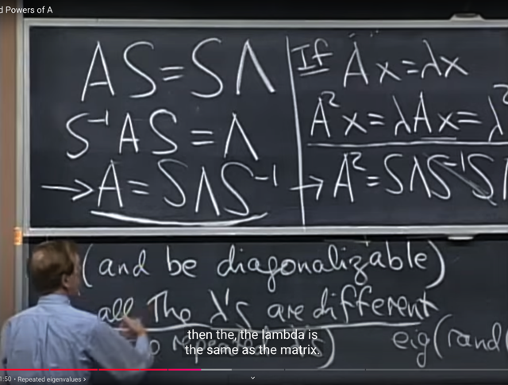</kbd>

> [!NOTE]
> Gs lấy ví dụ **Identity** matrix, nxn, nó là một **triangular**
> matrix, và như đã biết các **eigenvalue** **của triangular
> matrix nằm sẵn trên đường chéo**. Vậy thì I có **n
> eigenvalue giống nhau** đều bằng 1. Nhưng gs nói rằng nó
> **VẪN CÓ ĐỦ N INDEPENDENT EIGENVECTORS**, VÀ
> THẬT RA **MỌI VECTOR ĐỀU LÀ EIGENVECTORS**
>
> Dễ hiểu vì bất kể vector nào trong Rm=Rn (vì đây là I, số
> hàng bằng số cột, rowspace chính là columns space,
> nullspace và left nullspace chỉ có {0}) đều thỏa Ix = 1x - tức
> là đều là eigenvectors với eigenvalues = 1, nên ta **có vô số
> eigenvectors**, và mình**sẽ hiểu rằng** **DỄ DÀNG 
> CHỌN MỘT BỘ N EIGENVECTORS ĐỘC LẬP**
>
> Và trong trường hợp của I, A = I thì phép factorization sẽ là
> Sinv. A.S = Sinv. I.S = Sinv.S = I = **LAMBDA**.
>
> Tức là, với I, thì **NÓ CŨNG CHÍNH LÀ LAMBDA LUÔN**,vì
> ta cũng biết**với triangular matrix thì eigenvalue nó đã nằm
> sẵn trên đường chéo rồi**, nên nếu các vị trí khác đường
> chéo mà bằng 0 như đối với Identity matrix nói riêng hay
> diagonal matrix nói chung thì **bản thân nó chính là
> LAMBDA LUÔN.**

 

<kbd>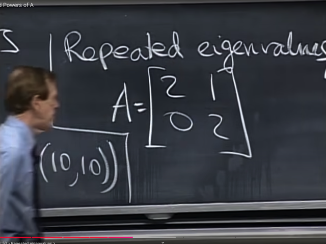</kbd>

> [!NOTE]
> Tiếp theo, gs làm lại ví dụ này,
> xét một**triangular matrix**

 

<kbd>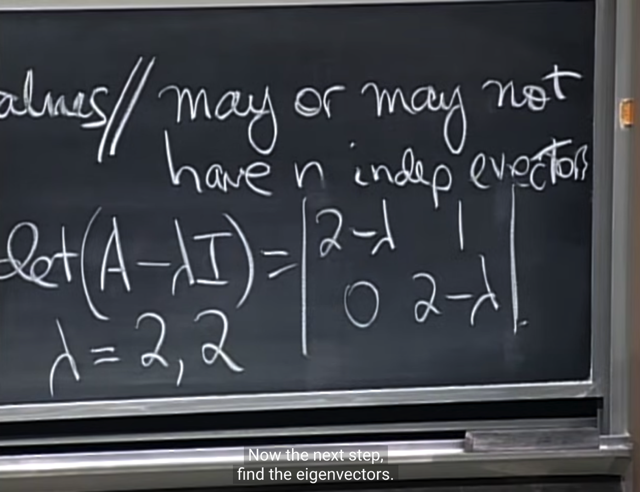</kbd>

> [!NOTE]
> Giải ra **hai giá trị lambda đều bằng 2**(tuy **bằng nhau**
> nhưng **vẫn là 2 eigenvalues)**. mà gs nói là con đường
> đại số, **algebraic** route, **dẫn ta tới 2 eigenvalue**(Có thể không cần giải, vì ta đã nói **với triangular matrix**
> thì **eigenvalue nằm sẵn trên đường chéo** rồi)

 

<kbd>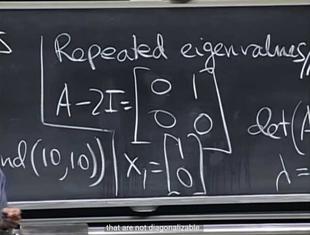</kbd>

> [!NOTE]
> Sau đó t**hế vào** để có matrix**A - 2*I** và **tìm
> nullspace** của nó (ý là vector trong nullspace, hay basis
> của nullspace của matrix (A - 2*I) để rồi chúng cũng
> chính là eigenvector của A) thì ta thấy nullspace của (A -
> 2*I) **chỉ có dimension = 1** (chỉ có 1 free cols = chỉ có 1
> vector trong basis).
>
> **Gs nói con đường hình học** lại dẫn ta tới **chỉ 1 vector,
> hay 2 eigenvector này DEPENDENT
>
> Tóm lại, nghĩa là ta có hai eigenvalue trùng nhau, thì
> tuy có hai eigenvector nhưng thật ra chỉ là một**

 

<kbd>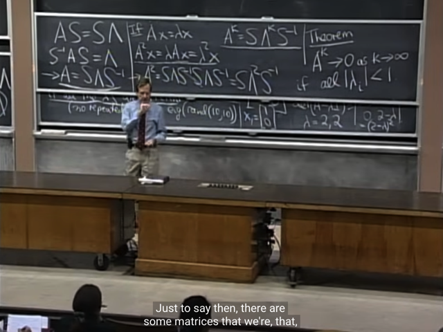</kbd>

> [!NOTE]
> Nên gs nhấn mạnh là, diagonalization hay cái vụ A^k -> 0
> khi k -> infi nếu mọi lambda đều nhỏ hơn 1, **CHỈ ĐÚNG NẾU
> MARIX A CÓ N INDEPENDENT EIGENVECTORS.**
>
> Và khi điều này không thõa mãn thì gs cho rằng ta sẽ gặp
> rắc rối. Tuy nhiên gs nói **trong thực tế thì phần lớn sẽ thỏa**

 

<kbd>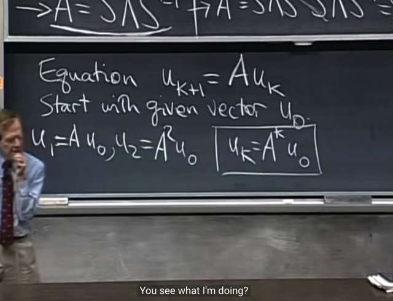</kbd>

🔗 **Related:** [LECTURE 24: MARKOW MATRICES; FOURIER SERIES](untitled.md#node-849)

> [!NOTE]
> Tiếp, gs **cho một equation** như thế này. Bắt đầu từ một
> vector **u_0**, và theo công thức **u_k+1 = Au_k**.
>
> Đại khái là gs cho biết bài sau ta sẽ bàn về **system of
> DIFFERENTIAL equation** (hệ phương trình vi phân)
>
> Còn ở đây ông gọi là system of **DIFFERENCE equation**(hệ phương trình sai phân)

 

<kbd>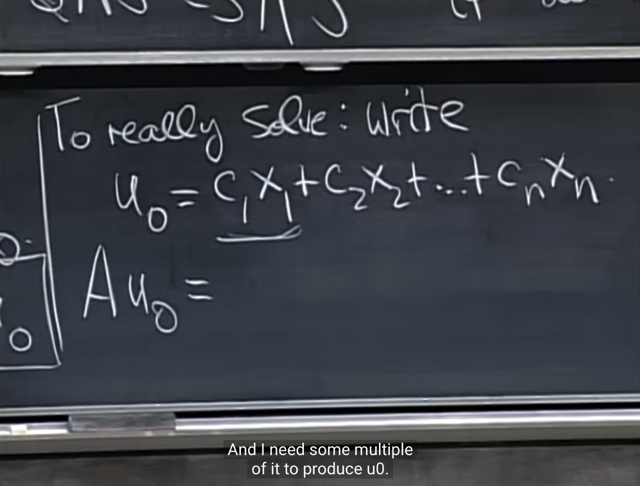</kbd>

> [!NOTE]
> thế thì cho **u_0 là linear combination các eigenvectors**của
> A, \~u ở đây đều nằm trong cols space của A\~. Và phải chú ý
> rằng \~eigenvectors đương nhiên thuộc column space của A,
> vì Ax = lambda.x, x  là linear combination của  các columns.\~
>
> \~Và một set n **eigenvectors độc lập nhau thì đương nhiên
> đương nhiên là\~ \~một basis của column space**\~, \~chẳng qua là
> basis đặc biệt khi chúng đều là eigenvector\~)
>
> tức u0 = c1x1+c2x2+....cnxn
>
> Thì gs hỏi**Au_0** ta được gì?
>
> **Au_0 = A(c1x1+c2x2+....cnxn)**
>
> = Ac1x1 + Ac2x2 + .... (nhân phân phối A vô)
>
> = c1Ax1+c2Ax2 +.. (vì cj là các scalar, nên đưa nó lên trước)
>
> Và như đã biết vì x1, x2... là eigenvector của A nên:
>
> Ax1 = λ1x1,
>
> Ax2 = λ2x2 ....
>
> Và do đó **Au_0 = c1λ1x1 + c2λ2x2 + .....**

> [!NOTE]
> Note này ghi chú về việc sửa lại một HIỂU SAI NGHIÊM
> TRỌNG (dòng chữ bị gạch trong note dưới):
>
> Việc Ax = lambda*x **thật ra chẳng cho kết luận rằng x là
> thuộc columns space**, vì sao, vì **khi lambda = 0, x thuộc
> nullspace**. Vậy thì ta chỉ có thể kết luận là**mọi vector
> thuộc nullspace là eigenvectors với eigenvalue = 0**, và
> **các eigen vectors còn lại thì thuộc columns space**. Chứ
> kết luận ở note trước rằn eigenvectors đều nằm trong
> columns space LÀ SAI (Từ đó, khi có n eigenvectors độc
> lập suy ra chúng là basis của columns space CŨNG SAI
> NỐT)
>
> Mà, sửa lại cho đúng (nếu n eigenvectors độc lập)**sẽ là:
> các eigenvectors sẽ span toàn bộ Rn, that's it. Và do đó
> mọi vector u_j thuộc Rn đều được thể hiện bởi linear
> combination của eigenvectors, cho phép ta có:
>
> u_0 = c1x1+c2x2+....cnxn  nên Au_0 = A(c1x1+c2x2+....
> cnxn) (x1, x2 ...là các eigenvectors)**

 

<kbd>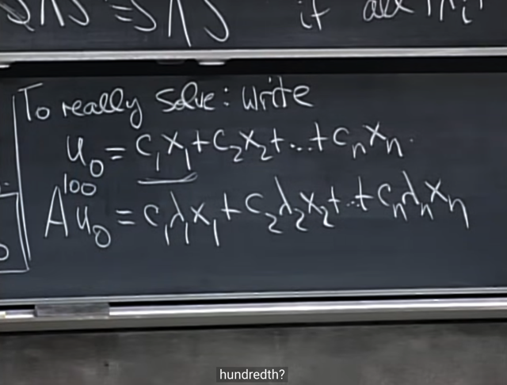</kbd>

> [!NOTE]
> gs hỏi tiếp thế thì **sẽ như thế nào** nếu ta cứ **tiếp tục nhân kết
> quả Au_0**, tức u_1 **cho A nhiều lần** để thành A^100u_0
>
> me: Dễ thấy ví dụ Au_i sẽ tiếp tục là:
>
> A(c1λ1x1 + c2λ2x2 + ...) = c1λ1Ax1 + c2λ2.Ax2 +
> ....
>
> = c1λ1λ1x1 + c2λ2λ2x2 + ....
>
> = c1λ1^2x1 + c2λ2^2x2 + .....
>
> Tương tự, như vậy thì có thể hiểu A^100u_0 sẽ là:
>
> **A^100u_0 = c1.λ1^100.x1 + c2.λ2^100.x2 + ......**

 

<kbd>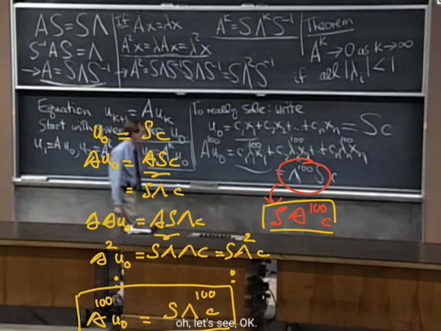</kbd>

> [!NOTE]
> Và ta có thể **thể hiện cùng qúa trình trên theo factorization**,
> bắt đầu từ u_0 chính là **Sc** (linear combination các
> eigenvectors - là các cols của S) 
>
> Từ đó **Au_0 = ASc** = (AS)c = **(SΛ)c** | (AS= SΛ)
>
> Tiếp **Au_1** = **AAu_0** = **A(SΛ)c**  = (**AS)Λc**
>
> = (SΛ)Λc = **SΛ^2c**
>
> tiếp tục vậy thì**A^100u_0 = SΛ^100c
>
> (gs ghi sai chỗ này, phải là SΛ^100c)**

 

<kbd>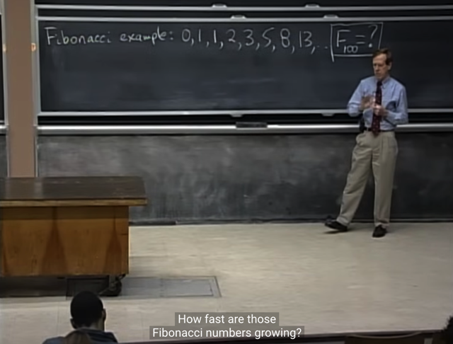</kbd>

> [!NOTE]
> Ứng dụng cái này ta sẽ giải bài toán: **F100 của dãy
> Fibonacci là bao nhiêu**, và quan trọng hơn là:**con số của
> dãy này lớn nhanh đến mức nào?**

 

<kbd>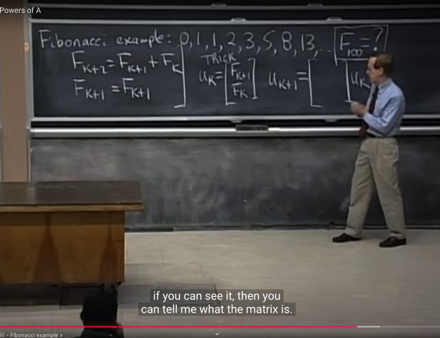</kbd>

> [!NOTE]
> Thế thì đại khái là gs nói về việc **chuyển bài toán gốc
> thành bài toán này**. Đặt**u_k = [F_k+1 F_k].T**
>
> bài toán gốc ở đây là vì để xác định một số trong dãy Fibonacci
> thì nó là t**ổng của hai số trước đó**: **F_k+1 = F_k + F_k-1**. 
> **mà trong đó** **F_k lại là hàm số phụ thuộc F_k-1**. Nên ta có
> một **second-order equation**(là khi mà ta có một item phụ
> thuộc 2 item trước đó, mà Fibonacci là một điển hình. Mở rộng
> ra third-order equation thì khi một item phụ thuộc 3 preceding
> items)
>
> Nhưng bằng cách đặt **u_k = [F_k+1 F_k].T** thì dãy số sẽ trở
> thành (0, 1), (1, 1), (1, 2) ...trong đó u_k+1 chỉ cần depend u_k 
> bài toán trở thành **system of first order equations**.
>
> Và bất cứ khi nào ta có một system of equations thì ta luôn
> có thể express nó ở dạng matrix: 
>
> **u_k+1 sẽ có thể được thể hiện bởi một matrix nhân u_k.**
>
> Gs hỏi matrix đó sẽ là gì?

 

<kbd>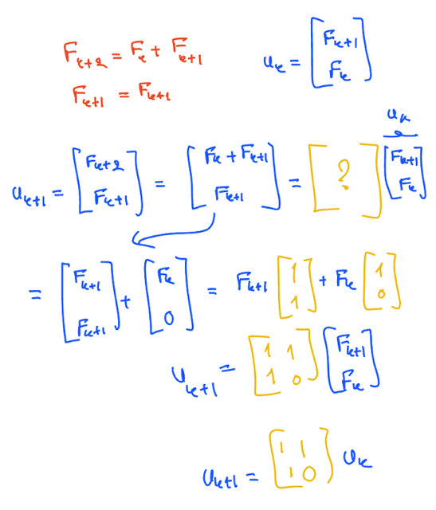</kbd>

 

<kbd></kbd>

> [!NOTE]
> Gs: correct. như vậy ta đã chuyển bài toán từ **second
> order equation** thành một **system các first order equation**.
>
> Nói F_k+2 = F_k+1 + F_k là second order equation là bởi
> F_k+2 phụ thuộc F_k+1 và F_k, trong đó F_k+1 lại cũng
> phụ thuộc F_k.
>
> Bằng cách chuyển thành vector, cho phép kiểu như mô tả
> quy luật của Fibonacci bằng quan hệ chỉ giữa u_k+1 và
> u_k gọi là first order equation. (đại khái là vậy)

 

<kbd>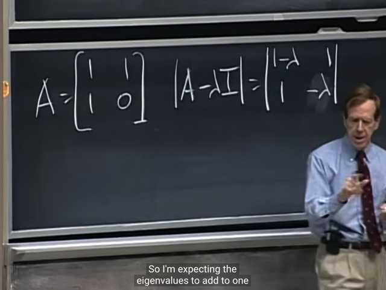</kbd>

> [!NOTE]
> Rồi, ta sẽ như thường lệ, **tìm** **eigenvalues** bằng
> cách **solve characteristic equation**: **det (A - λI) = 0.**
>
> Thế thì gs đề nghị ta hãy **nhận xét về eigenvalue
> trước** cả khi giải ra nó. Đó là**tổng của nó sẽ là trace**
> = **tổng các giá trị trên đường chéo** = 1
>
> (Chú ý, **trace luôn là tổng giá trị trên đường chéo**,
> trace vẫn luôn bằng tổng các eigenvalues, và khi matrix
> là triagular thì eigenvalues CHÍNH LÀ CÁC GIÁ TRỊ
> ĐƯỜNG CHÉO)
>
> và t**ích của chúng sẽ là determinant, = -1**

 

<kbd>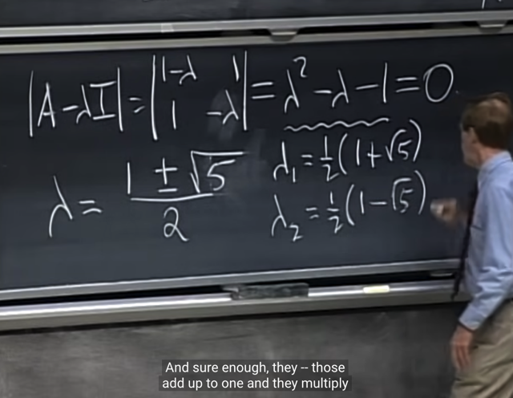</kbd>

> [!NOTE]
> giải ra ta có **hai giá trị EIGENVALUE
> KHÁC NHAU**

 

<kbd>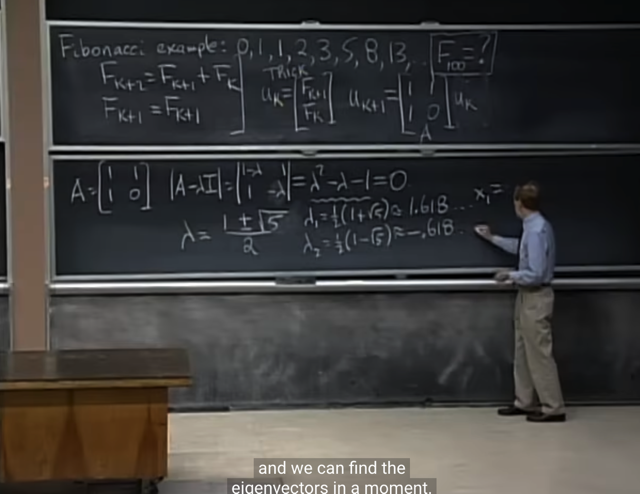</kbd>

> [!NOTE]
> từ đó gs cho biết c**hắc chắn ta sẽ có 2**
> **INDEPENDENT eigenvector**

 

<kbd>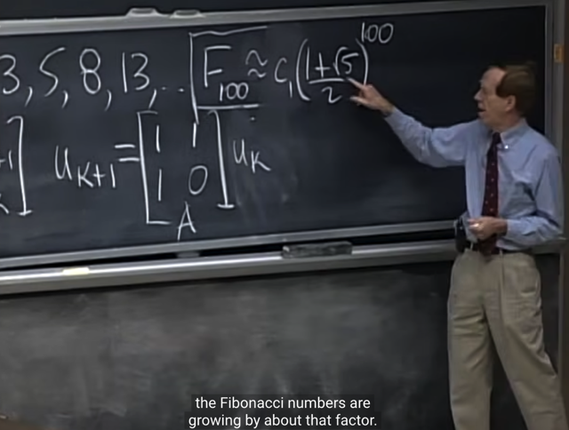</kbd>

> [!NOTE]
> Và từ đây ta đã có thể trả lời ý thứ hai của câu hỏi đó là
> **dãy số này sẽ lớn nhanh đến mức nào**.
>
> Thì như ví dụ trước ta đã biết nó sẽ **phụ thuộc vào
> eigenvalue**, trong trường hợp này là **cái có giá trị lớn
> hơn 1 (1,618)**. Và tuy không biết chính xác nhưng ta có thể chắc
> chắn là nó sẽ **gần bằng một hàng số nào đó c1 nhân với
> λ1^100 (c1 sẽ tìm nhờ u_0)**
>
> Và có nghĩa là nó sẽ **tăng lên theo factor là λ1** tức là cứ
> **mỗi lần nó lại lớn gấp (xấp xỉ) λ1 lần * giá trị trước**đó.

 

<kbd></kbd>

> [!NOTE]
> Sở dĩ ta **chỉ nói nó phụ thuộc cái eigenvalue thứ nhất** là
> **bởi cái eigenvalue kia nhỏ hơn 1 (0.618)**, dẫn đến là**nó sẽ
> nhỏ về 0 rất nhanh**

 

<kbd>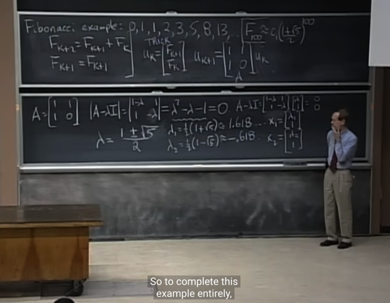</kbd>

> [!NOTE]
> Rồi, để trả lời câu hỏi **tìm F100**, ta sẽ tiếp tục với việc
> dùng hai giá trị eigenvalue để **tìm hai eigenvector x1, x2**

 

<kbd>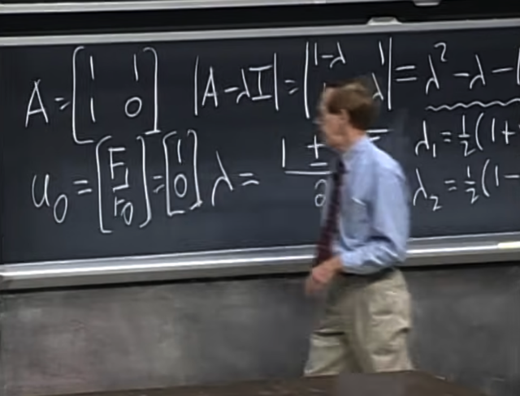</kbd>

> [!NOTE]
> Và ta cũng cần **u_0**, nó sẽ
> là [F1, F0] = [1 0]

 

<kbd>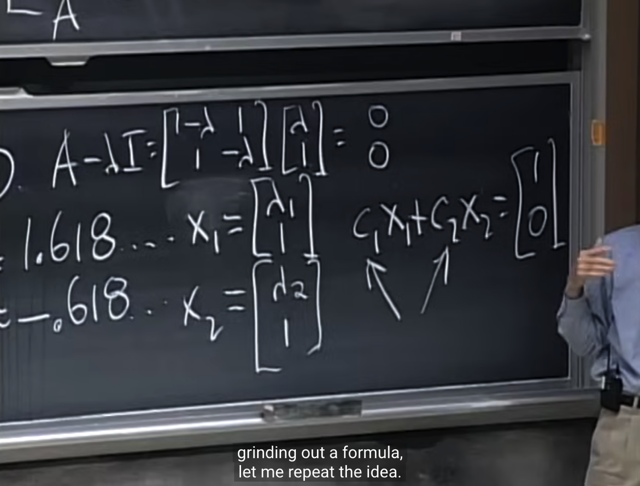</kbd>

> [!NOTE]
> Từ đó ta có thể **dùng u_0** = c1.x1 + c2.x2 **để tìm c1, c2**.
>
> Và khi đó, u_100 chính là **c1λ1^100x1 + c2λ2^100x2**

 

<kbd></kbd>

> [!NOTE]
> tóm lại ý tưởng cốt lõi của bài toán này đó là: Khi có
> một thứ gì đó **tăng lên theo thời gian bởi một first
> order equation system** bắt đầu **từ một giá trị ban đầu u_0**.
>
> Thì chìa khóa là ta **cần tìm eigenvalues của matrix A**
> **đứng sau quan hệ giữa u_k và u_0** Và nó sẽ cho ta biết
> chuyện gì thật sự xảy ra.
>
> Sau đó ta sẽ **viết u_0 dưới dạng linear combination
> của eigen-vectors**. Khi đó, ta sẽ **có thể có được u_k tính
> theo lambda_j^k, c_j, x_j**

> [!NOTE]
> Ôn nhanh như sau:
>
> Dựa vào A = S.Λ.Sinv dẫn tới 
>
> u_1 = S.Λ.Sinv u_0 
>
> u_2 = Au_1 = S.Λ.Sinv S.Λ.Sinv u_0 = S.Λ^2Sinv u_0
>
> tương tự sẽ dễ thấy u_k = S.Λ^k.Sinv u_0
>
> Tiếp ta sẽ có u_0 = Sc, điều này là bởi ta bắt đầu với việc
> đặt điều kiện hoặc giả định là ta có **N INDEPENDENT
> EIGENVECTORS nan CHÚNG SẼ SPAN TOÀN BỘ RN**,
> nên đương nhiên một vector u nào thuộc Rn cũng sẽ  có thể
> được represent bởi linear combination bởi eigenvectors
>
> (chú ý là, đã nói ở note (theo link) rằng, điều này không mắc
> mớ gì dẫn tới kết luận về column space hay nullspace nhé)
>
> Từ đó, nhờ biết u0 (ví dụ như hai giá trị đầu tiên của Fibonacci)
> ta sẽ giải ra c từ u0 = Sc
>
> thành ra u_k trở thành S.Λ. Sinv Sc = S.Λ.c
>
> Như vậy để tìm u_k thì việc tìm S, và eigenvalues của A là
> xong, còn c thì dựa vào giá trị u_0: u_0 = Sc -> tính được c.

 

