# Lecture 23: Differential Equations And Exp(at)

📊 **Progress:** `55` Notes | `61` Screenshots

---
<a id="node-763"></a>

<p align="center"><kbd>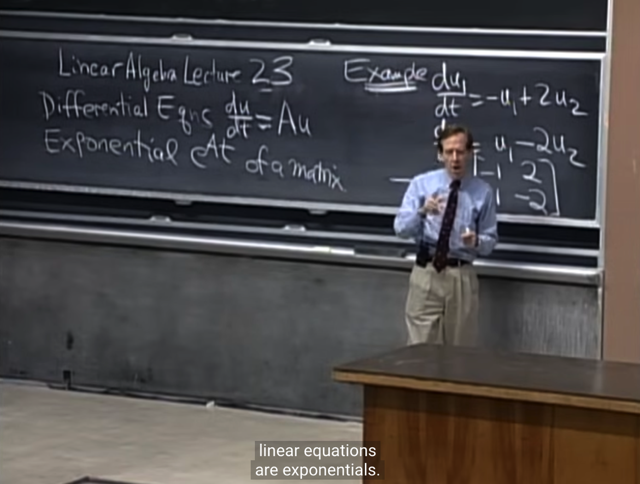</kbd></p>

<br>

<a id="node-764"></a>

<p align="center"><kbd>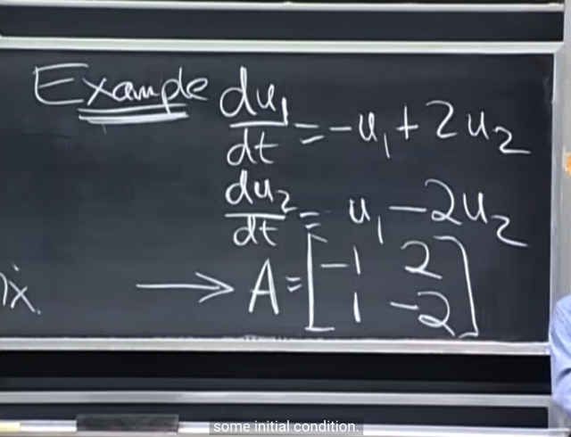</kbd></p>

> [!NOTE]
> Bài này giáo sư sẽ nói về hệ **PHƯƠNG TRÌNH VI PHÂN**.
> là system of equation mà trong đó có **first order derivative**
> (đạo hàm cấp 1) và **hệ số hằng số**.
>
> Và gs cho rằng nếu ta **làm đúng cách** thì nó sẽ hóa ra 
> là **bài toán linear algebra**.
>
> Và trong quá trình đó ta sẽ thảo luận về một thứ **tương 
> tự như bài trước** ta đã làm khi ta nói về việc **lũy thừa** một
> matrix A^k Thì nay ta sẽ nói về **exponential một matrix e^A**

<br>

<a id="node-765"></a>

<p align="center"><kbd>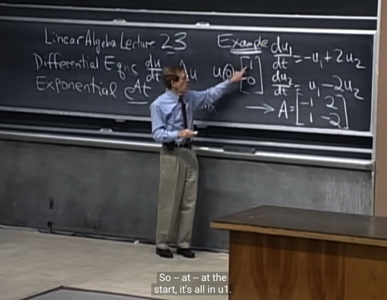</kbd></p>

> [!NOTE]
> Gs cho một **initial** condition, **u(0) `=` [1 0].T** và nói rằng
> điều này có nghĩa**là "lúc đầu" mọi thứ đều nằm trong
> u1** (ý là mọi giá trị đều trong component thứ nhất của
> vector u)
>
> Nhưng khi **t tăng lên**, thì vì **du2/dt** có một thành phần
> **+ u1**  và `-` 2*u2 và `du1/dt` thì `-` u1, `+` 2*u2 nên kiểu như là
> nó sẽ **move ra khỏi u1, đi vào u2**

<br>

<a id="node-766"></a>

<p align="center"><kbd>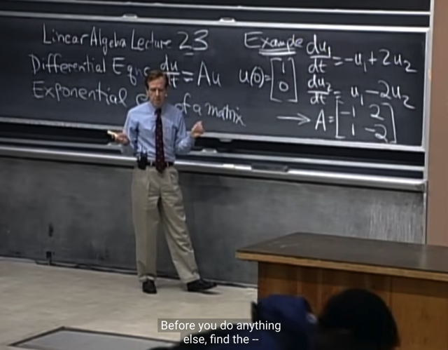</kbd></p>

> [!NOTE]
> Và ta sẽ theo sát sự chuyển dịch đó bằng cách **xem xét
> eigenvector và eigenvalue của matrix**

<br>

<a id="node-767"></a>

<p align="center"><kbd>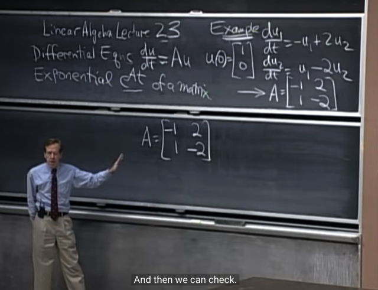</kbd></p>

> [!NOTE]
> Gs hỏi luôn ta **có thể biết eigenvalue nào của A** không?
>
> me: Ta đã biết gs nói **matrix nxn sẽ có n eigenvalue**.
>
> Vậy matrix này có **2 eigenvalue**. Ta cũng đã biết**tổng
> của chúng sẽ là Trace của A** `=` các giá trị trên đường chéo
> `=` `-1` `+` `(-2)` `=` `-3.` Và ta cũng biết**tích của chúng sẽ là det
> A**. det A dễ thấy ngay là bằng **0**. (*) Vậy suy ra ngay sẽ
> có **một eigenvalue bằng 0**. Và từ việc tổng của chúng
> bằng `-3` nên suy ra luôn **eigenvalue còn lại là -3.**(*) Việc dễ thấy det bằng 0 nói trên có thể do nhẩm tính
> bởi công thức det của 2x2 matrix, nhưng cũng có thể lí
> luận từ việc ta thấy **hai rows hay cols của chúng
> dependent**. Thành ra chắc chắn chỉ có 1 pivot columns,
> và 1 free columns. Và như vậy thì có một 1 special
> solution, hay 1 basis vector của nullspace. Và **vector
> (khác 0) trong nullspace chính là eigenvetors với
> eigenvalue `=` 0**

<br>

<a id="node-768"></a>

<p align="center"><kbd>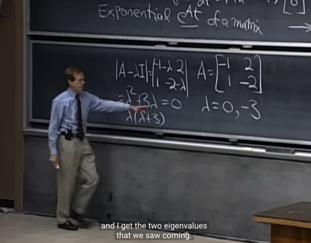</kbd></p>

> [!NOTE]
> Gs: hoàn toàn chính xác. và ta có thể kiểm tra bằng cách
> xây dựng **characteristic equation** để solve ra lambda
>
> Review chút, theo định nghĩa, eigenvector là vector (khác 0) mà
> chỉ bị scale bởi A, tức Ax `=` lambdax. Điều này đồng nghĩa
> `(A-lambda*I)x` `=` 0, cho thấy eigenvector của A chính là vector
> trong nullspace của `A-lambda*I.` Vậy thì nếu x tồn tại, đồng
> nghĩa nullspace của `A-lambda*I` không rỗng, do đó matrix này
> là singular và singular matrix thì det `=` 0.
>
> Vậy từ đó ta sẽ thiết lập equation det `(A-lambda*I)` `=` 0 để giải
> tìm lambda (khiến `A-lambda*I)` singular, và sau đó ta sẽ tìm
> nullspace basis của nó để có eigenvector của A. Equation trên
> gọi là characteristic equation (phương trình đặc trưng)

<br>

<a id="node-769"></a>

<p align="center"><kbd>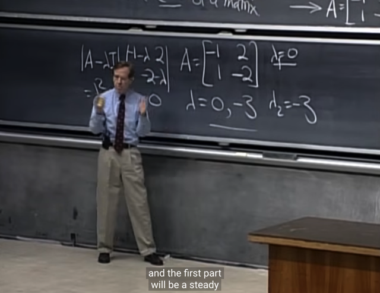</kbd></p>

> [!NOTE]
> Gs cho biết dù tí nữa tự ta sẽ thấy, nhưng ông cho biết
> trước rằng, **hai eigenvalues** này sẽ "làm nên" /**"tham
> gia" vào hai phần của solution**.
>
> Trong đó phần thứ nhất, với **eigenvalue `=` -3**, thì nó sẽ
> **khiến `e^-3t` nhỏ dần nhỏ dần về 0** khi t tăng lên đến vô
> cùng (vì đồ thị của hàm e^x sẽ về 0 khi x về `-inf,` và về inf khi
> x về inf)
>
> Còn **eigenvalue thứ 2 (=0)** sẽ**tham gia trong e^0t `=` e^0 `=` 1
> và phần này luôn bằng 1 với mọi t**.
>
> Như vậy là khi t tăng lên, solution với **một phần là constant**,
> **một phần nhỏ dần về 0**, để khi t lớn chỉ còn lại một phần
> mà ta quan tâm

<br>

<a id="node-770"></a>

<p align="center"><kbd>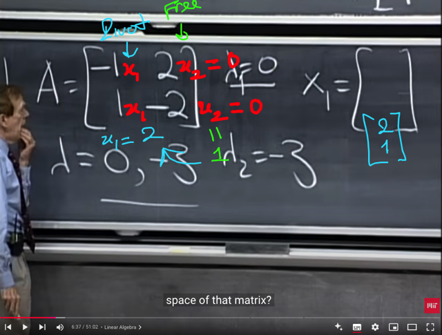</kbd></p>

> [!NOTE]
> Gs: **eigenvector** là gì?
>
> me: vì lambda `=` 0 rồi, nun **nullspace của (A `-` λ*I) cũng là
> của A**. Nói rõ hơn là, ta đã biết `non-zero` vector trong
> nullspace hay có thể nói basis vector của nullspace của
> `A-lambda*I` sẽ chính là eigenvector của A ứng với
> eigenvalue lambda. Mà ở đây lambda `=` 0, thì A và
> `A-lambda*I` là một, nên nullspace của `A-lmd*I` chính là
> nullspace của A. Điều này cũng phản ánh **sự thật** đơn
> giản rằng, **nếu nullspace của A có dim > 0**, thì **basis
> của N(A) chính là eigenvector** vì đó là `non-zero` vector
> **ứng với eigenvalue `=` 0**, do `Ax=0*x)`
>
> Vậy tìm nullspace của A, thì ta thấy ngay **cols 2 là free cols**/ ứng với free variable. Ta **chọn giá trị của nó bằng 1**.
>
> Thì thế vào tính pivot variable (x1) ra bằng 2. **Vậy [2 1] là
> một vector trong basis của nullspace** của A, đó **chính là
> eigenvector thứ nhất**

<br>

<a id="node-771"></a>

<p align="center"><kbd>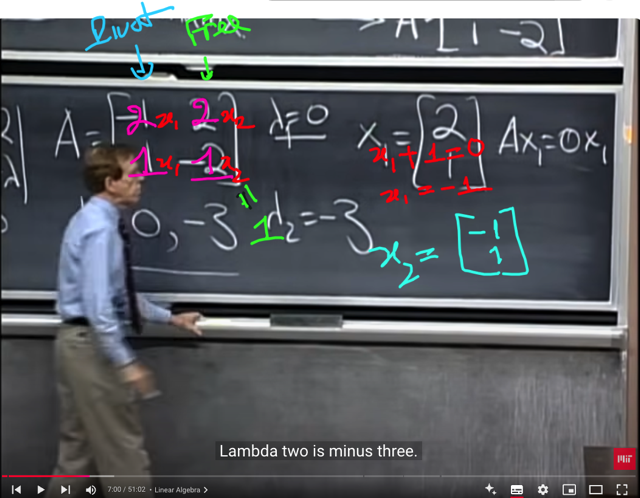</kbd></p>

> [!NOTE]
> Với eigenvalue `=` `-3,` thì `A-lambda*I` là [2, 2; 1, 1], tìm special
> solution (basis của nullspace của `A-lambda*I)` ra **[-1, 1]** đây
> chính là eigenvector thứ 2

<br>

<a id="node-772"></a>

<p align="center"><kbd>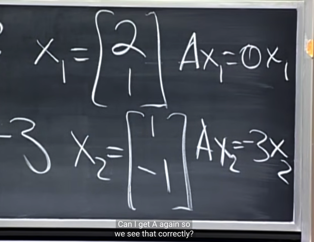</kbd></p>

🔗 **Related:** [LECTURE 23: DIFFERENTIAL EQUATIONS AND EXP(AT)](untitled.md#node-778)

> [!NOTE]
> gs cũng làm như vậy, có điều với eigenvector 2 thì ông
> chọn `-1` cho free variable nên pivot variable là 1
>
> `->` eigenvector x2 `=` [1 `-1]` nhưng ta biết là mình tính ra
> `[-1` 1] thì vẫn đúng thôi vì với eigenvector ta chỉ quan tâm
> phương
>
> Vì **mọi vector trong line** đi qua vector đó**đều là thuộc
> nullspace** (của `A-lambda*I)` .
>
> Mà đúng hơn cái line đó chính là nullspace, nên**mọi
> vector trong đó đều là eigenvectors (của A),**khi nói về
> eigenvectors thật ra ta đang quan tâm phương, không
> quan tâm hướng

<br>

<a id="node-773"></a>

<p align="center"><kbd>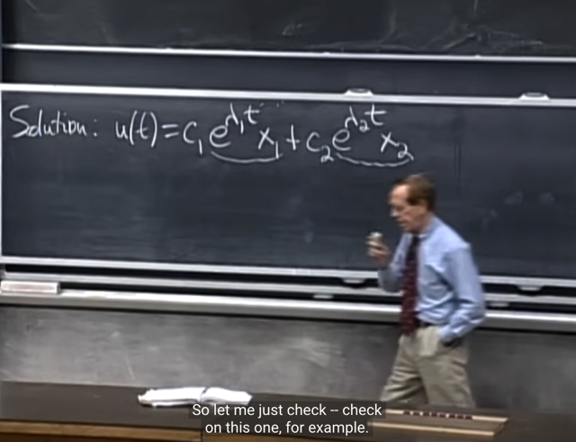</kbd></p>

> [!NOTE]
> Và gs cho biết**GENERAL SOLUTION (nghiệm tổng
> quát)** sẽ là cấu thành bởi **2 special solution:**
> hay vector u(t) `=` c1(e^λ1t)*x1 `+` c2(e^λ2t)*x2 (u, x1, x2 là 
> vector)

<br>

<a id="node-774"></a>

<p align="center"><kbd>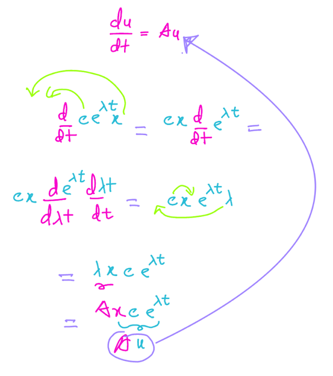</kbd></p>

<p align="center"><kbd></kbd></p>

<p align="center"><kbd>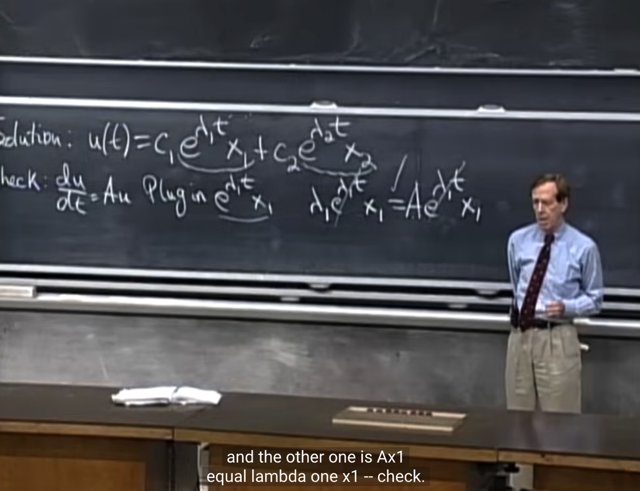</kbd></p>

> [!NOTE]
> Ta sẽ check xem có đúng u1(t) `=` **e^(λ1t)*x1** là solution
> của **du/dt `=` Au** không **bằng cách** **thế vào `du/dt` `=`
> Au**
>
> Ta sẽ có:
>
> **Vế trái** là **du1/dt,**ta sẽ có derivative của **e^(λ1t)*x1**
> đối với t. Dùng chain rule (in calculus) ta có
>
> ```text
> d [e^(λ1t)*x1] /dt = x1*[de^(λ1t)/d(λ1t)]*[d(λ1t)/dt]
> ```
>
> `=x1*[` e^(λ1t) ] * [λ1] **= e^(λ1t)*λ1x1** (vì e^(λ1*t) là scalar nên move tùy ý)****====**Vế phải: Au1 `=` Ae^(λ1t)*x1
>
> `=` e^(λ1t)*Ax1**(vì e^(λ1*t) là scalar, nên có thể move tùy
> ý)****
>
> `=` **e^(λ1t)*λ1x1** (vì x1 là eigenvector của A, ứng với
> eigenvalue  λ1, nên Ax1 `=` λ1x1)
>
> Và đây chính là vế trái. Vậy `du1/dt` `=` Au1
>
> nên u1(t) `=` **e^(λ1*t)*x1** là một special solution của **du/dt
> `=` Au**tương tự thì u2(t) `=` e^(λ2t)*x2 cũng vậy

<br>

<a id="node-775"></a>

<p align="center"><kbd>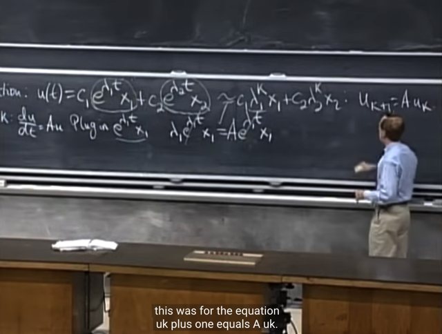</kbd></p>

> [!NOTE]
> gs: cũng như bữa trước mình có **c1(λ1^k)x1 `+` c2(λ2^k)x2** là
> general solution của equation **u_k+1 `=` Au_k**Thì nay **c1(e^λ1t)x1 `+` c2(e^λ2t)x2** là general solution của
> **du/dt `=` Au**

<br>

<a id="node-776"></a>

<p align="center"><kbd>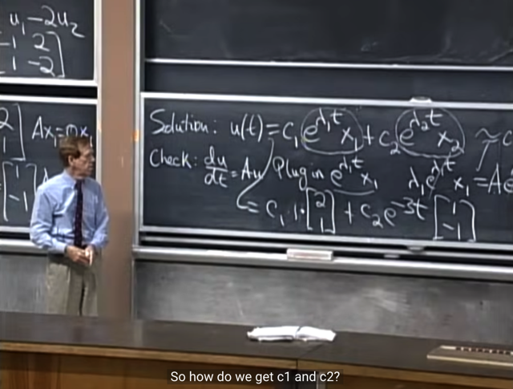</kbd></p>

> [!NOTE]
> Và tương tự như bữa trước, khi ta có **eigenvalues λ1, λ2** và
> **eigenvectors x1, x2**,**ta gắn vào**, và để có thể hoàn chỉnh
> solution chỉ còn **phải tìm c1, c2**nữa thôi.

<br>

<a id="node-777"></a>

<p align="center"><kbd>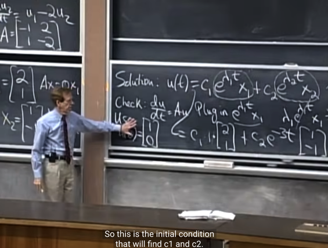</kbd></p>

> [!NOTE]
> Và để có c1, c2 ta sẽ dùng đến
> **initial condition**: u(0) `=` [1 0]T

<br>

<a id="node-778"></a>

<p align="center"><kbd>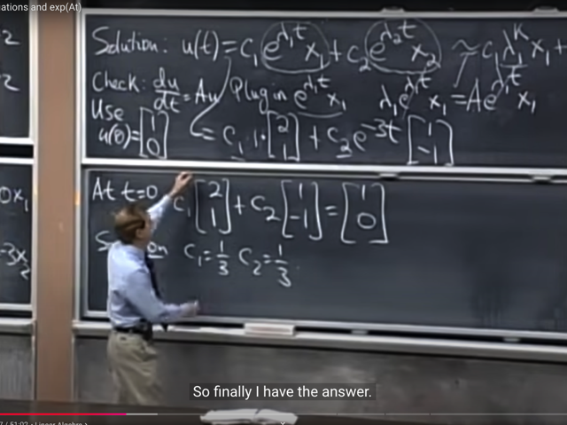</kbd></p>

🔗 **Related:** [LECTURE 23: DIFFERENTIAL EQUATIONS AND EXP(AT)](untitled.md#node-772)

> [!NOTE]
> Và dùng initial condition có nghĩa là với t `=` 0, `u_0` `=` [1 0],
>
> Thế vào `u_0` `=` Sc (chú y S ta là matrix mà các columns là
> các eigenvectors x1, x2 mà ta đã tìm ra hồi nãy)
>
> ta tìm được c: **c1 `=` c2 `=` 1/3**

<br>

<a id="node-779"></a>

<p align="center"><kbd>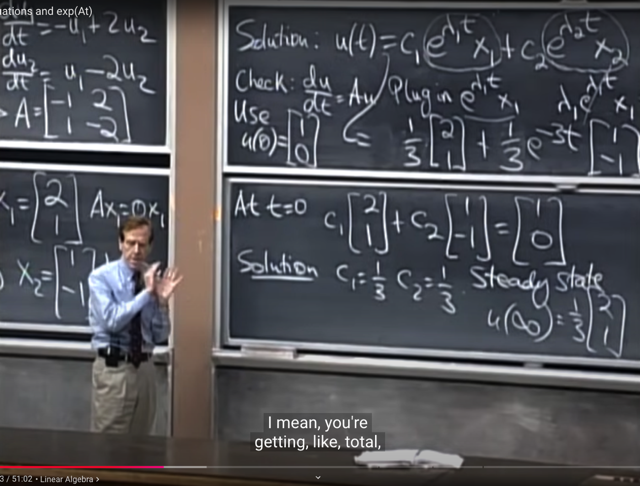</kbd></p>

🔗 **Related:** [LECTURE 23: DIFFERENTIAL EQUATIONS AND EXP(AT)](untitled.md#node-804)

> [!NOTE]
> Và từ đó cho ta thấy rằng, xuất phát từ trạng thái ban đầu
> `t=0` u(0) `=` [1 0] thì khi t tăng lên vô hạn thì u(t) sẽ như thế
> nào.
>
> Ta đã có:
>
> u(t) `=` **c1*(e^λ1*t)*x1 `+` c2*(e^λ2t)*x2**
>
> với **λ1 `=` 0**, **λ2 =** **-3**
>
> thì khi **t lớn vô hạn** thì **c1*(e^λ1t)*x1** =**c1*(e^0)*x1** =**c1x1** 
> (e^0 `=` 1)
>
> Còn **c2*(e^λ2t)*x2** trở thành **c2*0*x2 `=` 0**(vì `e^[-infinity]` `=` 0)
>
> Từ đó ta có u(t) đạt giá trị ổn định, tức trạng thái
> **STEADY stage là c1x1 `=` `(1/3)*[2` 1]T `=` `[2/3` 1/3]T**
>
> `===`
>
> Nhưng gs cho biết **không phải lúc nào cũng như vậy**.
> **Đôi khi nó sẽ VANISH `/` disappear.** Đôi khi nó sẽ**BLOW UP.**
>
> Và **eigenvalue sẽ cho ta biết điều đó**

<br>

<a id="node-780"></a>

<p align="center"><kbd>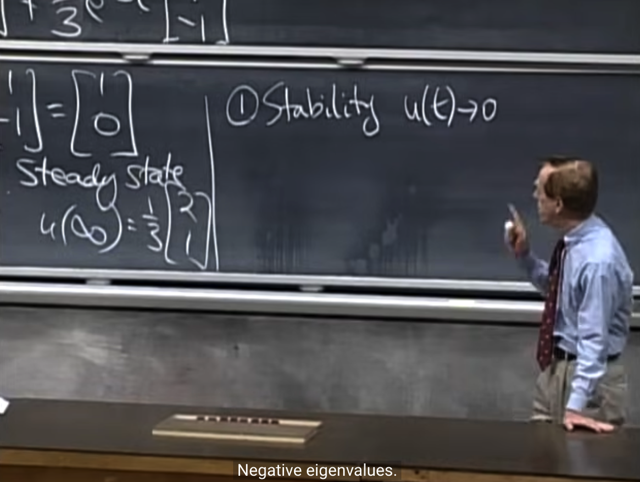</kbd></p>

> [!NOTE]
> Trường hợp thứ nhất là **Đạt trạng thái ổn định** `-` **Stability:**đó là **u(t) tiến về 0** khi t lớn vô hạn:
>
> Thì điều này như ta thấy, sẽ xảy ra khi **MỌI EIGENVALUES
> ĐỀU ÂM HOẶC CÓ PHẦN THỰC ÂM NẾU LÀ SỐ PHỨC**
>
> Khi đó khi t `->` infinity, **e^(λt) `->` 0 dẫn đến mọi solution
> `c_i*(e^λ_i*t)*x_i` đều trở thành `c_i*0*x_i` `=` 0**

<br>

<a id="node-781"></a>

<p align="center"><kbd>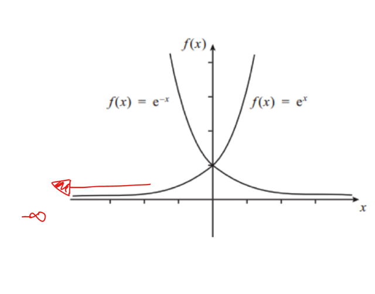</kbd></p>

> [!NOTE]
> khi x `->` `-infinity` thì e^x `->` 0

<br>

<a id="node-782"></a>

<p align="center"><kbd>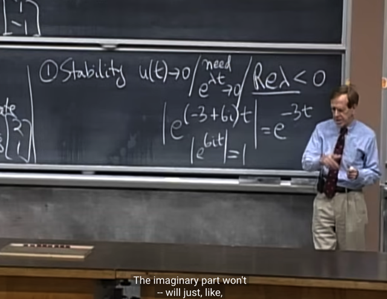</kbd></p>

> [!NOTE]
> Khúc này gs nói về việc **nếu λ là số phức thì sao**, ví
> dụ nó là `-3` `+` 6i, phần real là `-3.`
>
> Thì gs cho rằng **trị tuyệt đối của `e^(-3+6i)t` bằng
> e^(-3t)**. Lí do là vì **trị** **tuyệt đối của e^(6i*t), bằng 1**.
>
> ```text
> e^(-3+6i)t = e^(-3t+6it) = e^(-3t)*e^(6it)
> ```
>
> ```text
> |e^(-3t)*e^(6it)| = |e^(-3t)| * |e^(6it)| = e^(-3t) * 1
> ```
>
> Vậy nếu phần thực của số phức âm (ví dụ chính là `-3`
> trong ví dụ này) thì khi `t->infinity` thì `e^-3t` cũng `->` 0
>
> Nên với case eigenvalue là **số phức với phần thực âm
> (Re lambda < 0)**, cũng sẽ đạt trạng thái ổn định.

<br>

<a id="node-783"></a>

<p align="center"><kbd>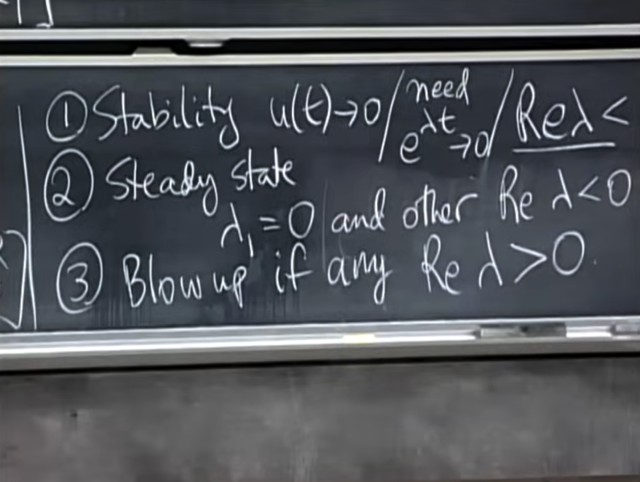</kbd></p>

🔗 **Related:** [LECTURE 24: MARKOW MATRICES; FOURIER SERIES](untitled.md#node-845)

> [!NOTE]
> Còn trạng thái**STEADY**: tức là u(t) `->` [**một giá trị ổn định]**như ví dụ vừa rồi đó là **CÓ ÍT NHẤT MỘT EIGENVALUE `=`
> 0**, và **CÁC EIGENVALUE KHÁC** CÓ **GIÁ TRỊ THỰC ÂM**
> (số thực hoặc phần thực của số phức)
>
> Và trạng thái **BLOW UP** sẽ xảy ra nếu **MỌI EIGENVALUES
> CÓ GIÁ TRỊ DƯƠNG**

<br>

<a id="node-784"></a>

<p align="center"><kbd>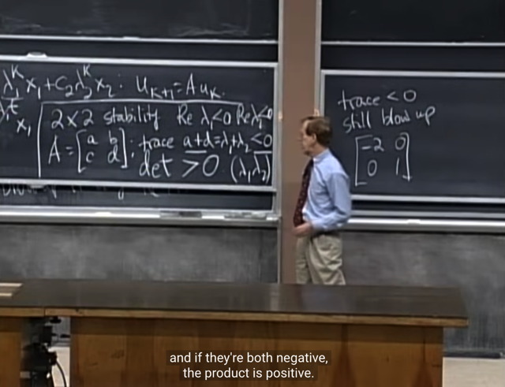</kbd></p>

> [!NOTE]
> Tiếp gs xét ví dụ một 2x2 matrix. Và bàn về việc làm sao ta
> có thể **chỉ dựa vào trace và det** đoán biết **matrix sẽ khiến
> đạt trạng thái Stability**
>
> Thế thì như đã nói, để có trạng thái này, **cả hai eigenvalue**
> đều có **phần thực có giá trị âm** (số thực âm hoặc số phức
> có phần thực âm) 
>
> Và điều này được biểu hiện bằng việc**TRACE ÂM** (tổng các 
> eigenvalue) và **DET DƯƠNG** (**chứng tỏ chúng đều âm**, chứ 
> nếu không vẫn có thể có một eigenvalue dương gây ra trạng 
> thái **Blow up**)

<br>

<a id="node-785"></a>

<p align="center"><kbd>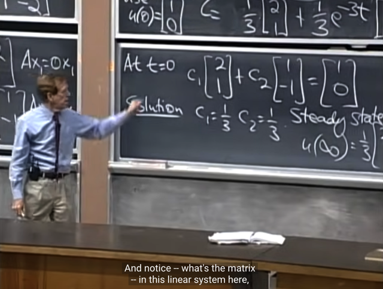</kbd></p>

> [!NOTE]
> Gs: Cái chính của bài giảng này là ta học cách solve system
> of equation này. Đó là ta **tìm eigenvalue, rồi eigenvector**, 
> cuối cùng là d**ùng initial condition để tìm các coefficient c**

<br>

<a id="node-786"></a>

<p align="center"><kbd>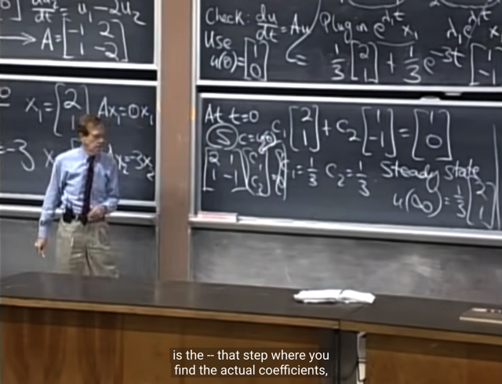</kbd></p>

> [!NOTE]
> Và có thể thể hiện cái system of equations bởi **u(0) `=` Sc**
> và matrix S đó (tạo bởi các eigenvector) `-` eigenvectors matrix

<br>

<a id="node-787"></a>

<p align="center"><kbd>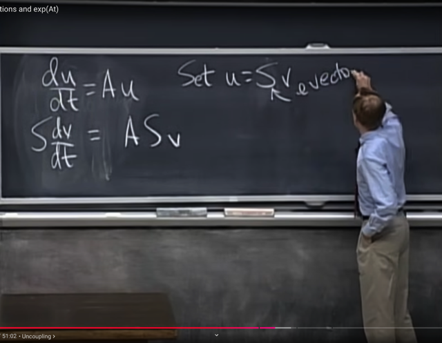</kbd></p>

> [!NOTE]
> Gs quay lại differential equation system gốc: **du/dt `=` Au**
>
> Và đặt u `=` Sv với **S là eigenvector matrix**, có nghĩa là,
> thể hiện **u là linear combination các eigenvector độc lập**,
> với **coefficients là component của vector v**.
>
> Tại sao lại có thể**thể hiện u là linear combination của các
> A's eigenvectors (tức là các columns của S)**?
>
> Trả lời: Đơn giản là vì ta đã có hoặc xét trạng thái rằng A có
> **n independent eigenvectors**, từ đó chúng **span toàn bộ
> Rn**, hay nói cách khác chính chính là một basis của Rn.
> Do đó bất kì Rn vector u đều có thể represent bởi linear
> combination của eigenvectors với coefficient vector v:
>
> u `=` Sv
>
> Khi đó nhờ MIT18096 đã học **f `=` Ax thì df `=` Adx**
>
> ```text
> (Review nhanh: df = A(x+dx) - Ax = Ax + Adx - Ax = Adx)
> ```
>
> Do đó u `=` Sv `=>` du `=` Sdv, từ đó **du/dt `=` Sdv/dt**
>
> Vậy `du/dt` `=` Au sẽ tương đương**S `dv/dt` `=` Au**Thay tiếp u `=` Sv ta có: 
> **Sdv/dt `=` ASv**

<br>

<a id="node-788"></a>

<p align="center"><kbd>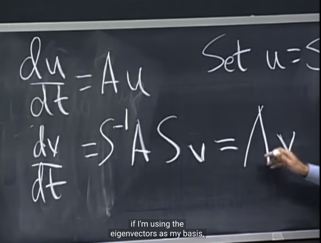</kbd></p>

> [!NOTE]
> Nhân hai vế cho **S_inv**:
>
> **S_inv.S dv/dt** `=` **S_inv A Sv**<=> **dv/dt =** **Λv**
>
> Và khi đó có thể thấy, kết quả bên phải là một vector
> mà mỗi phần tử, ví dụ thứ i, là bằng **λ_i * v_i**

<br>

<a id="node-789"></a>

<p align="center"><kbd>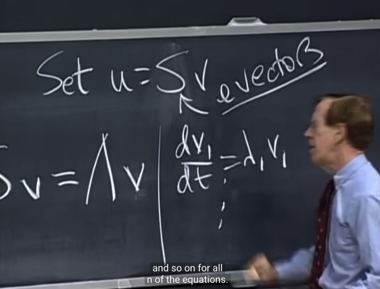</kbd></p>

> [!NOTE]
> Từ đó ta có **dv1/dt `=` λ_1*v_1**, **dv2/dt `=` λ_2*v_2**
> ...

<br>

<a id="node-790"></a>

<p align="center"><kbd>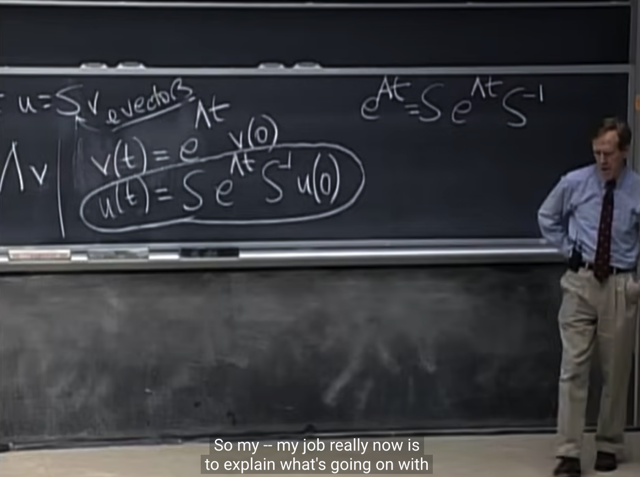</kbd></p>

> [!NOTE]
> Ở đây đại khái là kiến thức của phương trình vi phân: (cứ
> biết vậy, bổ sung sau)
>
> Nghiệm tổng quát của **du/dt `=` Au** là **u(t) `=` (e^At)*u(0)**
>
> Tương tự: 
>
> Nghiệm tổng quát của **dv/dt `=` Λv** là **v(t) `=` e^(Λt)*v(0)**
>
> Ta sẽ hiểu điều này ở note kế tiếp

<br>

<a id="node-791"></a>

<p align="center"><kbd>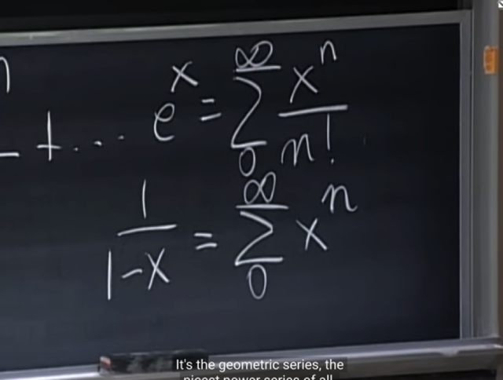</kbd></p>

> [!NOTE]
> gs cho rằng công thức nó là từ đây:**chuỗi Taylor đối với hàm f(x)  `=` e^x** 
> chỉ là khác ở chỗ ở đây biến số là matrix At (e^At)
>
> Công thức của dãy Taylor: Đại khái có thể phát biểu thế này: **hàm số f(x)**
> có thể được **biểu diễn** là một **tổng** của một chuỗi **các hạng tử** mà hạng
> tử thứ n có công thức khái quát là: 
>
> [**giá trị của hàm số đạo hàm cấp n đối với x, tại a] * `(x-a)^n` `/` n!**
>
> ```text
> f(x) = f(a)(x-a)^0/0! + f'(a)(x-a)^1/1! + f''(a)(x-a)^2/2! +...+ f^(n)(a)(x-a)^n/n!
> ```
>
> Với a `=` 0, thì ta gọi là chuỗi **Mclaurin**
>
> ```text
> f(x) = f(0)(x-0)^0/0! + f'(0)(x-0)^1/1! + f''(0)(x-0)^2/2! +...+ f^(n)(0)(x-0)^n/n!
> ```
>
> =**f(0) `+` f'(0)*x `+` `f''(0)*x^2/2!` `+...+` f^(n)(0)*x^n/n!**
>
> `====`
>
> Thế thì ta sẽ **áp dụng công thức chuỗi Mclaurin cho hàm f(x) `=` e^x**
>
> Với**f(x) `=` e^x thì 1st order derivative f'(x) (tức là `df/dx)` `=` e^x** 
>
> second order derivative `-` tức là derivative của f'(x) đối với x, vì f'(x) cũng 
> lại bằng e^x, nên**f''(x) cũng lại là bằng e^x.**
>
> Tương tự như vậy đạo **hàm cấp n của f(x) w.r.t x cũng là e^x**
>
> Từ đó, ta có **giá trị của chúng tại 0 đều là e^0 `=` 1**
>
> `=>` f(0) `=`  f''(0) `=` ... f**(n)(0) `=` e^0 `=` 1
>
> Để rồi cuối cùng ta có: 
>
> ```text
> f(x) = 1 + x/1! + x^2/2! + ... = x^0/0! + x^1/1! + x^2/2! + ....
> ```
>
> **= Sum `n=0:infinity` [x^n/n!]**

> [!NOTE]
> Đầu tiên ta cần ôn lại về **chuỗi Taylor** (gs có nhắc đến,
> nhưng ở những phần sau, nhưng ở đây mình đưa
> screenshot lên đây cho dễ)

<br>

<a id="node-792"></a>

<p align="center"><kbd>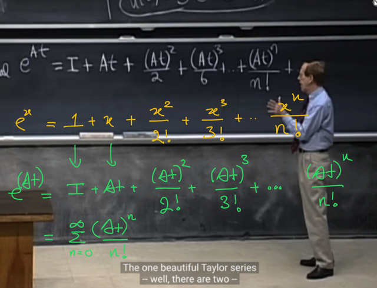</kbd></p>

> [!NOTE]
> Thế thì apply công thức của T**aylor series
> expansion** đối với matrix.

<br>

<a id="node-793"></a>

<p align="center"><kbd>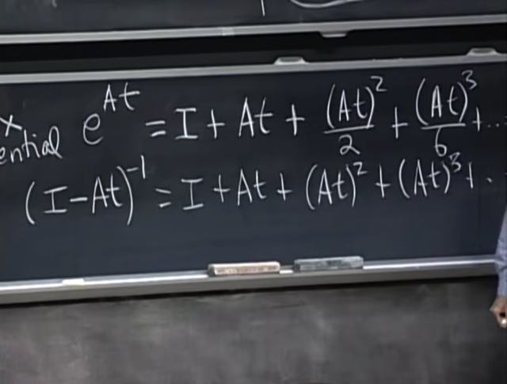</kbd></p>

> [!NOTE]
> gs có nhắc đến việc triển khai một hàm khác là (I `-` `At)^-1`
> tương tự hàm `1/(1-x)`

<br>

<a id="node-794"></a>

<p align="center"><kbd>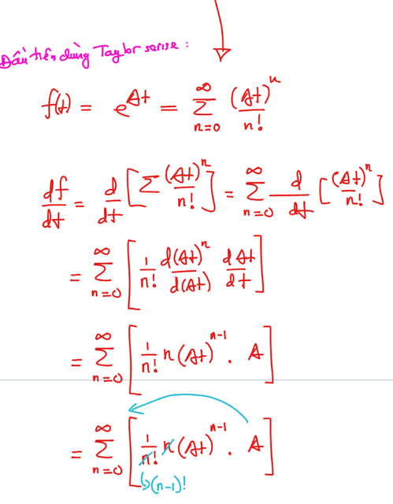</kbd></p>

<p align="center"><kbd>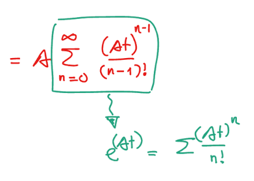</kbd></p>

<p align="center"><kbd>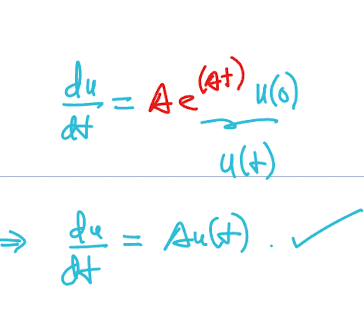</kbd></p>

<p align="center"><kbd></kbd></p>

<p align="center"><kbd></kbd></p>

<p align="center"><kbd></kbd></p>

<p align="center"><kbd>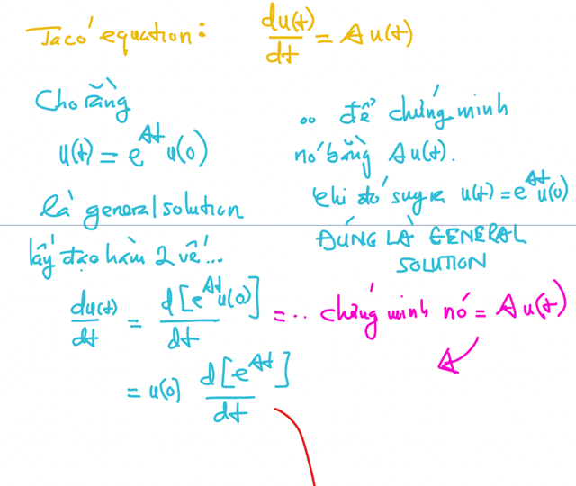</kbd></p>

🔗 **Related:** [LECTURE 23: DIFFERENTIAL EQUATIONS AND EXP(AT)](untitled.md#node-804)

> [!NOTE]
> Lập luận như sau: Ta đang muốn chứng minh phương trình
> **du(t)/dt `=` Au(t)** có nghiệm tổng quát là **u(t) `=` e^(At)u(0).**
>
> Với ý nghĩa là, ta cho rằng những function mà có tính chất
> **đạo hàm của nó đối với biến số t `(du/dt)` có tính cách tỉ lệ với
> chính nó**, liên hệ thông qua matrix A (đây là ý nghĩa của
> phương trình `du(t)/dt` `=` Au(t)) SẼ CÓ DẠNG TỔNG QUÁT
> LÀ u(t) `=` e^(At) u(0)
>
> Thế thì để chứng minh u(t) `=` e^(At)u(0) là nghiệm thì
> **đương nhiên phải chứng minh derivative của nó `du/dt` phải
> bằng Au(t).
>
> Thành ra ta sẽ bắt đầu từ u(t) `=` e^(At)u(0), lấy đạo hàm của
> nó đối với t VÀ CHỨNG MINH HAY TRIỂN KHAI ĐỂ SAO
> CHO THẤY NÓ BẰNG Au là xong.**Thế thì bước đầu tiên để tính derivative của e^(At)u(0) đối
> với t  đó là **đưa u(0) ra**, vì nó chỉ là hằng số thể hiện giá trị
> ban đầu (initial value) của hàm u(t).

> [!NOTE]
> Tiếp theo, để tính derivative của e^(At) đối với t, ta cần viện 
> sự giúp đỡ của Taylor expansion đối với matrix, mà trong note
> sau mình sẽ nói rõ hơn về công thức Taylor với f(x) khi x là
> scalar, và khi x là matrix thì cũng tương tự.
>
> Thế thì nhờ đó, hàm f(t) `=` e^(At) được tách thành tổng của 
> một chuỗi các hàm số. Giúp ta tính được d `(e^At)/dt` rất dễ dàng
> sử dụng chain rule

> [!NOTE]
> ```text
> Kết qủa của d(e^At)/dt là A Sum n=0:infi (At)^(n-1) / (n-1)!
> ```
>
> Thế thì, **Sum `n=0:infi` `(At)^(n-1)` `/` (n-1)!** CŨNG **CHÍNH LÀ e^(At)**
> ```text
> vì Sum n=0:infi (At)^(n-1) / (n-1)! thì cũng coi như y chang
> ```
> **Sum `n=0:infi` (At)^n `/` n!**

> [!NOTE]
> Và từ đó, ta điền vào việc triển khai `du(t)/dt` đang là để có :
>
> `=` u(0) . de^(At) `/` dt `=` u(0) A e^(At)
>
> Sắp xếp lại:
>
> `=` A **e^(At)u(0)
>
> Thế thì, ta đang cho rằng u(t) `=` e^At u(0) là solution của
> equation nên đương nhiên ta được dùng equation này.**Vậy tiếp nối ở trên ta có `=` Au(t). Và như vậy **từ việc u(t) `=`
> e^(At)u(0) ta triển khai derivative của nó với t du(t)/dt** thì đã
> CHO THẤY NÓ CHÍNH LÀ BẰNG Au. Vậy**chứng tỏ u(t) `=`
> e^(At) u(0) CHÍNH LÀ SOLUTION CỦA `du/dt` `=` Au**

> [!NOTE]
> Từ đó, ta hiểu được tại sao với phương trình vi phân `du(t)/dt`
> `=` Au(t) thì u(t) `=` e^At u(0) là nghiệm tổng quát
>
> Cho nên tương tự với phương trình `dv(t)/dt` `=` Λv thì
> v(t) `=` e^Λt v(0) CŨNG LÀ NGHIỆM TỔNG QUÁT

<br>

<a id="node-795"></a>

<p align="center"><kbd></kbd></p>

> [!NOTE]
> a hiểu được tại sao với phương trình vi phân `du(t)/dt` `=`
> Au(t) thì **u(t) `=` e^At u(0) là nghiệm tổng quát**
>
> Vậy thì tiếp theo gs muốn chứng minh: 
>
> u(t) `=` **e^(At)**.u(0) cũng bằng **S*(e^Λt)*Sinv** u(0)

<br>

<a id="node-796"></a>

<p align="center"><kbd>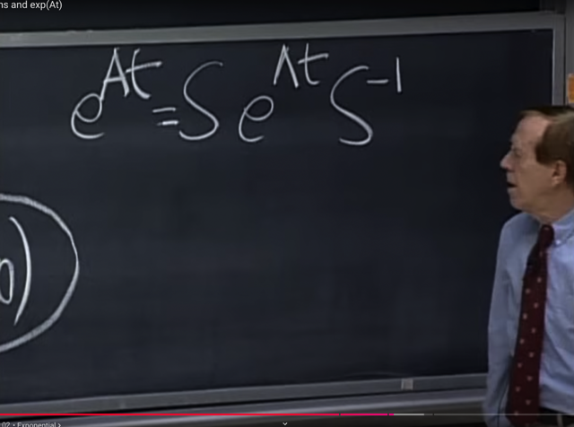</kbd></p>

> [!NOTE]
> và cái chính cần chứng minh là **e^(At)** `=` **S*e^(Λt)*Sinv**

<br>

<a id="node-797"></a>

<p align="center"><kbd></kbd></p>

> [!NOTE]
> Rồi, tương tự hồi nãy, ta sẽ dùng **triển khai hàm e^(At)** theo
> công thức **matrix exponential** (dựa vào **Taylor series** nhưng
> đối với matrix)

<br>

<a id="node-798"></a>

<p align="center"><kbd>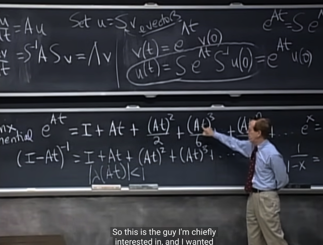</kbd></p>

> [!NOTE]
> đại khái là gs cho rằng, **khi eigenvalue của A nhỏ hơn 1** thì
> (At)**1, (At)**2, (At)**3 ....(At)**n sẽ nhỏ dần nhỏ dần và
> tổng trên sẽ converge về I `+` At

<br>

<a id="node-799"></a>

<p align="center"><kbd>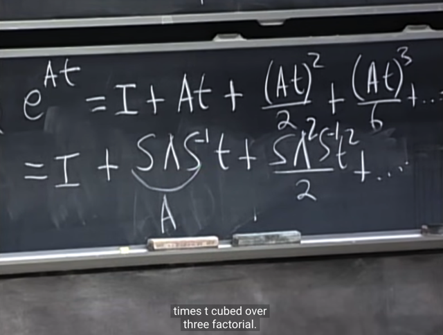</kbd></p>

> [!NOTE]
> rồi, gs quay lại với chuỗi e^(At) , nhớ là ta đang có giải
> thích tại sao **e^(At) lại chính là Se^(Λt)Sinv**

<br>

<a id="node-800"></a>

<p align="center"><kbd>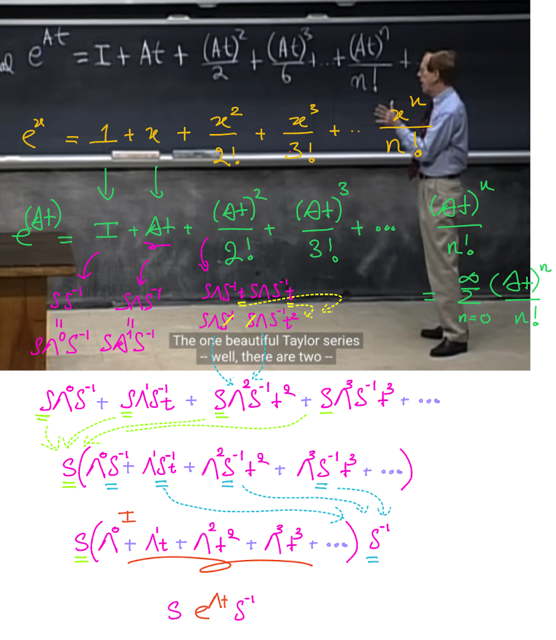</kbd></p>

🔗 **Related:** [LECTURE 23: DIFFERENTIAL EQUATIONS AND EXP(AT)](untitled.md#node-804)

> [!NOTE]
> Rồi, I gs viết thành S.Sinv luôn. Để rồi cái chuỗi này
> được  gs phân tách thành S (....) Sin thì cái dấu 3
> chấm chính là  e**Λt bởi vì lấy S bỏ ở đầu, Sinv bỏ ở
> cuối thì ở giữa mỗi term sẽ là:
>
> ```text
> I + Λ t  + Λ t^2 / 2 + Λ t^3 / 3! + ... (trong hình vẽ thiếu
> ```
> cái fraction `1/2!,` `1/3!`
>
> Và đây chính là e^(Λt)
>
> `====`
>
> Giải thích lại kĩ hơn:
>
> ```text
> Tới đây ta đã hiểu tại sao e^(At) = I + At + (At)^2/2! + (At)^3/3! + ...
> ```
>
> thế thì I `=` SSinv (cái này ko có gì phải bàn, cũng có thể ghi là SISinv `=` 
> SΛ^0Sinv, vì Λ^0 cũng là I)
>
> At `=` SΛSinvt vì A `=` SΛSinv, là phép diagonalization matrix A đã học
>
> ```text
> (At)2 thì = (At)(At) = (SΛSinv)(SΛSinv) = SΛSinvSΛSinv = SΛIΛSinv
> ```
> `=` SΛΛSinv `=` SΛ^2Sinv
>
> tương tự (At)^n `=` SΛ^nSinv
>
> ```text
> Vậy e^At = SΛ^0Sinv + SΛSinv + SΛ^2Sinv/2! + ...SΛ^nSinv/n!
> ```
>
> Lấy S ra để bên trái (đặt thừa số chung):
>
> ```text
> e^At = S(Λ^0Sinv + ΛSinv + Λ^2Sinv/2! + ...Λ^nSinv/n!)
> ```
>
> Lấy Sinv ra để bên phải (cũng đặt thừa số chung nhưng vì phép nhân
> matrix không có tính commutative nên phải giữ thứ tự):
>
> ```text
> e^At = S(Λ^0 + Λ + Λ^2/2! + ...Λ^n/n!)Sinv
> ```
>
> ```text
> và cái Λ^0 + Λ + Λ^2/2! + ...Λ^n/n! = I + Λ + Λ^2/2! + ...Λ^n/n! lại chính khai
> ```
> triển Taylor của e^Λt
>
> Vậy **e^At `=` Se^ΛtSinv**

<br>

<a id="node-801"></a>

<p align="center"><kbd>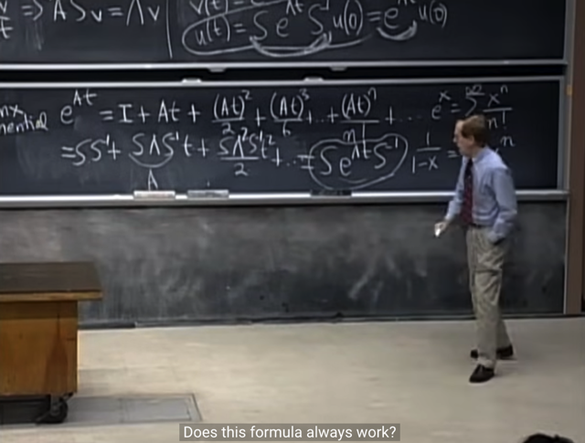</kbd></p>

> [!NOTE]
> Như vậy ta đã hiểu tại sao **e^(At)** lại chính là **S.e^(Λt). Sinv**

<br>

<a id="node-802"></a>

<p align="center"><kbd>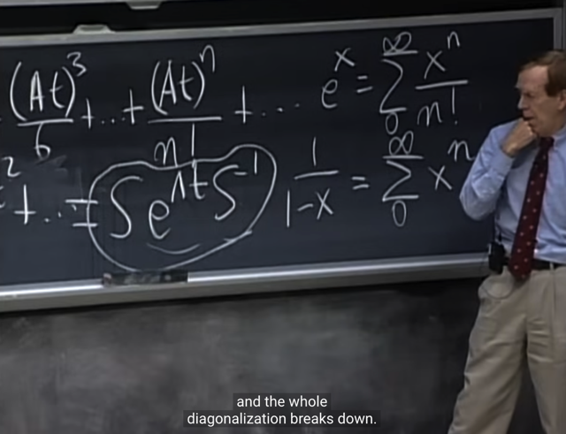</kbd></p>

> [!NOTE]
> đại khái gs nhắc nhở rằng điều này**chỉ đúng nếu A có thể
> diagonalizable** tức là **N INDEPENDENT EIGENVECTORS**
> thì mới có A `=` SΛSinv

<br>

<a id="node-803"></a>

<p align="center"><kbd>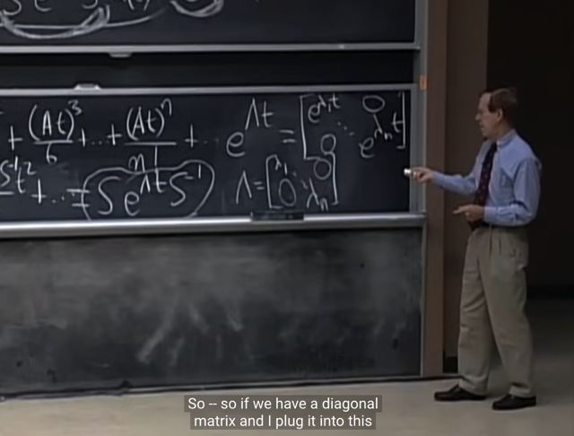</kbd></p>

> [!NOTE]
> và với e^(Λt) thì nó cũng là một **diagonal matrix**mà đường chéo là**[e^λ1t, e^λ2t....]**

<br>

<a id="node-804"></a>

<p align="center"><kbd>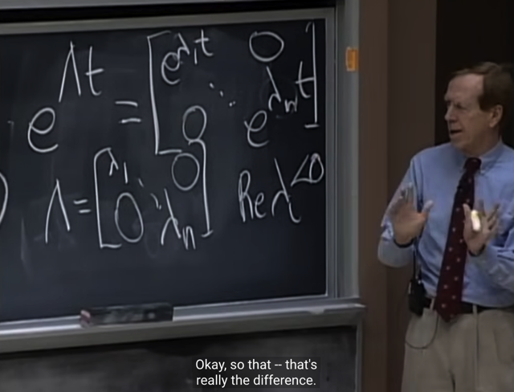</kbd></p>

🔗 **Related:** [LECTURE 23: DIFFERENTIAL EQUATIONS AND EXP(AT)](untitled.md#node-794)

🔗 **Related:** [LECTURE 23: DIFFERENTIAL EQUATIONS AND EXP(AT)](untitled.md#node-800)

🔗 **Related:** [LECTURE 23: DIFFERENTIAL EQUATIONS AND EXP(AT)](untitled.md#node-779)

> [!NOTE]
> thế thì tóm gọn lại nãy giờ ta đã chứng minh general
> solution của `du/dt` `=` Au, là u `=` e^(At)*u(0)
>
> sau đó ta cũng chứng minh rằng e^(At) `=` `S*e^(Λt)*S_inv`
>
> từ đó u `=` `S*e^(Λt)*S_inv` u(0) `=` `S*e^(Λt)*S_inv*S*c` =**S*e^(Λt)*c**
> Thế thì, mục đích là lặp lại những kết luận hồi nãy với ví dụ cụ
> thể matrix A 2x2
>
> u(t) `=` c1*(e^λ1*t)*x1 `+` c2*(e^λ2t)*x2, 
>
> thì đây cũng chính là **S*e^(Λt)*c**, với S là eigenvector matrix,
> Λ là eigenvalues diagonal matrix và c là (c1 c2)

<br>

<a id="node-805"></a>

<p align="center"><kbd>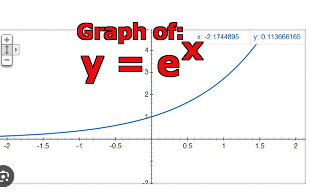</kbd></p>

<p align="center"><kbd></kbd></p>

<p align="center"><kbd>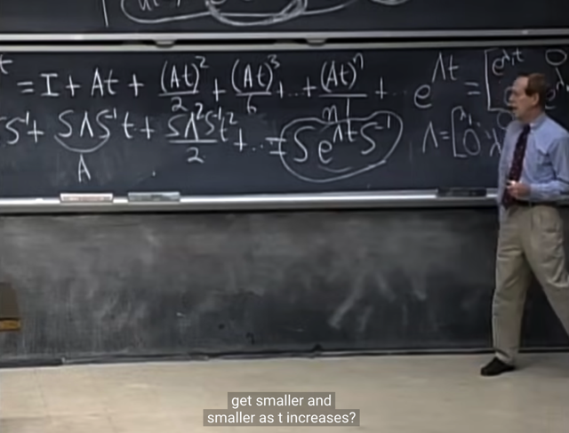</kbd></p>

> [!NOTE]
> Và sau đó với dạng khái quát này, ta trả lời lại câu hỏi **khi
> nào thì u(t) ngày càng nhỏ đi khi t tăng lên**.
>
> Thì qua việc phân tách vừa rồi:
>
> **u(t) `=` e^(At) `=` S*e^(Λt)*Sinv**,
>
> thì ta thấy S và Sinv thì không đổi, vì n**ó không dính đến
> t**. Chỉ có e^(Λt) `=` diagonal matrix các eigenvalue là dính
> đến t.
>
> Như vậy nếu **muốn giá trị u(t) ngày càng nhỏ** khi các giá
> trị t tăng lên thì**e(Λt) phải `->` 0** và đồng nghĩa các **e^λ1t,
> e^λ2t.... tiến tới 0**. Và muốn vậy các **lambda phải âm**
> (hoặc có phần thực âm nếu lambda là số phức) vì khi đó
> e^lambda*t sẽ `->` 0 theo tính chất hàm exponential

<br>

<a id="node-806"></a>

<p align="center"><kbd>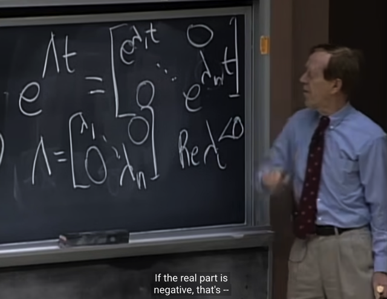</kbd></p>

> [!NOTE]
> Hay cụ thể hơn là p**hần thực của lambda**
> phải âm: Re lambda < 0

<br>

<a id="node-807"></a>

<p align="center"><kbd>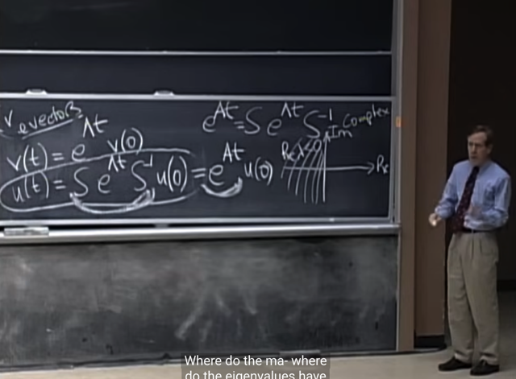</kbd></p>

> [!NOTE]
> và gs vẽ minh hoạ cho trường hợp này, trên hai trục thực
> và phức. Thì lambda phải **nằm bên phần mà giá trị thực 
> có giá trị âm**

<br>

<a id="node-808"></a>

<p align="center"><kbd>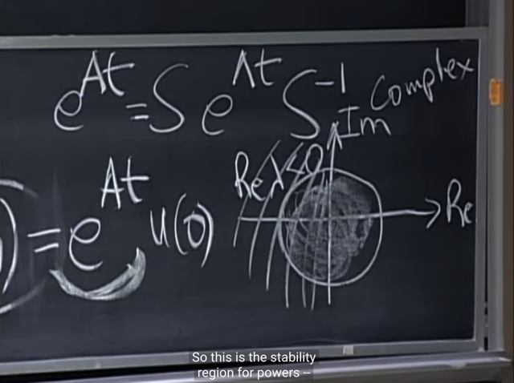</kbd></p>

> [!NOTE]
> còn với bài toán hồi nãy trước yêu cầu eigenvalue phải có trị
> tuyệt đối nhỏ hơn 1 thì mô phỏng bằng hình tròn này

<br>

<a id="node-809"></a>

<p align="center"><kbd>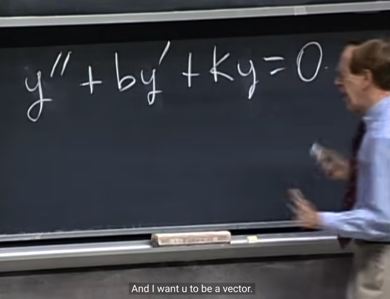</kbd></p>

> [!NOTE]
> ví dụ cuối gs cho **MỘT phương trình vi phân bậc 2**
> (second order differential equation)
>
> Yêu cầu của ta tương tự như bài toán Fibonacci là cần
> **đưa nó về HỆ phương trình vi phân bậc 1** (system of first
> order differential equations)

<br>

<a id="node-810"></a>

<p align="center"><kbd>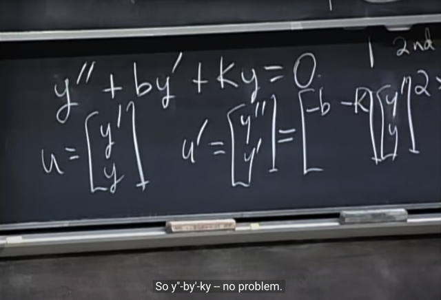</kbd></p>

> [!NOTE]
> vậy thì ở đây ta cũng đặt **u `=` [y' y].T** và **u' `=` [y'' y']**cần được liên hệ với u bởi một matrix A
>
> Thì từ equation ta có **y'' `=` `-by'` `-` ky** 
>
> Dễ thấy nó là product của `[-b` `-k]T` và [y' y].T
>
> từ đó dễ hiểu row 1 của A sẽ là `[-b` `-k]`

<br>

<a id="node-811"></a>

<p align="center"><kbd>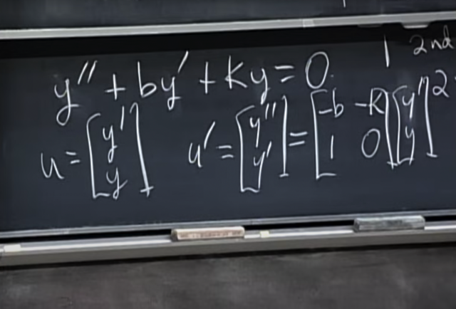</kbd></p>

> [!NOTE]
> còn row 2 của matrix, ta có thể chỉ cần dùng [1 0] để liên hệ
> y' với [y' y]: y' `=` [1 0].[y' y]T
>
> Từ đó ta chuyện một phương trình vi phân bậc 2: y'' `+` by' `+`
> ky `=` 0
>
> Thành hệ hai phương trình vi phân bậc 1:
>
> u'1 `=` u2
> u'2 `=` `-bu2` `-` ku1
>
> ```text
> Hay ở dạng matrix u = [u1 u2], u' = Au A = [-b -k; 1 0]
> ```

<br>

<a id="node-812"></a>

<p align="center"><kbd>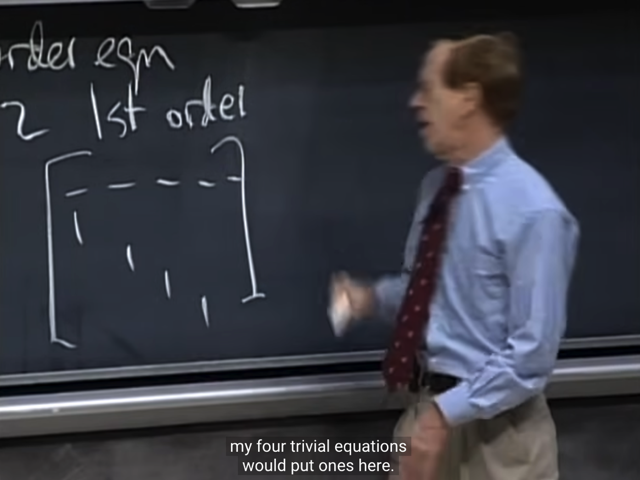</kbd></p>

> [!NOTE]
> và **khái quát lên** giả sử ta có một **5th order differential
> equation** thì ta có thể  chuyển nó thành HỆ 5 phương
> trình bậc 1 từ đó xây dựng matrix A 5x5 như sau: **row 1
> sẽ là các coefficient của các equation**, ví dụ như trong ví
> dụ vừa rồi, nó là `-b,` `-k,` là các giá trị đến từ phương trình
> ban đầu.
>
> Còn các r**ow khác là các `"one-hot"` vector.**

<br>

<a id="node-813"></a>

<p align="center"><kbd></kbd></p>

> [!NOTE]
> Và bằng cách này, ta có thể chuyển một phương trình vi
> phân bậc 5 (5tf order equation) thành system of 5 1st
> order equation
>
> và gs kết lại đây là bài giảng liên quan đến PHƯƠNG
> TRÌNH VI PHÂN, tương tự như phần trước ta giải bài
> toán liên quan đến LŨY THỪA CỦA MATRIX, thì bài này
> ta giải bài toán liên quan EXPONENTIAL CỦA MATRIX

<br>

