# Lecture 24: Markow Matrices; Fourier Series

📊 **Progress:** `38` Notes | `39` Screenshots

---
<a id="node-843"></a>

<p align="center"><kbd></kbd></p>

> [!NOTE]
> bài giảng này sẽ là về ứng dụng của eigenvector, cụ thể là
> trong **Markov matrices**
>
> Và **Fourier series** of projections

<br>

<a id="node-844"></a>

<p align="center"><kbd>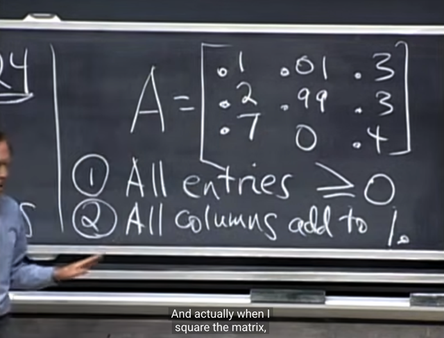</kbd></p>

> [!NOTE]
> Đầu tiên thế nào là **Markov matrix**: gs cho biết nó sẽ liên
> quan đến ý tưởng về **xác suất**, do đó, nó có 2 tính chất
> sau:
>
> i) **mọi entry đều không âm**
>
> ii) **tổng các entries trong mỗi column đều bằng 1**(không
> phải là tổng các column thành vector [1 1 ..] nhé)
>
> Và gs cho biết hai tính chất này sẽ **giữ nguyên** khi ta
> **bình phương matrix lên**, nên **A^2 cũng là Markov matrix**

<br>

<a id="node-845"></a>

<p align="center"><kbd>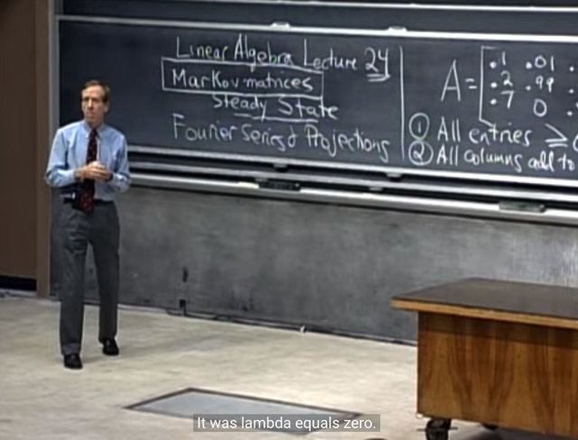</kbd></p>

🔗 **Related:** [LECTURE 23: DIFFERENTIAL EQUATIONS AND EXP(AT)](untitled.md#node-783)

> [!NOTE]
> Đại khái là gs nhắc lại bữa trước đã làm qua một ví dụ
> về phương trình vi phân mà có hai eigenvalue, trong đó
> **một eigenvalue `=` 0** giúp **e^0 `=` 1** khiến cho u(t) có
> một term **mang giá trị hằng số**, và một term còn lại thì
> **lambda âm** khiến khi t lớn lên thì exponential của cái
> đó sẽ `->` e^[trừ vô cùng] `=` 0
>
> Do đó **để có trạng thái steady state** (hàm số theo t có
> giá trị ổn định) thì cần có **một eigenvalue `=` 0**, và những
> c**ái còn lại âm (hoặc phần thực âm)**
>
> Còn trong trường hợp của power case (tức là deal với
> lũy thừa của matrix) thì, bài trước nữa ta đã thấy rằng
> để có trạng thái steady ta sẽ **cần eigenvalue có giá trị `=`
> 1** (vì nếu nó < 1 thì sẽ dẫn tới tình trạng nhỏ dần, còn
> nếu > 1 thì nó sẽ lớn dần)

<br>

<a id="node-846"></a>

<p align="center"><kbd>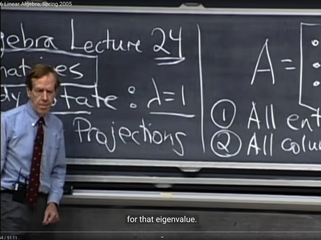</kbd></p>

> [!NOTE]
> và gs cho biết thực tế steady state c**hính là
> eigenvector ứng với lambda `=` 1**

<br>

<a id="node-847"></a>

<p align="center"><kbd></kbd></p>

> [!NOTE]
> tiếp gs cho biết với Markov matrix vì tính chất**tổng
> các cols bằng 1**, nên **ta sẽ thấy** eigenvalue của nó
> bằng 1

<br>

<a id="node-848"></a>

<p align="center"><kbd>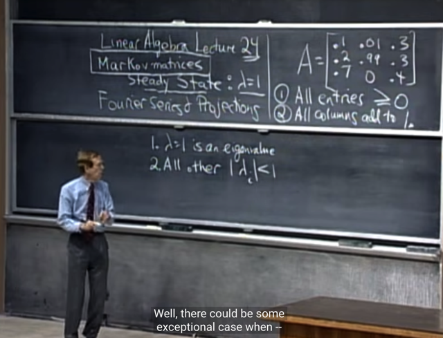</kbd></p>

> [!NOTE]
> cụ thể là, nó **sẽ có ít nhất một eigenvalue `=` 1**.
> Và **những cái còn lại sẽ đều `<=` 1**

<br>

<a id="node-849"></a>

<p align="center"><kbd>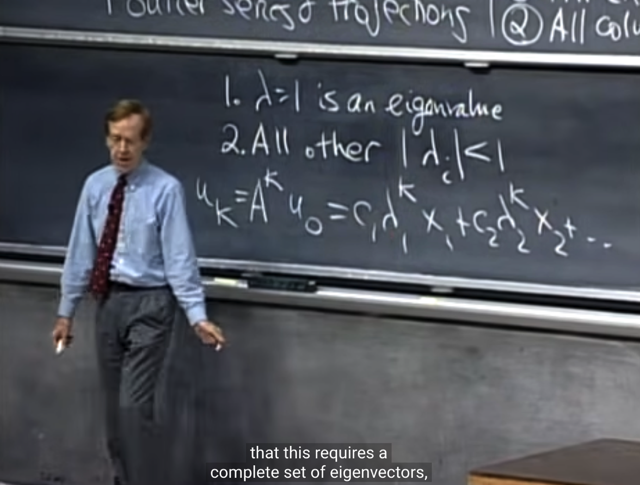</kbd></p>

🔗 **Related:** [LECTURE 22: DIAGONALIZATION AND POWERS OF A](untitled.md#node-745)

> [!NOTE]
> Và như bài trước ta cũng đã biết về việc khi ta cứ **nhân
> với A nhiều lần** 
>
> ```text
> u(1) = Au(0), u(2)=Au(1)=A^2u(0).....u(k) = A^ku(0))
> ```
>
> Thì công thức khái quát là như vầy (đã biết ở bài trước)
>
> Ôn lại một chút về lập luận làm sao mà có cái này:
>
> Cho rằng A tồn tại đủ bộ n eigenvector độc lập x1,x2..xn
> Thì u(0) là **linear combination các eigenvector x1, x2..**
> bởi bộ **coefficients** `c=[c1,` c2....] Thể hiện theo matrix:
>
> u(0) `=` Sc
>
> Vì A có **N INDEPENDENT EIGENVECTORS**, vốn là các 
> vector của Rn (và cả Rm, vì đã nói về eigenvector thì A phải 
> square: m `=` n), nên chúng **SPAN TOÀN BỘ Rn**, và vì vậy 
> mọi Rn vector u đều có thể thể hiện bởi linear combination 
> các eigenvectors.
>
> Thế thì u(1) `=` Au(0) `=` **AS**c, mà **AS `=` SΛ** (A diagonalizable)
>
> Nên u(1) `=` **AS**c `=` **SΛ**c
>
> ```text
> Tương tự u(2) = Au(1) = ASΛc = SΛΛc = SΛ^2c
> ```
>
> Và **u(k) `=` SΛ^kc**
>
> Và vì Λ Là**diagonal matrix**(các item trên đường chéo
> là eigenvalue của A). Do đó (Λ^k)c sẽ là vector như sau:
>
> **[c1*λ1^k, c2*λ2^k......cn*λn^k].T**
>
> Và do đó u(k) `=` S[c1*λ1^k, c2*λ2^k......cn*λn^k]T
>
> sẽ là linear combination các columns của S (các vector x1, x2.. 
> ) với các coefficients là c1*λ1^k, c2*λ2^k......cn*λn^k: 
>
> **c1*λ1^k*x1 `+` c2*λ2^k*x2......+cn*λn^k*xn**

<br>

<a id="node-850"></a>

<p align="center"><kbd>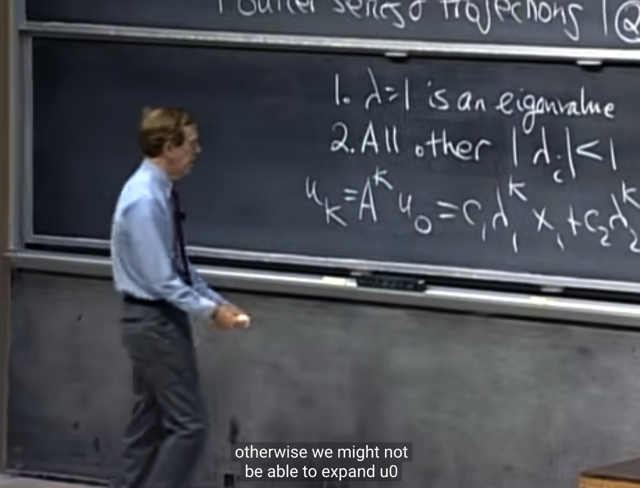</kbd></p>

> [!NOTE]
> và gs nhắc lại rằng, TA PHẢI ĐẢM BẢO LÀ HIỂU RẰNG
> ĐIỀU NÀY**CHỈ ĐÚNG** NẾU NHƯ **A CÓ ĐỦ N
> EIGENVECTOR INDEPENDENT**. Và như đã biết, ta chỉ có
> điều này nếu:
>
> i) Các eigenvalue **đều khác nhau (không có repeat
> eigenvector)**.
>
> ii) Nếu điều i) không thỏa thì **phải check lại**, vì **đôi khi**
> ngay cả khi các **eigenvalue không distinct** thì ta vẫn có thể
> có n eigenvector độc lập.
>
> Chỉ khi có n **INDEPENDENT EIGENVECTOR** thì mới cho
> phép phép diagonalization: AS `=` SΛ

<br>

<a id="node-851"></a>

<p align="center"><kbd>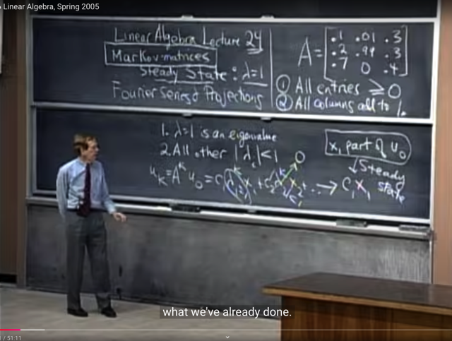</kbd></p>

> [!NOTE]
> Và như đã nói hồi nãy, cũng như từ bài trước, ta biết **muốn
> giá trị của u(k)** khi **k tăng lên vô hạn**, trở nên **steady** thì
> yêu cầu **phải có một eigenvalue `=` 1**, và các **eigenvalue
> còn lại** thì **nhỏ hơn 1.**
>
> Thế thì u(k) `=` **c1*λ1^k*x1** `+` `c2*λ2^k*x2......+cn*λn^k*xn`
>
> Ta hiểu là gs cho rằng cái lambda `=` 1 đó là λ1, còn các
> lambda khác thì đều nhỏ hơn 1. Nên khi k lớn, λ_j^k sẽ
> nhỏ dần nhỏ dần thành 0.
>
> Và giá trị của **u(k) sẽ converge về c1x1** chính là cái "phần"
> ứng với λ1 
>
> Thì cái **steady state sẽ chính là c1x1**

<br>

<a id="node-852"></a>

<p align="center"><kbd></kbd></p>

<p align="center"><kbd></kbd></p>

<p align="center"><kbd></kbd></p>

> [!NOTE]
> Và gs cho biết trong lecture này, ta còn xét trường hợp
> mà các **component của eigenvector có giá trị không âm**

<br>

<a id="node-853"></a>

<p align="center"><kbd>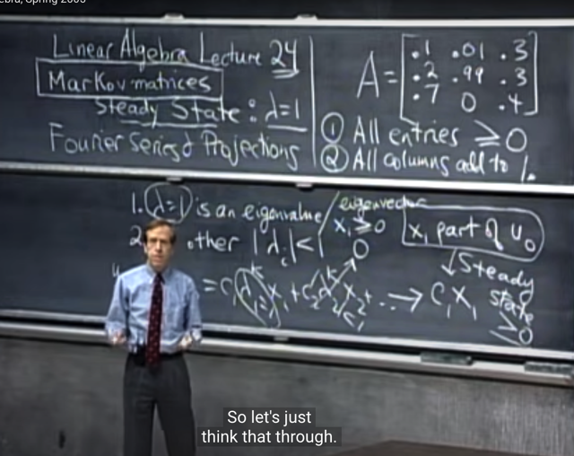</kbd></p>

> [!NOTE]
> Tiếp theo, ta sẽ xem xét tại sao, với **Markov** **matrix**, khi
> các **item trong cols có tổng bằng 1** thì lại khiến ta có
> **eigenvalue `=` 1?**

<br>

<a id="node-854"></a>

<p align="center"><kbd>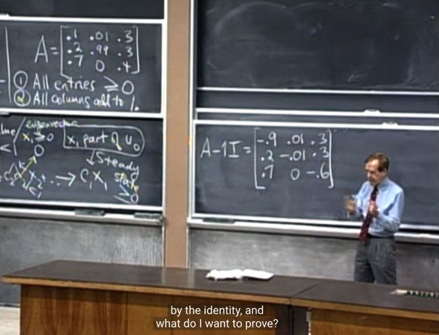</kbd></p>

> [!NOTE]
> Thế thì lập luận như sau: Để **chứng minh eigenvalue của A
> là 1**, thì theo định nghĩa eigenvalue, ta sẽ có **det(A-1*I) `=`
> 0**
>
> Do đó ta cần **chứng minh matrix (A `-` 1*I) này SINGULAR.**
>
> (review một chút, là bởi vì phát xuất từ định nghĩa của
> eigenvector và eigenvalue là Ax `=` λx, nên tương đương
> ```text
> (A-λI)x = 0 => x là vector nonzero trong nullspace của A-λI,
> ```
> mà để điều này xảy ra thì `A-λI` phải singular thì dimension
> của nullspace mới khác 0. Từ đó giúp ta thiết lập điều kiện
> để tìm λ: là `det(A-λI)` `=` 0 (vì singular matrix có det `=` 0)
>
> Vậy gs hỏi tại sao (A `-` 1*I) lại SINGULAR?

<br>

<a id="node-855"></a>

<p align="center"><kbd>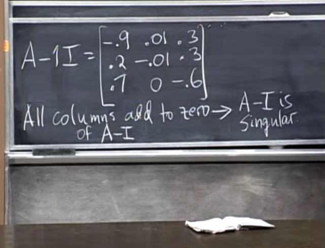</kbd></p>

> [!NOTE]
> Thế thì gs nói rằng ta có thể nhận xét thấy matrix này có
> **TỔNG CÁC ROWS `=` 0** (tí nữa có thể ta sẽ giải thích tại
> sao sau), thì tại sao từ đó cho ta được phép kết luận A `-` I
> SINGULAR?
>
> Me: Câu này đơn giản là bởi nếu tổng các row là 0, thì
> cũng đồng nghĩa là **có thể biểu diễn một row nào đó**
> bằng **linear combination các row còn lại** với **bộ
> coefficient khác zero**. Như vậy đồng nghĩa **các row
> không independent**. Từ đó có thể kết luận matrix không
> `full-rank` `->` **SINGULAR**Vậy ta hiểu rằng vì Markov matrix có tổng mỗi cột đều
> bằng 1, nói cách khác là tổng các hàng sẽ thành 1 hàng
> toàn số 1, thành ra nếu trừ mỗi cột đi cho 1, thì tổng các
> entries trong mỗi cột sẽ bằng 0, đồng nghĩa tổng các hàng
> sẽ thành một hàng toàn 0 `=>` kết luận ngay các row phụ
> thuộc nhau `->` singular matrix

<br>

<a id="node-856"></a>

<p align="center"><kbd>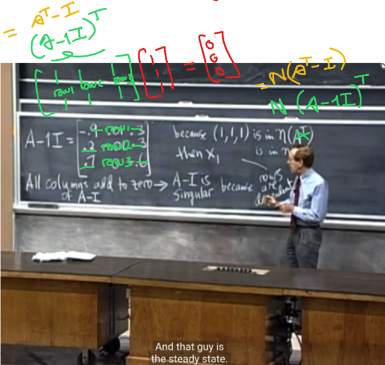</kbd></p>

<p align="center"><kbd></kbd></p>

<p align="center"><kbd>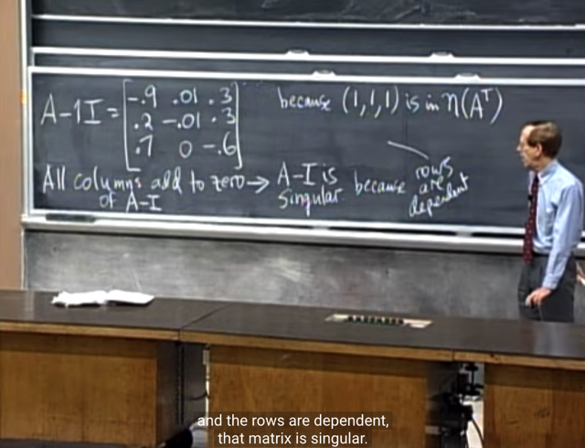</kbd></p>

🔗 **Related:** [LECTURE 24: MARKOW MATRICES; FOURIER SERIES](untitled.md#node-861)

> [!NOTE]
> Gs: correct, nói cách khác, (**1,1,1)** **nằm trong nullspace
> của (A-I)T,**ý là việc tổng các hàng bằng 0, có nghĩa là
> combine các hàng với bộ coefficient (1,1,1) `=` 0, thì đây
> cho thấy (1,1,1) là solution của `(A-I)Ty` `=` 0 `=>` đó chính là một
> basis vector của left nullspace của `(A-I)` 
>
> **Mà việc nullspace hay left nullspace có vector khác 0
> giúp suy ra ngay matrix này SINGULAR**
>
> Vì sao, vì ta đã nghe gs nói về khái niệm **singular** là khi
> matrix **BIẾN MỘT `NON-ZERO` VECTOR THÀNH 0**, thể
> hiện bởi việc **tồn tại vector khác 0** trong nullspace, hoặc
> left nullspace. Nên matrix `non-singular,` invertible chỉ khi
> **không có `non-zero` vector nào bị biến thành 0 bởi A** (tức
> `Ax=0)` **hoặc AT** (tức ATy `=` 0).****
>
> ```text
> Nên nếu gọi u = (1,1,1) thì (AT-I)u = 0 <=> ATu-u = 0
> ```
> `<=>` ATu `=` u, điều này suy ra u `=` (1,1,1) LÀ EIGENVECTOR 
> CỦA AT, VỚI EIGENVALUE `=` 1
>
> (*): Chỗ này có vẻ như gs đang ghi nhầm là N(AT), bởi vì rõ
> ràng là ta đang xét matrix (A `-` I)

<br>

<a id="node-857"></a>

<p align="center"><kbd>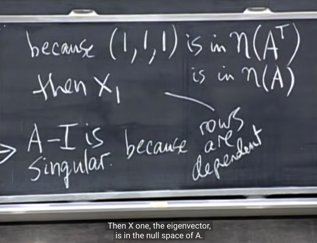</kbd></p>

> [!NOTE]
> Gs hỏi tiếp, ta đã biết (1,1,1) là **nằm trong nullspace of
> AT-I** và là eigenvector của AT (với eigenvalue `=` 1) thế thì
> **cái gì trong nullspace của A `-` I**
>
> Thì có thể lập luận thế này: Vì `(A-I)T` SINGULAR, nên dĩ
> nhiên `A-I` cũng SINGULAR nên cũng tồn tại `non-zero` vector
> bị biến thành 0 bởi `(A-I):`
>
> ```text
> (A - I)x1 = 0 <=> Ax1 = x1
> ```
>
> Thành ra eigenvector của A **x1 chính là nằm trong
> NULLSPACE CỦA (A `-` I)**

<br>

<a id="node-858"></a>

<p align="center"><kbd>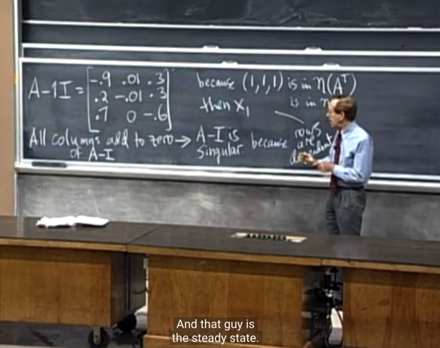</kbd></p>

> [!NOTE]
> Gs: **Các cols cũng dependent**, và tồn tại ít nhất **1 bộ
> coefficient khiến linear combination của chúng `=` 0**, và
> một bộ đó chính là **components của x1**

<br>

<a id="node-859"></a>

<p align="center"><kbd>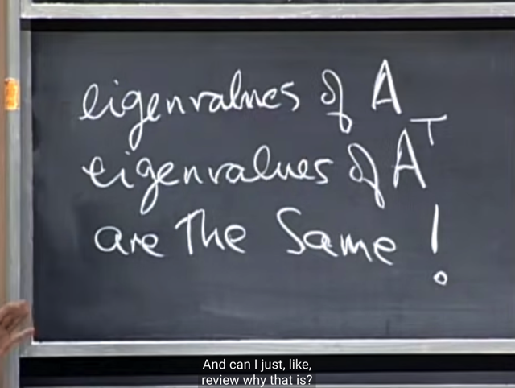</kbd></p>

> [!NOTE]
> Tiếp gs nói rằng vì eigenvalue không phải lúc nào
> cũng dễ tìm nên sẽ thuận tiện hơn nếu ta biết một số
> sự thật. Ví dụ **eigenvalue của A và AT là giống nhau**

<br>

<a id="node-860"></a>

<p align="center"><kbd>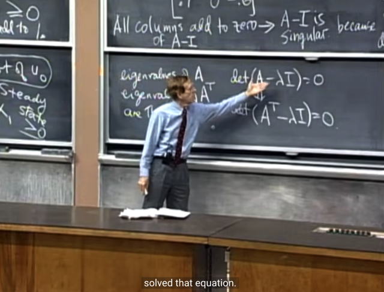</kbd></p>

> [!NOTE]
> Lập luận là: vì **λ là eigenvalue của A**thì ta có **det (A `-` λI)
> `=` 0**, mà theo property #10 của determinant bữa trước ta đã
> biết là **det A `=` det AT**
>
> Dẫn tới: **det (A `-` λI)T cũng bằng 0.**
>
> ```text
> Mà (A - λI)T = AT - (λI)T = AT - λI
> ```
>
> Vậy det (AT `-` λI) `=` 0
>
> Và điều này chứng tỏ AT `-` λI là SINGULAR matrix Dẫn
> đến, tồn tại `non-zero` vector trong nullspace của nó, gọi nó là
> x, ta có (AT `-` λI)x `=` 0 hay, ATx `=` λx
>
> ATx `=` λx **chứng tỏ λ CŨNG LÀ EIGENVALUE CỦA AT**

> [!NOTE]
> EIGENVALUE CỦA A VÀ AT GIỐNG NHAU

<br>

<a id="node-861"></a>

<p align="center"><kbd>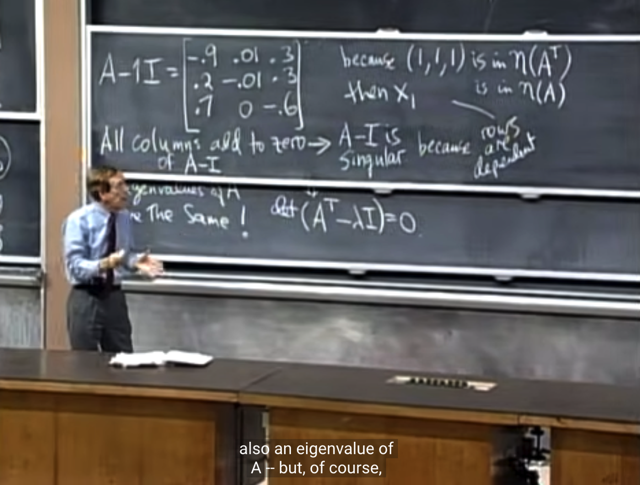</kbd></p>

🔗 **Related:** [LECTURE 24: MARKOW MATRICES; FOURIER SERIES](untitled.md#node-856)

> [!NOTE]
> Và vì ta đã biết **1 là eigenvalue của A**T với
> **eigenvector u `=` (1,1,1)**
>
> Nên suy ra **1** **CŨNG LÀ EIGENVALUE CỦA A** (*)
> nhưng đương nhiên **eigenvector sẽ khác**, không phải là
> (1, 1,1). Và ta sẽ tìm nó bằng cách tìm một vector trong
> nullspace của A `-` I.
>
> Vì x khiến `(A-I)x` `=` 0 tức là Ax `=` x thì x chính là
> eigenvector ứng với eigenvalue `=` 1 nói trên
>
> `====`
>
> Chú thích (*): Chỗ này có vẻ hơi dư, bởi lẽ bằng việc
> chứng minh **matrix A `-` 1*I singular** đã suy ra **det (A-1*I)**
> ```text
> = 0 => tồn tại x khiến (A -1*I)x = 0 hay Ax = x, đồng
> ```
> nghĩa là x chính là eigenvector của A với eigenvalue `=` 1
> rồi. Đâu có cần phải dựa vào việc biết eigenvalue của AT
> rồi suy ra nó cũng là eigenvalue của A

<br>

<a id="node-862"></a>

<p align="center"><kbd>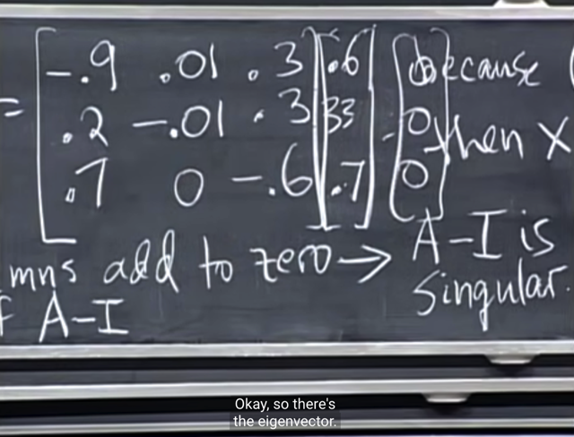</kbd></p>

> [!NOTE]
> Tiếp theo, đại khái là gs **nhẩm tìm một vector** của **nullspace**
> of (A `-` I) và nó là **(0.6, 33, 0.7)** 
>
> Thì đây là x1, **eigenvector của A** ứng với **eigenvalue `=` 1**
> và như đã nói nó nằm trong nullspace của `A-I`

<br>

<a id="node-863"></a>

<p align="center"><kbd>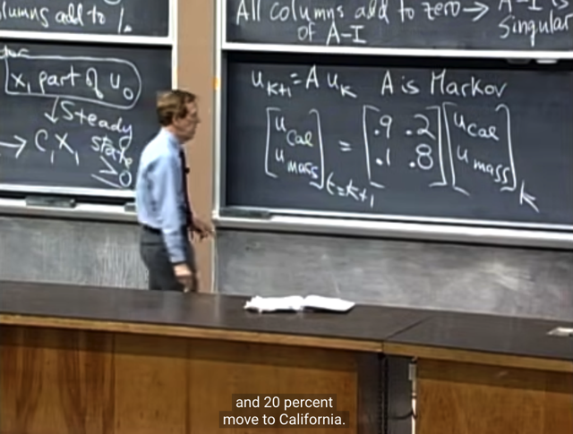</kbd></p>

> [!NOTE]
> đại khái là, gs lấy một ví dụ về **bài toán `u_k+1` `=` A.u_k**
> giống như bữa trước. Và dùng một ví dụ để mô phỏng
> một bài toán thực tế đó là, ..kiểu như mà matrix A sẽ mang
> thông tin thể hiện fraction `/` **tỉ lệ dân cư di cư từ bang
> California đến Masachuset và ngược lại**.
>
> Ví dụ cột thứ nhất của matrix A `=` [0.9 0.1] sẽ thể hiện
> rằng **u_cal `(k+1)` sẽ bằng 0.9 `u_cal` (k)** có nghĩa là cứ mỗi
> năm chỉ còn **0.9*u_cal** và**0.1*u_cal** sẽ add thêm vào 
> `u_mass.`
>
> Tương tự, mỗi năm, sẽ có **0.2*u_mass** được **add vào u_cal**
> và **0.8 `u_mass` ở lại u_mass.**

<br>

<a id="node-864"></a>

<p align="center"><kbd>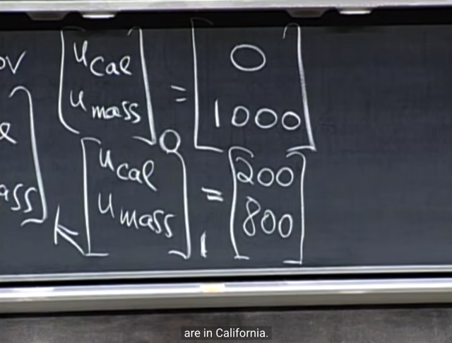</kbd></p>

> [!NOTE]
> Và câu hỏi là ví dụ từ trạng thái ban đầu, ví dụ như mọi
> người đều tập trung tại Massachuset, thì **sau 100 năm
> dân số sẽ phân bổ như thế nào**?
>
> Ví dụ như sau năm đầu tiên, sẽ là như thế này:
>
> 0*[.9, .1]T `+` 1000*[.2, .8]T `=` [200, 800]T
>
> Và để tính cho `u_100,` ta sẽ**nhân đi nhân lại matrix A**
> Như đã biết ta sẽ **cần phân tích Eigenvalue và Eigenvector
> của A**

<br>

<a id="node-865"></a>

<p align="center"><kbd>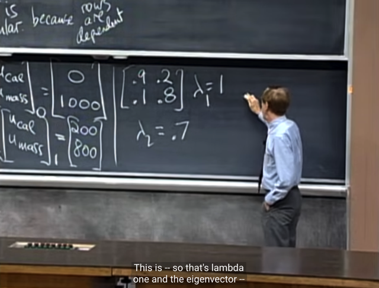</kbd></p>

> [!NOTE]
> Thế thì như đã biết với Markow matrix, có **một
> eigenvalue bằng 1**,
>
> Và từ **trace (tổng đường chéo)** =**tổng eigenvalue** 
> `=` .9 `+` .8 `=` **1.7 suy ra eigenvalue còn lại là 0.7**

<br>

<a id="node-866"></a>

<p align="center"><kbd>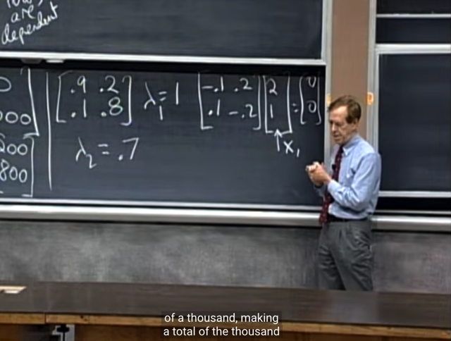</kbd></p>

> [!NOTE]
> Thế thì với**eigenvalue `=` 1**, thế vô ta có matrix (A `-` I) như vầy. Và
> có thể dễ thấy **[2 1] là solution của `(A-I)x` `=` 0**, hay nói cách khác
> nó chính là eigenvector gắn với eigenvalue `=` 1
>
> Từ đó, như lúc nãy cũng đã phân tích, eigenvector gắn với
> **eigenvalue `=` 1** này chính là cái tham gia **trở thành steady state**.
> (u(t) sẽ converge về chỉ còn c1x1)
>
> Tất nhiên sẽ**cần tìm thêm coefficient c1** nữa để c1x1 là **steady
> state**
>
> ```text
> (nhắc lại vì u_k = Au_0 sẽ trở thành c1*λ1^k*x1 + c2*λ2^k*x2 + ...,
> ```
> và khi `k->` infi thì với λ1 `=` 1, λ khác < 1 thì giá trị của chuỗi 
> sẽ **converge về c1x1**)
>
> Nhưng dù gì,**c1x1**sẽ quy định rằng tỉ lệ trong 1000 bao nhiêu
> sẽ ở Cali, bao nhiêu sẽ ở Massachuset và nó chính là cho ta biết
> **khi k `=` [lớn vô cùng] thì giá trị sẽ là bao nhiêu**.
>
> Còn về việc tại sao `u_k` lại bằng c1*λ1^kx1 `+` c2*λ2^k*x2... thì
> ôn nhanh thế này: 
>
> Đầu tiên ta biểu diễn **u_0** thuộc **Rn** là **linear combination 
> của các eigenvectors basis** (vì nếu thỏa điều kiện matrix A có
> **đủ n independent eigenvectors** thì nó sẽ tạo một **basis span toàn bộ
> Rn**):
>
> ```text
> u_0 = c1x1 + c2x2 + ... = Sc
> ```
>
> ```text
> Rồi sau đó, u_1 = Au_0 = ASc = SΛc
> ```
>
> ```text
> tiếp, u_2 = Au_1 = ASΛc = SΛΛc = SΛ^2c
> ```
>
> tương tự vậy ta sẽ có `u_k` `=` SΛ^Kc và triển khai ra lại thì chính
> là c1.λ1^k.x1 `+` c2.λ2^k.x2 `+` ....

<br>

<a id="node-867"></a>

<p align="center"><kbd>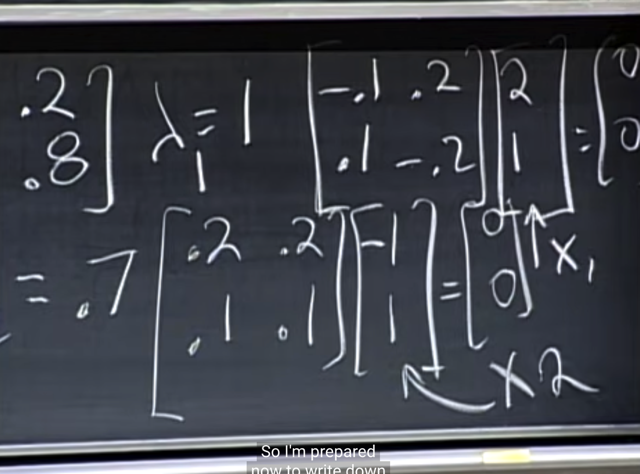</kbd></p>

> [!NOTE]
> Vậy như đã nói **c1x1** cho ta biết khi **k lớn vô cùng**
> **u_infinity**
>
> Còn để **tìm u_100** thì ta**vẫn cần tìm eigenvector (vì
> khi đó k chưa đủ lớn để "cái phần tham gia của x2" bị
> bay màu do**λ2^100 chưa thành 0
>
> Thế λ2 vào, và cũng không khó để tìm thấy eigenvector
> x2 `=` `[-1` 1].T
>
> (Lập luận nhanh như sau: đương nhiên col1 là pivot col,
> col 2 là free col, cho free variable `=` 1, thế vào tìm pivot
> var ra `-1` `->` `[-1` 1] là special solution và chính là basis
> của nullspace của `A-λ2I` và cũng chính là eigenvector
> x2 của A)

<br>

<a id="node-868"></a>

<p align="center"><kbd>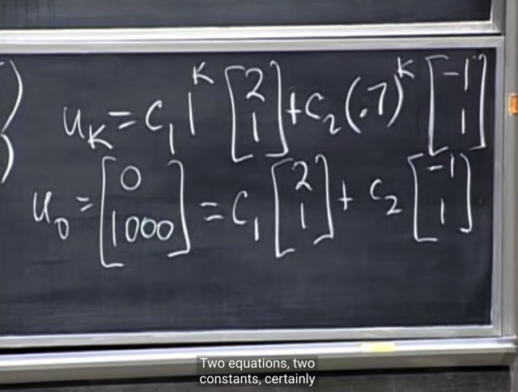</kbd></p>

> [!NOTE]
> Từ đó ta có `u_k.` Và như đã biết ta sẽ **dựa vào `u_0`
> để tìm c1, c2: `u_0` `=` Sc**. Khi đó ta có thể tính `u_100`

<br>

<a id="node-869"></a>

<p align="center"><kbd>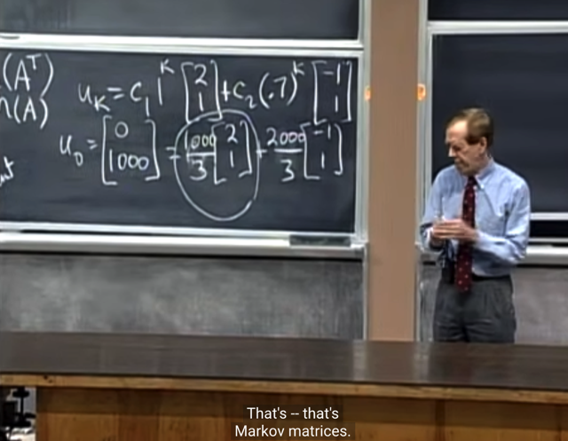</kbd></p>

> [!NOTE]
> Gs cho biết **một số trường hợp** ta có thể thấy họ
> **dùng Markow matrix mà row cộng lại thành 1** thay
> vì cols.

<br>

<a id="node-870"></a>

<p align="center"><kbd>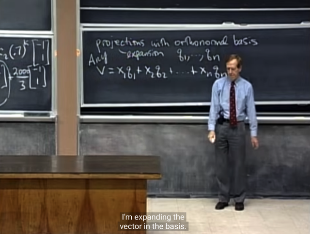</kbd></p>

> [!NOTE]
> Gs nói qua**projection với orthonormal basis**.
>
> Ta có set **n orthonormal basis vector q1, q2...qn** với các
> vector đều có **n components**. Có nghĩa là đương nhiên ta
> có trạng thái **n vector này span the whole space Rn**.
>
> Và như đã biết **bất kể vector v nào trong Rn** cũng có thể
> được biểu diễn bởi một **linear combination các basis
> vectors**.
>
> Và đại khái là ta sẽ**quan tâm** đến việc **TÌM các coefficient
> x1, x2**...**xn** (chú ý lúc này x1, x2.. là các coefficient, các 
> scalar không phải như hồi nãy là chỉ các eigenvector) này, 
> mang ý nghĩa là: 
>
> **PROJECT vector v VÀO SPACE Rn** 
>
> nhưng **cũng có thể hiểu theo nghĩa** là: 
>
> **EXPAND VECTOR v THÀNH CÁC PHẦN ỨNG VỚI CÁC 
> BASIS VECTOR q1, q2...qn**v `=` x1q1 `+` x2q2 `+` ...xnqn (nhắc lại, x1,x2 chưa biết, đang tìm)

> [!NOTE]
> PROJECTION WITH
> ORTHONORMAL BASIS

<br>

<a id="node-871"></a>

<p align="center"><kbd>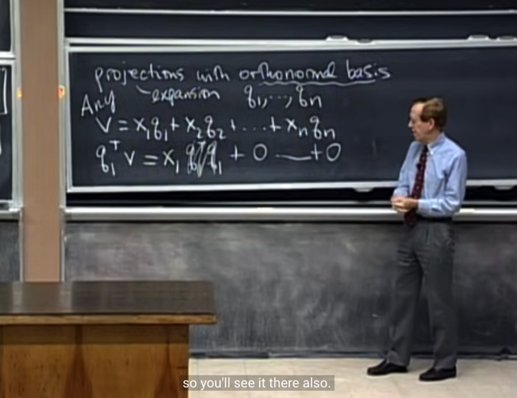</kbd></p>

> [!NOTE]
> Thế thì gs nói rằng tất nhiên ta cũng có thể dùng cách
> tiếp cận bữa trước `-` **project một vector lên subspace**
> (**cols space của A**, hay Q trong trường hợp một matrix
> có các cols orthonormal).
>
> Nhưng kiểu như gs muốn **add thêm comment** vào
> **trường hợp đặc biệt** này, khi ta có một **subspace
> span bởi một bộ orthonormal** và **"ĐẦY ĐỦ"** (ý nói **đủ
> vector để span hết Rn**)
>
> Vậy thì **đầu tiên** gs chỉ ra ta có thể **tìm ngay x1**
> (coefficient gắn với q1) bằng cách **nhân hai vế với q1**.
>
> Các phép dot product **giữa q1 và các `q_khác` sẽ thành
> 0**, vì các vector **orthogonal**)
>
> Chỉ còn **x1q1Tq1 sẽ bằng x1** vì **q1Tq1 là norm của
> vector**, vốn dĩ đã nói là orthonormal nên norm `=` 1.
>
> Vậy ta có ngay **x1 `=` q1Tv**
> Nếu làm tương tự ta sẽ có **x2 `=` q2Tv, x3 `=` q3Tv...**

> [!NOTE]
> PROJECTION vector v WITH ORTHONORMAL 
> BASIS q1, q2 ...
>
> x1 `=` q1Tv 
>
> x2 `=` q2Tv, 
>
> x3 `=` q3Tv...

<br>

<a id="node-872"></a>

<p align="center"><kbd>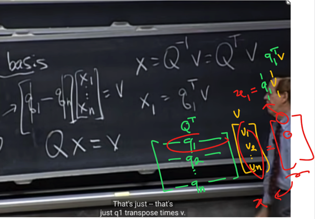</kbd></p>

> [!NOTE]
> Và viết theo matrix thì nó như vầy, **Qx `=` v**. Và nhân hai
> vế cho **Q_inv** ta có **x `=` Q_inv.v** (điều này cho phép vì lẽ
> dĩ nhiên **Q là nxn `full-rank` `/` invertible matrix**)
>
> Và đặc biệt hơn vì Q là **orthogonal**, **square**
> matrix, có **orthonormal columns**, nên Q là orthogonal
> matrix) nên như hồi bữa ta đã biết **Q_inv cũng là Q.T**
>
> Vậy **x `=` QTv**
>
> Và dễ thấy **x1 `=` q1Tv**

<br>

<a id="node-873"></a>

<p align="center"><kbd>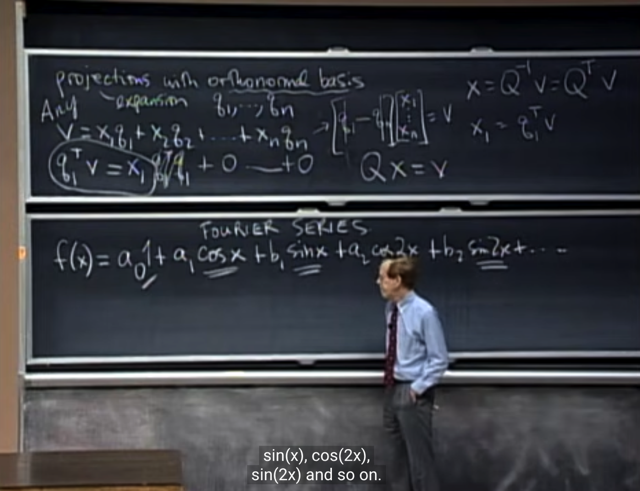</kbd></p>

> [!NOTE]
> và đó là **mào đầu** để gs nói về **Fourier series**. Là việc
> ta muốn **biểu diễn một function** ở dạng:
>
> bắt đầu bằng một **initial term a_0**, sau đó là **a1*cos(x)**
> **+ b1*sin(x)**  **+ a2*cos(2x) `+` a2*sin(2x)....**
>
> Vậy thì đại khái là, **ông Fourier** nhận ra rằng, ta có thể
> **áp** **dụng phép chiếu** **với orthonormal basis** nói trên
> với một vector nhưng**vector bây giờ là function**.
>
> Như ta cũng đã biết, **function space** vẫn **thỏa mãn các
> tính chất của vector space**như cộng hai function vẫn là
> một function, nhân function với một scalar thì vẫn là một
> function
>
> Vậy thì, chỉ khác ở chỗ, từ một **vector space có số chiều
> hữu hạn ví dụ Rn**, có n dimension, tương ứng ta sẽ có **n
> vector trong basis, ví dụ q1, q2....qn** ở trên.
>
> Thì bây giờ vector space, hay function space có **VÔ HẠN
> chiề**u nhưng **nếu ta có thể có các basis vector
> orthogonal** **thì phép chiếu trên vẫn đúng**, đại khái là
> vậy.
>
> Vậy thì trong function space này ta đang có một bộ (đương
> nhiên cũng **vô hạn) các vector basis** có các tính chất
> orthogonal: **1, sin(x), cos(x), sin(2x), cos(2x)...
>
> Vậy thì ta xem xem thử bộ basis vector này có thỏa tính
> chất ORTHONORMAL không (orthogonal nhau và unit 
> length)**

<br>

<a id="node-874"></a>

<p align="center"><kbd>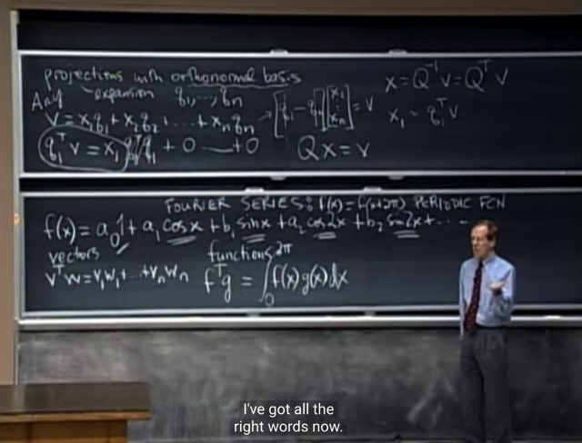</kbd></p>

> [!NOTE]
> Khúc này quan trọng đây: Vấn đề đặt ra khi**xét vector
> space là function space**, hay coi function ở đây là vector
> đó là,**dot product giữa hai vector sẽ tính như thế nào**.
>
> Thế thì gs cho rằng, **với vector (truyền thống)**, dot
> product hay inner product là ta sẽ tính **tích các phần tử
> tương ứng và cộng lại**.
>
> Vậy thì với function,**dot product của hai "vector" f(x) và
> g(x)** cũng sẽ là **tích hai phần tử tương ứng và cộng lại,
> với mọi x**.
>
> Thì thể hiện điều này chính là **f(x)*g(x)** và  thể hiện việc
> "cộng lại với mọi x" với x có giá trị liên tục thì chính là bằng
> **TÍCH PHÂN (integration)**
>
> Và dẫn đến ta **phải xác định giới hạn cuả tích phân**. Ở
> đây ta đang xét `/` dùng các function **sin(x) cos(x)** có tính
> cách là lặp lại sau mỗi c**hu kì 2pi (periodic)**. Nên ta dùng
> **giới hạn là 0 `-` 2*pi** (tạm hiểu, chấp nhận logic chỗ này)
>
> T**ừ đó ta có định nghĩa phép dot product** của hai 
> "function vector": 
>
> f(x)Tg(x) là **tích phân từ 0 đến 2*pi f(x)g(x)dx**

<br>

<a id="node-875"></a>

<p align="center"><kbd>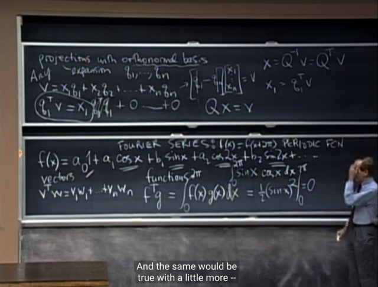</kbd></p>

> [!NOTE]
> và ta có thể **thử tính dot product của sin(x) và cos(x)** `=`
> **tích phân từ `0->2*pi` sin(x)*cos(x)dx** sẽ được **0,**từ đó
> cho thấy thỏa yêu cầu các basis "vector" orthogonal nhau.
>
> Và như vậy**ta có một bộ các orthonormal basis "vector"** của một function space.
>
> Và ta sẽ **express một function bằng linear combination
> các basis vector này.**

<br>

<a id="node-876"></a>

<p align="center"><kbd>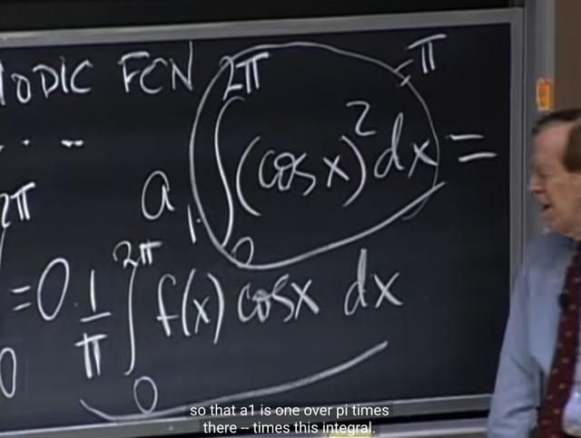</kbd></p>

> [!NOTE]
> thế thì **để tính a0**, gs cho biết cái này dễ vì nó sẽ là**trung bình 
> của f(x)**...
>
> Cái chính là **a1, a2.**...
>
> Ví dụ a1, thì gs cho rằng ta có thể**làm giống như hồi
> nãy** khi ta**nhân hai vế cho q1**. Thì đây cũng vậy, ta
> sẽ **nhân (dot product) hai vế cho cos(x)**.
>
> Và vế trái, việc **dot product giữa f(x) và cos(x)** như nãy
> đã định nghĩa thì chính là **tích phân từ 0 `->` 2pi f(x)cos(x)dx**
>
> Còn bên phải thì cơ bản **chính là nhân mọi term với cos(x)
> rồi lấy tích phân.**
>
> Thế thì gs cho rằng**ta sẽ có phần lớn thành 0**, chỉ còn
> **một term khác 0**, đó là **tích phân từ `0->` 2pi cos(x)^2 dx**, và
> ta sẽ tính ra được giá trị của nó **chính là pi**.
>
> Từ đó **a1 chính là bằng vế trái chia pi**

<br>

<a id="node-877"></a>

<p align="center"><kbd>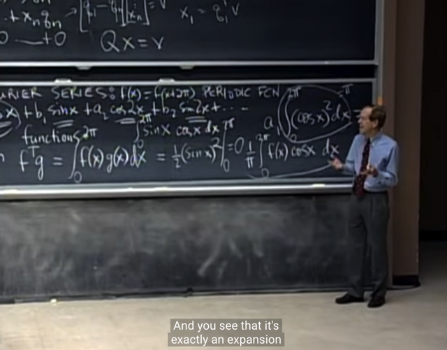</kbd></p>

> [!NOTE]
> tóm lại, **Fourier expansion** quả thật **chính là việc
> projection expansion trong một `ortho-normal` basis**

<br>

