# Lecture 24b: Quiz 2 Review

📊 **Progress:** `33` Notes | `36` Screenshots

---

<kbd></kbd>

 

<kbd>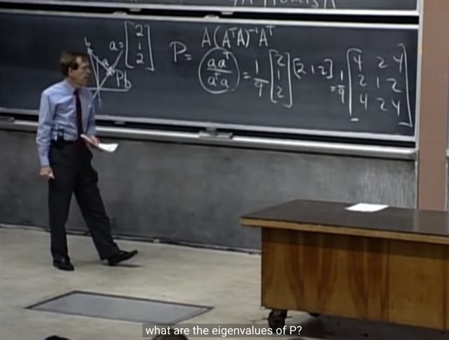</kbd>

> [!NOTE]
> Câu hỏi đầu tiên gs **giải là tìm Projection matrix** để **project**
> **lên vector a = (2, 1, 2)**. Thế thì gs nói rằng ta có thể dùng
> công thức như sau , nhưng mình nên lập luận lại công thức
> này như sau:
>
> việc **project vector b lên (line đi qua) vector a**, tức là ta sẽ
> **tách vector b thành hai phần: p + e**. Trong đó p là projection,
> là phần của b **nằm trên a**, và e là residual, hay error, là phần
> còn dư, **vuông góc với a**.
>
> Thế thì, **vì p nằm trên a nên có thể "tính p bởi a"**, có nghĩa là
> có thể **biểu diễn p là một linear combination của a**, mà trong
> trường hợp này đương nhiên linear combination chỉ gồm
> một vector. Và ta gọi **x là (scalar) coefficient: p = x.a**
>
> Và thế là ta có thể biểu diễn **e = b - p = b - x.a** Từ đó ta dùng
> sự thật thứ hai, liên quan đến e, đó là **e perpendicular với a**
> để có **aTe = 0**, từ đó ta có **aT(b - xa) = 0**
> Triển khai ra ta có **aT(b - xa) = 0** <=> **aTb - aTxa = 0**
>
> <=> aTxa = aTb <=> aTa.x = aTb <=> **x = aTb/aTa**
>
> => **p = xa = (aTb/aTa) a**
>
> và để lòi ra **Projection matrix p = Pb**thì ta sẽ ghi là 
>
> p = a (aTb/aTa)
>
> **=> P = aaT/aTa**

 

<kbd></kbd>

> [!NOTE]
> Tiếp, rank của matrix?
>
> me: 1, vì dễ thấy nó **chỉ có 1 col independent cols**, cols
> 2, 3 đều depend on col 1 -> matrix có 1 pivot col, 2 free
> cols. Rank = 1
>
> Thế thì: vì matrix **singular**, nên **chắc chắn có ít nhất một
> eigenvalue = 0**. Lí do có thể vì **determinant** (là tích của
> eigenvalue) **bằng 0**, hoặc cũng có thể giải thích là vì
> singular nên A có **ít nhất một free column**, dẫn tới sẽ **có
> một special solution**, cũng là **một vector trong basis của
> nullspace** (có nghĩa basis vector không rỗng, nullspace
> không chỉ có độc mỗi zero). Và đó là một eigenvector.

 

<kbd>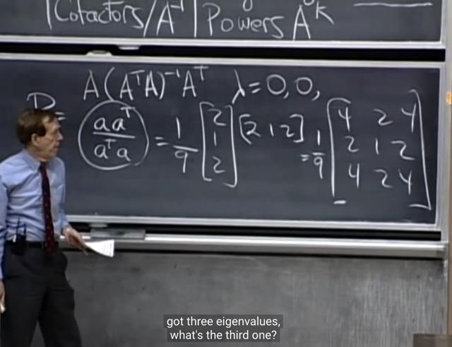</kbd>

> [!NOTE]
> Và đại ý là trong case này, vì **rank = 1**, tức là**chỉ có một
> pivot cols** ta sẽ thấy có tới **2 free column**, tức là 2 special
> solution, cũng là **2 basis vector trong nullspace**.
>
> Và ý nghĩa của nó cần hiểu là ta có**2 INDEPENDENT
> VECTOR KHIẾN Ax = 0x**, do đó, ta **có 2 eigenvalue = 0**.
> Và dù đây là một trường hợp của "**repeat** eigenvalue", thì
> đó vẫn không phải là defective matrix, vì **hai eigenvector
> ứng với chúng, đều INDEPENDENT**.
>
> Có thể hỏi vì sao chúng independent. Là bởi khi ta chọn
> giá trị bằng 1 cho một free variable, và 0 cho free variable
> còn lại, và backsubtitute vào để tính ra pivot var, và có
> được một special solution, và lặp lại các bước trên, để có
> special solution thứ hai. Thì hai special solution này, độc
> lập, do chúng chứa một Identity matrix (phần từ bằng 0 ở
> vector này tương ứng với phần tử bằng 1 ở vector kia, thì
> không thể có một scalar nào giúp biến vector này thành
> vector kia được -> chúng độc lập)

 

<kbd>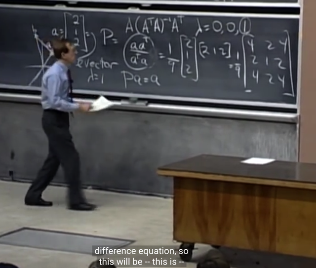</kbd>

> [!NOTE]
> Một **eigenvalue thứ 3 mang giá trị bằng 1**. Ta có thể biết
> điều này từ Trace = 4/9 + 1/9 + 4/9 = 1 là tổng của các
> eigenvalue. Mà hai cái kia bằng 0, nên cái còn lại bằng 1.
>
> Và để xác định eigenvector ứng với eigenvalue bằng 1
> này, ta không cần phải tìm nullspace của A - 1*I. Mà chỉ
> cần nhận xét rằng, đây là Projection matrix giúp project
> lên vector a,  nên vector khiến **Px = 1*x tức là project lên
> vector a mà vẫn giữ nguyên hướng** thì chỉ có thể là vector
> nằm trên line qua a. Hay có thể nói **a chính là
> eigenvector.**

> [!NOTE]
> Suy niệm thêm về việc rank của Projection matrix (bổ sung ở lần review thứ  1
> nên có thể không liền mạch với các ghi chú sau)
>
> Ở đây mình có thể nảy sinh một câu hỏi khi thấy matrix P giúp project lên
> vector [2 1 2]T có rank 1, câu hỏi là, có phải có sự liên quan gì giữa rank của
> matrix và dimension của subspace mà ta muốn project lên:
>
> Có vẻ đúng. Trong bài toán này ta cần**project một vector trong R^3** tới **một
> line trong R^3**, dễ hiểu là ta **mất đi 2 chiều không gian**, từ 3D còn 1D. Thế
> thì việc **input là R^3 vector cho thấy matrix cần có 3 cột**, để phép nhân  Ax
> mới hợp lệ. Vậy rowspace và nullspace là subspace của R^3:
>
> dim C(AT) + dim N(A) = 3
>
> **Kết quả của phép chiếu** vẫn là **vector trong R^3** (nằm trên một line trong
> R^3 thì vẫn là subspace của R^3), nên**matrix A sẽ phải có 3 hàng** để column
> space (Ax nằm trong column space) là subspace của R^3:
>
> dim C(A) + dim N(AT) = 3
>
> Vậy matrix A là matrix 3x3. Thế thì **mọi vector trong line** đều được**giữ
> nguyên** gợi ý vector **a chính là eigenvectors của A**, **ứng với eigenvalues
> có giá trị 1**.
>
> Và **mọi vector vuông góc với vector a** đều được **map thành 0 khi project
> lên a**, gợi ý rằng **mọi vector trong 2D plane vuông góc với line a** đều là**eigenvectors của A với eigenvalue là 0**. Và ta có thể có nhiều nhất 2
> eigenvectors độc lập trong plane này, nên ta **có 2 eigenvalue = 0**.
>
> Vậy **matrix A sẽ có rowspace chính là vector a** và nó **cũng chính là column
> space**, matrix A sẽ **map vector trong row-space**, là line đi qua a với với
> chính nó cũng là nằm trong vector trong columns space. output vector nằm
> trong một line, và nó nằm trong column space  nên C(A) = 1
>
> Còn **nullspace của A** sẽ chính là **plane vuông góc với line a**, để rồi **mọi
> vector trong đó đều bị map thành 0**.****
>
> **output space chỉ còn 1 line** cho thấy**dim C(A) = 1**, mọi vector trong plane
> vuông góc với line đều thành 0: **dim N(A) = 2, nên suy ra dim (CT)** cũng = 1
>
> Vậy nên rank matrix = 1, matrix có shape 3x3. Và qủa thật công thức của P =
> aaT/aTA cho thấy đúng là vậy.
>
> Và từ cách suy luận này có thể kết luận luôn matrix sẽ **có 2 eigenvalues**
> mang giá trị 0, với 2 eigenvectors độc lập span ra 2D plane chính là nullspace
> của P

 

<kbd>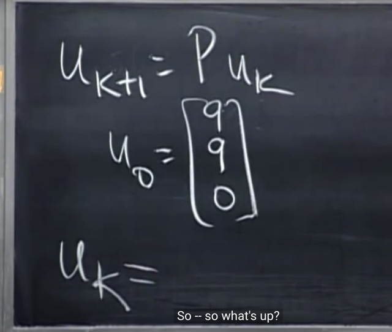</kbd>

> [!NOTE]
> tiếp, bài toán này. cho **u_k+1 = Pu_k**, với
> u_0. Tính u_k

 

<kbd>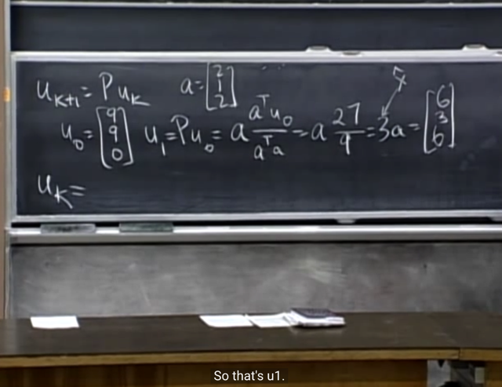</kbd>

> [!NOTE]
> thì đầu tiên cứ **tìm u_1** trước, thì đơn giản là **thế P
> vào**, và tính các phép nhân vector thôi.
>
> gs hỏi tiếp thế còn u_2, ta có phải tiếp tục tính **u_2 
> = Pu_1** không?
>
> me: Không, vì **đây là Projection matrix**, có tính chất
> là P^2 = P, mang ý nghĩa là, **khi đã project một matrix
> lên vector a rồi**, thì **project tiếp cũng không thay đổi**
> nữa. Nên u_k=....u_2 = u_1

 

<kbd>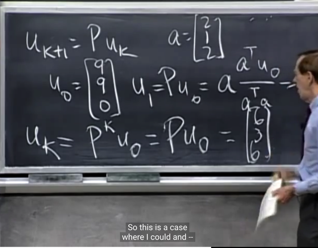</kbd>

> [!NOTE]
> gs: đúng vậy, nếu là matrix khác, ta có thể sẽ viện tới
> eigenvalue, eigenvector để **phân tách AS = SΛ** và làm
> như bữa trước (*).
>
> Còn ở đây **vì là P nên P^k cũng chỉ là P**.
>
> (*) lập luận lại như sau \~u_0 sẽ là nằm trên column space
> của A\~, và nếu A có **N INDEPENDENT eigenvectors**, thì ta
> có thể có u_0 = Sc (S là matrix có cols là các eigenvectors)
>
> Tiếp, u_1 = ASc = SΛc. Tiếp u_2 = Au_1 = SΛΛc = SΛ^2c
> tiếp tục vậy ta có **u_k = SΛ^kc**. Và điều này sẽ cho phép
> nhìn vào eigenvalue và eigenvector để xác định trạng thái
> của u_k khi k -> infinity

> [!NOTE]
> Sửa lại chỗ hiểu sai trong chỗ bị gạch dưới đây: Lập luận
> đúng phải là: Vì A có n independent eigenvectors nên
> CHÚNG SPAN TOÀN BỘ RN. từ đó mọi Rn vector đều
> có thể represent bởi linear combination của chúng:
>
> u_j = Sc_j

 

<kbd>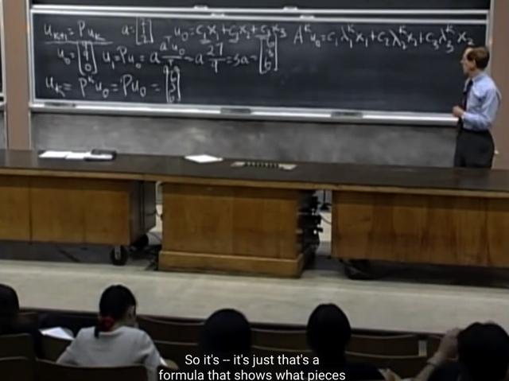</kbd>

> [!NOTE]
> Gs cũng ôn lại điều ta vừa nói, đó là **nếu có matrix khác**, thì
> ta sẽ tìm **eigenvalues**, **eigenvectors** và nhờ u_0 để **tìm
> coefficient c1, c2...**Từ đó ta sẽ có **u_k = A^k.u_0 = S.Λ^k.c**

 

<kbd>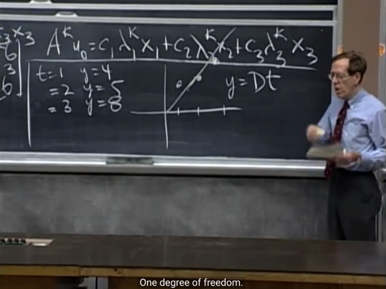</kbd>

> [!NOTE]
> câu hỏi thứ hai là**fit một đường thẳng đi qua zero**, sao cho
> fit được 3 điểm (t=1,y=4), (2,5) và (3,8)
>
> **vì đường thẳng đi qua zero** nên phương trình sẽ là **y = Dt**thay vì y = Dt + C.

 

<kbd>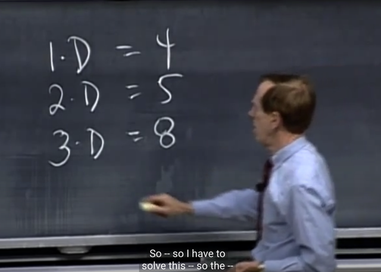</kbd>

> [!NOTE]
> A = (1, 2, 3), b = (4, 5, 8)
>
> Thế thì, **nếu có thể tìm D khiến 3 equation này đều thõa mãn**. Thì đương nhiên y
> = Dt **chính là đường thẳng hoàn hảo, đi qua được cả 3** điểm này. Vấn đề là,
> không thể tìm được D như vậy, bởi lẽ khi xem xét vector (1,2,3) và (4,5,8) ta sẽ thấy
> nó không cùng phương hay, nó là hai independent vector.
>
> Để chứng minh điều này thì ta có thể dùng **elimination với augmented matrix A|b**
> mà ở đây matrix A chỉ có một cols là [1 2 3], elimination sẽ hủy **đi hai row cuối để
> biến nó thành [1 0 0]**,**còn ở bên phải sẽ thành [4, -3, -4]** và từ đó cho thấy rõ là
> AD = b **ko thể có solution vì b ko nằm trong cols space của A** (là line qua vector
> (1,2,3))
>
> Thông thường khi solve Ax = b, ta cũng theo **elimination đối với A|b để xác định các
> free cols / variables**. Từ đó **gán các free variables = 0**, để backsub solve ra pivot
> variables, tạo thành một **particular solution** x_p. Và **cùng với x_null** (solution
> của Ax=0) sẽ tạo ra **nghiệm tổng quát của Ax=b là x_p + x_null.**
>
> Tuy nhiên ở đây, trường hợp ta Ax=b KHÔNG CÓ MỘT PARTICULAR SOLUTION
> NÀO do b không nằm trong C(A)
>
> \~Dẫn đến dù Ax=0 có nullspace khác 0 (đó là tất cả các vector vuông góc với [1 2
> 3], đều thỏa Ax=0)\~
>
> Chỗ này sai nè, Ax=0, với **A chỉ là vector (1,2,3)** tức là nó **có 3 row**, mỗi row là
> **một 1D vector trong R^1** (số thực, scalar, có thể coi như là 1D vector trong không
> gian R^1). Vậy với 3 row vector này, **ta có 1 pivot**, có nghĩa là **đủ để span toàn
> bộ R^1** rồi, và do vậy **nullspace CHỈ CHỨA ZERO**.
>
> Điều này khác với khi xét matrix A là matrix **cũng rank 1**, nhưng có shape là
> **1x3**, tức là nó **chỉ có 1 row**, nhưng 3 columns. Lúc bấy giờ, row-space là và
> nullspace là **subspace của R^3** (thay vì R^1), và **với 1 pivot row**, hay, 1 vector
> trong basis của row space, nó **chỉ đủ để span một line trong R^3**. Và vì vậy, vì
> định lý **tổng dimension của rowspace và nullspace bằng 3**, nên **nullspace sẽ có
> dimension = 2**, tức là một plane.
>
> Và quả thật ta có thể lập luận cách khác đó là matrix sẽ có **3 cols** (mỗi column là
> một 1D vector) thì vì ta **chỉ có 1 pivot, nên có 2 free columns**. Từ đó ứng với 2
> special solution của Ax = 0, hay có 2 vector trong basis của nullspace, tạo nên một
> plane. Đương nhiên đó **chính là cái plane vuông góc với vector row**.
>
> Như vậy trong bài toán này, **vừa không có particular solution, vừa không có x_null**

 

<kbd>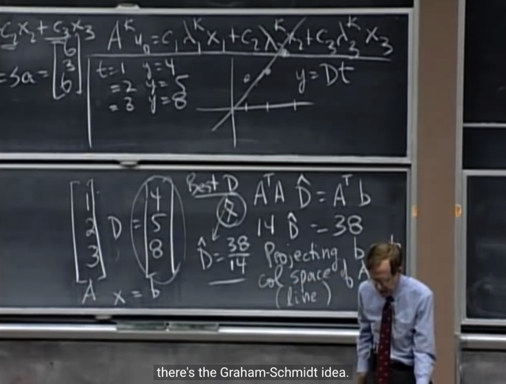</kbd>

> [!NOTE]
> Tiếp với bài toán này, ta sẽ tiếp cận bằng cách thay vì cố tìm D, là coefficient 
> giúp tạo một linear combination của A's column để cho ra b = [4,5,6].T, và đây
> là nhiệm vụ bất khả thi, vì b NẰM NGOÀI COLUMN SPACE của A. Thế thì, ta
> sẽ TÌM MỘT ĐIỂM NẰM TRONG COLUMN SPACE SAO CHO GẦN NHẤT
> VỚI b, và đây chính là projection của b lên C(A). Và khi đó, p, vì nằm trên C(A)
> nên p = A.D^. Và y = D^t sẽ là best line giúp fit các điểm.
>
> Vậy thì ta sẽ tìm D^ bằng các lập luận theo phép chiếu b lên C(A), mà ở đây
> là vector a = [1, 2, 3].T:
>
> Gọi x là coefficient của linear combination của a cho ra p - projection của b lên
> a: p = ax, hay xa. Thế thì b = p + e => e = b - p = b - ax
>
> Từ thực tế e vuông góc với a nên ta có aTe = 0 <=> aT(b - ax) = 0
> <=> aTb - aTax = 0 <=> aTb = aTax <=> aTb / (aTa) = x 
>
> => p = ax = a (aTb) / (aTa), và Projection matrix P = aaT/aTa
>
> khi đó, đường thẳng y = D^x, với **D^ = aTb / (aTa)**, sẽ là least square line, giảm
> thiểu sai sót giữa line và các điểm.
>
> Như gs viết ở đây, thế vào ta tính ra aTa = 14, aTb = 38 -> D^ = 38/14

 

<kbd>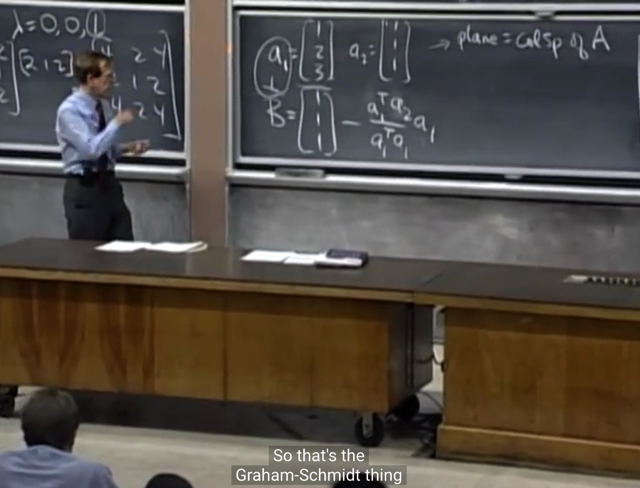</kbd>

> [!NOTE]
> câu hỏi tiếp theo là **Gram Smidth**. Cho hai vector a1, a2
> tạo một plane trong R^3. yêu cầu tìm một **bộ** **hai vector
> orthogonal trong plane** đó. Thế thì theo gs,  **đương nhiên
> có vô số** cặp vector orthogonal trong plane. Và ta sẽ làm
> theo cách tiếp cận của Gram Smith bắt đầu bằng việc
> **chọn a1 làm vector A**. và từ đó, **tính các vector khác bằng
> cách project các vector tiếp theo (ở đây là a2) lên các
> vector trước** và **giữ lại phần dư (residual)**
>
> Vậy ở đây vector B được lấy bằng phần dư, sau khi trừ
> vector a2 cho projection của a2 lên a1. Thì khi đó ta sẽ
> có A (=a1), B là hai vector vuông góc

 

<kbd>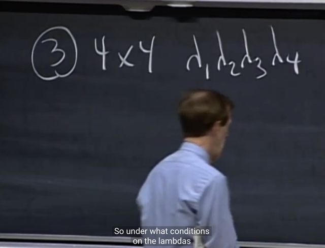</kbd>

> [!NOTE]
> Câu hỏi thứ 3: Cho matrix 4x4, câu hỏi là, điều kiện của **lambdas** như thế
> nào để **matrix invertible**
>
> Me: Thử trả lời như sau, đầu tiên đây là square matrix, và nó sẽ invertible
> đương nhiên là khi nó full-rank, đồng nghĩa với việc mọi columns và mọi row
> đều independent
>
> Và để điều này xảy ra, đồng nghĩa với việc không có vector khác không nào
> trong nullspace của matrix, hay chỉ có duy nhất một vector 0 khiến Ax = 0 mà
> thôi. Và  như vậy cũng đồng nghĩa k**hông có eigenvalue nào bằng 0**, vì nếu
> có tức là có x khác 0 khiến Ax = 0x, mà như vậy thì tồn tại x khác 0 trong
> nullspace.
>
> Có thể lập luận theo cách khác như sau, matrix invertible khi nó non-singular.
> Mà theo như ta biết **determinant của singular matrix sẽ bằng 0** (đây là
> properties 8 của determinants vốn dĩ có thể được giải thích bởi properties 6 -
> đó là **determinants matrix có row bằng 0 sẽ bằng 0**: với matrix singular thì
> **các row không independent**, nên **khi elimination** (vốn dĩ là **quá trình
> row exchange, không khiến thay đổi trị tuyệt đối của det**) cho ra **upper
> triangular** **matrix** U, sẽ **có ít nhất một row nào đó thành zero**, và theo
> một properties trước đó thì cho ta biết **matrix có zero row sẽ có det = 0**. Vậy
> suy ra **det của singular matrix cũng bằng 0**.
>
> Còn **tại sao matrix có row = 0 sẽ có det bằng 0** là bởi dùng properties 3b,
> xem lại việc chứng minh properties này trong bài determinant.
>
> Nhưng đại khái là properties 3a cho biết khi ta nhân một  row với scalar, giữ
> nguyên các row khác, thì det của matrix mới sẽ bằng det của matrix cũ nhân
> cho scalar đó. Thì dùng tính chất này ta có thể cho matrix có row bằng 0, là
> bằng matrix khác có row đó khác 0 nhân với scalar = 0, Vậy thì det của matrix
> mới sẽ bằng 0 (scalar) * det matrix kia (dù bằng bao nhiêu không cần biết)
> cũng ra 0.
>
> Hoặc có thể dùng một properties 3b đó là khi một hàng của matrix tách ra
> thành tổng của hai hàng của hai matrix khác, các hàng khác giống nhau hết,
> thì det của của nó là tổng của det. Thế thì khi đó có thể cho rằng det của
> matrix có row = 0 là tổng của det của hai matrix mà cái row tương ứng ngược
> dấu. Mà điều này có thể dựa vào 3a mà chứng minh là det của chúng bằng
> nhau về trị số nhưng ngược dấu). Thành ra det của matrix có zero row sẽ
> bằng 0.

 

<kbd>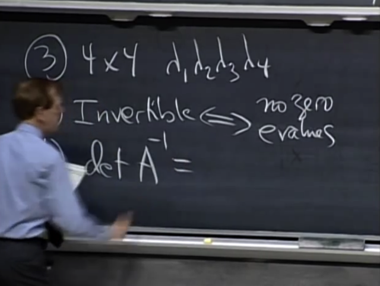</kbd>

> [!NOTE]
> gs: correct. Câu b: det của A_inv?
>
> me: det A_inv = 1 / det A = 1/ tích lambdas
>
> Điều này là do:
>
> AinvA = I, dựa vào tính chất của determinant: 
>
> det (AB) = det A * det B
>
> ta có: det I = det (AinvA) = det Ainv * det A
>
> <=> 1 = det Ainv * det A => det Ainv = 1/det A. Và det A là bằng
> tích của các eigenvalue của A = λ1λ2λ3λ4
>
> Nên det Ainv = 1/(λ1λ2λ3λ4)
>
> ====
>
> Mà ta cũng có thể lập luận như sau để có eigenvalue của Ainv
>
> Gọi x là eigenvector của A, ứng với eigenvalue λ
>
> Ax = λx <=> AinvAx = Ainvλx <=> x = Ainvλx 
>
> Mà vì λ là scalar, chia hai vế cho nó: 
>
> Vậy x = Ainvλx =  λAinvx <=> x/λ = Ainvx. Có thể chia cho lambda
> vì **lambda chắc chắn khác 0 do Ainv tồn tại chứng tỏ matrix 
> non-singular khiến determinant = tích các eigenvalue khác 0**.
>
> Từ đó cho thấy **x cũng là eigenvector của Ainv với eigenvalue 
> là 1/λ**

 

<kbd>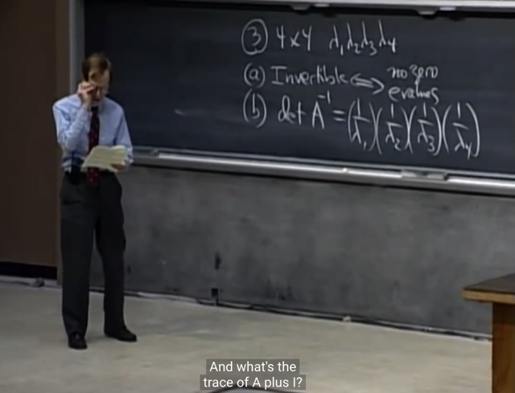</kbd>

> [!NOTE]
> gs: correct

 

<kbd>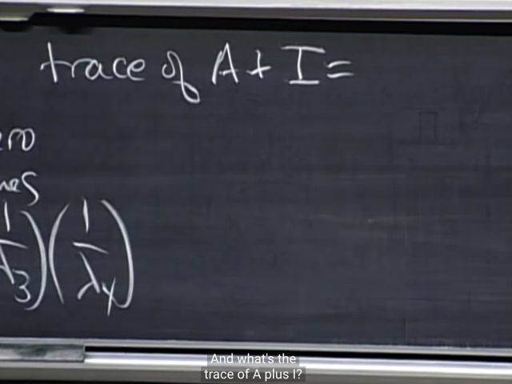</kbd>

> [!NOTE]
> Trace của A + I là gì?
>
> me: Lí luận như sau: nếu **gọi x là eigenvector của A với
> eigenvalue là lambda**. Thì ta có **Ax = λx**
>
> Cộng hai vế cho Ix=x ta có **Ax + Ix = λx + x**
>
> <=> (A+I)x = (λ+1)x
>
> Như vậy x cũng là eigenvector của matrix A + I, với
> eigenvalue là λ + 1:
>
> Vậy từ đó suy ra các **eigenvalue của A + I sẽ là các
> eigenvalue của A cộng thêm 1**.
>
> Nên trace của A+I = tổng các eigenvalues = (cũng là tổng
> các giá trị trên đường chéo) = **λ1+λ2+λ3+λ4+λ4+4**

 

<kbd>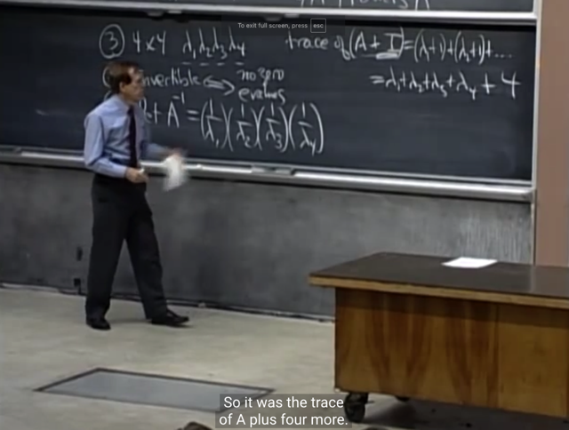</kbd>

> [!NOTE]
> gs: correct

 

<kbd>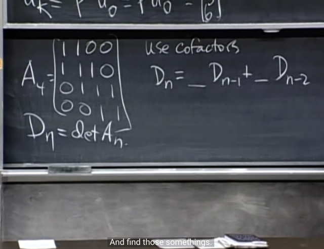</kbd>

 

<kbd>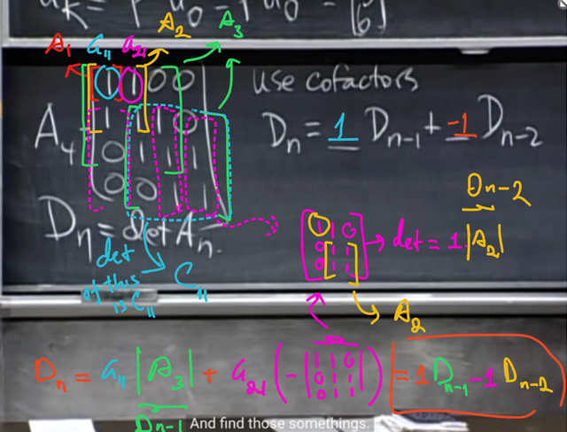</kbd>

> [!NOTE]
> Tính det A4 (kí hiệu là D4) bằng cofactor formula theo row 1
> D4 = a11*C11 + a12*C12 (a13, a14 bằng 0 rồi thì khỏi xét)
>
> Tiếp, C11 là gì, theo công thức cofactor formula, thì nó sẽ là
> (+, vì a11:i+j=2 chẵn) det của matrix nhỏ sau khi đã bỏ cột 1,
> hàng 1 của A4 đi. Thì đây chính là matrix A3 (vẽ màu xanh lá).
> Vậy a11*det A3 = 1*Dn-1 (n đang = 4)
>
> Tiếp C12 là gì, nó sẽ là dấu âm (vì 1+2 = 3, lẻ), giá trị là det
> của matrix có 3 cột màu hồng (matrix A4 bỏ cột 2 và hàng 1
> đi). Mà để tính det matrix mà hồng này, thì lại lần nữa dùng
> cofactor, tính theo column 1, thì chỉ cần nhân 1 với det của
> matrix màu cam, và dấu là +, nó chính là A2.
>
> -> a21*(-(1*det A2)) = - det A2 = - Dn-2
>
> Vậy Dn = 1*Dn-1 - 1*Dn-2

 

<kbd>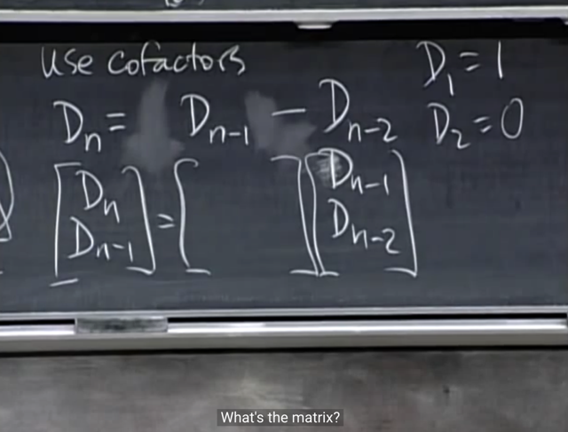</kbd>

> [!NOTE]
> Thế thì gs yêu cầu chuyển thành dạng này, tức là chuyển từ
> MỘT SINGLE SECOND ORDER EQUATION thành MỘT
> SYSTEM CÁC FIRST ORDER EQUATION, matrix là gì?

 

<kbd>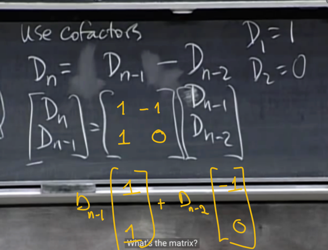</kbd>

 

<kbd>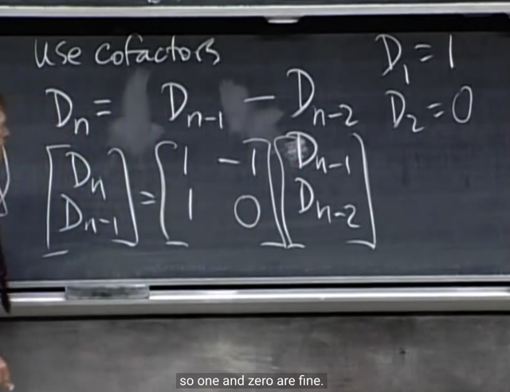</kbd>

> [!NOTE]
> Gs: Correct. Tìm eigenvalues của matrix này?
>
> Me: ta sẽ tìm eigenvalue theo cách tiếp cận phổ quát:
>
> Solve equation det (A - λI) = 0, dễ thấy nó sẽ là:
>
> (1-λ)(-λ) - (-1)*1 = (λ-1)λ + 1 = 0
>
> <=> λ**2- λ + 1 = 0
>
> để giải cái này dùng công thức:
>
> λ = [-b +/- sqrt(b**2 - 4ac)] / 2a = [-(-1) +/- sqrt(b^2 - 4ac)]/2a = 
>
> = [1 +/- sqrt(1 - 4*1*1)]/2*1 = [1 +/- sqrt(-3)]/2
>
> Chỗ này ôn chút xíu về imaginary number i: i^2 = -1 s
>
> suy ra sqrt(-1) = i
>
> tương đương sqrt(-3) = sqrt(3)sqrt(-1) = **sqrt(3)*i**Vậy có 2 λ mang giá trị complex: 
>
> **0.5(1 + sqrt(3)*i) và 0.5(1-sqrt(3)*i)**

> [!NOTE]
> Công thức tính solution thật ra rất dễ thôi:
>
> Đến từ quá trình gọi là **completing the square**.
>
> ax**2 + bx + c = 0 <=> 
>
> x**2 + (b/a)x + c/a = 0 <=>
>
> x**2 + 2(b/2a)x + (b/2a)**2 + c/a - b**2/4a**2 = 0 <=>
>
> (x + b/2a)**2 = (b/2a)**2 - c/a <=>
>
> (x + b/2a)**2 = (b**2 - 4ac)/4a**2 <=>
>
> x + b/2a = +/- sqrt(b**2 - 4ac)/2a
>
> **x = -b/2a +/- sqrt(b**2 - 4ac)/2a**

 

<kbd>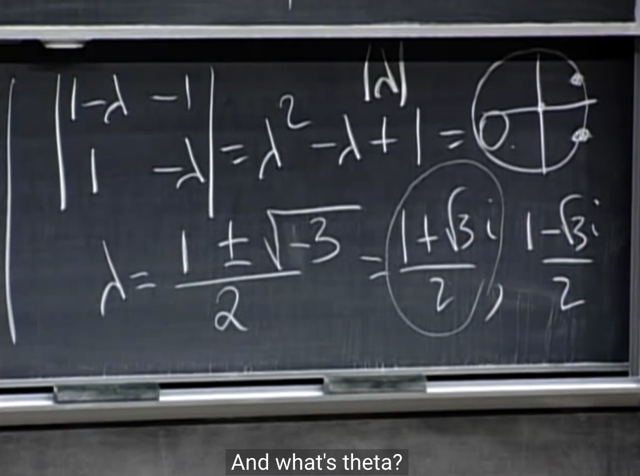</kbd>

> [!NOTE]
> thế thì gs đề nghị ta có thể thấy rằng, khi thể hiện phần
> thực - real (1/2) và phần ảo - imaginary (+/-) sqrt(3)*i/2 thì**khoảng cách từ nó đến gốc** là bao nhiêu (đây là khái
> niệm **modulus** của số phức - complex number):
>
> Nó đương nhiên sẽ là**tổng bình phương của phần thực
> (1/2)** và  **phần ảo (imaginary)** (+/i sqrt(3)*i/2)
>
> Và ta có (1/2)**2 + [(+/-) sqrt(3)*i / 2]**2 = 1/4 + 3/4 = 1.
>
> Như vậy nó nằm trên UNIT CIRCLE -> modulus r = 1
>
> Và **(đây là kiến thức mới bổ sung) rằng complex
> number** có thể được **biểu diễn theo dạng Euler** như
> sau:
>
> **z = r*e^(i*θ) = cos(θ) +i*sin(θ)**và ta đã có z = cos(θ) + i*sin(θ) = 1/2 + i*[+/- sqrt(3)/2]****thì ta sẽ tính theta để thể hiện z dưới dạng Euler = **r*e^(i*θ)**Với r là modulus, như ở đây bằng 1.
>
> theta = arg tan(θ) = (đối / kề) = (imaginary part) / (real)
>
> = [+/- sqrt(3)/2] / [1/2] = +/- sqrt(3)
>
> => **θ = (+/-) pi/3 (60 độ)** 
>
> Và theo công thức Euler: r*e^(i*θ), thay θ vào: 
>
> **λ = e^[(+/-) π*i/3]**Hay**: 
>
> λ_1 = e^(π*i/3) 
>
> λ_2 = e^(-π*i/3)**

 

<kbd>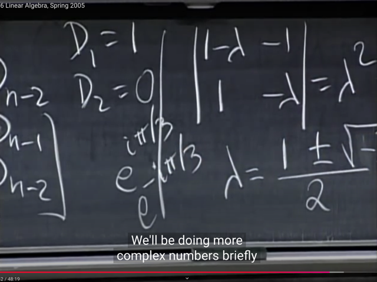</kbd>

> [!NOTE]
> rồi, đại khái là khi ta đã biết hai eigenvalues như vậy, thì gs đề
> nghị hãy **tính thử lambda^6**
>
> Ta thấy nó sẽ là **[e^(+/-π*i/3)]^6 = e^(6π*i/3) = e^(+/-2π*i)**
>
> và theo công thức Euler: **r*e^(i*θ) = cos(θ) + i*sin(θ)**
>
> nên với e^[i*(+/-2π)] thì theta = +/-2π
>
> -> e^ i*(+/-2π) = cos(+/-2π) + i*sin(+/-2π) =  1 + i*0 = **1**
>
> Khi đó, gs cho rằng, ta đã biết nếu lambda là eigenvalue của
> matrix A, thì **khi lũy thừa A lên, thì eigenvalue cũng sẽ được lũy
> thừa**. Điều này có thể lập luận lại như sau:
>
> Ax = λx => A^2x = AAx = Aλx = λAx = λλx = λ^2x
>
> Như vậy A^2x = λ^2x suy ra **x cũng là eigenvector của A^2** với
> **eigenvalue = λ^2**
>
> Tương tự như vậy có thể chứng minh là **với matrix A^k** thì **x
> (eigenvector của A) cũng là eigenvector của A^k**, với e**igenvalue
> là λ^k**
>
> ====
>
> Thì từ đó gs mới nói rằng, từ đó ta có thể hiểu matrix A^6 sẽ **có
> eigenvalue là mũ 6 lần của λ_1, λ_2 THẾ MÀ NHƯ  VỪA TÍNH Ở
> TRÊN, cả hai eigenvalue (e^(π*i/3) và e^(-π*i/3)) khi mũ 6 đều có
> giá trị bằng 1 v**à do đó, nó chính là Identity matrix.
>
> Tức là AAAAAA = A^6 chính là I
>
> Để rồi ta có thể hiểu rằng nếu ta **nhân x với matrix A liên tiếp 6
> lần thì nó sẽ tương đương với nhân nó với matrix A^6 = I và ta sẽ
> quay về trạng thái / giá trị ban đầu.**

 

<kbd>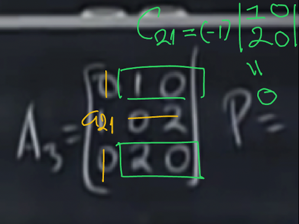</kbd>

<kbd></kbd>

<kbd>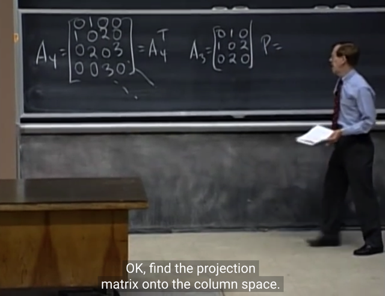</kbd>

> [!NOTE]
> Câu hỏi là **tìm projection matrix** giúp**project lên matrix
> A3**.
>
> Đầu tiên gs đề nghị **xác định A3 là singular hay non-singular**.
>
> me: có thể để ý thấy column 3 = 2 column 1, nên matrix này có
> **các column không independent**, do đó nó singular. (*)
>
> Hoặc ta có thể**tính det của A3 theo cofactor formula** theo
> column 1, thì chỉ cần tính a21*C21 = 1*(- det của matrix A3 bỏ
> đi hàng 2 cột 1) dễ thấy matrix này có hai row là [1 0] [2 0], tức
> là nó **có một zero column**. Vậy **det của nó = 0**.
>
> Vậy a21*C21 = 1*(-)*0 = 0. Vậy det của A3 = 0 => A3 singular
>
> ===
>
> (*): Chỗ này có thể nói rõ hơn cho hiểu sâu hơn, rằng **vì các
> columns không độc lập** nên **tồn tại một linear combination**
> của của **các cột trở thành 0** với **các coefficients khác 0**.
> Như vậy chính là việc **tồn tại vector khác 0 trong Rn bị biến
> thành 0 bởi matrix A**: Ax = 0, đây **chính là vector trong
> nullspace**, từ đó **dim N(A) > 0** để rồi ý nghĩa là **input
> vector trong Rn (bao gồm rowspace và nullspace)** được map
> với output chỉ còn trong một subspace (column space) có
> dimension = **r (rank)** **nhỏ hơn n**.
>
> Vì sao? Bởi vì dimension của nullspace dim N(A) lớn hơn 0
>
> mà dim N(A) + dim C(AT) = n <=> dim C(AT) = n - dim N(A) = r,
> mà dim N(A) > 0 nên dim C(AT) = r < n, và do đó **dim C(A)
> cũng < n.**

> [!NOTE]
> Thế thì để **tìm projection matrix**, ta có thể lập luận lại công thức như
> sau:
>
> Giả sử **cần project vector b lên column space** của matrix A.
>
> Thế thì bản chất của phép chiếu là ta sẽ **phân tách vector b** thành hai
> phần, một phần nằm trên **column space của A**, gọi là p, và một phần
> **residual**, **e vuông góc với C(A)**. Và ta muốn e vuông góc với C(A) là
> bởi **chỉ như vậy thì ta mới có irreducible / smallest error**. Như vậy ta
> có **hai sự thật**:
>
> i) **p nằm trên C(A)** nên **tồn tại một linear combination của các A's
> column để tạo nên p**, gọi vector chứa coefficient cho linear
> combination này là x, ta có **Ax = p**
>
> ii) **e vuông góc với C(A)**, do đó **e chính là nằm trên Nullspace của A.T**
> (the left nullspace), vậy **e là solution của equation ATy = 0**. Ta có ATe
> = 0
>
> Và vì b = p + e nên e = b - p = b - Ax
>
> Và như vậy ATe = 0 <=> AT(b-Ax) = 0 <=> ATb - ATAx = 0 <=> ATb =
> ATAx
>
> Tiếp, nếu **A có INDEPENDENT COLS THÌ ATA INVERTIBLE (**)
>
> Khi đó ta có thể nhân hai vế cho (ATA)^-1:**x = (ATA)^-1ATb, và p = Ax = A(ATA)^-1ATb từ đây projection matrix
> sẽ là**P = A(ATA)^-1AT**Có thể hiểu vầy, câu hỏi của bài toán thực ra là cho matrix A3  như
> vậy, yêu cầu tìm Projection matrix giúp project lên column space của
> A3.**Tuy nhiên trong công thức A(ATA)^-1ATb, ta cần hiểu A là matrix
> có các cột độc lập tạo bởi một basis của một subspace mà ta cần
> project lên. (Search #lec15 để đi tới bài giảng để xem lại chỗ này)
>
> Thế thì ta có thể tiến hành xác định hai cột độc lập của A3, và
> xây dựng matrix A tạo bởi hai cột đó, khi đó có  thể dùng công thức
> trên một cách hợp lệ. Và lúc này Projection  matrix giúp project lên
> C(A) thì cũng là project lên A3.**==== (**) Chứng minh lại như sau:
>
> Giả sử A có independent cols, ta xét ATAx = 0 và nếu **chứng minh
> được ATAx = 0 không có solution khác 0**, hay, ATA nullspace chỉ
> chứ zero vector, thì từ đó ta có thể suy ra khi mọi col của A đều
> independent, hoặc rowspace của ATA là Rn, mà ATA square nữa, thì
> suy ra ATA full rank, hay invertible.
>
> Thế thì nhân hai vế của ATAx = 0 cho xT ta có xTATAx = 0 Điều này
> tương đương: (Ax)T(Ax) = 0.
>
> Mà Ax (là vector, giả sử gọi là u), thì uTu là scalar. Và chính là  L2
> norm của vector u, vốn là giá trị không âm. Do đó (Ax)T(Ax) = 0 chỉ
> có thể suy ra x = 0. Vậy có nghĩa là solution 0 là solution duy  nhất
> của ATAx = 0, như trên đã nói, có thể kết luận ATA full rank.

 

<kbd>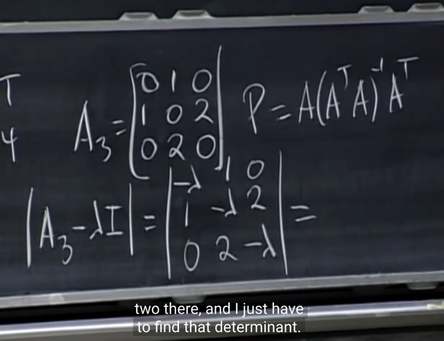</kbd>

> [!NOTE]
> để tìm eigenvalue, như thường lệ ta sẽ solve
> characteristic equation: det (A - lambda*I) = 0

 

<kbd>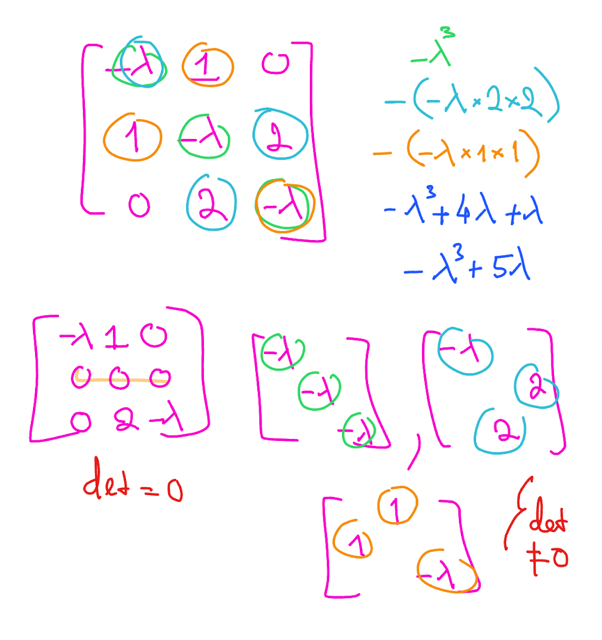</kbd>

<kbd></kbd>

<kbd>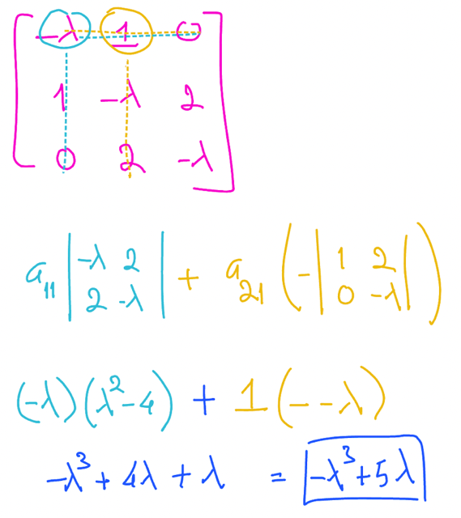</kbd>

> [!NOTE]
> Ta có thể tính theo cách của gs là dùng công thức
> tổng quát hoặc dùng cofactor formula

 

<kbd>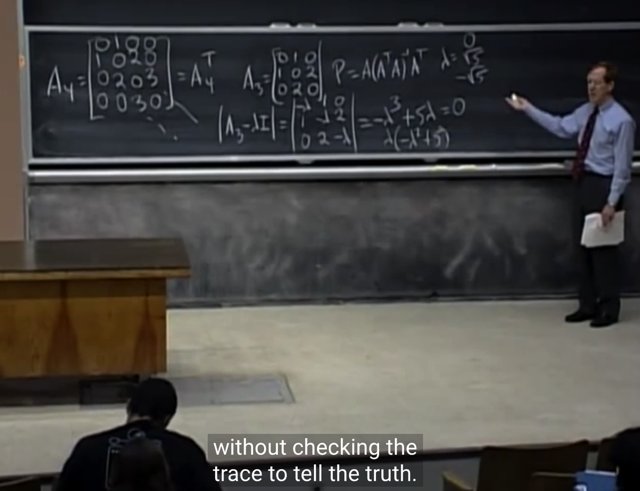</kbd>

> [!NOTE]
> và ta có thể **dùng trace để kiểm tra lại**,
> **tổng của các eigenvalue = trace**, =**tổng
> các item trên đường chéo**

 

<kbd>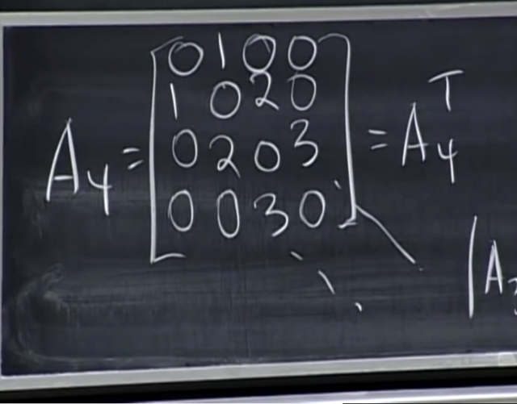</kbd>

> [!NOTE]
> Câu hỏi tiếp theo là**tìm projection matrix lên C(A4)**. Câu
> hỏi này gs cho là dễ. Vậy thì gs gợi ý là **hãy xem A có
> invertible không**. Và **nếu invertible thì C(A) sẽ là gì**.
>
> me: vì **C(A) là subspace của R^4**(do matrix có 4 hàng,
> vector column có 4 components). Vậy **nếu A invertible**,
> tức là full-rank, thì **4 cols của nó sẽ là 4 vector độc lập**,
> SPAN TOÀN BỘ R^4. Khi đó **projection lên Column
> space** của A **chính là projection một vector trong R4 lên
> R**4, đương nhiên chỉ là chính nó. Khi đó ta sẽ có
> **projection matrix chính là Identity matrix.**

 

<kbd>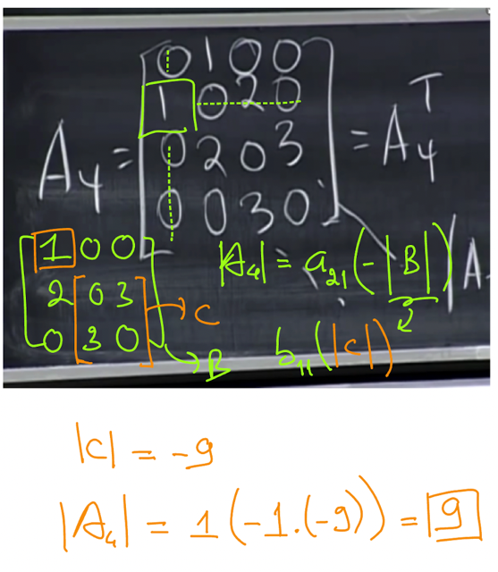</kbd>

> [!NOTE]
> Và dựa vào cofactor có thể dễ dàng tính ra
> det A4 = 9 khác 0, vậy A4 non-singular, nên
> Projection matrix lên C(A4) là I

 

<kbd>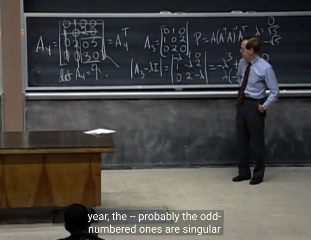</kbd>

> [!NOTE]
> Gs: correct!. det A4 = 9, -> non singular => P chính là I

 

