# Lecture 25: Symmetric Matrices And Positive Definiteness

📊 **Progress:** `39` Notes | `31` Screenshots

---

<kbd>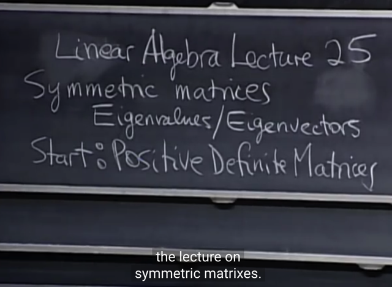</kbd>

> [!NOTE]
> Gs: đây là **matrix quan trọng nhất** trong
> các matrix: **Symmetric matrix**. Và nó sẽ
> có các tính chất đặc biệt

 

<kbd>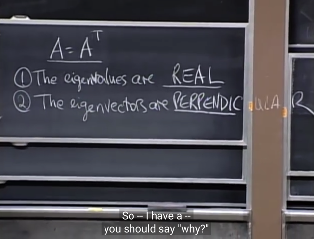</kbd>

> [!NOTE]
> Đó là **eigenvalues của nó sẽ là số thực** (ta đã biết
> eigenvalue có thể là số phức - complex number) và
> eigenvector của chúng **perpendicular**

> [!NOTE]
> SYMMETRIC MATRIX: REAL EIGENVALUES,
> PERPENDICULAR EIGENVECTORS

 

<kbd>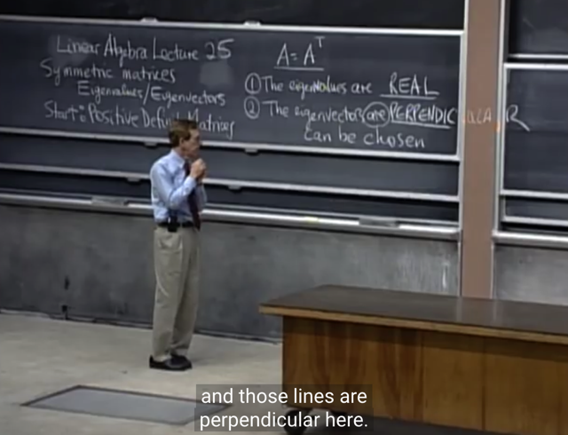</kbd>

> [!NOTE]
> gs nói rõ một chút về vụ các **eigenvector perpendicular**
> này đó là ta **nên hiểu** là **nếu có nhiều eigenvector** ví dụ
> như  với **Identity** matrix - là thứ mà ta đã biết có mọi
> eigenvalue đều bằng 1 (repeated eigenvalue) nhưng đồng
> thời **mọi vector đều là eigenvector**, ví dụ như với
> matrix Identity 2x2 đi, thì mọi vector trong R2 đều là
> eigenvector của nó. Thành ra ta **cần hiểu là** khi đó, nói mọi
> eigenvector đều vuông góc thì phải hiểu là **có thể chọn ra
> một bộ eigenvector vuông góc** trong trường hợp có vô số
> eigenvector độc lập như của Identity matrix.
>
> Tóm lại là đv symmetric matrix thì **nếu có hữu hạn các
> eigenvector thì chúng sẽ vuông góc nhau**. Còn nếu có
> nhiều engenvector như đối với I thì phát biểu trên có nghĩa
> là ta l**uôn có thể chọn ra một bộ eigenvector vuông góc.**

 

<kbd></kbd>

🔗 **Related:** [LECTURE 22: DIAGONALIZATION AND POWERS OF A](untitled.md#node-727)

> [!NOTE]
> Và đối với matrix **SYMMETRIC** **LUÔN CÓ** **ĐỦ BỘ (n, là số
> column của A) EIGENVECTOR ĐỘC LẬP** - Là điều kiện mà
> trong bài trước ta đã biết, để matrix có thể phân tách thành A =
> SΛSinv và AS = SΛ (Diagonalization hay Eigen-decomposition)
>
> ôn lại tí, bữa trước gs có nói, đối với matrix thì **nếu mọi
> eigenvalue đều distinct** (khác nhau) thì ta sẽ **chắc chắn có
> các eigenvector** độc lập.
>
> Nhưng **nếu có repeat eigenvalue, thì vẫn có thể có các
> eigenvector độc lập nhưng phải kiểm tra lại**, ví dụ điển hình
> là I, có mọi eigenvalue = 1 nhưng vẫn có  đủ bộ n eigenvector
> độc lập. Thì **symmetric matrix cũng vậy**, nếu có repeat
> eigenvalue thì nó sẽ có "the whole plane of eigenvectors"

> [!NOTE]
> SYMMETRIC LUÔN CÓ ĐỦ BỘ (n, là số
> column của A) EIGENVECTOR ĐỘC LẬP

 

<kbd></kbd>

> [!NOTE]
> Gs: Thế thì nếu trong trường hợp này,**khi các eigenvector
> perpendicular**, thì ta có thể có gì?
>
> Gs khi symmetric matrix cho phép có thêm vụ các eigenvectors
> perpendicular, thì ta có thể **scale chúng để có unit norm vector**.
> Tức là ta có **N eigenvector** **ORTHONORMAL.**
>
> Gs khi đó S có thể thay bằng gì?
>
> Me: Q - **ORTHOGONAL MATRIX**
>
> ====
>
> Ở đây có thể hiểu thế này, nếu x là eigenvector thì ta có Ax = λx
> việc chia x cho length x để đưa x về unit norm có thể làm như sau:
>
> Chia hai vế cho norm x: Ax/||x|| = λx/||x||
>
> rõ ràng điều này cho ta unit vector q = x/||x|| vẫn là eigenvector của A
> với eigenvalue vẫn là λ thôi.

 

<kbd>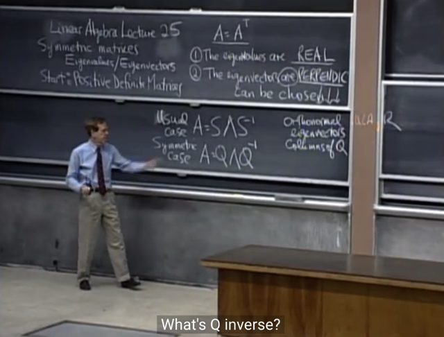</kbd>

> [!NOTE]
> Đúng vậy, S lúc này trở thành Q - **ORTHOGONAL matrix**
> (**SQUARE** matrix và có các **ORTHONORMAL COLUMNS**)
>
> Review lại: Không phải cứ có các columns orthonormal
> (orthogonal và unit length) là trở thành orthogonal matrix, 
> mà phải là square matrix, đương nhiên khi đó matrix sẽ
> fullrank)
>
> Trong sách gs có **chứng minh tại sao Symmetric matrix lại
> có orthogonal eigenvectors:**
>
> Gọi x, y là eigenvector của A với eigenvalue tương ứng là
> lambda1, lambda2:
>
> Ax = λ1x; Ay = λ2y
>
> Ta sẽ tính dot product của λ1x với y:
>
> (**λ1x)Ty** = (Ax)Ty (vì Ax = λ1x)
>
> = xTATy ((Ax)T = xTAT)
>
> = xTAy (vì AT=A do symmetric)
>
> = xTλ2y (do Ay = λ2y)
>
> = λ2**xTy** (đưa λ2 lên trước vì là scalar)
>
> Vậy **λ1xTy = λ2xTy, mà λ1 khác λ2 do ta đang assum hai 
> eigenvalue khác nhau. Vậy suy ra xTy = 0 => x,y vuông góc**

> [!NOTE]
> Với Symmetric matrix, S (matrix các eigenvectors) lúc
> này trở thành Q - ORTHOGONAL matrix

 

<kbd>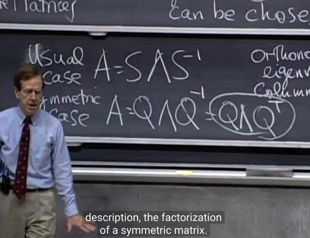</kbd>

> [!NOTE]
> Và như ta đã biết với orthogonal matrix, **Q inverse** chính là
> **Q transpose (*)**, Từ đó ta có **A = QΛQT**
>
> gs cho rằng đây chính là **công thức nổi tiếng** của Linear
> Algebra
>
> Và dễ hiểu rằng **khi nào ta có một matrix A thỏa A = QΛQT**
> thì ta cũng có thể **suy ra nó symmetric**, đơn giản bằng
> cách tính**AT** = (QΛQT)T = [(QΛ)QT]T = (QTT)(Q.Λ)T
> Q(ΛTQT) = **QΛQT = A**
>
> (dùng (AB)T = BTAT và ΛT = Λ, diagonal matrix, đương nhiên
> cũng symmetric)
>
> ===
>
> (*): Ôn lại nhanh, là vì với Q, các columns **orthogonal** và
> **length bằng 1**. Nên **QTQ = QQT = I** (các columns dot
> product với chính nó thì bằng norm = 1, còn dot product với
> khác nó thì thành 0 do perpendicular) => **QT chính là Q_inv**

> [!NOTE]
> Và vì với orthogonal matrix thì
> QT = Qinv nên A = QΛQT

 

<kbd>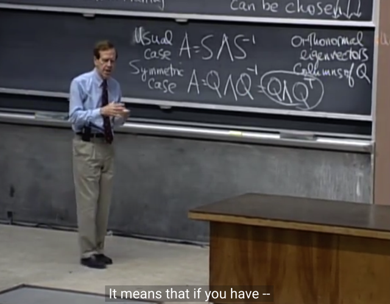</kbd>

> [!NOTE]
> Và đây chính là **SPECTRUM THEOREM**.
>
> Có cái tên như vậy (spectrum = **quang phổ**) ý là giống như
> trong quang học ta có thể **phân tách một chùm ánh sáng
> trắng** thành một **dải các màu "nguyên chất" (pure)** thì đây
> cũng vậy, hiểu nôm na là ta **phân tách matrix A thành các
> eigenvector** mà các **eigenvector này orthonormal**, có thể
> hiểu là "pure thing" đối với matrix.

> [!NOTE]
> SPECTRUM THEOREM

 

<kbd>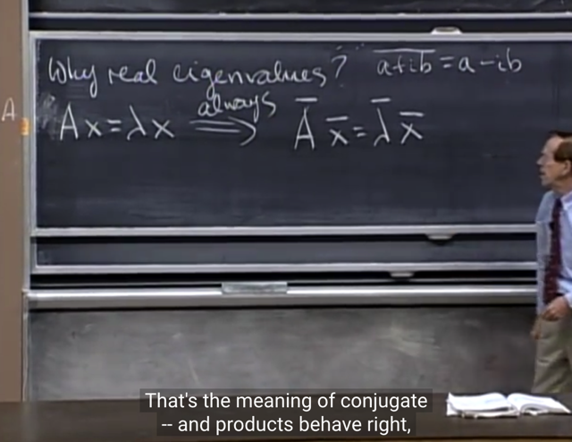</kbd>

🔗 **Related:** [LECTURE 25: SYMMETRIC MATRICES AND POSITIVE DEFINITENESS](untitled.md#node-925)

> [!NOTE]
> ở đây gs nói về một khái niệm mà ta sẽ cần nhớ lại, hay bổ
> sung đó là **Số phức liên hợp** (**conjugate**).
>
> Một cách ngắn gọn nhất thì **conjugate của một complex**
> number (chú ý, số thực real number và số ảo imaginary
> number đều là subset của complex number - là số có phần
> real và phần imaginary) a, LÀ MỘT SỐ PHỨC KHÁC mà
> khi nhân với nó sẽ cho ra**tổng bình phương của phần
> thực và phần ảo** - chính là **bình phương của modulus
> của complex number**
>
> Ví dụ **a = u + v*i**, thì conjugate của a là **u - v*i** để rồi
>
> a*(conjugate of a) = (u + v*i)(u - v*i) 
>
> = u^2 - (v*i)^2 
>
> = u^2 - (v^2)*(i^2) 
>
> = u^2 - v^2(-1)  (i^2 = -1)
>
> = **u^2 + v^2 chính là square của modulus.**

 

<kbd>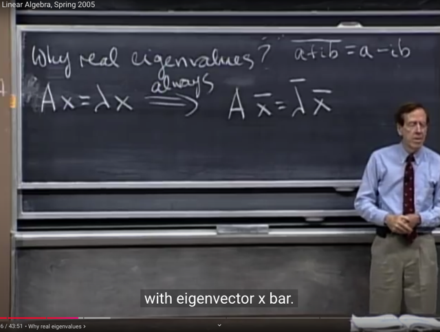</kbd>

> [!NOTE]
> Có thể ta sẽ chấp nhận điều mà gs nói ở đây:
>
> Nếu **Ax = λx** thì phương trình này **cũng đúng khi
> dùng conjugate** của mọi cái: A, x, λ
>
> Tức là A_conj x_conj = λ_conj * x_conj , có nghĩa là
>
> Và vì A đang xét là real **matrix**, nên A_conj = A
>
> (ý là matrix A cũng có conjugate vì như đã nói số thực là
> subset của một tập hợp lớn hơn - complex number,
> nhưng số thực thì đương nhiên coi như số phức với phần
> ảo = 0, nên conjugate của nó cũng là chính nó)
>
> A x_conj = λ_conj * x_conj
>
> Và phương trình này nói rằng, với **real** matrix, **nếu x,
> λ là eigenvector và eigenvalue** của A thì**x_conj, λ_conj
> cũng là eigenvector và eigenvalue** của A. Dĩ nhiên khi
> đó x_conj, λ_conj có thể là complex value.
>
> Nói thêm ở trong sách có một ví dụ cho thấy real matrix A, có
> hai eigenvalue là conjugate của nhau cũng như hai eigenvector
> cũng là conjugate của nhau.

> [!NOTE]
> Nếu matrix A REAL: có eigenvector x, eigenvalue λ thì
> conjugate của x, conjugate của λ cũng là eigenvector
> và eigenvalue của A

 

<kbd>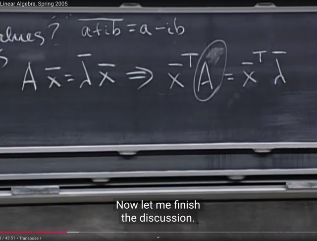</kbd>

 

<kbd>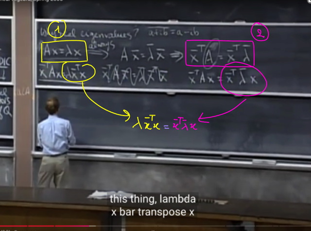</kbd>

<kbd></kbd>

<kbd>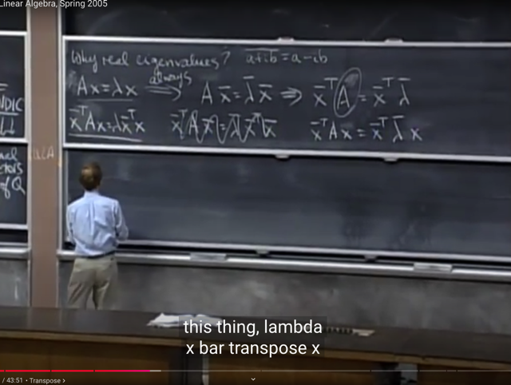</kbd>

> [!NOTE]
> Thế thì: 
>
> i) Từ Ax = λx, nhân hai vế (vào bên trái) với (**x_conj)T**,
>
> Đương nhiên, vì x_bar, hay x_conj cũng là vector, chỉ
> là các component của nó đổi dấu phần ảo của component
> tương ứng của x. Nên nhân vào hai vế ý là ta dot product
>
> ta có:
>
> Ax = λx****<=>**(x_bar)T**Ax = **(x_bar)T**λx
>
> ii) Từ (x_bar)TA = (x_bar)T(λ_bar)
>
> nhân hai vế cho x (vào bên phải):
>
> (x_bar)TA**x** = (x_bar)T(λ_bar)**x** 
>
> <=> (x_bar)TAx =****λ_bar(x_bar)T**x**(dời λ_bar lên trước)
>
> <=> (x_bar)Tλx = λ_bar(x_bar)Tx (Ax = λx)

> [!NOTE]
> Nếu matrix A, REAL & **SYMMETRIC** THÌ
> EIGENVECTOR VÀ EIGENVALUE CŨNG REAL, khi đó
> đương nhiên x_conj và lambda_conj cũng bằng chính nó

 

<kbd>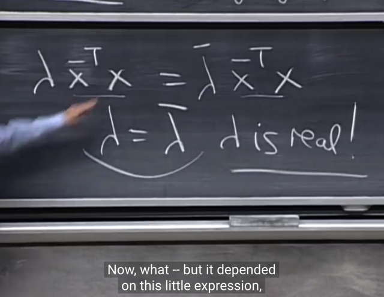</kbd>

> [!NOTE]
> Từ đó, ta có:
>
> (x_bar)Tλx = λ_bar(x_bar)Tx
>
> <=> λ(x_bar)Tx = λ_bar(x_bar)Tx
>
> vì (**x_bar)Tx** (chính là norm của xTx) **khác 0** (gs nói ta sẽ
> nói cái nay sau) 
>
> Chia hai vế cho (x_bar)Tx ta có: **λ** = **λ_bar**
>
> Và từ đó, ta có thể kết luận**λ là real number: đối với
> symmetric real matrix, eigenvalues là số thực**

 

<kbd>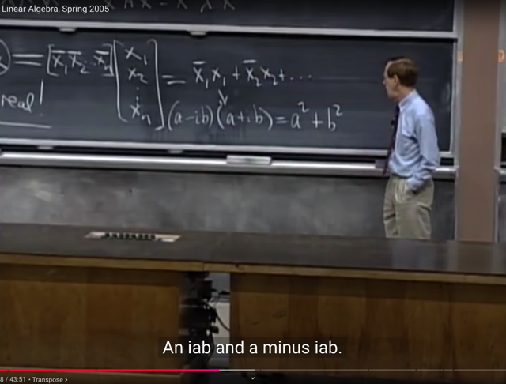</kbd>

🔗 **Related:** [LECTURE 25: SYMMETRIC MATRICES AND POSITIVE DEFINITENESS](untitled.md#node-920)

> [!NOTE]
> Thế thì ta sẽ xem xét **x_barTx**: Nhắc lại **x_bar** là
> **vector** mà **mỗi component** là **conjugate của các
> phần tử** tương ứng **của** **x**
>
> (**conjugate** là khái niệm nhắc lại lần nữa, nếu một
> **complex number** n = a + b*i thì conjugate của nó là
> n_bar = a - b*i, tức là nó **đổi dấu của phần ảo, và cũng
> dễ hiểu với số thực, tức không có phần ảo thì lấy gì đổi
> dấu, thì conjugate của số thực cũng là chính nó**)
>
> tức **x_bar** (conjugate of x) là vector: **[x1_bar, x2_bar....]**
>
> Vậy **x_barTx** là dot product của hai vector:
>
> Đương nhiên là = **x1_bar*x1** + **x2_bar*x2** + ....
>
> và **x1_bar*x1** chỉ còn **tổng bình phương của các real
> part** như lúc nãy đã nói, không còn phần ảo (imaginary)
> nữa
>
> Và từ đó cho ta **kết luận là x_barTx dương** (? không âm thì
> đúng hơn chứ, vì norm vector có thể bằng 0), và **ta
> có thể cancel out hai vế**

 

<kbd></kbd>

> [!NOTE]
> Và ta sẽ gặp lại trong bài sau về việc
> deal với complex number

 

<kbd>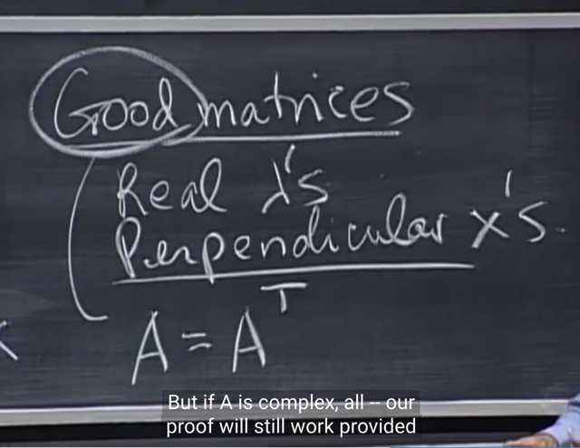</kbd>

> [!NOTE]
> Đầu tiên **good matrix** là matrix **real** và **symmetric**
> cho phép**A = AT**

 

<kbd>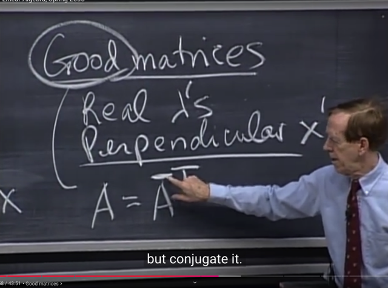</kbd>

> [!NOTE]
> Nhưng gs cho biết nếu **symmetric**, thì dù A có là
> matrix complex value thì A cũng bằng **A_conj** luôn

 

<kbd>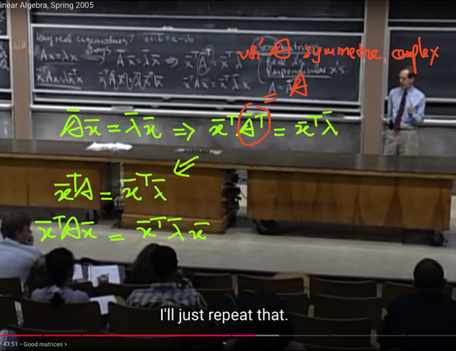</kbd>

> [!NOTE]
> Thành ra vẫn có được quá trình suy luận hồi nãy để kết
> luận **đối với symmetric matrix, eigenvalue là real number**

 

<kbd>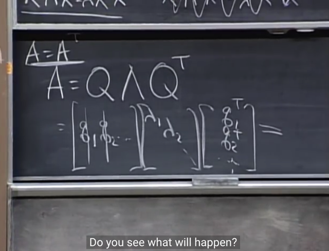</kbd>

> [!NOTE]
> tiếp theo, gs viết lại điều ta có hồi nãy nhờ A symmetric: 
>
> **A = QΛQT**
>
> Và ta nhớ Q chính là S - matrix các **eigenvectors**, chẳng
> qua khi A symmetric, **các eigenvectors trở nên orthogonal**và unit norm, khiến cho S trở thành orthogonal matrix Q.

 

<kbd>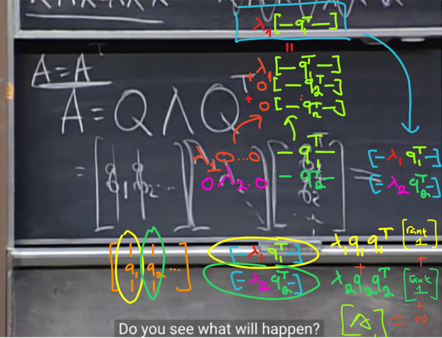</kbd>

> [!NOTE]
> Và ta có thể triển khai ra để thấy, đầu tiên là **ΛQT**:
>
> Hãy nhớ "**góc nhìn row**", **nhân một row** **với một matrix**thì sẽ
> là thực hiện linear combination của các row của matrix, với coefficients
> là các components của row vector.****Ở đây các row vector là các row của của Λ. Ví dụ nhân **row đầu tiên
> của Λ**, là **[λ1, 0,.. 0] với matrix** QT có các rows là q1T, q2T...)
>
> Kết qủa sẽ**là một row mới**: là λ1q1T + 0q2T+...0qnT = **λ1q1T**,
> chính là **row đầu tiên của ΛQT**
>
> Vậy đây chính là nó **CHỈ** **LẤY ROW 1** của QT, **CHÍNH LÀ
> EIGENVECTOR THỨ 1 CỦA A**, và **SCALE NÓ VỚI λ1**để hàng
> thứ 1 của ΛQT sẽ là λ1q1T
>
> Tương tự row thứ 2 của Λ khi nhân với QT, sẽ có kết quả là nó sẽ
> **CHỈ LẤY ROW 2** của **QT, CHÍNH LÀ EIGENVECTOR THỨ 2 CỦA
> A**, và **SCALE NÓ BỞI λ2** để hàng thứ 2 của ΛQT sẽ  là λ2q2T
>
> Và các row vector tiếp theo (của matrix Λ) cũng tạo nên các linear
> combination của các QT's row, để làm thành các row tiếp theo của
> matrix kết quả.
>
> Dễ thấy sẽ lần lượt là λ2q2T, λ3q3T...
>
> Và kết quả này giống y như **nhân từng mỗi row của QT với
> eigenvalue tương ứng** vậy.
>
> ===
>
> Tiếp kết quả đó (matrix ΛQT) khi nhân với Q: Q(ΛQT) ta sẽ nhân  theo
> kiểu**từng cột của Q** nhân với **từng hàng của ΛQT**, cho ra **các
> rank 1 matrix**: λ1.**q1q1T**, λ2.q2q2T...
>
> Và **tổng các rank 1 matrix này lại** sẽ là kết quả là matrix A

 

<kbd>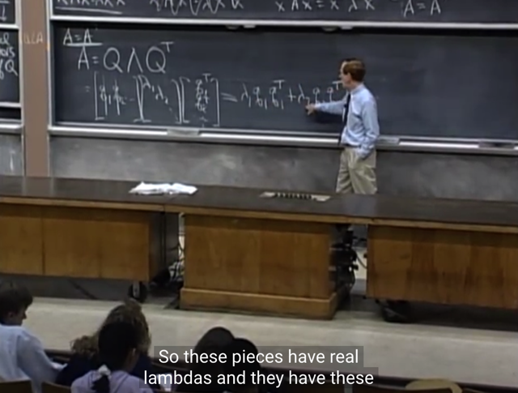</kbd>

> [!NOTE]
> Thế thì gs nhắc ta nhớ rằng, matrix **q1q1T** **CHÍNH LÀ**
> **PROJECTION MATRIX** giúp **project lên vector q1**
>
> Ta nhớ lại công thức của projection matrix lên vector a
> là P = aaT/aTa (lập luận nhanh: aTe = 0 <=> aT(b-p) =
> 0 <=> aT(b-ax) = 0 <=> aTb - aTax = 0 <=> x = aTb/aTa
> => p = ax = aaTb/aTa =Pb => P = **aaT/aTa**)
>
> mà **q đã là unit norm** nên đương nhiên **qTq = 1**, thì
> thành ra **q1q1T** **chính là q1q1T/q1Tq1**, và là projection
> matrix lên vector q1.
>
> tương tự **q2q2T** chính là **Projection matrix giúp project
> lên q2..**.
>
> Gs kiểm tra lại tính chất P^2 = P của các projection
> matrix này: (q1q1T)^2 =  q1q1T q1q1T = q1 (q1Tq1)
> q1T = q1q1T -> thỏa tính chất này vì (q1Tq1) = 1

 

<kbd>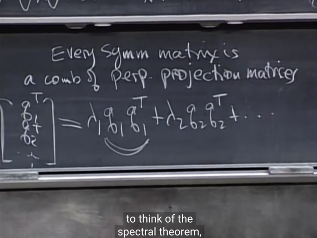</kbd>

> [!NOTE]
> từ đó ta thấy **mọi symmetric matrix** đều có thể phân
> tách thành c**ombination** của các **PERPENDICULAR
> PROJECTION MATRIX**.
>
> Ý nói các projection matrix này giúp **project lên các
> vector q perpendicular nhau.**Và từ đây giúp hiểu rằng: Giả sử khi nhân matrix 
> A có tính chất trên với vector x: Ax. Thì ta sẽ có
>
> Ax = QΛQTx  = (λ1q1q1T + λ2q2q2T + ..)x
>
> = λ1q1q1Tx + λ2q2q2Tx + ..
>
> Thì **λ1q1q1Tx** cho ta **vector projection của x lên q1**, 
> sau đó **scale với λ1**
>
> Tương tự**λ2q2q2Tx** cho ta **vector projection của x lên
> q2**, sau đó **scale với λ2**.
>
> tiếp tục như vậy để rồi hiệu quả Ax sẽ giống như ta tách
> x thành tổng các hình chiếu của nó lên các eigenvector của
> A sau khi đã scale bởi eigenvalue

> [!NOTE]
> mọi symmetric matrix đều có thể phân tách thành
> combination của các PERPENDICULAR
> PROJECTION MATRIX.

 

<kbd>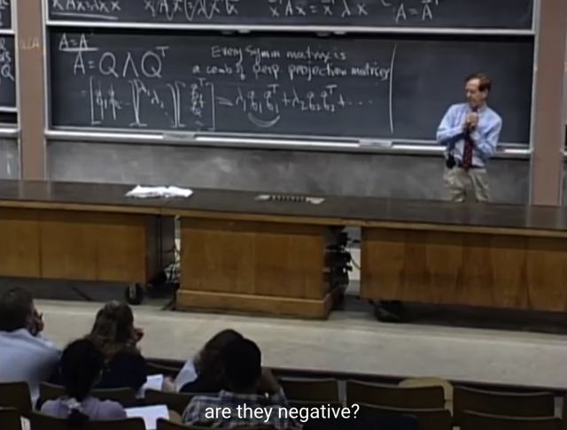</kbd>

> [!NOTE]
> Sau đó gs nói về việc tìm eigenvalue của một matrix 50x50,
> trong vài chục năm trước là không thể nếu tính bằng tay. Và
> hiện nay dù có thể dùng mathlab để solve characteristic
> function thì gs cho biết mathlab cũng sẽ complain (ý nói nó
> tính cũng sẽ rất chậm) đồng thời kết quả cũng không đáng tin.

 

<kbd></kbd>

> [!NOTE]
> Tuy nhiên gs cho biết **mathlab** sẽ rất **dễ dàng thực
> hiện elimination** để**tìm ra các pivots**.
>
> Đương nhiên, **các pivots không phải là eigenvalue của A**(trừ khi A là triangular matrix),  nó **chỉ là eigenvalue của
> U** thôi
>
> Nhưng ta sẽ biết một sự thật rất hữu ích đó là **DẤU
> CỦA PIVOT, SẼ** **CÙNG DẤU CỦA EIGENVALUE**Hay nói cách khác, từ các pivot (là eigenvalue của U),
> **ta sẽ biết có bao nhiêu eigenvalue của A là dương và
> bao nhiêu là âm**. Từ đó**thu hẹp phạm vi tìm kiếm** các
> eigenvalue

> [!NOTE]
> VỚI SYMMETRIC MATRIX **DẤU CỦA PIVOT**, SẼ **CÙNG
> DẤU CỦA EIGENVALUE**

 

<kbd>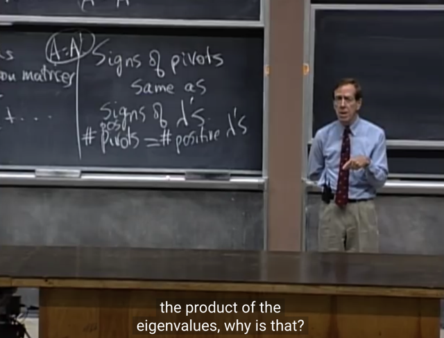</kbd>

> [!NOTE]
> gs nói rằng **không ai lẫn lộn rằng các pivots (của U) là 
> eigenvalue của A** cả, nhưng ta có thể**tính tích các 
> pivots và nó chính là tích các eigenvalue của A**. 
> Gs hỏi là tại sao?
>
> me: là bởi **với triangular matrix, các entry trên đường chéo
> chính là các eigenvalues** (và nó cũng chính là các pivot, vì
> luôn đang chỉ nói về square matrix). Do đó tích của chúng
> đương nhiên chính là tích các eigenvalue, và nó cũng **chính là
> determinant**.
>
> Mà ta cũng lại biết rằng **quá trình elimination không thay đổi
> giá trị tuyệt đối của determinant** (có đổi thì chỉ là đổi dấu do
> trong quá trình nếu có bước row exchange thôi)
>
> Vậy det A  = +/- det U = tích các pivots, và dĩ nhiên **det A
> cũng là tích các eigenvalue của A.**

> [!NOTE]
> Eliminate A thành U, **TÍCH CÁC PIVOT CỦA U** (cũng là
> eigenvalues của U), là **DETERMINANT** thì vì elimination
> không thay đổi trị tuyệt đối của det, nên đó cũng là
> det A, và chính là **TÍCH CÁC EIGENVALUES CỦA A**

 

<kbd>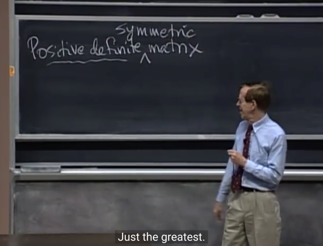</kbd>

> [!NOTE]
> Thế thì gs cho rằng nếu ta đã nói **SYMMETRIC** matrix là
> **GOOD** matrix, thì **POSITIVE DEFINITE SYMMETRIC**
> matrix thì là **EXCELLENT** matrix

 

<kbd></kbd>

> [!NOTE]
> Với POSITIVE DEFINITE MATRIX, **MỌI EIGENVALUE
> ĐỀU POSITIVE**, và **MỌI PIVOT CŨNG POSITIVE**
>
> Gs cho một ví dụ và thấy pivots của nó (đưa matrix về U)
> và eigenvalue của nó (solve characteristic equation) đều
> POSITIVE

> [!NOTE]
> Với POSITIVE DEFINITE MATRIX, MỌI EIGENVALUE
> ĐỀU POSITIVE, và MỌI PIVOT CŨNG POSITIVE

 

<kbd></kbd>

> [!NOTE]
> Và phát biểu thứ 3 về **POSITIVE DEFINITE SYMMETRIC**:
> Mọi "**SUB DETERMINANTS" ĐỀU POSITIVE** ý là, nếu
> nói positive definite Symmetric matrix có determinant
> positive thì không đúng
>
> Vì có thể có matrix như [[-1 0] [0 -3]], vẫn symmetric, và
> positive det nhưng các eigenvalue và pivot đều âm.
>
> Nên thay vào đó, phát biểu rằng với Positive Definite
> matrix thì determinants của các sub-matrices đều positive
> thì sẽ đúng

 

<kbd>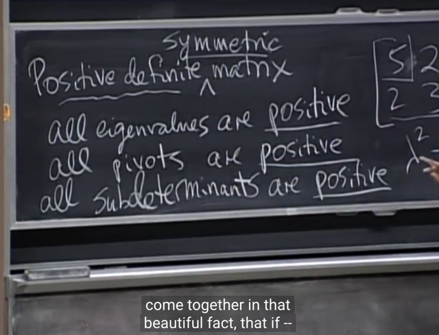</kbd>

> [!NOTE]
> và hai bài sau ta sẽ
> tổng hợp hết lại

 

